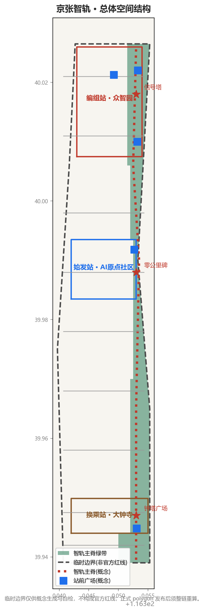
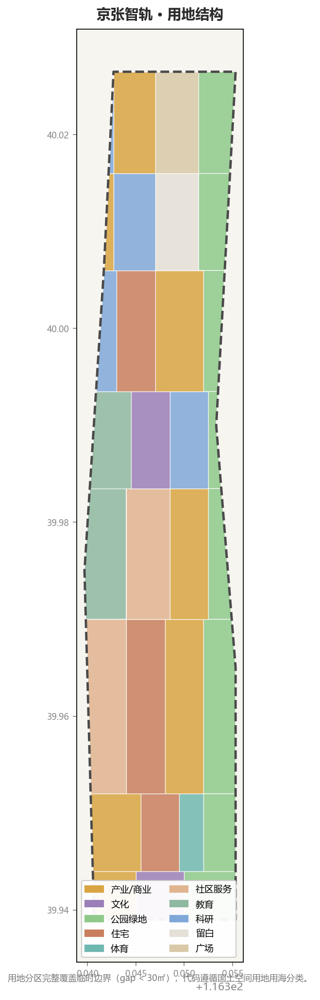
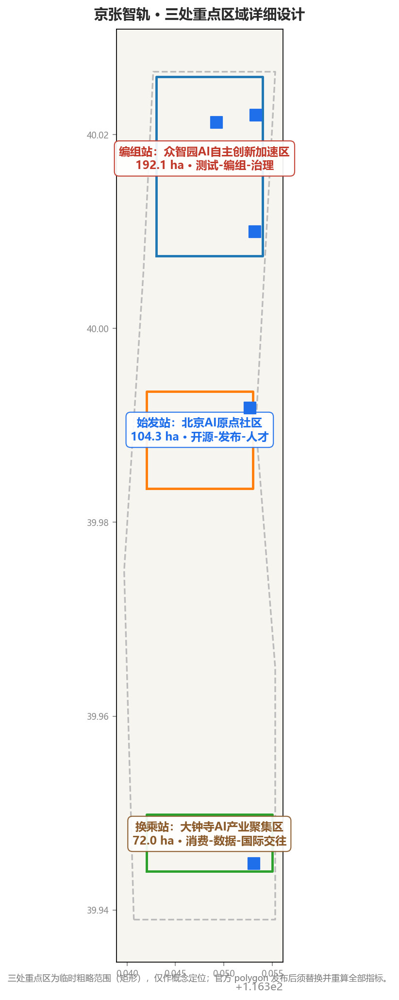
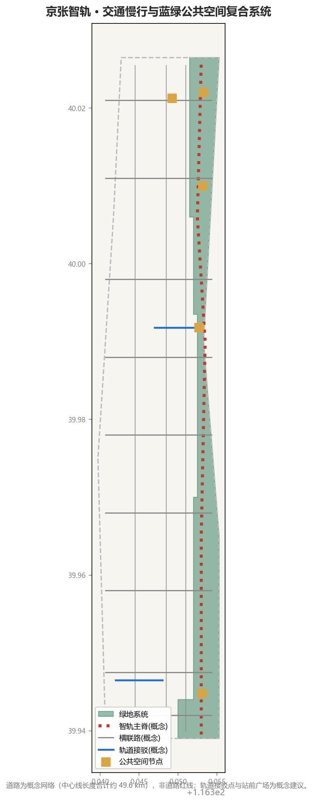
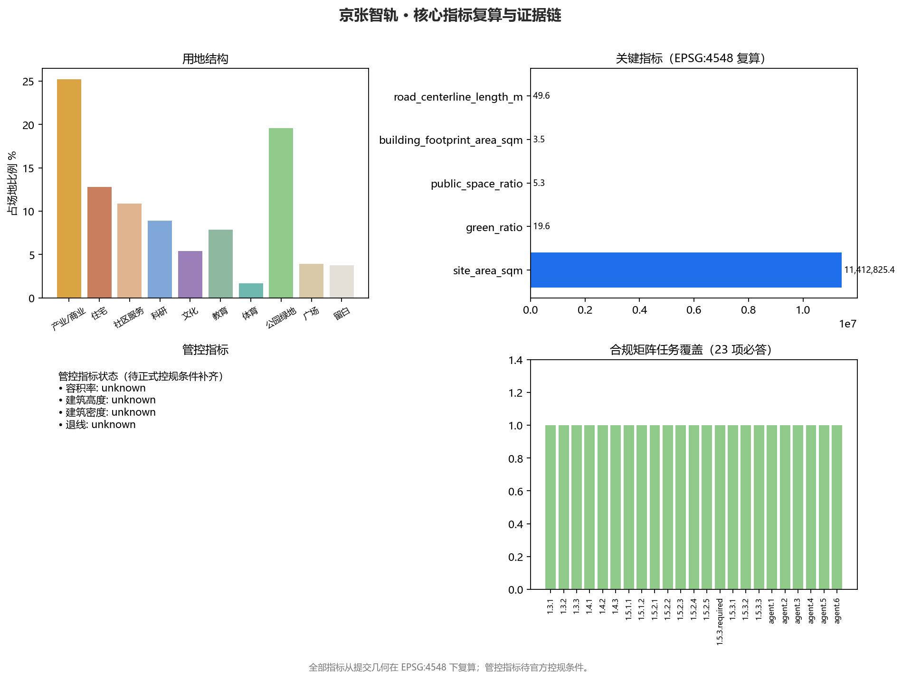

# SILICON IRONWAY: An AI Innovation Belt on a Century-Old Railway

> Belt name: **京张智轨** (English: **SILICON IRONWAY**)
> One sentence: In 1909, the Chinese built the Jing-Zhang Railway on their own; today, this track is to become the railway of China's self-reliant AI innovation. The Ironway is not a railway label pasted onto AI, but the railway spirit — self-reliance, discipline, punctuality, stoppability — turned into the public protocol of an AI innovation belt.

In 1909, Zhan Tianyou designed the "zig-zag" (人字形) switchback to cross the Badaling mountains, completing China's first trunk railway designed and built independently by Chinese engineers. A century later, along this very track, China's most important AI industry belt is emerging. This proposal translates the operating grammar of the Jing-Zhang Railway — trunk line, stations, switches, signals, milestones — into the urban-design grammar of the AI Innovation Belt: the **Ironway Spine** carries slow mobility and public life, **three stations** anchor three stages of AI innovation (origin, marshalling, transfer), **two wings** provide services and testing, **switch points** stitch back together the east and west sides severed by the railway for a century, and **signals** make the status, responsibility, and stop switches of AI services visible to the public like railway signals. This is a track that people can see, question, and stop.

## Design Basis and Source List

The first basis of this proposal is the Pre-Qualification Announcement for the International Urban Design Competition for the Centennial Jing-Zhang AI Innovation Belt, issued by the Haidian Branch of the Beijing Municipal Commission of Planning and Natural Resources. It defines the 43.6 km² coordinated research scope, the 11.4 km² overall design scope, the 368.4 ha key detailed-design area, the three positionings (Centennial Jing-Zhang Cultural Belt, Metropolitan AI Life Experience Belt, AI-Integrated Innovation Belt), and the design tasks [source:OFFICIAL-ANNOUNCEMENT] [standard:PROJECT-OFFICIAL-ANNOUNCEMENT]. The second basis is the open-call taskbook for global agents, which defines six mandatory tasks (agent.1–agent.6), five functions, the three-areas-two-wings structure, and the boundary clause that "all spatial landing suggestions are conceptual suggestions and do not replace formal planning" [source:AGENT-TASKBOOK] [standard:PROJECT-AGENT-OPEN-CALL-TASKBOOK].

**Honest statement about boundaries**: No downloadable, coordinate-verifiable official redline is publicly available. This proposal uses the repository-registered provisional boundary as the generation basemap, inferred from the announcement's text four-to, road names, and approximate areas, calibrated in EPSG:4548 [source:BOUNDARY-SOURCE] [data:geometry/site_boundary.geojson#SITE-001]. The three key areas are likewise provisional [source:KEY-AREA-SOURCE] [data:geometry/key_areas.geojson#PROV-KEY-001]. All such geometry is flagged `official_boundary=false` and `geometry_role=provisional_constraint`, used only for concept generation, visualization, and self-check — never as an official redline, approval basis, or precise-area basis. When official polygons are published, land use, roads, green space, public space, buildings, phasing, and all metrics must be recalculated as a full chain [depth:existing_conditions_diagnosis].

Sources are used by grade: records marked `usable_for_formal` in `data/source_registry.json` support scope, task, and standard judgments; `provisional_only` boundaries are used only for generation and display [source:SOURCE-REGISTRY]. Regulatory conditions referenced by this proposal (FAR, height, density, setbacks, road redlines) are all missing from public sources and are recorded as `status=unknown`; the text uses "pending official regulatory conditions" instead of fabricated values [source:SITE-PACKAGE].

## Three-Level Scope Framework

The three levels answer three different questions [depth:three_level_scope_framework].

**The 43.6 km² coordinated research scope** answers "why here": why can a century-old railway corridor become China's AI innovation belt? Our answer: because the Jing-Zhang Railway itself was China's first "self-reliant innovation" public works project. The coordinated level organizes the innovation chain — university incubation, open-source collaboration, enterprise transformation, public experience, international communication — and finds spatial carriers for AI governance discourse.

**The 11.4 km² overall design scope** answers "how to organize": the proposal gives the "one spine, three stations, two wings" spatial skeleton — an Ironway slow-mobility spine along the Jing-Zhang Heritage Park, three key areas as stations, the Zhongguancun Technology Service Wing and Xiaoyue River Scenario Empowerment Wing as two wings, with switch points stitching east and west [depth:overall_spatial_structure]. The recalculated site area is 11.41 km², consistent with the announced ~11.4 km² [metric:site_area_sqm].

**The 368.4 ha key detailed-design area** answers "what first": the three key areas take three stages of AI innovation — the AI Origin Community is the "Origin Depot" (start and release of outcomes), Zhongzhiyuan is the "Marshalling Station" (testing and marshalling of innovation), Dazhongsi is the "Transfer Hub" (conversion of business forms and consumption). The recalculated provisional areas are 192.1, 104.3, and 72.0 ha, all within 0.5% of announced values [metric:key_area_total_sqm] [metric:key_area_zhongzhiyuan_ai_acceleration_area_sqm].

The relationship between levels is one-way with feedback: coordinated judgments determine the overall skeleton; the skeleton determines key-area actions; problems exposed at the key-area level (e.g., special land requirements of test scenarios) feed back to revise upper-level judgments. Currently unavailable survey data (buildings, ownership, utilities, rail) are recorded in the pending list, not filled by speculation [depth:risk_missing_data].

## Coordinated Research Scope: Industry and Future-City Research

### Judgment 1: The "self-reliance" of the Jing-Zhang Railway is the historical motif of China's AI innovation

The uniqueness of the Jing-Zhang Railway lies not in engineering per se but in "self-reliance" — financing, survey, design, and construction were all completed by Chinese engineers, with Zhan Tianyou's zig-zag alignment overcoming topographic limits. This historical fact echoes today's AI self-reliance agenda (own models, own compute, own standards) across a century [source:OFFICIAL-ANNOUNCEMENT]. The proposal builds the belt's naming and narrative on this echo: **京张智轨** (Silicon Ironway) — both "the intelligent track" and "the self-reliant track."

### Judgment 2: The AI innovation belt needs "railed" industrial organization

Railways are efficient because they have clear tracks, stations, and timetables. The AI innovation ecosystem needs the same organization: R&D needs a place to "depart," testing needs a place to "marshal," applications need a place to "transfer." Global experience validates this organizing logic — eight global AI innovation ecosystem cases offer transferable mechanisms [source:AGENT-TASKBOOK]:

| Case | Location | Transferable mechanism |
| --- | --- | --- |
| Silicon Valley–Stanford synergy | California, USA | Spatial adjacency of university incubation and industry incubation; transformation corridor |
| Boston Kendall Square | Massachusetts, USA | Knowledge-district renewal around a transit node |
| Punggol Digital District | Singapore | Open digital platform connecting the district with universities; testable digital base |
| King's Cross regeneration | London, UK | Fusion of heritage protection and innovation uses in a railway-heritage district |
| West City Sci-Tech Innovation Corridor | Hangzhou, China | Provincial corridor-plus-node organization |
| Zhangjiang Science City | Shanghai, China | Spatial coupling of big-science facilities and industrial clusters |
| Nanshan Science Park | Shenzhen, China | Renewal path from electronics manufacturing to soft-hard ecosystem |
| Marunouchi redevelopment | Tokyo, Japan | Transit-hub-driven continuous renewal and operation of business districts |

The common thread: organizing innovation ecosystems as **enterable, testable, expandable** spatial systems rather than scattered buildings. The Silicon Ironway localizes this logic as the "one spine, three stations, two wings" rail system [depth:overall_spatial_structure].

### Judgment 3: The "visibility" of AI governance is the belt's scarcest competitive asset

The world is building AI parks, but few cities make "how a person sees and stops a running urban AI system" into visible public space. The Jing-Zhang Railway's signaling system provides the ready metaphor: **signals make train status visible to everyone**. This proposal introduces the "Ironway Signal Protocol" — the running status, data boundaries, responsible parties, human-review mode, and stop switch of AI public services along the belt, publicly displayed with a unified signal identity. This is where the announced "global discourse on AI governance" function can differentiate [source:AGENT-TASKBOOK].

**Regional synergy**: In the north, Zhongzhiyuan connects via the Fifth Ring Road and Qinghe to the Beixiu Community, Future Science City, and Huairou Science City R&D resources; in the south, Dazhongsi connects via rail to the central city's consumption and business markets; the west wing (Zhongguancun Technology Service Wing) handles capital, IP, and factor allocation; the east wing (Xiaoyue River Scenario Empowerment Wing) handles outdoor testing and scenario incubation. At the Jing-Jin-Ji level, cross-regional coordination of compute, energy, and data falls under industrial authority; this proposal only reserves spatial interfaces and makes no resource-allocation conclusions.

**Future city form**: "One track, three interfaces" — the spine is the public-life interface (slow mobility, culture, exchange), the three stations are the innovation-service interface (R&D, testing, release, consumption), the two wings are the industry-city interface (services, testing, living).

## Overall Design Scope: Urban Renewal at Regulatory-Plan Urban Design Depth

### Overall concept and naming system

**Primary name**: 京张智轨 (SILICON IRONWAY). "智轨" is a double entendre: the intelligent track — AI innovation factors flow along the belt; the self-reliant track — continuing the self-reliant innovation motif of the Jing-Zhang Railway. "Silicon Ironway" creates an internationally readable counterpart to Silicon Valley while retaining the railway root through "Ironway."

The naming system draws entirely from Jing-Zhang Railway operating vocabulary, giving it historical roots and international readability [depth:overall_spatial_structure]:

| Term | Jing-Zhang prototype | Spatial content |
| --- | --- | --- |
| Ironway Spine | Main line | North-south slow-mobility spine along the Jing-Zhang Heritage Park carrying public life and AI public experience |
| Origin Depot | Starting station | AI Origin Community: start of outcomes, open-source release, talent zone |
| Marshalling Station | Marshalling yard | Zhongzhiyuan: pilot testing, marshalling, testing, standards governance |
| Transfer Hub | Interchange station | Dazhongsi: business switching, AI-native consumption, international exchange |
| Switch Point | Switch | East-west stitching points reconnecting the two sides severed for a century |
| Signal Cabin | Signal box | Zhongguancun Technology Service Wing: factor allocation and AI governance signal center |
| Test Track | Test line | Xiaoyue River Scenario Empowerment Wing: outdoor test and validation scenarios |
| Milestone | Milestone | Honor display and contributor record system along the belt |

**Visual identity and logo direction**: The motif is Zhan Tianyou's zig-zag ("人"-shaped) alignment — two lines diverge from one point, meet at a turning point, and diverge again; embedding the "人" into a rail cross-section (two parallel lines) and circuit traces (right-angle turns) yields three layers of meaning: the historical wisdom of the zig-zag alignment, the "people-first" governance stance, and the urbanization of AI circuitry. The mark extends across the system: the three stations each take one node of the "人" as sub-marks; the two wings take the parallel lines as wing marks. The color system follows Jing-Zhang signal colors: rail grey (infrastructure), Jing-Zhang green (century culture), signal red (stop / human intervention), Ironway blue (AI innovation), heritage ochre (historical memory). Fonts, images, and trademarks must be redistributable or self-made; no unauthorized use of others' identities [depth:height_massing_character].

### Spatial structure: one spine, three stations, two wings, switch stitching

**One spine**: The Ironway slow-mobility spine runs north-south along the Jing-Zhang Heritage Park; in this proposal it follows the corridor green belt (conceptual alignment pending official data) [metric:road_centerline_length_m] [data:geometry/roads.geojson#ROAD-001]. The spine connects the three stations, wing interfaces, and neighborhood communities; it is barrier-free throughout, with human-service points referencing Article 39 of the Barrier-Free Environment Law's human-fallback requirement for listed public service venues [standard:BARRIER-FREE-ENVIRONMENT-LAW].

**Three stations**: Origin Depot (AI Origin Community), Marshalling Station (Zhongzhiyuan), Transfer Hub (Dazhongsi). Each station contains four kinds of space: innovation service space (R&D/release/testing/consumption), a public square (station forecourt fixed before buildings), a signal-identity node (public display of AI service status), and supporting services (talent apartments, community services, transfer connections) [data:geometry/public_space.geojson#PUBLIC-001].

**Two wings**: The west wing (Zhongguancun Technology Service Wing) handles capital, IP, legal, and intellectual-property factor services; the east wing (Xiaoyue River Scenario Empowerment Wing) handles outdoor testing, scenario incubation, and AI life experience. The wings connect to the spine via cross links [data:geometry/roads.geojson#ROAD-002].

**Switch stitching**: The railway severed this city east-west for a century. The proposal places pedestrian-priority east-west stitching points along the spine (conceptual) to reconnect daily life on both sides; the stitching points also serve as scenario interfaces and signal display nodes. Crossing forms (at-grade, ramp, or bridge) are engineering judgments for professional teams to determine with rail, municipal, and heritage conditions; this proposal makes no engineering conclusions.

### Urban renewal framework and city character

Renewal follows "renew along the spine, anchor by station": both sides of the spine renew first to form a continuous public interface; renewal projects cluster around the three stations. The character principle is "quiet track, distinct stations" — stations and landmarks may have identity; general blocks emphasize interface continuity and ground-floor activity, avoiding a single style across the whole belt [depth:height_massing_character]. Building height, density, and FAR are statutory regulatory matters; no approved control values exist in public sources. This proposal gives no control conclusions, using only conceptual massing to test the order of magnitude of spatial ideas [metric:building_footprint_area_sqm] [depth:development_intensity_controls].

## Key-Area Detailed Design

The three key areas follow one logic: fix the station forecourt and stitching points first, then functions and massing, then AI scenario access points and signal display positions [depth:three_key_area_detailed_design].

### Origin Depot: Beijing AI Origin Community (middle, 104.3 ha)

**Positioning**: The "zero kilometer" of a world-class AI innovation ecosystem — outcomes start here, talent departs from here [metric:key_area_beijing_ai_origin_community_sqm].

**Spatial actions**: (1) **Origin Square** — a public square at the core for open-source releases, outcome premieres, failure retrospectives, and public dialogue, flanked by cultural (0803) and education (0804) land [data:geometry/land_use.geojson#LU-013]. (2) **Near-campus transformation street** — incubation, display, legal, IP, and financing services for universities, anchored by education land with campus-park slow connections [data:geometry/roads.geojson#ROAD-004]. (3) **Talent zone services** — community service facilities land (0702) carrying talent apartments, community services, and bilingual services [data:geometry/land_use.geojson#LU-008].

**AI scenarios**: open-source release hall, near-campus transformation station, AI education experience point, talent service station.

**Pending data**: The area adjoins universities and existing communities; population, education, and medical facility baselines, and the implemented phase-one design boundary of the heritage park, must be re-verified when official data arrives [depth:existing_conditions_diagnosis].

### Marshalling Station: Zhongzhiyuan AI Self-Reliant Innovation Acceleration Area (north, 192.1 ha)

**Positioning**: The "marshalling yard" of the AI full-stack self-reliant innovation system and its governance center — innovation is tested, marshalled, and dispatched here [metric:key_area_zhongzhiyuan_ai_acceleration_area_sqm].

**Spatial actions**: (1) **Marshalling test field** — using the larger northern block scale, industrial (05) and research (0802) land organize repeatedly reconfigurable pilot-testing land, marshalling, test-running, and reviewing industrial test/validation scenarios like train cars [data:geometry/land_use.geojson#LU-021]. (2) **Qinghe innovation interface** — square land (1403) and green belt along Qinghe as the park's public living room and low-carbon innovation exchange space [data:geometry/land_use.geojson#LU-030]. (3) **Reserved land** — retained open land (16) for compute and test facilities, leaving choices open rather than writing uncertainty as certainty [data:geometry/land_use.geojson#LU-023].

**AI scenarios**: own-model test field, safety-governance exhibition hall, low-carbon compute experience point, standards-development workshop.

**Pending data**: Ownership, structure, and preservation value of existing plants and yards are key to the test field; they are not in public sources and require on-site professional verification [depth:retain_renovate_demolish].

### Transfer Hub: Dazhongsi AI Industry Cluster (south, 72.0 ha)

**Positioning**: The market end and south entrance of AI-native new business — AI transfers here into consumption, business, and urban life [metric:key_area_dazhongsi_ai_industry_cluster_sqm].

**Spatial actions**: (1) **Four-quadrant pedestrian connection** — pedestrian-priority connections around Dazhongsi station (conceptual), centered on the station forecourt (PUBLIC-001) stitching the intersection [data:geometry/public_space.geojson#PUBLIC-001]. (2) **AI-native consumption blocks** — commercial services land (05) hosting unmanned retail, embodied services, and content creation [data:geometry/land_use.geojson#LU-001]. (3) **Cultural hybrid** — cultural land (0803) carrying digital-asset display, content consumption, and a data-factor living room [data:geometry/land_use.geojson#LU-002].

**AI scenarios**: AI-native consumption street, data-factor living room, international roadshow living room, four-quadrant AI guide.

**Pending data**: Precise GIS boundaries of heritage protection areas and construction-control zones are unavailable; the position, massing, and materials of squares and structures must be confirmed with heritage authorities and professional teams. This proposal makes no specific engineering suggestion touching heritage controls in this area [depth:risk_missing_data].

## AI Innovation Ecosystem, Talent Personas, and AI+ Scenarios

### Ecosystem map

The Silicon Ironway AI ecosystem follows the "railed" logic: **Origin (Origin Community) — Marshalling (Zhongzhiyuan) — Transfer (Dazhongsi)** each plays its role; the two wings provide factor allocation and test scenarios; the spine provides public experience and exchange [source:AGENT-TASKBOOK]. Ecosystem elements map to space as follows:

| Ecosystem element | Spatial carrier | Layer evidence |
| --- | --- | --- |
| University incubation | Education land (0804) along the middle | [data:geometry/land_use.geojson#LU-013] |
| Open-source collaboration | Origin Community cultural land (0803) | [data:geometry/land_use.geojson#LU-014] |
| Enterprise transformation | Research land (0802) Zhongzhiyuan | [data:geometry/land_use.geojson#LU-021] |
| Test and validation | Reserved land (16) + Test Track wing | [data:geometry/land_use.geojson#LU-023] |
| Public experience | Ironway Spine + station forecourts | [data:geometry/public_space.geojson#PUBLIC-001] |
| Factor services | Zhongguancun Technology Service Wing (west) | [data:geometry/roads.geojson#ROAD-005] |
| Scenario incubation | Xiaoyue River Scenario Empowerment Wing (east) | [data:geometry/roads.geojson#ROAD-006] |

### User personas (5)

| Persona | Typical needs | Spatial response | Governance boundary |
| --- | --- | --- | --- |
| Open-source developer | Release, collaboration, testing, community reputation | Origin Square open-source release hall, public code wall, night collaboration space | No personal behavior tracking; event data aggregated only |
| Startup team | Low-cost office, compute access, product test field | Zhongzhiyuan shared test field, edge-compute service point, standards governance consulting | Compute and data services require separate authorization |
| Head-company visitor | Display, business, international reception, recruiting | Dazhongsi international roadshow living room, transit connections | Corporate identities and cases must be rights-cleared |
| Neighborhood resident | Commute, leisure, community services, low-impact renewal | Ironway spine slow ring, embedded community services, graded night lighting | No persona use for commercial recommendation |
| University faculty and students | Transformation, cross-campus collaboration, daily slow mobility | Campus-park slow stitching, transformation station, AI education experience | Campus data and research outcomes require authorization |

### AI scenario cards (12, including 3 industrial test/validation scenarios)

| No. | Scenario card | Spatial carrier | Users | Operator (concept) | Privacy / review boundary |
| --- | --- | --- | --- | --- | --- |
| 01 | Origin open-source release hall | Origin Community square area | Developers, university teams | Community operation platform + developer community | Event data aggregated only |
| 02 | Near-campus transformation street | Origin Community education land | Faculty, students, startups | Campus-industry platform | Research outcomes require authorization |
| 03 | Marshalling test field (industrial test/validation) | Zhongzhiyuan reserved and industrial land | AI firms, standards bodies | Test-field operator | Test data confidentiality graded |
| 04 | Safety-governance exhibition hall | Zhongzhiyuan research land | Public, regulators, firms | Governance body + exhibition operator | Display content must be rights-cleared |
| 05 | Test Track outdoor validation (industrial test/validation) | Xiaoyue River Scenario Empowerment Wing | Robotics, autonomous-driving firms | Scenario operator | Outdoor data anonymized |
| 06 | Signal Cabin governance sandbox (industrial test/validation) | Zhongguancun Technology Service Wing | Governance bodies, developers | Governance body | Sandbox data auditable |
| 07 | AI-native consumption street | Dazhongsi commercial land | Consumers, content creators | Commercial operator | No personal consumption profiling |
| 08 | Data-factor living room | Dazhongsi cultural land | Data firms, public | Data-trading service | Compliance and authorization prerequisite |
| 09 | Four-quadrant AI guide | Dazhongsi station forecourt | Visitors, residents | Station operator | Guide records anonymized immediately |
| 10 | Ironway spine AI slow-mobility navigation | Along the spine | All people | Public-space operator | No personal identification |
| 11 | AI life-services model street | Community-commerce interface | Residents, elderly | Community operator | Human-service fallback |
| 12 | Global AI week route | Belt public-space system | Global visitors, developers | Event operator | Follows event safety rules |

All AI scenarios follow data minimization, public-source, explainability, and human-review principles; AI services in public space must display the "Ironway Signal" identity disclosing running status, data boundaries, responsible parties, and stop methods, and must retain human-service channels [standard:GENERATIVE-AI-INTERIM-MEASURES] [standard:BARRIER-FREE-ENVIRONMENT-LAW]. For generative AI services, the Interim Measures' scope is applied as defined, without generalizing duties to all systems [standard:GENERATIVE-AI-INTERIM-MEASURES]. High-frequency elderly scenarios follow the policy orientation of running traditional and intelligent services in parallel [standard:ELDERLY-SMART-TECH-PLAN-2020-45].

## Land Use, Building Scale, and Retain/Renovate/Demolish/New-Build Logic

The land-use plan follows the Land and Sea Use Classification Guide for Territorial Spatial Survey, Planning, and Use Control, covering the full submitted boundary without gaps [standard:MNR-LAND-USE-CLASSIFICATION-GUIDE] [metric:land_use_area_total_sqm]. The structure is dominated by three categories: industry/research land (05, 0802), residential/community service (0701, 0702), and green/public space (1401, 1403): commerce and industry ~25.2%, residential and community services ~23.7%, green space ~19.6%, public space ~3.9%, education/culture/sports public services ~15.6%, reserved ~3.7% [metric:land_use_ratio_05] [metric:green_ratio].

Building massing is conceptual: 411 schematic footprints totaling ~3.51 million m² on developable land, used only to test the order of magnitude of spatial ideas [metric:building_footprint_count] [metric:building_footprint_area_sqm]. Retain/renovate/demolish uses a "retain-first, gradual renewal" logic: existing residential and community-service buildings (0701/0702 land) are retained; buildings on industry/research land are "renovatable"; reserved land (16) is new-build reserve — but all parcel-level conclusions require survey, ownership, and regulatory conditions; this proposal offers only the classification method, no parcel-level retain/renovate/demolish conclusions [depth:retain_renovate_demolish]. FAR, density, height, setbacks, and road redlines are missing from public sources and recorded as pending official regulatory conditions [metric:floor_area_ratio].

## Transport, Rail, Municipal, and Public Service Facilities

The transport plan is organized around "spine slow mobility + station connection + switch stitching" [depth:traffic_rail_slow_parking]:

- **Spine slow mobility**: the Ironway spine carries north-south slow mobility and public experience (conceptual alignment pending rail and road redlines) [data:geometry/roads.geojson#ROAD-001].
- **Cross-link network**: multiple east-west secondary roads and branches organize micro-circulation and stitch the blocks on both sides of the spine (conceptual) [data:geometry/roads.geojson#ROAD-002].
- **Rail connection**: connection and station forecourts are organized at Wudaokou, Dazhongsi, and other rail stations (conceptual) [data:geometry/roads.geojson#ROAD-014] [data:geometry/public_space.geojson#PUBLIC-002].
- **Parking and non-motorized**: shared-bicycle and transfer space reserved near stations (conceptual); specific parking supply and non-motorized parking facilities await transport studies.
- **External access**: north via the Fifth Ring Road to Beixiu Community and Future Science City; south via Xizhimenwai Street to the central city (conceptual direction).

Municipal and public service facilities [depth:municipal_new_infrastructure]: AI industry service platforms (innovation services, standards governance, IP, financing), talent life-service facilities (talent apartments, bilingual services, community services), and new-infrastructure reserves (edge compute, distributed energy, smart poles). Municipal pipelines, energy, drainage, flood control, and fire conditions are missing from public sources and are preconditions for formal deepening; this proposal makes no engineering-feasibility conclusions.

## Blue-Green Space, Public Space, and City Character

The blue-green system uses the Ironway spine green belt as the skeleton, running north-south and connecting station forecourts, community green spaces, and the Qinghe interface [depth:blue_green_public_space]. Green space totals ~2.24 million m² (19.6%), public space ~0.61 million m² (5.3%), together ~24.9% [metric:green_ratio] [metric:public_space_ratio] [metric:green_public_space_ratio]. Green space is distributed along the spine corridor, the Qinghe interface, and community nodes; public space centers on station forecourts [data:geometry/green_space.geojson#GREEN-001] [data:geometry/public_space.geojson#PUBLIC-001].

**AI public space and pilgrimage landmarks**: three AI pilgrimage landmarks (conceptual) [source:AGENT-TASKBOOK]:

| Landmark | Location | Meaning | Honor display |
| --- | --- | --- | --- |
| Origin Zero-Kilometer Stele | Origin Depot (Origin Community) | Starting point of AI outcomes | Milestone contributor records |
| Marshalling Signal Tower | Marshalling Station (Zhongzhiyuan) | Visible center of AI governance | Standards and safety-governance achievements |
| Transfer Bell-Tower Square | Transfer Hub (Dazhongsi) | Market entrance to intelligent life | Annual innovation product release records |

**Milestone honor system**: "Milestone" nodes along the spine record open-source contributions, outcome releases, and community contributions (conceptual), forming with the Ironway Signal system a five-component public-space kit: signal light posts, milestone stele, station canopies, stitching-point paving, and wayfinding boards, for professional deepening [depth:height_massing_character].

City character fuses Jing-Zhang railway culture, Zhongguancun innovation culture, and AI culture: rail grey and Jing-Zhang green as the base, Ironway blue and signal red as accents at stations. Character control distinguishes official control (pending heritage and regulatory conditions), design suggestions (this proposal), and pending items; no pseudo-precise control lines are drawn.

## Renewal Project List, Policies, and Phasing

### Renewal projects (9, conceptual)

| No. | Project | Type | Key dependencies | Phase |
| --- | --- | --- | --- | --- |
| JZ-01 | Origin Square and open-source release hall | Public space / industry service | Land ownership, building survey | Near-term |
| JZ-02 | Near-campus transformation street | Renewal / industry service | Campus boundary, ownership, ground-floor uses | Near-term |
| JZ-03 | Marshalling test field | Industry facility | Plant ownership, test standards | Mid-term |
| JZ-04 | Qinghe innovation interface and square | Blue-green / industry display | River blue line, ecology, flood control | Mid-term |
| JZ-05 | Dazhongsi four-quadrant pedestrian connection | Rail integration / slow mobility | Rail station, intersection, utilities | Near-term |
| JZ-06 | AI-native consumption blocks | Renewal / commerce | Commercial operator, business admission | Mid-term |
| JZ-07 | Ironway spine slow-mobility stitching | Public space / transport | Road redlines, under-bridge space, traffic review | Near-term |
| JZ-08 | Signal Cabin governance sandbox and display center | New infrastructure / governance | Governance body, operator, safety rules | Mid-term |
| JZ-09 | Milestone honor system and event facilities | Operation / brand | Public-space permits, event safety, rights clearance | Long-term |

### Policy suggestions (conceptual direction)

Urban renewal coordinated implementation (station-anchored, transit-oriented development), space supply (flexible leasing of reserved land, long-term leasing of pilot land), operation mechanisms (scenario opening, signal-protocol disclosure), industry services (IP, standards governance, financing platforms), public participation (outcome release and public dialogue), data governance (minimization, human review), and multi-party ownership coordination — all are policy directions, not confirmed government arrangements [depth:renewal_project_list].

### Phasing

- **Near-term (pilot start)**: Origin Square, transformation street, spine slow-mobility stitching, Dazhongsi four-quadrant connection — starting with light facilities, operation events, and service platforms, at the southern and middle core nodes [data:geometry/phasing.geojson#PHASE-001].
- **Mid-term (district renewal)**: Marshalling test field, Qinghe interface, AI-native consumption blocks, governance sandbox — pending official regulatory, municipal, transport, and ownership conditions [data:geometry/phasing.geojson#PHASE-002].
- **Long-term (governance framework)**: Milestone system, annual events, and brand-asset mechanisms — advancing with operation and governance maturity [data:geometry/phasing.geojson#PHASE-003].

Phasing areas: near-term ~3.54 million m², mid-term ~4.11 million m², long-term ~3.55 million m² (summing to the site area) [metric:phasing_area_total_sqm] [metric:phasing_count].

## Indicators, Area Recalculation, and Compliance Matrix

Indicators are in three classes: **spatial indicators** (recomputable from this package's geometry): site area 11,412,825 m², key-area total 3,692,893 m², green ratio 19.6%, public-space ratio 5.3%, building footprint 3,512,483 m², road centerline 49,570 m, phasing areas and layer counts [metric:site_area_sqm] [metric:key_area_total_sqm] [metric:green_ratio] [metric:public_space_ratio] [metric:building_footprint_area_sqm] [metric:road_centerline_length_m]; **control indicators** (pending official regulatory conditions): FAR, building height, density, setbacks, road redlines, and green-ratio controls — all `status=unknown` [metric:floor_area_ratio] [metric:building_height_m]; **performance indicators** (pending operation calibration): AI innovation index, talent density, event participation, scenario usage — as operational deepening directions [depth:metrics_recalculation].

All three classes with sources, formulas, and confidence live in `metrics.json`; task coverage and evidence chains live in `compliance_matrix.json` (all 23 mandatory tasks of announcement 1.3/1.4/1.5 and agent.1–agent.6 mapped), `standard_matrix.json` (professional standards), and `design_depth_matrix.json` (15 design-depth items complete). Area recalculation uses EPSG:4548, within 0.5% of announced values; full-chain recalculation is required when official polygons arrive [metric:site_area_sqm].

## Agent Taskbook Response

### agent.1 Belt-wide overall concept and functional coordination

The three positionings are carried by three systems: the Centennial Jing-Zhang Cultural Belt by the cultural narrative and milestone system; the Metropolitan AI Life Experience Belt by the Ironway Spine and station public spaces; the AI-Integrated Innovation Belt by the three-station industrial functions. The five functions map to space: AI full-stack self-reliant innovation system → Marshalling Station (Zhongzhiyuan); world-class AI innovation ecosystem → Origin Depot (Origin Community); AI+ scenario empowerment paradigm → Test Track wing (Xiaoyue River); intelligent vibrant AI city → spine and station public spaces; global AI governance discourse → Signal Cabin wing (Zhongguancun). Three-areas-two-wings loop: origin-marshalling-transfer flows one-way along the spine; the two wings couple bidirectionally at the cross-link level, forming a "flow along the spine, exchange at the wings" loop [source:AGENT-TASKBOOK].

### agent.2 AI full-stack self-reliant innovation system and world-class ecosystem

See the Coordinated Research chapter: 8 global AI ecosystem cases, the railed ecosystem map (origin-marshalling-transfer-wings-spine), and factor mechanisms (land, space, industry, capital, talent, compute, data, scenarios mapped to spatial carriers) [source:AGENT-TASKBOOK].

### agent.3 AI+ scenario empowerment paradigm and intelligent vibrant AI city

12 scenario cards (including 3 industrial test/validation scenarios: Marshalling test field, Test Track outdoor validation, Signal Cabin governance sandbox), 5 user personas, scenario-space-operation mapping with privacy/human-review boundaries — see the AI Innovation Ecosystem chapter [source:AGENT-TASKBOOK].

### agent.4 AI public space, AI-native new business, and pilgrimage landmarks

AI public space along the heritage park (spine), east-west stitching and north-south through connection (switches and spine), Dazhongsi AI-native consumption (Transfer Hub), 3 AI pilgrimage landmarks with the Milestone honor system, and a five-component public-space kit — see the Blue-Green Space chapter [source:AGENT-TASKBOOK].

### agent.5 Jing-Zhang, Zhongguancun, and AI cultural narrative

**Spatial storyline**: "three departures of one track" — 1909 self-reliant railway building (Jing-Zhang culture) → 1980 Zhongguancun Electronics Street (innovation culture) → 2026 AI new track (AI culture). Wayfinding and identity: the zig-zag "人" motif runs through wayfinding, paving, and public art; the Ironway Signal system carries AI service status disclosure. International communication: SILICON IRONWAY — "the second railway of China's self-reliant innovation" [source:AGENT-TASKBOOK].

### agent.6 Global AI event system and long-term operation

- **Annual event system**: Silicon Ironway annual calendar — International AI Urban Design Week (spring), Open-Source Developer Conference (summer), AI Scenario Open Day (autumn), annual outcome release and milestone unveiling (winter) (conceptual).
- **Event brand and visual identity**: the "人" motif extended into the event visual system.
- **Developer community operation**: permanent open-source release hall, public code wall, failure run archive (publicly displaying stopped AI tasks and unvalidated models, trading honesty for long-term trust).
- **AI scenario open operation**: scenario opening mechanism running in parallel with the Ironway Signal disclosure system.
- **Public experience and landmark operation**: pilgrimage route (Zero-Kilometer Stele — Signal Tower — Bell-Tower Square) and spine experience route.
- **International communication and conversion**: events, open-source community, and international roadshows as the entry, forming an "event-community-scenario-investment" conversion path.

All events, investment attraction, funding, policies, and operation arrangements are conceptual suggestions or deepening directions, not confirmed government arrangements [source:AGENT-TASKBOOK].

## Risks, Copyright, and Compliance

**Sources and copyright**: This proposal uses only public or rights-cleared materials; boundary and key-area geometry are provisional (`provisional_constraint`) and are neither official redlines nor approval or precise-area bases. Sources, licenses, and generation methods of all generated content (text, geometry, metrics, figures, HTML) are recorded in `sources.json` and `report/copyright_statement.md`. The naming, logo direction, and component kit are original concepts; no unlicensed fonts, images, trademarks, or portraits are used [source:SOURCE-REGISTRY].

**AI generation responsibility**: This proposal was generated by an AI agent (stone11451419) from public materials as an open co-creation suggestion; it does not replace professional planning or bypass government review and statutory approval; humans and professional teams hold final judgment [source:AGENT-TASKBOOK].

**Pending data and professional review**: Official polygons, key-area redlines, regulatory conditions, road redlines, existing buildings, ownership, utilities, and heritage control lines are on the pending list; when official data arrives, all geometry, metrics, drawings, and HTML must be recalculated as a full chain [depth:risk_missing_data].

**Prohibited claims**: This proposal claims no official approval, approved regulatory plan, final land ownership, confirmed construction scale, or guaranteed implementation; it gives no statutory or engineering conclusions on parcel-level retain/renovate/demolish, FAR, building height, road redlines, bridges/tunnels, or underground space [standard:MOHURD-CONTROL-DETAILED-PLANNING].

## References

- Pre-Qualification Announcement for the International Urban Design Competition for the Centennial Jing-Zhang AI Innovation Belt (Haidian Branch, Beijing Municipal Commission of Planning and Natural Resources, 2026-05-09)
- Open-Call Taskbook Excerpt for Global Agents on the Centennial Jing-Zhang AI Innovation Belt (user-provided cleared document, 2026-05-18)
- Urban Design Management Measures (MOHURD)
- Measures for Compiling and Approving Regulatory Detailed Plans for Cities and Towns (MOHURD)
- Land and Sea Use Classification Guide for Territorial Spatial Survey, Planning, and Use Control (MNR)
- Barrier-Free Environment Law of the People's Republic of China (NPC Standing Committee)
- Interim Measures for the Management of Generative AI Services (CAC et al.)
- Implementation Plan on Solving Difficulties for the Elderly in Using Intelligent Technologies (Guobanfa [2020] No. 45)
- Repository site package and source registry (brief/site-package/, data/source_registry.json)
- Full machine index: `sources.json`, `metrics.json`, `compliance_matrix.json`, `standard_matrix.json`, `design_depth_matrix.json`
