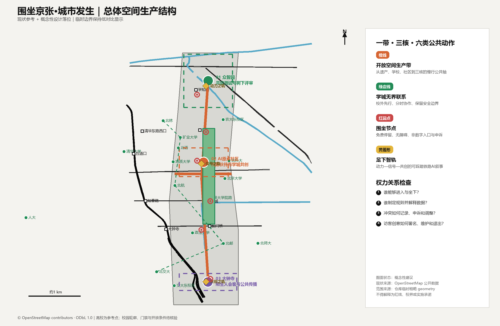
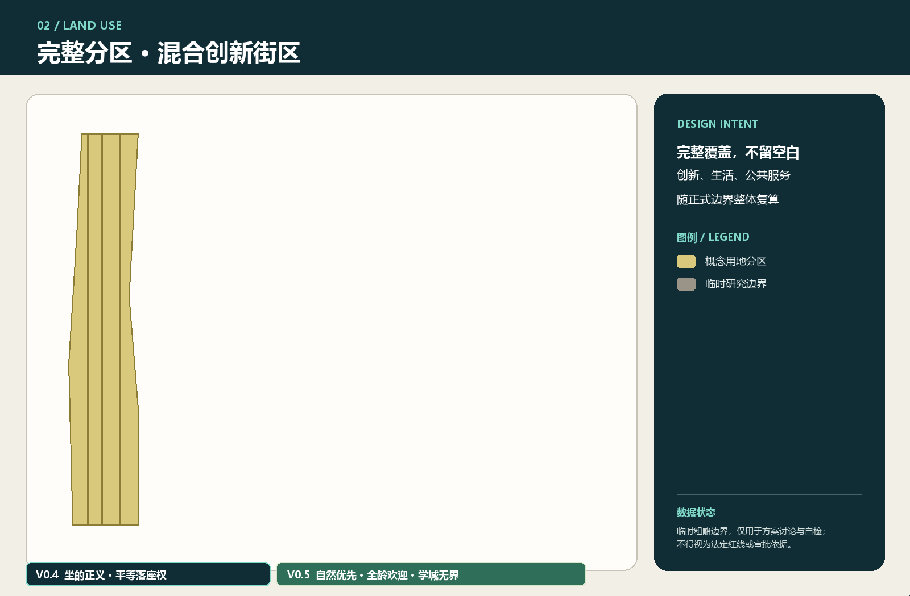

# 围坐京张·城市发生—AI时代的开放空间生产与共创

## 方案总纲：空间作为持续争取的社会关系

“围坐京张·城市发生”拒绝把城市理解为等待技术填充的空白容器，也拒绝把“AI创新带”简化为企业、算力与消费场景的空间投影。依照列斐伏尔的空间生产理论，空间始终由物质实践、制度与专业表述、生活经验及象征想象共同生产；道路、门禁、座椅、平台规则和数据接口都在不断回答谁可以进入、谁能够停留、谁有资格定义此地。大卫·哈维关于城市权利的论述进一步提示：城市权利超越了被动取得设施的个人权利，指向集体改变城市化过程、重新分配城市剩余与决定共同生活方式的权力。[source:LEFEBVRE-SPATIAL-PRODUCTION] [source:HARVEY-RIGHT-TO-CITY]

因此，“京张智脉”被定义为一套允许不同群体持续协商、占用、改写和照料空间的制度—空间框架，其意义远超一张建成后固定不变的总图。百年铁路遗产轴既承载记忆，也暴露基础设施曾经服务何种生产秩序；众智园、北京AI原点社区和大钟寺三核构成技术资本、专业知识、行政管理与日常生活相遇和冲突的公共场域，突破单向输出创新的中心模式；慢行蓝绿环承担创新资源、自然舒适与公共交往的日常再分配功能，摆脱景观装饰的从属地位。空间策略仍概括为“一带三核、两翼协同、十景成网”，但以四条政治—空间约束校验：任何AI服务必须保留非数字替代路径；任何公共空间必须说明准入、停留、发言和维护规则；任何空间判断必须能回到几何和来源；任何运营承诺必须标明责任主体、申诉渠道与退出机制。[source:AGENT-TASKBOOK] [standard:PROJECT-AGENT-OPEN-CALL-TASKBOOK] [depth:overall_spatial_structure]

原创设计动作包括：三条从公共核心连接三处重点区的“智脉廊道”，形成步行、骑行、低速接驳与公共服务叠合的概念网络；“算法橱窗”公开城市智能体的用途、数据、责任与申诉入口；“百年—百问”遗产叙事把铁路工程史与AI伦理问题并置。新增廊道已记录于 [data:geometry/roads.geojson#ROAD-JZ-02-1]，所有面积敏感结论仍服从临时边界限制。[metric:site_area_sqm]

设计优先级依次为：先缝合断点和开放首层，再布置可逆的轻量试验设施，最后才讨论依赖法定条件的建设量。每一次建设、管理与日常使用都会重新生产空间，因此“建成”仅是过程中的一个节点；冲突记录、公共评议、可逆调整和权利复核贯穿长期运行。短期运营应让使用者的实践反过来修正控规、交通、市政和建筑深化，避免沦为替既定总图寻找使用者的招商工具。

## 理论框架：从空间三元组到集体城市权利

本方案以列斐伏尔的“空间实践—空间表征—表征空间”三元组作为全文统一的分析方法，使理论直接参与问题诊断与设计判断，避免沦为既有设计的附加标签：

| 空间生产维度 | 在京张创新带中的表现 | 主要权力问题 | 设计回应 |
| --- | --- | --- | --- |
| 空间实践（被感知的空间） | 通勤、配送、散步、照护、上学、摆摊、休息及身体实际穿行 | 谁的路线连续，谁被绕行、驱赶或迫使扫码 | 缝合慢行断点、免费座位、无障碍并坐、非数字服务、自然遮荫与可退出路径 |
| 空间表征（被构想的空间） | 控规、产业地图、算法模型、门禁制度、物业规则和专业图纸 | 谁拥有命名、分类、测量与决策权；技术判断能否被质疑 | 来源可追溯、指标可复算、规则公开、人工复核、申诉与共同评议 |
| 表征空间（被生活的空间） | 铁路记忆、校园经验、老人叙事、青年文化、陌生人交往与身体感受 | 哪些记忆和生活方式被品牌叙事覆盖，哪些群体只能被展示而不能表达 | 足下智轨、修理咖啡桌、城市议事阶、代际伙伴和居民自我叙事 |

三者没有静态平衡：管理者可能把可停留的广场转化为受控通道，商业运营可能把公共座位转化为消费资格，使用者也可能通过共坐、讲述、维护和议事重新占有空间。哈维的城市权利在这里被操作化为五种集体能力：进入和使用空间、改变规则、参与资源分配、共同维护、对技术与管理决定提出异议。方案由此把“坐的正义”从家具设计提升为城市权利的最小尺度检验：一个人能否坐下，暴露了产权、消费、安保、身体规范和算法分类如何共同作用。

本方案同时吸收哈维对资本城市化的批判：AI产业投资若只推高地价、封闭园区和筛选“高价值人才”，就会以创新之名复制空间剥夺。因此产业增长必须接受公共性反向约束——新增价值应转化为开放首层、非商业停留、自然环境、照护设施、无障碍连接和社区可支配的活动资源；公共空间不能成为招商形象的布景，居民也不能只是被咨询、被采集数据或被展示的对象。

### 自下而上的空间生产：把持续设计权交给访客

大型基础设施和建筑主体已在城市长期建设中基本形成，未来创新带的关键任务由“继续制造宏大物体”转向“开放既有空间的使用权、解释权和改造能力”。作为承载创意的未来平台，京张智脉应建立自下而上的设计环境：访客可以提出一种坐法、发起一场活动、讲述一段记忆、修理一件设施、改变一项临时规则，或留下能够被后来者继续修改的空间作品。人的到访由此具有生产性；使用者同时成为共同作者，专业设计团队则负责搭建安全、开放、可迭代的支持结构。

“任何人都可以留下创意”需要一套可执行的公共制度。方案提出**开放空间提交协议**，把创意分为四个层级：

| 创意层级 | 访客可以做什么 | 审核与支持 | 保留和退出方式 |
| --- | --- | --- | --- |
| 即时使用 | 移动公共座椅、组织临时讨论、使用粉笔或可清除材料表达 | 公布简明边界；现场管理员仅处理安全、通行和侵权问题 | 活动结束后复位；表达可被记录，也允许作者要求不留档 |
| 短期试验 | 搭建可逆遮荫、社区展台、修理桌、游戏或无障碍共测装置 | 公开申请；居民、维护者和专业人员共同评估；提供工具和小额公共预算 | 设定试用期和复盘日；效果不佳时无损撤除 |
| 持续共建 | 认养花园、维护座位、编辑铁路记忆、运营代际课程或共享工作坊 | 签订共同维护约定；公开责任、费用、开放时间和投诉渠道 | 定期续议；贡献者可退出，运营权不得自动私有化 |
| 专业深化 | 将反复验证的访客创意转化为道路、建筑、市政或长期公共设施建议 | 进入规划、消防、结构、文保、无障碍和权属程序；保留创意来源与共同署名 | 未通过专业审查的内容返回试验层，不以“公众参与”替代法定责任 |

平台不得把公众创意当作免费的设计劳动力或训练数据。每项提交都应明确署名、匿名、开放许可、禁止商业使用等选择；AI只能协助绘图、翻译、模拟和整理意见，不能改变作者归属，也不能依据热度替公众筛选“优质创意”。空间管理者需要公开接受、修改、暂缓或拒绝某项创意的理由，并提供申诉和再次试验的入口。公共预算应优先支持缺少设备、专业语言和空闲时间的参与者，防止设计权再次集中到高学历、高收入和数字能力较强的人群手中。

自下而上的设计也保留清晰边界：任何创作不得阻断无障碍通行、损害生态和遗产、制造歧视性表达、侵犯隐私或把公共空间长期占为团体和商业专用。安全审查应采用最小必要干预原则，管理者须证明限制的具体风险，避免以整洁、科技形象或管理便利压制自发表达。最终评估关注空间是否持续产生新作者、弱势群体的创意能否进入下一轮、管理规则是否因使用经验而改变，以及贡献能否得到可追溯的承认。

## 设计依据与资料清单

本轮 v0.2 进一步把“共生”定义为三组可核验关系：遗产与创新共享公共轴、专业规划与居民经验共享决策证据、智能服务与非数字服务共享同一空间入口。评审可据新增廊道要素和五张同源图核对这三组关系，而无需依赖效果图想象。[data:geometry/roads.geojson#ROAD-JZ-02-1] [depth:overall_spatial_structure]

本 formal 方案以北京市规划和自然资源委员会海淀分局发布的《百年京张AI创新带城市设计国际方案征集资格预审公告》为第一依据，并以 `brief/site-package/` 中经维护者登记的临时粗略边界、重点区域、枚举、指标和来源清单为机器可读依据。AI agent 在生成方案前必须读取 `design_brief.json`、`allowed_design_space.json`、`sources.json`、`enums/`、`ranges/`、`schemas/`、`data/source_registry.json` 和 `data/processed/agent_fact_pack.md`，并用 `project_scope_summary.csv`、`agent_task_requirements.csv`、`source_use_matrix.csv`、`missing_data_checklist.csv` 建立任务、范围、资料用途和缺口清单。所有设计判断都要拆分为可追溯来源、可复算指标、可校验图层和可人工复核假设。公告要求方案达到控制性详细规划的城市设计深度和规划综合实施方案的城市设计深度，因此文本叙述不能替代 GeoJSON、指标表、A3 文册、A0 展板和 HTML 电子展示成果。

本节证据链引用 [source:OFFICIAL-ANNOUNCEMENT]、[source:AGENT-TASKBOOK]、[source:SITE-PACKAGE]、[source:SOURCE-REGISTRY]、[source:PROCESSED-FACT-PACK]、[source:BOUNDARY-SOURCE]、[source:KEY-AREA-SOURCE]、[standard:PROJECT-OFFICIAL-ANNOUNCEMENT]、[standard:PROJECT-AGENT-OPEN-CALL-TASKBOOK]、[standard:MOHURD-URBAN-DESIGN-MEASURES]、[standard:MOHURD-CONTROL-DETAILED-PLANNING]、[standard:MNR-LAND-USE-CLASSIFICATION-GUIDE]、[standard:MOHURD-ARCH-DESIGN-DEPTH-2016] 和 [depth:existing_conditions_diagnosis]，用于说明方案由公告、面向智能体任务书、标准、边界、处理资料包和资料清单共同组织，具备超越独立愿景文本的证据结构。

资料登记表的使用边界如下：

- data/source_registry.json 登记公开、清权与临时资料的用途边界。
- 当前登记摘要：formal 可用资料 5 条，背景资料 0 条，provisional-only 资料 1 条。
- agent 不得把 background_only 或 provisional_only 资料升级为 official boundary、法定控规、正式评分依据或政府实施承诺。

`data/processed/agent_fact_pack.md` 仅承担本方案的阅读导航功能，不构成新的权威来源。[source:PROCESSED-FACT-PACK] 只帮助 agent 把三层范围、三处重点区、公告任务、agent.1-agent.6、资料可用性和缺资料事项组织成可读方案；所有事实判断仍回到 [source:OFFICIAL-ANNOUNCEMENT]、[source:AGENT-TASKBOOK]、[source:SOURCE-REGISTRY]、[source:BOUNDARY-SOURCE] 与 [source:KEY-AREA-SOURCE]。

本脚手架在官方 `SITE_BOUNDARY` 或三处 `KEY_AREA` 尚未取得时，使用 `brief/site-package/geometry/provisional_boundaries.geojson` 生成临时 formal 包。提交包中的 `geometry/site_boundary.geojson` 与 `geometry/key_areas.geojson` 均必须标注为 `provisional_constraint`、`official_boundary=false`，只能用于方案生成、自检、可视化和设计讨论，不能作为 official redline、审批依据、精确面积依据或法定控制结论。该组织方数据缺口本身不阻断内容评分；替换 official polygons 后，site boundary、key areas、land use、roads、green space、public space、buildings、phasing 和 metrics 均需重算。

本次脚手架生成的可评分状态为：**临时边界，保留精度警示并待正式数据发布后复算；不阻断内容评分**。因此，正文中的空间结构、场景、项目和指标均按“可讨论、可复核、可替换官方边界后重算”的原则写入；当官方边界和重点区 polygon 更新后，agent 必须重新运行脚手架、自检和图纸/HTML生成，不能只替换单个文件。

边界和重点区域的可读解释对应 [data:geometry/site_boundary.geojson#SITE-001]、[data:geometry/key_areas.geojson#PROV-KEY-001] 和 [metric:site_area_sqm]、[metric:key_area_count]。这意味着读者可以从正文回到 GeoJSON 查看边界来源、从 metrics 查看面积复算结果、从 sources 查看资料来源，无须依赖单段文字判断。

## 三层范围工作框架

方案按照公告确定的三个层次组织工作：统筹研究范围关注 43.6 平方公里的AI产业生态、战略定位、创新链和未来城市形态；总体设计范围关注 11.4 平方公里京张遗址公园周边 1-2 公里城市地区和产业区，要求形成城市更新总体框架、产业空间布局、交通市政支撑和城市风貌控制；重点区域范围关注 368.4 公顷三处详细设计地区，要求明确功能业态、建筑规模、拆改留分类、公共空间连通和交通组织。三层范围在 `compliance_matrix.json` 中逐条映射，保证公告 1.3、1.4、1.5 与 agent.1-agent.6 的必选任务都有章节、图层、指标、图纸和 HTML 证据。

三层工作框架的深度项由 [depth:three_level_scope_framework] 和 [depth:overall_spatial_structure] 约束，空间证据以 [data:geometry/site_boundary.geojson#SITE-001] 与 [data:geometry/key_areas.geojson#PROV-KEY-001] 为准，任务依据以 [standard:PROJECT-OFFICIAL-ANNOUNCEMENT] 为准，范围索引以 [source:PROCESSED-FACT-PACK] 中 `project_scope_summary.csv` 的三层范围表为导航。

三层工作共同构成相互反馈的空间生产过程�m�����k�w��s�7�
�&�2�n��K�������o�.��>C�ꓢ��V3����ɽ٥ͥ������3�ꓦk��O�����>�����s����Ӛ^ۢ�����������4(4+�ꓦk�J3���R���O��k��ǖꛖ"�"��Rām���Ѡ��Ʌ����}Ʌ��}ͱ��}��ɭ���t���8�m���Ѡ�չ������}���}���Ʌ���Ս��ɕt��ꛚv��o�n������6���W�R��m��ф靕������ɽ��̹����ͽ��I=����w�m��ф靕�������Չ���}����������ͽ��AU	1%����t��J0�m��ф靕�����位����Ʌ���̹����ͽ��
=9MQI%9QMw���O�O�޿�ꋞ������������#�b˖J3���R��v���۞�떒ǚ^۾�3��S�k������յ�ѥ��̃��Ӛb;�������3���7����[�V�����g�"C�����k�v���ێ4(4(�o�ꓦk����3��;�Nw������Ǟ��^Ӗ�7�B#�����n�t���͕�̽����ɕ̽�������䵉�Օ�ɕ�������4(4+���R��J3���ǚr7�*�����Z���S���nY'�꟒�k�r7�*�����Z���"o�ZÚr7�*���ϖ>Î���&7�R���r7�*�����Z���ZÖz/�~랆����Z���"����?����C���������_�*o�J3������R�����Z��z7�B#��Z皆#��S��Ӛb;����Z��������^Ӗ�����r7�*��6+�����C�B������?�J3�"�r��{�Z����G�����G�����������C��:K��ӎ�b˚ҫ���#�b˞�'�ޗ��/���Zg�^۾�3��S�"_��뚶���?��ǖ2[�&7����v���ێ4(4(����vC�j�����'��k��Ϟ�'�B��Ꟛv�7���v����v��~;��4(4+�s�vC�w�b����^ӞR�Ꟛr�^������r�R����j�*���s��k���*+�k��3���^Ӣ���2[���s�Vg���^Ӿ�3�*+�������B�j���������2[������������ꓢ�#�J3�>C�뢚���j����_�4(4+�r��Z皆#�$�����o����;����/�^Ӟj�ꓚ���3��ۢ���W�*�r��*���Ǟ����k�jS�b���O�7��7���*ϖ*��nӖ�k�ꓞ�g�r�f���3�����~;���r�����j����C�C��C����BG�ǖB3�s�Vg�j�^ۦ^ӎ������B��j�r��k�>+��g��#��'�Î��O�*ǎ����{�J3�:3��Þj���^ӎ	$��^ے�o�������b��v����v��Ϟ��j��ߖ��3�V3�v���:��6C���J3���*��r7�*��v�^���W�>[��g��7�Ϟ���r��Z皆#�����/�s���
������'�w�j�����?����������׊S�P����Ϟ�'�B��Ꟛv����k����W���j��o����s�Vg��vC��/��>G���J3����B�����3��7��S�Rǚ�#�����*o��3��k�ꯒ����ꯒ�O���*o���Ӧ���"ߞ�7�������.��r'�*ۖך"[��_��W���"�ϖ�k�	mͽ�ɍ��9P�QM-	==-t�m�х���ɐ�AI=)
P�9P�=A8�
10�QM-	==-t�m���Ѡ鉱Օ}�ɕ��}�Չ���}�����t4(4(������S���꟒�7�v�"�4(4(ĸ�����o���v����k�꟒�7��G��s��{�:�����O��g�����2��n��2��_�Ꟗ��n��J3��'���7�
�2��3��7�^������#���"[�Σ�3��s�����ǖ꟒�7�j�&7����v���ێ4(ȸ����s�Vg�v����k��w�Vg��Ϧ?�v{�V��k��^����R��Rۢ���^��r�&����j�꟒�7��o�����J3�����?���"g��7��_����2[��떾�^���ۢ���s�>��*ϖ*���"[��;�Rۖ������O�j�V3�?�������4(̸����ǖB3�vC��/�v����k��?�⫒ꓚ��6W��B3�^ۢ�fG�������ۖvC��7��&ۚ&/�v��3��������;���*����7������7�B3�꟦�c��>����*����J3��'�vg���ꟾ�3�����7�B3�ꯒ�O�v���۞j��떒��;�B3����#��w��Ϧv��4(и����>G����;���v����k�nӖvC��7��'��;���������꓎���^ӖB3�^ۚ>C��o���R��r��3��ⓒ��V�����.������ꟖJ3�>��j?�^ۦ��j�޿����m$���7����"��"[���㢾�"��"��Z������_����
��ߎ4(Ը�������B����v����i$��>��>C��o�����B��R��j��{�^ۖ�_��W��ޣ�������G��B��js���*����w��c�6��J3���*��2�7��3����7��W�"۞�����#��w���7��랮/����ꓒ���R���3����7�n����2�������ޗ��r/�>/�J3�
�3�4(4(�����s���⛒�'������7�vC��W�w���^Ӗ:�z,4(4+�r��Z皆#�r��m��ф靕�������Չ���}����������ͽ��AU	1%����t��������j���ǚ��*��V3�v��ⷚ�7�������>���o��O��k�n��b��ǖ2[�j�꟒�7�:�z/��3��ے�;�f�'����3��+�L�m��ф靕������ɽ��̹����ͽ��I=�)h��ȴ�t��6?�B3��h4(4)���:�z,��������Ƅ����v����v��Ϟ����$��j�/�"ۢ�K�&ȁ�4)�������������������������4)���:3��Ör�:��������C�҇�2�������R�����D����"�ꯚ"C�zs��ۢ:ߖ�_�:Ör�n{��P���������_��W��;�҇�2���Ö�W��3��7��o��3����S�:K�B4��4)����ۢ
����*�������������������*������f���ӎ��G����;��;�:/�*o�ꓢ� ����^��js��7�޿����>C���J3���ޗ���*����>���4)���^��^���o�V���0����n��2�Fc�ޗ�����K�Fc���s�>��*ϖ*�������������ޣ�3��k�Ǧ�C��;�~��^ےꓚ������k������>s�6T���w��c�>C����3��7������#����4)����'�â�H����r����'�vg�"[��R��2�j��������������B��"[�.���������b��������S���j���ǚr7�*���3��7�k��:��Z���4)������B�J[�V���0����vK��ӎ���G�ޗ��/��#�����2����D����ǖB3�*��&/�f7��;�f3�R�|����~�������R���Ӓ�����Zg��3�"C�zs��K�>��;���4)���~;�������/�b؁������G����"K��#�����B������h��������f#��Î�ң�����;��O�:0��������c��K��ϖJ3�>���㖾��k����ꫢ���3��w�Vg���ޗ��������4(4+��g��o�:�z/�b�����_����~��s�����vC��/�w�j�ޗ�߾�3��7�z�"C�ZÖ�{��W��k����Z��"[�����k��뢺����n������W���Ǟ��^Ӛ�ǖ2[�Z皆#����S�n{��S��k�b��B��r'��7��#�������vC�j��7�����o���������R�����B���;�r/�>/��ۚ:K�3�v{�s�r��k�O��o��s�^Ӗ*ϖ*���b��B��r'�B3��'�s�Vg�v��o�Ꟛ��b��B��k���&ۚ&/��"�jS�J'�"[���Zs�v��:K�Z��~C��o����o�>G���r��k�b��B�����~Ϧ?�������"[�VÖ�_������z�Z��	m���Ѡ��Չ���}͕�٥��}������ѥ��t�m���Ѡ�ɥͭ}���ͥ��}��хt4(4(�����>��������j����מn���4(4+�B;��O��k��ǖ2[��뢺����s��Ϟ�'�B��Ꟛv�w��ϖ��:Ör뢞����;�ǖB3����þ�k��Ö�W�7���꟒�7�j������>��R�����������ۖvC�6W����7�B3�꟦�c�J3�v��3�&ۚ&/���B#��.�����;�����O�꟒�7��S��/��ޣ�����O���*��>��;��^��r�VÖ�_������6ϖ>��:ߖ�_�j�r7�*���3�>+�n��V3�?�������"[��'��w���"g���"C�j����/��ێ�ߒ�O�Væ?�J3��S��/���r���c�Z���V3��������^��js��7���#�bˎ��C�B��J3����G�ǖ"o���Zg�"Ò�7�B;�����k��o��O�&7��7�"ۦ���������2���	m���ɥ���Չ���}�����}Ʌѥ�t4(4+����ߒ'�.��b��B��r��{��c�r���뚂���3�.K��w�R��s�s�Vg��+����+����w�"[�s��K�*���+��k��+����w����?���ǚ���k���>��*�����3���>���'��c��o�>��nӖvC��3���>��.�����o�>�����R���G�ޗ�߾�3���>���3��������	$��j�"C�*��O�:Ò��nӖ�k���:ߖ�_�vC��/��۞R����ꯖ�æ~Ϣ�Ӣ�w�j������3�r�f���7��_�n���[�������4(4(����Nw������^ӎ���Ǟ��^Ӓ�;�~;����;��04(4+���۞��^ӖB3��ߚB�⛒�ߖ�"��Z��J3�v�*o�Ϟ���f����2[�>����*���c�F�����ߖ��ۚ:K�f��:�r'����R����3�s�R����B�w���>������'���J3��Ӛ*���/�B7�>[��#���>G���*��4(4+�Nw������^ӚZ皆#��S�곖�_�v���n����*o�⛒�릪��z۾�3��������ώ��?�r#��ώ�F���禮c��������k�����2�뢆3�r����3�>C��6_�2_�ҿ�k���s�����{�k�j����O���G��3�O�J3����&˞��^Ӓ�O����Z皆#��S���"�����3�Z��
���+�ޣ�:��޿�*�
����n��6_����J3�2_����f����*�
��3�>C��s������O�
ˎ�"o�ZÒꓖ����G�*��/��W���S�R���W���J3���ǚr7�*���7�B#�"��R���[�V��4(4+�Nw������Ǟ��^ӞRām���Ѡ鉱Օ}�ɕ��}�Չ���}�����t��������3�������6����m��ф靕�����佝ɕ��}����������ͽ��I8����w�m��ф靕�������Չ���}����������ͽ��AU	1%����w�m���ɥ��ɕ��}Ʌѥ�t��J0�m���ɥ���Չ���}�����}Ʌѥ�w��~;������������B�*{��W���������f�����;��3����Ǟ��^ӖJ3��랶G�:��"۾�3�n�����r��*�B3�^ۖ�W�R��m�х���ɐ�5=!UI�UI	8�M%8�5MUIMw�4(4+�~;����;��3�Z皆#��S�z7�B#�곖�N�޿�:�>˚Z�2[��ⷖϚvG�"o�ZÚZ�2[�J1'�"o�ZÚZ�2[��3�"��R����6;�n��������g��2_��Ǟ�'�Z�2[����C��3�>C��~;���~�����랶G��;��3���/��ۖ������O�?��V3�v��J3���Ǣ&�r���W���	����Ѓ��c��S�>C�떾�������Z�2[����>ߎ�n��f��J��>g��/�'�rw�r��rÚ���҇�2���g�"[�6���'��W����O����3���&�r'�N�&3���_��O��n��?��
[�?�J3����k�����������r'���v�v���C���;��3�:��"ۖ�S�"����c�Z瞺��:����������뢺��J3���������v���۾�3�◞��r��ʇ�r'�Z��w�"[�:�����w�6��^۞�g���������:��"۞���4(4(����nӚZæ��n����6W���{�Z��R���[��;�"�r����"H4(4+��{�Z��2�7���Ꟛv����G����"g��*ϖ*��J3����R��Ϟ���3��s��s����vg��Nw�n��j�"�&��뢺����?���r���>����꟞R�ZÞj�>_�n+���;����:K�f���4(4+��{�Z��Z皆#��S����"C�>�����~��j�nӚZæ��n����6W��3��Ӛb;���n���7�������z/��*����ҏ������O���w��[�v���ێ��{�Z��bۚ�׎��;�f��J3����Ú2����R���[��뢺���S���n[�~;���nӚZÞ���疺{�Z�����^Ӓ�o��g���C�B��r�"ێ�꟒�k�r7�*�����ǖ>��;��VÚ6����B�J3�Ꟛv�6?�B3�	������������ͥ�������ͽ�����S�������"�r�2�nӾ�1�����������}���ɥ๩ͽ�����S�*+��?�⫒��*���;�"�r�J3�n����2�:��4(4+���n����6W�J3�"�r��ǖꛞRām���Ѡ�ɕ��݅�}�ɽ����}����t���8�m���Ѡ����ͥ��}��������хѥ��t�����B��3�"�r���^Ӣ��6����m��ф靕���������ͥ�������ͽ��A!M����w����zs�ʇ�r'�v��{����G���{�Z�����O�J3����&�޿����3�Z皆#�����*+���g�"C��{�Z���;�f���3��ۚb;����������s��B��rÚ&����4(4)�����n���[�>܁�����n��B7���������z,�������w��X������6���W�R���4)�������������������������������4)��)h��ā���곖�_�v���n�����3�Z��
��w�B ������Ǟ��^п�ꓦh����O�޿�ꋞ��������/���^ӎ�ꓦk������7������m��ф靕������ɽ��̹����ͽ��I=����t��4)��)h��ȁ����_�f�n�����ϖ"o�ZÞV3�v�����Nw������^п�꟒�k��W�������ϦO�Nw�����R��J3�b˚ҫ�v���؁��m��ф靕�����佝ɕ��}����������ͽ��I8����t��4)��)h��́���:�
瞒��2��G����"C�zs����2[��\����~;���nӚZ���꟒�k�r7�*��������2���V3��v��{���[����k����m��ф靕�����佉ե�����̹����ͽ��	1����t��4)��)h��Ё������J��랮g�no�Ƈ�fC�����3��{�h�������O����O�2X�����0�������O��g�
��O�޿�ꓖ>'�>�����R����������m��ф靕�������Չ���}����������ͽ��AU	1%����t��4)��)h��ԁ��'���ǚr7�*���;��������_�*o�*�
����ZÖ~��迖��ǚr7�*��������C���_�*o���'���J3��C�B�����L���m��ф靕�����位����Ʌ���̹����ͽ��
=9MQI%9QMt��4)��)h��؁�����B
'���*��F����Ǣ޿��������C�B���N�&0������Ǟ��^Ӣ��>�����*���'����&#�v���v���m��ф靕���������ͥ�������ͽ��A!M����t��4(4+�"�r��S��8�����������n�������F��r����"C�2�"��k���n�F��r�b��>C�ꓚ"C�zs�j�^ۦ^Ӣ�����3��{�Z��"�r�b��~;���nӚZÖJ3���n���뢺��j�:���o�޿����Z皆#��S�>C���G�r��W�
��ⷚr�nӚZÖJ3�V��r���B���z۾�3��ۚ��b;�N���o����>��#���?����Z����C�B����*��J3�r7�*���ϖ>ÖB��*���3�N���o����'�������?�:�������R���ꓦk�J3�v��{�v���۞����������;��Ӗꛚ��*���O������>G�����2��C�B���r�f����R��^�����ǒ�O��3�޿����J3�n��f��J��r�"۾�3����Z��S��Ӛb;��C�B����Ƈ���G�:��ҏ�����V3�����2[�޿���J3��;�f���3��7��_�>��g�����>��>ߎ4(4(����2����O����v������7��_��;�B#���~��b�4(4+�2����O�:Þ&疺k����O���r/�J3���B���^Ӟj�Z��W��3�^���W��'�B3��;���^Ӛr��ꯎ�>��?�2[����7���:/�K�^���W����������rÒ�ߚ"[����R���G����������j��+�◎��K��{��˞��J3��'��c�4(4+�2����O���ϖ�G��S�2�B����O�������2�nӦv������7�
�2�~�v���������rÒ�;���Ǟ��^Ӛ�S��/���랶G�~��W��nӚZæ��n��Væ?�'�r�f��*�
�����3��{�k�2����꟒�k���^Ӛ2������&7�r7�*��2���J3�����*ۚ��&�r$����ݸ��2����������8���)M=8��"[�>�����v���C��7��_��mչ���ݸ��2��������g��:�n��J3�����?�>C�ꓖ&7����v���ێ	�͍ɥ��̽���ѥ��}ɕ٥�ܹ�倃�J0��͍ɥ��̽٥�Յ�}ɕ٥�ܹ�倃�j��O�zs�b����ɵ��������j�7�����6��4(4+�2����7��_��ǖꛞRām���Ѡ鵕�ɥ��}ɕ����ձ�ѥ��t�����B��r��Z皆#����Z�b���?��W�R��m���ɥ��ͥѕ}�ɕ�}�ŵw�m���ɥ�魕�}�ɕ�}��չ�w�m���ɥ��ե�����}�����ɥ��}�ɕ�}�ŵw�m���ɥ��ɕ��}Ʌѥ�w�m���ɥ���Չ���}�����}Ʌѥ�w��3��ۢ�Ӛb;��g��o��v����m��ф靕������ͥѕ}��չ���九���ͽ��M%Q����w�m��ф靕�����佭��}�ɕ�̹����ͽ��AI=X�-d����w�m��ф靕�����佉ե�����̹����ͽ��	1����w�m��ф靕�����佝ɕ��}����������ͽ��I8����t��J0�m��ф靕�������Չ���}����������ͽ��AU	1%����w�4(4(�o�����2����7��_��;���6��N��n�t���͕�̽����ɕ̽���ɥ�̵�٥����������4(4+�B#���~��bךb����*��N7��S���j���:��Z��ێ��?�v����F+���*��J0������}хͭ��������*�������S�"Ú*��F+����*��n�����2����n����!Q50���צv���v���C������J3��������r������n[���F(�ĸώĸӎĸԃ�"X�����иĵ����и؃�j�������'���*���3�Z皆#��7��_��o�����ɵ����ɽ���ͥ�����͍�ɥ���4(4+�����?��ǖ2[�^۾�1����Ѓ��c��S�*+��?�⫚2���"����'����k��������b��>��Rǚ>C�ꓖ���W�nӚ:���7��_�j���^Ӛ2����3��/�����V3�v���������rÚ�S��/����Ǟ��^Ӛ�S��/���랶G�~��W�v�����J3�"�r�v������o�����3���b��r����c�Z�:����"[���*��曦f��ۚR��JG�j����:��2����3��/����瞞��:���랶G��c�ꛎ��랶G���ꛎ������O�޿�ꋞ���J3����Z������o�����'���b��r����C�B��"[�꟒�k�VÚ6��2�����j�V#�2����3��/���$��"o�ZÚ2�VÎ���&7���ꛎ�꟒�k�r7�*��?�ꛎ����3�>����������*��>��;�ꛖJ3�r�f�����R���G������'���2����S�"�"���o�������ɥ�̹�ͽ�������յ�ѥ��̹�ͽ����J0������������}���ɥ๩ͽ����3���7�*+��C�B����f�����g�"C�����k���"K�v���ێ4(4(�����;�f���&#�v��;�B#����Ӛb84(4+�Z皆#���Z��ۖ>�����R��ⷚZ�"[�.ǚZ��3��ۖ�S�k�����ɽ��ͅ����������"X���ɽ��ͅ��頹�����>C��o��3�VӖ�����G�Z��o����G��G�Z�>��꟞R|��������������݅ɹ�����3��7�b�Z��*W�����B#��ۚ"[���疺�����	̽Î!Q50��J3�B��Z��_�n���ے���S�>C��o����S������&��r���3��ے�c�#����R������̽ѕɵ������䵝���ͅ�乵����j��o��/�:��6C��G��W��&�r'�n��&��n�����n�����VÚ6��J3�����Ꟗ����r���ͽ�ɍ�̹�ͽ����"X��ɕ���н����ɥ���}�хѕ���й�����ⷢ�Ӛb;�v���C����>��J3�:#�v�*ۚ�	!Q50���צv���7��_�*������s��/�k�r����s��/�rÖn��N��&���s��/��_��O���Ʌ�������6W�"[��[���A'��3��7��_���⫢�������3���4(4+��;�f��J3�����Zg���6W�Rām���Ѡ�ɥͭ}���ͥ��}��хt�����B��3��ے�8�m��ф靕�����位����Ʌ���̹����ͽ��
=9MQI%9QMw�mͽ�ɍ��M%Q�A
-w�mͽ�ɍ��AI=
MM�
P�A
-t��J0�m�х���ɐ�5=!UI�
=9QI=0�Q%1�A199%9t��n��K������	����ͥ��}��х}��������й��ـ��ⷖ"_��j������������չ������䁅ɕ���:�����O�޿��rÖv_���랶G����R���Z��w�J3���ǚr7�*����>���3������o�������յ�ѥ��̹�ͽ��������J3����Z��;�f�����*�����W����G��c�Z�:�����O�޿�ꋞ����v��{����R����#�b˚"[�Z��w�v���۞j��O����3�������f7�꟒�����������/���4(4+�r��Z皆#��7��Þ�Ö�c�Z�&�������k�:�����r��#�r�rÚv��{��r��#��뢺�������"[��w����{�Z��	$�����Ѓ����/��{��v���C��&#�v����^ӚVÚ6���2���J3���������ҏ��o��Ӛ*���J3��O��k������>���w�6�������O�zs����^Ӗ�7���J3�B#���~��bע�����S����"[�.K��w�4(4(����>����Zd4(4(���ɥ����Չ�����ɥ�����4(���ɥ���ͥє�����������ͥ��}�ɥ����ͽ�4(���ɥ���ͥє�������������ݕ�}��ͥ��}�������ͽ�4(���ɥ���ͥє�����������յ̼4(���ɥ���ͥє���������Ʌ���̽��������}�����̹�ͽ�4(����ф��ɽ���͕�������}����}�������4(����ф��ɽ���͕���ɽ����}͍���}�յ���乍��4(����ф��ɽ���͕�������}хͭ}ɕ�եɕ����̹���4(����ф��ɽ���͕��ͽ�ɍ�}�͕}���ɥํ��4(����ф��ɽ���͕�����ͥ��}��х}��������й���4(��!��ɤ�1�����ɔ���Q���Aɽ�Սѥ������M�����������͠��Ʌ�ͱ�ѥ����	����ݕ�������Ǿ�#��W�Z�:�F\����Ӿ�$4(��!��ɤ�1�����ɔ���]ɥѥ��́���
�ѥ�̨��	����ݕ�������۾�#�~;���v�"��n�ϚZ�r���$4(���٥��!��ٕ䰃�qQ���I���ЁѼ�ѡ��
��䳊t��9�܁1��ЁI�٥�ܨ��̰�����4(���٥��!��ٕ䰀�I�����
�ѥ���ɽ��ѡ��I���ЁѼ�ѡ��
���Ѽ�ѡ��Uɉ���I�ٽ��ѥ�����Y��ͼ������4(���r�f��>�����W�R��ҋ��W��imͽ�ɍ��=%
%0�99=U9
59Qw�mͽ�ɍ��9P�QM-	==-w�mͽ�ɍ��M%Q�A
-w�mͽ�ɍ��M=UI
�I%MQIew�mͽ�ɍ��AI=
MM�
P�A
-w�m�х���ɐ�AI=)
P�=%
%0�99=U9
59Qw�m�х���ɐ�AI=)
P�9P�=A8�
10�QM-	==-w�m���Ѡ鵕�ɥ��}ɕ����ձ�ѥ��w�m��ф靕������ͥѕ}��չ���九���ͽ��M%Q����w�m���ɥ��ͥѕ}�ɕ�}�ŵt4(4(4(������Չ����ѥ����ݹ����Յ啱��ɕ���͔����̀���4(