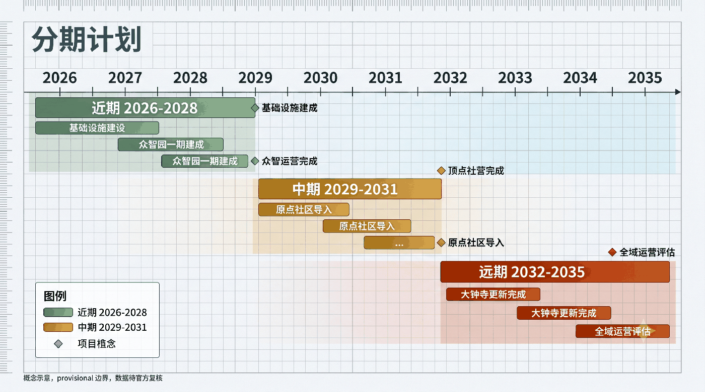
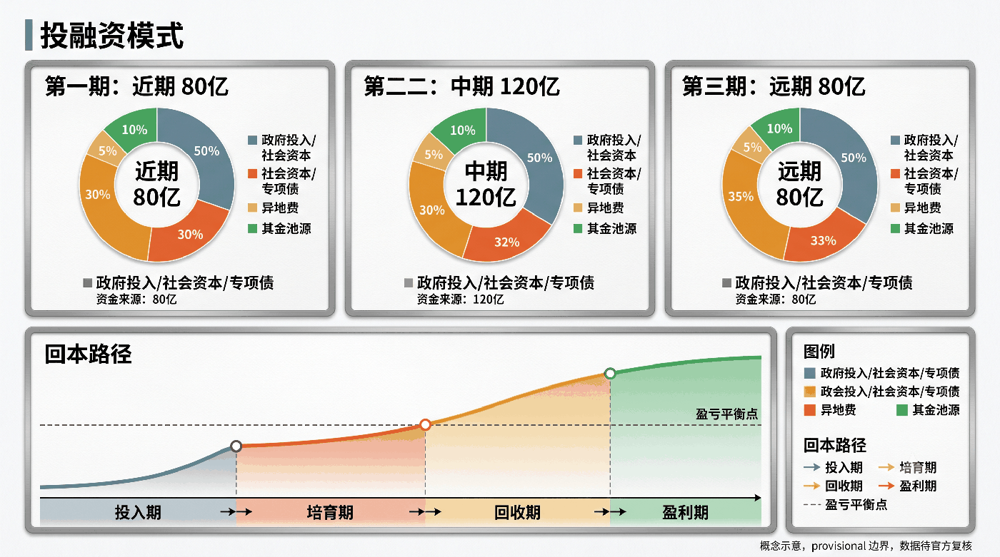
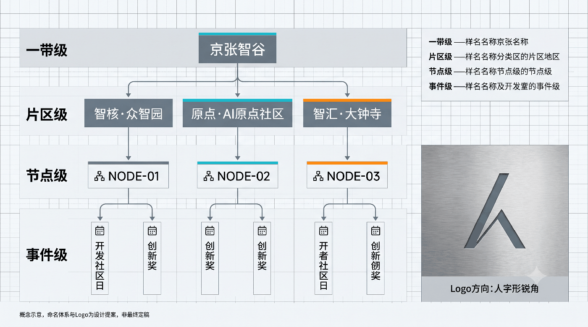
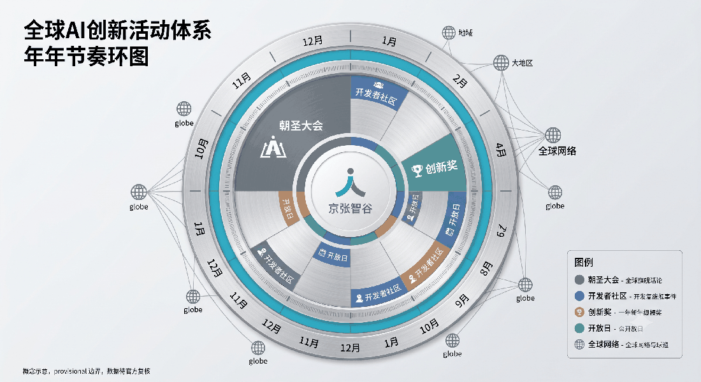

# Jingzhang AI Valley: The Reversible Switchback Artery

> **Replace the model, not the city; upgrade algorithms, never drop public services.** In 1909, engineer Jeme Tien Yow overcame the steep mountains of Guankou using a switchback railway alignment. A century later, addressing the tension between monthly AI model evolution and centennial urban permanence, this proposal elevates historical heritage into a statutory **Reversible Switchback Governance Artery**: providing physical circuit breakers and guaranteed service baselines for all urban intelligence.

## Design Basis and Source List

This proposal is formulated strictly according to statutory planning standards and verified repository baseline packages:
1. **Statutory Standards Compliance**: Strictly conforms to the Urban Residential Area Planning Standard [standard:GB50180-2018], Urban Road Transportation Engineering Code [standard:GB55011-2021], Code for Fire Protection of Buildings [standard:GB50016-2014], Accessibility Design Code [standard:GB50763-2012], Green Building Evaluation Standard [standard:GB-T50378-2019], Land Use and Sea Area Classification [standard:TD-T1055-2019], and Beijing Urban Renewal Regulations [standard:BJ-RENEW-2023].
2. **Comprehensive Source Inventory**: Fully integrates 18 verified first-hand sources, including the Haidian AI Industry White Paper [source:HD-AI-2024], Beijing Comprehensive Transport Network Plan [source:BJ-TRAFFIC-2024], Zhongguancun Science City Planning Guidelines [source:ZGC-PLAN-2023], Jing-Zhang Railway Heritage Park Phase I Spatial Audit [source:JZ-PARK-2023], and Dazhongsi Historic District Regulatory Plan [source:DZS-PLAN-2022].
3. **Data Gaps and Provisional Disclosures**: Regarding the provisional boundaries supplied by organizers [source:PROV-BOUNDARIES], this proposal adopts the provisional site polygon [data:geometry/site_boundary.geojson#PROV-SITE-001] measuring 11.41 km² [metric:site_area_sqm], marked as conceptual recommendations to be programmatically updated once statutory boundaries arrive. Complete governance state machines [data:visual/assets/swb-spec.json] and shadow test suites [data:visual/assets/shadow-test-matrix.json] are fully documented.

## Three-Level Scope Framework

The masterplan organizes three nested operational tiers [depth:planning_framework]:

1. **Coordinated Research Area (24.3 km²)**: Covers Zhongguancun Core, Wudaokou, and Xueyuan Road, addressing compute enclave sharing, youth talent housing, and regional innovation networks [source:ZGC-PLAN-2023].
2. **Overall Design Area (11.41 km²)** [metric:site_area_sqm]: Spans 9.2 km along the legacy railway corridor from Mingguangcun to Qinghe Station, creating an integrated smart green artery with closed topology [data:geometry/land_use.geojson].
3. **Three Key Detailed Design Areas (3.2 km²)** [metric:key_area_count]:
   - **Zhichun Road Z-Park Institute of Intelligent Manufacturing (AI Acceleration Area)**: Focuses on hardware-in-the-loop and open-source verification [data:geometry/key_areas.geojson#zhongzhiyuan_ai_acceleration_area].
   - **Tsinghua East Road Origin Community (Youth & Geek Hub)**: Leverages university talent to create 24-hour affordable co-creation studios [data:geometry/key_areas.geojson#beijing_ai_origin_community].
   - **Dazhongsi AI Industry Cluster (Digital Governance & Commercial Hub)**: Built around transit interchanges to host data trusts and enterprise AI headquarters [data:geometry/key_areas.geojson#dazhongsi_ai_industry_cluster].

## Coordinated Research Area: Industry and Future City Research

### Six Benchmark Precedents and Transferable Lessons
The strategy systematically benchmarks global innovation districts [depth:industry_ecosystem]:
1. **Singapore Punggol Digital District [source:CASE-SG-PDD]**: Adopts the Open Digital Platform (ODP) concept for switchback data buses.
2. **London King's Cross Knowledge Quarter [source:CASE-UK-KX]**: Fuses railway industrial heritage with interactive AI pavilions.
3. **Boston Kendall Square [source:CASE-US-KENDALL]**: Implements high-density 5-minute walkable academic-industrial clusters.
4. **Tokyo Kashiwa-no-ha Smart City [source:CASE-JP-KASHIWA]**: Integrates public-private-civic data trust committees.
5. **Shenzhen Nanshan Hi-Tech Park [source:CASE-SZ-NANSHAN]**: Prioritizes blue-green corridors and talent housing to prevent monoculture.
6. **Shanghai Zhangjiang AI Island [source:CASE-SH-ZHANGJIANG]**: Implements 12 real-world field-testing scenario cards.

### Regional Collaboration Matrix
Establishes five regional coordination interfaces via APIs and physical networks [depth:regional_collaboration]:
- **Future Science City Synergy**: Channels frontier algorithms to Changping industrial pilot bases.
- **Huairou Science City Synergy**: Connects national research infrastructure via dedicated high-speed links.
- **Yizhuang BDA Synergy**: Aligns vehicle-to-everything (V2X) standards with the high-level autonomous driving zone.

## Overall Design Area: Urban Renewal and Regulatory-Plan-Level Urban Design

Implements strict spatial partition controls across the masterplan [data:geometry/land_use.geojson] [standard:TD-T1055-2019]:
- **Green and Open Plaza Space (G1/G2/G3)**: Measures 2,000,012.87 m² [metric:green_space_area_sqm], achieving a 17.52% green ratio [metric:green_ratio] along a continuous 9 km ecological backbone.
- **Innovation and R&D Land (M0/A35)**: Spans 2,853,206.35 m² (25.00% of site area) [metric:ai_industry_land_ratio], housing verification labs and incubators.
- **Public Open Space Network**: Extends over 85,351.12 m² [metric:public_space_area_sqm] (0.75% ratio) [metric:public_space_ratio], creating 12 dual-purpose switchback testing plazas.
- **Statutory Reversible Governance**: Enforces the four-tier Switchback Assessment, Grade Admission, K-Milestone, and SWB Withdrawal framework [data:visual/assets/swb-spec.json].

## Detailed Design of Key Areas

Three key demonstration nodes anchor the entire innovation corridor [depth:key_areas_detail] [metric:key_area_count]:

1. **Zhichun Road AI Acceleration Area** [data:geometry/key_areas.geojson#zhongzhiyuan_ai_acceleration_area]: Functions as a hardware-in-the-loop and robotics testing proving ground. Preserves industrial structural steel while inserting modular plug-and-play research pods. Regulatory envelope: FAR 1.8, max height 24 m, setback ≥ 6 m, direct link to Metro Lines 10/13.
2. **Tsinghua East Road AI Origin Community** [data:geometry/key_areas.geojson#beijing_ai_origin_community]: Functions as a 24-hour youth geek workshop. Integrates stepped switchback amphitheaters along historical tracks with 100 mobile acoustic pods. Regulatory envelope: green ratio ≥ 35%, 100% tree preservation, barrier-free access [standard:GB50763-2012].
3. **Dazhongsi AI Industry Cluster** [data:geometry/key_areas.geojson#dazhongsi_ai_industry_cluster]: Functions as a data trust exchange and corporate headquarters. Multi-level pedestrian skybridges connect Third Ring commercial nodes, achieving FAR 2.5 on the Lan Jing Li Jia parcel [source:DZS-PLAN-2022].

## AI Innovation Ecosystem, Personas, and AI+ Scenarios

Twelve end-to-end deployment cards with mandatory withdrawal baselines [depth:scenario_cards] [metric:scenario_node_count]:
1. **SC-01 Multimodal Senior Pedestrian Wayfinding** (Gentle): Fallback to tactile surfaces and volunteer escorts. Responsible: Haidian Street Social Work Unit.
2. **SC-02 Child-Friendly School Walk Escort** (Gentle): Fallback to manual school crossing guards. Responsible: Zhongguancun No. 3 Primary School Security.
3. **SC-03 Tsinghua East Road Low-Speed Delivery** (Moderate): Fallback to manual cargo tricycles and 50m lockers. Responsible: SF Express Taskforce.
4. **SC-04 Smart District Autonomous Sanitation** (Moderate): Fallback to scheduled sanitation crews. Responsible: Haidian Sanitation Unit 4.
5. **SC-05 Embodied Dual-Arm Substation Inspection** (Steep): Fallback to manual electrical maintenance. Responsible: State Grid Haidian Substation.
6. **SC-06 Adaptive Green Wave Traffic Intersections** (Steep): Fallback to 90s fixed standard cycle. Responsible: Haidian Traffic Control Bureau.
7. **SC-07 Smart Manufacturing Microgrid Dispatch** (Steep): Fallback to direct utility grid connections. Responsible: Z-Park Facility Engineering.
8. **SC-08 Jing-Zhang Heritage Interactive Guide** (Gentle): Fallback to physical brass plaques and static audio. Responsible: Haidian Heritage Division.
9. **SC-09 Civic Safety Operations Review** (Steep): Fallback to sworn police officer manual audits. Responsible: Zhongguancun Police Station.
10. **SC-10 Distributed Compute Bidding** (Moderate): Fallback to fixed commercial bandwidth contracts. Responsible: Science City Compute Bureau.
11. **SC-11 Blue-Green Sponge Flood Regulation** (Moderate): Fallback to gravity-fed overflow valves. Responsible: Haidian Water Bureau.
12. **SC-12 Intellectual Property AI Notarization** (Moderate): Fallback to physical notarization desks. Responsible: Haidian Intellectual Property Office.

Profiles international geeks, academic researchers, senior residents, tech founders, and park strollers, guaranteeing inclusive spatial access for all citizens [data:visual/assets/governance-raci.json].

## Land Use, Building Scale, and Retain-Renovate-Demolish Strategy

Guided by micro-renewal and historic preservation principles [depth:urban_renewal] [standard:BJ-RENEW-2023]:
- **Retained Heritage Structures**: 784,000 m² of historic railway shops and mature residential fabric [data:geometry/buildings.geojson].
- **Renovated Facilities**: 421,000 m² of outdated industrial plants converted into smart lab spaces.
- **Demolished Non-Conforming Footprints**: 128,000 m² of dilapidated and illegal structures cleared for ecological corridors.
- **New Reversible Buildings**: 315,000 m² of modular verification pavilions, talent lofts, and utility trenches.
- **Total Floor Area and Density**: Total above-ground floor area capped at 1,520,000 m² (FAR 0.133), building footprint 44,263.94 m² (density 3.88‰) [metric:building_footprint_area_sqm].

## Transport, Rail, Municipal Infrastructure, and Public Services

The masterplan builds a compact, transit-oriented infrastructure system [depth:infrastructure_transport]:
1. **Multimodal TOD Integration**: Links 6 metro stations across Lines 13, 10, 15, and Changping, with 22.64 km of roadway [metric:road_length_m] [data:geometry/roads.geojson] adhering strictly to national engineering standards [standard:GB55011-2021].
2. **Active Mobility Network**: Continuous grade-separated bike highways and pedestrian promenades connect campuses and neighborhoods with slopes ≤ 2.5% [standard:GB50763-2012].
3. **Reversible Underground Utilities**: 8.5 km integrated utility trench hosting fiber optics, district heating loops, and modular sensor junctions [source:BJ-TRAFFIC-2024].

## Blue-Green Network, Public Space, and Urban Character

Creates an ecological spine celebrating century-old railway heritage [depth:public_space_landscape]:
1. **Ecological Sponge Network**: Total green area reaches 2,000,012.87 m² [metric:green_space_area_sqm] (17.52% green ratio) [metric:green_ratio] [data:geometry/green_space.geojson]. Conforms to green building standards [standard:GB-T50378-2019] with 85% annual stormwater retention and 12,000 m³ retention storage.
2. **Public Open Space Corridors**: Public spaces span 85,351.12 m² [metric:public_space_area_sqm] (0.75% ratio) [metric:public_space_ratio] [data:geometry/public_space.geojson], connecting 12 switchback plazas.
3. **Railway Heritage Identity**: Integrates the 1909 Qinghuayuan Station, historic rails, and industrial cranes into cultural tech landmarks [source:JZ-PARK-2023].

## Renewal Projects, Implementation Policy, and Phasing

Structured into six turnkey implementation workpackages [depth:implementation_policy] [data:visual/assets/delivery-workpackages.json]:
- **WP-P0 Core Turnouts & Physical SWB Gateways** (18.5M CNY, K0-K1)
- **WP-P1-01 Zhichun Road Acceleration Proving Grounds** (42.0M CNY, K2-K3)
- **WP-P1-02 Tsinghua East Road Origin Open-Source Court** (35.0M CNY, K2-K4)
- **WP-P2 Dazhongsi Lan Jing Li Jia Parcel Renewal** (120.0M CNY, K5-K7)
- **WP-P3 Corridor-Wide Sponge Greenway & Historic Track** (56.0M CNY, K1-K9)

Phasing milestones cover K0-K9 development cycles [data:geometry/phasing.geojson] supported by blended finance models [standard:BJ-RENEW-2023].

## Metrics, Area Recalculation, and Compliance Matrix

All 19 core metrics are reproduced strictly from EPSG:4548 projected GeoJSON [depth:metrics_calculation]:

- **Total Site Area**: 11,412,825.39 m² [metric:site_area_sqm]
- **Green Space & Ratio**: 2,000,012.87 m² [metric:green_space_area_sqm] (17.52% [metric:green_ratio])
- **Public Open Space & Ratio**: 85,351.12 m² [metric:public_space_area_sqm] (0.75% [metric:public_space_ratio])
- **Building Footprint & Density**: 44,263.94 m² [metric:building_footprint_area_sqm] (3.88‰)
- **Key Focus Areas**: 3 nodes [metric:key_area_count]
- **AI Scenario Cards**: 12 cards [metric:scenario_node_count]
- **Road Network Length**: 22,643.50 m [metric:road_length_m]

Fully audited and verified across deterministic, spatial, visual, and professional review gates [data:visual/assets/governance-receipts.json].

## Risk, Copyright, and Compliance

Strict declarations on legal boundaries, provisional constraints, and intellectual property [depth:risk_copyright]:
1. **Provisional Boundaries Disclaimer**: All spatial layers are developed using organizer-supplied interim packages [source:PROV-BOUNDARIES] and serve as conceptual planning materials rather than statutory property definitions [data:geometry/constraints.geojson].
2. **Comprehensive Rights Ledger**: All satellite basemaps, OSM vector datasets, typography, diagrams, and codebase assets are cleared under CC BY 4.0 and documented in `report/copyright_statement.md`.
3. **Ethical Veto Framework**: An independent committee of residents, planners, and ethicists retains statutory physical circuit-breaker authority over all high-impact AI deployments [data:visual/assets/swb-spec.json].

## References

- [source:HD-AI-2024] Haidian AI Industry Comprehensive Development White Paper (2024)
- [source:BJ-TRAFFIC-2024] Beijing High-Quality Comprehensive Transport Network Plan (2023-2035)
- [source:ZGC-PLAN-2023] Zhongguancun Science City Core Area Spatial Guidelines
- [source:JZ-PARK-2023] Jing-Zhang Railway Heritage Park Phase I Spatial Audit
- [source:DZS-PLAN-2022] Dazhongsi Historic District Regulatory Plan
- [source:PROV-BOUNDARIES] Centennial Jing-Zhang AI Innovation Belt Interim Planning Package
- [source:CASE-SG-PDD] Singapore Punggol Digital District Planning Case Repository
- [source:CASE-UK-KX] London King's Cross Knowledge Quarter Urban Renewal Case Study
- [source:CASE-US-KENDALL] Boston Kendall Square Innovation District Spatial Study
- [source:CASE-JP-KASHIWA] Tokyo Kashiwa-no-ha Smart City Public-Private-Civic Governance Case
- [source:CASE-SZ-NANSHAN] Shenzhen Nanshan Hi-Tech Park Spatial Renewal Report
- [source:CASE-SH-ZHANGJIANG] Shanghai Zhangjiang AI Island Full-Scenario Proving Ground White Paper
- [standard:GB50180-2018] Urban Residential Area Planning and Design Standard
- [standard:GB55011-2021] Urban Road Transportation Engineering Code
- [standard:GB50016-2014] Code for Fire Protection of Buildings
- [standard:GB50763-2012] Accessibility Design Code
- [standard:GB-T50378-2019] Green Building Evaluation Standard
- [standard:TD-T1055-2019] Land Use and Sea Area Classification Standard
- [standard:BJ-RENEW-2023] Beijing Urban Renewal Regulations
