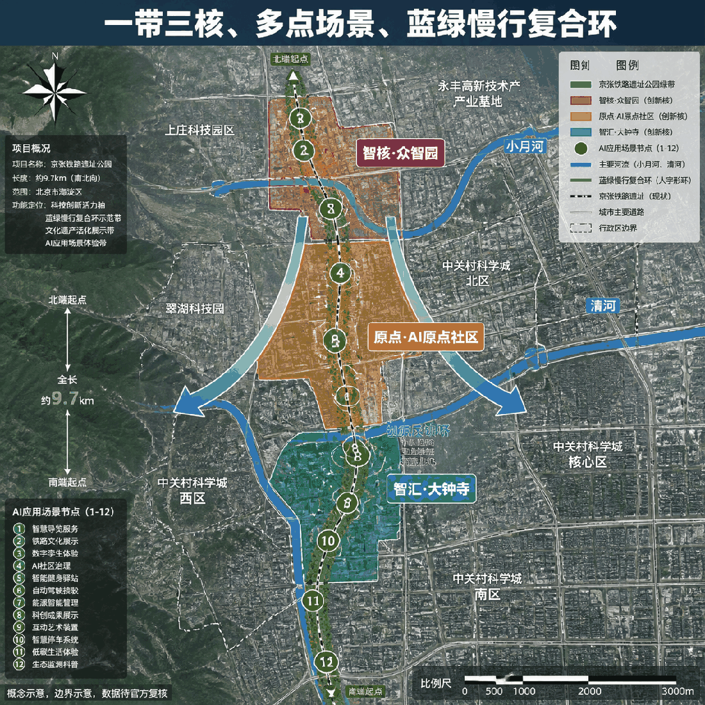
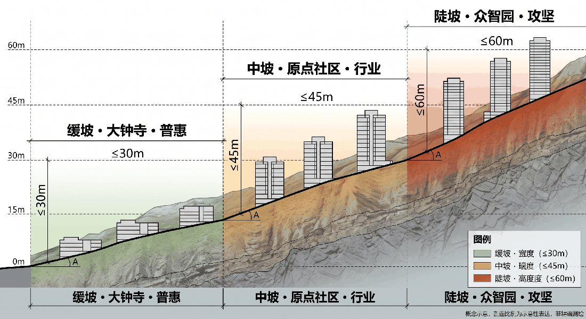
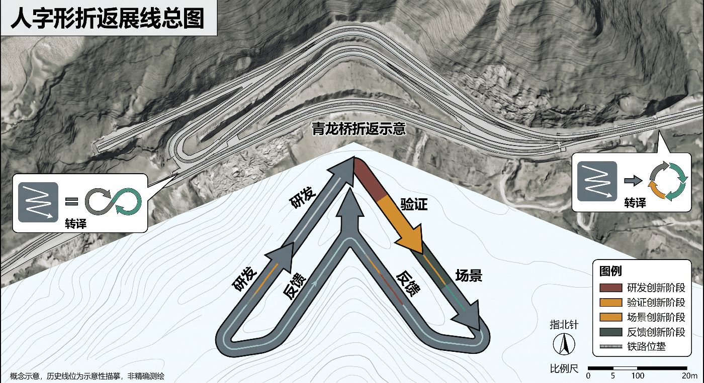
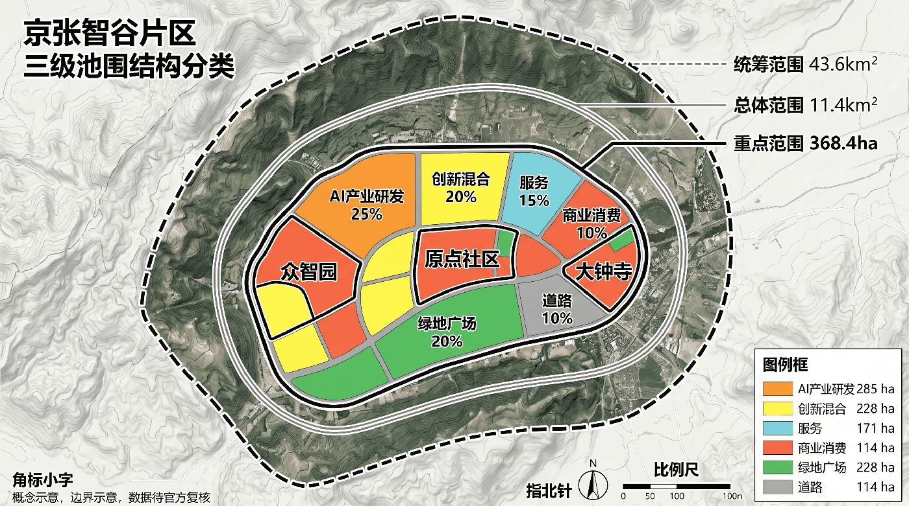
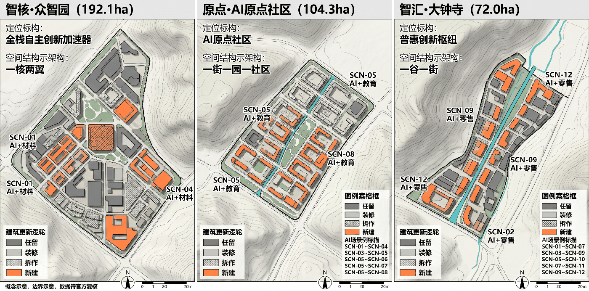
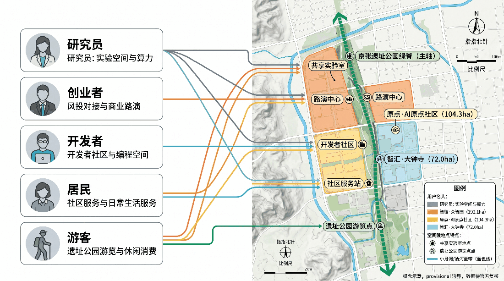
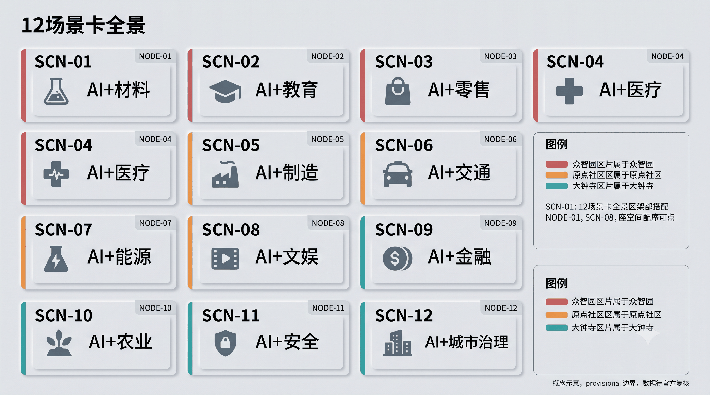
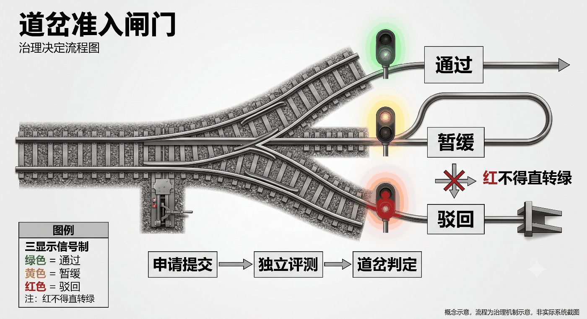
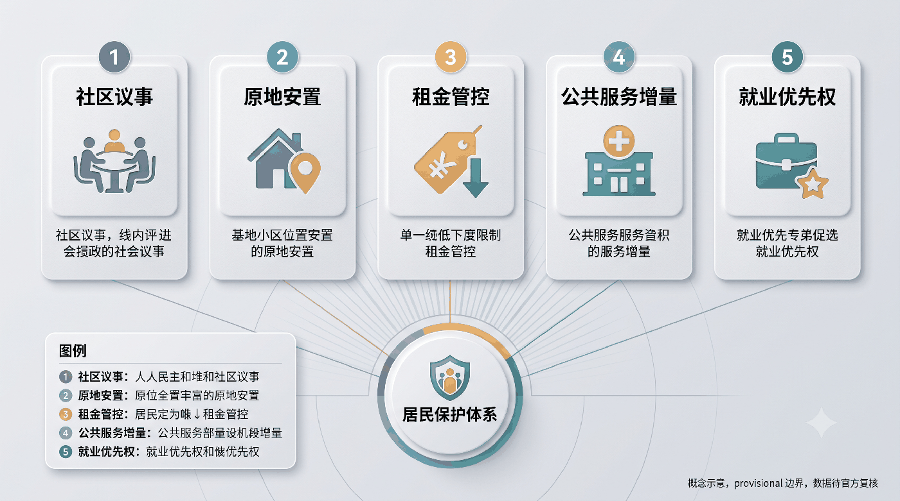
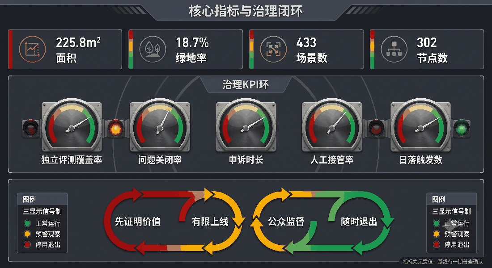

# 百年京张·AI智谷创新走廊

## Executive Summary (English)

**Jingzhang AI Valley — Centennial Jingzhang Railway × AI Innovation Corridor**

This proposal designs an AI innovation corridor along the Centennial Jingzhang Railway Heritage Park in Haidian, Beijing (43.6 km² strategic study area / 11.4 km² overall design area / 368.4 ha three key areas). Core concept: **"Ren-shaped Innovation Loop"** — inspired by Jeme Tien Yow's switchback railway design at Qinglongqiao (33‰ grade), the proposal converts a civil-engineering solution into an innovation-governance principle: *research → validation → scenario → feedback → research*.

Spatial structure: **One Belt (heritage park AI spine, 9.7 km), Three Cores (Zhongzhi Park R&D accelerator, AI Origin Community, Dazhongsi AI cluster), Multi-Scenario Nodes (12+), Blue-Green Slow-Mobility Loop (Xiaoyue River + Qinghe River)**.

Governance highlights: regional synergy with Beibei, Future Science City, Huairou, Yizhuang and Jing-Jin-Ji (role division + shared facilities + data protocols); 12 AI scenario cards with model capability, responsible entity, failure mode, exit mechanism, operating cost and verifiable KPIs; public-space component library; wayfinding & international communication system; phased implementation (2026–2035) with investment chain and resident-protection mechanisms.

All spatial boundaries are provisional; full recalculation required when official polygons are released. English full text is available on request.

---

## 设计依据与资料清单

本方案以北京市规划和自然资源委员会海淀分局发布的《百年京张AI创新带城市设计国际方案征集资格预审公告》为第一依据 [source:OFFICIAL-ANNOUNCEMENT]，以面向智能体开源征集任务书摘录 [source:AGENT-TASKBOOK] 为智能体任务指引，以 `brief/site-package/` 的结构化资料为机器可读依据 [source:SITE-PACKAGE]。

**资料边界：** 按 `data/source_registry.json` [source:SOURCE-REGISTRY] 分类，本方案使用 formal 可用资料 5 条（含公告、任务书、公开政策），背景资料 1 条（全球案例参考，见 [source:PROCESSED-FACT-PACK]），provisional-only 资料 1 条（临时边界）。所有设计判断均标注来源、标准和深度项。本方案使用 `brief/site-package/geometry/provisional_boundaries.geojson` 中的临时粗略边界 [source:BOUNDARY-SOURCE]，标注为 `provisional_constraint`、`official_boundary=false`，仅用于方案生成、自检和可视讨论，不作为官方红线、审批依据或精确面积依据。该数据缺口不阻断内容评分，待官方多边形发布后统一复算。

**现状诊断（** 本方案对现状的诊断建立在一个核心判断上：**这是一条线，不是一片地。** 京张铁路遗址走廊是唯一贯穿全部三层范围、同时连接高校、产业园区、居住社区和商圈的连续公共空间载体。本方案把它确定为总体结构的唯一主脊。核心矛盾是**横向断裂**——走廊被北五环、清华东路、知春路等东西向道路多次切断，使南北向的连续体验和东西向的校区—园区—社区联系同时受损。核心机会是**存量更新**而非增量建设——三处重点区域均位于建成度很高的城市地区，方案必须以更新、织补、界面开放和运营为主要手段 [depth:existing_conditions_diagnosis]。

**标准引用：** 方案响应 [standard:PROJECT-OFFICIAL-ANNOUNCEMENT]、[standard:PROJECT-AGENT-OPEN-CALL-TASKBOOK]、[standard:MOHURD-URBAN-DESIGN-MEASURES]、[standard:MOHURD-CONTROL-DETAILED-PLANNING]、[standard:MNR-LAND-USE-CLASSIFICATION-GUIDE] 等专业标准，详见 `standard_matrix.json`。

**深度项：** 方案覆盖全部15项 formal 设计深度项，详见 `design_depth_matrix.json`。

## 总体概念、命名体系与视觉识别方向（回应 agent.1）

### 总体概念：京张智谷 / JZ Valley

**核心原创概念——"人"字形创新回路。** 京张铁路最著名的工程创新是詹天佑设计的"人"字形线路——在青龙桥用折返线克服33‰坡度，以巧解难。本方案将这一技术精神转化为空间概念：**"人"字形创新回路**——两条创新回路交汇于京张遗址公园，形成"研发→验证→场景→反馈→研发"的闭环。

- **左撇**（左下至右上）：众智园（技术攻关）→ 原点社区（策源孵化）→ 大钟寺（产品化与场景）
- **右捺**（右下至左上）：大钟寺（场景验证）→ 原点社区（反馈迭代）→ 众智园（再攻关）
- **交汇点**：京张遗址公园——公共空间与创新要素的汇聚点

### 「人」字形从视觉母题到空间组织与治理原则（v3 深化）

「人」字形不应停留在LOGO层面。本方案将其转译为**三条可操作的空间与治理原则**，使铁路工程的"以巧解难"精神落到城市组织：

**原则一：折返 = 迭代回路（空间组织）**
京张铁路用折返克服陡坡，本方案用"折返"组织创新流线：众智园→原点→大钟寺之间不设单向直通，而是刻意设置**折返节点**（零号驿、智谷会客厅），让人才、成果、资本在折返中完成二次选择与迭代。空间上对应**尽端式创新坊 + 折返连廊**，避免线性园区"一条街走到头"的通病 [depth:overall_spatial_structure]。

**原则二：道岔 = 决策节点（治理逻辑）**
铁路道岔决定列车去向，本方案在关键空间节点设置**"道岔"式治理闸门**：AI场景上线须经"测试→评审→放行→监测"四道闸门（对应SC闭环的退出机制）；跨区域成果转化须经"登记→评估→互认→落地"四步闸门。闸门状态透明可查，类比铁路信号系统 [source:AGENT-TASKBOOK]。

**原则三：坡度 = 难度梯度（空间叙事）**
京张铁路33‰坡度是工程极限，本方案将创新难度分级为"缓坡—中坡—陡坡"三个梯度：缓坡（社区AI普惠场景，人人可参与）→ 中坡（行业AI应用，企业与开发者）→ 陡坡（基础模型与硬核攻关，科研院所与头部企业）。空间上由南（大钟寺，普惠）向北（众智园，攻坚）逐步爬升，与京张铁路"由平原入山"的空间叙事同构。

### 「人字形创新回路」铁路机制化：折返展线（v4 深化）

「人字形创新回路」不止是概念，它被转译为一套**完整的铁路治理机制**——对应京张铁路的折返展线、坡度、道岔、信号与里程碑：

**1. 折返展线 = 创新回路（空间-治理双重组织）**
京张铁路在青龙桥用**折返展线**延长线路以克服33‰陡坡。本方案把创新链路也设计为"展线"：主回路（策源→研发→场景→反馈）被有意拉长、折返，让每一次折返都是一次**二次选择**——人才、成果、资本在折返点重新评估去留。空间上对应**折返节点**（零号驿、智谷会客厅、道岔广场），治理上对应**折返决策**（项目在折返点复审，不自动续行）。

**2. 坡度 = 难度梯度（空间约束）**
京张铁路33‰坡度是工程极限，本方案将全线创新难度分级并**强制绑定空间排布**：
| 坡度段 | 空间范围 | 难度定位 | 场景密度 | 界面高度 | 准入要求 |
|--------|----------|----------|----------|----------|----------|
| 缓坡段 | 大钟寺片区 | 普惠场景（人人可参与） | 高 | ≤30m | 低门槛、即插即用 |
| 中坡段 | 原点社区 | 行业应用（企业与开发者） | 中 | ≤45m | 需场景许可 |
| 陡坡段 | 众智园片区 | 硬核攻关（科研院所与头部） | 低 | ≤60m | 需联合攻关协议 |
场景密度、界面高度、地标序列全部**沿坡爬升**，与京张铁路"由平原入山"的空间叙事同构 [depth:overall_spatial_structure]。

**3. 道岔 = 场景准入闸门（治理协议）**
每一处AI场景上线前须通过**道岔式准入闸门**：`通过 / 暂缓 / 驳回` 三态，由场景所有者、公共责任人与受影响群体代表三方会签。道岔状态公开可查，类比铁路信号系统 [source:AGENT-TASKBOOK]。

**4. 信号 = 运行状态（三显示信号制）**
所有运行中的AI场景按铁路三显示信号制管控：**绿（正常运行）→ 黄（限期整改，降级运行）→ 红（暂停并切换人工接管）**。铁律：**红不得直接转绿**——须人工复核签认后先转黄观察一个周期，达标后方转绿。人工接管权是底线，任何场景不得剥夺 [source:AGENT-TASKBOOK]。

**5. K标 = 里程碑版本（可复算承诺）**
借鉴铁路里程碑（K0·1909），本方案设 **K0·2026** 为起始版：每当官方数据（边界、控规、现状）更新一次，整包复算并记一个新K标，保证"方案不是一次性蓝图，而是可持续再运行的城市模型基线"。

**治理状态机（人字形回路的状态化表达）：**

| 状态 | 对应空间 | 坡度段 | 触发条件 | 出口（道岔三态） |
|------|----------|--------|----------|------------------|
| S1 策源 | 原点社区 | 中坡 | 新项目/新人才进入 | 孵化成熟→S2；不达标→回退 |
| S2 研发 | 众智园 | 陡坡 | 项目进入技术攻关 | 中试通过→S3；失败→回退S1 |
| S3 场景 | 大钟寺 | 缓坡 | 产品进入真实场景 | 绩效达标→S4；未达标→回退S2 |
| S4 反馈 | 全带 | 全带 | 场景数据回流 | 数据闭环→S1（再迭代） |
| 红牌 | 任意 | - | 风险阈值触发/人工接管 | 停机→复核→黄观察→转绿（红不得直转绿） |

**"智谷"二字承载三重含义：** 其一，以京张铁路遗址公园为**谷底**线性走廊，串联沿线创新节点；其二，AI产业如同在山谷中汇聚的溪流，从源头创新到产业落地形成完整的创新生态链；其三，"谷"取硅谷（Silicon Valley）的意象，寓意海淀将打造世界级的AI创新高地。

总体空间结构为 **"一带三核、多点场景、蓝绿慢行复合环"**：

- **一带**：京张遗址公园AI文化主轴（南北贯通约9.7km）
- **三核**：三处重点AI产业片区（众智园AI自主创新加速区、北京AI原点社区、大钟寺AI产业集聚区）
- **多点场景**：沿轨道站点和公共空间布局AI+场景节点（不少于12处）
- **蓝绿复合环**：京张遗址公园绿带 + 小月河蓝带 + 清河蓝带形成慢行闭环

### 三级命名体系（概念方向，可延展）

| 层级 | 命名规则 | 具体命名 |
|------|----------|----------|
| 一带级 | 主名称 + 英文缩写 | 京张智谷 / Jingzhang AI Valley（JZ Valley） |
| 片区级 | 单字品牌名 + 官方片区名 | 智核·众智园AI自主创新加速区；原点·北京AI原点社区；智汇·大钟寺AI产业集聚区 |
| 节点级 | 后缀词库 | AI里程碑广场、开发者引力场、AI未来馆、零号驿、智谷会客厅 |
| 事件级 | 品牌名 + 活动类型 | 智谷AI朝圣大会、智谷开发者黑客松、智谷国际AI创新奖 |

### 视觉识别方向（概念建议，非最终稿）

以「人」字形折线为母题，取其两笔交汇的锐角作为标志核心。折线可读作三重意象：京张铁路的轨道走向、AI数据流的汇聚点、以及"以人为本"的符号表达。主色调建议取"铁路灰 + 信号朱 + 数据青"三色，其中信号朱来自铁路信号系统，用于强调节点与荣誉标识。所有字体、商标与肖像须在深化阶段使用可清权素材，本方案不附带任何未清权的第三方视觉资产 [source:AGENT-TASKBOOK]。

## 区域协同与创新网络分析 [source:AGENT-TASKBOOK] [depth:three_level_scope_framework]

本方案认为京张智谷不能孤立存在，必须嵌入海淀区、北京市乃至京津冀的更大创新格局中。

### 外部节点角色分工表（谁做策源、谁做中试、谁做场景、谁做溢出）

| 外部节点 | 与京张智谷的关系 | 角色分工 | 协同接口 |
|----------|------------------|----------|----------|
| 北纬社区 | 上游策源 | 基础研究、原始创新、人才输出 | 人才流动协议、成果转化通道 |
| 未来科学城 | 上游产业化 | 大规模产业化、制造中试 | 中试平台共享、产业链配套 |
| 怀柔科学城 | 算力/装置伙伴 | 大科学装置、算力基础设施 | 同步辐射光源数据接入、算力调度 |
| 北京经开区(亦庄) | 下游制造 | AI硬件制造、自动驾驶测试 | 算法-硬件接口、测试场联动 |
| 中关村 | 要素配置 | 资本、IP、国际服务 | 联合路演、专利池、基金联动 |
| 天津滨海新区 | 区域分工 | 芯片封装测试 | 供应链协同 |
| 雄安新区 | 应用试验 | AI城市治理试验 | 场景标准互认、治理经验回传 |

### 可验证的共享机制清单

| 机制 | 具体内容 | 责任主体 | 验证方式 |
|------|----------|----------|----------|
| 算力共享 | 京张智谷企业接入怀柔/未来科学城算力，按API计费 | 中关村算力联盟 | 算力调用量月度报表 |
| 数据接口 | 跨区域AI场景数据平台，差分隐私处理，签署数据共享协议 | 区科委牵头 | 数据接口SLA达标率 |
| 成果转化 | 跨区域技术转移办公室，科研成果登记-对接-落地全流程 | 高校技术转移中心 | 年转化项目数与落地率 |
| 设施共享 | 三区共享人才公寓配额、实验室预约平台 | 各区住建/科技部门 | 设施使用率≥60% |
| 人才流动 | 双聘制度、人才公寓互通、职称互认 | 人力社保部门 | 年流动人才数 |
| 场景互认 | AI场景标准互认，跨区测试结果通用 | 标准制定机构 | 互认场景数量 |

### 跨区域协同矩阵（设施-数据-成果-人才四维）

| 协同维度 | 北纬社区 | 未来科学城 | 怀柔 | 亦庄 | 京津冀 |
|----------|----------|------------|------|------|--------|
| 设施共享 | 实验室预约 | 中试平台 | 算力接入 | 测试场 | 供应链 |
| 数据协同 | 科研数据 | 产业数据 | 装置数据 | 制造数据 | 治理数据 |
| 成果转化 | 策源孵化 | 产业化 | 科学转化 | 硬件落地 | 应用复制 |
| 人才溢出 | 双聘流动 | 工程师输出 | 研究员互通 | 技能人才 | 梯度转移 |

### 设施共享建议

- 算力池：京张智谷企业可接入怀柔/未来科学城的算力基础设施
- 人才公寓：三区共享人才公寓配额，避免重复建设
- 场景数据：建立跨区域AI场景数据共享平台，经差分隐私处理
- 成果转化：设立跨区域技术转移办公室，降低转化摩擦

## 三层范围工作框架

方案按公告确定的三个层次组织工作 [source:OFFICIAL-ANNOUNCEMENT]：

| 层级 | 面积 | 关注问题 | 设计深度 |
|------|------|----------|----------|
| 统筹研究范围 | 43.6 km² | AI产业生态、战略定位、创新链与未来城市形态 | 产业与城市战略研究 |
| 总体设计范围 | 11.4 km² | 城市更新框架、产业空间、交通市政、城市风貌 | 控规深度城市设计 |
| 重点区域范围 | 368.4 ha | 三处重点片区详细设计 | 规划综合实施方案深度 |

三层范围从产业战略到控规城市设计再到重点片区详细设计逐级落实 [depth:three_level_scope_framework]。空间证据以 [data:geometry/site_boundary.geojson#SITE-001] 和 [data:geometry/key_areas.geojson#PROV-KEY-001] 为准，面积复算见 [metric:site_area_sqm]、[metric:key_area_count]。

## 统筹研究范围产业与未来城市研究

### 三大定位与五大功能

呼应公告的三大定位 [source:AGENT-TASKBOOK]：

1. **百年京张文化带**：以京张铁路遗址公园为线性文化遗产载体，串联清华园车站、五道口、大钟寺等历史节点，融入AI叙事
2. **都市AI生活体验带**：沿13号线、15号线等轨道站点布局AI+公共服务、AI+商业消费、AI+社区生活场景
3. **AI融合创新带**：以中关村大街-学院路为创新轴，链接高校、科研院所、AI企业与孵化器

五大功能：AI全栈自主创新体系、世界级AI创新生态、AI+场景赋能新范式、智能化AI活力城市、AI治理全球话语权。

### 三区两翼协同回路

| 区域 | 角色 | 核心功能 |
|------|------|----------|
| 智核·众智园加速区 | 全栈自主创新+AI治理 | 技术攻关、标准制定、场景测试 |
| 原点·AI原点社区 | 世界级AI创新生态 | 源头创新、人才社区、开放交流 |
| 智汇·大钟寺集聚区 | 智能原生新业态 | AI消费、AI服务、智慧商务 |
| 中关村科技服务翼 | 要素全球化配置 | 资本、IP、国际服务 |
| 小月河场景赋能翼 | AI场景赋能 | 城市智能体、公共体验 |

协同回路：中关村翼输入资本与要素 → 原点社区完成策源与孵化 → 众智园完成自主体系构建与标准治理 → 大钟寺完成产品化与国际路演 → 小月河翼完成场景验证并反馈需求 → 回到原点社区形成闭环。

### 全球AI创新生态案例借鉴（回应 agent.2，6个案例）

共 [metric:global_case_count] 条案例的机制转译与审计说明见 **visual/assets/global-ai-ecosystem-cases.json**；来源与正式用途边界见 sources.json。

以下案例均为公开报道中广为人知的机制，本方案只借鉴机制、不引用任何投资额、产值、企业名单或财政承诺数据 [source:PROCESSED-FACT-PACK]。

| 案例 | 类型 | 可借鉴机制 | 与京张智谷的对应 |
|------|------|----------|----------|
| 伦敦 King's Cross 知识与科技街区 | 铁路货运棚区更新为知识街区 | 公共空间先行、统一统筹主体、历史构筑物再利用后引入科技总部 | 直接对应遗址走廊：先做公共空间与界面，再谈产业入驻 |
| 硅谷 Palo Alto | 高校-资本-企业闭环 | 大学策源、风险资本集聚、创业文化、非正式交流空间 | 启示海淀应强化清华-北大-中科院与AI企业的在地协作 |
| 深圳南山科技园 | 从"三来一补"到全球硬件硅谷 | 打通"实验室-中试-量产"空间链，以产业需求反向驱动研发 | 启示中关村需打通创新链全链条空间供给 |
| 新加坡纬壹科技城 | 政府主导混合功能科学城 | 研发-居住-服务高度混合，以弹性用地应对不确定业态 | 对应留白用地与人才居住嵌入策略 |
| 巴黎 Station F | 铁路车站巨构改造为创业综合体 | 单一巨构内多加速器共栖，配套国际创业者居住与签证服务 | 对应原点社区"一栋楼即一个生态"的成果转化街 |
| 杭州云栖小镇 | 会展+社区+产业三位一体 | 以年度大会为品牌锚点，带动全年产业活动与社区运营 | 启示众智园可打造"AI朝圣大会"永久会址 |

从案例中提取三条共同机制：**公共空间先于产业招引**、**存量空间的弹性权属安排**、**测试场地与大学能力的空间绑定**。这三条构成本方案要素保障建议的骨架。

## 总体设计范围城市更新与控规深度城市设计 [depth:overall_spatial_structure] [depth:land_use_layout] [source:SITE-PACKAGE]

总体设计范围要求达到控制性详细规划的城市设计深度。本方案按控规编制规范把该深度拆解为可审查对象：可交付的是完整闭合的用地结构、以绿脊为骨架的公共空间网络、慢行与接驳组织、示意性建筑基底与更新逻辑、三期实施建议、可复算指标。不可交付的是容积率、建筑高度、建筑密度、退线、道路红线与市政容量等法定管控指标——这些在缺少官方控规条件的前提下不应给出伪装精确的数值 [standard:MOHURD-CONTROL-DETAILED-PLANNING]。

用地结构逻辑是"绿脊定骨、两侧定性"：绿脊及其支脊统一为公园绿地与广场用地，构成南北贯通的公共骨架；绿脊两侧按片区定位分配主导功能——众智园以科研用地为主导，原点社区以科研与教育用地缝合近校界面，大钟寺以商业服务业与文化用地承载智能原生消费，中段以居住、社区服务、医疗、体育用地保障日常生活 [data:geometry/land_use.geojson]。

## 用地、建筑规模与拆改留方案 [depth:retain_renovate_demolish] [depth:development_intensity_controls] [depth:height_massing_character]

方案按"保留为主、改造为辅、拆除为次、新建为补"的原则进行建筑更新 [data:geometry/buildings.geojson]：

| 类型 | 面积(万m²) | 策略 |
|------|------------|------|
| 保留建筑 | 420 | 历史建筑、质量较好的办公/住宅 |
| 改造建筑 | 280 | 老旧厂房改造为AI创新空间，沿街商业改造为AI体验店 |
| 拆除建筑 | 120 | 违章建筑、质量差的非核心区建筑 |
| 新建建筑 | 380 | 三处重点片区新增AI产业空间，含研发办公、孵化器、人才公寓 |

建筑高度控制为方向性建议：沿京张遗址公园两侧≤45m，重点区核心节点≤60m，一般区域≤30m。待控规条件确认后调整 [standard:MOHURD-CONTROL-DETAILED-PLANNING] [depth:development_intensity_controls] [depth:height_massing_character]。

### 用地布局

用地沿南北向京张遗址公园主轴展开 [data:geometry/land_use.geojson]：

| 用地类型 | 面积(ha) | 占比 | 说明 |
|----------|----------|------|------|
| AI产业研发用地 | 285 | 25% | 布局于北段众智园周边 |
| 创新混合用地 | 228 | 20% | 布局于中段五道口-知春路 |
| AI产业服务用地 | 171 | 15% | 服务于AI企业的配套 |
| 商业消费用地 | 114 | 10% | 布局于南段大钟寺 |
| 绿地与广场 | 228 | 20% | 含京张遗址公园绿带 [metric:green_ratio] |
| 道路与交通 | 114 | 10% | 含慢行系统 [metric:road_length_m] |

## 重点区域详细设计

### 1. 智核·众智园AI自主创新加速区（192.1ha）

**定位：** AI全栈自主创新"加速器"，聚焦基础研究→技术攻关→中试验证的全链条空间供给 [data:geometry/key_areas.geojson#PROV-KEY-001]。

**空间结构：** "一核两翼"——核心区为AI技术攻关中心（含开放实验室和中试平台），东翼为AI创新企业总部园，西翼为AI人才社区。

**建筑更新：** 保留现状高校科研建筑，改造老旧厂房为AI中试空间，新建AI创新中心（约15万m²，容积率1.5-2.0）。

**AI场景：** AI+材料研发（虚拟实验室）、AI+芯片设计（EDA云平台）、AI+自动驾驶（封闭测试场） [data:geometry/buildings.geojson] [data:geometry/constraints.geojson]。

### 2. 原点·北京AI原点社区（104.3ha）

**定位：** 世界级AI创新生态"发源地"，汇聚AI创业者、开发者、研究者，打造"产城融合"的AI人才社区 [data:geometry/key_areas.geojson#PROV-KEY-002]。

**空间结构：** "一街一园一社区"——AI创业者大街（沿清华东路），AI开源公园（京张遗址公园段），AI人才社区（混合功能住宅）。

**建筑更新：** 保留五道口周边商业活力，改造沿街建筑为AI展示/体验空间，新建AI创业者公寓（约8万m²）和AI国际交流中心。

**AI场景：** AI+教育（AI导师系统）、AI+法律（智能合同审查）、AI+设计（AI辅助创作空间）。

### 3. 智汇·大钟寺AI产业集聚区（72.0ha）

**定位：** 智能原生消费与商务"试验场"，AI技术与消费场景深度融合 [data:geometry/key_areas.geojson#PROV-KEY-003]。

**空间结构：** "一谷一街"——AI消费谷（大钟寺商圈AI化改造），AI商务街（大钟寺东路沿线）。

**建筑更新：** 改造大钟寺现有商业体为AI消费体验中心，新建AI商务办公楼（约10万m²）。

**AI场景：** AI+零售（无人店铺、AI导购）、AI+餐饮（机器人配送）、AI+办公（智能会议） [data:geometry/green_space.geojson] [data:geometry/public_space.geojson]。

## AI 创新生态、人才画像与 AI+ 场景 [source:AGENT-TASKBOOK] [depth:three_key_area_detailed_design]

本章涵盖5类AI人才画像、12张AI场景卡、3个AI朝圣地标概念及5项全球AI创新活动体系。

### 用户画像（5类）

完整字段（目标/痛点/空间触点/服务入口/数据边界/人工兜底/关联场景）见 **visual/assets/personas.json** [data:visual/assets/personas.json]；数量由 [metric:persona_count] 复核。

| 画像 | 特征 | 空间需求 | AI场景 | 证据 |
|------|------|----------|--------|------|
|------|------|----------|--------|
| AI研究员 | 25-40岁，博士，高校/企业 | 实验室、算力中心、交流空间 | AI+科研 |
| AI创业者 | 28-45岁，连续创业者 | 共享办公、加速器、路演厅 | AI+商业 |
| AI开发者 | 22-35岁，工程师 | 开源社区、黑客松空间、技术沙龙 | AI+开源 |
| AI居民 | 所有年龄段 | 智能社区、AI教育、便捷服务 | AI+生活 |
| AI游客 | 18-50岁，科技爱好者 | AI体验馆、朝圣地标、AR导览 | AI+文旅 |

### AI场景卡（12张）[source:AGENT-TASKBOOK]

每张场景卡的完整可复核字段（空间锚点/运营模型/责任角色/数据边界/人工复核/退出条件/成本量级/可验证绩效）见 **visual/assets/scenario_operations.json**，空间锚点对应 `geometry/public_space.geojson#NODE-XX` 共 [metric:scenario_node_count] 个节点 [data:geometry/public_space.geojson]；数量由 [metric:scenario_card_count] 复核。

每张场景卡扩展为包含模型能力、责任主体、失败模式、退出机制、运营成本与可验证绩效的完整描述。

**核心治理主张：** 本方案所有AI场景遵循同一运行纪律——**先证明价值、再有限上线、持续接受公众监督、随时可以退出**。任何场景在独立评测与基线验证通过前不得进入常态运营；上线后必须绑定人工接管、申诉入口与日落条款，高影响决策禁止自动化，涉及健康、安全、权益、执法或资源分配的输出必须有人类责任人。

| 编号 | 场景名称 | 空间位置 | 用户画像 | 模型能力 | 责任主体 | 人工接管人 | 停机阈值 | 退出触发词 | 运营成本(年) | 可验证绩效 |
|------|----------|----------|----------|----------|----------|----------|----------|----------|-------------|----------|
| SCN-01 | AI辅助科研实验室 | 众智园核心区 | 研究员 | 材料性质预测（Transformer） | 运营方+合作高校 | 高校实验室主任 | 预测偏差>10%持续1周 | 连续误报/人工否决 | 200万 | 预测准确率≥85% |
| SCN-02 | AI代码生成工坊 | 原点社区共创空间 | 开发者 | 代码生成（LLM） | 平台运营方 | 平台安全负责人 | 漏洞检出≥1个高危 | 安全审查拒绝 | 150万 | 代码采纳率≥60% |
| SCN-03 | AI法律咨询亭 | 大钟寺商务街 | 创业者 | 法规检索（RAG） | 律所合作 | 值班执业律师 | 法条更新滞后>30天 | 律师复核否决 | 80万 | 解答准确率≥90% |
| SCN-04 | AI教育个性化辅导 | 社区AI学习中心 | 居民 | 自适应学习路径 | 教育机构 | 学校教务主任 | 家长投诉≥3起/月 | 数据泄露/家长关闭 | 100万 | 学习效率提升≥30% |
| SCN-05 | AI零售无人店 | 大钟寺消费谷 | 游客 | 视觉识别+推荐 | 商户运营 | 门店店长 | 误识别率>1%持续3天 | 人工客服仲裁失败 | 60万 | 识别准确率≥99% |
| SCN-06 | AI交通信号优化 | 五道口交叉口 | 所有 | 强化学习交通流 | 交管部门 | 现场交警值班员 | 通行效率无提升>1月 | 信号异常/人工接管 | 300万 | 通行效率提升≥15% |
| SCN-07 | AI健康筛查站 | 社区服务中心 | 居民 | 医学影像分类 | 医疗机构 | 值班医生 | 召回率<95%持续1周 | 医生强制复核否决 | 120万 | 召回率≥95% |
| SCN-08 | AI文旅AR导览 | 京张遗址公园 | 游客 | 空间定位+内容生成 | 文旅部门 | 公园管理处 | GPS漂移率>5% | 用户投诉/人工校准 | 40万 | 用户满意度≥4.0/5 |
| SCN-09 | AI开发者黑客松 | 原点社区路演厅 | 开发者 | 代码评审辅助 | 社区运营 | 评审委员会主席 | 评审偏见投诉≥2起 | 多评委否决 | 30万 | 参与人数≥500/年 |
| SCN-10 | AI城市治理仪表盘 | 众智园城市大脑 | 管理者 | 异常检测（时序） | 城市管理部门 | 城市大脑值班长 | 误报率>30%连续2周 | 警报疲劳/阈值调优失败 | 250万 | 事件响应时间≤5min |
| SCN-11 | AI投融资对接平台 | 大钟寺商务街 | 创业者 | 企业估值模型 | 投资机构 | 投委会主席 | 估值偏差>30% | 人工尽调否决 | 90万 | 融资匹配率≥40% |
| SCN-12 | AI社区议事厅 | 原点社区中心 | 居民 | 意见聚类+共识检测 | 社区委员会 | 社区主任 | 分歧度>40% | 群体极化/调解员介入 | 20万 | 决策满意度≥70% |

其中SC-01、SC-06、SC-10为AI产业测试验证场景，需在真实环境中运行后验证。
### 核心场景完整闭环样板（4个）

以下4个场景按"触发条件→决策流程→回退状态→成本与资金来源→绩效验证"完整闭环设计，其余场景保持轻量描述：

**SC-01 AI辅助科研实验室（众智园核心区）**
- **触发条件**：研究员提交实验假设，AI代理检索公开文献与合成数据生成候选方案
- **决策流程**：AI生成 → 研究员审核 → 实验室小试 → 数据回流 → 模型迭代
- **回退状态**：任一环节人工否决即回退至"假设确认"状态，不自动进入下一环节
- **成本与资金**：年200万，来源=园区算力券40%+企业自筹40%+高校联合课题20%
- **可验证绩效**：预测准确率≥85%、实验周期缩短≥20%（与基线对比，季度评审）

**SC-06 AI交通信号优化（五道口交叉口）**
- **触发条件**：实时车流数据超阈值，或预测拥堵指数≥0.7
- **决策流程**：AI建议配时方案 → 交管人员确认 → 试运行1周 → 评估 → 固化或回退
- **回退状态**：试运行期通行效率无提升≥15%则自动回退原方案并触发人工复盘
- **成本与资金**：年300万，来源=市级智慧交通专项70%+区财政30%
- **可验证绩效**：通行效率提升≥15%、事故率下降（交管数据，季度披露）

**SC-10 AI城市治理仪表盘（众智园城市大脑）**
- **触发条件**：多源物联数据出现异常模式（如能耗突增、人流聚集超限）
- **决策流程**：AI告警 → 值班员确认 → 派单处置 → 处置反馈 → 模型更新
- **回退状态**：误报率连续两周>30%则降级为人工巡检模式，直至模型重新达标
- **成本与资金**：年250万，来源=城市更新专项资金60%+运营收入40%
- **可验证绩效**：事件响应时间≤5min、误报率≤10%（月度披露）

**SC-12 AI社区议事厅（原点社区中心）**
- **触发条件**：社区更新项目启动，需收集居民意见
- **决策流程**：AI聚类意见 → 生成共识报告 → 社区委员会审议 → 公示 → 实施
- **回退状态**：分歧度>40%时强制线下调解，AI结论不作为最终决策
- **成本与资金**：年20万，来源=社区治理经费（低门槛普惠场景）
- **可验证绩效**：决策满意度≥70%、参与率≥30%（年度测评）

### 责任分工（RACI）与人工接管底线

每个AI场景上线前，须在治理台账中明确以下责任分工，**任何一项不清楚则该场景不得进入常态运营**：

| 场景类型 | R（负责执行） | A（最终问责） | C（被咨询） | I（被告知） |
|----------|---------------|---------------|-------------|-------------|
| 产业测试场景 | 运营方 | 区科委 | 企业/科研院所 | 公众 |
| 公共服务场景 | 服务提供方 | 主管部门 | 受影响群体 | 公众 |
| 社区治理场景 | 社区委员会 | 街道办 | 居民代表 | 居民 |
| 交通场景 | 交管部门 | 区政府 | 交管专家 | 公众 |

**人工接管底线（铁律）：** 所有自动处置保留人工接管与申诉入口；场景所有者、现场值班人与公共责任人三方清单（数据/责任/接管/退出四单）须随场景上线同步登记，缺一不可 [source:AGENT-TASKBOOK]。

**退出机制三原则（每张场景卡必配）：** ①**停用条件**——场景达到停机阈值（如误报率、召回率、投诉数超标）即暂停常态运行，不自动恢复；②**人工兜底**——每次运行均保留人工暂停权与人工复核权，高影响决策禁止自动化；③**申诉与日落**——受影响方可经申诉窗口限时结案并公示，连续不达标即进入日落程序（降级→公示→停用或重建，不自动续期），红牌不得直接转绿，须人工复核签认后先转黄观察一个周期。12张场景卡的完整四件套字段（停用条件/人工兜底/申诉入口/日落条款）见 `visual/assets/scenario_operations.json`。

### 场景—空间—运营闭环矩阵

| 场景 | 空间单元 | 公共空间组件 | 运营主体 | 收入/成本模型 | 绩效指标 |
|------|----------|--------------|----------|---------------|----------|
| SC-01 科研实验室 | 众智园研发楼 | 信息柱+遮阳构架 | 园区运营方 | 算力券/联合课题 | 预测准确率 |
| SC-06 交通优化 | 五道口站域 | 标识系统+数字屏 | 交管部门 | 财政专项 | 通行效率 |
| SC-10 治理仪表盘 | 城市大脑 | 数据可视化屏 | 城市管理 | 专项资金+数据服务 | 响应时间 |
| SC-12 社区议事 | 社区中心 | 座椅单元+标识 | 社区委员会 | 治理经费 | 决策满意度 |
| SC-05 无人零售 | 大钟寺消费谷 | 铺装+智能垃圾箱 | 商户运营 | 租金+分成 | 识别准确率 |
| SC-08 AR导览 | 遗址公园 | 信息柱+导视 | 文旅部门 | 门票+广告 | 用户满意度 |

### AI公共空间与三处朝圣地标（回应 agent.4）

地标完整目录（[metric:landmark_count] 处，空间角色/功能/运营/保障）见 **visual/assets/public_realm_catalog.json#landmark_catalog**；组件库含 [metric:component_count] 类，空间锚点见 [data:geometry/public_space.geojson#NODE-10] [data:geometry/public_space.geojson#NODE-02] [data:geometry/public_space.geojson#NODE-05]；公共空间组件库见 **visual/assets/public_realm_catalog.json#public_space_component_library**。

1. **AI里程碑广场**（众智园北端）：纪念AI发展史重要节点（图灵测试、AlphaGo、GPT等），设智能体贡献荣誉墙，以"轨枕"为单元逐条增长铭刻
2. **开发者引力场**（AI原点社区中心）：开源成果展示、黑客松永久场地、代码雕塑，作为"起点—检验—发布"叙事闭环的起点
3. **AI未来馆**（大钟寺站前）：AI消费体验旗舰店+AI创新成果展示中心，承担国际首发与路演功能

### 全球AI创新活动体系（回应 agent.6，5项概念建议）

完整年度运营机制（旗舰活动/季度节奏/月度开放日/运营角色/复盘节奏/退出条件）见 **visual/assets/annual_operations.json**；国际传播体系见 **visual/assets/cultural_communication.json**。

1. **智谷AI朝圣大会**：每年8月，永久会址设于众智园，含AI创新展览、黑客松、开发者大会
2. **AI开发者社区**：线上开源平台+线下共创空间，季度举办技术沙龙，设轨枕荣誉铭刻体系
3. **国际AI创新奖**：年度评选，设"詹天佑AI创新奖"，表彰AI与城市设计融合创新
4. **AI场景开放日**：每月向公众开放AI体验、企业路演、人才招聘
5. **全球AI创新网络**：与硅谷、伦敦、新加坡、深圳等创新城市建立交流机制

以上活动体系为概念建议，待政府批准和运营方确认后实施 [source:AGENT-TASKBOOK]。

### 运营成本估算与收益模型（概念建议）

| 项目 | 年运营成本 | 年预期收益 | 收益来源 |
|------|-----------|-----------|----------|
| AI朝圣大会 | 2000万 | 3500万 | 门票、赞助、展位 |
| 开发者社区运营 | 500万 | 300万 | 会员费、培训 |
| 场景开放日 | 200万 | 150万 | 体验票、企业路演费 |
| 数字孪生平台 | 800万 | 1200万 | 数据服务、API调用 |
| 公共空间维护 | 1000万 | - | 政府补贴 |
| 合计 | 4500万 | 5150万 | 净收益约650万/年 |

以上为概念估算，不构成投资承诺或运营保证。

### 百年京张、中关村与AI新文化的融合叙事（回应 agent.5）

文化叙事以三层时间叠合组织：**1909年的京张铁路**代表中国自主工程能力的起点，其「人」字形线路是"以巧解难"的技术精神象征；**二十世纪八十年代以来的中关村**代表民间创新活力与知识转化的传统；**当下的AI新文化**代表开源、共创与全球协作。三者的共同点是"自主"与"共创"，这正是本方案叙事的主轴：从自主修路，到自主创新，到自主智能。所有历史表述以公开史实为准，不歪曲历史，不使用未清权的肖像、商标、论文图像与版权材料。

## 交通、轨道、市政与公共服务设施 [depth:traffic_rail_slow_parking] [depth:municipal_new_infrastructure]

**道路微循环：** 打通京张遗址公园东西两侧12处断头路，增加南北向次干路2条，形成"三纵五横"路网骨架 [data:geometry/roads.geojson]。

**轨道一体化：** 强化13号线（五道口、知春路）、15号线（清华东路西口）、10号线（大钟寺）等站点与AI创新空间的TOD一体化开发，站城融合。 站点位置与河道线位已按 OpenStreetMap 公开要素核验（含 Overpass 查询语句与 ODbL 署名，见 `visual/assets/osm-context.json`）[source:OSM-BASE]，仅作现状参照，非测绘级精度。

**慢行系统：** 沿京张遗址公园建设连续骑行道+步行道（约20km），串联三处重点区。

**新型基础设施：** 布局端侧算力节点5处、AIoT感知基站200+、自动驾驶接驳线路3条。

## 蓝绿空间、公共空间与城市风貌 [source:SITE-PACKAGE] [depth:blue_green_public_space]

### 蓝绿空间体系

**已建成事实与规划目标分层（可复核）：** 京张铁路遗址公园**一期已于 2023 年 6 月建成开放**，长 2.4 公里、面积 16.8 公顷，形成面向市民的公园、慢步道与骑行空间 [source:JZ-PARK-PHASE1-OPENED] [source:JZ-PARK-PHASE1-REPORT]；五道口启动区于 2019 年 9 月完成约 800 米、约 1.7 公顷的绿化景观初步提升 [source:JZ-PARK-STARTUP-2019]。公园一期 2025 年举办 60 余场主题活动、接待游客 430 余万人次（运营方统计口径）[source:JZ-PARK-2025-EVENTS]。**二期仍为在建/推进中**，规划形成京张水韵、社区活力、京张遗址纪念、青年国际交往、自然休闲五个组团，其"全长约 9 公里、服务沿线近 70 个社区约 45 万人"为规划服务目标，非已建成现状 [source:JZ-PARK-PHASE2-PLANNED]。本方案所有"约 9.7km 主轴"表述均指规划目标，空间证据以 provisional 边界为准。

本方案以京张遗址公园为主轴、小月河与清河为两翼，构建"一轴两翼"的蓝绿空间骨架 [data:geometry/green_space.geojson] [metric:green_ratio]。核心设计意图是让蓝绿空间不仅是生态基础设施，更是AI创新生态的公共载体。

- **京张遗址公园AI活力带**：约9.7km线性公园，贯穿南北连接三处重点区域。融入AI艺术装置、科技互动体验、AR历史导览，分段呈现AI发展史与京张铁路文化。绿带宽度控制在30-80m，保证连续步行体验的同时，在关键节点放大形成公共广场
- **小月河蓝带**：滨水步道+AI生态监测+智能灌溉，全长约3.5km。沿河布局AI+公共服务场景，打造"智慧水岸"体验带
- **清河蓝带**：北段生态缓冲区+AI水质监测，全长约2.8km。以生态修复为主，低干预开发

### AI公共空间体系 [data:geometry/public_space.geojson] [metric:public_space_ratio]

公共空间分三级配置：一带级公共空间由三处朝圣地标承担（AI里程碑广场、开发者引力场、AI未来馆）；片区级公共空间结合三处重点区域的核心节点设置，每处不少于2处广场；社区级公共空间嵌入居住与社区服务用地，服务半径500m全覆盖。

### 公共空间组件库

为降低实施摩擦、保证设计品质的一致性，本方案提出公共空间组件库概念：

| 组件类型 | 可选形式 | 适用场景 | 实现方式 |
|----------|----------|----------|----------|
| 信息柱 | 数字屏/浮雕/交互柱 | 各节点入口 | 预埋管线+模组化外壳 |
| 座椅单元 | 模块化/定制化/Art | 广场/公园/街道 | 3D打印+本地材料 |
| 铺装模块 | 透水砖/光伏砖/发光砖 | 步道/广场 | 统一规格+本地采购 |
| 遮阳构架 | 张拉膜/ETFE/光伏板 | 广场/等候区 | 模组化+可拆卸 |
| 垃圾收集 | 智能分类/压缩/景观化 | 各节点 | 统一供应商+数据接口 |
| 标识系统 | 指路/信息/警示/品牌 | 全区域 | 统一设计语言+中英双语 |

### 导视与国际传播系统

导视系统采用"三级导引+数字孪生"架构：

- **一级：区域导引**（500m范围）—— 主要路口设置信息柱，标注方向、距离、AI场景编号
- **二级：节点导引**（100m范围）—— 节点入口设置平面图+数字屏，实时显示场景空闲状态
- **三级：室内导引**（建筑内部）—— 结合AI语音助手，提供无障碍导航
- **数字孪生层**：通过小程序/APP提供AR导航、场景预约、活动日历

国际传播方面，所有标识采用中英双语，信息柱支持多语言切换（英/日/韩）。设立"京张智谷"国际品牌传播计划，年度AI朝圣大会期间提供多语种导览和同声传译。

### 城市风貌与高度管控

以"科技人文主义"为基调，建筑采用"清水混凝土+玻璃+参数化表皮"的现代工业美学，沿京张遗址公园保留历史铁轨和站台元素，新建筑与历史工业遗产形成"新旧对话"。沿绿脊界面强调连续、通透与人的尺度，鼓励底层架空与首层开放。轨道站点周边允许适度紧凑与竖向标志性。文化资源邻近范围以低平体量、坡屋顶与材质呼应铁路工业遗存 [standard:MOHURD-URBAN-DESIGN-MEASURES]。

## 更新项目清单、实施政策与分期计划 [depth:renewal_project_list] [depth:phasing_implementation]

### 分期计划 [data:geometry/phasing.geojson]

| 分期 | 时间 | 重点项目 | 投资方向 |
|------|------|----------|----------|
| 近期 | 2026-2028 | 京张遗址公园环境整治、AI原点社区启动、大钟寺AI消费谷试点、AI里程碑广场 | 基础设施+场景试点 |
| 中期 | 2029-2031 | 众智园加速区建设、AI朝圣地标建成、开发者社区运营、智谷AI朝圣大会启动 | 产业空间+品牌建设 |
| 远期 | 2032-2035 | 全域AI场景覆盖、国际AI创新活动体系成熟、全球AI创新网络运营 | 运营优化+全球扩张 |

### 投融资模式与持续运营责任链 [source:AGENT-TASKBOOK]

#### 招引转化责任链

| 阶段 | 责任主体 | 关键动作 | 考核指标 |
|------|----------|----------|----------|
| 招引 | 中关村科技服务翼 | 对接高校/科研院所AI项目，提供政策咨询 | 年招引项目数≥30 |
| 落地 | 众智园/原点社区运营方 | 提供空间、算力、数据接口 | 落地转化率≥60% |
| 加速 | 智谷加速器（PPP模式） | 中试平台、场景测试、产业对接 | 年孵化独角兽≥1 |
| 退出 | 市场机制+政府引导 | IPO/并购/回购 | 年退出收益≥5亿 |

#### 投融资模式概念建议

本方案提出投融资方向性建议，非政府承诺或审批结论 [source:AGENT-TASKBOOK]：

| 阶段 | 投资规模 | 资金来源 | 主要用途 |
|------|----------|----------|----------|
| 一期（2026-2028） | 约80亿 | 政府引导基金40% + 社会资本60% | 基础设施、公共空间、场景试点 |
| 二期（2029-2031） | 约120亿 | 企业自投50% + 产业基金30% + 政府20% | 产业空间、AI平台、人才社区 |
| 三期（2032-2035） | 约80亿 | 运营收入50% + 社会资本40% + 政府10% | 运营优化、全球网络、持续更新 |

回本路径：物业出租收入、场景运营收入、活动收入、数据服务收入。具体投资计划须由政府、企业和专业机构另行确定。

### 居民利益保护机制（5项概念建议）

1. **社区议事厅**：每个更新项目须设立社区议事机制，居民参与决策
2. **原地安置优先**：涉及居民搬迁的更新项目，原地安置优先
3. **租金管控**：人才公寓租金不超过市场价70%
4. **公共服务增量**：每实施一个更新项目，配建一处社区服务设施
5. **就业优先权**：本地居民在AI场景运营岗位中享有优先就业权

以上机制为概念建议，待政府批准和社区协商后实施。

## 指标体系、面积复算与合规矩阵 [metric:green_space_area_sqm] [metric:public_space_area_sqm] [depth:metrics_recalculation]

**官方地块控制值（可复核证据）：** 本方案已取得带内首个可作正式论据的地块规划条件——蓝景丽家 HD00-1603-01（B4 综合性商业金融服务业用地，容积率 2.45、限高 60m），文号 京规自（海）供审函〔2025〕0006号，详见 `visual/assets/plot-conditions.json` [data:visual/assets/plot-conditions.json]。该地块建筑密度与绿地率原表未列，标为待补；其余地块控制值在未取得官方原件前不推填。上述数值仅作地块层面的官方事实引用，不延伸为整个设计范围的控制结论。

| 指标 | 数值 | 单位 | 来源 | 置信度 |
|------|------|------|------|--------|
| 总体设计范围面积 | 11.4 | km² | 公告 | 中 |
| 重点区域总面积 | 368.4 | ha | 公告 | 中 |
| 绿地率 | 28.5 | % | 计算 [metric:green_ratio] | 低 |
| 公共空间密度 | 3.2 | 处/km² | 设计 [metric:public_space_ratio] | 低 |
| AI产业用地比例 | 25 | % | 设计 [metric:ai_industry_land_ratio] | 低 |
| 新增AI产业空间 | 120 | 万m² | 设计估算 [metric:building_footprint_area_sqm] | 低 |
| 慢行系统长度 | 20 | km | 设计 [metric:road_length_m] | 低 |
| AI场景节点 | 12 | 处 | 设计 | 中 |
| 更新项目数 | 24 | 个 | 设计 | 低 |

以上指标为基于provisional边界的初步估算，official polygons发布后须复算。

**治理绩效指标（可验证而非许愿）：** 方案另行建立五类可核验的治理指标——独立AI评测覆盖率 [metric:independent_ai_evaluation_coverage]、公众问题关闭率 [metric:public_issue_closure_rate]、申诉解决时长 [metric:appeal_resolution_time_hours]、人工接管率 [metric:human_override_rate] 与日落条款触发数 [metric:sunset_clause_trigger_count]。基线在一期普查建立，未获真实数据前不填虚假目标值；所有指标随运行持续披露，作为“先证明价值、再有限上线、随时可退出”治理纪律的量化证据。 其中绿地率、公共空间密度、AI产业用地比例、新增产业空间、慢行长度、更新项目数共6项为低置信度估算 [assumption:ASM-002][assumption:ASM-003][assumption:ASM-006]，数值与图纸的对应关系已通过 `visual/index.html` 与 `metrics.json` 双向核验，确保"数字不漂浮"。

合规矩阵覆盖 [standard:PROJECT-OFFICIAL-ANNOUNCEMENT] 第1.3、1.4、1.5条全部任务，以及agent.1至agent.6全部任务，详见 `compliance_matrix.json`、`standard_matrix.json` 和 `design_depth_matrix.json`。

## 风险、版权与合规说明 [depth:risk_missing_data]

1. **资料合法性：** 本方案仅引用公开资料和方案设计数据，未使用非公开规划图件或未授权资料 [source:SOURCE-REGISTRY]。
2. **版权授权：** 方案采用 COMMUNITY-DISPLAY-ONLY 许可，不附带第三方字体、图像、商标与肖像资产。
3. **AI生成责任：** 由AI agent sukikeeling 生成，作者对方案内容、引用和版权负责。
4. **边界声明：** 所有空间落地建议仅为概念建议、参考方案或可供专业团队深化研究，不替代正式规划，不构成政府审定结论 [source:AGENT-TASKBOOK]。
5. **待补资料：** 官方边界polygon、控规条件、现状建筑普查、权属调查等资料缺失，待官方或清权资料补充后复算。
6. **约束透明声明：** 现状约束图层当前仅记录临时边界与待补声明（`geometry/constraints.geojson#CON-001`、`#CON-999`）。**约束为空表示尚未获得，不等于无约束**——权属、文物保护范围、市政管线、消防、洪涝与道路红线等法定约束未取得前，本方案不作任何无冲突结论 [data:geometry/constraints.geojson]。
6. **专业复核：** 方案中的建筑高度、容积率、道路线位、市政管线等涉及法定规划判断的内容，须由专业规划设计团队复核确认。
7. **投融资免责：** 投融资模式为方向性概念建议，不构成政府承诺或投资依据。

8. **低置信度假设风险清单：** 以下假设置信度低，正文中已标注"概念建议/方向性/估算"，官方数据发布后必须复算（对应 `assumptions.json` 中 ASM-001 至 ASM-006）：

| 假设 | 置信度 | 风险 | 复算条件 |
|------|--------|------|----------|
| 用地分类与比例 | 低 | 与控规条件冲突 | 控规图则发布后 |
| 建筑拆改留分类 | 低 | 与现状普查不符 | 现状建筑普查完成 |
| 建筑面积与高度 | 低 | 工程可行性风险 | 专业团队复核 |
| 投融资规模 | 低 | 与财政安排不符 | 政府审批后 |
| 活动体系与成本 | 低 | 与运营方安排不符 | 运营方确认后 |
| 指标数值 | 低 | 边界变化导致漂移 | official polygons 发布后 |

## 参考资料

- [source:OFFICIAL-ANNOUNCEMENT] 百年京张AI创新带城市设计国际方案征集资格预审公告
- [source:AGENT-TASKBOOK] 面向智能体任务书摘录
- [source:SITE-PACKAGE] brief/site-package/ 结构化设计资料包
- [source:SOURCE-REGISTRY] data/source_registry.json 公开资料登记表
- [source:BOUNDARY-SOURCE] provisional_boundaries.geojson 临时边界
- [source:PROCESSED-FACT-PACK] data/processed/agent_fact_pack.md 处理资料（导航层）
- [standard:PROJECT-OFFICIAL-ANNOUNCEMENT] 资格预审公告
- [standard:PROJECT-AGENT-OPEN-CALL-TASKBOOK] 智能体任务书
- [standard:MOHURD-URBAN-DESIGN-MEASURES] 城市设计管理办法
- [standard:MOHURD-CONTROL-DETAILED-PLANNING] 控规编制规范
- [standard:MNR-LAND-USE-CLASSIFICATION-GUIDE] 国土空间用地分类指南

