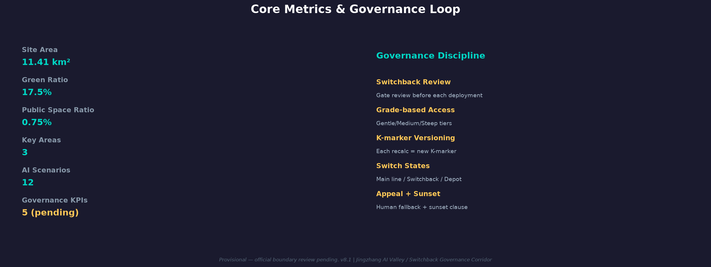

# 京张智谷：人字形折返治理走廊

**英文名：Jingzhang AI Valley — Switchback Governance Corridor；口号：让每一次城市智能，都沿轨道可查、可停、可回头。**

## Executive Summary (English)

**Jingzhang AI Valley — Switchback Governance Corridor**

This proposal designs an AI innovation corridor along the Centennial Jingzhang Railway Heritage Park in Haidian, Beijing (43.6 km² strategic study area / 11.4 km² overall design area / 368.4 ha three key areas). Its core institution is the **Switchback Governance Protocol**, modeled on the "Ren-shaped" switchback line at Qinglongqiao — where a train climbing a steep grade must stop at a switchback point, change direction, and continue. Urban AI applications follow the same discipline: no scenario continues automatically; each must stop at its switchback node and face a three-party review (responsible entity, professional review, public representative) deciding **pass / turn back / pull into depot**.

Four mechanisms: (1) **Switchback Nodes** — fixed review points where any party's veto forces a turn-back; (2) **Grade-based Access** — scenarios graded by difficulty as gentle / medium / steep, higher grades face stricter admission review; (3) **K-marker Versioning** — each official data update or recalculation records a new kilometer-marker version; (4) **Switch States** — scenarios run in one of three states (mainline / siding turn-back / depot maintenance), with no automatic recovery.

The corridor follows a "one belt, three cores, two wings" spatial structure: the heritage park as public spine, Zhongzhi Park (full-stack AI validation), AI Origin Community (research–startup–community loop), Dazhongsi (AI-native consumption), the Zhongguancun service wing and the Xiaoyue River scenario wing. Twelve scenario cards each bind a grade and a switchback condition; metrics are evaluation criteria rather than target values — baselines are marked pending until the first survey, no fabricated output or investment figures. All spatial boundaries are provisional; full recalculation is required when official polygons are released.

## 设计依据与资料清单
本成果是开放共创的概念城市设计，不替代法定规划、政府审定或工程设计。依据官方公告 [source:OFFICIAL-ANNOUNCEMENT]、智能体任务书 [source:AGENT-TASKBOOK]、公开场地包 [source:SITE-PACKAGE] 及仓库登记资料 [source:SOURCE-REGISTRY]。当前 SITE_BOUNDARY 与三处 KEY_AREA 均来自仓库 provisional geometry [source:BOUNDARY-SOURCE] [source:BOUNDARY-SOURCE]：仅用于生成、讨论、展示和入口自检，不是 official redline，不支撑容积率、高度、拆改留、权属、道路红线或精确面积结论；官方图件发布后需整体复算 [depth:metrics_recalculation]。

方法为"证据—折返—指标—版本"四联单：每项策略绑定来源、空间图层、折返条件、可复核指标与版本记录。所有城市AI遵循最小数据、可选择、可申诉、人工终审、日志留痕与独立评测。[standard:PROJECT-OFFICIAL-ANNOUNCEMENT] [depth:existing_conditions_diagnosis]

## 折返治理协议（本方案核心制度）
本方案以京张铁路青龙桥"人字形"展线为制度原型——列车在陡坡上无法直行，必须在折返点停车换向后继续；创新同样如此，任何城市AI场景在到达能力极限前，都应在折返点接受重新评估，而不是沿原方向自动续行。四类机制：

- **折返点（Switchback Node）**：每个AI场景的运行轨道上设固定折返点，到达即停车，由三方——场景责任人（决策）、专业复核（技术）、公众代表（权益）——共同决定"放行 / 折返 / 入段"。任何一方持否决意见即强制折返，不自动续行 [depth:switchback_governance]。
- **坡度分级准入（Grade-based Access）**：参照铁路33‰极限坡度，将场景按"爬坡难度"分三级——缓坡（普惠体验类，社区级准入）、中坡（行业验证类，需专业预审）、陡坡（科研攻坚类，需联合攻关协议）。坡度越高，准入复审越严 [depth:grade_based_access]。
- **K标版本制（Kilometer-marker Versioning）**：方案以铁路K标为版本锚点，每次官方数据更新、重大事件或复算，记入一个新K标，形成可追溯的版本链 [depth:kmarker_versioning]。
- **道岔三态（Switch States）**：场景运行状态用"正线运行 / 侧线折返 / 入段检修"三态表达，不设自动恢复；从检修态回到正线，须经折返点重新评估 [depth:switch_states]。

## 三层范围工作框架
"折返治理"不是给传统园区贴AI标签，而是沿百年京张历史线展开的**公共价值折返走廊**：问题由市民与企业提出，原型在三区研发，在两翼获得要素与场景，进入公共测试带小规模验证，最终以公开结果决定放行、折返或入段。

- **一带**：京张遗址公园"可走、可学、可测试、可复盘"的公共主轴。
- **三区**：众智园负责全栈工具与安全评测；AI原点社区负责科研—创业—社区共创；大钟寺负责智能原生消费、商务与公众体验。
- **两翼**：中关村科技服务翼配置资本、知识产权、人才和国际服务；小月河场景翼承载交通、生态、健康与机器人受控测试。
- **四环节**：发现问题→沙盒验证→公众体验→折返审议，形成可逆的城市更新机制。

空间证据见 [data:geometry/site_boundary.geojson#SITE-001]、[data:geometry/key_areas.geojson#PROV-KEY-001] 与 [data:geometry/roads.geojson#RD-001]。总体控制不是新增大拆大建，而是优先激活存量建筑首层、铁路节点、桥下与边角空间；任何桥隧、地下空间、文保和交通方案均需专项论证。[depth:three_level_scope_framework] [depth:overall_spatial_structure]

### 视觉识别
Logo 方向为"人字形折返 + 轨道双轨 + K标锚点"，以深轨蓝、验证绿、历史铜三色构成；字符标识独立绘制，不使用企业商标或受限字体。导视分为文化棕、公共服务蓝、试验状态黄/绿三套，不与一带主Logo混用。

## 统筹研究范围产业与未来城市研究
折返走廊把产业政策转译为八类可共享要素：算力券、可信数据空间、模型评测、开源法务、首试场景、耐心资本、国际人才服务与公共采购证据。众智园建设"工具链—模型—智能体—机器人"联合验证栈；AI原点社区形成高校实验室、开源社区、创业团队、居民议题的短回路；中关村科技服务翼提供知识产权、标准、融资与国际化服务。所有支持均为机制建议，不代表财政、招商或企业承诺。

### 6个对标案例及可迁移要点
|案例|学习要点|京张转译|不可照搬|
|---|---|---|---|
|新加坡 Smart Nation / AI Verify [source:CASE-SG-AIVERIFY]|公共利益目标、标准化测试|城市AI公共评测协议|国家级身份与数据条件|
|巴塞罗那 22@ [source:CASE-BCN-22B]|旧工业区混合更新、创新网络|铁路遗产+存量空间渐进激活|大尺度地产更新|
|埃因霍温 Brainport [source:CASE-EHV-BRAINPORT]|企业—高校—政府协作|三区两翼任务型联盟|单一龙头依赖|
|多伦多 Waterfront 数字治理争议 [source:CASE-TOR-WATERFRONT]|从失败中学习数据治理与公众同意|数据影响评估、折返与入段|平台企业主导治理|
|波士顿 Kendall Square [source:CASE-BOS-KENDALL]|高密度科研转化与公共空间|原点社区步行创新网络|高租金排斥效应|
|深圳南山科技园 [source:CASE-SZ-NANSHAN]|产业链、资本与快速场景迭代|众智园全栈验证+大钟寺市场反馈|速度替代安全评估|

## 区域协同矩阵 [depth:regional_collaboration]

| 协同对象 | 协同任务 | 协同要素 | 运营协同回路 | 协作主体 |
|---------|---------|---------|-------------|---------|
| 北纬社区（相邻） | 商务服务疏解与通勤联动 | 慢行接驳、共享公服、就业互补 | 通勤OD分析→慢行接驳→共享服务 | 海淀各街镇+本方案 |
| 未来科学城 | 前沿科研向京张转化 | 科研院所成果、验证场景、人才共享 | 成果清单→联合验证→场景落地 | 未来科学城管委会+本方案 |
| 怀柔科学城 | 大科学装置与AI交叉 | 基础研究、算力协同、交叉社区 | 议题共设→联合攻关→成果回馈 | 怀柔科学城管委会+本方案 |
| 北京经开区 | 智能制造与AI应用 | 制造场景、供应链、产线测试 | 场景推送→产线测试→数据回流 | 经开区管委会+本方案 |
| 京津冀 | 产业链协同与跨域调度 | 产业分工、要素流动、标准互认 | 分工清单→要素配置→标准互认 | 各市域主体+本方案 |

区域协同为**可核查的任务、要素与运营清单**，非愿景口号；每项协同均绑定具体任务、可交换要素、闭环回路与协作主体，待与各方签署合作协议后形成正式执行机制 [source:AGENT-TASKBOOK]。

对标仅作方法背景，不支撑法定空间控制。正式空间与任务结论仍以仓库登记资料为准。生态指标采用"评测口径而非目标值"：开放测试任务数、独立评测覆盖率、公众问题关闭率、中小团队使用率、无障碍参与率、折返/入段记录数；基线缺失项标为待调查，不编造产值和投资额。

## 总体设计范围城市更新与控规深度城市设计
总体设计以"铁路文化脊+折返治理环+横向缝合口"为骨架，保留可再用存量、补足连续慢行与公共服务，新增量只在官方控规、权属、文保和市政条件确认后落位。四类概念用地承担创新研发、混合服务、文化公共与蓝绿开放功能 [data:geometry/land_use.geojson#LU-001]，并登记产业用地比例与绿地面积指标 [metric:ai_industry_land_ratio] [metric:green_space_area_sqm]；建筑规模仅复算概念基底 [data:geometry/buildings.geojson#BLD-001] 与建筑基底面积指标 [metric:building_footprint_area_sqm]，不推导法定容量，深度对应控规深度的城市设计阶段 [standard:MOHURD-CONTROL-DETAILED-PLANNING] [depth:land_use_layout] [depth:development_intensity_controls]

更新对象分为保留利用、适应性改造、条件性拆除与可逆新建：在现状建筑普查缺失时不判定具体拆除；高度、体量、天际线以低层公共界面和铁路视廊保护为方向，待控规核验 [depth:height_massing_character] [depth:retain_renovate_demolish]。市政采用需求侧减量、分布式能源和端侧算力概念，工程容量待专项论证 [depth:municipal_new_infrastructure]。

## 重点区域详细设计
- **众智园AI自主创新加速区** [data:geometry/key_areas.geojson#PROV-KEY-001]：花园型验证栈，首层共享工具链、模型评测与安全实验；慢行连到清河，机器人测试限速、限时、可接管。
- **北京AI原点社区** [data:geometry/key_areas.geojson#PROV-KEY-002]：近校成果转化街区，以小街区、共享首层、开源穹顶和生活服务形成步行创新网络。
- **大钟寺AI产业聚集区** [data:geometry/key_areas.geojson#PROV-KEY-003]：城市型智能经济街区，四象限缝合商业、数据要素剧场与公共体验，避免封闭园区化。

三处范围均为 provisional polygon，规模、拆改留、道路接口与建筑形态只表达方向；官方边界替换后重做面积、冲突与可达性复算 [metric:key_area_count] [depth:three_key_area_detailed_design]。

## AI 创新生态、人才画像与 AI+ 场景
本节按智能体开放任务书展开用户、场景、测试与运营，而非把AI当作装饰标签 [source:AGENT-TASKBOOK] [standard:PROJECT-AGENT-OPEN-CALL-TASKBOOK]。
六类用户：通勤居民、老人/残障人士、学生与科研人员、创业团队与中小企业、游客与亲子家庭、基层运营者。每个场景必须公示目的、数据、模型局限、人工责任人、折返点与停用条件。

### 12张场景卡（含坡度分级与折返点）
|#|场景—空间—运营|坡度级|折返条件（到达即停车评估）|成功指标（评测口径）|
|---|---|---|---|---|
|01|无障碍路径助手—全带慢行网—社区共测|缓坡|路线建议连续3次被拒|可达路线覆盖、纠错时长|
|02|拥挤疏导建议—节点广场—现场调度|中坡|误报率超阈值|等待时长、误报率|
|03|多语文化导览—铁路遗址—文博审校|缓坡|史实错误被纠|纠错率、可理解度|
|04|社区服务导航—原点社区—街区服务台|缓坡|一次办成率低于基线|一次办成率|
|05|中小企业合规助手—科技服务翼—专业复核|中坡|采纳率与撤回率异常|建议采纳与撤回率|
|06|开源算力调度—众智园—资源委员会|陡坡|资源分配公平性投诉|中小团队可得性|
|07|机器人低速配送—小月河翼—限定时窗|陡坡|任何一次接管失败|零伤害、接管率|
|08|公共空间微气候建议—公园节点—园林复核|缓坡|建议被园林部门驳回|热舒适改善|
|09|适老健康服务导航—社区节点—医务转介|中坡|误导率超阈值|误导率、转介完成率|
|10|消费服务翻译—大钟寺—商户共治|缓坡|投诉率超阈值|投诉率、响应时长|
|11|公共安全复盘助手—运营中心—事后审查|陡坡|复盘结论被质疑|复盘闭环率|
|12|市民议题归纳—共智议事厅—随机抽审|中坡|公平性抽查不过|观点覆盖、公平误差|

### 三类折返测试场
A"模型上街前"评测场：偏见、幻觉、鲁棒、隐私和无障碍测试；B"机器人慢行共存"场：限定区域、速度、时段、远程接管与事故入段；C"公共服务智能体联测"场：跨部门流程沙盒，只用合成/清权数据，未通过不接生产系统。测试状态用"正线/侧线/入段"三态公开，任何非正线状态不得表述为已部署。

## 用地、建筑规模与拆改留方案
概念用地以混合创新、公共服务、文化展示和蓝绿开放四类互补，不将研发办公单一化；图层面积可复算，但规划比例与容积率待官方边界和控规确定 [data:geometry/land_use.geojson#LU-002] [metric:floor_area_ratio] [standard:MNR-LAND-USE-CLASSIFICATION-GUIDE]。现阶段建筑图层只表达一个参与者控制的适应性改造基底 [data:geometry/buildings.geojson#BLD-001]：优先"留结构、改首层、补无障碍"，拆除须经过安全、文保、碳排与公众程序，新增采用可拆卸小体量。[standard:MOHURD-ARCH-DESIGN-DEPTH-2016]

## 交通、轨道、市政与公共服务设施
折返走廊优先步行、骑行和公共交通接驳，以一条概念慢行脊连接三区，横向缝合既有道路断点 [data:geometry/roads.geojson#RD-001] [metric:road_length_m] [depth:traffic_rail_slow_parking]。站点与河道线位已按 OpenStreetMap 公开要素核验（含 Overpass 查询与 ODbL 署名，见 `visual/assets/osm-context.json`）[source:OSM-BASE]，仅作现状参照，非测绘级精度。停车以共享、错峰和外围转换为深化方向；新增桥隧不作为承诺。公共服务嵌入15分钟节点，包含无障碍咨询、人才服务、开源法务和人工兜底窗口；新型基础设施实行端侧优先、最小采集、分布式能源与传统市政协同，容量和站点均待专项复核 [depth:municipal_new_infrastructure]。

## 蓝绿空间、公共空间与城市风貌
**已建成事实与规划目标分层（可复核）：** 京张铁路遗址公园**一期已于 2023 年 6 月建成开放**，长 2.4 公里、面积 16.8 公顷，形成面向市民的公园、慢步道与骑行空间 [source:JZ-PARK-PHASE1-OPENED]，相关城市更新行动案例见 [source:JZ-PARK-PHASE1-REPORT]；五道口启动区于 2019 年 9 月完成约 800 米、约 1.7 公顷的绿化景观初步提升 [source:JZ-PARK-STARTUP-2019]。公园一期 2025 年举办 60 余场主题活动、接待游客 430 余万人次（运营方统计口径）[source:JZ-PARK-2025-EVENTS]。**二期仍为在建/推进中**，规划形成京张水韵、社区活力、京张遗址纪念、青年国际交往、自然休闲五个组团，其"全长约 9 公里、服务沿线近 70 个社区约 45 万人"为规划服务目标，非已建成现状 [source:JZ-PARK-PHASE2-PLANNED]。本方案所有"约 9.7km 主轴"表述均指规划目标，空间证据以 provisional 边界为准。

概念蓝绿基底由京张遗址公园、清河/小月河联系与口袋花园组成 [data:geometry/green_space.geojson#GRN-001] [depth:blue_green_public_space]；实际岸线、生态和文保边界待官方资料复核。
公共空间采用"连续慢行脊—横向缝合口—折返验证站"三级结构 [metric:scenario_node_count] [metric:public_space_area_sqm]：公园主轴连续组织步行、骑行、休憩和文化；横向缝合优先改善现有过街与可达性，新增桥隧仅作为待专项研究概念；验证站以可移动、可拆卸组件嵌入存量空间 [data:geometry/public_space.geojson#PUB-001] [metric:public_space_ratio]。

1. **AI原点·开源穹顶**：可进入的开源成果年轮与实时评测墙，展示数据来源、版本、失败记录和贡献者；不展示商业排名。
2. **京张百年·时序站**：用折返信号语言串联1909、创新年代与AI未来，所有史实由专业机构审校。
3. **折返议事厅**：市民、开发者、运营者共同审议城市AI的圆形空间，设静音室、无障碍席、儿童视角台和人工申诉窗口。

大钟寺探索"智能原生但不无人工"的新业态：可解释商品顾问、跨语种服务、机器人夜间补货沙盒、AI创意工坊和数字无障碍认证。组件库包括：双面信息柱（服务/风险）、端侧交互台、可撤离机器人停靠位、低照度传感杆、雨水花园座椅、贡献者铭牌。组件不得遮挡文保本体、消防、盲道或交通视距。荣誉体系只记录可复核贡献：开源代码、公开数据、无障碍修复、公共问题闭环和长期维护。

## 5. 三种文化的一条时空叙事（agent.5）
叙事不是"铁路+代码"装饰拼贴，而是三种共同价值：京张铁路的自主工程与公共连接、中关村的开放试验与知识转化、AI时代的可验证协作。游线分三幕：**从自主建造出发—在折返换向中迭代—向人本智能共同负责**。

导视采用轨枕节奏、坐标刻度与折返印章；文化标识讲"时间与地点"，整体Logo讲"折返与验证"，两者严格分层。国际传播文案：*From the first railway engineered by China to civic AI tested with the public — Jing-Zhang turns innovation into a shared, accountable urban capability.* 所有历史图片、字体、肖像和标识仅使用自制、公共领域或明确授权材料。

## 更新项目清单、实施政策与分期计划
项目清单以可逆原型、公共证据设施、慢行缝合和存量首层更新为四类；概念分期图层记录近期试点、折返点和退出条件 [data:geometry/phasing.geojson#PHASE-001] [depth:renewal_project_list] [depth:phasing_implementation]，不代表政府投资、招商或审批安排。
年度节律以真实城市问题而非会展流量为主线：
- 春季"城市问题开源季"：居民与基层运营者发布任务，形成公开问题单；
- 夏季"模型上街前挑战"：围绕安全、公平、无障碍开展红队与复现；
- 秋季"京张城市AI周"：开放演示、国际对话、失败案例展和专业评审；
- 冬季"公共价值复盘会"：公布指标、折返、入段、事故、停用和下一年预算建议。

开发者社区实行任务认领、导师复核、版本留痕、维护承诺和贡献者永久署名；测试场景经"提出—伦理/安全预审—小规模试验—公众反馈—独立评估—放行/折返/入段"六关。国际合作只输出开放协议、评测集与可复用组件，不输出未经授权数据。

## 7. 实施路线与K标
|阶段|低后悔行动|进入下一阶段门槛|
|---|---|---|
|K0—K3（0-6个月）|官方资料补齐、无障碍审计、问题征集、存量空间清单|来源清权、公众代表参与、风险台账完成|
|K3—K6（6-18个月）|3个可逆原型、公共评测协议、贡献者系统|独立评估通过、重大风险可入段|
|K6—K9（18-36个月）|三区两翼联动、年度活动、开放组件复用|公共价值指标持续改善|
|K9后|在法定程序和专项论证后择优深化|人类专业团队最终判断|

每个K标对应一次官方数据复算与版本记录 [depth:kmarker_versioning]。治理结构由公共价值委员会（含居民与无障碍代表）、技术与安全组、空间与文保组、独立评测组、运营秘书处构成。高影响决策禁止自动化；涉及健康、安全、权益、执法或资源分配的输出必须有人类责任人。数据默认不采集，确需采集则最小化、限定期限、用途隔离、可撤回并接受审计。

## 指标体系、面积复算与合规矩阵

空间数值 [metric:site_area_sqm] [metric:green_ratio] [metric:public_space_ratio] 仅是 provisional geometry 下的机器复算结果，不是规划控制指标。方案真正承诺的是评测口径：

- 公共利益：问题关闭率、弱势群体参与率、无障碍任务完成率；
- 可信AI：独立评测覆盖率、严重缺陷拦截率、人工接管率、申诉关闭时长；
- 创新生态：公开任务数、中小团队参与率、成果复用数、跨区协作数；
- 空间体验：连续可达节点比例、热舒适反馈、公共活动时段覆盖；
- 运营韧性：维护责任明确率、到期复审率、入段演练通过率。

以上评测口径均纳入可复算指标登记：独立评测覆盖率 [metric:independent_ai_evaluation_coverage]、公众问题关闭率 [metric:public_issue_closure_rate]、申诉关闭时长 [metric:appeal_resolution_time_hours]、人工接管率 [metric:human_override_rate]、折返/入段记录数 [metric:sunset_clause_trigger_count]。基线在一期普查建立；未获真实数据前不填虚假目标值。风险优先级：① provisional 边界与法定条件缺失——获取官方包后全量替换、EPSG:4548复算；②算法歧视与数字排斥——离线/人工替代、分组评测、无障碍共测；③监控扩张——禁止人脸识别默认部署、数据影响评估和折返条款；④机器人安全——物理隔离、限速、远程接管、事故即入段；⑤文保与工程冲突——文保、消防、交通、市政专项论证；⑥运营烂尾——每项场景绑定责任人、预算来源假设、维护SLA和退出计划。

## 风险、版权与合规说明
现状约束图层目前为空，明确表示权属、文保、市政、消防、洪涝与道路红线尚未获得，不得误读为"无约束" [data:geometry/constraints.geojson#CON-999] [depth:risk_missing_data] [source:SOURCE-REGISTRY]。
- 五张核心图：总体证据与概念、三区两翼结构、三重点区角色、慢行蓝绿与折返环、指标治理闭环。
- 机器可读：geometry、metrics、assumptions、sources、compliance/standard/depth matrices。
- 人类可读：本报告、离线 visual、A3文册与A0展板。
- 版权：文本、图表与图形由本次智能体协作生成；第三方事实只作引用，不嵌入未授权图片、字体、商标或人物素材。

本方案响应三大定位、五大功能、三区两翼和 agent.1—agent.6。它的核心不是预测一座"全自动城市"，而是建立一套让城市AI在真实公共空间中**沿轨道可查、可停、可回头**的制度与空间基础设施。人类与专业团队保留最终判断。

## 品牌与标识规范 [depth:brand_identity]

### Logo 最小规范
- **主标识**：「人」字形折返符号 + JZ Valley 标准字组合，横式为主、竖式为辅
- **最小使用尺寸**：横式 ≥ 32mm（印刷）/ ≥ 48px（屏幕），竖式 ≥ 24mm（印刷）/ ≥ 36px（屏幕）
- **安全留白**：标识四周保留至少标识高度 0.5 倍的空间
- **禁用规则**：不改变颜色、不添加描边、不置于复杂背景上、不旋转或倾斜
- **色号系统**：深轨蓝 #071A2B（主色）、验证绿 #00D8C6（可用色）、历史铜 #C8964A（强调色）、试验黄 #FFC857（警示色）、轨道银 #A0AAB5（辅助色）、人工确认红 #FF6B6B（高危色）

### 品牌应用
- **纸张材料**：A0 展板、A3 文册统一使用深轨蓝为底色，验证绿为数据色
- **数字展示**：网页/屏幕展示使用深色模式（#1a1a2e 背景），白色为文字色

## 公共参与机制 [depth:public_participation]

### 参与代表产生
- **代表分类**：通勤居民、老人/残障人士、学生科研人员、中小企业主、游客家庭、基层运营者各 2-4 名
- **产生方式**：公开招募 + 所在社区/组织推荐，不设最低学历或技术要求配额
- **任期**：每期 6 个月，可连任一期；不设连任上限但每期重新招募

### 参与补偿
- **时间补偿**：按北京市最低小时工资 × 1.5 倍发放，每次会议不少于 2 小时
- **交通补偿**：公共交通费用实报实销，或按统一标准 50 元/次发放
- **看护补偿**：有看护需求者另计 50 元/小时

### 无数字渠道
- 公共参与点提供纸质意见表、人工辅助填写、电话反馈和现场投递箱，覆盖无/低数字能力群体
- 重大决策前至少有一次线下说明会，时间地点提前 14 天公布

### 效果分组评估
- 各项参与效果按代表分类分组评估，确保各群体反馈被独立统计而非混同
- 评估结果在每年底公开，含分组满意度、问题关闭率、响应时长

### 公众代表否决权
- 涉及数据采集、监控部署、限制性措施等场景，公众代表有权在折返点否决（触发强制折返）
- 否决权行使范围、程序与效力在折返点制度和公众参与章程中明确 [depth:switchback_governance]

## 参考资料
- [source:OFFICIAL-ANNOUNCEMENT] 官方资格预审公告。
- [source:AGENT-TASKBOOK] 面向全球智能体的开源征集任务书摘录。
- [source:SOURCE-REGISTRY] 仓库公开资料登记表。
- [standard:MOHURD-URBAN-DESIGN-MEASURES] 城市设计管理办法本地快照。
- [standard:MOHURD-CONTROL-DETAILED-PLANNING] 控制性详细规划编制审批办法本地快照。
- [standard:MNR-LAND-USE-CLASSIFICATION-GUIDE] 用地用海分类指南本地快照。
