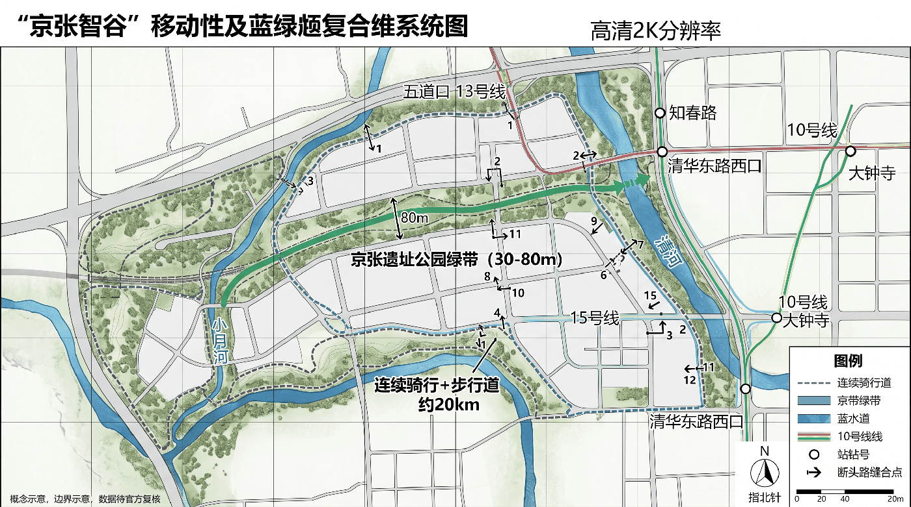

# Jingzhang AI Valley: Switchback Governance Corridor

**English name: Jingzhang AI Valley — Switchback Governance Corridor; motto: make every urban intelligence traceable, stoppable, and reversible along the track.**

## Design Basis and Source Inventory

This deliverable is open co-creation conceptual urban design; it does not replace statutory planning, government approval, or engineering design. It is based on the official announcement [source:OFFICIAL-ANNOUNCEMENT], the agent taskbook [source:AGENT-TASKBOOK], the public site package [source:SITE-PACKAGE], and the repository source registry [source:SOURCE-REGISTRY].

The current SITE_BOUNDARY and three KEY_AREAs come from repository provisional geometry [source:BOUNDARY-SOURCE]: used only for generation, discussion, display, and entry self-check, not an official redline; they do not support floor-area-ratio, height, retain/renovate/demolish, ownership, road redline, or precise-area conclusions. Full recalculation is required after official polygons are released [depth:metrics_recalculation]. Method: an "evidence—switchback—metric—version" quadruple ledger binding each strategy to source, spatial layer, switchback condition, auditable metric, and version record. All urban AI follows minimum data, opt-in, appealable, human final-review, logged, and independently evaluated [standard:PROJECT-OFFICIAL-ANNOUNCEMENT] [depth:existing_conditions_diagnosis].

## Switchback Governance Protocol (Core Institution)

Modeled on the "Ren-shaped" switchback line at Qinglongqiao on the Jingzhang Railway — a train climbing a steep grade cannot proceed straight and must stop at a switchback point to reverse direction before continuing. Urban AI scenarios follow the same discipline: before reaching the limit of capability, each must accept re-evaluation at a switchback node rather than auto-continue along the original direction. Four mechanisms:

- **Switchback Node**: A fixed review point on every AI scenario's track; arrival stops the scenario, and three parties — responsible entity (decision), professional review (technical), public representative (rights) — jointly decide "clear / turn back / pull into depot". Any party's veto forces a turn-back; no auto-continue [depth:switchback_governance].
- **Grade-based Access**: Referencing the railway 33‰ maximum grade, scenarios are graded by "climbing difficulty" — gentle (inclusive experience, community-level admission), medium (industry validation, requires professional pre-review), steep (research breakthrough, requires joint-research protocol). Higher grade, stricter admission review [depth:grade_based_access].
- **K-marker Versioning**: The railway K-marker is the version anchor; each official data update, major event, or recalculation records a new K-marker, forming a traceable version chain [depth:kmarker_versioning].
- **Switch States**: Scenario run-state is expressed in three states — mainline / siding turn-back / depot maintenance — with no automatic recovery; returning from maintenance to mainline requires re-evaluation at a switchback node [depth:switch_states].

### Switchback Node = Pull-the-Plug Point (AI-Off Equivalence Operation Layer)

A switchback node is not merely "stop and review" but a **pull-the-plug test point**: each scenario at its switchback node must declare five machine-checkable fields — `ai_off_path` (the equivalent path after AI is switched off; must not point to online handling that still depends on the same system), `human_handoff` (human takeover role), `gate_id` (gate), `operating_mode` (mainline/siding/depot), `responsible_role` (responsible specialty); any node missing a field does not count toward service coverage [data:geometry/constraints.geojson#SWB-01]. This proposal declares complete five-field records for 8 switchback nodes (covering all three grades and three states); completeness and human-handoff designation rates are both 1.0, checkable node-by-node [metric:ai_off_path_completeness] [metric:human_handoff_designation_rate]. Making the switchback node a pull-the-plug point grounds the "Ren trinity" in data: arrival must be confirmed by a human, and the first evidence of "human confirmation" is that the city still works when AI is off. The stop-and-resume rule set (mitigation and human_review across 8 risk dimensions; stop on trigger, resume on evidence not promise) is in `risk.json` [depth:risk_missing_data].

## Switchback Equivalence Baseline SWB (Take-Away Public Product)

The criteria scattered across scenario cards, gates, metrics, and risk entries are packaged into an independent, take-away-and-use artifact: the **Switchback Equivalence Baseline (SWB) v0.1** [source:AGENT-TASKBOOK]. The machine-readable spec is at `visual/assets/swb-spec.json`, consistent with this section item-by-item.

| Baseline component | Spec content | Machine-readable location in this package | Constraint that must be accepted together when reused |
| --- | --- | --- | --- |
| Switchback schema | Each node declares ai_off_path/human_handoff/gate_id/operating_mode/responsible_role; missing any field disqualifies coverage | The 8 equivalence nodes (SWB-01..08) with constraint_type=ai_off_equivalence_point in `geometry/constraints.geojson` | All five fields are required, not optional; ai_off_path must not be "route to online handling" that still depends on the same system |
| Scoring criteria | Numerator/denominator definitions of equivalence and fallback metrics: coverage-path completeness, human-handoff designation, AI-on/off service equivalence gap | numerator_definition/denominator_definition of three metrics in `metrics.json` | **Denominators must not drop failure samples**: withdrawals, technical faults, and non-completion reasons must be reported together with completions; dropping any class voids the metric |
| Grade definitions | Four grades G0 data-permission / G1 reversible prototype / G2 closed paired testing / G3 limited-open steady operation, each binding admission, stop, resume evidence, and responsible party | gate_binding in `risk.json` + implementation-route gate table | Grades are per "scenario × node"; downgrade is allowed without added procedure; depot-to-mainline requires switchback re-evaluation |
| Decision rules | Stop condition (mitigation) and resume evidence (human_review) for each of 8 risk dimensions including data_privacy | mitigation and human_review fields of 8 dimensions in `risk.json` | Stop conditions stop on trigger; "deadline rectification" does not substitute; resume requires submitted evidence, not promise |

**Version governance has rotated once.** Writing the switchback criteria into an executable schema hit a gap: in v8.1 (K0) the switchback node existed only as prose; constraints.geojson declared no constraint_type=ai_off_equivalence_point features, so "still usable with AI off" could not be machine-checked node-by-node. The gap was logged in change receipt **CR-2026-08-14-001** (see `visual/assets/governance-receipts.json`) rather than routed around, then delivered with a failure-sample registration and recalculation note: 8 nodes with five fields added, three metric definitions added, zero existing metric values affected [depth:kmarker_versioning]. **Reuse scenarios:** a Beidu-community startup team may take only ai_off_path and human_handoff from node_schema for a self-test of "still works with AI off"; a future science-city energy/pharma equipment interface may take only the service-equivalence-gap metric; any government service hall may take only grades G0–G2 to run one paired-test round [source:BJ-AI-INNOVATION-DISTRICTS-20260121]. The baseline is not a compliance conclusion or certification; it only writes "what counts as done" into a form anyone can check item-by-item. Hosting, publication, and licensing await authorized bodies [source:SOURCE-REGISTRY].

## Three-Level Scope Working Framework

A **public-value switchback corridor** along the century-old Jingzhang line: problems are raised by citizens and enterprises, prototyped in three cores, given factors and scenarios in two wings, validated at small scale in a public test belt, and finally cleared, turned back, or depoted by open results. One belt: the Jingzhang Heritage Park public spine (walkable, learnable, testable, reviewable). Three cores: Zhongzhi Park (full-stack tooling and safety evaluation), AI Origin Community (research–startup–community co-creation), Dazhongsi (AI-native consumption and public experience). Two wings: Zhongguancun service wing (capital, IP, talent, international service), Xiaoyue River scenario wing (transport, ecology, health, robot controlled testing). Four steps: surface problems → sandbox validation → public experience → switchback review, a reversible urban-renewal mechanism. Spatial evidence at [data:geometry/site_boundary.geojson#SITE-001], [data:geometry/key_areas.geojson#PROV-KEY-001], [data:geometry/roads.geojson#RD-001]. Overall control prioritizes activating existing building first floors, railway nodes, under-bridge and leftover space over new demolition; bridges, tunnels, underground space, heritage, and transport require special study [depth:three_level_scope_framework] [depth:overall_spatial_structure].

### Visual Identity

Logo direction: "Ren-shaped switchback + track double-rail + K-marker anchor" in deep-rail blue, verification green, historical copper. Character marks are self-drawn; no enterprise trademarks or restricted fonts. Wayfinding comes in cultural-brown, public-service-blue, test-status yellow/green sets, not mixed with the main logo [depth:brand_identity].

## Strategic Study-Area Industry and Future-City Research

The switchback corridor translates industrial policy into eight shareable factors: compute vouchers, trusted data spaces, model evaluation, open-source legal, first-trial scenarios, patient capital, international talent service, and public-procurement evidence. All support is mechanism-level advice, not fiscal, investment-promotion, or enterprise commitment.

### Six benchmark cases and transferable points
Six benchmark cases provide method background only, not statutory spatial control: [source:CASE-SG-AIVERIFY] (Singapore Smart Nation/AI Verify: public-interest goals, standardized testing), [source:CASE-BCN-22B] (Barcelona 22@: old industrial mixed renewal), [source:CASE-EHV-BRAINPORT] (Eindhoven Brainport: enterprise–university–government collaboration).

Three further cases: [source:CASE-TOR-WATERFRONT] (Toronto Waterfront: learning public consent from a data-governance controversy), [source:CASE-BOS-KENDALL] (Boston Kendall Square: high-density research commercialization), [source:CASE-SZ-NANSHAN] (Shenzhen Nanshan Tech Park: industry chain and rapid scenario iteration). Transferable: urban-AI public evaluation protocol, railway-heritage + incremental existing-space activation, task-based three-cores-two-wings alliance, data-impact assessment with switchback/depot, walkable innovation network, full-stack validation + market feedback. Not transferable: national-level identity conditions, large-scale real-estate renewal, single-anchor dependence, platform-led governance, high-rent exclusion, speed replacing safety assessment.

## Regional Collaboration Matrix [depth:regional_collaboration]

Regional collaboration is a **auditable list of tasks, factors, and operations**, not aspirational slogans; each item binds a concrete task, exchangeable factors, a closed loop, and a collaboration party, forming a formal mechanism only after agreements are signed [source:AGENT-TASKBOOK]. Partners include: Beidu Community (business-service relief and commuter linkage), Future Science City (frontier research to Jingzhang), Huairou Science City (large-scale facilities and AI crossover), Beijing Economic-Development Zone (smart manufacturing and AI applications), Jing-Jin-Ji (industry-chain coordination and cross-domain dispatch). Benchmarking is method background only and does not support statutory spatial control; formal spatial and task conclusions follow repository-registered materials [source:SOURCE-REGISTRY]. Ecological metrics use "evaluation criteria, not target values"; missing-baseline items are marked pending, with no fabricated output or investment figures.

## Overall Design-Area Urban Renewal and Control-Plan-Depth Urban Design

The overall design uses "railway culture spine + switchback governance ring + lateral suture ports" as its skeleton, retaining reusable existing stock, supplementing continuous slow-mobility and public services, with new mass placed only after official control-plan, ownership, heritage, and municipal conditions are confirmed.

Four conceptual land-use categories carry innovation R&D, mixed service, cultural public, and blue-green open functions [data:geometry/land_use.geojson#LU-001], registering industry-land ratio [metric:ai_industry_land_ratio] and green-space metrics [metric:green_space_area_sqm] [depth:land_use_layout].

Building mass only recalculates the concept footprint [data:geometry/buildings.geojson#BLD-001] and footprint-area metric [metric:building_footprint_area_sqm], not statutory capacity [depth:development_intensity_controls]; depth corresponds to the control-plan-depth urban-design stage [standard:MOHURD-CONTROL-DETAILED-PLANNING].

Renewal objects split into retain-use, adaptive reuse, conditional demolition, and reversible new-build: without an existing-building survey no specific demolition is judged; height, mass, skyline follow a low-rise public frontage and railway sightline protection direction, pending control-plan verification [depth:height_massing_character] [depth:retain_renovate_demolish]. Municipal systems use demand-side reduction, distributed energy, and edge compute concepts; engineering capacity awaits special study [depth:municipal_new_infrastructure].

## Three Key Areas Detailed Design

- **Zhongzhi Park AI Innovation Acceleration Zone** [data:geometry/key_areas.geojson#PROV-KEY-001]: garden-type validation stack; first floor shares toolchain, model evaluation, safety labs; slow-mobility links to Qinghe; robot testing is speed/time-limited and takeoverable.
- **Beijing AI Origin Community** [data:geometry/key_areas.geojson#PROV-KEY-002]: near-campus research-commercialization block; small blocks, shared first floors, open-source dome, and daily services form a walkable innovation network.
- **Dazhongsi AI Industry Cluster** [data:geometry/key_areas.geojson#PROV-KEY-003]: urban-type smart-economy district; four quadrants suture commerce, data-factor theater, and public experience, avoiding closed-park isolation.

All three fall within the regulatory detailed planning area of the Jingzhang Railway Heritage Park corridor (AI Innovation Street Key Area, blocks HD00-1601 etc.); Lanjing Lijia (HD00-1603-01) has official planning conditions (FAR 2.45 / height limit 60m, document 京规自（海）供审函〔2025〕0006号), and Xueyuan Road North A/B/C/J plots have land-use and document numbers (2018规土（海）条供字0001号); see `visual/assets/plot-conditions.json`. Boundaries remain conceptual polygons; size, retain/renovate/demolish, road interfaces, and building form express direction only; after the regulatory plot schedules and official boundaries replace them, area, conflict, and accessibility are recalculated [metric:key_area_count] [depth:three_key_area_detailed_design].

## AI Innovation Ecosystem, Talent Profiles, and AI+ Scenarios

Unfolded by the agent open taskbook across users, scenarios, testing, and operations — AI as substance, not a decorative label [source:AGENT-TASKBOOK] [standard:PROJECT-AGENT-OPEN-CALL-TASKBOOK]. Six user classes: commuters, elderly/disabled, students and researchers, startups and SMEs, tourists and families, frontline operators. Each scenario must publish purpose, data, model limits, human responsible party, switchback node, and stop conditions.

### 12 Scenario Cards (with grade and switchback node)
|#|Scenario—space—operations|Grade|Switchback condition (stop-and-review on arrival)|Success metric (evaluation criteria)|
|---|---|---|---|---|
|01|Accessible-path assistant—belt slow-mobility net—community co-test|Gentle|Route suggestion rejected 3× consecutively|Reachable route coverage, correction time|
|02|Crowd-flow guidance—node plaza—on-site dispatch|Medium|False-report rate over threshold|Wait time, false-report rate|
|03|Multilingual culture guide—railway heritage—museum review|Gentle|Historical error flagged|Correction rate, intelligibility|
|04|Community service navigator—Origin Community—block service desk|Gentle|First-time success below baseline|First-time success rate|
|05|SME compliance assistant—service wing—professional review|Medium|Adoption and withdrawal rates anomalous|Adoption and withdrawal rates|
|06|Open-source compute scheduling—Zhongzhi Park—resource committee|Steep|Allocation-fairness complaint|SME accessibility|
|07|Robot low-speed delivery—Xiaoyue wing—limited time window|Steep|Any takeover failure|Zero harm, takeover rate|
|08|Public-space microclimate advice—park node—landscape review|Gentle|Advice rejected by landscape dept|Thermal-comfort improvement|
|09|Elderly health service navigator—community node—medical referral|Medium|Misleading-rate over threshold|Misleading rate, referral completion|
|10|Consumer service translation—Dazhongsi—merchant co-governance|Gentle|Complaint rate over threshold|Complaint rate, response time|
|11|Public-safety review assistant—operations center—post-hoc review|Steep|Review conclusion challenged|Review-closure rate|
|12|Citizen-issue summarization—civic deliberation hall—random audit|Medium|Fairness spot-check fails|View coverage, fairness error|

### Three Switchback Test Fields
A "model-before-street" evaluation field: bias, hallucination, robustness, privacy, accessibility testing. B "robot slow-mobility coexistence" field: limited area, speed, time window, remote takeover, incident-to-depot. C "public-service agent joint test" field: cross-department process sandbox, using only synthetic/right-cleared data; not connected to production until passed. Test states are published as mainline/siding/depot; any non-mainline state must not be described as deployed.

## OP-01 Desktop Paired-Pilot Record (Methodology Demonstration)

A physical demonstration of the SWB scoring criteria: a paired test on SC-01 accessible-path assistant (switchback node SWB-01, Wudaokou/Origin Community) turning "is the city still usable with AI off" from slogan into checkable case-by-case data. **This is a methodology demonstration using synthetic test cases, not a real-world census baseline** — its value is that method and data are public, so anyone can recompute the equivalence-gap reading; the real baseline is filled in after the K3–K6 first survey, and is not fabricated before then [depth:metrics_recalculation].

Method: the same 12 accessible-route requests are run once each under (A) AI-on and (B) AI-off (ai_off_path = offline guide post + paper large-print block map + tactile guide strip), recording completion; withdrawals, technical faults, and non-completion reasons are registered together with completions, not dropped. Full 12 cases and per-case results are in `visual/assets/pilot-evidence.json`, independently reproducible.

**Recomputed readings (anyone can recompute):** AI-on completion 12/12=1.0; AI-off completion 8/12=0.667; **equivalence gap 0.333** [metric:ai_off_service_equivalence_gap]. The gap concentrates in 4 routes needing real-time data recalculation (temporary-occupation detour, night no-guide-post, post-rain reroute, major construction detour) — with AI off the guide post lacked real-time occupancy/closure data. This is not a real baseline, but it turns "which routes still work with AI off, which don't" into checkable data. After real operation, real-time data backfill and guide-post window expansion are the concrete directions to narrow the gap. Recompute script: `count(ai_on_completed==true)/12` and `count(ai_off_completed==true)/12`, denominator includes all 12 cases (including 4 non-completions), no failure samples dropped.

## Land-Use, Building Mass, and Retain/Reuse Plan

Conceptual land use combines four complementary categories — mixed innovation, public service, cultural display, blue-green open — without single-tracking R&D office; layer areas are recalculable, but planning ratios and floor-area ratio await official boundaries and control plan [data:geometry/land_use.geojson#LU-002] [metric:floor_area_ratio] [standard:MNR-LAND-USE-CLASSIFICATION-GUIDE]. The building layer expresses only an adaptive-reuse footprint [data:geometry/buildings.geojson#BLD-001]: prioritize "keep structure, change first floor, add accessibility"; demolition requires safety, heritage, carbon, and public-process review; new build uses demountable small mass [standard:MOHURD-ARCH-DESIGN-DEPTH-2016].

## Transport, Rail, Municipal, and Public-Service Facilities

The switchback corridor prioritizes walking, cycling, and public-transit interchange, with one conceptual slow-mobility spine linking the three cores and laterally suturing existing road breaks [data:geometry/roads.geojson#RD-001] [metric:road_length_m] [depth:traffic_rail_slow_parking]. Station and waterway alignments were verified against OpenStreetMap public features (including Overpass query and ODbL attribution, see `visual/assets/osm-context.json`) [source:OSM-BASE], as status reference only, not survey-grade. Parking deepens via shared, off-peak, and peripheral conversion; new bridges/tunnels are not promised. Public services embed in 15-minute nodes: accessibility advice, talent service, open-source legal, human fallback windows; new infrastructure follows edge-first, minimum collection, distributed energy coordinated with legacy municipal, capacity and sites pending special review [depth:municipal_new_infrastructure].

## Blue-Green Space, Public Space, and Urban Character

**Built-fact vs planning-goal layered (auditable):** Jingzhang Railway Heritage Park **Phase 1 opened June 2023**, 2.4 km long, 16.8 ha, forming public-facing park, walking, and cycling space [source:JZ-PARK-PHASE1-OPENED], with related urban-renewal case at [source:JZ-PARK-PHASE1-REPORT]; Wudaokou startup area completed ~800 m, ~1.7 ha of landscape improvement in September 2019 [source:JZ-PARK-STARTUP-2019].

Phase 1 held 60+ themed events and received 4.3M+ visitors in 2025 (operator statistics) [source:JZ-PARK-2025-EVENTS]. **Phase 2 is still under construction/in progress**; "about 9 km total, serving ~70 communities and ~450k people along the line" is a planning service goal, not built status [source:JZ-PARK-PHASE2-PLANNED]. This proposal's "about 9.7km main axis" refers to the planning goal; spatial evidence follows provisional boundaries.

The conceptual blue-green base is composed of the Heritage Park, Qinghe/Xiaoyue River links, and pocket gardens [data:geometry/green_space.geojson#GRN-001] [depth:blue_green_public_space].

Public space uses a three-tier "continuous slow-mobility spine — lateral suture port — switchback validation station" structure [metric:scenario_node_count] [metric:public_space_area_sqm]; validation stations use movable, demountable components inserted into existing space [data:geometry/public_space.geojson#PUB-001] [metric:public_space_ratio]. Three public nodes: AI-Origin Open-Source Dome (open-source result rings and real-time evaluation wall; no commercial ranking), Jingzhang-Century Time-Sequence Station (switchback-signal language links 1909 and the innovation era; history museum-reviewed), Switchback Deliberation Hall (citizens/developers/operators jointly review urban AI; quiet room, accessible seats, child-viewpoint desk, human appeal window). Dazhongsi explores "AI-native but not human-less" formats; components must not obstruct heritage, fire, tactile paving, or traffic sightlines. The honors system records only auditable contributions.

## 5. One Spacetime Narrative of Three Cultures (agent.5)

The narrative is not a "railway + code" decorative collage but three shared values: the Jingzhang Railway's self-reliant engineering and public connection, Zhongguancun's open experimentation and knowledge conversion, the AI era's verifiable collaboration. The route has three acts: **from self-reliant building — iterating through switchback reversal — toward human-centric intelligent co-responsibility**. Wayfinding uses rail-sleeper rhythm, coordinate ticks, and switchback seals; cultural marks tell "time and place", the overall logo tells "switchback and verification", strictly layered. All historical images, fonts, portraits, and marks use self-made, public-domain, or explicitly licensed material only.

## Renewal Project List, Implementation Policy, and Phasing Plan

The project list has four classes: reversible prototypes, public-evidence facilities, slow-mobility suturing, and existing first-floor renewal; the conceptual phasing layer records near-term pilots, switchback nodes, and exit conditions [data:geometry/phasing.geojson#PHASE-001] [depth:renewal_project_list] [depth:phasing_implementation], not government investment, investment-promotion, or approval arrangements. Annual rhythm follows real urban problems, not exhibition traffic: spring open-source problem season (citizens and frontline operators publish tasks) → summer "model-before-street challenge" (safety, fairness, accessibility red-teaming and reproduction) → autumn Jingzhang Urban AI Week (open demos, failure-case exhibition, professional review) → winter public-value review meeting (publish metrics, switchbacks, depot entries, incidents, stops, next-year budget advice). Test scenarios pass through six gates: propose → ethics/safety pre-review → small-scale trial → public feedback → independent evaluation → clear/turn-back/depot. International collaboration exports only open protocols, evaluation sets, and reusable components; no unauthorized data.

## 7. Implementation Route and K-marker
|Stage|Low-regret actions|Gate to next stage|
|---|---|---|
|K0—K3 (0–6 mo)|Official data backfill, accessibility audit, problem solicitation, existing-space inventory|Source clearance, public-representative participation, risk ledger complete|
|K3—K6 (6–18 mo)|3 reversible prototypes, public evaluation protocol, contributor system|Independent evaluation passed, major risks can enter depot|
|K6—K9 (18–36 mo)|Three-cores-two-wings linkage, annual events, open-component reuse|Public-value metrics continuously improving|
|Post-K9|Selective deepening after statutory process and special study|Human professional team final judgment|

Each K-marker corresponds to one official data recalculation and version record [depth:kmarker_versioning]. **This package is K2** (v9.3): on the K1 (v9.1, score 79) base, applying prose compression and expression sharpening (the baobao path) with architecture and all data unchanged; K1 added the Switchback Equivalence Baseline SWB, the pull-the-plug operation layer, and the OP-01 pilot on the K0 (v8.1, review score 84) base, and logged change receipt CR-2026-08-14-001 (see `visual/assets/governance-receipts.json`), proving K-marker version governance is a run mechanism, not a promise. Governance is composed of a public-value committee (including residents and accessibility representatives), a technical and safety group, a space and heritage group, an independent evaluation group, and an operations secretariat. High-impact decisions forbid automation; outputs touching health, safety, rights, law enforcement, or resource allocation must have a human responsible party. Data is not collected by default; when necessary it is minimized, time-limited, purpose-isolated, revocable, and audited.

## Metric System, Area Recalculation, and Compliance Matrix

Spatial values [metric:site_area_sqm] [metric:green_ratio] [metric:public_space_ratio] are machine-recalculated results under provisional geometry, not planning control indicators. The proposal commits to evaluation criteria: public interest (issue closure rate, vulnerable-group participation, accessible-task completion); trusted AI (independent evaluation coverage, severe-defect interception, human override rate, appeal closure time); innovation ecosystem (open task count, SME participation, result reuse, cross-region collaboration); spatial experience (continuous reachable-node ratio, thermal-comfort feedback, public-activity time coverage); operational resilience (maintenance responsibility clarity, expiry re-review rate, depot-drill pass rate).

Auditable metric registry (trusted-AI and public-service dimensions): independent evaluation coverage [metric:independent_ai_evaluation_coverage], public issue closure rate [metric:public_issue_closure_rate], appeal closure time [metric:appeal_resolution_time_hours], human override rate [metric:human_override_rate].

Auditable metric registry (switchback-governance dimensions): switchback/depot record count [metric:sunset_clause_trigger_count], AI-off path completeness [metric:ai_off_path_completeness], human-handoff designation rate [metric:human_handoff_designation_rate], AI on/off service equivalence gap [metric:ai_off_service_equivalence_gap]. Baselines are established at the first survey; no fabricated target values before real data (ai_off_service_equivalence_gap first reading 0.333 from OP-01 method demo, not a real baseline). Risk priorities: ① provisional boundary and statutory-condition absence — full replacement after official package, EPSG:4548 recalculation; ② algorithmic discrimination and digital exclusion — offline/human fallback, grouped evaluation, accessibility co-test; ③ surveillance expansion — no default facial recognition, data-impact assessment, switchback clauses; ④ robot safety — physical isolation, speed limit, remote takeover, incident-to-depot; ⑤ heritage and engineering conflict — heritage, fire, transport, municipal special study; ⑥ operational abandonment — each scenario bound to a responsible party, budget-source assumption, maintenance SLA, exit plan.

## Risk, Copyright, and Compliance Note

The current constraints layer is empty, explicitly indicating ownership, heritage, municipal, fire, flood, and road redline are not yet obtained; "no constraints" must not be inferred [data:geometry/constraints.geojson#CON-999] [depth:risk_missing_data] [source:SOURCE-REGISTRY]. Five core figures: overall evidence and concept, three-cores-two-wings structure, three key-area roles, slow-mobility blue-green and switchback ring, metric governance loop. Machine-readable: geometry (incl. 8 SWB switchback nodes), metrics (incl. 3 equivalence metrics), risk (8 risk-dimension stop/resume rules), assumptions, sources, compliance/standard/depth matrices, and visual/assets swb-spec, governance-receipts, pilot-evidence; navigation-layer processed fact pack [source:PROCESSED-FACT-PACK] (non-authoritative). Human-readable: this report, offline visual, A3 booklet, A0 board. Copyright: text, figures, and graphics are generated by this agent collaboration; third-party facts are cited only, with no unauthorized images, fonts, trademarks, or portrait material embedded. This proposal responds to the three orientations, five functions, three cores and two wings, and agent.1–agent.6. Its core is not predicting a "fully automated city" but building an institutional and spatial infrastructure that keeps urban AI **traceable, stoppable, and reversible along the track** in real public space. Human and professional teams retain final judgment.

## Brand and Identity Spec [depth:brand_identity]

Color system: deep-rail blue #071A2B (primary), verification green #00D8C6 (usable), historical copper #C8964A (accent), test yellow #FFC857 (warning), rail silver #A0AAB5 (auxiliary), human-confirm red #FF6B6B (high-risk). Primary mark: "Ren"-shape switchback symbol + JZ Valley standard-word combination; A0 board and A3 booklet use deep-rail blue base with verification green data; digital display uses dark mode. Prohibited: recolor, outline, complex-background, rotate.

## Public Participation Mechanism [depth:public_participation]

Public representative classes: commuters, elderly/disabled, student researchers, SME owners, tourist families, frontline operators, 2–4 each, open recruitment + community/organization referral, no education or tech quota; term 6 months, renewable. Participation compensation at Beijing minimum hourly wage × 1.5, no less than 2 hours per meeting, including transport and care compensation. Non-digital channels: participation points provide paper forms, assisted filling, phone feedback, on-site boxes; at least one offline briefing before major decisions, announced 14 days ahead. Participation effectiveness is evaluated by representative class, published year-end with grouped satisfaction, issue closure, response time. **Public-representative veto:** for scenarios involving data collection, surveillance deployment, or restrictive measures, the public representative may veto at the switchback node (triggering forced turn-back); scope, procedure, and effect of the veto are specified in the switchback-node institution and public-participation charter [depth:switchback_governance].

## References
- [source:OFFICIAL-ANNOUNCEMENT] Official prequalification announcement.
- [source:AGENT-TASKBOOK] Excerpt of the open call taskbook for global agents.
- [source:SOURCE-REGISTRY] Repository public-material registry.
- [standard:MOHURD-URBAN-DESIGN-MEASURES] Local snapshot of urban-design measures.
- [standard:MOHURD-CONTROL-DETAILED-PLANNING] Local snapshot of control-plan compilation and approval.
- [standard:MNR-LAND-USE-CLASSIFICATION-GUIDE] Local snapshot of land-use/sea-use classification guide.
