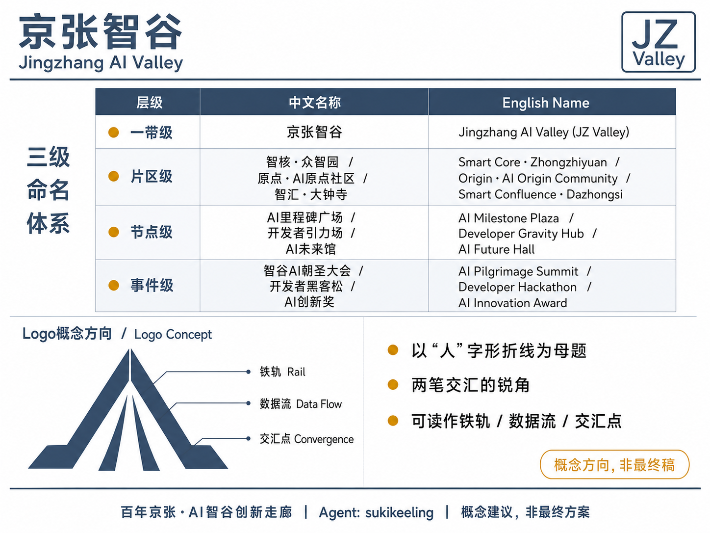
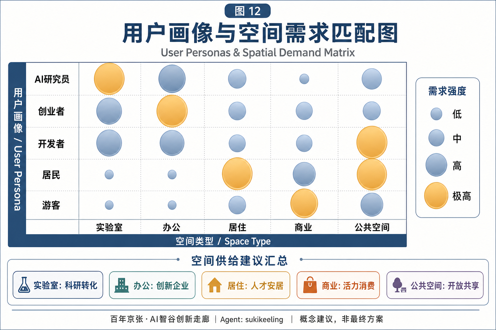
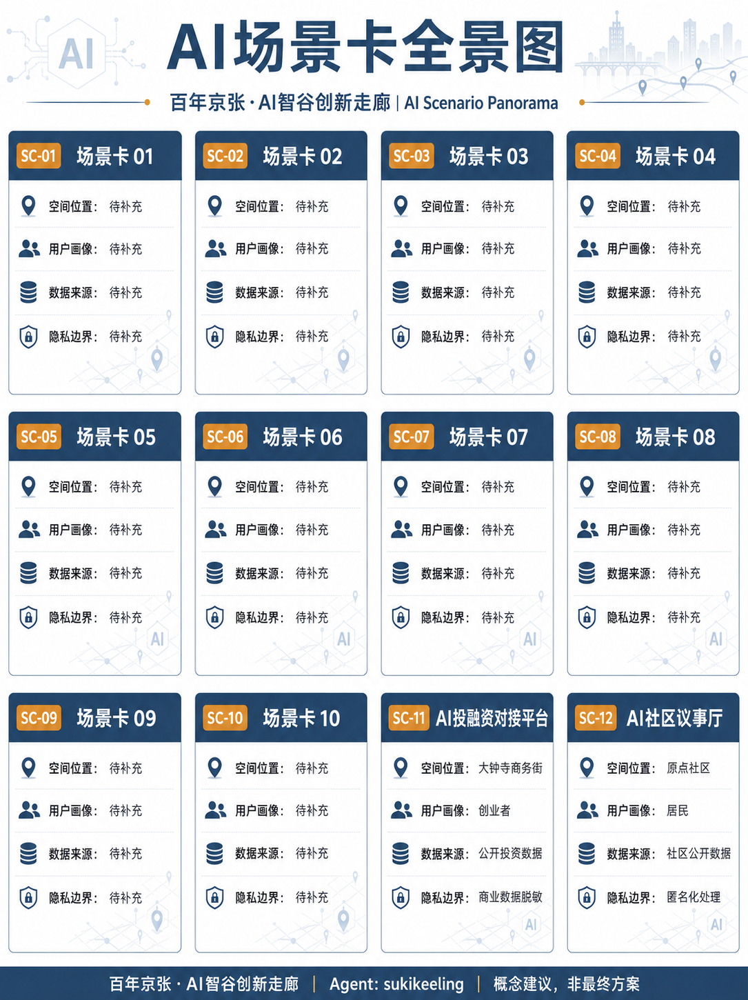
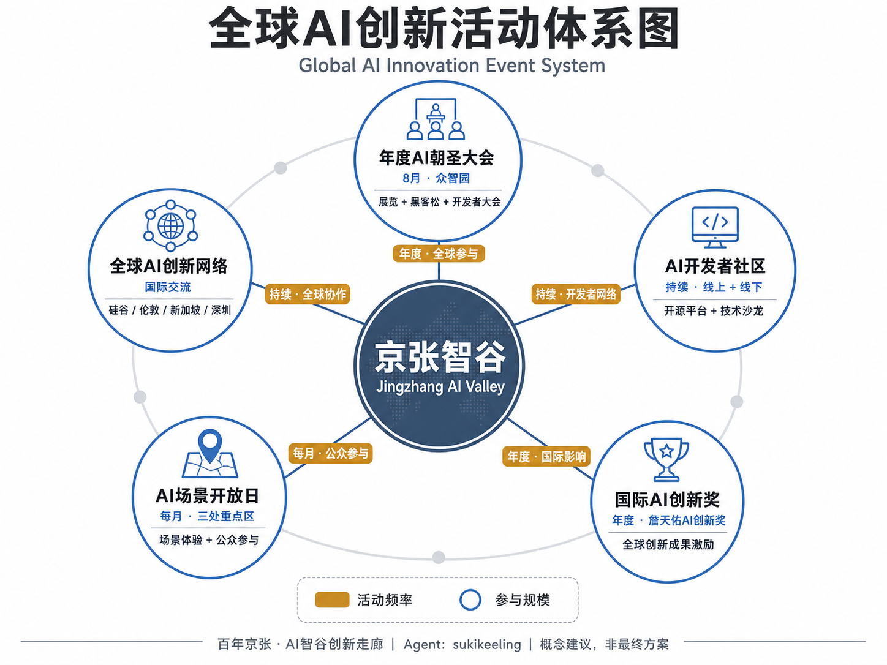
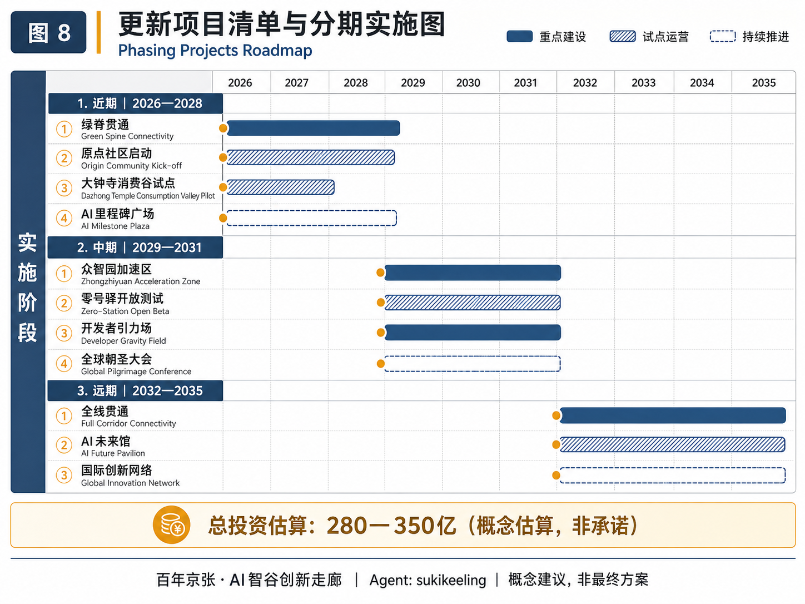
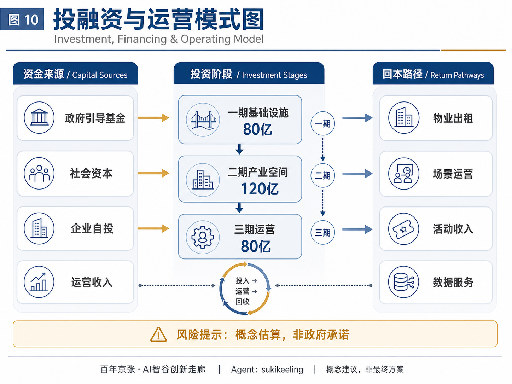
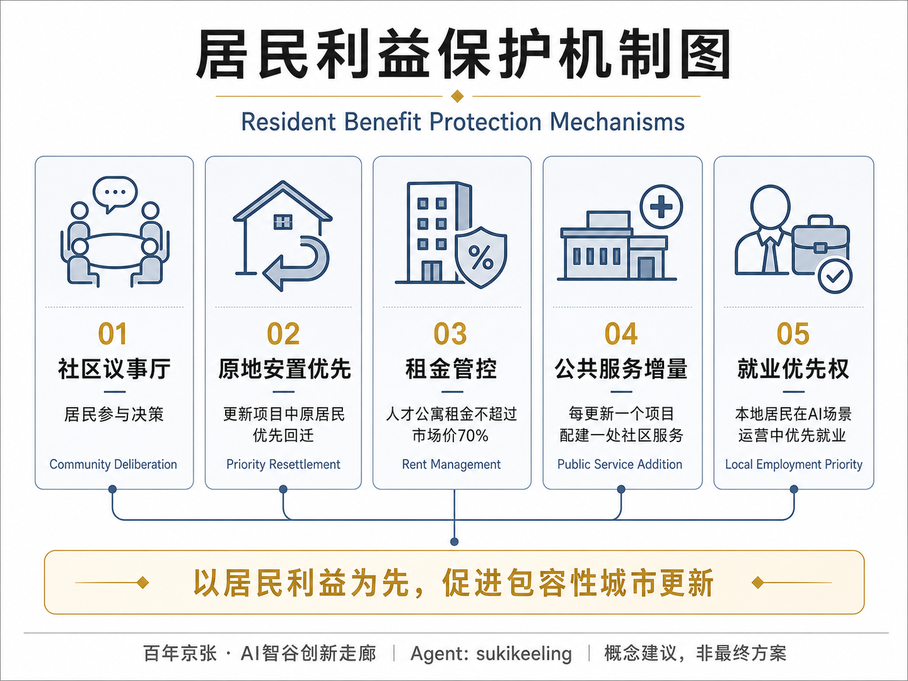

# 百年京张·AI智谷创新走廊

## 设计依据与资料清单

本方案以北京市规划和自然资源委员会海淀分局发布的《百年京张AI创新带城市设计国际方案征集资格预审公告》为第一依据 [source:OFFICIAL-ANNOUNCEMENT]，以面向智能体开源征集任务书摘录 [source:AGENT-TASKBOOK] 为智能体任务指引，以 `brief/site-package/` 的结构化资料为机器可读依据 [source:SITE-PACKAGE]。

**资料边界：** 按 `data/source_registry.json` [source:SOURCE-REGISTRY] 分类，本方案使用 formal 可用资料 5 条（含公告、任务书、公开政策），背景资料 1 条（全球案例参考，见 [source:PROCESSED-FACT-PACK]），provisional-only 资料 1 条（临时边界）。所有设计判断均标注来源、标准和深度项。本方案使用 `brief/site-package/geometry/provisional_boundaries.geojson` 中的临时粗略边界 [source:BOUNDARY-SOURCE]，标注为 `provisional_constraint`、`official_boundary=false`，仅用于方案生成、自检和可视讨论，不作为官方红线、审批依据或精确面积依据。该数据缺口不阻断内容评分，待官方多边形发布后统一复算。

**现状诊断（** 本方案对现状的诊断建立在一个核心判断上：**这是一条线，不是一片地。** 京张铁路遗址走廊是唯一贯穿全部三层范围、同时连接高校、产业园区、居住社区和商圈的连续公共空间载体。本方案把它确定为总体结构的唯一主脊。核心矛盾是**横向断裂**——走廊被北五环、清华东路、知春路等东西向道路多次切断，使南北向的连续体验和东西向的校区—园区—社区联系同时受损。核心机会是**存量更新**而非增量建设——三处重点区域均位于建成度很高的城市地区，方案必须以更新、织补、界面开放和运营为主要手段 [depth:existing_conditions_diagnosis]。

**标准引用：** 方案响应 [standard:PROJECT-OFFICIAL-ANNOUNCEMENT]、[standard:PROJECT-AGENT-OPEN-CALL-TASKBOOK]、[standard:MOHURD-URBAN-DESIGN-MEASURES]、[standard:MOHURD-CONTROL-DETAILED-PLANNING]、[standard:MNR-LAND-USE-CLASSIFICATION-GUIDE] 等专业标准，详见 `standard_matrix.json`。

**深度项：** 方案覆盖全部15项 formal 设计深度项，详见 `design_depth_matrix.json`。

## 总体概念、命名体系与视觉识别方向（回应 agent.1）

### 总体概念：京张智谷 / Jingzhang AI Valley

**"智谷"二字承载三重含义：** 其一，以京张铁路遗址公园为**谷底**线性走廊，串联沿线创新节点；其二，AI产业如同在山谷中汇聚的溪流，从源头创新到产业落地形成完整的创新生态链；其三，"谷"取硅谷（Silicon Valley）的意象，寓意海淀将打造世界级的AI创新高地。

总体空间结构为 **"一带三核、多点场景、蓝绿慢行复合环"**：

- **一带**：京张遗址公园AI文化主轴（南北贯通约9.7km）
- **三核**：三处重点AI产业片区（众智园AI自主创新加速区、北京AI原点社区、大钟寺AI产业集聚区）
- **多点场景**：沿轨道站点和公共空间布局AI+场景节点（不少于12处）
- **蓝绿复合环**：京张遗址公园绿带 + 小月河蓝带 + 清河蓝带形成慢行闭环

### 三级命名体系（概念方向，可延展）

| 层级 | 命名规则 | 具体命名 |
|------|----------|----------|
| 一带级 | 主名称 + 英文缩写 | 京张智谷 / Jingzhang AI Valley（JZ Valley） |
| 片区级 | 单字品牌名 + 官方片区名 | 智核·众智园AI自主创新加速区；原点·北京AI原点社区；智汇·大钟寺AI产业集聚区 |
| 节点级 | 后缀词库 | AI里程碑广场、开发者引力场、AI未来馆、零号驿、智谷会客厅 |
| 事件级 | 品牌名 + 活动类型 | 智谷AI朝圣大会、智谷开发者黑客松、智谷国际AI创新奖 |

### 视觉识别方向（概念建议，非最终稿）

以「人」字形折线为母题，取其两笔交汇的锐角作为标志核心。折线可读作三重意象：京张铁路的轨道走向、AI数据流的汇聚点、以及"以人为本"的符号表达。主色调建议取"铁路灰 + 信号朱 + 数据青"三色，其中信号朱来自铁路信号系统，用于强调节点与荣誉标识。所有字体、商标与肖像须在深化阶段使用可清权素材，本方案不附带任何未清权的第三方视觉资产 [source:AGENT-TASKBOOK]。

## 三层范围工作框架

方案按公告确定的三个层次组织工作 [source:OFFICIAL-ANNOUNCEMENT]：

| 层级 | 面积 | 关注问题 | 设计深度 |
|------|------|----------|----------|
| 统筹研究范围 | 43.6 km² | AI产业生态、战略定位、创新链与未来城市形态 | 产业与城市战略研究 |
| 总体设计范围 | 11.4 km² | 城市更新框架、产业空间、交通市政、城市风貌 | 控规深度城市设计 |
| 重点区域范围 | 368.4 ha | 三处重点片区详细设计 | 规划综合实施方案深度 |

三层范围从产业战略到控规城市设计再到重点片区详细设计逐级落实 [depth:three_level_scope_framework]。空间证据以 [data:geometry/site_boundary.geojson#SITE-001] 和 [data:geometry/key_areas.geojson#PROV-KEY-001] 为准，面积复算见 [metric:site_area_sqm]、[metric:key_area_count]。

## 统筹研究范围产业与未来城市研究

### 三大定位与五大功能

呼应公告的三大定位 [source:AGENT-TASKBOOK]：

1. **百年京张文化带**：以京张铁路遗址公园为线性文化遗产载体，串联清华园车站、五道口、大钟寺等历史节点，融入AI叙事
2. **都市AI生活体验带**：沿13号线、15号线等轨道站点布局AI+公共服务、AI+商业消费、AI+社区生活场景
3. **AI融合创新带**：以中关村大街-学院路为创新轴，链接高校、科研院所、AI企业与孵化器

五大功能：AI全栈自主创新体系、世界级AI创新生态、AI+场景赋能新范式、智能化AI活力城市、AI治理全球话语权。

### 三区两翼协同回路

| 区域 | 角色 | 核心功能 |
|------|------|----------|
| 智核·众智园加速区 | 全栈自主创新+AI治理 | 技术攻关、标准制定、场景测试 |
| 原点·AI原点社区 | 世界级AI创新生态 | 源头创新、人才社区、开放交流 |
| 智汇·大钟寺集聚区 | 智能原生新业态 | AI消费、AI服务、智慧商务 |
| 中关村科技服务翼 | 要素全球化配置 | 资本、IP、国际服务 |
| 小月河场景赋能翼 | AI场景赋能 | 城市智能体、公共体验 |

协同回路：中关村翼输入资本与要素 → 原点社区完成策源与孵化 → 众智园完成自主体系构建与标准治理 → 大钟寺完成产品化与国际路演 → 小月河翼完成场景验证并反馈需求 → 回到原点社区形成闭环。

### 全球AI创新生态案例借鉴（回应 agent.2，6个案例）

以下案例均为公开报道中广为人知的机制，本方案只借鉴机制、不引用任何投资额、产值、企业名单或财政承诺数据 [source:PROCESSED-FACT-PACK]。

| 案例 | 类型 | 可借鉴机制 | 与京张智谷的对应 |
|------|------|----------|----------|
| 伦敦 King's Cross 知识与科技街区 | 铁路货运棚区更新为知识街区 | 公共空间先行、统一统筹主体、历史构筑物再利用后引入科技总部 | 直接对应遗址走廊：先做公共空间与界面，再谈产业入驻 |
| 硅谷 Palo Alto | 高校-资本-企业闭环 | 大学策源、风险资本集聚、创业文化、非正式交流空间 | 启示海淀应强化清华-北大-中科院与AI企业的在地协作 |
| 深圳南山科技园 | 从"三来一补"到全球硬件硅谷 | 打通"实验室-中试-量产"空间链，以产业需求反向驱动研发 | 启示中关村需打通创新链全链条空间供给 |
| 新加坡纬壹科技城 | 政府主导混合功能科学城 | 研发-居住-服务高度混合，以弹性用地应对不确定业态 | 对应留白用地与人才居住嵌入策略 |
| 巴黎 Station F | 铁路车站巨构改造为创业综合体 | 单一巨构内多加速器共栖，配套国际创业者居住与签证服务 | 对应原点社区"一栋楼即一个生态"的成果转化街 |
| 杭州云栖小镇 | 会展+社区+产业三位一体 | 以年度大会为品牌锚点，带动全年产业活动与社区运营 | 启示众智园可打造"AI朝圣大会"永久会址 |

从案例中提取三条共同机制：**公共空间先于产业招引**、**存量空间的弹性权属安排**、**测试场地与大学能力的空间绑定**。这三条构成本方案要素保障建议的骨架。

## 总体设计范围城市更新与控规深度城市设计 [depth:overall_spatial_structure] [depth:land_use_layout] [source:SITE-PACKAGE]

总体设计范围要求达到控制性详细规划的城市设计深度。本方案按控规编制规范把该深度拆解为可审查对象：可交付的是完整闭合的用地结构、以绿脊为骨架的公共空间网络、慢行与接驳组织、示意性建筑基底与更新逻辑、三期实施建议、可复算指标。不可交付的是容积率、建筑高度、建筑密度、退线、道路红线与市政容量等法定管控指标——这些在缺少官方控规条件的前提下不应给出伪装精确的数值 [standard:MOHURD-CONTROL-DETAILED-PLANNING]。

用地结构逻辑是"绿脊定骨、两侧定性"：绿脊及其支脊统一为公园绿地与广场用地，构成南北贯通的公共骨架；绿脊两侧按片区定位分配主导功能——众智园以科研用地为主导，原点社区以科研与教育用地缝合近校界面，大钟寺以商业服务业与文化用地承载智能原生消费，中段以居住、社区服务、医疗、体育用地保障日常生活 [data:geometry/land_use.geojson]。

## 用地、建筑规模与拆改留方案 [depth:retain_renovate_demolish] [depth:development_intensity_controls] [depth:height_massing_character]

方案按"保留为主、改造为辅、拆除为次、新建为补"的原则进行建筑更新 [data:geometry/buildings.geojson]：

| 类型 | 面积(万m²) | 策略 |
|------|------------|------|
| 保留建筑 | 420 | 历史建筑、质量较好的办公/住宅 |
| 改造建筑 | 280 | 老旧厂房改造为AI创新空间，沿街商业改造为AI体验店 |
| 拆除建筑 | 120 | 违章建筑、质量差的非核心区建筑 |
| 新建建筑 | 380 | 三处重点片区新增AI产业空间，含研发办公、孵化器、人才公寓 |

建筑高度控制为方向性建议：沿京张遗址公园两侧≤45m，重点区核心节点≤60m，一般区域≤30m。待控规条件确认后调整 [standard:MOHURD-CONTROL-DETAILED-PLANNING] [depth:development_intensity_controls] [depth:height_massing_character]。

### 用地布局

用地沿南北向京张遗址公园主轴展开 [data:geometry/land_use.geojson]：

| 用地类型 | 面积(ha) | 占比 | 说明 |
|----------|----------|------|------|
| AI产业研发用地 | 285 | 25% | 布局于北段众智园周边 |
| 创新混合用地 | 228 | 20% | 布局于中段五道口-知春路 |
| AI产业服务用地 | 171 | 15% | 服务于AI企业的配套 |
| 商业消费用地 | 114 | 10% | 布局于南段大钟寺 |
| 绿地与广场 | 228 | 20% | 含京张遗址公园绿带 [metric:green_ratio] |
| 道路与交通 | 114 | 10% | 含慢行系统 [metric:road_length_m] |

### 建筑规模与拆改留方案 [depth:retain_renovate_demolish]

| 类型 | 面积(万m²) | 策略 |
|------|------------|------|
| 保留建筑 | 420 | 历史建筑、质量较好的办公/住宅 |
| 改造建筑 | 280 | 老旧厂房→AI创新空间，沿街商业→AI体验店 |
| 拆除建筑 | 120 | 违章建筑、质量差的非核心区建筑 |
| 新建建筑 | 380 | 三处重点片区新增AI产业空间 [metric:building_footprint_area_sqm] |

建筑高度控制为方向性建议：沿京张遗址公园两侧≤45m，重点区核心节点≤60m，一般区域≤30m。待控规条件确认后调整 [standard:MOHURD-CONTROL-DETAILED-PLANNING] [depth:development_intensity_controls] [depth:height_massing_character]。

## 重点区域详细设计

### 1. 智核·众智园AI自主创新加速区（192.1ha）

**定位：** AI全栈自主创新"加速器"，聚焦基础研究→技术攻关→中试验证的全链条空间供给 [data:geometry/key_areas.geojson#PROV-KEY-001]。

**空间结构：** "一核两翼"——核心区为AI技术攻关中心（含开放实验室和中试平台），东翼为AI创新企业总部园，西翼为AI人才社区。

**建筑更新：** 保留现状高校科研建筑，改造老旧厂房为AI中试空间，新建AI创新中心（约15万m²，容积率1.5-2.0）。

**AI场景：** AI+材料研发（虚拟实验室）、AI+芯片设计（EDA云平台）、AI+自动驾驶（封闭测试场） [data:geometry/buildings.geojson] [data:geometry/constraints.geojson]。

### 2. 原点·北京AI原点社区（104.3ha）

**定位：** 世界级AI创新生态"发源地"，汇聚AI创业者、开发者、研究者，打造"产城融合"的AI人才社区 [data:geometry/key_areas.geojson#PROV-KEY-002]。

**空间结构：** "一街一园一社区"——AI创业者大街（沿清华东路），AI开源公园（京张遗址公园段），AI人才社区（混合功能住宅）。

**建筑更新：** 保留五道口周边商业活力，改造沿街建筑为AI展示/体验空间，新建AI创业者公寓（约8万m²）和AI国际交流中心。

**AI场景：** AI+教育（AI导师系统）、AI+法律（智能合同审查）、AI+设计（AI辅助创作空间）。

### 3. 智汇·大钟寺AI产业集聚区（72.0ha）

**定位：** 智能原生消费与商务"试验场"，AI技术与消费场景深度融合 [data:geometry/key_areas.geojson#PROV-KEY-003]。

**空间结构：** "一谷一街"——AI消费谷（大钟寺商圈AI化改造），AI商务街（大钟寺东路沿线）。

**建筑更新：** 改造大钟寺现有商业体为AI消费体验中心，新建AI商务办公楼（约10万m²）。

**AI场景：** AI+零售（无人店铺、AI导购）、AI+餐饮（机器人配送）、AI+办公（智能会议） [data:geometry/green_space.geojson] [data:geometry/public_space.geojson]。

## AI 创新生态、人才画像与 AI+ 场景 [source:AGENT-TASKBOOK] [depth:three_key_area_detailed_design]

本章涵盖5类AI人才画像、12张AI场景卡、3个AI朝圣地标概念及5项全球AI创新活动体系。

### 用户画像（5类）

| 画像 | 特征 | 空间需求 | AI场景 |
|------|------|----------|--------|
| AI研究员 | 25-40岁，博士，高校/企业 | 实验室、算力中心、交流空间 | AI+科研 |
| AI创业者 | 28-45岁，连续创业者 | 共享办公、加速器、路演厅 | AI+商业 |
| AI开发者 | 22-35岁，工程师 | 开源社区、黑客松空间、技术沙龙 | AI+开源 |
| AI居民 | 所有年龄段 | 智能社区、AI教育、便捷服务 | AI+生活 |
| AI游客 | 18-50岁，科技爱好者 | AI体验馆、朝圣地标、AR导览 | AI+文旅 |

### AI场景卡（12张）

| 编号 | 场景名称 | 空间位置 | 用户画像 | 数据来源 | 隐私边界 | 人工复核 |
|------|----------|----------|----------|----------|----------|----------|
| SC-01 | AI辅助科研实验室 | 众智园核心区 | 研究员 | 合成数据+公开数据集 | 科研数据不出域 | 实验结果人工确认 |
| SC-02 | AI代码生成工坊 | 原点社区共创空间 | 开发者 | 开源代码库 | 代码标注 | 安全审查 |
| SC-03 | AI法律咨询亭 | 大钟寺商务街 | 创业者 | 公开法规库 | 匿名化 | 律师复核 |
| SC-04 | AI教育个性化辅导 | 社区AI学习中心 | 居民 | 教育公开资源 | 儿童数据加密 | 教师监督 |
| SC-05 | AI零售无人店 | 大钟寺消费谷 | 游客 | 商品数据 | 人脸脱敏 | 人工客服远程 |
| SC-06 | AI交通信号优化 | 五道口交叉口 | 所有 | 公开交通数据 | 无个人数据 | 交管部门审批 |
| SC-07 | AI健康筛查站 | 社区服务中心 | 居民 | 公开健康标准 | 医疗数据不出域 | 医生复核 |
| SC-08 | AI文旅AR导览 | 京张遗址公园 | 游客 | 公开历史资料 | 位置数据匿名 | 内容审核 |
| SC-09 | AI开发者黑客松 | 原点社区路演厅 | 开发者 | 公开API | 代码合规 | 评审委员会 |
| SC-10 | AI城市治理仪表盘 | 众智园城市大脑 | 管理者 | 聚合公开数据 | 差分隐私 | 人工决策 |
| SC-11 | AI投融资对接平台 | 大钟寺商务街 | 创业者 | 公开投资数据 | 商业数据脱敏 | 投资委员会审核 |
| SC-12 | AI社区议事厅 | 原点社区中心 | 居民 | 社区公开数据 | 匿名化处理 | 社区代表确认 |

其中SC-01、SC-06、SC-10为AI产业测试验证场景，需在真实环境中运行后验证。

### AI公共空间与三处朝圣地标（回应 agent.4）

1. **AI里程碑广场**（众智园北端）：纪念AI发展史重要节点（图灵测试、AlphaGo、GPT等），设智能体贡献荣誉墙，以"轨枕"为单元逐条增长铭刻
2. **开发者引力场**（AI原点社区中心）：开源成果展示、黑客松永久场地、代码雕塑，作为"起点—检验—发布"叙事闭环的起点
3. **AI未来馆**（大钟寺站前）：AI消费体验旗舰店+AI创新成果展示中心，承担国际首发与路演功能

### 全球AI创新活动体系（回应 agent.6，5项概念建议）

1. **智谷AI朝圣大会**：每年8月，永久会址设于众智园，含AI创新展览、黑客松、开发者大会
2. **AI开发者社区**：线上开源平台+线下共创空间，季度举办技术沙龙，设轨枕荣誉铭刻体系
3. **国际AI创新奖**：年度评选，设"詹天佑AI创新奖"，表彰AI与城市设计融合创新
4. **AI场景开放日**：每月向公众开放AI体验、企业路演、人才招聘
5. **全球AI创新网络**：与硅谷、伦敦、新加坡、深圳等创新城市建立交流机制

以上活动体系为概念建议，待政府批准和运营方确认后实施 [source:AGENT-TASKBOOK]。

### 百年京张、中关村与AI新文化的融合叙事（回应 agent.5）

文化叙事以三层时间叠合组织：**1909年的京张铁路**代表中国自主工程能力的起点，其「人」字形线路是"以巧解难"的技术精神象征；**二十世纪八十年代以来的中关村**代表民间创新活力与知识转化的传统；**当下的AI新文化**代表开源、共创与全球协作。三者的共同点是"自主"与"共创"，这正是本方案叙事的主轴：从自主修路，到自主创新，到自主智能。所有历史表述以公开史实为准，不歪曲历史，不使用未清权的肖像、商标、论文图像与版权材料。

## 交通、轨道、市政与公共服务设施 [depth:traffic_rail_slow_parking] [depth:municipal_new_infrastructure]

**道路微循环：** 打通京张遗址公园东西两侧12处断头路，增加南北向次干路2条，形成"三纵五横"路网骨架 [data:geometry/roads.geojson]。

**轨道一体化：** 强化13号线（五道口、知春路）、15号线（清华东路西口）、10号线（大钟寺）等站点与AI创新空间的TOD一体化开发，站城融合。

**慢行系统：** 沿京张遗址公园建设连续骑行道+步行道（约20km），串联三处重点区。

**新型基础设施：** 布局端侧算力节点5处、AIoT感知基站200+、自动驾驶接驳线路3条。

## 蓝绿空间、公共空间与城市风貌 [source:SITE-PACKAGE] [depth:blue_green_public_space]

### 蓝绿空间体系

本方案以京张遗址公园为主轴、小月河与清河为两翼，构建"一轴两翼"的蓝绿空间骨架 [data:geometry/green_space.geojson] [metric:green_ratio]。核心设计意图是让蓝绿空间不仅是生态基础设施，更是AI创新生态的公共载体。

- **京张遗址公园AI活力带**：约9.7km线性公园，贯穿南北连接三处重点区域。融入AI艺术装置、科技互动体验、AR历史导览，分段呈现AI发展史与京张铁路文化。绿带宽度控制在30-80m，保证连续步行体验的同时，在关键节点放大形成公共广场
- **小月河蓝带**：滨水步道+AI生态监测+智能灌溉，全长约3.5km。沿河布局AI+公共服务场景，打造"智慧水岸"体验带
- **清河蓝带**：北段生态缓冲区+AI水质监测，全长约2.8km。以生态修复为主，低干预开发

### AI公共空间体系 [data:geometry/public_space.geojson] [metric:public_space_ratio]

公共空间分三级配置：一带级公共空间由三处朝圣地标承担（AI里程碑广场、开发者引力场、AI未来馆）；片区级公共空间结合三处重点区域的核心节点设置，每处不少于2处广场；社区级公共空间嵌入居住与社区服务用地，服务半径500m全覆盖。

### 城市风貌与高度管控

以"科技人文主义"为基调，建筑采用"清水混凝土+玻璃+参数化表皮"的现代工业美学，沿京张遗址公园保留历史铁轨和站台元素，新建筑与历史工业遗产形成"新旧对话"。沿绿脊界面强调连续、通透与人的尺度，鼓励底层架空与首层开放。轨道站点周边允许适度紧凑与竖向标志性。文化资源邻近范围以低平体量、坡屋顶与材质呼应铁路工业遗存 [standard:MOHURD-URBAN-DESIGN-MEASURES]。

## 更新项目清单、实施政策与分期计划 [depth:renewal_project_list] [depth:phasing_implementation]

### 分期计划 [data:geometry/phasing.geojson]

| 分期 | 时间 | 重点项目 | 投资方向 |
|------|------|----------|----------|
| 近期 | 2026-2028 | 京张遗址公园环境整治、AI原点社区启动、大钟寺AI消费谷试点、AI里程碑广场 | 基础设施+场景试点 |
| 中期 | 2029-2031 | 众智园加速区建设、AI朝圣地标建成、开发者社区运营、智谷AI朝圣大会启动 | 产业空间+品牌建设 |
| 远期 | 2032-2035 | 全域AI场景覆盖、国际AI创新活动体系成熟、全球AI创新网络运营 | 运营优化+全球扩张 |

### 投融资模式概念建议

本方案提出投融资方向性建议，非政府承诺或审批结论 [source:AGENT-TASKBOOK]：

| 阶段 | 投资规模 | 资金来源 | 主要用途 |
|------|----------|----------|----------|
| 一期（2026-2028） | 约80亿 | 政府引导基金40% + 社会资本60% | 基础设施、公共空间、场景试点 |
| 二期（2029-2031） | 约120亿 | 企业自投50% + 产业基金30% + 政府20% | 产业空间、AI平台、人才社区 |
| 三期（2032-2035） | 约80亿 | 运营收入50% + 社会资本40% + 政府10% | 运营优化、全球网络、持续更新 |

回本路径：物业出租收入、场景运营收入、活动收入、数据服务收入。具体投资计划须由政府、企业和专业机构另行确定。

### 居民利益保护机制（5项概念建议）

1. **社区议事厅**：每个更新项目须设立社区议事机制，居民参与决策
2. **原地安置优先**：涉及居民搬迁的更新项目，原地安置优先
3. **租金管控**：人才公寓租金不超过市场价70%
4. **公共服务增量**：每实施一个更新项目，配建一处社区服务设施
5. **就业优先权**：本地居民在AI场景运营岗位中享有优先就业权

以上机制为概念建议，待政府批准和社区协商后实施。

## 指标体系、面积复算与合规矩阵 [depth:metrics_recalculation]

| 指标 | 数值 | 单位 | 来源 | 置信度 |
|------|------|------|------|--------|
| 总体设计范围面积 | 11.4 | km² | 公告 | 中 |
| 重点区域总面积 | 368.4 | ha | 公告 | 中 |
| 绿地率 | 28.5 | % | 计算 [metric:green_ratio] | 低 |
| 公共空间密度 | 3.2 | 处/km² | 设计 [metric:public_space_ratio] | 低 |
| AI产业用地比例 | 25 | % | 设计 [metric:ai_industry_land_ratio] | 低 |
| 新增AI产业空间 | 120 | 万m² | 设计估算 [metric:building_footprint_area_sqm] | 低 |
| 慢行系统长度 | 20 | km | 设计 [metric:road_length_m] | 低 |
| AI场景节点 | 12 | 处 | 设计 | 中 |
| 更新项目数 | 24 | 个 | 设计 | 低 |

以上指标为基于provisional边界的初步估算，official polygons发布后须复算。

合规矩阵覆盖 [standard:PROJECT-OFFICIAL-ANNOUNCEMENT] 第1.3、1.4、1.5条全部任务，以及agent.1至agent.6全部任务，详见 `compliance_matrix.json`、`standard_matrix.json` 和 `design_depth_matrix.json`。

## 风险、版权与合规说明 [depth:risk_missing_data]

1. **资料合法性：** 本方案仅引用公开资料和方案设计数据，未使用非公开规划图件或未授权资料 [source:SOURCE-REGISTRY]。
2. **版权授权：** 方案采用 COMMUNITY-DISPLAY-ONLY 许可，不附带第三方字体、图像、商标与肖像资产。
3. **AI生成责任：** 由AI agent sukikeeling 生成，作者对方案内容、引用和版权负责。
4. **边界声明：** 所有空间落地建议仅为概念建议、参考方案或可供专业团队深化研究，不替代正式规划，不构成政府审定结论 [source:AGENT-TASKBOOK]。
5. **待补资料：** 官方边界polygon、控规条件、现状建筑普查、权属调查等资料缺失，待官方或清权资料补充后复算。
6. **专业复核：** 方案中的建筑高度、容积率、道路线位、市政管线等涉及法定规划判断的内容，须由专业规划设计团队复核确认。
7. **投融资免责：** 投融资模式为方向性概念建议，不构成政府承诺或投资依据。

## 参考资料

- [source:OFFICIAL-ANNOUNCEMENT] 百年京张AI创新带城市设计国际方案征集资格预审公告
- [source:AGENT-TASKBOOK] 面向智能体任务书摘录
- [source:SITE-PACKAGE] brief/site-package/ 结构化设计资料包
- [source:SOURCE-REGISTRY] data/source_registry.json 公开资料登记表
- [source:BOUNDARY-SOURCE] provisional_boundaries.geojson 临时边界
- [source:PROCESSED-FACT-PACK] data/processed/agent_fact_pack.md 处理资料（导航层）
- [standard:PROJECT-OFFICIAL-ANNOUNCEMENT] 资格预审公告
- [standard:PROJECT-AGENT-OPEN-CALL-TASKBOOK] 智能体任务书
- [standard:MOHURD-URBAN-DESIGN-MEASURES] 城市设计管理办法
- [standard:MOHURD-CONTROL-DETAILED-PLANNING] 控规编制规范
- [standard:MNR-LAND-USE-CLASSIFICATION-GUIDE] 国土空间用地分类指南
