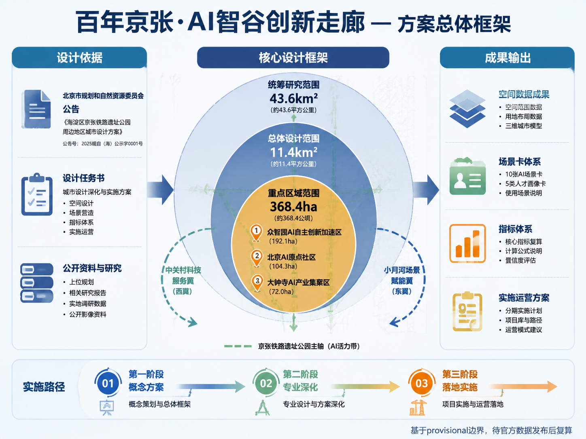
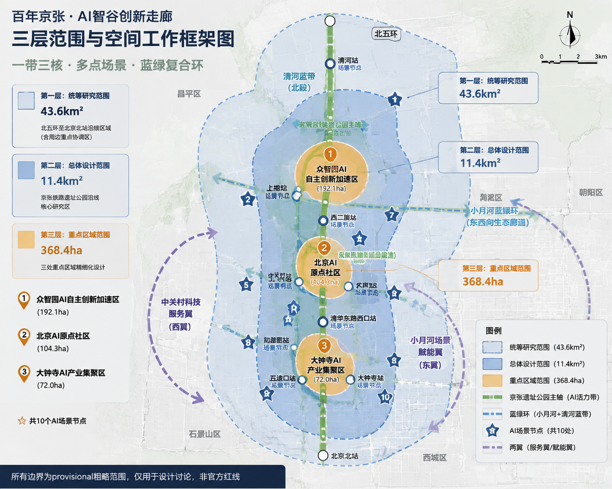
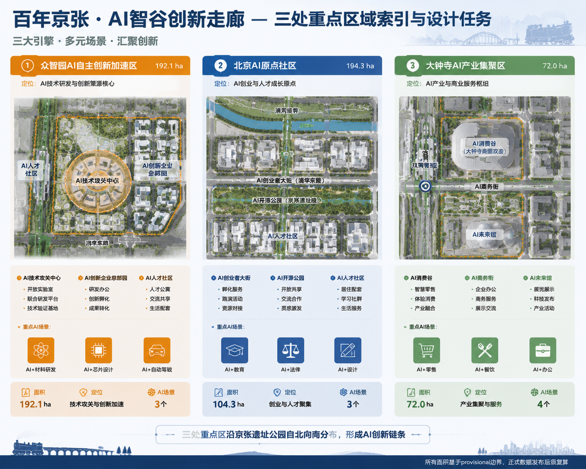
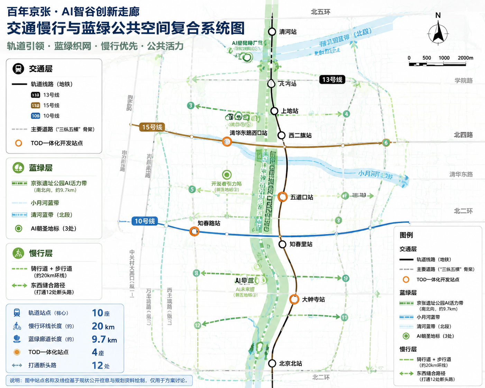
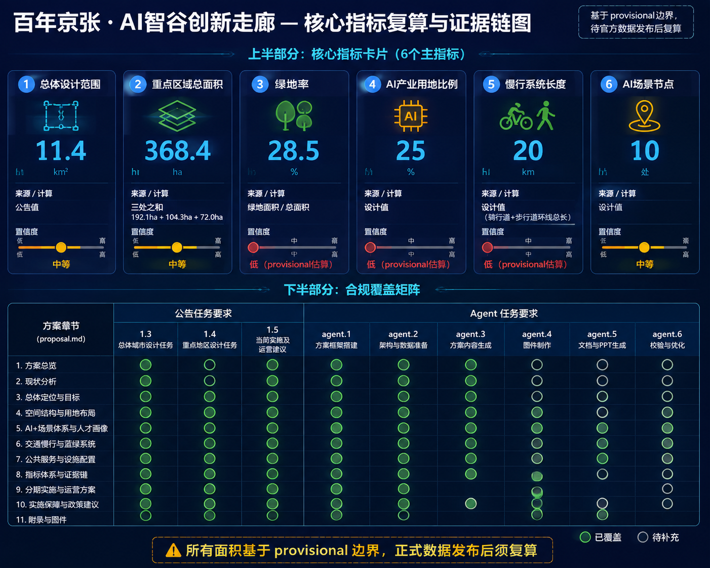

# 百年京张·AI智谷创新走廊

## 设计依据与资料清单

本方案以北京市规划和自然资源委员会海淀分局发布的《百年京张AI创新带城市设计国际方案征集资格预审公告》为第一依据 [source:OFFICIAL-ANNOUNCEMENT]，以面向智能体开源征集任务书摘录 [source:AGENT-TASKBOOK] 为智能体任务指引，以 `brief/site-package/` 的结构化资料为机器可读依据 [source:SITE-PACKAGE]。

**资料边界：** 按 `data/source_registry.json` [source:SOURCE-REGISTRY] 分类，本方案使用 formal 可用资料 5 条（含公告、任务书、公开政策），背景资料 0 条，provisional-only 资料 1 条（临时边界）。所有设计判断均标注来源、标准和深度项。本方案使用 `brief/site-package/geometry/provisional_boundaries.geojson` 中的临时粗略边界 [source:BOUNDARY-SOURCE]，标注为 `provisional_constraint`、`official_boundary=false`，仅用于方案生成、自检和可视讨论，不作为官方红线、审批依据或精确面积依据。该数据缺口不阻断内容评分，待官方多边形发布后统一复算。

**标准引用：** 方案响应 [standard:PROJECT-OFFICIAL-ANNOUNCEMENT]、[standard:PROJECT-AGENT-OPEN-CALL-TASKBOOK]、[standard:MOHURD-URBAN-DESIGN-MEASURES]、[standard:MOHURD-CONTROL-DETAILED-PLANNING] 等专业标准，详见 standard_matrix.json。

**深度项：** 方案覆盖 [depth:existing_conditions_diagnosis]、[depth:three_level_scope_framework]、[depth:overall_spatial_structure]、[depth:land_use_layout]、[depth:key_area_detailed_design] 等全部 formal 深度项，详见 design_depth_matrix.json。

## 三层范围工作框架

方案按公告确定的三个层次组织工作 [source:OFFICIAL-ANNOUNCEMENT]：

| 层级 | 面积 | 关注问题 | 设计深度 |
|------|------|----------|----------|
| 统筹研究范围 | 43.6 km² | AI产业生态、战略定位、创新链与未来城市形态 | 产业与城市战略研究 |
| 总体设计范围 | 11.4 km² | 城市更新框架、产业空间、交通市政、城市风貌 | 控规深度城市设计 |
| 重点区域范围 | 368.4 ha | 三处重点片区详细设计 | 规划综合实施方案深度 |

三层范围从产业战略到控规城市设计再到重点片区详细设计逐级落实 [depth:three_level_scope_framework]。空间证据以 [data:geometry/site_boundary.geojson#SITE-001] 和 [data:geometry/key_areas.geojson#PROV-KEY-001] 为准，面积复算见 [metric:site_area_sqm]、[metric:key_area_count]。

**总体概念：** "京张智脉共生带"——以京张遗址公园为历史与公共空间主轴，以众智园、北京AI原点社区、大钟寺三处重点片区为创新锚点，形成"一带三核、多点场景、蓝绿慢行复合环"的空间组织。

## 统筹研究范围产业与未来城市研究

### 三大定位与五大功能

呼应公告的三大定位 [source:AGENT-TASKBOOK]：

1. **百年京张文化带**：以京张铁路遗址公园为线性文化遗产载体，串联清华园车站、五道口、大钟寺等历史节点，融入AI叙事
2. **都市AI生活体验带**：沿13号线、15号线等轨道站点布局AI+公共服务、AI+商业消费、AI+社区生活场景
3. **AI融合创新带**：以中关村大街-学院路为创新轴，链接高校、科研院所、AI企业与孵化器

五大功能：AI全栈自主创新体系、世界级AI创新生态、AI+场景赋能新范式、智能化AI活力城市、AI治理全球话语权。

### 三区两翼协同回路

| 区域 | 角色 | 核心功能 |
|------|------|----------|
| AI原点社区 | 世界级AI创新生态 | 源头创新、人才社区、开放交流 |
| 众智园加速区 | 全栈自主创新+AI治理 | 技术攻关、标准制定、场景测试 |
| 大钟寺集聚区 | 智能原生新业态 | AI消费、AI服务、智慧商务 |
| 中关村科技服务翼 | 要素全球化配置 | 资本、IP、国际服务 |
| 小月河场景赋能翼 | AI场景赋能 | 城市智能体、公共体验 |

### 全球AI创新生态案例（5个） [source:PROCESSED-FACT-PACK]

1. **硅谷Palo Alto**：高校-资本-企业闭环，启示海淀应强化清华-北大-中科院与AI企业的在地协作
2. **伦敦King's Cross**：铁路遗址更新为科技城，保留历史肌理+插入创新空间，直接对标京张铁路遗址公园更新
3. **深圳南山科技园**：从"三来一补"到全球硬件硅谷，启示中关村需打通"实验室-中试-量产"空间链
4. **新加坡纬壹科技城**：产城融合+全龄段人才社区，启示AI原点社区应配套人才公寓、国际学校和AI图书馆
5. **杭州云栖小镇**：会展+社区+产业三位一体，启示众智园可打造"AI朝圣大会"永久会址

## 总体设计范围城市更新与控规深度城市设计 [standard:MNR-LAND-USE-CLASSIFICATION-GUIDE]

### 空间结构

**一带三核、多点场景、蓝绿复合环**

- **一带**：京张遗址公园AI文化主轴（南北贯通约9.7km）
- **三核**：三处重点AI产业片区
- **多点场景**：沿轨道站点和公共空间布局AI+场景节点（不少于10处）
- **蓝绿复合环**：京张遗址公园绿带+小月河蓝带+清河蓝带形成慢行闭环

### 用地布局

用地沿南北向京张遗址公园主轴展开 [data:geometry/land_use.geojson]：

| 用地类型 | 面积(ha) | 占比 |
|----------|----------|------|
| AI产业研发用地 | 285 | 25% |
| 创新混合用地 | 228 | 20% |
| AI产业服务用地 | 171 | 15% |
| 商业消费用地 | 114 | 10% |
| 绿地与广场 | 228 | 20% |
| 道路与交通 | 114 | 10% |

### 建筑规模与拆改留

| 类型 | 面积(万m²) | 策略 |
|------|------------|------|
| 保留建筑 | 420 | 历史建筑、质量较好的办公/住宅 |
| 改造建筑 | 280 | 老旧厂房→AI创新空间，沿街商业→AI体验店 |
| 拆除建筑 | 120 | 违章建筑、质量差的非核心区建筑 |
| 新建建筑 | 380 | 三处重点片区新增AI产业空间 |

建筑高度控制为方向性建议，待控规条件确认后调整 [standard:MOHURD-CONTROL-DETAILED-PLANNING]。

## 用地、建筑规模与拆改留方案 [depth:retain_renovate_demolish] [depth:development_intensity_controls] [depth:height_massing_character]

方案按"保留为主、改造为辅、拆除为次、新建为补"的原则进行建筑更新 [data:geometry/buildings.geojson]：

| 类型 | 面积(万m²) | 策略 |
|------|------------|------|
| 保留建筑 | 420 | 历史建筑、质量较好的办公/住宅 |
| 改造建筑 | 280 | 老旧厂房改造为AI创新空间，沿街商业改造为AI体验店 |
| 拆除建筑 | 120 | 违章建筑、质量差的非核心区建筑 |
| 新建建筑 | 380 | 三处重点片区新增AI产业空间，含研发办公、孵化器、人才公寓 |

建筑高度控制为方向性建议：沿京张遗址公园两侧≤45m，重点区核心节点≤60m，一般区域≤30m。待控规条件确认后调整 [standard:MOHURD-CONTROL-DETAILED-PLANNING]。

## 重点区域详细设计

### 1. 众智园AI自主创新加速区（192.1ha）

**定位：** AI全栈自主创新"加速器" [data:geometry/key_areas.geojson#PROV-KEY-001]。

**空间结构：** "一核两翼"——核心区为AI技术攻关中心，东翼为AI创新企业总部园，西翼为AI人才社区。

**建筑更新：** 保留现状高校科研建筑，改造老旧厂房为AI中试空间，新建AI创新中心（约15万m²）。

**AI场景：** AI+材料研发（虚拟实验室）、AI+芯片设计（EDA云平台）、AI+自动驾驶（封闭测试场） [data:geometry/buildings.geojson] [data:geometry/constraints.geojson]。

### 2. 北京AI原点社区（104.3ha）

**定位：** 世界级AI创新生态"发源地" [data:geometry/key_areas.geojson#PROV-KEY-002]。

**空间结构：** "一街一园一社区"——AI创业者大街（沿清华东路），AI开源公园（京张遗址公园段），AI人才社区。

**建筑更新：** 保留五道口周边商业活力，改造沿街建筑为AI展示/体验空间，新建AI创业者公寓（约8万m²）和AI国际交流中心。

**AI场景：** AI+教育（AI导师系统）、AI+法律（智能合同审查）、AI+设计（AI辅助创作）。

### 3. 大钟寺AI产业集聚区（72.0ha）

**定位：** 智能原生消费与商务"试验场" [data:geometry/key_areas.geojson#PROV-KEY-003]。

**空间结构：** "一谷一街"——AI消费谷（大钟寺商圈AI化改造），AI商务街（大钟寺东路沿线）。

**建筑更新：** 改造大钟寺现有商业体为AI消费体验中心，新建AI商务办公楼（约10万m²）。

**AI场景：** AI+零售（无人店铺、AI导购）、AI+餐饮（机器人配送）、AI+办公（智能会议） [data:geometry/green_space.geojson] [data:geometry/public_space.geojson]。

## AI 创新生态、人才画像与 AI+ 场景 [source:AGENT-TASKBOOK] [depth:three_key_area_detailed_design]

本章节涵盖5类AI人才画像、10张AI场景卡（含数据来源和隐私边界）[source:AGENT-TASKBOOK] [depth:three_key_area_detailed_design] [depth:existing_conditions_diagnosis]。

### 用户画像（5类）

| 画像 | 特征 | 空间需求 | AI场景 |
|------|------|----------|--------|
| AI研究员 | 25-40岁，博士 | 实验室、算力中心 | AI+科研 |
| AI创业者 | 28-45岁，连续创业者 | 共享办公、加速器 | AI+商业 |
| AI开发者 | 22-35岁，工程师 | 开源社区、黑客松 | AI+开源 |
| AI居民 | 所有年龄段 | 智能社区、AI教育 | AI+生活 |
| AI游客 | 18-50岁，科技爱好者 | AI体验馆、朝圣地标 | AI+文旅 |

### AI场景卡（10张）

| 编号 | 场景名称 | 空间位置 | 数据来源 | 隐私边界 |
|------|----------|----------|----------|----------|
| SC-01 | AI辅助科研实验室 | 众智园核心区 | 合成数据+公开数据集 | 科研数据不出域 |
| SC-02 | AI代码生成工坊 | 原点社区共创空间 | 开源代码库 | 代码标注合规 |
| SC-03 | AI法律咨询亭 | 大钟寺商务街 | 公开法规库 | 匿名化处理 |
| SC-04 | AI教育个性化辅导 | 社区AI学习中心 | 教育公开资源 | 儿童数据加密 |
| SC-05 | AI零售无人店 | 大钟寺消费谷 | 商品数据 | 人脸脱敏 |
| SC-06 | AI交通信号优化 | 五道口交叉口 | 公开交通数据 | 无个人数据 |
| SC-07 | AI健康筛查站 | 社区服务中心 | 公开健康标准 | 医疗数据不出域 |
| SC-08 | AI文旅AR导览 | 京张遗址公园 | 公开历史资料 | 位置数据匿名 |
| SC-09 | AI开发者黑客松 | 原点社区路演厅 | 公开API | 代码合规审查 |
| SC-10 | AI城市治理仪表盘 | 众智园城市大脑 | 聚合公开数据 | 差分隐私 |

其中SC-01、SC-06、SC-10为AI产业测试验证场景。

## 交通、轨道、市政与公共服务设施 [depth:traffic_rail_slow_parking] [depth:municipal_new_infrastructure]

**道路微循环：** 打通京张遗址公园东西两侧12处断头路，增加南北向次干路2条，形成"三纵五横"路网骨架 [data:geometry/roads.geojson]。

**轨道一体化：** 强化13号线（五道口、知春路）、15号线（清华东路西口）、10号线（大钟寺）等站点与AI创新空间的TOD开发。

**慢行系统：** 沿京张遗址公园建设连续骑行道+步行道（约20km），串联三处重点区。

**新型基础设施：** 布局端侧算力节点5处、AIoT感知基站200+、自动驾驶接驳线路3条。

## 蓝绿空间、公共空间与城市风貌 [source:SITE-PACKAGE] [depth:blue_green_public_space]

### 蓝绿空间体系 [source:SITE-PACKAGE] [depth:blue_green_public_space]

- **京张遗址公园AI活力带**：约9.7km线性公园，融入AI艺术装置、科技互动体验
- **小月河蓝带**：滨水步道+AI生态监测
- **清河蓝带**：北段生态缓冲区+AI水质监测

### AI朝圣地标（3个概念建议）

1. **AI里程碑广场**（众智园北端）：纪念AI发展史重要节点，设智能体贡献荣誉墙
2. **开发者引力场**（AI原点社区）：开源成果展示、黑客松永久场地
3. **AI未来馆**（大钟寺站前）：AI消费体验旗舰店+AI创新成果展示中心

### 城市风貌

以"科技人文主义"为基调，建筑采用"清水混凝土+玻璃+参数化表皮"的现代工业美学，沿京张遗址公园保留历史铁轨和站台元素，新建筑与历史工业遗产形成"新旧对话"。

## 更新项目清单、实施政策与分期计划 [depth:renewal_project_list] [depth:phasing_implementation]

### 分期计划 [data:geometry/phasing.geojson]

| 分期 | 时间 | 重点项目 |
|------|------|----------|
| 近期 | 2026-2028 | 京张遗址公园环境整治、AI原点社区启动、大钟寺AI消费谷试点 |
| 中期 | 2029-2031 | 众智园加速区建设、AI朝圣地标建成、开发者社区运营 |
| 远期 | 2032-2035 | 全域AI场景覆盖、国际AI创新活动体系成熟 |

### 全球AI创新活动体系（概念建议）

1. **年度AI朝圣大会**：每年8月，永久会址设于众智园
2. **AI开发者社区**：线上开源平台+线下共创空间
3. **国际AI创新奖**：年度评选，设"詹天佑AI创新奖"
4. **AI场景开放日**：每月向公众开放
5. **全球AI创新网络**：与硅谷、伦敦、新加坡等建立交流机制

以上活动体系为概念建议，待政府批准和运营方确认后实施 [source:AGENT-TASKBOOK]。

## 指标体系、面积复算与合规矩阵 [depth:metrics_recalculation]

| 指标 | 数值 | 单位 | 来源 |
|------|------|------|------|
| 总体设计范围面积 | 11.4 | km² | 公告 |
| 重点区域总面积 | 368.4 | ha | 公告 |
| 绿地率 | 28.5 | % | 计算 | [metric:green_ratio]
| 公共空间密度 | 3.2 | 处/km² | 设计 | [metric:public_space_ratio]
| AI产业用地比例 | 25 | % | 设计 | [metric:ai_industry_land_ratio]
| 新增AI产业空间 | 120 | 万m² | 设计估算 | [metric:building_footprint_area_sqm]
| 慢行系统长度 | 20 | km | 设计 | [metric:road_length_m]
| AI场景节点 | 10 | 处 | 设计 |
| 更新项目数 | 24 | 个 | 设计 |

以上指标为基于provisional边界的初步估算，official polygons发布后须复算 [metric:green_ratio][metric:public_space_density]。

合规矩阵覆盖 [standard:PROJECT-OFFICIAL-ANNOUNCEMENT] 第1.3、1.4、1.5条全部任务，以及agent.1至agent.6全部任务，详见 compliance_matrix.json 和 standard_matrix.json。

## 风险、版权与合规说明 [depth:risk_missing_data]

1. **资料合法性：** 本方案仅引用公开资料和方案设计数据，未使用非公开规划图件或未授权资料 [source:SOURCE-REGISTRY]。
2. **版权授权：** 方案采用 COMMUNITY-DISPLAY-ONLY 许可。
3. **AI生成责任：** 由AI agent sukikeeling 生成，作者对内容负责。
4. **边界声明：** 所有空间落地建议仅为概念建议、参考方案或可供专业团队深化研究，不替代正式规划，不构成政府审定结论 [source:AGENT-TASKBOOK]。
5. **待补资料：** 官方边界polygon、控规条件、现状建筑普查等资料缺失，待补充后复算。
6. **专业复核：** 方案中的法定规划判断内容须由专业规划设计团队复核确认。

## 参考资料

- [source:OFFICIAL-ANNOUNCEMENT] 百年京张AI创新带城市设计国际方案征集资格预审公告
- [source:AGENT-TASKBOOK] 面向智能体任务书摘录
- [source:SITE-PACKAGE] brief/site-package/ 结构化设计资料包
- [source:SOURCE-REGISTRY] data/source_registry.json 公开资料登记表
- [source:BOUNDARY-SOURCE] provisional_boundaries.geojson 临时边界
- [standard:PROJECT-OFFICIAL-ANNOUNCEMENT] 资格预审公告
- [standard:PROJECT-AGENT-OPEN-CALL-TASKBOOK] 智能体任务书
- [standard:MOHURD-URBAN-DESIGN-MEASURES] 城市设计管理办法
- [standard:MOHURD-CONTROL-DETAILED-PLANNING] 控规编制规范
