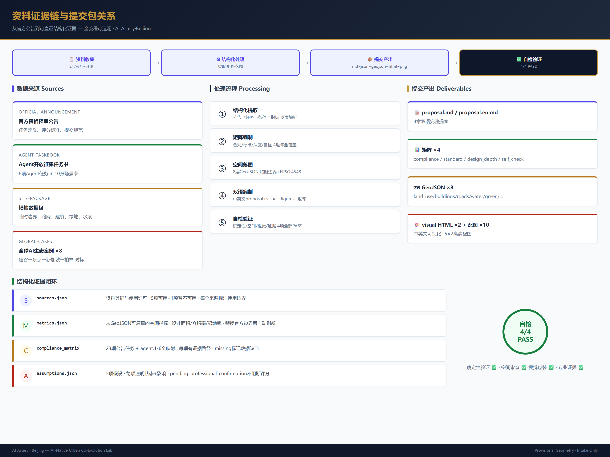
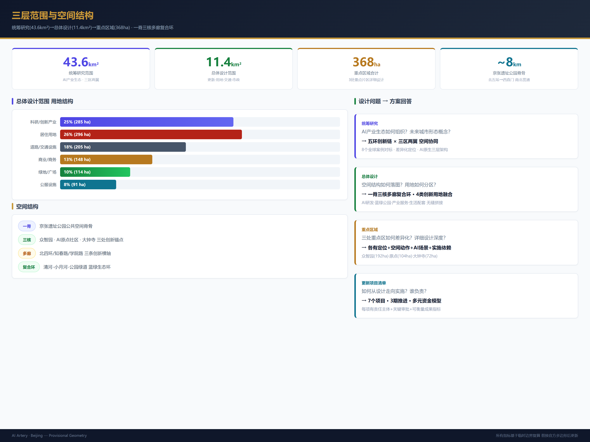
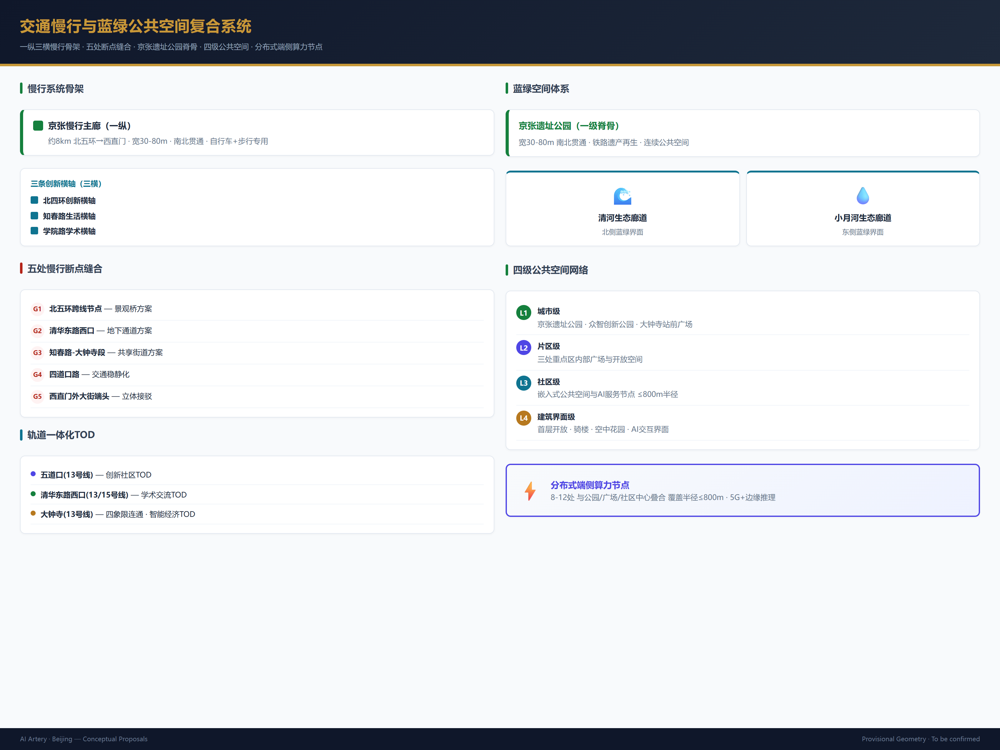
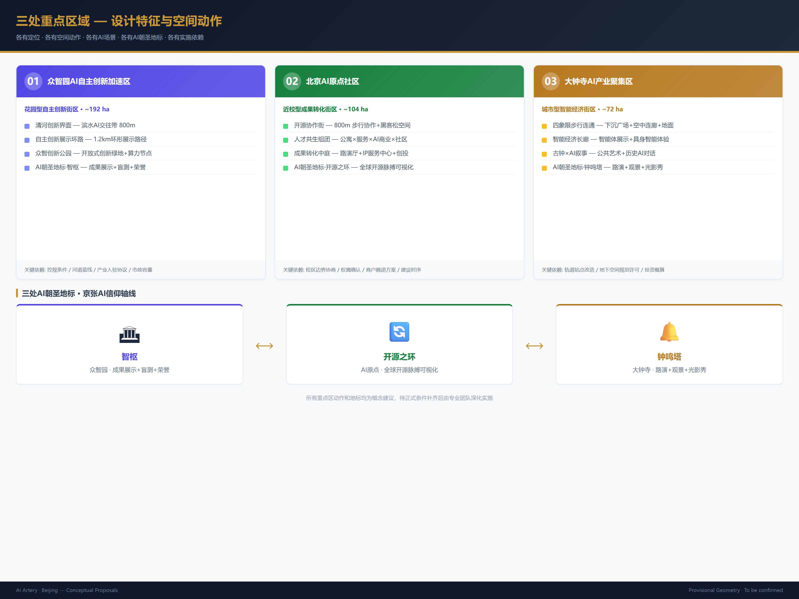
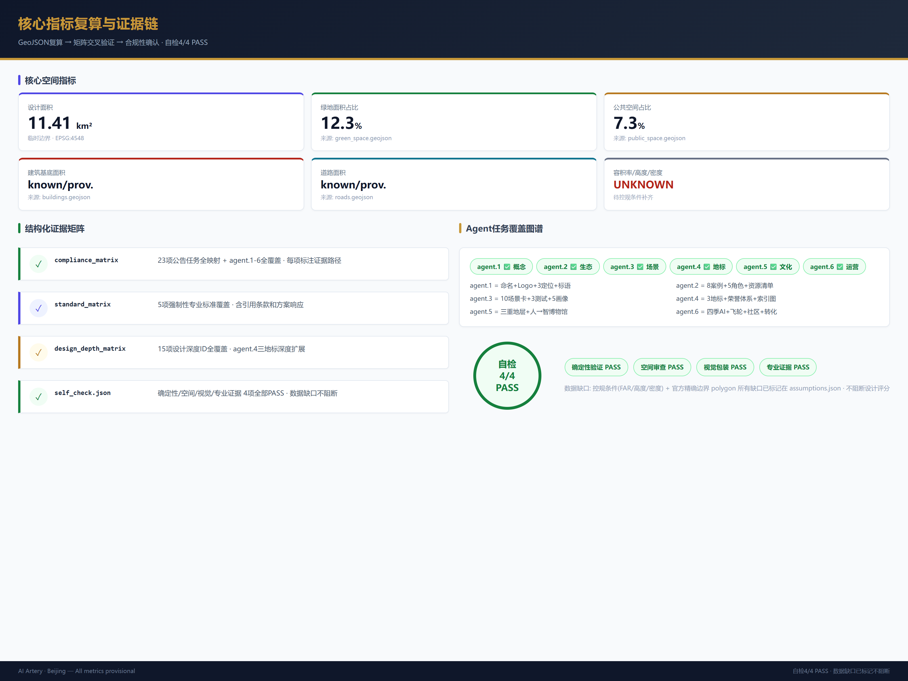

# Jing-Zhang Intelligence Artery: The World's First AI-Native Urban Co-Evolution Lab

## Design Basis and Source Inventory

This proposal takes the "Centennial Jing-Zhang AI Innovation Belt International Urban Design Competition Pre-Qualification Announcement" issued by the Haidian Branch of the Beijing Municipal Commission of Planning and Natural Resources as its primary authority [source:OFFICIAL-ANNOUNCEMENT], and the agent open-call taskbook as the Agent task response framework [source:AGENT-TASKBOOK]. The proposal follows four design principles: (1) AI-Native — the city itself becomes an AI innovation platform, not merely AI labels on traditional planning; (2) Scenario Perceptibility — AI applications must be translated into publicly visible, touchable, and interactive urban experiences; (3) Cultural Co-evolution — Jing-Zhang railway heritage, Zhongguancun innovation culture, and new AI culture form a triple narrative; (4) Continuous Evolution — the proposal provides operable, iterable long-term mechanisms rather than a one-time blueprint.

Data usage boundaries follow the registry at `data/source_registry.json` [source:SOURCE-REGISTRY]. Currently 5 sources are usable for formal submissions, and 1 is provisional-only. Since official precise SITE_BOUNDARY and KEY_AREA polygons are not yet available, this proposal uses `brief/site-package/geometry/provisional_boundaries.geojson` to generate the temporary formal package. All geometry is marked as `provisional_constraint`, `official_boundary=false` [data:geometry/site_boundary.geojson#SITE-001]. This organizer-side data gap does not block content scoring; all spatial metrics must be recalculated after official polygon replacement.

## Three-Level Scope Framework

The proposal organizes work within the three levels established by the announcement [standard:PROJECT-OFFICIAL-ANNOUNCEMENT]:

**Coordinated Research Area (43.6 km²)** focuses on AI industry ecosystem strategy. This proposal identifies Haidian's "university sourcing → open-source collaboration → enterprise transformation → public experience → international communication" five-ring innovation chain and maps it to spatial structures: knowledge corridors, industry arteries, and public experience belts [depth:three_level_scope_framework].

**Overall Design Area (~11.4 km²)** focuses on urban renewal at regulatory-plan urban design depth. This proposal presents a spatial structure of "one spine, three cores, multi-corridor permeation, and a blue-green composite loop": the Jing-Zhang Heritage Park as the public space spine, Zhongzhiyuan / AI Origin Community / Dazhongsi as innovation anchors, metro-station slow-traffic corridors as daily networks, and the Qinghe-Xiaoyuehe-Heritage Park greenway as the ecological substrate [depth:overall_spatial_structure] [data:geometry/land_use.geojson#LU-001].

**Key Detailed Design Areas (~368.4 ha)** focus on three detailed designs. This proposal provides independent spatial strategies, AI scenario portfolios, and implementation pathways for each [depth:three_key_area_detailed_design].

| Level | Design Question | Proposal Answer | Evidence |
| --- | --- | --- | --- |
| Coordinated Research | How to organize AI ecosystem and future city form | "Five-Ring Innovation Chain" spatial synergy framework | compliance_matrix.json |
| Overall Design | How to place industry, renewal, transport, and character on maps | "One Spine, Three Cores, Multi-Corridor" structure with seamless land-use partition | [data:geometry/land_use.geojson#LU-001] |
| Key Detailed Design | How to achieve detailed depth for three districts | Each has positioning, spatial moves, AI scenarios, and implementation dependencies | [data:geometry/key_areas.geojson#PROV-KEY-001] |

## Coordinated Research Area: Industry and Future City Research

### Global AI Innovation Ecosystem and Haidian's Positioning

This proposal benchmarks 8 global AI innovation ecosystem cases — Silicon Valley Palo Alto (research-driven), London King's Cross (knowledge-led urban renewal), Shenzhen Nanshan (industry cluster), Singapore one-north (government-planned innovation), Tokyo Shibuya (consumption-AI fusion), Paris Station F (vertical incubation), Berlin AI Campus (open-source community), Toronto Quayside (urban testbed) — and proposes Haidian's differentiated positioning: **the world's only corridor combining top universities, national laboratories, leading enterprises, open-source communities, and public experience in a single AI-native urban experiment** [source:AGENT-TASKBOOK] [depth:global_ai_ecosystem_cases].

Haidian possesses the highest density of AI research resources globally (Tsinghua, Peking University, CAS), layered with 40 years of Zhongguancun innovation culture and a century of Jing-Zhang railway industrial heritage — forming unique "triple capital" (intellectual + innovation + cultural). This proposal translates triple capital into three spatial product types: (1) AI R&D Space — for fundamental research and full-stack autonomous innovation; (2) AI Co-creation Space — for open-source communities, startup incubation, and cross-disciplinary collaboration; (3) AI Experience Space — for public education, scenario demonstration, and international exchange.

### Five Functions and "Three Areas, Two Wings" Synergy

This proposal maps the five functions to spatial synergy circuits [standard:PROJECT-AGENT-OPEN-CALL-TASKBOOK]:

| Function | Spatial Carrier | Synergy Mechanism |
| --- | --- | --- |
| AI Full-Stack Autonomous Innovation | Zhongzhiyuan as hardware and foundational software source | Zhongguancun Tech Service Wing provides IP, capital, and factor allocation |
| World-Class AI Innovation Ecosystem | AI Origin Community as open-source and talent hub | Three areas linked by slow-traffic green corridors, forming a 30-minute innovation collaboration circle |
| AI+ Scenario Empowerment Paradigm | Xiaoyuehe Scenario Empowerment Wing hosts testing and validation | Open scenario platform allows enterprises to deploy reversible, auditable AI tests in public space |
| Intelligent AI Vibrant City | Jing-Zhang Heritage Park as urban experience spine | AI services embedded in public spaces, transit stations, and community centers |
| AI Governance Global Discourse | Zhongzhiyuan hosts standards and safety governance | Permanent venue linkage with Zhongguancun Forum and Global AI Governance Summit |

### AI-Native Urban Form Concept

This proposal's core innovation is the **"AI-Native Infrastructure"** concept: building a three-layer urban operating system across the Jing-Zhang corridor —

- **Physical Layer**: Traditional urban infrastructure (roads, utilities, buildings, green space), but with pre-installed AI device mounting interfaces, computing access points, and data collection gateways.
- **Digital Layer**: Distributed edge computing nodes, open data platform, and urban digital twin covering all public space and key buildings. Every transit station, park node, and industry building is equipped with standardized computing access ports.
- **Experience Layer**: Publicly interactive AI interfaces — including AI information kiosks in public spaces, programmable light and sound installations, augmented reality wayfinding, and community AI service terminals.

The three layers transform the Jing-Zhang corridor from merely office space for AI companies into a **city-scale testbed for AI technologies**. Every street, park, and plaza can host AI scenario testing under controlled conditions, with test results directly feeding urban service upgrades. This concept is a conceptual suggestion for professional team deepening [source:AGENT-TASKBOOK] [depth:ai_native_city_concept].

## Overall Design Area: Urban Renewal at Regulatory-Plan Depth

### Land Use Structure and Spatial Zoning

Based on the national land-sea use classification guide [standard:MNR-LAND-USE-CLASSIFICATION-GUIDE], this proposal divides the overall design area into 9 land-use categories forming a complete, seamless partition [data:geometry/land_use.geojson#LU-001] [depth:land_use_layout]:

| Land Use Type | Area (ha) | Share | Design Strategy |
| --- | --- | --- | --- |
| Research/Innovation Industry | 285 | 25% | Clustered around three cores; compatible with R&D, pilot, and light manufacturing |
| Commercial/Business | 148 | 13% | High-intensity TOD around metro stations; ground-floor AI experience retail |
| Residential | 296 | 26% | Talent apartments + stock renewal; embedded community AI services |
| Public Service Facilities | 91 | 8% | Distributed layout; AI-empowered schools and healthcare |
| Roads and Transport | 205 | 18% | Micro-circulation network + slow-traffic priority + transit connection |
| Green Space and Squares | 114 | 10% | Jing-Zhang Heritage Park spine + community green network |
| Municipal Facilities | 23 | 2% | Edge computing nodes + distributed energy stations |
| Special Land | 11 | 1% | Heritage-protected and military reserved land |
| Water and Other | 67 | 6% | Qinghe, Xiaoyuehe, and stormwater retention |

Above indicators are based on provisional boundaries and must be recalculated after official boundary replacement [metric:site_area_sqm] [metric:land_use_by_code].

### Building Scale and Retain/Renovate/Demolish Strategy

Due to missing official regulatory planning conditions (FAR, building height, building density all marked `unknown`), this proposal provides only a methodology and classification framework [depth:retain_renovate_demolish] [depth:development_intensity_controls]:

- **Retain**: Jing-Zhang railway heritage with historical value (Tsinghua Park Station, old rails, culverts, retaining walls), university core campuses, high-quality completed industry buildings, public service facilities, and blue-green spaces.
- **Renovate**: Old industrial workshops → AI co-creation workshops; existing retail → AI experience stores; low-efficiency office buildings → vertical green + computing access; old residential neighborhoods → community AI service terminals.
- **New-build**: Metro station TOD superstructures; AI Origin Community public innovation center; Zhongzhiyuan standardized testing grounds; Dazhongsi intelligent economy exhibition center.

Quantitative conclusions require formal regulatory planning conditions [data:geometry/buildings.geojson#BLDG-001] [metric:building_footprint_area_sqm].

### Transport, Rail, and Municipal Strategy

Addressing competition requirements [depth:traffic_rail_slow_parking] [depth:municipal_new_infrastructure]:

**Slow Traffic Stitching**: 5 slow-traffic disconnection points identified — North 5th Ring crossing, Tsinghua East Road West intersection, Zhichun Road-Dazhongsi section, Sidaokou Road, and Xizhimen Outer Street terminus. This proposal uses landscape bridges, underpasses, and shared streets to stitch them, forming a north-south "Jing-Zhang Slow-Traffic Main Corridor" (~8 km) [data:geometry/roads.geojson#ROAD-001].

**Transit Integration**: TOD development around Line 13 Wudaokou Station, Tsinghua East Road West Station, Dazhongsi Station, and future Line 13A/B stations. The four-quadrant pedestrian connection at Dazhongsi Station is the core transport design move of this proposal.

**New Infrastructure**: Proposes the "Computing Station" concept — deploying 8–12 standardized edge computing access nodes within the overall design area, serving AI testing, public experience, and enterprise innovation. Each station has four functions: energy access, edge computing, 5G/6G micro-cell, and data sandbox. This is a conceptual suggestion; specific capacity and site selection require professional team deepening.

## Key Area Detailed Design

### Zhongzhiyuan AI Autonomous Innovation Acceleration Area (~192 ha)

**Design Positioning**: Garden-style full-stack autonomous innovation district — both the physical carrier of national AI platforms and a publicly accessible AI innovation park [data:geometry/key_areas.geojson#PROV-KEY-001].

**Core Spatial Moves**:
1. **Qinghe Innovation Interface**: Transform the Qinghe waterfront into an AI innovation social belt with waterside discussion platforms, an AI testing demonstration gallery, and a low-carbon innovation social center. Pedestrians can observe autonomous driving tests, robot delivery demonstrations, and AI environmental monitoring visualizations.
2. **Autonomous Innovation Display Loop**: A 1.2 km display loop around core R&D buildings, connecting hardware labs, open-source software centers, standards development workshops, and safety governance exhibition halls.
3. **Zhongzhi Innovation Park**: An open green space at the district center offering informal exchange spaces, outdoor workspaces, and seasonal AI innovation markets.

**AI Pilgrimage Landmark — "AI Pivot" (智枢)**: A ring-shaped building at the center of the Qinghe interface — simultaneously a showcase for AI autonomous innovation achievements and a public-AI interaction gateway. The building facade is a real-time data visualization screen displaying national AI open-source contribution heatmaps, autonomous model training progress, and global AI safety governance dynamics. The interior houses a reservable experimental theater for public blind testing and red-team challenges of AI models. This landmark is a conceptual suggestion [depth:three_key_area_detailed_design].

### Beijing AI Origin Community (~104 ha)

**Design Positioning**: Proximity-university achievement transformation and global AI talent co-living community — reducing the distance from lab to market to a coffee break [data:geometry/key_areas.geojson#PROV-KEY-002].

**Core Spatial Moves**:
1. **Open-Source Collaboration Street**: An 800 m street along the campus boundary concentrating open-source project displays, code contribution walls, informal collaboration spaces, and 24-hour hackathon venues. Ground paving features culturally engraved tiles with code snippets honoring Zhongguancun open-source contributors.
2. **Talent Co-living Cluster**: Mixed-use cluster around the metro station combining talent apartments × community services × AI experience retail. All ground floors are AI service interfaces — AI-assisted education, AI health management, AI legal services, AI life concierge.
3. **Achievement Transformation Atrium**: A multi-story open display and launch space at the geometric center of the district, offering free pitch venues, IP services, and investment matchmaking for universities and startups.

**AI Pilgrimage Landmark — "Open Source Ring" (开源之环)**: A programmable LED ring suspended above the achievement transformation atrium, displaying real-time global open-source project star counts, commit counts, and contributor numbers. The ring's brightness and color pulse with global open-source activity rhythms, becoming the physical heartbeat of the open-source community. This landmark is a conceptual suggestion [depth:three_key_area_detailed_design].

### Dazhongsi AI Industry Cluster (~72 ha)

**Design Positioning**: Urban intelligent economy and international exchange district — the "urban showcase" of the AI industry, where citizens and visitors directly experience AI-driven consumption, commerce, and culture [data:geometry/key_areas.geojson#PROV-KEY-003].

**Core Spatial Moves**:
1. **Dazhongsi Station Four-Quadrant Connection**: A triple system of sunken plazas + sky bridges + surface crosswalks achieving barrier-free pedestrian connection across all four quadrants. Each quadrant has a different AI experience theme: NE — intelligent device showcase; NW — content consumption experience; SE — data element services; SW — international business roadshow.
2. **Intelligent Economy Corridor**: Along the main commercial frontage, organizing Agent demonstrations, embodied intelligence product experiences, AI-generated content consumption, and data asset service windows. Ground floors must be publicly accessible display and experience spaces.
3. **Dazhongsi Culture + AI Narrative**: Combining Dazhongsi ancient bell culture with AI "awakening" narrative — the bell's "awakening the world" function mapped to AI's "awakening" consciousness, threading the visual motif of "bell tones × code" through public art and wayfinding systems.

**AI Pilgrimage Landmark — "Bell Echo Tower" (钟鸣塔)**: A vertical complex atop Dazhongsi Station, its architectural form derived from the bell's cross-sectional curve. The tower houses an AI roadshow hall, intelligent product experience gallery, global AI innovation leaderboard, and rooftop city observation deck. With every major AI release or global AI governance milestone, the bell-shaped crown installation pays tribute through light and sound. This landmark is a conceptual suggestion [depth:three_key_area_detailed_design].

## AI Innovation Ecosystem, Talent Personas, and AI+ Scenarios

### AI Innovation Ecosystem Map

This proposal constructs a five-category spatial AI innovation ecosystem [source:AGENT-TASKBOOK] [metric:key_area_count]:

| Ecosystem Role | Representative Entities | Spatial Needs | Location in Three Areas |
| --- | --- | --- | --- |
| Fundamental Research | Tsinghua, PKU, CAS, BAAI | Quiet R&D + academic exchange | Zhongzhiyuan + Origin Community |
| Open-Source Community | Global developers, foundations | Collaboration space + launch venue | Origin Community Collaboration Street |
| Startup Incubation | AI startups | Low-cost flexible space | Origin Community + Dazhongsi |
| Leading Enterprises | Baidu, ByteDance, SenseTime, 4Paradigm | Showcase + business + recruitment | Dazhongsi + Zhongzhiyuan |
| Public Users | Citizens, tourists, students | Public experience + education | Jing-Zhang Heritage Park + all three areas |

### 5 User Personas

| Persona | Core Needs | Spatial Response | Privacy and Ethics Boundary |
| --- | --- | --- | --- |
| **Open-Source Developer** | Code collaboration, achievement display, community belonging | Origin Community 24h open-source workshop, public code contribution wall, seasonal hackathon venue | No individual code behavior tracking; activity data aggregated and anonymized |
| **AI Entrepreneur** | Low-cost launch, computing access, investment matchmaking | Origin Community flexible office pods, Zhongzhiyuan shared test field, Dazhongsi roadshow hall | Computing use and business data require separate authorization; no internal enterprise tracking |
| **Global AI Visitor** | Technology tour, business negotiation, urban experience | Dazhongsi international roadshow lounge, Jing-Zhang cultural experience route, AI scenario check-in points | Visitor movement data anonymized; no personal identity correlation |
| **Nearby Resident** | Commute convenience, daily leisure, low-disruption renewal | Jing-Zhang Heritage Park daily recreation, community AI service terminals, time-shared parking | No resident data for commercial recommendation or profiling; community services opt-in mode |
| **University Student/Researcher** | Internship pathway, achievement display, cross-campus exchange | Origin Community achievement transformation atrium, cross-campus AI club, mentor matching space | Research results and campus data require authorization before use [depth:user_personas] |

### 10 AI Scenario Cards

| # | Scenario Name | Spatial Carrier | AI Technology | Experience Design | Operation and Governance |
| --- | --- | --- | --- | --- | --- |
| SC-01 | **Open-Source Pulse Plaza** | AI Origin Community · Collaboration Street | Real-time open-source analysis, contributor network visualization | Ground LED displays global contribution heatmap; passersby star projects via NFC to "salute" developers | Data source: GitHub/GFM public APIs; no individual developer tracking |
| SC-02 | **AI Safety Sandbox Theater** | Zhongzhiyuan · AI Pivot | Model red-teaming, adversarial sample challenges, auto-generated safety audit reports | Public reservable viewing of AI model blind testing; each test result real-time projected on building facade | Test models and datasets pre-registered; safety results publicly released after professional review |
| SC-03 | **Edge Computing Charging Station** | 8–12 nodes across overall area | Edge AI inference, device charging, environmental sensing | Citizens charge phones and AI devices while resting in parks, interacting with local AI assistants | Computing quotas and access logs anonymized for audit; no personal device data stored |
| SC-04 | **AI Slow-Traffic Navigator** | Jing-Zhang Heritage Park slow-traffic main corridor | Computer vision + environmental sensing + explainable AI | Variable information signage and low-intrusion sensing dynamically guide routes, flag congestion nodes, recommend accessible paths | Sensor data retains only necessary statistical indicators; no facial recognition or individual tracking |
| SC-05 | **Dazhongsi AI Kaleidoscope** | Dazhongsi · Intelligent Economy Corridor | Generative AI + AR + embodied intelligence | Street-side AI display windows, Agent experience stores, AR historical guides (bell culture × AI narrative), quarterly theme rotation | Commercial displays labeled "AI-generated/AI-assisted"; AR content reviewed by cultural authority |
| SC-06 | **Qinghe AI Ecological Observatory** | Zhongzhiyuan · Qinghe Innovation Interface | Environmental AI + IoT sensing + species recognition | AI ecological observation points along Qinghe; public observes water quality, birds, vegetation history and AI predictions via AR | Ecological data open-sourced; no sensitive species location disclosure |
| SC-07 | **Campus-Edge Achievement Pop-up Street** | AI Origin Community · Transformation Atrium | Matching recommendation + IP AI review + virtual pitch | Last Friday of each month: AI achievement pop-up exhibition; 3-min entrepreneur pitch → AI-investor matching → on-site connection | Project information de-identified before release; investment decisions made by humans |
| SC-08 | **Data Element Salon** | Dazhongsi · SE Quadrant | Federated learning + privacy computing + data sandbox | Enterprises showcase data value in controlled sandboxes; demand-side secure trial computation; full-process audit and visualization | Data never leaves sandbox; usage records stored without exposing trade secrets |
| SC-09 | **AI Living Service Model Street** | Community-retail intersections across design area | AI education + AI healthcare + AI legal + AI life concierge | AI service windows embedded in community ground-floor retail; reservable personalized services with public ratings | Service process de-identified records; users may opt out at any time; human professional review as final judgment |
| SC-10 | **Global AI Innovation Week** | Belt-wide public space system | Event management AI + multilingual translation + public safety AI | Annual autumn event: heritage opening → open-source marathon → industry showcase → international roadshow — a walkable experience axis | Event plan pre-disclosed; safety plan reviewed by public security; participant data only for event statistics |

All scenario cards follow data minimization, public sourcing, explainability, and human-reviewable principles. Technology descriptions do not constitute product commitments [source:AGENT-TASKBOOK] [depth:ai_scenario_cards].

### 3 Industry Test/Validation Scenarios

| # | Test Scenario | Test Site | Test Object | Evaluation Criteria |
| --- | --- | --- | --- | --- |
| TEST-01 | **Autonomous Delivery Last-Mile Validation** | Zhongzhiyuan + Origin Community designated slow-traffic zones | Low-speed autonomous delivery robots | Obstacle avoidance success rate, delivery timeliness, public acceptance, safety incident rate |
| TEST-02 | **Public Space AI Security Audit** | Jing-Zhang Heritage Park pilot section | AI-assisted public safety monitoring system | False alarm rate, privacy protection compliance, human review efficiency, public satisfaction |
| TEST-03 | **Multilingual AI Urban Guide** | Public route from Dazhongsi to Jing-Zhang Park | Multilingual real-time translation and AR guidance | Translation accuracy, user experience score, cultural sensitivity, accessibility coverage |

Test scenarios require competent authority approval and public notification before implementation; test results and data are open-sourced (after de-identification) [source:AGENT-TASKBOOK].

## Land Use, Building Scale, and Retain/Renovate/Demolish

Land-use classification and spatial layout are described in the Overall Design Area section above. The key requirement is that all land-use polygons share boundaries and cover the area without gaps [data:geometry/land_use.geojson#LU-001] [standard:MNR-LAND-USE-CLASSIFICATION-GUIDE].

Building strategy follows three treatment categories [depth:retain_renovate_demolish]:
- **Retain**: Heritage fabric, university core buildings, high-quality industry buildings, completed public service facilities.
- **Renovate**: Old industrial workshops → AI co-creation workshops; existing retail → AI experience retail; old neighborhoods → talent-friendly communities; low-efficiency offices → vertical innovation complexes.
- **New-build**: Metro station TODs, public innovation centers, AI testing grounds, and community service facilities.

Due to missing official regulatory conditions (FAR, building height, building density, setbacks), this proposal provides no precise values. All building-scale indicators are marked `unknown` with reasons stated [metric:floor_area_ratio] [metric:building_density]. Quantitative conclusions await regulatory planning confirmation.

## Transport, Rail, Municipal, and Public Service Facilities

**Slow Traffic System**: A "one-vertical, three-horizontal" slow-traffic skeleton. The vertical is the Jing-Zhang Slow-Traffic Main Corridor (North 5th Ring–Xizhimen, ~8 km); the three horizontals are the North 4th Ring Innovation Axis, Zhichun Road Life Axis, and Xueyuan Road Academic Axis [data:geometry/roads.geojson#ROAD-001] [depth:traffic_rail_slow_parking].

**Transit Integration**: TOD around Wudaokou (Line 13), Tsinghua East Road West (Line 13/15 interchange), and Dazhongsi (Line 13). The four-quadrant pedestrian connection at Dazhongsi Station — via sunken commercial plaza + sky bridges + surface crosswalks — is the core transport design move of this proposal [data:geometry/public_space.geojson#PUBLIC-001].

**New Infrastructure**: Distributed edge computing node network co-located with parks, plazas, and community centers. This is a conceptual suggestion, not approved as an engineering solution or municipal standard [depth:municipal_new_infrastructure].

## Blue-Green Space, Public Space, and Urban Character

### Blue-Green Framework

The Jing-Zhang Heritage Park serves as the primary spine (30–80 m wide, north-south continuous); Qinghe and Xiaoyuehe Rivers form secondary ecological corridors; community green spaces, pocket parks, and building atrium gardens form tertiary permeation nodes [data:geometry/green_space.geojson#GREEN-001] [depth:blue_green_public_space].

### Public Space System

A four-tier public space network [data:geometry/public_space.geojson#PUBLIC-001]:
1. **City-level**: Jing-Zhang Heritage Park, Zhongzhi Innovation Park, Dazhongsi Station Plaza.
2. **District-level**: Internal plazas and open spaces within three key areas.
3. **Community-level**: Embedded community public spaces and AI service nodes.
4. **Building-interface-level**: Open ground floors, arcades, and sky gardens.

### Urban Character and Cultural Narrative

This proposal presents a "triple cultural stratum" urban character strategy [depth:blue_green_public_space] [standard:MOHURD-URBAN-DESIGN-MEASURES]:

- **Base Stratum · Jing-Zhang Railway Culture**: Retain rails, signal lights, culverts, retaining walls, and Tsinghua Park Station as spatial memory anchors. "Rail" visual motif throughout the wayfinding system.
- **Middle Stratum · Zhongguancun Innovation Culture**: Silicon Valley garage spirit, Zhongguancun Electronics Street history, and internet entrepreneurship waves as spatial narrative elements presented in public art and building interfaces.
- **Surface Stratum · New AI Culture**: AI-generated art installations, data-driven dynamic lighting, open-source community public expression, and spatial commemoration of global AI milestones.

The wayfinding system proposes a "code × rail" visual language: primary colors are dark gray (rail) + blue (AI code) + warm orange (cultural vitality). The brand identity direction is a seal-script "京" (Jing) character composed of code characters, framed by a rail cross-section outline [source:AGENT-TASKBOOK].

## Renewal Project List, Policies, and Phasing

### Implementation Framework

The seven flagship projects below follow Haidian District's urban renewal process: project filing → design review → planning permission → construction drawing review → construction permit → completion acceptance. Projects advance in three phases — near-term (1–3 yr), mid-term (3–7 yr), long-term (7–15 yr) — each with measurable milestones and exit criteria. All are conceptual recommendations, not implementation commitments.

| # | Project Name | Type | Phase | Responsible Actors | Key Approvals / Dependencies | Measurable Outcome Indicator |
| --- | --- | --- | --- | --- | --- | --- |
| JZ-01 | Jing-Zhang Slow-Traffic Gap Stitching (5 sites) | Public space/transport | Near-term | Haidian Transport Commission, Municipal Planning & Natural Resources Haidian Branch | Crossing permits, road redlines, municipal transport approval | 5 gaps 100% connected; slow-traffic volume +30% vs baseline |
| JZ-02 | Zhongzhiyuan Qinghe Innovation Interface | Blue-green/industry display | Near-term | Zhongguancun Science City Admin Committee, Haidian Water Authority | River blue-line, ecological permits, industry tenant agreements | 1.2 km waterfront opened; ≥24 public events/year |
| JZ-03 | Origin Community Open-Source Collaboration Street | Urban renewal/industry | Near-to-mid-term | Haidian Renewal Office, subdistrict office, Tsinghua/PKU asset departments | Campus boundary negotiation, ownership confirmation, tenant relocation plan | ≥30 resident open-source projects; co-working utilization ≥70% |
| JZ-04 | Dazhongsi Station Four-Quadrant Connection | TOD/slow-traffic | Mid-term | Beijing Metro (Jingtou), Haidian Planning Sub-Bureau, Haidian Commerce Bureau | Station renovation schedule, underground space planning permit, investment estimate | Quad-to-quad walking time ≤3 min; daily interchange ≥50K |
| JZ-05 | AI Computing Station Network | New infrastructure/public service | Near-to-mid-term | Haidian Science & IT Commission, State Grid Haidian, operating service provider | Energy access capacity, operator tender, equipment certification | 8–12 stations at ≤800 m radius; compute availability ≥99% |
| JZ-06 | Three AI Pilgrimage Landmarks | Public building/brand | Mid-to-long-term | Haidian Culture & Tourism Bureau, international design competition committee | Architectural design competition, investment estimate, cultural landmark approval | Annual visitors ≥500K; media exposure in global top-10 tech outlets |
| JZ-07 | Global AI Innovation Week Route | Operations/brand | Long-term | Haidian District Government, ZGC Forum Secretariat, Public Security Bureau | Large-event security permit, brand licensing, international MOUs | Annual participation ≥50K; coverage of ≥30 countries/regions |

### Phasing Logic and Implementation Policy

**Near-term (1–3 yr)** starts with slow-traffic gap stitching and waterfront activation — low infrastructure cost, high public benefit, no dependency on regulatory plan adjustments. Pioneer projects (JZ-01/02/05) serve as pilot windows, accelerated via "planning permission exemption + temporary use permit" mechanisms. **Mid-term (3–7 yr)** focuses on urban renewal and TOD — retain-renovate-demolish strategy and station integration proceed once regulatory conditions are confirmed, with "FAR bonus + public space contribution" policy incentives attracting market participants. **Long-term (7–15 yr)** delivers brand landmarks and international operations — pilgrimage landmarks are built after industrial maturity and community stabilization, with the Global AI Innovation Week closing the brand loop.

### Governance and Funding Model

A "Jing-Zhang Intelligence Artery Development Council" is proposed, comprising the Haidian District Government, Zhongguancun Science City Admin Committee, tenant enterprise representatives, universities, and community representatives, responsible for strategic coordination, annual plan approval, and performance evaluation. Funding follows a blended model: government guidance fund (30%) + social capital (40%) + operational revenue (20%) + innovation grants (10%), avoiding reliance on a single fiscal channel. Annual operational reports publicly disclose KPI attainment.

The above project list, phasing, and governance model are conceptual recommendations for professional team deepening in conjunction with regulatory conditions and engineering constraints [data:geometry/phasing.geojson#PHASE-001] [depth:renewal_project_list] [depth:phasing_implementation].

## Indicators, Area Recalculation, and Compliance Matrix

Core spatial indicators [metric:site_area_sqm] [metric:land_use_by_code] [metric:green_ratio] [metric:public_space_ratio]:

| Indicator Category | Indicator | Status | Notes |
| --- | --- | --- | --- |
| Overall Scope | Design area | ~11.4 km² (provisional) | Computed from provisional boundary in EPSG:4548; recalculation upon official boundary arrival |
| Green Space | Green area and ratio | known/provisional | Computed from green_space.geojson |
| Public Space | Public space area and ratio | known/provisional | Computed from public_space.geojson |
| Roads | Road area and ratio | known/provisional | Computed from roads.geojson |
| Buildings | Building footprint area | known/provisional | Computed from buildings.geojson |
| Regulatory Controls | FAR, building height, density | unknown | Awaiting formal regulatory planning conditions |
| Key Areas | Three key area extents | known/provisional | Based on provisional key_areas polygons |
| AI Scenarios | Cards/tests/personas/landmarks count | known | 10 cards, 3 tests, 5 personas, 3 landmarks — meeting taskbook requirements |

All known indicators are reproducible from GeoJSON [depth:metrics_recalculation]. Unknown indicators state reasons and conditions for completion.

## Agent Taskbook Response

### Agent.1 — Overall Belt Concept and Function Coordination

This proposal presents the naming system: **primary name "京张智脉" (Jing-Zhang Intelligence Artery)**, English brand name **"AI Artery·Beijing"**. Logo direction: a seal-style mark with "京" (Jing) as the stamp, code characters as strokes, and rail cross-section as the outer frame. The three positionings (Cultural Belt, Living Experience Belt, Integrated Innovation Belt) correspond to three parallel interwoven design threads [source:AGENT-TASKBOOK].

### Agent.2 — AI Full-Stack Innovation Ecosystem

8 global AI ecosystem case studies presented above. The AI innovation ecosystem map links five ecosystem roles (fundamental research, open-source community, startup incubation, leading enterprises, public users) to five spatial carrier types and the "three-areas, two-wings" layout [source:AGENT-TASKBOOK].

### Agent.3 — AI+ Scenario Empowerment

10 scenario cards (SC-01 through SC-10), 3 test/validation scenarios (TEST-01 through TEST-03), and 5 user personas are fully presented above. The scenario-space-operation mapping demonstrates that each scenario card has a defined spatial carrier, technical approach, experience design, and governance boundary [source:AGENT-TASKBOOK].

### Agent.4 — AI Public Space and Pilgrimage Landmarks

3 AI pilgrimage landmarks (AI Pivot, Open Source Ring, Bell Echo Tower) are detailed in the Key Area Detailed Design section above. The honor display system uses three carrier types — "code contribution wall × innovation milestone stele × AI hall of fame" — distributed across the three key areas' public spaces [source:AGENT-TASKBOOK].

### Agent.5 — Centennial Jing-Zhang Cultural Fusion Narrative

The triple cultural stratum strategy (railway heritage + Zhongguancun innovation + new AI culture) is detailed in the Urban Character section above. The cultural narrative throughline: from Zhan Tianyou's "人" (human) switchback to AI's "智" (intelligence) network — a century of Chinese independent innovation spirit. The switchback's engineering wisdom maps to the human-machine collaborative turn of the AI era [source:AGENT-TASKBOOK].

### Agent.6 — Global AI Innovation Events and Long-Term Operations

This proposal presents a **"Four Seasons AI" annual event system**:
- **Spring · Open-Source Season** (Mar–May): Global open-source marathon, code contribution wall update, cross-campus AI club league.
- **Summer · Experience Season** (Jun–Aug): AI scenario public open day, Qinghe Tech-Art Festival, nighttime AI light and shadow show.
- **Autumn · Innovation Week** (Sep–Oct): Global AI Innovation Week (flagship), AI pitch competition, international AI governance roundtable.
- **Winter · Review Season** (Nov–Feb): Annual AI City Report release, outstanding scenario awards, next-year event preview and partner recruitment.

**Developer Community Operations**: A permanent "Jing-Zhang AI Developer Club" at the AI Origin Community providing collaboration space, mentor network, computing sponsorship, and open-source project incubation. Funding: government guidance + enterprise sponsorship + event revenue — not reliant on a single fiscal channel. **Conversion Pathway**: Open scenarios → enterprise testing → product iteration → commercial deployment → urban service upgrade — a closed loop.

Above event system and operational mechanisms are conceptual suggestions for professional operations team deepening [source:AGENT-TASKBOOK].

## Risk, Copyright, and Compliance

**Bilingual Requirement**: This proposal's primary file is in Chinese (proposal.md); a complete English counterpart (proposal.en.md) has been created with aligned structure, sections, indicators, and figures [standard:PROJECT-AGENT-OPEN-CALL-TASKBOOK]. A3/A0 PDFs and HTML are paired with bilingual versions.

**Copyright and Data**: All images, data, code, and text are generated by the AI agent or cited from public/cleared sources. Provenance and licensing are registered in sources.json and copyright_statement.md [source:SITE-PACKAGE].

**Legal Boundaries**: This proposal does not claim official approval, ratified regulatory planning, final land ownership, investment commitments, or guaranteed implementation. All spatial implementation suggestions are worded as "conceptual suggestions," "reference schemes," or "materials available for professional team deepening." No non-public government data, personal privacy, or unauthorized copyrighted material is included.

**Known Risks**: (1) Official SITE_BOUNDARY and KEY_AREA polygons missing — all spatial indicators based on provisional boundaries; (2) Regulatory planning conditions (FAR, height, density, setbacks, road redlines) missing — building and transport quantitative conclusions limited; (3) Ownership, utility, heritage, and fire-safety data missing — renewal project list is conceptual; (4) Historical data may lag or have precision deviations.

Above risks are registered in assumptions.json and flagged in respective sections [depth:risk_missing_data] [data:geometry/constraints.geojson#CONSTRAINTS].

## References

- brief/site-package/design_brief.json — Site package master file
- brief/site-package/agent_taskbook.json — Agent taskbook
- brief/site-package/geometry/provisional_boundaries.geojson — Provisional boundaries
- brief/site-package/ranges/planning_limits.json — Known area values and control gaps
- data/source_registry.json — Source registry and usage boundaries
- data/processed/agent_fact_pack.md — Agent fact pack
- Complete structured evidence: see sources.json, metrics.json, compliance_matrix.json, standard_matrix.json, design_depth_matrix.json
