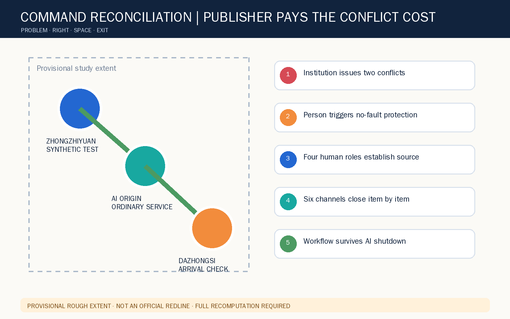
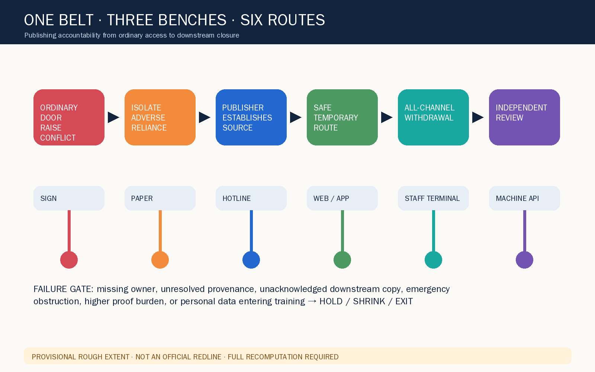
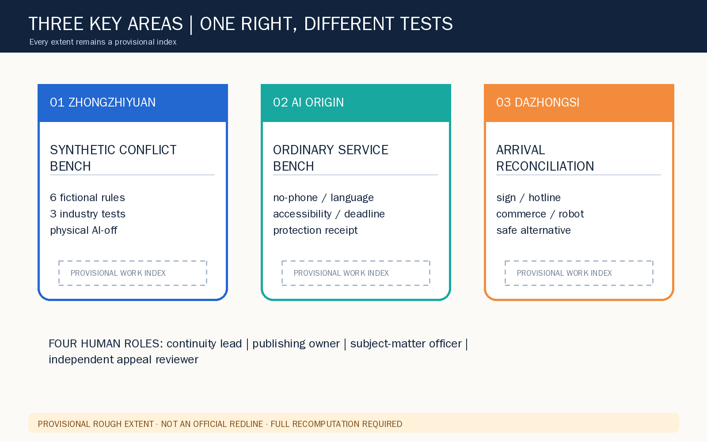
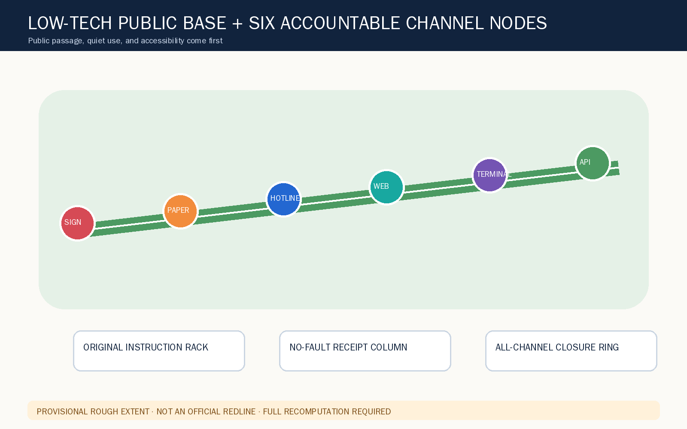
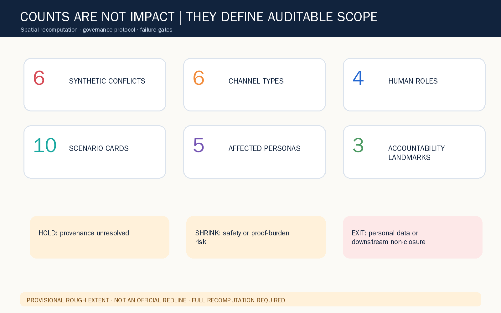

# JINGZHANG COMMAND RECONCILIATION / 京张同令台

> Concept proposal: when institutional channels conflict, a person should neither guess which copy is true nor absorb deadlines, rejection, or adverse records caused by reasonable reliance.

## Design basis and source inventory

JINGZHANG COMMAND RECONCILIATION treats contradictory instructions issued by one institution across several channels as a civic-service infrastructure problem, not a communication failure that a resident must absorb. The package uses only the registered announcement, taskbook, site package, and source registry. Provisional geometry supports conceptual composition and machine review only; it is not an official redline, jurisdiction, or verified institution location [source:OFFICIAL-ANNOUNCEMENT] [source:SITE-PACKAGE] [source:PROCESSED-FACT-PACK].

Formal claims follow the registry's use classes. The provisional boundary and key-area polygons remain temporary constraints; background material cannot become a rights, area, or statutory claim [source:SOURCE-REGISTRY] [source:BOUNDARY-SOURCE] [source:KEY-AREA-SOURCE]. The open-call taskbook frames the concept but does not turn the conflict receipt into existing law or a government commitment [source:AGENT-TASKBOOK] [standard:PROJECT-OFFICIAL-ANNOUNCEMENT] [depth:existing_conditions_diagnosis].

GeoJSON, metrics, and matrices are authoritative within the package. Images, HTML, and PDFs explain that evidence. The rough site area and all three key-area indexes must be recomputed when official polygons and controls arrive [data:geometry/site_boundary.geojson#SITE-001] [metric:site_area_sqm] [data:geometry/key_areas.geojson#PROV-KEY-001].

## Three-level scope framework

At research scale, the proposal assigns reconciliation costs to publishers. At overall-design scale, it connects an ordinary front door, an accountable publishing back office, and a cross-channel closure chain. At key-area scale, it tests standards, ordinary service, and arrival/commerce situations. These are three resolutions of one conflict lifecycle [standard:MOHURD-URBAN-DESIGN-MEASURES] [depth:three_level_scope_framework] [depth:overall_spatial_structure].

The structure is “one belt, three benches, six routes”: the heritage-park public realm is a low-tech accessible base; the three key areas host a synthetic test bench, ordinary-service bench, and arrival bench; signs, paper, hotline, web, staff terminals, and machine-readable interfaces are six channels. Nodes use the submitted land-use, public-space, and walking layers without creating a statutory land-use or road proposal [data:geometry/land_use.geojson#LU-001] [data:geometry/public_space.geojson#PUBLIC-001] [data:geometry/roads.geojson#ROAD-001].

One no-fault gate governs all scales: isolate adverse automation that depends only on unresolved contradictory instructions, preserve the procedural position within institutional authority, and provide a named human, safe alternative, and closure list. Safety-critical action may pause, but unresolved conflict cannot be presented as resolved.

## Industry ecosystem and future-city research

The ecosystem is not another single source of truth. It is a transferable capacity for authorized text comparison, version accountability, accessible counterparts, human adjudication, downstream closure, and de-identified learning. Seven public mechanism references are used without copying branded interfaces: aviation notice supersession, railway conflict isolation, signed configuration, medication reconciliation, public-record correction, financial dispute preservation, and accessible channel equivalence.

Eight enabling factors are assigned boundaries: space hosts removable rehearsals; talent supplies legal, accessibility, and safety review; compute compares authorized fields only; data remains minimal; scenarios use synthetic rules; land, industry, finance, and policy remain pending professional confirmation. Zhongzhiyuan hosts test protocols, AI Origin Community hosts civic co-design, Dazhongsi hosts multilingual arrival, and the two wings connect review and public experience [standard:PROJECT-AGENT-OPEN-CALL-TASKBOOK] [depth:municipal_new_infrastructure] [data:geometry/buildings.geojson#BLDG-001].

Success is not AI uptake or automated completion. It is first-contact discovery, absence of adverse reliance, a no-phone alternative, complete channel closure, and successful operation with AI physically off. No company list, internal operating data, investment amount, or fiscal commitment is claimed.

## Overall-design urban renewal and control-depth response

The spatial approach is low alteration, process first, and removable. It does not use the rough rectangular boundary as a formal composition, and it makes no parcel demolition, FAR, height, or engineering-feasibility conclusion. The first intervention is an ordinary reconciliation table, paper pocket, phone route, and accountable closure board [standard:MOHURD-CONTROL-DETAILED-PLANNING] [standard:MNR-LAND-USE-CLASSIFICATION-GUIDE] [depth:land_use_layout].

The topologically complete land-use partition is retained while its program is reframed for reconciliation research, open public explanation, industry support, and community service. The building feature is a conceptual service footprint, not a survey. Retain, renovate, demolish, and build decisions await official survey, ownership, heritage, fire, and structural evidence [data:geometry/buildings.geojson#BLDG-001] [metric:building_footprint_area_sqm] [depth:retain_renovate_demolish].

Development intensity, road redlines, parking, utilities, and underground conditions remain pending. The empty constraints layer records that no publishable statutory constraint was obtained; it does not fabricate controls from a news map or prose boundary [data:geometry/constraints.geojson] [depth:development_intensity_controls] [depth:height_massing_character].

## Detailed design for three key areas

All key-area polygons are provisional, while each area tests a different task. Zhongzhiyuan hosts six synthetic conflicts and AI-off fallback; AI Origin Community tests no-phone, cross-language, accessible, and deadline-near service; Dazhongsi tests contradictions among arrival signs, hotlines, commercial service, and robot guidance [data:geometry/key_areas.geojson#PROV-KEY-001] [data:geometry/key_areas.geojson#PROV-KEY-002] [data:geometry/key_areas.geojson#PROV-KEY-003].

Four named roles remain human: the duty continuity lead selects a temporary safe route and isolates adverse automation; the publishing owner establishes the applicable version and removes counterparts; the subject-matter officer decides eligibility, supplementation, pause, referral, or lawful refusal; the independent appeal reviewer considers remedies within institutional authority. AI, vendors, front-desk staff, and one sign cannot declare the authoritative rule [depth:three_key_area_detailed_design] [metric:key_area_count].

The rough rectangles are not parcels, roads, or jurisdiction. Any real pilot requires rights-holder, public-service, accessibility, legal, privacy, cybersecurity, and emergency-safety review. If institutional copies cannot be distinguished from forged material, or isolation could obstruct emergency action, the scope must shrink or stop.

## AI ecosystem, personas, and AI-plus scenarios

Ten scenario cards cover sign/app appointment, accessible route/robot geofence, paper/hotline materials, Chinese/English hours, consent/API version, staff script/exit notice, medical referral, event registration, talent service, and commercial arrival. Each card specifies the trigger, two institutional copies, named human, minimum AI role, AI-off path, failure gate, and prohibited records. The first three are industry validation scenarios using fictional actors and synthetic rules only.

Five affected personas are a no-phone applicant, screen-reader user, cross-language visitor, caregiving household, and deadline-near night worker. Raising a conflict may never create a “difficult, fraudulent, incapable, or risky” profile, training record, or new proof burden [source:AGENT-TASKBOOK] [depth:risk_missing_data] [data:geometry/public_space.geojson#PUBLIC-001].

AI compares authorized text or fields, flags unit/version/owner mismatches, and drafts an editable copy map. It cannot determine legal or business effect, infer intent, decide eligibility or sanctions, create safety exceptions, or overwrite an old copy. With AI physically disconnected, paper specimens, phone calls, version tables, receipts, and signed closure sheets complete the same workflow.

The rehearsal measures discovery, receipt access, adverse reliance, safe-path availability, closure completeness, and AI-off completion. These are protocol definitions, not claims of demonstrated real-world benefit.

## Land use, building scale, and intervention logic

The proposal does not depend on a new landmark building. Four concept-support uses maintain a complete non-overlapping partition: research for synthetic testing, open space for low-tech public explanation, industry service for publishing-accountability practice, and community service for ordinary access and independent review. Areas validate package consistency only [data:geometry/land_use.geojson#LU-001] [metric:site_area_sqm] [depth:metrics_recalculation].

The building feature represents a removable kit of table, paper pocket, phone, screen, lockable box, and closure board. Retention and light-touch adaptation are preferred conceptually, while every real retain/renovate/demolish/build decision awaits survey, structure, fire, heritage, ownership, and operational review [data:geometry/buildings.geojson#BLDG-001] [metric:building_footprint_area_sqm] [standard:MOHURD-ARCH-DESIGN-DEPTH-2016].

The component library includes a removable comparison table, bilingual large-print cards, tactile numbers, callback sign, paper protection receipt, publishing-owner plate, downstream closure clips, and physical AI-off switch. It uses no faces, marks, real cases, or remote tracking.

## Mobility, infrastructure, and public service

The slow-mobility and service line expresses the sequence among three key areas, the heritage park, and ordinary service doors. It is not a road, rail, or engineering alignment [data:geometry/roads.geojson#ROAD-001] [depth:traffic_rail_slow_parking]. A route-conflict rehearsal must preserve paper, phone, and accessible alternatives; a robot geofence or single digital route cannot block the only accessible path.

Digital infrastructure is deliberately minimal. An authorized-copy register stores version, publication time, accountable role, and content digest. A conflict ticket uses a random identifier, and a public board displays only de-identified conflict type, duration, channel, and closure. Interfaces, retention, security, recovery, and logging require authorization from the data controller and professional teams [depth:municipal_new_infrastructure] [data:geometry/constraints.geojson].

Civic-service continuity outranks automation continuity. During network loss, vendor exit, absent staff, or AI shutdown, low-risk service transfers to human, paper, phone, or accessible alternatives. Safety-critical action pauses with a no-fault receipt, safe alternative, and named escalation owner. Recovery includes item-by-item reconciliation.

## Blue-green public realm and urban character

The heritage park is a universal low-tech base, not a technology showroom. Continuous green and public interfaces support large-print explanation, tactile numbering, human assistance, short rehearsals, and quiet waiting. Equipment cannot encroach on accessible movement, ecology, heritage, or ordinary rest [data:geometry/green_space.geojson#GREEN-001] [metric:green_ratio] [depth:blue_green_public_space].

Three pilgrimage landmarks make accountability visible rather than spectacular: an Original Instruction Rack shows how two synthetic copies are distinguished; a No-Fault Receipt Column explains that a person does not absorb institutional contradiction; an All-Channel Closure Ring shows signed closure across sign, paper, hotline, web, terminal, and API. Honor displays recognize verifiable correction, accessibility, and exit practice, never personal cases or advertising.

The public-space ratio is recomputed from a concept layer only [data:geometry/public_space.geojson#PUBLIC-001] [metric:public_space_ratio]. Real landscape, blue-green, heritage, lighting, and activity capacity await official evidence and co-design.

## Project list, policy, and phasing

Four removable work packages structure implementation: P1 synthetic six-channel rehearsal; P2 ordinary-door no-phone and accessibility service; P3 publishing-owner and downstream closure drill; P4 de-identified public learning. Each has a start condition, named role, AI-off route, stop condition, and removal list [depth:renewal_project_list] [data:geometry/phasing.geojson#PHASE-001].

Phase one remains synthetic. Phase two requires legal, accessibility, safety, privacy, and operational review before controlled co-design. Whether phase three touches real service is a later rights-holder and professional decision. The phasing polygon is not development timing, investment, or approval [depth:phasing_implementation].

The operating loop is raise, isolate, establish source, offer temporary route, remove all copies, remedy, and learn publicly. Unsupported time limits are not invented. Missing owners, unacknowledged downstream systems, emergency obstruction, higher proof burdens, or personal data entering training keep a case on HOLD or end the pilot.

Exit invalidates every pilot copy, removes equipment, hands over open items, restores the ordinary door, and deletes data beyond a necessary retention rule. Annual events and developer testing remain reference concepts, not scheduled commitments.

## Metrics, recomputation, and task coverage

Spatial metrics come from one GeoJSON set: provisional site area 11,412,825.386 sqm, conceptual building footprint 310,807.184 sqm, green ratio 0.123423, public-space ratio 0.073281, and three key areas [metric:site_area_sqm] [metric:building_footprint_area_sqm] [metric:key_area_count]. They test internal consistency and do not become official controls or surveyed conditions.

Governance counts describe protocol scope, not impact: six synthetic conflicts, six channel types, four human roles, ten scenario cards, five affected personas, seven public mechanism references, and three accountability landmarks. Green and public-space values remain identical in the visual dashboard [metric:green_ratio] [metric:public_space_ratio] [depth:metrics_recalculation].

The compliance matrix gives agent.1 through agent.6 separate evidence: identity/spatial structure, seven-case ecosystem, ten scenarios/five personas, three landmarks/components, cultural narrative, and annual operations. Repeated generic mappings are not treated as delivery.

## Risk, copyright, and compliance

The primary spatial risk is misreading rough rectangles as official boundaries, so every display uses low-contrast dashed lines and bilingual warnings. The primary procedural risk is misreading a conflict receipt as automatic eligibility or legal reliance; a subject-matter officer still makes the lawful service decision. Forged material and emergency safety remain hard gates: unresolved provenance or potential safety obstruction requires HOLD, human review, or termination [source:BOUNDARY-SOURCE] [depth:risk_missing_data].

Privacy follows necessity, purpose limitation, de-identified publication, and exit. The package uses no real cases, identities, location trails, service records, or internal operational data. AI does not build trustworthiness or ability profiles, and conflicts do not enter training. Real testing requires data-controller authorization, legal/privacy/security assessment, and informed participation.

All figures, HTML, and PDFs were generated by this Agent from package data and synthetic rules. No external images, map tiles, marks, people, voices, or company identifiers are used. WenQuanYi Zen Hei glyphs are rasterized locally; no font file is distributed. Chinese and English figures have distinct layouts, the A3 deliverable is a six-page booklet, and the A0 deliverable is a three-board set.

Every spatial and operational move is an open co-creation suggestion for professional deepening. Nothing is a statutory plan, government decision, legal opinion, engineering feasibility finding, ownership claim, investment promise, approval, or implementation commitment.

## References

The complete source ledger is in sources.json: site package, registry, fact-pack navigation, provisional boundaries, official announcement, and agent taskbook. Local standard snapshots and the two professional matrices constrain wording and evidence depth; they do not prove approval [standard:PROJECT-OFFICIAL-ANNOUNCEMENT] [standard:PROJECT-AGENT-OPEN-CALL-TASKBOOK] [standard:MOHURD-URBAN-DESIGN-MEASURES].

Public sources support task scope, conceptual design, and limitations only. Provisional geometry cannot support official area scoring or statutory conclusions. The seven mechanism references are generic comparisons; no external interface, image, code, or trademark is copied. Any later source must record publisher, URL, date, license, coverage, transformation, and limits before the text, figures, metrics, and self-check are updated.

The machine-audit layer contains nine GeoJSON files, metrics, assumptions, sources, compliance, standards, design depth, and persisted self-check. The human layer contains aligned bilingual proposals, HTML, ten language-specific figures, four language-specific PDFs, and two offline boards. Visual artifacts never upgrade themselves into factual evidence.
