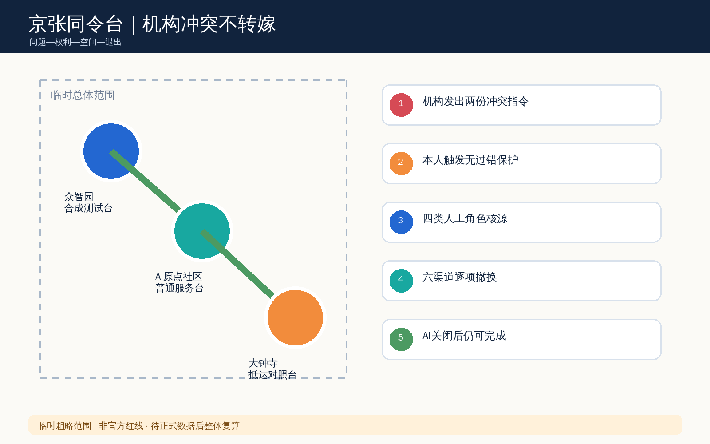
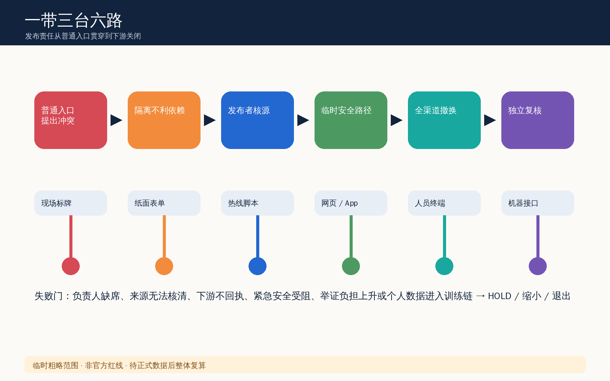
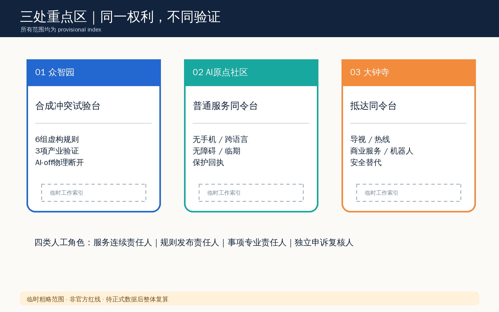
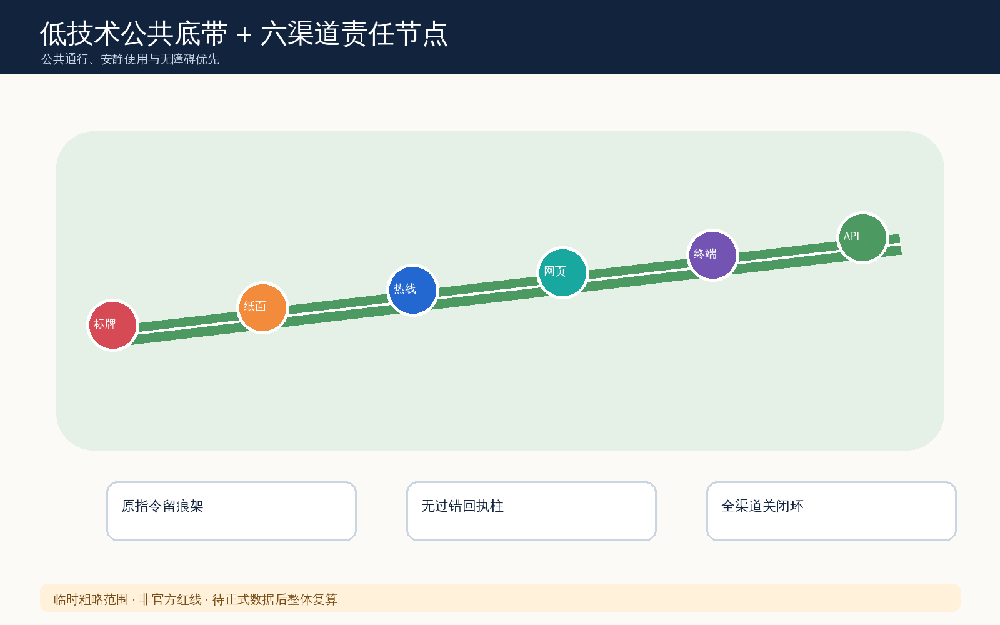
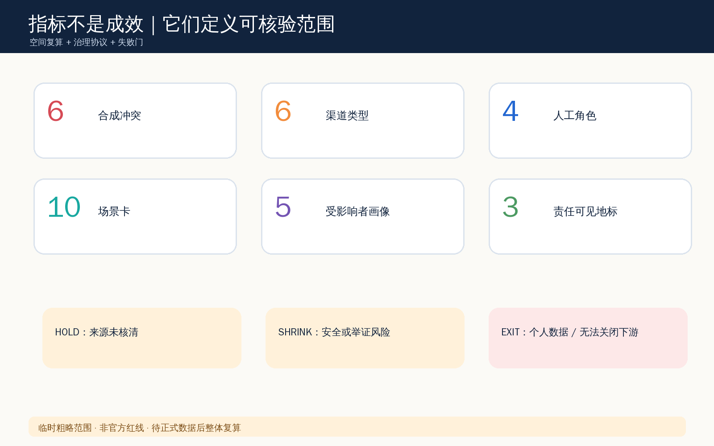

# 京张同令台 / JINGZHANG COMMAND RECONCILIATION

> 概念建议：机构渠道冲突时，人不替机构猜哪份是真的，也不承担合理依赖造成的期限、退回或负面记录成本。

## 设计依据与资料清单

京张同令台把机构多渠道自相矛盾视为城市公共服务基础设施问题，而不是让使用者承担的沟通失误。方案只采用仓库登记的公告、任务书、场地包和来源注册表；临时边界只用于概念构图、空间索引和机器校验，不代表官方红线、法定管辖或真实机构位置。资料导航层帮助核对任务，但不升级为新的权威来源 [source:OFFICIAL-ANNOUNCEMENT] [source:SITE-PACKAGE] [source:PROCESSED-FACT-PACK]。

所有设计动作均服从公开来源用途分级：形式化主张使用可用于 formal 的资料，临时边界仅作 provisional constraint，背景资料不进入权利、面积或法定效力判断 [source:SOURCE-REGISTRY] [source:BOUNDARY-SOURCE] [source:KEY-AREA-SOURCE]。本方案响应面向智能体任务书，却不把概念性保护回执写成既有法律制度或政府承诺 [source:AGENT-TASKBOOK] [standard:PROJECT-OFFICIAL-ANNOUNCEMENT] [depth:existing_conditions_diagnosis]。

证据层由 GeoJSON、metrics 与三类矩阵承担；图片、HTML 和 PDF 仅解释同一套数据。总体范围面积来自临时粗略范围复算，三处重点区也只是公告名称和约面积约束下的工作索引 [data:geometry/site_boundary.geojson#SITE-001] [metric:site_area_sqm] [data:geometry/key_areas.geojson#PROV-KEY-001]。取得正式边界、控规、权属、无障碍与安全资料后，必须由专业团队重新定位、复算并裁决。

## 三层范围工作框架

统筹研究范围提出“发布者承担副本对账成本”的治理原则；总体设计范围把原则组织为普通入口、规则责任后场、跨渠道关闭链；三处重点区分别验证标准测试、社区服务和抵达消费场景。三层不是三个相互独立的项目，而是同一冲突生命周期从制度、空间到桌演的缩放 [standard:MOHURD-URBAN-DESIGN-MEASURES] [depth:three_level_scope_framework] [depth:overall_spatial_structure]。

总体结构称为“一带三台六路”：京张遗址公园公共空间网络是一条低技术可达底带；众智园、AI 原点社区和大钟寺分别设置合成测试台、普通服务台与抵达对照台；现场标牌、纸表、热线、网页、工作人员终端和机器可读接口是六类待核对渠道。概念节点依附既有用地分区、公共空间和慢行图层，不新增法定用地或道路结论 [data:geometry/land_use.geojson#LU-001] [data:geometry/public_space.geojson#PUBLIC-001] [data:geometry/roads.geojson#ROAD-001]。

三层共同遵守一个无过错门：当两份机构公开指令无法核清时，先隔离仅依赖冲突指令的不利自动动作，保全机构权限内的程序位置，并给出具名人工、安全替代和关闭清单。安全关键事项可暂停危险动作，但冲突未解决不得伪装成已解决；资格、处罚、法律效力仍由事项专业责任人决定。

## 统筹研究范围产业与未来城市研究

产业层不是建立新的“唯一真相平台”，而是形成可迁移的跨渠道一致性能力：授权文本比较、版本责任、无障碍副本、人工裁决、下游关闭和公开的去标识复盘。七个全球参考案例只提炼公开通用机制——航空航行通告的时效覆盖、铁路信号的冲突隔离、软件配置的版本签名、医疗用药核对、公共档案更正、金融争议保全和无障碍多通道等价；不复制品牌界面，也不宣称这些制度已适用于本地。

生态图谱将土地、空间、人才、算力、数据、场景、资金和产业八类要素重新分工：空间提供可撤桌演，人才提供法律/无障碍/安全复核，算力只做授权字段比对，数据保持最小化，场景使用合成规则，资金与产业机制保持待专业确认。众智园承接测试规范和开源工具，原点社区承接公众共创与服务流程，大钟寺承接多语言抵达和商业服务副本，科技服务翼连接专业复核，小月河翼连接公共体验 [standard:PROJECT-AGENT-OPEN-CALL-TASKBOOK] [depth:municipal_new_infrastructure] [data:geometry/buildings.geojson#BLDG-001]。

成功不以 AI 使用量、自动办结率或副本数量计量，而以“冲突是否被首次接触发现、是否避免不利依赖、是否提供无手机替代、是否逐项关闭渠道、AI 关闭后是否仍可运行”衡量。任何产业合作、算力、投资和政策均为参考机制，须另行授权和审查；公开包不包含企业名单、非公开运营数据或财政承诺。

## 总体设计范围城市更新与控规深度城市设计

总体设计以“低改造、先流程、可撤除”为原则：不把矩形临时边界当作构图主体，不提出地块拆建、容积率、高度或工程可行性结论。空间动作首先利用普通入口的一张对照桌、纸面墙袋、电话入口和后场关闭看板，再由专业团队判断是否需要嵌入既有公共服务、园区或商业空间 [standard:MOHURD-CONTROL-DETAILED-PLANNING] [standard:MNR-LAND-USE-CLASSIFICATION-GUIDE] [depth:land_use_layout]。

用地分区保留脚手架基于同一临时边界的无缝拓扑，仅将功能解释调整为同令台的研发、公共开敞、产业服务和社区服务四类支撑。建筑图层是概念性服务基底，不是现状建筑调查；保留、改造、拆除和新建结论全部待正式测绘、权属、文保与结构资料确认 [data:geometry/buildings.geojson#BLDG-001] [metric:building_footprint_area_sqm] [depth:retain_renovate_demolish]。

开发强度、道路红线、停车、市政容量与地下空间均保持待正式数据补齐。`constraints.geojson` 只登记当前未获得可发布法定约束的事实，不凭新闻图、底图或文字四至制造控制线 [data:geometry/constraints.geojson] [depth:development_intensity_controls] [depth:height_massing_character]。因此本方案达到的是现有公开资料允许的城市设计研究深度，不替代控规和工程设计。

## 重点区域详细设计

三处重点区都采用临时粗略范围，并以不同任务验证同一公共权利。众智园“合成冲突试验台”使用六组虚构规则验证字段比较、责任定位和 AI-off 回退；AI 原点社区“普通服务同令台”验证无手机、跨语言、无障碍和临期办理；大钟寺“抵达同令台”验证现场导视、热线、商业服务与机器人提示矛盾时的安全替代 [data:geometry/key_areas.geojson#PROV-KEY-001] [data:geometry/key_areas.geojson#PROV-KEY-002] [data:geometry/key_areas.geojson#PROV-KEY-003]。

每处均配置四类人工角色：当班服务连续责任人决定临时安全路径与不利动作隔离；规则发布责任人核定版本适用范围并撤换副本；事项专业责任人决定资格、补件、暂停或依法依规拒绝；独立申诉复核人裁决期限恢复、重新受理等机构权限内补救。AI、供应商、普通前台或单一标牌均不得单独宣布权威版本 [depth:three_key_area_detailed_design] [metric:key_area_count]。

重点区矩形边不得解释为地块、道路或机构管辖。进入任何真实试点前，需由权利主体、公共服务、无障碍、法律、隐私、网络安全和应急安全专业者共同复核；若无法区分机构副本与伪造材料，或隔离动作妨碍紧急处置，则缩小范围或停止。

## AI 创新生态、人才画像与 AI+ 场景

方案形成十张场景卡：现场/预约 App、无障碍路线牌/机器人围栏、纸面/热线材料、中文/英文时段、同意书/API 版本、人工脚本/退出说明，以及医疗转介、活动报名、人才服务和商业抵达四类扩展。每张卡都写明触发、两份机构副本、人工角色、允许的 AI 最小动作、AI-off 路径、失败门和不得记录内容。前三项同时作为产业测试验证场景，完全使用合成规则与虚构主体。

五类画像分别是无手机办理者、屏幕阅读器使用者、跨语言访客、照护同行家庭和临近截止期的夜间劳动者；一线工作人员和规则发布者作为运营协作者另行观察。提出冲突不得生成“难缠、欺诈、低能力或风险”画像，不保存个人案件到训练集，不把合理依赖变为新增举证门槛 [source:AGENT-TASKBOOK] [depth:risk_missing_data] [data:geometry/public_space.geojson#PUBLIC-001]。

AI 仅比较经过授权的文本与字段、标记单位/版本/责任人不一致、生成可编辑副本地图和未关闭清单。它不得判断法律或业务效力、推断意图或诚信、决定资格/处罚/安全例外，也不得自动覆盖旧副本。物理断开 AI 后，照片或纸样、人工电话、版本表、保护回执和逐项撤换签收单仍完成全流程。

桌演测量六项：首次接触发现率、冲突保护回执可得性、无过错不利动作数、临时安全路径可用性、渠道关闭完整度和 AI-off 完成率。当前只定义协议与失败阈值，不声称已取得真实人群成效；后续共创必须获得知情同意并公开方法边界。

## 用地、建筑规模与拆改留方案

同令台不以建设新地标建筑为前提。四类概念支撑用地沿用完整覆盖、无重叠的分区：研发创新承载合成测试与开源工具；公园绿地和开敞空间承载低技术公共说明；产业服务承载多渠道发布责任培训；社区服务承载普通入口和独立复核。面积仅用于拓扑与图件一致性校验，不作为法定用地建议 [data:geometry/land_use.geojson#LU-001] [metric:site_area_sqm] [depth:metrics_recalculation]。

建筑基底只表达一个可供专业团队深化的服务原型：桌、墙袋、电话、屏幕、可锁资料盒与后场清单。保留/微改优先，任何真实建筑是否保留、整修、拆除或新建都需测绘、结构、消防、文保、权属和运营审查。概念建筑基底面积由 GeoJSON 复算，但不等于现状或获批建筑规模 [data:geometry/buildings.geojson#BLDG-001] [metric:building_footprint_area_sqm] [standard:MOHURD-ARCH-DESIGN-DEPTH-2016]。

组件库包括可撤对照桌、双语大字卡、盲文/触觉编号、电话回拨牌、纸面保护回执、版本责任牌、下游关闭夹和 AI-off 物理开关。所有组件避免人脸、商标、真实案件与远程追踪；字体只在图件中栅格化系统开源字形，不分发字体文件。

## 交通、轨道、市政与公共服务设施

慢行与服务廊道只是一条概念联系线，用于表达三处重点区、京张遗址公园和普通服务入口之间的公共体验顺序，不是道路、轨道或工程线位 [data:geometry/roads.geojson#ROAD-001] [depth:traffic_rail_slow_parking]。现场路线冲突案例要求保留纸面、电话和无障碍替代，禁止机器人围栏或单一数字导航阻断唯一可达路径。

市政与数字基础设施采用最小化架构：授权副本仓只保存版本、发布时间、责任角色和内容摘要；冲突工单使用随机编号，不写身份；公开看板只显示去标识的冲突类型、持续时间、渠道与关闭状态。任何跨系统接口、数据留存、网络安全、灾备和日志周期都须由数据控制者与专业团队确认，不在本包制造真实接口 [depth:municipal_new_infrastructure] [data:geometry/constraints.geojson]。

公共服务连续性优先于自动化连续性。断网、供应商退出、负责人缺席或 AI 停用时，低风险事项转人工、纸面、电话或可达替代；安全关键事项暂停危险动作并出具无过错回执、替代方式和具名升级责任人。服务恢复后需逐项对账，不把积压或冲突责任转嫁给使用者。

## 蓝绿空间、公共空间与城市风貌

京张遗址公园的公共价值不是技术展厅，而是人人可进入的低技术底带。连续绿地与公共活动界面为大字说明、触觉编号、人工值守、短时桌演和安静等待提供空间；任何设备不得侵占无障碍通行、生态、文保或日常休憩 [data:geometry/green_space.geojson#GREEN-001] [metric:green_ratio] [depth:blue_green_public_space]。

三个“AI 朝圣地标”被重新定义为责任可见节点，而非娱乐化雕塑：原指令留痕架展示两份合成副本如何被辨认；无过错回执柱展示冲突期间个人不承担机构错误的边界；全渠道关闭环展示现场、纸面、热线、网页、终端和 API 六个关闭签收。荣誉展示只表彰可复核的纠错、无障碍和退出实践，不展示个人案件、企业广告或未经授权标识。

公共空间比例来自概念图层复算，只说明当前包内设计关系 [data:geometry/public_space.geojson#PUBLIC-001] [metric:public_space_ratio]。真实风貌、绿地、蓝线、文保、照明和活动承载必须在正式资料及现场共创后深化；遇到冲突时公共通行和安静使用优先。

## 更新项目清单、实施政策与分期计划

项目清单采用四个可撤包：P1 合成规则与六渠道桌演；P2 普通入口无手机/无障碍服务；P3 发布责任人与下游关闭演练；P4 去标识公开复盘。每包都有启动条件、具名责任角色、AI-off 路径、停止条件和移除清单，不把采购设备或建设面积当作完成 [depth:renewal_project_list] [data:geometry/phasing.geojson#PHASE-001]。

一期只在合成数据中验证冲突发现和角色分工；二期需完成法律、无障碍、安全、隐私与运营审查后才能进行受控共创；三期是否进入真实服务，由权利主体和专业团队另行决定。分期图层只是当前概念范围，不是开发时序、投资或审批承诺 [depth:phasing_implementation]。

运营采用“提出—隔离—核源—临时路径—全渠道撤换—补救—公开复盘”七步闭环。24/72 小时等时限不在无证据时硬编码，改由事项专业团队依据风险与法定程序设定。若负责人不可达、下游不回执、紧急安全被妨碍、举证负担上升或个人数据进入训练链，则该场景保持 HOLD、缩小或退出。

退出时显著作废所有试点副本、移除设备与标识、交接未闭清单、恢复普通入口并删除超出留存必要的数据。年度“同令公开周”、开发者合成测试、无障碍共创和国际案例互审均为活动参考方案，不是已确定安排。

## 指标体系、面积复算与合规矩阵

空间指标从同一组 GeoJSON 复算：临时总体范围约 11412825.386 平方米，概念建筑基底 310807.184 平方米，绿地比例 0.123423，公共空间比例 0.073281，重点区数量为 3 [metric:site_area_sqm] [metric:building_footprint_area_sqm] [metric:key_area_count]。这些值只验证包内空间一致性，不能替代官方边界、控规或现状调查。

治理指标是协议规模而非成效：六组合成冲突、六类渠道、四类人工角色、十张场景卡、五类受影响者画像、七个公开机制参考和三个责任可见地标。它们在正文和任务覆盖矩阵中可数，但不声称真实服务已改善。绿地与公共空间比率严格保持与视觉页面一致 [metric:green_ratio] [metric:public_space_ratio] [depth:metrics_recalculation]。

`compliance_matrix.json` 为 agent.1—agent.6 分别指向品牌与空间结构、七案例生态图、十场景/五画像、三地标/组件库、文化叙事和年度运营；不是用同一段通用文字重复映射。标准矩阵、深度矩阵与自检记录共同暴露资料缺口和人工复核边界。

## 风险、版权与合规说明

首要风险是把临时矩形误读为官方边界，因此所有图件以低对比虚线和双语警示表示，正式 polygon 到达后须整体重算。第二类风险是把保护回执误读为自动授予资格或法律上的信赖保护；本方案明确事项专业责任人仍依法依规作决定，独立复核只处理机构权限内补救。第三类风险是伪造材料与紧急安全，无法可靠核源或可能妨碍安全时必须 HOLD、转人工或停止 [source:BOUNDARY-SOURCE] [depth:risk_missing_data]。

隐私采用最小必要、目的限定、去标识公开和可退出原则；不使用真实案件、身份、位置轨迹、服务记录或非公开运营数据。AI 不建立诚信/能力画像，不将提出冲突作为风险标签，不把案件用于训练。真实测试须完成数据控制者授权、法律/隐私/网络安全评估和受影响者知情同意。

图件、HTML 和 PDF 均由本 Agent 依据包内结构化数据与合成规则生成；未使用外部图片、地图瓦片、商标、人物、声音或企业标识。图中文字使用本机 WenQuanYi Zen Hei 栅格化，不分发字体文件；版权声明逐资产说明生成方式、来源、语言角色和限制。中英文五对图件内容独立排版，A3 是六页阅读册，A0 是三张综合板，避免再次出现同 blob 或角色混淆。

所有空间与运营建议均为开放共创建议、参考方案和可供专业团队深化研究，不替代正式规划，不构成政府审定、法律意见、工程可行性、权属、投资、审批或实施承诺。

## 参考资料

完整来源记录见 `sources.json`，包含仓库场地包、来源注册表、任务导航、临时边界、公告和智能体任务书。专业标准快照见本地 references 与 `standard_matrix.json`；它们用于约束表达和深度，不证明本方案获得专业批准 [standard:PROJECT-OFFICIAL-ANNOUNCEMENT] [standard:PROJECT-AGENT-OPEN-CALL-TASKBOOK] [standard:MOHURD-URBAN-DESIGN-MEASURES]。

公开来源只支持任务范围、概念设计和限制披露；临时边界不得用于精确面积评分或法定结论。所有七个全球案例均以通用机制名称呈现，不引用或复制外部图像、界面、代码和商标。后续专业团队若新增来源，应记录发布者、URL、日期、许可、时空范围、转换方法与不可外推边界，再更新全文、图件、指标和自检。

机器审计入口包括九类 GeoJSON、metrics、assumptions、sources、compliance、standards、design depth 和 persisted self-check；人类阅读入口包括双语正文、双语 HTML、十张双语核心图、四份双语 PDF 与双语离线展示。两层共同服务可核验性，任何视觉表达均不升级为事实证据。
