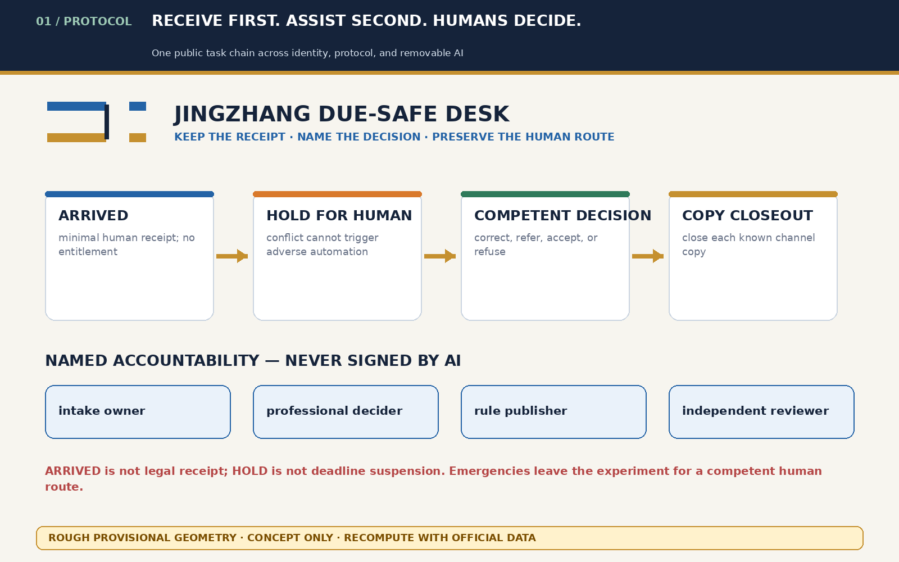
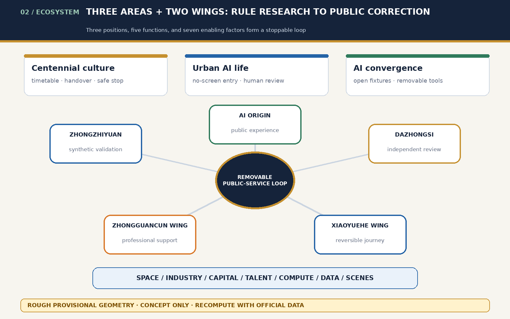
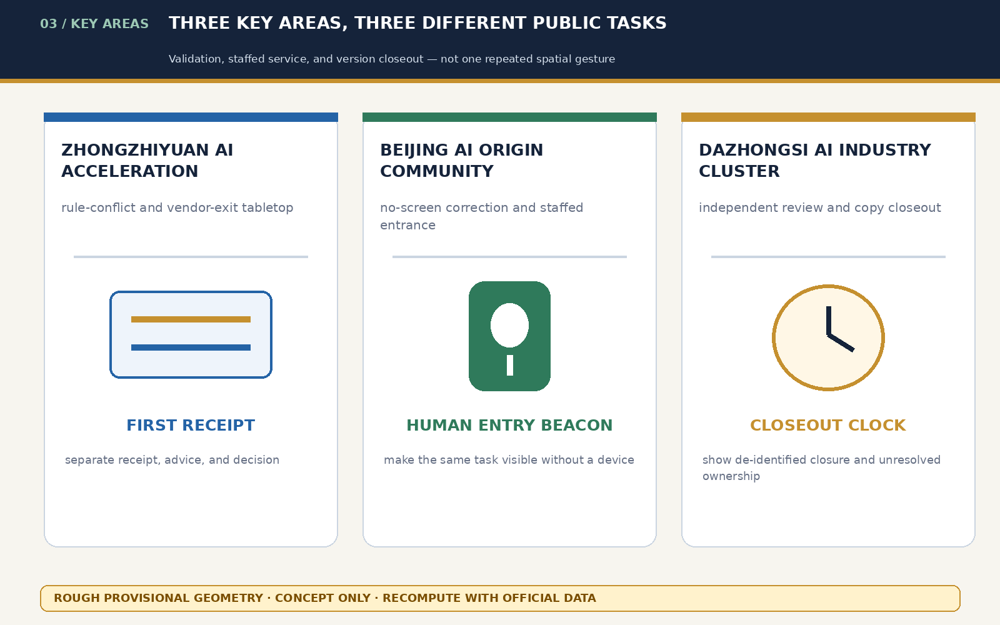
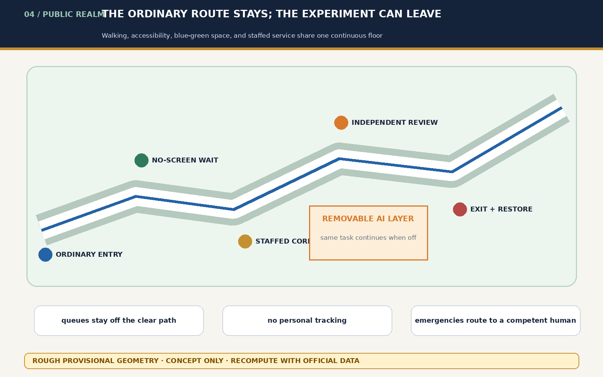
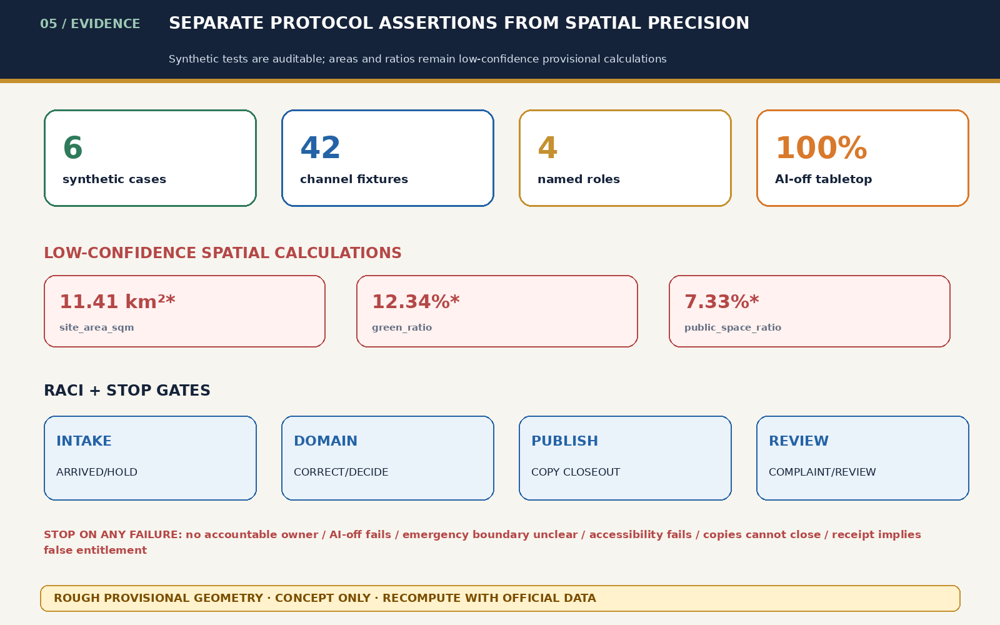

# JINGZHANG DUE-SAFE DESK / 京张保期台

## Design Basis and Source List

This is a formal conceptual package for professional development. It uses the official announcement, the cleared Agent Taskbook, the public source registry, local standards snapshots, and repository provisional geometry. The rough boundary supports intake discussion only; it is not a redline, approval basis, precise area, or real service location. [source:OFFICIAL-ANNOUNCEMENT] [source:AGENT-TASKBOOK] [data:geometry/site_boundary.geojson#SITE-001]

The public problem is not whether AI is fast. It is whether a verification failure, outage, field mismatch, or vendor exit can erase a person's first receipt event, queue position, and correction opportunity. The proposal makes no promise of statutory deadline suspension, eligibility, acceptance, or compensation. It proposes an auditable chain: receive first, assist second, assign the decision to a competent person, prevent adverse automation during conflict, and preserve a staffed route after AI exits. [standard:PROJECT-AGENT-OPEN-CALL-TASKBOOK] [depth:risk_missing_data]

## Three-Level Scope Framework

The coordinated research area studies public time, AI innovation, and institutional responsibility. The overall design area forms a Due-Safe Spine of receipt desk, no-screen waiting, staffed correction, independent review, and channel-closeout register. The key areas host synthetic validation, public-service experience, and version closeout. Research asks who bears time loss; the overall layer makes responsibility visible in front- and back-of-house space; key-area prototypes test whether receipt, correction, review, and exit work in practice. All submitted areas are calculations from rough provisional polygons and must be recomputed from official geometry. [source:PROCESSED-FACT-PACK] [depth:three_level_scope_framework] [metric:site_area_sqm]

## Coordinated Research Area: Industry and Future City Research

Universities, enterprises, communities, public-service institutions, accessibility reviewers, and legal/domain professionals form an open-rule → human-receipt → removable-assistance → professional-decision → exit-restoration chain. AI may compare authorized public rules, fields, versions, owners, and scopes, and draft an editable copy map. It may not determine eligibility, honesty, urgency, priority, legal effect, or the authoritative rule. [source:SOURCE-REGISTRY] [standard:GENERATIVE-AI-INTERIM-MEASURES]

### Agent.1 — Identity and the Three Areas–Two Wings Loop

The original mark combines two parallel rails with one open receipt notch. The rails represent the ordinary human path and removable AI assistance; the notch means a competent human decision is still open. It never means acceptance, entitlement, or automatic deadline suspension. The Centennial Jing-Zhang Culture Belt contributes timetable, handover, and safe-stop discipline; the Urban AI Life Experience Belt makes the no-screen and staffed routes tangible; the AI Convergence Innovation Belt opens synthetic fixtures to universities and enterprises. Zhongzhiyuan validates, AI Origin Community demonstrates, Dazhongsi reviews closeout, Zhongguancun Technology Service Wing supports professional services, and Xiaoyuehe Scenario Empowerment Wing carries an accessible public experience route. External regional links remain research invitations, not confirmed partnerships. [source:TASKBOOK-DELIVERABLES] [depth:overall_spatial_structure]

### Agent.2 — Comparative Cases and Full-Stack Ecosystem

Six first-party institutional references ask mechanism questions only: time-bounded urban experiments in Smart Kalasatama; public purpose, impact, and contact in the Amsterdam Algorithm Register; and system cards and feedback in the Helsinki AI Register. [source:CASE-SMART-KALASATAMA] [source:CASE-AMSTERDAM-ALGORITHM-REGISTER] [source:CASE-HELSINKI-AI-REGISTER] UK Government Design Principles add user needs, Punggol Digital District adds district–education–community integration, and NIST AI RMF adds a continuing risk lifecycle. [source:CASE-UK-GOVERNMENT-DESIGN-PRINCIPLES] [source:CASE-PUNGGOL-DIGITAL-DISTRICT] [source:CASE-NIST-AI-RMF] They remain background comparisons and cannot support local facts, performance, or institutional transfer.

The translated ecosystem is public rule → synthetic fixture → small/offline comparison → accessibility and legal review → controlled prototype → version closeout. Space uses reversible interior components; capital is only a milestone-gated concept; talent pairs service, accessibility, legal, and engineering roles; compute remains small and offline; data is limited to public rules and synthetic records; scenes remain sandboxed until an institution-approved pilot exists. [source:TASKBOOK-DELIVERABLES] [depth:renewal_project_list]

## Overall Design Area: Urban Renewal and Regulatory-Plan-Level Urban Design

The Due-Safe Spine fits existing ground floors, service foyers, or public-space edges without proposing a road redline or real institution. Its fixed sequence is ordinary entrance → paper/telephone receipt → no-screen waiting → staffed correction → independent review → back-office channel register. A digital entrance cannot precede the human entrance. On exit, temporary devices disappear while paper, telephone, a human version table, and a de-identified register remain. [data:geometry/public_space.geojson#PUBLIC-001] [data:geometry/buildings.geojson#BLDG-001] [depth:overall_spatial_structure]

Land use, buildings, roads, green/public space, and phasing are conceptual design layers, not statutory controls. FAR, height, ownership, redlines, fire, heritage, utilities, and capacity remain unknown pending official data and professional review. [standard:MNR-LAND-USE-CLASSIFICATION-GUIDE] [depth:retain_renovate_demolish]

## Detailed Design of Key Areas

| Area | Conceptual task | Public result after failure |
|---|---|---|
| Zhongzhiyuan AI Acceleration Area | Synthetic conflict and vendor-exit tabletop across signage, paper, hotline, web/app, robot, and API copies | Conflict enters human HOLD; unresolved authority falls back to paper/staffed service |
| Beijing AI Origin Community | Receipt desk, no-screen correction, telephone route, and dispute envelope for no-device and cross-language users | The first receipt event and queue number remain visible; a named person handles correction |
| Dazhongsi AI Industry Cluster | Independent review room, institutional copy-closeout register, and de-identified failure annual | Known downstream copies close one by one; a staffed route survives AI exit |

All three are provisional conceptual carriers, not actual counters, ownership, or construction sites. [data:geometry/key_areas.geojson#PROV-KEY-001] [data:geometry/key_areas.geojson#PROV-KEY-002] [data:geometry/key_areas.geojson#PROV-KEY-003] [depth:three_key_area_detailed_design]

## AI Innovation Ecosystem, Personas, and AI+ Scenarios

Personas include residents without smartphones, cross-language users, disabled people, carers, night workers, frontline intake staff, professional reviewers, maintainers, and future successor institutions. Named roles are intake owner, professional decider, rule publisher, and independent reviewer. AI, a vendor, ordinary frontline staff, or a single sign may not change eligibility or deadlines alone. [metric:human_role_count] [depth:public_service_facilities]

| Card | Spatial carrier | Mechanism and human floor |
|---|---|---|
| 01 Minimal receipt desk | AI Origin Community | A human issues receipt class, queue ID, and gap note |
| 02 Rule-conflict tabletop | Zhongzhiyuan | Synthetic channel conflicts pause adverse automation |
| 03 No-screen correction | AI Origin Community | Paper, telephone, language, and staffed routes share the queue |
| 04 Queue-preservation test | AI Origin Community | Duplicate/field conflict cannot reset the first queue event |
| 05 Independent review room | Dazhongsi | A competent person decides correction, referral, acceptance, or refusal |
| 06 Copy-closeout register | Dazhongsi | Signage, web, hotline, robot, and API copies close individually |
| 07 Dispute envelope | AI Origin Community | Minimal paper evidence without publishing the matter |
| 08 Service-exit table | All three | Disable AI and repeat the same task by staff/telephone/paper |
| 09 Multilingual gap card | AI Origin Community | Machine translation remains editable and human-approved |
| 10 Institutional learning annual | Dazhongsi | Publish de-identified failure types and restoration progress only |
| 11 Same entrance without a phone | AI Origin Community | Rejecting digital service cannot lower service level |
| 12 Deadline-queue tabletop | Zhongzhiyuan | Receive first and correct later; never trade adverse rejection for speed |

Cards 02, 04, and 05 are industry/professional validation scenes. Six synthetic personas and 42 channel fixtures contain no real identity, case, service record, or trace. Xiaoyuehe Scenario Empowerment Wing becomes a reversible public journey: inspect a synthetic receipt, complete a no-screen gap card, then disable AI and repeat the task. Participation must remain voluntary and removable. [metric:synthetic_case_count] [metric:channel_closeout_fixture_count] [source:PROTOCOL-AUDIT] [depth:ai_scenario_system]

## Land Use, Building Scale, and Retain-Renovate-Demolish Strategy

Retain existing staffed foyers; renovate them with an accessible desk, paper cabinet, version wall, and acoustic review booth; discuss new reversible components only after professional confirmation. Geometry areas and ratios are low-confidence calculations from participant design layers and the rough provisional boundary. They are not buildable quantity or planning-control indicators. Height, ownership, seismic, fire, heritage, utilities, and engineering remain unknown. [data:geometry/land_use.geojson#LU-001] [metric:building_footprint_area_sqm] [depth:development_intensity_controls]

## Transport, Rail, Municipal Infrastructure, and Public Services

The spine connects walking, rail interfaces, and ordinary service entrances without placing queues in an accessible clear path. Paper, telephone, staff, and static signs complete the same task during an outage. Devices, power, and networking are removable components and cannot leave a new barrier, gate, or exclusive sign. Roads express relationships only; no engineering alignment, station flow, fire clearance, utility, lighting, drainage, or timetable claim is made. [data:geometry/roads.geojson#ROAD-001] [depth:traffic_rail_slow_parking]

## Blue-Green Network, Public Space, and Urban Character

Public space communicates three rules: queues do not occupy the ordinary path, receipts do not expose personal matters, and people can still find a person when AI is off. Three reversible conceptual landmarks support this: FIRST RECEIPT explains receipt/advice/decision in Zhongzhiyuan; HUMAN ENTRY BEACON marks the no-screen staffed route in AI Origin Community; CLOSEOUT CLOCK shows de-identified copy closure and unresolved ownership in Dazhongsi. The component library contains a paper receipt rail, no-screen bench, accessible correction desk, version wall, independent booth, and removable beacon. East–west stitching and north–south continuity are only accessible walking and staffed-service relationships pending heritage, green-space, traffic, and ownership review. [source:TASKBOOK-DELIVERABLES] [data:geometry/green_space.geojson#GREEN-001] [depth:blue_green_public_space]

The cultural narrative translates railway timetable, handover, and safe stop into public-service accountability: one visible route, a named owner at each handover, and a safe HOLD when evidence is insufficient. Zhongguancun culture contributes open validation; AI culture requires removable models, human judgment, and correctable versions. The international line is “Keep the receipt. Name the decision. Preserve the human route.” It avoids claims that the project can freeze a legal clock. [source:TASKBOOK-DELIVERABLES] [depth:height_massing_character]

## Renewal Projects, Implementation Policy, and Phasing

Near term: synthetic tabletop and paper protocol. Middle term: institutions, professionals, and affected people confirm procedure, authority, fire, accessibility, privacy, retention, and operations. Long term: a small controlled pilot may be discussed only after those gates. Every project needs an owner, due date, human takeover, deletion/exit, independent review, and de-identified outcome. Otherwise it remains OFF. [data:geometry/phasing.geojson#PHASE-001] [depth:phasing_implementation]

The conceptual annual loop is Q1 public-rule inventory clinic, Q2 synthetic failure tabletop, Q3 accessible prototype week, and Q4 version-closeout forum. Each has a stop gate. Developers maintain synthetic fixtures, not applications; scene opening requires institution, accessibility, and independent review; international exchange shares reproducible methods only. The conversion path is public problem → synthetic validation → professional review → removable prototype → public correction, not a commitment to funding, recruitment, events, or partnership. [source:TASKBOOK-DELIVERABLES] [depth:phasing_implementation]

## Metrics, Area Recalculation, and Compliance Matrix

Structured protocol metrics are six synthetic cases, 42 channel fixtures, seven channel types, four named roles, 100% tabletop AI-off completion, and 100% isolation from adverse automation. They are protocol assertions, not field performance or legal effect. Spatial values are low-confidence recomputations from participant layers and provisional rough geometry; they must be replaced with official polygons and field data. [metric:synthetic_case_count] [metric:channel_type_count] [metric:human_role_count]

The prototype applies only to low-risk appointment requests, public-program expressions of interest, and general information correction. Emergency dispatch, law enforcement, medical triage, statutory deadline determination, benefit eligibility, and safety-critical authorization are excluded. Its state machine is ARRIVED → HOLD_FOR_HUMAN → CORRECTION_REQUESTED / REFERRED → DECIDED → CLOSED_OUT. ARRIVED is a minimal receipt event, not legal receipt or entitlement. RACI, a 30-day synthetic-log deletion rule, forbidden fields, emergency exception, complaint route, and six exit conditions are in `protocol-audit.json`; one failed condition stops the experiment. [source:PROTOCOL-AUDIT] [depth:risk_missing_data]

The five-field convergence audit distinguishes affected users, end-to-end task, spatial carrier, named right/decision, and failure result. Current evidence found no merged package covering this full chain, but latest main, Issues, and PRs must be searched before every revision. [depth:metrics_recalculation]

## Risk, Copyright, and Compliance

Stop or narrow the concept if the receipt becomes a new proof burden, forgery cannot be handled, HOLD obstructs urgent safety, a named owner cannot close downstream copies, or professional review rejects generalized time protection. “Due-safe” does not mean reliance protection, deadline restoration, eligibility, acceptance, or compensation. A competent professional decides emergency safety under the applicable procedure. [standard:BARRIER-FREE-ENVIRONMENT-LAW] [standard:GENERATIVE-AI-INTERIM-MEASURES] [depth:risk_missing_data]

All diagrams are original deterministic outputs. Pillow 12.3.0 uses Noto Sans CJK SC and DejaVu Sans; WeasyPrint 69.0 derives the PDFs. Author, tool, version, date, license, and external-material status are listed in `rights-ledger.json`. Chinese and English Markdown, HTML, PDFs, and text-bearing figures are generated separately and checked for script and non-identical hashes. [source:RIGHTS-LEDGER]

## References

- `brief/site-package/design_brief.json`
- `brief/site-package/agent_taskbook.json`
- `data/source_registry.json`
- `docs/review-rubric.md`
- `docs/formal-submission-guide.md`
- `brief/site-package/standards/references/`
- `visual/assets/due-safe-ledger.json`: synthetic cases and channel fixtures only.
- `visual/assets/taskbook-deliverables.json`: original identity, ecosystem, landmark, culture, regional, and annual-operation design.
- `visual/assets/protocol-audit.json`: synthetic applicability, state, RACI, privacy, emergency, retention, complaint, and exit contract.
- `visual/assets/rights-ledger.json`: author/tool/font/license/dependency record.
- Missing evidence remains official boundaries, precise key-area polygons, redlines, surveyed buildings, ownership, utilities, fire, heritage, real procedures, and affected-user testing. These gaps require recomputation and professional confirmation.
