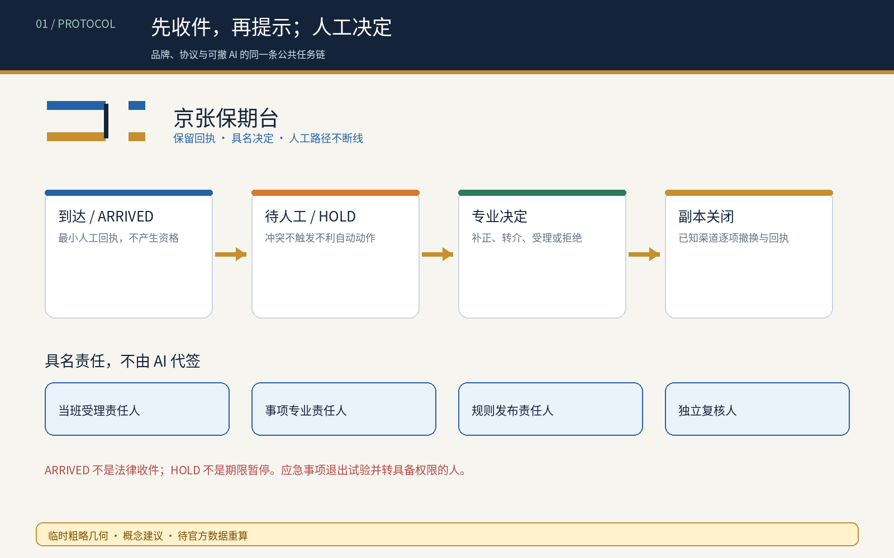
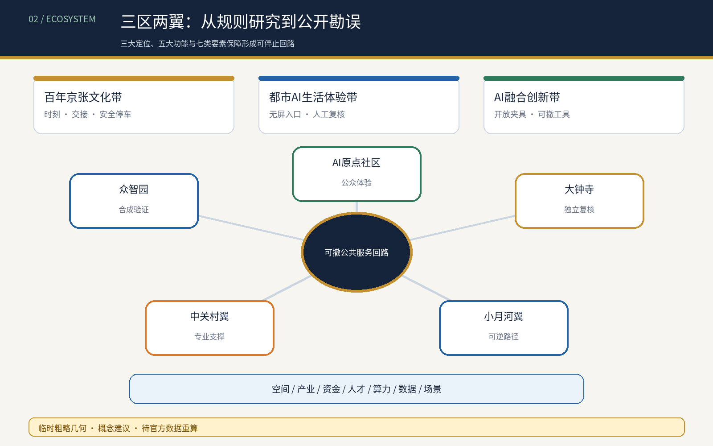
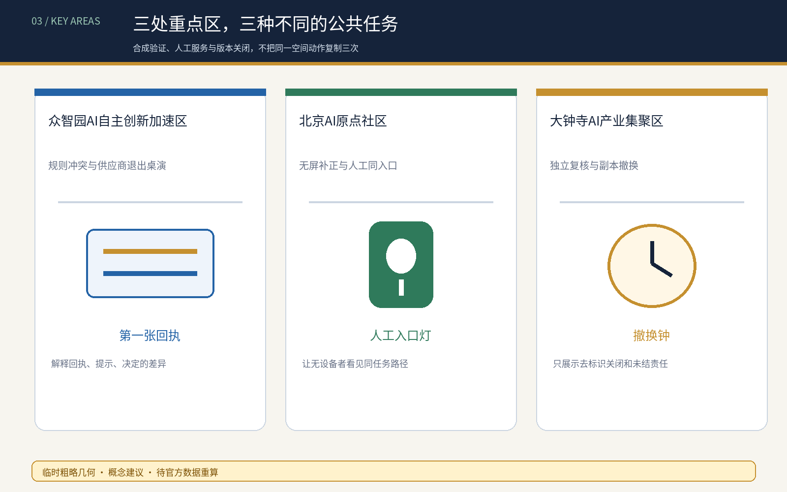
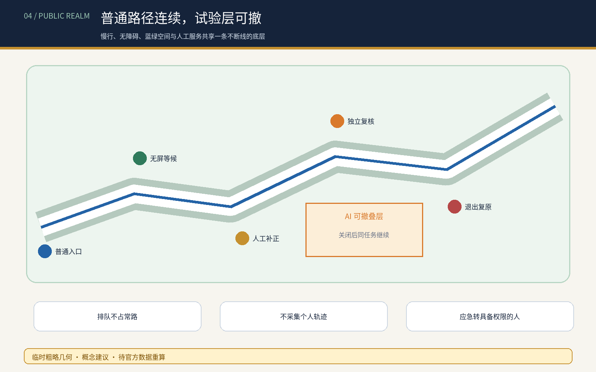
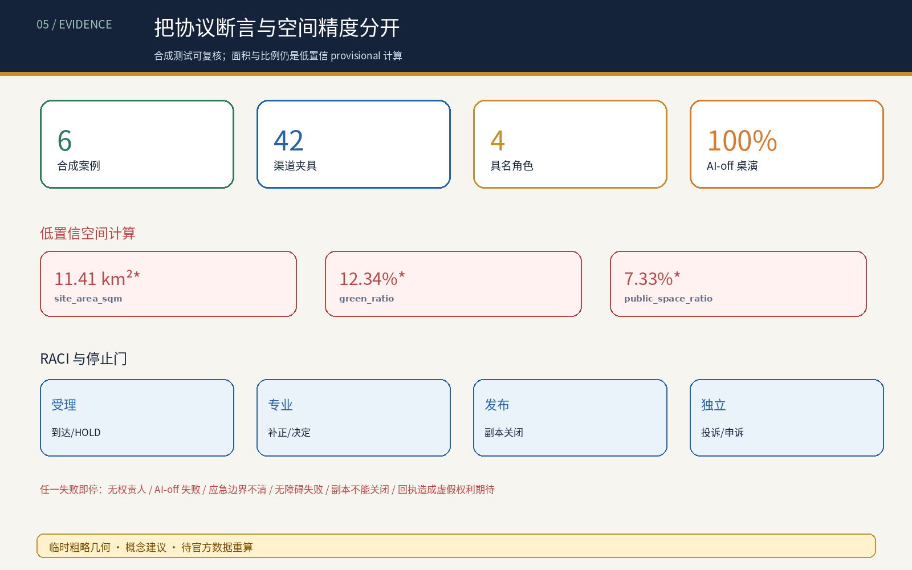

# 京张保期台 / JINGZHANG DUE-SAFE DESK

## 设计依据与资料清单

本方案是面向专业团队深化的 formal 概念包。它使用公告、智能体任务书、来源登记、标准快照和临时几何；临时边界只用于 intake 讨论，不能作为红线、审批、面积或真实服务点依据。[source:OFFICIAL-ANNOUNCEMENT] [source:AGENT-TASKBOOK] [data:geometry/site_boundary.geojson#SITE-001]

公共问题不是“AI 够不够快”，而是一次机器核验失败、断网、字段不一致或供应商退出，是否会吞掉人的原始收件日、队列位置和补正机会。保期台不承诺行政期限暂停、资格结果或赔偿；它提出一条可审计的空间—服务链：先收件、再提示、人工决定、失败不自动失权、退出仍可人工受理。[standard:PROJECT-AGENT-OPEN-CALL-TASKBOOK] [depth:risk_missing_data]

## 三层范围工作框架

统筹研究范围研究公共时间权、AI 创新生态和机构责任；总体设计范围把保期台组织为“保期脊”，由实体取号桌、无屏等候、人工补正、独立复核和副本撤换清单组成；重点区域范围分别承载合成桌演、人工受理和失败复盘。这样安排的设计意图是让研究问题、空间动作和公共结果一一对应：研究层提出谁承担时间损失，整体层把责任放入可见的入口与后场，重点层用合成案例检验是否真的能收件、补正、复核和退出。`site_boundary.geojson` 的 provisional 面积只供结构检查，`key_areas.geojson` 的三处载体只供布局讨论；正式边界、权属、道路红线和服务机构清单缺失时，不能把任何面积或位置写成法定结论，全部指标需在官方资料到位后重算。[source:PROCESSED-FACT-PACK] [depth:three_level_scope_framework] [metric:site_area_sqm]

## 统筹研究范围产业与未来城市研究

保期台把高校、企业、社区、公共服务机构、无障碍与法律专业者组织成“公开规则—人工回执—可撤提示—专业决定—退出复原”的创新链。AI 最小角色是比较经授权的公开文本/字段，标记渠道、版本、责任人和适用范围不一致，生成供人工修改的副本地图；AI 不判断资格、诚信、紧急程度、谁应占名额或哪份规则具有法律效力。[source:SOURCE-REGISTRY] [standard:GENERATIVE-AI-INTERIM-MEASURES]

命名识别使用“站台回执”视觉语汇：纸票形状、金色日期线和蓝色人工入口；Logo 仅为本方案原创方向，不使用他人字体、图片、商标或标识。国际传播、年度活动和开发者社区均为概念建议，不是已确定活动。[depth:overall_spatial_structure]

### Agent.1｜品牌与三区两翼协同

原创标志由两条平行“轨”与一处开放回执缺口组成：两轨分别代表普通人工路径与可撤 AI 提示，缺口表示事项仍待具名人员决定；它绝不表示已经受理、获得资格或期限自动暂停。三大定位通过一条可追踪回路展开：百年京张文化带提供“时刻—交接—安全停车”的叙事，都市 AI 生活体验带把无屏入口和人工复核做成可体验空间，AI 融合创新带把合成夹具与可撤工具开放给高校和企业。五大功能通过众智园测试、AI 原点社区体验、大钟寺复核、中关村科技服务翼支撑和小月河场景赋能翼的公众路线连成一环；其他区域协同仅为比较研究邀请，不是已确定合作。[source:TASKBOOK-DELIVERABLES] [depth:overall_spatial_structure]

### Agent.2｜全球案例与全栈生态

六个国际参照只用于提出机制问题：Smart Kalasatama 的限时城市试验、Amsterdam Algorithm Register 的用途/影响/联系人公开、Helsinki AI Register 的系统卡与反馈。[source:CASE-SMART-KALASATAMA] [source:CASE-AMSTERDAM-ALGORITHM-REGISTER] [source:CASE-HELSINKI-AI-REGISTER] UK Government Design Principles 的用户需求、Punggol Digital District 的园区—教育—社区协同、NIST AI RMF 的持续风险回路提供另外三个比较角度。[source:CASE-UK-GOVERNMENT-DESIGN-PRINCIPLES] [source:CASE-PUNGGOL-DIGITAL-DISTRICT] [source:CASE-NIST-AI-RMF] 它们都有一手机构页面，但仍只是背景比较，不能支撑本地事实、绩效或制度移植。

转化后的生态图谱是“公开规则 → 合成夹具 → 小模型/人工比较 → 无障碍与法律复核 → 受控原型 → 版本撤换”；土地空间只使用可逆室内组件，资金只建议按公共价值和退出门分阶段讨论，人才采用服务/无障碍/法律/工程配对，算力保持小型离线，数据限公开规则和合成记录，场景必须先沙盒再谈机构批准试点。[source:TASKBOOK-DELIVERABLES] [depth:renewal_project_list]

## 总体设计范围城市更新与控规深度城市设计

保期脊优先嵌入既有首层、社区服务前厅或公共空间边缘，不新增道路红线，不指认真实机构。空间顺序固定为：普通入口 → 纸面/电话回执 → 无屏等候 → 人工补正 → 独立复核 → 后场副本清单。任何数字入口都不能位于人工入口之前；退出时撤去临时设备，保留纸票、电话、人工版本表和去标识台账。[data:geometry/public_space.geojson#PUBLIC-001] [data:geometry/buildings.geojson#BLDG-001] [depth:overall_spatial_structure]

用地、建筑、道路、绿地、公共空间和分期图层均是设计提案，不是法定控制。FAR、高度、权属、道路红线、消防、文保和市政条件保持 unknown，待正式资料和专业复核后再决定保留、改造、移位或删除。[standard:MNR-LAND-USE-CLASSIFICATION-GUIDE] [depth:retain_renovate_demolish]

## 重点区域详细设计

| 区域 | 概念任务 | 失败后的公共结果 |
|---|---|---|
| 众智园AI自主创新加速区 | 规则冲突与供应商退出的无个人数据桌演；比较网页、纸表、热线、机器人、API 六类副本 | 冲突期间保持 HOLD，不自动退回；无法核清则人工/纸面办理 |
| 北京AI原点社区 | 保期回执台、无屏补正桌、电话入口与争议封存柜；让无手机和跨语言者完成同一受理步骤 | 原始收到时间和队列号保留，补正由具名责任人处理 |
| 大钟寺AI产业聚集区 | 独立复核间、机构副本撤换清单和去标识失败年鉴 | 逐项关闭下游副本；AI 退出后实体受理继续 |

三处区域是 `provisional_constraint` 概念载体，不是实际窗口、权属或施工点。它们的差异在于分别检验冲突发现、人工受理和副本撤换，而不是把同一服务复制三次。[data:geometry/key_areas.geojson#PROV-KEY-001] [data:geometry/key_areas.geojson#PROV-KEY-002] [depth:three_key_area_detailed_design] 具体的第三处几何与面积仍待官方附件确认。

## AI 创新生态、人才画像与 AI+ 场景

受影响者包括无手机居民、跨语言使用者、残障人士、照护者、夜间劳动者、一线受理员、专业审核人、维护人员和未来接手机构。具名决定角色是当班受理责任人、事项专业责任人、规则发布责任人和独立复核人；AI、供应商、普通前台和单一标牌不得单独改变资格或期限。[metric:human_role_count] [depth:public_service_facilities]

| 场景卡 | 空间载体 | 机制与人工底线 |
|---|---|---|
| 01 保期回执台 | AI 原点社区 | 收到时间、队列号、缺口说明先由人工签发 |
| 02 规则冲突桌演 | 众智园 | 合成六类渠道冲突，暂停不利自动动作 |
| 03 无屏补正桌 | AI 原点社区 | 纸面、电话、多语和人工与数字入口同队列 |
| 04 队列保全演练 | AI 原点社区 | 重复提交、字段冲突不重置原始队列号 |
| 05 独立复核间 | 大钟寺 | 专业人员决定补正、转介、受理或拒绝 |
| 06 副本撤换清单 | 大钟寺 | 现场、网页、热线、机器人和 API 逐项回执 |
| 07 争议封存柜 | AI 原点社区 | 最小必要纸面记录，不公开个人事项 |
| 08 服务退出桌 | 三处重点区 | 关闭 AI 后复原人工、电话和纸面路径 |
| 09 多语缺口卡 | AI 原点社区 | AI 翻译可编辑，责任人确认内容 |
| 10 机构复盘年鉴 | 大钟寺 | 只公开去标识失败类型和恢复进度 |
| 11 无手机同入口 | AI 原点社区 | 不因拒绝数字入口降低服务等级 |
| 12 截止前拥堵桌演 | 众智园 | 先收件、后补正，不以自动拒绝换速度 |

其中 02、04、05 是产业/专业测试验证场景。最小原型使用六个合成人物和六类合成渠道，不使用真实案件、身份、服务记录或个人轨迹。[metric:synthetic_case_count] [metric:channel_closeout_fixture_count] [depth:ai_scenario_system]

小月河场景赋能翼被定义为可逆公众体验路径：先看一张不含个人信息的合成回执，再在无屏桌完成缺口卡，最后到退出台关闭 AI 并复演同一任务。场景—空间—运营由 `visual/assets/taskbook-deliverables.json` 与 `visual/assets/protocol-audit.json` 共同约束；任何真实参与都要有自愿、可退出和人工替代。[source:PROTOCOL-AUDIT] [depth:public_service_facilities]

## 用地、建筑规模与拆改留方案

保期台优先“留”既有人工服务前厅，按“改”加入无障碍桌、纸票柜、版本墙和隔音复核间，只有在专业确认后才讨论“新”建可逆组件。保留既有前厅能让人工服务先于数字服务出现，改造内容则把日期、队列和版本显示成可读证据；拆除或迁移只在消防、无障碍、文保、产权和运维审查后讨论。`metrics.json` 中的面积和比例只从提交 GeoJSON 复算，建筑基底仅表示概念包络，不代表可建量；强度、容量、高度、产权、抗震、管线和工程结论保持 unknown，正式资料到位后必须同步重画图层、更新矩阵、刷新图件和重新自检。[data:geometry/land_use.geojson#LU-001] [metric:building_footprint_area_sqm] [depth:development_intensity_controls]

## 交通、轨道、市政与公共服务设施

保期脊与慢行、轨道站点和普通服务入口相接，但不让排队侵入无障碍净通行；空间上把取号、等候和复核放在侧向服务边，把连续步行、轮椅、照护和应急通道保持为常路。纸面、电话、人工和静态导视形成断网时的同任务路径；设备、电源和网络均为可拆、可替换组件，退出时不会留下新的路障、门禁或排他标识。道路红线、站口人流、消防间距、管线、夜间照明、排水和运营班次目前缺少官方或现场资料，因此道路图层只表达关系，不表达工程线位；专业团队需用实测和授权条件重算容量与安全。[data:geometry/roads.geojson#ROAD-001] [depth:traffic_rail_slow_parking]

## 蓝绿空间、公共空间与城市风貌

公共空间表达“排队不占常路、回执不暴露个人、AI 关闭仍能找到人”。保期脊借用京张遗址公园的慢行与蓝绿背景，将人工入口放在可休息、可遮荫、可被看见的位置，同时用无屏状态牌和纸面指引避免把公共服务变成屏幕依赖。纸票金线、蓝色人工入口和低对比度状态牌构成克制的京张识别系统；不把屏幕、摄像头或数据柱当作地标，也不采集个人轨迹。绿地与公共空间比例可由提交图层复算，但树冠、热舒适、雨洪、文保和无障碍连续性仍待现场专业核查，不能由合成图件替代。[data:geometry/green_space.geojson#GREEN-001] [data:geometry/public_space.geojson#PUBLIC-001] [depth:blue_green_public_space]

### Agent.4｜公共空间、三座概念地标与组件库

“第一张回执”位于众智园合成测试厅，解释回执、提示、决定三者差异；“人工入口灯”位于 AI 原点社区前厅，显著标出无屏与有人路径；“撤换钟”位于大钟寺复核间，只展示去标识的副本关闭和未结责任。三者都是室内/边缘可逆概念组件，不是雕塑工程或已批准点位。组件库包括纸面回执轨、无屏等候凳、无障碍补正桌、版本墙、独立复核舱和可撤状态灯；东西缝合与南北贯通只表达连续慢行、无障碍和人工服务关系，待文保、绿地、交通和权属核验。[source:TASKBOOK-DELIVERABLES] [depth:three_key_area_detailed_design]

### Agent.5｜文化与国际传播

文化主线不是给铁路贴 AI 装饰，而是把京张铁路的时刻、交接和安全停车转译为城市服务责任：一件事有可见路线，每次换手有具名责任，证据不足时能安全停下。中关村创新文化提供开放验证与可复现实验，AI 新文化则要求模型可撤、人类最终判断和版本可纠错。导视由轨线年表、回执缺口、具名角色牌和 provisional/unknown 水印组成；英文传播语采用 “Keep the receipt. Name the decision. Preserve the human route.”，避免“冻结公共时钟”一类可能暗示法律效果的口号。[source:TASKBOOK-DELIVERABLES] [depth:height_massing_character]

## 更新项目清单、实施政策与分期计划

近期先做合成桌演和纸面协议，核对六种失败触发、七类渠道和四个具名角色；中期由机构、专业团队和受影响者共同确认真实程序、权属、消防、无障碍、隐私、记录保留和运营责任；长期才可能讨论小范围受控试验。每个更新项目都必须有责任人、到期日、人工接管、删除/退出步骤、独立复核和公开去标识结果；没有这些条件就保持 OFF，不能用场景数量或版本号替代准备度。`phasing.geojson` 仅表达先桌演、再专业复核、后受控试验的概念顺序；资金、采购、审批、施工和机构授权均是待确认依赖，官方资料到位后需重算项目边界、指标和工程风险。分期仅是概念路径，不是投资、审批或实施承诺。[data:geometry/phasing.geojson#PHASE-001] [depth:phasing_implementation]

### Agent.6｜年度活动与长期运营

年度循环由四个可停止的概念活动组成：Q1 公共规则盘点诊所先核来源与责任；Q2 合成故障桌演必须通过 AI-off 和紧急例外；Q3 无障碍服务原型周必须接受受影响者与专业复核；Q4 版本撤换论坛只发布去标识计数和未结责任。开发者社区维护合成夹具，不接触真实申请；场景开放由机构负责人、无障碍复核者和独立审查共同放行；国际交流只分享可复现方法。人才、企业和开发者的转化路径是“公开问题 → 合成验证 → 专业审查 → 可撤原型 → 公开勘误”，不构成招商、活动、资金或合作承诺。[source:TASKBOOK-DELIVERABLES] [depth:phasing_implementation]

## 指标体系、面积复算与合规矩阵

结构化指标包括六个合成案例、42 个渠道夹具、7 类渠道、4 个具名人工角色、100% 合成离线完成和 100% 不利自动动作隔离；这些是桌演协议断言，不是现场绩效或法律效果。[metric:synthetic_case_count] [metric:channel_type_count] [metric:human_role_count]

离线完成率与不利动作隔离率分别记录是否存在纸面/电话/人工路径、以及是否在冲突时进入 HOLD；它们不能推断真实群众成功率、合法性或达到 90 分的概率。后续专业复核应增加受影响者可理解性、等待成本、隐私暴露、错误回执和紧急例外的独立记录，并保留 exact-head 与规则版本，避免把协议通过误写成现场效果。[metric:offline_completion_rate] [metric:adverse_action_isolation_rate]

合成原型适用范围只包括低风险预约、公共项目意向与一般信息更正；应急调度、执法、医疗分诊、法定期限判断、福利资格和安全关键授权明确排除。状态机为 ARRIVED → HOLD_FOR_HUMAN → CORRECTION_REQUESTED / REFERRED → DECIDED → CLOSED_OUT；ARRIVED 只表示最小回执事件，不等于法律收件或资格。RACI、30 天合成日志删除、禁止字段、紧急例外、投诉入口和六条退出条件记录在审计文件中；任一条件失败即停试。[source:PROTOCOL-AUDIT] [depth:risk_missing_data]

五字段差异审计确认：服务对象是可能因机器失败失去公共时间的人；完整任务新增原始日期/队列保全和机构副本撤换；空间载体是实体回执—补正—复核链；权利把“判断哪份是真的”的成本移回发布机构；失败结果是待人工而非自动逾期。当前未发现合并方案完整覆盖此链，但投稿前仍须复跑最新 main、Issue 与 PR 审计。[depth:metrics_recalculation]

## 风险、版权与合规说明

若回执成为新的举证门槛、无法区分伪造材料、冲突隔离妨碍紧急安全、责任人无法关闭下游副本，或专业者认为不能普遍保护期限，方案立即缩小或拒绝。不得把“保期”写成法律上的信赖保护、期限恢复、福利资格或赔偿；紧急安全事项仍由有权专业人员按适用程序决定，不能用本概念自动放行或暂停。所有图件由本包合成生成，数据来自仓库公开/清权资料；无外部人物、案件、敏感空间或未授权标识。版权、隐私、无障碍、数据最小化和 provisional geometry 限制必须在实际深化前逐项复核，任何无法清权或需真实个人/运营数据的实现都应停止。[standard:BARRIER-FREE-ENVIRONMENT-LAW] [standard:GENERATIVE-AI-INTERIM-MEASURES] [depth:risk_missing_data]

图件使用 Pillow 12.3.0 与 Noto Sans CJK SC / DejaVu Sans 确定性生成，PDF 使用 WeasyPrint 69.0 派生；字体、依赖、作者、日期、许可与外部素材逐项登记在 `visual/assets/rights-ledger.json`。中英正文、HTML、PDF 与含字图件分别生成并抽查字符集和非同哈希，不以文件名映射代替等义性。[source:RIGHTS-LEDGER]

## 参考资料

- `brief/site-package/design_brief.json`
- `brief/site-package/agent_taskbook.json`
- `data/source_registry.json`
- `docs/review-rubric.md`
- `docs/formal-submission-guide.md`
- `brief/site-package/standards/references/`：专业标准快照与其 SHA-256 由仓库维护；本包只引用已登记的本地副本，不把 URL 当作唯一证据。[source:SITE-PACKAGE]
- `visual/assets/due-safe-ledger.json`：六个合成案例、七类渠道和四个角色的可复核协议数据；它不证明真实服务绩效或法律效果。[metric:synthetic_case_count]
- 当前缺口：官方边界、重点区精确 polygon、道路红线、现状建筑、权属、市政、消防、文保、真实程序和受影响者测试；这些缺口决定图层、指标和空间位置必须在专业深化时重算。
