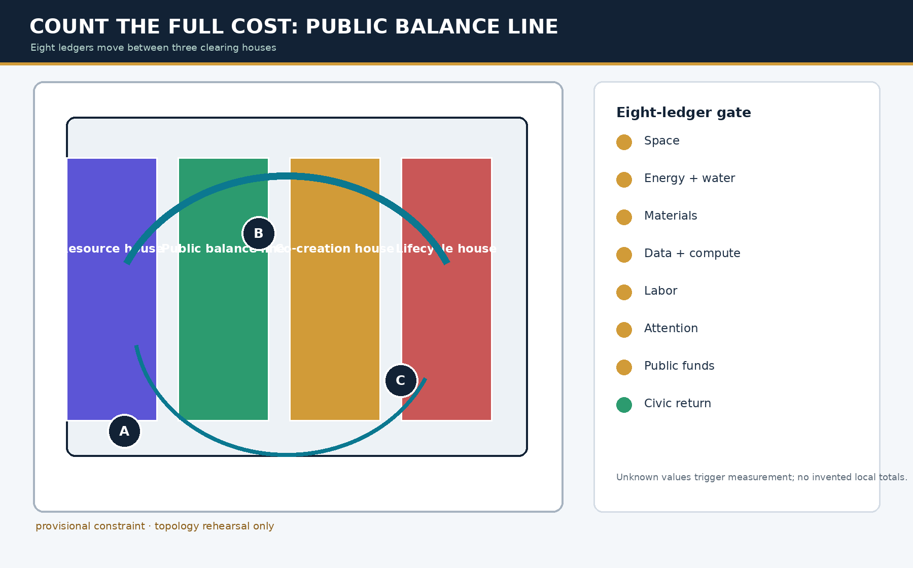
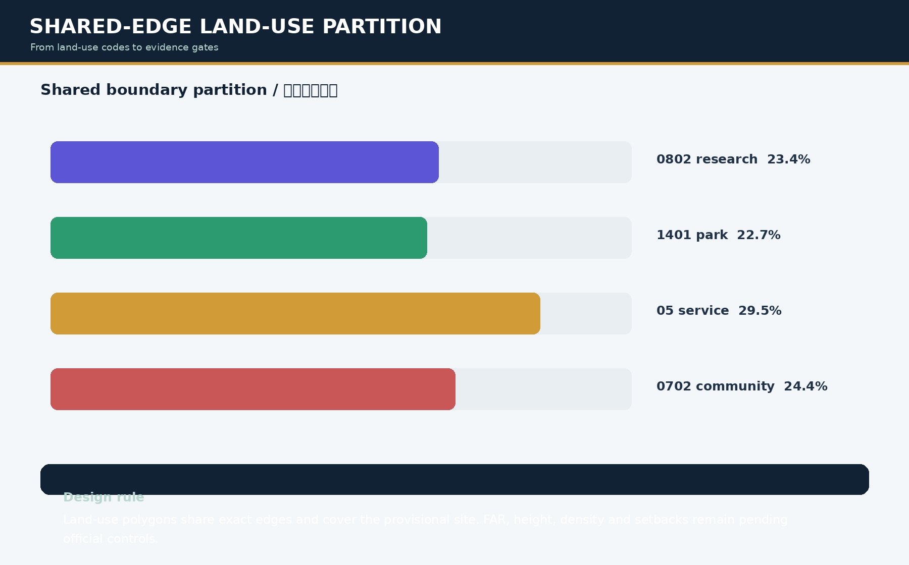
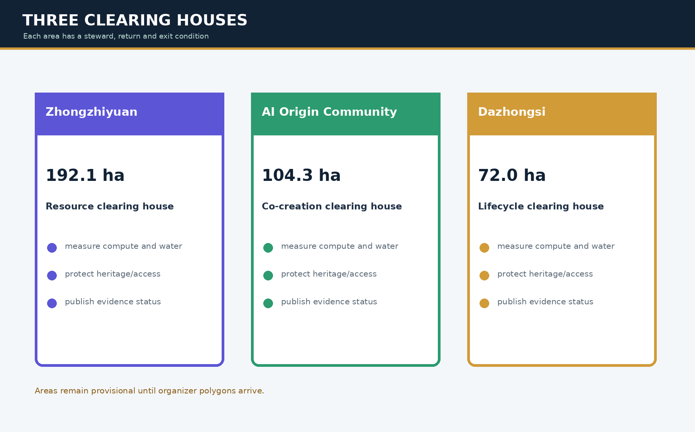
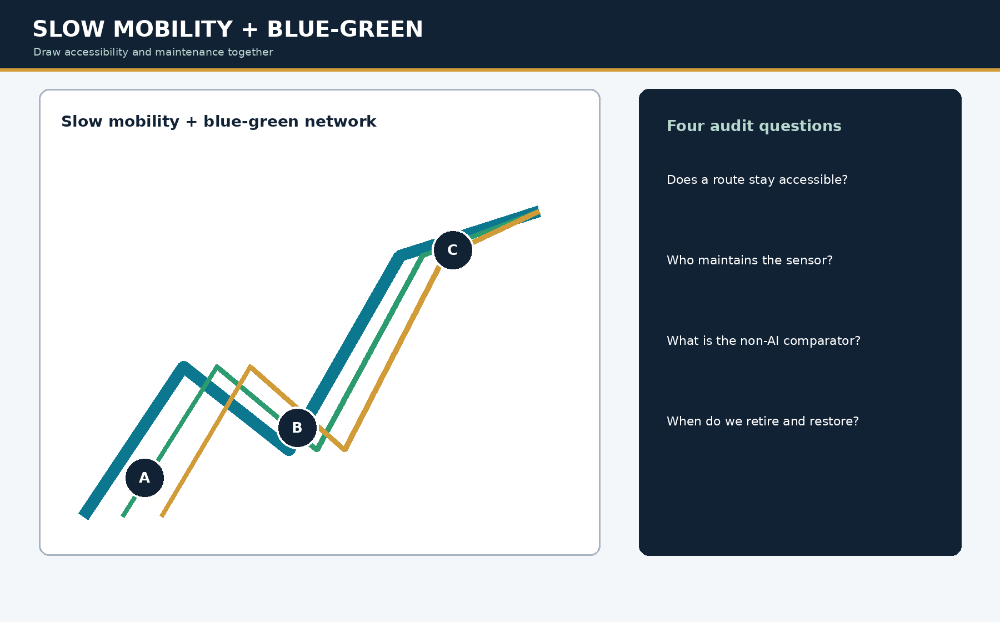
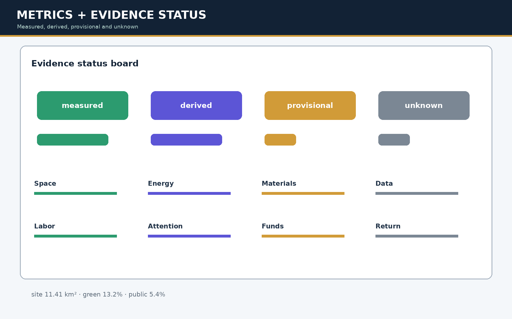

# COUNT THE FULL COST JING-ZHANG

> **Core thesis: AI may leave; its public return must remain on the ground.** The Public Balance Line and staffed service work first. AI borrows only a reversible relative trial cell, and becomes eligible for human co-review only when added protected uses strictly exceed its footprint.

## Design Basis and Source List

This package uses the public Haidian planning announcement, the user-cleared agent taskbook, the repository site package and its public-source registry. The announcement provides text descriptions and approximate areas but no official polygons; `geometry/site_boundary.geojson` and `geometry/key_areas.geojson` are therefore provisional constraints, never redlines, regulatory plans or approval evidence [source:OFFICIAL-ANNOUNCEMENT] [source:AGENT-TASKBOOK] [data:geometry/site_boundary.geojson#SITE-001]. JSON, GeoJSON, figures, HTML and PDFs are generated from one evidence model; prose keeps only claim-adjacent anchors for a professional reader.

The design judgment is simple: public space cannot become a permanent showroom for AI equipment. The Public Balance Line, continuous passage, staffed service, quiet rest and maintenance access work first. AI enters only as a removable guest and must prove, with one denominator, that protected uses left behind exceed its footprint. Space, energy and water, materials and equipment, data and compute, labor and maintenance, public attention, public funds, and civic return therefore sit on one walkable and reviewable line [data:geometry/roads.geojson#ROAD-001] [metric:spatial_balance_state_count] [depth:overall_spatial_structure].

A missing local value is marked pending, with a steward, method, time window and stop condition; it is never filled with a generic global average. The package does not claim the familiar principles of staffed fallback, reversible AI or civic return as original. Its testable contribution is narrower: baseline, candidate and exit allocate the same relative cells at `PUBLIC-003`, and exit must retain the public increment [standard:PROJECT-AGENT-OPEN-CALL-TASKBOOK] [metric:eight_ledger_baseline] [data:geometry/public_space.geojson#PUBLIC-003].

## Core Concept | Closeout Receipt

The full-cost ledger becomes a governance mechanism only when it can refuse expansion. Every AI scenario therefore produces a Closeout Receipt: authorization, a non-AI comparator, seven-cost snapshot, civic-return threshold, named human steward, affected-group review, accessibility check, appeal window, deletion record, exit-budget owner and physical-restoration plan must all be inspectable. One missing record stops accounting, preserves the staffed service, freezes expansion and publishes the repair-or-retire owner. A complete receipt permits professional review only; it never approves a field pilot [metric:closeout_receipt_case_count] [metric:closeout_receipt_stop_case_count] [depth:existing_conditions_diagnosis].

`simulation.json` runs 24 offline synthetic cases across the twelve scenario cards: one complete-receipt branch and one missing-evidence stop branch per card. Expected and actual decisions match in 24/24 cases, all records are auditable, and no real personal data is used. This proves only that the rule is reproducible, not field performance, public acceptance, engineering feasibility or approval [metric:closeout_receipt_match_rate] [metric:audit_completeness] [data:simulation.json#full-cost-closeout-receipt-v1].

The offline board's Refusal Desk turns the claim into an operable bilingual review entry. A reviewer selects the complete receipt or removes any record; the interface calculates from `visual/assets/closeout-review-data.js` and exposes the responsible role, affected people, spatial consequence, staffed fallback, and repair or retirement action. Selection and recalculation work by keyboard, while `noscript` gives the same rule as a static fallback. Running `node visual/assets/verify-closeout-review.js` verifies that the structured interface data maps one-to-one to the twelve missing-evidence fixtures in `simulation.json`. The interface neither copies nor replaces field evidence [data:simulation.json#full-cost-closeout-receipt-v1] [depth:risk_missing_data].

The Responsibility Transfer Yard asks who actually receives each cost when a pilot ends, operations change hands, or a system exits. Space, energy/water, materials/equipment, data/compute, labor/maintenance, public attention, and public funding each have a RACI receiving interface. Every interface names the originator; responsible, accountable, receiving, consulted, and informed roles; an equivalent non-AI route; affected groups; a provisional spatial consequence; a denominator that retains failures and withdrawals; and acceptance, refusal, and recovery evidence. Roles are auditable functions, not personal names. Without receiver acceptance, liability stays with the originator and cannot move to maintainers, residents, small businesses, or a future public budget [metric:responsibility_handoff_count] [depth:phasing_implementation] [data:visual/assets/responsibility-transfer-data.js#seven-cost-burden-handover-v1].

`verify-responsibility-transfer.js` first checks the seven complete contracts and their GeoJSON anchors, then runs seven negative fixtures. They respectively remove the receiving role, non-AI equivalent, spatial consequence, failed-case denominator, stop evidence, recovery evidence, and affected-group observer; every fixture must be rejected. This proves only that the interface can refuse burden transfer, not that roles have been appointed, budgets funded, or a field handover completed [metric:responsibility_handoff_negative_fixture_count] [metric:responsibility_handoff_fixture_match_rate] [depth:risk_missing_data].

The Spatial Balance Sheet compresses the same claim into one readable decision at the `PUBLIC-003` Public Return Table. The ordinary staffed baseline, AI candidate, and exit state each allocate twelve **relative layout cells**; none is a metre, square metre, capacity, or observed footfall. A candidate may not reduce continuous passage, staffed service, quiet rest, or maintenance access, and added protected-use cells must exceed reversible AI trial cells. This tabletop candidate exchanges one trial cell for two added protected-use cells, leaving a relative net dividend of one cell; its exit clears the trial cell while retaining added passage and rest. The calculation is a co-review hypothesis, not an official dimension, accessibility finding, field outcome, or implementation permission [metric:spatial_balance_state_count] [data:visual/assets/spatial-balance-data.js#public-return-table-spatial-balance-v1] [data:geometry/public_space.geojson#PUBLIC-003].

One conceptual journey connects those states: a night-shift maintainer who does not register or use face recognition needs to complete a handover. In the ordinary baseline, she follows continuous passage to staffed service and maintenance access. The candidate may borrow one AI trial cell only while adding one passage cell and one quiet-rest cell without reducing any protected use. Exit removes the equipment but keeps that passage and rest. The journey exposes who receives space, who carries maintenance, and what remains after exit; it is not a real person, field interview, or verified accessibility experience [data:visual/assets/spatial-balance-data.js#public-return-table-spatial-balance-v1] [depth:three_key_area_detailed_design].

`verify-spatial-balance.js` checks equal state totals, the provisional GeoJSON anchor, non-decreasing protected uses, a dividend strictly larger than the trial footprint, zero trial cells at exit, a human go/revise/exit gate, and the relative-unit boundary. Six negative fixtures separately break passage, dividend, exit, human review, anchor, or unit claims; every fixture must be rejected. Wheelchair users, older adults, caregivers, small merchants, staffed-service workers, and site maintainers are prospective authorized co-review groups only. No personal data is recorded, and offline validity never substitutes for their actual agreement [metric:spatial_balance_negative_fixture_count] [metric:spatial_balance_fixture_match_rate] [depth:three_key_area_detailed_design].

## Three-Level Scope Framework

The coordinated research area is 43.6 km², the overall design area is approximately 11.4 km², and the three key areas total approximately 368.4 ha: Zhongzhiyuan 192.1 ha, AI Origin Community 104.3 ha and Dazhongsi 72.0 ha. These values come from the public announcement; submitted geometry is for topology rehearsal and must be recomputed when official polygons arrive [source:OFFICIAL-ANNOUNCEMENT] [depth:three_level_scope_framework] [metric:site_area_sqm].

The spatial framework is one Public Balance Line, three clearing houses and two audit wings. The line joins heritage, slow mobility and evidence windows. Zhongzhiyuan measures resources and bounded industry tests; AI Origin records data rights, co-creation and human review; Dazhongsi exposes procurement, replacement and restoration. The Zhongguancun professional wing and Xiaoyuehe civic-return wing test whether a cost is being transferred into ordinary life [data:geometry/key_areas.geojson#PROV-KEY-001] [data:geometry/roads.geojson#ROAD-001] [depth:overall_spatial_structure].

## Coordinated Research Area: Industry and Future City Research

The ecosystem frame is university research → open collaboration → enterprise transfer → public experience → international learning. Eight public methods are reviewed: EU AI governance, NHS-style public procurement, urban testbeds, accessible co-design, lifecycle assessment, open-source maintenance, climate-resource budgets and public-interest technology adoption. They provide methods to test, not local enterprise lists, investment amounts, statutory powers or performance promises [source:SITE-PACKAGE] [source:SOURCE-REGISTRY] [standard:MOHURD-URBAN-DESIGN-MEASURES].

The identity uses an unfinished eight-cell ledger mark on a railway baseline: seven narrow cells carry costs and one wider cell carries civic return. Color separates measured, derived, provisional and unknown evidence; it never paints missing evidence as a green score. Bilingual labels keep units, dates, scope, steward and status aligned. The mark is an original concept and uses no corporate logo, unlicensed image or proprietary font [source:AGENT-TASKBOOK] [depth:overall_spatial_structure].

## Overall Design Area: Urban Renewal and Regulatory-Plan-Level Urban Design

`geometry/land_use.geojson` covers the provisional site with shared edges and valid 0802 research, 1401 park, 05 service and 0702 community codes. `buildings` expresses retain-and-adapt and lightweight new tests, not a measured existing survey or demolition decision [data:geometry/land_use.geojson#LU-001] [data:geometry/buildings.geojson#BLDG-001] [standard:MNR-LAND-USE-CLASSIFICATION-GUIDE]. The green spine, public windows and slow routes form a visible structure while dependencies stay in properties and matrices.

FAR, height, density, green ratio controls, setbacks, road redlines, parking capacity and municipal capacity remain pending official data and are null/statused unknown in `metrics.json`. The professional decision tree is survey → compare → bounded test → review → adopt, revise or restore. No ownership, heritage, fire, flood, energy or maintenance baseline means no building conclusion [metric:far_height_density] [standard:MOHURD-CONTROL-DETAILED-PLANNING] [depth:development_intensity_controls].

## Detailed Design of Key Areas

Zhongzhiyuan is the Resource Clearing House: a metering lab and evidence windows expose compute, equipment, safety space, cooling water, waste heat and test labor without promising industrial recruitment or engineering capacity. AI Origin is the Co-creation Clearing House: a near-campus commons records data origin, permissions, labeling, moderation, human service and accessibility, with an opt-out and a non-AI comparator. Dazhongsi is the Lifecycle Clearing House: procurement lock-in, insurance, replacement, complaints, downtime and restoration are placed on the civic-return table [data:geometry/key_areas.geojson#PROV-KEY-001] [data:geometry/public_space.geojson#PUBLIC-001] [depth:three_key_area_detailed_design].

Exact locations, access interfaces and areas remain pending official polygons, ownership, rail and municipal records. Nodes are low-contrast conceptual anchors; they do not claim official station boundaries. When official data arrives, replace the constraints and recompute land use, ledger denominators, figures, HTML, PDFs and manifest hashes [source:BOUNDARY-SOURCE] [data:geometry/key_areas.geojson#PROV-KEY-002] [metric:key_area_count].

## AI Innovation Ecosystem, Personas, and AI+ Scenarios

The cards cover researchers, founders, enterprise adopters, public-service operators, maintainers/moderators/security workers, nearby families, children/older adults/disabled users and international visitors. Each carries eight ledgers, a non-AI comparator, spatial anchor, consent, human takeover, steward, stop condition and restoration trigger. S01, S02, S03, S08 and S09 are industry validation scenarios; all remain bounded concepts [source:AGENT-TASKBOOK] [metric:scenario_card_count] [depth:three_key_area_detailed_design].

### S01 | Compute disclosure walk
**Spatial anchor:** Zhongzhiyuan; **users:** researchers and nearby residents. Compare with manual inspection; meter electricity, cooling water, maintenance shifts and noise. Human review gates a bounded test.
### S02 | Robot safety sandbox
**Spatial anchor:** Zhongzhiyuan; **users:** startups, security workers and children. Test low-speed delivery and avoidance without face capture. A safety steward can take over; incidents or complaints stop and restore.
### S03 | Model-card reading room
**Spatial anchor:** Zhongzhiyuan; **users:** developers and international visitors. Show data origin, compute and deletion paths. Reading stays open without accounts; civic return is open knowledge and access.
### S04 | Non-AI mobility comparator
**Spatial anchor:** Public balance line; **users:** older adults and wheelchair users. Compare human and AI guidance in the same period with anonymous counts. No scale-up without an access improvement.
### S05 | Maintainers ledger table
**Spatial anchor:** AI Origin Community; **users:** cleaners, annotators and support staff. Publish maintenance hours, training and complaints weekly. Labor is a first-class cost, never invisible free work.
### S06 | Open co-creation clinic
**Spatial anchor:** AI Origin Community; **users:** universities, residents and small firms. Participants can opt out of recording. Contributions use a clear license; AI and non-AI workflows are reviewed together.
### S07 | Public-service navigation
**Spatial anchor:** AI Origin Community; **users:** families and non-Chinese speakers. Keep a staffed desk and paper route before testing edge translation. Fail an access or privacy check and revert.
### S08 | Dazhongsi procurement health check
**Spatial anchor:** Dazhongsi; **users:** buyers and public operators. Expose lock-in, insurance, replacement and exit costs. Compare vendor-neutral options; do not promise procurement.
### S09 | Data and compute exhibit
**Spatial anchor:** Dazhongsi; **users:** enterprise staff and visitors. Display storage, inference and waste-heat evidence tags; unmetered figures remain pending.
### S10 | Smart commerce return table
**Spatial anchor:** Dazhongsi; **users:** small shops and families. Test queue time and service access against a staffed counter; attention advertising is not civic return.
### S11 | Restoration bell drill
**Spatial anchor:** Civic return wing; **users:** maintainers and professional reviewers. Rehearse equipment removal, space repair and data deletion. Unknown exit funding keeps the state at measuring.
### S12 | Full Cost Open Week
**Spatial anchor:** Three clearing houses; **users:** all users. Annual public metering, non-AI walks, repair sprints and retirement review. Event operation remains a concept pending permits.

The case studies answer how to measure, who reviews and how to exit; they do not transplant another city's powers or metrics. Public attention records screens, noise, queues, consultation time and surveillance anxiety. If AI does not show a defensible civic return against the staffed comparator, the state remains measuring or revise and cannot scale [metric:industry_validation_scenario_count] [source:SOURCE-REGISTRY].

Before any real test, the site maintainer, data/rights reviewer, accessibility co-reviewer and affected-group observer must jointly sign the receipt; any role can refuse and trigger the staffed route. Field performance remains pending data, and the tabletop audit's perfect decision match must not substitute for service quality or civic return [metric:field_pilot_performance] [depth:three_key_area_detailed_design].

## Land Use, Building Scale, and Retain-Renovate-Demolish Strategy

The land-use layout is a concept partition, not a planning permission. Its proportions are recomputed from the current provisional geometry in EPSG:4548 to compare space for innovation and everyday public life; they do not create a statutory FAR. Building properties record lifecycle action, but every retain, renovate or demolish decision waits for survey, ownership, heritage, structure, fire and full-cost comparison. Space records opportunity cost and restoration; public funds remain free of invented monetary totals [data:geometry/land_use.geojson#LU-002] [data:geometry/buildings.geojson#BLDG-003] [standard:MOHURD-CONTROL-DETAILED-PLANNING].

## Transport, Rail, Municipal Infrastructure, and Public Services

`roads.geojson` expresses a proposed balance line, audit cycleway, accessible walk and station connector. It tests continuity, access and staffed backups; it is not a road redline, section, capacity or station survey [data:geometry/roads.geojson#ROAD-002] [depth:traffic_rail_slow_parking]. Public services keep a staffed desk and paper route before edge AI. Energy, water, fire, flood, heat, parking, communications and compute capacity stay unknown until official municipal evidence arrives [metric:far_height_density] [depth:municipal_new_infrastructure].

## Blue-Green Network, Public Space, and Urban Character

The blue-green spine joins railway memory, the Xiaoyuehe civic-return wing and a low-impact buffer garden. Four public windows show the Full-Cost Signal Box, Maintainers Ledger Table, Public Return Table and Restoration Bell forecourt. A low-contrast provisional boundary beside high-contrast public nodes makes the difference between design intent and formal control visible [data:geometry/green_space.geojson#GREEN-001] [data:geometry/public_space.geojson#PUBLIC-001] [standard:MOHURD-URBAN-DESIGN-MEASURES].

## Renewal Projects, Implementation Policy, and Phasing

JZ-01 through JZ-06 form an evidence-gated renewal list: repair the balance-line gaps, create the metering lab, open the co-creation lounge, run the procurement health check, install four public windows and host Full Cost Open Week. Phasing is not a promised construction calendar. In stage one, universities, enterprises, communities and professional teams lock the problem, responsible roles and non-AI comparator in an offline tabletop audit. Stage two may begin a bounded single-site pilot only after permission, with residents and maintainers monitoring service time, appeal count, human takeover, seven costs and civic-return indicators. In stage three, affected groups and professional teams evaluate the receipt and choose adopt, revise or restore. Missing permission, maintenance budget, deletion evidence or restoration responsibility stops the process and retains staffed service [data:geometry/phasing.geojson#PHASE-001] [depth:phasing_implementation] [metric:eight_ledger_baseline].

## Metrics, Area Recalculation, and Compliance Matrix

The current provisional site is about 11.41 km²; green and public-window ratios are recomputed from the same GeoJSON. Three key areas, twelve scenario cards and five industry validation cards are countable outputs [metric:site_area_sqm] [metric:green_ratio] [metric:public_space_ratio].

The tabletop contains twelve complete receipts and twelve missing-evidence stops across 24 cases, with a 1.0 expected-decision match; these measure protocol coverage, not field outcomes [metric:closeout_receipt_case_count] [metric:closeout_receipt_stop_case_count] [metric:closeout_receipt_match_rate].

Each of the seven cost classes has one responsibility-transfer interface and one missing-field negative fixture; the local verifier rejects 7/7. This 1.0 is a protocol fixture match, not field completion of staffing, funding, service, or spatial restoration [metric:responsibility_handoff_count] [metric:responsibility_handoff_negative_fixture_count] [metric:responsibility_handoff_fixture_match_rate].

The Spatial Balance Sheet has before, candidate, and exit states plus six missing-field or broken-rule fixtures; the local verifier must reject 6/6. Its twelve cells are same-denominator relative layout units and cannot be converted into field area or occupancy. The dividend tests only the candidate's internal allocation logic [metric:spatial_balance_state_count] [metric:spatial_balance_negative_fixture_count] [metric:spatial_balance_fixture_match_rate].

Spatial numbers support design comparison, not regulatory control. The eight-ledger baseline, FAR/height/density, energy, labor, civic return and field performance are explicit pending data in `assumptions.json` [metric:eight_ledger_baseline] [metric:far_height_density] [metric:field_pilot_performance].

Announcement sections 1.3–1.5, agent.1–agent.6, five mandatory standards and all fifteen required depth items are mapped in their matrices. Structured files are the audit layer; prose keeps adjacent anchors rather than dumping identifiers [standard:PROJECT-OFFICIAL-ANNOUNCEMENT] [standard:PROJECT-AGENT-OPEN-CALL-TASKBOOK] [depth:risk_missing_data].

## Professional Standard Response and Design Depth Evidence

The Urban Design Measures provide the language of public space, character and building relationships; the regulatory-plan measure separates planning permission from a concept; the MNR classification guide constrains land-use codes; the announcement and taskbook control scope, tasks and co-creation limits [standard:MOHURD-URBAN-DESIGN-MEASURES] [standard:MOHURD-CONTROL-DETAILED-PLANNING] [standard:MNR-LAND-USE-CLASSIFICATION-GUIDE]. All fifteen depth items have proposal, layer, metric, assumption and self-check evidence. The 2016 architectural-depth reference remains a non-mandatory data gap until an official file is available [depth:height_massing_character] [depth:retain_renovate_demolish].

## Agent Taskbook Response: Concept, Landmarks, and Long-Term Operation

Agent.1 delivers the eight-cell ledger identity; agent.2 delivers eight public case methods; agent.3 delivers twelve cards and eight personas; agent.4 delivers four pilgrimage or honor nodes and a low-impact component kit; agent.5 places railway engineering accountability beside Zhongguancun iteration and visible AI resource/labor culture; agent.6 proposes Full Cost Open Week, developer/maintainer community and an adoption–repair–retirement loop. All are concepts for professional deepening, not approved activity or construction [source:AGENT-TASKBOOK] [standard:PROJECT-AGENT-OPEN-CALL-TASKBOOK] [depth:three_key_area_detailed_design].

The four nodes are the Full-Cost Signal Box, Maintainers Ledger Table, Public Return Table and Restoration Bell. Each shows evidence status, a staffed interface, a non-AI comparator and a recovery route. Open Week may include public metering, maintainer open days, non-AI walks, civic-return hearings, repair sprints and retirement review; frequency, insurance, access and responsibility remain pending [data:geometry/public_space.geojson#PUBLIC-004] [depth:blue_green_public_space].

## Risk, Copyright, and Compliance

Key risks are misreading provisional boundaries, missing controls, unverified ownership or heritage, missing energy/water/compute/labor baselines, data-rights ambiguity, burden transfer, vendor lock-in and unknown exit funds. Mitigation uses low-contrast provisional graphics, statused metrics, human review, a non-AI comparator, stop conditions, the Restoration Bell and a refuse-to-sign receipt; any refusal freezes expansion and keeps staffed service. Offline cases validate protocol branches only and cannot be presented as real performance, public consent or implementation evidence. High risks require professional and affected-group review; this proposal cannot self-approve them [data:geometry/constraints.geojson#CONSTRAINT-001] [depth:risk_missing_data] [source:BOUNDARY-SOURCE].

The package contains repository public material, a user-cleared taskbook and original text, diagrams and code by this agent. It contains no corporate marks, portraits, unlicensed fonts or external images. The license is `COMMUNITY-DISPLAY-ONLY` for community display and review; provenance is documented in `report/copyright_statement.md`. The proposal claims no government approval, statutory plan, final area, engineering feasibility, investment, procurement or implementation result.

## References

The main sources are the announcement, taskbook, site package, Ministry of Housing urban-design and regulatory-plan references, the MNR land-use guide and the repository source registry. Publisher, date, URL, reuse status and limitations are recorded in `sources.json`. When official polygons, controls, ownership, buildings, heritage, municipal, fire, flood, energy, maintenance and civic-return baselines arrive, `assumptions.json` triggers a full recomputation of spatial ledgers and display artifacts [source:SITE-PACKAGE] [source:SOURCE-REGISTRY].
