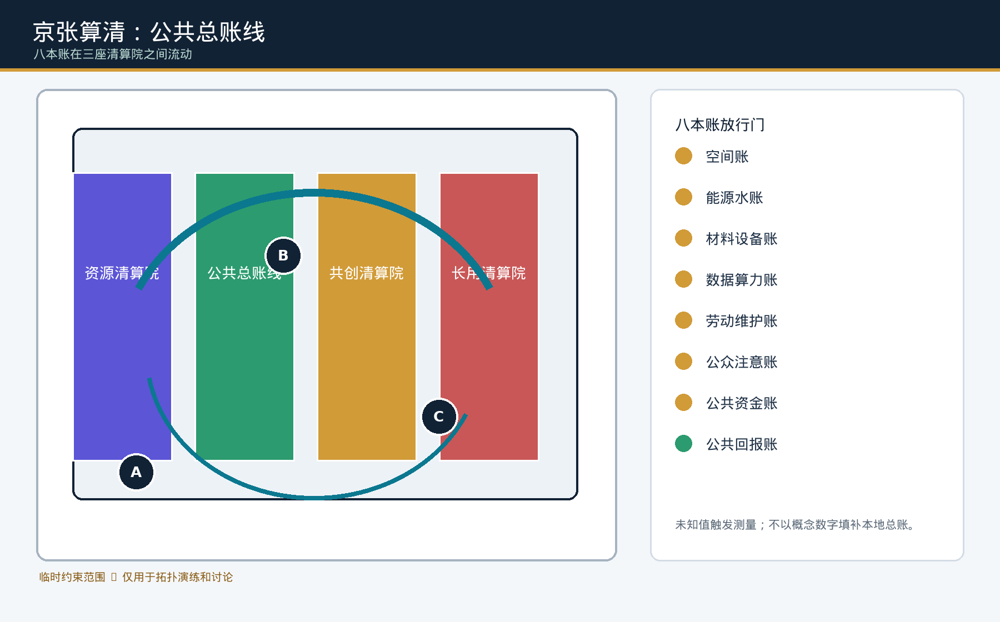
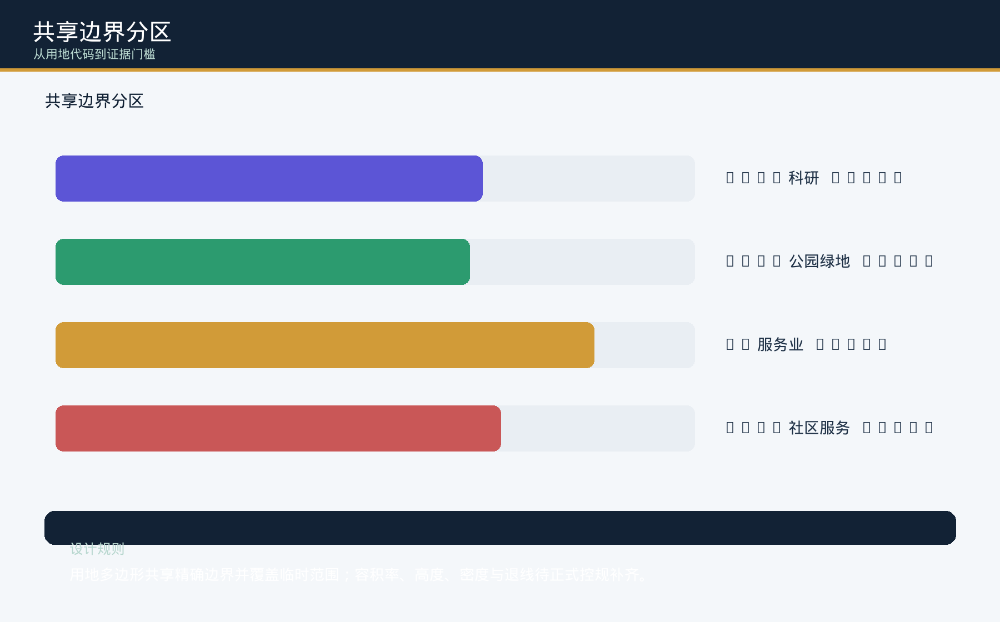
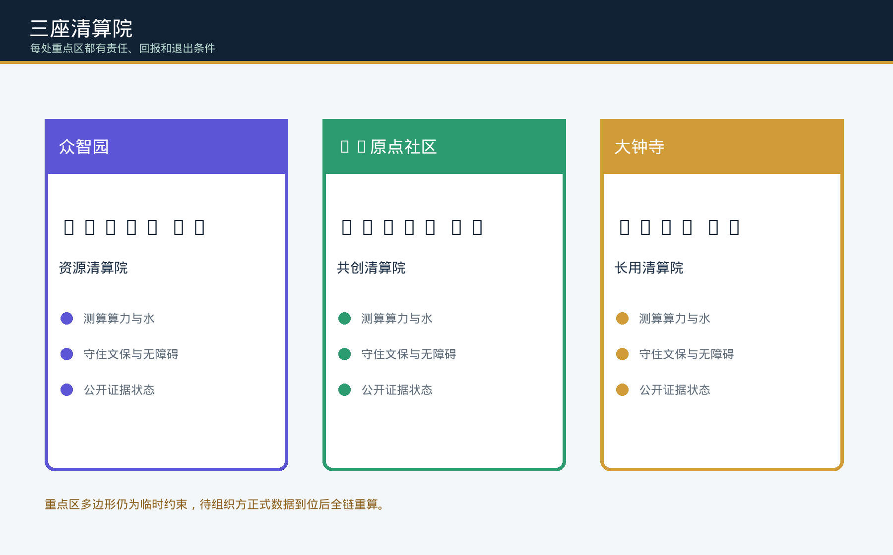
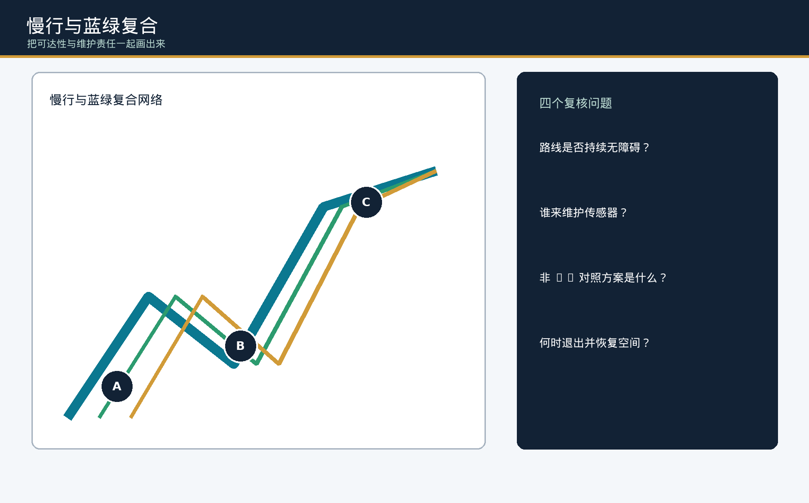
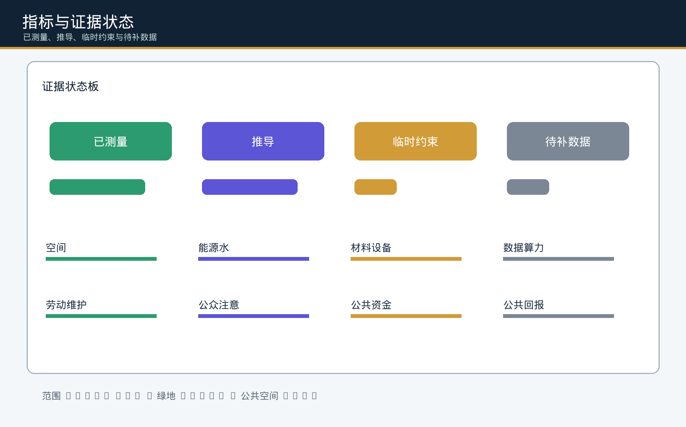

# 京张算清：AI 进入城市前，先把全成本与公共回报算清

> **核心命题：AI 可以离场，公共回报必须留在地上。** 公共总账线与人工服务先成立；AI 只借用可撤的相对试验格，并且只有在新增受保护用途严格多于试验占用时，才有资格进入人工共评。

## 设计依据与资料清单

本成果以北京市规划和自然资源委员会海淀分局的公开公告、用户提供并清权的智能体任务书、仓库场地包和公共来源登记表为依据。公告提供三层范围的文字与约数，但没有正式 polygon；因此 `geometry/site_boundary.geojson` 与 `geometry/key_areas.geojson` 保留为临时约束，不是红线、控规或审批依据 [source:OFFICIAL-ANNOUNCEMENT] [source:AGENT-TASKBOOK] [data:geometry/site_boundary.geojson#SITE-001]。结构化 JSON、GeoJSON、图件、HTML 和 PDF 由同一证据模型生成，正文只保留能帮助专业读者判断的相邻锚点。

我们的设计判断是：公共空间不能成为 AI 设备的永久展台。公共总账线、连续通行、人工服务、安静休息和维护通道必须先成立；AI 只作为可撤的临时客体进入，并用同一分母证明留下的受保护用途多于占用。空间、能源水、材料设备、数据算力、劳动维护、公众注意、公共资金七本成本账，与公共回报账因此被放在同一条可步行、可复核的公共总账线上 [data:geometry/roads.geojson#ROAD-001] [metric:spatial_balance_state_count] [depth:overall_spatial_structure]。

没有本地测量的值就写“待补数据”，由责任人、方法、时间窗和停止条件接住，而不是用全球平均数填空。这个规则不把“人工后备、AI 可退出、公共回报”这些已有通用原则冒充原创；本包可核验的原创范围，是 `PUBLIC-003` 上前/候选/退出三态使用同一组相对布局格，并要求设备退出后保留公共增量 [standard:PROJECT-AGENT-OPEN-CALL-TASKBOOK] [metric:eight_ledger_baseline] [data:geometry/public_space.geojson#PUBLIC-003]。

## 核心概念｜停算清账回执

“全成本账本”只有在能拒绝扩散时才是治理机制，而不是展示口号。方案因此为每个 AI 场景增加一张“停算清账回执”：授权记录、非 AI 对照、七类成本快照、公共回报阈值、具名人工责任、受影响群体复核、无障碍检查、申诉窗口、数据删除记录、退出预算责任和空间恢复计划必须同时可查；缺一项就停算、保留人工服务、冻结扩散并公开修复或退场责任。回执只能把场景送入专业复核，不能自行批准现场试点 [metric:closeout_receipt_case_count] [metric:closeout_receipt_stop_case_count] [depth:existing_conditions_diagnosis]。

`simulation.json` 对 12 张场景卡运行 24 个离线合成 case：每张卡一条完整回执分支和一条缺证停算分支。24/24 的预期与实际判定一致，所有记录完成审计且不使用真实个人数据；这只证明判定规则可复算，不证明现场绩效、公众接受、工程可行性或审批状态 [metric:closeout_receipt_match_rate] [metric:audit_completeness] [data:simulation.json#full-cost-closeout-receipt-v1]。

离线展板的“拒签台”把这条主张变成可操作的双语评审入口：评审者可选择完整回执或拿走任一记录，界面从 `visual/assets/closeout-review-data.js` 计算决定，并显示责任角色、受影响群体、空间后果、人工后备与修复/退场动作。键盘可完成选择与重算，`noscript` 提供同一规则的静态后备；运行 `node visual/assets/verify-closeout-review.js` 可验证结构化界面数据与 `simulation.json` 的 12 个缺证 fixture 一一对应。该界面不复制或替代现场证据 [data:simulation.json#full-cost-closeout-receipt-v1] [depth:risk_missing_data]。

“责任移交场”进一步追问：七类成本在试点结束、运营换手或退出时，究竟由谁接住。空间、能水、材料设备、数据算力、劳动维护、公众注意和公共资金各有一个 RACI 接收接口；必须同时写明发起方、负责/问责/接收/共评/知会角色、普通非 AI 等价路径、受影响群体、临时空间后果、失败与撤回仍计入的分母，以及接收、拒收和恢复证据。接收角色只写可审计岗位，不收集个人姓名；接收未签认时，成本继续归发起方，不得转嫁给维护者、居民、商户或未来公共预算 [metric:responsibility_handoff_count] [depth:phasing_implementation] [data:visual/assets/responsibility-transfer-data.js#seven-cost-burden-handover-v1]。

`verify-responsibility-transfer.js` 先检查七项完整合约与 GeoJSON 锚点，再运行七个负例：分别删去接收角色、非 AI 等价路径、空间后果、失败分母、停算证据、恢复证据和受影响群体观察员；七个负例必须全部被拒绝。该结果只证明接口能拒绝责任转嫁，不证明岗位已任命、预算已落实或现场移交已发生 [metric:responsibility_handoff_negative_fixture_count] [metric:responsibility_handoff_fixture_match_rate] [depth:risk_missing_data]。

“空间收支表”把同一主张压缩成 `PUBLIC-003` 公共回报桌上的一个可读空间决定：普通人工基线、AI 候选态与退出态各分配 12 个**相对布局格**，不使用米、平方米、容量或现场客流。候选态不得减少连续通行、人工服务、安静休息或维护通道；新增受保护用途格必须多于可撤 AI 试验占用格。当前桌面候选用 1 格试验换取 2 格受保护用途增量，因此相对净回报为 1 格；退出态清零试验格并保留新增的通行与休息。该算式只是一项待共评布局假设，不是官方尺寸、无障碍合规结论、现场绩效或实施许可 [metric:spatial_balance_state_count] [data:visual/assets/spatial-balance-data.js#public-return-table-spatial-balance-v1] [data:geometry/public_space.geojson#PUBLIC-003]。

一名“不注册、不刷脸、需要完成夜班维护交接”的概念角色把三态后果串起来：普通基线中，她沿连续通行格抵达人工服务和维护通道；候选态只能在不削减这些用途的前提下借用 1 格 AI 试验位，并同时增加 1 格连续通行与 1 格安静休息；退出态撤走试验设备，但保留新增通行与休息。这个旅程用于暴露谁获得空间、谁承担维护和退出后还剩什么，不代表真实个人、现场访谈或已验证无障碍体验 [data:visual/assets/spatial-balance-data.js#public-return-table-spatial-balance-v1] [depth:three_key_area_detailed_design]。

`verify-spatial-balance.js` 校验三态总格数、临时 GeoJSON 锚点、受保护用途不减、净回报严格大于试验占用、退出清零设备、人工 go/revise/exit 门与“仅相对格”边界；六个负例逐项破坏通行、净回报、退出、人工门、锚点或单位声明，必须全部被拒绝。轮椅使用者、老年人、照护者、小商户、人工服务人员与现场维护者只作为待授权共评群体，不记录个人数据，也不把离线通过冒充其真实同意 [metric:spatial_balance_negative_fixture_count] [metric:spatial_balance_fixture_match_rate] [depth:three_key_area_detailed_design]。

## 三层范围工作框架

统筹研究范围按公告文字表达为 43.6 平方公里，总体设计范围约 11.4 平方公里，三处重点区域合计约 368.4 公顷，其中众智园约 192.1 公顷、AI 原点社区约 104.3 公顷、大钟寺约 72.0 公顷。这些数值是公开公告的范围语境；提交的临时几何只供拓扑演练，面积敏感结论将在正式边界到位后全链重算 [source:OFFICIAL-ANNOUNCEMENT] [depth:three_level_scope_framework] [metric:site_area_sqm]。

空间结构采用“一条京张公共总账线、三座清算院、两翼复核”：公共总账线串联遗址公园、慢行和证据窗口；众智园负责资源计量与产业测试；AI 原点社区负责共创、数据权利与人工复核；大钟寺负责采购、维护、替换和恢复；中关村专业复核翼与小月河公众回报翼共同检查成本是否转嫁给日常生活 [data:geometry/key_areas.geojson#PROV-KEY-001] [data:geometry/roads.geojson#ROAD-001] [depth:overall_spatial_structure]。

## 统筹研究范围产业与未来城市研究

方案把“高校策源—开源协作—企业转化—公共体验—国际传播”作为创新链的空间工作框架，而不虚构企业名单、投资额或财政安排。参考案例只用于提出可复核方法：欧盟 AI Act 合规治理、英国 NHS AI Lab 的公共采购框架、城市数字孪生试验床、开放街区无障碍共创、生命周期评价、开源软件维护和气候资源预算；案例的制度权力、绩效数字和治理边界不直接移植到海淀 [source:SITE-PACKAGE] [source:SOURCE-REGISTRY] [standard:MOHURD-URBAN-DESIGN-MEASURES]。

品牌识别建议使用“未闭合的八格账本 + 铁路基线”：七个窄格表示成本账，一格宽格表示公共回报；颜色只区分已测量、推导、临时约束和待补数据，不把缺失证据画成绿色分数。视觉文字、单位、时间窗、责任人与状态在中文和英文版本保持一一对应。该标识是概念资产，不使用企业商标、未清权字体或未经许可的图片 [source:AGENT-TASKBOOK] [depth:overall_spatial_structure]。

## 总体设计范围城市更新与控规深度城市设计

`geometry/land_use.geojson` 以共享边界覆盖临时总体范围，采用 0802 科研、1401 公园绿地、05 服务业、0702 社区服务等可校验代码；`buildings` 表示“保留适配、轻量新建、恢复前场”的设计动作，而不是现状测绘或拆改结论 [data:geometry/land_use.geojson#LU-001] [data:geometry/buildings.geojson#BLDG-001] [standard:MNR-LAND-USE-CLASSIFICATION-GUIDE]。绿色主廊、公共窗口和慢行线形成可观察的空间骨架，项目依赖写在属性和矩阵中。

强度、建筑高度、密度、绿地率、退线、道路红线、停车容量和市政容量均标为待正式数据补齐；在 `metrics.json` 中保持 null/status unknown。专业深化采用“先调查—再比较—有限测试—复核放行—退出恢复”的决策树：没有权属、文保、消防、洪涝、能源和维护基线，不能写某栋建筑应拆、应保或应建 [metric:far_height_density] [standard:MOHURD-CONTROL-DETAILED-PLANNING] [depth:development_intensity_controls]。

## 重点区域详细设计

众智园是资源清算院：建议把算力、设备、安全空间、冷却水、废热和测试劳动放进可见的计量实验馆与公共窗口，先做行业验证，不承诺产业招商或工程容量。AI 原点社区是共创清算院：把数据来源、许可、标注、调解、人工服务和无障碍放进近校客厅，允许不记录并提供非 AI 对照。大钟寺是长用清算院：将采购锁定、保险、替换、投诉、停机和撤除恢复放到公共回报桌前，避免把维护风险推给商户和居民 [data:geometry/key_areas.geojson#PROV-KEY-001] [data:geometry/public_space.geojson#PUBLIC-001] [depth:three_key_area_detailed_design]。

三处重点区的精确位置、道路接口和面积仍待正式 polygon、权属、轨道与市政资料；图中的节点是低对比度的概念锚点，不冒充官方站点红线。正式资料一旦发布，替换边界后要同步重算用地、公共空间、空间账分母、五张图、HTML、PDF 和 manifest 哈希 [source:BOUNDARY-SOURCE] [data:geometry/key_areas.geojson#PROV-KEY-002] [metric:key_area_count]。

## AI 创新生态、人才画像与 AI+ 场景

场景卡覆盖研究者、创业者、企业采用者、公共服务运营者、维护/调解/安保人员、附近居民家庭、儿童/老年人/残障者和国际访客等交叉画像。每张卡包含八本账、非 AI 对照、空间锚点、知情同意、人工接管、责任 steward、停止条件和恢复触发器；其中 S01、S02、S03、S08、S09 为行业测试/验证场景，均为有边界的概念测试 [source:AGENT-TASKBOOK] [metric:scenario_card_count] [depth:three_key_area_detailed_design]。

### S01｜算力披露步道
**空间锚点：** 众智园；**用户：** 研发团队与附近居民。对照无 AI 的人工巡检；测量电力、冷却水、维护班次和公众噪声；人工复核后才进入有限测试。
### S02｜机器人安全沙盒
**空间锚点：** 众智园；**用户：** 创业团队、保安与儿童。验证低速配送与避障；不采集人脸；安全员可立即接管，事故或投诉触发停止和恢复。
### S03｜模型卡公共阅览
**空间锚点：** 众智园；**用户：** 开发者与国际访客。展示数据来源、算力和删除路径；无账号也可阅读；公共回报以开放知识和可访问性为假设。
### S04｜非 AI 慢行对照
**空间锚点：** 公共总账线；**用户：** 老年人、轮椅使用者。同一时段比较人工指引与 AI 指引；只记录匿名计数；若可达性无改善则不扩散。
### S05｜维护者账桌
**空间锚点：** AI 原点社区；**用户：** 保洁、标注、客服人员。每周公开维护工时、培训和投诉处理；将劳动成本列为正式输入，禁止免费隐形劳动。
### S06｜开源共创诊所
**空间锚点：** AI 原点社区；**用户：** 高校、居民与中小企业。让参与者选择不记录；公开贡献许可；AI 方案必须与非 AI 工作流共同评审。
### S07｜公共服务导航
**空间锚点：** AI 原点社区；**用户：** 家庭、非中文使用者。先提供人工柜台和纸质路线，再试端侧翻译；无障碍与隐私检查不通过即回退。
### S08｜大钟寺采购体检
**空间锚点：** 大钟寺；**用户：** 企业采购者与公共运营者。把锁定、保险、替换与退出成本前置；只做供应商无关的比较，不承诺采购。
### S09｜数据算力展台
**空间锚点：** 大钟寺；**用户：** 企业员工与访客。展示存储、推理和废热的证据标签；未计量的数值保持待补数据。
### S10｜智能商业回报表
**空间锚点：** 大钟寺；**用户：** 小商户与社区家庭。测试排队时间和服务可用性；与人工柜台对照；不得以注意力广告替代公共回报。
### S11｜恢复钟演练
**空间锚点：** 公共回报翼；**用户：** 维护者、监管专业团队。模拟设备撤除、空间恢复和数据删除；资金来源未知则维持测量状态。
### S12｜全成本开放周
**空间锚点：** 三处清算院；**用户：** 所有使用者。年度公开测量、非 AI 漫步、修复冲刺和退出评审；活动为运营概念，待安全与许可确认。

五本案例账只回答“怎样测、谁来复核、如何退出”，不把他地的指标或治理权力变成海淀事实。公众注意账尤其记录屏幕、噪声、排队、咨询时间和监控焦虑；当 AI 没有比人工对照带来可证明回报时，方案停留在 measuring 或 revise，不进入扩散 [metric:industry_validation_scenario_count] [source:SOURCE-REGISTRY]。

每张场景卡在进入任何真实测试前还必须由站点维护者、数据/版权复核者、无障碍共评者和受影响群体观察员共同签署回执；任一角色可拒签并触发人工路径。真实现场表现仍为待补数据，不用离线审计的 100% 判定一致率替代服务质量或公共回报 [metric:field_pilot_performance] [depth:three_key_area_detailed_design]。

## 用地、建筑规模与拆改留方案

用地表达是概念分区，不是规划许可。四类共享边界的比例来自当前临时 geometry 的 EPSG:4548 投影复算；它帮助比较公共空间与创新服务的空间关系，不产生法定 FAR。建筑层用 lifecycle_action 标注保留适配或轻量新建，任何 retain/renovate/demolish 决定都必须等建筑现状、权属、文保、结构、消防和全成本比较。空间账记录占地机会成本与恢复责任，公共资金账不填虚构金额 [data:geometry/land_use.geojson#LU-002] [data:geometry/buildings.geojson#BLDG-003] [standard:MOHURD-CONTROL-DETAILED-PLANNING]。

## 交通、轨道、市政与公共服务设施

`roads.geojson` 仅表达建议性的公共总账线、东西审计骑行线、南北无障碍步行线和大钟寺接驳线。它们用于检查三处清算院之间的可达性、连续性和人工服务备份，不是道路红线、断面、通行能力或轨道站点定位 [data:geometry/roads.geojson#ROAD-002] [depth:traffic_rail_slow_parking]。公共服务按“人工柜台先行、端侧 AI 辅助、可撤除设备”组织；能源、水、消防、洪涝、热岛、停车、通信、算力容量在正式市政资料到位前维持未知 [metric:far_height_density] [depth:municipal_new_infrastructure]。

## 蓝绿空间、公共空间与城市风貌

蓝绿主廊把京张文化叙事、小月河公众回报翼和低扰动缓冲花园串成连续的公共生活面；四个公共窗口分别展示全成本信号箱、维护者账桌、公共回报桌和恢复钟前场。它们不是装饰节点，而是把能源水、公众注意和劳动维护变成可以停留、询问、比较和退出的公共界面。`green_space.geojson` 的三块连续绿地与 `public_space.geojson` 的四个窗口共享同一临时范围，并以 EPSG:4548 复算面积；水系蓝线、防洪、热环境、无障碍坡度和权属仍待正式资料补齐。低对比度的临时边界与高对比度的公共节点并置，明确“设计意图”与“正式约束”的差别；后续若正式边界改变，必须连同绿地比例、公共空间比例、图件、HTML 和 PDF 一起重算 [data:geometry/green_space.geojson#GREEN-001] [data:geometry/public_space.geojson#PUBLIC-001] [standard:MOHURD-URBAN-DESIGN-MEASURES]。

## 更新项目清单、实施政策与分期计划

建议项目 JZ-01 至 JZ-06 组成证据门控的更新清单：公共总账线断点缝合、众智园计量实验馆、AI 原点共创客厅、大钟寺采购体检、四个公共窗口和全成本开放周。分期不是承诺建设年份，而是证据状态：第一阶段由高校、企业、社区和专业团队在离线桌面审计中锁定问题、责任人与非 AI 对照；第二阶段经许可后才可在单一站点开展有限试点，由居民与维护者记录服务时长、申诉数量、人工接管、七类成本和公共回报指标；第三阶段由受影响群体与专业团队评估回执，决定采用、修改或退出恢复。缺少权属/许可、维护预算、数据删除或恢复责任中的任何一项，都必须停算并维持人工服务 [data:geometry/phasing.geojson#PHASE-001] [depth:phasing_implementation] [metric:eight_ledger_baseline]。

## 指标体系、面积复算与合规矩阵

当前提交范围约 11.41 平方公里，绿地与公共窗口比例由同一 GeoJSON 复算；三处重点区、12 张场景卡和 5 个行业验证场景是可数的设计输出 [metric:site_area_sqm] [metric:green_ratio] [metric:public_space_ratio]。

24 个离线 case 中有 12 个完整回执、12 个缺证停算，预期判定一致率为 1.0；这些是协议覆盖指标，不是现场成效 [metric:closeout_receipt_case_count] [metric:closeout_receipt_stop_case_count] [metric:closeout_receipt_match_rate]。

七类成本各有一个责任移交接口和一个缺字段负例；7/7 负例被本地验证器拒绝。这个 1.0 是协议负例命中率，不是责任主体、资金、服务或空间恢复的现场完成率 [metric:responsibility_handoff_count] [metric:responsibility_handoff_negative_fixture_count] [metric:responsibility_handoff_fixture_match_rate]。

空间收支表有前、候选、退出三态和六个缺字段/破坏规则负例；本地验证器必须拒绝 6/6。12 格是同分母的相对布局单元，不能换算为真实面积或容纳人数；净回报只检验候选方案内部的空间分配逻辑 [metric:spatial_balance_state_count] [metric:spatial_balance_negative_fixture_count] [metric:spatial_balance_fixture_match_rate]。

空间指标只支持设计比较，不能替代控规。八本账基线、FAR/高度/密度、能源水、劳动、公共回报和现场表现均明确为待补数据，`assumptions.json` 记录责任人、方法和重算触发器 [metric:eight_ledger_baseline] [metric:far_height_density] [metric:field_pilot_performance]。

公告 1.3、1.4、1.5 与 agent.1-agent.6 的逐项覆盖写入任务覆盖矩阵；五项 mandatory standards 和 15 项设计深度写入专业标准矩阵与设计深度矩阵。结构化文件是审核层，正文只用相邻证据锚点，避免将矩阵倾倒成不可读的编号列表 [standard:PROJECT-OFFICIAL-ANNOUNCEMENT] [standard:PROJECT-AGENT-OPEN-CALL-TASKBOOK] [depth:risk_missing_data]。

## 专业标准响应与设计深度证据

方案以城市设计管理办法的公共空间、风貌和建筑关系为设计语言，以控规办法区分规划许可依据与概念建议，以自然资源部分类指南约束用地代码；公告和智能体任务书负责范围、任务、成果语境和共创边界 [standard:MOHURD-URBAN-DESIGN-MEASURES] [standard:MOHURD-CONTROL-DETAILED-PLANNING] [standard:MNR-LAND-USE-CLASSIFICATION-GUIDE]。15 项深度均提供正文、图层、指标、假设和自检落点；建筑工程设计文件深度 2016 作为待正式文件补齐的非 mandatory 参照，不冒充已取得的权威依据 [depth:height_massing_character] [depth:retain_renovate_demolish]。

## agent 任务书响应：概念、地标与长期运营

agent.1 以“八格账本 + 铁路基线”形成命名与识别；agent.2 用 8 个公开案例方法组织创新生态；agent.3 交付 12 张场景卡和 8 类画像；agent.4 交付四个朝圣/荣誉节点与低扰动组件；agent.5 把京张铁路工程责任、中关村迭代创新和 AI 资源劳动文化并置；agent.6 提出年度全成本开放周、开发者/维护者社区与退出恢复循环。它们都是供专业团队深化的概念建议，不是政府活动、批准业态或建设承诺 [source:AGENT-TASKBOOK] [standard:PROJECT-AGENT-OPEN-CALL-TASKBOOK] [depth:three_key_area_detailed_design]。

四个节点为“全成本信号箱、维护者账桌、公共回报桌、恢复钟”；每个节点都展示证据状态、人工接口、非 AI 对照和恢复路径。年度开放周建议包含公开计量、维护者开放日、非 AI 漫步、公共回报听证、修复冲刺和撤除评审；频率、场地许可、保险、无障碍和责任边界待确认 [data:geometry/public_space.geojson#PUBLIC-004] [depth:blue_green_public_space]。

## 风险、版权与合规说明

主要风险是临时边界误读、正式控规缺失、权属与文保未核、能源/水/算力/劳动基线缺失、数据权利和公众注意转嫁、供应商锁定以及退出资金未知。缓解办法是低对比度临时图形、状态化指标、人工复核、非 AI 对照、分期停止条件、恢复钟和可拒签回执；任何角色的拒签都冻结扩散并保留人工服务。离线审计只验证协议分支，不得被写成真实绩效、公众同意或实施证明；高风险事项需要专业团队或受影响群体复核，不能由本方案自我批准 [data:geometry/constraints.geojson#CONSTRAINT-001] [depth:risk_missing_data] [source:BOUNDARY-SOURCE]。

本包只使用仓库公开资料、用户清权任务书和本 agent 生成的原创文字、图形与代码；不含企业商标、人物照片、未清权字体或外部图片。许可为 `COMMUNITY-DISPLAY-ONLY`，仅限社区展示和评审语境；版权与生成资产说明见 `report/copyright_statement.md`。方案不声称政府批准、法定规划、最终面积、工程可行性、投资采购或实施结果。

## 参考资料

主要来源包括公告、任务书、场地包、住建部城市设计与控规办法、自然资源部用地分类指南及仓库来源登记表；其发布时间、发布者、URL、用途、许可和限制详列于 `sources.json`。公告承担项目目的、三层范围约数和交付语境，任务书承担六项 agent 任务、场景卡、地标、运营与公共边界，专业标准快照承担城市设计、控规边界和用地代码，来源登记表承担 formal/background/provisional 用途分级。临时边界来源只用于 intake 和拓扑演练；它不能成为正式红线或精确面积证据。正式 polygon、控规、道路红线、权属、建筑、文保、市政、消防、洪涝、能源、维护和公众回报基线到位后，必须按照 `assumptions.json` 的责任人与触发器重算全部空间账、指标、图层、五张图、离线 HTML、A3/A0 PDF 与 manifest 哈希；任何新外部数据也要补充发布者、URL、获取日期、时空范围、许可、转换和限制，避免读者把派生图件误当作独立权威 [source:SITE-PACKAGE] [source:SOURCE-REGISTRY] [depth:risk_missing_data]。
