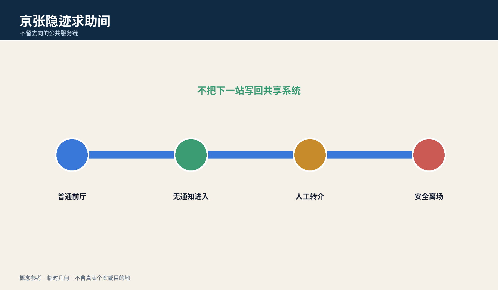
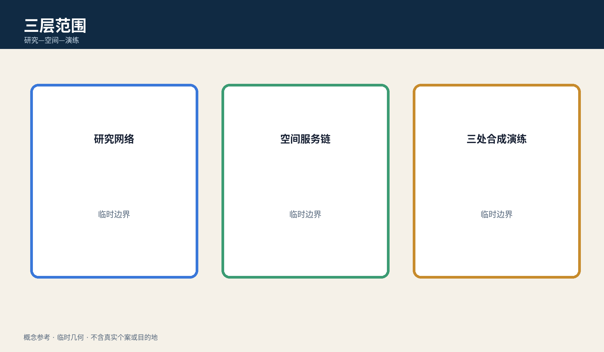
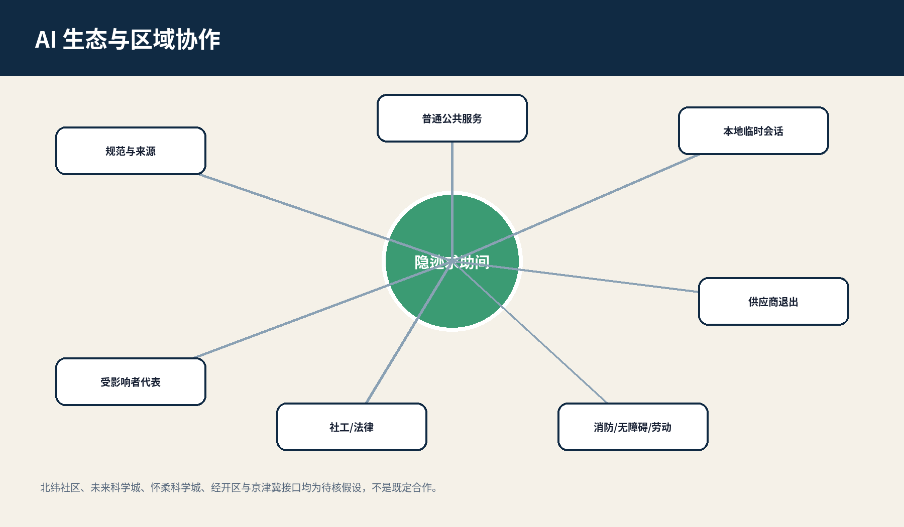
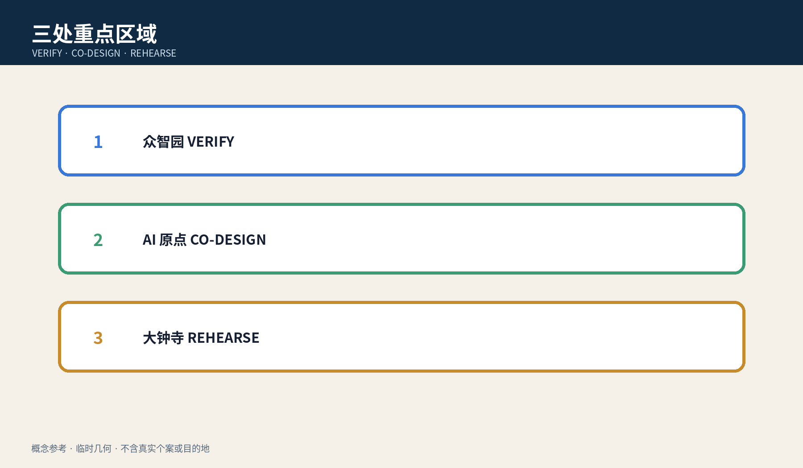
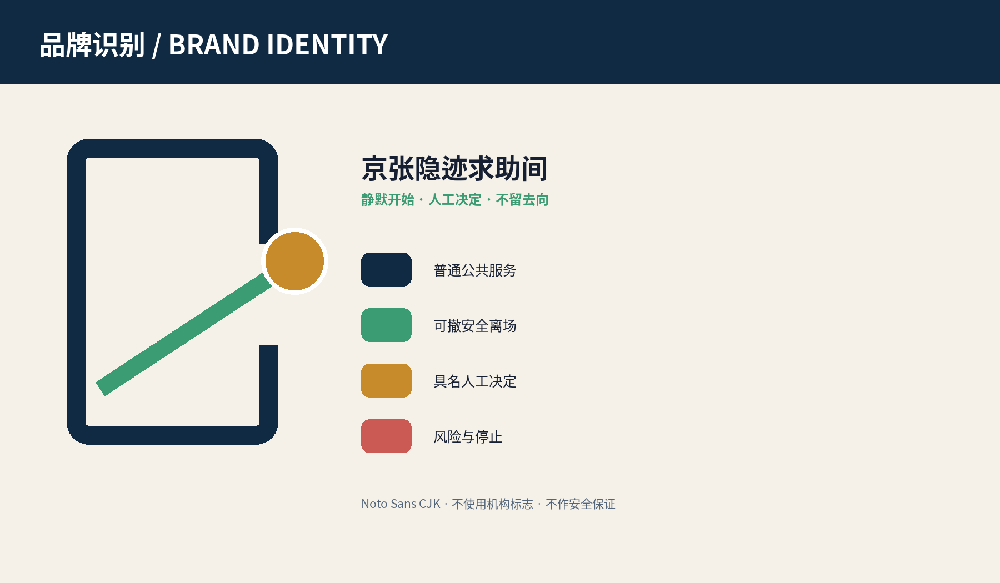
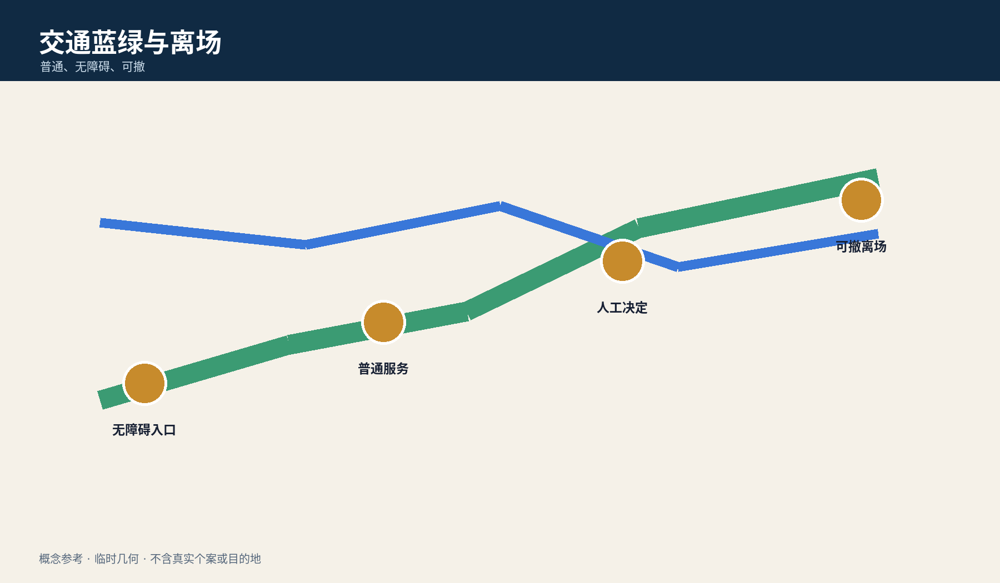
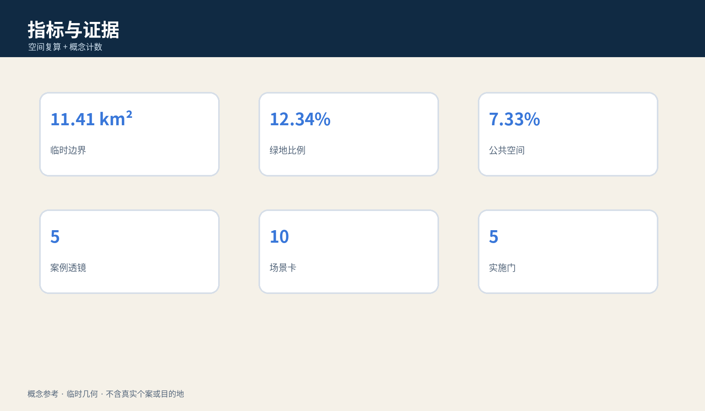

# 京张隐迹求助间 / JINGZHANG HIDDEN HELP ROOM

> 不用账号开始、不让通知暴露入口、由具名专业人员决定转介，离场时不把下一站写回共享系统。

**边界声明：**全包采用临时粗略、低置信、非官方几何；这是供专业团队和受影响者代表深化的概念参考，不识别真实个案、不提供安全保证、不替代法定应急或记录程序。

## 设计依据与资料清单

方案以官方公告、智能体任务书、公共来源登记、专业标准本地快照和临时几何为依据。公告支撑三层范围和任务，任务书支撑 agent.1—agent.6；这些材料不授权具体位置、安防、消防、权属、危险判断或服务实施。正式边界、真实需求、保密留存、工作人员安全和转介协议均待专业确认。[source:OFFICIAL-ANNOUNCEMENT] [source:AGENT-TASKBOOK] [depth:existing_conditions_diagnosis]

五字段差异在于：服务对象是设备、账号或空间可能被威胁主体控制的人；完整任务是隐蔽发现—无通知进入—人工转介—不回写去向—安全离场；空间载体是普通前厅与多用途私密咨询室；决定者是本人及受保密约束的社工/法律援助人员；失败时停用 AI、转纸卡和电话，不生成目的地。

## 三层范围工作框架

统筹研究范围研究公共服务、专业机构、人才与文化网络；总体设计范围研究普通前厅、私密咨询、慢行和退出；三处重点区只承担合成演练和概念验证。它们不是同一方案的缩放图，而是分别记录来源、人工决定、失败结果和数据缺口。官方 polygon 到位后全部重算。[data:geometry/site_boundary.geojson#SITE-001] [metric:key_area_count] [depth:three_level_scope_framework]

空间最小链为“多用途普通前厅—非识别纸票—声学缓冲—私密咨询—人工转介—安全离场”。外部只标“私密咨询”，并同时服务一般法律、健康、就业等任务，使排队本身不暴露求助类别。

## 统筹研究范围产业与未来城市研究

隐迹求助间是一种跨专业城市能力，不是一家厂商的“受害者识别”产品。上游包括公共选项、无账号会话、纸卡、声学与无障碍；中游包括社工、法律援助、隐私记录、消防安防和劳动能力审查；下游包括合成演练、去标识失败回执、退出条款与受影响者评议。中关村翼提供清权规范，小月河翼只测试普通入口与无障碍到达。[depth:ai_ecosystem_case_studies] [source:SOURCE-REGISTRY]

五个案例透镜只做机制比较：数据最小化、地址保密、通用型私密咨询空间、人工转介、供应商退出；不把国外制度或单一技术移植为本地法律。三项产业验证分别检查通知/历史写回、共享账号代理索取记录、断网与工作人员缺席。

生态图把公共服务运营方、受保密约束的社工/法律援助角色、隐私与记录专业者、消防安防、无障碍与劳动安全、端侧会话工具和受影响者代表串成“规范—空间—演练—复核—退出”链。区域协作只提出待核接口：北纬社区可验证日常社区入口，未来科学城/怀柔科学城可提供安全与人因研究方法，经开区可验证设备和供应商退出，京津冀节点可比较跨地转介中最小记录；在取得平台、交通、合作机制和权利依据前，不写成已建立合作。[metric:case_study_count] [standard:PROJECT-AGENT-OPEN-CALL-TASKBOOK]

## 总体设计范围城市更新与控规深度城市设计

总体结构是一条“不留去向”的公共服务链、三处合成演练场和两翼专业支撑。近期只做资料核对、1:1 无真实服务原型和受影响者共创；中期仅在消防、安防、无障碍、隐私、保密留存、值班和转介责任全部明确后讨论非真实个案展示。任何真实服务都需另立项目并重新审批。[data:geometry/land_use.geojson#LU-001] [depth:overall_spatial_structure] [standard:MOHURD-CONTROL-DETAILED-PLANNING]

用地、建筑、道路、绿地和公共空间只表达任务邻接，不是现状调查、红线或工程方案。若无法保证私密、值班角色缺席、记录隔离失败或安全联系方式未确认，立即停止 AI 会话。

## 重点区域详细设计

众智园 VERIFY 用合成共享设备检查通知、历史和跨系统写回；AI 原点社区 CO-DESIGN 测试普通前厅、多用途私密咨询与无障碍可发现性；大钟寺 REHEARSE 测试轨道到达、翻译、无手机、工作人员缺席和供应商退出。共同验收标准不是“识别准确率”，而是本人能否不暴露入口完成选择、人工决定是否具名、失败能否转纸面并安全退出。[data:geometry/key_areas.geojson#PROV-KEY-001] [metric:industry_test_count] [depth:three_key_area_detailed_design]

## AI 创新生态、人才画像与 AI+ 场景

agent.1 提交命名、视觉识别、三定位五功能和三区两翼；agent.2 提交五案例透镜、生态图与三项合成测试；agent.3 提交六类 persona、十张场景卡与场景—空间—运营映射；agent.4 提交三个地标和六类组件；agent.5 提交铁路冗余、普通前厅和静默退出的文化叙事；agent.6 提交季度演练、半年共创、年度论坛和持续退出台账。[standard:PROJECT-AGENT-OPEN-CALL-TASKBOOK] [metric:scenario_card_count] [metric:persona_count]

六类 persona 是：共享手机使用者、无自有设备者、未成年人、需要翻译/无障碍者、陪同照护者、一线值班人员。不得据此推断谁是受害者或施害者。

十张场景卡为：1 无账号查看公开资源；2 共享手机同步预警；3 家庭代理人索取记录；4 本人无手机；5 翻译与易读；6 本人选择纸面带走/销毁；7 专业人员形成法定最小记录；8 工作人员缺席；9 供应商宕机；10 服务结束后的安全离场。AI 只展示已审核公开选项、做语言转换、检查是否写入共享历史并在人工确认后清空本地会话。

### agent.1｜品牌、总体概念与协同回路

主名“京张隐迹求助间”与英文名 `JINGZHANG HIDDEN HELP ROOM` 只描述“不留数字去向”的空间任务，不把风险人群做成标签。Logo 由两片深蓝普通门框、一道绿色离场线和一个不闭合的金色节点组成：门框表示普通公共服务，绿线表示可撤离场，缺口表示 AI 不封闭人的选择。主色 `#102A43`、服务绿 `#3B9B73`、人工决定金 `#C78B2C`、风险珊瑚 `#CC5A54`；标题使用开源 Noto Sans CJK，禁止使用机构商标、人物或“安全保证”标语。三大定位分别把铁路冗余转为公共服务后备、把都市 AI 体验转为无账号可用、把融合创新转为跨专业退出能力；五大功能通过规范、专业网络、合成场景、普通城市服务和公开失败回执闭环。三区分别承担 VERIFY、CO-DESIGN、REHEARSE，两翼提供清权规范和普通到达体验。[standard:PROJECT-AGENT-OPEN-CALL-TASKBOOK] [depth:overall_spatial_structure]

### agent.2｜五案例透镜、要素与三项产业验证

五个案例不是企业榜单：C1 数据最小化检查字段与保留期；C2 地址保密检查去向是否跨系统暴露；C3 通用私密咨询检查门牌、排队与声学；C4 人工转介检查角色、最小记录和中止；C5 供应商退出检查本地清除、未结事项和普通服务恢复。土地仅使用普通、可撤房间；资金只讨论原型成本级别待询价；人才包括社工、法律、隐私、无障碍、消防安防和一线值班；算力限本地临时会话；数据限合成案例；场景以三项测试为准。T1 用共享手机检查通知/地图/日历写回，T2 用代理索取记录检查权限与审计，T3 用断网、缺员和供应商退出检查纸卡/电话路径。任一测试出现真实个案、目的地泄露或无人接班即 `STOP`。[metric:industry_test_count] [source:SOURCE-REGISTRY]

### agent.3｜六类 persona、十场景与运营阈值

每张卡包含服务对象、空间、人工决定、AI 禁止角色和失败结果。普通前厅接待与私密咨询采用相同无障碍标准；共享手机场景默认关闭通知预览；代理索取记录必须由受保密人员核对适用程序；翻译不得自动发送；工作人员缺席时入口只显示“服务暂停”和公开资源；供应商宕机时纸卡、电话和人工咨询继续。成功阈值是十个合成场景均不向共享系统写入目的地、每次记录都有具名人工决定、停止后普通服务可继续；该阈值不外推真实安全。[metric:scenario_card_count] [metric:persona_count]

### agent.4｜公共空间、三个地标与组件库

“静默门”以不闭合的绿线解释不写回；“人工决定桌”公开角色、保密边界和中止权；“清除回执灯”只显示本地会话已清除，不显示姓名、人数、原因或去向。六组件为多用途门牌、非识别纸票、声学缓冲、写入检查卡、人工转介卡、离场清除清单。它们全部可移动、无远程脚本、无真实地图/案件；文保、绿地、交通和无障碍条件不明时不落地。[metric:landmark_count] [data:geometry/public_space.geojson#PUBLIC-001]

### agent.5｜文化叙事、导视与国际文案

文化叙事不把苦难做成景观。京张铁路的双线、备援和人工值守被转译为“系统退出后普通服务仍在”；中关村的开放协作被转译为公开规范、合成失败和可撤版本；AI 新文化强调“不知道一个人的身份，也能把公开选择讲清楚”。导视分三层：城市层只写“私密咨询”，室内层用四步图示，工作层显示具名角色和停止条件。国际文案固定为 `Start quietly. Decide with a human. Leave no destination behind.`，不得翻译为避法、秘密庇护或官方安全承诺。[source:AGENT-TASKBOOK] [depth:height_massing_character]

### agent.6｜年度活动、开发者社区与长期退出

Q1/Q3 合成压力测试检查通知、代理、断网和清除；Q2/Q4 由受影响者代表与一线人员审查可发现性、误导和工作负荷；年度论坛只发布清权规范、合成失败和退出案例；开发者社区只接收本地化、无远程依赖的写入检查与无障碍组件。场景开放采用 G0 资料/权利、G1 空间/消防、G2 隐私/法律、G3 人员/转介、G4 退出/复核五门；任何门 `HOLD` 不进入下一阶段。转化路径是“公开问题—合成原型—独立复核—有限展示—是否另立真实项目”，不承诺招商、资金或采购。[metric:implementation_gate_count] [depth:phasing_implementation]

## 用地、建筑规模与拆改留方案

四个连续分区只表达普通服务、京张公园、私密咨询/专业服务和社区支撑的邻接。建筑足迹是无真实个案的可移动原型包络，不代表现状或建设量。容积率、高度、密度、退线、结构、消防分区和权属全部待正式条件；拆改留仅采用“先核条件与权利、优先普通房间和可移动组件、条件不明不改不建不试”。[metric:building_footprint_area_sqm] [data:geometry/buildings.geojson#BLDG-001] [depth:retain_renovate_demolish]

设计意图是让求助任务借用一般服务空间，而不是建造一个可被识别的专门设施。`land_use.geojson` 的连续分区与 `buildings.geojson` 的概念包络共同检查空间链能否落在边界内；面积只验证提交拓扑，不证明房间存在、可取得或满足隔声。正式深化必须增加房间净尺寸、声学、视线、门禁、疏散、消防、无障碍、产权和一线人员安全调查，并由受影响者代表检验“多用途”是否反而让入口难以发现。任何一项未确认，都保持普通人工咨询现状，不进入拆改、新建或真实个案测试。

## 交通、轨道、市政与公共服务设施

道路层是任务关系，不是道路红线。普通路径保证无手机、无账号者可到人工界面；AI 线必须可撤且不得阻断纸面/电话路径。轨道接驳、过街、停车、消防救援、疏散和夜间安全均待专业复核。市政只建议本地临时会话、物理断开、纸卡、电话和最小日志；真实容量需以排班、峰值、替班和恢复对账证明。[data:geometry/roads.geojson#ROAD-001] [depth:traffic_rail_slow_parking] [standard:MOHURD-URBAN-DESIGN-MEASURES]

## 蓝绿空间、公共空间与城市风貌

蓝绿慢行不是“秘密路线”，而是普通、无障碍、可撤的公共路径；不显示转介目的地，不发布小样本人次。三个概念地标为“静默门”（解释不写回）、“人工决定桌”（显示角色和中止权）、“清除回执灯”（只显示会话已清空，不显示人或去向）。荣誉墙只展示清权规范、合成测试与版本贡献，可撤署名保留去标识事实。[data:geometry/green_space.geojson#GREEN-001] [data:geometry/public_space.geojson#PUBLIC-001] [depth:blue_green_public_space]

组件库包括多用途门牌、非识别纸票、声学缓冲、屏幕写入检查卡、人工转介卡和离场清除清单；均为参考组件，须经受影响者和专业团队审查。

## 更新项目清单、实施政策与分期计划

JZ-01 核对公共服务/保密/应急程序；JZ-02 搭建无真实个案 1:1 空间原型；JZ-03 完成共享设备与通知写回合成测试；JZ-04 完成受影响者代表、社工、法律、隐私、消防安防和劳动复核；JZ-05 仅在全部关键项关闭后讨论有限展示；JZ-06 可在任何阶段触发退出。退出时停用智能层、按适用依据处置日志、交接未结事项、保留普通人工咨询。[data:geometry/phasing.geojson#PHASE-001] [depth:renewal_project_list] [metric:implementation_gate_count]

年度运营包括季度合成压力测试、半年受影响者共创、年度可撤公共服务论坛和持续权利/版本台账；均是概念建议，不是政府活动、采购、投资或招商承诺。

## 指标体系、面积复算与合规矩阵

指标分三类：从 GeoJSON 在 EPSG:4548 复算的空间一致性数量；五案例、三测试、十场景、六 persona、三地标、五实施门等概念计数；仅用于合成演练的“共享系统零目的地写回”目标。known 不外推真实需求、容量、合法性或安全绩效。agent.1—agent.6 分别引用专属章节、图件、空间对象、指标、来源与输出；完整审计留在结构化文件。[metric:site_area_sqm] [depth:metrics_recalculation] [metric:case_study_count]

## 风险、版权与合规说明

主要风险为临时几何被当作红线；多用途标识导致入口不可发现；AI 推断危险或擅自报警；通知/地图/共享日历暴露去向；依法留存被误解为可规避；工作人员成为无限备用；供应商退出留下记录。控制为全包 provisional 警示、AI 禁止角色、具名人工决定、纸面后备、排班上限、退出清单和受影响者共创。所有文本、图件、HTML/PDF 和结构化设计由本 agent 生成；Noto CJK 字体依法嵌入，不含真实个案、地址、目的地或未清权品牌。[source:SITE-PACKAGE] [depth:risk_missing_data] [standard:PROJECT-AGENT-OPEN-CALL-TASKBOOK]

## 参考资料

完整出处、许可与限制见 `sources.json`、`standard_matrix.json`、`design_depth_matrix.json` 和 `report/copyright_statement.md`。官方公告支撑任务和范围；临时几何只支撑生成、可视化和讨论。[source:OFFICIAL-ANNOUNCEMENT] [source:SOURCE-REGISTRY]

来源分级直接限制设计结论：官方公告和清权任务书可说明征集目标与交付要求；专业标准本地快照用于建立待核清单；provisional boundary 只能检查图层拓扑，不能支撑红线、精确面积、权属或工程结论。正文中的概念计数来自本包场景、persona、地标和 gate 的人工清点，不是城市现状统计。若正式 polygon、控规、市政、文保、消防、安防、真实服务需求或适用法律程序更新，应先登记来源、用途、许可、时间和限制，再重新生成 GeoJSON、metrics、图件、HTML 与 PDF；无法核验的材料保持待正式数据补齐，不升级为事实。
