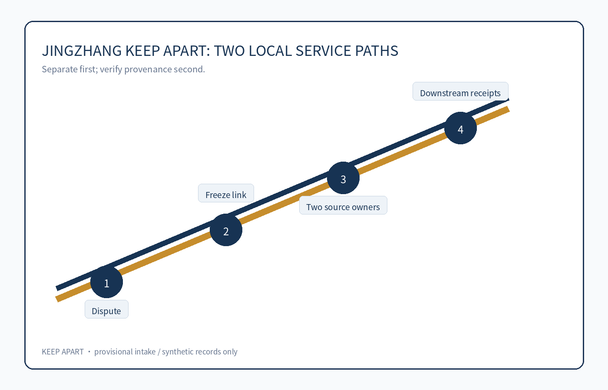
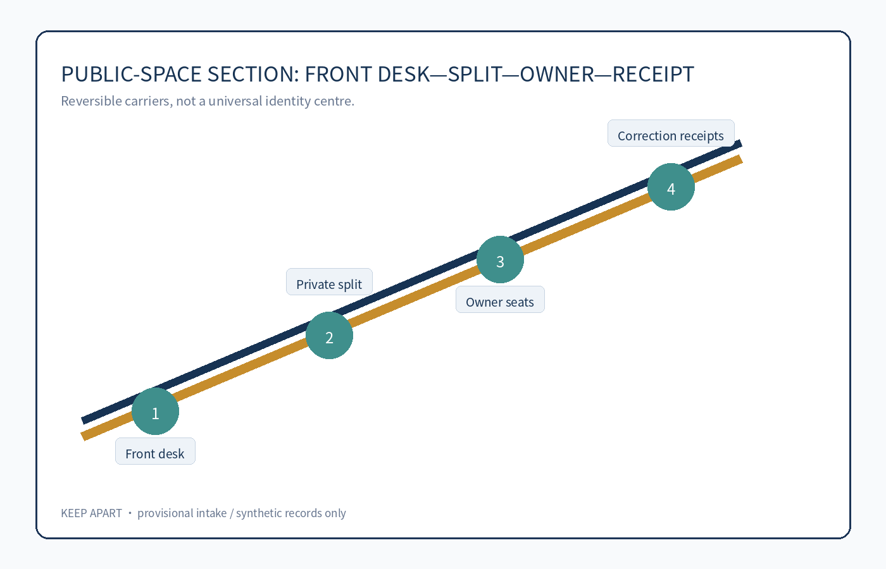
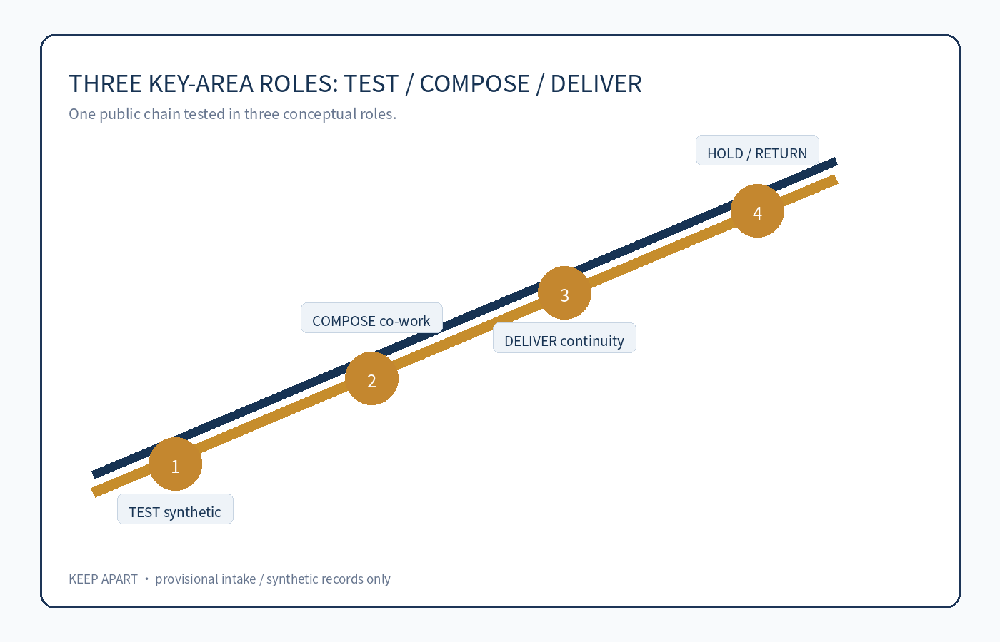
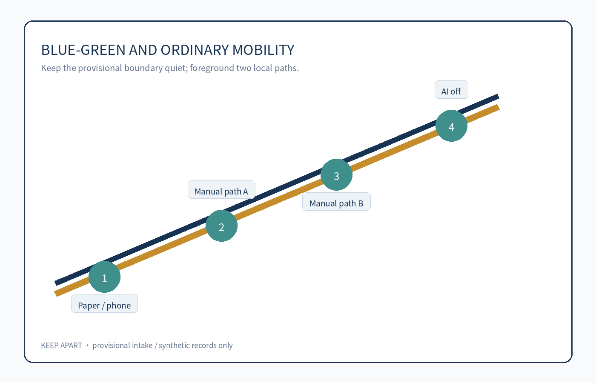
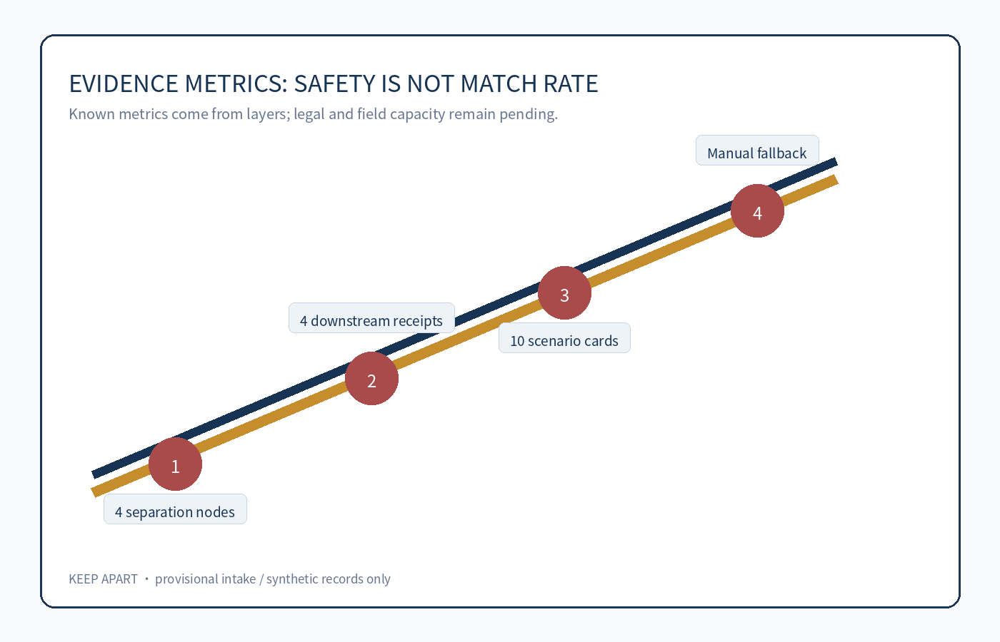

# JINGZHANG KEEP APART / 京张不并人

## Summary: Keep two paths when the machine is uncertain

This proposal addresses a narrow but serious public-service risk: two people can be merged by a system because of a shared name, shared contact, transliteration, name change, or an incorrectly associated device. A reused link can carry one person's missing documents, complaint, appointment, or risk signal into another person's service journey. [source:AGENT-TASKBOOK] [depth:public_interest]

The concept is not a universal identity centre or stronger authentication. It is a reversible spatial-service prototype: a person can say “this record is not mine”; a frontline worker freezes the disputed cross-service link and new automated actions without deleting either source record; each source-record owner checks only their own provenance; an independent reviewer decides whether to split or keep the records separate; known downstream recipients receive correction or withdrawal receipts; and both people retain local human, paper, and telephone service. [data:geometry/public_space.geojson#KEEP-APART-001] [metric:record_separation_node_count]

The safe default is temporary duplication rather than merging two people into one. AI may flag conflicts, draw an authorised data-flow map, and draft a downstream list for human editing. Paper provenance cards, separation receipts, and named service owners still work when AI is switched off. All spatial moves are conceptual suggestions for professional teams, not identity rules, administrative remedies, approvals, or implementation commitments.

## Five-field public chain and minimum prototype

| Field | Verifiable definition | Public result after failure |
| --- | --- | --- |
| Problem and affected people | Two people's records were linked by name, contact, transliteration, or device clues; both people, carers, frontline staff, and service owners can be harmed. | Do not presume impersonation or fraud; do not require face, voice, gait, or family graphs. |
| End-to-end task | Dispute → freeze the link and new automation → two source owners check provenance → split or stay separate → send downstream corrections → each service owner decides separately. | If unresolved, stay separate and stop new propagation; the disputed link cannot be the sole basis for denial, penalty, eligibility, or credit. |
| Spatial carrier | Ordinary front desk, camera-free private separation room, two source-owner seats, and local service desks. | No universal identity centre; provisional polygons do not name real institutions or counters. |
| Named decision or right | The person raises the dispute; each source owner checks its own record; the service professional decides the matter; an independent reviewer handles link disputes. | AI, a vendor, a front desk, or the other person cannot declare identity, merge/delete records, or decide the matter alone. |
| Exit result | Disconnect the shared matching layer, hand back lawful local records and an open correction list, and restore an ordinary privacy service room. | A high-risk matter may pause, but basic human, paper, and local service for both people must not disappear together. |

The synthetic red-team uses eight record pairs: same name and birthday, shared family phone, transliteration, name change, wrong device association, an offline source, a downstream adverse action, and vendor withdrawal. It checks freezing, privacy-safe summaries, itemised downstream receipts, and two local paths after AI shutdown—not match rate. [metric:record_separation_node_count] [metric:downstream_correction_receipt_count]

If a professional review finds that a safe summary is impossible, that separation requires biometric escalation, or that both basic services stop, the prototype enters `HOLD/RETURN` and never becomes a public-service pilot. [source:SYNTHETIC-PROTOTYPE-KEEP-APART] [depth:risk_missing_data]

## Design Basis and Source List

The package uses the official announcement, the cleared agent taskbook, the repository source registry, and the repository's provisional rough geometry. Only public or cleared materials are used; synthetic people and records are not real people, institutions, or field observations. [source:OFFICIAL-ANNOUNCEMENT] [source:AGENT-TASKBOOK] [source:SOURCE-REGISTRY]

The provisional boundary is an intake and discussion constraint only. It is not an official redline, ownership boundary, planning control, or precise area basis. Replace it with official polygons and recompute every geometry, metric, figure, drawing, and HTML view. [data:geometry/site_boundary.geojson#SITE-001] [metric:site_area_sqm]

## Three-Level Scope Framework

The coordinated research area frames an AI ecosystem that does not make residents default data sources. The overall design area turns the separation chain into readable public interfaces, ordinary service ground, and reversible rooms. The three key areas act as TEST, COMPOSE, and DELIVER: synthetic pressure testing, two-sided provenance work, and downstream correction with ordinary service continuity. [data:geometry/key_areas.geojson#PROV-KEY-001] [depth:three_level_scope_framework]

## Coordinated Research Area: Industry and Future City Research

The identity system is an operational boundary, not a decorative logo: two parallel rails stay apart at a human-review gate, and the gap marks a decision zone AI may not cross. Navy means public responsibility, mint means continuous ordinary service, and coral is reserved for `HOLD/RETURN`. The mark may never join the rails or use a face, fingerprint, eye, or identity-card symbol. Railway switching expresses reversible choice; Zhongguancun's open-source culture expresses auditable collaboration. [source:AGENT-TASKBOOK] [standard:PROJECT-AGENT-OPEN-CALL-TASKBOOK]

The three positions and five functions form one causal chain. The cultural belt contributes a “switch, do not lock” narrative; the AI life-experience belt makes human, paper, and telephone continuity visible; the fusion-innovation belt turns false merges, offline sources, and vendor exit into synthetic tests. Full-stack innovation produces open cases and protocols; the ecosystem joins privacy engineering, records stewardship, accessibility, service design, and red teams; AI+ scenarios host three validations; the vibrant city keeps two local service paths; governance publishes only de-identified receipts, failure conditions, and revocable protocols. [data:geometry/public_space.geojson#KEEP-APART-001] [depth:overall_spatial_structure]

The areas and wings cooperate through production, validation, and transfer. Zhongzhiyuan TEST runs synthetic collision tests; AI Origin COMPOSE edits two-sided provenance, accessibility, and paper workflows; Dazhongsi DELIVER rehearses itemised receipts, matter decisions, and ordinary-service continuity. The Zhongguancun Technology Service Wing distributes open test packs and professional checklists; the Xiaoyuehe Scenario Empowerment Wing validates non-identifying mobility, accessible arrival, and public explanation. These are conceptual roles, not selected sites or institutions. [data:geometry/key_areas.geojson#PROV-KEY-001]

Five official public-governance implementations are `background_only` method lenses. Canada's automated-decision directive and the UK Algorithmic Transparency Recording Standard inform impact tiers, human intervention, and readable system records. [source:CASE-CA-AIA] [source:CASE-UK-ATRS] The Netherlands Algorithm Register and Helsinki's AI Register inform discoverability, authority fields, service-level explanation, and public feedback. [source:CASE-NL-REGISTER] [source:CASE-HEL-AI] The European Commission's AI framework overview informs risk classification. [source:CASE-EU-AI] They do not prove local compliance, effectiveness, or spatial fit; only those fields and gates are transferred. [depth:public_interest]

## Overall Design Area: Urban Renewal and Regulatory-Plan-Level Urban Design

The spatial idea separates a cross-service matching layer from local matter decisions. The front desk logs only a minimum request; the room shows only privacy-approved summaries; two source seats check separate records; the receipt point displays de-identified open/closed counts. Buildings, land use, roads, and public space remain movable concept layers. Height, FAR, ownership, redlines, utilities, fire safety, heritage, and engineering conditions remain unknown. [standard:MOHURD-CONTROL-DETAILED-PLANNING] [data:geometry/roads.geojson#KEEP-ROAD-001]

## Detailed Design of Key Areas

Zhongzhiyuan TEST uses synthetic shared-name, household-phone, transliteration, and device-association cases to verify that a link can be frozen without biometrics. AI Origin COMPOSE lets source owners, matter owners, accessibility representatives, and privacy professionals edit a paper workflow. Dazhongsi DELIVER rehearses four downstream receipts, an offline source, vendor exit, and ordinary-service continuity. Every role includes a named human decision and `HOLD/RETURN`; none is a selected site or confirmed institution. [data:geometry/key_areas.geojson#PROV-KEY-002]

## AI Innovation Ecosystem, Personas, and AI+ Scenarios

Six personas are recruitment hypotheses: affected people, carers/authorised helpers, front-desk receivers, two source owners, matter professionals, and independent/accessibility reviewers. The ten governed cards cover request, freeze, two-sided provenance, privacy-safe summary, independent review, downstream receipts, multilingual read-back, accessible service, vendor exit, and synthetic public rehearsal. Three industry validations test shared-contact collision, adverse-action propagation, and offline/vendor exit. Every card names the carrier, human decision, minimum AI role, and failure gate; AI never decides identity, eligibility, fraud, or service outcome. [source:AGENT-TASKBOOK] [metric:scenario_card_count] [metric:persona_count]

## Land Use, Building Scale, and Retain-Renovate-Demolish Strategy

The submitted layers describe two small conceptual service rooms and two parallel local paths. They do not classify real parcels, buildings, ownership, demolition, or construction. Reuse of staffed ordinary service rooms and movable furniture is preferred; any permanent work requires official controls, professional safety review, rights clearance, and public participation. [standard:MNR-LAND-USE-CLASSIFICATION-GUIDE] [depth:retain_renovate_demolish]

## Transport, Rail, Municipal Infrastructure, and Public Services

Mobility remains ordinary and non-identifying. Walking, paper, telephone, accessible guidance, and staffed desks remain available across the two paths. Rail, road redlines, utilities, parking, fire access, and station integration are only relationships for professional study, not engineering conclusions. [depth:traffic_rail_slow_parking]

## Blue-Green Network, Public Space, and Urban Character

Public space carries only neutral states such as “local service,” “separation in progress,” “human review,” and “closed.” It does not display names, reasons, or the other person's data. A quiet room and source-owner seats are conceptual components that must be checked for accessibility, fire safety, heritage, ownership, and acoustic privacy. [depth:blue_green_public_space] [data:geometry/public_space.geojson#KEEP-APART-002]

Three conceptual landmarks avoid portraits, trademarks, and recognition technology. The **Two-Track Threshold** uses non-joining tactile rails; the **Separation Signal Pavilion** shows only local service, human review, HOLD, and closed; the **Receipt Beacon** shows only de-identified open/closed counts. Six movable components—dual-rail wayfinding, privacy screens, paper provenance slots, human-service flags, HOLD/RETURN tags, and receipt counters—form the component library. Honour display accepts only contributor-authorised public methods/components, never personal service records. [data:geometry/public_space.geojson#KEEP-APART-003]

## Renewal Projects, Implementation Policy, and Phasing

Five stoppable gates replace a promotional roadmap. G0 inventories tasks, source owners, and rights; G1 logs failures from eight synthetic pairs; G2 requires itemised privacy, records, accessibility, fire, and information-security review; G3 tests capacity, waiting, language, and human fallback; G4 hands over the open list and restores ordinary service. Missing ownership means HOLD, leakage or biometric escalation means RETURN, degraded ordinary service means STOP, and no exit is allowed with orphaned items. [data:geometry/phasing.geojson#PHASE-001]

Long-term operation remains revocable: a quarterly synthetic-case test day, a twice-yearly two-track service walkthrough, a proposed annual Revocable AI City Protocol Forum, and a continuous contributor-authorised component display. Leakage, biometric escalation, lack of equivalent access, or withdrawal of permission triggers case removal, HOLD, or credit removal. None is a confirmed government programme. [source:AGENT-TASKBOOK] [depth:renewal_project_list]

## Metrics, Area Recalculation, and Compliance Matrix

Human-facing boards round provisional values to approximately 11.41 km², 12.3% conceptual green ratio, and 7.3% conceptual public-space ratio, with “provisional / low confidence / non-official” on the same card. The machine layer preserves recomputable values and formulae for deterministic replacement when official polygons arrive. Four separation nodes, four receipt checkpoints, ten cards, and six persona hypotheses are synthetic prototype counts; FAR and statutory controls remain unknown. [metric:manual_fallback_coverage_ratio] [depth:metrics_recalculation]

## Risk, Copyright, and Compliance

No real personal, health, housing, employment, phone, identity-document, or institutional record is included. The package does not claim approval, legal identity, a final planning control, a confirmed institution, or implementation. `visual/assets/keep-apart-deliverables.json` is the paired bilingual derivation ledger; a local script builds the offline board and distinct A3/A0 roles. Asset authorship, generation, font licence, source status, and reuse boundary are itemised in `report/copyright_statement.md`. If the chain is unsafe for either person, it remains `HOLD/RETURN`.

## References

See `sources.json`, `metrics.json`, `assumptions.json`, `compliance_matrix.json`, `standard_matrix.json`, and `design_depth_matrix.json` for the complete machine-readable evidence layer.
