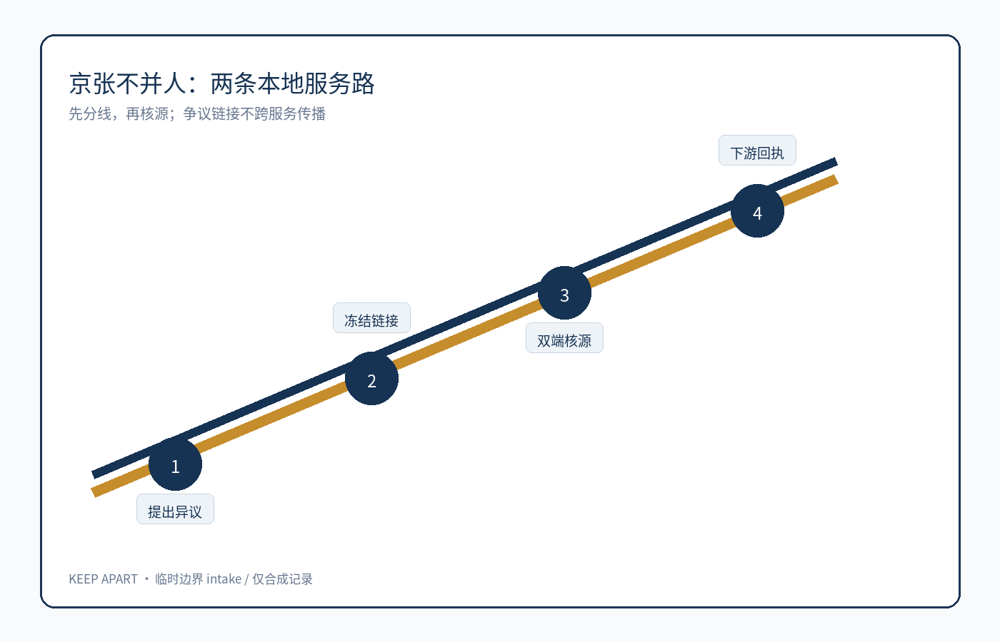
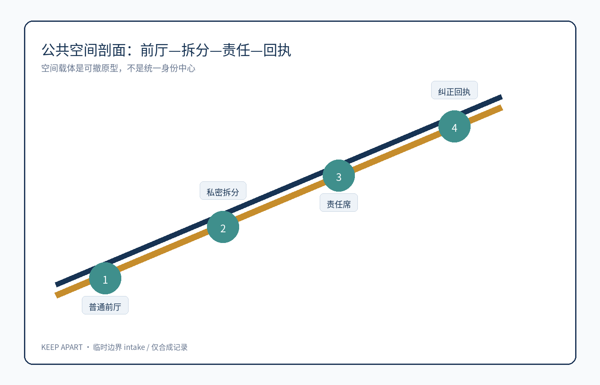
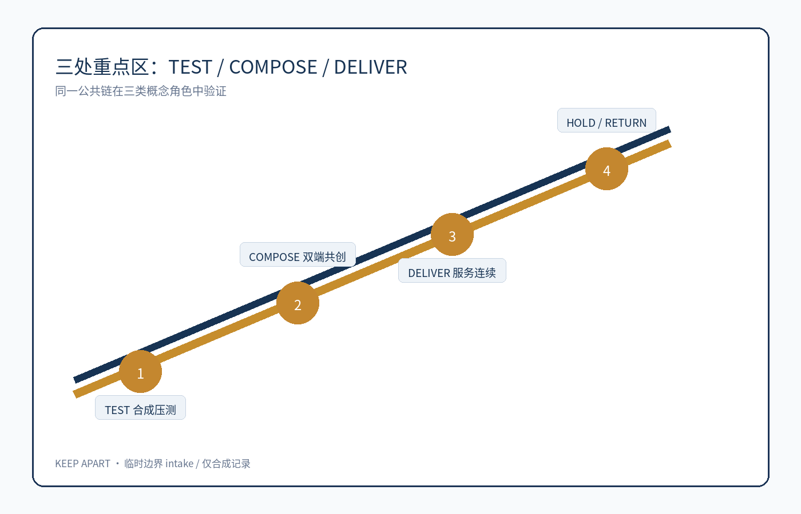
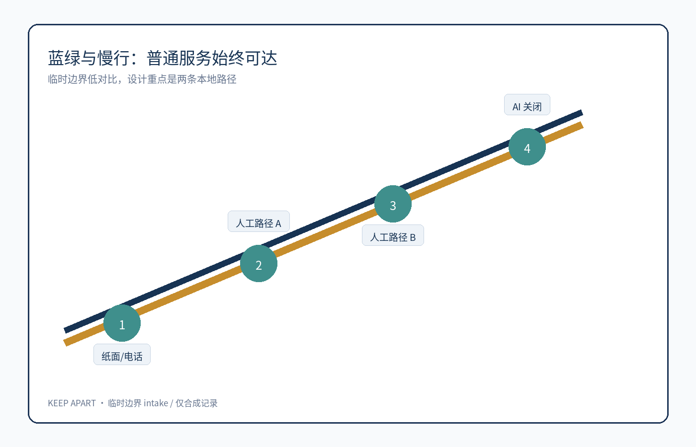
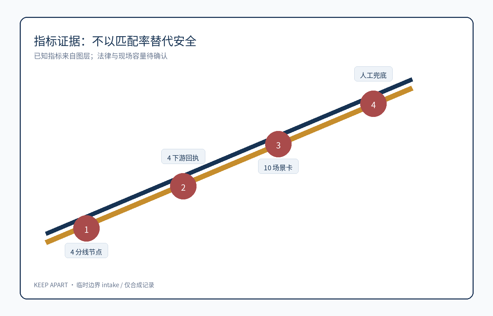

# 京张不并人 / JINGZHANG KEEP APART

## 方案摘要：机器不确定时，先保留两条路

“京张不并人”关注一个窄而严重的公共服务问题：同名、共享联系方式、姓名转写或错误设备关联，可能让两个自然人的记录被机器并成一人。错误链接一旦被交通、企业服务、健康导航或活动系统复用，某人的欠缺材料、投诉、预约或风险提示就可能落到另一人的办理链上。[source:AGENT-TASKBOOK] [depth:public_interest]

本方案的概念建议不是建设统一身份中心，也不是更强认证。它提出一个可撤的空间—服务原型：本人提出“这条记录不是我”后，普通前厅先发起分线；人工冻结有争议的跨服务链接和新自动动作，但不删除两端原始记录；每个原始记录责任人只核本端来源；独立复核人决定拆分或保持分离；已知下游逐项收到纠正/撤回回执；争议期间两人的本地人工、纸面和电话服务继续。[data:geometry/public_space.geojson#KEEP-APART-001] [metric:record_separation_node_count]

失败时宁可暂时重复，也不把两个人并成一个人。AI 只提示冲突、画出已授权数据流、生成供人修改的下游清单；AI 关闭后，纸面来源卡、分线回执和事项责任人仍可完成任务。以下所有空间动作均为概念建议、参考方案或可供专业团队深化研究，不构成身份制度、档案规则、法定救济、政府背书或实施承诺。

## 五字段公共链与最小原型

| 字段 | 本方案的可核验定义 | 失败时的公共结果 |
| --- | --- | --- |
| 公共问题/受影响者 | 两个自然人的记录因同名、共享联系方式、转写或设备线索被误并；双方、照护者、一线受理员和事项责任人都可能受影响。 | 不预设冒名或欺诈，不要求人脸、声纹、步态或家庭关系图。 |
| 完整任务 | 提出误并 → 冻结争议链接和新自动动作 → 两端责任人核源 → 拆分或保持分离 → 已知下游逐项纠正/撤回 → 事项责任人分别决定服务。 | 无法确认时保持分离，停止新增传播，不把争议链接单独用于拒绝、处罚、资格或信用。 |
| 空间载体 | 普通前厅可发起；无摄像私密拆分间保护摘要；两端原始记录责任席各自核源；多个本地服务台继续办理。 | 不建设统一身份中心，不用 provisional polygon 指定真实机构或柜台。 |
| 具名人工决定/权利 | 本人提出异议；每个原始记录责任人只核本端；事项专业责任人决定结果；独立复核人处理链接争议。 | AI、供应商、前台或另一名当事人不能单独宣布同一人、合并/删除记录或决定事项。 |
| 退出/撤回结果 | 关闭共享匹配层，导出合法需要的本地记录和未闭环纠正清单，撤下差别标识；普通服务房恢复一般隐私服务。 | 不能安全继续时只暂停高风险事项，不让两人的基本人工/纸面服务同时消失。 |

**合成人物红队**使用 8 组记录：同名同生日、家庭共用电话、姓名转写、姓名变更、错误设备关联、另一机构离线、下游已作不利动作、供应商退出。验收不是匹配率，而是：①误并链接能被冻结；②两端摘要不暴露另一人；③下游纠正可逐项回执；④AI 关闭后两条本地路径仍能办理。[metric:record_separation_node_count] [metric:downstream_correction_receipt_count]

**反证与停机**：若独立专业者认定摘要无法在不泄露另一人资料下提供，或人工拆分迫使新增生物识别、显著增加举证负担、让两人的基本服务同时中断，原型即 `HOLD/RETURN`，不进入真实公共服务试点。[source:SYNTHETIC-PROTOTYPE-KEEP-APART] [depth:risk_missing_data]

## 设计依据与资料清单

本 formal 方案以北京市规划和自然资源委员会海淀分局公告、面向智能体任务书、仓库来源注册表和临时粗略边界为依据。方案只使用公开或清权资料；合成人物和合成记录只用于桌面原型，不代表真实个人、机构或现场事实。[source:OFFICIAL-ANNOUNCEMENT] [source:AGENT-TASKBOOK] [source:SOURCE-REGISTRY]

方案把“错误身份链接的双端公共损害”作为空间和服务设计主线，而不是把身份识别包装成科技设施。完整来源、标准和深度证据分别保存在 `sources.json`、`standard_matrix.json` 与 `design_depth_matrix.json`。[depth:existing_conditions_diagnosis]

资料登记表的使用边界如下 [source:SOURCE-REGISTRY]：

- data/source_registry.json 登记公开、清权与临时资料的用途边界。
- 当前登记摘要：formal 可用资料 7 条，背景资料 1 条，provisional-only 资料 1 条。
- agent 不得把 background_only 或 provisional_only 资料升级为 official boundary、法定控规、正式评分依据或政府实施承诺。

`data/processed/agent_fact_pack.md` 是本方案的阅读导航层，不是新的权威来源 [source:PROCESSED-FACT-PACK]。它帮助 agent 把三层范围、三处重点区、公告任务、agent.1-agent.6、资料可用性和缺资料事项组织成可读方案；事实判断仍需回到已登记的原始材料 [source:OFFICIAL-ANNOUNCEMENT] [source:AGENT-TASKBOOK]，完整来源关系由 `sources.json` 保存。

本方案在官方 `SITE_BOUNDARY` 与三处 `KEY_AREA` 尚未取得时采用 `brief/site-package/geometry/provisional_boundaries.geojson`。包内 `geometry/site_boundary.geojson` 与 `geometry/key_areas.geojson` 均声明 `provisional_constraint`、`official_boundary=false`，仅用于生成、讨论与自检，不能作为 official redline、审批或精确面积依据。官方 polygon 到位后，边界、重点区、用地、道路、绿地、公共空间、建筑、分期、指标、图件和图纸必须整体复算；组织方数据缺口不阻断内容评分。

边界解释可回到总体范围图层和面积复算 [data:geometry/site_boundary.geojson#SITE-001] [metric:site_area_sqm]。三处重点区则由独立图层和数量指标核对 [data:geometry/key_areas.geojson#PROV-KEY-001] [metric:key_area_count]。这意味着读者可以从正文进入证据，但不必先读一串机器编号。

## 三层范围工作框架

方案按照公告确定的三个层次组织工作：统筹研究范围关注 43.6 平方公里的AI产业生态、战略定位、创新链和未来城市形态；总体设计范围关注 11.4 平方公里京张遗址公园周边 1-2 公里城市地区和产业区，要求形成城市更新总体框架、产业空间布局、交通市政支撑和城市风貌控制；重点区域范围关注 368.4 公顷三处详细设计地区，要求明确功能业态、建筑规模、拆改留分类、公共空间连通和交通组织。三层范围在 `compliance_matrix.json` 中逐条映射，保证公告 1.3、1.4、1.5 与 agent.1-agent.6 的必选任务都有章节、图层、指标、图纸和 HTML 证据。

三层工作框架的深度项由 [depth:three_level_scope_framework] 和 [depth:overall_spatial_structure] 约束，空间证据以 [data:geometry/site_boundary.geojson#SITE-001] 与 [data:geometry/key_areas.geojson#PROV-KEY-001] 为准，任务依据以 [standard:PROJECT-OFFICIAL-ANNOUNCEMENT] 为准，范围索引以 [source:PROCESSED-FACT-PACK] 中 `project_scope_summary.csv` 的三层范围表为导航。

三层工作通过一条责任链相连：统筹层把“隐私工程—档案责任—无障碍—服务设计—合成红队”组织为可信 AI 生态；总体层把责任链转成两条本地服务路、无摄像拆分间、来源责任席与回执节点；重点区用 TEST、COMPOSE、DELIVER 三种角色验证合成输入、具名人工决定和失败后的公共结果。所有数值均从当前结构化图层复算或明确保持 unknown。

总体概念为“京张不并人 / JINGZHANG KEEP APART”：把一条跨服务匹配链拆成可见的两条本地服务路。三处重点区域分别承担 TEST（合成误并压力测试）、COMPOSE（双端核源与分线回执共创）和 DELIVER（下游纠正、事项决定与普通服务连续）角色；这是一套概念运营结构，不是新红线或统一身份设施。[data:geometry/key_areas.geojson#PROV-KEY-001] [depth:overall_spatial_structure]

| 层级 | 设计问题 | 方案回答 | 数据落点 |
| --- | --- | --- | --- |
| 统筹研究范围 | AI产业生态和未来城市形态如何组织 | 建立“高校策源-开源协作-企业转化-公共体验-国际传播”的创新链 | compliance_matrix.json、standard_matrix.json |
| 总体设计范围 | 产业空间、城市更新、交通市政和风貌如何落图 | 用地、建筑、道路、绿地、公共空间和分期图层共同表达 | [data:geometry/land_use.geojson#LU-001]、[data:geometry/roads.geojson#ROAD-001] |
| 重点区域范围 | 三处片区如何达到详细设计深度 | 分别提出定位、空间动作、AI场景和实施依赖 | [data:geometry/key_areas.geojson#PROV-KEY-001]、[data:geometry/key_areas.geojson#PROV-KEY-002]、[data:geometry/key_areas.geojson#PROV-KEY-003] |

## 统筹研究范围产业与未来城市研究

“京张不并人”的识别系统是一组可执行边界，不是装饰 Logo：两条平行轨线在人工复核门前保持分离，中间空隙表示 AI 不得越过的人类决定区；深海军蓝表示公共责任，薄荷绿表示普通服务连续，珊瑚红只用于 `HOLD/RETURN`。标志不得合拢轨线，也不得使用人脸、指纹、眼睛或身份卡图形。铁路转辙的文化意象表达可逆选择，中关村开源文化表达可复核协作。[source:AGENT-TASKBOOK] [standard:PROJECT-AGENT-OPEN-CALL-TASKBOOK]

三大定位和五大功能形成同一条因果链：百年京张文化带提供“转辙而非锁定”的叙事；都市 AI 生活体验带把人工、纸面和电话连续性做成公共界面；AI 融合创新带把误并、离线和供应商退出转成合成测试。全栈创新输出开放病例与分线协议，世界级生态连接隐私工程、档案责任和无障碍，AI+场景承载三类产业验证，活力城市保留两条本地服务路，治理话语权只发布去标识回执、失败条件和可撤协议。[data:geometry/public_space.geojson#KEEP-APART-001] [depth:overall_spatial_structure]

三区两翼按“生产—验证—传播”协作：众智园 TEST 合成误并与标准治理；AI 原点社区 COMPOSE 双端核源、无障碍共创和纸面流程；大钟寺 DELIVER 下游回执、事项决定与普通服务连续。中关村科技服务翼输出开源测试包、责任模板和专业审查清单；小月河场景赋能翼验证非识别慢行、无障碍到达和公共解释。以上均是概念运营角色，不指定真实机构或场地。[data:geometry/key_areas.geojson#PROV-KEY-001] [standard:MOHURD-URBAN-DESIGN-MEASURES]

五个国际案例只作为 `background_only` 方法镜：加拿大自动化决策指令提示影响分级和人工干预，英国 ATRS 提示目的、责任、数据与风险记录。[source:CASE-CA-AIA] [source:CASE-UK-ATRS] 荷兰算法登记册提示公共可发现性与主管机构字段，赫尔辛基 AI 登记册提示服务级说明和公众反馈。[source:CASE-NL-REGISTER] [source:CASE-HEL-AI] 欧盟 AI 框架公共说明提示风险分层。[source:CASE-EU-AI] 它们不证明本地合规、有效性或场地适配；转化只发生在本包的责任字段、公开说明和失败 gate 中。[depth:public_interest]

## 总体设计范围城市更新与控规深度城市设计

总体设计把跨服务匹配层与本地事项处理层分开：普通前厅只登记最小异议，拆分间只显示隐私专业者批准的摘要，两个来源责任席只核本端，回执节点只展示去标识开放/关闭数量。用地、建筑、道路和公共空间图层表达可移动、可撤回的概念载体；真实低效空间、建筑分类、容量与工程条件仍待官方和现场证据。[data:geometry/land_use.geojson#LU-001] [data:geometry/buildings.geojson#KEEP-BLDG-001]

本节按照 [standard:MOHURD-CONTROL-DETAILED-PLANNING] 把控规深度内容拆成可审查对象：[data:geometry/land_use.geojson#LU-001] 表达用地结构，[data:geometry/buildings.geojson#BLDG-001] 表达建筑基底，[data:geometry/roads.geojson#ROAD-001] 表达交通组织，[metric:building_footprint_area_sqm] 用于复核建筑基底面积，[depth:land_use_layout] 与 [depth:development_intensity_controls] 约束成果深度。

交通慢行只提供不识别人的两路到达与无障碍引导；轨道、道路红线、市政、停车、消防和站点一体化只列专业审查关系。建筑高度、开发强度、退线和设施容量保持 unknown，待正式控规与工程条件确认。[data:geometry/roads.geojson#KEEP-ROAD-001] [metric:floor_area_ratio]

## 重点区域详细设计

众智园 TEST 使用同名、共享电话、转写和错误设备关联等合成记录，验证能否冻结链接而不增加生物识别；AI 原点社区 COMPOSE 让来源责任人、事项责任人、无障碍代表和隐私专业者共同编辑纸面流程；大钟寺 DELIVER 演练四个下游接收点的逐项回执、离线来源和供应商退出。每区都保留普通服务、具名人工决定和 `HOLD/RETURN`。[data:geometry/key_areas.geojson#PROV-KEY-001] [data:geometry/key_areas.geojson#PROV-KEY-002] [data:geometry/key_areas.geojson#PROV-KEY-003]

三处重点区域使用 provisional polygon，只表达角色、流程和待审查空间类型，不表达真实建筑规模、权属或实施选址。A3 文册按九页阅读链解释证据，A0 展板按五张横版板呈现总体结构、空间证据、任务书组件、案例—测试—场景和运行—退出，两者不再复用同一 PDF。[depth:three_key_area_detailed_design]

| 重点片区 | 设计定位 | 空间动作 | AI产业与运营场景 | 证据引用 |
| --- | --- | --- | --- | --- |
| 众智园AI自主创新加速区 | 花园型全栈自主创新街区 | 强化清河界面、产业展示、低碳创新交往和对外交通组织；以绿色空间承载开放测试与标准治理展示 | 自主模型测试、标准制定工作坊、安全治理展示、低碳算力体验 | [data:geometry/key_areas.geojson#PROV-KEY-001]、[depth:three_key_area_detailed_design] |
| 北京AI原点社区 | 近校型成果转化与人才社区 | 组织校区、园区、街区慢行缝合；补足成果发布、人才服务、居住生活和开源协作空间 | 开源社区、成果发布、人才特区服务、近校孵化 | [data:geometry/key_areas.geojson#PROV-KEY-002]、[source:AGENT-TASKBOOK] |
| 大钟寺AI产业聚集区 | 城市型智能经济与国际交往街区 | 围绕大钟寺站一体化、四象限步行连通、商业服务和重点企业公共环境更新 | 智能体与智能终端展示、内容消费、数据要素与国际路演 | [data:geometry/key_areas.geojson#PROV-KEY-003]、[metric:key_area_count] |

## AI 创新生态、人才画像与 AI+ 场景

六类画像是招募假设而非观察数据：误并当事人、照护/代理协助者、前厅受理员、两端来源责任人、事项专业责任人和独立复核/无障碍代表。空间响应分别是低门槛异议入口、可陪同但不代决的等候位、最小登记台、互不可见的来源席、事项决定台和独立复核桌。[metric:persona_count] [data:geometry/public_space.geojson#KEEP-APART-002]

三类产业测试均使用合成数据：T-01 共享联系方式碰撞测试由隐私/档案专业者批准摘要字段，泄露或生物识别升级即 RETURN；T-02 下游不利动作传播测试由事项责任人逐项判断撤回/纠正/保留，未闭环则 HOLD；T-03 离线与供应商退出测试由公共服务责任人启动纸面/电话路径，开放清单无人接手或普通服务同时消失即停止。[source:SYNTHETIC-PROTOTYPE-KEEP-APART] [metric:downstream_correction_receipt_count]

| 用户画像 | 典型需求 | 空间响应 | 自检边界 |
| --- | --- | --- | --- |
| 误并当事人 | 用最小材料提出异议并保留普通服务 | 前厅入口、私密拆分间 | 不预设冒名，不增加生物识别 |
| 照护/代理协助者 | 协助沟通但不越权代决 | 可陪同等候位、授权核验点 | 代理/授权由专业者核验，AI 不判断 |
| 前厅受理员 | 登记最小请求并冻结新自动动作 | 低位可达受理台 | 不读取另一人完整记录 |
| 两端来源责任人 | 各自核验本端原始来源 | 互不可见的双端责任席 | 不跨端宣布身份结论 |
| 事项专业责任人 | 分别决定各事项服务结果 | 本地事项决定台 | 争议链接不得单独形成不利结果 |
| 独立复核/无障碍代表 | 处理链接争议并验证等价路径 | 独立复核桌、安静等候位 | 任一群体无等价路径则 HOLD |

| 场景卡 | 空间载体 | 设计说明 |
| --- | --- | --- |
| 01 提出分线 | 普通前厅 | 本人提出；AI 只提示冲突；前厅只登记最小请求 |
| 02 冻结链接 | 来源责任席 | 数据责任人批准冻结新自动动作；不能冻结即 RETURN |
| 03 双端核源 | 两端责任席 | 各责任人只核本端；AI 生成可编辑差异摘要 |
| 04 私密摘要 | 无摄像拆分间 | 隐私专业者批准可见字段；泄露另一人资料即 RETURN |
| 05 独立复核 | 复核桌 | 独立复核人决定拆分或保持分离；AI 不推荐最终身份 |
| 06 下游回执 | 回执节点 | 每个事项责任人逐项关闭；未闭环保持 HOLD |
| 07 多语回读 | 语言支持位 | 本人确认原意，语言责任人确认译文 |
| 08 无障碍办理 | 低位台与安静等候位 | 无障碍专业者确认等价路径；不强制数字入口 |
| 09 供应商退出 | 退出交接位 | 数据与公共服务责任人共同签收开放清单 |
| 10 合成公开演练 | 公共解释台 | 只展示合成记录；专业评审决定是否继续有限演示 |

本方案的 AI 治理建议以“先分离、后核源”为最小协议：AI 可提示冲突、绘制经授权的数据流并生成下游纠正清单，但不得判断两条记录是否属于同一人、推断欺诈或资格、要求新增生物识别、自动合并/拆分/删除或决定服务。所有场景均使用合成记录，关闭 AI 后纸面来源卡、人工电话、分线回执和事项决定单仍可完成。[source:AGENT-TASKBOOK] [metric:manual_fallback_coverage_ratio]

## 用地、建筑规模与拆改留方案

本方案只在提交的完整概念用地分区内放置两间可移动服务房、两条本地路径与责任席，不据此判断真实地块或建筑的保留、改造、拆除和新建。优先动作是复用既有有人值守的普通服务房与可移动家具；任何永久构筑物都必须等待现状建筑、权属、控规、无障碍、消防、声学隐私和文保条件确认。

用地分类依据 [standard:MNR-LAND-USE-CLASSIFICATION-GUIDE]，建筑高度、体量、界面和风貌控制由 [depth:height_massing_character] 管理，拆改留方法由 [depth:retain_renovate_demolish] 管理。用地和建筑的主要证据是 [data:geometry/land_use.geojson#LU-001]、[data:geometry/buildings.geojson#BLDG-001] 和 [metric:building_footprint_area_sqm]。

概念建筑基底面积仅用于检查提交图层是否可复算，置信度为 low；总建筑规模、容积率、高度、密度、退线与建筑控制线保持 `unknown`。A3 文册提供九页阅读链，A0 提供五张横向展板，两者均显示临时性警示并回指结构化证据。[metric:building_footprint_area_sqm]

## 交通、轨道、市政与公共服务设施

两条概念慢行线保证从普通前厅到拆分间、责任席和本地事项台都可不经身份识别到达，并保留纸面、电话与有人值守路径。北五环跨越、五道口、清华东路西口、大钟寺站、停车与非机动车组织只列入专业深化清单；本包不推断线位、站点工程或通行能力。

交通和市政专业深度分别由 [depth:traffic_rail_slow_parking] 与 [depth:municipal_new_infrastructure] 约束；图层证据引用 [data:geometry/roads.geojson#ROAD-001]、[data:geometry/public_space.geojson#PUBLIC-001] 和 [data:geometry/constraints.geojson#CONSTRAINTS]。道路红线、管线、消防、市政与真实服务半径缺失，均在 assumptions 中作为进入 G2/G3 前的 HOLD 条件。

唯一建议的新型公共服务设施是可撤的隐私屏、纸面来源卡槽、人工服务在场旗与去标识回执计数器；不依赖新增端侧算力才能办理。能源、排水、防洪、消防、信息隔离和人员培训资料未取得，因此它们是专业深化前置条件，不是已满足的设施标准。

## 蓝绿空间、公共空间与城市风貌

蓝绿空间承载“公开状态、私密拆分、普通服务继续”的剖面：公共路径只显示“本地办理/分线处理中/人工复核/已关闭”，不显示姓名、争议原因或另一人的资料。无摄像私密拆分间与两端原始记录责任席只作概念节点，需由专业团队确认无障碍、消防、文保和权属条件。[depth:blue_green_public_space] [data:geometry/public_space.geojson#KEEP-APART-001]

蓝绿公共空间由设计深度项和绿地、公共空间图层共同校核 [depth:blue_green_public_space] [data:geometry/green_space.geojson#GREEN-001] [data:geometry/public_space.geojson#PUBLIC-001]。绿地与公共空间比例在正文解释设计意义，完整复算保存在 `metrics.json`；城市风貌、公共空间和建筑控制的统筹则回到专业标准矩阵 [standard:MOHURD-URBAN-DESIGN-MEASURES]。

三处概念地标不依赖肖像、商标或识别技术：众智园“**双轨门槛**”用两条不相交触感导带解释默认分离；AI 原点社区“**分线信号亭**”只显示本地办理、人工复核、HOLD、关闭四种中性状态；大钟寺“**回执灯塔**”只显示去标识开放/关闭数量。组件库包含双轨导视条、可移动隐私屏、纸面来源卡槽、人工服务在场旗、HOLD/RETURN 磁贴和去标识回执计数器。贡献/荣誉展示只收录经贡献者授权的方法和组件，不展示个人服务记录。[data:geometry/public_space.geojson#KEEP-APART-003] [source:AGENT-TASKBOOK]

## 更新项目清单、实施政策与分期计划

实施采用五个可停机 gate：G0 公共服务责任人清点任务、来源责任与权利；G1 独立测试主持用 8 组合成记录记录失败；G2 隐私、档案、无障碍、消防和信息安全专业者逐项签署审查；G3 场地与公共服务责任人验证容量、等候、语言与人工后备；G4 数据责任人与公共服务责任人移交开放清单并恢复普通服务。缺责任人即 HOLD，泄露或生物识别升级即 RETURN，普通服务下降即 STOP，存在无人接手事项不得退出。[data:geometry/phasing.geojson#PHASE-001] [depth:phasing_implementation]

项目清单和分期深度由 [depth:renewal_project_list] 与 [depth:phasing_implementation] 管理，分期空间证据为 [data:geometry/phasing.geojson#PHASE-001]。如果没有权属、资金、实施主体和审批路径，方案必须把它写成实施风险，而不是承诺落地。

| 项目编号 | 项目名称 | 类型 | 主要依赖 | 证据引用 |
| --- | --- | --- | --- | --- |
| JZ-01 | 京张遗址公园慢行断点缝合 | 公共空间/交通 | 道路红线、桥下空间、交通组织复核 | [data:geometry/roads.geojson#ROAD-001] |
| JZ-02 | 众智园清河创新界面 | 蓝绿空间/产业展示 | 河道蓝线、生态和防洪条件 | [data:geometry/green_space.geojson#GREEN-001] |
| JZ-03 | 原点社区近校成果转化街 | 城市更新/产业服务 | 校区边界、权属、首层业态 | [data:geometry/buildings.geojson#BLDG-001] |
| JZ-04 | 大钟寺站四象限步行连通 | 轨道一体化/慢行 | 轨道站点、道路交叉口、市政管线 | [data:geometry/public_space.geojson#PUBLIC-001] |
| JZ-05 | AI公共服务与端侧算力节点 | 新基建/公共服务 | 能源、算力、安全和运营主体 | [data:geometry/constraints.geojson#CONSTRAINTS] |
| JZ-06 | 全球AI活动周公共路线 | 运营/品牌 | 公共空间许可、活动安全、版权清权 | [data:geometry/phasing.geojson#PHASE-001] |

长期运营是可撤协议而非活动承诺：每季度由独立测试主持和隐私/档案专业者组织合成病例测试；每半年由公共服务责任人与无障碍代表走查两条服务路；每年建议由任务书运营角色与独立专业评审举办“可撤 AI 城市协议论坛”；持续贡献展示只呈现自愿署名的公开方法和组件。泄露、生物识别升级、无等价路径或权利撤回分别触发病例撤下、活动 HOLD 或署名移除；不把这些概念活动写成政府已确定安排。[source:AGENT-TASKBOOK] [depth:renewal_project_list]

## 指标体系、面积复算与合规矩阵

页面只把临时场地面积显示为“约 11.41 km²”、概念绿地比例显示为“约 12.3%”、概念公共空间比例显示为“约 7.3%”，并在同一指标卡写明“临时边界 / 低置信 / 非官方”。机器层仍保存完整复算值和公式，用于替换 official polygon 后的确定性比较，不把显示精度升级为规划精度。[metric:site_area_sqm] [metric:green_ratio] [metric:public_space_ratio]

指标复算遵循统一的设计深度要求 [depth:metrics_recalculation]。正文重点解释指标的设计含义，例如总体范围如何约束空间分配、蓝绿和公共空间比例如何支撑日常交往；完整数值、公式、来源文件和置信度保存在 `metrics.json`。示例关键指标可由总体范围和绿地数据复核 [metric:site_area_sqm] [data:geometry/green_space.geojson#GREEN-001]。

合规矩阵为 `agent.1`—`agent.6` 分别指定品牌协同、案例生态、测试场景、地标组件、文化叙事和年度运营的专属章节、图层、指标、图纸、来源、假设和自检项，不再用同一组通用证据批量宣称完成。

指标分三类管理：提交几何可复算值保存在 `metrics.json`；容积率、高度、密度、退线、红线和设施标准保持 unknown；服务容量、等待时长、语言等价、申诉闭环和活动参与度必须在 G3 有真实运营数据后才能建立。当前 `manual_fallback_coverage_ratio=1.0` 只表示合成原型的四条必需路径都有人工/纸面方案，不外推真实容量。

## 风险、版权与合规说明

中英文 proposal、HTML、图件和 A3/A0 使用逐项对应的任务模块、指标口径、失败 gate 与图位；`visual/assets/keep-apart-deliverables.json` 是双语派生账本。HTML 不加载远程脚本、地图瓦片、字体、iframe、表单或 API。资产作者、生成方式、字体许可、来源和复用边界见 `report/copyright_statement.md`。

风险和缺资料清单由风险深度项、约束图层和场地包共同校核 [depth:risk_missing_data] [data:geometry/constraints.geojson#CONSTRAINTS] [source:SITE-PACKAGE]。`missing_data_checklist.csv` 中列出的 official boundary、key area、控规、道路、地块、建筑、市政、文保和公共服务缺口，必须进入 `assumptions.json`、自检和正文风险章节。任何缺少官方控规、道路红线、权属、市政、消防或文保条件的结论，都必须降级为待确认事项；完整专业核对保存在标准矩阵中。

本方案不声称官方批准、审定控规、最终土地权属、最终建设规模或保证实施。若无法在不暴露另一人资料、不强迫生物识别且不让两人基本服务同时中断的情况下完成分线回执，原型即降级或退出；该反证条件比“匹配率更高”更重要。[source:AGENT-TASKBOOK] [depth:risk_missing_data]

## 参考资料

- brief/public-brief.md
- brief/site-package/design_brief.json
- brief/site-package/allowed_design_space.json
- brief/site-package/enums/
- brief/site-package/ranges/planning_limits.json
- data/processed/agent_fact_pack.md
- data/processed/project_scope_summary.csv
- data/processed/agent_task_requirements.csv
- data/processed/source_use_matrix.csv
- data/processed/missing_data_checklist.csv
- 完整机器索引：见 `sources.json`、`metrics.json`、`compliance_matrix.json`、`standard_matrix.json` 与 `design_depth_matrix.json`
- 本节书目入口依据场地包登记，完整出处和许可见结构化来源清单 [source:SITE-PACKAGE]
