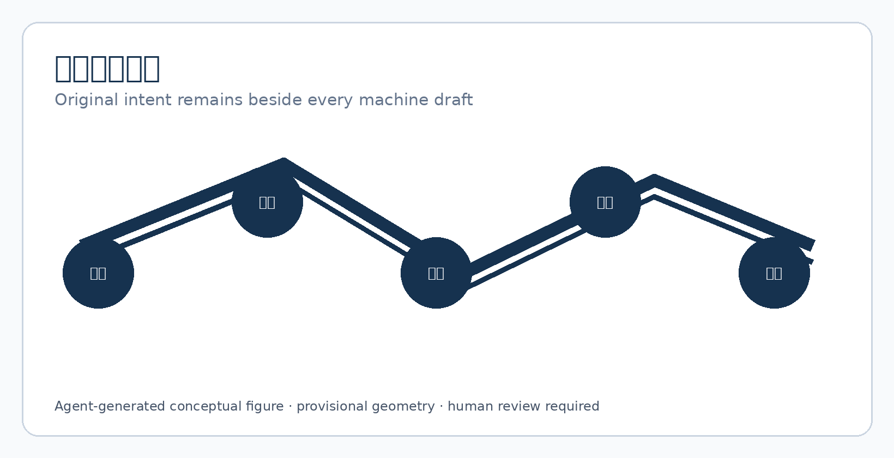
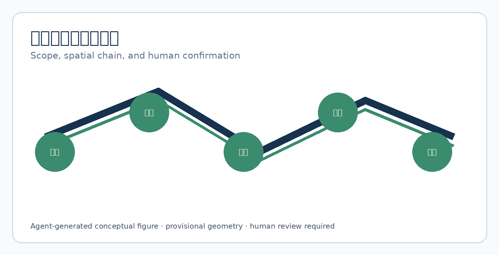
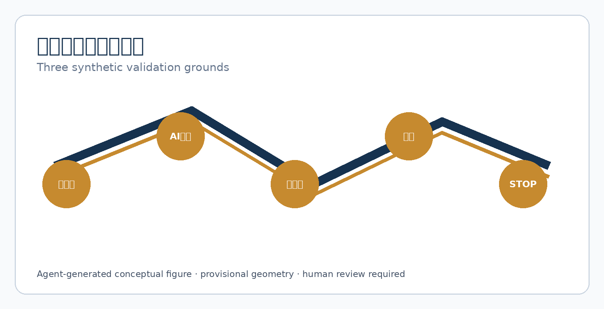
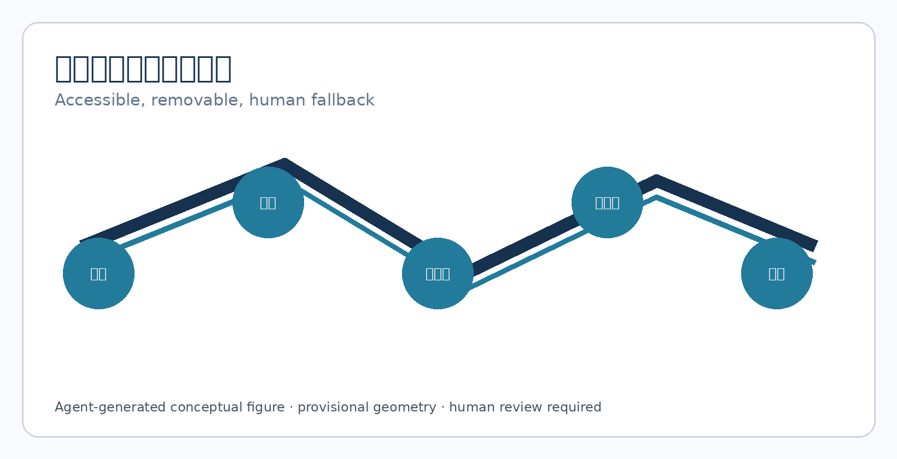
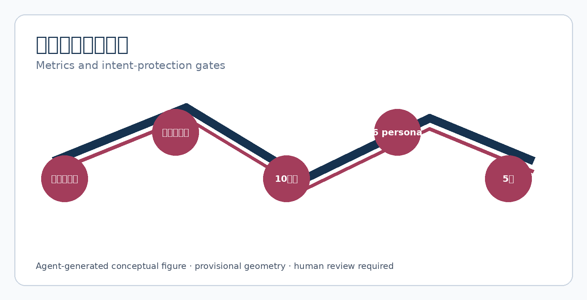

# JINGZHANG ORIGINAL INTENT DUAL TRACK

> Machine drafts first; intent runs in parallel. A person confirms before sending, and every failure returns to human, paper, and the original text.

**Boundary notice:** This is a conceptual reference scheme using provisional rough geometry. It is not an approved translation service, legal interpretation, medical advice, or government implementation commitment. Real deployment requires co-design with professionals, language communities, accessibility experts, and affected people.

## Design Basis and Source List

The scheme uses the official announcement, agent taskbook, public source registry, local professional-standard snapshots, and provisional geometry. They support objectives, scopes, and deliverables, but do not authorise a site, service workflow, or translation-quality promise. [source:OFFICIAL-ANNOUNCEMENT] [source:AGENT-TASKBOOK] [depth:existing_conditions_diagnosis]

Provisional geometry supports generation, visualisation, and topology checks only; recompute every layer and area when official polygons arrive. [source:BOUNDARY-SOURCE] [data:geometry/site_boundary.geojson#SITE-001]

## Three-Level Scope Framework

The coordinated scope connects language service, AI industry, cultural communication, and rights protection. The overall scope places dual-track writing stations, quiet confirmation tables, accessible arrivals, and human fallback. Three key areas host synthetic rehearsals only. [data:geometry/site_boundary.geojson#SITE-001] [metric:key_area_count] [depth:three_level_scope_framework]

The minimum spatial chain is original entry—machine draft—human/person confirmation—parallel original retention—revocable send—human fallback. Shared ordinary consultation avoids turning language difference into a visible label.

## Coordinated Research Area: Industry and Future City Research

Original Intent is public communication infrastructure, not an automatic translator. Upstream are terminology, language communities, original input, and accessible expression; midstream are local drafts, two-person review, version differences, and human decisions; downstream are send, withdrawal, appeal, and exit. Five lenses compare interpretation confirmation, easy-read text, legal-term locks, human review, and vendor exit. [metric:case_study_count] [source:SOURCE-REGISTRY]

Regional links remain hypotheses: communities may test daily language, science cities may provide human-factors methods, E-Town may test device/vendor exit, and Jing-Jin-Ji nodes may compare terminology versions. No partnership is claimed without evidence. [standard:PROJECT-AGENT-OPEN-CALL-TASKBOOK]

## Overall Design Area: Urban Renewal and Regulatory-Plan-Level Urban Design

The structure is one dual-track communication spine, three synthetic validation grounds, and two professional support wings. Near term is a no-real-case 1:1 prototype, terminology co-design, and readability testing; unresolved fire, title, privacy, labour, or accessibility conditions keep ordinary human service in place. [data:geometry/land_use.geojson#LU-001] [depth:overall_spatial_structure] [standard:MOHURD-CONTROL-DETAILED-PLANNING]

Land, building, road, green, and public-space layers express adjacency only. FAR, height, redlines, and capacity await official controls.

## Detailed Design of Key Areas

Zhongzhiyuan VERIFY rehearses specialist terminology and “original text cannot be rewritten”; AI Origin Community CO-DESIGN rehearses easy-read, sign-language/captions, and personal confirmation; Dazhongsi REHEARSE covers rail arrival, multilingual wayfinding, outage, no staff, and vendor exit. Acceptance is not BLEU or recognition accuracy: the person sees differences, may refuse, receives human explanation, and retains original service. [data:geometry/key_areas.geojson#PROV-KEY-001] [metric:industry_test_count] [depth:three_key_area_detailed_design]

## AI Innovation Ecosystem, Personas, and AI+ Scenarios

Agent.1–agent.6 provide identity, five-case ecosystem, ten cards and three tests, six personas, three landmarks, cultural narrative, and exit operations. [standard:PROJECT-AGENT-OPEN-CALL-TASKBOOK] [metric:scenario_card_count] [metric:persona_count]

Personas are low-literacy users, people needing sign language/captions, cross-border visitors, older residents, frontline staff, and translators/professionals who confirm; they are design prompts, not profiles. Ten cards cover public preview, routes, medical drafts, legal locks, children’s easy-read text, captions, resident comments, cross-agency forms, offline paper, and version withdrawal. AI exposes drafts and differences only; it does not send, diagnose, alter facts, or infer identity. [metric:scenario_card_count]

### agent.1 | Brand, overall concept, and coordination loop

The Chinese and English names describe two parallel tracks: machine draft and original text. The logo is a rail, an open human-confirmation line, and a revocable node; colours are rail blue `#16324F`, confirmation green `#3B8C6E`, and original-text gold `#C68A2F`. The three positions, five functions, three areas, and two wings close the original—draft—confirm—send—withdraw loop. [standard:PROJECT-AGENT-OPEN-CALL-TASKBOOK] [depth:overall_spatial_structure]

### agent.2 | Five case lenses, enabling factors, and three industry tests

C1 term lock, C2 original retention, C3 two-person confirmation, C4 accessible equivalence, and C5 vendor exit form five lenses. T1 checks prohibited rewriting in medical/legal drafts; T2 checks shared terminals and cross-agency forms; T3 checks outage, mistranslation, and no-cover fallback. Any lost intent triggers `STOP`. [metric:industry_test_count] [source:SOURCE-REGISTRY]

### agent.3 | Personas, scenarios, and operating thresholds

Each card records user, space, human decision, prohibited AI role, and failure result. Synthetic success means original text is retained, every send has named confirmation, and withdrawal stops propagation. It does not predict real translation quality. [metric:scenario_card_count] [metric:persona_count]

### agent.4 | Public space, three landmarks, and components

Original Table displays original and draft side by side; Confirmation Rail shows who can confirm, withdraw, and explain; Version Light shows only the current version. Components are dual-track signage, difference card, term lock, human-confirmation plaque, paper fallback box, and withdrawal checklist. [metric:landmark_count] [data:geometry/public_space.geojson#PUBLIC-001]

### agent.5 | Cultural narrative, wayfinding, and international copy

Railway dual tracks and staffed operation become “the machine may move first, but the human line remains.” Open collaboration becomes auditable terminology and public differences. International copy: `Two tracks. One human intent.` It is not an official translation or legal guarantee. [source:AGENT-TASKBOOK] [depth:height_massing_character]

### agent.6 | Annual programme, developer community, and durable exit

Quarterly synthetic mistranslation tests, half-year language-community review, and an annual cleared terminology/exit release form the programme. G0 evidence/rights, G1 space/accessibility, G2 privacy/law, G3 human confirmation, and G4 withdrawal/review: any `HOLD` stops progress. [metric:implementation_gate_count] [depth:phasing_implementation]

## Land Use, Building Scale, and Retain-Renovate-Demolish Strategy

Four zones express ordinary service, dual-track prototype, community support, and park adjacency. Footprints are movable prototype envelopes, not existing or construction quantities. FAR, height, fire, title, and retain/renovate/demolish await official conditions; when uncertain, do not alter, build, or connect real data. [metric:building_footprint_area_sqm] [data:geometry/buildings.geojson#BLDG-001] [depth:retain_renovate_demolish]

## Transport, Rail, Municipal Infrastructure, and Public Services

Roads express arrival, not redlines. People without phones, accounts, or standard communication can reach a human confirmation table; the AI track is removable and cannot block paper or phone fallback. Rail, fire, parking, lighting, and municipal capacity require professional review. [data:geometry/roads.geojson#ROAD-001] [depth:traffic_rail_slow_parking] [standard:MOHURD-URBAN-DESIGN-MEASURES]

## Blue-Green Network, Public Space, and Urban Character

The blue-green route is ordinary and accessible; it exposes no language, content, or destination. The three conceptual landmarks are Original Table, Confirmation Rail, and Version Light. The honour display publishes cleared terminology contributions and repaired failures only. [data:geometry/green_space.geojson#GREEN-001] [data:geometry/public_space.geojson#PUBLIC-001] [depth:blue_green_public_space]

## Renewal Projects, Implementation Policy, and Phasing

JZ-01 terminology/rights inventory; JZ-02 no-real-case 1:1 prototype; JZ-03 three synthetic tests; JZ-04 language, accessibility, legal, and labour review; JZ-05 bounded display; JZ-06 withdrawal at any stage with ordinary human service restored. [data:geometry/phasing.geojson#PHASE-001] [depth:renewal_project_list] [metric:implementation_gate_count]

## Metrics, Area Recalculation, and Compliance Matrix

Spatial metrics are recomputed from GeoJSON. Concept counts are five lenses, three tests, ten cards, six personas, three landmarks, and five gates. Synthetic targets are zero auto-send, zero lost intent, and named confirmation for every send; these are not city statistics or performance commitments. [metric:site_area_sqm] [depth:metrics_recalculation] [metric:case_study_count]

## Risk, Copyright, and Compliance

Risks include mistranslation, term drift, auto-send, shared-terminal leakage, unauthorised training, missing accessibility, worker overload, and vendor exit. Controls are parallel original text, visible differences, named confirmation, paper fallback, version withdrawal, staffing limits, and affected-person co-design. All text, figures, HTML/PDF, and structured design are agent-generated; no real person, address, dialogue, or uncleared brand is included. [source:SITE-PACKAGE] [depth:risk_missing_data] [standard:PROJECT-AGENT-OPEN-CALL-TASKBOOK]

## References

Full provenance, licences, limits, matrices, and assumptions are in the package JSON and copyright statement. Provisional geometry cannot support redlines, precise areas, title, or engineering conclusions. Re-register and regenerate every layer, metric, figure, HTML, and PDF when official controls or community evidence changes. [source:OFFICIAL-ANNOUNCEMENT] [source:SOURCE-REGISTRY]
