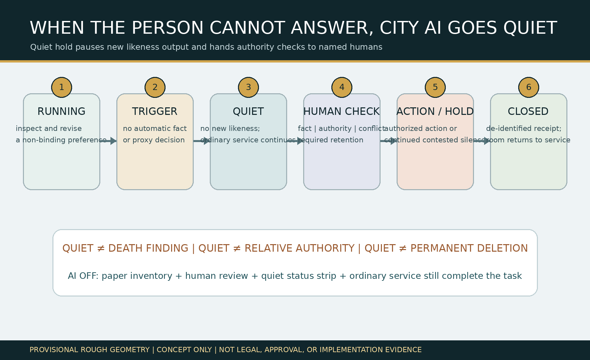
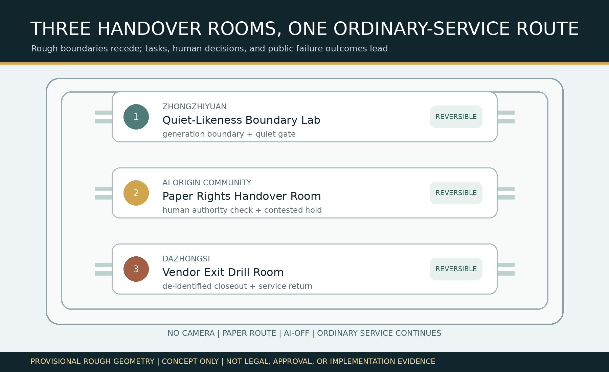
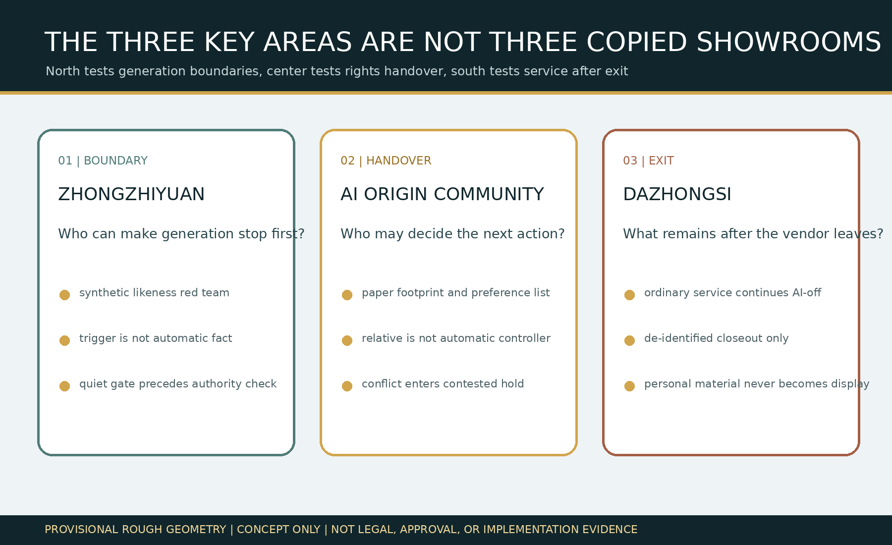
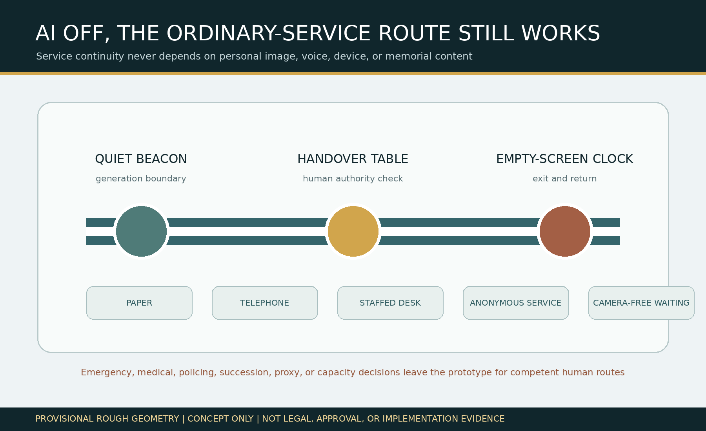
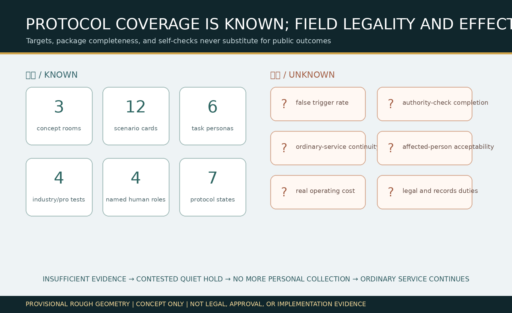

# JINGZHANG QUIET LIKENESS HANDOVER / 京张息像交接室

## Design Basis and Source List

This proposal addresses a public problem hidden by the slogan “withdraw at any time.” City AI may retain a person's voice, image, service records, and model contributions. If the person can no longer communicate, dies, or outlasts a service vendor, the ordinary digital route may no longer be usable while relatives, platforms, and public institutions make conflicting requests. “Quiet first, then hand over” means trigger material only places new personalized voice, image, and virtual-person output into silence. It does not prove death, incapacity, proxy, succession, or disposition authority. Named humans review fact, authority, conflict, and required retention. Insufficient evidence remains contested, and ordinary public service continues. [source:QUIET-LIKENESS-PROTOCOL] [standard:PROJECT-AGENT-OPEN-CALL-TASKBOOK]

The basis includes the official announcement, cleared Agent Taskbook, source registry, local professional-standard snapshots, and repository rough provisional polygons. The announcement and Taskbook support the three scope levels, three key areas, tasks, and concept language only. The provisional polygons support intake, internal recalculation, and diagrams—not an official redline, existing-condition survey, property claim, legal fact, or implementation basis. Death, capacity, proxy, succession, records retention, export, and deletion remain subject to competent professional review. [source:OFFICIAL-ANNOUNCEMENT] [source:BOUNDARY-SOURCE] [depth:existing_conditions_diagnosis]

The complete machine-audit layer is in `sources.json`, `assumptions.json`, `metrics.json`, nine GeoJSON layers, three matrices, and `self_check.json`. The original state machine, scenarios, and roles are in `visual/assets/quiet-likeness-protocol.json`; Taskbook outputs are in `visual/assets/taskbook-deliverables.json`; rights and tools are in `visual/assets/rights-ledger.json`. No real identity, voice, portrait, medical record, death certificate, family relationship, or private service record is used. All four tabletop cases are synthetic. [source:RIGHTS-LEDGER] [metric:synthetic_case_count]

## Three-Level Scope Framework

The coordinated research scope asks how city AI should stop generation and to whom decisions should pass when the person cannot exercise the ordinary choice route. The overall design scope organizes a camera-free, paper-capable ordinary-service continuity route that still works with AI disabled. The key-area scope separately tests generation boundaries, paper rights handover, and vendor exit. These are not three slogans: research defines facts and authority that AI cannot infer; overall design allocates space and responsibility; key areas use synthetic drills to falsify whether the system can stop, hold, and return. [source:PROCESSED-FACT-PACK] [depth:three_level_scope_framework]

`site_boundary.geojson` and all three `KEY_AREA` features are provisional constraints. Their areas are internal EPSG:4548 recalculations at low confidence. When official polygons, existing buildings, roads, rail, water, property, heritage, municipal, fire, and service-operation data arrive, the constraints, design layers, metrics, and human decisions must all be redone. Replacing only a diagram is not enough. [data:geometry/site_boundary.geojson#SITE-001] [metric:site_area_sqm]

## Coordinated Research Area: Industry and Future City Research

### Agent.1 | Name, Identity, and Three Areas–Two Wings

“Quiet likeness” is neither a deletion command nor a death finding. It is a reversible silence gate for new voice and image output. “Handover room” emphasizes that decisions leave automated systems and move to named human roles. The identity mark is an open profile line interrupted by a quiet bar and connected to a solid human-responsibility point. The public status strip may show only `RUNNING / QUIET / CONTESTED / CLOSED`; it may not show names, portraits, voices, memorial content, or small-cell statistics. [source:TASKBOOK-DELIVERABLES] [depth:overall_spatial_structure]

The three positionings become the Jing-Zhang Cultural Responsibility Belt, Urban AI Ordinary-Service Experience Belt, and AI-Integrated Rights-Handover Validation Belt. Five functions are full-stack boundary validation, trustworthy AI ecosystem, AI+ ordinary service, removable urban experience, and public-governance exchange. Zhongzhiyuan tests generation boundaries, the AI Origin Community tests paper handover, and Dazhongsi tests vendor exit. The Zhongguancun Technology-Service Wing provides privacy, legal, accessibility, records, and open-source testing methods; the Xiaoyuehe Scenario-Empowerment Wing provides a camera-free staffed service route. Every cross-area relationship is a concept for professional discussion, not a confirmed partnership or funding arrangement. [source:AGENT-TASKBOOK] [source:TASKBOOK-DELIVERABLES]

### Agent.2 | Six International References and the Full-Stack Ecosystem

Six public cases provide question frames only, never local facts or legal authority. NIST AI RMF suggests the govern-map-measure-manage risk cycle. The Amsterdam Algorithm Register suggests public purpose, impact, and accountable contacts. The Helsinki AI Register suggests system cards and feedback routes. The UK Government Service Standard highlights whole tasks and assisted-digital service. Smart Kalasatama provides a time-bounded urban-experiment context. Punggol Digital District provides a district-scale comparison for business, learning, and community coordination. [source:CASE-NIST-AI-RMF] [source:CASE-AMSTERDAM-ALGORITHM-REGISTER] [source:CASE-UK-SERVICE-STANDARD]

Local transfer is not a copied register. It is an innovation chain of public boundary question, synthetic conflict fixture, removable small model, joint privacy/legal/accessibility/records review, vacant-room prototype, and de-identified correction. Land uses reversible components in existing public-service interiors only; data uses public rules and synthetic records only; compute remains small and offline; funding, scene access, and institutional cooperation require public-value, authority, and exit gates. Companies may test generation boundaries and AI-off operation, professional-service teams review responsibility, and universities and developers maintain synthetic fixtures. Real rights decisions remain with competent people. [depth:renewal_project_list] [standard:MOHURD-URBAN-DESIGN-MEASURES]

## Overall Design Area: Urban Renewal and Regulatory-Plan-Level Urban Design

The overall structure is “three rooms, one route”: three concept handover rooms sit inside existing public-service spaces, connected by a camera-free staffed route among paper, telephone, staffed desk, anonymous service, and camera-free waiting. The space does not build a digital memorial, show people on giant screens, or make relatives automatic controllers. The minimum component library is removable furniture, a quiet status strip, paper service inventory, authority-check sheet, contested-hold sleeve, physical power switch, and de-identified closeout stamp. No component may occupy continuous accessibility, fire, emergency, caregiving, or maintenance routes. [data:geometry/public_space.geojson#PUBLIC-001] [data:geometry/roads.geojson#ROAD-001] [depth:overall_spatial_structure]

`land_use.geojson` completely partitions the provisional overall boundary but expresses only concept functions—rights research, ordinary service, professional validation, and community care—not statutory land use. The three polygons in `buildings.geojson` are room envelopes, not identified real buildings. `phasing.geojson` represents evidence gates from synthetic tabletop work, through joint professional/affected-person review, to an authorized low-risk pilot. FAR, height, density, existing use, retain/renovate/remove decisions, road redlines, and facility capacity remain unknown. [standard:MOHURD-CONTROL-DETAILED-PLANNING] [depth:development_intensity_controls]

The whole task is: while still able to decide, the person inspects associated services and revises a non-binding preference; trigger material first starts quiet hold; named humans review fact, authority, conflict, and required retention; only authorized freeze, export, deletion, or retention proceeds, while conflict remains on hold; finally, only a de-identified closeout receipt is published and ordinary service continues. AI may list possibly associated services, translate input into plain options, and flag checklist gaps. It may not determine capacity, death, family or proxy authority, legal effect, final disposition, or dispute outcome. [source:QUIET-LIKENESS-PROTOCOL] [metric:protocol_state_count]

## Detailed Design of Key Areas

The three key areas are not copied showrooms. Each falsifies a different break in the whole task. Exact locations, buildings, property, construction work, fire, accessibility, staffing, and applicable procedures await official data and professional teams. Rough rectangles only separate roles; they cannot be read as parcels or road redlines. [data:geometry/key_areas.geojson#PROV-KEY-001] [depth:three_key_area_detailed_design]

| Key area | Concept space and task | Named human decision | Public result after failure |
|---|---|---|---|
| Zhongzhiyuan AI Acceleration Area | Quiet-Likeness Boundary Lab uses synthetic voices, images, and service footprints to test whether a trigger immediately stops new output | Data Protection/Ethics Steward decides continued quiet, specialist review, or exit from the drill; AI finds no fact | Any continuing new likeness output stops the prototype, disables the model, and retains only a de-identified failure type |
| Beijing AI Origin Community | Paper Rights Handover Room completes service inventory, trigger-material check, authority conflict, and contested hold in a camera-free foyer | A competent legal/domain reviewer decides authorized action; relatives and vendors cannot decide for themselves | Insufficient or conflicting evidence stays quiet; ordinary service moves to paper, telephone, anonymous, or staffed routes |
| Dazhongsi AI Industry Cluster | Vendor Exit Drill Room tests export, deletion, required retention, channel closeout, and return of the room | Service Owner signs de-identified closeout; Ordinary-Service Continuity Steward accepts AI-off service | Lost vendor or incomplete closeout blocks expansion; the room returns to ordinary service and personal material never becomes an exhibit |

The north answers “what must stop first,” the center answers “who may decide next,” and the south answers “what public capability remains after the vendor leaves.” A staffed route connects them, but status and material do not expose one room to another. The public sees service state and accountable roles, never a personal case. [data:geometry/buildings.geojson#BLDG-001] [metric:handover_room_count]

## AI Innovation Ecosystem, Personas, and AI+ Scenarios

Six task personas are: a person still able to inspect and revise a preference; a person temporarily unable to communicate; a person unable to use the ordinary digital route over the long term; a relative or caregiver making a request without automatic authority; a frontline worker preserving ordinary service; and a privacy, ethics, legal, accessibility, or records reviewer. Personas represent no real person and contain no health, address, trajectory, voice, portrait, or relationship proof. “Vulnerability” never becomes a model label. [metric:persona_count] [standard:MOHURD-ARCH-DESIGN-DEPTH-2016]

| Scenario card | Spatial carrier | Whole task and human floor |
|---|---|---|
| 01 Preference Review | Camera-free staffed foyer | Person revises a non-binding preference; no legal instrument is generated |
| 02 Sudden Communication Loss | Quiet-Likeness Boundary Lab | Trigger first silences new voice/image output; it does not find incapacity |
| 03 Conflicting Relatives | Paper Handover Room | Neither request receives automatic authority; conflict enters contested hold |
| 04 Vendor Exit | Exit Drill Room | Ordinary service, paper inventory, and accountable contact survive the platform |
| 05 Camera-Free Paper Handover | Staffed continuity route | Service inventory needs no face, device, or trajectory |
| 06 Telephone/Staffed Ordinary Service | Existing public-service foyer | Inquiry, explanation, referral, and receipt work with AI off |
| 07 Required-Retention Review | Professional review table | Competent humans review retention duty; the model does not guess |
| 08 Authorized Export List | Human handover table | Only verified subject, scope, and recipient proceed |
| 09 Authorized Deletion List | Human handover table | Scope, exception, and copied channels receive human confirmation |
| 10 Quiet-Likeness Red Team | Zhongzhiyuan synthetic lab | Tests any new voice, image, or virtual-person output during quiet hold |
| 11 De-Identified Closeout | Dazhongsi status point | Publishes state, responsible role, and failure type only |
| 12 AI-Off Whole Task | Three rooms and ordinary route | Paper inventory, human review, status sign, and staffed service complete the same task |

Scenarios 02 Quiet Gate, 03 Authority-Conflict Injection, 04 Vendor-Exit Portability, and 12 AI-Off Ordinary-Service Acceptance form four industrial/professional validation scenes. The minimum prototype contains four synthetic people, synthetic material, movable furniture, paper cards, and an offline page. It must not begin with real cases, voiceprints, portraits, devices, or private service stores. [metric:scenario_card_count] [metric:industry_test_scenario_count] [source:QUIET-LIKENESS-PROTOCOL]

### Agent.3 | State Machine, Human Power, and Falsification

The state machine is `RUNNING → TRIGGER_CLAIMED → QUIET_HOLD → AUTHORITY_CHECK → AUTHORIZED_ACTION / CONTESTED_HOLD → CLOSED`. Quiet precedes authority review, and authority review precedes disposition. Conflict cannot bypass quiet and return to generation. Four named roles are Service Owner, Data Protection/Ethics Steward, competent Legal/Domain Reviewer, and Ordinary-Service Continuity Steward. If a later audit finds an existing proposal with the same service users, whole task, spatial carrier, decision rights, and failure result, this candidate becomes convergent and will not be renamed and resubmitted. [source:QUIET-LIKENESS-PROTOCOL] [metric:named_human_role_count]

## Land Use, Building Scale, and Retain-Renovate-Demolish Strategy

The strategy is “retain ordinary service first, modify only removable components, infer no real demolition from a concept package.” Retain paper, telephone, staffed desk, camera-free waiting, and continuous accessible routes. Renovation discusses only movable partitions, removable status strips, paper storage, a staffed table, and a physical power switch. New work waits for property, structure, fire, accessibility, heritage, regulatory planning, and operations confirmation. This package identifies no real building and does not claim that the three rooms already exist or are ready to implement. [data:geometry/buildings.geojson#BLDG-001] [depth:retain_renovate_demolish]

The land-use partition uses territorial-spatial classification terminology for auditability but remains a design proposal. Building-footprint area derives from three concept envelopes and cannot establish floor area, investment, users, or service radius. FAR, building height, density, setbacks, and final functions remain unknown. When official material arrives, professionals must reassess retained objects and spatial access instead of carrying this conclusion forward. [standard:MNR-LAND-USE-CLASSIFICATION-GUIDE] [metric:building_footprint_area_sqm]

## Transport, Rail, Municipal Infrastructure, and Public Services

The mobility intent is not a new road. It guarantees an ordinary service route that requires no face, voiceprint, phone, appointment, or memorial identity. Walking, wheelchair, caregiving, fire, emergency, and maintenance continuity may not be occupied by a handover room; movable components stay in removable side zones. Station and road relationships await official data and express no actual alignment, redline, capacity, interchange project, or approved scheme. [data:geometry/roads.geojson#ROAD-001] [depth:traffic_rail_slow_parking]

Municipal and digital systems follow “minimal connection, physical shutdown, return to ordinary use.” No real identity, voiceprint, portrait, or private-service store is used. Paper forms and human roles continue through network failure. Status points contain no name, memorial image, or remote resource. Synthetic logs are deleted after tabletop review. Actual power, fire, drainage, lighting, HVAC, cybersecurity, records systems, and staffing require professional confirmation. [depth:municipal_new_infrastructure] [source:RIGHTS-LEDGER]

## Blue-Green Network, Public Space, and Urban Character

Blue-green and public-space intent reduces stigma and exposure. A handover room is not a special “afterlife affairs” zone; it sits inside an existing foyer serving many ordinary tasks. Camera-free waiting, readable state, wheelchair clearance, companion seating, paper service, and a quiet exit form the spatial floor. Provisional polygons supply no real trees, water, microclimate, flows, or facilities. `green_ratio` and `public_space_ratio` are internal submitted-layer calculations, not existing-condition or regulatory indicators. [data:geometry/green_space.geojson#GREEN-001] [metric:public_space_ratio] [depth:blue_green_public_space]

### Agent.4 | Three Concept Landmarks and Component Library

The Zhongzhiyuan Quiet Likeness Beacon displays only running, quiet, contested, and closed. The AI Origin Handover Table holds paper service inventory and authority-check lists. The Dazhongsi Empty-Screen Clock proves after closeout that personal material did not become memorial display. Six components are the quiet state strip, paper service inventory, authority-check sheet, contested-hold sleeve, AI-off switch, and de-identified closeout stamp. All are removable concept objects, not permanent landmarks, actual sites, or approved works. [source:TASKBOOK-DELIVERABLES] [metric:landmark_count]

### Agent.5 | Cultural Narrative and International Communication

Jing-Zhang railway handover discipline becomes a public rule: “When the passenger cannot answer, stop the likeness first, name who takes over, and keep the ordinary line open.” Zhongguancun culture contributes open questions, synthetic tests, version records, and public corrections. AI culture requires the model to admit authority boundaries, shut down, and never replace the person or professionals. The international line is “When the person cannot answer, keep the likeness quiet and the ordinary route open.” It is visibly a co-creation concept and never implies government endorsement. [source:AGENT-TASKBOOK] [depth:height_massing_character]

## Renewal Projects, Implementation Policy, and Phasing

Phase one performs source checks, four synthetic cases, and a vacant-room 1:1 tabletop prototype only. Phase two invites affected-person representatives and accessibility, privacy, ethics, legal, records, frontline-service, and safety professionals to review discoverability, stigma, false trigger, impersonation, labor, and AI-off operation. Phase three considers a low-risk, time-bounded, removable pilot only after a competent institution defines scope, rule, responsibility, complaint, and stop gates. Any real case and spatial work requires separate authorization. [data:geometry/phasing.geojson#PHASE-001] [depth:phasing_implementation]

| Project package | Near-term artifact | Gate to next phase | Failure action |
|---|---|---|---|
| QH-01 Generation-Boundary Red Team | Synthetic voice/image and quiet-hold tests | Quiet precedes any new output in every trigger case | Disable model and record de-identified failure |
| QH-02 Authority-Conflict Tabletop | Relative, vendor, and service conflict scripts | No role gets automatic authority; competent human decides or holds | Keep quiet and route specialist review |
| QH-03 Ordinary-Service AI-Off | Paper, telephone, and staffed-desk tasks | All approved scripts complete without AI | Do not enter a real pilot |
| QH-04 Closeout and Return | De-identified receipt, synthetic deletion, room return | No personal exhibit; copied channels and responsibility close item by item | Stop expansion and publish failure type |

### Agent.6 | Annual Activities and Long-Term Operations

Q1 Service-Footprint Inventory Clinic maps service categories and accountable roles only. Q2 Authority-Conflict Red Team uses synthetic material to test quiet hold and impersonation. Q3 AI-Off and Accessible Handover Week tests paper, telephone, and staffed routes. Q4 De-Identified Closeout and Correction Forum publishes only failure types, unresolved responsibility, and rule revisions. Developers maintain synthetic fixtures; professionals review boundaries; frontline workers test labor; affected people hold a stop right. Activities, cooperation, attraction, funding, and international communication are concept proposals, not confirmed commitments. [source:TASKBOOK-DELIVERABLES] [depth:renewal_project_list]

## Metrics, Area Recalculation, and Compliance Matrix

Known metrics describe the package only: 3 concept handover rooms, 12 scenario cards, 6 task personas, 4 industrial/professional tests, 3 removable landmarks, 4 named human roles, 7 protocol states, and 4 synthetic cases. Counts prove design and audit coverage, not legality, accuracy, acceptability, or effect. Area, room envelopes, green, public space, and route length derive from provisional geometry and uniformly carry low confidence. [metric:handover_room_count] [metric:scenario_card_count] [metric:protocol_state_count]

False-trigger rate, authority-check completion, ordinary-service continuity, affected-person acceptability, real cost, and applicable legal duties remain unknown. Without an authorized rule, field baseline, representative co-testing, and independent review, no target number is inserted. Unknown is a control state that stops mistaken disposition—not a blank for a template value. [metric:trigger_false_positive_rate] [metric:ordinary_service_continuity_rate]

The five-field difference audit is explicit. Service users are persons who can no longer exercise continuing choice and affected relations. The whole task is trigger, quiet first, human authority check, authorized action or contested hold, and de-identified closeout. Spatial carriers are camera-free paper rooms, a staffed continuity route, and a status point containing no personal content. Decision rights are separated among data protection/ethics, competent legal/domain review, and ordinary-service continuity. Failure produces no new likeness, stays quiet, routes specialist review, and keeps ordinary service open. If later evidence defeats any difference, the proposal stops rather than disguising convergence with another interface or medium. [source:QUIET-LIKENESS-PROTOCOL] [depth:risk_missing_data]

## Risk, Copyright, and Compliance

Major risks include a false trigger denying normal service, relative impersonation, quiet being mistaken for a death finding, deletion of required records, stigma or exposure from the room, human workload, lost inventory after vendor exit, and an indefinite “temporary” hold. Stop conditions are no competent accountable role; unacceptable harm from quiet; impersonation or conflict that cannot remain safely on hold; ordinary service failing AI-off; or a room lacking accessibility, privacy, safety, or return conditions. The prototype stops. Whether quiet continues or ends remains a competent human decision, and only a de-identified issue list is retained. [source:QUIET-LIKENESS-PROTOCOL] [standard:PROJECT-OFFICIAL-ANNOUNCEMENT]

All prose, structured records, design GeoJSON, HTML, figures, and PDFs are original in this run or derived from registered public/cleared material. Figures are deterministically rendered with local Noto Sans CJK SC and DejaVu Sans. No remote image, map tile, person, voice, trademark, enterprise mark, personal data, non-public space, or generated site evidence is used. Figures and the visual page are explanation layers only; they never replace JSON/GeoJSON or competent professional judgment. [source:RIGHTS-LEDGER] [source:SOURCE-REGISTRY]

This artifact is an open co-creation proposal for professional development. It does not replace statutory planning, legal advice, capacity assessment, death confirmation, proxy or succession finding, records disposition, government approval, public-service rules, or implementation authorization. Repository intake, CI, self-check, or review score does not mean selection, approval, or construction. Official polygons, existing-condition surveys, applicable rules, institutional responsibilities, and affected-person co-testing require complete revalidation. [depth:risk_missing_data] [source:SITE-PACKAGE]

## References

The complete source and use-boundary ledger is `sources.json`. The official announcement and Agent Taskbook support tasks and the concept boundary. Local professional-standard snapshots support urban-design expression. Provisional geometry supports intake and internal recalculation only. Six international cases are background references only. Original protocols, scenarios, personas, landmarks, and annual operations are not field facts or legal authority. [source:SOURCE-REGISTRY] [source:OFFICIAL-ANNOUNCEMENT]

Sources, assumptions, and structured artifacts constrain one another. `A-SITE-001` stops a provisional polygon from becoming an official condition. `A-AUTHORITY-001` stops a concept state machine from becoming a rights finding. `A-AFFECTED-001` stops an untested room from claiming inclusion. `A-OPERATIONS-001` stops synthetic acceptance from becoming field performance. When formal material arrives, professionals must recalculate, retest, and decide again rather than carry this concept decision forward. [data:geometry/site_boundary.geojson#SITE-001] [metric:affected_person_acceptability_rate]
