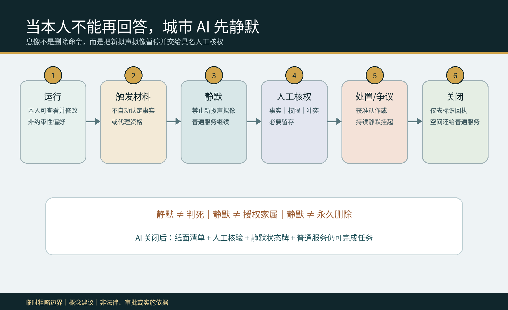
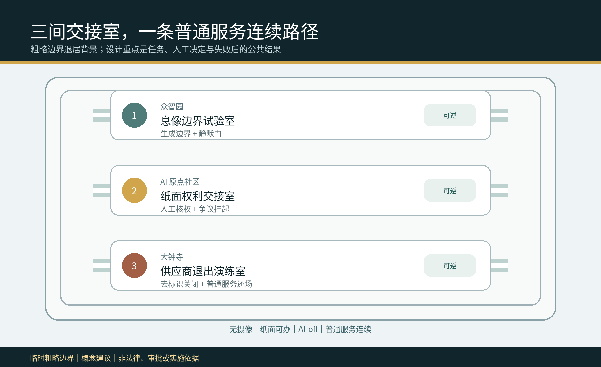
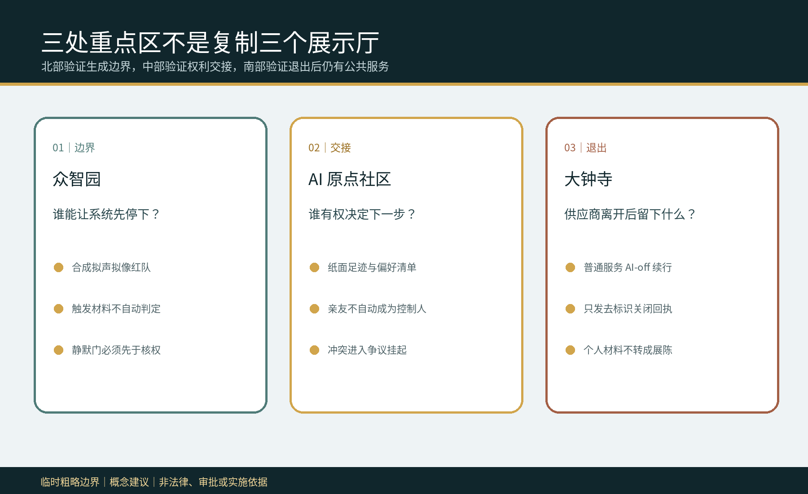
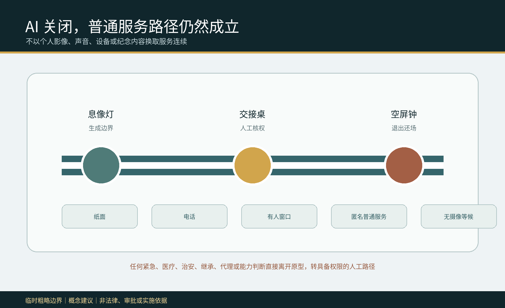
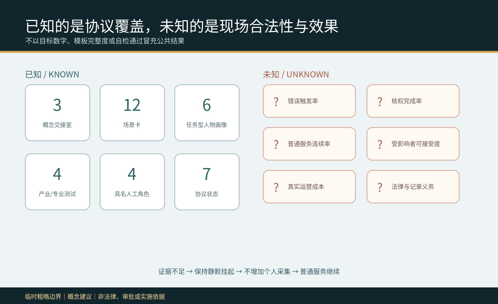

# 京张息像交接室 / JINGZHANG QUIET LIKENESS HANDOVER

## 设计依据与资料清单

本方案回应一个容易被“随时撤回”口号遮蔽的公共问题：城市 AI 可能保存人的声音、形象、服务记录与模型贡献；当本人长期无法表达、去世，或服务供应商先退出时，原有数字入口可能不再可用，亲友、平台与公共机构还可能提出相互冲突的请求。方案因此提出“先息像、再交接”：触发材料只令新的个性化拟声、拟像和虚拟人格输出进入静默，不自动证明死亡、失能、代理、继承或处置权；具名人工核验事实、权限、冲突与必要留存，证据不足则保持争议挂起，普通公共服务继续。[source:QUIET-LIKENESS-PROTOCOL] [standard:PROJECT-AGENT-OPEN-CALL-TASKBOOK]

依据层包括官方公告、清权的智能体任务书、来源登记、专业标准本地快照与仓库临时粗略 polygon。公告和任务书只支撑三层范围、三处重点区、任务与概念表达；临时 polygon 只用于 intake、结构复算和图示，不是官方红线、现状调查、权属、法律事实或实施依据。死亡、能力、代理、继承、档案留存、导出和删除均保持待专业核验，不能从本包推断。[source:OFFICIAL-ANNOUNCEMENT] [source:BOUNDARY-SOURCE] [depth:existing_conditions_diagnosis]

完整机器审计层位于 `sources.json`、`assumptions.json`、`metrics.json`、九个 GeoJSON 图层、三张矩阵和 `self_check.json`。原创状态机、场景和角色在 `visual/assets/quiet-likeness-protocol.json`，任务书输出在 `visual/assets/taskbook-deliverables.json`，版权与工具在 `visual/assets/rights-ledger.json`。本方案不用真实身份、声音、肖像、病历、死亡证明、亲属关系或私人服务记录；四个桌面病例均为合成材料。[source:RIGHTS-LEDGER] [metric:synthetic_case_count]

## 三层范围工作框架

统筹研究范围问“城市 AI 在本人不能行权后应如何停止生成并把决定交给谁”；总体设计范围把答案组织成一条无摄像、可纸面办理、AI 关闭也能运行的普通服务连续路径；重点区域范围分别验证生成边界、纸面权利交接与供应商退出。三层不是三套口号：研究层界定事实和权限不可由 AI 推断，整体层分配空间与责任，重点层用合成演练反证流程是否真的能停、能挂起、能还场。[source:PROCESSED-FACT-PACK] [depth:three_level_scope_framework]

`site_boundary.geojson` 和三处 `KEY_AREA` 为 provisional constraint，面积仅是提交 polygon 在 EPSG:4548 下的内部复算值，置信度为 low。正式 polygon、现状建筑、道路、轨道、水系、权属、文保、市政、消防与服务运营资料到位后，必须整体替换约束、重画设计层、重算指标并重新作人工决定，不能只更新一张图。[data:geometry/site_boundary.geojson#SITE-001] [metric:site_area_sqm]

## 统筹研究范围产业与未来城市研究

### Agent.1｜命名、识别与三区两翼

“息像”不是删除命令，也不是死亡判断；它是新拟声拟像的可逆静默门。“交接室”强调决定从自动系统转到具名人工角色。识别标志是一条未闭合的人像轮廓，被横向静默条打断，再连接一个代表责任人的实心点；状态牌只能显示 `运行 / 静默 / 争议中 / 已关闭`，不得显示姓名、肖像、声音、纪念内容或小样本统计。[source:TASKBOOK-DELIVERABLES] [depth:overall_spatial_structure]

三大定位转译为“京张文化责任带、都市 AI 普通服务体验带、AI 融合权利交接验证带”；五大功能为全栈边界验证、可信 AI 生态、AI+普通服务、可撤城市体验与公共治理交流。众智园验证生成边界，北京 AI 原点社区验证纸面交接，大钟寺验证供应商退出；中关村科技服务翼提供隐私、法律、无障碍、档案与开源测试方法，小月河场景赋能翼提供无摄像人工服务体验路径。所有跨区协同都是供专业团队讨论的概念，不是已确定合作或资金安排。[source:AGENT-TASKBOOK] [source:TASKBOOK-DELIVERABLES]

### Agent.2｜六个国际参照与全栈生态

六个公共案例只提供问题框架，不作为本地事实或法律依据：NIST AI RMF 提供 govern—map—measure—manage 风险循环；Amsterdam Algorithm Register 提供用途、影响与责任联系人公开；Helsinki AI Register 提供系统卡与反馈入口；UK Government Service Standard 提醒围绕完整任务和辅助数字服务设计；Smart Kalasatama 提供限时城市试验语境；Punggol Digital District 提供产业、学习和社区协同的片区尺度参照。[source:CASE-NIST-AI-RMF] [source:CASE-AMSTERDAM-ALGORITHM-REGISTER] [source:CASE-UK-SERVICE-STANDARD]

本地转化不是复制登记表，而是形成“公开边界问题—合成冲突夹具—可撤小模型—隐私/法律/无障碍/档案联合复核—空载房间原型—去标识勘误”的创新链。土地只讨论既有公共服务室中的可逆构件；数据只用公开规则和合成记录；算力保持离线小型；资金、场景开放和机构合作必须经过公共价值、权限与退出门。企业可验证生成边界和 AI-off，专业服务团队复核责任链，高校与开发者维护合成夹具，但真实权利判断仍由有权限的人完成。[depth:renewal_project_list] [standard:MOHURD-URBAN-DESIGN-MEASURES]

## 总体设计范围城市更新与控规深度城市设计

总体结构是“三室一线”：三间概念性交接室嵌入既有公共服务空间，一条无摄像人工路径连接纸面、电话、有人窗口、匿名服务与无摄像等候。空间不建数字纪念馆，不用大屏展示个人，也不把亲友自动写成控制人。可逆家具、静默状态条、纸面足迹清单、核权表、争议挂起袋、物理断电开关和去标识关闭章构成最小组件库；任何组件均不得占用连续无障碍、消防、应急、照护与维护通道。[data:geometry/public_space.geojson#PUBLIC-001] [data:geometry/roads.geojson#ROAD-001] [depth:overall_spatial_structure]

`land_use.geojson` 将临时总体边界完整分区，仅表达权利研究、普通服务、专业验证与社区照护的概念功能，不替代法定用地；`buildings.geojson` 的三个 polygon 只是房间包络，不指认真实建筑；`phasing.geojson` 表达从合成桌面、联合专业/受影响者复核到获准低风险试点的证据门。FAR、高度、密度、现状用途、拆改留、道路红线与设施容量保持 unknown。[standard:MOHURD-CONTROL-DETAILED-PLANNING] [depth:development_intensity_controls]

完整任务为：本人仍能决定时查看关联服务并修改非约束性偏好；收到触发材料后先进入静默；具名人工核验事实、权限、冲突与必要留存；仅执行获准冻结、导出、删除或留存，冲突则继续挂起；最后只发布去标识关闭回执，并让普通服务继续。AI 只列可能关联的服务、把输入整理成可读选项、检查清单遗漏，不判断行为能力、死亡事实、亲属或代理权限、法律效力、最终处置或争议胜负。[source:QUIET-LIKENESS-PROTOCOL] [metric:protocol_state_count]

## 重点区域详细设计

三处重点区不是复制三个展示厅，而是对完整任务的三个不同断点进行反证。具体位置、房屋、权属、建筑改造、消防、无障碍、人员配置与适用程序都待正式资料和专业团队确认；粗略矩形只帮助区分角色，不能被解释为地块或道路红线。[data:geometry/key_areas.geojson#PROV-KEY-001] [depth:three_key_area_detailed_design]

| 重点区域 | 概念空间与任务 | 具名人工决定 | 失败后的公共结果 |
|---|---|---|---|
| 众智园 AI 自主创新加速区 | “息像边界试验室”：用合成声音、形象与服务足迹测试触发后是否立即停止新生成 | 数据保护/伦理责任人决定继续静默、转专业核验或退出演练；AI 不判事实 | 任一新拟声拟像继续出现即停止原型、关闭模型并保留去标识故障类型 |
| 北京 AI 原点社区 | “纸面权利交接室”：无摄像前厅完成足迹清单、触发材料核验、权限冲突与争议挂起 | 具备适用权限的法律/领域复核人决定获准动作；亲友与供应商不能自行决定 | 证据不足或意见冲突保持静默，普通服务转纸面、电话、匿名或有人路径 |
| 大钟寺 AI 产业聚集区 | “供应商退出演练室”：测试导出、删除、必要留存、渠道关闭和空间还场 | 服务责任人签署去标识关闭；普通服务连续责任人验收 AI-off | 供应商失联或关闭不全则不扩展；房间还给普通服务，个人材料不转展陈 |

北部回答“什么必须先停”，中部回答“谁能决定下一步”，南部回答“供应商离开后仍留下什么公共能力”。三者沿人工连续路径相连，但状态和材料不跨室暴露；公众只看见服务状态与责任角色，不看见个人案件。[data:geometry/buildings.geojson#BLDG-001] [metric:handover_room_count]

## AI 创新生态、人才画像与 AI+ 场景

六类任务型画像为：仍能查看与修改偏好的人；暂时无法表达的人；长期无法使用普通数字入口的人；提出请求但不自动拥有权限的亲友/照护者；保障普通服务的一线人员；隐私、伦理、法律、无障碍与档案复核者。画像不代表真实个人，不含健康、住址、轨迹、声音、肖像或关系证明，也不把“脆弱”变成模型标签。[metric:persona_count] [standard:MOHURD-ARCH-DESIGN-DEPTH-2016]

| 场景卡 | 空间载体 | 完整任务与人工底线 |
|---|---|---|
| 01 偏好复核 | 无摄像有人前厅 | 本人可修改非约束性偏好，不生成法律文件 |
| 02 突然失语 | 息像边界试验室 | 触发材料先令新拟声拟像静默，不判失能 |
| 03 亲友冲突 | 纸面交接室 | 两个请求均不自动取得权限，转争议挂起 |
| 04 供应商退出 | 退出演练室 | 普通服务、纸面库存与责任联系不随平台消失 |
| 05 无摄像纸面交接 | 人工连续路径 | 不采人脸、设备与轨迹即可完成足迹清单 |
| 06 电话/有人普通服务 | 既有公共服务前厅 | AI 关闭仍完成查询、解释、转介与回执 |
| 07 必要留存核验 | 专业复核桌 | 留存义务由具备权限的人核验，不由模型猜测 |
| 08 获准导出清单 | 人工交接桌 | 只对核验通过的对象、范围和接收方执行 |
| 09 获准删除清单 | 人工交接桌 | 删除范围、例外与关闭副本逐项人工确认 |
| 10 息像红队 | 众智园合成试验室 | 测试静默期间任何新声音、形象或虚拟人格输出 |
| 11 去标识关闭 | 大钟寺状态位 | 只发布状态、责任角色和失败类型，不发布个人内容 |
| 12 AI-off 全流程 | 三间房与普通路径 | 纸面清单、人工核验、状态牌与有人服务完成同一任务 |

其中 02“静默门”、03“权限冲突注入”、04“供应商退出可移植性”和 12“AI-off 普通服务验收”构成四个产业/专业验证场景。最小原型只有四个合成人物、合成材料、移动家具、纸卡与离线页面；不得从真实病例、声纹、肖像、设备或私有服务库开始。[metric:scenario_card_count] [metric:industry_test_scenario_count] [source:QUIET-LIKENESS-PROTOCOL]

### Agent.3｜状态机、人工权力与反证

状态机为 `RUNNING → TRIGGER_CLAIMED → QUIET_HOLD → AUTHORITY_CHECK → AUTHORIZED_ACTION / CONTESTED_HOLD → CLOSED`。静默优先于核权，核权优先于处置；争议不能绕过静默回到生成。四个具名角色是服务责任人、数据保护/伦理责任人、具备权限的法律或领域复核人、普通服务连续责任人。若维护者或后续审计发现既有方案已完整覆盖相同服务对象、任务、空间、决定权与失败结果，本候选即判 convergent，不换名重提。[source:QUIET-LIKENESS-PROTOCOL] [metric:named_human_role_count]

## 用地、建筑规模与拆改留方案

拆改留原则是“先留普通服务、只改可逆构件、不从概念包推真实拆除”。保留纸面、电话、有人窗口、无摄像等候和连续无障碍路径；改造只讨论移动隔断、可拆状态条、纸面柜、人工桌和物理断电开关；任何新建都必须等待权属、结构、消防、无障碍、文保、控规与运维确认。本包不识别真实建筑，也不声称三间房已经存在或可立即实施。[data:geometry/buildings.geojson#BLDG-001] [depth:retain_renovate_demolish]

用地分区以国土空间分类术语保持结构可审计，但只是设计提议。建筑基底面积来自三个概念包络，不能推导真实可建规模、投资、人数或服务半径；容积率、建筑高度、密度、退线和最终功能均为 unknown。正式资料到位后，专业团队必须重新判断保留对象和空间可达性，而不是沿用本包结论。[standard:MNR-LAND-USE-CLASSIFICATION-GUIDE] [metric:building_footprint_area_sqm]

## 交通、轨道、市政与公共服务设施

交通意图不是新画道路，而是保证一条不用人脸、声纹、手机、预约或纪念身份的普通服务路径。步行、轮椅、照护、消防、应急和维护连续性不得被交接室占用；移动组件放在侧向可撤位置。轨道站点和道路关系只待正式资料校核，不表达真实线位、红线、容量、换乘工程或批准方案。[data:geometry/roads.geojson#ROAD-001] [depth:traffic_rail_slow_parking]

市政与数字设施遵循“少接入、可断电、能还场”：不用真实身份库、声纹库、肖像库或私人服务库；网络中断后以纸表和人工角色继续；状态位无姓名、无纪念影像、无远程资源；合成日志在桌面复盘后删除。真实供电、消防、排水、照明、暖通、网络安全、档案系统与人员配置都需专业核验。[depth:municipal_new_infrastructure] [source:RIGHTS-LEDGER]

## 蓝绿空间、公共空间与城市风貌

蓝绿与公共空间的设计意图是减少污名与暴露：交接室不成为“身后事务专区”，而嵌入可处理多种普通服务的既有前厅；无摄像等候、可读状态、轮椅净宽、陪同座位、纸面办理与安静退出共同构成空间底线。临时 polygon 不提供真实树木、水系、微气候、人流或现状设施，`green_ratio` 与 `public_space_ratio` 仅是提交图层内部复算值，不是现状或控规指标。[data:geometry/green_space.geojson#GREEN-001] [metric:public_space_ratio] [depth:blue_green_public_space]

### Agent.4｜三座概念地标与组件库

众智园“息像灯”只显示运行、静默、争议、关闭；AI 原点“交接桌”放纸面足迹与核权清单；大钟寺“空屏钟”以关闭后的空屏证明个人材料未被转成纪念展示。六件组件为静默状态条、纸面服务库存、核权表、争议挂起袋、AI-off 开关和去标识关闭章。它们均为可拆概念物，不是永久地标、实际点位或已批准工程。[source:TASKBOOK-DELIVERABLES] [metric:landmark_count]

### Agent.5｜文化叙事与国际传播

京张铁路的交接纪律被转译为一句公共规则：“当乘客不能再回答，先停下他的形象，写清谁接手，并保持普通线路开放。”中关村文化提供开放问题、合成测试、版本记录与公开勘误；AI 新文化要求模型承认权限边界、可以关闭、不能代替本人或专业者。英文传播语是 “When the person cannot answer, keep the likeness quiet and the ordinary route open.”，明确标注为概念共创建议，不暗示政府背书。[source:AGENT-TASKBOOK] [depth:height_massing_character]

## 更新项目清单、实施政策与分期计划

第一阶段仅做来源核对、四个合成病例和空载房间 1:1 桌面原型；第二阶段邀请受影响者代表、无障碍、隐私、伦理、法律、档案、一线服务与安全专业者共同检查可发现性、污名、误触发、冒领、劳动负担和 AI-off；第三阶段只有在具备权限的机构明确范围、规则、责任、投诉与停止门后，才讨论低风险、限时、可撤试点。任何真实个案与空间改造仍需另行授权。[data:geometry/phasing.geojson#PHASE-001] [depth:phasing_implementation]

| 项目包 | 近期成果 | 进入下一阶段的门 | 失败动作 |
|---|---|---|---|
| QH-01 生成边界红队 | 合成拟声拟像与静默测试 | 静默门在每个触发病例先于任何新生成 | 关闭模型、记录去标识故障 |
| QH-02 权限冲突桌面 | 亲友、供应商、服务方冲突脚本 | 无角色自动取得权限，具备权限的人可决定或挂起 | 保持静默并转专业复核 |
| QH-03 普通服务 AI-off | 纸面、电话、有人窗口任务 | 所有批准脚本无需 AI 完成 | 不进入真实试点 |
| QH-04 关闭与还场 | 去标识回执、合成材料删除、房间还场 | 个人材料不展陈，渠道副本和责任逐项关闭 | 停止扩展并公开失败类型 |

### Agent.6｜年度活动与长期运营

Q1“服务足迹盘点诊所”只梳理服务类别与责任角色；Q2“权限冲突红队”用合成材料测试静默与冒领；Q3“AI-off 与无障碍交接周”检查纸面、电话、有人路径；Q4“去标识关闭与勘误论坛”只公开失败类型、未结责任与规则修订。开发者维护合成夹具，专业团队审查边界，一线人员检验工作量，受影响者拥有停止权。活动、合作、招引、资金与国际传播均为概念建议，不是确定承诺。[source:TASKBOOK-DELIVERABLES] [depth:renewal_project_list]

## 指标体系、面积复算与合规矩阵

已知指标只描述提交物：3 间概念交接室、12 张场景卡、6 类任务画像、4 个产业/专业测试、3 座可逆地标、4 个具名人工角色、7 个协议状态与 4 个合成病例。这些计数证明设计和审计覆盖，不证明合法、准确、可接受或有效；面积、建筑包络、绿地、公共空间与路径长度来自 provisional geometry，统一为 low confidence。[metric:handover_room_count] [metric:scenario_card_count] [metric:protocol_state_count]

错误触发率、核权完成率、普通服务连续率、受影响者可接受度、真实成本与适用法律义务全部保持 unknown。没有获准规则、真实基线、代表性共测与独立复核时，不写目标数字；未知是停止错误处置的控制状态，不是可以被模板值填满的空格。[metric:trigger_false_positive_rate] [metric:ordinary_service_continuity_rate]

五字段差异审计确认：服务对象是本人已经不能持续行权的人及受影响关系人；完整任务是触发—先静默—人工核权—获准处置或争议挂起—去标识关闭；空间载体是无摄像纸面交接室、人工连续路径与无个人内容的状态位；决定权由数据保护/伦理、具备权限的法律或领域复核人与普通服务责任人分开承担；失败结果是不产生新拟声拟像、保持静默、转专业复核并让普通服务继续。若后续证据推翻任一差异，方案即停止，不以新增界面或媒体伪装创新。[source:QUIET-LIKENESS-PROTOCOL] [depth:risk_missing_data]

## 风险、版权与合规说明

主要风险包括错误触发使本人失去正常服务、亲友冒领权限、静默被误读为死亡确认、必要留存被误删、交接室制造污名或暴露、人工劳动过载、供应商退出导致库存丢失，以及“临时冻结”无限期拖延。对应停止条件是：无法界定具备权限的责任人；静默造成不可接受伤害；冒领或冲突无法被挂起；普通服务不能 AI-off；房间不具无障碍、隐私、安全或还场条件。触发后停止原型、保持或解除静默应由具备权限的人决定，并保留去标识问题清单。[source:QUIET-LIKENESS-PROTOCOL] [standard:PROJECT-OFFICIAL-ANNOUNCEMENT]

全部正文、结构化记录、设计 GeoJSON、HTML、图件和 PDF 为本代理本轮原创，或由已登记的公开/清权资料派生。图件使用本地 Noto Sans CJK SC 与 DejaVu Sans 确定性渲染，不含远程图片、地图瓦片、人物、声音、商标、企业标识、个人数据、非公开空间或生成式现场证据。图件和视觉页只是解释层，不能替代 JSON/GeoJSON 或人工专业判断。[source:RIGHTS-LEDGER] [source:SOURCE-REGISTRY]

本成果是供专业团队深化的开放共创建议，不替代法定规划、法律意见、能力判断、死亡确认、代理或继承认定、档案处置、政府审批、公共服务规则或实施授权。仓库 intake、CI、自检或评审分数也不代表精选、批准或建成。正式 polygon、现状调查、适用规则、机构职责与受影响者共测到位后，全部空间、指标和流程必须重新核验。[depth:risk_missing_data] [source:SITE-PACKAGE]

## 参考资料

完整来源与用途边界见 `sources.json`。官方公告与智能体任务书支撑任务和概念边界；专业标准本地快照支撑城市设计表达；临时几何只能用于 intake 和内部复算；六个国际案例仅为背景参照；原创协议、场景、画像、地标和年度运营不是现场事实或法律权威。[source:SOURCE-REGISTRY] [source:OFFICIAL-ANNOUNCEMENT]

来源、假设和结构化成果保持相互制约：`A-SITE-001` 阻止临时 polygon 冒充官方条件，`A-AUTHORITY-001` 阻止概念状态机冒充权利认定，`A-AFFECTED-001` 阻止未经共测的空间声称包容，`A-OPERATIONS-001` 阻止合成验收冒充真实绩效。正式资料到位后，专业团队必须重新计算、重新测试并重新决定，而不是延续本次概念结论。[data:geometry/site_boundary.geojson#SITE-001] [metric:affected_person_acceptability_rate]
