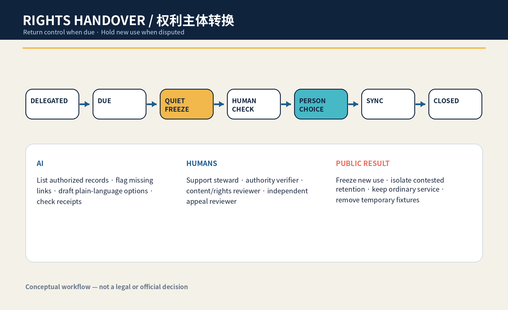
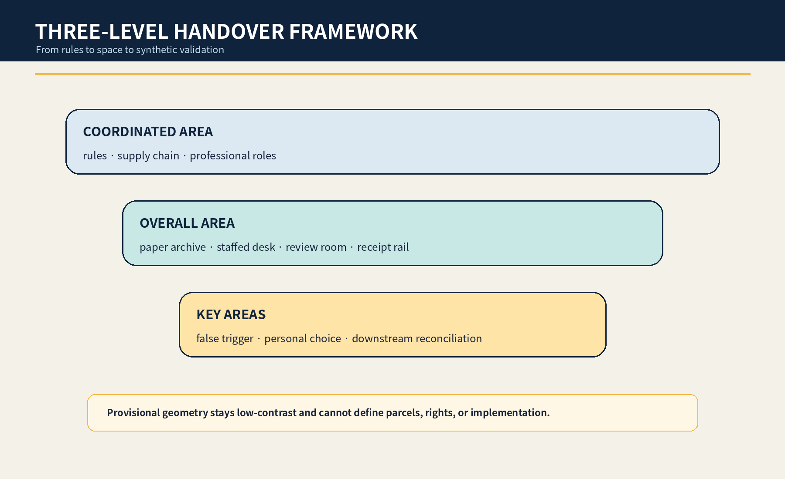
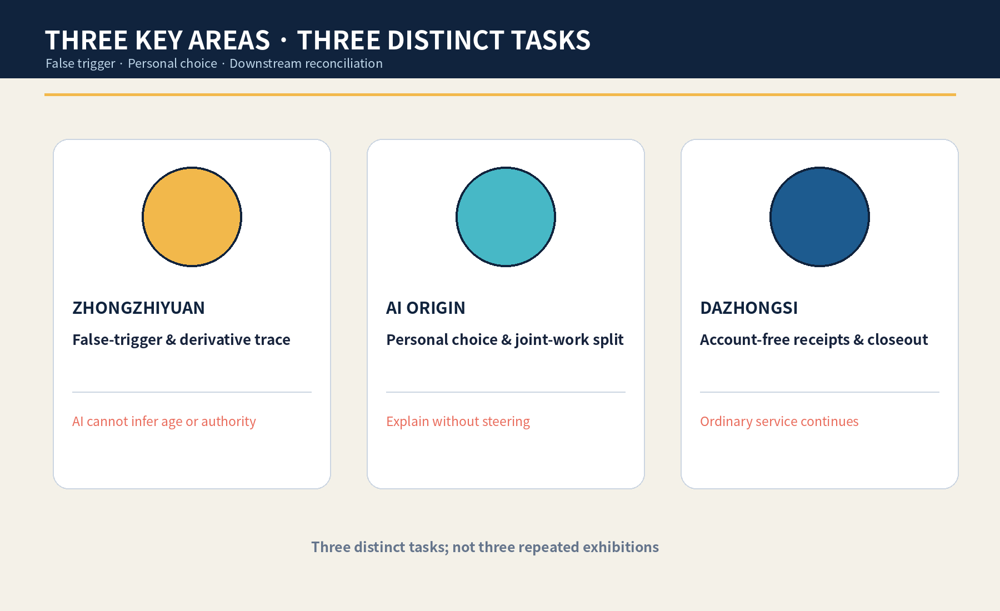
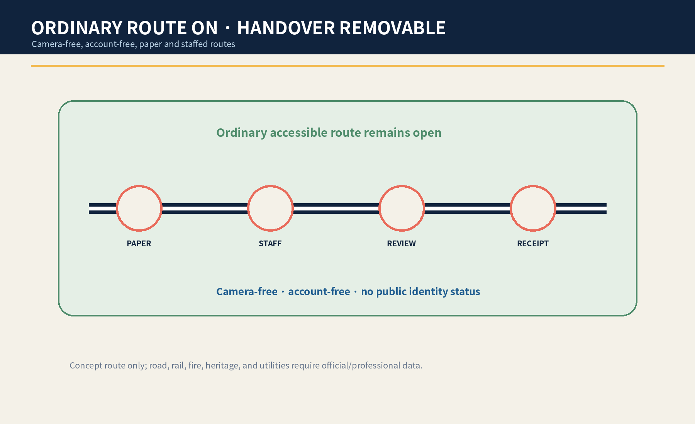
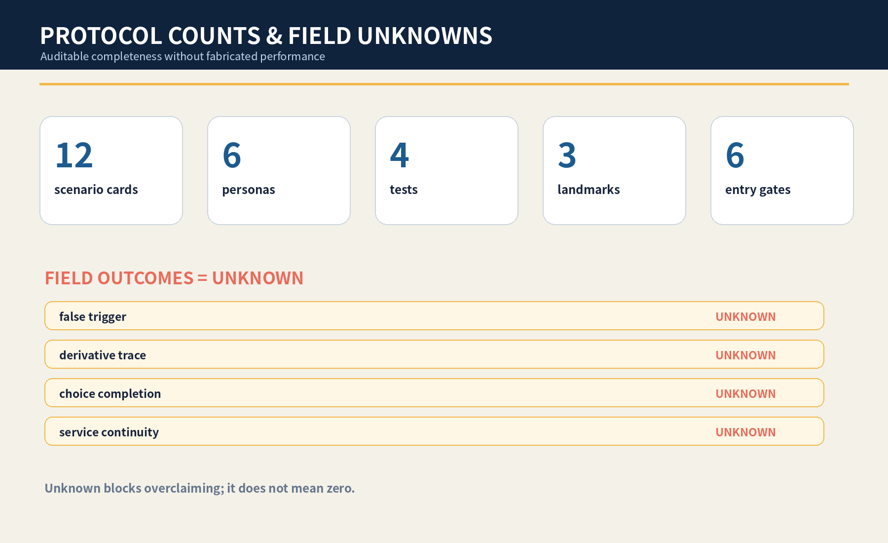

# JINGZHANG RIGHTS HANDOVER STATION / 京张换手站

> **Return control when due; hold new use when disputed.** AI does not decide adulthood, capacity, guardianship, copyright, or deletion duties. The concept creates a reachable, stoppable, appealable urban task for professional verification and personal choice.

## Design Basis and Source List

This is a formal concept package for professional teams, affected young people, and public-service operators to deepen together. It uses the public announcement, cleared Agent Taskbook, central source registry, local standards snapshots, and repository provisional polygons. Those polygons support intake, internal recalculation, and conceptual diagrams only; they are not official redlines, property evidence, existing-condition surveys, or implementation authority. [source:OFFICIAL-ANNOUNCEMENT] [source:AGENT-TASKBOOK] [data:geometry/site_boundary.geojson#SITE-001]

The public problem is not generic child-data protection. It is a time-bound transfer task: when AI learning, creative, guide, or test participation previously handled through a guardian or institution reaches a point at which the person should act for themself, new personalization, public display, and derived use enter a quiet freeze. Named humans verify the trigger, authority conflicts, joint creation, and any potentially required retention; the person then chooses continue, time-limit, export, correct, withdraw, or dispute. Adulthood, capacity, representation, copyright, retention, and deletion remain professional determinations; AI may not declare them. [standard:PROJECT-AGENT-OPEN-CALL-TASKBOOK] [depth:existing_conditions_diagnosis]

## Three-Level Scope Framework

The coordinated area asks how education, culture, public service, platforms, and vendors can return control when due. The overall area organizes a handover spine of paper footprint archive, camera-free staffed desk, independent review room, derivative-trace desk, and downstream receipt rail. The three key areas test false-trigger prevention, personal choice, and downstream withdrawal. [source:PROCESSED-FACT-PACK] [depth:three_level_scope_framework] [metric:site_area_sqm]

Every boundary and key-area polygon is provisional. Areas are internal EPSG:4548 recalculations with low confidence. Official polygons, real operators, buildings, heritage, roads, footfall, and service procedures require a full redraw, recalculation, and renewed decision. [source:BOUNDARY-SOURCE] [data:geometry/key_areas.geojson#PROV-KEY-001] [metric:key_area_count]

## Coordinated Research Area: Industry and Future City Research

The station organizes universities, communities, services, privacy/copyright professionals, vendors, and maintainers into an inventory-freeze-verify-choice-receipt-appeal chain. AI lists only authorized records, flags missing links, drafts bilingual options, and checks receipts; it cannot infer age, capacity, guardianship, authorship, or deletion duties. [source:SOURCE-REGISTRY] [source:GENERATIVE-AI-MEASURES]

Six international references provide question frames only: UNICEF for participation and well-being; the ICO code for age-appropriate and high-privacy defaults; the UK Service Standard for whole tasks and assisted routes; Amsterdam and Helsinki registers for purpose, impact, contacts, and feedback; and NIST AI RMF for risk cycles. None proves local law or performance. [source:CASE-UNICEF-AI-CHILDREN] [source:CASE-ICO-CHILDRENS-CODE] [source:CASE-NIST-AI-RMF]

### Agent.1 | Identity and Three Areas / Two Wings

The name borrows the visibility of railway points and signed handovers without using railway operating marks or an official logo. Two open hands, a reversible switch hinge, and an amber quiet-hold line express named transfer, reachable personal choice, and traceable supply chains. [source:TASKBOOK-DELIVERABLES] [depth:height_massing_character]

Zhongzhiyuan tests false triggers and derivatives; AI Origin hosts personal choice and joint-work review; Dazhongsi handles account-free service and receipts. The two wings are method and reversible-explanation invitations only, not confirmed partnerships or funding. [source:AGENT-TASKBOOK] [depth:overall_spatial_structure]

### Agent.2 | Ecosystem

Seven elements are a public problem register, synthetic transition fixtures, derivative-trace adapters, plain-language option library, professional-review roster, paper/staffed routes, and downstream receipts with public corrections. Land, data, compute, funding, and scenario access remain bounded, staged, and stoppable. [source:TASKBOOK-DELIVERABLES] [depth:renewal_project_list]

## Overall Design Area: Urban Renewal and Regulatory-Plan-Level Urban Design

The overall structure embeds a temporal public task in ordinary service rather than building a data hall. A paper archive shows known and missing copies; a camera-free desk supports reading and choice; an independent room handles authority, joint work, and retention conflicts; a derivative desk uses synthetic fixtures only; a receipt rail shows synchronized, pending, or disputed status. No status board exposes identity, age, content, or dispute detail. [data:geometry/public_space.geojson#PUBLIC-001] [data:geometry/roads.geojson#ROAD-001] [depth:overall_spatial_structure]

All land-use, building, road, green, public-space, and phasing layers are conceptual. FAR, height, density, real capacity, operations, heritage, fire, ownership, transport, and construction conditions remain pending official data. [standard:MOHURD-CONTROL-DETAILED-PLANNING] [depth:development_intensity_controls]

## Detailed Design of Key Areas

| Area | Concept task | Named decision and failure result |
|---|---|---|
| Zhongzhiyuan | False-trigger and derivative lab using synthetic birthdays, school status, joint works, and vendor exit | The verifier signs; any inference or broken trace keeps new use frozen |
| AI Origin Community | Personal-choice court with paper footprints, six choices, joint-work split, and independent review | The support steward explains without steering; disputes hold only affected branches |
| Dazhongsi | Receipt signal box for account-free handling and downstream display/web/event reconciliation | Content/rights and appeal reviewers sign; ordinary service continues and temporary fixtures are removed on failure |

North asks whether the system falsely triggers, center whether the person can truly choose, and south whether the choice reaches downstream and closes. These are rough concept carriers, not real institutions, buildings, or parcels. [data:geometry/key_areas.geojson#PROV-KEY-002] [depth:three_key_area_detailed_design] [assumption:A-SITE-001]

## AI Innovation Ecosystem, Personas, and AI+ Scenarios

Six personas cover young people reaching independent action, people without the old account/device, joint creators, caregivers or guardians, professional reviewers, and exit/handover operators. They describe tasks and power relations only; no real identities, ages, homes, health, family conflict, or works are used. [metric:persona_count] [depth:public_service_facilities]

| Card | Carrier | Human floor |
|---|---|---|
| S01 Voice-guide return | AI Origin learning lobby | The person reviews source, versions, and display scope; unresolved authority stays frozen |
| S02 Joint-work split | camera-free handover desk | Joint credit and individual data are separated; only disputed branches are held |
| S03 Guardian disagreement | independent review room | No related party may continue use alone; ordinary learning continues |
| S04 School-closure handover | paper footprint archive | The operator hands over inventory, owner, and contacts before exit |
| S05 Missing-vendor freeze | Zhongzhiyuan derivative-trace desk | Unlocatable derivatives stop expansion and enter a gap register |
| S06 Display withdrawal | contribution and honor node | Withdrawal reaches signs, web, and event material without erasing required audit |
| S07 Training-use stop | controlled synthetic sandbox | Disputed samples and traceable derivatives are disabled; no claim of perfect model forgetting |
| S08 Account-free self service | Dazhongsi staffed interface | The old account, device, or family device is never the only identity route |
| S09 Lawful-retention isolation | content-rights review seat | Potential lawful retention is separated from continued use pending professional review |
| S10 False-trigger red team | Zhongzhiyuan synthetic verification lab | AI cannot declare the trigger from birth date, school status, or appearance |
| S11 AI-off paper handover | all three key areas | Paper forms, staffed contact, and signed receipts complete the same task |
| S12 Pilot closeout | removable handover pocket | Delete synthetic rehearsal data, remove fixtures, and publish de-identified failure types |

S05 derivative trace, S10 false-trigger red team, S11 AI-off paper handover, and S06 downstream reconciliation are four industry/professional tests. Eight synthetic personas, paper cards, version tags, an offline inventory, and removable signs form the minimum prototype. [metric:scenario_card_count] [metric:industry_test_scenario_count] [source:RIGHTS-HANDOVER-PROTOCOL]

### Agent.3 | State Machine

The states are `DELEGATED → DUE → QUIET_FREEZE → HUMAN_CHECK → PERSON_CHOICE → SYNC → CLOSED`. Before choice, the package requires an inventory, named trigger verification, freeze of new use, separate joint-work/retention holds, paper and staffed options, and an AI-off drill. Failure returns to quiet freeze. [source:RIGHTS-HANDOVER-PROTOCOL] [metric:entry_gate_count]

Four named roles explain, verify, review rights/content, and independently hear appeals. AI lists, flags gaps, drafts explanations, and checks receipts; it does not decide adulthood, capacity, representation, copyright, retention, deletion, eligibility, or space. [metric:named_human_role_count] [depth:risk_missing_data]

## Land Use, Building Scale, and Retain-Renovate-Demolish Strategy

The spatial strategy retains ordinary learning, advice, passage, and staffed service. Adaptation is limited to paper archives, removable desks/screens, soft acoustic elements, temporary signs, and offline receipt rails. New construction is not proposed before property, fire, accessibility, heritage, structure, operations, and professional procedures are confirmed. [data:geometry/buildings.geojson#BLDG-001] [metric:building_footprint_area_sqm] [depth:retain_renovate_demolish]

The land-use layer is a topology-complete conceptual partition, not statutory land use. Real use, service radius, property, institutional authority, and safety require professional confirmation. [data:geometry/land_use.geojson#LU-001] [standard:MNR-LAND-USE-CLASSIFICATION-GUIDE]

## Transport, Rail, Municipal Infrastructure, and Public Services

Continuous walking, wheelchair, care, fire, emergency, and maintenance routes are not occupied. Archives and review desks stay in removable side bands. People without the old account, family device, or online channel cannot be sent to a farther, inferior, or exposing route. [data:geometry/roads.geojson#ROAD-001] [depth:traffic_rail_slow_parking]

Municipal and digital infrastructure is minimally connected, power-off capable, and reconcilable. The prototype does not connect real identity, school, account, or training systems. Staffed lobbies, telephone, paper choice cards, and static signs preserve the task offline. Article 39 of the Barrier-Free Environment Law is cited only for its expressly listed public-service venues, not generalized. [standard:BARRIER-FREE-ENVIRONMENT-LAW] [depth:municipal_new_infrastructure]

## Blue-Green Network, Public Space, and Urban Character

Blue-green and public space let a person seek help without proving identity, age, or family relation through a public display surface: shade, seating, clear accessible width, quiet review, and staff visibility without content visibility. Green and public-space ratios are internal concept calculations only. [data:geometry/green_space.geojson#GREEN-001] [metric:green_ratio] [depth:blue_green_public_space]

Navy means named responsibility, cyan personal choice, amber quiet freeze, and coral stop. No face, child photo, age icon, school/company logo, or personal work appears. Text, shape, and position carry meaning in addition to color. [source:RIGHTS-LEDGER] [depth:height_massing_character]

### Agent.4 | Landmarks and Components

The Return Gauge shows trace gaps and freeze state; the Self-Sign Ring holds six choices without public content; the Quiet Signal Box shows downstream synchronization and closure. Six removable components are a footprint folder, paper choice cards, quiet signal, derivative tags, receipt rail, and physical AI-off switch. [metric:landmark_count] [source:TASKBOOK-DELIVERABLES]

### Agent.5 | Cultural Narrative and International Communication

The cultural narrative does not reproduce railway imagery. It translates visible points, named handover, and an uninterrupted public journey into the return of digital rights; translates Zhongguancun's open questions, versioned provenance, reproducible tests, and public corrections into verifiable innovation culture; and defines an AI new culture in which systems do not retain control merely because they retained data. Together they connect historical responsibility, technical verification, and personal agency without operating marks, archival photographs, portraits, or uncleared cultural assets. [source:TASKBOOK-DELIVERABLES] [source:RIGHTS-LEDGER]

External communication uses only the bilingual proposition “到点交回本人；有争议先静默 / Return control when due; hold new use when disputed,” supported by auditable demonstrations of seven states, six choices, and three receipt types. International references compare question frameworks for child participation, high-privacy defaults, whole tasks, algorithm registers, and risk cycles; they are not presented as local law, and city branding, partner names, or event promises never substitute for the person's choice. [source:TASKBOOK-DELIVERABLES] [source:SOURCE-REGISTRY]

## Renewal Projects, Implementation Policy, and Phasing

Near term covers sources, role questions, eight synthetic personas, false-trigger tests, and one unoccupied paper prototype. Mid term invites affected young people and youth-service, privacy, copyright, accessibility, operations, and safety professionals. Long term considers only a low-risk authorized time-bounded trial after responsibility, site, safety, exit, and downstream interfaces are ready. [data:geometry/phasing.geojson#PHASE-001] [depth:phasing_implementation]

Nine project packages cover sources/roles, synthetic fixtures, false-trigger red team, footprint inventory, personal choice, joint-work split, downstream reconciliation, appeal, and closeout. Every package needs an owner, stop condition, paper equivalent, and receipt. [source:RIGHTS-HANDOVER-PROTOCOL] [depth:renewal_project_list]

### Agent.6 | Annual Operations

Q1 is an inventory clinic; Q2 co-tests personal choices and joint works with synthetic fixtures; Q3 red-teams broken derivatives, vendor exit, and AI-off; Q4 publishes only de-identified failure types and method revisions. The transformation path is public problem → synthetic validation → unoccupied prototype → affected-person/professional review → authorized removable trial → public correction. Activities, partnerships, and funding are concepts only. [source:TASKBOOK-DELIVERABLES] [depth:phasing_implementation]

## Metrics, Area Recalculation, and Compliance Matrix

The package contains 12 cards, 6 personas, 4 tests, 3 landmarks, 4 named human roles, 6 entry gates, and 8 synthetic scripts. Counts prove that candidate-specific deliverables exist, not legal validity, valid personal choice, traceability, or successful service. Geometry metrics have low confidence. [metric:scenario_card_count] [metric:persona_count] [metric:entry_gate_count]

False-trigger rate, derivative-trace coverage, choice completion, downstream reconciliation time, and ordinary-service continuity remain unknown without an authorized site, applicable procedures, representative sample, affected-person co-design, and independent review. [metric:false_trigger_rate] [metric:derivative_trace_coverage_rate] [metric:ordinary_service_continuity_rate]

The five-field audit distinguishes this complete transition-to-self chain from nearby guardian-consent, general withdrawal, bounded-retention, and incapacity/posthumous-silence mechanisms. If a full equivalent is found later, the candidate becomes convergent and will not be renamed or resubmitted. [source:RIGHTS-HANDOVER-PROTOCOL] [depth:risk_missing_data]

## Risk, Copyright, and Compliance

Risks are false triggers, exposure through assisted service, unilateral treatment of joint works, untraceable derivatives, confusion between retention and continued use, escalation of family conflict, and suspension of ordinary service. Real personal data, AI inference of age/capacity/authority/copyright, missing roles or appeal, inability to disable a disputed derivative, or failed paper/staffed access stops the prototype and keeps new use frozen. [source:RIGHTS-HANDOVER-PROTOCOL] [assumption:A-TRIGGER-001] [depth:risk_missing_data]

All candidate-specific prose, JSON/GeoJSON properties, HTML, figures, and PDFs are original in this run. Schema-valid fields, topology-safe generic concept geometry, and deterministic layout technique reuse the author's merged `jingzhang-unknown-zero` structure and are disclosed. No peer image, narrative, name, or distinctive object is copied. [source:RIGHTS-LEDGER] [source:SOURCE-REGISTRY]

This is an open co-creation concept, not statutory planning, legal advice, public-service regulation, government review, or implementation authorization. Intake, CI, self-check, or score is not selection, approval, construction, or endorsement. [standard:PROJECT-OFFICIAL-ANNOUNCEMENT] [assumption:A-CONTROLS-001]

## References

The complete ledger is in `sources.json`. The announcement and Taskbook support scope, tasks, and concept boundaries only. Central standards are used only within their explicit scope. UNICEF, the ICO, the UK Service Standard, algorithm registers, and NIST provide comparison questions, not local law, demand, performance, or legality. [source:SOURCE-REGISTRY] [source:OFFICIAL-ANNOUNCEMENT]

Provisional GeoJSON supports rough constraints and internal calculations only. The applicable transition point, authority, joint creation, retention, deletion, and downstream model treatment require case-specific professional decisions. New evidence freezes affected claims and triggers bilingual and metric regeneration plus renewed self-check. [data:geometry/site_boundary.geojson#SITE-001] [metric:false_trigger_rate] [assumption:A-TRIGGER-001]
