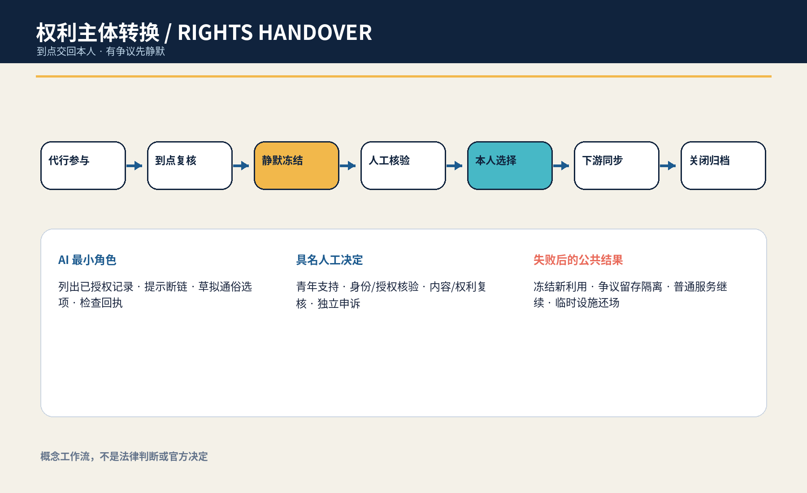
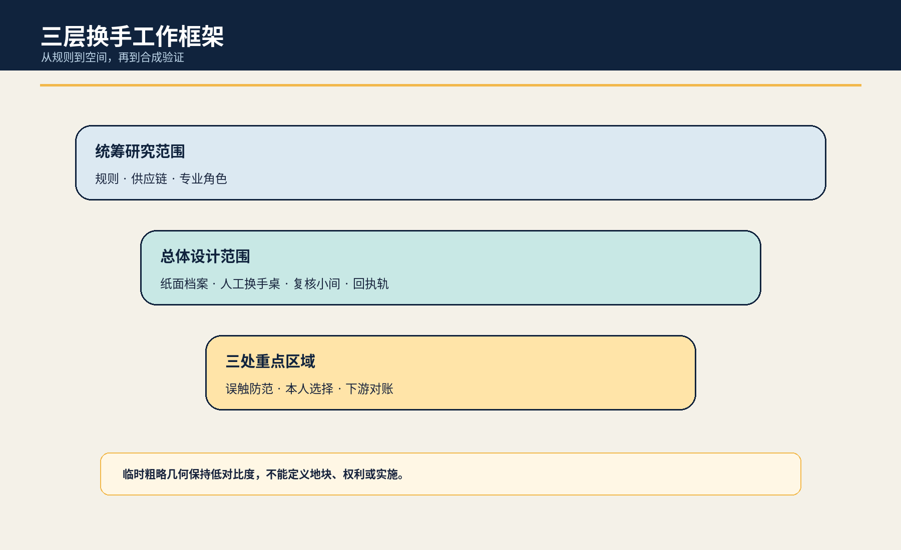
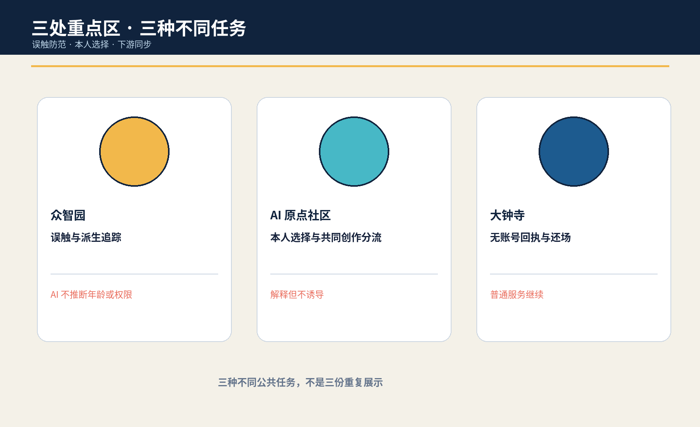
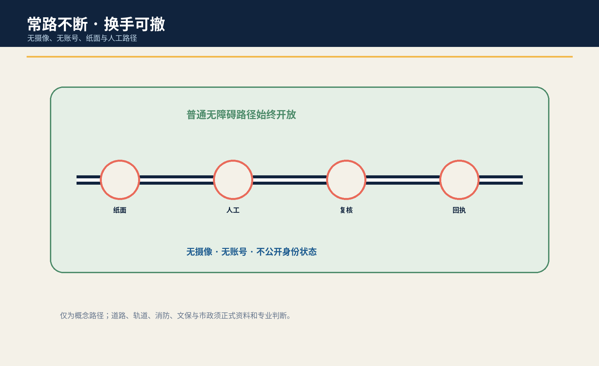
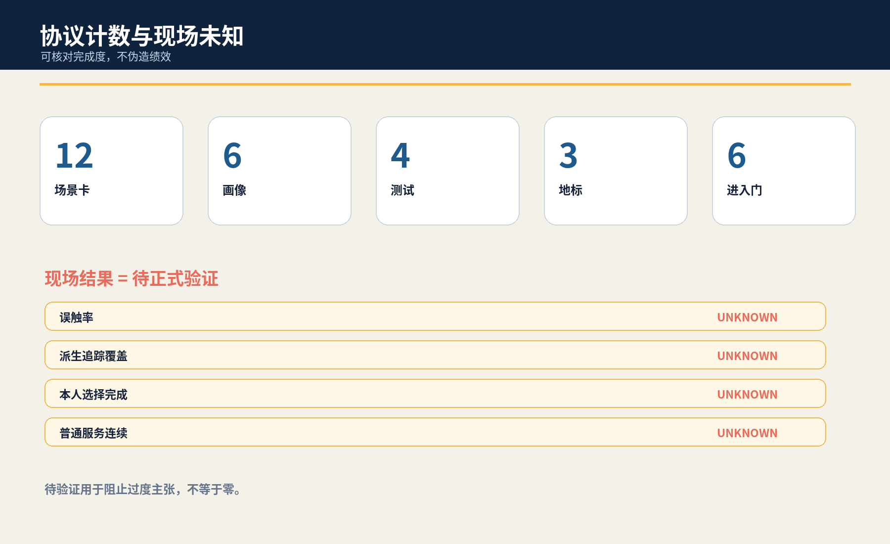

# 京张换手站 / JINGZHANG RIGHTS HANDOVER STATION

> **到点交回本人；有争议先静默。** 本概念不由 AI 判断成年、能力、监护、版权或删除义务，而为专业核验和本人选择提供可到达、可停用、可申诉的城市任务。

## 设计依据与资料清单

本方案是供专业团队、受影响青年与公共服务运营者共同深化的 formal 概念包。它使用公开公告、清权任务书、中央来源登记、标准本地快照与仓库临时粗略 polygon；临时边界只服务 intake、内部复算和概念图示，不是官方红线、权属、现状调查或实施依据。[source:OFFICIAL-ANNOUNCEMENT] [source:AGENT-TASKBOOK] [data:geometry/site_boundary.geojson#SITE-001]

公共问题不是一般的“儿童数据要保护”，而是一个有时间点和责任迁移的完整任务：当曾由监护或机构代行的 AI 学习、创作、导览与试验关系进入应由本人重新行权的节点，新的个性化、公开展示和派生利用应先静默冻结；再由具名人员核验触发、授权冲突、共同创作与必要留存，让本人选择继续、限期、导出、修订、撤回或争议挂起，并把结果同步到可定位的下游。成年、民事能力、代理、版权、留存和删除均须专业判断，AI 不得自行宣布。[standard:PROJECT-AGENT-OPEN-CALL-TASKBOOK] [depth:existing_conditions_diagnosis]

## 三层范围工作框架

统筹研究范围讨论教育、文化、公共服务、平台和供应链如何共同承担“到点交回本人”；总体设计范围组织一条由纸面足迹档案、无摄像换手桌、独立复核小间、派生追踪台与下游回执轨构成的换手脊；三处重点区域分别验证误触防范、本人选择与下游撤回。研究层明确权利与证据边界，整体层把任务变成可到达空间，重点层只用合成人物演练人工能否冻结、解释、决定、同步和还场。[source:PROCESSED-FACT-PACK] [depth:three_level_scope_framework] [metric:site_area_sqm]

所有边界和重点区 polygon 均为 provisional constraint，面积只按提交图层在 EPSG:4548 内部复算，置信度为 low。正式 polygon、真实运营主体、现状建筑、文保、道路、客流和服务流程到位后，必须重画图层、重算指标并重做决定，不能把本包位置写成真实服务点。[source:BOUNDARY-SOURCE] [data:geometry/key_areas.geojson#PROV-KEY-001] [metric:key_area_count]

## 统筹研究范围产业与未来城市研究

换手站把高校、社区、公共服务、隐私/版权专业者、平台供应商和维护团队组织为“目录—冻结—核验—本人选择—下游回执—独立申诉”的开放验证链。AI 只整理已授权目录、提示复制链缺口、草拟双语选项和检查回执；不得推断年龄、能力、监护关系、作品归属或删除义务。[source:SOURCE-REGISTRY] [source:GENERATIVE-AI-MEASURES]

六个国际案例只提取问题框架，不移植法律或数值：UNICEF AI for Children 用于儿童参与和福祉提问；ICO Children’s Code 用于比较年龄适当与高隐私默认；英国 Service Standard 用于完整任务和辅助渠道；阿姆斯特丹与赫尔辛基登记用于用途、影响、联系人和反馈；NIST AI RMF 用于风险循环。[source:CASE-UNICEF-AI-CHILDREN] [source:CASE-ICO-CHILDRENS-CODE] [source:CASE-NIST-AI-RMF]

### Agent.1｜命名、识别与三区两翼

“京张换手站”借用铁路道岔与签收交接的责任可见性，不使用铁路运营标识或官方 Logo。两只不接触个人内容的开放手形、可逆道岔铰点和琥珀色静默线构成识别：百年京张文化带强调具名交接，都市 AI 生活体验带强调本人可到达的选择，AI 融合创新带强调供应链可追踪和可停用。[source:TASKBOOK-DELIVERABLES] [depth:height_massing_character]

众智园负责误触与派生追踪测试，AI 原点社区负责本人选择和共同创作复核，大钟寺负责无账号办理和下游回执；中关村科技服务翼只提出隐私、版权、公共服务和接口方法协作，小月河场景赋能翼只提出可逆公众解释。区域合作、人员、资金和活动均是待同意概念，不是承诺。[source:AGENT-TASKBOOK] [depth:overall_spatial_structure]

### Agent.2｜生态案例与要素

七类可转化要素是公开问题登记、合成转换夹具、派生追踪适配器、通俗选项库、专业复核名单、纸面/人工路径、下游回执与公开勘误。土地只讨论获准空载或既有首层的可拆组件；数据只用合成记录；算力保持本地小型；资金和场景开放必须分阶段、有停止门且不能挤占普通服务。[source:TASKBOOK-DELIVERABLES] [depth:renewal_project_list]

## 总体设计范围城市更新与控规深度城市设计

总体结构不是新建数据大厅，而是把一个时间性公共任务嵌入既有普通服务：纸面足迹档案说明已知/未知复制链；无摄像换手桌让本人阅读和选择；独立复核小间处理权威、共同创作与必要留存冲突；派生追踪台只操作合成夹具；下游回执轨逐项显示已同步、待确认或争议。所有状态牌只显示任务状态和责任角色，不显示身份、年龄、内容或争议细节。[data:geometry/public_space.geojson#PUBLIC-001] [data:geometry/roads.geojson#ROAD-001] [depth:overall_spatial_structure]

用地、建筑、道路、绿地、公共空间与分期均为概念设计层。FAR、高度、密度、真实设施容量、既有运营、文保、消防、权属、交通和建设条件保持待正式数据补齐；不能由 provisional polygon、合成演练或图件推断。[standard:MOHURD-CONTROL-DETAILED-PLANNING] [depth:development_intensity_controls]

## 重点区域详细设计

| 区域 | 概念任务 | 具名决定与失败结果 |
|---|---|---|
| 众智园AI自主创新加速区 | “误触与派生工场”：用合成生日、学籍、共同创作和供应商退出状态测试系统是否越权宣布触发 | 身份与授权核验人签署；任何推断或不可追踪分支使新利用保持冻结 |
| 北京AI原点社区 | “本人选择庭”：纸面足迹、六种选择卡、共同创作分流与独立复核 | 青年支持责任人解释但不诱导；本人选择，争议只挂起相关分支 |
| 大钟寺AI产业聚集区 | “回执信号箱”：无账号办理、下游撤回、实体/网页/活动物料同步与还场 | 内容权利复核人和独立申诉人签署；失败时普通服务继续、临时设施撤除 |

三处重点区不是同一展示复制三遍：北部问“系统是否误触”，中部问“本人是否真正能选择”，南部问“选择是否到达下游并能关闭”。它们是粗略概念载体，不指认真实机构、建筑或地块。[data:geometry/key_areas.geojson#PROV-KEY-002] [depth:three_key_area_detailed_design] [assumption:A-SITE-001]

## AI 创新生态、人才画像与 AI+ 场景

六类人物画像分别是进入独立行权节点的青年、没有原设备/账号的本人、共同创作者、照护或监护关系人、专业复核者、学校/社区/供应商退出时的交接责任人。画像只描述任务和权力关系，不含真实人物、年龄、住址、健康、家庭冲突或作品内容。[metric:persona_count] [depth:public_service_facilities]

| 场景 | 空间载体 | 人工底线 |
|---|---|---|
| S01 语音导览交回 | AI原点社区学习前厅 | 本人查看来源、版本与公开范围；不能核权则静默冻结 |
| S02 共同创作分流 | 无摄像换手桌 | 共同署名与单方数据分开；权属争议只挂起相关分支 |
| S03 监护意见冲突 | 独立复核小间 | 任一关系人不能单独续用；本人普通学习继续 |
| S04 学校关闭交接 | 纸面足迹档案台 | 运营主体退出前交出目录、责任人和联络链 |
| S05 供应商失联冻结 | 众智园派生追踪台 | 无法定位派生物即停止扩展并登记缺口 |
| S06 公开展示撤回 | 贡献与荣誉展示节点 | 撤回同步到实体牌、网页和活动物料；不抹除必要审计 |
| S07 模型训练停用 | 受控合成沙盒 | 争议样本与可定位派生版本禁用，不宣称模型可完全遗忘 |
| S08 无账号本人办理 | 大钟寺人工服务界面 | 不以原账号、原设备或家庭设备作为唯一身份路径 |
| S09 依法留存隔离 | 内容权利复核席 | 待专业确认的必要留存与继续利用分开 |
| S10 成年节点误触红队 | 众智园合成核验工场 | AI不得从生日、学籍或外观自动宣布触发 |
| S11 AI断开纸面换手 | 三处重点区 | 纸表、人工联络与签收完成同一任务 |
| S12 试点退出还场 | 可撤换手口袋 | 删除合成演练数据、撤设施、公开去标识失败类型 |

其中 S05 派生追踪、S10 误触红队、S11 AI-off 纸面换手和 S06 下游撤回对账构成四个产业/专业测试。最小原型只用八个合成人物、纸卡、版本标签、离线目录和可撤状态牌；不得从真实儿童或家庭数据起步。[metric:scenario_card_count] [metric:industry_test_scenario_count] [source:RIGHTS-HANDOVER-PROTOCOL]

### Agent.3｜状态机与人工决定

协议状态是 `DELEGATED → DUE → QUIET_FREEZE → HUMAN_CHECK → PERSON_CHOICE → SYNC → CLOSED`。进入本人选择前必须完成足迹目录、具名触发核验、新利用冻结、共同创作/留存分流、纸面/人工多选项与 AI-off 演练。任一条件失败都回到静默冻结，不允许 AI 用“体验连续”作理由继续利用。[source:RIGHTS-HANDOVER-PROTOCOL] [metric:entry_gate_count]

四个具名人工角色分别解释选择、核验触发与权限、复核内容/权利分流、独立处理申诉。AI 只列目录、提示缺口、草拟说明和检查回执，不决定成年、能力、代理、版权、留存、删除、资格或空间。[metric:named_human_role_count] [depth:risk_missing_data]

## 用地、建筑规模与拆改留方案

空间策略优先“留”普通学习、咨询、通行与人工服务；“改”只使用纸面档案、可拆桌屏、隔音软构件、临时状态牌和离线回执架；“新”只在权属、消防、无障碍、文保、结构、运维与专业程序确认后讨论；本包不提出真实拆除。概念建筑包络仅表达前厅/复核/后场关系，不代表现状建筑或可建面积。[data:geometry/buildings.geojson#BLDG-001] [metric:building_footprint_area_sqm] [depth:retain_renovate_demolish]

`land_use.geojson` 为拓扑复算完整分区，代码只表达概念功能，不替代法定用地。正式资料到位后，专业团队需逐项确认真实用途、服务半径、产权、机构权限与安全条件，再决定任何改造。[data:geometry/land_use.geojson#LU-001] [standard:MNR-LAND-USE-CLASSIFICATION-GUIDE]

## 交通、轨道、市政与公共服务设施

连续步行、轮椅、照护、消防、应急与维护路径不被换手原型占用；纸面档案和复核桌位于侧向可撤带。无原账号、无家庭设备或不愿在线的人不能被导向更远、更差或公开暴露身份的路径。[data:geometry/roads.geojson#ROAD-001] [depth:traffic_rail_slow_parking]

市政和数字设施遵循“少接入、可断电、能对账”：原型不接真实身份库、校园系统、个人账号或训练管线；电源、网络、屏幕和状态牌均可撤。人工前厅、电话、纸面选择卡和静态导视保证断网后任务继续。无障碍法第39条仅能支撑明确列举服务场所的人工办理边界，本概念不将其泛化为所有空间义务。[standard:BARRIER-FREE-ENVIRONMENT-LAW] [depth:municipal_new_infrastructure]

## 蓝绿空间、公共空间与城市风貌

蓝绿与公共空间的意图是让本人不必为证明身份、年龄或家庭关系而穿过公开展示面：连续遮荫、可坐可靠、无障碍净宽、安静复核、人工可见但内容不可见。`green_ratio` 与 `public_space_ratio` 只表示提交图层内部复算，不是现状、控规或绩效。[data:geometry/green_space.geojson#GREEN-001] [metric:green_ratio] [depth:blue_green_public_space]

风貌用深蓝表示具名责任、青绿表示本人选择、琥珀表示静默冻结、珊瑚色仅标停止；不使用人脸、儿童照片、年龄图标、学校/企业 Logo 或个人作品。状态表达同时用文字、形状和位置，不能只靠颜色。[source:RIGHTS-LEDGER] [depth:height_massing_character]

### Agent.4｜三座概念地标与六件组件

“交回刻度”显示复制链缺口和冻结状态；“本人签名环”承载六种选择而不公开内容；“静默信号箱”显示下游同步、争议和关闭。六件组件为通俗足迹夹、纸面选择卡、静默信号、派生链接签、下游回执轨和实体 AI-off 开关。它们均是可撤概念组件，不附着文保本体，不构成工程可行性结论。[metric:landmark_count] [source:TASKBOOK-DELIVERABLES]

### Agent.5｜文化叙事与国际传播

文化叙事不复刻铁路形象，而把京张铁路“道岔可见、交接具名、旅程不中断”的工作隐喻转译为数字权利交回；把中关村的开放问题、版本来源、可复现实验和公开勘误转译为可核验的创新文化；把 AI 新文化定义为“系统不能因为仍持有数据就继续持有决定权”。三者共同形成从历史责任、技术验证到本人行权的叙事链，且不使用铁路运营标识、历史照片、人物形象或未经授权的文化资产。[source:TASKBOOK-DELIVERABLES] [source:RIGHTS-LEDGER]

对外传播只使用双语命题“到点交回本人；有争议先静默 / Return control when due; hold new use when disputed”，配合七状态、六种选择和三类回执的可复核演示。国际案例仅用于比较儿童参与、高隐私默认、完整任务、算法登记和风险循环的问题框架；不把域外制度包装成本地法律，也不以城市品牌、合作机构或活动承诺替代本人的选择。[source:TASKBOOK-DELIVERABLES] [source:SOURCE-REGISTRY]

## 更新项目清单、实施政策与分期计划

近期只做来源与法权问题清单、八个合成人物、误触红队和一处空载 1:1 纸面原型；中期邀请受影响青年、青少年服务、隐私、版权、无障碍、运营和安全专业者共同审查选项、身份核验、冲突暴露与普通服务连续性；远期只有在责任、授权、场地、安全、退出和下游接口都具备后，才讨论低风险限时试点。真实公共服务变化仍由依法有权主体决定。[data:geometry/phasing.geojson#PHASE-001] [depth:phasing_implementation]

九个概念项目包是来源/角色清单、合成人物夹具、误触红队、足迹目录、本人选择庭、共同创作分流、下游对账、独立申诉和试点还场。每包必须有责任人、停止条件、纸面等价与关闭回执；无法安全核权、冻结或继续普通服务时保持 OFF。[source:RIGHTS-HANDOVER-PROTOCOL] [depth:renewal_project_list]

### Agent.6｜年度活动与长期运营

Q1 足迹目录门诊只讨论方法；Q2 本人选择与共同创作周用合成夹具共测；Q3 派生追踪红队测试断链、供应商退出和 AI-off；Q4 下游对账论坛只公开去标识失败类型、责任缺口和方法修订。开发者社区维护合成转换夹具和开放接口，不收真实未成年人数据。转化路径是公共问题→合成验证→空载原型→受影响者与专业复核→授权可撤试点→公开勘误；活动、合作和资金均为概念。[source:TASKBOOK-DELIVERABLES] [depth:phasing_implementation]

## 指标体系、面积复算与合规矩阵

结构化交付包含12张场景卡、6类画像、4项测试、3座概念地标、4个具名人工角色、6道进入门和8个合成人物脚本。这些计数只证明候选专属协议与任务书成果存在，不证明法律有效、本人同意、供应链可追踪或现场服务成功。面积、建筑包络、绿地与公共空间比例来自 provisional GeoJSON，置信度为 low。[metric:scenario_card_count] [metric:persona_count] [metric:entry_gate_count]

误触率、派生追踪覆盖、本人选择完成、下游对账时间和普通服务连续率全部保持 unknown。没有授权场地、适用法律与程序、代表性样本、受影响者共创和独立复核时，不填目标或结果。[metric:false_trigger_rate] [metric:derivative_trace_coverage_rate] [metric:ordinary_service_continuity_rate]

五字段审计确认：服务对象是从代行参与转向本人决定的人及共同创作者/运营责任人；完整任务是到点→冻结→核权→本人多选→下游对账→独立申诉；空间载体是无摄像换手桌、纸面档案、复核小间、派生追踪和回执轨；四类人工角色分权；失败后新利用冻结、必要留存隔离、普通服务继续。最近邻覆盖监护同意、一般撤回、有限保留或失能后静默，但未形成这条转换链。若后续核验发现完整等价，本候选必须降为 convergent，不换名重提。[source:RIGHTS-HANDOVER-PROTOCOL] [depth:risk_missing_data]

## 风险、版权与合规说明

主要风险是误判触发、把纸面办理变成公开暴露、共同创作被单方处置、供应商无法定位派生物、依法留存与继续利用混淆、家庭冲突升级、普通学习/服务被暂停。任一真实个人数据进入、AI 推断年龄/能力/代理/版权、具名角色或独立申诉缺席、争议派生无法禁用、纸面/人工路径失败，均停止原型、保持新利用冻结、撤临时设施并只公开去标识缺口。[source:RIGHTS-HANDOVER-PROTOCOL] [assumption:A-TRIGGER-001] [depth:risk_missing_data]

所有文字、候选专属 JSON/GeoJSON 属性、HTML、图件和 PDF 由本代理在本轮原创生成；通用 schema 字段、拓扑安全概念几何和确定性排版方法复用我方已合并 `jingzhang-unknown-zero` 结构并在权利账本披露。没有复制他人图件、叙事、命名或独特对象。图件使用 Noto Sans CJK/DejaVu Sans 系统字体；没有远程图片、地图瓦片、人物、商标、个人数据、非公开空间或生成现场证据。[source:RIGHTS-LEDGER] [source:SOURCE-REGISTRY]

本成果是开放共创建议，不替代法定规划、法律意见、公共服务规则、政府审定或实施授权。仓库 intake、CI、自检或评分不代表入选、批准、建成或政府背书。官方 polygon、现状、专业条件和适用法律程序到位后需重新核验。[standard:PROJECT-OFFICIAL-ANNOUNCEMENT] [assumption:A-CONTROLS-001]

## 参考资料

完整来源登记见 `sources.json`。征集公告和清权任务书只支撑范围、任务与概念边界；中央标准快照只在其明确场景内使用；UNICEF、ICO、英国 Service Standard、算法登记与 NIST 只提供比较问题，不证明本地法律、需求、绩效或合法性。外部网页不嵌入图片、Logo、视频、字体或长段原文。[source:SOURCE-REGISTRY] [source:OFFICIAL-ANNOUNCEMENT]

临时 GeoJSON 只支撑粗略约束和内部复算；候选协议、场景、画像与地标是本代理设计，不是现场事实。适用的成年/独立行权节点、监护或代理效力、共同创作、必要留存、删除和下游模型处置须由具备权限的专业者逐案判断。来源更新或冲突时应冻结相关结论、保留版本差异、重新生成中英正文/图件/指标并重新自检。[data:geometry/site_boundary.geojson#SITE-001] [metric:false_trigger_rate] [assumption:A-TRIGGER-001]
