# JINGZHANG ONE ERROR, EQUAL REMEDY / 京张同错同补

> **One person proves a systemic error; everyone else should not have to complain again.** The first reporter supplies a lead, not authority over others. AI searches only within a frozen scope; named humans decide inclusion, exclusion, and remedy. A person may refuse notice, leave the temporary candidate link, and appeal.

## Design Basis and Source List

This is a formal concept package for professional teams, frontline public-service workers, and affected communities to deepen. Public announcement material, the cleared Agent taskbook, the source registry, and local standard snapshots structure the three scopes, three key areas, professional depth, and AI-city tasks. Provisional geometry supports intake visualization, topology checks, and internal recalculation only; it is not a redline, regulatory plan, property record, real service location, or implementation commitment.[source:OFFICIAL-ANNOUNCEMENT] [source:AGENT-TASKBOOK] [data:geometry/site_boundary.geojson#SITE-001]

The public problem is not the number of complaint channels. It is whether people who did not complain, could not complain, did not know they were affected, or already left must each rediscover and re-prove the same confirmed model, rule, data, or interface-version error. The proposal reverses that burden: pause the disputed automation, preserve version evidence, confirm repeatability through a named professional, freeze a minimum impact scope, search candidate records in a controlled setting, conduct human inclusion/exclusion, provide refuseable notice and remedy without repeated proof, review omissions and false inclusions, and delete temporary candidate links.[standard:PROJECT-AGENT-OPEN-CALL-TASKBOOK] [depth:risk_missing_data]

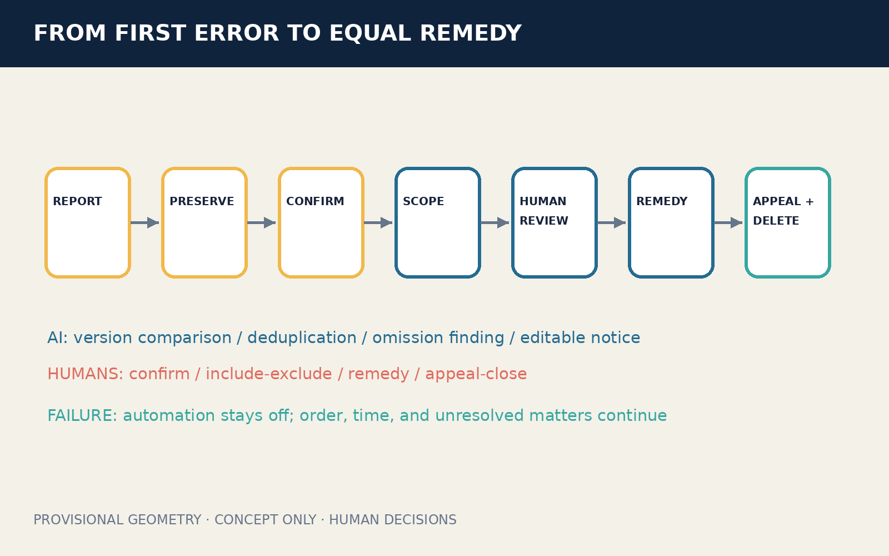

## Three-Level Scope Framework

The coordinated research area studies how one systemic error propagates across institutions, versions, and entrances, and how public responsibility extends beyond an individual complaint. The overall-design area forms a civic spine of evidence preservation, impact-scope review, equal remedy, and independent appeal. The three key areas separately host synthetic version tracing, rights and inclusion/exclusion review, and cross-channel remedy rehearsal. Research asks who is missed; overall design makes responsibility reachable; key areas test whether the complete task survives AI shutdown.[source:PROCESSED-FACT-PACK] [depth:three_level_scope_framework] [metric:site_area_sqm]

The submitted site boundary and all three key-area polygons are low-confidence provisional constraints. Until statutory boundaries, real procedures, log completeness, shareable-fact limits, notification safety, and professional authority are confirmed, the design model cannot be presented as an existing condition or a duty to process people in bulk. Official data triggers regeneration of all geometry, metrics, figures, HTML, and PDFs.[source:BOUNDARY-SOURCE] [metric:green_ratio] [metric:public_space_ratio]

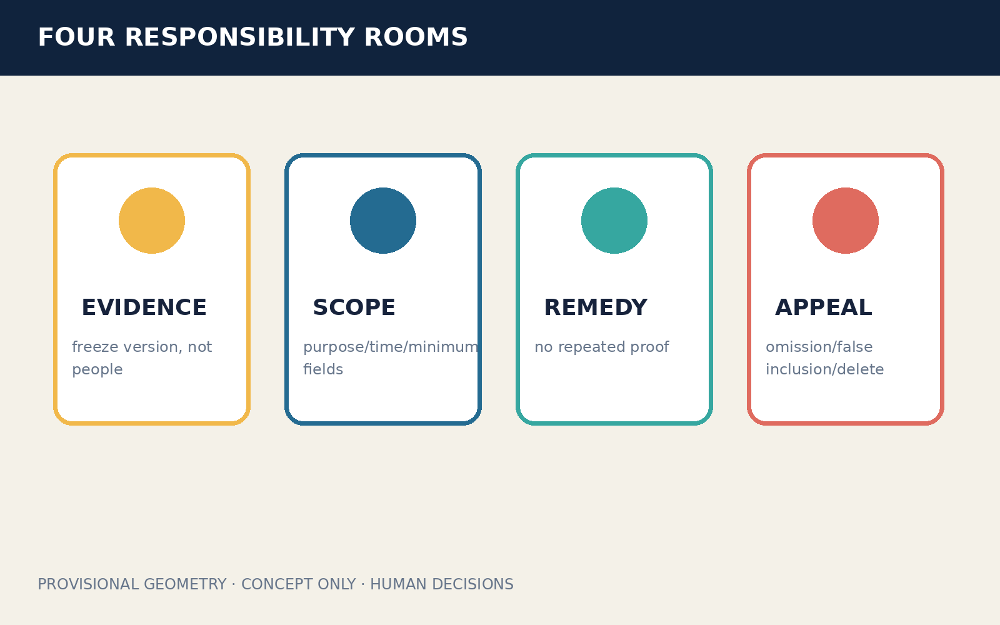

## Coordinated Research Area: Industry and Future City Research

ONE ERROR, EQUAL REMEDY links universities, public-service bodies, companies, accessibility organizations, privacy and anti-discrimination professionals, and independent reviewers into an auditable innovation chain. AI has a deliberately small role: compare frozen versions, deduplicate candidate records, find cross-channel omissions, and draft editable notices. AI does not confirm harm, decide inclusion or exclusion, choose remedy, create durable group labels, or expand the data purpose.[source:DATA-SRC-GENERATIVE-AI-INTERIM-MEASURES] [standard:MOHURD-URBAN-DESIGN-MEASURES]

Public value is not measured by finding more people. It is measured by reduced repeated proof, fewer omissions, controlled false inclusion, ordinary-service continuity, deletion of temporary links, and meaningful exit. Industrial value comes from reusable error-version ledgers, synthetic stress tests, human review workbenches, and cross-channel receipt interfaces—not real-person profiling or a claim that a government system already exists.

### Agent.1 | Identity and Three Areas / Two Wings

The Chinese name links a shared error to equal remedy; the English name states that confirmation cannot rescue only the first complainant. The original identity mark is an amber error node surrounded by blue remedy ripples; every ripple stops at a human-review gap before reaching a person, so it never depicts automatic inclusion. The Centennial Jing-Zhang Cultural Belt contributes the memory of shared track and mutual recognition; the Urban AI Life Experience Belt makes refusal, non-account access, and human review tangible; the AI Fusion Innovation Belt opens synthetic fixtures and version-tracing methods.[source:TASKBOOK-DELIVERABLES] [depth:overall_spatial_structure]

Zhongzhiyuan hosts synthetic version tracing and false-inclusion/omission stress tests. AI Origin hosts co-review of impact scope, human rights, and accessible notice. Dazhongsi hosts cross-paper, phone, desk, and web remedy rehearsal. The Zhongguancun Technology Service Wing supports standards, law, and engineering; the Xiaoyue River Scenario Empowerment Wing tests public intelligibility, exit, and ordinary-service continuity. These are invitations for collaboration, not confirmed partnerships.

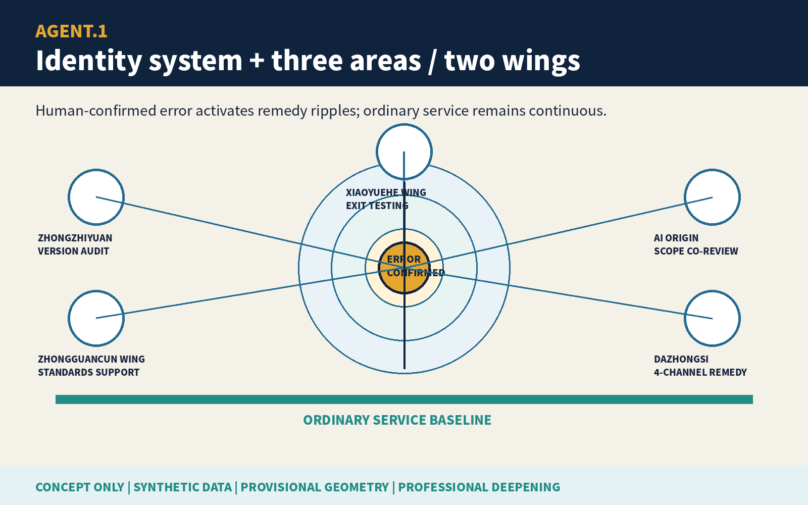

### Agent.2 | Ecosystem Cases and Inputs

Six public international cases supply questions only. Amsterdam and Helsinki algorithm registers prompt purpose, impact, and contact disclosure. The UK Service Standard prompts whole-task and assisted-channel review. NIST AI RMF offers a continuous risk loop. Smart Kalasatama and Punggol Digital District offer background on time-limited experimentation and education-district-community coordination.[source:CASE-AMSTERDAM-ALGORITHM-REGISTER] [source:CASE-HELSINKI-AI-REGISTER] [source:CASE-UK-GOVERNMENT-DESIGN-PRINCIPLES] None is Chinese law, local performance evidence, or a transplantable institution.

Eight inputs form a bounded loop. Land carries removable indoor components. Space links ordinary entrances, preservation, review, remedy, and appeal. Industry connects model, rule, data, interface, and public-service accountability. Funding is discussed in phases against remedy, continuity, and deletion. Talent pairs frontline service, accessibility, privacy, law, and engineering. Compute stays small and offline. Data is limited to frozen versions and synthetic records. Scenarios begin with no-personal-data table rehearsals.[depth:renewal_project_list]

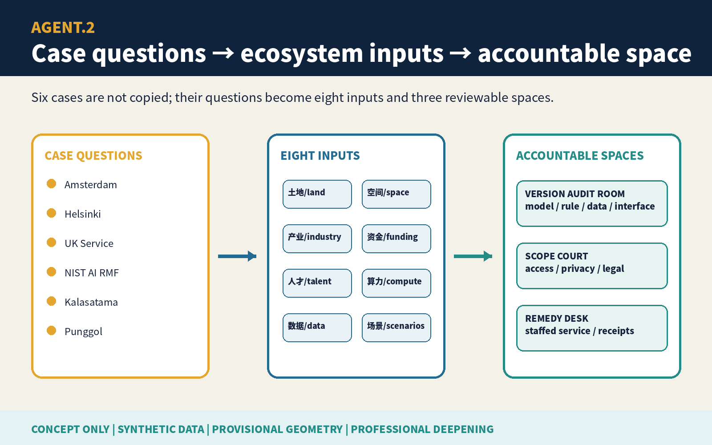

## Overall Design Area: Urban Renewal and Regulatory-Plan-Level Urban Design

The spatial structure is one ordinary-service baseline, four responsibility rooms, three key areas, and two review wings. Paper, phone, and staffed counters form the baseline. An evidence room preserves the error version without warehousing people. An impact-scope room defines purpose, time window, and minimum inclusion/exclusion rules. An equal-remedy room handles restoration, correction, reopening, or human review without repeated proof. An independent room handles omissions, false inclusions, and exit. Digital search never precedes the ordinary entrance.[data:geometry/roads.geojson#ROAD-001] [data:geometry/public_space.geojson#PUBLIC-001] [depth:overall_spatial_structure]

Land use, buildings, roads, blue-green systems, public space, and phases are conceptual layers. FAR, height, ownership, fire, heritage, utilities, real capacity, and investment await official data. Retain/renovate/demolish/new-build language is limited to reusing existing interiors first, making furniture removable, and refusing demolition or construction conclusions from rough geometry.[standard:MNR-LAND-USE-CLASSIFICATION-GUIDE] [depth:land_use_layout]

## Detailed Design of Key Areas

| Area | Dedicated task | Named human decision | Public result after failure |
|---|---|---|---|
| Zhongzhiyuan AI Acceleration Area | Synthetic version tracing, deduplication, false-inclusion and omission tests | Incident owner pauses and preserves; independent professional confirms repeatability | If evidence is insufficient, search does not expand and disputed automation stays off |
| Beijing AI Origin Community | Impact scope, accessible notice, and exit co-review | Scope reviewer signs purpose, time window, and minimum inclusion/exclusion rules | Unsafe notice or unreliable scope returns to passive public and protected-contact routes |
| Dazhongsi AI Industry Cluster | Four-entrance remedy, omission/false-inclusion appeal, and AI-off rehearsal | Authorized service owner signs remedy; independent appeal reviewer handles disputes | Original position, time, and unresolved matter remain in the ordinary human route |

All three rough polygons are `provisional_constraint` carriers for distinct tasks. They do not identify real institutions, authority, or feasibility.[data:geometry/key_areas.geojson#PROV-KEY-001] [data:geometry/key_areas.geojson#PROV-KEY-002] [depth:three_key_area_detailed_design]

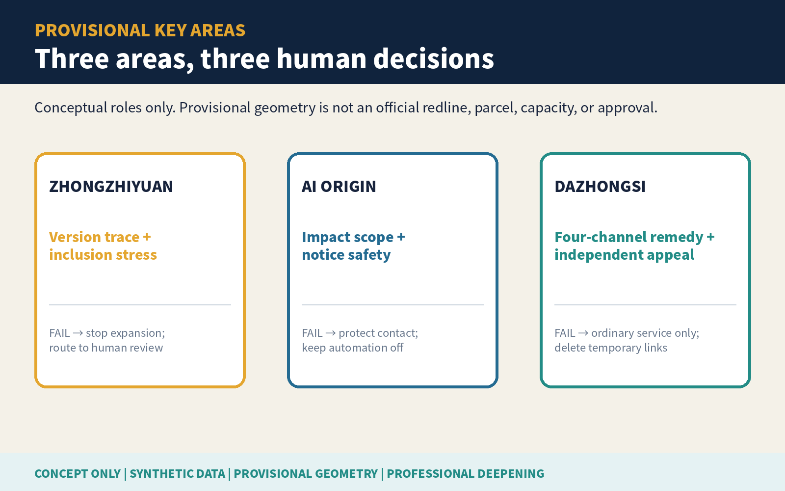

## AI Innovation Ecosystem, Personas, and AI+ Scenarios

Six task personas are the first reporter, a silent co-affected person, a person needing non-digital or accessibility support, a frontline worker, an impact-scope reviewer, and an omission/false-inclusion appellant. They are synthetic process roles, not demographics or risk labels. Six named human roles are incident owner, independent professional reviewer, impact-scope reviewer, authorized service owner, notification-safety lead, and independent appeal reviewer. Shared system facts never replace lawful case judgment.[metric:persona_count] [metric:named_human_role_count] [depth:public_service_facilities]

| Scenario | Carrier | Minimum AI role | Human floor / stop condition |
|---|---|---|---|
| 01 First-error preservation | Ordinary complaint entrance | Organize synthetic lead | Incident owner signs pause and preservation |
| 02 Rule-version freeze | Zhongzhiyuan version desk | Compare authorized versions | Unclear version stops scope expansion |
| 03 Repeatability review | Independent review room | Draft editable comparison | Professional human decides repeatability |
| 04 Minimum impact scope | AI Origin scope table | List candidates under frozen fields | Reviewer signs each inclusion/exclusion class |
| 05 Four-channel deduplication | Controlled search room | Deduplicate paper, phone, desk, web | No durable identity graph |
| 06 Refuseable notice | Accessible notice desk | Draft multilingual notice | Safety lead chooses route; person may refuse |
| 07 No-repeat-proof remedy | Dazhongsi remedy desk | Summarize shared system fact | Authorized owner decides restore/reopen/correct |
| 08 Omission appeal | Independent appeal table | Locate rule difference | Original matter keeps position and time |
| 09 False-inclusion exit | Deletion receipt counter | List temporary links | Person exits; links are deleted with receipt |
| 10 Missing-log fallback | Ordinary-service baseline | Mark unknown, not unaffected | Missing logs cannot support adverse inference |
| 11 AI-off paper tracing | All key areas | Off | Version list, sampling, and human notice finish task |
| 12 De-identified closure | Public review surface | Draft editable summary | Human removes personal/group labels and endorsement claims |

Four industry/professional tests cover version tracing, human inclusion/exclusion, notice/exit safety, and AI-off equivalence. `synthetic-test-fixtures.json` stores all 60 no-personal-data fixtures row by row: 12 share one error version, only one has a complaint, and four have missing or ambiguous fields. `verify-fixtures.js` does not treat stored actual values as its conclusion: it executes the candidate rule from every `synthetic_fields` input, generates each actual value, and aggregates all four suites. Its built-in tamper case changes the first error version to a control version and must exit nonzero. The deterministic package result is: 12/12 shared-version records surfaced and 48/48 controls did not; eight included and four held for human clarification; zero unsafe notices and all three requested exits deleted; ordinary service preserved for 60/60. Every suite records expected, actual, and a failure branch, and any mismatch stops the rehearsal. This demonstrates auditable behavior on synthetic fixtures only; it does not establish real recovery, false inclusion, notice safety, remedy time, or service continuity.[source:SAME-ERROR-SYNTHETIC-FIXTURES] [metric:synthetic_test_pass_count] [metric:synthetic_persona_script_count]

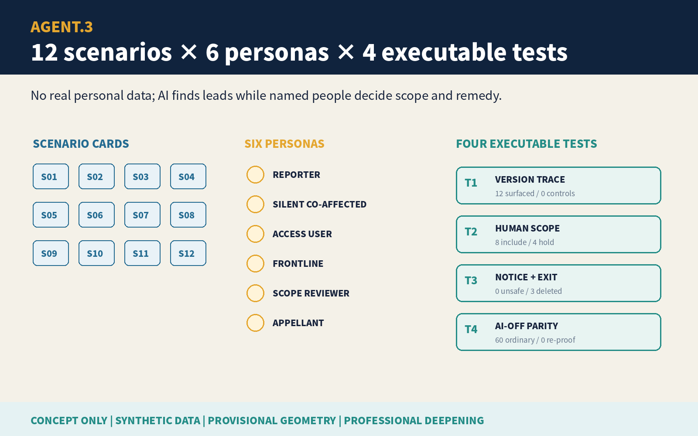

## Land Use, Building Scale, and Retain-Renovate-Demolish Strategy

Four land roles are evidence preservation and synthetic validation; impact-scope and rights review; ordinary service and equal remedy; independent appeal and exit. Adjacent zones share a topology-derived partition and cover the submitted boundary. They assign conceptual tasks, not statutory land classification or development intensity.[data:geometry/land_use.geojson#LU-001] [depth:land_use_layout]

Two building envelopes represent removable indoor kits: a northern version-and-scope review kit and a southern remedy-and-independent-appeal kit. Without building surveys, ownership, fire, heritage, and structure data, the proposal makes no real demolition or new-build decision. It retains existing buildings first and uses removable furniture, paper cabinets, and offline terminals.[data:geometry/buildings.geojson#BLDG-001] [depth:retain_renovate_demolish] [metric:building_footprint_area_sqm]

## Transport, Rail, Municipal Infrastructure, and Public Services

A continuous ordinary-task route keeps paper, phone, staffed counter, remedy, and independent appeal in the same queue. A person without a phone or account, refusing notice, or using AI-off cannot be diverted to a lower service tier. Rail, roads, parking, fire, power, communications, waste, and utility capacity await official attachments; no new redline or real station connection is claimed.[data:geometry/roads.geojson#ROAD-001] [depth:traffic_rail_slow_parking] [metric:concept_walk_network_length_m]

The minimum facility kit is a paper version list, preservation cabinet, accessible seat, refuseable-notice template, remedy receipt, independent appeal desk, and AI-off checklist. Equipment failure, absent staff, or network outage leaves ordinary human service open and disputed automation off.[standard:BARRIER-FREE-ENVIRONMENT-LAW] [depth:municipal_new_infrastructure]

## Blue-Green Network, Public Space, and Urban Character

The green layer is a low-intervention waiting and walking edge with no sensor dependency. Public space consists of an impact-scope review court and an equal-remedy/exit surface. Ordinary rest, passage, care, and staffed service take priority over AI events. Exit removes temporary displays and devices while retaining seating, shade, accessibility, and ordinary service.[data:geometry/green_space.geojson#GREEN-001] [data:geometry/public_space.geojson#PUBLIC-002] [depth:blue_green_public_space]

The visual language uses nodes, receipts, and mutual recognition from railway operations without copying a heritage mark or another participant's brand. Amber means confirmed error; blue means remedy task; teal means ordinary-service continuity; grey dashes mean provisional geometry. No visual maps a candidate population as a risk heatmap.

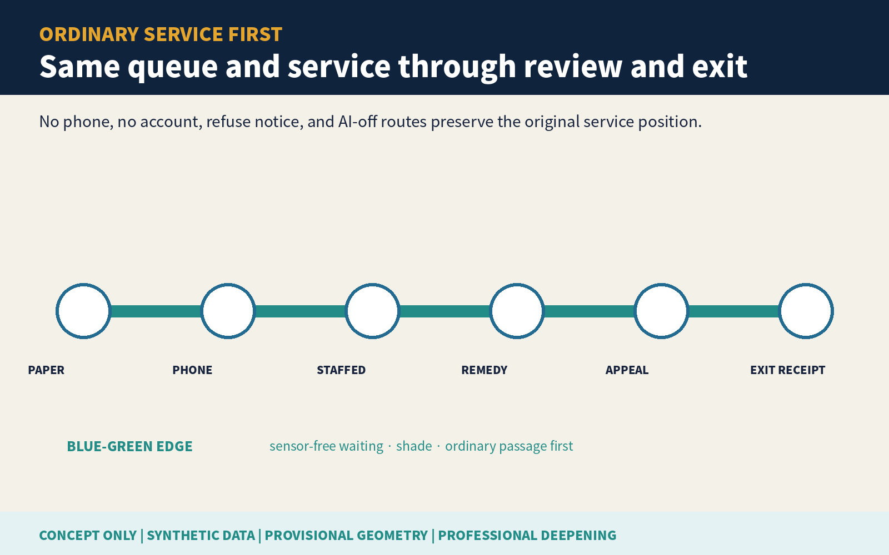

### Agent.3 | Seven Gates and Human Decisions

Seven gates are `REPORT`, `PRESERVE`, `CONFIRM`, `SCOPE`, `REVIEW`, `REMEDY`, and `CLOSE`. No gate advances automatically. The last gate includes omission/false-inclusion appeal and deletion of temporary candidate links. When the event is unreliable, only ordinary service, disabled disputed automation, and minimal de-identified audit remain.[source:SAME-ERROR-PROTOCOL] [metric:entry_gate_count]

### Agent.4 | Three Landmarks and Six Components

The three conceptual landmarks are readable accountability nodes, not sculptures. Zhongzhiyuan's First-Error Evidence Light activates only after human confirmation. AI Origin's Impact-Scope Court displays inclusion/exclusion and exit gaps. Dazhongsi's Equal-Remedy Receipt Wall shows de-identified remedy and unresolved matters. Six removable components are the error-version cabinet, scope ruler table, accessible notice desk, equal-remedy desk, independent review table, and deletion receipt box.[source:TASKBOOK-DELIVERABLES] [depth:public_space_character]

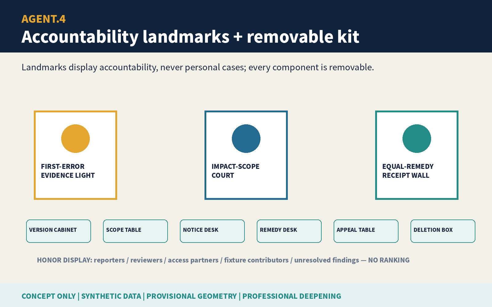

### Agent.5 | Cultural Narrative and International Communication

The cultural narrative is “shared track, shared repair.” Jing-Zhang memory becomes a responsibility metaphor: an institution cannot fragment one confirmed system failure back into many isolated personal burdens. English communication consistently separates `confirmed systemic error`, `candidate record`, `human inclusion/exclusion`, and `equal remedy`, so a temporary candidate link is never translated as a group determination. Every annual exhibit labels the work as concept, synthetic data, provisional geometry, and unapproved.

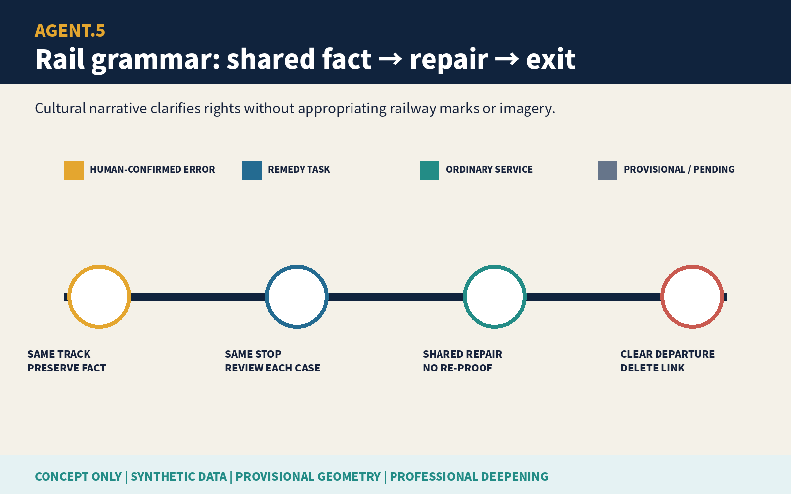

## Renewal Projects, Implementation Policy, and Phasing

| Project | Suggested accountable roles | Entry evidence | Stop / exit |
|---|---|---|---|
| P1 First-error evidence and version-freeze rehearsal | Incident owner + independent professional | Synthetic versions, repeatability test, pause receipt | No repeatability means no expanded search |
| P2 Scope and notification-safety co-review | Scope reviewer + accessibility/privacy professionals | Minimum fields, inclusion/exclusion, refusal/exit | Unsafe notice returns to passive entrance |
| P3 Four-entrance equal-remedy rehearsal | Authorized service owner | Shared system fact, original queue, authority | Missing authority returns to ordinary human review |
| P4 Omission/false-inclusion and deletion review | Independent appeal reviewer | Deletion receipt, unresolved list, AI-off equivalence | Undeletable temporary links block closure |

Phasing is not a construction promise. Phase 1 runs only 60 no-personal-data synthetic records. Phase 2 invites frontline workers, disabled and older-person organizations, privacy and anti-discrimination professionals, legal and appeal professionals, and engineers. Phase 3 discusses a limited, removable co-design pilot only after real procedure, authority, data minimization, notification safety, and exit receive approval. Any failed phase stops and publishes a de-identified failure reason.[data:geometry/phasing.geojson#PHASE-001] [depth:phasing_implementation]

### Agent.6 | Annual Operations

The proposed annual program is Equal-Remedy Open Week: quarterly synthetic fault rehearsal, semiannual audit of silent co-affected omissions, annual AI-off paper tracing, and an international public-remedy forum. Developers contribute only synthetic fixtures, version comparison, accessible-notice templates, and deletion verification. Each event records error version, human roles, inclusion/exclusion rules, false inclusion, omission, repeated-proof steps, ordinary-service continuity, and exit receipts. No accountable person or no deletion means cancellation.[source:TASKBOOK-DELIVERABLES]

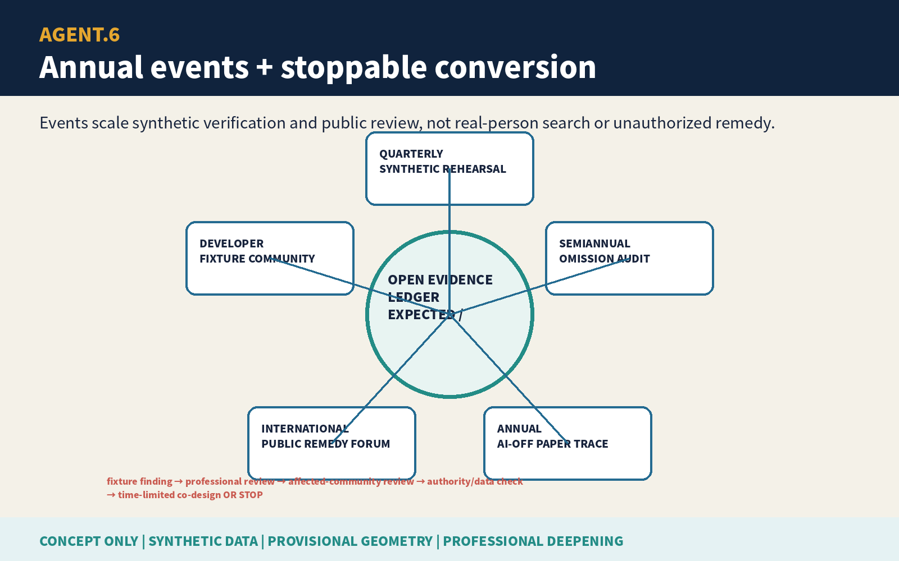

## Metrics, Area Recalculation, and Compliance Matrix

The three formal visual metrics—`site_area_sqm`, `green_ratio`, and `public_space_ratio`—are recomputed from submitted provisional geometry and match the offline visual `data-value` fields. They are low-confidence design-model values, not official area, existing-condition ratio, or performance. FAR, height, false inclusion, omission, proactive recovery, repeated-proof reduction, remedy time, notification safety, and ordinary-service continuity await real procedure, samples, and professional review.[metric:site_area_sqm] [metric:green_ratio] [metric:public_space_ratio]

`compliance_matrix.json` separately covers announcement 1.3–1.5 and agent.1–agent.6. Each Agent task points to its own board, structured output, differentiated geometry/metrics, and offline-dashboard anchor instead of one repeated evidence list. `standard_matrix.json` responds to each local reference snapshot. `design_depth_matrix.json` links data gaps, scopes, structure, land, buildings, transport, utilities, blue-green systems, three key areas, projects, phases, metrics, and risks to dedicated evidence. Matrix completion means package evidence exists; it is not professional approval.[depth:metrics_recalculation]

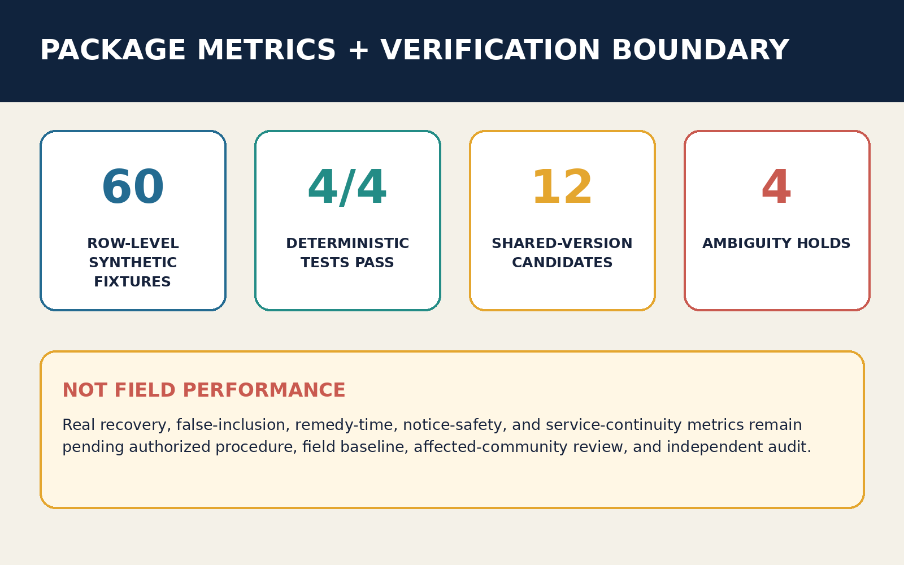

## Risk, Copyright, and Compliance

- **Privacy and anti-profiling:** only public/cleared materials and synthetic records are used. A candidate link is a temporary remedy work item, never a risk, eligibility, integrity, or identity label. A person may refuse notice, leave the link, see the reason, and appeal omission or false inclusion.
- **Authority:** AI does not confirm the systemic error, decide who is affected, choose remedy, or close the event. Named authorized humans sign each gate. Only professionally confirmed system facts may be shared; lawful case facts still require case judgment.
- **Failure floor:** unreliable scope, missing logs, unsafe notice, or absent roles keep disputed automation off. Ordinary human tasks keep original order, time, and unresolved matters. Missing logs cannot support adverse inference.
- **Planning boundary:** every space, project, event, and policy is conceptual. Provisional geometry cannot support redlines, area scoring, demolition, capacity, investment, institutional location, or government decision.[standard:PROJECT-OFFICIAL-ANNOUNCEMENT]
- **Copyright and rights chain:** narrative, protocol JSON, HTML, bilingual figures, and PDFs are original to this pass. Reuse of the author's own schema-complete package structure and generic geometry-generation method is disclosed. No third-party images, map tiles, logos, remote fonts, media, or personal data are embedded. Fonts and tools are recorded asset by asset.[source:RIGHTS-LEDGER]
- **Human review:** real procedure, notification safety, anti-discrimination, accessibility, data protection, legal authority, site conditions, fire/utilities, and metric definitions await the appropriate professionals and affected people.

## References

Formal bases are limited to the registered public announcement, cleared taskbook, source registry, and standard snapshots. The announcement and taskbook determine three scopes, three key areas, professional depth, and agent.1–agent.6 deliverables; they do not show that an equal-remedy procedure already exists. Standard snapshots constrain concept language, accessible entrances, and professional deepening but do not replace authorized legal or service judgment. International cases remain background questions only.[source:SOURCE-REGISTRY] [source:OFFICIAL-ANNOUNCEMENT]

Spatial evidence comes only from submitted GeoJSON. Rough polygons drive topology and provisional design-model values for `site_area_sqm`, `green_ratio`, and `public_space_ratio`; they cannot support real institutional locations, affected-population counts, capacity, demolition, construction, or precise area. The synthetic protocol and 60 records test whether a workflow can operate and stop; they cannot establish false-inclusion rate, omission rate, proactive recovery, remedy time, or ordinary-service continuity. Publisher, URL, retrieval date, use, license, and prohibited use are in `sources.json`; assumptions are in `assumptions.json`; generation and asset rights are in `report/copyright_statement.md`. Any official-data or procedural change triggers complete recalculation of geometry, metrics, figures, HTML, PDFs, and matrices.[depth:metrics_recalculation] [metric:site_area_sqm]
