# 京张同错同补 / JINGZHANG ONE ERROR, EQUAL REMEDY

> **一人证明系统出错，不让每个人重新投诉。** 首位报告者只提供线索，不替任何人授权；AI 只在冻结口径内找候选，具名人员决定纳入、排除和补救，个人可拒收、退出临时候选关联并申诉。

## 设计依据与资料清单

本方案是供专业团队、公共服务一线人员和受影响群体继续深化的 formal 概念包。它依据公开公告、清权智能体任务书、来源登记和本地标准快照组织三层范围、三处重点区、专业深度与 AI 城市治理任务；临时几何只用于 intake 可视化、拓扑检查和内部复算，不是红线、控规、权属、真实窗口或实施承诺。[source:OFFICIAL-ANNOUNCEMENT] [source:AGENT-TASKBOOK] [data:geometry/site_boundary.geojson#SITE-001]

公共问题不是“投诉入口够不够多”，而是同一模型、规则、数据或接口版本的系统错误一旦被确认，未投诉、不能投诉、不知道受影响或已经离场的人是否仍要各自重做发现、举证和排队。方案把责任反转为：暂停争议自动规则、保全版本证据、人工确认可重复错误、冻结最小影响口径、受控检索候选、人工纳入/排除、可拒收通知、免重复举证补救、漏纳/误纳复核、删除临时候选关联。[standard:PROJECT-AGENT-OPEN-CALL-TASKBOOK] [depth:risk_missing_data]

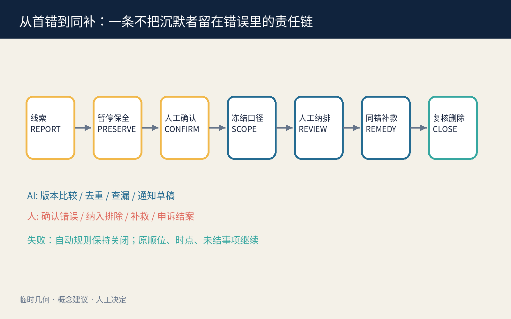

## 三层范围工作框架

统筹研究范围研究系统错误如何跨机构、版本和入口扩散，以及公共责任如何从个案转向同受影响者；总体设计范围组织“证据保全—影响范围复核—同错补救—独立复核”公共任务脊；重点区域分别承载合成版本追查、权利/纳排复核和跨入口补救演练。研究层问谁被遗漏，整体层把责任放进可到达空间，重点层检验 AI 关闭后能否继续完成同一任务。[source:PROCESSED-FACT-PACK] [depth:three_level_scope_framework] [metric:site_area_sqm]

`site_boundary.geojson` 和三处 `KEY_AREA` 都是低置信度临时约束；法定边界、真实服务制度、日志完整性、可共享事实范围、通知安全和专业权限未获确认时，不得把设计模型写成现状事实或批量处理义务。正式资料发布后必须重算全部几何、指标、图件、HTML 和 PDF。[source:BOUNDARY-SOURCE] [metric:green_ratio] [metric:public_space_ratio]

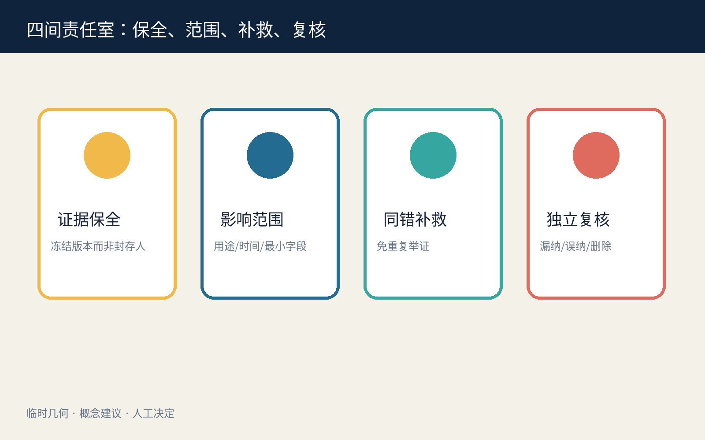

## 统筹研究范围产业与未来城市研究

“同错同补”把高校、公共服务机构、企业、无障碍组织、隐私/反歧视专业人员和独立复核者连接成一条可审计创新链。AI 的必要性只在有限环节：比较冻结版本、去重候选、发现跨入口遗漏和起草可修改通知；AI 不确认谁受害、不决定纳入或排除、不决定补救、不生成长期人群标签，也不扩大数据用途。[source:DATA-SRC-GENERATIVE-AI-INTERIM-MEASURES] [standard:MOHURD-URBAN-DESIGN-MEASURES]

公共利益不是以“找到更多人”为目标，而是以减少重复举证、减少遗漏、控制误纳、维持普通服务、删除临时关联和允许退出为目标。项目的产业价值来自可复用的错误版本账本、合成压力测试、人工纳排工作台和跨渠道回执接口，而不是建立真实个人画像或宣称已形成政府系统。

### Agent.1｜命名、识别与三区两翼

中文名“同错同补”把同一错误与平等补救绑定；英文名 **ONE ERROR, EQUAL REMEDY** 强调一次确认不能只救第一个投诉者。原创识别符号由一枚琥珀色错误节点和向外展开的蓝色补救波纹组成；波纹在每个人前停留为人工复核缺口，不表示自动纳入。百年京张文化带转译“同轨互认、到站补位”的公共记忆，都市 AI 生活体验带展示可拒收、无账号和人工复核，AI 融合创新带开放合成夹具与版本追查方法。[source:TASKBOOK-DELIVERABLES] [depth:overall_spatial_structure]

三区两翼承担不同职责：众智园做无真实个人信息的版本追查和误纳/漏纳压力测试；AI 原点社区做影响范围、人权利与无障碍通知共评；大钟寺做跨纸面、电话、柜台和线上入口的补救演练。中关村科技服务翼支持标准、法律与技术服务，小月河场景赋能翼验证公众可理解、可退出和普通服务连续；全部协同关系均为邀请性概念，不是已确定合作。

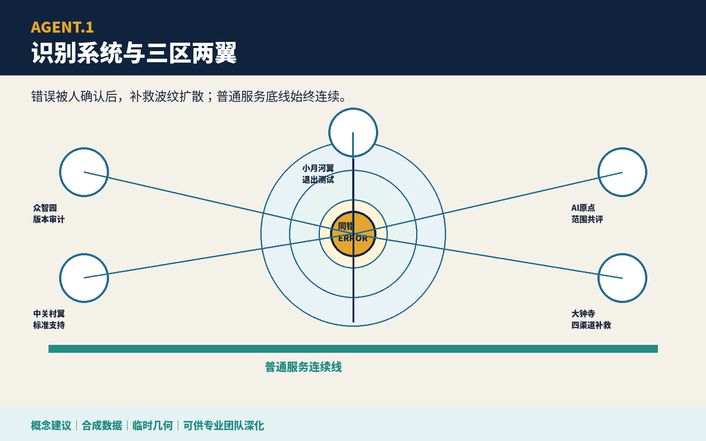

### Agent.2｜生态案例与要素

六个国际公开案例仅用于提出问题：Amsterdam 与 Helsinki 算法登记提示用途、影响和联系人透明；UK Service Standard 提醒从完整用户任务和辅助渠道审查服务；NIST AI RMF 提供持续风险回路；Smart Kalasatama 与 Punggol Digital District 提供限时试验、教育—园区—社区协同的背景。[source:CASE-AMSTERDAM-ALGORITHM-REGISTER] [source:CASE-HELSINKI-AI-REGISTER] [source:CASE-UK-GOVERNMENT-DESIGN-PRINCIPLES] 它们不是中国法律、本地绩效或制度移植依据。

八项生态要素形成受限闭环：土地只承载可撤室内组件；空间组织普通入口、保全、复核、补救和申诉；产业连接模型、规则、数据、接口与公共服务责任；资金按补救结果、普通服务连续和删除完成度分阶段讨论；人才由一线服务、无障碍、隐私、法律和工程配对；算力优先离线小型；数据限冻结版本与合成记录；场景先做无个人数据桌演。[depth:renewal_project_list]

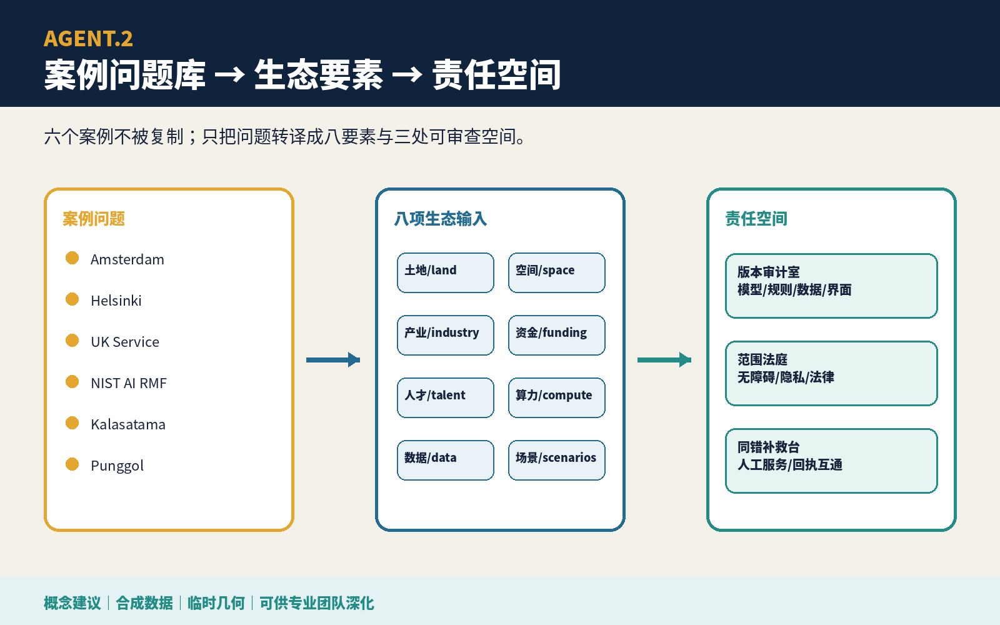

## 总体设计范围城市更新与控规深度城市设计

空间主结构为“一条普通服务底线、四间责任室、三处重点区、两条复核翼”。普通服务底线连接纸面、电话和有人柜台；证据保全室封存错误版本而不封存个人；影响范围复核室定义用途、时间窗和最小纳排规则；同错补救室并行处理免重复举证的恢复、更正、重开或人工复核；独立复核室处理漏纳、误纳与退出。任何数字检索都不能位于普通入口之前。[data:geometry/roads.geojson#ROAD-001] [data:geometry/public_space.geojson#PUBLIC-001] [depth:overall_spatial_structure]

用地、建筑、道路、蓝绿、公共空间和分期都是概念图层。FAR、高度、权属、消防、文保、市政、真实服务容量和投资保持待正式数据补齐；保留/改造/拆除/新建仅允许表达“优先复用既有室内、临时家具可撤、不依据临时几何提出拆建”。[standard:MNR-LAND-USE-CLASSIFICATION-GUIDE] [depth:land_use_layout]

## 重点区域详细设计

| 区域 | 专属任务 | 关键人工决定 | 失败后的公共结果 |
|---|---|---|---|
| 众智园 AI 自主创新加速区 | 合成版本追查、候选去重、误纳/漏纳压力测试 | 事件负责人暂停并保全；独立专业复核人确认是否为可重复系统错误 | 无法复现或证据不足时不扩展检索，争议自动规则保持关闭 |
| 北京 AI 原点社区 | 影响范围、无障碍通知和退出共评 | 影响范围复核人签署用途、时间窗与最小纳排规则 | 通知不安全或范围不可靠时转为被动公开和受保护联系人入口 |
| 大钟寺 AI 产业聚集区 | 四入口补救、漏纳/误纳申诉和 AI-off 演练 | 有权服务负责人逐类签署补救；独立申诉复核人处理争议 | 保留原顺位、时点和未结事项，普通人工路径继续 |

三处粗略 polygon 都是 `provisional_constraint`，只承载差异化任务，不暗示真实机构位置、人员权限或可实施性。[data:geometry/key_areas.geojson#PROV-KEY-001] [data:geometry/key_areas.geojson#PROV-KEY-002] [depth:three_key_area_detailed_design]

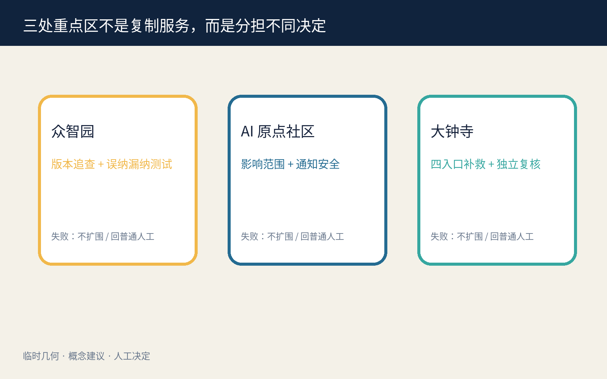

## AI 创新生态、人才画像与 AI+ 场景

六类任务画像是：首位报告者、未投诉同受影响者、低数字能力或无障碍支持需求者、一线服务人员、影响范围复核人、漏纳/误纳申诉人。它们是合成流程角色，不是人口统计或风险标签。六个具名人类角色分别为事件负责人、独立专业复核人、影响范围复核人、有权服务负责人、通知安全负责人和独立申诉复核人；任何批量补救都不能替代法定个案判断。[metric:persona_count] [metric:named_human_role_count] [depth:public_service_facilities]

| 场景卡 | 空间载体 | AI 最小角色 | 人工底线 / 停止条件 |
|---|---|---|---|
| 01 首错保全 | 普通投诉入口 | 整理合成线索 | 事件负责人签署暂停与证据保全 |
| 02 规则版本冻结 | 众智园版本台 | 比较已授权版本 | 版本不清即停止扩大范围 |
| 03 可重复错误复核 | 独立专业复核室 | 生成可修改对照 | 专业复核人判断是否可重复 |
| 04 最小影响口径 | AI 原点范围桌 | 按冻结条件列候选 | 复核人逐类签署纳入/排除 |
| 05 四入口候选去重 | 受控检索室 | 纸面、电话、柜台、线上去重 | 不建立长期身份图谱 |
| 06 可拒收通知 | 无障碍通知台 | 起草多语通知 | 安全负责人选择渠道；个人可拒收 |
| 07 免重复举证恢复 | 大钟寺补救台 | 汇总共享系统事实 | 有权服务负责人决定恢复/重开/更正 |
| 08 漏纳申诉 | 独立复核桌 | 定位口径差异 | 原事项保序，不能因未投诉失权 |
| 09 误纳退出 | 删除回执柜台 | 列出临时关联 | 本人退出后删除关联并给回执 |
| 10 日志缺失保底 | 普通服务底线 | 标记未知而非无影响 | 缺日志不对个人作不利推断 |
| 11 AI-off 纸面追查 | 三处重点区 | 关闭 | 版本清单、抽样、人工通知完成同一任务 |
| 12 去标识结案摘要 | 公开复盘面 | 起草可编辑摘要 | 人工确认不含个人、群体标签或官方背书 |

四项行业/专业验证分别检验版本追查、人工纳排、通知/退出安全和 AI-off 等价；`synthetic-test-fixtures.json` 逐条保存 60 条无真实个人信息的 fixture，其中 12 条共享同一错误版本、仅 1 条含投诉、4 条缺字段或有歧义。`verify-fixtures.js` 不读取预填实际值作结论，而是从每条 `synthetic_fields` 执行候选规则、生成逐条实际值并聚合四项 suite；内置篡改把首条错误版本改为对照版本，必须产生非零退出。确定性脚本的包内结果为：12/12 同版本记录均被提示且 48/48 对照未被提示；8 条被人工纳入、4 条歧义转人工澄清；不安全通知为 0，3 条退出请求均生成删除结果；60/60 条普通服务保持。每项同时记录预期、实际和失败分支，任何不一致都使演练停止。这些只证明候选规则在合成 fixture 上可审计，不证明真实主动找回率、误纳率、通知安全、补救时长或现场服务连续。[source:SAME-ERROR-SYNTHETIC-FIXTURES] [metric:synthetic_test_pass_count] [metric:synthetic_persona_script_count]

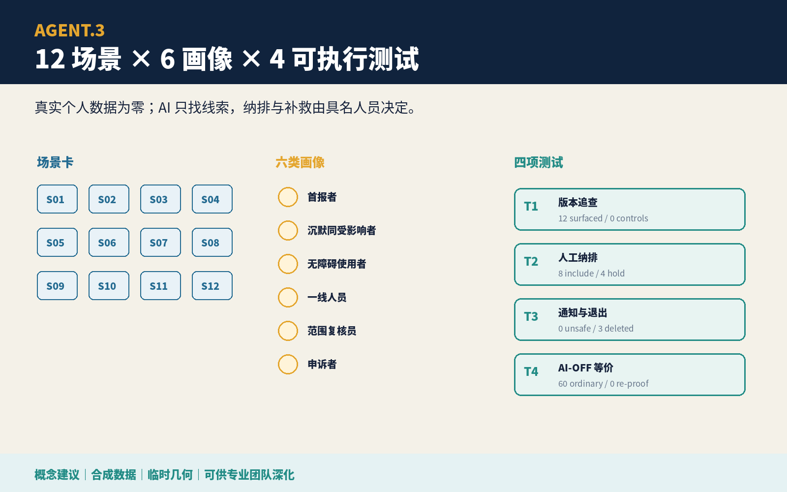

## 用地、建筑规模与拆改留方案

四类土地角色分别为证据保全与合成验证、影响范围与权利复核、普通服务与同错补救、独立申诉与退出。相邻分区由同一临时边界拓扑切分，完整覆盖提交边界；用途只是概念任务分配，不是法定分类或开发强度。[data:geometry/land_use.geojson#LU-001] [depth:land_use_layout]

建筑包络只表示可放入既有首层或服务前厅的两组室内组件：北段“版本与范围复核包”、南段“补救与独立申诉包”。在没有建筑调查、权属、消防、文保和结构资料时，不提出真实拆除或新建；优先保留既有建筑，临时改造采用可撤家具、纸面柜和离线终端。[data:geometry/buildings.geojson#BLDG-001] [depth:retain_renovate_demolish] [metric:building_footprint_area_sqm]

## 交通、轨道、市政与公共服务设施

连续普通任务路径把纸面、电话、有人柜台、补救和独立申诉串为同一顺位；无手机、无账号、拒收通知和 AI 关闭者不得被迫绕行到较低服务等级。轨道、道路、停车、消防、供电、通信、垃圾和市政容量没有官方附件，全部保持待专业核验；方案不画新红线，也不宣称真实站点接驳。[data:geometry/roads.geojson#ROAD-001] [depth:traffic_rail_slow_parking] [metric:concept_walk_network_length_m]

最低设施包包含纸面版本表、封存柜、无障碍座席、可拒收通知模板、补救回执、独立申诉桌和 AI-off 清单。设备故障、人员缺席或网络中断时，普通人工任务继续，争议自动规则维持关闭。[standard:BARRIER-FREE-ENVIRONMENT-LAW] [depth:municipal_new_infrastructure]

## 蓝绿空间、公共空间与城市风貌

绿色图层是一条低干预、无传感器依赖的等候与步行边；公共空间由“范围共评庭”和“同错补救/退出面”组成。它们优先服务普通休息、通行、照护和人工办理，不因 AI 活动占满；退出时撤去临时展陈与设备，保留座椅、遮阴、无障碍和普通服务。[data:geometry/green_space.geojson#GREEN-001] [data:geometry/public_space.geojson#PUBLIC-002] [depth:blue_green_public_space]

城市风貌采用京张轨道的节点、回执和互认语汇，但不复制历史标识或他人品牌。琥珀色表示已确认错误，蓝色表示补救任务，青绿色表示普通服务连续，灰色虚线只表示临时边界；任何视觉都不能把候选人群画成风险热区。

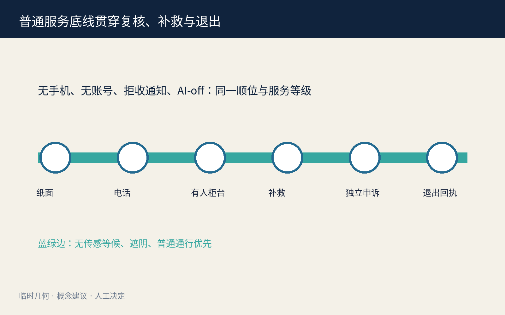

### Agent.3｜七门协议与人工决定

七道门是：`REPORT` 线索进入、`PRESERVE` 暂停与保全、`CONFIRM` 人工确认系统错误、`SCOPE` 冻结最小影响口径、`REVIEW` 人工纳入/排除、`REMEDY` 有权人签署补救、`CLOSE` 漏纳/误纳复核与删除临时关联。任何门失败都不能自动前进；事件不可靠时只保留普通服务、争议规则关闭和最小去标识审计。[source:SAME-ERROR-PROTOCOL] [metric:entry_gate_count]

### Agent.4｜三座概念地标与六件组件

三座概念地标不是雕塑，而是可读责任节点：众智园“首错证据灯”只在人工确认后亮起；AI 原点“影响范围刻度庭”展示纳排规则和退出缺口；大钟寺“同补回执墙”展示去标识补救进度与未结事项。六件可撤组件为错误版本柜、范围刻度桌、无障碍通知台、同错补救台、独立复核桌和删除回执盒。[source:TASKBOOK-DELIVERABLES] [depth:public_space_character]

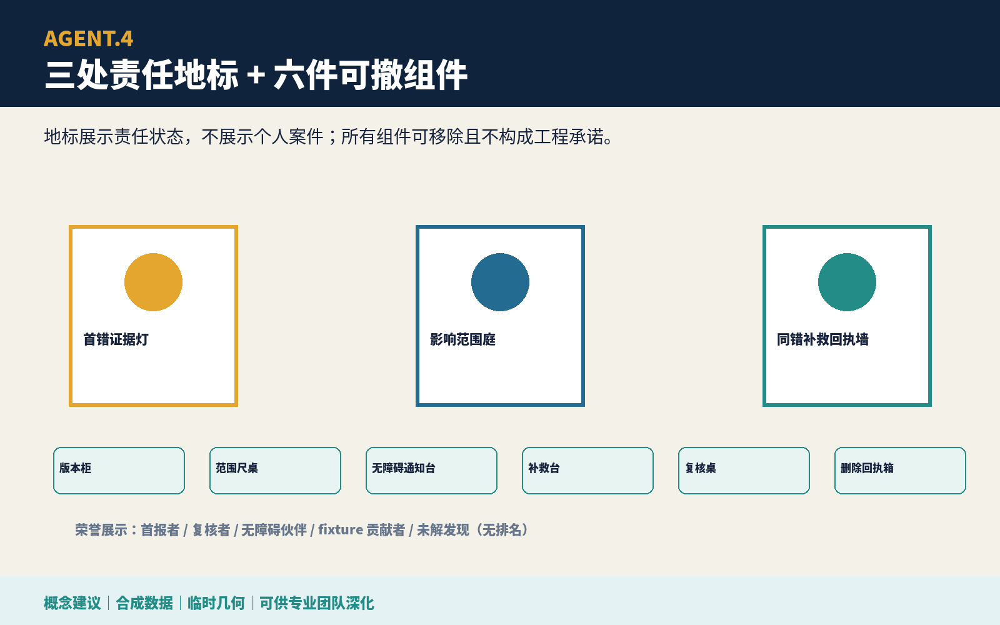

### Agent.5｜文化叙事与国际传播

文化叙事是“同轨发现、同站补位”：京张的公共记忆不被消费成装饰，而成为机构不能把同一系统错误拆回每个人独自承担的责任隐喻。英文传播固定区分 `confirmed systemic error`、`candidate record`、`human inclusion/exclusion` 和 `equal remedy`，避免把候选关联误译为群体认定。年度展陈明确标注概念建议、合成数据、临时几何和未获批准状态。

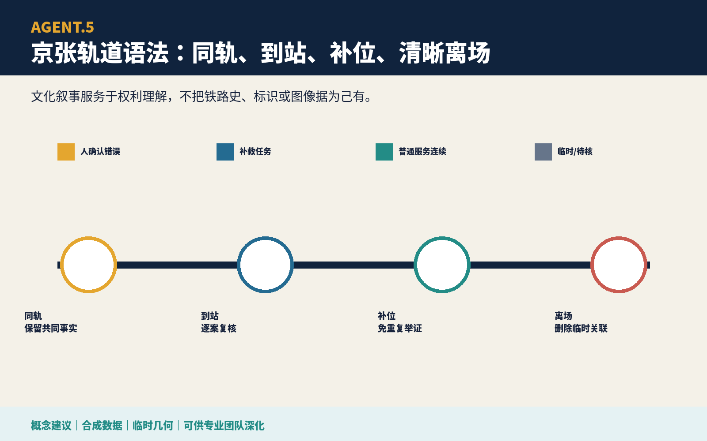

## 更新项目清单、实施政策与分期计划

| 项目 | 牵头角色建议 | 准入证据 | 停止/退出 |
|---|---|---|---|
| P1 首错证据与版本冻结桌演 | 事件负责人 + 独立专业复核 | 合成版本、可重复错误测试、暂停回执 | 不可复现即不扩大检索 |
| P2 影响范围与通知安全共评 | 范围复核 + 无障碍/隐私专业者 | 最小字段、纳排规则、拒收/退出路径 | 通知不安全即转被动入口 |
| P3 四入口同错补救演练 | 有权服务负责人 | 共享系统事实、原顺位、补救权限 | 权限缺失即普通人工复核 |
| P4 漏纳/误纳与删除复核 | 独立申诉复核人 | 删除回执、未结清单、AI-off 等价 | 关联无法删除即不结案 |

分期不是建设承诺：第一阶段只做无个人数据的 60 条合成桌演；第二阶段邀请一线、残障/老年人组织、隐私反歧视、法律申诉和工程专业者共同审查；第三阶段只有在真实制度、权限、数据最小化、通知安全和退出路径获得批准后，才讨论限时、可撤的现场共创。任一阶段不满足即停止并公开去标识失败原因。[data:geometry/phasing.geojson#PHASE-001] [depth:phasing_implementation]

### Agent.6｜年度活动与长期运营

长期运营建议为“同错同补公开周”：季度合成故障演练、半年未投诉者遗漏审查、年度 AI-off 纸面追查和国际公共补救论坛。开发者贡献仅限合成夹具、版本比较、无障碍通知模板和删除验证；不得接触真实个人档案。每次活动输出错误版本、人工角色、纳排规则、误纳/漏纳、重复举证步骤、普通服务连续和退出回执，活动无人负责或无法删除临时关联即取消。[source:TASKBOOK-DELIVERABLES]

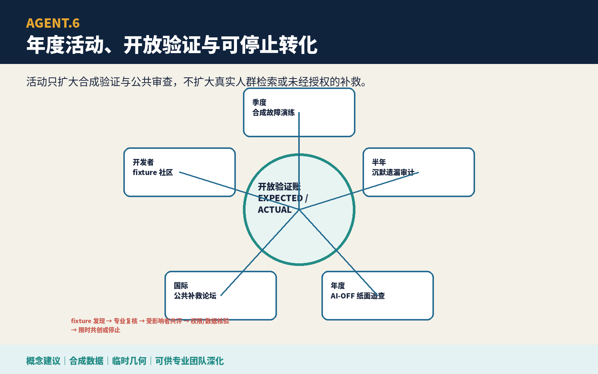

## 指标体系、面积复算与合规矩阵

三项 formal 核心视觉指标从提交的临时几何复算：`site_area_sqm`、`green_ratio`、`public_space_ratio` 均为低置信度设计模型值，并与离线 visual 的 `data-value` 一致；它们不表示官方面积、现状比例或绩效。FAR、建筑高度、误纳率、漏纳率、主动找回率、重复举证减少率、补救时长、通知拒收安全和普通服务连续率均保持待真实制度、样本和专业复核后测量。[metric:site_area_sqm] [metric:green_ratio] [metric:public_space_ratio]

`compliance_matrix.json` 逐项覆盖公告 1.3—1.5 与 agent.1—agent.6；六项智能体任务分别指向自己的图板、结构化输出、差异化几何/指标和离线 dashboard 锚点，不再复用同一证据清单。`standard_matrix.json` 逐项响应本地标准快照；`design_depth_matrix.json` 把现状缺口、三层范围、空间结构、用地、建筑、交通、市政、蓝绿、三重点区、项目、分期、指标和风险连接到专属证据。矩阵完成只表示包内证据存在，不表示专业结论或实施批准。[depth:metrics_recalculation]

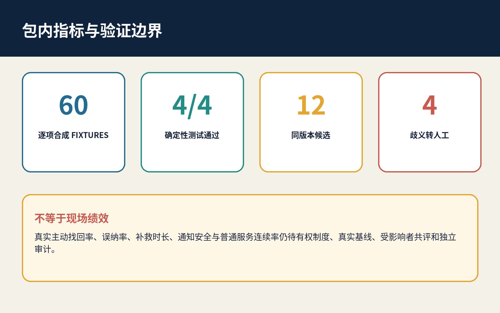

## 风险、版权与合规说明

- **隐私与反画像**：只使用公开/清权资料与合成记录；候选关联仅为临时补救工作项，不是风险、资格、诚信或身份标签。个人可拒收、退出关联、查看理由并申诉漏纳/误纳。
- **权限边界**：AI 不判断系统错误是否成立、谁受影响、谁应补救或是否结案；具名有权人员逐门签署。批量共享的只能是经专业确认的系统事实，个案法律事实仍需依法处理。
- **失败保底**：范围不可靠、日志缺失、通知不安全或角色缺席时，争议自动规则继续关闭，普通人工任务保留原顺位、时点和未结事项；缺日志不对个人作不利推断。
- **规划边界**：全部空间、项目、活动和政策均为概念建议。临时几何不支撑红线、面积评分、拆建、容量、投资、机构位置或政府决定。[standard:PROJECT-OFFICIAL-ANNOUNCEMENT]
- **版权与权利链**：正文、协议 JSON、HTML、双语图件与 PDF 为本轮原创；复用作者自有包的 schema 完整结构和通用几何生成方法已披露。未嵌入第三方图片、地图瓦片、Logo、远程字体、音视频或个人数据。字体与工具许可逐资产记录在版权声明和权利账本。[source:RIGHTS-LEDGER]
- **人工复核**：真实程序、通知安全、反歧视、无障碍、数据保护、法律权限、现场空间、消防市政和指标口径全部待相应专业人员与受影响者审查。

## 参考资料

正式依据限于包内登记的公开公告、清权任务书、来源登记和标准快照；国际案例只作背景问题库。公告与任务书决定三层范围、三处重点区、专业设计深度和 agent.1—agent.6 交付，不证明本地已经存在同错补救制度；标准快照用于约束概念表达、无障碍入口和专业深化语言，不替代有权人员的法律或服务判断。[source:SOURCE-REGISTRY] [source:OFFICIAL-ANNOUNCEMENT]

空间证据只来自提交的 GeoJSON：粗略边界决定图层拓扑与 `site_area_sqm`、`green_ratio`、`public_space_ratio` 的临时设计模型值；它不能支持真实机构位置、受影响人数、服务容量、拆建或精确面积。合成协议与 60 条记录只检验流程是否可被执行和关闭，不能证明误纳率、漏纳率、主动找回率、补救时长或普通服务连续。完整发布者、链接、获取日期、用途、许可和禁止用途见 `sources.json`，关键假设见 `assumptions.json`，生成与逐资产权利链见 `report/copyright_statement.md`；任何正式数据或制度变化都触发几何、指标、图件、HTML、PDF 和矩阵的完整重算。[depth:metrics_recalculation] [metric:site_area_sqm]
