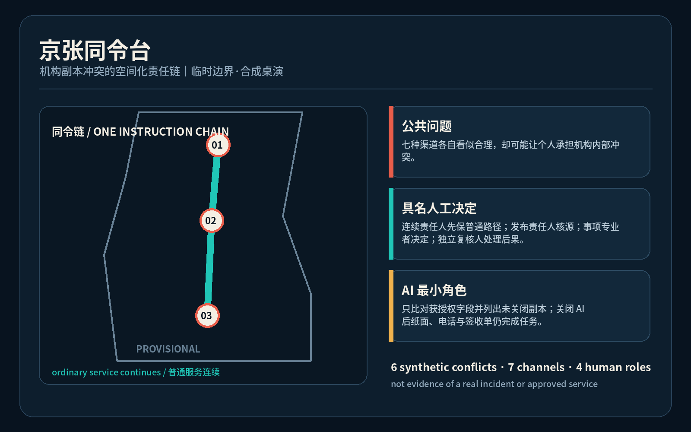
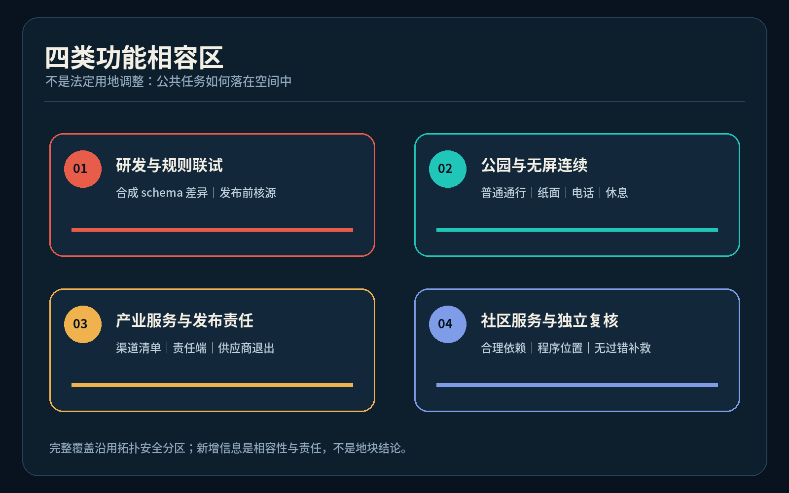
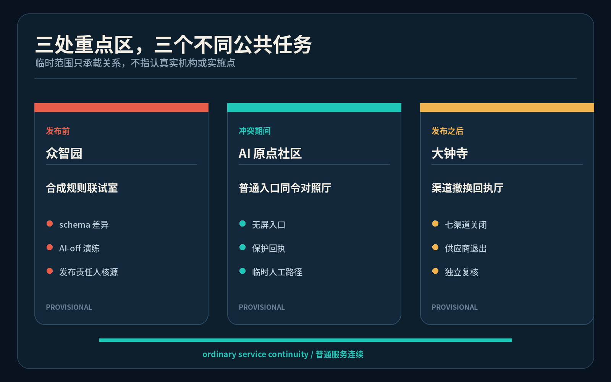
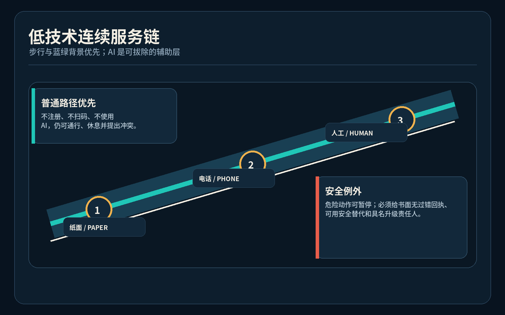
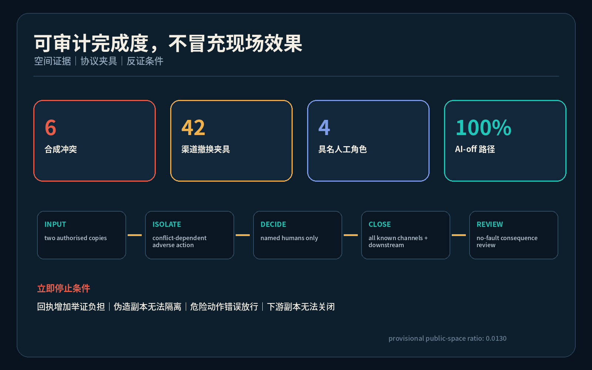

# 京张同令台 / JING-ZHANG ONE INSTRUCTION

**机构渠道互相矛盾时，人不替机构承担冲突成本。** 方案状态：开放共创建议；临时几何；合成桌演；未获政府、机构或专业实施批准。

## 设计依据与资料清单

本方案回应百年京张 AI 创新带的产业、空间与公共治理任务，提出“京张同令台 / JING-ZHANG ONE INSTRUCTION”：当同一机构的标牌、纸表、热线、人工脚本、网页应用、机器人或 API 互相矛盾时，使用者不负责猜哪一份更权威，也不应仅因合理遵循其中任一可见指令而承受退回、失约、逾期或负面标记。方案把冲突发现、临时连续服务、规则核源、全渠道撤换和无过错复核组织成一个空间化公共任务，而不是再造一块“真相大屏” [source:OFFICIAL-ANNOUNCEMENT] [source:AGENT-TASKBOOK] [depth:existing_conditions_diagnosis]。

权威层只包括仓库登记的公告、清权任务书、专业标准与临时边界；六组冲突全部为不含个人数据的合成桌演，不能证明真实机构已发生同类问题，也不构成法律意见、资格决定、赔偿承诺或期限恢复权。生成式 AI、无障碍和传统服务并行的公开材料只用于限定问题，不被扩大为普遍义务 [source:GENERATIVE-AI-MEASURES] [source:BARRIER-FREE-LAW] [source:ELDERLY-SMART-TECH-PLAN]。

当前 `SITE_BOUNDARY` 与三处 `KEY_AREA` 均为仓库临时粗略几何，图中以低对比虚线表达；它们不得被解释为官方红线、真实机构位置、管辖范围或精确面积依据。所有比例与概念基底在正式 polygon、控规、权属、市政、消防、文保和运营条件到位后必须整包复算 [data:geometry/site_boundary.geojson#SITE-001] [metric:site_area_sqm]。

## 三层范围工作框架

统筹研究范围把问题放在全球 AI 生态和公共服务可信度中：创新带不只输出模型与应用，也应输出“发布者承担副本一致性责任”的可验证治理能力。总体设计范围把这一能力组织为一条纸面与无屏服务连续链、三类公共前场和三类后场责任席；重点区域则分别承载合成规则联试、普通入口对照、下游撤换复核。三层传导由任务覆盖矩阵约束，不把治理口号留在报告外 [standard:PROJECT-OFFICIAL-ANNOUNCEMENT] [depth:three_level_scope_framework]。

总体结构是“一条连续责任链、三座同令节点、七类发布渠道、四个具名人工角色”。一条链沿京张遗址公园概念性连接纸面、电话、无障碍和人工入口；三节点对应众智园联试室、AI 原点社区同令对照厅、大钟寺撤换回执厅；七渠道是最小桌演分类；四角色依次为当班服务连续责任人、规则发布责任人、事项专业责任人和独立申诉复核人。AI 只能比对获授权字段与列出未关闭副本，物理关闭后仍能完成任务 [data:geometry/roads.geojson#ROAD-001] [metric:human_role_count] [metric:channel_type_count]。

空间动作全部是可供专业团队深化的概念建议。它们不指认真实办事机构，不更改法定用地，不推定建筑拆改留，也不把临时矩形当作地块。若后续专业核验发现该公共任务应放在既有设施内，三节点可退化为移动桌、墙袋和后场责任席，不以新增建筑作为成立条件 [data:geometry/land_use.geojson#LU-001] [depth:overall_spatial_structure]。

## 统筹研究范围产业与未来城市研究

世界级 AI 生态不仅需要算法、算力、数据、人才和资本，也需要让跨渠道承诺可核对、责任可定位、失败可退出的公共基础设施。本方案比较六类公开机制：AI Verify 的可测试治理工具、英国 AISI 的独立评测能力、NIST AI RMF 的生命周期责任、荷兰算法登记的所有者可见性、赫尔辛基 AI 登记的解释与反馈入口、欧盟 TEF 的行业测试设施。比较只提取“测试、公开、责任、反馈、专业联试”问题，不移植法律、空间、商标、界面或组织结论 [source:CASE-AI-VERIFY] [source:CASE-NIST-AIRMF] [source:CASE-EU-TEF]。

| 参考机制 | 可借鉴的问题 | 本方案不作的推断 |
| --- | --- | --- |
| AI Verify Foundation | 治理要求能否成为可重复测试 | 不宣称工具验证公共权利效果 |
| UK AISI | 独立评测能力如何形成 | 不复制国家机构职权 |
| NIST AI RMF | 风险责任如何贯穿生命周期 | 不作为中国法定标准 |
| 荷兰算法登记 | 系统所有者与联系入口是否可见 | 登记不等于冲突副本已撤换 |
| 赫尔辛基 AI 登记 | 解释与公众反馈如何进入服务 | 不复制城市界面或政策 |
| 欧盟 TEF | 行业测试如何连接专业设施 | 不证明本地场景已获准 |

生态图谱以众智园的规则/接口联试、原点社区的公共服务共创、大钟寺的下游互操作与中关村科技服务翼的法务、无障碍、标准和运营支持为核心；小月河场景赋能翼用于普通路径与低技术替代演练。资金、企业名单、招商、算力规模和产值均未获可用数据，因此不编造数值或承诺。品牌识别采用两条分叉线在一枚人工责任节点处重新对齐的原创符号方向，中文“同令台”和英文“ONE INSTRUCTION”组成可缩放字标，不使用外部商标或字体资产 [standard:PROJECT-AGENT-OPEN-CALL-TASKBOOK] [metric:ecosystem_case_count]。

## 总体设计范围城市更新与控规深度城市设计

总体设计不把“统一界面”当答案，而把发布、使用、核源、撤换和补救分成可审查空间：普通入口保留可撤的对照桌、纸面墙袋、电话和无障碍等候面；后场设置规则发布责任席与实际渠道清单；现场、热线、人工脚本、网页应用、机器人和 API 各有责任端和撤换回执。冲突期间只隔离依赖矛盾指令的不利自动动作，不暂停不相关的普通服务；安全关键动作可暂停，但必须给出书面无过错回执、可用安全替代和具名升级责任人 [data:geometry/public_space.geojson#PUBLIC-002] [depth:municipal_new_infrastructure]。

用地分区保持脚手架的拓扑安全完整覆盖，但重新表述为四类概念性功能相容区：研发与规则验证、遗址公园与无屏替代、产业服务与发布责任、社区服务与无过错复核。它们不构成法定用地调整。三个建筑基底只用于说明“联试室—对照厅—回执厅”最小空间关系，不代表现状建筑、权属、拆除、新建或工程可行性 [standard:MOHURD-CONTROL-DETAILED-PLANNING] [data:geometry/buildings.geojson#BLDG-001] [metric:building_footprint_area_sqm]。

城市更新策略首先复用普通服务入口和既有后场；只有真实流程、无障碍、消防、文保、权属和运营核验支持时，才讨论固定构件。所有组件必须可拆、无账号可用、停电可读、AI 关闭可运行。容积率、建筑高度、退线、道路红线、停车、市政容量和真实服务半径均待正式资料补齐，不使用推测数值制造精确感 [depth:development_intensity_controls] [data:geometry/constraints.geojson]。

## 重点区域详细设计

众智园概念节点承担“合成规则联试”：在不接触真实案件和运营数据的前提下，测试版本字段、渠道责任人、冲突隔离、AI 关闭与下游回执；规则发布责任人而非模型决定适用版本。AI 原点社区概念节点承担“普通入口同令对照”：无手机、低数字素养、跨语言、无障碍、照护同行和临近截止的人可用同一普通入口指出冲突，获得不授予资格的保护回执和临时人工路径。大钟寺概念节点承担“渠道撤换互操作”：逐项关闭现场、纸面、热线、人工脚本、网页应用、机器人和 API 副本，并由独立复核人处理已经发生的不利后果 [data:geometry/key_areas.geojson#PROV-KEY-001] [data:geometry/key_areas.geojson#PROV-KEY-002] [data:geometry/key_areas.geojson#PROV-KEY-003]。

三处均设置普通路径优先、无屏入口、可撤家具、可见责任牌和安静复核位置，但其公共任务不同：北部验证发布前一致性，中部保护合理依赖者，大钟寺验证发布后全渠道关闭。任何真实选址都需专业团队重新核对服务类型、法定公示、安全例外、无障碍、文保、消防和运营主体。若不能列清真实渠道或给出合法临时路径，节点不得进入真实试点 [depth:three_key_area_detailed_design] [metric:industry_test_count]。

三个原创公共地标方向分别为“同令门”（两条冲突线在人工责任点停下）、“版本责任席”（公开显示谁负责核源，而非显示个人案件）、“撤换回执灯”（只显示七类渠道是否闭环，不显示使用者身份）。它们是概念组件和荣誉展示载体：荣誉只记录公开贡献、修复方法和已关闭的合成测试，不把居民或申诉人展示为案例 [metric:landmark_count] [source:BARRIER-FREE-LAW]。

## AI 创新生态、人才画像与 AI+ 场景

六类合成画像覆盖：无手机的临期办理者、使用轮椅或低视力的访客、跨语言使用者、照护同行家庭、一线服务人员、规则发布/事项专业人员。画像不含真实身份或行为轨迹，也不用于评分、推荐和风险分类。提出冲突的人不得被标记为难缠、欺诈、低能力或高风险；记录只保存最小必要的渠道、版本、时间和去标识关闭状态 [metric:persona_count] [source:AGENT-TASKBOOK]。

十二张场景卡为：现场与预约冲突、无障碍路线与机器人围栏冲突、纸面与热线材料冲突、中英文时段冲突、同意书与 API 冲突、人工退出与终端冲突、AI 物理关闭演练、负责人缺席演练、供应商退出演练、伪造材料区分演练、紧急安全例外演练、已发生不利后果的独立复核。每张卡都包含触发、四个具名角色、临时路径、七渠道清单、失败结果和 AI 关闭路径 [metric:scenario_card_count] [data:geometry/public_space.geojson#PUBLIC-001]。

三个产业测试验证场景分别是：众智园的结构化规则 schema 差异联试；AI 原点社区的无屏/跨语言/无障碍人工连续服务桌演；大钟寺的供应商与下游接收方撤换回执互操作。AI 仅比较获授权文本或字段、提示版本/单位/责任人不一致并生成待人工修改的副本地图；不得决定规则效力、资格、处罚、诚信、安全例外或自动覆盖旧副本。合成台账的 6 个案例、42 个渠道关闭夹具和 100% 离线完成路径由本地验证脚本复核，但这些数字只证明包内协议一致，不证明现场效果 [metric:synthetic_conflict_case_count] [metric:channel_closeout_fixture_count] [metric:offline_completion_rate]。

## 用地、建筑规模与拆改留方案

`land_use.geojson` 仍以统一用地代码完整覆盖临时边界，避免为新概念另造分类；新增的只是功能相容与公共任务说明。研发创新用地可讨论合成规则联试，公园绿地保持普通通行、休息和纸面导引优先，产业服务用地可讨论发布责任与接口联试，社区服务用地可讨论人工连续与独立复核。任何功能都要服从正式规划与专业确认 [standard:MNR-LAND-USE-CLASSIFICATION-GUIDE] [data:geometry/land_use.geojson#LU-001] [depth:land_use_layout]。

三个概念建筑基底面积只为图面和空间关系复算，不是开发规模。拆改留采用“先调查、再决定”的方法：具有安全、文化或日常服务价值的对象优先保留；可用轻量构件补足的空间优先可逆改造；只有专业鉴定、权属、控规和公众程序支持时才讨论拆除或新建。本包没有这些资料，因此所有对象标记为 `method_only_pending_survey`，总建筑面积、容积率、高度、密度和投资均不作已知结论 [depth:retain_renovate_demolish] [depth:height_massing_character] [metric:floor_area_ratio]。

组件库包含可折叠对照桌、双语纸面袋、触觉责任牌、电话听筒位、七渠道磁片、无个人信息的冲突保护回执和撤换签收板。组件可在普通入口内嵌，也可在活动结束后移除；不得遮挡无障碍通行、疏散、历史界面或普通休息。固定位置、尺寸和材料均需下一阶段人体工学、消防、文保和运维共创 [data:geometry/buildings.geojson#BLDG-002] [source:MOHURD-URBAN-DESIGN-MEASURES]。

## 交通、轨道、市政与公共服务设施

交通策略不是新增道路，而是在临时范围内表达一条“低技术连续服务链”：三节点之间的概念步行联系承载纸面导引、电话入口和人工接管信息，东西向接入提醒专业团队检验普通入口、轨道接驳和无障碍路径是否连续。所有线位均为分析性设计建议，不是现状路、道路红线、桥隧、轨道或工程方案 [data:geometry/roads.geojson#ROAD-001] [depth:traffic_rail_slow_parking]。

市政与数字设施采用“纸面是主权层、数字是辅助层”：电力、网络或 AI 失效时，对照桌、电话、版本表和签收单继续工作；数字系统只保存最小必要的版本元数据与未关闭渠道，不存真实案件画像。真实服务接口必须由规则发布责任人列清数据控制者、保留期限、访问权限和下游接收方，供应商退出时移交未闭环清单并显著作废旧副本 [depth:municipal_new_infrastructure] [metric:adverse_action_isolation_rate]。

无障碍和跨语言入口不能成为附加预约。普通入口应提供可触读责任信息、清晰双语、坐姿可达桌面、安静交流、人工解释和陪同空间；机器人或自助终端不能封锁唯一可达路径。真实医疗、社保、金融或生活缴费等场景的义务范围须按适用法律和专业意见确认，本方案不从一般设计愿景推导法定结论 [source:BARRIER-FREE-LAW] [source:ELDERLY-SMART-TECH-PLAN]。

## 蓝绿空间、公共空间与城市风貌

京张遗址公园在本方案中首先是普通城市生活背景，不是 AI 展陈的附属走廊。绿色空间维持步行、休息、遮蔽、非消费停留和无屏信息；同令组件只占用可撤的小尺度界面，不得把日常路径变成测试入口。临时绿地与公共空间比例仅用于包内复算，正式数据到位后必须重算 [data:geometry/green_space.geojson#GREEN-001] [data:geometry/public_space.geojson#PUBLIC-002] [metric:green_ratio]。

风貌系统从铁路“同一运行图不能同时给乘客两条互斥选路”的责任逻辑获得文化启发，但不复制信号设备或声称公共服务等同铁路规章。两条朱红细线表示冲突指令，在深蓝人工责任节点前停止；青绿色连续线表示普通服务不停；虚线框始终标注 provisional。标识禁止使用人脸、真实案件、企业商标和官方徽记，英文采用 “ONE INSTRUCTION · HUMAN DECISION · CHANNEL CLOSEOUT” 的解释性短语 [standard:MOHURD-URBAN-DESIGN-MEASURES] [depth:blue_green_public_space]。

公共艺术不是宣告“唯一真相”，而是展示一条可质询的闭环：谁发布、谁暂停不利自动动作、谁决定适用版本、谁作事项决定、谁处理后果、哪些渠道仍未关闭。颜色之外同时使用线型、编号、文字和触觉形态；动画默认关闭并尊重 reduced-motion。荣誉墙只记录公开贡献者和经复现的合成修复，不制造机构背书 [source:AGENT-TASKBOOK] [metric:public_space_ratio]。

## 更新项目清单、实施政策与分期计划

项目清单由六个范围受控动作组成：JZ-SI-01 纸面同令桌；JZ-SI-02 六组合成冲突库；JZ-SI-03 规则发布责任席；JZ-SI-04 七渠道撤换签收板；JZ-SI-05 无屏与无障碍连续服务演练；JZ-SI-06 独立复核与退出交接。每项均以真实服务上线前的桌演、专业核验和停止条件为主，不需要收集真实案件或个人数据 [data:geometry/phasing.geojson#PHASE-001] [depth:renewal_project_list]。

近期只在可控室内使用纸样与合成规则，验证保护回执不会成为举证门槛、AI 关闭可完成、紧急安全例外有书面替代；中期才讨论跨渠道 schema 和责任端联试；远期只有在公共服务、法律、无障碍、安全、隐私和运营专业者共同确认后，才可能开展小范围真实流程试验。任何一项不能列清渠道、责任人、临时安全路径或退出交接，立即保持关闭 [data:geometry/phasing.geojson#PHASE-002] [depth:phasing_implementation]。

年度运营概念为“同令开放周”：发布者带着合成副本进入公开桌演，开发者修复 schema，使用者代表检验普通入口，专业者审查安全例外，活动结束公开去标识的冲突类型、持续时间和关闭率。它不是已确定活动，不承诺招商、资金或政策。长期社区维护由公开版本库、季度离线演练、年度跨语言/无障碍复核和供应商退出演练构成；试点退出时作废副本、移交未闭环清单并恢复普通空间 [source:CASE-UK-AISI] [source:CASE-NL-ALGORITHM-REGISTER]。

## 指标体系、面积复算与合规矩阵

指标分三层：空间层复算临时边界面积、概念基底、绿地和公共空间比例；协议层复算 6 个合成冲突、7 类渠道、42 个撤换夹具、4 个具名角色以及 AI 关闭完成率；任务层核对 12 张场景卡、6 类画像、3 个产业联试、3 个公共地标和 6 个生态比较案例。协议数字证明本包内部覆盖，不代表真实机构绩效、法律效果、使用者满意度或 90 分可能性 [depth:metrics_recalculation] [metric:synthetic_conflict_case_count] [metric:channel_closeout_fixture_count]。

合成验证的成功条件是：每例都有冲突触发、四个角色、只隔离冲突依赖的不利动作、普通人工路径、紧急安全例外、七渠道关闭状态、失败后无负面标记和 AI 关闭路径。反证条件包括保护回执增加举证负担、伪造材料无法隔离、危险动作被错误放行、规则负责人找不到下游副本，或实际服务无法合法保全程序位置。任一反证出现即缩小或停止，不用更多媒体或版本号掩盖失败 [metric:offline_completion_rate] [metric:adverse_action_isolation_rate]。

任务覆盖矩阵逐条连接公告 1.3—1.5 与 agent.1—agent.6；专业标准矩阵连接空间、用地和表达依据；设计深度矩阵披露哪些工作在现有数据下完成、哪些受正式资料限制。四门自检通过只代表格式、空间拓扑、可视化封装和专业证据可进入评审，不代表设计已批准、已实施或现场有效 [standard:PROJECT-AGENT-OPEN-CALL-TASKBOOK] [source:SOURCE-REGISTRY]。

## 风险、版权与合规说明

最高风险是把“冲突保护”误写成自动资格或法定信赖保护。本方案明确：保护回执只证明两份获授权机构指令发生冲突，不决定哪份具有法律或业务效力；事项专业责任人仍依法依规作资格、补件、暂停、转介或拒绝决定；期限和程序位置只在机构合法权限内保全；独立复核处理已经发生的不利后果，不能承诺赔偿或法定结果 [source:GENERATIVE-AI-MEASURES] [depth:risk_missing_data]。

第二类风险是伪造副本、紧急安全、隐私和责任漂移。入口先核对渠道来源而不要求个人证明权威版本；危险动作可以暂停并转具名升级；只保存渠道、版本、时间和关闭状态，不保存真实个人身份、服务内容或行为画像；AI 不能决定规则效力或自动覆盖。负责人缺席、下游不回执、供应商退出或普通路径不可用时，试点保持关闭并显著作废旧副本 [data:geometry/constraints.geojson] [source:BARRIER-FREE-LAW]。

所有文本、合成数据、几何语义、图件、PDF 和离线网页由本代理为本投稿原创生成；使用 Noto Sans CJK 系统字体与开源 Python 工具生成，不分发字体文件，不复制其他投稿的命名、图件、代码或独特对象。外部网页只作文字比较并在 `sources.json` 记录发布者、URL、访问日期、用途和限制；没有下载或复用图片、标志、人物、音频、视频和商标。图件是概念解释层，不是场地观察或事实证据 [source:CASE-HELSINKI-AI-REGISTER] [source:BOUNDARY-SOURCE]。

## 参考资料

核心依据为项目公告、面向智能体任务书、仓库 source registry、临时边界、城市设计与控规公开标准、用地分类指南，以及严格限定用途的生成式 AI、无障碍和传统服务并行公开材料。六项国际机制只作方法比较，不进入空间控制、法律结论或实施承诺 [source:OFFICIAL-ANNOUNCEMENT] [source:AGENT-TASKBOOK] [source:MOHURD-URBAN-DESIGN-MEASURES]。

完整发布者、标题、路径或 URL、访问日期、许可说明、使用范围与限制保存在 `sources.json`；完整公式在 `metrics.json`；缺资料与触发重算条件在 `assumptions.json`；几何权威顺序、专业标准、任务响应和设计深度分别在 GeoJSON 与三个矩阵中。读者不应从本节书目把 background 或 provisional 资料升级为 official，也不应从合成验证推断真实公共服务表现 [source:SOURCE-REGISTRY] [source:BOUNDARY-SOURCE] [depth:risk_missing_data]。

本方案是开放共创建议，可供规划、公共服务、无障碍、法律、安全、隐私、运营和真实权利主体继续反证与深化；不替代正式规划、专业设计、政府审定、个案决定或公共机构授权。正式数据发布、真实流程获准研究或维护者规则更新后，必须从来源、几何、指标、图件、PDF、网页和自检全链更新，而不是只改一份副本。
