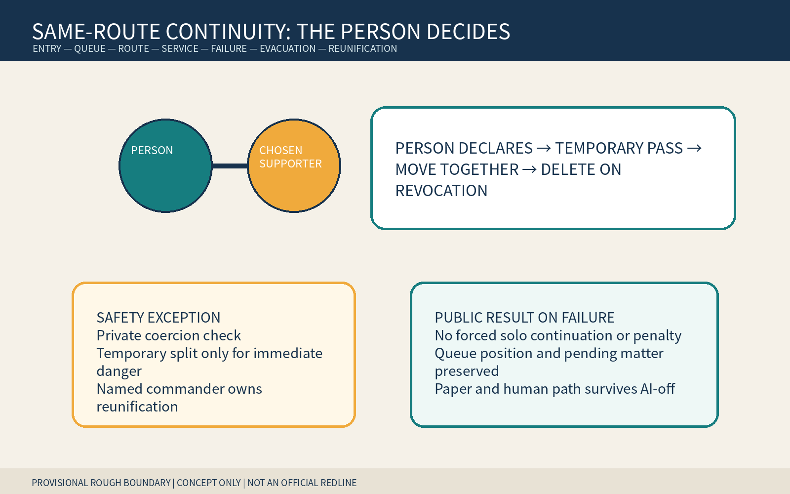
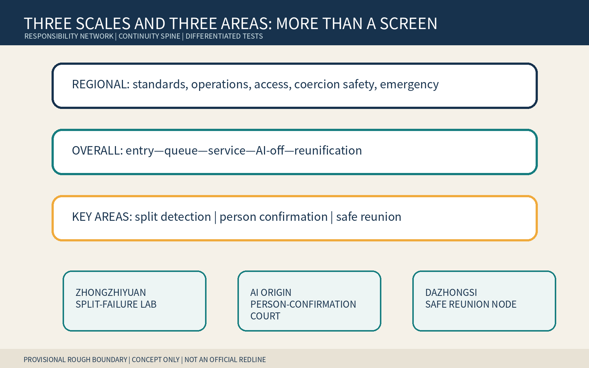
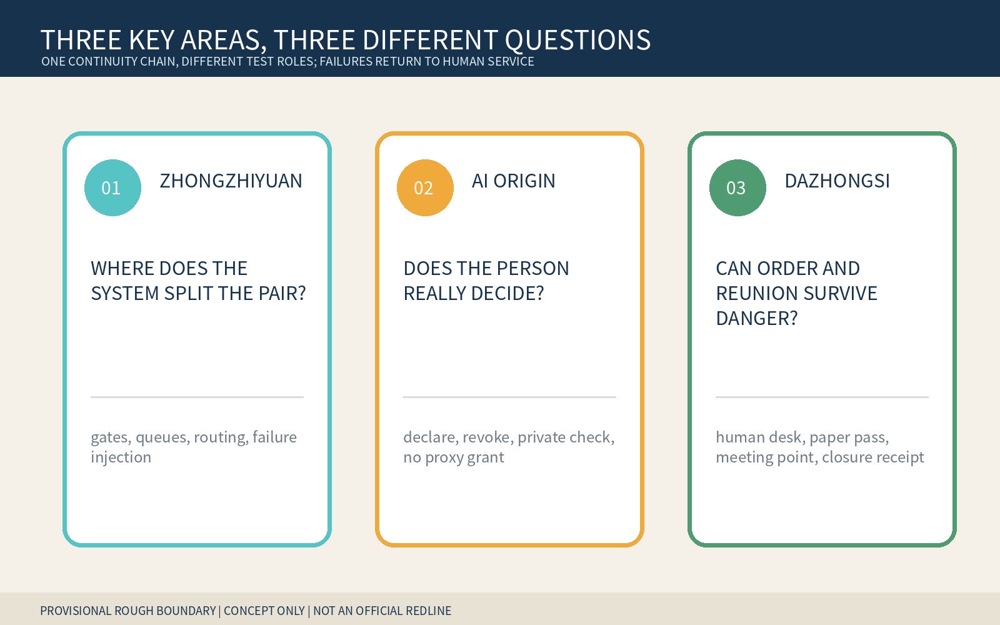
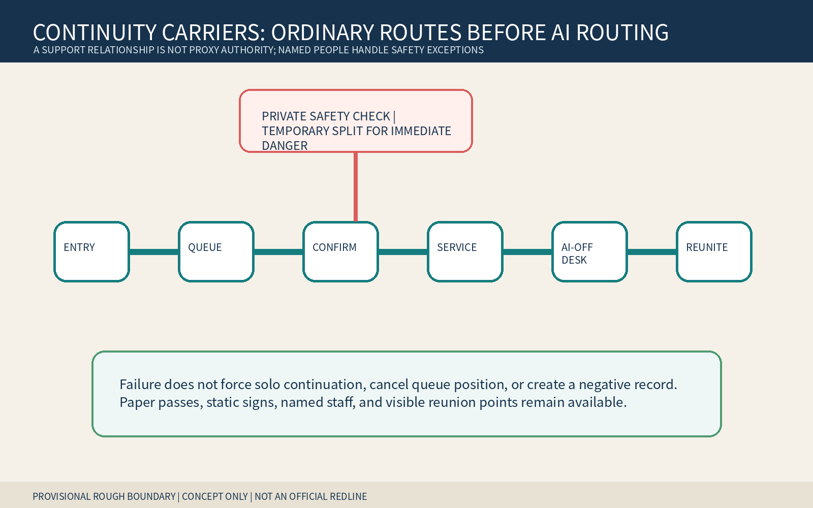
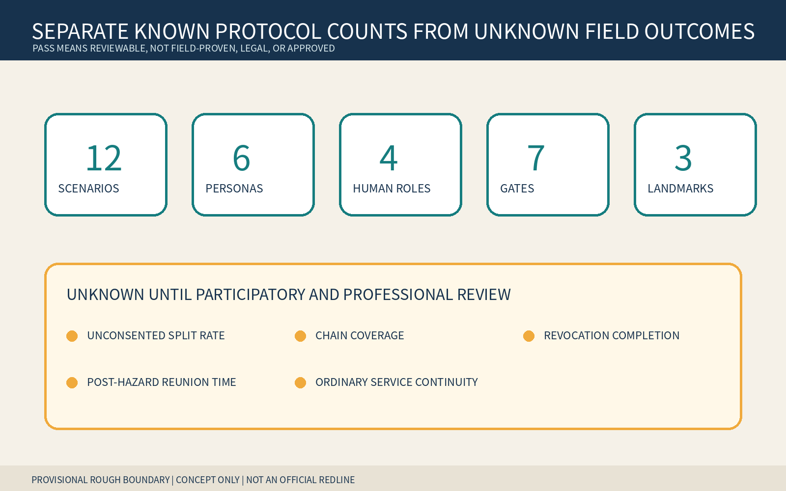

> **Move together by the person's choice; split temporarily only for immediate safety; reunify under named responsibility.** A support relationship is not guardianship, proxy, signature, identity, or data authority.

## Design Basis and Source List

This formal concept package is for professional teams, disability organizations, sign/language services, caregivers, and anti-coercion specialists to deepen together. It uses only the public announcement, cleared taskbook, central source registry, local standard snapshots, and repository provisional polygons. Rough geometry supports intake, internal recalculation, and concept diagrams only; it is not an official redline, survey, approval, or implementation basis. [source:OFFICIAL-ANNOUNCEMENT] [source:AGENT-TASKBOOK] [data:geometry/site_boundary.geojson#SITE-001]

The public problem is not another caregiver entrance. AI navigation, booking, gates, queues, service, and evacuation treat people as independent objects. An unconsented split from a chosen communication, sign-language, language, cognitive, mobility, or emotional supporter can make an otherwise feasible task fail. The pass treats the person plus a person-chosen, revocable supporter with no automatic proxy authority as a task-scoped service unit. Any proposed split asks the person first; suspected coercion receives a private non-punitive check; only immediate danger permits a named commander to split temporarily with an executable reunion plan. [source:SAME-ROUTE-PROTOCOL] [standard:PROJECT-AGENT-OPEN-CALL-TASKBOOK] [depth:existing_conditions_diagnosis]

## Three-Level Scope Framework

The coordinated research area links accessibility, service design, privacy, anti-coercion, emergency, and operating responsibility. The overall area creates a continuity spine of equivalent entry, parallel queue, route-confirmation point, service anteroom, AI-off human desk, and visible reunion point. The three key areas test system split failures, person confirmation/revocation, and safety exception/reunification. Research defines boundaries, overall design makes rights spatially reachable, and key areas use synthetic tabletop work only. [source:PROCESSED-FACT-PACK] [depth:three_level_scope_framework] [metric:site_area_sqm]

Every polygon is a provisional constraint. Official boundaries, existing buildings, roads, flows, fire safety, heritage, ownership, service process, and emergency plans require redrawing, recalculation, and new decisions. This package identifies no real institution, gate, assembly point, or legal duty. [source:BOUNDARY-SOURCE] [data:geometry/key_areas.geojson#PROV-KEY-001] [metric:key_area_count]

## Coordinated Research Area: Industry and Future City Research

The pass organizes transport, public service, sign/language support, accessibility, privacy safety, emergency, and interface teams around declare—temporary pass—move together—private exception—AI-off—revoke/delete—reunion closure. AI may warn that a next step could split the relation, draft a modifiable route, find missing handoffs, and prepare a nonbinding receipt. It may not infer disability, diagnosis, kinship, guardianship, dependency, or coercion; grant proxy authority; or decide who must accompany or split. [source:SAME-ROUTE-PROTOCOL] [source:GENERATIVE-AI-MEASURES]

Six international cases supply questions only: UNICEF AI for Children for participation/well-being boundaries, the ICO Children's Code for high-privacy defaults, and the UK Service Standard for whole tasks and assisted channels. [source:CASE-UNICEF-AI-CHILDREN] [source:CASE-ICO-CHILDRENS-CODE] [source:CASE-UK-SERVICE-STANDARD] Amsterdam and Helsinki registers inform purpose/impact/contact/feedback, while NIST AI RMF informs risk cycles. They are not Chinese law, local demand, performance evidence, or transplantable regimes. [source:CASE-AMSTERDAM-ALGORITHM-REGISTER] [source:CASE-HELSINKI-AI-REGISTER] [source:CASE-NIST-AI-RMF]

### Agent.1 | Identity and three areas/two wings

The name borrows the legibility of a through-ticket and named transfer responsibility without using railway or official marks. Two open parallel tracks join only at a person-controlled knot. Deep blue means named responsibility, teal means person choice, amber means private safety confirmation, and coral means stop. Zhongzhiyuan tests gates, queues, routing, and failures; AI Origin tests declaration, scope, revocation, and private checks; Dazhongsi tests AI-off, order preservation, assembly, and reunion. The two wings offer methods and reversible public testing only. [source:TASKBOOK-DELIVERABLES] [depth:overall_spatial_structure]

### Agent.2 | Cases and enabling factors

Seven enabling factors are synthetic split fixtures, a temporary-pass format, understandable options, named human roles, private-check rules, AI-off paper/static signs, and reunion closure receipts. Land uses only authorized empty or existing ground-floor reversible components; data is synthetic; compute is small and local; funding and scenario access must be phased, stoppable, and unable to displace ordinary service. [source:TASKBOOK-DELIVERABLES] [depth:renewal_project_list]

## Overall Design Area: Urban Renewal and Regulatory-Plan-Level Urban Design

The overall structure is not a companion screen. At entry the person declares a supporter without publicly proving diagnosis or kinship; parallel queues retain order; a service anteroom lets the person set scope; a private point handles suspected coercion; the AI-off desk recognizes paper passes and pending matters; a named commander closes reunion after danger. Public status shows only active, paused, or closed—not identity, diagnosis, relation, or safety reason. [data:geometry/public_space.geojson#PUBLIC-001] [data:geometry/roads.geojson#ROAD-001] [depth:overall_spatial_structure]

Land use, buildings, roads, green/public space, and phasing are conceptual layers. FAR, height, density, capacity, existing operation, fire safety, heritage, ownership, transport, and emergency conditions remain pending official evidence and cannot be inferred from provisional polygons, tabletop tests, or figures. [standard:MOHURD-CONTROL-DETAILED-PLANNING] [depth:development_intensity_controls]

## Detailed Design of Key Areas

| Area | Concept task | Named decision and failure result |
|---|---|---|
| Zhongzhiyuan | Split-Failure Lab: gate denial, queue reorder, accessible detour, outage, evacuation fork | Service-continuity lead restores joint movement/order; otherwise preserve order and do not record abandonment |
| Beijing AI Origin Community | Person-Confirmation Court: declare supporter, set scope, revoke, private anti-coercion check | The person decides; privacy-safety lead handles exceptions; supporter gains no proxy authority |
| Dazhongsi | AI-Off and Reunion Node: paper pass, static sign, human desk, meeting point, closure receipt | Emergency commander splits only for immediate danger and owns reunion; independent review removes negative records |

The north asks where systems split a relation, the center asks whether the person genuinely decides, and the south asks whether order and reunion survive danger. They are rough concept carriers, not real sites or institutions. [data:geometry/key_areas.geojson#PROV-KEY-002] [depth:three_key_area_detailed_design] [assumption:A-SITE-001]

## AI Innovation Ecosystem, Personas, and AI+ Scenarios

Six personas cover people seeking communication/cognitive support without disclosing diagnosis, people choosing sign/language partners, people choosing mobility companions, chosen supporters with no automatic proxy authority, frontline service workers, and privacy/safety/emergency/review staff. They are task roles, not real people or labels about health, family, address, movement, or risk. [metric:persona_count] [depth:public_service_facilities]

The twelve scenarios cover gate denial, queue split, language/sign support, accessible detour, private questioning, suspected coercion, outage/vendor exit, evacuation fork, supporter withdrawal, person revocation, erroneous lateness/abandonment records, and pilot restoration. Their carriers are equivalent entries, parallel waiting, anterooms, private points, human desks, and visible reunion points. Four industry/professional tests cover split injection, AI-off, evacuation/reunion, and negative-record correction. The minimum prototype uses one entry, one forked queue, one anteroom, one human desk, one reunion point, eight synthetic scripts, and paper passes without personal information. [metric:scenario_card_count] [metric:industry_test_scenario_count] [source:SAME-ROUTE-PROTOCOL]

### Agent.3 | State machine and human decisions

States move `UNPAIRED → PERSON_DECLARED → PASS_ISSUED → MOVING_TOGETHER`; safety review enters `PRIVATE_SAFETY_CHECK`; only immediate danger enters `TEMPORARY_SAFE_SPLIT`; the end state is `REUNIFIED_OR_CLOSED`. Seven gates cover person control, no automatic proxy, chain recognition, private exception, reunion, and deletion. Failure routes to human service while preserving queue and pending matter. [source:SAME-ROUTE-PROTOCOL] [metric:continuity_gate_count]

Four named roles own service continuity, privacy safety, immediate-danger command, and independent review. AI does not decide accompaniment or separation, infer relations, grant authority, or turn pauses into lateness, abandonment, or risk. [metric:named_human_role_count] [depth:risk_missing_data]

## Land Use, Building Scale, and Retain-Renovate-Demolish Strategy

Retain ordinary entry, queue, passage, service, and human emergency routes. Renovation uses paper passes, parallel signs, soft privacy screens, static wayfinding, visible reunion flags, and removable desks. New work is discussed only after ownership, fire, accessibility, heritage, structure, operation, and emergency review; no real demolition is proposed. Building envelopes express entry/anteroom/private point/human desk relations only. [data:geometry/buildings.geojson#BLDG-001] [metric:building_footprint_area_sqm] [depth:retain_renovate_demolish]

`land_use.geojson` is an internal topology partition, not statutory land use. Real use, service radius, ownership, responsible operator, and safety conditions require official evidence. [data:geometry/land_use.geojson#LU-001] [standard:MNR-LAND-USE-CLASSIFICATION-GUIDE]

## Transport, Rail, Municipal Infrastructure, and Public Services

Walking, wheelchair, stroller, fire, emergency, and maintenance paths remain unobstructed. Joint movement cannot sacrifice another person's immediate safety, but throughput reduction alone is not sufficient reason for an unconsented split. Stations, Fifth Ring crossings, redlines, evacuation capacity, and assembly points await professional verification. [data:geometry/roads.geojson#ROAD-001] [depth:traffic_rail_slow_parking]

Infrastructure uses minimal linkage, power-off continuity, and revocation. It connects to no identity, health, family-relation, or training system. A paper pass carries only a random task ID, scope, and expiry/revocation state. Human desks, telephone, paper, static signs, and visible reunion points survive outages. Barrier-Free Environment Law Article 39 is cited only for listed service venues, not generalized. [source:BARRIER-FREE-LAW] [standard:BARRIER-FREE-ENVIRONMENT-LAW] [depth:municipal_new_infrastructure]

## Blue-Green Network, Public Space, and Urban Character

Public space provides shade, seating, accessibility, parallel waiting, a quiet private point, and a visible reunion point without requiring public disclosure of support needs. `green_ratio` and `public_space_ratio` are internal proposal-layer calculations, not existing or regulatory indicators. [data:geometry/green_space.geojson#GREEN-001] [metric:green_ratio] [depth:blue_green_public_space]

Text, shape, and position carry status together. No diagnosis, kinship, guardianship, coercion label, face, disability icon, company logo, or personal story appears. Coral means stop/immediate danger only and cannot become a risk profile. [source:ROUTE-RIGHTS-LEDGER] [depth:height_massing_character]

### Agent.4 | Landmarks and components

The Same-Route Knot lets the person declare, change, and revoke. The No-Proxy Light states that support grants no automatic authority. The Reunion Bell displays whether a named owner closed reunion. Six removable components are the temporary pass, parallel queue sign, private-check screen, AI-off paper card, order-preservation receipt, and visible reunion flag. [metric:landmark_count] [source:TASKBOOK-DELIVERABLES]

### Agent.5 | Culture and international communication

Railway through-journeys, timetables, and named transfers become relationship continuity without overreach. Zhongguancun's open problems, versions, and reproducible tests make split failures testable. AI culture refuses to infer who decides for whom from devices, disability, or kinship. The international line is: “Move together by choice. Separate only for safety. Reunite by responsibility.” [source:TASKBOOK-DELIVERABLES] [source:ROUTE-RIGHTS-LEDGER]

## Renewal Projects, Implementation Policy, and Phasing

Near term: map the whole task, run eight synthetic failures, and build one empty-space paper prototype. Mid term: co-review with disability, sign/language, caregiving, anti-coercion, privacy, emergency, operations, and accessibility specialists. Long term: discuss a low-risk time-limited pilot only after authority, site, safety, staffing, AI-off, deletion, and reunion responsibility are ready. [data:geometry/phasing.geojson#PHASE-001] [depth:phasing_implementation]

Nine work packages cover roles, synthetic scripts, temporary pass, entry/queue integration, person confirmation, private exception, AI-off, reunion tabletop, and independent review. Each has an owner, stop condition, paper equivalent, and closure receipt. If private confirmation, order preservation, relation deletion, or reunion plan fails, remain OFF. [source:SAME-ROUTE-PROTOCOL] [depth:renewal_project_list]

### Agent.6 | Annual operation

Q1 audits split failures; Q2 co-designs person choice/revocation; Q3 runs AI-off and evacuation-reunion tabletops; Q4 publishes de-identified failure types and rule corrections. Developers maintain synthetic fixtures, protocol adapters, and accessible interfaces only. Conversion runs public problem → synthetic test → empty-space prototype → affected-person/professional review → authorized reversible pilot → public correction. Activities, partnerships, finance, and sites are concepts. [source:TASKBOOK-DELIVERABLES] [depth:phasing_implementation]

## Metrics, Area Recalculation, and Compliance Matrix

Structured outputs contain 12 scenarios, 6 personas, 4 tests, 3 landmarks, 4 named roles, 7 gates, and 8 scripts. Counts prove only that candidate-specific outputs exist, not field effectiveness, legality, or approval. Area, envelope, green, and public-space ratios come from provisional GeoJSON at low confidence. [metric:scenario_card_count] [metric:continuity_gate_count]

Unconsented split rate, whole-chain recognition, choice/revocation completion, post-hazard reunion time, and ordinary-service continuity remain unknown. No targets or results are filled without an authorized site, representative co-design, applicable procedure, staffing, and independent review. [metric:unconsented_separation_rate] [metric:post_hazard_reunification_time_minutes]

The five-field audit identifies a person and person-chosen, revocable supporter with no automatic proxy; the whole chain declare—pass—move together—confirm before split—private safety exception—AI-off—revoke/delete—reunify; continuous spatial carriers; distributed rights across the person and four named roles; and a failure result with no forced solo continuation, penalty, queue/pending-matter loss, or lost reunion. Health accompaniment, multisensory independence, intergenerational resilience, translation intent, and hidden-help safety are adjacent but do not close all five fields. Any complete equivalent makes this candidate convergent; renaming cannot preserve it. [source:SAME-ROUTE-PROTOCOL] [depth:risk_missing_data]

## Risk, Copyright, and Compliance

Risks include default accompaniment reducing autonomy, coercive supporters, exposing a person during private checks, mistaking the pass for proxy authority, unmanaged safety conflict, failed reunion, retained relations after revocation, and pauses recorded as lateness/abandonment. Any real personal data, AI relation/disability/coercion inference, absent named roles, failed AI-off/deletion, or ownerless reunion stops the prototype and preserves order through human service. [source:SAME-ROUTE-PROTOCOL] [assumption:A-RELATION-001] [depth:risk_missing_data]

All narrative, protocol, JSON, HTML, figures, and PDFs were newly generated in this run. Generic topology-safe geometry and deterministic packaging structure reuse only the author's merged package and are disclosed in the rights ledger. Python/Pillow and Noto Sans CJK generated the figures; there is no generated site rendering, external image, map tile, person, trademark, personal data, or non-public spatial data. [source:ROUTE-RIGHTS-LEDGER] [source:SOURCE-REGISTRY]

This is an open co-creation proposal, not planning, legal advice, service rules, an emergency plan, government approval, or implementation authorization. Repository intake, CI, self-check, or scores do not imply selection, approval, construction, or endorsement. [standard:PROJECT-OFFICIAL-ANNOUNCEMENT] [assumption:A-CONTROLS-001]

## References

The complete registry is in `sources.json`. The site package, announcement, and taskbook support tasks and concept boundaries only; processed material is navigation only. [source:SITE-PACKAGE] [source:OFFICIAL-ANNOUNCEMENT] [source:PROCESSED-FACT-PACK] The overall and three key-area polygons share one provisional source; central standards remain within stated scope, and authored protocols, personas, scenarios, and landmarks are not field facts. [source:SOURCE-REGISTRY] [source:BOUNDARY-SOURCE] [source:KEY-AREA-SOURCE]
