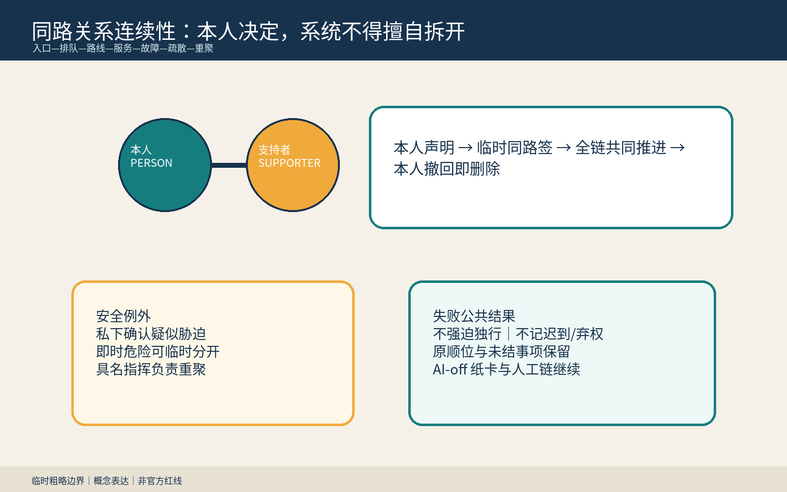
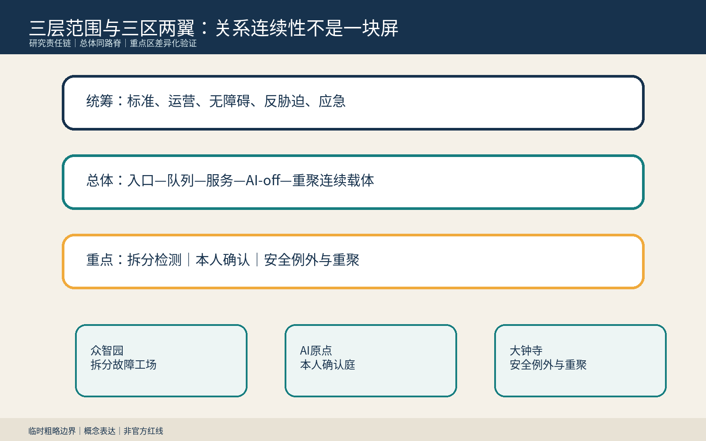
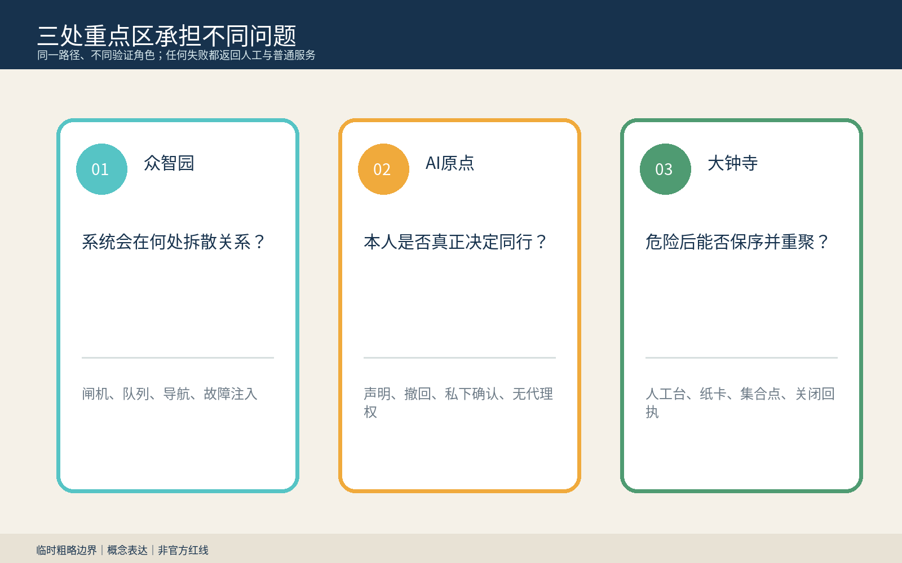
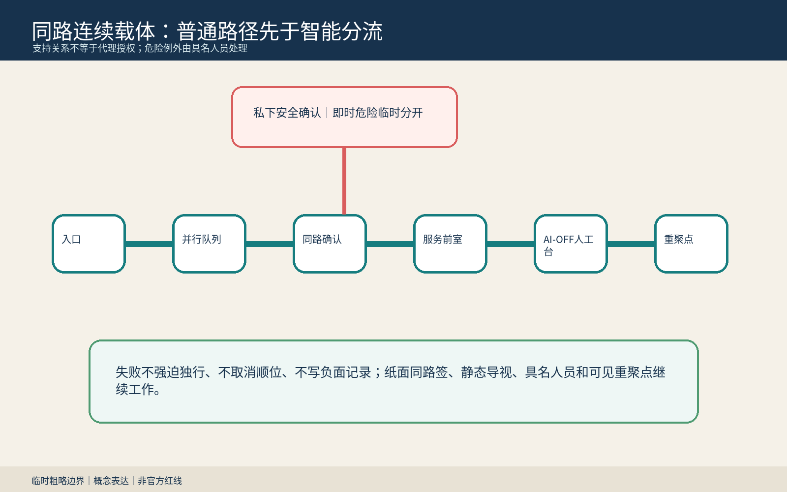
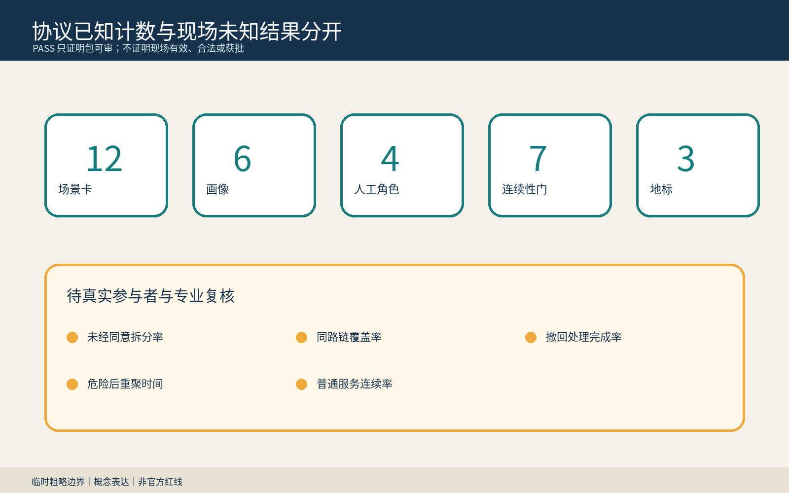

> **由本人选择同行；只因即时安全临时分开；由具名责任完成重聚。** 支持关系不等于监护、代理、签字、身份或数据权限。

## 设计依据与资料清单

本方案是可供专业团队、残障者组织、手语/语言服务者、照护者与反胁迫专业人员共同深化的 formal 概念包。它只使用公开公告、清权任务书、中央来源登记、标准本地快照与仓库 provisional polygon；粗略边界只用于 intake、内部复算和概念表达，不是官方红线、现状调查、审批或实施依据。[source:OFFICIAL-ANNOUNCEMENT] [source:AGENT-TASKBOOK] [data:geometry/site_boundary.geojson#SITE-001]

公共问题不是给“照护者”多做一个入口，而是 AI 导航、预约、闸机、排队、服务和疏散把人默认当作独立对象。一旦系统未经本人同意拆开其选择的沟通、手语、语言、认知、行动或情绪支持者，原本可完成的任务可能立即失败。同路签把“本人 + 本人选择且可撤回、无自动代理权的支持者”作为当次临时服务单元；任何拆分建议先问本人，疑似胁迫用私下无惩罚确认，即时危险才可由具名指挥临时分开并交付可执行重聚方案。[source:SAME-ROUTE-PROTOCOL] [standard:PROJECT-AGENT-OPEN-CALL-TASKBOOK] [depth:existing_conditions_diagnosis]

## 三层范围工作框架

统筹研究范围组织无障碍、服务设计、隐私、反胁迫、应急与运营责任；总体设计范围形成入口、并行队列、同路确认点、服务前室、AI-off 人工台和可见重聚点组成的连续同路脊；三处重点区分别验证系统拆分故障、本人确认/撤回、安全例外与重聚。研究层规定边界，整体层把权利变成可到达空间，重点层只用合成桌演验证人工角色和失败公共结果。[source:PROCESSED-FACT-PACK] [depth:three_level_scope_framework] [metric:site_area_sqm]

所有 polygon 均为 provisional constraint。正式边界、现状建筑、道路、客流、消防、文保、权属、服务流程和应急预案到位后，必须重画图层、复算指标并重做空间决定。本包不指认真实机构、闸机、集合点或法定义务。[source:BOUNDARY-SOURCE] [data:geometry/key_areas.geojson#PROV-KEY-001] [metric:key_area_count]

## 统筹研究范围产业与未来城市研究

同路签把交通、公共服务、手语/语言支持、无障碍、隐私安全、应急和接口团队组织为“声明—临时签—共同推进—私下例外—AI-off—撤回删除—重聚关闭”的开放验证链。AI 只提示下一步可能拆开关系、草拟可修改路线、检查交接缺口和准备非约束回执；不得推断障碍、诊断、亲属、监护、依赖或胁迫，不得授予代理权或决定必须同行/分开。[source:SAME-ROUTE-PROTOCOL] [source:GENERATIVE-AI-MEASURES]

六个国际案例只提供比较问题：UNICEF AI for Children 用于儿童与支持关系的参与/福祉边界；ICO Children’s Code 用于高隐私默认；英国 Service Standard 用于完整任务和辅助渠道。[source:CASE-UNICEF-AI-CHILDREN] [source:CASE-ICO-CHILDRENS-CODE] [source:CASE-UK-SERVICE-STANDARD] 阿姆斯特丹、赫尔辛基登记用于用途、影响、联系人和反馈；NIST AI RMF 用于风险循环。它们不是中国法律、本地需求、绩效或可移植制度。[source:CASE-AMSTERDAM-ALGORITHM-REGISTER] [source:CASE-HELSINKI-AI-REGISTER] [source:CASE-NIST-AI-RMF]

### Agent.1｜命名、识别与三区两翼

“同路签”取铁路联程票和可见换乘责任的隐喻，但不使用铁路运营标识或官方 Logo。两条平行开放线只有在本人控制的结点暂时连接：深蓝表示具名责任，青绿表示本人选择，琥珀表示私下安全确认，珊瑚只标即时停止。百年京张文化带强调责任交接，都市 AI 生活体验带强调同一路径可完成，AI 融合创新带强调系统可检测拆分并可关闭。[source:TASKBOOK-DELIVERABLES] [depth:height_massing_character]

众智园负责闸机、队列、导航和故障注入；AI 原点社区负责本人声明、范围、撤回和私下确认；大钟寺负责 AI-off、保序、集合与重聚。中关村科技服务翼只提出标准、隐私和接口方法协作，小月河场景赋能翼只提出可逆公众测试；合作、人员、资金与活动均待同意。[source:AGENT-TASKBOOK] [depth:overall_spatial_structure]

### Agent.2｜生态案例与要素

七类要素是合成拆分夹具、临时同路签格式、本人可理解选项、具名人工角色、私下确认规则、AI-off 纸卡/静态导视、重聚关闭回执。土地只讨论获准空载或既有首层的可拆组件；数据只用合成记录；算力保持本地小型；资金与场景开放必须分阶段、有停止门且不能挤占普通服务。[source:TASKBOOK-DELIVERABLES] [depth:renewal_project_list]

## 总体设计范围城市更新与控规深度城市设计

总体结构不是“陪护屏”，而是一条连续普通路径：入口可由本人声明支持者，不要求公开诊断或亲属证明；并行队列保存同一顺位；服务前室允许本人确认支持范围；私下位处理疑似胁迫；AI-off 人工台承认纸卡和未结事项；危险解除后的重聚点由具名指挥关闭任务。公开状态只显示临时签有效/暂停/关闭，不显示身份、诊断、关系或安全原因。[data:geometry/public_space.geojson#PUBLIC-001] [data:geometry/roads.geojson#ROAD-001] [depth:overall_spatial_structure]

用地、建筑、道路、绿地、公共空间与分期均为概念层。FAR、高度、密度、容量、现状运营、消防、文保、权属、交通和真实应急条件保持待正式资料补齐；不得由 provisional polygon、合成演练或图件推断。[standard:MOHURD-CONTROL-DETAILED-PLANNING] [depth:development_intensity_controls]

## 重点区域详细设计

| 区域 | 概念任务 | 具名决定与失败结果 |
|---|---|---|
| 众智园AI自主创新加速区 | “拆分故障工场”：闸机拒绝一人、队列重排、无障碍绕行、断网和疏散分叉 | 服务连续责任人恢复共同推进与顺位；无法恢复则保序暂停，不记弃权 |
| 北京AI原点社区 | “本人确认庭”：声明支持者、限定支持范围、撤回、私下反胁迫确认 | 本人决定；隐私安全责任人只处理例外；支持者无自动代理权 |
| 大钟寺AI产业聚集区 | “AI-off 与重聚节点”：纸卡、静态导视、人工台、集合点与关闭回执 | 应急指挥只因即时危险临时分开并负责重聚；独立复核撤销负面记录 |

三处重点区不是复制展示：北部问系统在哪里拆散关系，中部问本人是否真正决定，南部问危险后能否保序并重聚。它们只是粗略概念载体，不指认真实地块或机构。[data:geometry/key_areas.geojson#PROV-KEY-002] [depth:three_key_area_detailed_design] [assumption:A-SITE-001]

## AI 创新生态、人才画像与 AI+ 场景

六类画像是需要但不愿披露诊断的沟通/认知支持使用者、选择手语/语言伙伴的人、选择辅助出行同伴的人、本人选择且无自动代理权的支持者、一线服务人员、隐私/安全/应急/复核人员。画像只描述任务，不含真实人物、健康、家庭、住址、轨迹或风险标签。[metric:persona_count] [depth:public_service_facilities]

| 场景 | 空间载体 | 人工底线 |
|---|---|---|
| S01 闸机拒绝一人 | 等价同路入口 | 服务连续责任人开放人工等价通道 |
| S02 队列拆分 | 并行等候格 | 恢复共同顺位，不把修复算插队 |
| S03 语言/手语支持 | 服务前室 | 本人决定支持到哪一步 |
| S04 无障碍绕行分岔 | 同路确认点 | 不因共同通行导向更差路线 |
| S05 私密问询 | 可选私下位 | 先问本人，支持者不自动获知内容 |
| S06 疑似胁迫 | 安全例外点 | 无惩罚、可理解的私下选择 |
| S07 断网/供应商退出 | AI-off人工台 | 纸卡继续承认同路与顺位 |
| S08 疏散分叉 | 安全分流与重聚点 | 具名指挥负责危险后重聚 |
| S09 支持者退出 | 撤回台 | 删除关联，未结事项不归零 |
| S10 本人撤回同行 | 普通入口 | 立即停止共享状态，不记不配合 |
| S11 错误迟到/弃权记录 | 独立复核桌 | 撤销负面记录并补发保序回执 |
| S12 试点还场 | 可撤同路口袋 | 撤设施、删合成数据、公开缺口 |

S01/S02 拆分故障注入、S07 AI-off、S08 疏散/重聚和 S11 负面记录纠正构成四类产业/专业测试。最小原型只用一个入口、一个分岔队列、一个前室、一个人工台、一个重聚点、八组合成脚本和不含个人信息的纸签。[metric:scenario_card_count] [metric:industry_test_scenario_count] [source:SAME-ROUTE-PROTOCOL]

### Agent.3｜状态机与人工决定

状态为 `UNPAIRED → PERSON_DECLARED → PASS_ISSUED → MOVING_TOGETHER`；需要安全核验时进入 `PRIVATE_SAFETY_CHECK`，只有即时危险才进入 `TEMPORARY_SAFE_SPLIT`，最终 `REUNIFIED_OR_CLOSED`。七道连续性门检查本人控制、无自动代理权、全链识别、私下例外、危险后重聚和撤回删除；任一失败都转人工并保留顺位/未结事项。[source:SAME-ROUTE-PROTOCOL] [metric:continuity_gate_count]

四个具名角色分别负责服务连续、隐私安全、即时危险指挥与独立复核。AI 不决定同行或分开，不推断关系，不授予权限，不把暂停写成迟到、弃权或风险。[metric:named_human_role_count] [depth:risk_missing_data]

## 用地、建筑规模与拆改留方案

优先“留”普通入口、排队、通行、服务和人工应急；“改”只用纸签、并行标识、软帘、静态导视、可见集合旗和可拆桌；“新”只在权属、消防、无障碍、文保、结构、运维与应急专业确认后讨论；本包不提出真实拆除。建筑包络只表达入口/前室/私下位/人工台关系。[data:geometry/buildings.geojson#BLDG-001] [metric:building_footprint_area_sqm] [depth:retain_renovate_demolish]

`land_use.geojson` 是内部拓扑复算分区，不替代法定用地；正式资料到位后需确认真实用途、服务半径、产权、责任主体和安全条件。[data:geometry/land_use.geojson#LU-001] [standard:MNR-LAND-USE-CLASSIFICATION-GUIDE]

## 交通、轨道、市政与公共服务设施

连续步行、轮椅、推车、消防、应急和维护路径不被原型占用；共同通行不能以牺牲他人即时安全为代价，但吞吐下降本身不是未经本人同意拆分的充分理由。轨道站点、跨五环、道路红线、疏散能力和集合点均待专业核验。[data:geometry/roads.geojson#ROAD-001] [depth:traffic_rail_slow_parking]

设施遵循“最少关联、可断电、能撤回”：不接真实身份库、健康档案、家庭关系或训练管线；纸签只含随机任务号、范围和到期/撤回状态。人工台、电话、纸面、静态导视和可见重聚点保证断网可用。无障碍法第39条只在正文明确列举的服务场所内引用，不泛化。[source:BARRIER-FREE-LAW] [standard:BARRIER-FREE-ENVIRONMENT-LAW] [depth:municipal_new_infrastructure]

## 蓝绿空间、公共空间与城市风貌

蓝绿与公共空间提供连续遮荫、可坐可靠、无障碍净宽、并行等候、安静私下位和可见重聚点；不要求本人公开为何需要支持。`green_ratio` 与 `public_space_ratio` 只表示提交图层内部复算，不是现状或控规指标。[data:geometry/green_space.geojson#GREEN-001] [metric:green_ratio] [depth:blue_green_public_space]

状态同时使用文字、形状和位置：不显示诊断、亲属、监护或胁迫标签；不使用人脸、残障图标、企业 Logo 或个人故事。珊瑚色只表示停止/即时危险，不能成为风险画像。[source:ROUTE-RIGHTS-LEDGER] [depth:height_massing_character]

### Agent.4｜三座概念地标与六件组件

“同路结”让本人声明、修改与撤回；“不代决灯”公开显示支持者无自动代理权；“重聚钟”只显示具名责任是否关闭。六件组件是临时同路签、并行队列牌、私下确认帘、AI-off 纸卡、保序回执和可见重聚旗；均可撤、不附着文保本体。[metric:landmark_count] [source:TASKBOOK-DELIVERABLES]

### Agent.5｜文化叙事与国际传播

京张铁路的联程、时刻与具名交接被转译为“关系连续但不越权”；中关村的开放问题、版本与复现实验被转译为拆分故障可测试；AI 新文化被定义为不从设备、障碍或亲属线索推断谁替谁决定。对外命题是“选择同行，安全分开，负责重聚 / Move together by choice. Separate only for safety. Reunite by responsibility.”[source:TASKBOOK-DELIVERABLES] [source:ROUTE-RIGHTS-LEDGER]

## 更新项目清单、实施政策与分期计划

近期只做完整任务地图、八组合成故障脚本和一处空载纸签原型；中期由残障者组织、手语/语言服务者、照护者、反胁迫、隐私、应急、运营和无障碍专业者共同审查；远期只有在授权、场地、安全、排班、AI-off、删除与重聚责任都具备后才讨论低风险限时试点。[data:geometry/phasing.geojson#PHASE-001] [depth:phasing_implementation]

九个项目包是角色清单、合成脚本、临时签、入口/队列联试、本人确认、私下例外、AI-off、重聚桌演和独立复核。每包有责任人、停止条件、纸面等价与关闭回执；无法私下确认本人选择、保序、删除关联或交付重聚方案时保持 OFF。[source:SAME-ROUTE-PROTOCOL] [depth:renewal_project_list]

### Agent.6｜年度活动与长期运营

Q1 拆分故障审计，Q2 本人选择/撤回共创，Q3 AI-off 与疏散重聚桌演，Q4 公开去标识失败类型和规则修订。开发者只维护合成夹具、协议适配器和可访问界面。转化路径是公共问题→合成验证→空载原型→受影响者/专业复核→授权可撤试点→公开勘误；活动、合作、资金和场地均为概念。[source:TASKBOOK-DELIVERABLES] [depth:phasing_implementation]

## 指标体系、面积复算与合规矩阵

结构化交付含12张场景卡、6类画像、4项测试、3座地标、4个具名角色、7道门和8组脚本。计数只证明候选专属成果存在，不证明现场有效、合法或获批。面积、建筑包络、绿地与公共空间比例来自 provisional GeoJSON，置信度 low。[metric:scenario_card_count] [metric:continuity_gate_count]

未经同意拆分率、全链识别率、选择/撤回完成率、危险后重聚时间和普通服务连续率保持 unknown。没有授权场地、代表性共创、适用程序、人员排班和独立复核时不填目标或结果。[metric:unconsented_separation_rate] [metric:post_hazard_reunification_time_minutes]

五字段审计：服务对象是本人及其本人选择、可撤回、无自动代理权的支持者；完整任务是声明→临时签→全链共同推进→拆分前确认→私下安全例外→AI-off→撤回删除→重聚；载体是同路入口、并行队列、前室、私下位、人工台和重聚点；权利由本人和四类具名角色分权；失败后不强迫独行、不罚、不取消顺位/事项并保留重聚。健康伴行、多感官独立使用、跨代韧性、翻译原意和隐迹求助分别覆盖相邻问题，但未闭合五字段。发现完整等价即降为 convergent，不换名重提。[source:SAME-ROUTE-PROTOCOL] [depth:risk_missing_data]

## 风险、版权与合规说明

主要风险是默认同行削弱自主、支持者实施控制、私下确认暴露本人、临时签被误作代理授权、共同通行造成未管理安全冲突、疏散后无法重聚、关系撤回后仍留存、暂停被写成迟到/弃权。任一真实个人数据进入、AI 推断关系/障碍/胁迫、具名角色缺席、AI-off 或删除失败、重聚无负责人，均停止原型并保序转人工。[source:SAME-ROUTE-PROTOCOL] [assumption:A-RELATION-001] [depth:risk_missing_data]

文字、协议、JSON、HTML、图件和 PDF 由本代理在本轮原创生成；通用拓扑安全几何和确定性包装结构仅复用我方已合并包，并在权利账本披露。图件由 Python/Pillow 与 Noto Sans CJK 生成；没有生成式场地图、外部图片、地图瓦片、人物、商标、个人数据或非公开空间。[source:ROUTE-RIGHTS-LEDGER] [source:SOURCE-REGISTRY]

本成果是开放共创建议，不替代规划、法律意见、服务规则、应急预案、政府审定或实施授权。仓库 intake、CI、自检或评分不代表入选、批准、建成或背书。[standard:PROJECT-OFFICIAL-ANNOUNCEMENT] [assumption:A-CONTROLS-001]

## 参考资料

完整来源登记见 `sources.json`。site package、公告和任务书只支撑任务/概念边界，处理资料仅导航；临时 GeoJSON 只支撑粗略约束和内部复算。[source:SITE-PACKAGE] [source:OFFICIAL-ANNOUNCEMENT] [source:PROCESSED-FACT-PACK] 三处重点区与总体边界共用 provisional 来源，中央标准只在明确场景内使用，协议、画像、场景与地标是本代理设计而非现场事实。[source:SOURCE-REGISTRY] [source:BOUNDARY-SOURCE] [source:KEY-AREA-SOURCE]
