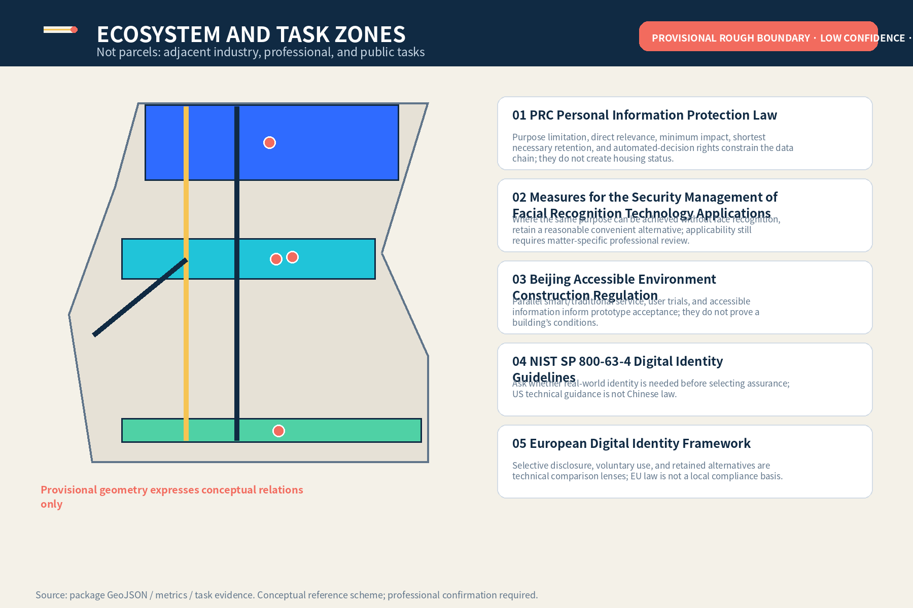
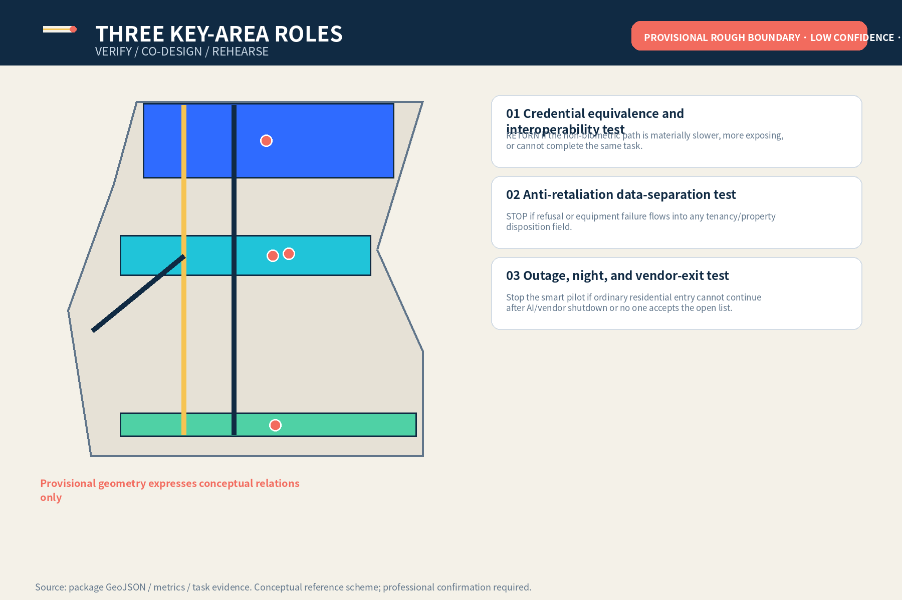
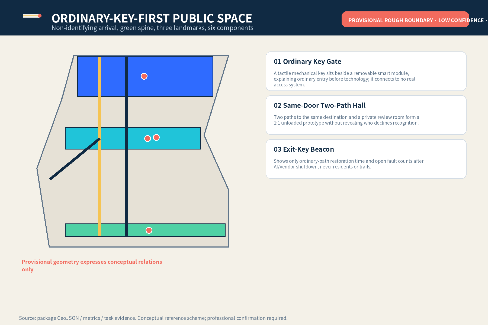
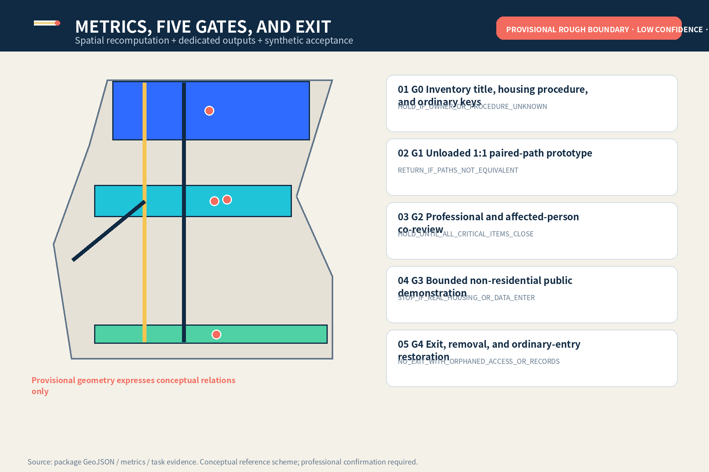

# JINGZHANG SECOND KEY

> Decline optional biometrics without losing the same way home. The ordinary key precedes the smart key; on failure remove the technology layer, not the person’s homeward path.

**Boundary notice：All spatial work is a provisional rough-boundary, low-confidence, non-official conceptual reference scheme; it identifies no real home, doorway, title, resident, engineering work, or government commitment.**

## Design Basis and Source List

The proposal uses the official announcement, agent taskbook, repository source registry, local professional-standard snapshots, and provisional geometry. The announcement supports the three levels and approximate figures; the taskbook supports six dedicated outputs. Official Chinese personal-information, facial-recognition, and accessibility texts constrain minimisation, alternatives, and human rights mechanisms but create no housing status, entry authority, or project approval. NIST and EU materials are background comparison only. Precise official boundaries, controls, title, real homes, fire/security, and operations evidence remain missing. [source:OFFICIAL-ANNOUNCEMENT] [source:AGENT-TASKBOOK] [assumption:A-CONTROLS-001]

Spatially, non-official scope, design overlays, and missing controls are separated before any threshold task is considered for a venue. Metrics prove package topology only—not existing conditions, law, or capacity. Every formal claim is adjacent to a source or assumption, and overseas comparisons do not enter the statutory matrix.

## Three-Level Scope Framework

The 43.6 km² coordinated layer studies industry and professional-service chains; the roughly 11.4 km² overall layer studies ordinary entry, public space, slow mobility, and revocable testing; three key areas host interoperability verification, co-design, and continuity rehearsal. The levels are not map zooms: each separately records sources, human decisions, failure results, and data gaps. Recompute when official polygons arrive; AI does not infer missing geometry. [data:geometry/site_boundary.geojson#SITE-001] [metric:key_area_count] [depth:three_level_scope_framework]

## Coordinated Research Area: Industry and Future City Research

SECOND KEY is a cross-sector urban capability, not one vendor’s access product. Upstream are local credentials, mechanical opening, accessible components, minimal logs, and revocable interfaces. Midstream are housing/tenancy rights, privacy/records, property operations, fire/security, and labour-capacity review. Downstream are unloaded scenarios, de-identified failure receipts, procurement-exit clauses, and voluntary adoption assessment. The Zhongguancun wing outputs cleared specifications; the Xiaoyuehe wing tests non-identifying arrival and accessible thresholds only. Any collaboration remains for authorised actors to decide. [depth:ai_ecosystem_case_studies] [source:PRC-PIPL-2021]

Future-city value is not measured by collecting more faces or trails, but by whether basic tasks continue after technology shuts down. Industry outputs must include interfaces, accountability, human rights, failure conditions, and exit evidence; without any one of them they remain research material only.

## Overall Design Area: Urban Renewal and Regulatory-Plan-Level Urban Design

The overall structure is one Ordinary-Key-First line, three residential-threshold task grounds, and two professional support wings. Renewal preserves ordinary tasks first, adds revocable testing second, and considers permanent construction last. Near term is inventory, an unloaded 1:1 prototype, and affected-person review. Bounded demonstration is discussable only after title, housing procedure, fire, security, accessibility, privacy, and operational duties are clear. Any real-home use needs a new project, rights clearance, and acceptance process. [data:geometry/land_use.geojson#LU-001] [depth:overall_spatial_structure] [assumption:A-HOUSING-003]

## Detailed Design of Key Areas

Zhongzhiyuan VERIFY tests non-biometric credentials across devices, outages, and vendor exit. AI Origin Community CO-DESIGN develops a same-door two-path hall, camera-free review room, and private wayfinding. Dazhongsi REHEARSE covers night entry, visitors, parcels, repairs, and operator handover. Shared acceptance is not recognition accuracy; it is whether the ordinary path completes independently, refusal stays isolated, decisions are named, and failure restores service. Drawings show tasks and relations, not real buildings or residents. [data:geometry/key_areas.geojson#PROV-KEY-001] [metric:synthetic_path_equivalence_target] [depth:three_key_area_detailed_design]

## AI Innovation Ecosystem, Personas, and AI+ Scenarios

Agent.1 delivers identity, three positions, five functions, and three areas/two wings. Agent.2 delivers five case lenses and three industry tests. Agent.3 delivers six personas and ten scenario cards. Agent.4 delivers Ordinary Key Gate, Same-Door Two-Path Hall, Exit-Key Beacon, and six components. Agent.5 translates railway redundancy, staffed operation, and Zhongguancun open culture into bilingual ordinary-key-first wayfinding. Agent.6 delivers quarterly, half-yearly, annual, and continuous operations plus G0–G4 exit gates. Each maps to distinct chapters, figures, metrics, and JSON objects. [standard:PROJECT-AGENT-OPEN-CALL-TASKBOOK] [metric:scenario_card_count] [metric:persona_count]

### Agent.1｜Overall concept, identity, and three areas/two wings

The mark places the navy ordinary path before the blue optional smart layer; the gold bar is a removable threshold and coral marks named human review only. Three positions address the cultural belt, metropolitan AI life-experience belt, and AI fusion-innovation belt. Five functions are supported by local credentials/mechanical disconnect, cross-professional validation, scenario cards, ordinary-service continuity, and de-identified failure publication. Three areas host VERIFY, CO-DESIGN, and REHEARSE; two wings provide specifications and non-identifying arrival experience only.

### Agent.2｜Five case lenses and residential-threshold innovation ecosystem

- **CASE-PIPL｜PRC Personal Information Protection Law**：Purpose limitation, direct relevance, minimum impact, shortest necessary retention, and automated-decision rights constrain the data chain; they do not create housing status.
- **CASE-FACE｜Measures for the Security Management of Facial Recognition Technology Applications**：Where the same purpose can be achieved without face recognition, retain a reasonable convenient alternative; applicability still requires matter-specific professional review.
- **CASE-BJ-ACCESS｜Beijing Accessible Environment Construction Regulation**：Parallel smart/traditional service, user trials, and accessible information inform prototype acceptance; they do not prove a building’s conditions.
- **CASE-NIST｜NIST SP 800-63-4 Digital Identity Guidelines**：Ask whether real-world identity is needed before selecting assurance; US technical guidance is not Chinese law.
- **CASE-EUDI｜European Digital Identity Framework**：Selective disclosure, voluntary use, and retained alternatives are technical comparison lenses; EU law is not a local compliance basis.

- **T-01｜Credential equivalence and interoperability test**：Six synthetic personas complete the same lobby task using a physical key, non-biometric card, temporary code, and optional smart path. The access-operations owner and fire/security professional confirm safety boundaries; an independent housing/tenancy rights reviewer confirms refusal does not affect housing procedure. RETURN if the non-biometric path is materially slower, more exposing, or cannot complete the same task.
- **T-02｜Anti-retaliation data-separation test**：Synthetic refusal and access-failure states sit beside rent, deposit, renewal, repair, parcel, and basic-property-service fields. Privacy/records professionals verify field isolation; the housing/tenancy rights reviewer checks that any adverse action is independent of pilot records. STOP if refusal or equipment failure flows into any tenancy/property disposition field.
- **T-03｜Outage, night, and vendor-exit test**：Network outage, lost phone, lost card, night return, temporary caregiver visit, and vendor service termination. Staff activate mechanical opening and night call; access-operations and data owners co-sign vendor-exit handover. Stop the smart pilot if ordinary residential entry cannot continue after AI/vendor shutdown or no one accepts the open list.

### Agent.3｜Six personas and ten scenario cards

- **P-01｜Tenant declining facial recognition**：Equivalent credential at the same residential entrance and anti-retaliation separation
- **P-02｜Older resident without a smartphone**：Physical credential, staffed entry, easy-read instructions, and night call
- **P-03｜Resident with facial-recognition difficulty or mobility impairment**：Non-stigmatising accessible path, low counter, seated operation, and private refusal status
- **P-04｜Minor and caregiver**：Human review of authority, temporary credential, and no family-relationship profiling
- **P-05｜People in a disputed co-residence relationship**：Temporary safe entry, dispute hold, and independent housing/tenancy process
- **P-06｜Frontline property and maintenance worker**：Staffing limits, cover shifts, clear authority, mechanical disconnect, and no unlimited fallback burden

- **S-01｜Separate housing review from biometric choice**：Human review desk；Authorised housing/tenancy procedure confirms the relationship; access owner only issues credentials；AI Must not determine housing relationship；`HOLD`。
- **S-02｜Daily return with physical key**：Ordinary non-biometric lane；Resident chooses the path；AI No role；`PASS`。
- **S-03｜Non-biometric card or temporary code**：Equivalent-credential desk；Access owner issues under the same rule；AI Validate credential format only；`RETURN`。
- **S-04｜Lost card or phone**：Camera-free review room；Staff provide safe reception first; named reviewer checks authority next；AI Flag missing items; never decide entry；`HOLD`。
- **S-05｜Night return during outage**：Night call and mechanical opening point；On-duty staff decide under emergency procedure；AI Off；`STOP`。
- **S-06｜Temporary caregiver visit**：Visitor waiting point；Resident or authorised representative confirms; no family profile；AI Draft a one-time credential only；`RETURN`。
- **S-07｜Disputed co-residence relationship**：Dispute-hold slot；Independent housing/tenancy rights reviewer handles it; property operator/vendor cannot adjudicate；AI Must not infer who is lying；`HOLD`。
- **S-08｜Repairs, parcels, and basic property service**：Ordinary property desk；Matter owner follows the ordinary process；AI Refusal status is invisible；`STOP`。
- **S-09｜Vendor exit**：Physical disconnect and handover point；Access-operations and data owners co-sign；AI Export open list, then stop；`STOP`。
- **S-10｜Housing relationship changes through applicable procedure**：Credential-update desk；Authorised human updates/revokes every credential under the same rule；AI Must not declare a relationship started or ended；`HOLD`。

### Agent.4｜Three landmarks, contribution rack, and six public components

- **L-01｜Ordinary Key Gate**：A tactile mechanical key sits beside a removable smart module, explaining ordinary entry before technology; it connects to no real access system.
- **L-02｜Same-Door Two-Path Hall**：Two paths to the same destination and a private review room form a 1:1 unloaded prototype without revealing who declines recognition.
- **L-03｜Exit-Key Beacon**：Shows only ordinary-path restoration time and open fault counts after AI/vendor shutdown, never residents or trails.

Six components：C-01 Ordinary-key-first sign、C-02 Removable smart-module bracket、C-03 Mechanical disconnect box、C-04 Camera-free review screen、C-05 Night staffed-call post、C-06 Equivalent-path timing board。All components are movable, removable, and disconnected from real access systems. The contribution rack displays authored specifications, synthetic validation, and version facts only with voluntary contributor permission.

### Agent.5｜Cultural narrative and international communication

Centennial Jing-Zhang culture is not reduced to decorative imagery; it is translated as railway redundancy, staffed operation, fault recovery, and handover discipline. Zhongguancun culture becomes open interfaces, reviewable versions, contributor credit, and revocable procurement. New AI culture asks whether technology can leave without resetting ordinary human tasks. Chinese and English have equal rank; international communication publishes de-identified protocols, components, and failure types without claiming support from a government, community, or professional institution.

### Agent.6｜Long-term operations, developer community, and five exit gates

- **O-01｜Quarterly｜Second Key synthetic stress-test day**：Synthetic personas and unloaded lobby only; ordinary service unaffected；Withdraw test on leakage, retaliation fields, or biometric escalation
- **O-02｜Twice yearly｜Same-door two-path night walkthrough**：Record completion, waiting, exposure, human takeover, and staffing capacity；HOLD if any group lacks an equivalent path or frontline staff become unlimited fallback
- **O-03｜Annual｜Revocable Residential AI Threshold Forum**：Publish protocols, synthetic failures, and components only; no resident/institution lists；Never present as a confirmed government event, investment, or procurement programme
- **O-04｜Continuous｜Second Key component and contribution rack**：Display authored specifications, components, and synthetic validation only; maintain asset-level rights；Remove identifying credit after withdrawal while retaining de-identified version facts

- **G0｜Inventory title, housing procedure, and ordinary keys**：Existing key, card, staffing, emergency opening, fire, and applicable-procedure inventory；`HOLD_IF_OWNER_OR_PROCEDURE_UNKNOWN`。
- **G1｜Unloaded 1:1 paired-path prototype**：Completion, waiting, exposure, and takeover records for 6 personas × 10 scenarios；`RETURN_IF_PATHS_NOT_EQUIVALENT`。
- **G2｜Professional and affected-person co-review**：Itemised signed checklist, staffing capacity, anti-retaliation separation, and exit rehearsal；`HOLD_UNTIL_ALL_CRITICAL_ITEMS_CLOSE`。
- **G3｜Bounded non-residential public demonstration**：Unloaded demonstration receipt and proof of no real residents, leases, or biometric data；`STOP_IF_REAL_HOUSING_OR_DATA_ENTER`。
- **G4｜Exit, removal, and ordinary-entry restoration**：Module removal, log-disposition basis, open list, and ordinary-key restoration；`NO_EXIT_WITH_ORPHANED_ACCESS_OR_RECORDS`。

## Land Use, Building Scale, and Retain-Renovate-Demolish Strategy

Four gapless zones express task adjacency only: housing/ordinary-entry baseline, Jing-Zhang park/open space, threshold testing/professional service, and community/property support. Three footprints are unloaded prototype envelopes, not existing or construction scale. FAR, height, density, setback, structure, and fire compartmentation remain pending data. Retain/renovate/demolish means verify conditions/title first and prefer non-residential unloaded venues and movable components; if safety, privacy, accessibility, or labour conditions fail, do not alter, build, or test. [metric:building_footprint_area_sqm] [data:geometry/buildings.geojson#KEY-BLDG-001] [depth:retain_renovate_demolish]

Area recomputation records conceptual footprints separately from the provisional site so graphic size is not mistaken for development intensity. Once official boundaries and existing buildings arrive, professionals should reproject, deduplicate, check coverage/overlap, and decide whether each component is retained, moved, cancelled, or developed—not reuse package coordinates.

## Transport, Rail, Municipal Infrastructure, and Public Services

The roads layer is a task relationship, not road redlines. Ordinary-Key-First guarantees that people without phones or biometrics reach a human interface. The optional smart line must remain removable and cannot block it. The Xiaoyuehe branch covers non-identifying slow mobility, night lighting, and accessibility only. Rail, crossings, parking, fire access, and egress lack engineering conditions and await professional review. Utilities prioritise physical disconnect, local credentials, mechanical opening, night call, and minimal logs; real capacity requires rosters, peaks, cover shifts, and restoration reconciliation. [data:geometry/roads.geojson#KEY-ROAD-001] [depth:traffic_rail_slow_parking] [assumption:A-CAPACITY-003]

The key public facility is an ordinary interface that can be found, understood, and taken over by humans—not another smart terminal. Older people without phones, mobility-impaired users, night returners, caregivers, and disputing parties must reach the same destination without exposing refusal status. If staffing increases, rosters and worker exit rights are verified first.

## Blue-Green Network, Public Space, and Urban Character

The Ordinary-Key-First line sits beside a continuous green spine so fixed wayfinding, tactile strips, night lighting, and staffed calls work after technology exit; this is not a water blue line, tree survey, or landscape engineering. The public ground hosts three landmarks and six movable components that collect no data and control no entry. Character is ordinary, legible, revocable, and non-exposing: navy ordinary path precedes blue smart layer, gold marks a removable threshold, and coral marks named human review only. [data:geometry/green_space.geojson#GREEN-001] [data:geometry/public_space.geojson#SECOND-KEY-001] [metric:public_space_ratio]

## Renewal Projects, Implementation Policy, and Phasing

JZ-01 inventories title, housing procedure, and ordinary keys. JZ-02 builds the 1:1 paired-path prototype. JZ-03 builds synthetic separation and vendor-exit tools. JZ-04 permits bounded non-residential demonstration only after G0–G2 close critical items. JZ-05 open-sources authored specifications, synthetic fixtures, versions, and rights ledgers. JZ-06 can trigger exit at any stage. Responsible parties are role proposals, not confirmed governments, firms, property operators, communities, funding, or schedules. Exit removes modules, disposes logs under an applicable basis, transfers open items, and restores ordinary keys. [data:geometry/phasing.geojson#PHASE-001] [depth:renewal_project_list] [metric:implementation_gate_count]

## Metrics, Area Recalculation, and Compliance Matrix

Indicators have three classes: spatial-consistency quantities recomputed from GeoJSON in EPSG:4548; counts of cases, tests, scenarios, personas, landmarks, components, and gates in dedicated JSON; and a 100% non-biometric-path completion target used only in synthetic tabletop tests. Known values do not extrapolate real demand, capacity, legality, or engineering performance. Agent.1–agent.6 cite distinct chapters, figures, spatial objects, metrics, sources, assumptions, and outputs; exhaustive audit stays in structured files rather than ID dumps. [metric:site_area_sqm] [depth:metrics_recalculation] [metric:industry_test_count]

## Risk, Copyright, and Compliance

Main risks are provisional geometry being mistaken for redlines; AI/property/vendor adjudicating housing; refusal flowing into rent, deposit, renewal, repairs, or other dispositions; frontline staff becoming unlimited fallback; and vendor exit leaving orphaned access or records. Controls are package-wide provisional warnings, authorised human procedure, anti-retaliation field separation, staffing caps and cover shifts, mechanical disconnect, and open-item lists. The asset-level rights ledger covers original text, structured design, figures, HTML/PDF, Noto CJK, short official citations, and peer-difference searches; it contains no real people, leases, biometric samples, access trails, remote media, or uncleared brands. [source:CAC-FACE-2025] [assumption:A-LABOUR-005] [depth:risk_missing_data]

## References

Complete publishers, URLs/local paths, verification dates, uses, and limits are in sources.json. Spatial evidence, metrics, standards, design depth, task coverage, and data gaps live in GeoJSON, metrics.json, three matrices, and assumptions.json. Citation count is not feasibility. Next steps are official/cleared data and affected-person evidence, followed by recomputation, co-design, professional review, and item-by-item retain/revise/exit decisions. [source:SOURCE-REGISTRY] [source:SYNTHETIC-SECOND-KEY] [assumption:A-DATA-004]

This chapter is not a bibliography dump but a source-use boundary: formal sources support project tasks and risk constraints; provisional sources support generation/discussion only; synthetic data support workflow review only; authored figures support explanation only. Any upgraded use requires renewed publisher, date, licence, spatial/temporal coverage, transformation, and limitation records.
