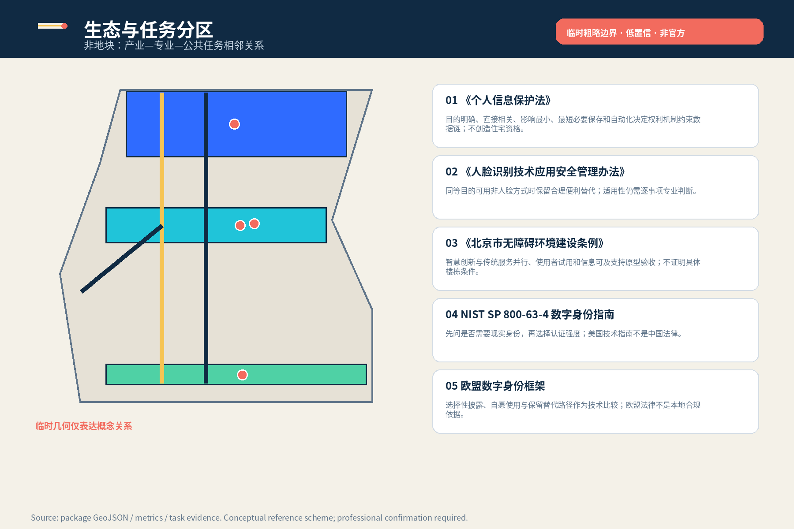
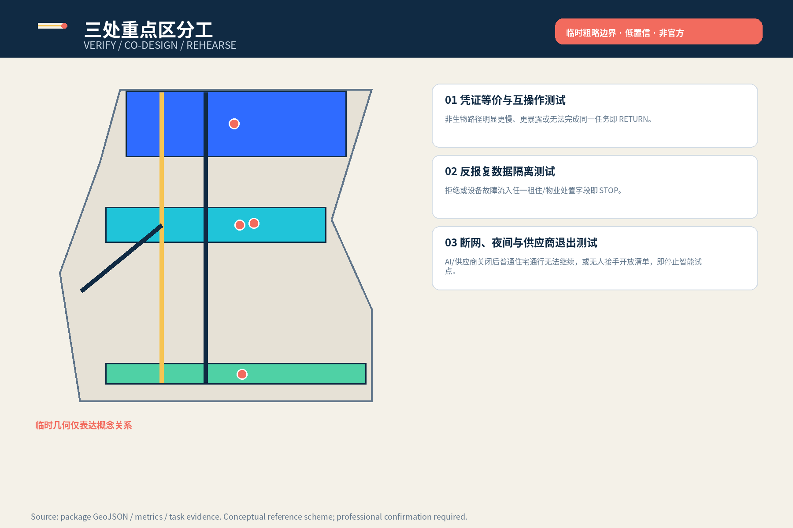
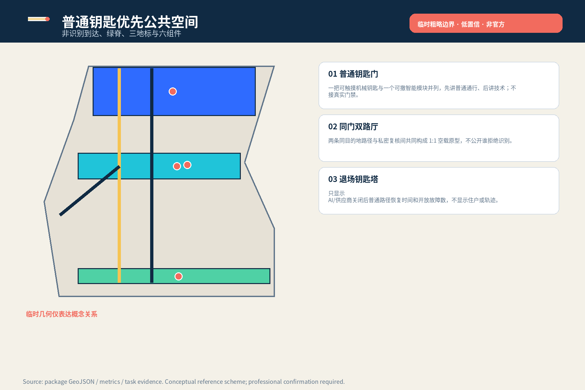
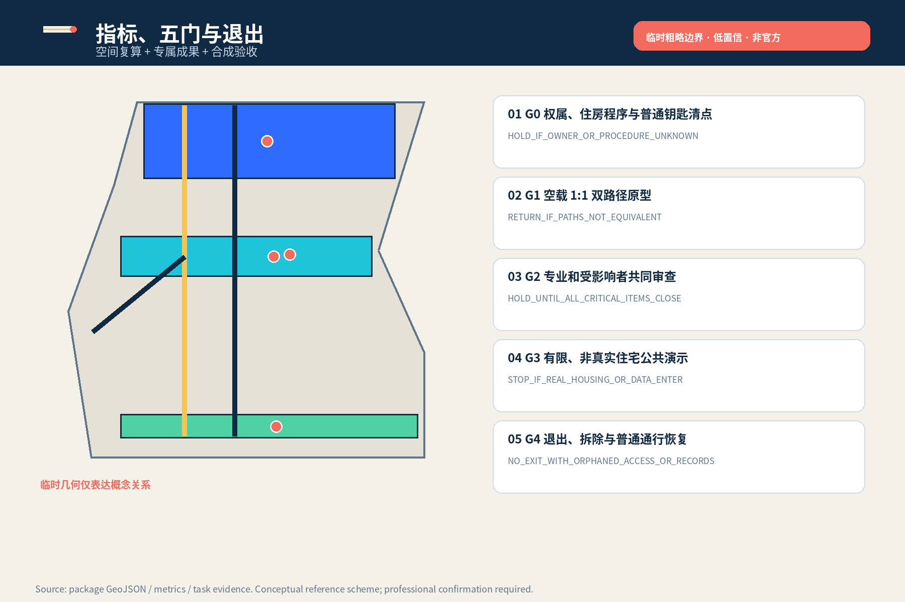

# 京张第二把钥匙

> 拒绝可选生物识别，也不失去同一扇回家门。普通钥匙先于智能钥匙；失败时撤技术层，不撤人的回家路。

**边界警示：全部空间为临时粗略边界、低置信、非官方的概念参考方案；不指认真实住宅、门洞、权属、住户、工程或政府承诺。**

## 设计依据与资料清单

方案依据官方公告、智能体任务书、仓库来源注册、专业标准本地快照和 provisional geometry。公告支持三层范围与约数，任务书支持六项专属成果；个人信息、人脸识别和无障碍官方文本约束最小化、替代路径与人工权利机制，但不创造住房资格、开门权或项目批准。NIST 与欧盟材料仅作背景比较。官方精确边界、控规、权属、真实住宅、消防安防和运营资料仍待补齐。 [source:OFFICIAL-ANNOUNCEMENT] [source:AGENT-TASKBOOK] [assumption:A-CONTROLS-001]

空间含义是先把非官方范围、设计叠加和待核控制分开，再判断门槛任务能否进入某个场所；指标含义是所有面积与比例只证明包内拓扑一致，不证明现状、法规或容量。每条正式主张都邻接来源或假设，海外比较不进入法定矩阵。

## 三层范围工作框架

43.6 平方公里统筹研究层研究产业与专业服务链；约 11.4 平方公里总体设计层研究普通通行、公共空间、慢行与可撤测试的关系；三处重点区分别承担互操作验证、共同设计与连续服务演练。三层不是同一地图的缩放，每层都分别记录来源、人工决定、失败结果和数据缺口。官方 polygon 到位后整体复算，缺失几何不由 AI 猜测填满。 [data:geometry/site_boundary.geojson#SITE-001] [metric:key_area_count] [depth:three_level_scope_framework]

## 统筹研究范围产业与未来城市研究

“第二把钥匙”是一组跨行业城市能力，不是一家门禁企业的产品。上游包括本地凭证、机械开启、无障碍部件、最小日志与可撤接口；中游包括住房/租赁权益、隐私档案、物业运营、消防安防和劳动容量复核；下游包括空载场景、去标识失败回执、采购退出条款与自愿采用评估。中关村翼输出清权规范，小月河翼只测试非识别到达和无障碍门槛；任何合作仍待有权主体决定。 [depth:ai_ecosystem_case_studies] [source:PRC-PIPL-2021]

未来城市价值不以采集更多人脸或轨迹衡量，而以技术关闭后基本任务能否继续衡量。行业成果必须同时包含接口、责任、人工权利、失败条件和退出证据；缺少任一项就只保留为研究材料。

## 总体设计范围城市更新与控规深度城市设计

总体结构是“一条普通钥匙优先线、三处住宅门槛任务场、两条专业支撑翼”。城市更新采用先保普通任务、再加可撤测试、永久建设最后的证据顺序。近期仅做资料清点、空载 1:1 原型与受影响者共审；中期只有在权属、住房程序、消防、安防、无障碍、隐私和运营责任明确后才讨论有限演示；真实住宅应用必须另立项、另清权、另验收。 [data:geometry/land_use.geojson#LU-001] [depth:overall_spatial_structure] [assumption:A-HOUSING-003]

## 重点区域详细设计

众智园 VERIFY 测试非生物凭证跨设备、断网与供应商退出；AI 原点社区 CO-DESIGN 共同设计同门双路厅、无摄像复核间和私密导视；大钟寺 REHEARSE 演练夜间、访客、包裹、维修与运营换手。共同验收不是识别准确率，而是普通路径是否独立完成、拒绝状态是否隔离、人工决定是否具名、失败后是否恢复。图面表达任务与关系，不表达真实建筑或住户。 [data:geometry/key_areas.geojson#PROV-KEY-001] [metric:synthetic_path_equivalence_target] [depth:three_key_area_detailed_design]

## AI 创新生态、人才画像与 AI+ 场景

Agent.1 交付品牌、三大定位、五大功能与三区两翼；Agent.2 交付五个案例透镜和三类产业测试；Agent.3 交付六类画像与十张场景卡；Agent.4 交付普通钥匙门、同门双路厅、退场钥匙塔及六项组件；Agent.5 把铁路冗余、人工值守与中关村开源文化转译为普通钥匙优先的双语导视；Agent.6 交付季度、半年、年度、持续四类运营与 G0—G4 退出门。每项在矩阵中映射不同章节、图件、指标和 JSON 对象。 [standard:PROJECT-AGENT-OPEN-CALL-TASKBOOK] [metric:scenario_card_count] [metric:persona_count]

### Agent.1｜总体概念、品牌与三区两翼

标志把深蓝普通路径置于蓝色可选智能层之前，金色横条表示可撤门槛，珊瑚点只表示具名人工复核。三大定位分别回应文化带、都市 AI 生活体验带和 AI 融合创新带；五大功能分别由本地凭证/机械断开、跨专业验证、场景卡、普通服务连续和去标识失败公开支撑。三区承担 VERIFY、CO-DESIGN、REHEARSE，两翼只提供规范与非识别到达体验。

### Agent.2｜五个案例透镜与住宅门槛创新生态

- **CASE-PIPL｜《个人信息保护法》**：目的明确、直接相关、影响最小、最短必要保存和自动化决定权利机制约束数据链；不创造住宅资格。
- **CASE-FACE｜《人脸识别技术应用安全管理办法》**：同等目的可用非人脸方式时保留合理便利替代；适用性仍需逐事项专业判断。
- **CASE-BJ-ACCESS｜《北京市无障碍环境建设条例》**：智慧创新与传统服务并行、使用者试用和信息可及支持原型验收；不证明具体楼栋条件。
- **CASE-NIST｜NIST SP 800-63-4 数字身份指南**：先问是否需要现实身份，再选择认证强度；美国技术指南不是中国法律。
- **CASE-EUDI｜欧盟数字身份框架**：选择性披露、自愿使用与保留替代路径作为技术比较；欧盟法律不是本地合规依据。

- **T-01｜凭证等价与互操作测试**：6 个合成人物在实体钥匙、非生物卡、临时码和可选智能路径之间完成同一门厅任务。 门禁运营责任人和消防安防专业者确认安全边界；独立住房/租赁权益复核人确认拒绝不影响住房程序。 非生物路径明显更慢、更暴露或无法完成同一任务即 RETURN。
- **T-02｜反报复数据隔离测试**：合成拒绝状态、门禁故障与租金、押金、续租、维修、包裹和基本物业字段并列。 隐私/档案专业者验证字段隔离；住房/租赁权益复核人检查任何不利处置必须脱离试点记录。 拒绝或设备故障流入任一租住/物业处置字段即 STOP。
- **T-03｜断网、夜间与供应商退出测试**：网络中断、手机丢失、卡片丢失、夜间回家、照护者临时到访与供应商停止服务。 值班人员启动机械开启和夜间呼叫；门禁运营责任人与数据责任人共同签署退出移交。 AI/供应商关闭后普通住宅通行无法继续，或无人接手开放清单，即停止智能试点。

### Agent.3｜六类画像与十张场景卡

- **P-01｜拒绝人脸识别的租住者**：同一住宅入口的等价凭证与反报复隔离
- **P-02｜无智能手机的老年居住者**：实体凭证、人工值守、易读说明与夜间呼叫
- **P-03｜面部识别困难或行动不便的居住者**：无差别可达路径、低位台、坐姿操作与不公开拒绝状态
- **P-04｜未成年人及照护者**：代理权限人工核验、临时凭证与不建立家庭关系画像
- **P-05｜共同居住关系有争议的双方**：临时安全通行、争议挂起和独立住房/租赁程序
- **P-06｜物业一线值班与维修人员**：排班上限、替班、明确权限、机械断开与不承担无限备用责任

- **S-01｜入住核验与拒绝识别分离**：人工核验席；有权住房/租赁程序确认关系；门禁运营责任人只发凭证；AI 不得判断居住关系；`HOLD`。
- **S-02｜实体钥匙日常回家**：普通非生物通道；居住者选择路径；AI 无角色；`PASS`。
- **S-03｜非生物卡/临时码通行**：等价凭证台；门禁运营责任人按同一规则签发；AI 只检查凭证格式；`RETURN`。
- **S-04｜卡片或手机丢失**：无摄像复核间；值班人员先安全接待，具名复核人后核权限；AI 提示缺项，不决定开门；`HOLD`。
- **S-05｜夜间回家与网络中断**：夜间呼叫与机械开启点；当班人员按应急程序决定；AI 关闭；`STOP`。
- **S-06｜照护者临时到访**：访客等待位；居住者或有权代理确认，不建立家庭画像；AI 只生成一次性凭证草稿；`RETURN`。
- **S-07｜共同居住关系争议**：争议挂起格；独立住房/租赁权益复核人处理；物业/供应商不得裁决；AI 不得推断谁在说谎；`HOLD`。
- **S-08｜维修、包裹与基本物业服务**：普通物业前台；事项责任人按原程序办理；AI 拒绝状态不可见；`STOP`。
- **S-09｜供应商退出**：物理断开与移交位；门禁运营责任人与数据责任人签收；AI 导出开放清单后停止；`STOP`。
- **S-10｜居住关系依法或依有效程序变化**：凭证更新席；有权人工按同一规则更新/撤销各类凭证；AI 不得宣布关系成立或终止；`HOLD`。

### Agent.4｜三处地标、荣誉架与六项公共组件

- **L-01｜普通钥匙门**：一把可触摸机械钥匙与一个可撤智能模块并列，先讲普通通行、后讲技术；不接真实门禁。
- **L-02｜同门双路厅**：两条同目的地路径与私密复核间共同构成 1:1 空载原型，不公开谁拒绝识别。
- **L-03｜退场钥匙塔**：只显示 AI/供应商关闭后普通路径恢复时间和开放故障数，不显示住户或轨迹。

六项组件：C-01 普通钥匙优先导视、C-02 可撤智能模块托架、C-03 机械断开箱、C-04 无摄像复核屏、C-05 夜间人工呼叫柱、C-06 等价路径计时牌。所有组件可移动、可拆、无真实门禁连接；荣誉架仅在贡献者自愿授权下展示自制规范、合成验证和版本事实。

### Agent.5｜文化叙事与国际传播

百年京张文化不被简化为装饰图像，而转译为铁路系统的备用钥匙、人工值守、故障恢复和交接纪律；中关村文化转译为开放接口、可复核版本、贡献署名与可撤采购；AI 新文化则以“技术可以离场、人的普通任务不能归零”为判断。中文与英文同级，国际传播只发布去标识协议、组件和失败类型，不声称政府、社区或专业机构支持本概念。

### Agent.6｜年度运营、开发者社区与五门退出机制

- **O-01｜每季度｜第二把钥匙合成压力测试日**：只用合成人物与空载门厅；普通服务不受影响；泄露、报复字段或生物识别升级即撤下测试
- **O-02｜每半年｜同门双路夜间走查**：路径完成、等待、暴露、人工接管、排班容量逐项记录；任何群体无等价路径或一线人员成为无限备用即 HOLD
- **O-03｜每年｜可撤住宅 AI 门槛公开论坛**：只发布协议、合成失败和组件；不发布住户/机构名单；不得写成政府已确定活动、招商或采购安排
- **O-04｜持续｜第二把钥匙组件与贡献荣誉架**：仅展示自制规范、组件和合成验证；逐资产权利记录；撤回署名后移除识别信息，保留去标识版本事实

- **G0｜权属、住房程序与普通钥匙清点**：现有钥匙、卡片、值守、应急开启、消防和有效程序清单；`HOLD_IF_OWNER_OR_PROCEDURE_UNKNOWN`。
- **G1｜空载 1:1 双路径原型**：6 画像 × 10 场景完成、等待、暴露和接管记录；`RETURN_IF_PATHS_NOT_EQUIVALENT`。
- **G2｜专业和受影响者共同审查**：逐项签署清单、排班容量、反报复隔离与退出演练；`HOLD_UNTIL_ALL_CRITICAL_ITEMS_CLOSE`。
- **G3｜有限、非真实住宅公共演示**：空载演示回执、无真实住户/租约/生物数据证明；`STOP_IF_REAL_HOUSING_OR_DATA_ENTER`。
- **G4｜退出、拆除与普通通行恢复**：模块拆除、日志处置依据、开放清单与普通钥匙恢复；`NO_EXIT_WITH_ORPHANED_ACCESS_OR_RECORDS`。

## 用地、建筑规模与拆改留方案

四个无缝分区只表达任务相邻：住宅与普通通行底线、京张公园与公共开放空间、门槛测试与专业服务、社区/物业支持。三座建筑基底是空载原型包络，不是现状或建设规模。容积率、高度、密度、退线、结构和消防分区保持待补资料。拆改留的方法是先核验现状和权属，优先非住宅空载场所与可移动构件；安全、隐私、无障碍或劳动条件不满足即不改、不建、不试。 [metric:building_footprint_area_sqm] [data:geometry/buildings.geojson#KEY-BLDG-001] [depth:retain_renovate_demolish]

面积复算把概念建筑基底与 provisional site 分离记录，避免把图形大小写成建设强度。专业团队补齐官方边界和现状建筑后，应重新投影、去重、检查覆盖/重叠，再决定每个构件是保留、移动、取消还是深化，而不是沿用本包坐标。

## 交通、轨道、市政与公共服务设施

道路图层是任务关系而非道路红线：普通钥匙优先到达线保证无手机、无生物识别也能抵达人工界面；可选智能接口线必须可撤且不得阻断前者；小月河支线只表达非识别慢行、夜间照明与无障碍体验。轨道、过街、停车、消防车道和疏散无工程条件，均待专业核验。市政优先物理断开、本地凭证、机械开启、夜间呼叫和最小日志；真实容量须用排班、峰值、替班和恢复对账验证。 [data:geometry/roads.geojson#KEY-ROAD-001] [depth:traffic_rail_slow_parking] [assumption:A-CAPACITY-003]

公共服务的关键设施是可找到、可理解、可人工接管的普通界面，而不是又一个智能终端。无手机老人、行动不便者、夜间回家者、照护者和争议双方必须能在不公开拒绝状态的情况下抵达同一目的地；如需增加人员，先验证排班与退出权。

## 蓝绿空间、公共空间与城市风貌

连续绿脊旁布置普通钥匙优先线，使技术退出后的固定导视、触感条、夜间照明和人工呼叫仍可工作；这不是河道蓝线、树木或景观工程。公共底板承载三处地标和六项可移动组件，地标不采集数据、不控制通行。风貌遵循普通、可读、可撤、不过度暴露：深蓝普通路径先于蓝色智能层，金色表示可撤门槛，珊瑚点只表示具名人工复核。 [data:geometry/green_space.geojson#GREEN-001] [data:geometry/public_space.geojson#SECOND-KEY-001] [metric:public_space_ratio]

## 更新项目清单、实施政策与分期计划

JZ-01 清点权属、住房程序和普通钥匙；JZ-02 建 1:1 双路原型；JZ-03 做合成数据隔离与供应商退出工具；JZ-04 仅在 G0—G2 关闭关键项后开展有限非住宅演示；JZ-05 开源自制规范、合成样例、版本和权利台账；JZ-06 可在任一阶段触发退出。责任主体均为角色建议，不确认政府、企业、物业、社区、资金或工期。退出必须拆除模块、按依据处置日志、移交开放清单并恢复普通钥匙。 [data:geometry/phasing.geojson#PHASE-001] [depth:renewal_project_list] [metric:implementation_gate_count]

## 指标体系、面积复算与合规矩阵

指标分三类：GeoJSON 在 EPSG:4548 下复算的空间一致性量；专属成果 JSON 的案例、测试、场景、画像、地标、组件和门禁计数；仅用于合成桌面测试的 100% 非生物路径完成目标。已知数值不外推真实居民需求、服务容量、合法性或工程性能。agent.1—agent.6 分别引用不同章节、图件、空间对象、指标、来源、假设和专属成果；完整审计留在结构化文件而非正文堆 ID。 [metric:site_area_sqm] [depth:metrics_recalculation] [metric:industry_test_count]

## 风险、版权与合规说明

主要风险是临时几何被误读为正式红线、住房关系被 AI/物业/供应商裁决、拒绝状态流入租金押金续租维修等处置、一线人员成为无限备用、供应商退出留下孤儿门禁或记录。对应控制是全包 provisional 警示、有权人工程序、反报复字段隔离、排班上限与替班、机械断开和开放清单。逐资产权利台账覆盖原创文本、结构化设计、图件、HTML/PDF、Noto CJK 字体、官方短引和同侪差异检索；不含真实个人、租约、生物样本、门禁轨迹、远程素材或未清权品牌。 [source:CAC-FACE-2025] [assumption:A-LABOUR-005] [depth:risk_missing_data]

## 参考资料

完整来源、发布者、URL/本地路径、核验日期、用途与局限保存在 sources.json；空间、指标、标准、设计深度、任务覆盖和数据缺口分别保存在 GeoJSON、metrics.json 与三个矩阵及 assumptions.json。来源数量不等于可实施性。下一步必须先取得官方/清权资料和受影响者证据，再复算、共创、专业复核并逐项决定保留、修改或退出。 [source:SOURCE-REGISTRY] [source:SYNTHETIC-SECOND-KEY] [assumption:A-DATA-004]

本章节不是书目堆叠，而是资料使用边界：正式来源支撑项目任务与风险约束，provisional 来源只支撑生成和讨论，合成数据只支撑流程复核，自制图件只支撑解释。任何资料升级用途都需重新登记发布者、日期、许可、空间/时间覆盖、转换方法与局限。
