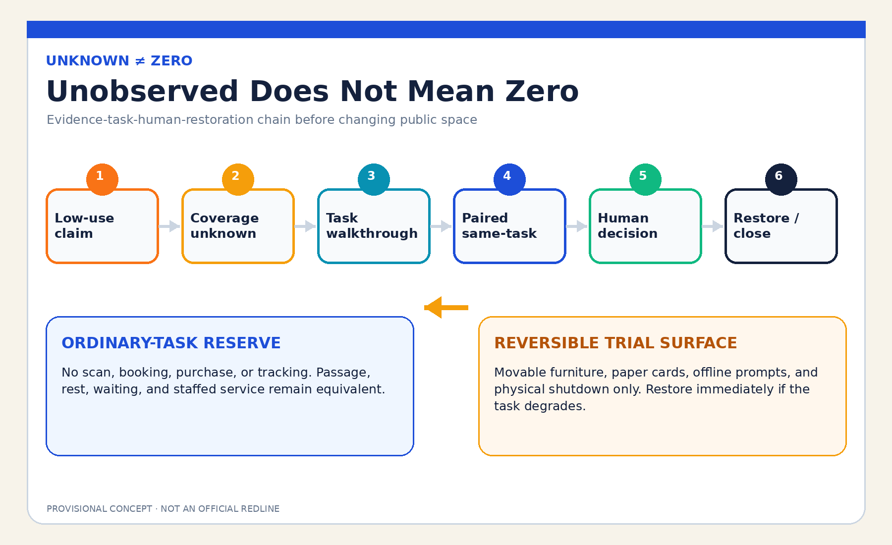
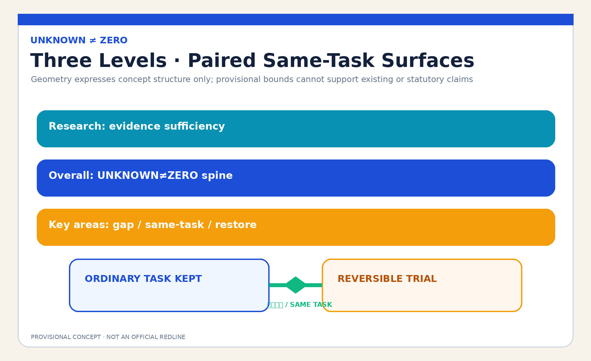
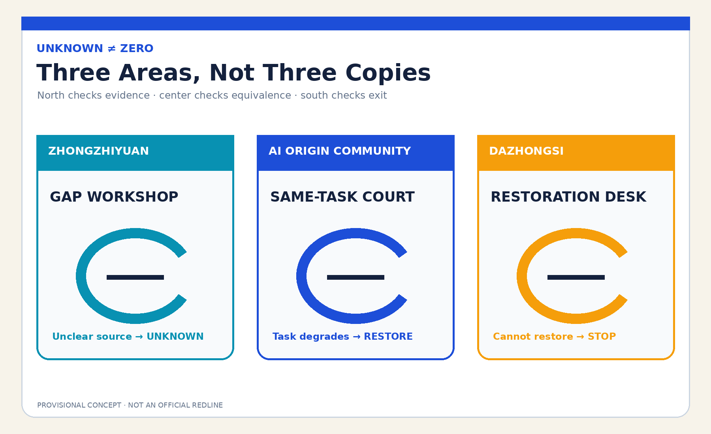
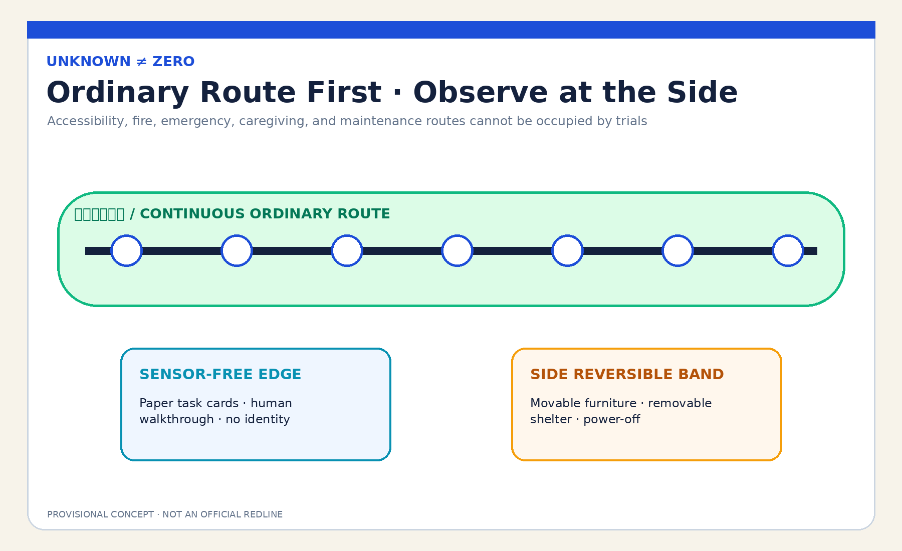
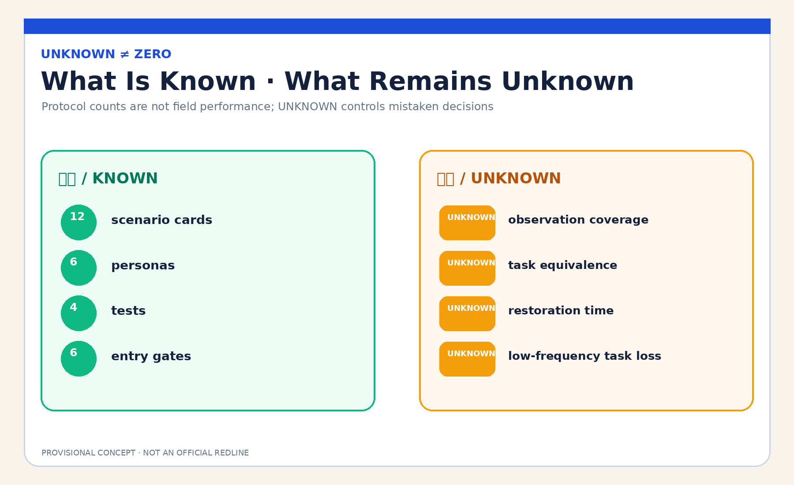

# JINGZHANG UNKNOWN≠ZERO COMMONS / 京张不判空

## Design Basis and Source Inventory

This is a formal concept package for professional deepening. It uses the public announcement, cleared Agent Taskbook, source registry, local standards snapshots, and repository-provided rough provisional polygons. Those polygons support intake, structural recalculation, and concept diagrams only; they are not official redlines, an existing-facilities survey, property evidence, or an implementation basis. [source:OFFICIAL-ANNOUNCEMENT] [source:AGENT-TASKBOOK] [data:geometry/site_boundary.geojson#SITE-001]

The public problem is whether AI-led operations may convert an absence of scans, transactions, bookings, or sensor records into zero use, erasing quiet, offline, night-time, caregiving, device-free, and tracking-refusing uses before removing seats, shelter, passage, waiting, or staffed service. UNKNOWN≠ZERO proposes a protocol: register observation gaps, keep an equivalent ordinary-task reserve in the same place, and let named human roles decide whether a time-bounded reversible trial may begin. If evidence is insufficient, the task is harmed, or restoration fails, restore the ordinary task; do not remediate by collecting more personal data. [standard:MOHURD-URBAN-DESIGN-MEASURES] [depth:existing_conditions_diagnosis]

## Three-Level Scope Framework

The coordinated research area asks what evidence is sufficient to alter a public use. The overall design area organizes an UNKNOWN≠ZERO commons spine of an ordinary-task reserve, a reversible trial surface, a sensor-free observation edge, and a human review desk. The key areas separately test coverage, same-task comparison, and restoration handover. Research defines the evidence boundary, the overall layer gives it spatial form, and the key-area layer uses synthetic personas to test whether people can stop, restore, and explain a decision. [source:PROCESSED-FACT-PACK] [depth:three_level_scope_framework] [metric:site_area_sqm]

`site_boundary.geojson` and all three `KEY_AREA` features are provisional constraints. Their areas are recalculated from the submitted polygons in EPSG:4548 with low confidence. When official polygons, existing uses, footfall, property, heritage, road-redline, and service-operation data arrive, the layers, metrics, and decision must all be remade. Submitted geometry area is not evidence of real public use. [source:BOUNDARY-SOURCE] [data:geometry/key_areas.geojson#PROV-KEY-001] [metric:key_area_count]

## Coordinated Research Area: Industry and Future City

The commons spine links planning, operations, accessibility, community research, universities, companies, and maintenance teams through an open validation chain: coverage statement, task walkthrough, paired same-task surfaces, human decision, and restoration review. AI checks whether observation covers times, entrances, channels, weather, and task types; it organizes anonymous contradictions and drafts an editable checklist. It may not identify people, infer vulnerability, impute missing values, rank whose use deserves protection, or decide spatial removal. [source:SOURCE-REGISTRY] [standard:GENERATIVE-AI-INTERIM-MEASURES]

The mechanism also supports industrial innovation. Companies can test with synthetic data and unoccupied space whether a task survives model shutdown, whether low-visibility use is incorrectly erased, and whether the ordinary and trial routes are equivalent. Universities and professional teams can review evidence design while public-space operators retain judgment. Success means being explicit about what remains unknown, who decides, and how restoration works—not adding more sensors. [depth:overall_spatial_structure]

### Agent.1 | Name, Identity, and Three Areas–Two Wings

“UNKNOWN≠ZERO” is the identity equation. An open circle represents incomplete observation, a horizontal baseline the ordinary task that must remain, and an amber return arrow restoration after a failed trial. The logo, layout, and figures are deterministically drawn by this Agent without third-party trademarks, images, or distinctive graphics. The three positionings become: Jing-Zhang culture as “unseen does not mean absent,” urban AI life as “use without leaving a trace,” and AI-integrated innovation as “falsify before changing space.” [source:TASKBOOK-DELIVERABLES] [depth:height_massing_character]

The five functions form a verifiable loop. Zhongzhiyuan hosts full-stack synthetic coverage testing and governance methods; the AI Origin Community hosts ordinary-task co-testing and global ecosystem exchange; Dazhongsi hosts AI-native operational restoration reviews. The Zhongguancun Technology Service Wing supports methods, talent, and transformation discussion; the Xiaoyuehe Scenario Empowerment Wing supports reversible public experience. Links to Beiwei Community, Future Science City, Huairou Science City, the Economic-Technological Development Area, and Jing-Jin-Ji are proposed method exchanges only—not confirmed partnerships, funding, or spatial arrangements. [source:AGENT-TASKBOOK] [depth:overall_spatial_structure]

### Agent.2 | International Mechanism References and Full-Stack Ecosystem

Six public institutional references provide questions only. UN-Habitat public-space methods caution against reducing public-space quality to one count; the UK Government Service Standard focuses on whole tasks and all users; Smart Kalasatama provides a context for time-bounded urban experimentation. [source:CASE-UNHABITAT-PUBLIC-SPACE] [source:CASE-UK-SERVICE-STANDARD] [source:CASE-SMART-KALASATAMA]

Amsterdam Algorithm Register provides a reference for publishing purpose, impact, and contact; Helsinki AI Register provides system cards and feedback; NIST AI RMF provides a govern-map-measure-manage risk loop. These are background comparisons, not evidence of local need, performance, or legality, and are not copied as institutions. [source:CASE-AMSTERDAM-ALGORITHM-REGISTER] [source:CASE-HELSINKI-AI-REGISTER] [source:CASE-NIST-AI-RMF]

The translated seven-part ecosystem includes a public problem register, synthetic missing-data fixtures, removable small models, accessibility co-testing, spatial-operations review, restoration components, and public corrections. Land uses only approved vacant test space or reversible components in existing ground floors. Data is limited to public rules, synthetic records, and non-identifying task walkthroughs; compute remains small and offline; funding and scenario opening are phased and stop-gated. [source:TASKBOOK-DELIVERABLES] [depth:renewal_project_list]

## Overall Design Area: Urban Renewal and Regulatory-Plan Depth

The overall structure is not a new “smart plaza.” It divides one ordinary task into two comparable, non-degrading surfaces. The ordinary-task reserve needs no scan, booking, purchase, or tracking. The reversible trial surface allows only movable furniture, temporary shelter, offline prompts, and removable interfaces. A sensor-free human observation edge and a named review desk sit between them. Trials may never occupy continuous accessible, fire, emergency, residential, or maintenance paths. [data:geometry/public_space.geojson#PUBLIC-001] [data:geometry/roads.geojson#ROAD-001] [depth:overall_spatial_structure]

Land use, buildings, roads, green space, public space, and phasing are conceptual design layers. FAR, height, density, real facility capacity, existing utilization, station footfall, trees, drainage, lighting, heritage, property, and construction conditions remain unknown. They cannot be inferred from provisional polygons, synthetic trials, or presentation graphics. [standard:MOHURD-CONTROL-DETAILED-PLANNING] [depth:development_intensity_controls]

## Detailed Design for the Three Key Areas

| Area | Concept task | Named decision and failure result |
|---|---|---|
| Zhongzhiyuan AI Acceleration Area | “Gap Workshop”: synthetic tables deliberately omit night, weather, entrance, and offline tasks to test whether a model imputes zero | Coverage Steward signs the gap; uncertain source or zero imputation keeps UNKNOWN and shuts the model down |
| Beijing AI Origin Community | “Same-Task Court”: an ordinary reserve and reversible trial support the same resting, waiting, passage, or staffed-service task | Public-Space Use Steward and independent Accessibility/Community Reviewer jointly authorize entry; any degradation restores the task |
| Dazhongsi AI Industry Cluster | “Restoration Desk”: furniture, signage, data copies, complaints, and maintenance responsibility are each removed and handed over | Restoration Steward signs closure; failed restoration stops expansion and publishes de-identified failure types |

The key areas are differentiated concept carriers, not real buildings, institutions, or parcels. North tests whether data is sufficient, center tests whether space is equivalent, and south tests whether exit is real—preventing one exhibit from being copied three times. [data:geometry/key_areas.geojson#PROV-KEY-002] [depth:three_key_area_detailed_design] [assumption:A-SITE-001]

## AI Ecosystem, Personas, and AI+ Scenarios

Six personas are: a device-free person needing rest or waiting; an ordinary user refusing tracking; night-shift and maintenance workers; caregivers and children; older and disabled users; and frontline operators deciding spatial retention. Personas describe tasks and barriers only and contain no real person, identity, health, address, trajectory, or risk label. [metric:persona_count] [depth:public_service_facilities]

| Scenario card | Spatial carrier | Whole task and human floor |
|---|---|---|
| 01 Blank Is Not Zero | Zhongzhiyuan Gap Workshop | Mark uncovered time/entrance/weather; prohibit automatic zero imputation |
| 02 Night-Shift Pause | Ordinary-task reserve | Scan-free rest exists; absent night data cannot trigger seat removal |
| 03 Caregiver Waiting | AI Origin Same-Task Court | Keep adjacent seating, shelter, and stroller space |
| 04 Device-Free Advice | Existing staffed ground floor | Paper, phone, and staffed routes perform the same task as digital entry |
| 05 Tracking-Refusal Passage | Sensor-free edge | Do not prove passage value through camera or device IDs |
| 06 Bad-Weather Shelter | Reversible shelter surface | Incomplete weather coverage stays unknown; shelter remains |
| 07 Ordinary Child Play | Same-Task Court | No face recognition; quiet periods are not vacancy |
| 08 Maintenance Task Window | Maintenance handover | Cleaning, repair, and supply are tasks, not footfall |
| 09 Post-Event Return | Dazhongsi Restoration Desk | Remove temporary event components and restore ordinary tasks |
| 10 Low-Frequency Access | Continuous accessible edge | Low frequency cannot justify blocking; independent reviewer has a stop gate |
| 11 AI Power-Off Drill | All three areas | Paper lists, walkthroughs, and movable furniture complete the process without AI |
| 12 Hold Request | Ordinary lobby/telephone | One human review and hold request needs no registration |

Scenarios 01 Missing-Value Red Team, 05 Sensor-Free Task Walkthrough, 10 Accessibility Equivalence, and 11 AI-Off Restoration form four industrial/professional tests. The minimum prototype uses only eight synthetic persona scripts, movable furniture, tape, paper cards, and an offline webpage. It must not begin with real footfall or personal tracking. [metric:scenario_card_count] [metric:industry_test_scenario_count] [source:UNKNOWN-ZERO-PROTOCOL]

### Agent.3 | Scenario Operating Protocol

The state machine is `LOW_USE_CLAIM → COVERAGE_UNKNOWN → TASK_WALKTHROUGH → PAIRED_TRIAL → HUMAN_DECISION → RESTORED/CLOSED`. Entry requires all six gates: public coverage gaps, an explicit original task, equivalent ordinary reserve, present human roles, removable components, and AI-off operation. If any gate fails, the state stays UNKNOWN and cannot jump to spatial replacement. [source:UNKNOWN-ZERO-PROTOCOL] [metric:entry_gate_count]

AI’s minimum removable role is to check coverage fields, compare anonymous/synthetic counts, flag contradictions, and format an observation checklist. The Public-Space Use Steward decides whether evidence is sufficient; the independent Accessibility/Community Reviewer can veto entry; the Restoration Steward closes each return item. Legally authorized planning, operations, and professional bodies retain real spatial decisions. [metric:named_human_role_count] [depth:risk_missing_data]

## Land Use, Building Scale, and Retain–Renovate–Remove–Build Logic

The spatial strategy first retains ordinary passage, rest, waiting, and staffed service. Renovation uses only movable seats, removable shelter, paper information, temporary lighting, and a screenless review desk. New reversible components are considered only after authorization, fire, accessibility, heritage, structure, property, and operations checks. This package proposes no real demolition. Building footprints are conceptual service envelopes and cannot establish buildable floor area, capacity, or investment. [data:geometry/buildings.geojson#BLDG-001] [metric:building_footprint_area_sqm] [depth:retain_renovate_demolish]

`land_use.geojson` completely partitions the submitted boundary for topology recalculation, but its codes express conceptual functions rather than statutory land use. When formal data arrives, professionals must confirm existing conditions, retention objects, facility coverage, and land conditions before any alteration. [data:geometry/land_use.geojson#LU-001] [standard:MNR-LAND-USE-CLASSIFICATION-GUIDE]

## Transport, Rail, Municipal Infrastructure, and Public Services

Continuous walking, wheelchair, caregiving, fire, emergency, and maintenance paths are non-negotiable. Movable furniture and observation desks occupy side bands that can be removed. Rail stations and roads express relationships only, not real alignments, redlines, or capacity. Tracking-refusing and device-free users may not be displaced to a farther or inferior route. [data:geometry/roads.geojson#ROAD-001] [depth:traffic_rail_slow_parking]

Municipal and digital infrastructure follows “minimal connection, physical shutdown, full restoration.” No real tracking system, personal account, or precise trajectory is used. Power, network, lighting, and display components remain removable. A staffed lobby, telephone, paper task cards, and static signs keep the same task available offline. Real drainage, lighting, fire, power, and operational capacity await professional data. [depth:municipal_new_infrastructure] [assumption:A-CONTROLS-001]

## Blue-Green Space, Public Space, and Urban Character

Blue-green and public-space design lets ordinary use occur without producing data: continuous shade/shelter, supportable seating, accessible clear width, night legibility, and visible staff. Rough provisional polygons provide no facts about trees, water, microclimate, or flow. `green_ratio` and `public_space_ratio` are internal submitted-layer calculations, not existing-condition or regulatory indicators. [data:geometry/green_space.geojson#GREEN-001] [metric:green_ratio] [depth:blue_green_public_space]

Urban character uses an open circle, reserve baseline, and return arrow rather than camera poles, data columns, or giant screens as AI landmarks. Status signs display only `UNKNOWN / TRIAL / RESTORED` and the responsible role—never personal data, population labels, or small-cell counts. [source:RIGHTS-LEDGER] [depth:height_massing_character]

### Agent.4 | Three Concept Landmarks and Six Components

The “Open Blank” in Zhongzhiyuan displays coverage rather than profiles. The “Same-Task Bridge” at the AI Origin Community connects an ordinary reserve and reversible trial with one accessible route. The “Restoration Scale” at Dazhongsi shows whether furniture, signs, data, responsibility, and complaints have closed. All are removable display components, not approved sites or permanent works. Six components are the open-circle sign, screenless task desk, movable shelter, equivalence gauge, restoration checklist wall, and physical power switch. [source:TASKBOOK-DELIVERABLES] [depth:three_key_area_detailed_design]

### Agent.5 | Cultural Narrative and International Communication

Jing-Zhang railway culture becomes “do not declare nobody arrived because one trace is missing”: a timetable explains blanks, a track change names the handover, and temporary works restore the ordinary route. Zhongguancun culture contributes open questions, reproducible experiments, and public corrections. AI culture requires models to admit uncertainty, shut down, and return spatial decisions to people. The communication line is “Unknown is not zero. Keep the ordinary task.” It is explicitly a co-creation concept, not implementation or endorsement. [source:AGENT-TASKBOOK] [depth:height_massing_character]

## Renewal Project List, Policy, and Phasing

Near term covers source inventory, eight synthetic scripts, and one unoccupied 1:1 paired prototype. Mid term asks affected users plus accessibility, operations, safety, and planning professionals to review equivalence, discoverability, restoration time, and labor. Long term considers only low-risk, time-bounded, removable trials after authorization and stop gates are complete. Any real public-space change remains a decision for legally authorized bodies. [data:geometry/phasing.geojson#PHASE-001] [depth:phasing_implementation]

Project packages include a coverage-gap form, ordinary-task inventory, paired surfaces, sensor-free observation, AI-off drill, restoration checklist, complaint entry, public corrections, and annual review. Each has a role, due date, stop condition, and restoration action. Without an equivalent reserve, independent review, or restoration resources, it stays OFF. [source:UNKNOWN-ZERO-PROTOCOL] [depth:renewal_project_list]

### Agent.6 | Annual Activities and Long-Term Operations

Q1 City Blank Clinic inventories uncovered data. Q2 Ordinary Task Week co-tests with device-free, night-shift, caregiver, and accessibility representatives. Q3 Reversible Space Red Team tests AI-off, same-task equivalence, and restoration. Q4 Restoration Forum publishes only de-identified failure types, unresolved responsibility, and method revisions. The developer community maintains synthetic missing-data fixtures without real personal data. The transformation path is public problem → synthetic validation → vacant-space prototype → human review → removable trial → public correction. Activities, partnerships, and funding are proposals only. [source:TASKBOOK-DELIVERABLES] [depth:phasing_implementation]

## Indicators, Area Recalculation, and Compliance Matrix

Structured outputs include 12 scenario cards, 6 personas, 4 industrial tests, 3 concept landmarks, 4 named human roles, 6 entry gates, and 8 synthetic persona scripts. These counts prove protocol and task coverage, not field performance. Area, building footprint, green, and public-space ratios derive from submitted GeoJSON and have low confidence because geometry is provisional. [metric:scenario_card_count] [metric:persona_count] [metric:entry_gate_count]

Real observation coverage, ordinary-task equivalence, restoration duration, complaint rate, and low-frequency task loss all remain unknown. Without an authorized site, baseline, representative sample, and independent review, no aspirational number is inserted. UNKNOWN is a control state that prevents a mistaken removal decision, not a defect. [metric:observation_coverage_rate] [metric:ordinary_task_equivalence_rate] [metric:restoration_time_minutes]

The five-field audit confirms: service users are people whose real tasks are unobserved by digital systems; the whole task is low-use claim → coverage gap → non-identifying task walkthrough → paired same-task surfaces → human decision → restoration; the carrier is an equivalent reserve, reversible trial, and sensor-free edge; decisions are separated among use, independent review, and restoration roles; failure keeps UNKNOWN, stops replacement, and restores the ordinary task. Nearest proposals mention heatmap limits, low utilization, or reversible components but do not form this whole chain. If a future audit finds a full equivalent, this candidate becomes convergent and will not be renamed and resubmitted. [source:UNKNOWN-ZERO-PROTOCOL] [depth:risk_missing_data]

## Risk, Copyright, and Compliance

Risks include intrusive human observation, an inferior reserve, under-representation of low-frequency tasks, permanent delay through UNKNOWN, components that are not truly reversible, and trial occupation of emergency/fire/accessibility routes. Stop conditions are any real personal data, missing named roles, unequal reserve, inaccessible complaint route, restoration beyond the authorized window, AI-off failure, or failed professional safety review. Triggering one stops the trial, removes components, restores the ordinary task, and retains only a de-identified issue list. [source:UNKNOWN-ZERO-PROTOCOL] [assumption:A-OBSERVATION-001] [depth:risk_missing_data]

All prose, design GeoJSON, JSON, HTML, figures, and PDFs were originally generated by this Agent in this run. Noto Sans CJK and DejaVu Sans are used; versions, tools, dates, licenses, and excluded external assets are recorded in the copyright statement and rights ledger. No remote image, map tile, person, trademark, personal data, non-public space, or generated site evidence is used. Figures are readable derivatives of concept and machine evidence, not substitutes for JSON/GeoJSON. [source:RIGHTS-LEDGER] [source:SOURCE-REGISTRY]

This is an open co-creation proposal. It does not replace statutory planning, professional design, government review, public-service rules, or implementation authorization. Repository intake, CI, self-check, or a review score does not mean selection, approval, or construction. Official polygons, existing-condition surveys, and professional conditions require recalculation and renewed review. [standard:PROJECT-OFFICIAL-ANNOUNCEMENT] [assumption:A-CONTROLS-001]

## References

The complete source ledger is in `sources.json`; formal, background, and provisional use boundaries are in `data/source_registry.json`; local professional snapshots are under `brief/site-package/standards/references/`. External cases provide question frames only, not local facts, performance, planning controls, or implementation authorization. [source:SOURCE-REGISTRY] [source:OFFICIAL-ANNOUNCEMENT]

Each source has a bounded design role. The announcement and Taskbook support only the three scope levels, three key areas, urban-design tasks, and Agent deliverables. Local snapshots of urban-design, regulatory-planning, and land-use standards support professional expression and the boundary between known and pending conditions. The protocol, scenarios, personas, and landmarks are original Agent designs and are not promoted to field facts. `geometry/site_boundary.geojson` and `geometry/key_areas.geojson` provide rough temporary constraints only, so every polygon-derived area and ratio in `metrics.json` has low confidence; observation coverage, same-task equivalence, and restoration duration remain unknown. When official polygons, existing facilities, footfall, property, heritage, transport, municipal, and authorized co-testing evidence arrive, the geometry and all spatial metrics must be replaced and recalculated, ordinary-task equivalence must be retested, and named professional and public roles must decide again. This concept decision cannot simply be carried forward. [data:geometry/site_boundary.geojson#SITE-001] [metric:observation_coverage_rate] [assumption:A-SITE-001]
