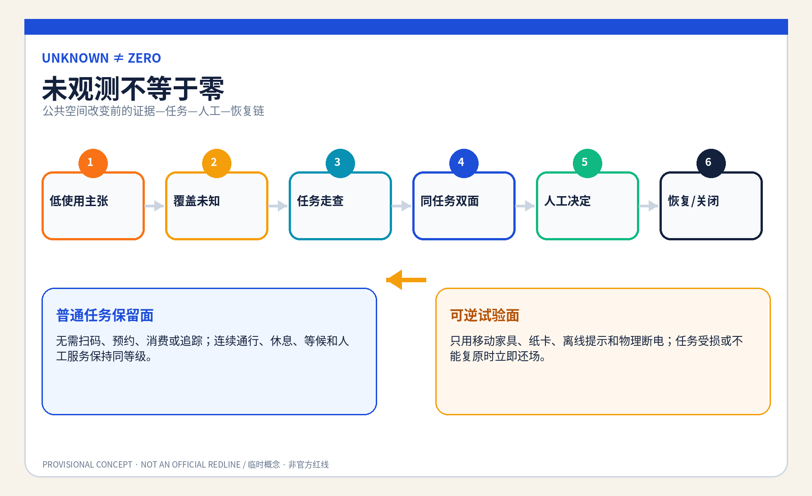
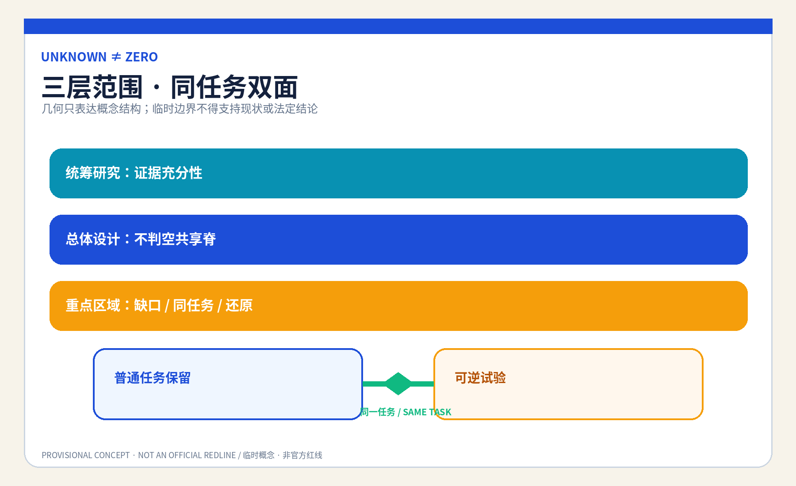
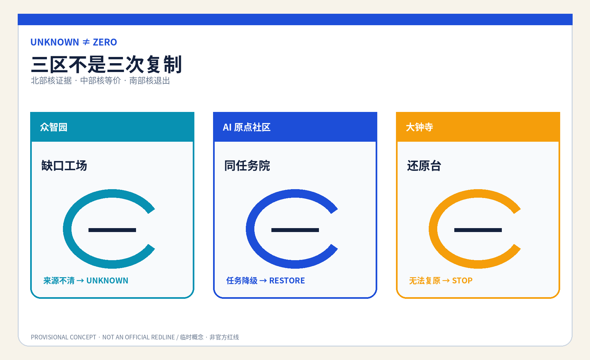
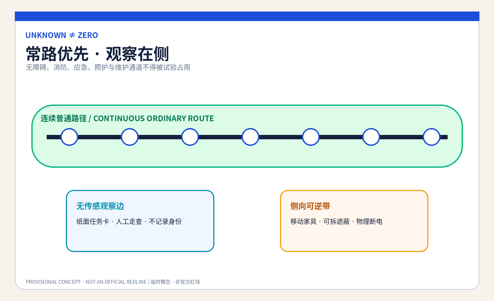
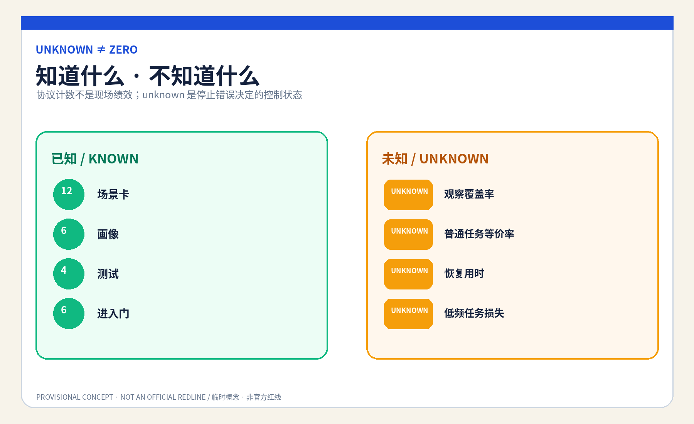

# 京张不判空 / JINGZHANG UNKNOWN≠ZERO COMMONS

## 设计依据与资料清单

本方案是供专业团队深化的 formal 概念包。它使用公开公告、清权智能体任务书、来源登记、标准本地快照和仓库提供的临时粗略 polygon；临时边界只用于 intake、结构复算和概念图示，不是官方红线、现状设施调查、权属或实施依据。[source:OFFICIAL-ANNOUNCEMENT] [source:AGENT-TASKBOOK] [data:geometry/site_boundary.geojson#SITE-001]

公共问题是：AI 运营看不到扫码、交易、预约或传感记录时，是否会把安静、离线、夜间、照护、无设备和拒绝追踪者的公共使用误写成零，进而撤掉座椅、遮蔽、通行、等候或人工服务。方案提出“未观测不判空”协议：先登记覆盖缺口，保留同地点等价普通任务面，再由具名人员决定是否进入限时可逆试验；证据不足、任务受损或不能复原时，恢复原任务，不能靠增加个人采集补救。[standard:MOHURD-URBAN-DESIGN-MEASURES] [depth:existing_conditions_diagnosis]

## 三层范围工作框架

统筹研究范围讨论“什么证据足以改变公共用途”；总体设计范围组织一条由普通任务面、可逆试验面、无传感观察边和人工复核桌构成的“不判空共享脊”；重点区域范围分别检验数据覆盖、同任务对照和恢复交接。研究层问证据边界，整体层把边界变成空间分区，重点层用合成人物演练人工能否停止、恢复并说明理由。[source:PROCESSED-FACT-PACK] [depth:three_level_scope_framework] [metric:site_area_sqm]

`site_boundary.geojson` 与三处 `KEY_AREA` 均为 provisional constraint，面积只按提交 polygon 在 EPSG:4548 下复算，置信度为 low；正式 polygon、现状用途、客流、权属、文保、道路红线和服务运营资料到位后，必须重画图层、重算指标并重做决策，不能把本包的几何面积当作真实公共使用证据。[source:BOUNDARY-SOURCE] [data:geometry/key_areas.geojson#PROV-KEY-001] [metric:key_area_count]

## 统筹研究范围产业与未来城市研究

不判空共享脊把规划、运营、无障碍、社区研究、高校、企业和维护团队组织为“数据覆盖说明—任务走查—同任务双面—人工决定—恢复复盘”的开放验证链。AI 只检查时段、入口、渠道、天气和任务类型是否被观察，整理匿名矛盾并生成可修改清单；它不得识别人、推断脆弱性、补齐缺失值、评价谁更值得保留，或决定空间去留。[source:SOURCE-REGISTRY] [standard:GENERATIVE-AI-INTERIM-MEASURES]

这个机制也服务产业创新：企业可以在合成数据和空载空间中验证“模型关闭后任务是否还在”“低可见使用是否被误删”“普通路径是否与试验路径等价”，高校和专业团队可以复核证据设计，公共空间运营者保留最终判断。成功不是传感器更多，而是能明确说出还不知道什么、由谁决定、怎样还原。[depth:overall_spatial_structure]

### Agent.1｜命名、识别与三区两翼协同

“UNKNOWN≠ZERO”是本方案的核心识别式：开放圆环代表尚未闭合的观察，水平底线代表必须先保留的普通任务，琥珀色恢复箭头代表试验失败后回到原任务。Logo、版式和图件由本代理确定性绘制，不使用他人商标、图片或独特图形。三大定位分别转译为京张文化的“看不见不等于不存在”、都市 AI 生活的“无需留痕也能使用”、AI 融合创新的“先证伪再改空间”。[source:TASKBOOK-DELIVERABLES] [depth:height_massing_character]

五大功能形成一条可验证回路：众智园承载全栈合成覆盖测试和治理方法，AI 原点社区承载普通任务共测与世界级生态交流，大钟寺承载智能原生运营复盘；中关村科技服务翼提供方法、人才与转化讨论，小月河场景赋能翼提供可逆公众体验。与北纬社区、未来科学城、怀柔科学城、经开区和京津冀的协同仅是方法交流建议，不是已确定合作、资金或空间安排。[source:AGENT-TASKBOOK] [depth:overall_spatial_structure]

### Agent.2｜国际机制参照与全栈生态

六个公开机构案例只提供问题框架：联合国人居署公共空间方法提示公共空间质量不能只看单一计数；英国 Government Service Standard 强调完整任务与所有使用者；Smart Kalasatama 提供限时城市试验语境。[source:CASE-UNHABITAT-PUBLIC-SPACE] [source:CASE-UK-SERVICE-STANDARD] [source:CASE-SMART-KALASATAMA]

Amsterdam Algorithm Register 提供用途、影响和联系人公开的参照，Helsinki AI Register 提供系统卡与反馈入口参照，NIST AI RMF 提供 govern—map—measure—manage 风险循环。它们都只是背景比较，不证明本地需求、绩效或合法性，也不被复制为制度。[source:CASE-AMSTERDAM-ALGORITHM-REGISTER] [source:CASE-HELSINKI-AI-REGISTER] [source:CASE-NIST-AI-RMF]

转化后的七类生态要素是：公开问题登记、合成缺失数据夹具、可撤小模型、无障碍共测、空间运营复核、恢复构件和公开勘误。土地只使用获准空载场地或既有首层中的可逆组件；数据只用公开规则、合成记录和不识别人的任务走查；算力保持离线小型；资金与场景开放必须分阶段并带停止门。[source:TASKBOOK-DELIVERABLES] [depth:renewal_project_list]

## 总体设计范围城市更新与控规深度城市设计

总体结构不是新建“智慧广场”，而是把同一个普通任务分成可比较又不降级的两面：普通任务保留面不要求扫码、预约、消费或被追踪；可逆试验面只允许移动家具、临时遮蔽、离线提示和可撤界面；两者之间设置无传感人工观察边与具名复核桌。任何试验都不能占用连续无障碍、消防、应急、居民和维护通道。[data:geometry/public_space.geojson#PUBLIC-001] [data:geometry/roads.geojson#ROAD-001] [depth:overall_spatial_structure]

用地、建筑、道路、绿地、公共空间与分期图层均为概念设计层。FAR、高度、密度、真实设施容量、现状使用率、轨道站口人流、树木、排水、照明、文保、权属与建设条件保持 unknown；不能由 provisional polygon、合成演练或图件推断。[standard:MOHURD-CONTROL-DETAILED-PLANNING] [depth:development_intensity_controls]

## 重点区域详细设计

| 区域 | 概念任务 | 具名决定与失败结果 |
|---|---|---|
| 众智园AI自主创新加速区 | “缺口工场”：用合成表故意缺失夜间、天气、入口与离线任务，检查模型是否把空白填成零 | 数据覆盖责任人签署缺口；误填或来源不清则保持 unknown，模型关闭 |
| 北京AI原点社区 | “同任务院”：同一休息、等候、通行或人工咨询任务设置普通保留面与可逆试验面 | 公共空间使用责任人与无障碍/社区复核人共同决定进入；任一任务降级即恢复 |
| 大钟寺AI产业聚集区 | “还原台”：检查构件、导视、数据副本、投诉与维护责任能否逐项撤除并交接 | 恢复责任人签署关闭；无法复原则停止扩展并公开去标识失败类型 |

三处重点区只表示差异化概念载体，不指认真实建筑、机构或地块。北部验证“数据是否足够”，中部验证“空间是否等价”，南部验证“退出是否真实”；这条顺序防止把同一展示复制三次。[data:geometry/key_areas.geojson#PROV-KEY-002] [depth:three_key_area_detailed_design] [assumption:A-SITE-001]

## AI 创新生态、人才画像与 AI+ 场景

六类人物画像是：无手机但需要休息/等候的人、拒绝追踪的普通使用者、夜班与维护人员、照护者与儿童、老年与残障使用者、负责空间去留的一线运营者。画像只描述任务和障碍，不含真实人物、身份、健康、住址、轨迹或风险标签。[metric:persona_count] [depth:public_service_facilities]

| 场景卡 | 空间载体 | 完整任务与人工底线 |
|---|---|---|
| 01 空白不是零 | 众智园缺口工场 | 标出未覆盖时段/入口/天气，禁止自动补零 |
| 02 夜班短停 | 普通任务保留面 | 无扫码休息存在，夜间未观测不能触发撤椅 |
| 03 照护等候 | AI 原点同任务院 | 保留并排座位、遮蔽与婴儿车空间 |
| 04 无设备咨询 | 既有首层人工桌 | 纸面、电话和有人路径与数字入口同任务 |
| 05 拒绝追踪通行 | 无传感观察边 | 不以摄像或设备 ID 证明通行价值 |
| 06 恶劣天气避护 | 可逆遮蔽面 | 天气覆盖不足时保持 unknown，不撤遮蔽 |
| 07 儿童普通游戏 | 同任务院 | 不用面部识别，不把安静时段判成闲置 |
| 08 维护任务窗口 | 维护交接点 | 把清洁、检修、补给计入任务而非客流 |
| 09 活动后还场 | 大钟寺还原台 | 临时活动结束逐项撤构件并恢复普通任务 |
| 10 低频无障碍 | 无障碍连续边 | 低频不等于可阻断，具名复核人拥有停止门 |
| 11 AI 断电演练 | 三处重点区 | 关闭模型后纸表、走查和移动家具完成同一流程 |
| 12 暂缓请求 | 普通前厅/电话 | 不注册即可提出一次人工复核与暂缓改换请求 |

其中 01“缺失值红队”、05“无传感任务走查”、10“无障碍等价性”和11“AI-off 恢复”构成四个产业/专业测试场景。最小原型只使用八个合成人物脚本、移动家具、胶带、纸卡和离线网页；不得以真实客流或个人追踪起步。[metric:scenario_card_count] [metric:industry_test_scenario_count] [source:UNKNOWN-ZERO-PROTOCOL]

### Agent.3｜场景操作协议

协议状态为 `LOW_USE_CLAIM → COVERAGE_UNKNOWN → TASK_WALKTHROUGH → PAIRED_TRIAL → HUMAN_DECISION → RESTORED/CLOSED`。进入试验前必须同时满足：覆盖缺口已公开、原任务已写清、普通保留面等价、人工角色在场、构件可撤、AI-off 可运行；任何条件失败都停留在 unknown，不能跳到空间撤换。[source:UNKNOWN-ZERO-PROTOCOL] [metric:entry_gate_count]

AI 的最小且可撤角色仅是检查覆盖字段、比较匿名/合成计数、提示矛盾并排版观察清单。公共空间使用责任人决定证据是否足够，独立无障碍/社区复核人可否决进入，恢复责任人逐项签收还原；依法有权的规划、运营和专业主体仍保留真实空间决定。[metric:named_human_role_count] [depth:risk_missing_data]

## 用地、建筑规模与拆改留方案

空间策略优先“留”现有普通通行、休息、等候和人工服务；“改”仅使用移动座椅、可拆遮蔽、纸面信息、临时照明和无屏复核桌；“新”只在授权、消防、无障碍、文保、结构、权属和运维确认后讨论可逆组件；不依据本包提出真实拆除。建筑基底只表示概念服务包络，不能推导可建面积、容量或投资。[data:geometry/buildings.geojson#BLDG-001] [metric:building_footprint_area_sqm] [depth:retain_renovate_demolish]

`land_use.geojson` 将提交边界完整分区以通过拓扑复算，但代码仅表达概念功能，不替代法定用地。正式资料到位后，专业团队需要逐项确认真实现状、保留对象、设施服务半径和土地条件，再决定任何改造。[data:geometry/land_use.geojson#LU-001] [standard:MNR-LAND-USE-CLASSIFICATION-GUIDE]

## 交通、轨道、市政与公共服务设施

连续步行、轮椅、照护、消防、应急和维护路径是不可被试验占用的底线；移动家具和观察桌放在侧向可撤带，轨道站点与道路只表达关系，不表达真实线位、红线或容量。拒绝追踪者与无设备者不能被赶到更远、更差的替代路径。[data:geometry/roads.geojson#ROAD-001] [depth:traffic_rail_slow_parking]

市政与数字设施遵循“少接入、可断电、能还原”：不安装真实追踪系统，不接个人账号，不保留精确轨迹；电源、网络、照明和显示均为可拆组件。人工前厅、电话、纸面任务卡和静态导视保证断网后同任务继续；真实排水、照明、消防、供电和运维容量待专业资料确认。[depth:municipal_new_infrastructure] [assumption:A-CONTROLS-001]

## 蓝绿空间、公共空间与城市风貌

蓝绿与公共空间的设计意图是让普通使用无需制造数据：连续绿荫/遮蔽、可坐可靠、无障碍净宽、夜间可读、人工可见。临时粗略 polygon 不提供树木、水系、微气候或人流事实，所以 `green_ratio` 与 `public_space_ratio` 只表示提交图层的内部复算值，不是现状或控规指标。[data:geometry/green_space.geojson#GREEN-001] [metric:green_ratio] [depth:blue_green_public_space]

城市风貌使用“开放圆环—保留底线—恢复箭头”的低屏幕识别系统，避免把摄像杆、数据柱和大屏当作 AI 地标。状态牌只显示 `UNKNOWN / TRIAL / RESTORED` 和责任角色，不显示个人、人群标签或小样本人次。[source:RIGHTS-LEDGER] [depth:height_massing_character]

### Agent.4｜三座概念地标与六件组件

“空白圈”位于众智园合成工场，展示数据覆盖而非人群画像；“同任务桥”位于 AI 原点社区，用一条无障碍常路连接普通保留面与可逆试验面；“还原刻度”位于大钟寺，逐项显示家具、导视、数据、责任和投诉是否关闭。三者是可拆展示组件，不是已批准点位或永久工程。六件组件为开放圆环牌、无屏任务桌、移动遮蔽、等价性测尺、恢复清单墙和物理断电开关。[source:TASKBOOK-DELIVERABLES] [depth:three_key_area_detailed_design]

### Agent.5｜文化叙事与国际传播

京张铁路文化被转译为“不要因一段轨迹缺失就宣布无人到达”：时刻表需要说明空白，换轨需要具名交接，临时施工需要恢复常路。中关村文化提供开放问题、复现实验和公开勘误；AI 新文化要求模型承认未知、可以关闭，并把空间决定还给人。传播语为 “Unknown is not zero. Keep the ordinary task.”，明确这是概念共创建议，不代表实施或政府背书。[source:AGENT-TASKBOOK] [depth:height_massing_character]

## 更新项目清单、实施政策与分期计划

近期只做来源盘点、八个合成脚本和空载 1:1 双面原型；中期由受影响者、无障碍、运营、安全和规划专业者共同核对等价性、可发现性、恢复时间与劳动负担；长期只有在授权与停止门完备后才讨论低风险、限时、可撤的小范围试验。任何真实公共空间改换仍需依法有权主体决定。[data:geometry/phasing.geojson#PHASE-001] [depth:phasing_implementation]

项目包包括覆盖缺口表、普通任务清单、同任务双面、无传感观察、AI-off、恢复清单、投诉入口、公开勘误和年度复核。每项都有责任角色、到期日、停止条件和恢复动作；没有等价保留面、独立复核或恢复资源就保持 OFF。[source:UNKNOWN-ZERO-PROTOCOL] [depth:renewal_project_list]

### Agent.6｜年度活动与长期运营

Q1“城市空白诊所”盘点哪些数据没覆盖；Q2“普通任务周”由无设备、夜班、照护与无障碍代表共测；Q3“可逆空间红队”验证 AI-off、同任务等价和恢复；Q4“还原论坛”只发布去标识失败类型、未结责任与方法修订。开发者社区维护合成缺失数据夹具，不接真实个人数据；企业、高校和专业团队的转化路径是“公开问题 → 合成验证 → 空载原型 → 人工复核 → 可撤试验 → 公开勘误”。这些活动、合作和资金均为概念建议。[source:TASKBOOK-DELIVERABLES] [depth:phasing_implementation]

## 指标体系、面积复算与合规矩阵

结构化成果包含 12 张场景卡、6 类画像、4 个产业测试、3 座概念地标、4 个具名人工角色、6 个进入门和8个合成人物脚本；这些计数证明协议与任务覆盖，不是现场成效。面积、建筑基底、绿地和公共空间比例来自提交 GeoJSON，因几何 provisional 而为 low confidence。[metric:scenario_card_count] [metric:persona_count] [metric:entry_gate_count]

真实使用覆盖率、普通任务等价率、恢复用时、投诉率和低频任务损失率全部保持 unknown：没有授权现场、基线、代表性样本和独立复核时，不填愿景数字。`unknown` 本身不是缺陷，而是阻止错误去留决定的控制状态。[metric:observation_coverage_rate] [metric:ordinary_task_equivalence_rate] [metric:restoration_time_minutes]

五字段差异审计确认：服务对象是“真实任务未被数字系统观察到的人”；完整任务是低使用主张—覆盖缺口—无身份任务走查—同任务双面—人工决定—恢复；空间载体是等价保留面、可逆试验面和无传感边；决定权由空间使用责任人、独立复核人和恢复责任人分开承担；失败结果是保持 unknown、停止改换并恢复普通任务。最近邻方案虽提到热力图限制、低利用率或可逆构件，但未形成这条完整链；若未来发现完整等价方案，本候选降为 convergent，不换名重提。[source:UNKNOWN-ZERO-PROTOCOL] [depth:risk_missing_data]

## 风险、版权与合规说明

主要风险是人工观察仍可能侵扰、普通保留面变成次等空间、低频任务被代表不足、运营者以 unknown 永久拖延、可逆构件实际不能复原，以及紧急/消防/无障碍常路被试验占用。对应停止条件是：任何真实个人数据进入、具名角色缺席、保留面不等价、投诉不可达、恢复超出批准时限、AI-off 失败或专业安全审查不通过；触发后停止试验、撤除构件、恢复普通任务并保留去标识问题清单。[source:UNKNOWN-ZERO-PROTOCOL] [assumption:A-OBSERVATION-001] [depth:risk_missing_data]

全部正文、GeoJSON 设计层、JSON、HTML、图件和 PDF 由本代理在本次运行中原创生成；使用 Noto Sans CJK 与 DejaVu Sans 字体，具体版本、工具、生成日期、许可证和外部素材排除项记录在版权声明与权利台账。未使用远程图片、地图瓦片、人物、商标、个人数据、非公开空间或生成式现场证据；图件是概念表达与机器证据的可读派生物，不能替代 JSON/GeoJSON。[source:RIGHTS-LEDGER] [source:SOURCE-REGISTRY]

本成果是开放共创建议，不替代法定规划、专业设计、政府审定、公共服务规则或实施授权；仓库 intake、CI、自检或评审分数也不代表精选、批准或建成。官方 polygon、现状调查和专业条件到位后必须复算并重新审查。[standard:PROJECT-OFFICIAL-ANNOUNCEMENT] [assumption:A-CONTROLS-001]

## 参考资料

完整来源记录见 `sources.json`，正式/背景/临时资料的使用边界见 `data/source_registry.json`；本地专业标准快照见 `brief/site-package/standards/references/`。外部案例只作为问题框架，不作为本地事实、绩效、规划控制或实施授权。[source:SOURCE-REGISTRY] [source:OFFICIAL-ANNOUNCEMENT]

资料使用与设计意图一一对应：公告和任务书只支撑三层范围、三处重点区、城市设计任务与智能体成果要求；城市设计、控规和用地标准本地快照只支撑专业表达与“已知/待确认”的分界；协议、场景、画像和地标是本代理原创设计，不升级为现场事实。`geometry/site_boundary.geojson` 与 `geometry/key_areas.geojson` 只提供临时粗略约束，`metrics.json` 中由这些 polygon 复算的面积和比例因此均为低置信度；观察覆盖率、同任务等价率、恢复用时等现场结果保持 unknown。待官方 polygon、现状设施、客流、权属、文保、交通、市政和获授权共测资料到位后，必须替换几何、重算全部空间指标、重新检查普通任务等价性，并由具名专业与公共角色重新决定，不能沿用本概念结论。[data:geometry/site_boundary.geojson#SITE-001] [metric:observation_coverage_rate] [assumption:A-SITE-001]
