# JINGZHANG WORK, NOT TRAINING / 京张不跟班

> **Being at work is not training consent.** An ordinary-work line and a voluntary-demonstration pocket remain separate. A worker may refuse, stop collection, inspect use, withdraw and appeal. Failure stops training and derivative expansion, not ordinary work, livelihood or basic facilities.

## Design basis and source inventory

This formal concept package responds to the Centennial Jing-Zhang AI Innovation Belt's industrial, spatial, public-governance and Agent taskbook requirements. It is material for workers, operators, professional teams and public bodies to deepen. The public announcement, cleared taskbook, source registry and local standards snapshots are the only factual basis. Provisional geometry supports intake visualisation, topology checks and design-model recalculation only; it is not an official redline, workplace, title finding or implementation promise.[source:OFFICIAL-ANNOUNCEMENT] [source:AGENT-TASKBOOK] [data:geometry/site_boundary.geojson#SITE-001]

The public problem appears when cleaners, maintainers, security staff, delivery workers, catering staff or laboratory technicians are filmed, recorded or motion-tracked during an ordinary shift and compliance with a work instruction is misrepresented as voluntary model-training contribution. This proposal separates ordinary work, optional demonstration, personal performance and derived assets into different power chains.[standard:PROJECT-AGENT-OPEN-CALL-TASKBOOK] [depth:risk_missing_data]

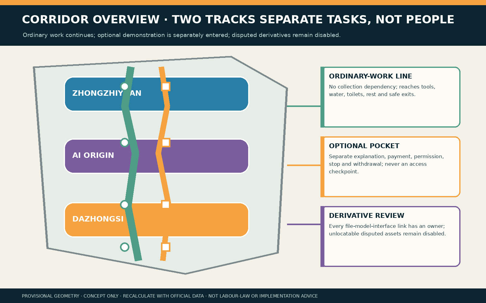

## Three-level scope framework

The coordinated research area studies how employers, contractors, platforms and model suppliers jointly shape choice. The overall design area links an ordinary-work line, staffed explanation desk, voluntary-demonstration pocket, derivative-tracing room and independent-review seat. Three key areas test synthetic embodied-AI training, anti-retaliation/accessibility and supply-chain derivative disablement. Research identifies power; the overall layer makes choice spatially accessible; the key-area layer verifies that ordinary tasks survive AI shutdown.[source:PROCESSED-FACT-PACK] [depth:three_level_scope_framework] [metric:site_area_sqm]

The `SITE_BOUNDARY` and all three `KEY_AREA` features are low-confidence provisional constraints. Real organisations, jobs, employment relations, fire safety, heritage, title, sensor scope and professional authority remain unconfirmed; official data triggers whole-package recalculation.[source:BOUNDARY-SOURCE] [metric:green_ratio] [metric:public_space_ratio]

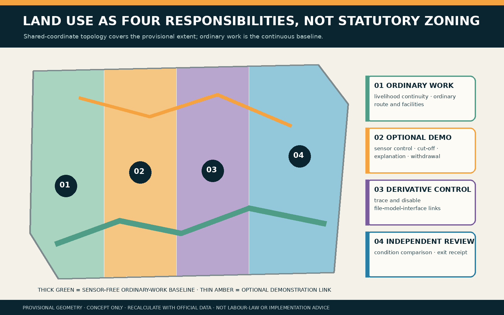

## Coordinated research area: industry and future city

The ecosystem links university robotics teams, public-space operators, employer/contractor owners, labour-rights and safety professionals, model suppliers and independent reviewers through a choice-stop-trace chain. AI may compare an approved sensor register, flag boundary crossings, list files and derivatives, and draft editable explanations. It cannot infer willingness, replacement suitability or skill value, nor decide wages, shifts, access, discipline or deletion.[source:DATA-SRC-GENERATIVE-AI-INTERIM-MEASURES] [standard:MOHURD-URBAN-DESIGN-MEASURES]

Reusable industrial outputs are a work/training separation protocol, physical cut-off, derivative register, anti-retaliation difference test, no-account withdrawal receipt and AI-off rehearsal. Field effects, legal applicability, collective procedures and supplier execution remain unknown.

### Agent.1 | identity and three areas/two wings

The Chinese name means ordinary work must not automatically become a machine's follow-along class. **WORK, NOT TRAINING** states the boundary directly. A green ordinary-work rail and amber optional-training rail remain separated by a white human-choice gap; colour, clothing and queues must not expose refusal. The cultural belt carries ordinary labour memory, the urban AI-life belt makes refusal and AI-off operation visible, and the convergence belt opens synthetic tests and derivative-tracing methods.[source:TASKBOOK-DELIVERABLES] [depth:overall_spatial_structure]

Zhongzhiyuan hosts synthetic robot-demonstration and sensor-overreach tests; AI Origin Community hosts worker, disability and language-access anti-retaliation review; Dazhongsi traces multi-supplier derivatives. The two wings invite labour, privacy, standards, engineering and ordinary-work-route support. These are invitations, not confirmed partnerships.

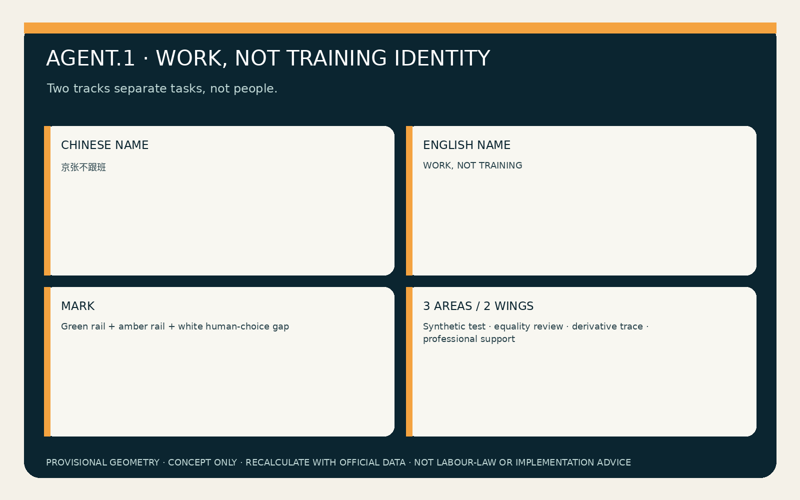

### Agent.2 | cases and eight ecosystem factors

Six public international cases frame questions only. Amsterdam and Helsinki algorithm registers suggest transparent purpose and ownership; the UK Service Standard foregrounds complete tasks and assisted channels; NIST AI RMF offers a continuing risk loop; Smart Kalasatama and Punggol provide time-limited trial and district-community backgrounds.[source:CASE-AMSTERDAM-ALGORITHM-REGISTER] [source:CASE-HELSINKI-AI-REGISTER] [source:CASE-UK-GOVERNMENT-DESIGN-PRINCIPLES] They are not local labour law or performance evidence.

Eight factors form a bounded loop: land hosts removable components; space provides equal facilities on both tracks; industry connects embodied AI, property, logistics and maintenance; funding first covers human review, stop and removal; talent pairs frontline workers with safety, labour, accessibility, data and engineering; compute stays small and offline; data are synthetic or explicitly authorised; scenarios begin empty-site, then co-review, then stop or proceed.[depth:renewal_project_list]

| Factors | Spatial / accountable carrier | Transferable output and stop condition |
|---|---|---|
| Land + space | Empty back-of-house site, ordinary-work line and demonstration pocket | Removable-component register; stop when facilities are unequal |
| Industry + funding | Embodied AI, property, logistics, maintenance and human-review budget | Supplier accountability sheet; no entry without funded cut-off, disablement and removal |
| Talent + compute | Workers/representatives paired with labour, safety, access, data and engineering reviewers; small offline environment | Seven-gate co-sign and offline rehearsal; missing named owner enters HOLD |
| Data + scenario | Synthetic or explicitly authorised records; empty-site first, co-review second | Rerunnable fixtures and exit receipt; no field trial before real data and site conditions are approved |

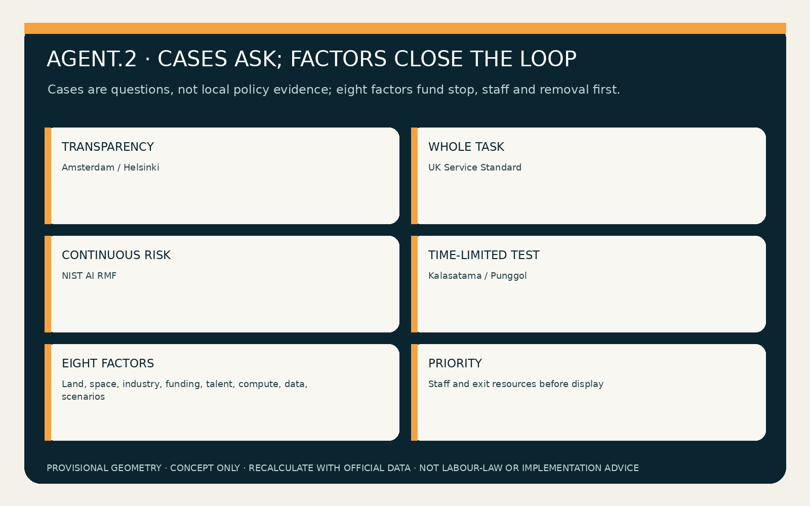

## Overall design area: renewal and regulatory-plan urban-design depth

The spatial structure is one ordinary-work baseline, three voluntary-demonstration pockets, two derivative/independent-review rooms, three key areas and two professional-support wings. The ordinary line reaches tools, water, toilets, rest, maintenance and safe exits. Demonstration pockets require a separate entrance, sensor boundary, physical cut-off, paper use card and staffed exit, never a wage or access checkpoint.[data:geometry/roads.geojson#ROAD-001] [data:geometry/public_space.geojson#PUBLIC-001] [depth:overall_spatial_structure]

Land use, buildings, roads, blue-green space, public space and phasing are conceptual layers. FAR, height, title, real job counts, utilities, fire safety and investment await official evidence. Retain/renovate/demolish/new-build language is limited to reusing interiors and removable furniture/sensors, never demolition conclusions from provisional geometry.[standard:MNR-LAND-USE-CLASSIFICATION-GUIDE] [depth:land_use_layout]

## Detailed design for three key areas

| Area | Dedicated task | Named human decision | Public result after failure |
|---|---|---|---|
| Zhongzhiyuan | 60 synthetic shifts, sensor-overreach, physical cut-off and robot-learning tests | Safety owner signs sensor envelope; labour-rights owner confirms ordinary work needs no collection | Unclear boundaries stop training while ordinary cleaning, maintenance and logistics rehearsal continues |
| AI Origin Community | No-account explanation, language/access choice and anti-retaliation comparison | Independent reviewer compares wages, shifts, access, tools and facilities | Any difference enters HOLD; public choice markers are removed and equal routes restored |
| Dazhongsi | Multi-supplier file-model-interface derivative tracing and exit rehearsal | Data and supplier owners jointly sign isolation, disablement or deletion receipts | Unlocatable derivatives do not expand; deletion is not claimed; disputed assets remain disabled |

All polygons are provisional constraints and do not identify real companies, staff or jobs.[data:geometry/key_areas.geojson#PROV-KEY-001] [data:geometry/key_areas.geojson#PROV-KEY-002] [depth:three_key_area_detailed_design]

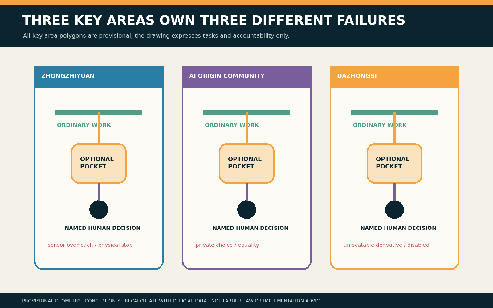

## AI ecosystem, personas and AI+ scenarios

Six synthetic personas represent directly employed, contracted, platform/delivery, cross-language and disabled workers plus a worker representative. They are test roles, not demographic, ability or retaliation-risk labels. Six named human roles are labour-rights owner, scene-safety owner, employer/operator owner, data owner, supplier owner and independent reviewer.[metric:persona_count] [metric:named_human_role_count] [depth:public_service_facilities]

| Card | Spatial carrier | Minimum AI role | Human floor / stop condition |
|---|---|---|---|
| 01 Cleaner robot learning | Ordinary line | Check approved sensors | Refusal cannot change shift, tools or route |
| 02 Maintenance demonstration | Optional pocket | List files | Separate explanation, payment and revocable permission |
| 03 Security audio | Physical cut-off | Flag microphone crossing | Safety owner stops collection |
| 04 Delivery-route collection | Dazhongsi back-of-house | Summarise synthetic routes | No real trajectory or performance data |
| 05 Catering motion recognition | Camera-free table | Off | Ordinary work remains fully offline |
| 06 Lab technique recording | Zhongzhiyuan pocket | Compare approved fields | Unapproved tacit skills are not collected |
| 07 Cross-language explanation | Staffed desk | Draft editable bilingual notice | Human checks understanding; silence is not consent |
| 08 No-account withdrawal | Paper counter | Locate record directory | Receipt available without an account |
| 09 Supplier exit | Derivative room | List dependencies | Missing owner keeps disputed assets disabled |
| 10 Anti-retaliation audit | Independent seat | Compare synthetic conditions | Any wage/shift/access difference enters HOLD |
| 11 AI-off rehearsal | Three key areas | Off | Paper register and cut-off complete the task |
| 12 Exit restoration | Ordinary rest/repair space | Draft checklist | Remove devices; keep ordinary facilities and work |

Four industry tests cover task separation, anti-retaliation equality, derivative tracing and AI-off continuity. `synthetic-work-fixtures.json` stores 60 synthetic records. `verify-work-fixtures.js` recomputes results and includes a tamper mode. Normal mode requires 60/60 ordinary tasks continue, 20 refusal/withdrawal cases preserve synthetic wage/shift/access values, 12 sensor crossings enter HOLD and eight disputed derivatives remain disabled. Tampering with a condition must exit non-zero. This proves fixture logic, not real anti-retaliation, deletion or employment outcomes.[source:WORK-TRAINING-SYNTHETIC-FIXTURES] [metric:synthetic_test_pass_count]

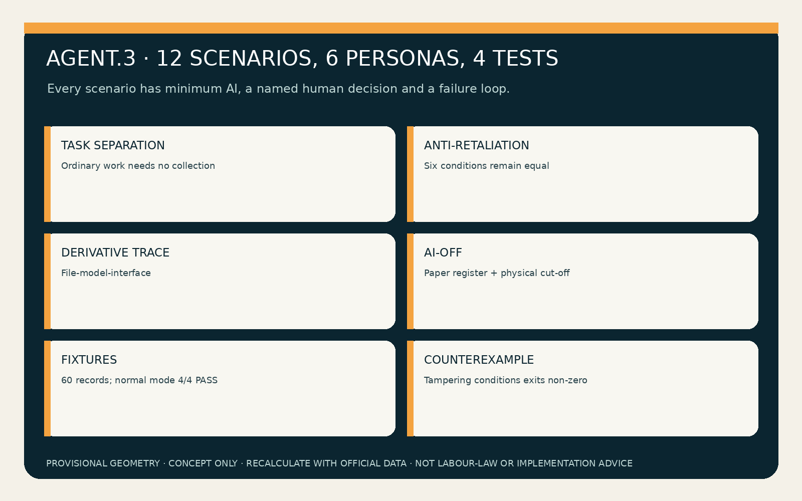

## Land use, building scale and retain/renovate/demolish/new-build logic

Four land roles are ordinary work/livelihood continuity, optional demonstration/sensor control, derivative tracing/disablement and independent review/exit. Shared coordinates partition the provisional boundary completely; these are task allocations, not statutory classifications.[data:geometry/land_use.geojson#LU-001] [depth:land_use_layout]

Two envelopes represent an explanation/demonstration kit and derivative/independent-review kit, preferably inserted into existing ground-floor or back-of-house space. Without building surveys, title, fire, heritage or structural evidence, no demolition or new build is proposed.[data:geometry/buildings.geojson#BLDG-001] [depth:retain_renovate_demolish] [metric:building_footprint_area_sqm]

## Transport, rail, municipal and public-service facilities

The ordinary-work route avoids cameras, demonstrations, performance scoring and public choice markers, yet reaches equal tools, water, toilets, rest and safety. Rail, road, parking, power, communications and capacity await professional evidence; no new redline or real interchange is claimed.[data:geometry/roads.geojson#ROAD-001] [depth:traffic_rail_slow_parking] [metric:concept_walk_network_length_m]

The minimum facility kit includes a paper sensor register, physical cut-off, purpose/retention card, accessible explanation seat, derivative directory, withdrawal receipt and independent-review desk. Network, model or supplier failure cannot stop ordinary work.[standard:BARRIER-FREE-ENVIRONMENT-LAW] [depth:municipal_new_infrastructure]

## Blue-green public space and urban character

The green layer is a sensor-free waiting/walking edge. Public space combines a work-demonstration choice court and derivative-disablement/exit receipt surface. Neither exposes refusal nor yields all space to trial activity. Exit removes sensors, rankings and demonstration signs while retaining shade, seats, access, water and ordinary-work support.[data:geometry/green_space.geojson#GREEN-001] [data:geometry/public_space.geojson#PUBLIC-002] [depth:blue_green_public_space]

Green means ordinary-work continuity; amber optional training; white the human-choice gap; purple disputed derivative disablement; grey dashed lines provisional geometry. Workers are never rendered as risk heatmaps, efficiency rankings or replacement targets.

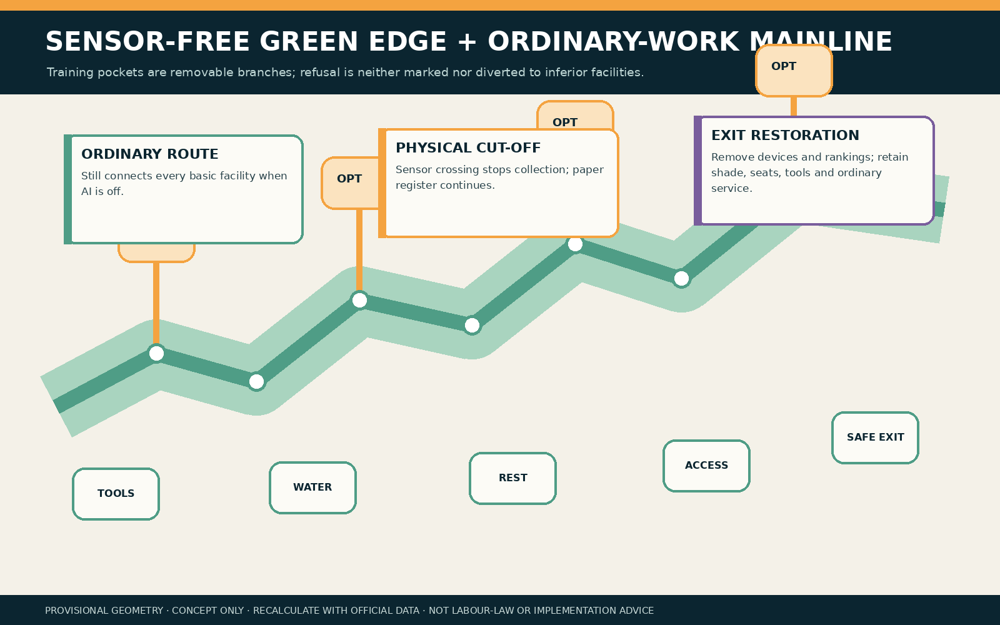

### Agent.3 | seven-gate separation protocol

The gates are `SEPARATE`, `REGISTER`, `EXPLAIN`, `CHOOSE`, `MONITOR`, `TRACE` and `WITHDRAW`. Any failure stops training, not ordinary work.[source:WORK-TRAINING-PROTOCOL] [metric:entry_gate_count]

### Agent.4 | three responsibility landmarks and six components

Landmarks are accountable interfaces, not sculptures: a physical cut-off test bench at Zhongzhiyuan; an equal-facilities balance at AI Origin Community; and a derivative-destination wall at Dazhongsi. Six removable components are paper use card, physical cut-off, ordinary-work wayfinding, optional demonstration desk, derivative cabinet and independent withdrawal box.[source:TASKBOOK-DELIVERABLES] [depth:public_space_character]

| Landmark | Component library | Interface handed to professional teams |
|---|---|---|
| Zhongzhiyuan cut-off test bench | Physical cut-off and paper purpose card | Sensor-envelope and stop-test record signed by the scene-safety owner |
| AI Origin equal-facilities balance | Ordinary-work wayfinding and voluntary-demonstration desk | Wage/shift/access/tool/facility difference register co-signed by labour-rights and independent reviewers |
| Dazhongsi derivative-destination wall | Derivative cabinet and independent receipt box | File-model-interface disablement/deletion receipt co-signed by data and supplier owners |

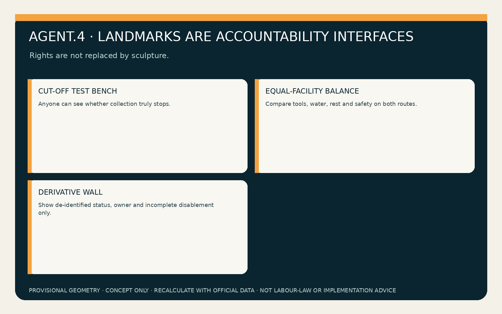

### Agent.5 | cultural narrative and international communication

The narrative is “labour arrives first; machines learn later”. Railway construction, maintenance and operation memory becomes respect for ordinary work rather than a source of unpaid training material. English communication consistently distinguishes `ordinary work`, `voluntary demonstration`, `derived asset`, `human review` and `livelihood continuity`. Displays label concept status, synthetic data, provisional geometry and absence of approval.

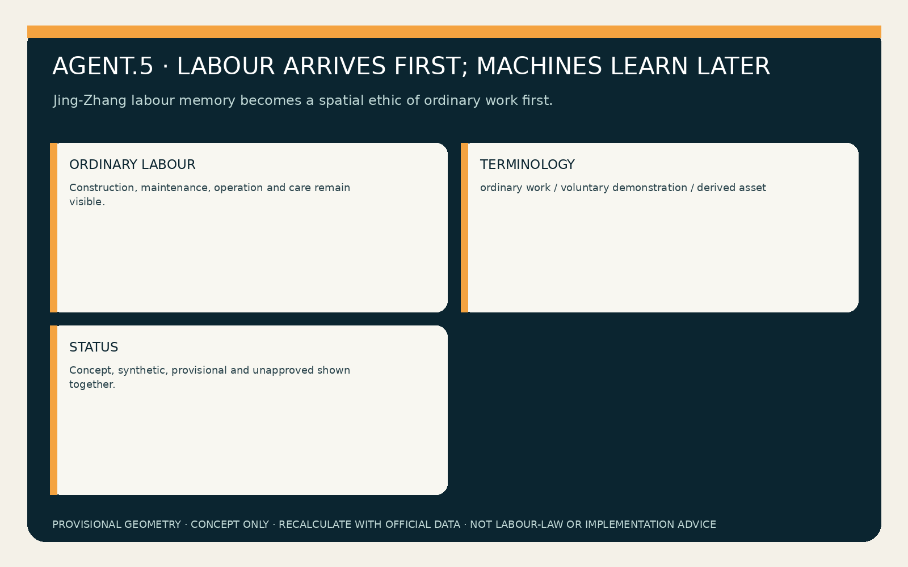

## Renewal list, policy and phasing

| Project | Suggested owners | Entry evidence | Stop / exit |
|---|---|---|---|
| P1 Synthetic separation rehearsal | Safety + labour-rights owners | 60 fixtures, sensor register, equal-condition comparison | Stop if any ordinary task requires collection |
| P2 Accessible explanation and anti-retaliation review | Independent reviewer + affected representatives | Paper/bilingual notice and six equality fields | HOLD if choice is exposed or conditions change |
| P3 Multi-supplier derivative tracing | Data + supplier owners | File-model-interface register and disablement receipt | No expansion or deletion claim when unlocatable |
| P4 Empty-site removable co-design | Operator/employer + professionals | Fire, title, labour process and removal resources | Missing approval prevents field use |

Phase one uses synthetic data and empty space only; phase two invites workers/representatives, labour and safety professionals, disability/language groups, operators and suppliers; phase three discusses time-limited removable co-design only after applicable labour process, anti-retaliation, minimisation, derivative disablement, fire/title and exit resources are approved. Ending is a valid outcome.[data:geometry/phasing.geojson#PHASE-001] [depth:phasing_implementation]

### Agent.6 | annual programme and long-term operation

“Work Is Not Training Week” combines quarterly physical stop tests, six-month anti-retaliation equality audits, annual supply-chain derivative recalls and an AI-off ordinary-work day. Forums share synthetic fixtures, rights boundaries, failures and repairs, never real worker trajectories. Funding first covers staff, accessibility, removal, disablement and independent review.[source:TASKBOOK-DELIVERABLES] [metric:annual_operation_cycle_count]

Every cycle produces a transferable handoff: the quarterly test gives a sensor-envelope checklist to the safety owner; the six-month audit gives a difference-remediation register to labour-rights and independent reviewers; the annual recall gives a file-model-interface disablement register to data and supplier owners; the AI-off day gives an offline continuity playbook to operators and affected-worker representatives. A cycle without a named recipient, stop rule or exit resource is cancelled and never converted into an investment, policy or funding commitment.

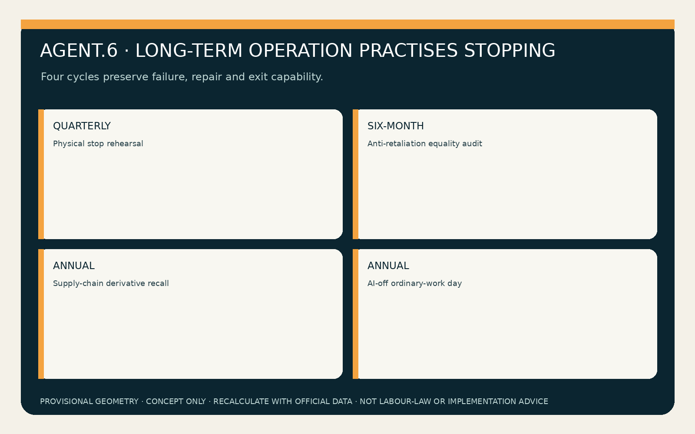

## Indicators, area recomputation and compliance matrix

Three core visual metrics are recomputed in EPSG:4548 from one GeoJSON set: provisional area `11,412,825.386 m²`, green ratio `0.199654`, and public-space ratio `0.208737`, matching offline visual numeric values. They are provisional design-model outputs and trigger whole-package recalculation when official data arrive.[metric:site_area_sqm] [metric:green_ratio] [metric:public_space_ratio]

Known deliverables are 12 scenarios, six personas, four industry tests, three landmarks, six named roles, seven gates, 60 synthetic fixtures and four passing suites. Real ordinary-work continuity, anti-retaliation audit, choice-review, disputed-derivative disablement time and condition disparity remain `unknown/null`; synthetic PASS cannot replace them.[metric:ordinary_work_continuity_rate] [depth:indicators_recomputation]

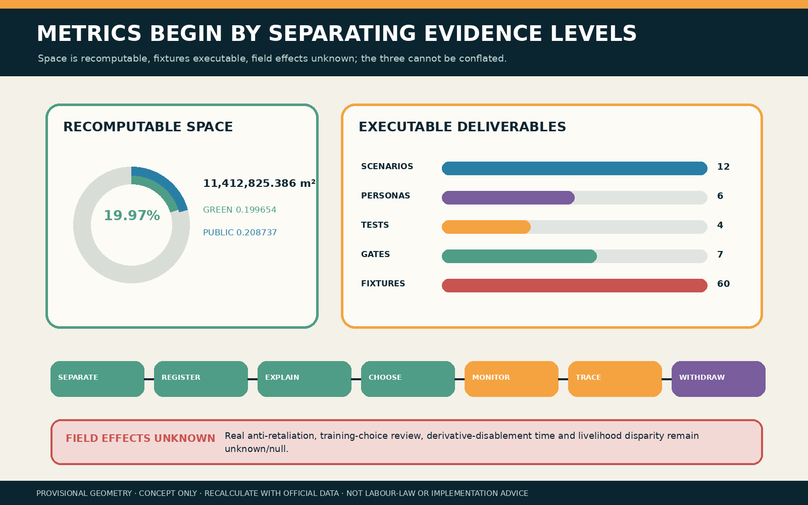

The compliance, standard and design-depth matrices provide exhaustive machine audit. They do not replace human-readable design judgement.

## Risk, copyright and legal/official-claim boundaries

Mandatory-rejection check: no real personal, wage, shift, access, trajectory or non-public spatial data; no fabricated official endorsement, approval, labour-law conclusion or implementation promise; all six Agent tasks have dedicated prose, boards and structured outputs; policy, space and operation remain concepts for professionals and affected people to deepen.[standard:GENERATIVE-AI-INTERIM-MEASURES] [depth:risk_missing_data]

Critical risks are an unenforceable anti-retaliation promise, a two-track layout that exposes refusal, employer/supplier capture of review, claimed deletion when derivatives cannot be located, and an inaccessible ordinary route. Training remains `HOLD/RETURN` when choice is not private, any of six equality conditions fails, a named owner is missing, a derivative is unlocatable, ordinary routes/facilities degrade, or professional approval is absent.

Text, boards, HTML, PDF, JSON and candidate fixtures are newly authored or rewrite the author's own generic topology/structure method. Fonts are rasterised only and not distributed. No third-party photo, map, person, logo or remote resource is included. The built-in image-generation tool was unavailable, so no generated imagery was used and `cover_image=null`. Asset rights are recorded in `report/copyright_statement.md` and `visual/assets/rights-ledger.json`.

## References

- [source:OFFICIAL-ANNOUNCEMENT] Local official-announcement snapshot for public scope only.
- [source:AGENT-TASKBOOK] Cleared taskbook and agent.1-agent.6.
- [source:BOUNDARY-SOURCE] Provisional-boundary derivation, intake/visualisation/recalculation only.
- [source:WORK-TRAINING-PROTOCOL] Candidate-authored work/training separation protocol.
- [source:WORK-TRAINING-SYNTHETIC-FIXTURES] Sixty synthetic records and executable verifier.
