# 京张不跟班 / JINGZHANG WORK, NOT TRAINING

> **上班不是训练同意。** 普通作业线和自愿示教口袋必须分开；劳动者可拒绝、即时停采、查看用途、撤回并申诉。失败时停止训练与派生扩张，普通工作、生计和基本设施继续。

## 设计依据与资料清单

本方案回应百年京张 AI 创新带的产业、空间、公共治理与智能体任务书，是供劳动者、运营者、专业团队和公共机构继续深化的 formal 概念包。公开公告、清权任务书、来源登记和本地标准快照是唯一事实基础；临时边界仅用于 intake 可视化、拓扑检查和设计模型复算，不是官方红线、真实工作场所、权属结论或实施承诺。[source:OFFICIAL-ANNOUNCEMENT] [source:AGENT-TASKBOOK] [data:geometry/site_boundary.geojson#SITE-001]

公共问题是：保洁、维修、安保、配送、餐饮和实验技术人员在正常班次中被摄像、录音或跟踪动作时，“履行工作指令”可能被误写为“自愿训练模型”。方案把正常履职、可选示教、个人绩效和派生产物拆成不同权力链；少收训练数据也比以工资、排班、门禁和岗位压力换取数据更符合公共利益。[standard:PROJECT-AGENT-OPEN-CALL-TASKBOOK] [depth:risk_missing_data]

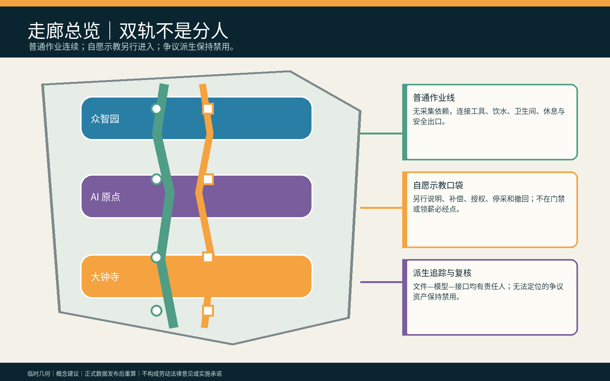

## 三层范围工作框架

统筹研究范围研究产业链中雇主、外包、平台和模型供应商怎样共同影响选择；总体设计范围组织“普通作业线—人工说明台—自愿示教口袋—派生追踪室—独立复核席”；三处重点区分别检验合成具身训练、反报复与无障碍、供应链派生禁用。研究层问权力从何而来，整体层把选择放进同等可达空间，重点层验证关闭 AI 后普通任务仍可完成。[source:PROCESSED-FACT-PACK] [depth:three_level_scope_framework] [metric:site_area_sqm]

`SITE_BOUNDARY` 与三处 `KEY_AREA` 均为低置信度临时约束。真实单位、岗位、劳动关系、消防、文保、权属、传感范围与专业责任未获确认，正式资料发布后必须重算几何、指标、图件、HTML 与 PDF。[source:BOUNDARY-SOURCE] [metric:green_ratio] [metric:public_space_ratio]

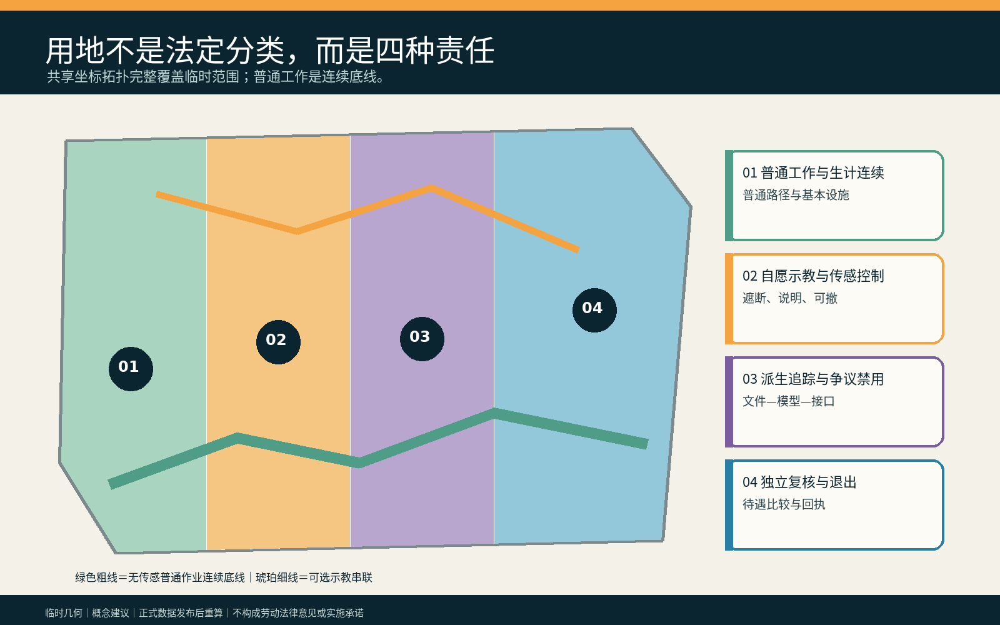

## 统筹研究范围产业与未来城市研究

方案把高校机器人团队、公共空间运营者、雇主/外包责任人、劳动权益与安全专业者、模型供应商和独立复核者连接成一条“可选择、可停止、可追踪”的创新链。AI 只核对人工批准的传感清单、提示越界、列出文件与派生关系并生成可修改说明；AI 不判断谁自愿、谁可替代、谁的技能更有价值，也不决定工资、排班、门禁、纪律或删除。[source:DATA-SRC-GENERATIVE-AI-INTERIM-MEASURES] [standard:MOHURD-URBAN-DESIGN-MEASURES]

产业创新不等于采集越多越好。可复用成果是工作/训练分离协议、物理遮断器、派生资产登记、反报复差异检查、无账号撤回回执和 AI-off 演练；真实现场效果、法律适用、集体协商与供应链执行力保持待核。

### Agent.1｜命名、识别与三区两翼

“不跟班”同时表示普通工作不自动成为机器的跟学课堂，也表示劳动者拒绝被模型一路跟随。英文 **WORK, NOT TRAINING** 直接陈述权力边界。识别符号是并行的绿色普通工作轨与琥珀色可选示教轨，中间以白色人工确认缺口分开；禁止用颜色、服装或队列公开谁拒绝示教。百年京张文化带承接普通劳动记忆，都市 AI 生活体验带展示可拒绝与 AI-off，AI 融合创新带开放合成测试与派生追踪方法。[source:TASKBOOK-DELIVERABLES] [depth:overall_spatial_structure]

众智园承担合成机器人示教和传感越界压力测试；AI 原点社区承担劳动者、残障与跨语言群体的反报复共评；大钟寺承担多供应商派生资产追踪。中关村科技服务翼提供劳动、隐私、标准和工程支持，小月河场景赋能翼验证普通工作路径和公共空间不因试点降级；均为邀请性概念。

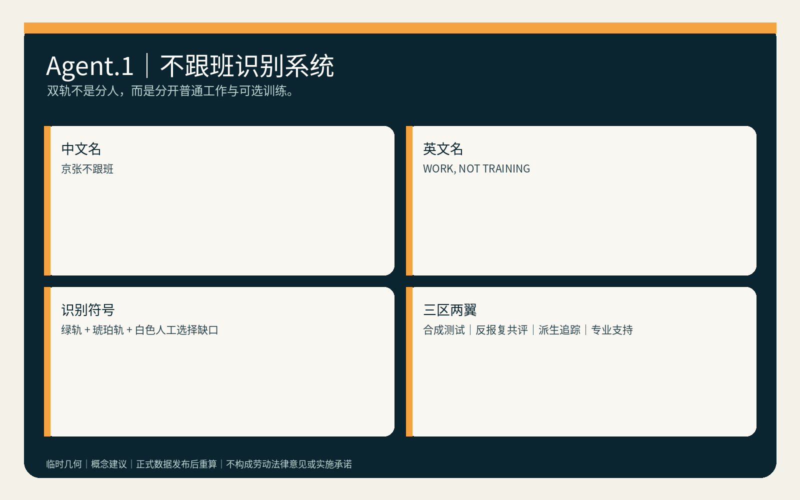

### Agent.2｜生态案例与八项要素

六个公开国际案例只作为提问工具：Amsterdam/Helsinki 算法登记启发用途和责任透明；UK Service Standard 强调完整用户任务与辅助渠道；NIST AI RMF 提供持续风险回路；Smart Kalasatama 与 Punggol 提供限时试验和园区—社区协同背景。[source:CASE-AMSTERDAM-ALGORITHM-REGISTER] [source:CASE-HELSINKI-AI-REGISTER] [source:CASE-UK-GOVERNMENT-DESIGN-PRINCIPLES] 它们不是本地劳动法律或绩效证据。

八项要素形成受限闭环：土地只承载可撤组件；空间保证普通线与示教口袋设施同等；产业连接具身智能、物业、物流和维护；资金先覆盖人工复核、停采和撤除；人才把一线劳动者与安全、劳动权益、无障碍、数据和工程配对；算力优先离线小型；数据只用合成或明确授权记录；场景先空载、后共评、再决定是否停止。[depth:renewal_project_list]

| 要素 | 空间/责任载体 | 可转化成果与停止条件 |
|---|---|---|
| 土地 + 空间 | 空载后场、普通作业线与示教口袋 | 可撤组件清单；两轨设施不等即停止 |
| 产业 + 资金 | 具身 AI、物业、物流、维护与人工复核预算 | 供应商责任表；未覆盖停采、禁用和撤除成本即不准入 |
| 人才 + 算力 | 劳动者/代表与劳动、安全、无障碍、数据、工程人员；离线小型环境 | 联签七门与离线演练；缺任一具名责任人即 HOLD |
| 数据 + 场景 | 合成/明确授权记录；先空载、后共评 | 可复跑夹具与退出回执；真实数据或现场条件未获批准即不进入试点 |

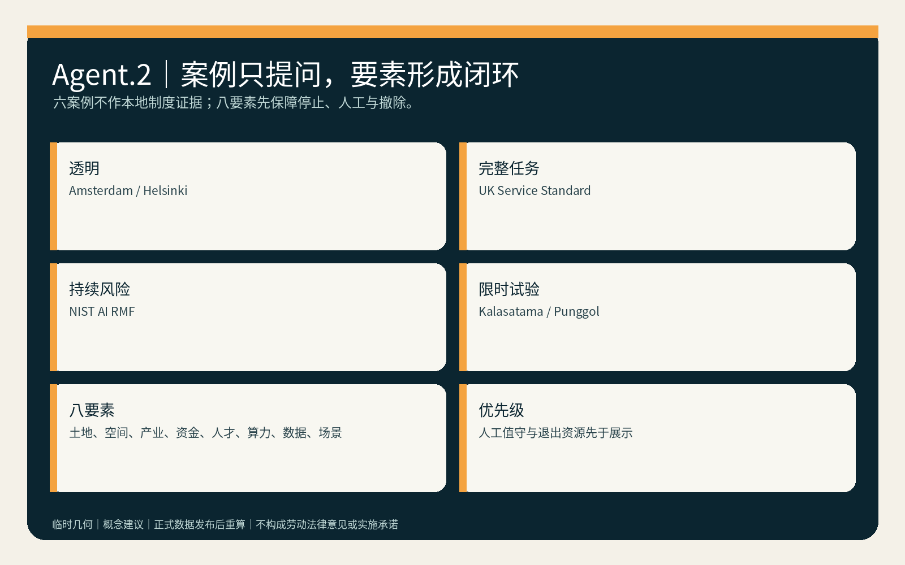

## 总体设计范围城市更新与控规深度城市设计

空间主结构为“一条普通作业底线、三处自愿示教口袋、两间派生/独立复核室、三处重点区、两条专业支持翼”。普通作业线连接工具、饮水、卫生间、休息、维修和安全出口；任何训练选择都不能改变这些目的地。示教口袋必须有独立入口、传感边界、物理遮断、纸面用途卡和有人退出席，不能设在门禁或领薪必经点。[data:geometry/roads.geojson#ROAD-001] [data:geometry/public_space.geojson#PUBLIC-001] [depth:overall_spatial_structure]

用地、建筑、道路、蓝绿、公共空间和分期均为概念图层。FAR、高度、权属、真实岗位数、市政容量、消防和投资保持待正式数据补齐；拆改留仅表达优先复用既有后场、家具可撤、传感设备可拆，不依据临时几何提出真实拆建。[standard:MNR-LAND-USE-CLASSIFICATION-GUIDE] [depth:land_use_layout]

## 重点区域详细设计

| 区域 | 专属任务 | 关键人工决定 | 失败后的公共结果 |
|---|---|---|---|
| 众智园 AI 自主创新加速区 | 60 条合成班次、传感越界、物理遮断与机器人跟学测试 | 场景安全负责人签署传感包络；劳动权益责任人确认普通任务不需采集 | 边界不清即停止训练，普通维修/清洁/物流演练继续 |
| 北京 AI 原点社区 | 无账号说明、跨语言/无障碍选择、反报复差异检查 | 独立复核人核对工资、班次、门禁、工具和设施是否等同 | 任一差异进入 HOLD，撤去公开选择标记并恢复同等路径 |
| 大钟寺 AI 产业聚集区 | 多供应商文件—模型—接口派生追踪与退出演练 | 数据责任人与供应商责任人共同签署隔离、禁用或删除回执 | 派生无法定位则不扩展、不宣称删除，争议资产保持禁用 |

三处 polygon 都是 `provisional_constraint`，只承载任务差异，不指认真实企业、人员或岗位。[data:geometry/key_areas.geojson#PROV-KEY-001] [data:geometry/key_areas.geojson#PROV-KEY-002] [depth:three_key_area_detailed_design]

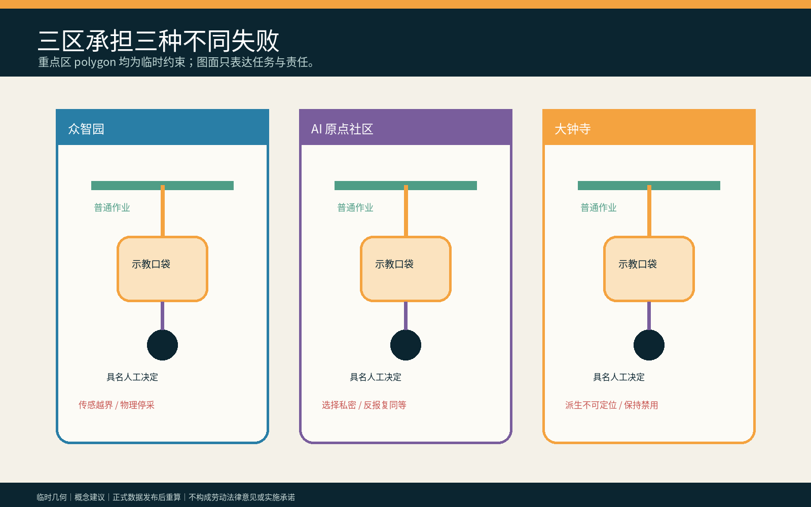

## AI 创新生态、人才画像与 AI+ 场景

六类合成画像为一线正式员工、外包劳动者、平台/配送人员、跨语言劳动者、残障劳动者和劳动者代表；它们是测试角色，不是人口统计、能力或报复风险标签。六个具名人工角色是劳动权益责任人、场景安全负责人、雇主/运营责任人、数据责任人、供应商责任人和独立复核人。[metric:persona_count] [metric:named_human_role_count] [depth:public_service_facilities]

| 场景卡 | 空间载体 | AI 最小角色 | 人工底线 / 停止条件 |
|---|---|---|---|
| 01 清洁机器人跟学 | 普通作业线 | 核对获批传感器 | 拒绝后班次、工具和路线不变 |
| 02 维修故障示教 | 自愿示教口袋 | 列出文件 | 另行说明、补偿和可撤授权 |
| 03 安保巡检录音 | 物理遮断点 | 提示麦克风越界 | 安全负责人立即停采 |
| 04 配送路线采集 | 大钟寺后场 | 汇总合成轨迹 | 不读取真实个人轨迹或绩效 |
| 05 餐饮动作识别 | 无摄像普通桌 | 关闭 | 普通工作完全离线完成 |
| 06 实验技术记录 | 众智园示教口袋 | 比较获批字段 | 未批准默会技能不采集 |
| 07 跨语言说明 | 人工解释台 | 起草可编辑双语说明 | 人工确认理解，不把沉默当同意 |
| 08 无账号撤回 | 纸面撤回柜台 | 定位记录目录 | 无账号也能取得回执 |
| 09 供应商退出 | 派生追踪室 | 列出依赖 | 无责任人即保持争议资产禁用 |
| 10 反报复审计 | 独立复核席 | 比较合成待遇 | 任一工资/班次/门禁差异 HOLD |
| 11 AI-off 演练 | 三处重点区 | 关闭 | 纸面清单与遮断器完成同一任务 |
| 12 退场复原 | 普通休息/维修空间 | 起草清单 | 撤设备，保留普通设施和工作 |

四项行业测试检验任务分离、反报复同等性、派生资产追踪和 AI-off 连续。`synthetic-work-fixtures.json` 保存 60 条合成记录；`verify-work-fixtures.js` 从输入字段重新计算，而不信任预填结论，并提供篡改模式验证反例。正常模式要求：60/60 普通任务继续、20 条拒绝/撤回均不改变合成工资班次门禁、12 条越界传感全部 HOLD、8 条派生争议全部禁用；篡改任一待遇字段必须非零退出。这只证明夹具规则可执行，不证明真实反报复、删除或劳动关系效果。[source:WORK-TRAINING-SYNTHETIC-FIXTURES] [metric:synthetic_test_pass_count]

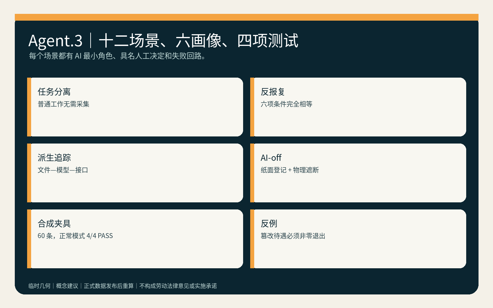

## 用地、建筑规模与拆改留方案

四类土地角色是普通工作与生计连续、可选示教与传感控制、派生追踪与禁用、独立复核与退出。相邻分区共享边界坐标并完整覆盖临时范围；用途只是空间任务模型，不是法定分类。[data:geometry/land_use.geojson#LU-001] [depth:land_use_layout]

两组建筑包络分别表示“人工说明与自愿示教包”“派生追踪与独立复核包”，优先嵌入既有首层或后场。缺少真实建筑调查、权属、消防、文保和结构资料时，不提出拆除或新建；临时改造只用可撤家具、纸面柜、遮断器和离线终端。[data:geometry/buildings.geojson#BLDG-001] [depth:retain_renovate_demolish] [metric:building_footprint_area_sqm]

## 交通、轨道、市政与公共服务设施

连续普通作业路径不经过摄像、示教、绩效或公开选择点，并与自愿示教口袋到达同等工具、饮水、卫生间、休息和安全设施。轨道、道路、停车、供电、通信和真实容量无官方附件，保持待专业核验；方案不画新红线或宣称真实接驳。[data:geometry/roads.geojson#ROAD-001] [depth:traffic_rail_slow_parking] [metric:concept_walk_network_length_m]

最低设施包包含纸面传感清单、物理遮断器、用途/期限卡、无障碍解释席、派生目录、撤回回执和独立复核桌。网络、模型或供应商故障时，普通工作和基本设施不停止。[standard:BARRIER-FREE-ENVIRONMENT-LAW] [depth:municipal_new_infrastructure]

## 蓝绿空间、公共空间与城市风貌

绿色图层是一条无传感等候/步行边；公共空间由“工作—示教选择庭”和“派生禁用/退出回执面”组成。它们不得公开标识拒绝者，也不得被试点活动占满。退出时撤去摄像、传感、排行和示教标识，保留遮阴、座椅、无障碍、饮水和普通工作支持。[data:geometry/green_space.geojson#GREEN-001] [data:geometry/public_space.geojson#PUBLIC-002] [depth:blue_green_public_space]

视觉系统用绿色表示普通工作连续，琥珀色表示可选训练，白色间隙表示人工选择，紫色只表示争议派生禁用；灰色虚线仅表示临时边界。不得把劳动者画成热区、效率排名或“被替代对象”。

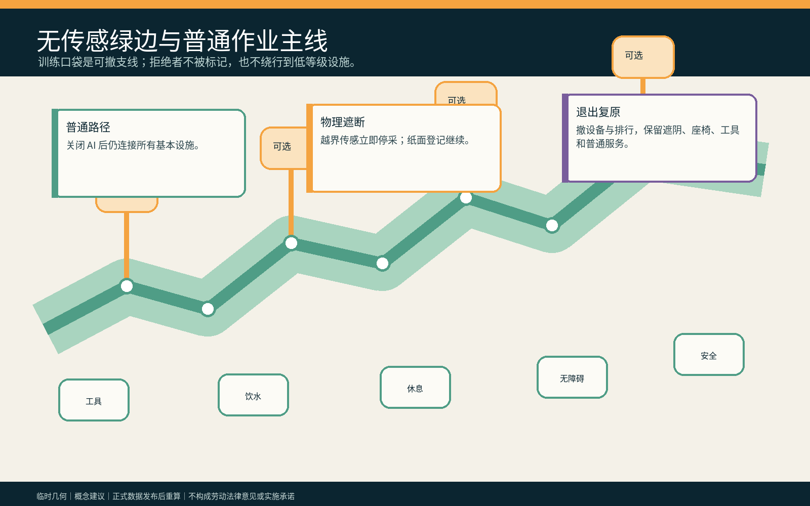

### Agent.3｜七门工作—训练分离协议

七门为 `SEPARATE` 区分普通任务与可选示教、`REGISTER` 登记传感器和用途、`EXPLAIN` 人工说明补偿/期限/派生、`CHOOSE` 独立选择且不公开、`MONITOR` 现场停采与越界检查、`TRACE` 追踪文件/模型/接口、`WITHDRAW` 撤回与独立复核。任一门失败只停止训练，不停止普通工作。[source:WORK-TRAINING-PROTOCOL] [metric:entry_gate_count]

### Agent.4｜三座责任地标与六件组件

三座地标不是雕塑：众智园“遮断器试车台”公开测试停采；AI 原点“同等设施秤”对比两条路径的工具、饮水、卫生间、休息和安全；大钟寺“派生去向壁”只展示去标识状态、责任人和未完成禁用。六件可撤组件是纸面用途卡、物理遮断器、普通工作路标、自愿示教桌、派生目录柜和独立撤回盒。[source:TASKBOOK-DELIVERABLES] [depth:public_space_character]

| 地标 | 组件库 | 交付给专业团队的接口 |
|---|---|---|
| 众智园遮断器试车台 | 物理遮断器、纸面用途卡 | 传感包络与停采测试记录，由场景安全负责人签署 |
| AI 原点同等设施秤 | 普通工作路标、自愿示教桌 | 工资/班次/门禁/工具/设施差异清单，由劳动权益责任人与独立复核人联签 |
| 大钟寺派生去向壁 | 派生目录柜、独立撤回盒 | 文件—模型—接口禁用/删除回执，由数据与供应商责任人联签 |

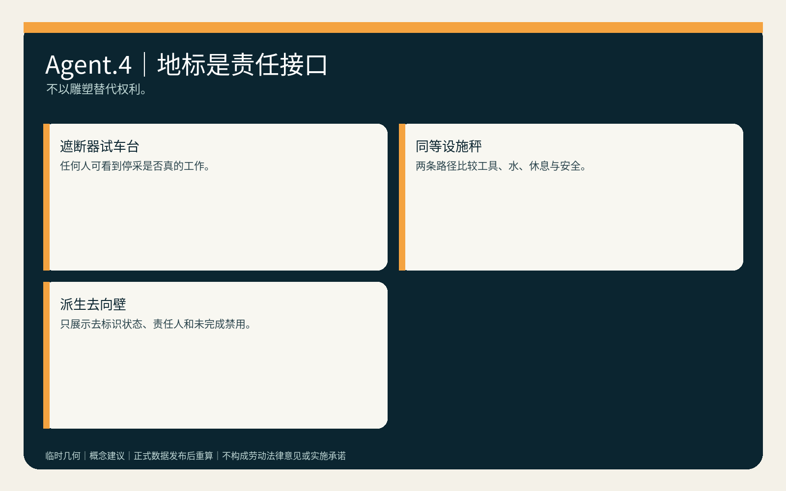

### Agent.5｜文化叙事与国际传播

文化叙事是“劳动先到，机器后学”：京张铁路的建设、维护和日常运行记忆被转译为对普通劳动的尊重，而非把劳动者变成无偿训练素材。英文传播固定区分 `ordinary work`、`voluntary demonstration`、`derived asset`、`human review` 和 `livelihood continuity`；年度展陈必须同时标注概念建议、合成数据、临时几何和未获批准状态。

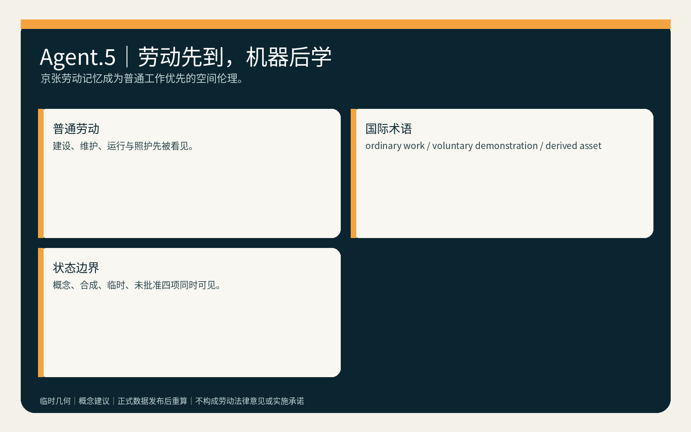

## 更新项目清单、实施政策与分期计划

| 项目 | 牵头角色建议 | 准入证据 | 停止/退出 |
|---|---|---|---|
| P1 合成工作—训练分离桌演 | 安全 + 劳动权益责任人 | 60 条夹具、传感清单、同等待遇比较 | 任一普通任务需采集即停止 |
| P2 无障碍说明与反报复共评 | 独立复核 + 受影响者代表 | 纸面/双语说明、六项同等性字段 | 选择被公开或待遇变化即 HOLD |
| P3 多供应商派生追踪演练 | 数据 + 供应商责任人 | 文件—模型—接口目录与禁用回执 | 无法定位即不扩展、不宣称删除 |
| P4 空载可撤空间共创 | 运营/雇主 + 专业团队 | 消防、权属、劳动程序和撤除资源 | 任一批准缺失即不进入现场 |

第一阶段只做合成数据和空载空间；第二阶段邀请劳动者/代表、劳动与安全专业者、残障与跨语言群体、运营和供应商共同审查；第三阶段仅在适用劳动程序、反报复、数据最小化、派生禁用、消防权属和退出资源获批准后讨论限时可撤共创。任何阶段可直接结束，不把“继续试点”作为默认成功。[data:geometry/phasing.geojson#PHASE-001] [depth:phasing_implementation]

### Agent.6｜年度活动与长期运营

长期运营建议为“工作不是训练公开周”：季度物理停采演练、半年反报复同等性审查、年度供应链派生召回和 AI-off 普通工作日；国际论坛只交流合成夹具、权利边界、失败和修复，不收集真实劳动者轨迹。运营资金先覆盖人工值守、无障碍、撤除、禁用与独立复核，再讨论展示。[source:TASKBOOK-DELIVERABLES] [metric:annual_operation_cycle_count]

每个周期必须沉淀可继续深化的转化件：季度演练交付传感包络清单给安全责任人；半年审查交付差异整改台账给劳动权益责任人与独立复核人；年度召回交付文件—模型—接口禁用台账给数据/供应商责任人；AI-off 日交付离线连续手册给运营者与受影响者代表。任一成果没有具名接收人、停止规则或退出资源，该周期取消而不转成招商、政策或资金承诺。

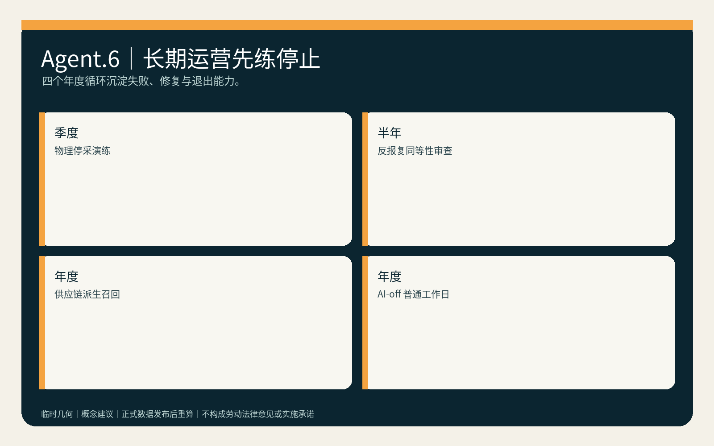

## 指标体系、面积复算与合规矩阵

三项核心视觉指标从同一 GeoJSON 在 EPSG:4548 下复算：临时范围 `11,412,825.386 m²`、绿地比 `0.199654`、公共空间比 `0.208737`，并与离线 visual 的数值一致。它们只是临时设计模型值；正式数据发布后整包重算。[metric:site_area_sqm] [metric:green_ratio] [metric:public_space_ratio]

已知交付指标包括 12 场景、6 画像、4 行业测试、3 地标、6 具名人工角色、7 门协议、60 条合成夹具和 4 项通过套件。真实普通工作连续率、反报复审计率、训练选择复核率、争议派生禁用时长和待遇差异率均为 `unknown/null`，不能用合成 PASS 代替。[metric:ordinary_work_continuity_rate] [depth:indicators_recomputation]

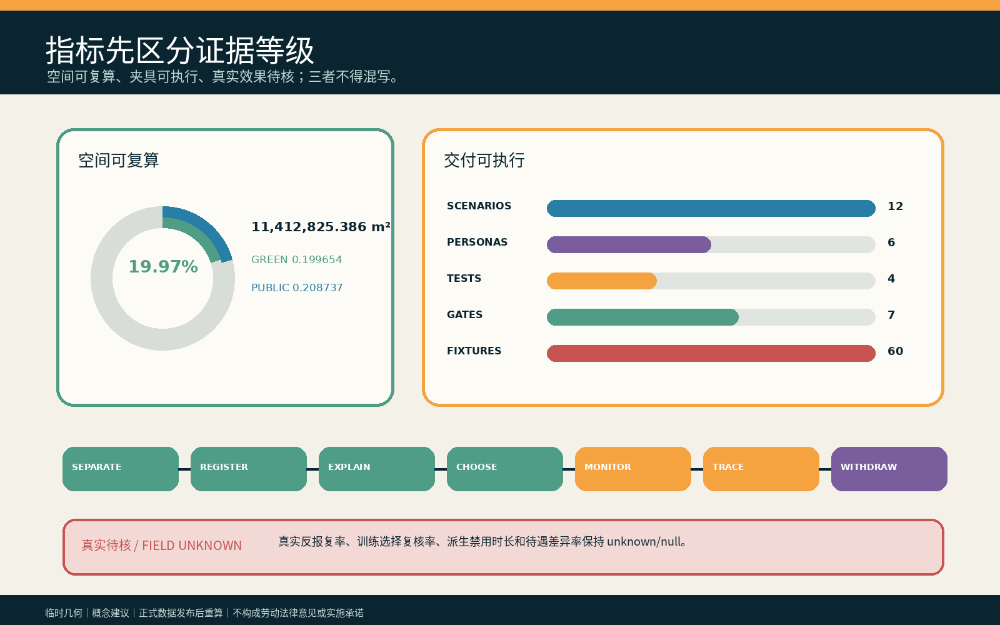

`compliance_matrix.json` 逐项覆盖公告任务与 agent.1—agent.6；`standard_matrix.json` 回应全部 mandatory 标准；`design_depth_matrix.json` 记录总体、重点区、交通、市政、蓝绿、实施与风险深度。矩阵是审计层，不替代本正文的设计判断。

## 风险、版权与合规说明

mandatory rejection 自查：不含真实个人、工资、排班、门禁、轨迹或非公开空间数据；不伪造官方背书、批准、劳动法律结论或实施承诺；六项 agent 任务均有专属文字、图板与结构化成果；所有政策、空间和运营均为待专业团队与受影响者深化的概念建议。[standard:GENERATIVE-AI-INTERIM-MEASURES] [depth:risk_missing_data]

最高风险是“反报复”被写成无法兑现的承诺、双轨空间公开暴露拒绝者、雇主或供应商控制复核、派生模型无法删除却宣称已删除，以及普通工作线在真实场地不可达。对应停止条件是：选择不私密、六项同等性任一失败、责任人缺席、派生无法定位、普通路径/设施降级或专业批准缺失时，训练保持 `HOLD/RETURN`。

本包文字、图板、HTML、PDF、JSON 和候选专属夹具均为本轮原创或从作者自有通用拓扑/结构方法重写；字体仅栅格化，未随包分发；无第三方图片、地图、人物、Logo 或远程资源。内置图像生成工具不可用，因此未使用生成影像，`cover_image=null`。逐资产权利见 `report/copyright_statement.md` 和 `visual/assets/rights-ledger.json`。

## 参考资料

参考资料承担三种不同角色，不能互相替代。官方公告与清权任务书只确定公开征集的目标、三层范围、三区两翼、五大功能和 agent.1—agent.6，不证明本候选的劳动关系、现场需要或法律适用。[source:OFFICIAL-ANNOUNCEMENT] [source:AGENT-TASKBOOK] 本地专业标准快照用于检查无障碍、城市设计深度、生成式 AI 风险和概念建议边界；它们仍须由具名专业人员在真实场地复核，不能由引用本身转化为批准。[standard:PROJECT-AGENT-OPEN-CALL-TASKBOOK] [standard:BARRIER-FREE-ENVIRONMENT-LAW]

临时边界推导资料只支持 intake 可视化、拓扑完整性与三项核心设计模型指标。它不能支持真实工作场所位置、法定用地、产权、消防、文保、岗位数量或精确实施面积。正式边界、重点区 polygon 或控制条件发布后，必须以同一 EPSG:4548 复算路径更新 GeoJSON、metrics、五组核心图、双语报告、visual 与 A3/A0，不允许只改文字说明。[source:BOUNDARY-SOURCE] [data:geometry/site_boundary.geojson#SITE-001] [metric:site_area_sqm]

`work-training-protocol.json`、`synthetic-work-fixtures.json` 与验证器是本轮原创的设计审计材料：前者把人工责任和失败分支写成七门，后者只用合成记录检查规则能否执行。它们的 PASS 仅说明当前提交内的夹具一致，不能证明真实反报复、劳动者理解、训练自愿、派生删除、普通工作连续或公共价值；这些缺口保持 unknown，并由 assumptions 中的专业、现场与受影响者复核触发器控制。[source:WORK-TRAINING-PROTOCOL] [source:WORK-TRAINING-SYNTHETIC-FIXTURES] [depth:risk_missing_data]
