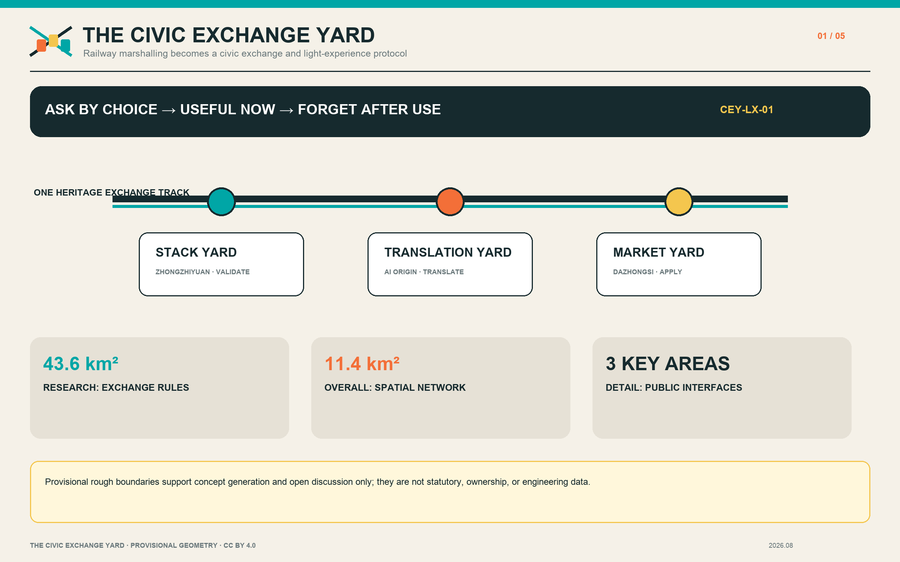
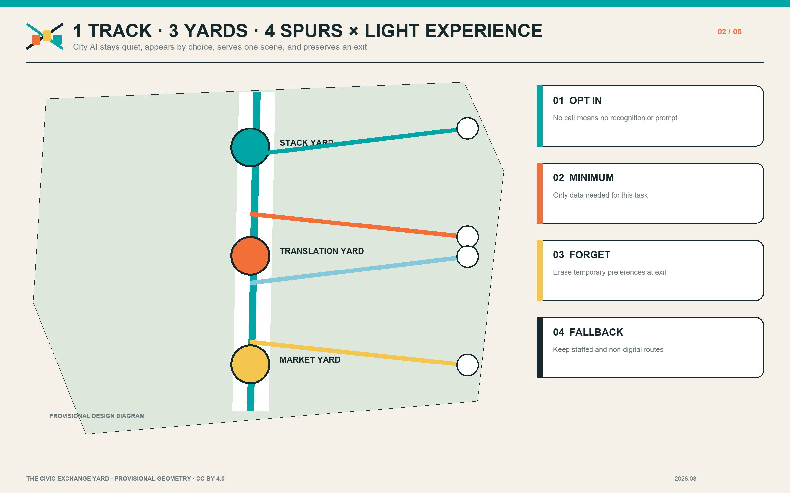
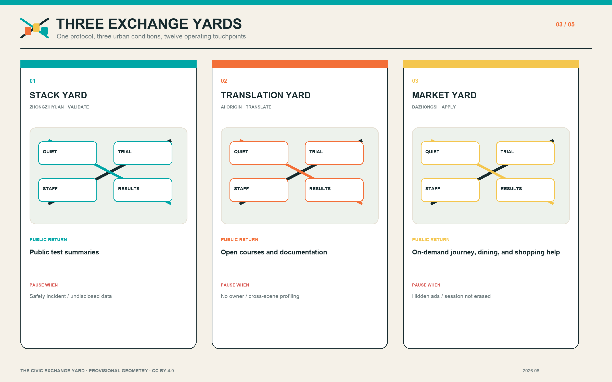
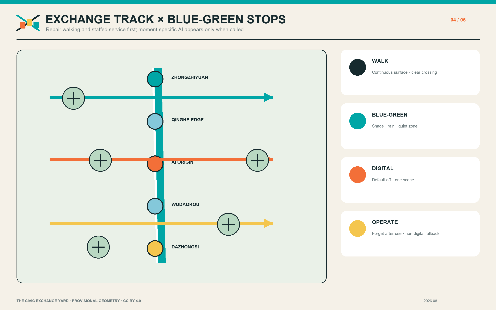
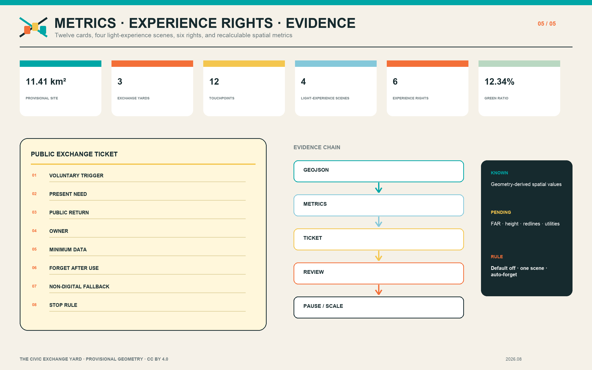

# THE CIVIC EXCHANGE YARD / 京张交换场

> The project does not line AI companies up along a corridor. It marshals research, products, civic questions, and public returns into a shared exchange yard. City AI stays quiet by default, appears when a person asks for it, gives a small and explainable answer to the present need, then leaves.

## Design Basis and Source List

The proposal takes the official open-call announcement as its task basis and uses `brief/site-package/`, `data/source_registry.json`, and `data/processed/agent_fact_pack.md` as its machine-readable working base [source:OFFICIAL-ANNOUNCEMENT] [source:SITE-PACKAGE] [source:SOURCE-REGISTRY]. The announcement identifies an approximately 43.6-square-kilometre coordinated research area, an approximately 11.4-square-kilometre overall design area, and three key areas: Zhongzhiyuan at 192.1 hectares, Beijing AI Origin Community at 104.3 hectares, and Dazhongsi at 72.0 hectares. The repository does not yet contain official polygons. This package therefore uses maintainer-registered provisional rough boundaries only for concept generation, spatial checking, and open-source discussion. They are not statutory redlines, ownership boundaries, or engineering set-out data [data:geometry/site_boundary.geojson#SITE-001] [data:geometry/key_areas.geojson#PROV-KEY-001].

Project tasks and urban-design administration follow the open-call and urban-design requirements [standard:PROJECT-OFFICIAL-ANNOUNCEMENT] [standard:PROJECT-AGENT-OPEN-CALL-TASKBOOK] [standard:MOHURD-URBAN-DESIGN-MEASURES]. Regulatory-plan-level representation and territorial land-use classification are checked separately [standard:MOHURD-CONTROL-DETAILED-PLANNING] [standard:MNR-LAND-USE-CLASSIFICATION-GUIDE]. External references are used only to compare mechanisms that make AI capacity testable, accessible, and accountable: AI Verify and the UK AISI for testing and safety governance; Mila, Maria 01, and Station F for research-community-enterprise organisation; and Barcelona Impulsa for a district-scale economic agenda. They provide no local control, investment commitment, or government endorsement. Missing statutory plans, building surveys, ownership, utilities, fire safety, heritage, and underground-space information remain explicit assumptions rather than guessed facts.

## Three-Level Scope Framework

The “exchange yard” translates railway marshalling into an urban method. Objects with different origins, destinations, and safety levels are identified, assembled, and routed through traceable switches. At the coordinated-research scale, the project asks how Haidian’s AI resources can share repeatable exchange rules. At the overall-design scale, it asks how those rules become a spatial network and public interface. At the three key areas, it tests how every exchange can be seen, used, challenged, and stopped. The three levels are therefore one evidence chain from industrial ecology to everyday experience and back to performance audit, not three disconnected drawing scales [depth:three_level_scope_framework] [depth:overall_spatial_structure].

The structure combines one Heritage Exchange Track, three exchange yards, four public spur types, and twelve exchange touchpoints. The track uses the Jingzhang Railway Heritage Park to organise continuous walking, history, and events. The yards are the Stack Yard at Zhongzhiyuan, the Translation Yard at AI Origin Community, and the Market Yard at Dazhongsi. Four spur types connect university research, enterprise products, neighbourhood needs, and international collaboration. Twelve touchpoints host testing, release, service, learning, rest, and appeal. Each touchpoint issues a Public Exchange Ticket that states the voluntary trigger, present need, public return, accountable owner, minimum data, purpose, retention, ban on cross-scene linking, non-digital fallback, and stop conditions. This turns an “industry belt” into an auditable reciprocal network rather than a series of similar campuses.

## Coordinated Research Area: Industry and Future City Research

The research layer introduces an operating question rather than another inaccurate boundary: once AI resources enter the district, do they generate a reusable public return? Universities and institutes contribute methods, people, and open outputs. Enterprises contribute products, services, and testing capacity. Neighbourhoods contribute concrete problems, user feedback, and public oversight. Civic platforms contribute compliant interfaces, public space, and long-term maintenance. An exchange is registered quarterly through combinations such as open courses, accessible service hours, public test summaries, reusable data documentation, shade and stormwater improvements, or supervised legal and health advice. Every return retains a responsible professional; an AI output does not replace professional judgement [depth:existing_conditions_diagnosis].

The innovation chain has six steps: research proposition, scenario matching, small trial, independent review, public return, and either replication or termination. The Stack Yard supports models, safety, standards, and edge devices. The Translation Yard converts university results into open components, small teams, and public learning. The Market Yard exposes agents, devices, content, and data services to real users around a transit interchange. The future urban form is therefore a field of frequent, small, accessible interfaces—open ground floors, station-park seams, managed evening sharing, low-threshold displays, clear privacy notices, and human service windows—rather than a monumental object or closed technology enclave.

### Light-Experience City: Moment-Specific AI and the Right to Experience

City AI does not require continuous recognition of residents. It becomes a light public capability that a person explicitly invokes at the place and moment of need, answers the immediate question, and exits when the task is done. For transit, it uses the current origin, destination, service, crowding, and accessibility choice to explain a route. For dining, it compares distance, wait, price, and dietary constraints only after a request. For shopping, it explains price, repair, returns, accessibility, and sponsorship. None of these services may automatically feed one session into another, disguise paid ranking as a public recommendation, or reduce basic service because a person declined data access [metric:light_experience_scenario_count].

The right to experience and the right to remain silent are equal. Six baseline rights are voluntary experience, silence, anonymous use, refusal, explanation, and session erasure. Operating rules are default-off service, one scene at a time, edge or anonymous aggregate processing where possible, a declared retention period, deletion after use, clear labels for commercial content, and a continuing non-digital route through signs, price boards, staffed windows, and ordinary ticketing. This is a design proposal that still needs legal, cyber-security, accessibility, transport-operator, and merchant review; it does not claim that current city systems already provide these capabilities [depth:municipal_new_infrastructure] [depth:risk_missing_data].

Five personas guide inclusion checks: open-source developers, start-up teams, enterprise visitors, university communities, and nearby residents. Space is assessed through three questions at once: What is the public return? What is the threshold to enter? Who remains accountable? Mila, Maria 01, and Station F offer organisational precedents; AI Verify and AISI show why testing needs explanation and human responsibility. These cases remain background references. Their suitability for Haidian depends on local law, operating capacity, and public participation.

## Overall Design Area: Urban Renewal and Regulatory-Plan-Level Urban Design

The overall design treats the provisional 11.4-square-kilometre boundary as a replaceable base and defines relational rules that can survive an official polygon update. The land-use layer describes innovation, service, open-space, and mixed functions while preserving closed, non-overlapping topology. The building layer represents proposed adaptation footprints only; it does not infer ownership, current condition, or demolition. The roads layer adds three east-west Exchange Spurs to the north-south track, corresponding to validation, translation, and urban application. Green-space, public-space, and phasing areas remain recalculable [data:geometry/land_use.geojson#LU-001] [data:geometry/buildings.geojson#BLDG-001] [data:geometry/roads.geojson#ROAD-001].

Regulatory-plan-level expression uses three states: known, proposed, and pending confirmation. Known items are limited to published scope statements, registered sources, and values recalculated from submitted geometry. Proposed items include open ground-floor interfaces, walking spurs, reversible fixtures, and an annual operating programme. Floor-area ratio, building height, density, setbacks, road redlines, utility capacity, fire safety, and flood control remain pending. They are not represented by invented precision [depth:land_use_layout] [depth:development_intensity_controls] [depth:height_massing_character]. The retain-renovate-demolish method becomes “operate first, adapt reversibly, deepen professionally”: test demand through hours and programmes, add reversible shade, signs, seating, and accessibility improvements, and discuss structural work only after surveys, ownership coordination, and professional review.

Capacity is not a single gross-floor-area number. It combines transport, public space, power, computing, evening management, and service staff. Each yard needs peak management, a staffed service point, and graceful system degradation. Each spur first addresses crossings, shade, continuous surfaces, and cycle parking. Submitted footprint area, green ratio, and public-space ratio are internal consistency checks only [metric:building_footprint_area_sqm] [metric:green_ratio] [metric:public_space_ratio]. The complete package must be recalculated when official boundaries arrive.

## Detailed Design of Key Areas

Zhongzhiyuan becomes the Stack Yard, organised around a green Qinghe interface and a bookable testing court. Its ground floor combines a safety-governance desk, edge-device benches, standards workshops, and a public results wall. Outdoors, movable canopies, rain gardens, and a low-speed test loop keep changes reversible. Enterprises receive a controlled test environment; the public receives accessible hours, concise test summaries, and a low-carbon public setting. A safety incident, unexplained data processing, or long-term occupation of public space triggers a pause. The provisional location is recorded at [data:geometry/key_areas.geojson#PROV-KEY-001]; exact limits and engineering conditions await official material.

Beijing AI Origin Community becomes the Translation Yard, with an Open-Source Street that connects campuses, innovation premises, and neighbourhoods. A result progresses through five steps: research explanation, reusable component, small-team trial, public course, and neighbourhood feedback. Ground floors provide an open release room, intellectual-property and legal guidance, shared team tables, and quiet study. Evening access is limited to independently manageable spaces. Public returns include courses, accessible documentation, and student-resident co-creation. Research data, campus access records, and face identity do not enter public demonstrations. The provisional location is [data:geometry/key_areas.geojson#PROV-KEY-002].

Dazhongsi becomes the Market Yard, using transit and commercial footfall to test agents, devices, digital content, and city services. Four-quadrant connection starts with signs, crossing wait, continuous accessibility, and legible entrances—not an assumed underground project. A Demo Living Room and Data Commons Desk provide staff, content grading, and withdrawal procedures. Dining, shopping, and interchange assistants open only for a user-triggered session, explain ranking and commercial content, and clear temporary preferences when the session ends. Public returns include convenience-service hours, quiet rest, reusable scenario reports, and training for local merchants. The provisional location is [data:geometry/key_areas.geojson#PROV-KEY-003]. Together, the yards describe function, buildings, mobility, public space, operation, and dependencies [depth:three_key_area_detailed_design] without claiming statutory detailed-plan status.

## AI Innovation Ecosystem, Personas, and AI+ Scenarios

Twelve scenario cards form three families. The validation family includes a model-safety sandbox, edge-device bench, open-standards workshop, and low-carbon computing explainer. The translation family includes an open-source release room, research-transfer desk, public learning carriage, and intellectual-property and data-compliance clinic. The light-experience family includes a moment-specific journey assistant, dining and neighbourhood-merchant assistant, shopping price-repair-return assistant, and public-safety and content review desk. Every card names its users, host space, voluntary trigger, minimum data, purpose, retention, ban on cross-scene linking, human owner, non-digital fallback, public return, and stop condition. Core tests are distributed across all three key areas, giving more than three industry test-and-validation settings. International demonstration and accessible-content exchange continue through the annual Exchange Week without depending on individual profiling.

The five personas are not profiles for predicting individuals; they are an inclusion checklist. Developers need publishable, collaborative, evening-capable places that do not disturb neighbours. Start-ups need affordable trials and compliance help. Enterprise visitors need transit, clear demonstrations, and international exchange. University communities need transfer, learning, and cross-campus collaboration. Residents need commuting, rest, professional services, and an appeal channel against automated decisions. No system may use these personas for individual commercial targeting. Aggregate usage records require retention limits and human review.

The Public Exchange Ticket, numbered CEY-01 to CEY-12, is the governance interface. It records the voluntary trigger, present need, public return, accountable owner, minimum data, purpose and retention, ban on cross-scene linking, accessibility check, complaint path, non-digital fallback, and quarterly review. A project may lose access to public space when it fails to deliver its return, uses undisclosed tracking or commercial ranking, cannot erase session data, repeatedly creates a safety incident, or has no owner. Civic agents may flag walking breaks, facility maintenance, enterprise-service matches, and event risks; they do not replace planning approval or professional medical, legal, and public-safety decisions. Complete cards and rights are recorded in `visual/assets/light_experience_protocol.json` and connect to public, green, and mobility data [data:geometry/public_space.geojson#PUBLIC-001] [data:geometry/green_space.geojson#GREEN-001].

## Land Use, Building Scale, and Retain-Renovate-Demolish Strategy

Land use follows three principles: continuity along the Exchange Track, mixed functions within each yard, and visible public returns. Research and enterprise services cluster around innovation resources; public service and open ground floors face walkable spurs; green and public spaces make all-weather stopping places. `land_use.geojson` uses the repository’s allowed classification fields and does not invent statutory categories. The drawing communicates relationships, not a completed land-use conversion. Official parcel limits, controls, and compatibility must be checked against a future statutory plan [standard:MNR-LAND-USE-CLASSIFICATION-GUIDE].

Buildings use three action classes. R means retain and open the interface: clear ground-floor obstructions, add an accessible entrance, and publish opening times. A means reversible adaptation: demountable canopies, shared furniture, temporary display, light roof planting, or an edge cabinet, all subject to structure, fire, and maintenance review. P means pending professional confirmation: structural change, extension, or use conversion begins only after measured survey, ownership, heritage, fire, and utility information is available. `buildings.geojson` is a design footprint, not an existing-building register or demolition decision [data:geometry/buildings.geojson#BLDG-001] [depth:retain_renovate_demolish].

Unknown total floor area, FAR, and height are not filled with guesses. The project instead uses interface checks that can be verified now: published opening hours, accessible entrances, staffed assistance, completed public returns, and controlled evening noise. When official conditions become available, the team must first recalculate boundaries and footprints, then test intensity, daylight, fire, traffic, and utility capacity. Any additional volume must demonstrate both its public return and infrastructure capacity; monumentality alone is not a justification.

## Transport, Rail, Municipal Infrastructure, and Public Services

Mobility combines a north-south Heritage Exchange Track with three east-west Exchange Spurs. The northern spur links Zhongzhiyuan, the Qinghe interface, and external transport. The middle spur stitches AI Origin Community to campus edges, Wudaokou, and the Qinghuadongluxikou direction. The southern spur links the four quadrants of Dazhongsi Station, enterprise entrances, and the heritage park. Early actions are continuous footways, legible crossings, shade, evening light, ramps, cycle parking, and warnings where walking and cycling conflict. Station integration is tested by whether a person can see an exchange-yard entrance within five minutes of leaving transit; no new station box or underground work is assumed [data:geometry/roads.geojson#ROAD-001] [depth:traffic_rail_slow_parking].

The journey assistant starts only after a scan, tap, spoken question, or explicit request from the user’s device. It combines the current origin, destination, transit service, crowding, slope, shade, and accessibility choice for one route. It does not continuously track devices, use face recognition, or connect journey data to dining or shopping recommendations. Temporary location and preference data are erased at session end. When data fails, signs, timetables, and staff retain the basic service. The public-safety operations review desk aggregates event capacity, equipment condition, and staff reports. Authorised people—not the model—decide interventions, and advice remains logged and correctable.

Municipal and digital infrastructure follows a “small, degradable, maintainable” rule. Edge-computing cabinets and displays appear only when power, heat, noise, cyber security, and ownership are resolved. Rain gardens, shade, drinking water, toilets, and seating are infrastructure equal in importance to screens. Where pipe, flood, fire, and power data are absent, the proposal identifies demand points without claiming engineering capacity [data:geometry/constraints.geojson#CONSTRAINTS] [depth:municipal_new_infrastructure].

## Blue-Green Network, Public Space, and Urban Character

The blue-green system treats the Jingzhang Railway Heritage Park as a civic living room, not the rear edge of an industry district. Its continuous path supports commuting, walking, cycling, and annual programmes. Qinghe and Xiaoyuehe-related interfaces prioritise tree shade, stormwater retention, sittable edges, and safe evening light. Every exchange yard has a Quiet Zone and a Trial Zone. The Quiet Zone protects everyday rest and accessible passage. The Trial Zone uses booking, time limits, and removable equipment so innovation does not displace basic public rights [data:geometry/green_space.geojson#GREEN-001] [data:geometry/public_space.geojson#PUBLIC-001] [depth:blue_green_public_space].

Public space is scheduled through Exchange Tickets. An enterprise or team receives test and display time and returns free services, open learning, scenario documentation, or environmental improvement. Neighbourhood questions receive a response record and an exit right. The operator publishes a named contact, noise limit, capacity, and restoration time. Every digital touchpoint also shows whether it is active, what it uses, how long it retains data, who is responsible, and how to leave. It stays silent when not called and preserves a route that completes the task without sensors or recommendations. The visual language abstracts durable railway equipment: Ink for structure, Signal Teal for open interfaces, Marshalling Orange for activity, and Ticket Yellow for public return. A mark of two crossing rails and three station tabs remains open at its edge, avoiding nostalgic imitation.

Three landmarks are useful interfaces rather than tall objects. The Public Results Wall at Zhongzhiyuan shows concise test outcomes. The Open Contribution Table at AI Origin Community makes reusable outputs visible. The Civic Application Board at Dazhongsi lists that day’s supervised services. Outdated information is removed. Milestones, marshalling, switches, and tickets connect railway history with contemporary AI, while protected logos, photographs, and unsupported heritage claims are excluded.

## Renewal Projects, Implementation Policy, and Phasing

The first 0–18 months focus on operating evidence and reversible adaptation: CEY-01 publishes calendars for the three yards; CEY-02 pilots the Exchange Ticket and light-experience protocol; CEY-03 audits breaks along the three walking spurs; CEY-04 installs three functional landmarks; and CEY-05 runs small trials for twelve scenario cards. Dependencies include space permission, event safety, accessibility review, data governance, and an identified maintainer. Quarterly reviews use anonymous aggregates for voluntary invocation, task completion, staffed hand-off, exit, complaint, erasure, pause, and recovery without building individual movement histories. A low-demand fixture or one that cannot demonstrate minimisation can be removed; a pilot is not automatically permanent.

From months 18–36, evidence and confirmed planning conditions may support ground-floor adaptation, blue-green stops, station-park stitching, and shared service rooms. The long-term layer is only a governance framework for cross-yard exchanges, an annual open week, public-return audit, and reusable documentation. Structural alteration, underground links, road engineering, and new buildings require separate professional design, approval, and public communication. This submission does not assign an investment budget, developer, or relocation programme [data:geometry/phasing.geojson#PHASE-001] [depth:renewal_project_list] [depth:phasing_implementation].

Operations use a triangle of Yard Steward, Professional Reviewer, and Public Observer. The steward maintains calendars and facilities. The reviewer owns specialist safety, legal, health, fire, or data decisions. Observers rotate among neighbourhoods, universities, and users. An annual Exchange Week is a public review linking the three yards, not a one-off festival. Failed trials are displayed alongside successes so that the next round can improve. Policy recommendations cover time-shared ground floors, conditional public-space testing, return registration, data-minimisation templates, and a transparent pause procedure.

## Metrics, Area Recalculation, and Compliance Matrix

Metrics fall into three groups: spatial base, operating performance, and pending controls. GeoJSON recalculates approximately 11,412,825 square metres in the provisional overall boundary, three key areas, and approximately 310,807 square metres of submitted building footprints [metric:site_area_sqm] [metric:key_area_count] [metric:building_footprint_area_sqm]. The same base produces a 12.34% green ratio and a 7.33% public-space ratio [metric:green_ratio] [metric:public_space_ratio]. These numbers check internal consistency only. Because the geometry is provisional, they do not replace announced or statutory measurements. Official polygons require a complete rerun of layers, PDFs, HTML, and inventories [depth:metrics_recalculation].

Operating fields are auditable but have no fabricated targets: four light-experience application scenes and six experience rights across the twelve touchpoints, plus active touchpoints, timely public returns, open hours, accessibility review, staffed response, complaint closure, session erasure, pause and recovery, and reuse of published material [metric:light_experience_scenario_count] [metric:experience_right_count]. The first two are design-coverage counts, not operating performance. Pending controls include FAR, height, density, road redlines, parking, utility capacity, fire safety, flood control, ownership, and heritage. They remain unknown or pending in `metrics.json` and `assumptions.json`.

`compliance_matrix.json` maps announcement clauses 1.3, 1.4, and 1.5 plus agent tasks 1–6 to text, geometry, metrics, drawings, HTML, sources, and checks. `standard_matrix.json` and `design_depth_matrix.json` audit professional evidence. Final review checks hashes, topology, static-HTML safety, and bilingual pairs. Figures summarise relationships; structured data remains the reference for numeric values.

## Risk, Copyright, and Compliance

The first risk is incomplete boundary and professional information: provisional rectangles are not parcels, roads, or ownership, and official data can change areas, overlaps, and project locations. The second is enterprise capture of public space, mitigated through booking, protected Quiet Zones, public returns, and pause rights. The third is technical error, information overload, and privacy intrusion, addressed through default-off service, explicit invocation, one scene at a time, minimisation, session erasure, commercial disclosure, named human responsibility, and graceful degradation; refusal may not become a service penalty. The fourth is operating cost and responsibility drift; every digital device needs maintenance, retirement, and a non-digital fallback. The fifth is innovation rhetoric overwhelming daily life; a resident issue log, accessibility review, and public quarterly review provide correction [depth:risk_missing_data].

All project text, diagrams, icons, HTML, drawings, and code-based graphics are original outputs of this AI-user collaboration. They use public or provisional repository data and contain no remote fonts, scripts, map tiles, tracking, enterprise logos, or uncleared photographs. External cases appear as attributed textual summaries and links; their images are not reproduced. Submission material is licensed CC BY 4.0, while repository inputs retain their own licences. See `report/copyright_statement.md` for the asset-by-asset statement.

The project makes no claim of statutory status, land rights, funding, or engineering feasibility. Transport, utilities, structures, fire, flood, heritage, data security, and public services require review by the relevant professionals and authorities. Chinese and English proposals, HTML pages, A3 booklets, A0 boards, and all five text-bearing figures are paired. If wording differs, reviewers should return to structured data and registered sources rather than silently granting authority to either language.

## References

Direct project sources are the open-call announcement, agent taskbook, repository site package, source registry, processed fact pack, professional standards matrix, and design-depth matrix [source:AGENT-TASKBOOK] [source:PROCESSED-FACT-PACK]. Data files include `geometry/site_boundary.geojson`, `geometry/key_areas.geojson`, `geometry/land_use.geojson`, `geometry/buildings.geojson`, `geometry/roads.geojson`, `geometry/green_space.geojson`, `geometry/public_space.geojson`, `geometry/constraints.geojson`, and `geometry/phasing.geojson`. Complete URLs, source types, use limits, and licences are recorded in `sources.json`.

Background cases are IMDA AI Verify, the UK AI Security Institute, Mila, Maria 01, Station F, and Barcelona Impulsa. Borrowing is limited to mechanisms for test governance, research communities, entrepreneurial campuses, partner programmes, and urban economic agendas. No case boundary, investment figure, graphic identity, or photograph is imported. Each link and use limit can be reviewed in the structured source list.

The recommended reading order is: this proposal and `assets/figures/site-overview.en.png` for the concept; `visual/index.en.html` for layers and Exchange Tickets; the English A3 booklet and A0 boards; then `metrics.json`, `compliance_matrix.json`, `standard_matrix.json`, `design_depth_matrix.json`, and `self_check.json` for structured audit. Derivation notes for provisional boundaries remain in the repository site package. Replacing them with official polygons requires data recalculation, not a cosmetic drawing edit.
