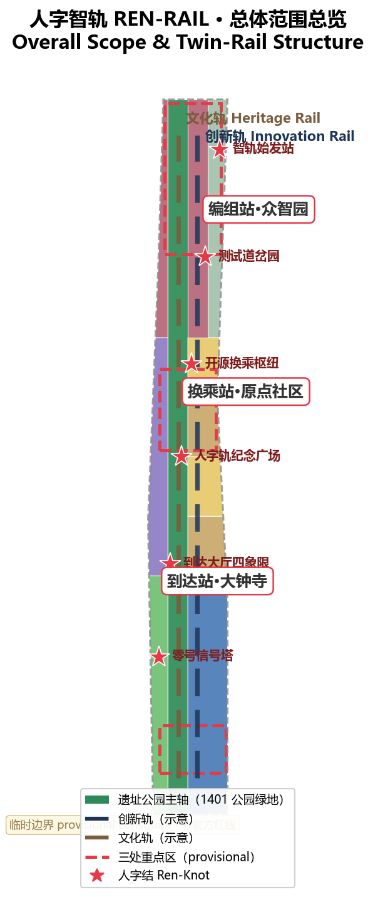
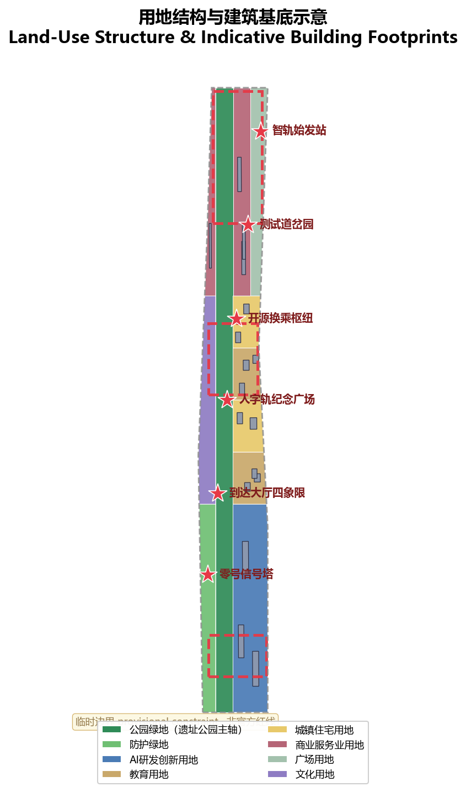
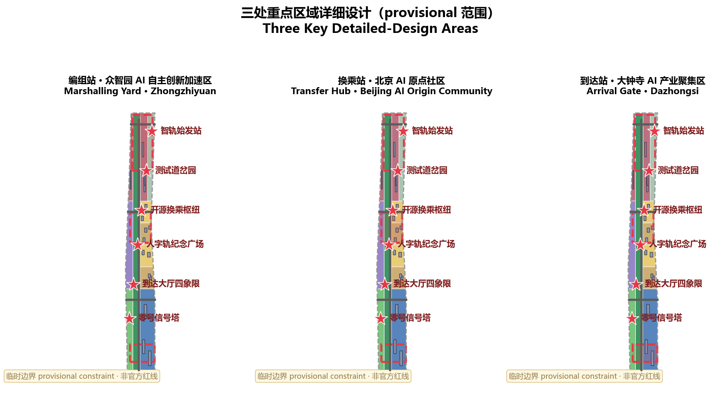
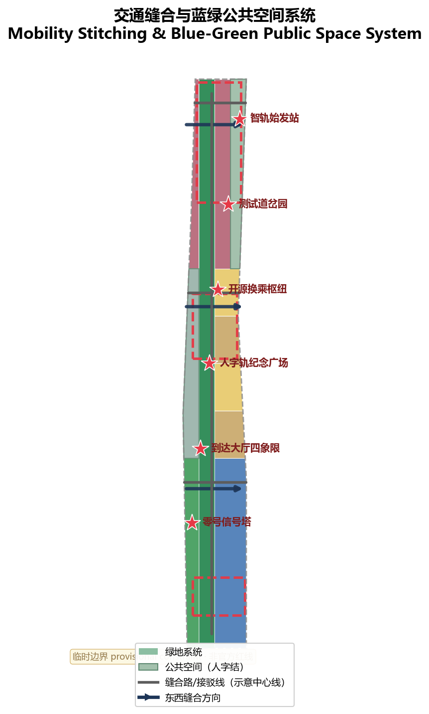
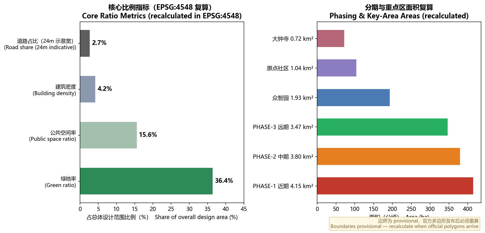

# 人字智轨 REN-RAIL：百年京张AI创新带总体概念与空间结构方案

> **一句话方案**：1909 年，詹天佑用"人"字形展线让火车翻越八达岭，那是中国人自主创新的第一轨；今天，本方案让这条百年铁轨生出一条新的"人"字双轨——**一条科技轨，一条人文轨，在每一个"人字结"交汇**，把京张遗址公园变成全球 AI 的策源地与朝圣地。

## 设计依据与资料清单

本方案以《百年京张AI创新带城市设计国际方案征集资格预审公告》（以下简称"公告"）为第一依据，以 `brief/site-package/` 中的设计任务书、临时粗略边界、重点区域、枚举、指标和来源清单为机器可读依据 [source:OFFICIAL-ANNOUNCEMENT] [source:AGENT-TASKBOOK]。AI 生成方案前已读取 `design_brief.json`、`allowed_design_space.json`、`sources.json`、`enums/`、`ranges/`、`schemas/` 与 `data/source_registry.json`，并用 `data/processed/agent_fact_pack.md` 建立任务、范围与资料缺口清单 [source:PROCESSED-FACT-PACK]。

资料使用边界如下 [source:SOURCE-REGISTRY]：

- `data/source_registry.json` 登记公开、清权与临时资料的用途边界；本方案未升级任何 background_only 或 provisional_only 资料为官方边界、法定控规或审批依据。
- 官方 `SITE_BOUNDARY` 与三处 `KEY_AREA` 精确多边形尚未发布，本方案按组织方要求使用 `brief/site-package/geometry/provisional_boundaries.geojson` 生成临时 formal 包 [source:BOUNDARY-SOURCE] [source:KEY-AREA-SOURCE]。
- 提交包内 `geometry/site_boundary.geojson`（SITE-001）与 `geometry/key_areas.geojson`（PROV-KEY-001/002/003）均标注为 `provisional_constraint`、`official_boundary=false`，仅用于方案生成、自检、可视化和设计讨论，不能作为 official redline、精确面积依据或法定控制结论。正式多边形发布后，所有图层与指标必须重算 [data:geometry/site_boundary.geojson#SITE-001] [data:geometry/key_areas.geojson#PROV-KEY-001] [metric:site_area_sqm]。

## 三层范围工作框架

方案按公告确定的三层范围组织：**统筹研究范围**（43.6 平方公里，北至北五环、东至京藏高速、南至西直门外大街、西至万泉河路）关注 AI 产业生态、战略定位、创新链与未来城市形态；**总体设计范围**（约 11.4 平方公里）关注京张遗址公园周边 1—2 公里城市地区与产业区，形成城市更新总体框架、产业空间布局、交通市政支撑与风貌控制；**重点区域范围**（368.4 公顷）聚焦众智园、北京 AI 原点社区、大钟寺三处详细设计地区 [depth:three_level_scope_framework] [standard:PROJECT-OFFICIAL-ANNOUNCEMENT]。三层范围在 `compliance_matrix.json` 中逐条映射，保证公告 1.3、1.4、1.5 与 agent.1—agent.6 必选任务均有章节、图层、指标、图纸与 HTML 证据。

| 层级 | 设计问题 | 方案回答 | 数据落点 |
| --- | --- | --- | --- |
| 统筹研究范围 | AI 产业生态与未来城市形态如何组织 | "高校策源—开源协作—全栈编组—场景试线—国际到达"的创新链 | compliance_matrix.json、standard_matrix.json |
| 总体设计范围 | 产业空间、城市更新、交通市政与风貌如何落图 | 人字双轨结构：文化轨（历史与公共空间）+ 创新轨（产业与场景），六个"人字结"交汇 | [data:geometry/land_use.geojson#LU-001]、[data:geometry/roads.geojson#ROAD-001] |
| 重点区域范围 | 三处片区如何达到详细设计深度 | 编组站（众智园）—换乘站（原点社区）—到达站（大钟寺）集群设计 | [data:geometry/key_areas.geojson#PROV-KEY-001]、[data:geometry/key_areas.geojson#PROV-KEY-002]、[data:geometry/key_areas.geojson#PROV-KEY-003] |

## 统筹研究范围产业与未来城市研究

### 总体概念、主名称与命名体系（agent.1）

本方案提出的总体概念为**「人字智轨」（REN-RAIL）**。1909 年詹天佑在八达岭独创"人"字形展线，用两台机车前拉后推翻越关沟，是中国人自主设计、自主建造干线铁路的标志性工程。本方案将"人"字转译为两种空间含义：**其一，"人"字左右两撇是两条平行的轨——科技轨与人文轨双轨并行，AI 创新与城市生活、全球开发者与本地居民永不脱轨；其二，"人"字的两撇在一处交汇——对应遗址公园"东西缝合、南北贯通"的空间动作，每一处交汇点即一座"人字结"公共空间**。该概念延续真实历史事实，命名体系与 Logo 方向均围绕这一符号展开，不照搬既有城市、园区或企业名称，不构成容积率、建筑高度、拆改留或工程实施结论 [source:AGENT-TASKBOOK] [standard:PROJECT-AGENT-OPEN-CALL-TASKBOOK]。

| 层级 | 名称 | 说明 |
| --- | --- | --- |
| 一带官方名 | 百年京张AI创新带（Centennial Jing-Zhang AI Innovation Belt） | 公告既定名称，作为法定工作对象 |
| 品牌概念名 | 人字智轨（REN-RAIL） | 面向全球的开发倡议与空间叙事品牌 |
| 三大定位带 | 文化轨（Heritage Rail）／生活轨（Life Rail）／创新轨（Innovation Rail） | 对应公告"百年京张文化带、都市AI生活体验带、AI融合创新带" |
| 五大功能信号 | 自主轨、生态轨、场景轨、活力轨、治理轨 | 对应"AI全栈自主创新体系、世界级AI创新生态、AI+场景赋能新范式、智能化AI活力城市、AI治理全球话语权"五项功能 |
| 三区 | 编组站（众智园）／换乘站（原点社区）／到达站（大钟寺） | 铁路隐喻下的片区功能分工 |
| 两翼 | 信号所（中关村科技服务翼）／试线场（小月河场景赋能翼） | 要素配置与场景实测的支撑系统 |

**Logo 与视觉识别方向**：核心图形为"人"字双轨交汇符号——两条不同材质的轨线在一点交汇并向上展开，象征汇聚、换乘与上行；颜色建议以**京张铸铁黑 + 京张红（历史轨）**与**AI 青蓝（科技轨）**构成双色体系；中文字标"人字智轨"与英文字标"REN-RAIL"并行使用；衍生符号家族包括站名碑、信号灯、时刻表卡、道岔箭头、人字结徽章，供导视系统与文化产品延展 [depth:overall_spatial_structure]。

**三区两翼协同回路**：编组站（众智园）承担全栈自主创新与标准治理的"总装"职能；换乘站（原点社区）承担高校人才、开源成果与资本的"换乘"职能；到达站（大钟寺）承担智能新业态与全球访客的"到达与出发"职能；信号所（中关村科技服务翼）提供要素全球化配置、中关村 IP 与资本赋能；试线场（小月河场景赋能翼）提供真实环境实测与场景开放——形成"**编组→试线→到达→反馈编组**"的闭环回路（agent.1 要求的三区两翼协同回路）。

### 世界级 AI 创新生态：5—8 个全球案例与生态图谱（agent.2）

统筹研究范围的核心任务是构建世界级 AI 创新生态体系。本方案研究以下全球案例，提取可迁移机制并落到海淀空间：

| 案例 | 可迁移机制 | 海淀空间转化 |
| --- | --- | --- |
| 美国硅谷—斯坦福研究园走廊 | 大学专利-产业-风险资本走廊、源头论文与人才外溢 | AI原点社区近校孵化、成果转化街 |
| 美国波士顿 Kendall Square | 生命科学与 AI 集聚、跨铁路/高速缝合与 TOD | 大钟寺站四象限步行连通、多站一体化 |
| 英国伦敦 King's Cross Knowledge Quarter | 铁路工业遗产更新为科创与公共文化区 | 京张遗址公园主轴活化、文化轨建设 |
| 新加坡 one-north 纬壹科技城 | 政府-资本-人才协同、全生命周期人才服务 | 人才特区、国际人才服务节点 |
| 以色列特拉维夫创业走廊 | 社区型加速器网络、24 小时城市活力 | 夜间活力场景、社区创新节点 |
| 中国深圳粤海街道 | 龙头企业-供应链-硬件生态闭环 | 大钟寺智能终端与智能体新业态 |
| 中国杭州城西科创大走廊 | 平台企业场景开放、产业数字生态 | 场景开放机制、AI+生活样板 |
| 中关村自身四十年演化 | 开源、标准、治理话语权的中关村经验 | 治理轨、全球 AI 治理对话平台 |

**AI 创新生态图谱（八要素机制）**：生态围绕"土地、空间、产业、资金、人才、算力、数据、场景"八类要素组织，与全栈创新链（基础层—框架层—模型层—应用层—治理层）形成空间映射：众智园承载基础层与模型层（算力、评测、标准），原点社区承载框架层与开源生态（人才、成果、资金），大钟寺承载应用层与智能终端（场景、数据、内容），两翼提供资本、数据要素与真实场景支持。上述机制均为概念建议，不构成招商承诺、投资安排或财政承诺 [source:AGENT-TASKBOOK] [depth:metrics_recalculation]。

### 未来城市形态研究

未来城市形态研究回答"AI 如何改变工作、生活、社交、学习、交通与公共服务"。本方案提出三个判断并落实为空间：**其一，AI 将从"工具"变为"公共环境"**——沿遗址公园布置可感知、可验证、可关闭的 AI 公共服务场景；**其二，创新将发生在步行半径内**——以人字结为中心组织 15 分钟创新生活圈；**其三，治理将变为可见的公共物品**——信号灯式治理显示进入公共空间。所有判断以可定位的功能区、节点、廊道与场景表达，不泛化技术愿景，不将运营愿景写成审定条件 [depth:existing_conditions_diagnosis] [standard:MOHURD-URBAN-DESIGN-MEASURES]。

## 总体设计范围城市更新与控规深度城市设计

### 人字双轨空间结构

总体设计范围的空间结构为"**一带双轨、六结四横**"：

- **一带**：京张遗址公园主轴（文化轨），即 `land_use.geojson` 中的 1401 公园绿地纵向带，串联从清华园车站到大钟寺的历史序列 [data:geometry/land_use.geojson#LU-001]；
- **双轨**：主轴西侧的创新轨——由研发、教育、居住、商业用地构成的产业与生活复合带 [data:geometry/land_use.geojson#LU-002]；
- **六结**：沿主轴布置六处"人字结"公共空间节点（详见重点区域与公共空间章节），由 `public_space.geojson` 表达 [data:geometry/public_space.geojson#PUBLIC-001]；
- **四横**：四条东西向缝合路（示意中心线见 `roads.geojson`），把被铁路割裂的城市东西两侧重新联通 [data:geometry/roads.geojson#ROAD-001]。

该结构落实"东西缝合、南北贯通"策略：结构性慢行连接覆盖三处重点区及沿线高校、社区、轨道站点，把公告提出的轨道站点一体化、道路微循环、慢行断点与对外交通要求组织为一条可检查的链 [depth:overall_spatial_structure] [depth:traffic_rail_slow_parking]。

## 用地、建筑规模与拆改留方案

`geometry/land_use.geojson` 以网格拓扑切分提交边界，用地完整覆盖、无缝无重叠（union 与边界面积差约 1.6e-06，即浮点精度量级），分类采用 `enums/land_use_codes.json` 登记代码，不做自造分类：1401 公园绿地（遗址公园主轴）、0802 AI研发创新用地（众智园）、0804 教育用地与 0701 城镇住宅用地（原点社区）、05 商业服务业用地与 1403 广场用地（大钟寺）、1402 防护绿地与 0803 文化用地（两翼沿线）[standard:MNR-LAND-USE-CLASSIFICATION-GUIDE] [data:geometry/land_use.geojson#LU-001] [metric:land_use_1401_area_sqm]。

`geometry/buildings.geojson` 表达概念性建筑基底（研发办公、居住、商业办公、教育科研四类示意基底 17 处），明确为"待确认"状态：现状建筑、权属、控规与工程条件均未在场地包内提供，因此**本方案不给出拆改留结论**，仅提出分类方法（保留历史与文保对象、改造低效空间、更新待开发地块、新建仅限概念示意），并列为正式深化前置条件 [depth:retain_renovate_demolish] [metric:building_footprint_area_sqm]。总建筑规模、容积率、建筑高度、建筑密度与退线均无官方审定条件，统一按 `status=unknown` 处理，待正式控规数据补齐后复算 [data:geometry/buildings.geojson#BLDG-001] [metric:floor_area_ratio]。

## 重点区域详细设计

三处重点区域按"铁路三站"集群设计，均达到规划综合实施方案的概念深度，逐项引用关键区图层，不重复"打造示范区"式空话 [depth:three_key_area_detailed_design] [data:geometry/key_areas.geojson#PROV-KEY-001]。

### 编组站·众智园AI自主创新加速区（约 192.1 公顷）

**设计定位**：花园型全栈自主创新编组站——把 AI 产业链的"编组"（模型研发、算力调度、评测认证、标准制定）组织成可参观、可参与的公共空间场景。**空间动作**：以清河界面与创新轨西侧用地组织 0802 研发用地组团，强化南北贯通；沿清河设低碳创新廊；在片区中段设"编组场·算力测试基地"（测试验证场景）与"检修库·AI 体检站"。**AI 产业与运营场景**：自主模型测试、标准制定工作坊、安全治理展示、低碳算力体验 [depth:three_key_area_detailed_design] [data:geometry/green_space.geojson#GREEN-001]。

### 换乘站·北京AI原点社区（约 104.3 公顷）

**设计定位**：近校型开源换乘枢纽——让高校人才、开源成果与资本在步行尺度内"换乘"。**空间动作**：在 0804 教育用地与 0701 居住用地之间加密校区—园区—街区慢行缝合，设"调车场·开源协作工坊"与"时刻表·服务对时站"；补足成果发布、人才服务、居住生活配套。**AI 产业与运营场景**：开源社区、成果发布、人才特区服务、近校孵化 [source:AGENT-TASKBOOK] [data:geometry/key_areas.geojson#PROV-KEY-002]。

### 到达站·大钟寺AI产业聚集区（约 72.0 公顷）

**设计定位**：城市型智能经济与国际交往到达大厅。**空间动作**：围绕大钟寺站一体化组织四象限步行连通（"到达大厅·四象限缝合"），以 05 商业用地与 1403 广场用地承载智能原生消费与商务场景；设"站台·成果发布台""票务厅·数据要素受理窗"。**AI 产业与运营场景**：智能体与智能终端展示、内容消费、数据要素与国际路演 [metric:key_area_count] [data:geometry/key_areas.geojson#PROV-KEY-003]。

## AI 创新生态、人才画像与 AI+ 场景

### 用户画像（5 类）

| 画像 | 典型需求 | 空间响应 | 自检边界 |
| --- | --- | --- | --- |
| 全球开源开发者 | 贡献、协作、测试、荣誉、朝圣 | 原点社区开源发布厅、人字轨纪念广场荣誉墙、夜间协作空间 | 不采集个人行为轨迹；社区贡献数据仅聚合统计 |
| 高校师生与科研团队 | 成果转化、跨校协作、日常慢行 | 校区-园区缝合、成果转化街、AI 教育体验点 | 校园与科研成果数据需授权 |
| 初创团队与连续创业者 | 低成本办公、算力入口、产品试验场 | 众智园共享测试场、端侧算力驿站、标准治理咨询 | 算力与数据服务需另行授权 |
| 头部企业高管与全球访客 | 展示、商务、国际接待、人才招聘 | 大钟寺国际路演客厅、到达大厅四象限、企业周边公共空间 | 企业标识与案例须清权 |
| 周边居民与家庭 | 通勤、休闲、社区服务、低扰动更新 | 遗址公园慢行环、社区 AI 驿站、无障碍通道 | 不将居民画像用于商业推荐；未成年数据不采集 |

### AI 场景卡（12 张，≥10 张要求）

| 场景卡 | 空间载体 | 设计说明 | 数据/治理边界 |
| --- | --- | --- | --- |
| 01 候车亭·社区AI驿站 | 居住用地节点 | 社区级 AI 服务查询与应急呼叫，融入候车亭形态 | 匿名化；人工兜底 |
| 02 道岔·场景切换站 | 大钟寺广场 | 一空间多场景演示，公众决定"道岔"指向 | 场景加载须可回溯 |
| 03 信号灯·治理可见屏 | 人字结节点 | 展示每个 AI 服务的用途、数据责任人、运行状态与停止开关 | 公开可复核（治理轨） |
| 04 车厢·移动实验室 | 小月河试线场 | 低速自动驾驶/配送试运行观察线（测试验证场景 1） | 封闭路段；人工接管位 |
| 05 时刻表·服务对时站 | 原点社区 | AI 服务运行时刻表与人工复核登记（对时制度） | 误点记录公开 |
| 06 站台·成果发布台 | 大钟寺到达厅 | 企业与团队成果发布、路演、媒体见面 | 内容审核与清权 |
| 07 编组场·算力测试基地 | 众智园 | 模型训练、评测、红队测试展示（测试验证场景 2） | 评测数据脱敏 |
| 08 调车场·开源协作工坊 | 原点社区 | 开发者协作、Hackathon、代码评审岛 | 开源许可合规 |
| 09 检修库·AI体检站 | 众智园 | 面向企业与市民的 AI 合规体检与安全评测（测试验证场景 3） | 评测结论人工复核 |
| 10 票务厅·数据要素受理窗 | 大钟寺 | 数据要素合规流通与数字资产服务界面 | 授权与审计留痕 |
| 11 检票闸机·无障碍通道 | 遗址公园/社区 | AI 无障碍、适老化服务试点 | 不采集特殊人群身份信息 |
| 12 驾驶舱·城市智能运营中心 | 零号信号塔 | 城市 AI 运行看板公开观摩、可旁听可中止 | 治理透明，人工终决 |

全部场景遵循数据最小化、公开来源、可解释与人工复核原则：AI 可辅助识别慢行断点、公共空间热力、设施维护与服务需求，但不能替代规划审批、不输出未经授权的个人画像、不声称获得官方实施承诺 [source:AGENT-TASKBOOK] [depth:risk_missing_data]。场景-空间-运营映射与隐私边界详见视觉页任务覆盖区。

## 交通、轨道、市政与公共服务设施

**交通**：以"四横一纵"示意骨架表达站点接驳与缝合关系——四条东西缝合路连接遗址公园两侧城区，一条纵向接驳线串联三站片区与沿线轨道站点；道路中心线仅为概念示意，不代表道路红线 [data:geometry/roads.geojson#ROAD-001] [metric:road_centerline_length_km]。慢行系统以主轴公园道与东西缝合路优先过街节点为骨架，重点覆盖五道口、清华东路西口、大钟寺站及京张遗址公园跨环路节点，具体断点缝合方案待正式道路红线与交通组织确认 [depth:traffic_rail_slow_parking]。

**市政与新型基础设施**：提出端侧算力驿站、分布式能源与 AI 公共服务设施三类新基建原型布置原则（详见场景卡 01/07/12），管线、能源、排水、防洪与消防工程条件缺失，全部列为正式深化前置条件 [depth:municipal_new_infrastructure] [data:geometry/constraints.geojson#CON-001]。

## 蓝绿空间、公共空间与城市风貌

### 蓝绿系统

蓝绿空间以遗址公园主轴为骨架：1401 公园绿地构成南北贯通的文化轨（约 323.7 公顷），1402 防护绿地沿西侧界面设置，清河（北段）与小月河（南段）界面预留滨水慢行与生态廊道；绿地率复算约 36.4%，公共空间率约 15.6%，均从提交几何在 EPSG:4548 下复算 [metric:green_ratio] [metric:public_space_ratio] [data:geometry/green_space.geojson#GREEN-001]。

### 人字结公共空间体系

沿主轴布置六处"人字结"（Ren-Knot）公共空间，每处为科技轨与人文轨的交汇点：北端智轨始发站、众智园测试道岔园、原点社区开源换乘枢纽、**人字轨纪念广场**、大钟寺到达大厅四象限、南端**零号信号塔**。每处人字结按"展示—体验—治理—运营"四要素配置组件库：展示屏、体验装置、治理信号灯、运营服务亭，作为可复制、可组合的公共空间组件库原型 [depth:blue_green_public_space] [data:geometry/public_space.geojson#PUBLIC-001]。

### AI 朝圣地标（3 个）

1. **人字轨纪念广场（Ren-Rail Memorial Plaza）**：以 1:1 比例艺术再现八达岭人字形展线，双轨交汇处设"智能体贡献荣誉墙"与"全球开发者荣誉墙"，入选方案与贡献者以碑刻形式留名——即公告所设永久纪念体系的空间落位；
2. **零号信号塔（Signal Zero Tower）**：把"谁在调度 AI"变成可见的公共事物——实时显示 AI 服务运行状态，可旁听、可中止，是治理轨的标志性地标；
3. **开源成果展示廊（Open Source Gallery）**：编组站博物馆式空间，承载开源成果展示、AI 里程碑廊道与每年碑刻仪式 [source:AGENT-TASKBOOK] [depth:three_key_area_detailed_design]。

地标设计避免过度娱乐化与网红化，全部空间结论为概念建议，可被专业团队深化 [standard:MOHURD-URBAN-DESIGN-MEASURES]。

### 城市风貌与文化叙事（agent.5）

文化叙事以"**三次自主创新加速**"为结构：**1909 造路**（人字轨，把国家引向自主创新）→ **1990s—2010s 造芯造软件**（中关村，把产业建在自主创新上）→ **今天造智**（AI，把海淀变成全球 AI 策源地与朝圣地）。中心句为"**人字不变：以人为尺，双轨并行**"。

导视与符号系统方向：以铁路语汇统一全带标识——站名碑（片区入口）、信号灯（AI 服务治理标识）、时刻表卡（活动与服务信息）、道岔箭头（路径指引）；文化符号系统与一带品牌 Logo 系统分层管理，不混用 [source:AGENT-TASKBOOK]。国际传播叙事建议：*"China's first rail of self-reliance becomes the world's rail of intelligence"*（中国自主创新的第一轨道，成为世界智能化的第二轨道）；品牌口号：*REN-RAIL: where AI meets people*。已保留清华园车站等历史资源作为文化轨节点，具体文保与风貌控制待官方文保条件确认 [depth:height_massing_character]。

## 更新项目清单、实施政策与分期计划

| 编号 | 项目名称 | 类型 | 主要依赖 | 证据 |
| --- | --- | --- | --- | --- |
| JZ-01 | 遗址公园主轴慢行贯通与人字结建设 | 公共空间/慢行 | 道路红线、桥下空间、文保条件 | [data:geometry/green_space.geojson#GREEN-001] |
| JZ-02 | 人字轨纪念广场与开发者荣誉墙 | 地标/文化 | 公园用地、碑刻工程、版权清权 | [data:geometry/public_space.geojson#PUBLIC-001] |
| JZ-03 | 零号信号塔与城市智能运营中心 | 新基建/治理 | 能源、算力、运营主体 | [data:geometry/constraints.geojson#CON-001] |
| JZ-04 | 开源成果展示廊（编组站博物馆） | 文化/产业展示 | 权属、首层业态、运营主体 | [data:geometry/buildings.geojson#BLDG-001] |
| JZ-05 | 众智园编组站更新与清河创新界面 | 城市更新/产业 | 清河蓝线、防洪、控规条件 | [data:geometry/key_areas.geojson#PROV-KEY-001] |
| JZ-06 | 原点社区开源换乘枢纽与成果转化街 | 城市更新/产业服务 | 校区边界、权属、首层业态 | [data:geometry/key_areas.geojson#PROV-KEY-002] |
| JZ-07 | 大钟寺到达大厅四象限步行连通 | 轨道一体化/慢行 | 轨道站点、交叉口、管线 | [data:geometry/key_areas.geojson#PROV-KEY-003] |
| JZ-08 | 小月河试线场与京张国际人工智能节主场 | 运营/活动 | 公共空间许可、活动安全、版权 | [data:geometry/phasing.geojson#PHASE-1] |

**分期**（`geometry/phasing.geojson`，三期面积复算约 414.9 万、379.8 万、346.6 万平方米）：**PHASE-1 近期（2026—2028）**：主轴慢行贯通、人字结与人字轨纪念广场先行，同步启动京张国际人工智能节等轻量运营；**PHASE-2 中期（2028—2031）**：三站片区更新、测试验证场景与场景开放运营；**PHASE-3 远期（2031—2035）**：全域 AI 生态、治理轨与国际运营闭环。实施政策建议覆盖城市更新统筹、空间供给、运营机制、产业服务、公共参与、数据治理与产权协同；权属、资金、实施主体与审批路径未确认事项列为实施风险，不承诺落地 [depth:phasing_implementation] [depth:renewal_project_list]。

### 全球 AI 创新活动体系与长期运营（agent.6）

- **年度旗舰**：京张国际人工智能节（JZ AI Festival）——全球开发者朝圣季，含全球 AI 路演赛、成果发布周、开源贡献碑刻仪式（年度最杰出贡献刻碑）；
- **季度**：人字轨开发者日（Ren-Rail Developer Day）——开源协作工坊与代码评审岛开放；
- **月度**："对表日"（AI 服务合规公开对时）与"场景开放日"（Open Track Day，试线场实测开放）；
- **品牌与社区**：REN-RAIL 品牌 IP 体系（徽章、纪念票、数字藏品），开发者社区以"贡献→积分→算力券/路演席位/荣誉墙版刻"形成转化闭环；国际招引通过越洋路演、赛事联动与青年人才计划实现；
- 以上均为概念建议与拟议机制，不构成确定的政府活动、招商承诺或财政安排 [source:AGENT-TASKBOOK] [standard:PROJECT-AGENT-OPEN-CALL-TASKBOOK]。

## 指标体系、面积复算与合规矩阵

指标体系分三类管理：**空间指标**（可直接从提交几何复算）：边界面积约 1141.3 公顷、绿地率 36.4%、公共空间率 15.6%、建筑基底约 48.0 公顷、道路中心线约 12.7 公里、三处分期面积、重点区数量 3 处 [metric:site_area_sqm] [metric:building_density_ratio]；**管控指标**（待官方条件）：容积率、建筑高度、建筑密度、退线、道路红线等按 `status=unknown` 管理，待正式控规数据补齐后复算 [metric:floor_area_ratio]；**绩效指标**（待运营校准）：AI 创新指数、人才密度、场景使用频次、活动参与度等进入合规矩阵跟踪。完整公式、来源文件与置信度见 `metrics.json` [depth:metrics_recalculation] [data:geometry/site_boundary.geojson#SITE-001]。

合规矩阵共 23 条：公告 1.3/1.4/1.5 全部任务与 agent.1—agent.6 六项任务逐条映射章节、图层、指标、图纸与 HTML 页面，未覆盖任何必选任务 [depth:risk_missing_data]。图件与文本的关系图、指标复算证据图见下：

## 风险、版权与合规说明

- **双语言**：本包以中文为主文件，`proposal.en.md` 提供完整对照译文；A3/A0 图纸、离线 HTML 与含文字图件均提供中英双语版本，术语参考 `docs/terminology-glossary.md`。
- **边界风险**：全部空间结论基于 provisional geometry，官方边界与重点区多边形发布后必须完整重算；precision 敏感指标（面积、比例、长度）不得用于正式评分外的任何官方用途 [source:BOUNDARY-SOURCE]。
- **数据与版权**：所有来源、许可与授权状态登记于 `sources.json` 与 `report/copyright_statement.md`；全球案例仅作机制借鉴，未引入未授权图像、商标、肖像；HTML 为纯离线静态页，不加载远程资源。
- **法定边界**：本方案为 AI 智能体生成的开放共创建议，不替代正式规划，不构成政府审定结论；所有空间落地建议表述为"概念建议""参考方案""可供专业团队深化研究" [source:AGENT-TASKBOOK] [depth:risk_missing_data]。

## 参考资料

- brief/public-brief.md、brief/site-package/design_brief.json、brief/site-package/agent_taskbook.json
- brief/site-package/allowed_design_space.json、brief/site-package/enums/、brief/site-package/ranges/planning_limits.json
- brief/site-package/geometry/provisional_boundaries.geojson
- data/processed/agent_fact_pack.md、data/source_registry.json
- 完整机器索引：`sources.json` [source:SOURCE-REGISTRY]、`metrics.json` [metric:site_area_sqm]、`compliance_matrix.json`、`standard_matrix.json`、`design_depth_matrix.json` [source:AGENT-TASKBOOK]