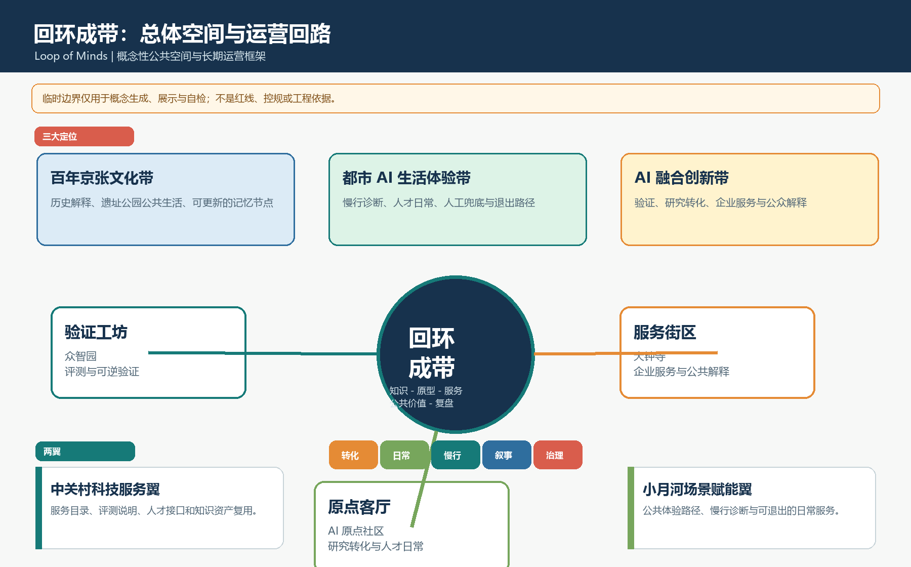
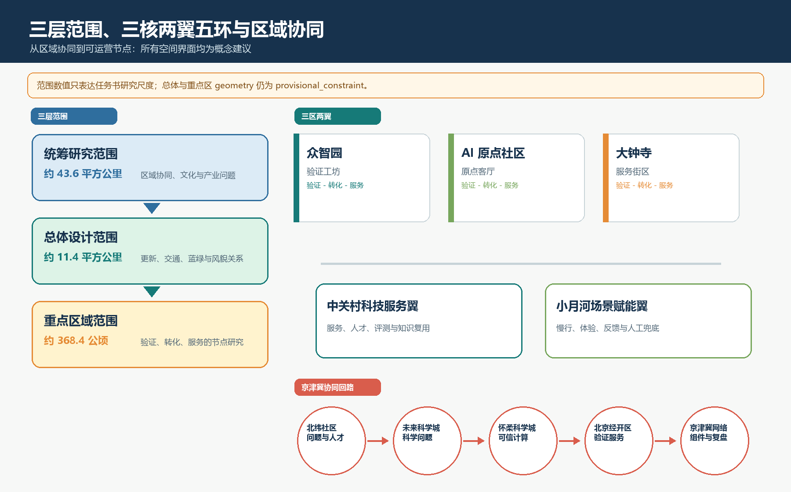
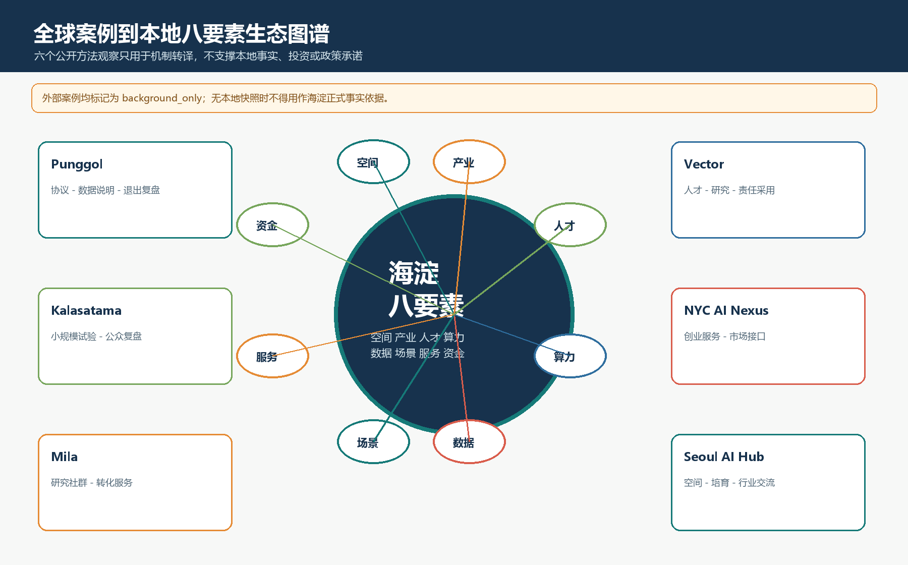
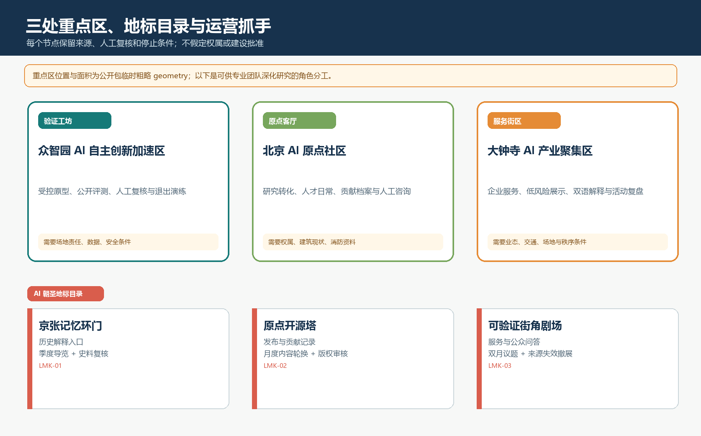
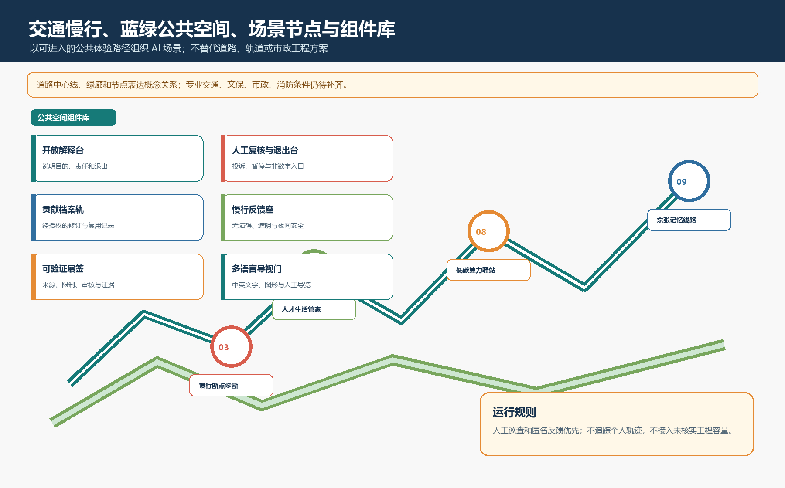
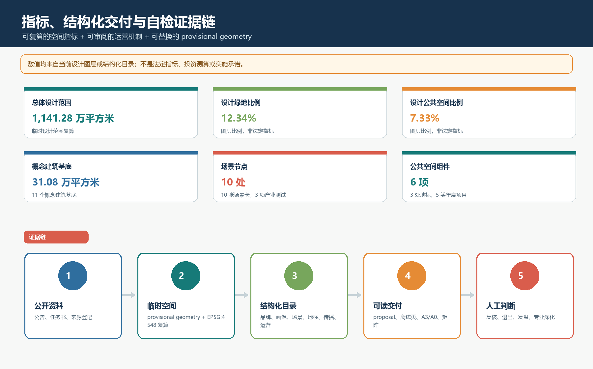

# 回环成带：京张百年线上的 AI 原生公共生活

> 英文主名称 / Master Name：Loop of Minds — Centennial Jing-Zhang AI Commons Belt。
> 本方案是公开共创建议和概念性研究成果，不替代法定规划、工程设计、政府审定、投资承诺或活动批准。所有空间、运营和协同建议均为“概念建议”“参考方案”“可供专业团队深化研究”。

## 设计依据与资料清单

本包的设计方法是“先证据、后形式、再运营”：先登记公开资料、空间精度和不可作出的判断；再让 GeoJSON、指标与图纸共同表达空间关系；最后以人工复核、退出条件、复盘和知识复用组织长期运营。方案不把临时边界升级为官方红线，也不把活动、招商、资金或跨区域合作写成已确定安排。

权威来源与用途边界见 [source:OFFICIAL-ANNOUNCEMENT]、[source:AGENT-TASKBOOK]、[source:SITE-PACKAGE]、[source:SOURCE-REGISTRY]、[source:PROCESSED-FACT-PACK]、[source:BOUNDARY-SOURCE]、[source:KEY-AREA-SOURCE]。其中 data/processed/agent_fact_pack.md 只作资料导航；项目事实仍回到公告、任务书与来源注册表。BOUNDARY-SOURCE 和 KEY-AREA-SOURCE 只支持临时生成、展示与 intake 自检，官方或清权 polygon 到位后必须替换全部设计图层并复算指标。

本包新增六份可复核的结构化交付：visual/assets/brand_identity.json、visual/assets/personas.json、visual/assets/scenario_operations.json、visual/assets/public_realm_catalog.json、visual/assets/cultural_communication.json、visual/assets/annual_operations.json。它们分别承担命名与协同、用户画像、场景运营、地标与组件、文化传播、年度运营的机器可读证据职责。

## 三层范围工作框架

统筹研究范围以公告文字约 43.6 平方公里为战略研究尺度，回答创新带如何形成文化、产业、人才与公共价值的协同；总体设计范围以公告文字约 11.4 平方公里为城市设计尺度，回答京张遗址公园周边更新、交通、市政、蓝绿与风貌如何成网；三处重点区约 368.4 公顷为详细设计研究尺度，回答众智园、北京 AI 原点社区、大钟寺如何分别承接验证、转化与服务。三层是“区域协同—空间组织—可运营节点”的同一条证据链，而不是三套互不相干的图纸。[standard:PROJECT-OFFICIAL-ANNOUNCEMENT] [depth:three_level_scope_framework]

总体设计边界与三处重点区均为公开包提供的临时粗略 geometry，已在 [data:geometry/site_boundary.geojson#SITE-001] 与 [data:geometry/key_areas.geojson#PROV-KEY-001]、[data:geometry/key_areas.geojson#PROV-KEY-002]、[data:geometry/key_areas.geojson#PROV-KEY-003] 中标注 provisional_constraint。当前总体图层复算为 [metric:site_area_sqm]，只用于概念讨论、自检与后续替换，不是审批或精确面积依据。

### Agent.1：三大定位、命名体系与区域协同

本方案明确以三大定位统领空间与运营：

| 三大定位 | 具体空间翻译 | 可复核结构化证据 |
|---|---|---|
| **百年京张文化带** | 京张记忆线路、遗址公园公共空间、京张记忆环门与可更新的历史解释节点。 | visual/assets/brand_identity.json#POSITION-01；visual/assets/cultural_communication.json#NARRATIVE-01；[data:geometry/public_space.geojson#NODE-09] |
| **都市 AI 生活体验带** | 小月河场景赋能翼、慢行断点诊断、人才日常触点、可进入的人工服务与退出路径。 | visual/assets/brand_identity.json#POSITION-02；visual/assets/scenario_operations.json#SCN-03；[data:geometry/constraints.geojson#ZONE-02] |
| **AI 融合创新带** | 众智园验证工坊、AI 原点社区转化客厅、大钟寺服务街区与中关村科技服务翼。 | visual/assets/brand_identity.json#POSITION-03；visual/assets/scenario_operations.json#SCN-02；[data:geometry/constraints.geojson#ZONE-01] |

命名体系以“回环成带 / Loop of Minds”为主名称，以“验证工坊、原点客厅、服务街区”为三核，以“中关村科技服务翼、小月河场景赋能翼”为两翼，以“创新转化、人才日常、蓝绿慢行、文化叙事、可信治理”为五环。地标采用“记忆动作 + 开放能力 + 空间类型”的逻辑，不申请或替代法定地名。Logo 方向为断续铁路线与未闭合环叠合：线表示京张记忆，开口表示公众进入、质疑、退出与共同修订的权利。完整品牌、色彩和命名规则见 visual/assets/brand_identity.json。[source:AGENT-TASKBOOK] [standard:PROJECT-AGENT-OPEN-CALL-TASKBOOK] [depth:overall_spatial_structure]

区域协同采用“问题、方法、组件、复盘”四类开放接口：面向北纬社区、未来科学城、怀柔科学城、北京经济技术开发区及京津冀创新网络，分别提出问题清单、科学计算/数据说明、产业验证服务包和跨城开发者协作的概念接口。它们不假定已有合作、资金、场地或政策，而是在责任人与资料边界明确时才可进入开放挑战和小试。具体节点与禁止承诺见 visual/assets/brand_identity.json#regional_synergy。

## 统筹研究范围产业与未来城市研究

“回环成带”的经济逻辑不是新增一个封闭园区，而是缩短“知识—原型—服务—公共价值—复盘”的距离：高校和开源社区提出问题，众智园提供受控验证，北京 AI 原点社区组织研究转化与人才日常，大钟寺组织企业服务和公众解释，京张公共生活带让结果可被看见、质疑和改进。经济价值以可验收服务、开放组件和重复调研成本下降衡量，不虚构企业名单、产值、投资额或财政承诺。[source:AGENT-TASKBOOK] [depth:overall_spatial_structure]

五大功能的空间翻译为：AI 全栈自主创新体系对应众智园的验证与标准展示；世界级 AI 创新生态对应原点社区的研究、人才与服务接口；AI+ 场景赋能新范式对应小月河与公共生活带；智能化 AI 活力城市对应大钟寺的可解释服务；AI 治理全球话语权对应公开评测、人工复核、申诉退出与贡献档案。三处重点区与两翼通过“开放挑战—场景验证—企业服务—公众体验—国际传播—知识复用”的协同回路连接。

### Agent.2：全球案例与本地八要素生态

六个全球案例都仅作公开方法观察，不移植其用地强度、组织架构、企业名单、投资或政策。每条案例在 visual/assets/global-ai-ecosystem-cases.json 与 sources.json 中记录来源、访问日期、正式用途边界、快照状态和审计说明。

| 案例 | 可转化机制 | 本地锚点 | 明确不照搬 |
|---|---|---|---|
| Punggol Digital District | 场地责任人—试验协议—数据说明—退出复盘。 | 众智园验证工坊 | 开发规模、设备参数、企业名单与投资安排。 |
| Smart Kalasatama | 市民共创、小规模 living lab 与公开复盘。 | 小月河慢行诊断 | 其他城市的居民数据、采购方式与治理规则。 |
| Mila Ventures | 研究社群到创业转化的连续服务。 | AI 原点社区 | 基金、孵化名额或特定机构合作。 |
| Vector Institute ecosystem | 人才、研究、行业伙伴与公共部门的共享能力。 | 中关村科技服务翼 | 经费、伙伴名单和采用效果。 |
| NYC AI Nexus | 创业服务、试点与市场进入接口。 | 大钟寺服务街区 | 政策、品牌、场地或企业生态。 |
| Seoul AI Hub | 专业空间、培育、人才和行业交流入口。 | 三处重点区联合服务目录 | 补贴政策、组织架构与招商承诺。 |

八要素生态图谱把土地与空间、产业、资金、人才、算力、数据、场景、服务拆成可独立审查的接口。资金只以“待合同、招采与现场报价验证”的服务成本逻辑出现；算力与数据只在获得授权、明确数据边界、人工复核和可退出时进入试验。生态图谱与案例审计见 [metric:global_case_count]、visual/assets/global-ai-ecosystem-cases.json、[source:CASE-PDD-JTC]、[source:CASE-KALASATAMA-FVH]、[source:CASE-MILA-VENTURES]、[source:CASE-VECTOR-ECOSYSTEM]、[source:CASE-NYC-AI-NEXUS]、[source:CASE-SEOUL-AI-HUB]。

## 总体设计范围城市更新与控规深度城市设计

总体设计范围的形态策略是“让转化过程可见”：候选用地分区以科研、遗产绿地、企业服务、人才生活、文化展示五种功能带形成可读的空间关系；建筑框架只表达保留、更新、轻量新建三类概念动作，不给出法定容积率、建筑高度、道路红线或工程规模。现状权属、文保、市政、消防与交通资料缺失时，所有建筑和界面均是研究建议，不暗示拆迁、产权调整或开发许可。

设计图层由 [data:geometry/land_use.geojson#LU-001]、[data:geometry/constraints.geojson#ZONE-01]、[data:geometry/buildings.geojson#BLDG-001]、[data:geometry/roads.geojson#ROAD-001]、[data:geometry/green_space.geojson#GREEN-001]、[data:geometry/public_space.geojson#PUBLIC-001]、[data:geometry/public_space.geojson#NODE-01] 与 [data:geometry/phasing.geojson#PHASE-001] 共同表达。AI 服务分区作为 `AI_SERVICE_ZONE` 约束图层保留在 constraints.geojson，场景节点作为 `SCENARIO_NODE` 公共空间辅助特征保留在 public_space.geojson；两者均为运营概念，不是法定用地或工程控制。已知空间指标来自 EPSG:4548 复算；法定强度为 [metric:floor_area_ratio] 的 unknown，不填猜测数值。[standard:MOHURD-URBAN-DESIGN-MEASURES] [standard:MOHURD-CONTROL-DETAILED-PLANNING] [standard:MNR-LAND-USE-CLASSIFICATION-GUIDE] [depth:land_use_layout] [depth:development_intensity_controls] [depth:height_massing_character]

更新项目按依赖程度分级：A 类为可逆导视、公共解释和无障碍反馈组件；B 类为既有空间的低干预共享服务，须取得场地、消防和权属确认；C 类为长期片区更新与基础设施研究，必须等待正式边界、控规、市政、交通和文保资料。每个项目都先经过证据门、设计门和专业审批门。

## 重点区域详细设计

| 重点区 | 概念角色 | 空间与公共界面 | 运营抓手 | 关键资料/风险 |
|---|---|---|---|---|
| 众智园 AI 自主创新加速区 | 验证工坊 | 低碳交往花园、开放评测广场、模型安全与标准展示。 | 受控原型、公开评测、人工复核与退出演练。 | 需要正式边界、场地责任、数据与安全条件。 |
| 北京 AI 原点社区 | 原点客厅 | 开源发布厅、共享学习、人才日常和校企转化客厅。 | 服务目录、研究转化、贡献档案与人工咨询。 | 需要权属、建筑现状、消防与公共服务资料。 |
| 大钟寺 AI 产业聚集区 | 服务街区 | 企业服务、终端体验、数据说明、夜间公共客厅与可验证街角。 | 低风险展示、服务包、双语解释与活动复盘。 | 需要业态、交通、场地和公众秩序条件。 |

三处重点区均在 [data:geometry/key_areas.geojson#PROV-KEY-001]、[data:geometry/key_areas.geojson#PROV-KEY-002]、[data:geometry/key_areas.geojson#PROV-KEY-003] 中按临时粗略范围表达。它们的差异不来自假定的产业数据，而来自“验证—转化—服务”在公共空间中需要不同的责任、协议和解释机制。[depth:three_key_area_detailed_design]

## AI 创新生态、人才画像与 AI+ 场景

### Agent.3：独立 persona table

| 用户画像 | 目标与痛点 | 空间触点 | 数据边界 | 人工兜底 |
|---|---|---|---|---|
| 高校研究者 | 从研究问题到低风险验证；缺公开评测与转化接口。 | 验证工坊、开源发布厅、开放评测广场。 | 仅经授权测试材料；不得上传受限或隐私数据。 | 场地责任人与专业评审确认边界。 |
| 初创团队成员 | 获得合规说明、场景验证与展示机会。 | 标准展示区、企业服务客厅、可验证街角。 | 不以指定供应商或个人画像为前提。 | 协议解释、风险转介和退出申请。 |
| 产业服务人员 | 组织可验收服务包，避免一次性活动。 | 科技服务翼、共享客厅、服务街区。 | 最小化登记，不把合作意向视为投资承诺。 | 人工确认需求、合同与投诉处理。 |
| 附近居民与照护者 | 获得安全、无障碍、非过度识别的公共服务。 | 小月河场景翼、慢行节点、人才生活服务。 | 默认不建个人画像；敏感数据需单独授权并可撤回。 | 非数字替代流程、人工服务与申诉。 |
| 来访开发者与公众 | 看懂并参与 AI 城市问题。 | 京张记忆线路、治理廊、活动周路线。 | 参观/反馈匿名或自愿署名，不创建行为画像。 | 志愿讲解、人工导览和线下反馈卡。 |

完整字段与场景关联见 visual/assets/personas.json；数量由 [metric:persona_count] 复核。

### 场景—空间—运营矩阵

| 场景 | 主要用户 | 独立空间锚点 | 运营模型 | 数据与人工边界 |
|---|---|---|---|---|
| 开源发布厅 | 研究者、公众 | [data:geometry/public_space.geojson#NODE-01] | 月度发布、议题登记、公共问答归档。 | 公开/清权内容；人工确认版权与隐私。 |
| 城市智能体沙盒 | 研究者、初创团队 | [data:geometry/public_space.geojson#NODE-02] | 申请制短周期测试与复盘。 | 授权测试数据、人工暂停权、退出演练。 |
| 慢行断点诊断 | 居民、公众 | [data:geometry/public_space.geojson#NODE-03] | 季度观察、匿名反馈、可逆导视。 | 不追踪个人轨迹；专业复核建议。 |
| 人才生活管家 | 居民、研究者 | [data:geometry/public_space.geojson#NODE-04] | 服务目录与人工窗口兜底。 | 默认不建画像；可选择不使用 AI。 |
| AI 安全治理廊 | 初创团队、公众 | [data:geometry/public_space.geojson#NODE-05] | 双月展签、公开问答和申诉。 | 不展示敏感样本；内容人工核验。 |
| 校企转化客厅 | 研究者、团队、服务人员 | [data:geometry/public_space.geojson#NODE-06] | 问题征集、协议审查、路演与复盘。 | 人工核验权利、利益冲突与表达边界。 |
| 数据要素剧场 | 团队、服务人员 | [data:geometry/public_space.geojson#NODE-07] | 公开演示、数据说明与人工问答。 | 仅模拟/公开/授权材料；来源不清即撤展。 |
| 低碳算力驿站 | 居民、服务人员 | [data:geometry/public_space.geojson#NODE-08] | 科普、端侧体验和人工咨询。 | 不接入未核实工程容量；不采集身份数据。 |
| 京张记忆线路 | 公众、居民 | [data:geometry/public_space.geojson#NODE-09] | 导视、主题导览与史料纠错。 | 历史事实和文保边界须专业确认。 |
| 全球 AI 活动周路线 | 服务人员、公众 | [data:geometry/public_space.geojson#NODE-10] | 年度旗舰周与季度开放日。 | 活动另行审批，报名最小化收集。 |

十张场景的完整矩阵、责任角色、数据边界、人工复核与退出条件见 visual/assets/scenario_operations.json；数量由 [metric:scenario_card_count] 复核。小月河场景赋能翼以慢行诊断、人才生活管家、低碳算力驿站和京张记忆线路构成连续公共体验，不把 AI 限制在封闭室内。

### 三个产业测试验证场景

| 测试场景 | 基线 | 责任主体 | 人工复核 | 退出条件 |
|---|---|---|---|---|
| 城市智能体沙盒 | 问题范围、授权数据、人工处理基线、失败模式与评测指标。 | 试验责任人、独立复核者、场地管理者。 | 运行日志抽查、错误/偏差/可解释性复核。 | 未授权数据、无法解释关键输出、退出演练失败或风险未闭环。 |
| 慢行断点诊断 | 人工走访、无障碍巡查、匿名反馈，不使用个人轨迹。 | 公共空间运营者、无障碍顾问、社区代表。 | 专业人员复核后才可用可逆导视进行小试。 | 安全风险、无障碍投诉未闭环、反馈不可访问或超范围采集。 |
| 校企成果转化服务 | 问题来源、权利边界、责任、交付与不进入测试的条件。 | 服务目录管理员、知识产权顾问、项目责任人。 | 协议、利益冲突、公共表达和复用性人工核验。 | 权利不清、无责任人、无可审计服务边界或无法说明限制。 |

三份完整协议模板与证据输出见 visual/assets/scenario_operations.json#industrial_test_protocols。[metric:pilot_scenario_count] [depth:municipal_new_infrastructure] [depth:risk_missing_data]

## 用地、建筑规模与拆改留方案

用地方案以科研、遗产绿地、企业服务、人才生活、文化展示五种候选功能带组织：科研支持策源与验证，公园绿地承接遗产与公共生活，商业服务承接转化与消费，居住与社区服务承接人才日常，文化用地承接传播与记忆。[data:geometry/land_use.geojson#LU-001] 是由同一临时边界生成的无缝候选 partition，不是规划许可。[depth:land_use_layout]

建筑框架统一为 **11 个概念建筑基底**，与 [metric:building_count]、geometry/buildings.geojson 一致。它们被分为现状保留、保留更新、轻量新建三类动作：保留优先承载文化、教育和公共服务；更新优先承载实验室、孵化与企业服务；轻量新建仅是节点型公共接口。任何地块级拆改留、容积率、高度、退线、地下空间、消防或投资结论均待正式资料和专业审查确认。[metric:building_footprint_area_sqm] [depth:retain_renovate_demolish]

## 交通、轨道、市政与公共服务设施

交通策略遵循“先接驳、再微循环、最后讨论工程”：以既有站点的概念接驳、慢行补链、自行车廊与绿道复合环连接三处重点区；把车辆、交付、共享停车和无障碍接送研究为可管理的边缘接口。道路中心线只在 [data:geometry/roads.geojson#ROAD-001] 中表达概念关系，不替代道路红线、断面、轨道线位或交通工程设计。[metric:road_centerline_length_m] [depth:traffic_rail_slow_parking]

市政与新型基础设施采用“可解释、可退出”的节点策略：低碳算力驿站、公共 Wi-Fi、雨洪调蓄、分布式能源接口和数据说明牌都只是研究方向。设备容量、能源负荷、管线与工程可行性均未获得公开专业资料，不写为既定事实。公共服务应让人才、居民、老年人、儿童、来访者都能使用人工窗口与非数字替代路径。[depth:municipal_new_infrastructure]

## 蓝绿空间、公共空间与城市风貌

蓝绿系统是回环的公共底盘。四条设计绿廊分别承担京张遗产叙事、小月河场景赋能、众智园低碳交往和大钟寺日常共享；三个公共空间节点提供开放评测、人才生活和城市服务的界面。当前绿地与公共空间面积、比例来自 [metric:green_space_area_sqm]、[metric:public_space_area_sqm]、[metric:green_ratio] 与 [metric:public_space_ratio]，仅说明设计图层关系，不是法定绿地率或公共服务标准。[data:geometry/green_space.geojson#GREEN-001] [data:geometry/public_space.geojson#PUBLIC-001] [depth:blue_green_public_space]

### Agent.4：地标目录、荣誉展示与组件库

| 地标 | 空间角色 | 长期节目 | 运营与安全边界 |
|---|---|---|---|
| 京张记忆环门 | 遗址公园公共体验路径的历史解释入口。 | 季度主题导览与史料复核。 | 不触碰未确认文保边界；史料需专业确认。 |
| 原点开源塔 | 开源发布、贡献记录与人工解释节点。 | 月度发布与贡献档案更新。 | 审核版权、署名与数据边界。 |
| 可验证街角剧场 | 企业服务、数据说明与公众问答节点。 | 双月低风险展示与服务复盘。 | 不展示敏感数据；来源不清即撤展。 |

地标在 [data:geometry/public_space.geojson#NODE-09]、[data:geometry/public_space.geojson#NODE-01]、[data:geometry/public_space.geojson#NODE-07] 中有锚点，并由 visual/assets/public_realm_catalog.json#landmark_catalog 完整定义。荣誉展示采用“开放贡献档案”：贡献登记、证据里程碑、公共贡献墙均支持来源、许可、纠错、撤回与匿名。组件库包含开放解释台、人工复核与退出台、贡献档案轨、慢行反馈座、可验证展签、多语言导视门，可由场景节点和地标引用，不作为工程构造图或已批准设施。

城市风貌以“旧线性、开放性、可读性、克制的技术感”为原则；导视采用“环—点—门”三级系统，既服务历史叙事，也使每个 AI 场景的责任、数据边界、人工复核和退出路径可见。[standard:MOHURD-URBAN-DESIGN-MEASURES]

### Agent.5：文化叙事与国际传播系统

文化叙事把京张铁路历史、中关村创新文化与 AI 新文化组织为“从线到环、从展示到解释、从技术到公共选择”的故事：铁路历史强调连续与修复，创新文化强调公开问题与可复用知识，AI 新文化强调人工判断、尊严与退出权。京张历史资源、文保界线与史实均须由专业团队确认，不使用生成内容取代事实核验。

| 传播对象 | 核心文案方向 | 媒介 | 语言策略 | 转化路径 |
|---|---|---|---|---|
| 全球研究者与开发者 | 可进入的公开挑战、评测说明与知识复盘。 | 开源知识页、工作坊、案例卡。 | 英文摘要 + 中文完整解释 + 术语表。 | 阅读 → 公开挑战 → 有责任人的测试申请。 |
| 城市治理与公共创新从业者 | AI 的公共价值来自可解释、人工复核与可退出。 | 方法图、复盘摘要、专业圆桌。 | 中英双语案例与图例。 | 交流 → 方法复用 → 独立合规研究。 |
| 人才、企业与合作机构 | 先以低风险服务包理解协作边界。 | 服务目录、开放日、责任说明。 | 中英双语服务页。 | 咨询 → 协议审查 → 小试或服务深化。 |
| 本地居民与来访公众 | 可以提问、拒绝、纠错的公共 AI。 | 导视、讲解、展签与反馈卡。 | 中文优先、简明英语、图形符号。 | 参观 → 反馈 → 公共学习与贡献档案。 |

概念传播文案为“回环成带：让 AI 创新回到可步行、可验证、可共享的公共生活。”对应英文 “Loop of Minds: AI innovation made walkable, verifiable, and shared in public life.”。它不是主办方口号或政府承诺。完整语言、媒介与转化规则见 visual/assets/cultural_communication.json。

## 更新项目清单、实施政策与分期计划

更新项目以“证据门—设计门—专业门”推进：A 类是可逆导视、解释、反馈与小尺度公共组件；B 类是既有空间的低干预共享服务；C 类是蓝绿连通、市政新基建和片区综合更新研究。A/B/C 不是审批分类、投资测算或开工顺序，而是资料与专业依赖的透明提示。[depth:renewal_project_list]

空间分期由 [data:geometry/phasing.geojson#PHASE-001]、[data:geometry/phasing.geojson#PHASE-002]、[data:geometry/phasing.geojson#PHASE-003] 表达，共 [metric:phase_count] 期。一期先完成边界与资料对齐、导视和三个可逆试验；二期在复盘通过后建立服务目录、贡献档案和年度活动机制；三期在正式边界、控规、权属、文保、交通、市政和消防资料齐全后，才可供专业团队深化。任何活动、招商、资金、合作或建设均需独立程序。

### Agent.6：年度活动体系与长期运营

活动品牌/IP 为 **Loop of Minds Commons / 回环公共智识季**，从属于“回环成带 / Loop of Minds”主名称。它以“线、环、门、台”视觉语法公开标注来源、责任、人工复核和退出边界；正式使用前仍须完成名称、版权、字体、商标和场地授权审查。

| 节奏 | 活动 | 可交付成果 | 必要门槛 | 转化而非承诺 |
|---|---|---|---|---|
| 年度旗舰 | 回环公共智识周 | 双语问题地图、复盘册、贡献档案、下一周期挑战。 | 场地/安全、版权、无障碍、人工服务与退出机制。 | 从公开交流转入有责任人的挑战报名或服务咨询。 |
| 第一季度 | 问题开放季 | 问题清单、资料可用性说明、红线清单。 | 问题来源、公开资料、人工筛选。 | 进入可研究的挑战池。 |
| 第二季度 | 可验证原型季 | 协议、人工复核记录、匿名反馈、停止/扩展建议。 | 责任主体、基线、数据边界、退出演练。 | 仅复盘通过的组件进入服务目录。 |
| 第三季度 | 开发者与公共体验季 | 工作坊、导览、双语说明、公众纠错清单。 | 可访问性、内容审校、公共秩序与安全。 | 从一次性活动进入社区贡献和学习。 |
| 第四季度 | 证据复盘季 | 公开复盘包、组件库版本、风险清单、次年门槛。 | 独立人工复核、来源复查、撤回检查。 | 形成可被专业/运营团队接管的证据接口。 |

开发者社区采用“Loop of Minds 开发者公社”机制：双周问题诊所、月度发布厅、季度复盘会、年度公共智识周；角色包括议题发起人、试验责任人、公众联络员、知识管理员。场景开放运营采用六步准入：问题登记、资料/版权初筛、场地与公众影响评估、数据最小化与人工复核设计、短周期运行与退出演练、匿名复盘与组件归档。任何需要非公开数据、无法人工复核、把试验写成已批准部署、或以特定供应商/个人画像为前提的项目均拒绝进入。

地标运营以月度维护导视与无障碍、双月更新公共解释、季度文化/来源复核、年度纳入贡献档案与活动周复盘为周期。国际传播与招引转化遵循“Discover—Participate—Validate—Reuse—Deepen”路径：先通过双语知识资产理解公开命题，再进入开放挑战与低风险验证，只有证据足够时才由独立主体在其自身合规程序下讨论后续研究或服务。完整运营机制、角色、门槛、成本纪律和测量项见 visual/assets/annual_operations.json。

## 可采用性审查与第一期 90 天试点

本版本不请求人类批准一套总规或建设方案，而是提出更小、更可逆的决策：是否允许在清权场地、明确责任人、资料边界、人工复核和退出条件已齐备时，进行三项轻资产测试。采用入口是“先试、可量化、可退出”，使管理者能以小决策判断方案是否值得深化，而不必先接受全部空间叙事。

| 阶段 | 时间 | 交付物 | 停止条件 |
|---|---|---|---|
| P1 证据对齐与基线 | 第 1–30 天 | 边界替换包、步行/公共空间基线、责任人清单、数据与版权登记。 | 任一关键筛查缺失，不进入现场 AI 服务测试。 |
| P2 三项轻资产测试 | 第 31–60 天 | 运行日志、匿名反馈、人工复核、退出演练、单位成本台账。 | 出现未处置安全/隐私问题、无人工兜底或退出记录即停止。 |
| P3 复盘与扩展决策 | 第 61–90 天 | 公开复盘包、问题清单、可复用组件、下一期条件。 | 只有证据支持的组件才可进入下一期；长期建设另行专业审查。 |

上述 90 天只是一轮可逆试点，不能替代年度活动体系、开发者社区和场景开放机制；长期体系见 visual/assets/annual_operations.json。[depth:phasing_implementation] [depth:risk_missing_data]

## 经济效益路径与资金纪律

经济效益不等于虚构产值。方案以“谁为哪项可验收服务付费、公共部门减少什么重复成本、哪些资产能够复用”作为待验证假设。公共服务采购可对应慢行诊断、公共空间运营和 AI 场景评测；企业验证服务可对应短周期测试、人工复核和标准说明；活动与空间运营可对应开放日、路演和公共展陈；开放资产复用可对应协议、组件、匿名反馈模板和复盘资料。它们均需独立合同、采购、报价、场地与责任确认。

资金纪律分三层：第一期优先使用现有场地、短期设备和可撤回导视，金额以询价与采购规则为准；第二期只为复盘通过的组件追加运维；第三期的建设、融资、招商或长期运营必须另行提交可审计成本、责任与收益模型。先行指标是反馈闭环率、复用现有空间比例、人工复核完成率、未处置安全/隐私事件数和可复用组件数，而非未经核验的 GDP、投资额或客流预测。

## 人类采用条件与当前成熟度

| 决策层级 | 当前判断 | 仍需补齐的证据 |
|---|---|---|
| 提交开源概念包 | 可以 | 完成 hash、边界披露、结构化交付和人类审阅。 |
| 授权一期现场试点 | 暂不能直接 | 清权试点边界、场地责任人、询价、安全/隐私方案与独立复核。 |
| 纳入法定规划或工程 | 不能 | 控规、权属、文保、交通、市政、消防与专业审查。 |
| 形成投资或长期运营承诺 | 不能 | 可审计商业模型、采购路径、责任分配和独立风险评估。 |

本版的真正产品是一组能被专业团队、运营团队与公众共同接管的决策接口：可替换数据、可运行小试、可停止、可复盘、可复用。没有正式资料与场地责任人时，最合理的采用方式是公开研究和试点招募框架，而不是承诺建设。

## 指标体系、面积复算与合规矩阵

权威顺序为 GeoJSON → metrics.json → 结构化目录与矩阵 → proposal.md → HTML/PDF。所有已知空间指标以当前设计图层在 EPSG:4548 下复算；未知的法定强度不填数字。[depth:metrics_recalculation]

当前设计图层复算：总体设计范围 [metric:site_area_sqm]；建筑基底 [metric:building_footprint_area_sqm]；绿地 [metric:green_space_area_sqm] 与 [metric:green_ratio]；公共空间 [metric:public_space_area_sqm] 与 [metric:public_space_ratio]；三处公共节点 [metric:public_node_count]；道路中心线 [metric:road_centerline_length_m]；概念建筑数量 [metric:building_count]；重点区 [metric:key_area_count]；场景节点 [metric:scenario_node_count]；十张场景卡 [metric:scenario_card_count]；三项产业测试 [metric:pilot_scenario_count]；五类用户画像 [metric:persona_count]；三处地标 [metric:landmark_count]；六个公共空间组件 [metric:public_realm_component_count]；五个年度项目 [metric:annual_program_count]；三期实施 [metric:phase_count]。

compliance_matrix.json 逐条绑定公告 1.3、1.4、1.5 和 agent.1—agent.6；Agent.1 绑定品牌与区域协同文件，Agent.3 绑定画像、场景矩阵和节点，Agent.4 绑定地标/荣誉/组件，Agent.5 绑定文化传播系统，Agent.6 绑定年度运营文件。standard_matrix.json 覆盖已取得本地参考的 mandatory 标准；design_depth_matrix.json 逐项链接更精确的正文、图层、指标和结构化文件，而不是用同一组泛化引用覆盖全部深度项。[standard:PROJECT-AGENT-OPEN-CALL-TASKBOOK] [depth:existing_conditions_diagnosis]

## 风险、版权与合规说明

第一风险是资料可信度：总体边界与重点区均为 provisional，不能作为红线、审批或精确面积依据，官方/清权 geometry 到位后须替换并复算。第二风险是权属与工程：建筑、道路、地下空间、市政、文保、消防、交通资料未齐，本包不提供地块拆改留、工程可行性、容量、投资或工期结论。第三风险是 AI 场景治理：默认最小化数据、公开说明、人工复核、可退出与非数字替代，不提供个人画像或不可逆监控。第四风险是经济误读：服务、活动、传播和协同回路均是待验证机制，不是政府、投资、招商或合作承诺。

所有文字、结构化数据、图形、图表、HTML 和 PDF 由 Codex Urban Design Agent 在公开资料边界内生成；不加载远程图片、地图瓦片、脚本、字体服务、商标或人物肖像。外部案例只作事实性方法观察，审计字段说明未保存本地快照时不得把它们当作正式本地事实依据。版权、来源、许可、生成方式与替换规则见 sources.json、assumptions.json、report/copyright_statement.md。[source:SOURCE-REGISTRY] [source:BOUNDARY-SOURCE] [depth:risk_missing_data]

## 参考资料

正式依据包括项目公开公告、面向智能体的清权任务书摘录、仓库 site package、来源注册表、处理事实包、标准本地索引和临时边界说明。外部案例来源仅用于方法研究，不替代海淀空间、权属、控规、投资、企业或实施依据。

来源索引：[source:SITE-PACKAGE]、[source:SOURCE-REGISTRY]、[source:PROCESSED-FACT-PACK]、[source:OFFICIAL-ANNOUNCEMENT]、[source:AGENT-TASKBOOK]、[source:BOUNDARY-SOURCE]、[source:KEY-AREA-SOURCE]、[source:CASE-PDD-JTC]、[source:CASE-KALASATAMA-FVH]、[source:CASE-MILA-VENTURES]、[source:CASE-VECTOR-ECOSYSTEM]、[source:CASE-NYC-AI-NEXUS]、[source:CASE-SEOUL-AI-HUB]

标准索引：[standard:PROJECT-OFFICIAL-ANNOUNCEMENT]、[standard:PROJECT-AGENT-OPEN-CALL-TASKBOOK]、[standard:MOHURD-URBAN-DESIGN-MEASURES]、[standard:MOHURD-CONTROL-DETAILED-PLANNING]、[standard:MNR-LAND-USE-CLASSIFICATION-GUIDE]、[standard:MOHURD-ARCH-DESIGN-DEPTH-2016]

设计深度索引：[depth:existing_conditions_diagnosis]、[depth:three_level_scope_framework]、[depth:overall_spatial_structure]、[depth:land_use_layout]、[depth:development_intensity_controls]、[depth:height_massing_character]、[depth:retain_renovate_demolish]、[depth:traffic_rail_slow_parking]、[depth:municipal_new_infrastructure]、[depth:blue_green_public_space]、[depth:three_key_area_detailed_design]、[depth:renewal_project_list]、[depth:phasing_implementation]、[depth:metrics_recalculation]、[depth:risk_missing_data]

数据索引：[data:geometry/site_boundary.geojson#SITE-001]、[data:geometry/key_areas.geojson#PROV-KEY-001]、[data:geometry/land_use.geojson#LU-001]、[data:geometry/constraints.geojson#ZONE-01]、[data:geometry/buildings.geojson#BLDG-001]、[data:geometry/roads.geojson#ROAD-001]、[data:geometry/green_space.geojson#GREEN-001]、[data:geometry/public_space.geojson#PUBLIC-001]、[data:geometry/public_space.geojson#NODE-01]、[data:geometry/constraints.geojson#CONSTRAINTS]、[data:geometry/phasing.geojson#PHASE-001]

本方案为 v0.2；下一轮最高优先级输入仍是官方或清权的总体/重点区 polygon，以及道路、权属、文保、市政、现状建筑与公共服务资料。
