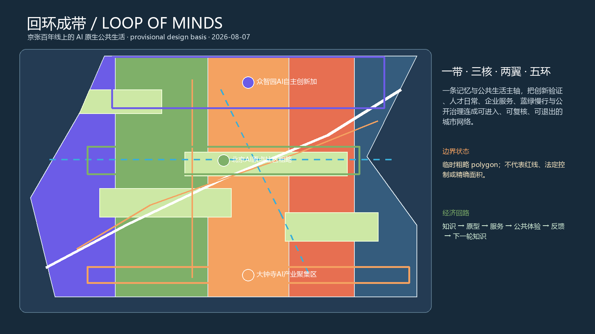
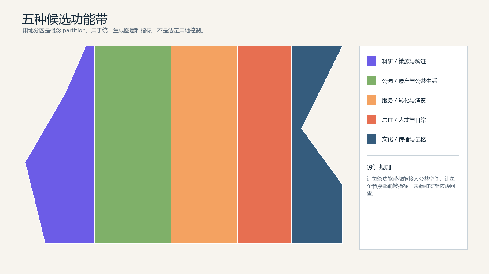
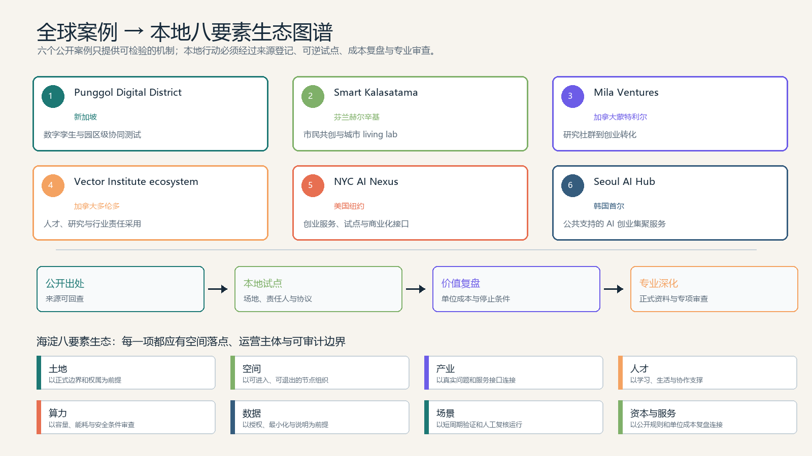
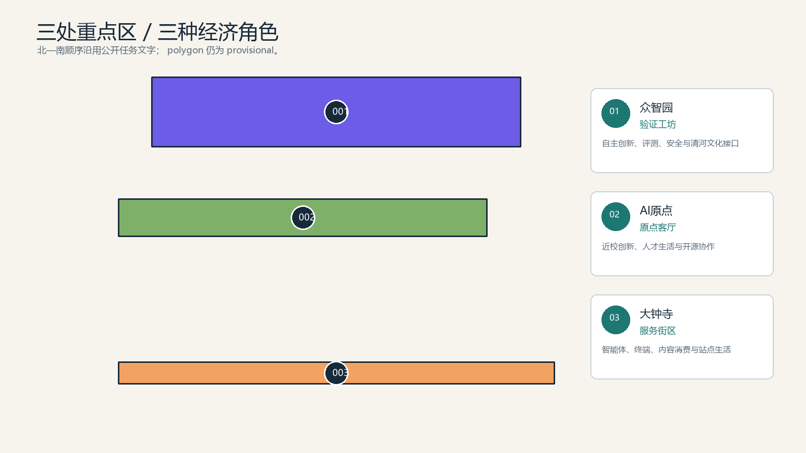
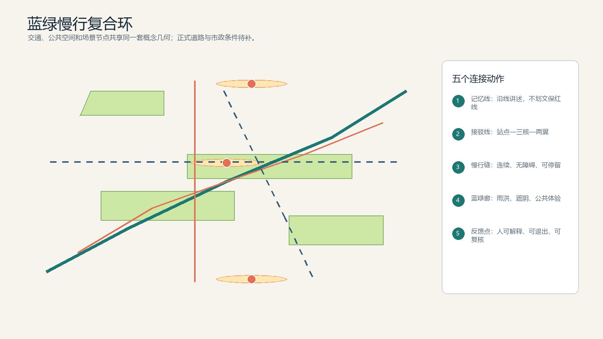
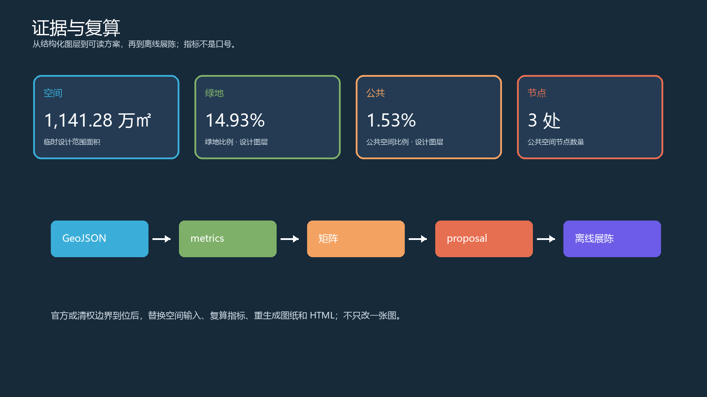

# Looping Path: AI-Native Public Life on the Jing-Zhang Centennial Line

> Independent Agent Design Statement: This package was generated by the Codex Urban Design Agent; however, a human professional team remains responsible for final judgment, legal review, and implementation decisions.
## Design Basis and Source List

This proposal was independently completed by the Codex Urban Design Agent, with the theme being "Looped Belt": translating the linear memory of the century-old Jing-Zhang into an AI-Native public life network that is walkable, verifiable, and exitable. It is a conceptual urban design within the boundaries of publicly available data, not replacing statutory planning, engineering design, or government implementation arrangements. Design evidence originates from the public task book, scope description, enumeration, and schema from the `brief/site-package`; all temporary polygons are explicitly marked as provisional. The announcement text can support the project name, narrative of the three layers of scope, and task response, but cannot elevate the temporary rough boundaries to final lines.

The sources are [source:SITE-PACKAGE], [source:SOURCE-REGISTRY], [source:PROCESSED-FACT-PACK], [source:OFFICIAL-ANNOUNCEMENT], [source:AGENT-TASKBOOK], [source:BOUNDARY-SOURCE], and [source:KEY-AREA-SOURCE]. Among these, [source:BOUNDARY-SOURCE] and [source:KEY-AREA-SOURCE] are only used for generating, discussing, offline display, and intake self-inspection. Formal boundaries or key area data, once made public, must be replaced with [data:geometry/site_boundary.geojson#design], [data:geometry/key_areas.geojson#design], [data:geometry/land_use.geojson#design], [data:geometry/buildings.geojson#design], [data:geometry/roads.geojson#design], [data:geometry/green_space.geojson#design], [data:geometry/public_space.geojson#design], [data:geometry/constraints.geojson#design], and [data:geometry/phasing.geojson#design] and recalculate [metric:site_area_sqm]. [metric:building_footprint_area_sqm], [metric:green_space_area_sqm], [metric:public_space_area_sqm], [metric:public_node_count], [metric:green_ratio], [metric:public_space_ratio], [metric:road_centerline_length_m], [metric:building_count], [metric:key_area_count], [metric:scenario_card_count], [metric:pilot_scenario_count], [metric:persona_count], [metric:global_case_count], [metric:phase_count].

The design approach of this scheme is "evidence first, then form": register the sources and gaps first, then generate the spatial layer, indicators, task matrix, drawings, and offline pages; no areas, quantities, or proportions are filled in narratively.

## Three-Level Scope Framework

Coordinated Research Area (approximately 43.6 square kilometers) is responsible for addressing why the Innovation Belt exists and how it forms an industrial and cultural synergy; Overall Design Area (approximately 11.4 square kilometers) is responsible for addressing how Urban Renewal, transportation, utilities, blue-green spaces, and landscape features around the Jing-Zhang Heritage Park can be integrated into a network; Key-Area Detailed Design Area (approximately 368.4 hectares) is responsible for addressing how the three areas of Zhongzhiyuan, Beijing AI Origin Community, and Dazhongsi each take on an operational economic role. The three layers are not three sets of unrelated drawings, but rather an "strategy—space—node" Evidence Chain.

The overarching layer is defined by [standard:PROJECT-OFFICIAL-ANNOUNCEMENT] and [depth:three_level_scope_framework]. Overall layers return to [data:geometry/site_boundary.geojson#design], [data:geometry/key_areas.geojson#design], [data:geometry/land_use.geojson#design], [data:geometry/buildings.geojson#design], [data:geometry/roads.geojson#design], [data:geometry/green_space.geojson#design], [data:geometry/public_space.geojson#design], [data:geometry/constraints.geojson#design], [data:geometry/phasing.geojson#design];  Highlight the key areas using [data:geometry/key_areas.geojson#PROV-KEY-001], [data:geometry/key_areas.geojson#PROV-KEY-002], and [data:geometry/key_areas.geojson#PROV-KEY-003]. Spatial relationships are discussed conceptually, with the precision limitations for temporary geometry noted in [source:BOUNDARY-SOURCE] and assumptions.json.

The spatial structure adopts "one belt, three cores, two wings, and five rings": one belt is the Jing-Zhang memory and public life continuous line; three cores are the validation workshop, original point living room, and service district; two wings are the Zhongguancun Technology Services Wing and the Xiaoyue River Scenario Enablement Wing; five rings are the innovation transformation, talent daily life, blue-green slow travel, cultural narrative, and data governance five cycles.

## Coordinated Research Area: Industry and Future City Research

The economic logic of 'circular belt' is not to add a new isolated science park, but to shorten the distances between five key stages: universities and open-source communities raise questions, Zhongzhiyuan provides testing and safety verification, Beijing AI Origin Community offers talent living and interdisciplinary collaboration, Dazhongsi provides enterprise services, smart terminals, and content consumption, and Jing-Zhang Ruins Park transforms the results into public understandable urban experiences. This forms a cycle of 'knowledge—prototype—service—public value.' It can support various revenue or public value sources such as consulting, events, scenario testing, and urban operations, but no fictitious investment amounts, revenue figures, company lists, or policy commitments are included in this package.

Five functional spaces are translated as follows: Full-stack self-innovation corresponds to Zhongzhiyuan, world-class ecology corresponds to the original point community, AI-Enabled Scenarios correspond to Xiaoyuehe and the ruins park, intelligent vibrant city corresponds to the public life at Dazhongsi, and governance voice corresponds to open evaluation and honor display. The three areas and the two wings are connected through a "open challenge—scene validation—enterprise service—public experience—international dissemination" synergistic loop. [source:AGENT-TASKBOOK] [standard:PROJECT-AGENT-OPEN-CALL-TASKBOOK] [depth:overall_spatial_structure]

Case studies do not directly replicate urban forms but rather establish six categories of publicly verifiable examples for validation: mixed-use districts that innovate, urban living labs, transparent boundaries of digital twins, developer community operations, public AI ethics registries, and the coexistence of heritage and new technologies. Each category provides methodological inspiration, with formal professional research required to supplement original sources and applicable conditions. Branding uses a visual grammar of "loop, line, point, opening": deep blue represents railway memory, teal represents public life, orange represents transformation, and coral represents human choice; no unauthorized corporate branding is used.

## Global AI Innovation Ecosystem Case Studies: From Observation to Local Experimentation

This package completes the task book requirement of 5-8 case studies with [metric:global_case_count] named, traceable public cases; a complete structured list can be found in `visual/assets/global-ai-ecosystem-cases.json`. The purpose of the cases is not to provide Haidian with a ready-made template, but to break down the "ecosystem" into mechanisms that can be validated in the initial pilot phase: how experiments are authorized, how research is translated, how talent is served, how businesses gain low-cost validation, and how Public Space retains human interpretation and exit rights.

| Case | Observed Mechanisms | Local Transformation Actions | Not to be Replicated | Public Source |
|---|---|---|---|---|
| Punggol Digital District(Singapore) | Utilize digital twins as the operational interface, integrating the park facilities, businesses, institutions, and daily operations into a single iterative testing framework. | Establish a light asset testing chain in Zhongzhiyuan for "site responsibility—test agreement—data documentation—exit review." | Do not transplant its development scale, plot ratio, list of companies, equipment parameters, or investment arrangements. | [source:CASE-PDD-JTC] |
| Smart Kalasatama(Finland Helsinki) | Through small-scale experiments involving city departments, residents, businesses, and researchers, new services are embedded in real-life areas and subjected to public review. | Limit the diagnosis of pedestrian discontinuities and public service prototypes to short-cycle pilots with a baseline, Human Review, and stopping conditions. | Do not consider the resident data, governance rules, procurement methods, or experimental results from other cities as facts for Haidian. | [source:CASE-KALASATAMA-FVH] |
| Mila Ventures (Canada, Montreal) | will integrate the research, startup support, commercialization coaching, and capital matchmaking into a continuous service rather than hosting one-time pitch events. | Establish a reusable research—prototype—demonstration—service transformation interface within the AI Origin community and manage it with open access rules. | No commitment to funds, corporate investments, incubator spots, or specific institutional partnerships. | [source:CASE-MILA-VENTURES] |
| Vector Institute ecosystem (Toronto, Canada) | A long-term network for AI adoption is formed by research institutions, talent training, industry partners, and the public sector around shared capabilities. | Break down talent training, trustworthy evaluation, enterprise services, and public explanation into modular services that can be independently purchased and publicly evaluated. | Do not make local commitments by citing their partners, funding, model capabilities, or adoption effects. | [source:CASE-VECTOR-ECOSYSTEM] |
| NYC AI Nexus (United States New York) | Provide a scalable service node for startup teams, business needs, mentors, and market entry support to foster growth. | Organize enterprise validation, scenario demonstrations, compliance explanations, and activity roadshows into a service package with quantifiable costs and exit options in Dazhongsi. | Do not directly apply policies, brands, venue conditions, or business ecosystems from other cities to the local context. | [source:CASE-NYC-AI-NEXUS] |
| Seoul AI Hub (Seoul, Korea) | Organizes city-level AI startup services through professional spaces, entrepreneurial incubation, talent support, and industry exchanges. | Establish a unified service directory, booking portal, and responsible entity for three key areas, rather than merely adding display spaces. | Do not replicate its organizational structure, subsidy policies, venue scale, or recruitment promises. | [source:CASE-SEOUL-AI-HUB] |

Six cases collectively correspond to the local eight-element map: land and space provide accessible interfaces, industry and talent provide real problems, computational power and data only enter the experiment with authorization, scenarios provide verifiable validation, and capital and services connect through public rules rather than verbal promises. External observations are sourced from [source:CASE-PDD-JTC], [source:CASE-KALASATAMA-FVH], [source:CASE-MILA-VENTURES], [source:CASE-VECTOR-ECOSYSTEM], [source:CASE-NYC-AI-NEXUS], and [source:CASE-SEOUL-AI-HUB]; they are used only for methodological research and cannot replace Haidian's boundaries, ownership, control plans, investments, companies, or implementation basis.

## Overall Design Area: Urban Renewal and Regulatory-Plan-Level Urban Design

The morphological strategy for the Overall Design Area is "making the transformation process visible": the land layers form five interchangeable functional bands of research and innovation, heritage green spaces, enterprise services, talent living, and cultural displays; the building layers only propose three categories of actions: retention, updating, and lightweight new construction, without providing a statutory Floor Area Ratio, Building Height, road right-of-way, or engineering scale. When current and ownership data are missing, all Building Footprints are design proposals and do not imply demolition or property adjustments.

[data:geometry/site_boundary.geojson#design], [data:geometry/key_areas.geojson#design], [data:geometry/land_use.geojson#design], [data:geometry/buildings.geojson#design], [data:geometry/roads.geojson#design], [data:geometry/green_space.geojson#design], [data:geometry/public_space.geojson#design], [data:geometry/constraints.geojson#design], [data:geometry/phasing.geojson#design] collectively express the spatial backbone of the "Loop." [standard:PROJECT-OFFICIAL-ANNOUNCEMENT], [standard:PROJECT-AGENT-OPEN-CALL-TASKBOOK], [standard:MOHURD-URBAN-DESIGN-MEASURES], [standard:MOHURD-CONTROL-DETAILED-PLANNING], [standard:MNR-LAND-USE-CLASSIFICATION-GUIDE], [standard:MOHURD-ARCH-DESIGN-DEPTH-2016] constrain land use classification, Urban Design, control detailed planning depth, and architectural design depth; [depth:land_use_layout], [depth:development_intensity_controls], [depth:height_massing_character] require the intensity and height to be expressed as "tiered guidance, subject to formal conditions confirmation," rather than pseudo-precise numerical values.

The update project adopts three levels of implementability: Class A involves reversible Public Spaces and signage, dependent on minimal intervention; Class B involves low-intervention shared services in existing buildings, dependent on ownership and fire safety confirmation; Class C involves long-term district-wide updates and infrastructure deepening, which must wait for formal boundaries, land use plans, ownership, municipal, and engineering data. Each project follows an evidence gate, followed by a design gate, followed by a professional approval gate.

## Detailed Design of Key Areas

Zhongzhiyuan AI Independent Innovation Acceleration Area is the "Verification Workshop": composed of a low-carbon interaction garden, an open evaluation square, a model safety and standard display, and Qinghe cultural interfaces, forming a replicable testing environment. The focus is not on recreating a closed-off park, but on making test protocols, scenario results, and public explanations visible along the same pedestrian route. Beijing AI Origin Community is the "Origin Living Room": centered on near-school technology transfer, talent daily activities, open-source releases, shared learning, and living facilities, retaining existing usable buildings and adding lightweight public service interfaces. Dazhongsi AI Industry Cluster is the "Service District": forming a city-type innovative consumption with smart body enterprise services, terminal experiences, data element explanations, public living rooms at night, and quadrants of pedestrian connectivity at the station.

Three key areas are marked as provisional using [data:geometry/key_areas.geojson#PROV-KEY-001], [data:geometry/key_areas.geojson#PROV-KEY-002], and [data:geometry/key_areas.geojson#PROV-KEY-003]; [depth:three_key_area_detailed_design] requires each to be described in terms of function, architecture, demolish–renovate–retain strategy, traffic, Public Space, and implementation dependencies. (Demolish–Renovate–Retain Strategy) [data:geometry/site_boundary.geojson#design], [data:geometry/key_areas.geojson#design], [data:geometry/land_use.geojson#design], [data:geometry/buildings.geojson#design], [data:geometry/roads.geojson#design], [data:geometry/green_space.geojson#design], [data:geometry/public_space.geojson#design], [data:geometry/constraints.geojson#design], [data:geometry/phasing.geojson#design] provide mutually readable node evidence for the buildings, roads, Public Spaces, and phasing layers.

## AI Innovation Ecosystem, Personas, and AI+ Scenarios

This scheme sets ten scenario cards, and each card is written as the smallest unit of "user-space-operation-boundary." The first three industrial Testing and Validation Scenarios respectively test urban traffic diagnosis, model and agent safety evaluation, and service for the conversion of academic and industrial outcomes. They are only conceptual tests that are eligible for application, revocation, and Human Review, and are not considered as approved deployments.

| Number | Scene | Spatial and Operational Entry | Key Boundaries |
|---|---|---|---|
| 01 | Open Source Release Hall | Result Release, Model Evaluation, Developer Exchange | Public Content; Does Not Collect Non-essential Identifying Information |
| 02 | Urban Agent Sandbox | Reversible Testing, Human Review, Exit Mechanism | Using only authorized test data; does not make direct administrative decisions |
| 03 | Slow Travel Discontinuity Diagnosis | Public Data, Manual Verification, Accessible Loop | The diagnosis recommendations must be reviewed by a professional. |
| 04 | Talent Life Manager | Residence, Learning, Exercise, and Daily Services | On-site Service Windows as Backup; No Personal Profile Created |
| 05 | AI Safety Governance Corridor | Standard Display, Trustworthy Evaluation, Public Explanation | Publish evaluation methods; retain appeals and exit options |
| 06 | University-Enterprise Transformation Living Room | On-Campus Innovation, Pitching, Prototype Services | Relationships Governed by Agreements and Procurement |
| 07 | Data Element Theater | Terminal, Content Consumption, Data Description | Explain the purpose of the data; do not display sensitive data |
| 08 | Low-Carbon Computing Hub | Edge Computing, Energy, and Public Services | Equipment Capacity and Engineering Conditions Pending Verification |
| 09 | Jing-Zhang Memory Route | Railway Cultural Pulse, Zhongguancun, and AI New Culture | Preservation Boundaries and Historical Materials Confirmed by Professional Teams |
| 10 | Global AI Activity Week Route | Developer Festival, Open Day, International Promotion | Activities Require Separate Approval, Procurement, and Safety Assessment |

Five user personas are defined: university researchers, startup team members, industry service personnel, nearby residents and caregivers, and visiting developers/public. Each persona has a service entry point that does not rely on identifying individuals, visible human interpretation, and an exit mechanism; any sensitive data is used only for minimal, short-term, and authorized testing materials. The operating body is recommended to be composed of a professional team, venue operators, and public representatives, with the Agent providing only structured recommendations.

The AI Innovation Ecosystem adopts a strategy of "no commitment to resources, open interfaces first": it provides shared meeting spaces, prototype displays, reversible testing, open data descriptions, and public feedback, without specifying suppliers or fabricating investment support. Scene spaces and operational matrices are documented in [source:AGENT-TASKBOOK], [depth:municipal_new_infrastructure], and [depth:risk_missing_data]; the number of scene cards, persona types, and test scenarios are verified by [metric:scenario_card_count], [metric:persona_count], and [metric:pilot_scenario_count].

## Land Use, Building Scale, and Retain-Renovate-Demolish Strategy

The Land-Use Plan forms complete candidate zones through five functional belts: research and development land carries the source and validation, park and green spaces carry heritage and public life, commercial and service land carries transformation and consumption, residential and community service land carries talent daily life, and cultural land carries dissemination and memory. [data:geometry/land_use.geojson#LU-001] Through vertical zonation, the candidate partition maintains a seamless and non-overlapping arrangement; it is a design model, not a planning permit.

The building framework does not pursue a one-time reconstruction but rather divides the twelve conceptual bases into three categories: retention, retention and update, and lightweight new construction. Retention prioritizes cultural, educational, and public service functions; retention and update prioritize laboratories, incubators, and enterprise services; lightweight new construction is only used as node-type public interfaces. Heights, setbacks, Floor Area Ratio, underground spaces, and fire safety are all retained as items to be confirmed formally, [metric:floor_area_ratio] is unknown.

Building Footprint area 321,264.6 square meters and the number of buildings 11 only represent the recalculation results of this design layer, see [metric:building_footprint_area_sqm] and [metric:building_count], and [data:geometry/buildings.geojson#BLDG-001]; they do not represent the current survey or development scale. The demolition–renovate–retain list is first expressed by action level, and any plot-level decisions must await ownership, cultural heritage, and engineering documentation. (Demolish–Renovate–Retain Strategy)

## Transport, Rail, Municipal Infrastructure, and Public Services

Traffic strategy is "connect first, then micro-circulate, and finally discuss engineering": connect existing rail stations and three key areas with connecting lines, continuous pedestrian seams, bicycle lanes, and greenway composite loops; move internal vehicles in the park from the main public life line to the managed edge nodes, and centralize deliveries, shared parking, and accessible shuttles. The centerline of the road is the [data:geometry/roads.geojson#ROAD-001] concept line, which does not replace the road red line, cross-section, or traffic organization design.

Municipal infrastructure and New Infrastructure adopt a "transparent and exitable" node strategy: low-carbon computing hubs, distributed energy interfaces, rain and flood regulation, public Wi-Fi, and data signboards can serve as research directions; no supplier, computing metrics, pipeline capacity, or engineering solutions should be presented as definitive facts. Public services prioritize covering the daily needs of talents, residents, seniors, children, and visitors, with services backed by human windows as a fallback.

The total length of the road centerline is 29,207.2 meters, which is the measured value for the geometry of this package [metric:road_centerline_length_m]; formal traffic evaluation will require additional data on volumes, locations, accessibility, and fire safety. [standard:PROJECT-OFFICIAL-ANNOUNCEMENT] [standard:PROJECT-AGENT-OPEN-CALL-TASKBOOK] [standard:MOHURD-URBAN-DESIGN-MEASURES] [standard:MOHURD-CONTROL-DETAILED-PLANNING] [standard:MNR-LAND-USE-CLASSIFICATION-GUIDE] [standard:MOHURD-ARCH-DESIGN-DEPTH-2016] [depth:traffic_rail_slow_parking] are provided only for illustrative purposes of the work depth and do not constitute engineering conclusions.

## Blue-Green Network, Public Space, and Urban Character

The blue-green system is a circular public base, not a decorative belt. Four designed green corridors respectively carry the continuous narrative of the Jing-Zhang heritage, the scene empowerment of Xiaoyuehe, the low-carbon interaction at Zhongzhiyuan, and the daily sharing at Dazhongsi; three public nodes respectively carry open evaluation, talent living, and urban services. Green spaces and Public Spaces are organized through visible signage, seating, shading, nighttime safety, and continuous accessibility, avoiding the transformation of "AI" into a technology exhibition that only occurs indoors.

This layer recalculation yields a green space area of 1,703,424.1 square meters and a green space ratio of 0.1493, [metric:green_space_area_sqm] and [metric:green_ratio], with [data:geometry/green_space.geojson#GREEN-001] for reference; the Public Space area is 174,923.4 square meters and the ratio is 0.0153, see [metric:public_space_area_sqm] and [metric:public_space_ratio], [data:geometry/public_space.geojson#PUBLIC-001]. These ratios are not statutory green space ratios or public service standards.

Urban Character is controlled by four words: "old linearity, openness, readability, and restrained technical sensibility." The logo direction is a discontinuous railway line overlaid with an open loop, with signage organized in a three-tier hierarchy of "loop—point—gate"; three AI pilgrimage sites are the Jing-Zhang Memory Loop Gate, the Original Point Open Source Tower, and the Verifiable Street Corner Theater, all of which are conceptual nodes that do not infringe on cultural heritage, green spaces, or traffic controls.

## Renewal Projects, Implementation Policy, and Phasing

The project list is advanced through "evidence doors—design doors—professional doors." A1 Jing-Zhang Memory Pedestrian Seam, A2 Three Core Connectivity and Accessibility Enhancement, A3 Open Evaluation Plaza are reversible public interfaces; B1 Zhongzhiyuan Validation Workshop, B2 Origin Community Shared Living Room, B3 Dazhongsi Verifiable Street Corner are low-intervention updates to existing buildings; C1 Blue-Green System Connectivity, C2 Municipal and New Infrastructure Deepening, C3 Neighborhood Comprehensive Update are long-term research areas. Each project requires a clear responsible person, source, prerequisites, public feedback, and exit strategy.

Phasing is divided into three stages: Phase one will focus on public signage, reversible activities, a diagnosis of pedestrian and bicycle connectivity, and three small-scale tests; Phase two will integrate the three cores and two wings into continuous public life, forming daily loops for developer communities, talent services, and enterprise services; Phase three will be handed over to a professional team for further development after the formal boundaries, control plans, property rights, traffic, utilities, and cultural heritage documentation are complete. Phasing layers are available at [data:geometry/phasing.geojson#PHASE-001] and [depth:phasing_implementation]. Any activities, recruitment, policies, and funding arrangements are reference mechanisms and are not definitive commitments.

Economic evaluation adopts quantifiable process indicators: the number of public test scenarios, the number of reused public nodes, the feedback loop from participants, whether enterprise/university interfaces have been formed, and whether each stage can generate learning without increasing irreversible construction. It transforms the economic benefits of Urban Design from a one-time image investment into a continuous transformation capability.

## Accessibility review and first-phase 90-day pilot

This version does not request direct human approval of a comprehensive master plan or construction scheme, but rather requests a smaller, more reversible decision: whether to allow three light asset tests within clear nodes and responsibility boundaries. By using the entry point of "try first, measure, and exit," real managers can make a small decision to determine if a scheme is worth continuing, without first accepting the entire spatial narrative.

The execution plan for the first phase is as follows; all actions must be implemented by the professional and operational teams after formal or clear title documentation is confirmed; this package's [data:geometry/phasing.geojson#PHASE-001] only expresses conceptual phasing. [depth:existing_conditions_diagnosis], [depth:three_level_scope_framework], [depth:overall_spatial_structure], [depth:land_use_layout], [depth:development_intensity_controls], [depth:height_massing_character], [depth:retain_renovate_demolish], [depth:traffic_rail_slow_parking], [depth:municipal_new_infrastructure], [depth:blue_green_public_space], [depth:three_key_area_detailed_design], [depth:renewal_project_list],  [depth:phasing_implementation], [depth:metrics_recalculation], [depth:risk_missing_data] in [depth:phasing_implementation], [depth:risk_missing_data] Constrain evidence gates and stop conditions.

| Stage | Name | Time | Deliverables | Threshold to Proceed to the Next Stage |
|---|---|---|---|---|
| P1 | Evidence Alignment and Baseline | Days 1–30 | Boundary Replacement Packages, Walking and Public Space Baseline, Responsibility List, Data and Copyright Registration. | Any critical screening item missing will not enter the on-site AI service testing. |
| P2 | Three Light Asset Tests | Days 31–60 | Running Logs, Anonymous Feedback, Human Review Records, Exit Drills, Unit Cost Ledger. | All three tests must have baseline data, human review, and exit records, and must not leave any unresolved safety or privacy issues. |
| P3 | Review and Expansion Decisions | Days 61–90 | Publish the review package, issue list, reusable components, conditions for the next phase, and termination recommendations. | Only components supported by evidence can progress to the next phase; long-term construction must obtain formal planning and engineering conditions separately. |

Adopt Discipline: Do not add irreversible buildings in the first phase, do not collect unnecessary personal identity data, and do not treat model outputs as administrative or engineering conclusions; ensure that each test has a human fallback, public disclosure, feedback entry, and exit mechanism. [source:AGENT-TASKBOOK] [depth:risk_missing_data]

## Pathways for Economic Benefits and Financial Discipline

Economic benefits in this scheme are not equivalent to fictitious gross values, but rather address questions such as "who pays for which acceptable service, what public sector costs are reduced, and which assets can be reused for the next iteration." The following four points are value assumptions that need to be verified through contract, procurement, and on-site quotations, and are not revenue commitments, investment estimates, or conclusions about government support.

| Value Path | Potential Paying Parties | Deliverable Services | Verifiable Value |
|---|---|---|---|
| Public Services Procurement | Public Sector or Authorized Operating Entity | Explainable Slow-Release Diagnosis, Public Space Operations, and AI Scenario Assessment | Convert One-Time Studies into Acceptable Service Packages, Reducing Repetitive Surveys |
| Enterprise Verification Services | Enterprises, Research Teams, or Joint Labs | Short Cycle Scenario Testing, Human Review, Standard Documentation, and Result Presentation | Allows Enterprises to First Validate at a Low Cost and Then Decide Whether to Increase Investment |
| Activity and Space Operations | Event Organizers, Venue Users, and Partner Institutions | Integrated Operations of Developer Events, Open Days, Roadshows, and Public Exhibitions | Create a Continuous Flow of Visitors and Collaboration Interfaces through Reusable Nodes Rather than One-Time Landmark Investments |
| Asset Relicating | Public Ecological Co-benefit | Open Protocols, Component Library, Anonymized Feedback Templates, and Debriefing Materials | Reducing Costs for Redesign, Procurement, and Interpretation in Subsequent Projects |

Funding discipline is divided into three layers: The first phase will use existing sites, short-term equipment, and reversible signage, with the amount based on quotation and procurement rules; the second phase will only add operations and maintenance for components that pass the review; and the third phase must submit auditable cost, responsibility, and benefit models for construction, financing, or business attraction. Each expenditure should be aggregated into five categories: "space, personnel, safety and accessibility, evaluation, and maintenance," and the "unit cost per completed test" should be calculated. It is recommended to use the loop rate of participant feedback, the proportion of reused existing spaces, the number of unaddressed safety/privacy incidents, and the number of reusable components as leading indicators for economic decision-making, rather than relying on unverified GDP, investment amounts, or passenger forecasts as evidence.

## Humans adopt conditions and current maturity

Use not binary "yes/no" but layered decision-making. The current package is suitable for public review and professional discussion but not for direct entry into statutory planning, engineering procurement, or investment commitments. The following table outlines the responsibilities that the next human decision-maker will need to undertake:

| Decision Level | Current Judgment | Additional Evidence Needed |
|---|---|---|
| Submit Open-Source Concept Package | can | complete final hash, boundary disclosure, and human review |
| Authorize Phase One On-Site Pilot | Temporarily Cannot Directly | Formal or Clear Title Assignment Pilot Boundary, Site Manager, Quotation, and Safety/Privacy Measures |
| Incorporate into Statutory Plans or Projects | Cannot | Control Detailed Plans, Ownership, Cultural Heritage, Traffic, Utilities, Fire Safety, and Professional Review Documentation |
| Form an investment or long-term operational commitment | cannot be based on | auditable business models, procurement pathways, responsibility allocation, and independent risk assessments |

Therefore, the true product of this edition is not an "already completed city," but a set of decision interfaces that can be taken over by professional teams, replaced with data, tested, reviewed, and stopped. Without a site manager and formal documentation, the most reasonable approach is to use it as a framework for public research and pilot recruitment, rather than a commitment to construction.

## Metrics, Area Recalculation, and Compliance Matrix

The authoritative order for this package is GeoJSON → metrics.json → compliance/standards/depth matrix → proposal.md → HTML/PDF. All known metrics are recalculated from the current design layer in EPSG:4548; unknown statutory intensities are left blank.

Current design layer recalculation: Overall Design Area 11,412,825.4 square meters ([metric:site_area_sqm]); Building Footprint 321,264.6 square meters ([metric:building_footprint_area_sqm]); Green Space 1,703,424.1 square meters ([metric:green_space_area_sqm]); Public Space 174,923.4 square meters ([metric:public_space_area_sqm]); Three key areas [metric:key_area_count]; Ten scenario cards [metric:scenario_card_count]; Three test scenarios [metric:pilot_scenario_count]; Five personas [metric:persona_count]. [data:geometry/site_boundary.geojson#design], [data:geometry/key_areas.geojson#design], [data:geometry/land_use.geojson#design], [data:geometry/buildings.geojson#design], [data:geometry/roads.geojson#design], [data:geometry/green_space.geojson#design], [data:geometry/public_space.geojson#design], [data:geometry/constraints.geojson#design], [data:geometry/phasing.geojson#design] all have layer placements.

Align the grid with the announcement tasks, sections, layers, indicators, drawings, sources, assumptions, and self-inspections; the standard grid covers [standard:PROJECT-OFFICIAL-ANNOUNCEMENT], [standard:PROJECT-AGENT-OPEN-CALL-TASKBOOK], [standard:MOHURD-URBAN-DESIGN-MEASURES], [standard:MOHURD-CONTROL-DETAILED-PLANNING], [standard:MNR-LAND-USE-CLASSIFICATION-GUIDE], and [standard:MOHURD-ARCH-DESIGN-DEPTH-2016]. Design depth matrix covers [depth:existing_conditions_diagnosis], [depth:three_level_scope_framework], [depth:overall_spatial_structure], [depth:land_use_layout], [depth:development_intensity_controls], [depth:height_massing_character], [depth:retain_renovate_demolish], [depth:traffic_rail_slow_parking], [depth:municipal_new_infrastructure], [depth:blue_green_public_space], [depth:three_key_area_detailed_design], [depth:renewal_project_list],  [depth:phasing_implementation], [depth:metrics_recalculation], [depth:risk_missing_data]. Metrics are transparency tools for the plan, not statutory metric tables.

## Risk, Copyright, and Compliance

The first risk is data credibility: the Provisional Boundary cannot be used as a red line, approval basis, or precise area; formal documentation will need to be uniformly replaced and recalculated once available. The second risk is related to ownership and engineering: the current buildings, roads, underground spaces, municipal services, cultural heritage, and fire safety conditions are missing, thus this package only provides action-level suggestions. The third risk is associated with AI scenario governance: the scenario defaults to minimizing data, requiring Human Review, providing an opt-out option, and public disclosure, without offering personal profiling or irreversible surveillance. The fourth risk is economic misinterpretation: the transformation loops in the proposal are design assumptions, not investment, output value, or government support commitments.

All graphics and charts were generated by this Agent; no external images, remote fonts, map tiles, trademarks, or portraits were used. The sources, generation methods, limitations, and replacement rules are recorded in sources.json, assumptions.json, and report/copyright_statement.md. The work license is COMMUNITY-DISPLAY-ONLY: allows for the display and review in this call for submissions but does not authorize the direct packaging of temporary data or the contents of this package into legal planning documents, commercial promotions, or engineering files. [source:BOUNDARY-SOURCE] [source:SOURCE-REGISTRY] [depth:risk_missing_data]

## References

The formal basis includes the project public announcement, excerpts from the clearance task order for agents, the host repository's site package, public standard indexes, and the Provisional Boundary description. External case studies are only used as methodological research directions and should not include unverified project data that describes the current state of Haidian.

Source Index: [source:SITE-PACKAGE], [source:SOURCE-REGISTRY], [source:PROCESSED-FACT-PACK], [source:OFFICIAL-ANNOUNCEMENT], [source:AGENT-TASKBOOK], [source:BOUNDARY-SOURCE], [source:KEY-AREA-SOURCE]

Standard Index: [standard:PROJECT-OFFICIAL-ANNOUNCEMENT], [standard:PROJECT-AGENT-OPEN-CALL-TASKBOOK], [standard:MOHURD-URBAN-DESIGN-MEASURES], [standard:MOHURD-CONTROL-DETAILED-PLANNING], [standard:MNR-LAND-USE-CLASSIFICATION-GUIDE], [standard:MOHURD-ARCH-DESIGN-DEPTH-2016]

Design Depth Index: [depth:existing_conditions_diagnosis], [depth:three_level_scope_framework], [depth:overall_spatial_structure], [depth:land_use_layout], [depth:development_intensity_controls], [depth:height_massing_character], [depth:retain_renovate_demolish], [depth:traffic_rail_slow_parking], [depth:municipal_new_infrastructure], [depth:blue_green_public_space], [depth:three_key_area_detailed_design], [depth:renewal_project_list] [depth:phasing_implementation], [depth:metrics_recalculation], [depth:risk_missing_data]

Data Index: [data:geometry/site_boundary.geojson#design], [data:geometry/key_areas.geojson#design], [data:geometry/land_use.geojson#design], [data:geometry/buildings.geojson#design], [data:geometry/roads.geojson#design], [data:geometry/green_space.geojson#design], [data:geometry/public_space.geojson#design], [data:geometry/constraints.geojson#design], [data:geometry/phasing.geojson#design]

Metric Index: [metric:site_area_sqm], [metric:building_footprint_area_sqm], [metric:green_space_area_sqm], [metric:public_space_area_sqm], [metric:public_node_count], [metric:green_ratio], [metric:public_space_ratio], [metric:road_centerline_length_m], [metric:building_count], [metric:key_area_count], [metric:scenario_card_count], [metric:pilot_scenario_count], [metric:persona_count], [metric:global_case_count], [metric:phase_count]

This plan version is v0.1; the only high-priority input for the next version is official or verified site/key-area polygons, as well as data on roads, ownership, cultural heritage, municipal, and current building conditions.
