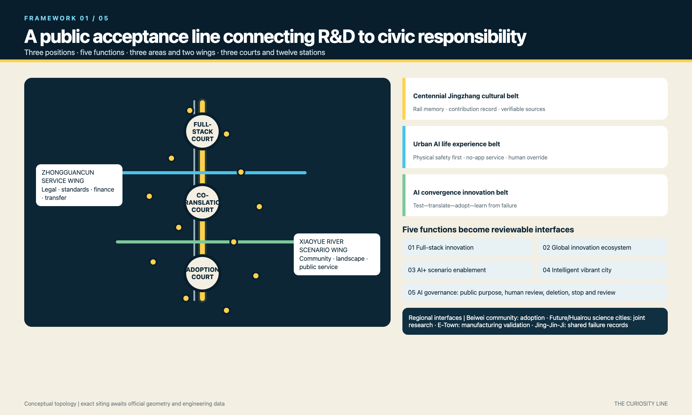
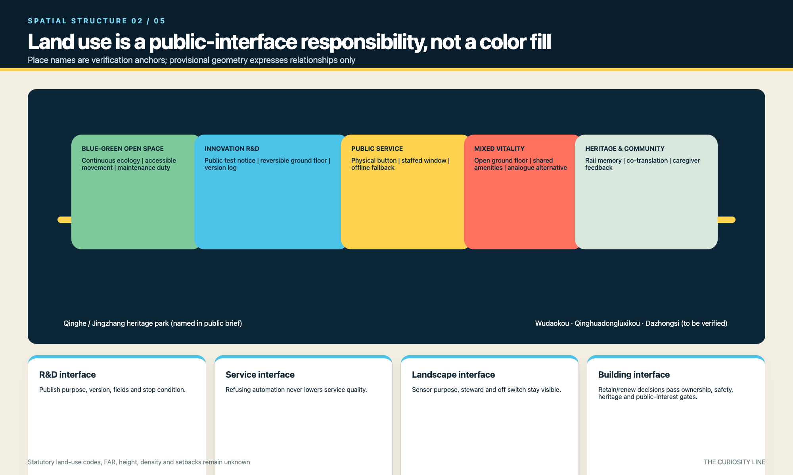
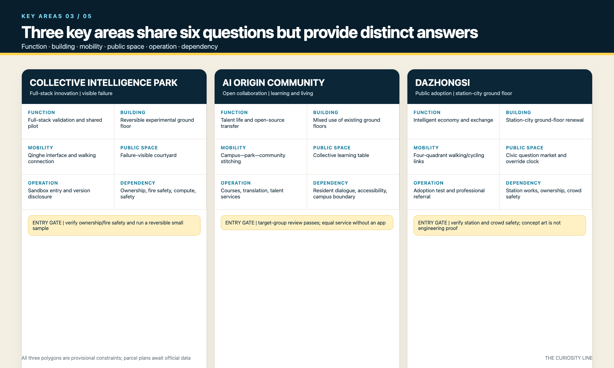
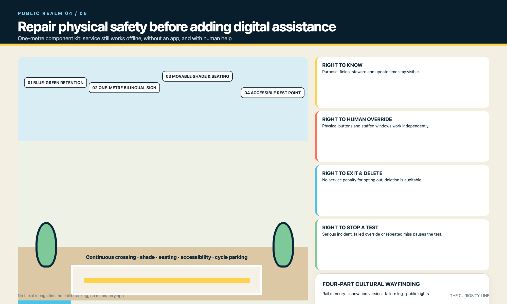
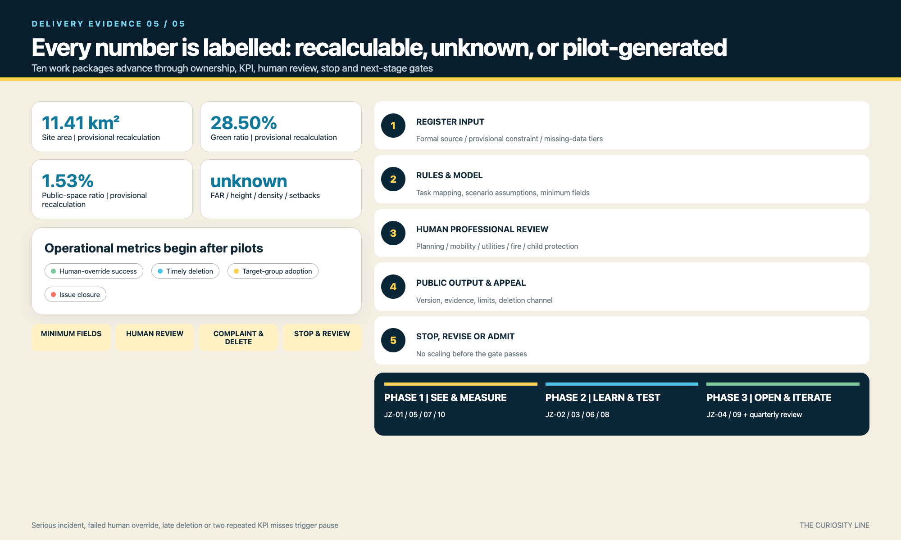

# THE CURIOSITY LINE: Public Acceptance Tests for an AI City

**Outcome first.** The Curiosity Line does not scatter AI devices through a park. It turns why, who is responsible, and how to withdraw into public acceptance tests before research enters daily life. This is a concept proposal; provisional boundaries, unknown controls, and absent real participation remain explicit.

## Design Basis and Source List

The official call and the agent taskbook define the assignment; the registered site package only organizes available evidence. SITE_BOUNDARY and all three KEY_AREA polygons remain provisional constraints for generation and recalculation, never official redlines. Statutory controls, road and rail engineering, ownership, existing buildings, utilities, fire, flood, heritage, and facility baselines are still missing. The place index lists only locations named in public task materials and records relationship types rather than survey coordinates. [source:OFFICIAL-ANNOUNCEMENT] [source:AGENT-TASKBOOK] [depth:existing_conditions_diagnosis]

The asset register documents authorship, generation method, inputs, font treatment, licence, and limits for every submitted file class. External cases are cited as mechanisms only; no third-party image, map, logo, or layout is copied. The bilingual check records a human equivalence review of claims, figures, caveats, governance, and locations. [source:SOURCE-REGISTRY] [data:geometry/site_boundary.geojson#SITE-001] [metric:site_area_sqm]

## Three-Level Scope Framework

The coordinated research area addresses the regional innovation chain; the overall design area addresses spatial structure and renewal packages; the key areas test six dimensions: function, buildings, mobility, public space, operation, and dependencies. The levels pass decisions through a question-test-adoption-review loop, while provisional geometry stays replaceable. [depth:three_level_scope_framework] [data:geometry/key_areas.geojson#PROV-KEY-001] [metric:key_area_count]

One Curiosity Line links three Question Yards and twelve Question-Mark Stops. The two wings now use the taskbook names: Zhongguancun Technology Service Wing and Xiaoyue River Scenario Enablement Wing. Three positions and five official functions are mapped explicitly to the three zones, two wings, and operating mechanisms. [source:AGENT-TASKBOOK] [standard:PROJECT-AGENT-OPEN-CALL-TASKBOOK] [depth:overall_spatial_structure]

## Coordinated Research Area: Industry and Future City Research

Eight enabling factors structure the ecosystem: land offers reversible test units; space hosts three yards and twelve stops; industry supplies public problems; funding follows milestones; talent enters through courses and residencies; compute uses tiered quotas; data defaults to minimization and deletion; scenarios use open admission and exit gates. Zhongzhiyuan validates the full stack, the technology-service wing supports standards, finance, and translation, and the scenario wing connects community adoption and blue-green maintenance. [source:AGENT-TASKBOOK] [depth:overall_spatial_structure]

Beiwei Community is a proposed adoption interface; Future Science City and Huairou Science City are proposed research and instrument-test partners; Beijing E-Town is a proposed manufacturing and robotics interface; wider Beijing-Tianjin-Hebei partners exchange annual open questions, test records, and failure cases. These are collaboration mechanisms, not commitments. The reproducible planning loop is public inputs, explicit rules or model, human review, published output, complaint and deletion, then stop or revise. [depth:risk_missing_data] [metric:test_scenario_count]

## Overall Design Area: Urban Renewal and Regulatory-Plan-Level Urban Design

The hierarchy is a north-south Curiosity Line, two east-west service wings, three yards, twelve stops, and a continuous slow-mobility and blue-green network. Land-use geometry expresses relationships among innovation, mixed activity, services, and open space. Building geometry is limited to three conceptual renewal footprints, and road geometry expresses connection types. Place names provide a verification index, not exact siting. [data:geometry/land_use.geojson#LU-001] [data:geometry/buildings.geojson#BLDG-001] [depth:land_use_layout]

FAR, height, density, setbacks, and retain-renovate-demolish decisions remain unknown until official data arrive. The deliverable is a decision protocol: verify completeness, ownership and structure, heritage, public benefit, then carbon and cost. No existing building is marked for demolition without survey evidence. Mobility, utilities, and public services advance only after named prerequisites and professional responsibility are confirmed. [standard:MOHURD-CONTROL-DETAILED-PLANNING] [depth:development_intensity_controls] [metric:floor_area_ratio]

## Detailed Design of Key Areas

Zhongzhiyuan combines full-stack testing, reversible ground-floor labs, Qinghe-interface review, a visible-failure court, sandbox admission, and ownership/fire/compute checks. AI Origin Community combines open-source collaboration, adaptive ground floors, campus-park-neighbourhood walking links, a shared learning table, courses and talent services, and resident/accessibility agreements. [data:geometry/key_areas.geojson#PROV-KEY-001] [depth:three_key_area_detailed_design]

Dazhongsi combines intelligent-economy adoption, station-facing ground floors, four-quadrant walking and cycling links, a public Question Market and Human Override Clock, product adoption tests, and station/ownership/crowd-safety prerequisites. None of the three claims approved building scale. Their six-part actions and dependencies are reviewable now; parcel plans wait for official geometry. [data:geometry/key_areas.geojson#PROV-KEY-003] [metric:key_area_count]

## AI Innovation Ecosystem, Personas, and AI+ Scenarios

Six personas cover children, teenagers, caregivers and disabled families, developers, older or low-digital-skill residents, and operators or professionals. Twelve scenario cards map users, space, operator, data boundary, human review, and stop condition. TVS-01 tests low-speed robot safety, TVS-02 tests child-readable AI explanations, and TVS-03 tests withdrawal from automated public services. No face recognition or child trajectory retention is permitted; paper, physical controls, and staffed service must work independently. [metric:persona_count] [metric:test_scenario_count] [source:UNICEF-AI-CHILDREN]

Each test follows purpose and minimum fields, site risk review, limited run, human review, public result and complaint channel, scheduled deletion, then stop, revise, or advance. TVS-01 has a safety officer and hard stop; TVS-02 is reviewed by educators, caregivers, and a child observation group; TVS-03 must pass an offline service drill. Advancement requires zero serious safety events, successful override, complete deletion records, and target-group review. [source:BEIJING-CHILD-FRIENDLY] [data:geometry/public_space.geojson#PUBLIC-001] [depth:municipal_new_infrastructure]

## Land Use, Building Scale, and Retain-Renovate-Demolish Strategy

Conceptual land-use zones link research, mixed activity, services, and open space instead of creating a closed campus. Each interface has a public obligation: research displays test limits, mixed uses retain non-phone access, public services provide human override, and green space identifies sensor purpose and maintenance. The classification is design language, not a statutory land-use code. [standard:MNR-LAND-USE-CLASSIFICATION-GUIDE] [data:geometry/land_use.geojson#LU-001] [depth:land_use_layout]

Three building footprints are question-yard prototypes and recalculation samples, not surveyed buildings, approved floor area, or demolition decisions. A five-gate protocol covers evidence, ownership and structure, heritage, public benefit, then carbon and cost; missing evidence keeps the status pending. Character guidance addresses active ground floors, coherent interfaces, screened roof equipment, and scale along the railway corridor without invented heights. [data:geometry/buildings.geojson#BLDG-001] [metric:building_footprint_area_sqm] [depth:retain_renovate_demolish]

Completion here means a design rule ready for calibration, not an approved height conclusion. [depth:height_massing_character]

## Transport, Rail, Municipal Infrastructure, and Public Services

Mobility follows physical safety before digital assistance: crossings, shade, seats, continuous accessibility, and bicycle parking precede navigation or prediction. North Fifth Ring, Wudaokou, Qinghuadongluxikou, and Dazhongsi Station are verification interfaces named in task materials. Submitted road geometry represents a line, transverse stitches, and micro-circulation types; station integration, parking, and engineering connections remain subject to professional data. [data:geometry/roads.geojson#ROAD-001] [depth:traffic_rail_slow_parking] [source:SITE-PACKAGE]

Infrastructure uses edge-first processing, tiered compute, minimum data, and conventional service fallback. Every stop needs power, network, drainage, fire, maintenance, and accessibility checks; loss of connectivity must not remove help or service. Sensors disclose purpose, owner, update time, retention, and shutdown method. Missing utility, energy, flood, and fire data allow interface and resource tiers only, not feasibility claims. [data:geometry/constraints.geojson#CONSTRAINTS] [depth:municipal_new_infrastructure] [standard:MOHURD-ARCH-DESIGN-DEPTH-2016]

## Blue-Green Network, Public Space, and Urban Character

The Jingzhang Heritage Park is the continuous spine; Qinghe and Xiaoyue River are ecological interfaces requiring formal verification. East-west gardens connect universities, neighbourhoods, and industry. A seven-part public-space kit includes one-metre signs, movable shaded seating, accessible rests, a physical help button, paper service box, sensor notice, and reversible test boundary. Each component states its non-digital alternative and maintenance owner. [data:geometry/green_space.geojson#GREEN-001] [data:geometry/public_space.geojson#PUBLIC-001] [metric:green_ratio]

The question-mark and railway-switch logo pairs Chinese and English wordmarks. Navy signals trust, yellow public questions, coral human override, blue open evidence, and green maintainable nature. Guidance requires high contrast, bilingual labels, and a non-colour cue. Four cultural sign types distinguish railway memory, innovation version, failure record, and public rights; cleared sources are cited and uncertainty is stated. [standard:MOHURD-URBAN-DESIGN-MEASURES] [depth:blue_green_public_space] [metric:public_space_ratio]

The offline public-acceptance workbench is at `visual/index.en.html`: reviewers can toggle the curiosity spine, two wings, three courts, and twelve stations; switch the three key-area panels by keyboard; and inspect the four public rights, three industry-test lifecycles, and five-step delivery evidence chain. `assets/media/cover.webp` is an AI-generated conceptual design narrative image used only to communicate public-space experience; it is not an existing-site photograph, official boundary, approved masterplan, public opinion, or implementation promise. The five static figures are printable fallbacks for the interaction and retain all provisional / unknown qualifications.

## Renewal Projects, Implementation Policy, and Phasing

JZ-01 to JZ-10 use the same accountable fields: recommended owner, resource tier, phase KPI, human review, stop rule, and next-stage gate. JZ-01 repairs line continuity; JZ-02 to JZ-04 deliver three yards only after ownership and fire review; JZ-05 starts four reversible stops; JZ-06 stitches blue-green space; JZ-07 maintains staffed fallback; JZ-08 curates memory and contribution; JZ-09 runs an annual Curiosity Week; JZ-10 provides independent quarterly review. [depth:renewal_project_list] [data:geometry/phasing.geojson#PHASE-001] [metric:renewal_project_count]

Phases are see and measure, learn and validate, then open and iterate. Monthly tests publish purpose and responsibility; quarterly checks publish unresolved issues; annual events publish an after-action review. A serious safety event, failed human override, overdue complaint deletion, or two consecutive missed KPIs pauses the package. Advancement depends on evidence, not demonstration value. [depth:phasing_implementation] [metric:question_station_count] [source:AGENT-TASKBOOK]

## Metrics, Area Recalculation, and Compliance Matrix

Recalculable but provisional figures include approximately 11.41 square kilometres of site area, 213,600 square metres of conceptual footprints, 28.50 percent green ratio, and 1.53 percent public-space ratio. They demonstrate internal consistency only. FAR, height, density, setbacks, and official key-area areas remain unknown. Operating measures such as override success, timely deletion, target-group adoption, and issue closure require live pilots and are not presented as baselines. [metric:site_area_sqm] [metric:green_ratio] [depth:metrics_recalculation]

The compliance matrix now maps all 23 tasks to specific sections, layers, metrics, drawings, visual sections, sources, assumptions, and checks rather than copying one bundle everywhere. A complete design-depth item means this stage supplies either a design response or an explicit data gap and decision method; it does not mean missing statutory data exist. Official geometry triggers full recalculation and regeneration. [standard:PROJECT-OFFICIAL-ANNOUNCEMENT] [depth:risk_missing_data] [metric:floor_area_ratio]

## Risk, Copyright, and Compliance

Risks include provisional boundaries being mistaken for redlines, false precision without controls, unvalidated inclusion claims, AI error or bias, privacy and excessive data collection, failed override, interrupted maintenance, and unclear copyright, permissions, or sources. Controls are visible public-source boundaries, persistent caveats, unknown metrics, target-group co-review, limited pilots, minimum fields, human professional review, physical fallback, stop gates, and a per-asset rights register. Any compliance conclusion requires review by an authorized professional; AI assists organization, drawing, and consistency checks but does not replace planning, architecture, transport, utilities, fire, legal, medical, or child-protection responsibility. [depth:risk_missing_data] [source:SOURCE-REGISTRY] [data:geometry/constraints.geojson#CONSTRAINTS]

Visible assets are generated by the entrant with local code, submitted structured data, and the disclosed AI image-generation tool. The package contains no external image, map tile, company logo, identifiable portrait, remote font, tracking, or API call. The conceptual cover contains synthetic people and spaces and does not represent real people, actual participation, or existing site conditions. System fonts are rasterized locally or represented with PDF CID glyphs; font files are not distributed. Original package content uses COMMUNITY-DISPLAY-ONLY, while citations do not transfer third-party rights. No real child, caregiver, disabled person, older resident, operator, or research team has participated yet, so this remains a concept proposal requiring co-design validation.

## References

Primary task sources are the public brief, official-call extracts, and agent_taskbook.json. Machine navigation includes design_brief, allowed_design_space, source_registry, agent_fact_pack, and the missing-data checklist. Registered Beijing child-friendly policy and UNICEF guidance support inclusion principles. International cases support governance comparisons only and contribute no images or design assets. Full URLs, use, and limits appear in sources.json; authorship and generation details appear in the asset register. [source:OFFICIAL-ANNOUNCEMENT] [source:AGENT-TASKBOOK] [source:BEIJING-CHILD-FRIENDLY]

The citation discipline has three levels: official sources support tasks and standards; the site package supports available evidence and gaps; case studies support mechanism analogies. No source converts provisional geometry into an official redline, proves participation that did not occur, or substitutes for rights clearance. Chinese and English text, HTML, A3/A0, and five figure pairs use matching figures, caveats, responsibilities, and stop rules. [source:UNICEF-AI-CHILDREN] [source:CASE-PUNGGOL] [standard:PROJECT-OFFICIAL-ANNOUNCEMENT]
