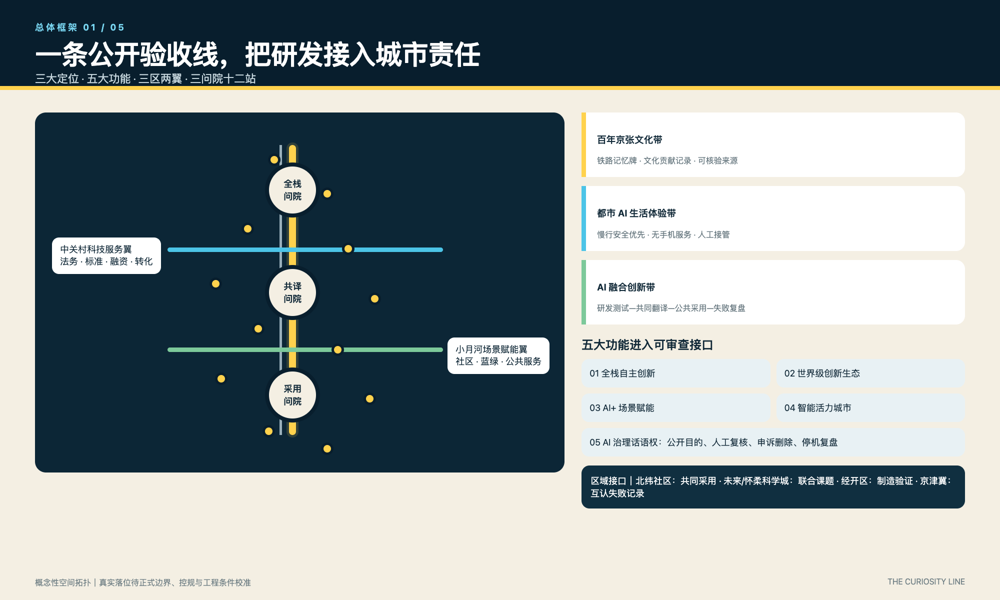
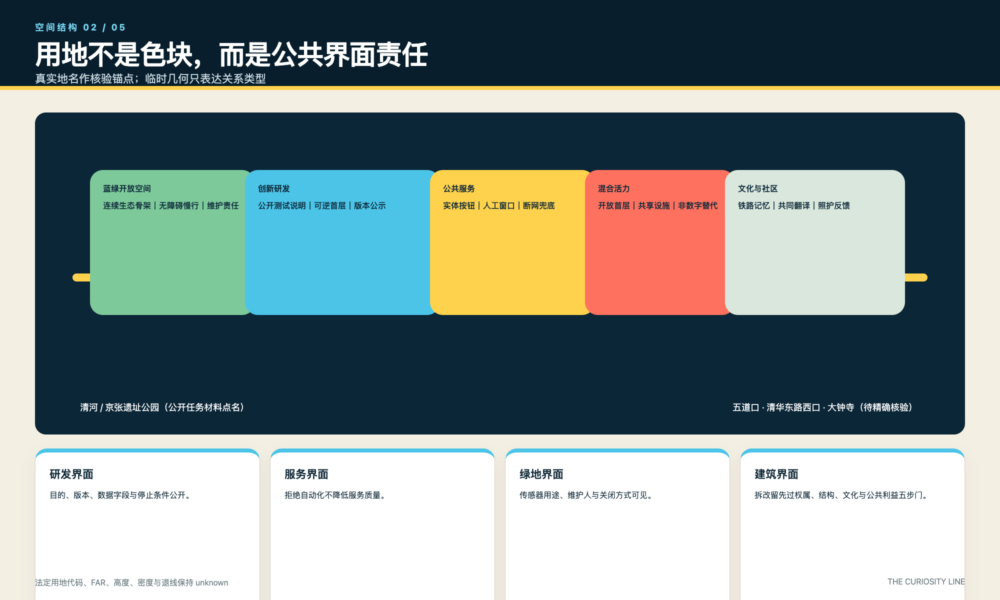
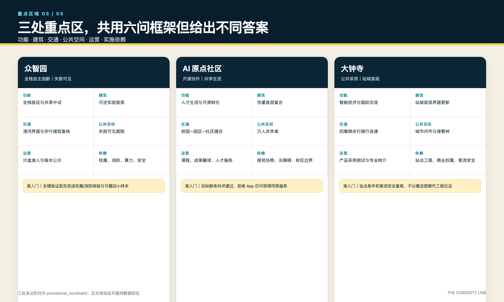
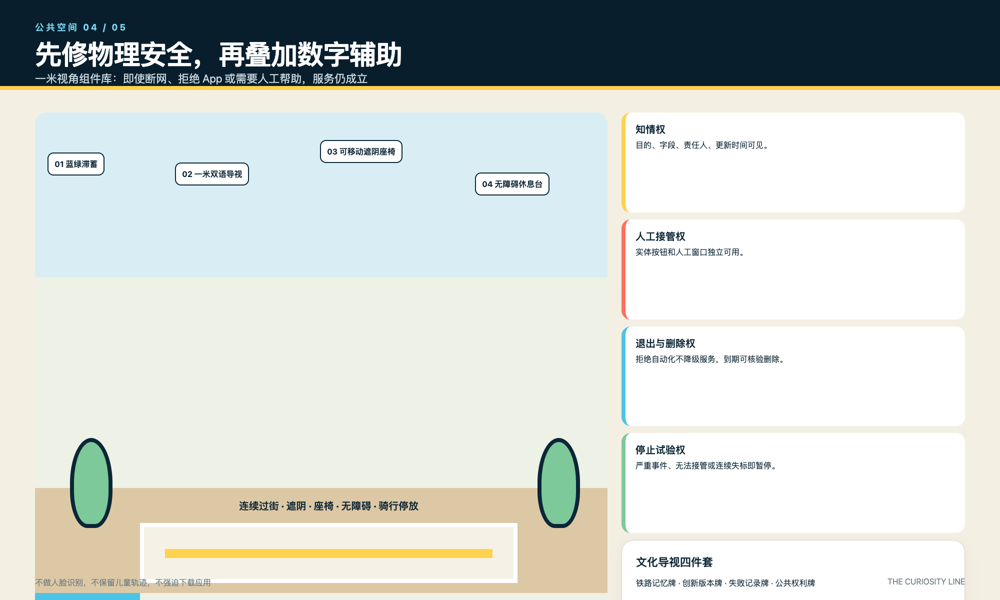
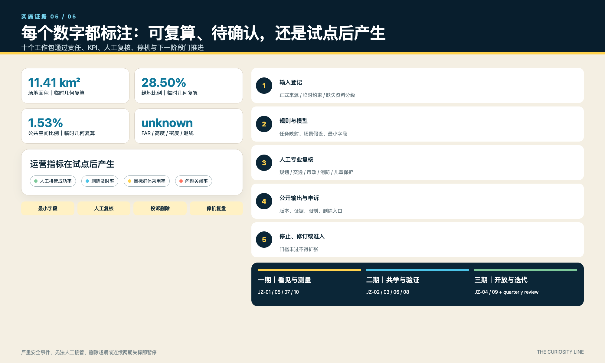

# 京张好奇线 / THE CURIOSITY LINE：把孩子的问题变成 AI 城市的公开验收尺

**结论先行。** 京张好奇线不是把 AI 设备铺进公园，而是把“为什么、谁负责、如何退出”变成研发进入城市之前的公共验收程序。方案为概念建议，临时边界、未知控规和未开展真实参与均显著保留。

## 设计依据与资料清单

本方案以正式征集公告和智能体任务书为任务依据，以场地包登记资料为证据导航；它不把导航摘要、临时边界或概念图升级为官方红线。当前 SITE_BOUNDARY 与三处 KEY_AREA 均为 provisional_constraint，只供生成、讨论与复算；控规、道路红线、轨道工程、权属、现状建筑、市政、消防、防洪、文保和设施资料仍待补。场地索引只列公开任务材料点名的京张遗址公园、清河、小月河、北五环、五道口、清华东路西口和大钟寺站，表达的是关系类型，不是测绘坐标。[source:OFFICIAL-ANNOUNCEMENT] [source:AGENT-TASKBOOK] [depth:existing_conditions_diagnosis]

逐资产权利台账位于 `report/copyright_statement.md`：原创文字、图表、HTML、PDF、GeoJSON 逐类登记作者、生成方法、输入、字体处理、许可与限制；外部案例只作短句机制引用，不复制图片、地图、Logo 或版式。`report/narrative.md` 记录场地索引和人工中英等义核对。边界面积只能由临时图层复算，不作为审批依据。[source:SOURCE-REGISTRY] [data:geometry/site_boundary.geojson#SITE-001] [metric:site_area_sqm]

## 三层范围工作框架

统筹研究范围回答区域创新链与协同接口，总体设计范围回答空间结构和更新工作包，重点区域范围用三张六联表验证功能、建筑、交通、公共空间、运营与实施依赖。三层之间以“问题—试验—采用—复盘”传导，不以同一张抽象图重复覆盖。临时几何只承担可替换的结构化索引，正式多边形到位后必须整体重算。[depth:three_level_scope_framework] [data:geometry/key_areas.geojson#PROV-KEY-001] [metric:key_area_count]

总体概念为“一线三问院、两翼十二问号站”。一线是京张好奇主线；三问院分别承载全栈测试、共同翻译和城市采用；两翼严格对应任务书的“中关村科技服务翼”和“小月河场景赋能翼”。三大定位是百年京张文化带、都市 AI 生活体验带、AI 融合创新带；五大功能为全栈自主创新、世界级创新生态、AI+场景赋能、智能活力城市、AI治理话语权。它们通过功能表而非口号逐项对应。[source:AGENT-TASKBOOK] [standard:PROJECT-AGENT-OPEN-CALL-TASKBOOK] [depth:overall_spatial_structure]

## 统筹研究范围产业与未来城市研究

创新生态按八类要素组织：土地提供可逆试验单元，空间提供三问院与十二站，产业提供交通、教育、公共服务和治理验证题，资金采用里程碑拨付，人才通过高校课程与驻地计划进入，算力采用分级配额，数据默认最小化并设置删除期限，场景以公开准入和退出门槛运营。众智园承担全栈验证，中关村科技服务翼连接法务、标准、融资与成果转化，小月河场景赋能翼连接社区、蓝绿维护与公共服务采用。[source:AGENT-TASKBOOK] [standard:PROJECT-OFFICIAL-ANNOUNCEMENT] [depth:overall_spatial_structure]

区域协同不虚构园区承诺：北纬社区作为社区采用与照护者反馈接口；未来科学城、怀柔科学城作为概念性联合课题与仪器验证接口；经开区作为制造、机器人和规模化测试接口；京津冀节点通过年度开放题、互认测试记录和失败案例库协作。输入—规则/模型—人工复核—公开输出—申诉删除—停机复盘构成可复现 AI 规划流程，任何模型输出不得替代规划审批。[source:PROCESSED-FACT-PACK] [depth:risk_missing_data] [metric:test_scenario_count]

## 总体设计范围城市更新与控规深度城市设计

总体结构以南北好奇主线、两条东西服务翼、三问院、十二站和连续蓝绿慢行网络为主次。用地分区表达创新、公共服务、混合活力和蓝绿公共空间之间的关系；建筑图层仅表达三个概念性更新基底；道路图层表达慢行修补、横向缝合和轨道接驳类型。方案不把临时多边形画成正式总图，场地索引中的真实名称也不等于精确落位。[data:geometry/land_use.geojson#LU-001] [data:geometry/buildings.geojson#BLDG-001] [depth:land_use_layout]

容积率、高度、密度、退线与拆改留结论保持待确认。当前完成的是“控制问题清单”：正式底图到位后按权属、结构安全、文化价值、碳排与适应性顺序，分别判定保留、修缮、改造、更新或拆除；未完成调查前不把任何现状建筑列为拆除。交通、市政和公共服务先建立前置条件与责任角色，再进入方案深化。[standard:MOHURD-CONTROL-DETAILED-PLANNING] [depth:development_intensity_controls] [metric:floor_area_ratio]

## 重点区域详细设计

三处重点区采用同一六类审查框架但给出不同答案。众智园：功能为全栈自主创新，建筑动作是可逆实验首层和共享中试界面，交通动作是清河界面及步行接驳复核，公共空间是失败可见庭院，运营为沙盒准入与版本公示，前置条件为权属、消防、算力与安全评估。AI原点社区：功能为开源协作和人才生活，建筑动作是存量首层复合，交通是校园—园区—社区慢行缝合，公共空间是共学桌，运营为课程、成果翻译和人才服务，前置条件为校区边界、居民协商和无障碍核查。[data:geometry/key_areas.geojson#PROV-KEY-001] [depth:three_key_area_detailed_design]

大钟寺：功能为智能经济、公共采用与国际交往，建筑动作是站城首层界面更新，交通是站点四象限步行与骑行连通，公共空间是城市问市和人类接管钟，运营为产品采用测试与专业转介，前置条件为站点工程、商业权属和客流安全。三处均不承诺建筑规模；六联动作和依赖详见图与实施矩阵，正式几何发布后才可形成地块级总平面。[data:geometry/key_areas.geojson#PROV-KEY-003] [metric:key_area_count]

## AI 创新生态、人才画像与 AI+ 场景

六类画像覆盖儿童、青少年、照护者与残障家庭、研发者、长者与低数字技能居民、运营与专业团队。十二张场景卡全部对应空间、运营人、数据边界和停机条件；其中 TVS-01 低速机器人安全课、TVS-02 儿童友好解释赛、TVS-03 公共服务退出演练是三项产业测试验证场景。数据默认不采集儿童身份与轨迹，不做人脸识别；拒绝应用不降低服务质量，纸质、实体按钮和人工窗口必须独立可用。[metric:persona_count] [metric:test_scenario_count] [source:UNICEF-AI-CHILDREN]

三项测试遵循同一生命周期：书面目的与最小字段清单—现场风险核查—小规模限时运行—人工复核—公开结果与投诉入口—到期删除—决定停止、修订或进入下一阶段。TVS-01 由现场安全员一键停机；TVS-02 由教师、照护者、儿童观察组共同评价；TVS-03 必须证明断网时人工服务仍可运行。只有安全事件为零、人工接管成功、删除记录完整并完成目标群体复核，才可进入下一阶段。[source:BEIJING-CHILD-FRIENDLY] [data:geometry/public_space.geojson#PUBLIC-001] [depth:municipal_new_infrastructure]

## 用地、建筑规模与拆改留方案

用地结构以现有提交几何作为概念分区：创新研发、混合活力、公共服务与蓝绿开放空间相互咬合，避免封闭园区。每类用地对应一个公共界面责任：研发界面需提供公开测试说明，混合界面需保留无手机服务，公共服务界面需设置人工接管，绿地界面需公开传感器用途和维护责任。该分类是设计语言，不替代法定用地代码。[standard:MNR-LAND-USE-CLASSIFICATION-GUIDE] [data:geometry/land_use.geojson#LU-001] [depth:land_use_layout]

三个建筑基底仅代表问院原型位置与面积复算样本，不代表现状建筑、批准规模或拆除清单。拆改留采用五步门：资料完整性、权属与结构、历史文化、公共利益、碳与成本；任何一门缺证据即保持“待调查”。高度与体量建议只描述界面连续、首层开放、屋顶设备收敛和沿历史廊道的尺度协调，不给伪精确米数。[data:geometry/buildings.geojson#BLDG-001] [metric:building_footprint_area_sqm] [depth:retain_renovate_demolish]

建筑高度、体量和界面控制的完成含义是形成待正式底图校准的设计规则，而不是取得法定高度结论。[depth:height_massing_character]

## 交通、轨道、市政与公共服务设施

交通策略按“先物理安全、再数字辅助”排序：先补过街、遮阴、座椅、连续无障碍和非机动车停放，再讨论导航或预测。场地索引将北五环、五道口、清华东路西口和大钟寺站列为必须由正式道路与轨道资料核验的接口；现阶段道路 GeoJSON 只表达主线、横向缝合和微循环类型。站点一体化、停车供给和工程接驳均保持待专业复核。[data:geometry/roads.geojson#ROAD-001] [depth:traffic_rail_slow_parking] [source:SITE-PACKAGE]

市政与新型基础设施采用“端侧优先、分级算力、最小数据、传统服务兜底”。每个问号站需有电源、网络、排水、消防、维护与无障碍清单；断网不得中断求助或公共服务。传感器必须标注用途、责任人、更新时间、保留期限与关闭方式。缺少管线、能源、消防、防洪资料时只列接口和资源等级，不作工程可行性结论。[data:geometry/constraints.geojson#CONSTRAINTS] [depth:municipal_new_infrastructure] [standard:MOHURD-ARCH-DESIGN-DEPTH-2016]

## 蓝绿空间、公共空间与城市风貌

蓝绿系统以京张遗址公园为连续骨架，以清河和小月河为需核验的生态接口，通过东西花园缝合高校、社区和产业节点。公共空间组件库含一米导视、可移动遮阴座椅、无障碍休息台、实体求助按钮、纸质服务盒、传感器说明牌和可撤回试验边界七类组件；每一组件都同时标注非数字替代与维护责任。[data:geometry/green_space.geojson#GREEN-001] [data:geometry/public_space.geojson#PUBLIC-001] [metric:green_ratio]

视觉系统由“问号+道岔”Logo、中文“京张好奇线”和英文“THE CURIOSITY LINE”字标组成。深海军蓝代表可信底座，信号黄代表公开问题，珊瑚红代表人工接管，水蓝代表开放数据，绿色代表可维护环境；应用遵循高对比、双语、非颜色单一编码。文化导视分为铁路记忆牌、创新版本牌、失败记录牌和公共权利牌，史料只引用清权来源，未知内容明确写“不知道”。[standard:MOHURD-URBAN-DESIGN-MEASURES] [depth:blue_green_public_space] [metric:public_space_ratio]

离线公众验收工作台位于 `visual/index.html`：审阅者可用图层开关检查好奇主线、两翼、三问院与十二站的关系，用键盘切换三处重点区，并逐项核对四项公共权利、三项产业测试和五步实施证据链。`assets/media/cover.webp` 是 AI 生成的概念性设计叙事图，只用于帮助理解公共空间体验；它不是现状照片、正式边界、批准总图、公众意见或实施承诺。静态五图是交互体验的可打印替代，且继续显示 provisional / unknown 限定。

## 更新项目清单、实施政策与分期计划

JZ-01 至 JZ-10 均采用“建议责任角色—资源等级—阶段 KPI—人工复核—停机条件—下一阶段门槛”结构：JZ-01 主线修补由交通/街道协同、M级资源、以连续无障碍为门槛；JZ-02 至04 三问院由属地、产权人和运营联合、L级资源、以权属消防和目标群体测试为门槛；JZ-05 十二站由公共空间运营、S级可撤回资源、以人工接管和无障碍通过为门槛。[depth:renewal_project_list] [data:geometry/phasing.geojson#PHASE-001] [metric:renewal_project_count]

JZ-06 蓝绿缝合由园林水务协同、M级资源；JZ-07 人工服务台由公共服务部门、S级常态人力；JZ-08 文化贡献系统由文史与开源社区、S级资源；JZ-09 全球好奇周由活动联合体、M级临时资源；JZ-10 季度体检由独立评估与公众观察组、S级资源。三期依次为看见与测量、共学与验证、开放与迭代；任一项目出现严重安全事件、无法人工接管、投诉删除超期或连续两期 KPI 不达标即暂停。[depth:phasing_implementation] [metric:question_station_count] [source:AGENT-TASKBOOK]

## 指标体系、面积复算与合规矩阵

空间指标分三类。可复算但依赖临时几何的指标包括约 11.41 平方公里场地面积、约 21.36 万平方米概念建筑基底、约 28.50% 绿地比例和约 1.53% 公共空间比例；它们只能说明提交图层内部一致性。需官方资料的 FAR、高度、密度、退线和正式重点区面积保持 unknown。运营指标包括人工接管成功率、删除及时率、目标群体采用率和问题关闭率，需在试点后产生，不以愿景数字冒充基线。[metric:site_area_sqm] [metric:green_ratio] [depth:metrics_recalculation]

`compliance_matrix.json` 已逐条重写：23 项要求分别指向最相关章节、图层、指标、图纸、视觉章节、来源、假设和自检，不再整表复制同一组引用。`design_depth_matrix.json` 的 complete 表示本阶段已经交付“设计结论或明确的数据缺口与后续判定方法”，不表示缺失控规已经获得。所有数值在替换正式边界后需重新运行空间复核并更新图、表、PDF、HTML 和清单哈希。[standard:PROJECT-OFFICIAL-ANNOUNCEMENT] [depth:risk_missing_data] [metric:floor_area_ratio]

## 风险、版权与合规说明

主要风险包括：临时边界被误读、缺控规造成伪精确、未经参与验证的包容性主张、AI误判或偏差、隐私与数据过度收集、人工接管失效、运维资源中断、版权、授权与来源不清。对应控制是显著公开资料边界、永久水印和假设登记、unknown 指标、目标群体共评、限时小样本、字段最小化、人工专业复核、实体兜底、停机门槛和逐资产版权台账。合规结论必须由有权专业人员复核，AI只辅助整理、制图与一致性检查，不替代规划、建筑、交通、市政、消防、法律、医疗或儿童保护专业责任。[depth:risk_missing_data] [source:SOURCE-REGISTRY] [data:geometry/constraints.geojson#CONSTRAINTS]

全部可见资产由投稿者使用本地代码、自有结构化数据和声明的 AI 图像生成工具生成；不含外部图片、地图瓦片、企业标志、可识别人物肖像、远程字体或跟踪代码。概念封面包含合成人物与空间，不代表真实人物、真实参与或场地现状；系统字体仅在本地渲染为像素或 PDF CID 字形，不随包分发字体文件。原创包采用 COMMUNITY-DISPLAY-ONLY；第三方网页仅作为事实与机制引用，其许可不转授。真实儿童、照护者、残障人士、长者、居民、研发团队和一线运营者尚未参与，因此当前是需共同设计验证的概念建议，不是已获采用或批准的成果。

## 参考资料

正式任务依据为 `brief/public-brief.md`、征集公告摘录和 `brief/site-package/agent_taskbook.json`；机器导航包括 design_brief、allowed_design_space、source_registry、agent_fact_pack 和缺资料清单。儿童友好与儿童 AI 原则来自已登记的北京儿童友好文件和 UNICEF 指南；国际案例仅用于比较治理机制，不使用其图像或设计资产。完整 URL、访问用途和限制见 `sources.json`，逐资产作者与生成方式见 `report/copyright_statement.md`。[source:OFFICIAL-ANNOUNCEMENT] [source:AGENT-TASKBOOK] [source:BEIJING-CHILD-FRIENDLY]

引用采用三层纪律：正式来源支撑任务和标准，场地包支撑当前可用数据及缺口，案例来源只支撑机制类比。任何来源均不能把临时几何变成官方红线，不能证明未开展的公众参与，也不能代替版权授权。中英文正文、HTML、A3、A0 和五组图件逐项对应，人工核对记录说明相同的数字、风险限定、责任和停机条件。[source:UNICEF-AI-CHILDREN] [source:CASE-PUNGGOL] [standard:PROJECT-OFFICIAL-ANNOUNCEMENT]
