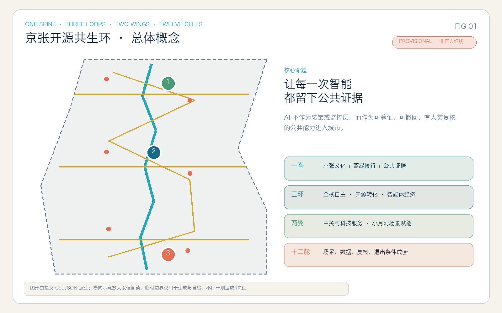
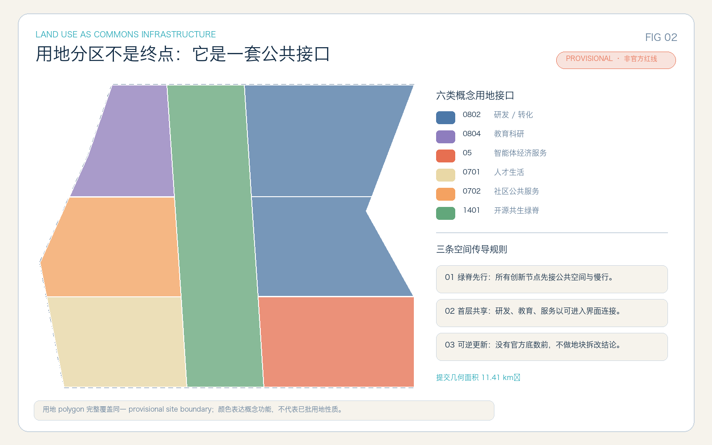
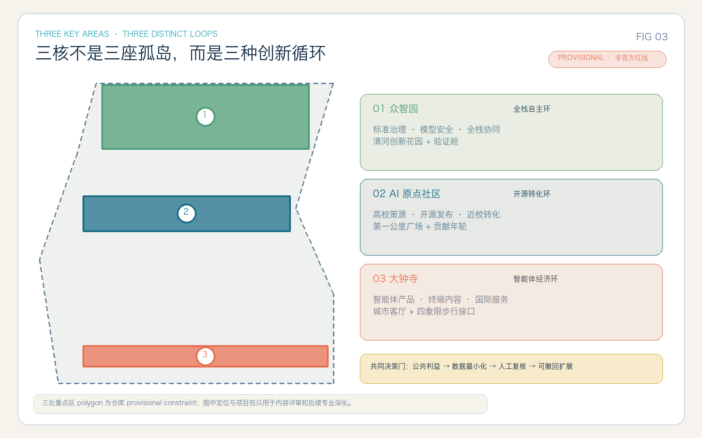
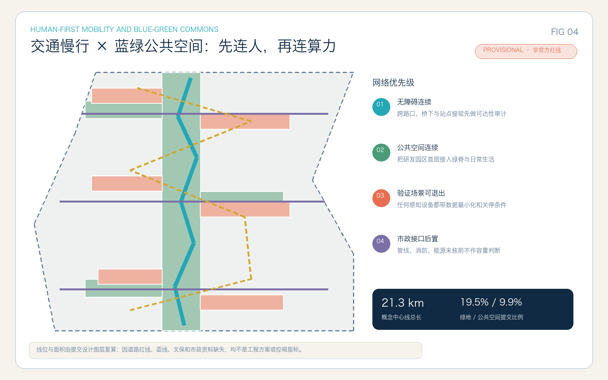
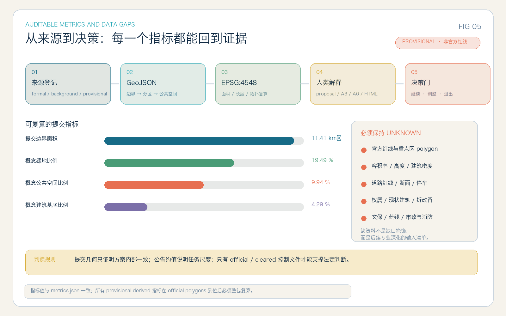

# 京张开源共生环

## 可验证公共智能的三核两翼城市设计

**Jing-Zhang Open Commons Loop / JZ OCL**

> 让每一次智能，都留下公共证据。

本方案从一个比“在哪里放置 AI 企业”更基础的问题出发：当人工智能进入城市，谁得到便利，谁承担风险，谁有权复核，失败后怎样退出？因此，“京张开源共生环”不把 AI 当作建筑表皮、屏幕装置或全域感知网络，而把它定义为一组公共制度与空间接口：用途明确、数据最小、过程留痕、人工终审、可以撤回。京张铁路的百年时间线由此不只是文化背景，更成为一种设计伦理——从可见的工业基础设施，走向可审计的数字基础设施。

方案的空间句法是“一脊、三环、两翼、十二舱”。一脊是京张文化、蓝绿慢行与公共证据共生脊；三环分别是众智园“全栈自主环”、北京 AI 原点社区“开源转化环”、大钟寺“智能体经济环”；两翼是中关村科技服务接口与小月河场景赋能接口；十二舱是带有数据、复核和退出条件的城市 AI 场景。全部空间结论均为开放共创建议，需由规划、建筑、交通、景观、市政、文保、运营与社区专业团队继续深化。

## 设计依据与资料清单

方案的事实层以公开征集公告和仓库任务书为起点，不以模型常识替代项目资料。[source:OFFICIAL-ANNOUNCEMENT] 提供三层工作范围、总体任务和三处重点区要求；[source:AGENT-TASKBOOK] 把开放征集转换为 agent.1—agent.6 的命名、场景、人才、地标、运营和机器可审计成果；[source:SITE-PACKAGE]、[source:SOURCE-REGISTRY] 与 [source:PROCESSED-FACT-PACK] 分别承担机器包、来源许可和阅读导航职责。原始临时边界来自 [source:BOUNDARY-SOURCE] 与 [source:KEY-AREA-SOURCE]。标准层采用 [source:STANDARD-URBAN-DESIGN]、[source:STANDARD-CONTROL-PLAN]、[source:STANDARD-LAND-USE]，并在矩阵中对应 [standard:PROJECT-OFFICIAL-ANNOUNCEMENT]、[standard:PROJECT-AGENT-OPEN-CALL-TASKBOOK]、[standard:MOHURD-URBAN-DESIGN-MEASURES]、[standard:MOHURD-CONTROL-DETAILED-PLANNING]、[standard:MNR-LAND-USE-CLASSIFICATION-GUIDE]、[standard:MOHURD-ARCH-DESIGN-DEPTH-2016]。

当前仓库没有官方总体设计范围 polygon、三处重点区域 polygon、地块权属、现状建筑底图、法定控规条件、道路红线、轨道站界、文保范围、河道蓝线和市政容量资料。因此 [data:geometry/site_boundary.geojson#SITE-001] 与 [data:geometry/key_areas.geojson#PROV-KEY-001] 仅是 `provisional_constraint`，`official_boundary=false`；其余用地、建筑、道路、绿地、公共空间和分期均是该临时几何内的 `design_proposal`。它们可以支持方案内容评审、内部拓扑校验和方法比较，不能用于测量放线、地块判断、审批或法定控制。官方 polygon 到位后，必须整包重跑九类 GeoJSON、metrics、五张图、HTML 与 PDF，而不能只替换一张底图。这一资料判断由 [depth:existing_conditions_diagnosis] 管理。

证据分四层：`proposal.md` 是唯一人类可读方案真源；GeoJSON 与 `metrics.json` 是可复算层；合规、标准、设计深度和自检矩阵是可审计层；A3、A0 与离线 HTML 是派生解释层。缺失资料不被填入猜测值，而在 [data:geometry/constraints.geojson#DATA-GAPS]、`assumptions.json` 和 unknown metrics 中显式保留。这样做不是降低设计深度，而是把“已知、设计建议、待专业确认”分开，使后续团队能准确接手。

## 三层范围工作框架

三层范围不是三张彼此独立的图，而是一套从战略到空间、再从空间反馈战略的工作循环。统筹研究范围约 43.6 平方公里，用于回答海淀 AI 创新链如何与高校策源、企业转化、公共生活和国际传播形成系统；总体设计范围公告约值为 11.4 平方公里 [metric:announced_site_area_sqm]，用于回答城市更新、产业空间、交通市政和蓝绿公共空间如何同构；三处重点区域公告合计约 368.4 公顷，用于把功能、建筑、公共空间、交通、场景与实施门槛落到详细设计。这一框架由 [depth:three_level_scope_framework] 约束，当前提交几何的三处重点区域数量为 [metric:key_area_count]。

统筹层提出“公共智能”的产业与治理原则：AI 产品不只在园区里被研发，还要在受控场景中被验证、解释和退出；总体层把原则转译为一条共生脊、六类用地接口、三条横向连接、蓝绿慢行系统和九个更新项目包；重点层用三个不同创新循环验证同一原则是否能适应全栈自主、开源转化和智能体经济。反馈方向同样重要：重点区若无法提供无障碍、公共首层、人工复核或低扰动运维条件，总体结构就不能宣称“公共”；场景若无法撤回，统筹层就不能把它作为创新指数的正向贡献。

[data:geometry/site_boundary.geojson#SITE-001] 是总体设计范围的临时工作容器，[data:geometry/key_areas.geojson#PROV-KEY-001]、[data:geometry/key_areas.geojson#PROV-KEY-002]、[data:geometry/key_areas.geojson#PROV-KEY-003] 是重点层工作容器。统筹研究范围没有被伪造为新 polygon，而通过产业机制、案例、用户画像和运营模型表达。三层成果都回接 `compliance_matrix.json`：17 项公告任务与 6 项 agent 任务共 23 项逐条对应正文、图层、指标和图纸，防止宏大叙事掩盖必答项。

## 统筹研究范围产业与未来城市研究

### 一脊、三环、两翼、十二舱

总体结构 [depth:overall_spatial_structure] 的第一性目标不是最大化产业楼面，而是缩短“知识产生—开放协作—产品验证—公共受益—规则修订”的循环。一脊沿京张文化与蓝绿慢行系统串联三核，既是日常通勤和休闲路径，也是让技术治理可见的公共界面。三环承担互补分工：北部众智园组织标准、安全、模型验证和全栈协同；中部 AI 原点社区组织高校策源、开源发布、第一公里转化和人才生活；南部大钟寺组织智能体产品、智能终端、数字内容、企业服务和国际交流。中关村科技服务翼把知识产权、法务、资本、算力和人才服务接入三环；小月河场景赋能翼把生态、社区、公共服务和低扰动试验接入创新活动。两翼是服务接口而非新增精确红线。

“十二舱”不是十二个封闭建筑，而是十二套可移植的场景协议。每套协议都包含目标用户、空间载体、最少数据、人工复核人和退出条件；满足条件才可从沙盒扩展，不能以“先部署再治理”替代公共决策。产业价值因此从企业数量扩展为四类贡献：开放知识贡献、可验证产品贡献、公共服务贡献、空间与社区贡献。品牌采用 **JZ OCL**：两段开放括号表示可进入、可退出，中央轨线表示京张时间脊，审核节点表示人类最终责任。文字口号“让每一次智能，都留下公共证据”只作为本次方案的原创传播建议，不代表任何机构已采用。

### 六个国际机制镜鉴

外部案例只用于比较机制，不向海淀移植规模、控制线、融资承诺或运营主体。Kendall Square 的启示是从“创新区”走向混合、可生活的“创新社区” [source:CASE-KENDALL-SQUARE]；新加坡 one-north 展示专业集群、living lab 与 work-live-play-learn 的结合 [source:CASE-ONE-NORTH]；Seoul AI Hub 展示城市支持、大学研究协同、分阶段创业服务和 PoC 支持 [source:CASE-SEOUL-AI-HUB]。Helsinki Maria 01 提供旧建筑适应性利用、公共首层和步行骑行连接的参照 [source:CASE-MARIA-01]；Paris-Saclay 提供学研产校园、全尺度示范与生态约束并置的参照 [source:CASE-PARIS-SACLAY]；Barcelona 22@ 提供工业地区更新、知识转移与市民创新协同的参照 [source:CASE-BARCELONA-22AT]。本方案吸收的是“机制最小单元”：公共首层、受控验证、混合生活、跨主体治理、年度复盘；不复制形态符号。

产业治理采用“开放场景契约”：每个参与者先声明公共问题和退出成本，再申请空间与数据接口；每次测试发布目的、数据最小化表、人工责任人、投诉入口和关停条件；评估不以点击量或曝光量为唯一指标，而同时看无障碍、隐私、碳与能源、社区扰动、知识开放和本地能力转移。城市不充当单一技术买家，而成为可验证需求的提出者和公共结果的保管者。该机制仍是概念建议，需要法务、数据治理、网络安全、采购和社区团队联合深化。

## 总体设计范围城市更新与控规深度城市设计

总体设计以 [data:geometry/land_use.geojson#LU-001] 的六类接口形成完整分区：科研转化、教育科研、智能体经济服务、人才生活、社区公共服务和开源共生绿脊。分区不是对现状地块的定性，而是回答不同城市界面应提供什么公共能力：科研空间必须有可进入的发布或验证界面，教育空间必须连接跨校慢行与社区学习，商业服务必须承担企业服务和国际交流，人才生活必须与日常公共服务同时落位，绿脊必须连续且能承载低侵入场景。该布局由 [depth:land_use_layout] 检查，分类表达参考 [standard:MNR-LAND-USE-CLASSIFICATION-GUIDE]，不能被解释为已批用地性质。

建筑层采用十二个“容量与界面原型” [data:geometry/buildings.geojson#BLDG-001]，用于检验空间结构能否容纳发布厅、测试舱、人才服务、社区学习、城市客厅等功能，而不是对任何现状建筑作拆改结论。开发强度 [depth:development_intensity_controls]、高度体量 [depth:height_massing_character] 和拆改留 [depth:retain_renovate_demolish] 均设置资料门槛：没有官方控规、现状建筑、权属、结构安全、文保和消防资料时，容积率、建筑高度、法定建筑密度、退线和总建筑规模保持 unknown。当前概念建筑基底只是设计原型，不可反推开发权利。

控规深度在本方案中表现为“可审查对象齐全”而非“伪造精确控制值”：用地完整覆盖且无重叠；建筑基底可复算；道路、绿地、公共空间与分期可以交叉校核；指标清楚区分公告约值、临时几何复算值和待确认值。任何后续强度建议必须先通过四道门：官方边界与地块、公共服务和交通承载、文保与蓝绿约束、市政消防和能源容量。只有四道门均具备清权资料，专业团队才进入定量控制。

## 重点区域详细设计

三处重点区域均采用“公共界面—创新内核—验证场景—退出机制”四层结构，由 [depth:three_key_area_detailed_design] 统一校核。它们的临时面积来自仓库 provisional polygon：众智园约 192.92 公顷 [metric:key_area_zhongzhiyuan_ai_acceleration_area_sqm]，北京 AI 原点社区约 104.32 公顷 [metric:key_area_beijing_ai_origin_community_sqm]，大钟寺约 72.05 公顷 [metric:key_area_dazhongsi_ai_industry_cluster_sqm]。数值仅用于提交几何内部对表，不构成官方重点区面积结论。

| 重点区与循环 | 空间组织 | 功能与建筑界面 | 验证与公共利益 | 专业深化前置条件 |
| --- | --- | --- | --- | --- |
| 众智园 · 全栈自主环 | 以清河创新花园、京张共生脊接口和模型验证舱构成“园—廊—院”序列 | 面向自主模型、算力软硬协同、标准治理和安全评测；首层配置可预约展示、标准工作坊与跨团队复盘空间 | 模型安全验证只使用获准或合成数据，结果形成公开方法摘要；公共绿地不变成封闭测试场 | 清河及蓝绿控制、现状建筑、对外交通、能源与消防容量；对应 [data:geometry/key_areas.geojson#PROV-KEY-001] |
| 北京 AI 原点社区 · 开源转化环 | 以“第一公里广场—开源发布厅—贡献年轮—人才生活链”连接高校、园区和街区 | 面向成果发布、孵化、知识产权、开源维护、人才居住和社区学习；建筑首层优先可进入、可共享 | 贡献以自愿公开的代码、标准、课程和公共项目记录呈现，不以个人轨迹换取声誉 | 校园边界、地块权属、现状建筑、轨道站点和生活服务底数；对应 [data:geometry/key_areas.geojson#PROV-KEY-002] |
| 大钟寺 · 智能体经济环 | 以城市客厅、四象限步行接口、产品路演舱和企业服务站形成高密度城市网络 | 面向智能体产品、终端、内容消费、数据合规、国际路演与商业服务，强调街道层公共性 | 产品试验先在限定空间、限定时段和明确责任人下开展；商业展示不得挤占基本通行与无障碍空间 | 大钟寺站界、路口交通、商业权属、消防疏散和停车底数；对应 [data:geometry/key_areas.geojson#PROV-KEY-003] |

三个循环共享同一个决策门：先证明公共问题真实存在，再证明最小数据足够，再指定有权限暂停系统的人类责任人，最后才讨论扩展。空间上，三个重点区均必须向共生脊开放至少一种非消费型公共界面，避免创新资源成为门禁园区内部福利；运营上，年度复盘必须允许居民、维护者和无障碍用户否决造成持续负担的场景。这些均为参考方案，由后续多专业团队结合正式底图和利益相关者协商深化。

## AI 创新生态、人才画像与 AI+ 场景

### 七类使用者，不以“人才”遮蔽普通人

方案记录七类主要画像 [metric:persona_count]：开源开发者需要协作、发布与可持续维护；高校师生需要近校转化与跨校学习；初创团队需要低成本试验和合规支持；成熟企业员工与访客需要产品验证、企业服务和国际交流；周边居民需要低扰动更新、健康服务导航与日常休闲；青少年与教师需要可信课程和非屏幕活动；无障碍出行者、老年人及城市维护者需要连续通行、清楚反馈和人工服务兜底。画像只用于定义需求，不用于个体打标签、预测价值或差别定价。空间载体分别回接 [data:geometry/public_space.geojson#PUBLIC-001]、[data:geometry/roads.geojson#ROAD-001] 和 [data:geometry/buildings.geojson#BLDG-001]。

### 十二张可退出场景卡

本方案提供 12 张场景卡 [metric:scenario_card_count]，其中 3 张是产业测试验证场景 [metric:industry_validation_scenario_count]。每张卡的“最少数据”是上限而非默认采集清单；没有明确授权就不启用。场景位置均为概念载体，不能替代设备选址、数据合规或安全论证。

| 卡 | 服务对象与空间载体 | 最少数据 | 人工复核与退出条件 |
| --- | --- | --- | --- |
| 01 京张文化导览 | 居民、访客；共生脊文化节点 | 已公开并清权的史料、用户主动选择的语言与无障碍偏好；不做人脸识别 | 文史编辑审核内容；断网可用实体导视，错误率或投诉超阈即下线专题 |
| 02 慢行与无障碍审计 | 轮椅使用者、老年人、骑行者；三条横向连接 | 人工踏勘、匿名设施缺陷、聚合通行时段；不保存连续个人轨迹 | 无障碍顾问确认优先级；传感器可拆除，未形成修复闭环则停止采集 |
| 03 健康服务导航 | 居民、访客；社区服务节点 | 公开机构目录、营业时间和用户主动输入的服务类别；不采病历、不诊断 | 社区服务人员维护目录；一键转人工或电话，目录失准即降级为静态清单 |
| 04 企业服务协同助手 | 初创与企业团队；两翼服务站 | 公开政策、授权提交的企业问题与办理状态；不同企业数据隔离 | 专业服务人员确认每项建议；无法给出来源时只提供人工窗口 |
| 05 公共活动安全复核 | 活动参与者、运营维护者；公共广场 | 场地容量、天气、设备状态和聚合客流；不做身份识别 | 现场负责人保留最终指挥权；活动结束即删除临时数据，误报持续则撤除设备 |
| 06 低速配送机器人 | 行动不便者、园区使用者；限定慢行支线 | 车辆遥测、已核准路线和障碍类别；不采路人身份 | 安全员远程接管；越界、通信异常或无障碍冲突立即停车并退出公共路径 |
| 07 开源第一公里发布 | 师生、维护者、初创团队；原点社区发布厅 | 自愿提交的仓库元数据、许可证与维护计划 | 开源维护者和法务共同复核；贡献者可撤回展示，线下公告板始终可用 |
| 08 模型保证花园〔产业验证〕 | 模型团队、标准机构、公众观察者；众智园验证舱 | 合成或获准评测集、模型版本、风险类别和复现日志 | 独立测试负责人签署结果；数据授权、隔离或复现任一失败即关闭沙盒 |
| 09 具身低速街道实验室〔产业验证〕 | 机器人团队、无障碍用户、交通管理者；封闭可控测试段 | 车辆遥测、场景标签、人工观察；不做无关路人人脸采集 | 安全官现场封控与急停；无法保持行人优先、噪声或速度边界即退出 |
| 10 边缘算力与能源沙盒〔产业验证〕 | 基础设施团队、园区运营者；端侧算力驿站 | 节点负载、聚合能耗、环境与故障状态；不进入业务内容 | 市政和能源工程师复核；消防、供能、散热或网络隔离未通过即物理断开 |
| 11 青少年 AI 学习共坊 | 学生、教师、家长；社区学习节点 | 经教师选定的课程材料和自愿作品；不建长期能力画像 | 教师掌控课堂与作品发布；可切换为无设备课程，监护授权撤回即删除作品 |
| 12 公共贡献账本 | 志愿者、开发者、居民；贡献年轮地标 | 自愿公开的项目、课程、维护和公共反馈记录；不做隐性积分 | 社区评议组确认公共性；可匿名、可更正、可退出，不与基本服务资格绑定 |

十二舱的共同审计字段是：目的、空间、数据来源、保留期限、人工责任人、投诉入口、降级方式、关停条件和复盘日期。任何场景若只能在持续采集个人信息、替代人工责任或制造排他门槛的前提下成立，就不进入下一阶段。这个门槛把“AI 创新”从设备数量转化为公共能力质量。

## 用地、建筑规模与拆改留方案

六类概念用地完全覆盖同一临时边界且无重叠。科研转化接口约 336.11 公顷 [metric:land_use_0802_area_sqm]，教育科研接口约 100.69 公顷 [metric:land_use_0804_area_sqm]，智能体经济服务接口约 158.83 公顷 [metric:land_use_05_area_sqm]，人才生活接口约 133.57 公顷 [metric:land_use_0701_area_sqm]，社区公共服务接口约 145.08 公顷 [metric:land_use_0702_area_sqm]，开源共生绿脊接口约 267.00 公顷 [metric:land_use_1401_area_sqm]。数值由设计分区在 EPSG:4548 下复算，用于检查方案内部结构，不代表现状或法定用地面积。

十二个建筑原型合并基底约 48.94 公顷 [metric:building_footprint_area_sqm]，相对提交临时边界的概念基底比例约 4.29% [metric:building_density_design_ratio]。低比例不表达开发强度主张，而是刻意只画出“需要被验证的公共界面和容量原型”，把未掌握的现状建筑留在未知层。总建筑面积、容积率、建筑高度和法定建筑密度不得由这些原型外推；待正式控规条件、现状测绘和工程约束进入后，应由专业团队重新建立容量模型。

拆改留采用五步证据梯，而不是先画拆除色块：第一步核对权属、年代、用途与安全；第二步核对文保、历史价值、碳成本和社区记忆；第三步判断空间是否可通过首层开放、无障碍和设备更新适应新功能；第四步比较保留修缮、适应性改造、局部增补与新建的全生命周期成本；第五步才形成逐栋结论并公开依据。当前 [data:geometry/buildings.geojson#BLDG-001] 全部标为 `adaptive_reuse_or_infill_candidate`，不对应任何真实建筑的保留、改造或拆除决定。

建筑风貌建议以“工业时间层、校园知识层、当代开放层”并置：保留可识别的材料与尺度线索，新增首层强调可进入和可观看的公共活动，设备与测试设施采用可拆卸、可维护构造。高度、屋顶、天际线和退界只提出关系原则——向遗址、公园、河道和社区界面降低压迫、形成连续步行界面——不写入没有依据的数值。这一节共同落实 [depth:land_use_layout]、[depth:development_intensity_controls]、[depth:height_massing_character] 与 [depth:retain_renovate_demolish]。

## 交通、轨道、市政与公共服务设施

交通结构遵循“先连人，再连算力”。[data:geometry/roads.geojson#ROAD-001] 表达一条南北共生脊、三条东西连接和一条串联三核的骑行验证链，概念中心线总长约 21.27 公里 [metric:road_centerline_length_m]。这些线只描述连接意图：优先修复公园、社区、高校、园区与轨道站点之间的无障碍断点，再组织骑行和公共交通接驳，最后才考虑自动配送和测试车辆。由于缺少道路红线、断面、路权、交通量、桥隧、轨道站界和停车底数，`road_area_sqm` 与 `road_ratio` 保持 unknown，图中线位不能作为工程设计。

轨道接驳采用“站外十五分钟公共界面”方法：每个站点方向先盘点连续人行、过街等待、遮阴避雨、非机动车停放、夜间照明和无障碍垂直交通，再决定接驳设施。大钟寺侧重点是四象限步行连通与城市客厅，原点社区侧重点是校园—园区—街区的第一公里，众智园侧重点是对外交通与清河界面。停车不以增加总量为默认答案，而以共享、错峰、装卸时窗和无障碍车位保障为先；任何数量建议需交通调查后确定。对应专业深度为 [depth:traffic_rail_slow_parking]。

市政与新型基础设施采用“接口先于容量”原则 [depth:municipal_new_infrastructure]。端侧算力驿站只定义可隔离网络、可计量能耗、余热与噪声管理、消防关停和公共服务降级接口；没有能源、通信、管线、消防和防洪资料，不判断设备容量。公共服务节点则保留人工窗口、电话和实体导视，保证数字系统失效时健康导航、企业服务、文化导览和活动安全仍可运行。所有未具备资料的约束集中在 [data:geometry/constraints.geojson#DATA-GAPS]，并在每个项目决策门前再次检查。

## 蓝绿空间、公共空间与城市风貌

共生脊把京张文化叙事、蓝绿生态、日常慢行和创新交往合为一套连续公共基础设施。[data:geometry/green_space.geojson#GREEN-001] 的概念绿地合并面积约 222.41 公顷 [metric:green_space_area_sqm]，占提交临时边界约 19.49% [metric:green_ratio]；[data:geometry/public_space.geojson#PUBLIC-001] 的概念公共空间合并面积约 113.41 公顷 [metric:public_space_area_sqm]，占比约 9.94% [metric:public_space_ratio]。绿地与公共空间可能局部复合，两个比例不可简单相加，也不是法定绿地率或公共空间控制指标。设计深度由 [depth:blue_green_public_space] 校核。

网络优先修复四类断点：跨快速路与铁路的无障碍连续、园区门禁对公共慢行的阻断、站点与街区之间的遮阴和停放缺口、河道与遗址界面的低扰动可达。生态空间优先承担雨洪、降温、栖息和日常休闲，再谨慎容纳科普与测试；任何传感设施都应可拆卸、低能耗、不得妨碍基本通行。由于缺少河道蓝线、文保控制和现状树木资料，具体跨越、照明、铺装和活动强度必须经过水务、文保、园林与社区联合复核。

四个“朝圣与荣誉”地标 [metric:landmark_count] 不追求巨型物件：**开源第一公里**是一处从高校成果走向公共发布的门廊；**百年道岔**用可触摸时间线连接铁路工程史与 AI 基础设施伦理；**贡献年轮**记录自愿公开的代码、标准、课程与社区维护；**模型保证花园**把风险测试的方法与退出机制转译为公众可理解的展示。四者均是概念性公共艺术与运营建议，名称、形式、内容需文史、无障碍、景观和社区团队深化，不使用未经许可的企业标志或人物肖像。

城市风貌的统一性来自“可读的时间层”而非单一造型：遗址与旧建筑保留真实材料和尺度，新介入采用轻量、可逆和清楚标识的构件，夜间照明以安全和低扰动为先，数字媒介不遮挡历史本体。JZ OCL 导视采用深蓝、青、绿与珊瑚色区分证据、连接、生态和退出警示；所有关键信息同时提供文字、图形和高对比版本。

## 更新项目清单、实施政策与分期计划

方案形成 9 个更新项目包 [metric:renewal_project_count]，项目包是可拆分、可评估的工作单元，不是已确定的投资或建设承诺。

| 编号 | 项目包 | 最小交付 | 启动门槛与停止条件 |
| --- | --- | --- | --- |
| P01 | 共生脊无障碍与断点修复 | 连续路线审计、优先断点样段、实体导视 | 先取得道路与权属资料；若施工影响文保或基本通行则重选样段 |
| P02 | 百年京张公共叙事系统 | 清权史料索引、百年道岔、离线导览 | 文史审核与无障碍测试通过；内容争议未解决则保持静态说明 |
| P03 | 众智园模型保证花园 | 受控评测舱、公开方法摘要、绿地公共界面 | 数据授权、网络隔离、消防和能源均通过；任一失效即关停测试 |
| P04 | AI 原点第一公里 | 开源发布厅、知识产权服务、贡献年轮 | 高校、社区与维护者共同定义规则；贡献不得绑定基本服务权益 |
| P05 | 大钟寺四象限接口 | 步行可达审计、城市客厅、企业服务站 | 轨道与路口条件确认；不能保持行人优先则不部署商业场景 |
| P06 | 三核人才与社区服务链 | 共享学习、健康导航、人才生活服务节点 | 设施底数和人工兜底明确；数字入口不得成为唯一入口 |
| P07 | 低速具身街道实验室 | 限定路线、物理急停、安全复盘 | 封闭可控、保险和安全员到位；越界或无障碍冲突立即退出 |
| P08 | 边缘算力与能源驿站 | 可隔离节点、计量、消防关停接口 | 市政容量和全生命周期评估通过；不得以公共空间承担外部成本 |
| P09 | 开源运营与公共证据平台 | 场景台账、投诉入口、年度复盘、退出档案 | 治理主体和数据责任明确；不能公开方法与影响时不扩展 |

分期不是固定年份表，而是 3 个决策门 [metric:phase_count]，由 [data:geometry/phasing.geojson#PHASE-001] 表达概念工作范围。第一阶段“证据与公共底座”约 356.23 公顷 [metric:phase_1_area_sqm]：补齐正式边界、现状和约束资料，完成无障碍审计、低成本公共空间样段和离线服务。第二阶段“受控验证与跨核连接”约 547.50 公顷 [metric:phase_2_area_sqm]：只扩展通过数据、安全、能源、社区和运维评估的场景。第三阶段“制度化与可撤回扩展”约 237.54 公顷 [metric:phase_3_area_sqm]：把有效机制写入运营标准，同时保留退出预算与替代服务。面积仅是临时几何分区，不对应开工时序或投资规模。

每年运行一个公开循环：一季度发布问题与资料缺口，二季度小规模共创和沙盒验证，三季度由用户、专业团队与运营者复核，四季度公布继续、调整或退出决定。政策建议包括开放场景契约、公共首层激励、适应性利用优先、算力能耗披露、无障碍与人工兜底强制项、贡献记录可撤回、退出费用前置计入。项目与分期分别由 [depth:renewal_project_list] 和 [depth:phasing_implementation] 校核。

## 指标体系、面积复算与合规矩阵

指标采用 EPSG:4548 对提交 GeoJSON 复算，目的在于证明方案内部一致，不把临时几何包装成官方事实。临时总体边界面积约 1,141.28 公顷 [metric:site_area_sqm]，与公告约 1,140 公顷 [metric:announced_site_area_sqm] 接近，但这一接近不能升级临时边界的权威等级。建筑、绿地、公共空间、道路中心线、重点区、场景、人物、地标、项目和分期的计数均能回到正文或图层；`visual/index.html` 以相同 metric ID 展示核心数值，由 [depth:metrics_recalculation] 对表。

| 指标组 | 可复算值与证据 | 判读边界 |
| --- | --- | --- |
| 总体范围 | 11,412,825.386 平方米 [metric:site_area_sqm]；公告约值 11,400,000 平方米 [metric:announced_site_area_sqm] | 前者源于 provisional polygon，后者只说明任务尺度 |
| 建筑原型 | 基底 489,365.491 平方米 [metric:building_footprint_area_sqm]；概念基底比 0.042879 [metric:building_density_design_ratio] | 不等于现状建筑、总建面、容积率或法定密度 |
| 蓝绿公共空间 | 绿地 2,224,115.396 平方米 [metric:green_space_area_sqm]、比值 0.194879 [metric:green_ratio]；公共空间 1,134,106.229 平方米 [metric:public_space_area_sqm]、比值 0.099371 [metric:public_space_ratio] | 两类空间可复合，不相加为控制指标 |
| 交通 | 概念中心线 21,268.811 米 [metric:road_centerline_length_m] | 不是道路红线、断面或工程长度 |
| 重点区 | 3 处 [metric:key_area_count]；众智园 1,929,201.877 平方米 [metric:key_area_zhongzhiyuan_ai_acceleration_area_sqm]；原点社区 1,043,236.909 平方米 [metric:key_area_beijing_ai_origin_community_sqm]；大钟寺 720,454.219 平方米 [metric:key_area_dazhongsi_ai_industry_cluster_sqm] | 均来自 provisional key-area polygons |
| 用地接口 | 05 类 1,588,290.118 平方米 [metric:land_use_05_area_sqm]；0701 类 1,335,677.953 平方米 [metric:land_use_0701_area_sqm]；0702 类 1,450,843.765 平方米 [metric:land_use_0702_area_sqm] | 概念功能接口，不代表已批性质 |
| 用地接口续 | 0802 类 3,361,106.642 平方米 [metric:land_use_0802_area_sqm]；0804 类 1,006,902.574 平方米 [metric:land_use_0804_area_sqm]；1401 类 2,670,004.333 平方米 [metric:land_use_1401_area_sqm] | 六类合计覆盖提交边界，拓扑无重叠 |
| 内容深度 | 12 张场景卡 [metric:scenario_card_count]，其中 3 张产业验证卡 [metric:industry_validation_scenario_count]；7 类画像 [metric:persona_count]；4 个地标 [metric:landmark_count]；9 个项目包 [metric:renewal_project_count] | 计数可回到本正文表格 |
| 分期 | 3 阶段 [metric:phase_count]；阶段一 3,562,338.957 平方米 [metric:phase_1_area_sqm]；阶段二 5,475,048.129 平方米 [metric:phase_2_area_sqm]；阶段三 2,375,419.800 平方米 [metric:phase_3_area_sqm] | 决策门工作范围，不是建设时序承诺 |

必须保持 unknown 的指标包括总建筑面积、容积率、建筑高度、法定建筑密度、道路面积和道路比例。它们分别依赖官方控规、现状测绘、道路红线和工程资料，不能用行业平均值填补。15 项设计深度已进入矩阵：现状与范围 [depth:existing_conditions_diagnosis] [depth:three_level_scope_framework]，结构与用地 [depth:overall_spatial_structure] [depth:land_use_layout]，强度与建筑 [depth:development_intensity_controls] [depth:height_massing_character] [depth:retain_renovate_demolish]，交通市政景观 [depth:traffic_rail_slow_parking] [depth:municipal_new_infrastructure] [depth:blue_green_public_space]，重点区与实施 [depth:three_key_area_detailed_design] [depth:renewal_project_list] [depth:phasing_implementation]，校核与风险 [depth:metrics_recalculation] [depth:risk_missing_data]。

合规矩阵把公告 1.3.1—1.5.3.3 的 17 个任务与 agent.1—agent.6 的 6 个任务逐项映射。每一项至少具有正文、A3/A0、GeoJSON、metric、source、assumption 和 self-check 证据之一；状态 `complete` 表示本次方案包已作答，不表示相关规划或工程工作已获审定。五张信息图、离线 HTML 和两套 PDF 均从同一指标与几何层派生，避免多个版本各说一套数字。

## 风险、版权与合规说明

首要风险是边界权威性：全部设计图层依赖临时粗略范围，官方 polygon 到位后必须整包复算，三条 `KEY_AREA_PROVISIONAL` 提示应继续保留到正式替换完成。第二类风险是伪精确：容积率、高度、道路面积、权属、拆改留、文保、蓝线和市政容量一律不得由当前图推断。第三类风险是自动化偏差与监控外溢：任何场景均不得以持续个人追踪为默认方式，不得让模型替代审批、医疗诊断、公共安全指挥或基本公共服务资格判断。第四类风险是运营锁定：采购和空间改造必须预留数据导出、人工兜底、设备拆除和恢复费用。

第五类风险是公共利益被“创新活动”挤占。公共广场、绿地、慢行和社区服务先满足日常使用，商业路演和测试按时段、容量、噪声和无障碍条件受控；居民与维护者拥有停止持续扰动场景的渠道。第六类风险是能源、消防和网络安全：边缘算力、机器人和模型沙盒只有在隔离、关停、容量和责任明确后运行。第七类风险是无障碍与数字排斥：所有重要服务必须保留实体信息、人工窗口或电话路径。上述风险统一回到 [data:geometry/constraints.geojson#DATA-GAPS]、假设表和 [depth:risk_missing_data]。

版权方面，正文、结构化设计图层、JZ OCL 几何标记、五张信息图、离线 HTML、A3 文册与 A0 展板由 OpenAI Codex 为本次提交生成。外部案例只引用其官方公开页面中的机制事实，不嵌入第三方地图、照片、论文图表、企业商标、人物肖像或商业字体。许可证为 `COMMUNITY-DISPLAY-ONLY`；引用者仍应保留来源与 provisional 警示。AI 生成不免除账户持有人对提交内容、许可证、事实和后续协作的责任。

本方案是独立社区开放征集成果，不是政府正式资格预审的替代通道，也不声称获得任何实施、审批、资金或运营承诺。后续若进入共创，应由利益相关者对问题、数据、空间影响和退出成本再次确认；若正式资料与当前假设冲突，以正式资料和公共利益为准，模型输出应被撤回或重算。

## 参考资料

项目依据包括公开公告 [source:OFFICIAL-ANNOUNCEMENT]、面向智能体的开放任务书 [source:AGENT-TASKBOOK]、站点机器包 [source:SITE-PACKAGE]、来源登记 [source:SOURCE-REGISTRY]、处理资料导航 [source:PROCESSED-FACT-PACK]、临时总体边界 [source:BOUNDARY-SOURCE] 与临时重点区 [source:KEY-AREA-SOURCE]。专业表达参照城市设计管理 [source:STANDARD-URBAN-DESIGN]、控制性详细规划 [source:STANDARD-CONTROL-PLAN] 与国土空间用地分类 [source:STANDARD-LAND-USE]；这些标准用于组织成果与分类，不将当前概念设计升级为法定规划。

国际机制比较采用六个官方公开入口：Cambridge Kendall Square [source:CASE-KENDALL-SQUARE]、Singapore one-north [source:CASE-ONE-NORTH]、Seoul AI Hub [source:CASE-SEOUL-AI-HUB]、Helsinki Maria 01 [source:CASE-MARIA-01]、Paris-Saclay [source:CASE-PARIS-SACLAY] 与 Barcelona 22@/science and innovation [source:CASE-BARCELONA-22AT]。它们只支撑案例章节中有关创新社区、living lab、分阶段支持、适应性利用、全尺度示范和知识协同的背景比较；不支撑海淀边界、用地、强度、投资、运营主体或实施时序。

机器证据索引为九类提交数据：[data:geometry/site_boundary.geojson#SITE-001]、[data:geometry/key_areas.geojson#PROV-KEY-001]、[data:geometry/land_use.geojson#LU-001]、[data:geometry/buildings.geojson#BLDG-001]、[data:geometry/roads.geojson#ROAD-001]、[data:geometry/green_space.geojson#GREEN-001]、[data:geometry/public_space.geojson#PUBLIC-001]、[data:geometry/constraints.geojson#DATA-GAPS]、[data:geometry/phasing.geojson#PHASE-001]。读者应先看属性中的 `source_type`、`confidence`、`geometry_role` 与 `official_boundary`，再解释几何；任何脱离这些属性的截图都不足以构成证据。
