# The Re-coded Crossing: Merging Tracks of Jing-Zhang

## Chapter 01 Design Basis and Source List

### 1.1 Competition Basis and Limits of Use

**Table 1-1 | Principal Basis, Intended Use, and Limits of Use**

|Principal basis|Use in the proposal|Limits of use|
|---|---|---|
|Competition Announcement and Agent Taskbook|Define scope, tasks, design depth, and mandatory responses|Descriptive extents and approximate areas do not constitute official closed boundaries; spatial recommendations are not government approvals or implementation commitments|
|Official repository site package|Constrain design space, coordinate system, layers, metrics, and submission structure|Content marked provisional or missing must not be upgraded to official [source:SITE-PACKAGE]|
|Public Source Registry|Determine whether material is usable as formal, background, provisional, or pending verification|Unapproved material must not be represented as formal-ready [source:SOURCE-REGISTRY]|
|Professional-standard snapshots|Guide urban-design, Regulatory Detailed Planning, and land-use expression|They do not fill missing official boundaries, statutory controls, or engineering conditions [standard:MOHURD-URBAN-DESIGN-MEASURES]|

**This proposal takes the Qualification Preselection Announcement for the International Urban Design Open Call for the Centennial Jing-Zhang AI Innovation Belt, issued by the Haidian Branch of the Beijing Municipal Commission of Planning and Natural Resources, as its competition brief; the user-provided and rights-cleared Agent Taskbook as a supplementary brief; and the official repository site package, public Source Registry, and local professional-standard snapshots as its evidence and submission basis.** The Announcement establishes three work scales, three key areas, and two levels of design depth. The Taskbook adds Three Positioning Statements, Five Functions, six Agent tasks, and the boundary for conceptual recommendations. [source:OFFICIAL-ANNOUNCEMENT] [source:AGENT-TASKBOOK] [standard:PROJECT-OFFICIAL-ANNOUNCEMENT]

**The available material is sufficient to confirm the competition task structure, but not to establish statutory boundaries, parcel controls, or engineering conclusions.** Formal facts use only official/formal-ready or rights-cleared material within its temporal, spatial, statistical, and licensing scope. Background-only material supports trend, precedent, and problem analysis. Provisional-only data supports research positioning, option testing, topology checks, visualization, and local validation. Unverified or missing information remains pending. Research synthesis and design judgment explain relationships and propose actions; they do not impersonate source text, an implemented system, or a government commitment. [source:SOURCE-REGISTRY] [depth:existing_conditions_diagnosis]

### 1.2 Research Inputs and Data Gaps

**Nine thematic packages, eight core precedents, the Stage 1 synthesis, China/United States studies of AI-industry agglomeration and future-city spatial paradigms, and the AI Crossing System: A Spatial Operating System for the AGI Era (v2) form the research inputs.** They organize facts, compare mechanisms, identify conflicts, and create design interfaces. Formal claims still trace back to the original sources registered by each report; research reports do not replace authoritative material. [source:CH1-PROJECT-RESEARCH-INPUTS]

**Exact official `SITE_BOUNDARY` and the three `KEY_AREA` polygons have not been obtained.** All submitted extents are marked `geometry_role="provisional_constraint"`, `official_boundary=false`, and `boundary_precision="provisional_rough"`. They support research, directional design, visualization, and current geometry recalculation only, and are not official planning boundaries, ownership boundaries, exact areas, statutory controls, or approval bases. [data:geometry/site_boundary.geojson#SITE-001] [data:geometry/key_areas.geojson#PROV-KEY-001]

**Outstanding information includes exact official boundaries and key-area polygons, Regulatory Detailed Planning controls, ownership, existing-condition surveys, engineering conditions, and implementation arrangements.** Specific gaps include parcel controls; ownership, assets, and existing-building surveys; road engineering and municipal infrastructure; heritage-protection extents and specialist requirements; site, contamination, geotechnical, structural, and construction conditions; and budgets, procurement, operators, and responsibilities. Until supplied, related conclusions remain conceptual recommendations or pending professional confirmation. When formal data arrive, the nine GeoJSON layers will be replaced together; areas, ratios, and project metrics will be recalculated; and the three matrices, narrative, five core figures, A3/A0 outputs, offline HTML, and bilingual materials will be synchronized.

### 1.3 Deliverable Status and Evidence Chain

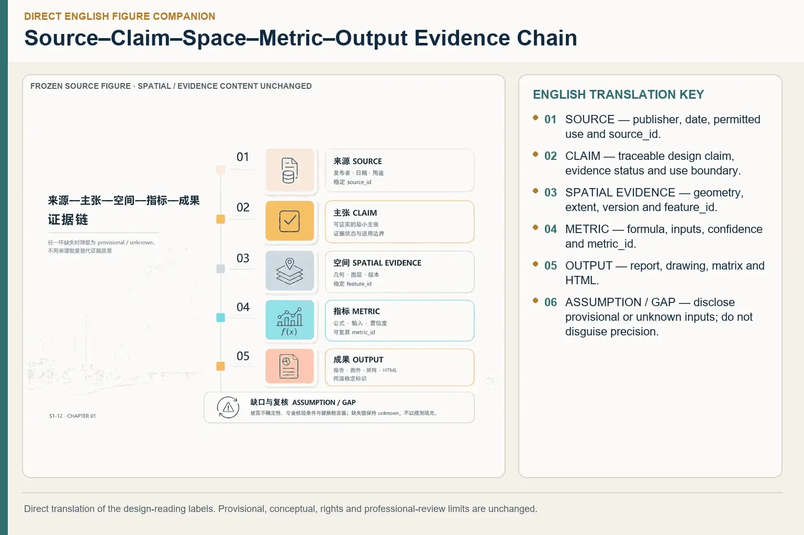

> **Figure 1-1 | Source–claim–space–metric–output evidence chain.** This is a chapter-level explanatory layer; it does not replace `sources.json`, GeoJSON, metrics, the three matrices, or the five formal core figures.

**This submission is a competition-oriented conceptual urban-design recommendation and open co-creation proposal.** It does not replace statutory planning, surveying, ownership confirmation, administrative approval, engineering design, or a government implementation commitment. Sources and licenses for external data, images, fonts, generated assets, and toolchains are registered in the structured source file and copyright statement.

> **Evidence references retained for bilingual traceability:** [source:OFFICIAL-ANNOUNCEMENT] [source:AGENT-TASKBOOK] [standard:PROJECT-OFFICIAL-ANNOUNCEMENT] [source:SITE-PACKAGE] [source:SOURCE-REGISTRY] [standard:MOHURD-URBAN-DESIGN-MEASURES] [source:CH1-PROJECT-RESEARCH-INPUTS] [data:geometry/site_boundary.geojson#SITE-001] [data:geometry/key_areas.geojson#PROV-KEY-001]
## Chapter 02 Three-Level Scope Framework

### 2.1 Three Nested Work Scales

**Table 2-1 | Three-Level Work Framework**

|Level|Approximate announced area|Core task|Design depth|Output interface|
|---|---:|---|---|---|
|Coordinated Research Area|43.6 km²|AI industrial ecosystem, innovation network, regional coordination, and future-city form|Regional strategic research|Chapter 03|
|Overall Design Area|11.4 km²|Overall structure, urban-renewal framework, and integrated spatial systems|Urban-design depth at Regulatory Detailed Planning level|Chapters 04 and 07–10|
|Key-Area Detailed Design Area|Three areas totaling 368.4 ha|Detailed design and spatial testing for three mandatory districts|Urban-design depth at Integrated Planning Implementation Plan level|Chapters 05–06|

**The proposal follows the three scales defined by the Announcement: Coordinated Research Area, Overall Design Area, and Key-Area Detailed Design Area.** The regional scale establishes industry and future-city strategy; the overall scale translates that strategy into spatial structure and an urban-renewal system; and the key-area scale tests space, scenarios, and implementation interfaces through district-specific detailed design. The three scales are nested and progressively deepened, not three unrelated drawing sets. [source:OFFICIAL-ANNOUNCEMENT] [depth:three_level_scope_framework]

**The Coordinated Research Area extends approximately from the North Fifth Ring Road to Xizhimen Outer Street, and from the Beijing–Tibet Expressway to Wanquanhe Road.** It derives strategic positioning, regional relationships, spatial principles, and inputs for overall design from the innovation geography of Beijing and Haidian. It does not directly determine parcel controls, Demolish–Renovate–Retain decisions, or engineering implementation. [metric:research_scope_announced_area_sqm]

**The Overall Design Area primarily covers urban and industrial districts approximately 1–2 km around Jing-Zhang Railway Heritage Park.** Its descriptive extent runs from the North Fifth Ring Road to Xizhimen Outer Street, and between Xueyuan Road/Xitucheng Road and Dazhongsi East Road/Heqing Road. It translates regional strategy into overall spatial structure, land use and building renewal, transport and walking/cycling, municipal and public services, blue-green public space, urban character, projects, and phasing. [data:geometry/site_boundary.geojson#SITE-001] [depth:overall_spatial_structure]

### 2.2 Positioning of the Three Key Areas

**Table 2-2 | Positioning and Detailed-Design Focus of the Three Key Areas**

|Key area|District role|Detailed-design focus|
|---|---|---|
|Zhongzhiyuan AI Independent Innovation Acceleration Area|AI pilot-production accelerator and future-industry testing ground|Garden-like district, Transit-Station Integration, modular carriers, and pre-positioned daily services|
|Beijing AI Origin Community|Source of foundation-model and core-technology innovation|Event ecosystem, organic renewal, public space, and campus–neighborhood permeability|
|Dazhongsi AI Industry Cluster|AI headquarters and application gateway|Station–city connections, four-quadrant stitching, culture-led renewal, and improved public interfaces|

**From north to south, the three key areas are Zhongzhiyuan AI Independent Innovation Acceleration Area, Beijing AI Origin Community, and Dazhongsi AI Industry Cluster.** Their announced approximate areas are 192.1 ha, 104.3 ha, and 72.0 ha. They lie within the current Overall Design Area and do not overlap. The current closed polygons support location indexing and directional detailed design only; they are not formal parcel or ownership boundaries. [data:geometry/key_areas.geojson#PROV-KEY-001] [metric:key_area_count]

### 2.3 Scope Transmission, Recalculation, and Limits of Use

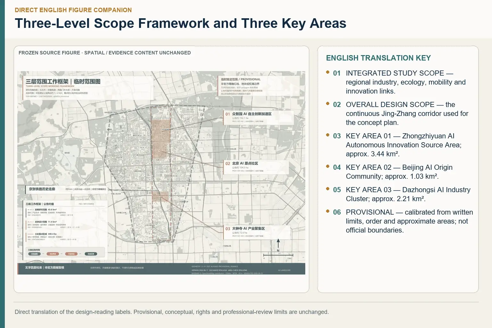

> **Figure 2-1 | Three-level scope framework and three key areas.** The extents are calibrated from the Announcement’s descriptive limits, north-to-south order, and approximate areas, and are consistently marked provisional. This chapter figure does not replace the formal core land-use-structure figure.

**The three levels form a loop of regional strategy, overall urban design, key-area detailed design, and implementation feedback.** The regional level passes industrial positioning, innovation-ecosystem logic, and spatial principles to the overall level. The overall level passes structure, systems, nodes, metric directions, and constraints to the key areas. Key-area work then corrects the overall proposal through spatial tests, scenarios, projects, phasing, and risk conditions.

**Announced approximate areas and recalculated submission geometry are recorded separately.** The current Overall Design Area geometry recalculates to approximately 11.4925 km², while the three key areas total approximately 368.7872 ha. These values validate the current provisional model only and are not official exact areas. [metric:site_area_sqm]

**Green ratio and public-space ratio are recalculated from the same provisional overall boundary and minimum viable design model.** They are not statutory scope conclusions, statutory green-space ratios, or public-ownership ratios. Indicators that depend on formal planning controls, ownership, or detailed design remain pending confirmation. [metric:green_ratio] [metric:public_space_ratio]

> **Evidence references retained for bilingual traceability:** [source:OFFICIAL-ANNOUNCEMENT] [depth:overall_spatial_structure] [data:geometry/key_areas.geojson#PROV-KEY-001]
## Chapter 03 Coordinated Research Area: Industry and Future-City Research

### 3.0 Parent Concept Overview

#### 3.0.1 Proposal Name and Core Proposition

**Table 3-1 | Proposal Naming System**

| Level | Content | Role |
|---|---|---|
| Main Chinese Name | **Dao Kou Xin Bian (The Re-coded Crossing)** | Carries forward the historical DNA of Jing-Zhang railway crossings; *xin bian* conveys both re-coding and a new chapter |
| Chinese Subtitle | **Jing-Zhang · Bing Gui (Merging Tracks)** | Expresses the coexistence and continuity of the industrial physical track, the heritage-space track, and the AGI virtual track |
| English Name | **The Re-coded Crossing: Merging Tracks of Jing-Zhang** | “Re-coded” echoes the compilation metaphor; “Merging Tracks” expresses convergence and supports international communication |
| Addressing System | `DK-<anchor-number>.<type-code><sequence>` + G1/G2/G3 generation classes | Makes names addressable, registerable, and iterative; see Section 3.4.2 |

> **Figure 3-1 | Merging-Tracks symbol and binary-pulse AI Crossing Logo/VI.** The mark is an AI-assisted competition-use visual identity, not a registered trademark or an assurance of exclusive rights. [source:CH3-LOGO-V3]

**Table 3-2 | Final Logo / VI Elements and Applications**

| Element | Final Specification | Primary Applications |
|---|---|---|
| Mark | Merging-Tracks Symbol | Overall identity in Chapter 03, A3/A0, overall diagrams, and offline HTML |
| Colors | Mist Blue `#2A3F4B`, Mist Teal `#4D8B87`, Sand Gold `#B79A62`, Marble White `#ECECE6` | Historical layer, future layer, transition nodes, and negative space |
| Wordmark | Dao Kou Xin Bian / Jing-Zhang · Bing Gui / The Re-coded Crossing | Chinese and English covers, chapter navigation, and international communication |
| Boundary | The Logo provides overall identity and addressing; cultural wayfinding and the character IP support narrative and communication | Do not conflate the belt-wide Logo, cultural marks, and character IP |

**Table 3-3 | Urban-Design Paradigms in the Industrial and AGI Eras**

|  | Industrial-Age Urban Design | AGI-Age Urban Design in This Proposal |
|---|---|---|
| **View of the City** | A blueprint for a predictable final state | A perceptive, adaptable, and evolvable operating system |
| **Core Tool** | Regulatory Detailed Planning as a static blueprint compiler | Directed System–Adaptive System–Virtual Track as runtime and compilation protocol |
| **Addressing Method** | Railway crossing as the physical intersection of railway and road | AI Crossing as the interface between the virtual track and urban needs |
| **View of Time** | One-time compilation and long-term stability | Continuous compilation, dynamic scheduling, iteration, and exit |

**The Re-coded Crossing: Merging Tracks of Jing-Zhang** overlays three tracks along the Centennial Jing-Zhang corridor: the physical track of railway memory, the spatial track that reconnects everyday life, and the virtual track through which AI-assisted urban operations can learn and evolve. Every new intersection between people, places, knowledge, and services becomes an **AI Crossing**.

#### 3.0.2 Four Iterations of the Urban-Planning Paradigm

The proposal interprets urban development as four successive paradigms: plan-led construction, market-oriented renewal, data-supported coordination, and human-governed AI co-evolution. The fourth does not hand the city to an algorithm; it adds sensing, simulation, feedback, and reversible trials to statutory planning and professional review.

#### 3.0.3 Five-Layer Runtime: Directed System, Adaptive System, and Virtual Track

**Table 3-4 | Five-Layer Active–Inactive–Virtual-Track Runtime**

| Layer | Computing Role | Urban-Design Meaning |
|---|---|---|
| **Regulatory Detailed Planning** | Kernel | Statutory baseline for land use, intensity, safety, and public interest |
| **Directed System** | Compiler | Compiles six value anchors into non-negotiable baseline constraints |
| **Adaptive System** | Runtime solver | Runs a sense–decide–act loop and searches for multiple options within constraints |
| **Virtual Track** | Data bus / service interface | Routes knowledge, talent, computing power, data, capital, and scenario resources |
| **AI Crossing** | Runtime interface / address | Provides spatial addressing and records each real spatial intervention |

The runtime consists of: (1) evidence and statutory constraints; (2) public-value anchors; (3) physical spatial carriers; (4) an Agent-assisted sensing–assessment–response–feedback loop; and (5) a virtual track that records scenarios, metrics, decisions, and exits. The directed system establishes non-negotiable public baselines; the adaptive system supports reversible growth; humans retain final authority.

#### 3.0.4 Directed System: Six Public-Value Anchors

The six anchors are human well-being, historical authenticity, ecological safety, spatial justice, an open innovation ecosystem, and lifecycle reversibility. Industry space and daily services must advance together; heritage facts must remain traceable; waterfront and green-space design must yield to safety; digital services must retain non-digital access; small actors must be able to enter shared innovation systems; and pilots must state duration, responsibility, rollback, and exit conditions. [source:CH1-PROJECT-RESEARCH-INPUTS]

#### 3.0.5 Adaptive System: Three-Stage Agent Loop

The adaptive system follows **sense–decide–act**, always under machine assistance and human final review. Authorized public feedback and participatory monitoring inform scenario comparison; public agencies, professional reviewers, communities, and rights holders decide; reversible interventions proceed through authorization, trial, validation, implementation, evaluation, and expansion or exit.

#### 3.0.6 Three Civilizational Narratives

The physical track preserves the 1909 Jing-Zhang Railway, Zhan Tianyou, the former Qinghuayuan Station, and Juesheng Temple; the spatial track carries Zhongguancun's contemporary innovation culture and everyday life; the virtual track frames open-source communities, human–AI collaboration, and emerging AI culture. Together they form a traceable sequence of historical memory, contemporary life, and future innovation.

### 3.1 Regional Industry and Future City: Positioning

#### 3.1.1 Industrial Baseline and Regional Role

**Table 3-5 | Mapping Innovation Resources, Innovation-Chain Stages, and Spatial Carriers**

| Innovation-Resource Base | Verifiable Representative Resources and Capacity | Main Innovation-Chain Stage | Spatial Carrier and Interface in This Proposal | Evidence Status and Boundary |
|---|---|---|---|---|
| Universities and research institutions | Haidian has 37 universities, 92 national key laboratories, and 96 national-level research institutions; Tsinghua University, Peking University, and relevant Chinese Academy of Sciences institutes form the main research anchors around the Overall Design Area | Basic research, algorithm and model origination, interdisciplinary R&D, and talent development | AI Origin Community supports university-adjacent output releases, proof of concept, and shared R&D; the West Wing connects technology transfer and professional services | Official public data; shared capacity and collaboration relationships pending verification |
| New R&D and commercialization platforms | Proof-of-concept centers, the National Regional Technology Transfer and Commercialization Center for Artificial Intelligence at Universities, and related pilot-testing platforms provide a basis for commercialization | Proof of concept, engineering, pilot testing, output registration, and incubation | A continuous interface of “AI Origin origination—Zhongzhiyuan pilot production—Dazhongsi application—East Wing validation—West Wing services” | Officially disclosed platforms; project flow, conversion efficiency, and exact location pending verification |
| AI enterprises and industry actors | Haidian has more than 2,000 AI enterprises, 26 AI unicorn companies, and 130 registered foundation models; district-wide listed-enterprise and specialized-SME data use separate statistical definitions | Product R&D, model engineering, industrial applications, and market feedback | Dazhongsi primarily accommodates headquarters, product releases, and vertical applications; the Three Zones and Two Wings jointly provide R&D, pilot-production, testing, and service interfaces | Official district-level totals; enterprise list, spatial locations, and partnerships pending verification |
| Incubation and technology-service institutions | Haidian already has multi-level incubation, technology transactions, intellectual-property, technology-finance, and start-up service capacity | Team incubation, technology transactions, financing connections, intellectual property, and international services | The West Wing provides a full-cycle technology-service gateway for the Three Zones and East Wing; AI Origin Community provides university-adjacent incubation and public-interaction interfaces | Existing regional capacity; operators, access rules, and service mechanisms pending confirmation |
| Computing power, data, and algorithm support | The Shangzhuang municipal public-computing platform is outside the site; Haidian also has model corpora, data-labeling capacity, and cross-regional computing networks | Model training and inference, data processing, algorithm validation, and scenario feedback | Prioritize computing and data service windows within the site, connected to external platforms under authorization; Zhongzhiyuan and the East Wing undertake engineering validation and scenario feedback | Off-site resources; capacity, energy use, interface security, and data authorization pending verification |
| Urban scenarios and public feedback | Existing pilots such as the Sidaokou AI traffic-signal-control pilot provide evidence of single-point applications | Need identification, scenario testing, public feedback, impact evaluation, and exit | The East Wing, rail stations, Jing-Zhang Railway Heritage Park, and neighborhood public nodes serve as candidate scenario interfaces; AI Crossings connect real needs to the innovation chain | Existing pilots; owner authorization, safety review, and exit mechanisms for new scenarios pending confirmation |

**Table 3-6 | Division of Labor among the Three Science Cities and Beijing E-Town**

| Area | Core Functions | Interface with the Site | Benchmark |
|---|---|---|---|
| Zhongguancun Science City (the site) | Basic research, technology R&D, incubation, and early-stage commercialization | Strengthen research origination and scenario-validation capacity | Kendall Square: university anchor + mandatory innovation-space provisions |
| Huairou Science City | Major scientific facilities and basic science | Receive spillovers from major scientific facilities and conduct joint technology validation | New York State: state-level coordination of computing power and research collaboration |
| Future Science City | Energy and life sciences | Cross-disciplinary AI-enabled energy and healthcare scenario collaboration | Singapore: cross-agency closed-loop governance |
| Beijing E-Town | Industrial manufacturing and pilot-scale expansion | Channel R&D outputs into pilot production and industrialization | Zhangjiang: iterative carrier chain and industrial accommodation |

Published district-level baselines indicate an AI core-industry scale above RMB 350 billion, more than 2,000 AI enterprises, 26 AI unicorns, 130 registered foundation models, and technology-contract turnover of RMB 404.5 billion. Haidian records approximately 2.0058 million talent resources; the AI Origin cluster reports more than 1,000 AI scientists, 13,000 developers, and over 100,000 AI-related students. These statistics use different definitions and must not be added directly. [source:CH3-HAIDIAN-AI-BASELINE]

The spatial chain is **AI Origin research → Zhongzhiyuan pilot production → Dazhongsi application and exchange → West Wing professional services → East Wing scenario validation**. Large-scale compute remains outside the site; in-site facilities are service windows or edge nodes subject to energy, network, security, and municipal review. Citywide coordination links Zhongguancun Science City with Huairou Science City, Future Science City, and Beijing E-Town, while manufacturing and supply-chain conversion may extend into the Beijing–Tianjin–Hebei region. [source:CH3-REGIONAL-COLLABORATION]

#### 3.1.2 Industrial Positioning and Collaborative Structure

**Table 3-7 | Regional and Industrial Coordination Loop**

| Coordination Level | Core Role | Industry Chain and AI-Enabled Directions | Key Flows | Spatial and Industry-Support Interfaces |
|---|---|---|---|---|
| Three Zones and Two Wings (within the site) | Original innovation, pilot production, application deployment, technology services, and scenario validation | Form an on-site loop of “AI Origin R&D—Zhongzhiyuan pilot production—Dazhongsi applications—West Wing services—East Wing validation,” supporting authorized validation of vertical applications in healthcare, education, transport, and daily services | Talent, technology, capital, computing power, data, scenarios, and operational feedback | Shared R&D and pilot-production facilities, AI Crossings, technology-service windows, scenario-testing spaces, talent and living services, and rail/walking/cycling connections |
| Two Areas and One Belt (district level) | Connect to Haidian’s district-level full-stack, all-factor AI innovation resources and industrial collaboration platforms | Establish interfaces for sharing innovation resources, commercializing outputs, coordinating AI-enabled industries, and providing scenario access; the structure is official, while spatial boundaries and responsibilities await formal confirmation | Policy and platform services, research outputs, enterprise needs, computing and data resources, and scenario inventories | District-level public technology platforms, commercialization services, public-computing windows, data-authorization interfaces, and scenario-publishing interfaces |
| Three Science Cities and One Economic-Technological Development Area (municipal level) | Strengthen Zhongguancun Science City’s advantages in basic research, technology R&D, incubation, and early-stage commercialization | Coordinate with major scientific facilities in Huairou Science City, energy and life sciences in Future Science City, and pilot-scale expansion and industrial manufacturing in Beijing E-Town | Research facilities, cross-disciplinary technologies, validation needs, and industrialization capacity | Joint R&D, cross-district testing and validation, technology transfer, pilot production, and industrialization services |
| Beijing–Tianjin–Hebei and external regions | Accommodate scaled manufacturing, supply-chain support, and cross-regional application feedback | Form a flexible collaboration network of “R&D in Haidian, testing within the site, and cross-regional commercialization and manufacturing” as a conceptual recommendation | Technology outputs, production capacity, supply-chain resources, market demand, and operational data | Cross-regional commercialization, manufacturing collaboration, application demonstrations, and feedback loops |

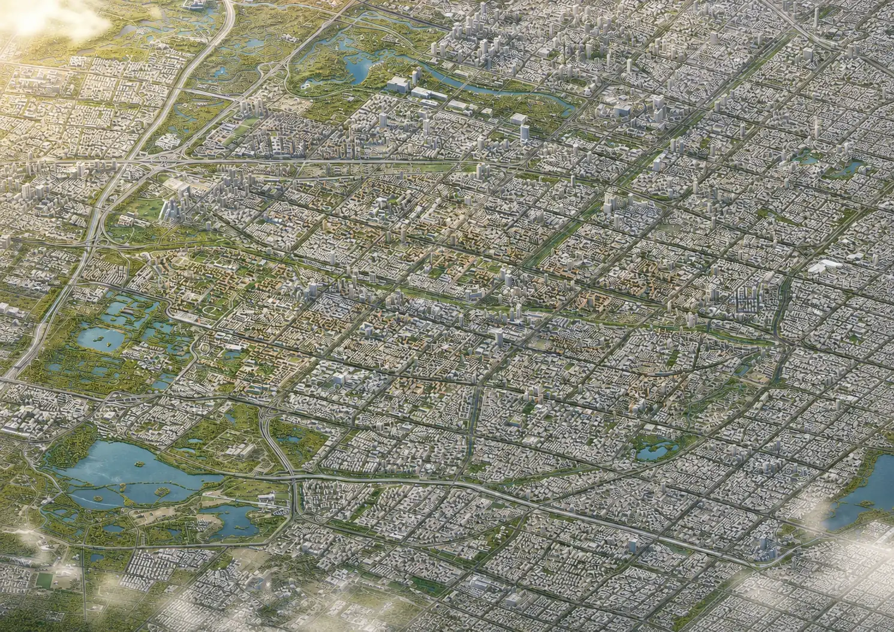

> **Figure 3-2 | Panoramic aerial concept of the Coordinated Research Area.** An Agent automatically searched and downloaded public GABLE/OSM/EULUC data to generate the complete K3 Blender urban base; the user then produced the image-to-image rendering on the official GPT website. It conveys overall urban grain and the blue-green setting, and is not an aerial survey, statutory plan, or precise construction proposal. 

The belt combines three roles: a national source of original AI innovation, an urban-governance and scenario-testing ground, and a Jing-Zhang heritage and innovation-narrative corridor. These roles organize talent, technology, capital, compute, data, scenarios, services, and operating feedback without asserting confirmed partnerships or implementation commitments.

### 3.2 Regional Structure and Innovation-Collaboration Framework

#### 3.2.1 Regional Structure and Innovation-Collaboration Plan

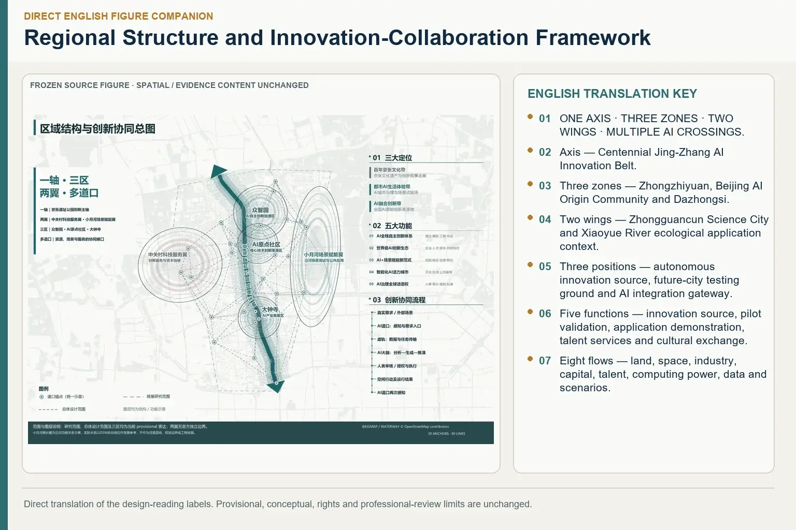

> **Figure 3-3 | Regional structure and innovation-collaboration framework.** Research, overall-design, and key-area extents are provisional; the two wings have no separate official boundary, and OSM is contextual only. [source:CH3-REGIONAL-COLLABORATION] [data:geometry/site_boundary.geojson#SITE-001] [data:geometry/key_areas.geojson]

##### 01 | One Axis, Three Zones, Two Wings, Multiple Crossings

The Jing-Zhang Heritage Park is the innovation axis. Zhongzhiyuan, AI Origin, and Dazhongsi form the three zones; the Zhongguancun Technology-Service Wing and Xiaoyue River Scenario-Empowerment Wing provide professional services and field validation. AI Crossings are distributed interfaces where resources, scenarios, mobility, and public services meet.

##### 02 | Three Positioning Statements

**Table 3-8 | Three Strategic Positions and Their Translation into the Three Track Generations**

| Three Official Positioning Statements | Three-Track Narrative | Functional Translation | Primary Carriers |
|---|---|---|---|
| Centennial Jing-Zhang Cultural Belt | Physical Track (Memory) | Jing-Zhang cultural-heritage and innovation-narrative corridor | Former Tsinghuayuan Station, Juesheng Temple, and the historical narrative route through Jing-Zhang Railway Heritage Park |
| Metropolitan AI Life Experience Belt | Aerial Track (Life) | AI urban-governance and scenario-testing ground | Sidaokou dual-intelligence pilot, AI Origin Community, and the public-scenario network |
| AI Integrated Innovation Belt | Virtual Track (Innovation) | National center of original AI innovation | Zhongzhiyuan full-stack independent innovation, foundation-model origination, and Three Zones and Two Wings collaboration |

The Centennial Jing-Zhang Cultural Belt corresponds to memory; the Metropolitan AI Life Experience Belt to everyday life; and the AI Integrated Innovation Belt to future innovation. They are layered in the same corridor rather than developed as isolated themes.

##### 03 | Five Functions

**Table 3-9 | Five Core Functions and Their Spatial Carriers**

| Five Official Functions | Functional Translation | Primary Carriers |
|---|---|---|
| Full-Stack Independent AI Innovation System | Continuous innovation chain covering basic research, model origination, engineering validation, and accelerated pilot production | Zhongzhiyuan, AI Origin Community, and university/research resources |
| World-Class AI Innovation Ecosystem | Enterprise incubation, technology finance, intellectual property, talent services, and international open collaboration | AI Origin Community and Zhongguancun Technology Services Wing |
| New Paradigm for AI-Enabled Scenarios | Organize testing, validation, feedback, and commercialization around real needs | Xiaoyue River Scenario Enablement Wing, Sidaokou, and the public-scenario network |
| Intelligent and Vibrant AI City | Coordinate cultural display, public interaction, talent housing, and all-age public services | Along Jing-Zhang Railway Heritage Park and living-service nodes in the Three Zones |
| Global Voice in AI Governance | Establish Human Review, data authorization, algorithm audits, risk-based exit, and rule accumulation | Zhongzhiyuan governance platform, Virtual Track, and AI Crossing runtime interfaces |

The taskbook's five fixed functions are translated into spatial systems: full-stack independent AI innovation; a world-class AI innovation ecosystem; a new AI+ scenario-empowerment paradigm; an intelligent and vibrant AI city; and global influence in AI governance. [source:AGENT-TASKBOOK]

##### 04 | Five Evolvable Future-City Modes

**Table 3-10 | Five Evolvable Future-City Patterns**

| Evolvable Future-City Pattern | Form and Operating Mechanism | Haidian Translation and Boundary |
|---|---|---|
| 1. AI Returns to the City: 15-Minute × 24-Hour Mixed Innovation District | ① Accessible by walking, cycling, and rail. ② Mixes R&D, incubation, housing, commerce, learning, social life, and public activities. ③ Time-sharing creates complementary day/night use and an international talent environment. | ① Demonstrated primarily in AI Origin Community. ② Embedded conditionally in Dazhongsi and Zhongzhiyuan. ③ Improve international housing, interaction, and public services. ④ Address housing, night-time noise, safety, and operations together. |
| 2. Shared Innovation: A Wall-Free Innovation Commons | ① AI culture grows from Jing-Zhang memory, Zhongguancun’s innovation ethos, and open-source AI collaboration. ② The public can see, participate in, and co-create AI culture. ③ Campus, park, enterprise, and neighborhood interfaces open in tiers. ④ Low-cost shared innovation space is provided. | ① Apply campus-specific and park-specific policies. ② Opening remains bounded by property rights, safety, and research confidentiality. ③ Determine capacity, hours, and operators of shared facilities through dedicated studies. |
| 3. Layered Collaboration: Regional Front–Middle–Back Network | ① **AI Society:** talent, enterprises, universities, neighborhoods, and government collaborate, with AI-assisted analysis and human authorization. ② The front stage supports interaction and scenarios. ③ The middle platform provides shared services. ④ The back stage retains high-security R&D. | ① Differentiate functions across the Three Zones and Two Wings. ② Maintain two-way flows among all areas. ③ This is a proposed functional organization. ④ It does not imply that current institutions already collaborate or share data. |
| 4. Reversible Renewal: Plug-In, Programmable Spatial Base | ① Retention and reuse, light-touch intervention, and modular additions. ② Buildings comprise a stable base and replaceable plug-ins. ③ Time-limited occupancy, use rotation, and pilot–evaluate–exit cycles support rolling iteration. ④ Spatial carriers remain adaptive and evolvable. | ① Prioritize suitable existing buildings and public nodes. ② Confirm structure, fire safety, property rights, planning use, and long-term maintenance first. ③ Do not generalize flexible use as universally applicable. |
| 5. Human-AI Co-Governance: A Perceptive Public City Where Rail and Park Coexist | ① Operates through sensing—analysis—human authorization—controlled action—feedback. ② Forms a continuously learning spatial system. ③ Uses Jing-Zhang Railway Heritage Park, Qinghe–Xiaoyue River, rail stations, and walking/cycling networks as the public base. ④ Builds perceptive and interactive AI-enabled transport and continuous green space. | ① Begin with small pilots at station connections, walking/cycling breaks, and existing public nodes. ② Retain human authorization. ③ Protect privacy and retain non-digital channels. ④ Do not replace human choice with automated approval or continuous surveillance. |

**Table 3-11 | Regional Interfaces for AI-Enabled Mobility and Continuous Green Space**

| System | Regional Spatial Organization | AI Crossing and Virtual-Track Interface | Indicators for Subsequent Review |
|---|---|---|---|
| AI-Enabled Transport | Use rail stations as gateways and the walking/cycling route through Jing-Zhang Railway Heritage Park as the north–south spine, connecting the Three Zones and Two Wings, campuses, parks, neighborhoods, and major public nodes; prioritize station connections, railway/ring-road crossings, and waterfront breaks | With authorization, AI Crossings aggregate passenger flows, walking/cycling needs, and facility status; the Virtual Track analyzes and recommends options for Human Review before wayfinding, interchange management, and reversible pilots; accessible, human-service, and non-digital channels remain available | Walking/cycling time to rail stations, number of breaks, detour factor, accessible-continuity rate, and peak-flow changes, reviewed after field measurement |
| Continuous Green Space | Use Jing-Zhang Railway Heritage Park as the continuous public framework and Qinghe/Xiaoyue River waterfronts as transverse ecological links, connecting campuses, parks, neighborhoods, and green nodes into a spine–waterfront-corridor–node network | AI Crossings collect environmental sensing, public needs, and maintenance feedback; the Virtual Track recommends time-based opening, activities, ecological maintenance, and extreme-weather response; actions involving flood control, heritage, ecological safety, and public interest require Human Review | Green-space and waterfront continuity, crossing breaks, public-entrance coverage, shade comfort, and avoidance of ecologically sensitive areas, reviewed using formal green-space, river, flood-control, and walking/cycling data |
| Transport–Green-Network Composite Nodes | Prioritize rail stations, park entrances, river crossings, and public interfaces in the Three Zones as composite nodes for interchange, staying, interaction, testing, and emergency conversion | Use a loop of need sensing—option simulation—human authorization—incremental pilot—operational evaluation—expansion or exit | Property rights, passenger flow, flood control, heritage, privacy, safety, and maintenance conditions, added to the implementation candidate list after verification |

The proposal tests a 15-minute/24-hour mixed innovation district, a wall-less innovation commons, a heritage-and-technology narrative corridor, a low-carbon blue-green testing ground, and a human-governed urban-agent network. Each mode remains reversible and subject to housing, noise, accessibility, heritage, ecological, and data-governance constraints.

##### 05 | A High-Quality District for AI Talent

Research, incubation, housing, food, health, learning, recreation, social interaction, and international exchange are organized as one daily ecosystem. Talent targets are planning scenarios, not promises of recruitment or population allocation.

##### 06 | Regional Innovation Collaboration Process

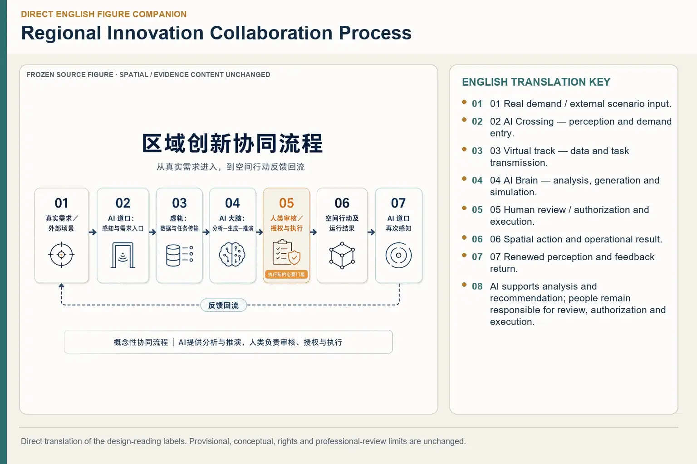

> **Figure 3-4 | Regional innovation collaboration process.** The diagram follows a source–resource–translation–space–feedback evidence-chain logic and distinguishes published baselines from proposed collaboration. [source:CH3-REGIONAL-COLLABORATION-FLOW]

#### 3.2.2 Three-Zone/Two-Wing Loop and AI Crossing Anchors

**Table 3-12 | Industrial Division of Labor and Spatial Orientation of Three Zones and Two Wings**

| Area | Industry Positioning | Core Strategy | Spatial-Design Direction | Main AI Crossing Anchors |
|---|---|---|---|---|
| **Zhongzhiyuan (North)** | AI pilot-production accelerator and future-industry testing ground | Dual university and enterprise anchors; rolling carrier iteration; services provided in advance | Garden-style park, Transit-Station Integration, modular flexible carriers, and early living-support provision | ① `DK-07` Xuezhiyuan Station ② `DK-08` Qinghe Station/former Qinghe station building ③ `DK-10` Qinghuadongluxikou Station ④ Qinghe Hancheng archaeological site–historic Qinghe town |
| **AI Origin Community (Central)** | Foundation-model and core-technology innovation origin | Treat the event ecosystem as innovation infrastructure; low-disturbance organic renewal | Fine-grained block and street-network stitching, dense public space, continuous active ground floors, and permeable university boundaries | ① `DK-05` Wudaokou Station/business district ② `DK-06` Liudaokou–Xueyuan Road ③ `DK-09` Zhichun Road Station ④ Former Tsinghuayuan Station ⑤ Tsinghua Science Park/Beijing Academy of Artificial Intelligence |
| **Dazhongsi AI Industry Cluster (South)** | Official role: smart-native new business; proposal translation: AI headquarters and application gateway | Culture-led activation → AI introduction; four-quadrant stitching; property-rights tools to unlock public interfaces | Hub-gateway identity, four-quadrant walking connections, and mixed cultural/commercial/entertainment interfaces | ① `DK-04` Sidaokou/Dazhongsi Station ② Juesheng Temple at Dazhongsi ③ Third Ring Road gateway urban terrace |
| **West Wing (Technology Services Wing)** | Technology-service and start-up incubation support | Activate street interfaces and complete a full-cycle start-up service system | Human-centered streets, stayable interface products, and cultural-narrative walking routes | ① `DK-W1` Zhongguancun Entrepreneurship Street ② Zhongguancun Plaza/Dinghao ③ Haidianhuangzhuang–Zhongguancun stations ④ Chinese Academy of Sciences Zhongguancun Science City/institute cluster |
| **East Wing (Scenario Enablement Wing)** | Embodied-AI and vertical-scenario testing area | Locate waterfront scenarios only after flood-control review; strengthen routes perpendicular to the river; begin with reversible pilots | Naturalized waterfronts, tiered flood-resilient space, and modular test sites | ① `DK-E1` Embodied Intelligence Industrial Park at Dongpan Innovation Center ② Xiaoyue River waterfront scenario nodes ③ Ecological Sensing Station |

The loop connects source research, pilot production, enterprise application, technology services, public testing, and feedback. A two-level address system distinguishes primary crossings on the Jing-Zhang axis from secondary wing and neighborhood interfaces; exact locations remain design references until ownership, site, safety, and operating permissions are confirmed.

### 3.3 Industry and Innovation-Ecosystem Metrics and Sources

**Table 3-13 | Industry and Innovation-Ecosystem Indicator System**

| Indicator Area | Indicator and Source | Current Status | Directed System | Adaptive System |
|---|---|---|---|---|
| AI Industry Baseline | AI core-industry scale, enterprise count, unicorn count, registered foundation models, talent scale/density, and technology-contract turnover | Public baseline available | Fix sources, statistical definitions, and factual boundaries | Update data under consistent definitions and compare industrial-strategy priorities |
| AI Innovation Resources | Universities, research institutions, key enterprises, computing power, algorithms, and data, based on Thematic Package 2 and the eight-factor map in Section 3.4.1 | Resource inventory established; quantitative definitions need alignment | Use the innovation-ecosystem and spatial-justice anchors to protect public innovation infrastructure, actor access, and resource fairness | Compare combinations, connections, and spatial organization of innovation resources within the value boundary |
| Innovation Ecosystem and Industry Cluster | Key stages and actor relationships in innovation and industry chains, based on the Section 3.4.1 resource-flow diagram and regional synthesis | Proposal framework established; quantitative results pending | Define value directions for public platforms, open collaboration, and knowledge spillovers | Compare collaboration models and update judgments when evidence changes |
| Three Zones and Two Wings Collaboration | Industry roles, anchors, and collaboration relationships based on the Section 3.2.1 regional structure and Section 3.2.2 comparison | Proposed spatial structure; collaboration relationships pending verification | Retain the brief-defined Three Zones and Two Wings and the public value of each area | Compare collaboration relationships and industrial-space arrangements within the fixed structure |
| Eight Factors and Sources | Delivery paths and sources for land, space, industry, capital, talent, computing power, data, and scenarios, based on Section 3.4.1 and Thematic Packages 2–8 | Source interfaces established; some data still missing | Fix source, authorization, public-interest, and human-confirmation boundaries | Compare matching and flows among the eight factors within Directed-System boundaries |

**Table 3-14 | Core-Indicator Definitions, Calculations, and Review Conditions**

| Indicator | Definition, Unit, and Calculation | Current Baseline / Status | Source, Target Setting, and Review Conditions |
|---|---|---|---|
| AI Innovation Index [metric:ai_innovation_index] | Six sub-indices: original innovation, commercialization, industry agglomeration, talent vitality, infrastructure/scenario access, and trustworthy governance. After aligning scope, date, and directionality, standardize each component as `Z_k` and calculate `I_AI = Σ(w_k × Z_k)` | No cross-actor dataset with consistent definitions; composite score not currently reported | Components derive from university/research, enterprise, project, talent, computing/data/scenario, and governance records. Determine weights `w_k` after data-completeness testing, peer-area benchmarking, and expert review; weights sum to 1 and cannot replace missing data with subjective scoring |
| Talent Density [metric:site_ai_talent_spatial_density_per_sqkm] [metric:site_ai_employment_share] | Retain both spatial density `D_s = N_AI / A` (persons/km²) and employment-structure density `D_e = N_AI / N_employed × 100%`; count scientists, developers, related students, and general talent separately and deduplicate before aggregation | District-level talent resources approximately 2.0058 million; AI Origin scientists, developers, and related students are reported under separate definitions | Calculate after aligning the AI-talent definition, statistical scope, residence/employment attribute, date, and deduplication rules; recalculate site density after formal boundaries and talent records are available |
| AI Industry Output [metric:haidian_ai_core_industry_output_lower_bound_cny_100m] [metric:site_ai_industry_output_cny_100m] | Record `V_AI` in RMB 100 million and year-on-year growth `g = (V_t − V_(t−1)) / V_(t−1) × 100%` using the official AI core-industry definition; calculate output per industrial-space area `V_AI / A_industry` after verified area data exist | Haidian AI core-industry scale exceeds RMB 350 billion as a district baseline; site-level output and output per industrial-space area are pending | Update after confirming statistical period, industry classification, and spatial attribution; do not conflate with AI market size, enterprise valuation, or district GDP; determine target ranges from trends, carrier capacity, and peer-area benchmarks |
| AI Enterprises and Innovation Actors | Official counts of AI enterprises, AI unicorn companies, registered foundation models, and verified universities, research institutions, and incubators | More than 2,000 AI enterprises, 26 AI unicorn companies, and 130 registered foundation models; university/research baseline uses separate definitions | Update when enterprise lists, recognition standards, dates, or coordinates change; evaluate collaboration quality through project-level records |
| Innovation-Chain Conversion [metric:innovation_chain_conversion_rate] | Number of projects entering proof of concept, engineering, pilot production, scenario validation, and commercialization; stage conversion `R_i = N_(i+1) / N_i × 100%` | Pending a unified cross-actor project register | Aggregate authorized records from Zhongzhiyuan, AI Origin Community, scenario owners, and service platforms; use unique project IDs and define exit, pause, and repeat-entry counting rules |
| Three Zones and Two Wings Collaboration [metric:three_zones_two_wings_collaboration_rate] | Number of cross-area shared services, joint validations, and feedback-return projects; effective collaboration `R_c = N_closed_loop / N_cross_area × 100%` | Proposal structure established; collaboration flow pending verification | Update using project agreements, service records, and operational feedback |
| Eight-Factor Readiness [metric:eight_factor_readiness_ratio] | Coverage of land, space, industry, capital, talent, computing power, data, and scenario interfaces for each pilot: `R_8 = N_ready / 8 × 100%` | Calculate after scenario inventory and responsible entities are confirmed | A factor is ready only when source, authorization/access, responsible party, capacity/service conditions, and exit mechanism are all present; missing factors remain not ready |
| AI-Enabled Transport and Green-Network Accessibility [metric:transit_green_network_accessibility_ratio] | Walking/cycling time to stations, key mobility breaks, accessible-continuity rate, green-public-space entrance coverage, and waterfront continuity, in minutes/count/% | Regional structure established; road network, passenger flow, entrances, and green-space boundaries pending verification | Recalculate from formal or clearly marked provisional road, station, green-space, and river data; evaluate transport and green networks separately |

The metric framework separates published baselines, design targets, and future operating indicators. The AI Innovation Index combines research, enterprise, talent, transformation, scenario, openness, and governance dimensions; no composite score is claimed before definitions, weights, and a T0 baseline are verified.

### 3.4 AI Innovation Ecosystem and Eight-Factor Resource Flow

#### 3.4.1 Ecosystem and Resource-Flow Diagram

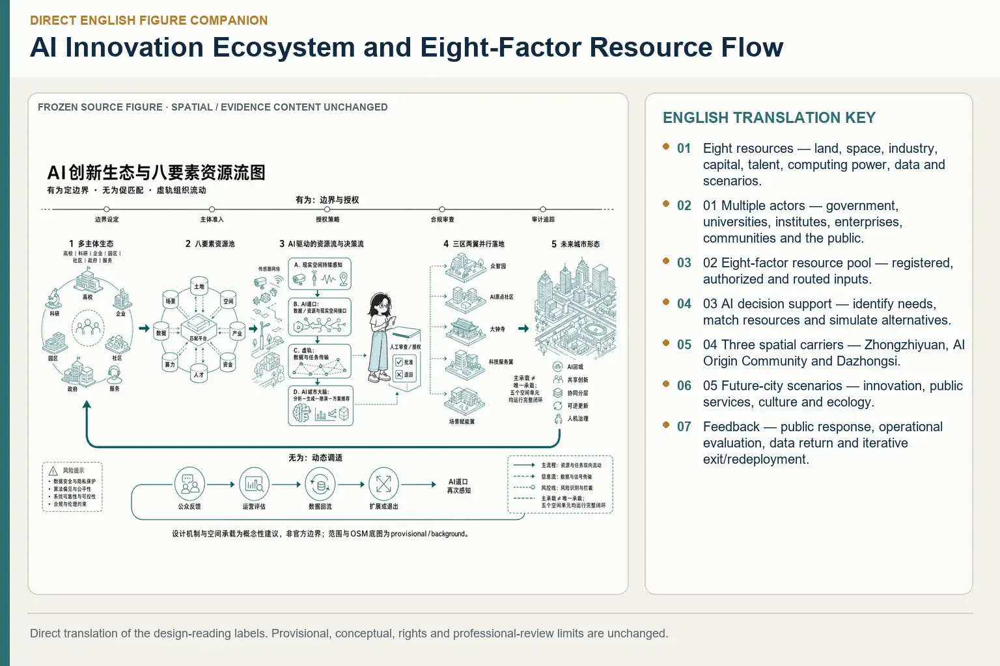

> **Figure 3-5 | AI innovation ecosystem and eight-factor resource flow.** Talent, technology, capital, compute, data, space, scenarios, and governance circulate through the three zones and two wings. [source:CH3-EIGHT-FACTOR-EVIDENCE]

**Table 3-15 | Eight-Factor Resource Flow of the AI Innovation Ecosystem**

| Factor | Existing Resource / Fact | Current Break | Virtual-Track Connection Mechanism (Conceptual Recommendation) | Main Actors and Spatial Carriers | Evidence Status |
|---|---|---|---|---|---|
| **Land** | Existing built-up area and multiple renewal-unit types; planning changes require applicable statutory procedures | Property rights, renewable boundaries, and implementation timing are not fully verified | Maintain a parcel register of constraints, variables, and exit conditions | Rights holders, government, and operators; renewal units in the Three Zones and Two Wings | Regulatory controls and property rights pending verification |
| **Space** | Dense universities, parks, existing buildings, parks, and neighborhood spaces | Missing data on opening hours, shared capacity, and access rules | Book, convert, and restore shared innovation spaces, pilot-production carriers, public-space interfaces, and AI Crossings on demand | Zhongzhiyuan carriers, existing AI Origin buildings, and Dazhongsi public interfaces | Spatial inventory available; capacity pending measurement |
| **Industry** | High concentration of AI enterprises, models, R&D, and technology transactions | Insufficient evidence of actual enterprise flows from R&D through pilot production, application, and feedback | Central R&D → northern pilot production → southern application → East Wing testing → West Wing services, with a feedback loop | Enterprises, universities, and pilot-production platforms across the Three Zones and Two Wings | Agglomeration baseline available; flow data missing |
| **Capital** | Haidian has technology funds and industry-service capacity | No transparent interface connecting capital with specific spaces, pilots, and small teams | Connect growth funds, patient capital, scenario procurement, and capital-service space by project stage | Funds, enterprises, and service institutions; West Wing | Project-level capital flows missing |
| **Talent** | District talent and AI scientist/developer/student baselines are available | Missing origin–destination and segmented data linking housing, commuting, activities, and employment | Talent stations, affordable services, and rail/walking/cycling connections; a “15-minute innovation commute on Line 13” remains a target for recalculation | Universities, enterprises, and neighborhoods; AI Origin Community and Zhongzhiyuan support | Travel time and demand pending verification |
| **Computing Power** | Shangzhuang municipal platform and cross-regional computing networks are outside the site | Site demand, energy use, access security, and cost are unknown | Prioritize external computing services; treat site-edge nodes only as candidates subject to energy, municipal, network, and security studies | Computing platforms, enterprises, and universities; site computing-service windows | Capacity and siting require specialist review |
| **Data** | Governance bases exist for AI, personal information, and generated content | Cross-actor authorization, data minimization, interface responsibility, and exit mechanisms are absent | Data classification, purpose limitation, authorization records, Human Review, deletion, and exit | Data providers, users, and reviewers; Virtual-Track interface network | Data catalog and authorizing entities missing |
| **Scenarios** | Existing technical pilots at Sidaokou and leads for neighborhood applications | Scenario authorization and site-level need evidence are missing | Need solicitation—safety review—reversible pilot—public feedback—evaluation and expansion/exit | Scenario owners, technology providers, operators, and the public; East Wing, Sidaokou, and park corridor | Authorization required for each scenario |

#### 3.4.2 AI Crossing Addressing

##### 01 | Address Structure

Every address links a spatial carrier, scenario type, responsible interface, evidence status, review requirement, and exit condition.

##### 02 | Two-Level Numbering

**Table 3-16 | Two-Level AI Crossing Coding System**

| Level | Scope | Coding | Drawing Expression |
|---|---|---|---|
| Level 1 | Overall Design Area (11.4 km²) | Main-spine numbers `DK-01—DK-12` | Point-by-point addressing on the main diagram |
| Level 2 | Coordinated Research Area (43.6 km²) | Area code `N/Z/X/S` + sequence; wing codes `DK-E1/DK-W1` | Regional addressing in the background layer |

Primary addresses identify belt-scale anchors; secondary addresses identify district, wing, station, waterfront, campus, and community interfaces.

##### 03 | Axis and Wing Anchors

**Table 3-17 | Main-Axis AI Crossing Anchor Codes**

| ID | Location | Meaning |
|---|---|---|
| `DK-01` | Xizhimen | First Crossing, erased-memory anchor |
| `DK-02` | — | Second Crossing, erased-memory anchor |
| `DK-03` | — | Third Crossing, erased-memory anchor |
| `DK-04` | Dazhongsi | Sidaokou / Fourth Crossing |
| `DK-05` | Chengfu Road | Wudaokou / Fifth Crossing |
| `DK-06` | Xueyuan Road | Sixth Crossing |
| `DK-07` | Xuezhiyuan | Station-city integration anchor |
| `DK-08` | Qinghe | Qinghe Station anchor |
| `DK-09` | Zhichun Road | Lines 13/10 interchange anchor |
| `DK-10` | Qinghuadongluxikou | Line 15 terminus and proposed Line 13 infill-station anchor |
| `DK-11` | Xueyuan Bridge | Changping Line station-city anchor |
| `DK-12` | Xitucheng | Changping Line/Line 10 interchange anchor |
| `DK-E1` | Xiaoyue River | East Wing scenario-enablement anchor |
| `DK-W1` | Zhongguancun | West Wing technology-services anchor |

The current design model contains 29 crossing anchors across the axis, three zones, and two wings. Their positions are conceptual and must be recalibrated against formal geometry and site permissions. [metric:chapter04_crossing_anchor_count]

##### 04 | Type Codes

**Table 3-18 | AI Crossing Type Codes**

| Type Code | Crossing Type | Generation | Type Code | Crossing Type | Generation |
|---|---|---|---|---|---|
| `O` | Authenticity Crossing | G1 | `H` | Community Crossing | G2 |
| `M` | Memory Crossing | G1 | `C` | Cultural Crossing | G2 |
| `N` | Place-Name Crossing | G1 | `L` | Daily-Life Scenario Crossing | G3 |
| `S` | Station-Area Crossing | G1 | `P` | Production Scenario Crossing | G3 |
| `T` | Station-City Crossing | G2 | `G` | Governance Scenario Crossing | G3 |
| `U` | Campus-City Crossing | G2 | `K` | Cultural Scenario Crossing | G3 |
| `R` | Commercial-Street Crossing | G2 | `I` | Industry-City Crossing | G2 |

Codes distinguish research, pilot production, enterprise service, public service, mobility, ecological sensing, culture, event, and governance interfaces.

### 3.5 Global AI Innovation-Ecosystem Precedents and Haidian Translation

#### 3.5.1 Eight Core Precedents

**Table 3-19 | Global AI Innovation-Ecosystem Cases and Their Translation to Haidian**

| Case | Core Mechanism | Transferable Lesson | Haidian Adaptation | Conditions Not to Copy | Source |
|---|---|---|---|---|---|
| San Francisco AI cluster | Event ecosystem, flexible space, and mixed blocks support AI agglomeration | Activate existing space through event networks and temporary uses | Short leases, small-scale tests, and reversible renewal | Venture-capital density, subletting regime, and housing-market conditions | Project precedent-study registry |
| Lower Manhattan AI cluster, New York | Application-layer specialization with AI-governance rules established first | Independent audits, disclosure, and pre-deployment validation of government AI | Align with local governance procedures and existing-building conversion | Financial-client density and global capital and talent conditions | Project precedent-study registry |
| King's Cross, London | Value principles first, heritage-led renewal, and long-term coordination | Lock value principles, heritage inventory, and phasing before implementation | Platform coordination, property-rights negotiation, and joint operations | Single-ownership model and privately controlled public space | Project precedent-study registry |
| Kendall Square, Boston | University anchor and institutionally supplied innovation space | University anchor, innovation-space ratio, and an incubation ladder | Campus–local coordination and renewal mechanisms | MIT's permanent landholding and the U.S. university-finance model | Project precedent-study registry |
| Shanghai West Bund / Model Speed Space | Culture-led regeneration, platform coordination, and AI-industry introduction | Prioritize cultural assets and phase in industrial carriers | Existing-building renewal and cross-area coordination | Riverfront land conditions and a single continuous waterfront | Project precedent-study registry |
| Shanghai Zhangjiang AI Town | Iterative carrier chain and vertical-model scenario conversion | Provide continuous carriers for different enterprise growth stages | Existing carriers and current statutory procedures | Greenfield land, Pudong-specific legislative authority, and citywide division of labor | Project precedent-study registry |
| Singapore Urban Nature × AI | Closed-loop governance of trees, flooding, and climate | Establish a sense–model–tiered-action ecological monitoring loop | Adapt to Beijing's temperate climate and inter-agency coordination | Tropical methods and Singapore's statutory-board system | Project precedent-study registry |
| Kashiwa-no-ha Smart City, Tokyo | Health scenarios, resident participation, and a four-party operating agreement | Participatory design, a health-service loop, and multi-party collaboration | Coordinate streets, community hospitals, operators, and universities with explicit data authorization | Greenfield new-town development and long-term control by a single developer | Project precedent-study registry |

San Francisco, New York, King's Cross London, South Lake Union Seattle, Kendall Square Boston, Shanghai West Bund, Shanghai Zhangjiang, and Singapore provide comparable mechanisms in university anchoring, spatial supply, public-value clauses, innovation services, scenario governance, and long-term operations. They do not prove that Haidian shares their ownership, finance, approval, or operating conditions. [source:CH3-CASE-TRANSLATION]

#### 3.5.2 Transferable Mechanisms

**Table 3-20 | Transferable Mechanisms and Applications in Haidian**

| Transfer Mechanism | Case Basis | Application in Haidian |
|---|---|---|
| Principles first | King's Cross; Kendall Square | Turn the six value anchors into prerequisites for spatial design and implementation decisions |
| Long-term responsible entity | King's Cross; Kendall Square; Shanghai West Bund; Shanghai Zhangjiang | Establish cross-phase coordination, evaluation, and adjustment |
| Housing and daily-life services early | San Francisco; King's Cross; Kendall Square; Shanghai West Bund; Shanghai Zhangjiang | Deliver industrial carriers together with housing and public services |
| AI-governance rules first | Lower Manhattan | Define data boundaries, Human Review, and accountability before AI deployment |
| Continuous carrier iteration | Shanghai West Bund; Shanghai Zhangjiang | Form a continuous R&D–incubation–pilot production–application carrier sequence |
| Event ecosystem + flexible space + mixed blocks | San Francisco; King's Cross; Kendall Square | Support AI Origin Community with frequent exchange, adaptable space, and mixed uses |
| Resident-participatory data loop | Kashiwa-no-ha | Integrate public participation, data authorization, service feedback, and human fallback into scenarios |

Applicable lessons are translated into low-cost innovation space, staged carrier renewal, shared testing, public-space obligations, station–district integration, cross-department governance, and measurable exit rules. Distinctive branding, legal instruments, and proprietary operating models are not copied.

### 3.6 Core Conclusion

The Coordinated Research Area is organized as a recomputable innovation ecosystem: the Jing-Zhang axis carries memory and public life; the three zones specialize in research, pilot production, and application; the two wings provide services and scenario validation; and AI Crossings join resource flow to human-reviewed urban action.

> **Evidence references retained for bilingual traceability:** [source:AGENT-TASKBOOK] [standard:PROJECT-AGENT-OPEN-CALL-TASKBOOK] [source:CH3-LOGO-V3] [source:CH3-LOGO-V3] [source:CH3-HAIDIAN-AI-BASELINE] [source:CH1-PROJECT-RESEARCH-INPUTS] [source:CH1-PROJECT-RESEARCH-INPUTS] [source:CH1-PROJECT-RESEARCH-INPUTS] [source:CH1-PROJECT-RESEARCH-INPUTS] [source:CH3-HAIDIAN-AI-BASELINE] [source:CH3-HAIDIAN-AI-BASELINE] [source:CH3-HAIDIAN-AI-BASELINE] [source:CH3-HAIDIAN-AI-BASELINE] [source:CH3-EIGHT-FACTOR-EVIDENCE] [source:CH3-REGIONAL-COLLABORATION] [source:CH3-REGIONAL-COLLABORATION] [source:OFFICIAL-ANNOUNCEMENT] [source:AGENT-TASKBOOK] [source:CH3-REGIONAL-COLLABORATION] [data:geometry/key_areas.geojson] [source:AGENT-TASKBOOK] [data:geometry/roads.geojson] [data:geometry/green_space.geojson#GREEN-001] [data:geometry/public_space.geojson#PUBLIC-001] [source:CH3-HAIDIAN-AI-BASELINE] [source:CH3-EIGHT-FACTOR-EVIDENCE] [metric:site_ai_talent_spatial_density_per_sqkm] [metric:site_ai_industry_output_cny_100m] [source:CH3-EIGHT-FACTOR-EVIDENCE] [source:CH3-HAIDIAN-AI-BASELINE] [source:CH3-EIGHT-FACTOR-EVIDENCE] [source:CH3-CASE-TRANSLATION]
## Chapter 04 Overall Design Area: Urban Renewal and Regulatory-Plan-Level Urban Design

### 4.1 Integrated Diagnosis

The overall area combines high-density research and enterprise resources with fragmented east–west connections, uneven station integration, aging carriers, incomplete daily services, discontinuous blue-green space, and missing formal parcel and engineering data. The diagnosis distinguishes observed conditions, published facts, provisional geometry, and design judgment.

### 4.2 Overall Goal and Strategies

The goal is to turn the Jing-Zhang corridor into a public innovation backbone. Strategies are to reconnect movement, organize Three Zones and Two Wings, renew rather than indiscriminately demolish, synchronize industry and daily life, build a continuous blue-green commons, and use measurable, reversible AI scenarios.

### 4.3 Overall Spatial Structure

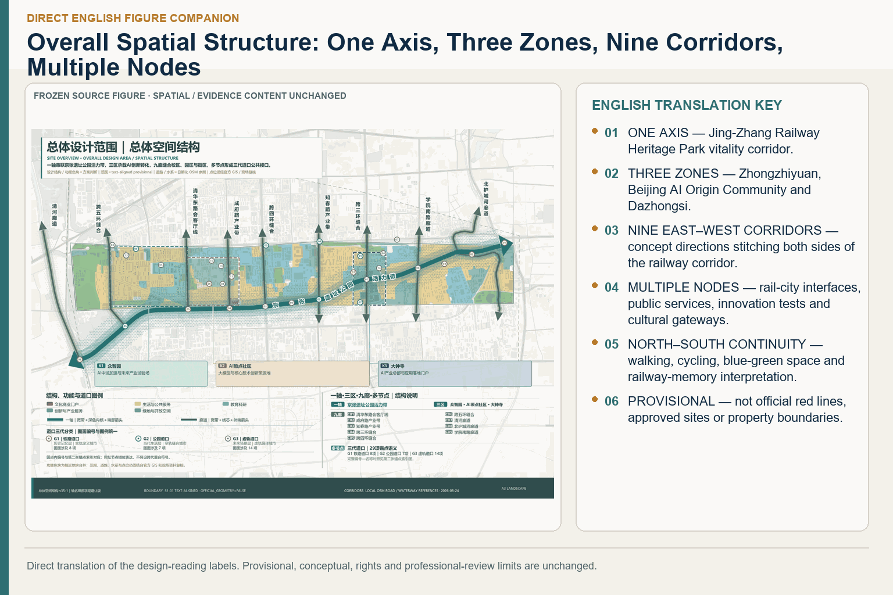

> **Figure 4-1 | Overall spatial structure: One Axis, Three Zones, Nine Corridors, Multiple Nodes.** The structure is a design model within the provisional overall boundary.

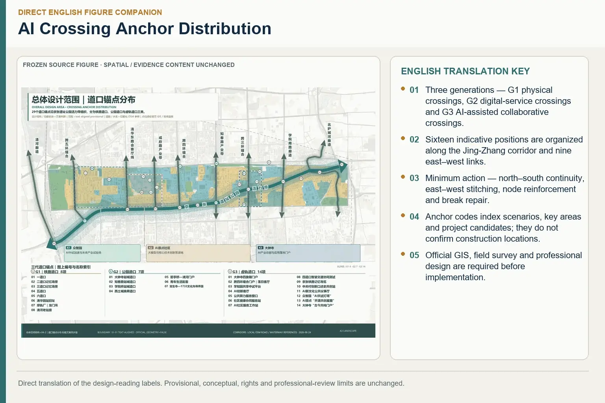

> **Figure 4-2 | AI Crossing anchor distribution.** Twenty-nine conceptual anchors support scenario and implementation indexing, subject to formal location review.

The one axis is Jing-Zhang Heritage Park; three zones are the mandatory key areas; nine transverse corridors repair east–west links; multiple nodes combine stations, parks, campuses, communities, enterprises, and AI scenarios.

### 4.4 Industrial Functions, Land Use, and Supporting Systems

#### 4.4.1 AI Industry and Enterprise-Agglomeration Targets

The proposal strengthens original innovation, pilot production, application conversion, technology services, and public testing. Enterprise, talent, and output goals are scenario targets; they require a verified T0 register before adoption.

#### 4.4.2 Functional Layout and Flexible Proportions

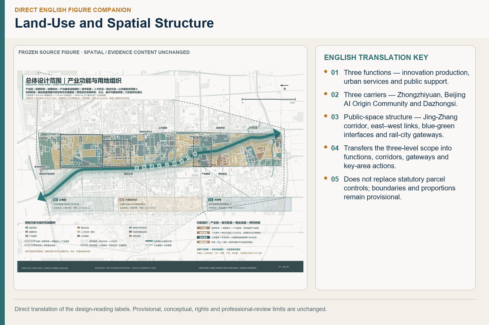

> **Figure 4-3 | Overall land-use and functional structure.** The current 560-feature partition is a gap-free provisional design model, not statutory land use.

By floor area, the model uses 55% innovation production (flexible range 50–60%), 30% urban and talent services (25–35%), and 15% public support and New Infrastructure (10–15%). Any implementation scenario must total 100%; range maxima must not be added together.

#### 4.4.3 Overall Building Capacity and Industrial-Space Supply

The scenario tests 16–18 million m² of total floor area, equivalent to an average FAR of about 1.3922–1.5662 on the current provisional 11.4925 km² geometry. This is a carrying-capacity model, not approved floor area or parcel FAR. [metric:chapter04_total_floor_area_model_lower_sqm] [metric:chapter04_total_floor_area_model_upper_sqm]

#### 4.4.4 Transport, Rail, Municipal, and Service Support

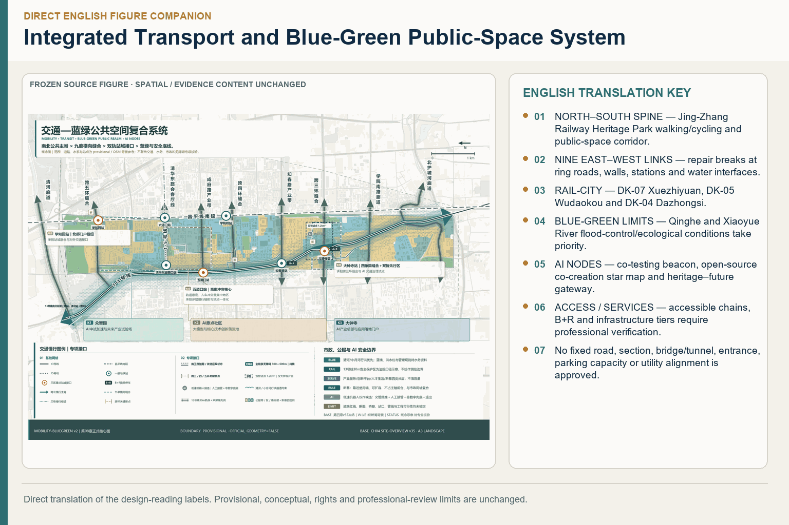

> **Figure 4-4 | Integrated transport and blue-green public-space system.** Walking, cycling, transit interchange, public space, ecological corridors, and AI nodes are coordinated in one provisional network.

### 4.5 Development Intensity and Urban-Character Control

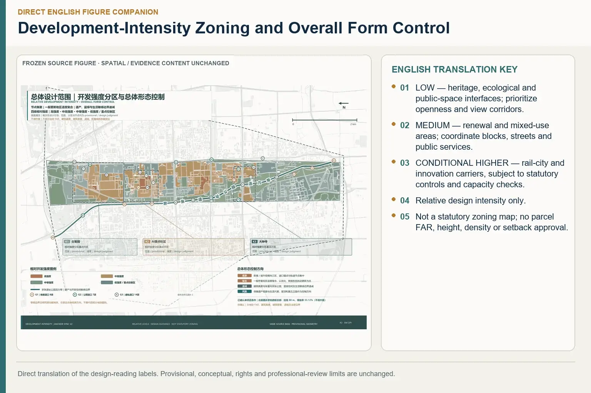

> **Figure 4-5 | Development-intensity zoning.** Relative intensity responds to transit, heritage, ecology, public space, and carrier conditions; no parcel value is represented as a statutory control.

**Table 4-1 | Urban-Character Zone Controls and Conditions Pending Verification**

| Area Type | Intensity and Massing | Roofs and Fifth Facade | Street and Public-Space Interface | Conditions Pending Verification |
|---|---|---|---|---|
| Jing-Zhang heritage and park interface | Step massing down toward the park and avoid continuous large volumes that overwhelm heritage space | Control exposed equipment and miscellaneous appendages to create an orderly roofscape | Maintain public access and heritage view corridors; provide cultural, social, and rest functions | Heritage-protection boundaries, landscape view corridors, and operating permits |
| Rail-transit and crossing cluster | Allow moderate clustering after capacity review and strengthen mixed functions | Form a coherent silhouette through station identity and public-space design | Open ground floors and organize interchange, commerce, innovation services, and public activities | Rail safety, transport capacity, and responsibility for public access |
| University, park, and community transition zone | Control enclosed large volumes and abrupt height changes; use medium-intensity infill | Use articulated volumes, setbacks, and maintainable roofs | Add negotiable public entrances, links, and shared-service interfaces | Campus land rights, fire safety, sunlight, and opening hours |
| Qinghe River, Xiaoyue River, and daily-life-sensitive edges | Keep intensity low or under strict control, stepping massing and height down toward blue-green space | Encourage green roofs and low-reflectance materials | Maintain continuous waterfront, green-space, and community walking routes | Flood control, ecology, sunlight, noise, and maintenance responsibility |

Height, massing, coverage, setback, and interface controls remain directional until formal Regulatory Detailed Planning, road, heritage, and engineering conditions are available. [depth:development_intensity_controls]

### 4.6 Overall Urban-Renewal Framework

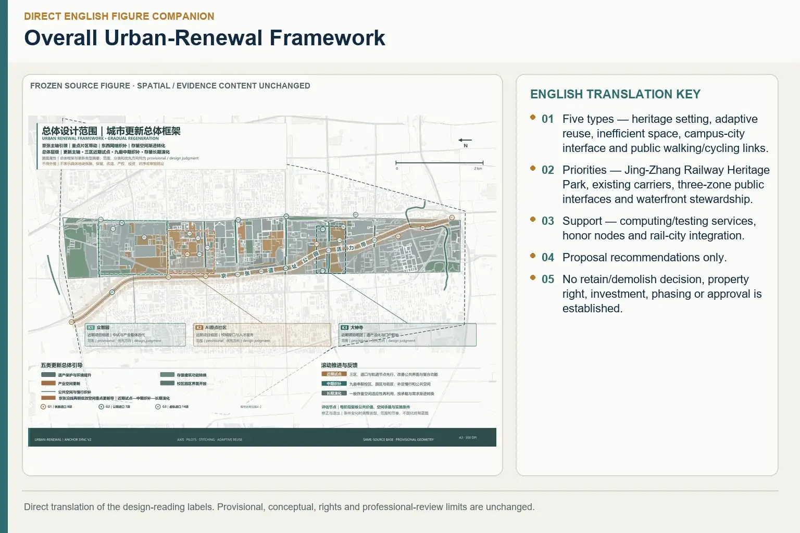

> **Figure 4-6 | Overall urban-renewal framework.** Renewal proceeds through evidence review, retain–renovate–demolish classification, reversible pilots, professional gates, implementation, monitoring, and correction.

> **Evidence references retained for bilingual traceability:** [source:OFFICIAL-ANNOUNCEMENT] [source:CH3-HAIDIAN-AI-BASELINE] [source:CH4-V9-DESIGN-BASELINE] [source:CH4-V9-DESIGN-BASELINE] [metric:chapter04_reported_reusable_space_sqm] [source:CH4-V9-DESIGN-BASELINE] [standard:MOHURD-URBAN-DESIGN-MEASURES] [depth:overall_spatial_structure] [data:geometry/key_areas.geojson#PROV-KEY-001] [data:geometry/key_areas.geojson#PROV-KEY-002] [data:geometry/key_areas.geojson#PROV-KEY-003] [metric:chapter04_crossing_anchor_count] [data:geometry/roads.geojson#ROAD-JZ-AXIS] [source:CH4-V9-DESIGN-BASELINE] [source:CH3-HAIDIAN-AI-BASELINE] [metric:chapter04_innovation_production_share] [metric:chapter04_city_service_share] [metric:chapter04_public_support_share] [metric:chapter04_reported_industry_space_sqm] [metric:chapter04_reported_reusable_space_sqm] [metric:chapter04_total_floor_area_model_lower_sqm] [metric:chapter04_total_floor_area_model_upper_sqm] [metric:chapter04_average_intensity_model_lower] [metric:chapter04_average_intensity_model_upper] [metric:building_footprint_area_sqm] [data:geometry/roads.geojson] [depth:traffic_rail_slow_parking] [depth:municipal_new_infrastructure] [source:OFFICIAL-ANNOUNCEMENT] [data:geometry/public_space.geojson#PUBLIC-001] [source:CH4-V9-DESIGN-BASELINE] [standard:MOHURD-URBAN-DESIGN-MEASURES] [depth:height_massing_character] [source:CH4-V9-DESIGN-BASELINE] [metric:chapter04_reported_reusable_space_sqm] [source:CH10-PROJECT-INTERFACE] [metric:renewal_project_count] [depth:renewal_project_list] [data:geometry/phasing.geojson#PHASE-001] [source:CH10-PROJECT-INTERFACE]
## Chapter 05 Detailed Design of the Three Key Areas

### 5.1 Division of Roles and Spatial Connections

**Table 5-1 | Overview of Design Tasks for the Three Key Areas**

| Key Area | Official Positioning | Main Issues | Core Spatial Actions | Proposal Units | Main Risks |
|---|---|---|---|---|---|
| Zhongzhiyuan (DK-07) | Zhongzhiyuan AI Independent-Innovation Acceleration Zone | Insufficient pilot-production carriers, industry display, external transport, green social spaces, and services for young people | University core + enterprise core + shared pilot-production third pole; station-city integration; park–Qinghe River–country-park connection | Z-01—Z-04 | Northern Regulatory Detailed Planning coverage, boundaries, and ecological conditions pending verification |
| Beijing AI Origin Community (DK-05) | Beijing AI Origin Community | Fragmentation among campus, park, and community; insufficient result-release, talent, housing, and public-space services | Result-conversion network + event ecosystem + low-disturbance renewal; campus-city opening; station and walking/cycling stitching | Y-01—Y-04 | Gentrification, heritage protection, property rights, and transport conditions pending verification |
| Dazhongsi (DK-04) | Dazhongsi AI Industry Cluster | Insufficient capacity for AI-native businesses, public environment around enterprises, commercial services, and four-quadrant connectivity | Culture-led activation → AI introduction; station-city integration; four-quadrant stitching; mixed public interfaces | D-01—D-04 | Heritage protection, property rights, cross-ring-road transport, and implementation period pending verification |

**Table 5-2 | Spatial Data and Capacity Estimates for the Three Key Areas**

| Key Area | Recalculated Provisional Area | Functional Base Coverage | Existing Building Footprints (building-footprint) | Equivalent Existing Floor Area / Intensity | Chapter 04 Renewal-Assessment Coverage |
|---|---:|---:|---:|---:|---|
| Zhongzhiyuan | 191.8 ha | 148.7 ha / 77.6% | 1,760 objects; declared footprints total 49.2 ha | 2.285–2.890 million m² / 1.19–1.51 | Functional conversion 84.6 ha; industrial renewal 45.7 ha; heritage/environment 10.1 ha; stable background 8.3 ha |
| Beijing AI Origin Community | 104.7 ha | 74.6 ha / 71.3% | 1,051 objects; declared footprints total 30.5 ha | 1.294–1.637 million m² / 1.24–1.56 | Functional conversion 31.5 ha; industrial renewal 27.6 ha; heritage/environment 4.0 ha; stable background 11.4 ha |
| Dazhongsi | 72.3 ha | 53.4 ha / 73.9% | 852 objects; declared footprints total 29.2 ha | 1.145–1.449 million m² / 1.58–2.00 | Functional conversion 20.3 ha; industrial renewal 21.3 ha; interface opening 11.6 ha; heritage/environment 0.2 ha |

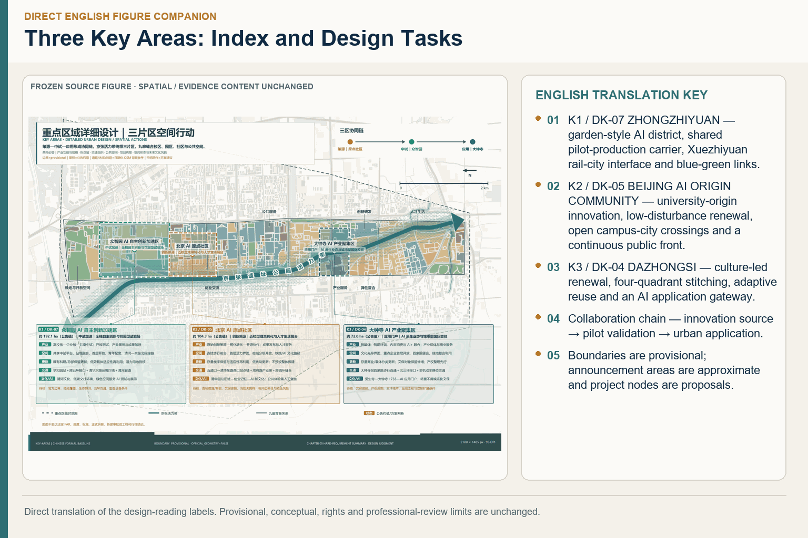

> **Figure 5-1 | Three key areas: index and design tasks.** The three closed polygons are provisional constraints and are not parcel or ownership boundaries.

Zhongzhiyuan is the pilot-production accelerator; AI Origin is the source-innovation and developer community; Dazhongsi is the headquarters, application, and international-exchange gateway. The Jing-Zhang axis and east–west links connect them as one system. [data:geometry/key_areas.geojson#PROV-KEY-001]

#### 5.1.1 Scenario-Level Building Capacity and Increment Control

**Table 5-3 | Development Scale and Implementation Basis for Twelve Project Units**

| Project Unit | Development-Scale Control | Existing-Capacity Proxy | Conditional Addition | Retain–Renovate–Demolish and Implementation Basis |
|---|---|---:|---:|---|
| Z-01 Shared Pilot-Production Platform | Adapt existing pilot-production space with limited conditional additions | 232,000–295,000 m² | 9,000–24,000 m² | Retain suitable buildings; convert underused space; cap additions; trigger under mid-term stitching conditions |
| Z-02 Xuezhiyuan Station-City Integration | Mixed use of station-level ground floors; no large-volume new construction | 28,000–36,000 m² | 0–1,000 m² | Retain main buildings; renew entrances, canopies, and accessible interfaces; trigger under near-term pilot conditions |
| Z-03 Youth Living Support | Reuse existing living services with small reversible additions | 144,000–181,000 m² | 1,000–5,000 m² | Retain residential-service buildings; convert ground floors; keep additions away from sensitive interfaces; trigger under mid-term stitching conditions |
| Z-04 Jing-Zhang–Bajia Country Park Walking and Cycling Greenway | No independent development capacity | 166,000–210,000 m² | 0 m² | Retain ecological, park, and water-system space; use lightweight removable facilities; trigger under near-term pilot conditions |
| Y-01 Hacker House / Talent Station | Prioritize existing ground floors and shared spaces; allow minimal reversible additions | 79,000–100,000 m² | 1,000–2,000 m² | Retain primary structures; use short leases and reversible fit-outs; maintain continuous open ground-floor interfaces; trigger under near-term pilot conditions |
| Y-02 Step-Free Chain Outside the Station | No independent building capacity | 156,000–197,000 m² | 0 m² | Retain buildings along the route; renew entrances, ramps, paving, and street furniture; trigger under near-term pilot conditions |
| Y-03 Campus-City Open Crossing | Reuse existing entrances and street-facing buildings; only lightweight reversible facilities | 99,000–126,000 m² | 0–1,000 m² | Retain campus buildings; implement each open interface through a campus-specific agreement; trigger under mid-term stitching conditions |
| Y-04 Huaqing Jiayuan Memory Space | Use existing commercial and public spaces; no independent additional capacity | 50,000–63,000 m² | 0 m² | Retain neighborhood fabric; convert ground-floor uses; prioritize heritage requirements; trigger under mid-term stitching conditions |
| D-01 Public-Space Governance | Combine enterprise ground floors, station forecourts, and reversible facilities | 107,000–135,000 m² | 0–3,000 m² | Retain office buildings; open public interfaces; use removable facilities; trigger under near-term pilot conditions |
| D-02 Four-Quadrant Pedestrian Stitching | No assumed underground works or additional building capacity | 184,000–233,000 m² | 0 m² | Retain existing buildings; renew entrances, under-bridge spaces, and station interfaces; trigger under mid-term stitching conditions |
| D-03 Juesheng Temple Culture-Led Interface | Prioritize existing cultural and commercial buildings; allow conditional additions outside heritage controls | 175,000–223,000 m² | 2,000–7,000 m² | Preserve heritage and industrial remains; convert commercial functions; any demolition or construction must pass prerequisite gates; trigger under long-term evolution conditions |
| D-04 Dual-Intelligence Experience Segment | Install replaceable equipment; no independent building capacity | 126,000–160,000 m² | 0 m² | Keep roads and primary buildings unchanged; use modular, maintainable, and removable equipment; trigger under near-term pilot conditions |

Twelve implementation units provide scenario-level area and capacity checks. Their values test transport, services, open space, and industrial programming; they are not approved construction quantities.

#### 5.1.2 Building-Object Retain–Renovate–Demolish Classification

**Table 5-4 | Building-by-Building Retain–Renovate–Demolish Classification in the Three Key Areas**

| Key Area | Objects | Retain | Conservation Repair | Functional Conversion | Interface Upgrade | Conditional Demolition Candidates | Pending Survey |
|---|---:|---:|---:|---:|---:|---:|---:|
| Zhongzhiyuan | 1,760 | 53 | 27 | 1,532 | 0 | 45 | 103 |
| Beijing AI Origin Community | 1,051 | 75 | 38 | 821 | 3 | 25 | 89 |
| Dazhongsi | 852 | 0 | 2 | 484 | 216 | 48 | 102 |

The current model registers 3,663 building objects and separates retain, repair, adaptive reuse, partial replacement, redevelopment, and pending review. Object-level certainty depends on formal building survey, ownership, structure, heritage, contamination, and planning controls.

#### 5.1.3 Key Nodes, Sections, and Interface Controls

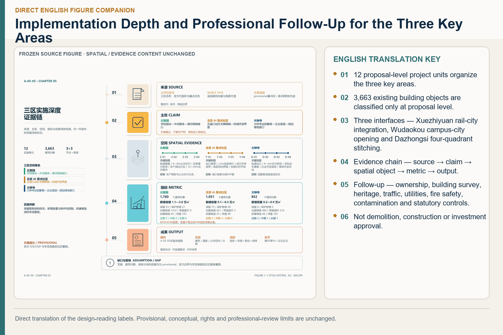

> **Figure 5-2 | Implementation depth, key nodes, and section controls.** Three nodes, three sections, and three interface connections define the present competition-level design depth and professional follow-up gates.

### 5.2 Zhongzhiyuan AI Independent Innovation Acceleration Area

#### 5.2.1 Design Goal and Core Issues

Create a garden-like full-stack innovation district linking shared pilot production, standards and safety governance, low-carbon exchange, Qinghe ecology, transit access, and everyday services.

#### 5.2.2 Spatial Structure and Priority Actions

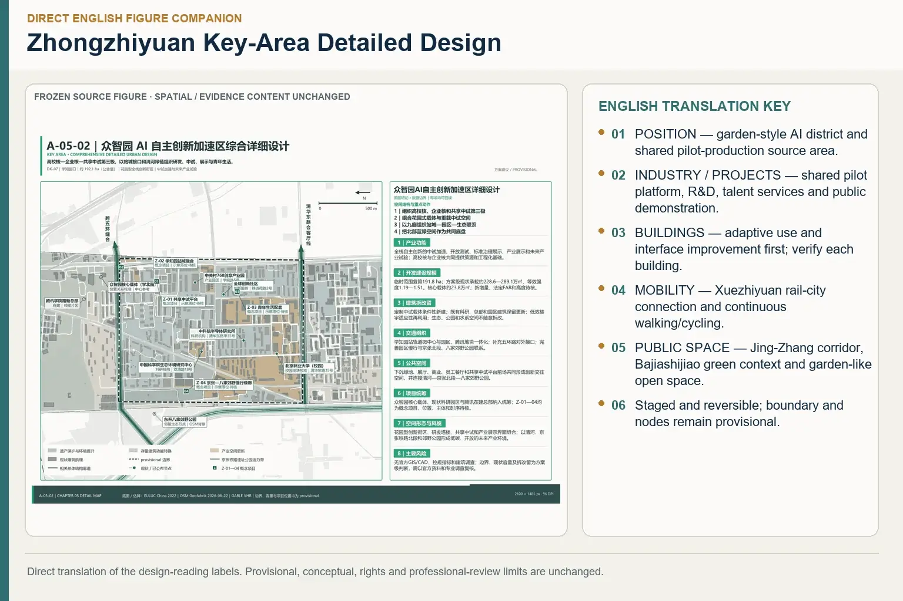

> **Figure 5-3 | Zhongzhiyuan key-area detailed design.** It presents the industry and project chain, building-renewal directions, station–district and slow-mobility links, blue-green public space, and implementation risks. The boundary is provisional; project nodes are design recommendations shown at indicative locations.

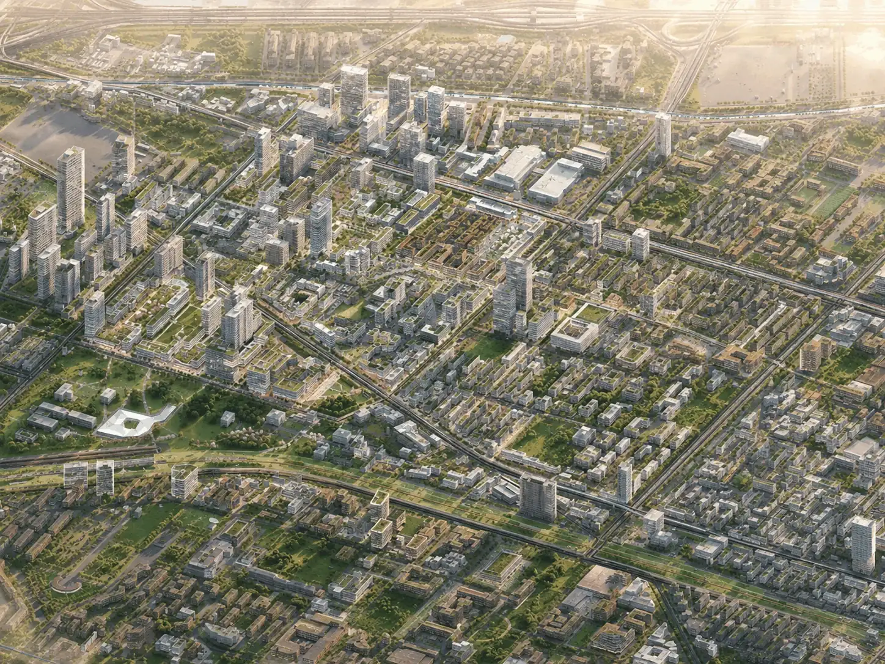

> **Figure 5-4 | Zhongzhiyuan aerial concept.** An Agent automatically searched and downloaded public GABLE/OSM/EULUC data to generate the K3 Blender block base; the user produced the image-to-image rendering on the official GPT website. This is a composite design concept, not proof of existing or approved conditions. [source:CH5-ZZY-AERIAL]

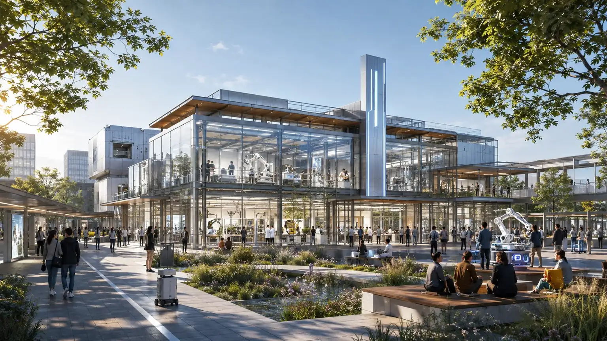

> **Figure 5-5 | Zhongzhiyuan shared pilot-production platform ground-floor interface.** Corresponding to Z-01 / Node B, it presents public results display, industrial exchange, and an open ground-floor interface. This AI-assisted image is a design concept, not an existing condition or completed project. [source:CH6-LM01-RENDER]

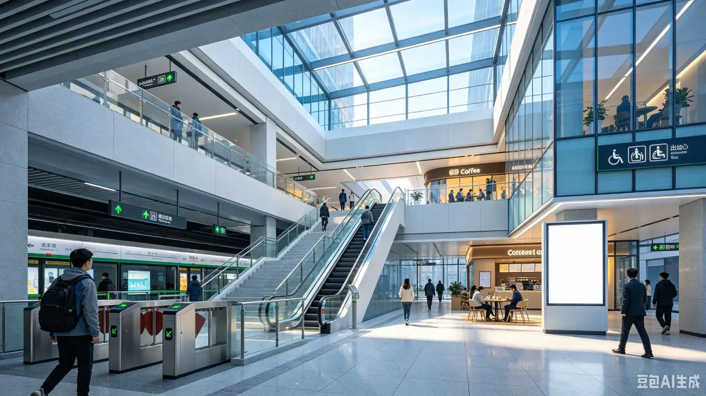

> **Figure 5-6 | Zhongzhiyuan Xuezhiyuan station–district integration section.** Corresponding to Z-02, it presents the combined relationship among rail access, commercial services, and the district ground floor. This AI-assisted image is conceptual; underground space, structure, and engineering conditions require specialist verification.

#### 5.2.3 Project Units and Specialized Controls

**Table 5-5 | Zhongzhiyuan Project-Unit Controls**

|Project module|Industry and public functions|Scale control|Demolition and building patterns|Transport and public space|
|---|---|---|---|---|
|Z-01Sharing Pilot Platform|Flexible neutral testing, open testing, results release, standards and security governance demonstration|Priority is given to the use of appropriate space in approximately 238,000 m2 core vehicles; additional equipment and support size are determined by weight, layer height, fire and handling conditions|Retention of the campus towers and applicable premises; inefficient space conversion; additional packages with detachable and scalable units|Production tests and public display zoning; loading and unloading traffic and public walk diversion|
|Z-02The city of the learned park is integrated.|Orbital access, industrial services, visitor gathering and park display|No additional construction in general, priority is given to the use of the first floor of the perimeter of the site and public space|Maintain existing buildings; open the first level interface and the entrance to the park; and form a continuous rain shed and orientation interface on the side of the site|Connecting to the knowledge park, the generals ' garden and the troupe plots, improving access, accessibility, cycling and non-motorized parking|
|Z-03Youth life packages|Youth residential services, catering, culture, sports and night-time contacts|Reversible facilities are used on a small scale, mainly in the first floor of the stock-serving space and park|Retention of residential and service buildings; first-level conversion; new volume-to-industrial interfaces and avoidance of life-sensitive areas|It's a 15-minute life circle, forming a park-community-Jing-Zhang Railway Heritage Park continuous walk network.|
|Z-04 Jing-Zhang–Qinghe–Bajia Country Park ecological corridor|Qinghe culture, low-carbon exchange, AI experience, and ecological recreation|No independent development capacity; fixed facilities remain subject to green-space, water, and flood-control requirements|Do not divert ecological, park, or water-system land; allow only lightweight, removable demonstration and service facilities|Connect the northern Heritage Park, Qinghe River, Bajia Country Park, and the corridor beneath the Fifth Ring Road|

Project units combine pilot-production carriers, shared platforms, station connections, Qinghe public space, and embedded daily services. Flood safety, rail and road conditions, energy, compute, and operating responsibilities are professional prerequisites.

#### 5.2.4 Mandatory-Requirement Response

**Table 5-6 | Implementation of Mandatory Requirements for Zhongzhiyuan**

|Official hard content|The conclusions of the Academy of Excellence|
|---|---|
|Industrial Functions|National AI platform hosting, full-store innovation, pilot production acceleration, open testing, demonstration of standards and safety governance, industry demonstration and future industrial experiments; joint supply of science and engineering base from tertiary and enterprise nuclear|
|Size of development|Highlights regional published briefs approximately 192.1ha, provisional scope recalculation 191.8ha; proposal-level status quo baseline approximately 228.6-2.891,000 m2, equivalent strength 1.1-1.51; core carrier approximately 238,000 m2, telecommunications headquarters approximately 460,000 m2, 80m, green area rate 33.12 per cent only applicable to the project; additional construction and statutory FAR, high-level pending clearance|
|Construction and rehabilitation|New or custom-made test vehicles; maintenance of existing scientific, headquarters and campus buildings; inefficient building adaptive reuse; ecological, park and water space not being used as objects for random demolition|
|Transport organizations|Integration of the Orbital Microcentre of the Knew Park Station with the Park and the Tung Chai Block; addition of the five-ring road to external traffic; improvement of the links between the slow movement within the Park and the north sector of Jing-Zhang and Bajia Country Park|
|Public space|Exhibition hall, business, shared tactile space, and Qing Ha-King Zhang North sector - Bajia Country Park green links; super-Chang River culture, international low-carbon exchange and reversible AI scenes|
|Project integration|P-05 is an ongoing/open project, and P-06 is operational status to be cleared;Z-01—Z-04 includes pilot production, stand-by, youth services and slow green halls|
|Space shape and appearance|Garden-based innovation blocks, research and development towers, shared testing and industry demonstration interfaces; a low-carbon, open and geographically remembered future industrial environment with the Qinghe River, the northern section of the Jingjan railway and the suburban park|
|Main risks|The control rules for the border and the north cover pending clearance; historical industrial sites must be completed with applicable investigations; and the five-ring roads, ecology, flood control, equipment and conditions of service for youth require professional review|

The design addresses national AI platforms, independent innovation, standard setting, safety governance, industrial display, external transport, Qinghe culture, low-carbon exchange, and AI-enabled green space.

#### 5.2.5 Risks and Pending Verification

Formal boundaries, ownership, current buildings, river and flood-control lines, station engineering, municipal capacity, and implementing entities remain unverified.

### 5.3 Beijing AI Origin Community

#### 5.3.1 Design Goal and Core Issues

Build a university-adjacent source-innovation community that joins research, open-source collaboration, results release, incubation, talent life, and public space.

#### 5.3.2 Spatial Structure and Priority Actions

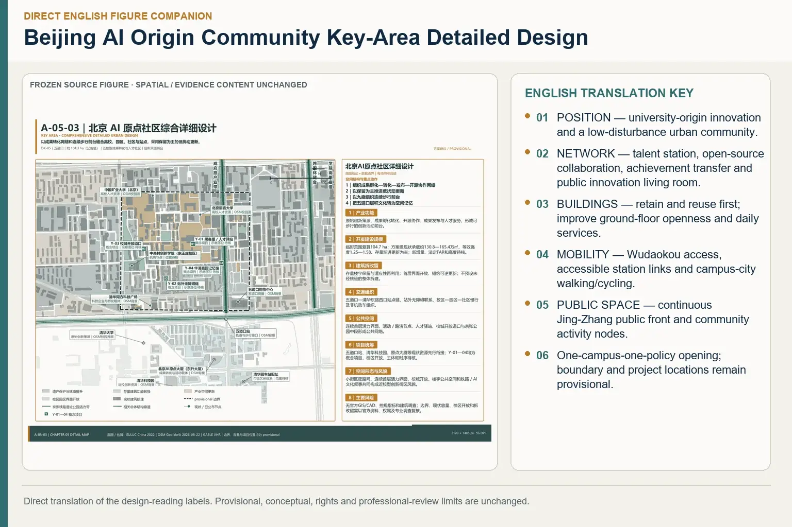

> **Figure 5-7 | Beijing AI Origin Community key-area detailed design.** It presents the innovation-transfer network, low-disturbance renewal, continuous pedestrian frontage, station links, and public space. The boundary is provisional; project nodes are design recommendations shown at indicative locations.

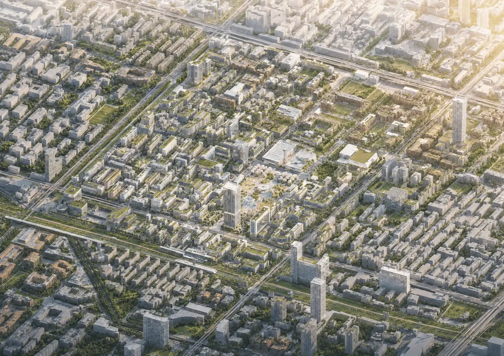

> **Figure 5-8 | AI Origin Community aerial concept.** An Agent automatically searched and downloaded public GABLE/OSM/EULUC data to generate the K3 Blender block base; the user produced the image-to-image rendering on the official GPT website. The image is conceptual and non-statutory. [source:CH5-ORIGIN-AERIAL]

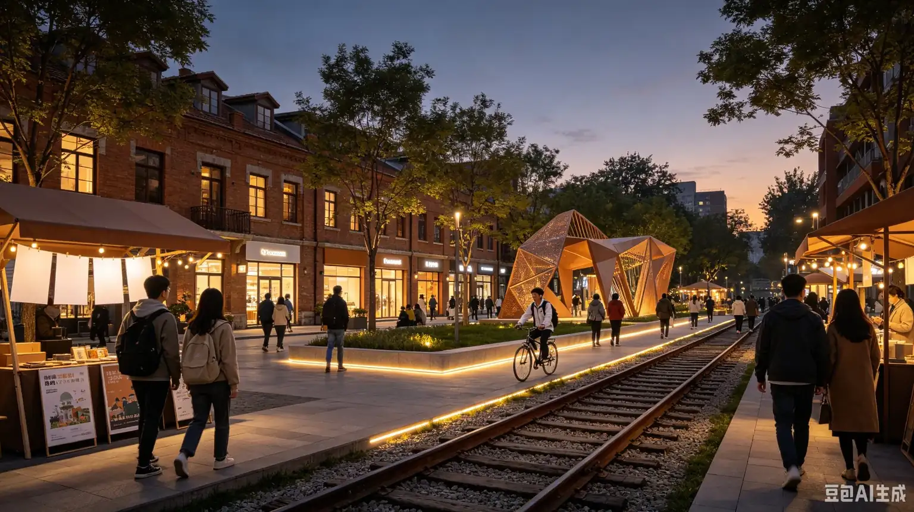

> **Figure 5-9 | AI Origin Community Wudaokou / central Jing-Zhang Park activity scene.** Corresponding to Y-04, it combines railway memory, community activity, evening exchange, and the Jing-Zhang Park public interface. This AI-assisted image is conceptual, not an existing condition or confirmed operating arrangement.

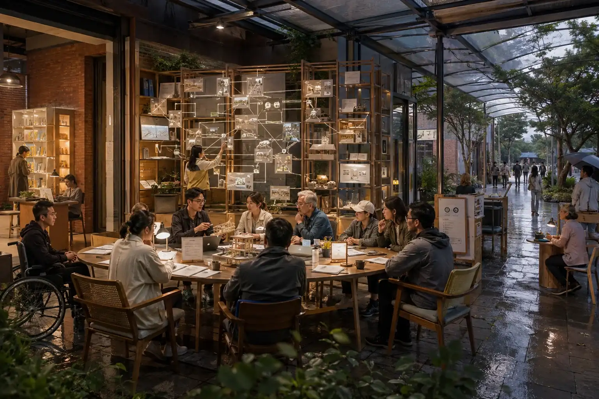

> **Figure 5-11 | AI Origin Community urban innovation public living room.** Corresponding to Y-01 / Y-03, it organizes an open public collaboration interface through deliberation, intergenerational co-creation, accessible participation, and innovation display. This AI-assisted image is conceptual, not an existing condition, completed project, or record of actual public participation. [source:CH5-ORIGIN-INNOVATION-LIVING-ROOM-RENDER]

#### 5.3.3 Project Units and Specialized Controls

**Table 5-7 | Beijing AI Origin Community Project-Unit Controls**

| Project Unit | Industry and Public Functions | Scale Control | Retain–Renovate–Demolish and Building Form | Transport and Public Space |
|---|---|---|---|---|
| Y-01 Hacker House / Talent Station | Proof of concept, developer collaboration, output releases, and talent services | Prioritize ground floors and shared spaces in AI Origin Building, technology parks, and nearby existing buildings; determine additions after a building survey | Retain primary structures; use short leases and reversible fit-outs; create small-scale, continuously open ground-floor interfaces | Connect to the Wudaokou walking network; provide night-time safety, event gathering space, and bicycle parking |
| Y-02 Step-Free Chain Outside the Station | Interchange outside Wudaokou Station, step-free travel, and walking/cycling connections | No independent building capacity; determine facility scale through passenger-flow and accessibility studies | Retain buildings along the route; locally adjust entrances, ramps, paving, and street furniture | Continuously connect station exits, parks, neighborhoods, and the central section of Jing-Zhang Railway Heritage Park; reduce detours and level breaks |
| Y-03 Campus-City Open Crossing | University output exchange, shared services, and park collaboration | Do not occupy university research space; use existing entrances and street-facing buildings for services | Primarily retain campus buildings; implement open interfaces on a campus-specific basis; keep new facilities lightweight and reversible | Connect universities, technology parks, neighborhoods, and stations; define opening hours, safety requirements, and responsibilities |
| Y-04 Huaqing Jiayuan Memory Space | Railway memory, entrepreneurial culture, neighborhood exhibitions, and branded events | Primarily use existing commercial space, neighborhood public space, and movable displays | Retain neighborhood fabric and suitable buildings; convert ground-floor uses; comply with heritage controls around the former Tsinghuayuan Station site | Link Chengfu Road, Wudaokou, Jing-Zhang Railway Heritage Park, and neighborhood life nodes |

Units organize near-campus incubation, open-source collaboration, public release, walking and cycling links, housing and daily services, and event-support space. Campus security, research confidentiality, ownership, fire safety, and resident impact are entry gates.

#### 5.3.4 Mandatory-Requirement Response

**Table 5-8 | Implementation of Mandatory Requirements for Beijing AI Origin Community**

|Official hard content|Beijing AI Textual Conclusion for the Origin Community|
|---|---|
|Industrial Functions|University prototype innovation, incubation and transformation, developers ' communities, open-source collaboration, presentation of results, branding, talent service and near-school life packages|
|Size of development|Highlights regional published briefs approximately 104.3ha, provisional scope recalculation of 104.7ha; proposal-level status quo baseline of approximately 130.8-1.54 million m2, equivalent strength of 1.25-1.58; major emphasis on high density mixed neighbourhoods and progressive stock updates, with small new constructions to be supplemented by conditional ones; additional construction and statutory FAR, high-level pending approval|
|Construction and rehabilitation|Retention is dominant; inefficient building adaptive reuse; opening of the first floor and university wall interface; short-term reversible updates; non-predicted unverified land for reconstruction|
|Transport organizations|Integration of the five-port, Caohua East and West Bank sites; final 300-metre access continuous links outside the site; walking and cycling of the school district, park area, community; simultaneous verification of non-motorized vehicles, fire and road conditions|
|Public space|First-level dynamic interface, outcome publication and branding nodes, talent station, middle of Jing-Zhang Park, open gate of campus and memory space at Hua Qingca Park|
|Project integration|P-07/P-12 is a concept project and P-10 is a recent pilot;Y-01—Y-04 includes human resources services, accessibility, open school cities and cultural memory|
|Space shape and appearance|The block-based network, the first-level dynamic interface, open campus, public spaces and railway/AI cultural narratives together make up the landscape of the near-school innovative neighbourhood|
|Main risks|Gentleness and spatial exclusion; border control at old site V at Qinghua Park Station; tertiary authority and opening conditions; high-level 13, barrier-free, fire-fighting, road and upgrading costs to be approved|

The design addresses university-adjacent innovation, incubation and transformation, talent support, open-source systems, brand events, building renewal, results release, campus–park links, and transit integration.

#### 5.3.5 Risks and Pending Verification

Campus interfaces, current uses, ownership, housing policy, structural condition, event capacity, and professional traffic and fire-safety reviews remain pending.

### 5.4 Dazhongsi AI Industry Cluster

#### 5.4.1 Design Goal and Core Issues

Create an application and exchange gateway that combines headquarters, agents, intelligent terminals, data and content services, station integration, Juesheng Temple culture, and four-quadrant pedestrian stitching.

#### 5.4.2 Spatial Structure and Priority Actions

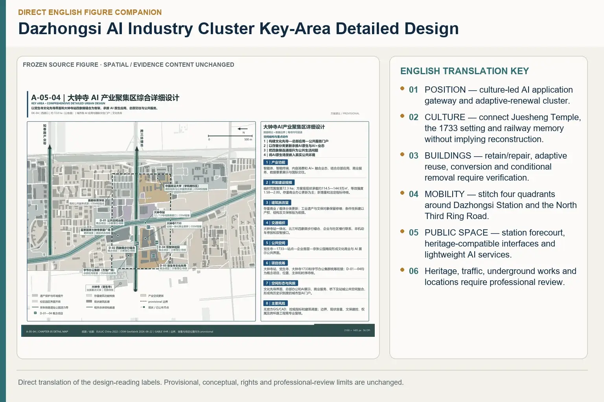

> **Figure 5-12 | Dazhongsi key-area detailed design.** It presents culture-led renewal, classified adaptive reuse, four-quadrant stitching, station–district links, and public interfaces for AI applications. The boundary is provisional; project nodes are design recommendations shown at indicative locations.

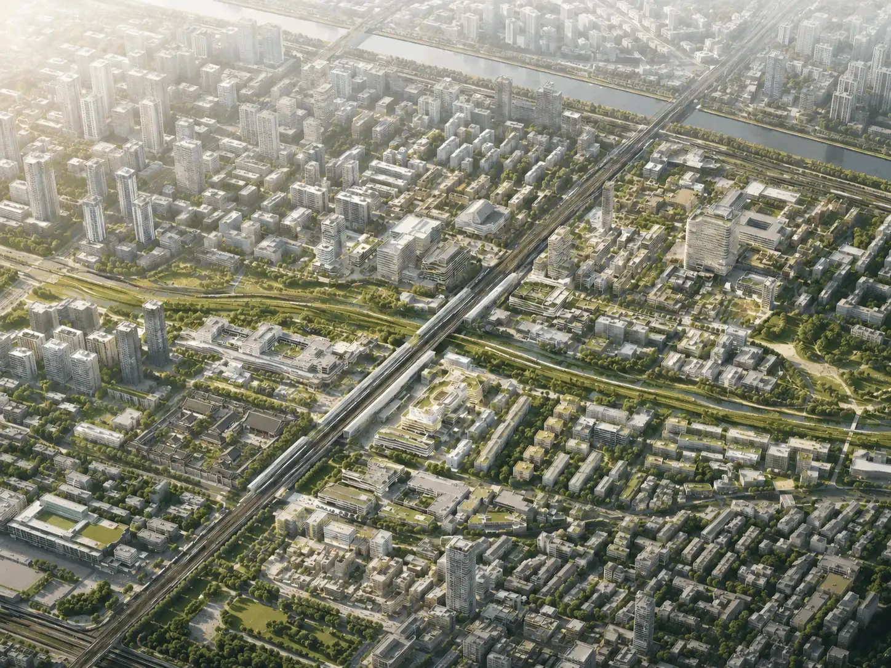

> **Figure 5-13 | Dazhongsi aerial concept.** An Agent automatically searched and downloaded public GABLE/OSM/EULUC data to generate the K3 Blender block base; the user produced the image-to-image rendering on the official GPT website. It is a composite concept, not an existing-condition or approved-design image. [source:CH5-DZS-AERIAL]

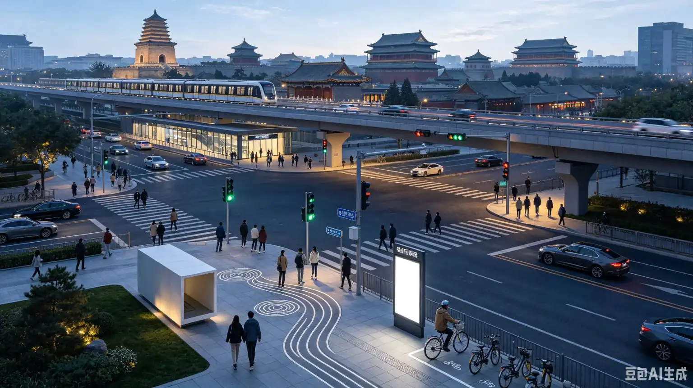

> **Figure 5-15 | Dazhongsi four-quadrant stitching / dual-intelligence experience segment.** Corresponding to D-02 / D-04, it presents walking and cycling links among the station and the four quadrants of the North Third Ring Road, plus replaceable smart-mobility and smart-service facilities. This AI-assisted image is conceptual; underground works, road traffic, and equipment deployment require specialist review.

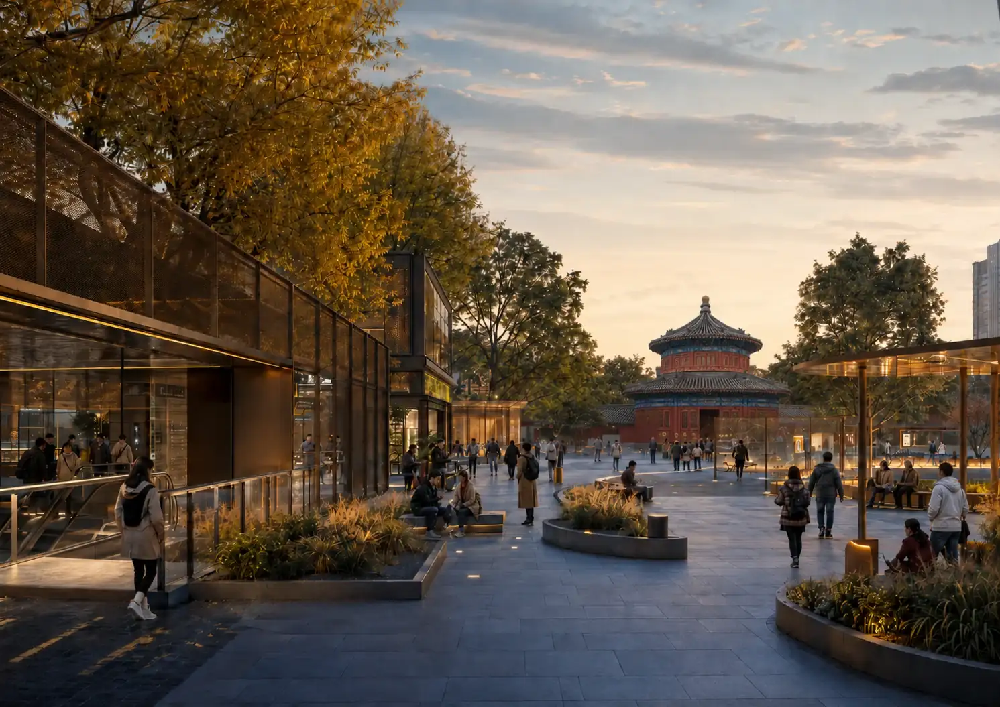

> **Figure 5-16 | Dazhongsi station forecourt.** Corresponding to D-02 / D-04, it combines station arrival, continuous walking, public stay, cultural imagery, and lightweight services into a four-quadrant public interface. This AI-assisted image is conceptual, not an existing condition, heritage reconstruction, completed project, or approved construction basis. [source:CH5-DAZHONGSI-STATION-PLAZA-RENDER]

#### 5.4.3 Project Units and Specialized Controls

**Table 5-9 | Dazhongsi AI Industry Cluster Project-Unit Controls**

| Project Unit | Industry and Public Functions | Scale Control | Retain–Renovate–Demolish and Building Form | Transport and Public Space |
|---|---|---|---|---|
| D-01 Public-Space Governance | Enterprise services, international exchange, roadshows, commercial support, and compatible use of planned green space | Primarily use enterprise ground floors, station forecourts, and reversible facilities in planned green space without changing its land-use status or development capacity | Retain enterprise office buildings; open ground-floor and street interfaces; use removable lightweight structures for additions | Continuously organize enterprise entrances, station access, Jing-Zhang Railway Heritage Park, and neighborhood-service spaces |
| D-02 Four-Quadrant Pedestrian Stitching | Rail interchange, enterprise commuting, neighborhood crossings, and bicycle distribution | Do not assume underground works or additional building scale; determine interventions through a transport study | Primarily retain existing buildings; focus renewal on entrances, under-bridge spaces, and station interfaces | Define four-quadrant walking routes, accessible crossings, bus interchange, and bicycle-parking areas |
| D-03 Juesheng Temple Culture-Led Interface | Cultural exhibitions, AI application releases, commercial services, and an urban gateway | Primarily use existing space at Juesheng Temple, Dazhongsi 1733, and enterprise ground floors; all additions must comply with heritage controls | Conserve and repair Juesheng Temple and industrial remains; enable functional conversion of projects similar to Zhongkun Plaza; retain only a conditional possibility of reconstruction for projects similar to Lanjing Lijia | Form a continuous cultural walking route linking Juesheng Temple, Dazhongsi 1733, Dazhongsi Station, and the southern section of Jing-Zhang Railway Heritage Park |
| D-04 Dual-Intelligence Experience Segment | Intelligent-transport experience, authorized data displays, community services, and public feedback | Install replaceable equipment along existing roads and service nodes without creating independent development capacity | Do not alter primary roads or buildings; use maintainable, removable, modular equipment | Improve traffic information, Human Review, appeals and opt-out mechanisms, and walking/cycling safety within the existing pilot area |

Units combine station–district links, mixed-use renewal, enterprise display, cultural interfaces, public space, and intelligent-native consumption. Heritage approval, station and intersection engineering, ownership, commercial feasibility, and municipal capacity remain gates.

#### 5.4.4 Mandatory-Requirement Response

**Table 5-10 | Implementation of Mandatory Requirements for Dazhongsi AI Industry Cluster**

|Official hard content|The text of the conclusion of the Dazhongsi, AI, the industrial conglomerate.|
|---|---|
|Industrial Functions|AI Origin/AI+ Integration Business, Smart and Smart Terminals, Headquarters Applications, Content Consumption, Data Elements Compliance Demonstration, Developer Services, International Engagement and Cultural Experience|
|Size of development|Highlights regional published briefs of approximately 72.0ha, provisional scope recalculation of 72.3ha; proposal-level status quo baseline of approximately 114.5-1.44 million m2, equivalent strength 1.58-2.00; byte office cluster and bulk stock commerce as the main context; additional construction and statutory size of projects pending approval|
|Construction and rehabilitation|Re-engineering of suitable businesses such as Nakakun; updated leads published by the Blue King family as reference for the demolition of the reconstruction type; property rights pre-positioning; industrial heritage and preservation of the subject; no new conclusions in the heritage protection construction control|
|Transport organizations|Dazhongsi station is integrated, the four-quake walk is sewn, the three-ring walking and cycling links across the north, the non-motorized parking and the two-minded pilot link.|
|Public space|Juesheng Temple - 1733 Cultural Business Interface, Four Element Node, South Sector of Jing-Zhang Park, Planning Reversible Complex Use of Greenlands, Corporate First Level and AI Application Demonstration|
|Project integration|P-01 with open basis, P-02 with renovation, P-03 conversion, P-04 re-engineering,P-08/P-14 as a concept project;D-01—D-04 continues to assume public governance, suture, culture and experience|
|Space shape and appearance|Cultural lead interface, headquarters office and AI display, business services, underbridges and public spaces in the City of the Station, resulting in a city-type AI Crossing with historical recognition|
|Main risks|Scope of protection and control of the State of the Temple; property rights and renewal cycle; north ring noise and foot cutting; roads, stop towns, non-motorized vehicles and dual-twilight extension conditions to be approved|

The design addresses leading enterprises, agents, intelligent terminals, content consumption, data elements, digital assets, commercial services, mixed use of planned green space, Dazhongsi Station, and four-quadrant connectivity.

#### 5.4.5 Risks and Pending Verification

Juesheng Temple protection requirements, station facilities, road and utility conditions, current rights, commercial programs, and event operations require formal confirmation.

### 5.5 Three-Area Coordination and Implementation

**Table 5-11 | Project Status and Coordination Rules for the Three Key Areas**

|Layer|Zhongzhiyuan|Beijing AI Origin Community|Dazhongsi|Harmonization of rules|
|---|---|---|---|---|
|Status/Open|University research, parks and blue and green foundations|Colleges, research and development institutions, home-grown buildings, five ports and community foundations|Kyawsheng Temple, 1733, Enterprise Office, Stock Exchange, Jing-Zhang Park|Mainly reserved use, functional conversion and public interface upgrade|
|Under construction/open advancement|P-05 Telecommunication Headquarters; P-06 carrier operational status pending approval|No additional construction commitments|Project-by-project verification, not to equal the updated trail to completion|Only approved public space and transport interfaces outside the border|
|Planning/concept|Z-01—Z-04|P-07,P-10/P-12 and Y-01-Y-04|P-08/P-14 and D-01-D-04|Liability, costs and implementation time to be approved|

The three areas share a project register, scenario protocol, metric definitions, public-space standards, professional entry gates, and feedback system. Light, reversible interfaces may be piloted first; fixed construction waits for formal planning, ownership, engineering, safety, finance, and operating conditions.

> **Evidence references retained for bilingual traceability:** [source:CH4-V9-DESIGN-BASELINE] [standard:PROJECT-OFFICIAL-ANNOUNCEMENT] [source:CH3-HAIDIAN-AI-BASELINE] [source:CH6-SCENARIO-BASELINE] [data:geometry/key_areas.geojson#PROV-KEY-002] [data:geometry/key_areas.geojson#PROV-KEY-003] [source:CH4-V9-DESIGN-BASELINE] [standard:PROJECT-AGENT-OPEN-CALL-TASKBOOK] [source:CH4-V9-DESIGN-BASELINE] [source:CH4-V9-DESIGN-BASELINE] [depth:retain_renovate_demolish] [source:CH5-SCHEME-ESTIMATE] [data:geometry/buildings.geojson] [metric:building_footprint_area_sqm] [source:CH5-IMPLEMENTATION-DEPTH] [metric:chapter05_implementation_unit_count] [data:geometry/buildings.geojson] [depth:retain_renovate_demolish] [data:geometry/public_space.geojson#CH5-NODE-Z] [data:geometry/roads.geojson#CH5-LINK-Z] [depth:three_key_area_detailed_design] [source:CH4-V9-DESIGN-BASELINE] [source:CH5-ZZY-DATA] [standard:PROJECT-OFFICIAL-ANNOUNCEMENT] [source:CH5-CASE-TRANSLATION] [source:CH6-SCENARIO-BASELINE] [source:CH4-V9-DESIGN-BASELINE] [depth:retain_renovate_demolish] [depth:traffic_rail_slow_parking] [source:CH5-ZZY-DATA] [source:CH5-RELATED-DATA] [source:CH10-PROJECT-INTERFACE] [source:CH5-ZZY-DATA] [source:CH5-ORIGIN-DATA] [standard:PROJECT-OFFICIAL-ANNOUNCEMENT] [source:CH4-V9-DESIGN-BASELINE] [source:CH5-ORIGIN-DATA] [source:CH6-SCENARIO-BASELINE] [source:CH4-V9-DESIGN-BASELINE] [source:CH5-CASE-TRANSLATION] [depth:retain_renovate_demolish] [depth:traffic_rail_slow_parking] [source:CH5-ORIGIN-DATA] [source:CH5-CASE-TRANSLATION] [source:CH10-PROJECT-INTERFACE] [source:CH6-SCENARIO-BASELINE] [source:OFFICIAL-ANNOUNCEMENT] [source:CH6-SCENARIO-BASELINE] [source:CH4-V9-DESIGN-BASELINE] [source:CH5-DAZHONGSI-DATA] [source:CH5-DAZHONGSI-DATA] [source:CH5-CASE-TRANSLATION] [source:CH6-SCENARIO-BASELINE] [source:CH4-V9-DESIGN-BASELINE] [depth:retain_renovate_demolish] [depth:traffic_rail_slow_parking] [source:CH5-DAZHONGSI-DATA] [source:CH5-CASE-TRANSLATION] [source:CH4-V9-DESIGN-BASELINE] [source:CH10-PROJECT-INTERFACE] [source:CH10-PROJECT-INTERFACE] [source:CH4-V9-DESIGN-BASELINE] [source:CH10-PROJECT-INTERFACE]
## Chapter 06 AI Innovation Ecosystem, Personas, and AI+ Scenarios

### 6.1 From Innovation Resources to Verifiable Scenarios

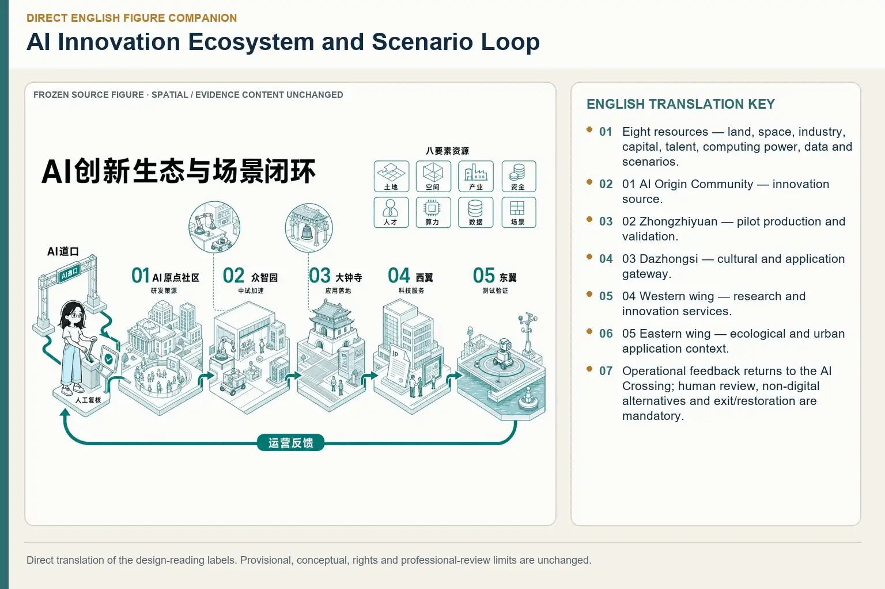

> **Figure 6-1 | AI innovation ecosystem and scenario loop.** [source:CH6-SCENARIO-ASSETS]

The ecosystem links eight resources to spatial carriers and then to measurable scenarios. Every scenario states its user, location, input, output, operator category, human review, non-digital fallback, evaluation, and exit condition. [source:CH6-SCENARIO-BASELINE]

### 6.2 Five Personas and Spatial Responses

**Table 6-1 | Five User Profiles and Service Interfaces**

|User Image|Target and main pain.|Active time and space touch|Digital capacity versus non-digital services|
|---|---|---|---|
|AI R & D and Engineer|Finding collaborators, computing power and pilot production resources; cross-agency collaboration, night service and intellectual property boundaries are the main pains|Days and evenings; AI Origin, Cynic Park, Kwanjin Village Science Service Wing|Digital tools are available, but manual channels for security training, contracts, equipment operations and appeals are maintained|
|Students and young researchers at higher education institutions|Access to credible courses, mentors, laboratories and cross-school projects; avoidance of information distortion and automatic evaluation|After-school, weekend and night; university interface, AI site, public space along the Jing-Zhang|Support multiple interfaces; academic content, achievement and qualification judgement are the responsibility of teachers or professionals|
|Older residents and family caregivers|Completion of health counselling, community work and daily travel; avoidance of digital thresholds and bug suggestions|Day and peak service; community around Dazhongsi, life-course|Supports large word, voice and key conversions by default, maintaining live, telephone and paper services|
|Night workers|Replenishment, rest, safe passage and emergency contact; avoidance of forced downloads, tracks and human face collection|Night; AI Origin, traffic nodes, park interface|Exemption from registration, physical maps, manual inspections and emergency communication facilities are allowed|
|Telegraphers and visitors|Rapid rotation, arrival, participation and understanding of local culture; addressing path cutting and information inconsistencies|Morning and evening peaks and activity periods; Dazhongsi, railway axes, AI Origin point, Xiaoyue River|From unequipped to high frequency, static orientation, manual questioning and multilingual basic information can be maintained|

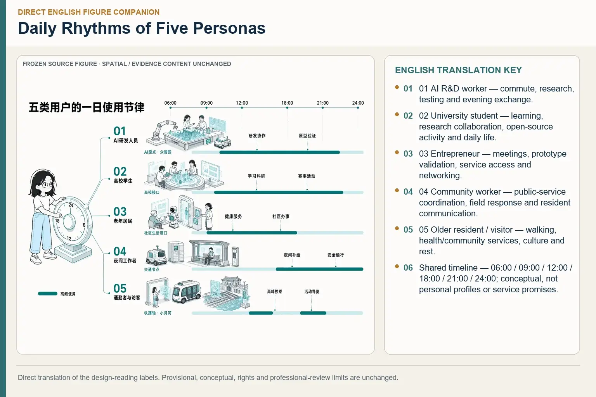

> **Figure 6-2 | Daily rhythms of five personas.** [source:CH6-SCENARIO-ASSETS]

The five personas are an open-source developer, a start-up team, a leading-enterprise visitor, a nearby resident, and a university teacher or student. Their daily rhythms connect work, learning, mobility, housing, services, public space, and social exchange without constructing unauthorized personal profiles.

### 6.3 Twelve AI Scenario Cards

**Table 6-2 | Twelve AI Scenarios and Their Spatial Locations**

| ID | Scenario and Users | Spatial Location and Carrier | Operating Loop and Current Assessment |
|---|---|---|---|
| SC-01 | AI Innovation Living Room; R&D staff, students, visitors, and night workers | DK-05 Wudaokou / AI Origin public ground floors and shared spaces | Need—matching—Human Review—activity—review/exit; existing activity base, with the exact space and responsible entity to be confirmed |
| SC-02 | AI Education and Research Collaboration Station; students, researchers, and R&D staff | DK-05 university–park open interface and shared learning space | Interest—resource matching—professional review—collaboration—correction/authorization withdrawal; suitable for a near-term pilot |
| SC-03 | Human-AI Collaboration and Prototype Validation Workshop; R&D and start-up teams | DK-07 Xuezhiyuan entrance / restricted pilot-production interface in Zhongzhiyuan | Status sensing—process recommendation—staff approval—restricted testing—shutdown/removal; planned test |
| SC-04 | Public Computing Service Window; students, research teams, and start-ups | Public-service interfaces at DK-05 and DK-07, excluding machine rooms and production cores | Need—directory matching—authorization review—scheduling—evaluation/termination; the service window may proceed first |
| SC-05 | Community Health Coordination Station; older residents and family caregivers | DK-04 / community public-service and primary-care interfaces | Active request—initial screening and referral—professional judgment—service—follow-up/exit; pilot after responsibilities are confirmed |
| SC-06 | AI Community Service Station; residents, community workers, and visitors | Existing community-service points in and along Dazhongsi; exact locations pending verification | Inquiry—combined services—permission-based call—human handling—correction/restoration of the original process; suitable for a near-term pilot |
| SC-07 | Sidaokou Intelligent Transport Coordination Test; commuters and residents | Safe waiting islands and existing transport facilities at DK-04 Sidaokou | Anonymous aggregation—multi-option simulation—manager confirmation—controlled execution—rollback/stop; existing basis for a local pilot |
| SC-08 | Xiaoyue River Embodied-AI Public-Space Test; R&D teams, operators, and the public | E1 East Wing closed testing—semi-open observation—public-experience interface along Xiaoyue River | Interaction—controlled transmission—option generation—staff authorization—restricted operation/emergency stop; planned test |
| SC-09 | Xiaoyue River Ecological Sensing and Waterfront Warning Station; residents, visitors, and managers | E1 Xiaoyue River waterfront path, ecological-observation points, and maintenance interface | Environmental sensing—tiered recommendations—professional review—maintenance prompt—feedback/deactivation; planned test |
| SC-10 | Jing-Zhang Railway Memory Guide; residents, students, and visitors | Continuous public route through Jing-Zhang Railway Heritage Park and entrances at DK-04/05/07 | Enter—select terminal—query and experience—source verification—correction and update; suitable for a near-term pilot |
| SC-11 | Zhongguancun Innovation Oral-History Co-Creation Station; veteran technology workers, entrepreneurs, residents, and students | W1 Zhongguancun Technology Services Wing and the DK-05 public-cultural interface | Authorized narration—transcription and organization—fact/rights review—display/withdrawal; planned pilot |
| SC-12 | AI New-Culture Public Forum; developers, students, residents, enterprise practitioners, and visitors | DK-05 / AI Origin shared public ground floors and flexible event spaces | Public expression—fact verification—multi-option simulation—human confirmation/pause—spatial feedback; existing activity base, with the collaboration mechanism to be confirmed |

The twelve cards cover innovation exchange, education and research, prototyping, public compute access, community health, community services, intelligent transport, embodied-AI public-space testing, ecological sensing, heritage interpretation, oral history, and public deliberation.

#### 6.3.1 SC-01 AI Innovation Living Room

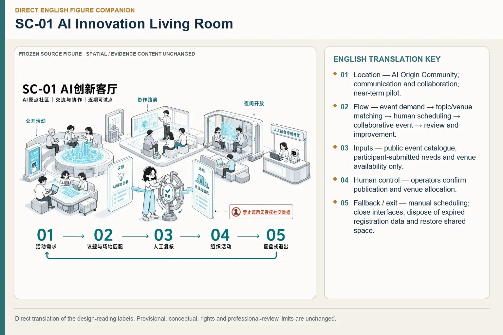

> **Figure 6-3 | SC-01 AI Innovation Living Room.** This AI-assisted proposal scenario card is conceptual only; it is not evidence of existing conditions, a completed or approved project, or actual operation.

An open, reservable venue for results release, developer exchange, and public learning; event approval and capacity control remain human responsibilities.

#### 6.3.2 SC-02 AI Education and Research Collaboration Station

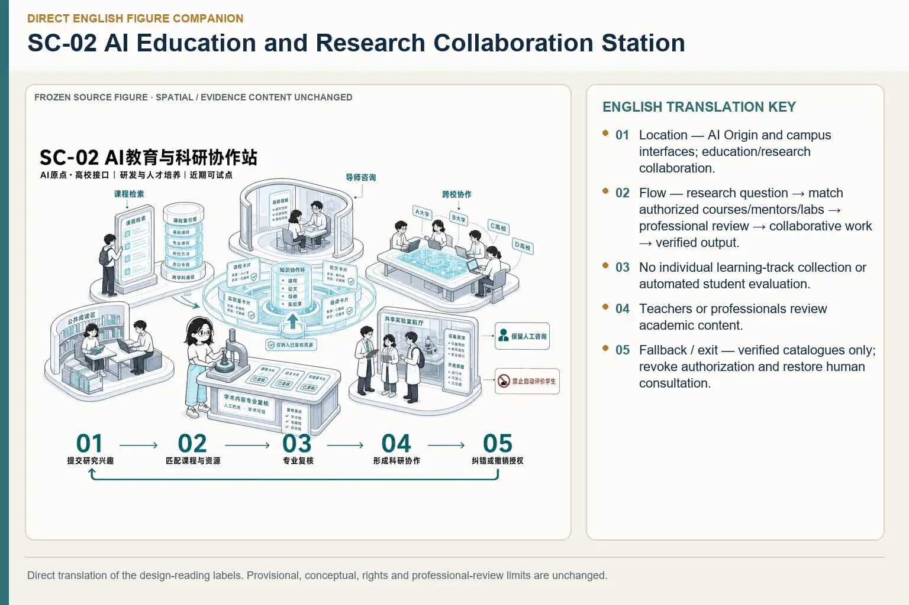

> **Figure 6-4 | SC-02 AI Education and Research Collaboration Station.** This AI-assisted proposal scenario card is conceptual only; it is not evidence of existing conditions, a completed or approved project, or actual operation.

Connects universities, schools, communities, and enterprises through authorized courses and collaboration; minors' and research data are protected.

#### 6.3.3 SC-03 Human–AI Prototyping Workshop

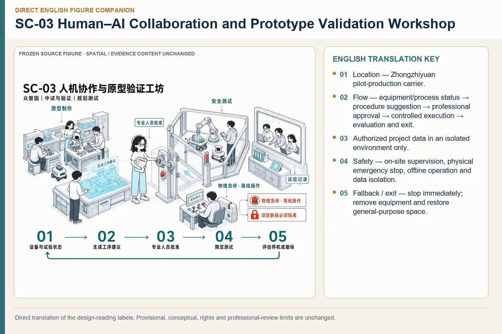

> **Figure 6-5 | SC-03 Human–AI Prototyping Workshop.** This AI-assisted proposal scenario card is conceptual only; it is not evidence of existing conditions, a completed or approved project, or actual operation.

Supports supervised prototyping, red-teaming, and product validation with equipment safety, access control, and rollback.

#### 6.3.4 SC-04 Public Compute Service Window

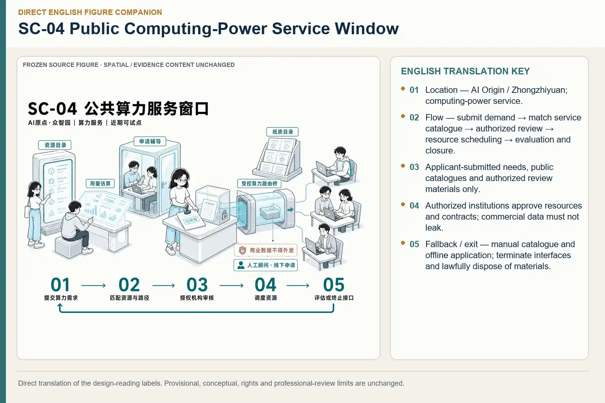

> **Figure 6-6 | SC-04 Public Compute Service Window.** This AI-assisted proposal scenario card is conceptual only; it is not evidence of existing conditions, a completed or approved project, or actual operation.

Provides an authorized interface to off-site compute and data services; it is not an uncontrolled in-site data center.

#### 6.3.5 SC-05 Community Health Coordination Station

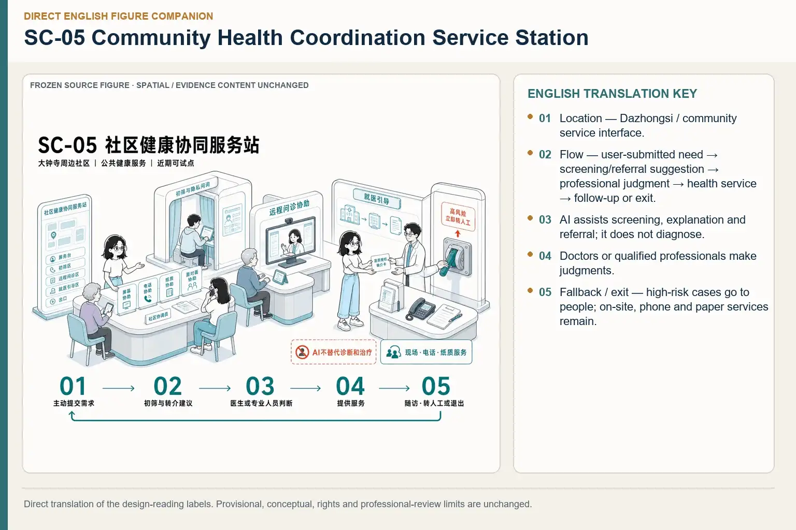

> **Figure 6-7 | SC-05 Community Health Coordination Station.** This AI-assisted proposal scenario card is conceptual only; it is not evidence of existing conditions, a completed or approved project, or actual operation.

Offers navigation and coordination, not autonomous diagnosis; licensed professionals retain all clinical decisions.

#### 6.3.6 SC-06 AI Community Service Station

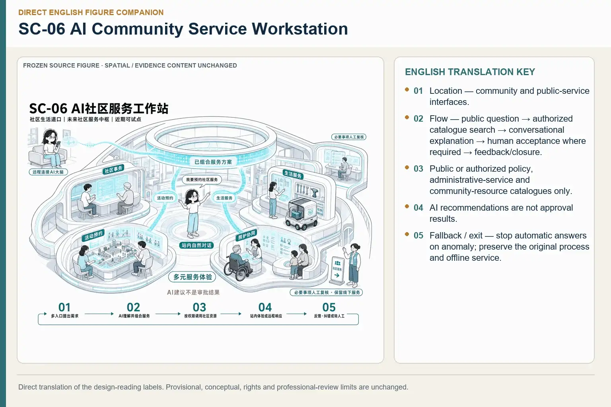

> **Figure 6-8 | SC-06 AI Community Service Station.** This AI-assisted proposal scenario card is conceptual only; it is not evidence of existing conditions, a completed or approved project, or actual operation.

Combines digital and staffed channels for everyday services, ensuring accessibility and a non-digital fallback.

#### 6.3.7 SC-07 Sidaokou Intelligent-Transport Coordination Test

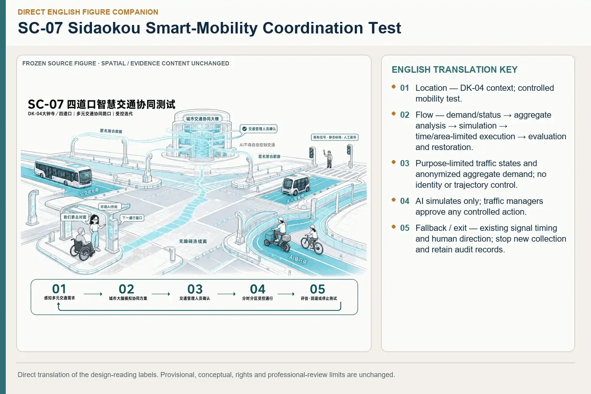

> **Figure 6-9 | SC-07 Sidaokou Intelligent-Transport Coordination Test.** This AI-assisted proposal scenario card is conceptual only; it is not evidence of existing conditions, a completed or approved project, or actual operation.

Tests signal and mobility coordination in a controlled area; traffic authorities approve plans and the system reverts to the existing scheme on failure.

#### 6.3.8 SC-08 Xiaoyue River Embodied-AI Public-Space Test

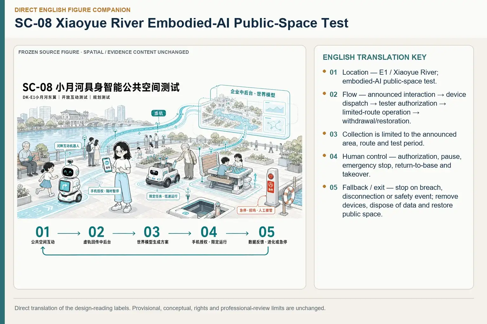

> **Figure 6-10 | SC-08 Xiaoyue River Embodied-AI Public-Space Test.** This AI-assisted proposal scenario card is conceptual only; it is not evidence of existing conditions, a completed or approved project, or actual operation.

Uses geofenced, low-speed, supervised devices with physical emergency stops, manual takeover, and restoration of ordinary public space.

#### 6.3.9 SC-09 Xiaoyue River Ecological Sensing and Waterfront Warning Station

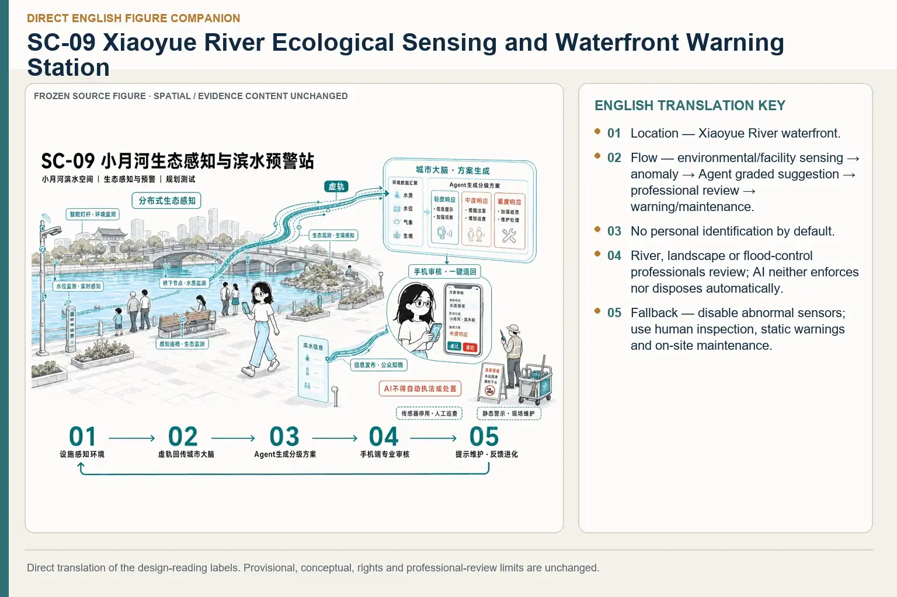

> **Figure 6-11 | SC-09 Xiaoyue River Ecological Sensing and Waterfront Warning Station.** This AI-assisted proposal scenario card is conceptual only; it is not evidence of existing conditions, a completed or approved project, or actual operation.

Supports public information and maintenance alerts but does not replace hydrological monitoring, flood commands, or professional judgment.

#### 6.3.10 SC-10 Jing-Zhang Railway Memory Guide

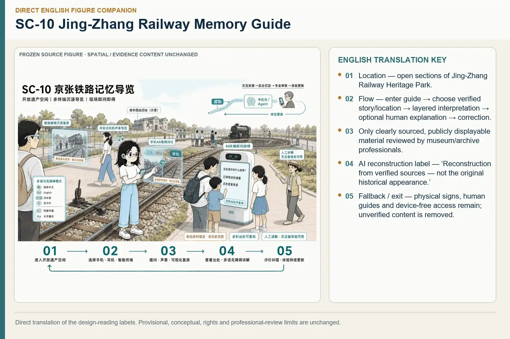

> **Figure 6-12 | SC-10 Jing-Zhang Railway Memory Guide.** This AI-assisted proposal scenario card is conceptual only; it is not evidence of existing conditions, a completed or approved project, or actual operation.

Provides traceable interpretation with historian and heritage review; generative content cannot rewrite historical facts.

#### 6.3.11 SC-11 Zhongguancun Innovation Oral-History Co-creation Station

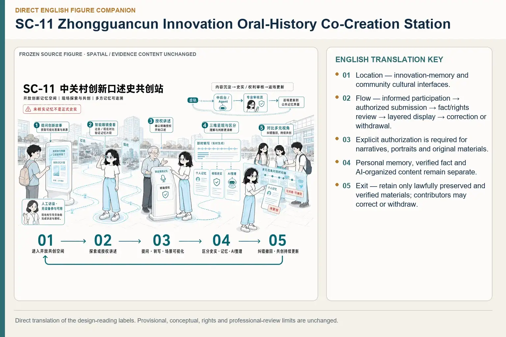

> **Figure 6-13 | SC-11 Zhongguancun Innovation Oral-History Co-creation Station.** This AI-assisted proposal scenario card is conceptual only; it is not evidence of existing conditions, a completed or approved project, or actual operation.

Records voluntary contributions with consent, correction, withdrawal, attribution, and rights review.

#### 6.3.12 SC-12 AI New-Culture Public Forum

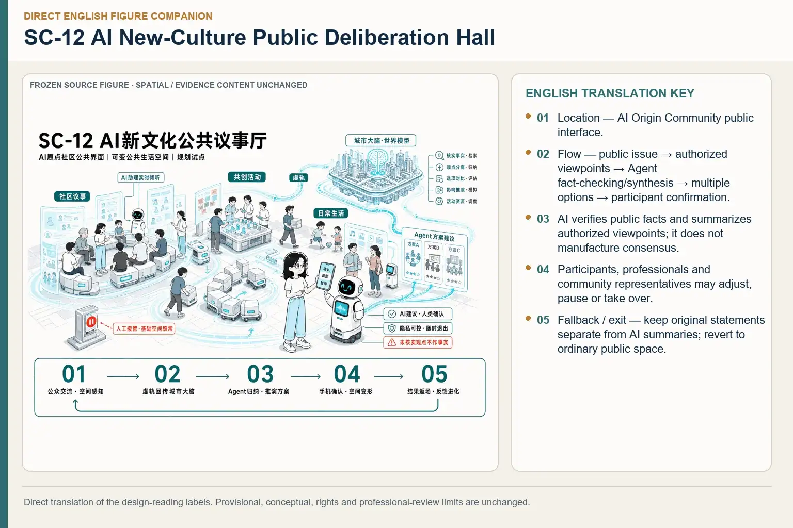

> **Figure 6-14 | SC-12 AI New-Culture Public Forum.** This AI-assisted proposal scenario card is conceptual only; it is not evidence of existing conditions, a completed or approved project, or actual operation.

Supports public deliberation and records disagreements; AI may summarize but cannot manufacture consensus or authorize decisions.

### 6.4 Three AI Industry Testing and Validation Scenarios

**Table 6-3 | Three Types of AI-Industry Testing and Validation Scenarios**

|Test Number|TEST-01Human-AI collaboration and prototype validation|TEST-02Four-Quadrant Mobility.|TEST-03Xiaoyue River is a smart public space.|
|---|---|---|---|
|Reciprocal scene/location|SC-03;Zhongzhiyuan are limited to test interfaces|SC-074x4;DK-04|SC-08E1 East Wing|
|Test the boundary|Booking of items, space segregation, equipment and time frame|Specifies the intersection, the specified time, the options available to retreat|Closed test - semi-open observation - public experience is open in a hierarchy|
|Subject and security control|Pilot platform + R + third party assessment; project data segregation, valuability, physical emergency|Traffic manager+operator; anonymous polymerization, simulation, confirmation by personnel|Test platform + R + third party assessment; speed limit, perimeter, stop, return to work|
|Evaluation indicators|Security incidents, manual interventions, mission completion, data crossing, space restoration|Safety, access, equity, human takeover, retreat effect|Cross-border, unconnected, human takeover, public impact, equipment evacuation and space recalculation|
|Extended Conditions|Safety and data review passed and the test reproduced|The management body identifies and does not harm vulnerable traffic participants|Liability, insurance, data and public notification through assessment|
|Exiting Conditions|Stop interfaces, dispose of authorized data, equipment evacuation sites, space restoration|Refund of existing proposals, stop adding collections, seal necessary records|Dismissal, data disposal, facility restoration, open test findings|

The three integrated tests are full-stack model and safety validation at Zhongzhiyuan, open-source and research-to-market validation at AI Origin, and agent/intelligent-terminal application validation at Dazhongsi. Each uses bounded access, human review, incident records, and explicit stop conditions.

### 6.5 Scenario Layout, Landmarks, and Public Experience Route

**Table 6-4 | Three AI Pilgrimage Landmarks and Honor Nodes**

|ID|Node and Space Carrier|Public values and operating mechanisms|Border|
|---|---|---|---|
|LM-01|"AI co-test lighthouse" (workname); sharing of pilot platforms, display interfaces and garden-type public spaces|Demonstration of verifiable models, terminals, physical equipment tests and failures; updated periodically by pilot production operations, professional safety assessments and public representatives|Production is physically isolated from public areas, unauthorized projects are not displayed and testing is not certified|
|LM-02|AI Origin “Open-Source Co-Creation Star Map” (workname); talent station, innovation memory and public space for deliberation|Show open source, scientific collaboration, public good services and verifiable error record; public nomination, verification of evidence, recognition of rights, multiple review|Individual contributions are authorized without ranking by payment or flow, and the facts/remembs/AIs are stratification|
|LM-03|The Dazhongsi “Ancient Symphony Portal” (workname); cultural lead interface, bi-thinking segment and site portal|:: Also verifiable history, contemporary AI applications and public life; reviewed by culture, operation, professionals and community representatives|No new findings were made until the conditions for the verification of the heritage protection and the Trans-Ridge works were further developed by professional teams|

> **Figure 6-15 | Zhongzhiyuan “AI Co-testing Lighthouse” scenario rendering.** Corresponding to LM-01 and Z-01, the image presents controlled testing and demonstration through a transparent shared pilot-production platform, a public observation interface, and garden-like public space. This user-provided, AI-assisted conceptual rendering is neither an existing-condition photograph, a completed project, testing certification, nor an engineering-design basis. Safety separation between production and public areas requires further professional development. [source:CH6-LM01-RENDER]

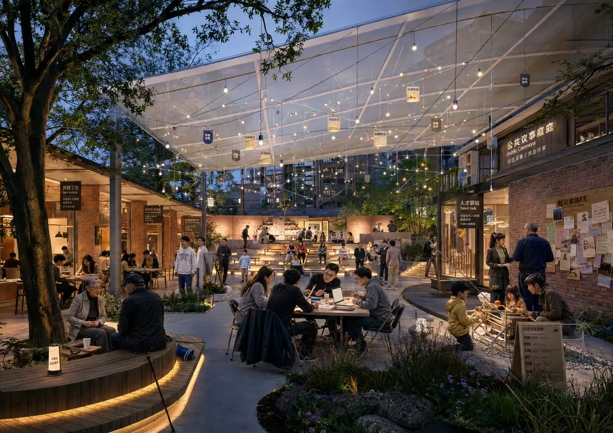

> **Figure 6-16 | AI Origin “Open-Source Co-Creation Star Map” scenario rendering.** Corresponding to LM-02 and Y-01/Y-04, the image uses a talent station, open workshop, public-deliberation courtyard, and updateable contribution map to show developers, students, and residents participating in open-source collaboration and public discussion. This user-provided, AI-assisted conceptual rendering is neither an existing-condition photograph, a completed project, nor a confirmed operating arrangement. Contributions remain subject to public nomination, evidence verification, rights confirmation, and multi-party review. [source:CH6-LM02-RENDER]

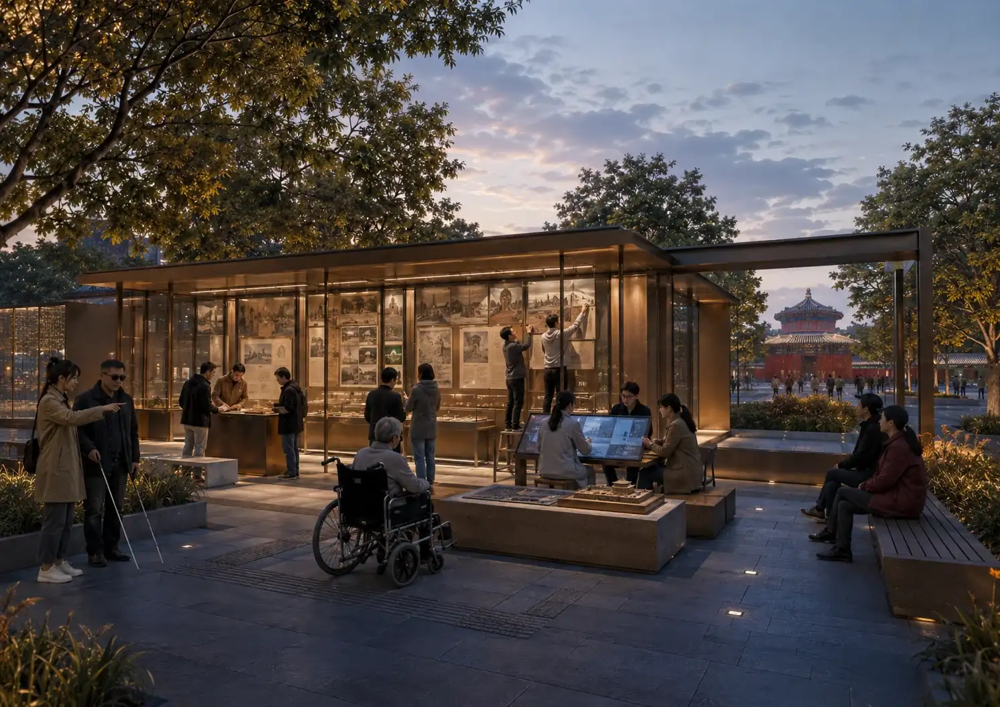

> **Figure 6-17 | Dazhongsi “Ancient–Future Resonance Gateway” scenario rendering.** Corresponding to LM-03 and D-03/D-04, the image presents a culture-led public interface that links railway memory, the Juesheng Temple–1733 cultural setting, contemporary AI applications, and everyday public life. This user-provided, AI-assisted conceptual rendering is not an existing-condition photograph, heritage reconstruction, completed project, formal exhibition plan, or approved construction proposal. Historical interpretation, heritage and development controls, accessibility, and the precise location require professional review. [source:CH6-LM03-RENDER]

**Table 6-5 | AI Public-Space Component Library**

|Component|Function interface with AI|Manual/non-digital interface and deployment boundaries|
|---|---|---|
|CP-01Variable Public Service Islands|Multilingual counselling, activity and space scheduling|Manual cruises, entity announcements; general furniture after closing the terminal|
|CP-02Light interactive scene/directional scene|Introduction, source queries, honorary presentations and discussions|Entity identification, paper route, manual interpretation; control of night-time light effects|
|CP-03Robot module furniture|Spatial organization, low-speed synergy and accessibility assistance|Manual locking, physical stoppage, manual movement; guaranteed clips and net width of traffic|
|CP-04Environmental perception and virtual track connections|Environment, equipment and anonymous circulation by purpose|Site status plate, manual reading; default does not recognize individuals, closed status visible|
|CP-05Test of safe border packs|Status, cross-border alerts and logbacks|Man-time, physical perimeter and verbal notification; loss of connection, transboundary or accidental cessation|
|CP-06Non-digital and honorary displays|Optional Query for Digital Records|Fully offline readable; no sensitive or unverified information displayed|

Scenario nodes connect the three areas, the Jing-Zhang park axis, stations, campuses, communities, and Xiaoyue River. Three AI pilgrimage landmarks—an independent-innovation calibration field, an AI Origin open-source landmark, and a Dazhongsi application-and-exchange landmark—anchor a public route; names and forms remain design proposals.

### 6.6 Scenario–Space–Operation and Long-Term Activities

**Table 6-6 | Annual Operating Mechanism for the Jing-Zhang Future Track-Opening Season**

|Level|Main activities and space|Subject of recommendation/trigger conditions|Assessment and withdrawal|
|---|---|---|---|
|Normal Open|(a) Open-door days at the AI Crossing, venue appointments, orientations, off-line consultations, small lecture halls;SC-01- SC-12 confirmed public interface|Space operations + community/campus services + site expertise; testing through a separate safe door|Check accessibility, complaints, human takeover and maintenance burden; failure to maintain is degraded into ordinary public spaces|
|Monthly creation|Developer ' s Issues Pool, community issues, open source maintenance, oral history collection; AI Origin and communities along the route|Developer community+university+public culture/community organization; information and rights review|Suspension without valid questions, maintainers or authorizations, and no long-term maintenance with a short-lived hackathon showcase|
|Quarterly connection|Spring Open Co-Creation Forum, summer test seasons, autumn culture and intelligent primary consumption combined|The corresponding campus, testing platform, cultural and commercial operators; responsibility, data, security, insurance initiated after adoption|Data transboundaryity, security incidents, public impact or rights triggering scaling back, suspension or withdrawal|
|Annual Recup|Release of operational, security, fairness, maintenance, dissent and exit records and review of honorary presentations|Sector-level integrated type platforms + professional review + third-party assessment + public representation, subject to confirmation|Scene limit, suspension or withdrawal without annual review, honors may be amended, downgraded or withdrawn|

Scenarios connect to annual AI events, developer-community activities, public test days, open-source releases, heritage walks, and international roadshows. Operators, permits, maintenance, safety, rights, and evaluation must be confirmed for every event.

### 6.7 Data Governance, Human Review, and Exit

**Table 6-7 | AI-Scenario Governance, Degradation, and Exit Mechanisms**

|Governance requirements|Operating rules|Triggered demotion or exit|
|---|---|---|
|Use limit and minimum collection|Collect only the data necessary to complete the current service, indicating source, purpose, duration and manner of closure|Disable when use changes, over-calls or cannot indicate source|
|Authorization, privacy and revocability|Active authorization, hierarchies; sensitive information not entering public displays|Disable call and dispose of data according to law after authorization to withdraw|
|Manual finalization and takeover|Medical, transport, safety, historical content, public services and public issues are judged by the clearly identified human duty bearers.|Closed/resuspensive if no responsible person can be identified or cannot take over|
|Non-digital replacement|Maintenance of manual windows, telephones, paper materials, physical orientation, control in place and unequipped experience|Toggle existing services when digital systems fail and basic public services remain uninterrupted|
|Equity and antimonopoly|Checking age, barriers, language, digital abilities and identity differences; separation of public information, advertising, sponsorship and recommendation|Unfair impact or fee ranking cannot correct the time-shrugged or discontinued scenario|
|Security incidents|Stop AI movements, activate manual/existing processes, protect personnel, maintain necessary logs and dispose of them in line with the chain of responsibility|No restoration until root analysis, modification validation and reauthorization are completed|
|Maintenance and life cycle|Clarify responsibilities for maintenance personnel, failure response, updating cycle, spare parts, decommissioning and space recalculation|Degrade or remove without maintenance resources, continuous malfunctions or equipment expiry|
|Performance versus public feedback|Concurrently assessing public values, safety, equity, reliability, labour burden, maintenance costs, complaints and withdrawals|Termination in case of continuous failure to reach the baseline, public damage exceeding the proceeds or unclear liability|

Only public, voluntarily provided, or explicitly authorized minimum data may be used. High-risk health, transport, safety, history, recognition, and embodied-device matters require professional review. Users retain query, correction, withdrawal, and non-digital access; failures trigger manual takeover, service fallback, data handling, and spatial restoration.

> **Evidence references retained for bilingual traceability:** [source:CH6-SCENARIO-BASELINE] [standard:PROJECT-AGENT-OPEN-CALL-TASKBOOK] [source:CH6-SCENARIO-ASSETS] [source:CH6-SCENARIO-BASELINE] [standard:PROJECT-AGENT-OPEN-CALL-TASKBOOK] [data:geometry/key_areas.geojson#PROV-KEY-002] [data:geometry/key_areas.geojson#PROV-KEY-003] [data:geometry/roads.geojson#CH5-LINK-D] [data:geometry/green_space.geojson#GREEN-002] [data:geometry/public_space.geojson#PUBLIC-001] [standard:PROJECT-AGENT-OPEN-CALL-TASKBOOK] [source:CH6-SCENARIO-BASELINE] [data:geometry/public_space.geojson#PUBLIC-002] [data:geometry/roads.geojson] [source:CH6-SCENARIO-BASELINE] [source:CH6-SCENARIO-BASELINE] [standard:PROJECT-AGENT-OPEN-CALL-TASKBOOK] [standard:PROJECT-AGENT-OPEN-CALL-TASKBOOK]
## Chapter 07 Land Use, Building Scale, and Retain–Renovate–Demolish Strategy

### 7.1 Land-Use Organization: Stable Base and Flexible Conversion

> **Figure 7-1 | Land-use and spatial structure.** The 560 polygons form a complete current model within the provisional boundary and do not constitute statutory land use.

The stable base protects transport, ecological, public-service, heritage, and safety functions; flexible carriers accommodate research, pilot production, services, and mixed use subject to formal procedures.

### 7.2 Current Recomputable Land-Use Balance

**Table 7-1 | Land-Use Balance within the Overall Design Area**

|Lead|Code|Current proposal area|Current proposal ratio|State boundary|
|---|---:|---:|---:|---|
|Urban residential land|0701|416.11 ha|36.21%|Talent life/resilient combinations of dominant uses and spin models|
|Land for municipal community services|0702|71.49 ha|6.22%|Only the remaining range of the tumble model, facility size to be verified|
|Land for public administration and public services|08|8.10 ha|0.71%|Public service dominance, sub-class to be approved|
|Fields for scientific research|0802|280.26 ha|24.39%|Innovative R & D lead use and spin-offs|
|Cultural land|0803|10.06 ha|0.88%|Public services/resilient combinations of dominant uses|
|Educational land|0804|18.98 ha|1.65%|Flexible compounding of dominant uses|
|Health land|0806|15.66 ha|1.36%|Public services/resilient combinations of dominant uses|
|Commercial land|0901|5.63 ha|0.49%|Business exchange dominant use|
|Commercial finance land|0902|128.47 ha|11.18%|Industrial services/resilient combinations of dominant uses and spin-offs|
|Other commercial service use|0904|2.88 ha|0.25%|Results shift to lead uses|
|Land for urban and rural roads|1207|1.74 ha|0.15%|Transport infrastructure dominance|
|The park green.|1401|189.87 ha|16.52%|Open space/resilient compounding lead uses and spin-by models, varying from the statutory green land ratio|
|Total|—|1149.25 ha|100.00%|Same caliber as the current provisional range|

Site area, land-use areas, green ratio, and public-space ratio use the same EPSG:4548 geometry and denominator. The current results are low-confidence model values, not official land-use statistics or ownership ratios. [metric:site_area_sqm] [metric:green_ratio] [metric:public_space_ratio]

### 7.3 Building Scale: Overall Model and Object-Level Facts

The 16–18 million m² capacity interval tests urban carrying capacity. Object-level decisions remain conditional on surveys, ownership, structural safety, heritage, contamination, fire safety, and planning controls. [metric:building_footprint_area_sqm]

### 7.4 Six Retain–Renovate–Demolish Directions and Three Entry Gates

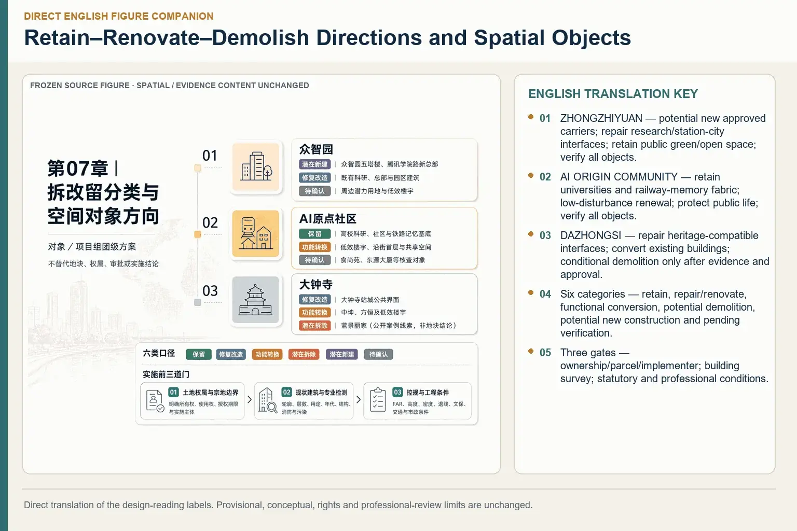

> **Figure 7-2 | Retain–renovate–demolish directions and spatial objects.**

The six directions are retain, repair, adaptive reuse, partial replacement, redevelopment, and pending review. The three entry gates are evidence and rights, professional safety, and statutory/implementation feasibility; failure at any gate prevents a definitive object-level conclusion.

### 7.5 Implementation Interface and Data Replacement

When official parcels, buildings, ownership, planning controls, and engineering data arrive, the building register, land-use layer, metrics, project list, matrices, figures, and bilingual outputs must be regenerated from one versioned source.

> **Evidence references retained for bilingual traceability:** [source:CH7-LAND-USE] [data:geometry/land_use.geojson#LU-ROLE-001] [metric:chapter04_crossing_anchor_count] [standard:MNR-LAND-USE-CLASSIFICATION-GUIDE] [metric:land_use_coverage_ratio] [source:CH7-METRICS] [metric:land_use_0802_area_sqm] [metric:land_use_0902_share] [data:geometry/buildings.geojson] [metric:site_coverage_ratio] [source:CH7-BUILDING] [metric:chapter04_total_floor_area_model_lower_sqm] [metric:floor_area_ratio] [source:CH7-RENEWAL] [depth:retain_renovate_demolish] [source:CH7-CHAINS]
## Chapter 08 Transport, Rail, Municipal Infrastructure, and Public Services

> **Figure 8-1 | Integrated transport, transit interchange, blue-green public space, and AI scenario-node system.** [source:CH8-TRANSPORT]

### 8.1 Transport Base and Accessibility Assessment

The main issues are discontinuous east–west walking, barrier effects at major roads and rail infrastructure, uneven station–district interfaces, bicycle-transfer gaps, and incomplete accessible chains. Current alignments are conceptual pending road-redline, station, bridge, utility, and traffic data.

### 8.2 Walking, Cycling, and Transit-Interchange Strategy

#### 8.2.1 Walking: Continuous Axis, Transverse Stitching, Full Accessibility

Create a continuous Jing-Zhang walking spine, repair nine transverse links, and provide step-free, legible, lit, and rest-supported routes. Physical guidance and staffed alternatives remain available when digital systems fail.

#### 8.2.2 Cycling: Backbone and Bike-and-Ride

Connect campuses, stations, three key areas, communities, and blue-green corridors; provide safe crossings, parking, maintenance, and B+R transfer without treating sidewalks as overflow lanes.

#### 8.2.3 Transit Interchange: Two States and Station–District Integration

Near-term work improves existing station access; long-term interfaces reserve adaptability for professionally approved capacity upgrades. The proposal does not assert unapproved transit works.

### 8.3 Road Hierarchy, Local Circulation, and Parking

**Table 8-1 | Parking-Organization Strategies by Category**

|Type|Organizational strategy|
|---|---|
|Motor vehicles|Mainly, switch of connections between established parking facilities and orbital stations; no additional large ground parking areas are added to the update project, organized in accordance with the principle of "preference for public interfaces"; and parking is shared and timed as a way of optimizing stock|
|Non-motorized vehicles|Provide orderly parking where Dazhongsi, Wudaokou, and Zhichunlu stations meet the walking-and-cycling spine; integrate it with station–district design and the approximately 800-space planning basis for B+R at Dazhongsi and Zhichunlu|
|Shared bicycles|Set up tidal stop points at subway stations, park entrances, park interfaces, to be connected to walking and cycling and public uniforms, and not to occupy the main axis public space|
|Distribution loading|Short-time loading and delivery docking points (concept recommendations) at parks, commercial, community interfaces, coordinated with walking and cycling and public space sculpting, and uninterrupted access to barrier-free areas|

Major roads carry through traffic; district streets distribute access; shared and service streets support slow movement and deliveries. Parking follows demand management, shared use, B+R, accessible supply, loading control, and phased verification rather than unsupported fixed quotas.

### 8.4 Municipal and Public-Service Strategy

#### 8.4.1 Municipal Baselines and Water Constraints

Waterfront design yields to flood safety; temporary facilities use reversible and removable forms. Drainage, water, energy, utilities, fire access, contamination, and maintenance require professional surveys and approvals. [source:CH8-MUNICIPAL]

#### 8.4.2 Four Public-Service Levels and Time-Based Adaptation

**Table 8-2 | Tiered Provision of Public-Service Facilities**

|Type of facility|Tier-wise Recommendations|Falling logic|
|---|---|---|
|AI industry services|Belt level / key-area level / block level|Place testing, validation, and standards display at the Dazhongsi gateway; shared technical services and pilot production in each key area; equipment sharing and small-scale tests behind public-facing interfaces [source:CH8-PUBLIC-SERVICE]|
|Innovation-service platforms|Organized by the source–pilot-production–application chain|AI Origin supports research and conversion; Zhongzhiyuan supports pilot production and industry display; Dazhongsi supports application and market services, avoiding duplication across the three key areas|
|Talent-based services|Configure Differentially By Time|Researchers and developers need night and weekend-accessible catering, fitness and third-space; young people need close neighbourhoods with affordable residential and social learning; older persons and low-digitally capable people need walkable medical care, old-age and community services and are not cut off by updates — service interfaces along the main axis need to support long-term operations[source:CH8-PUBLIC-SERVICE]|
|New Infrastructure|Four drop-in rules (see 8.4.3)|End-side computing, distributed energy etc. are set up with R & D and landscape interfaces[source:CH8-NEW-INFRA]|

District, key-area, neighborhood, and site-level services cover innovation platforms, talent support, community life, health, education, culture, sport, and emergency needs, with day/night and weekday/event operating modes.

#### 8.4.3 New Infrastructure Integrated with Conventional Utilities

**Table 8-3 | Interfaces Integrating Conventional Municipal and New Infrastructure**

|Municipal systems|Composite Carrier Recommendations|Phased conditions|Secure borders|
|---|---|---|---|
|Water supply and drainage|Combination with sponge facilities, waterwalks|Once control and water information is in place,|No compressing of riverways.|
|Electricity|Combine with public computing booths, end-of-side computing nodes|When grid and capacity information are in place|Putting them outside the safe haven.|
|Communications|Combination with smart light poles, guide facility.|When the bottom number of communications facilities is in place|Do not take the main axis public interface|
|Energy|Distributed energy and public utilities co-location complex|When energy load measurements are in place|Do not enter the Manpa construction zone|
|Sanitation|Combination with public space components, service islands|When the bottom number of sanitation facilities is in place|Do not block access to continuous traffic|
|Fire and emergency response|Combination with park disaster management and emergency shelter|Fire and emergency assessment in place|Guarantee emergency access and evacuation conditions|

Compute-service windows, edge nodes, sensing, communications, and distributed-energy candidates share space and maintenance interfaces with conventional utilities; capacity, cybersecurity, energy, noise, heat, and emergency isolation are prerequisites.

### 8.5 Low-Speed Robot/Delivery Pilots and Safety Boundaries

Pilots are geofenced, time-limited, low-speed, supervised, and secondary to pedestrians and accessibility. They require physical stop, manual takeover, incident records, no-go areas, and a return-to-base or shutdown mode. [source:CH8-SAFETY]

### 8.6 Professional Verification and Missing Data

Road redlines, traffic counts, transit protection, stations, bridges, utilities, flood and drainage, fire access, facility demand, ownership, operations, and maintenance remain to be verified by responsible professionals.

> **Evidence references retained for bilingual traceability:** [source:CH8-TRANSPORT] [depth:traffic_rail_slow_parking] [source:CH8-TRANSPORT] [source:CH8-TRANSPORT] [source:CH8-TRANSPORT] [source:CH8-TRANSPORT] [depth:traffic_rail_slow_parking] [source:CH8-TRANSPORT] [source:CH8-TRANSPORT] [source:CH8-TRANSPORT] [source:CH8-TRANSPORT] [source:CH8-TRANSPORT] [standard:CH8-ACCESSIBILITY-LAW] [source:CH8-TRANSPORT] [source:CH8-TRANSPORT] [source:CH8-TRANSPORT] [source:CH8-TRANSPORT] [source:CH8-TRANSPORT] [source:CH8-TRANSPORT] [source:CH8-TRANSPORT] [depth:traffic_rail_slow_parking] [source:CH8-TRANSPORT] [source:CH8-TRANSPORT] [source:CH8-PUBLIC-SERVICE] [source:CH8-MUNICIPAL] [source:CH8-MUNICIPAL] [source:CH8-MUNICIPAL] [source:CH8-MUNICIPAL] [source:CH8-MUNICIPAL] [source:CH8-PUBLIC-SERVICE] [source:CH8-PUBLIC-SERVICE] [source:CH8-NEW-INFRA] [source:CH8-NEW-INFRA] [source:CH8-NEW-INFRA] [source:CH8-SAFETY] [source:CH8-SAFETY] [source:CH8-SAFETY] [source:CH8-SAFETY] [source:CH8-METRICS] [depth:traffic_rail_slow_parking] [data:geometry/roads.geojson#ROAD-JZ-AXIS] [metric:road_centerline_length_m] [source:CH8-METRICS] [metric:road_centerline_length_m] [source:CH8-METRICS] [source:CH8-METRICS]
## Chapter 09 Blue-Green Space, Public Space, and Urban Character

### 9.0 Design Principles and Control Boundaries

**Table 9-1 | Three-Generation Track-Language System**

| Three-Track Narrative | Representative Area (DK Anchor) | Blue-Green and Urban-Character Language | Public-Space Character |
|---|---|---|---|
| Physical Track · Memory | Dazhongsi (DK-04 Sidaokou) | Heritage-baseline character: railway heritage, Juesheng Temple culture-led interface, and four-quadrant stitching | Memory-oriented public life |
| Aerial Track · Life | AI Origin Community (DK-05 Wudaokou) | Active-ground-floor character: mixed neighborhoods, walking connections, and event-based scenarios | Everyday public life |
| Virtual Track · Innovation | Zhongzhiyuan (DK-07 Xuezhiyuan entrance) | Garden-campus character: innovation spaces, iterative carriers, and open platforms | Innovation-originating public life |
| Virtual-Track Data Bus (physical expression) | Jing-Zhang Railway Heritage Park vitality corridor | Blue-green spine character: linear greenway + heritage narrative + AI public space | Continuous public life |

The system prioritizes ecological safety, universal access, public benefit, heritage authenticity, everyday use, and reversible experimentation. Green space and public space are not treated as vacant development land.

### 9.1 Blue-Green System, Green Ratio, and Public-Space Ratio

#### 9.1.1 Blue-Green Network

Jing-Zhang Heritage Park forms the north–south spine; Qinghe, Xiaoyue River, parks, campuses, and community open spaces form cross-links. Flood protection, ecology, soil, and ownership override scenario placement.

#### 9.1.2 Green and Public-Space Ratios

**Table 9-2 | Core Indicators for Green-Space and Public-Space Ratios**

|Indicators|Status|Design recommended value|FormulaEPSG:4548)|Recompute trigger|
|---|---|---|---|---|
|`site_area_sqm`|**known / low confidence**|11,492,502.430㎡|`polygon_area(site_boundary)`|Redistribution of official borders after replacement|
|`green_ratio`|**known / low confidence**|13.505068%|`polygon_area(green_space) / polygon_area(site_boundary)`|Recount after greenfield and official border|
|`public_space_ratio`|**known / low confidence**|4.368577%|`polygon_area(public_space) / polygon_area(site_boundary)`|Recalculation of public spaces and official borders after replacement|

The three formal visual indicators—overall area, green ratio, and public-space ratio—are recomputed from the same provisional boundary. They are model values with low confidence and do not represent statutory green-space or public-ownership ratios. [metric:site_area_sqm] [metric:green_ratio] [metric:public_space_ratio]

### 9.2 Public-Space Strategy and Hierarchy

#### 9.2.1 Three Public-Space Levels

**Table 9-3 | Three-Tier Public-Space Hierarchy**

|Level|Main space objects|Dominant style language|Setdown Elements|
|---|---|---|---|
|Regional level|Jing-Zhang Railway Heritage Park Viagra, Kiyoshi-Yi Xiaoyue River Corridor, Bajia Country Park|Blue-Green Main Axis|The green lanes, the waterwalks, the ecological nodes.|
|Block level|The Congregation of Minds/Onceon Community/Dao Chung Temple Public Centre|Three generations of the way it looks.|Headings, activity nodes, front-floor activations.|
|Block level.|First-level interface, pocket park, corner space, temporary activation units|The daily life.|Permeable borders, accessibility, non-digital wiring|

Belt-scale spaces support regional identity and continuity; district spaces support key-area exchange and services; neighborhood and site spaces support daily life, accessibility, rest, and small-scale testing.

#### 9.2.2 Continuity

Continuity is secured through crossings, clear wayfinding, shade and rest, barrier-free links, active ground floors, safe night conditions, and maintenance responsibility.

### 9.3 Jing-Zhang Heritage-Park Vitality Belt and AI Public Space

The park combines heritage interpretation, walking and cycling, innovation exchange, public learning, small events, and controlled AI scenarios while preserving ordinary use and non-digital access.

### 9.4 East–West Stitching and North–South Continuity

#### 9.4.1 East–West Stitching

Nine corridors connect campuses, communities, stations, enterprises, parks, and waterfronts across current barriers; exact engineering forms depend on traffic, rail, utility, and accessibility review.

#### 9.4.2 North–South Continuity

The Jing-Zhang axis connects the three key areas through a legible public route and a continuous sequence of culture, life, innovation, and ecological space.

### 9.5 Dazhongsi Intelligent-Native Consumption and Business Scenarios

Dazhongsi combines station arrival, enterprise display, intelligent terminals, content and service consumption, cultural renewal, and public exchange. Commercial data use, brands, events, and digital assets require authorization and rights review.

### 9.6 Three AI Pilgrimage Landmarks, Component Library, and Honor System

#### 9.6.1 Three AI Pilgrimage Landmarks

**Table 9-4 | Spatial Expression of the Three AI Pilgrimage Landmarks**

| AI Pilgrimage Landmark | Anchor | Three-Track Language | Public Value | Spatial and Experiential Basis |
|---|---|---|---|---|
| **Zhongzhiyuan AI Innovation Pilgrimage Landmark** | DK-07 Xuezhiyuan entrance | Virtual Track · Innovation | Pilot-production open days, a public-computing pavilion, and an innovation honor column, bringing together developers and small and medium-sized innovators | Garden-style park, Dongsheng Open Park interface, and the ecological base of Bajia Country Park–northern Jing-Zhang corridor; benchmarked against shared pilot production in Eindhoven and Kendall Square’s 5% innovation space |
| **AI Origin Community Life Pilgrimage Landmark** | DK-05 Wudaokou | Aerial Track · Life | Event-based scenarios and occasional vitality in mixed neighborhoods, bringing together young developers, students, and visitors | “AI Origin Party Nights” brought together more than 2,000 young AI participants over five days, showing how hard-technology activity can coexist with everyday urban life; benchmarked against San Francisco’s event ecosystem, flexible space, and mixed blocks |
| **Dazhongsi AI Memory Pilgrimage Landmark** | DK-04 Sidaokou | Physical Track · Memory | Railway memory museum, XR heritage theater, and culture-led activation, bringing together cultural consumption and business exchange | Nationally protected Juesheng Temple and the Yongle Bell, remains in the southern section of Jing-Zhang Railway Heritage Park, and the open commercial environment of Dazhongsi 1733; benchmarked against the Knowledge Quarter at King’s Cross |

The Zhongzhiyuan calibration field, AI Origin open-source landmark, and Dazhongsi application-and-exchange landmark form a three-part route. They are conceptual public landmarks, not approved construction projects.

#### 9.6.2 Public-Space Component Library

**Table 9-5 | Public-Space Component Library**

|Component type|Space carrier|Clients|Public values|Main body of recommendations for operation or maintenance|Security and privacy borders|Maintenance and withdrawal conditions|Nature of evidence|
|---|---|---|---|---|---|---|---|
|AI Honors pillar/score|The line of Jing-Zhang Park and the tri-terrestrial node|Developers, businesses, the public|Honors show dynamic updates, innovation incentives|Park operators + Human Review committee|Data source publicizing, transparent evaluation rules, channel for dissension processing|Yearly update, quarterly maintenance; indicator not met or data disputed suspended and manually reviewed and removeable|Proposal recommendations|
|Public Computing power|Park edge and park portal|Developer, small and medium-sized subjects, students|Public Computing power, Shared Innovation Base|Park operators and computing power providers|Use de-sensitivity, authorized login, content tag.|Monthly inspections, software upgrades; local caches and manual assistance in case of network break-ups or disputes, which can be migrated|Research judgement (Einhoven shared)|
|XR Site Theatre|The South Sector of Jing-Zhang Park.|Cultural consumers, students|Sites activated, immersed cultural education|The Ministry of Culture and the Public Cultural Institute|Right to historical material, manual finalisation of content, restricted filming|Quarterly content updates, equipment maintenance; lower content in copyright or historical disputes, physical displays of retention|Research findings (West Bank guarantee)|
|Eco-sense stations|♪ Xiaoyue River - Qing River Ribbon|Public, research institutions, operators|Open and public feedback nodes for ecological monitoring|Ecology and municipal authorities|Data open desensitization, non-collection of personal privacy|Quarterly calibration, data review; suspension of presentation and manual verification in case of data anomaly or dispute|Research in judgment (Singapore Eco-Closed)|
|Temporary living module|Corner of the street, under the bridge, front space.|Residents, business owners, organizers of events|Daily vitality, the rejuvenation of public life|Community operators + business people|Time-limited permits, clear security responsibilities, withdrawal clauses|Maintenance by cycle of activity; due to break-up, return to space|Research and Judgement (San Francisco Proxy)|
|Three generations of narrative orientation|Regional - corridor - node level|Public, visitors|Culture readable, path-directed|Public space managers united|Artificial finalisation of historical content, accessible information (blind/sound)|Quarterly inspections, content updates; change of information in case of content disputes, retention of basic orientation|Proposal recommendations|
|Accessibility and manual service components|300m chain, park entrances and exits|Persons with reduced mobility, older persons, population with digitally vulnerable population|All-age friendly, non-digital.|Public space manager + volunteerism|Conformity with the "five-synchronous" of the Access-Access-Building Act, privacy protection|Regular inspections, emergency response; provision of manual replacement services in case of facility failure|Official bottom line (accessible law)|

Transferable components include shaded seating, accessible guidance, modular stages, reversible displays, public-service windows, bicycle facilities, ecological sensing, emergency interfaces, and low-speed test boundaries.

#### 9.6.3 Honor-Display System

Contribution walls and rotating displays recognize verified public, research, developer, and community contributions through consent, attribution, correction, expiry, and removal rules; no facial recognition or automatic ranking is required.

### 9.7 Urban-Character Guidance: Jing-Zhang, Zhongguancun, and AI Culture

#### 9.7.1 Spatial Expression of Three Cultures

**Table 9-6 | Three Generations of Cultural-Space Expression and Urban-Character Boundaries**

|Cultural level|Presentation focus|Space Expression Direction|Fashion and compliance boundaries|
|---|---|---|---|
|**Jing-Zhang railway culture**(on track)|1909 The history of the traffic, the Jin Tin Yu handwriting, the "Kingings" test, the Qinghua Park Station, the name of the historic entrance.|Track methology, station memory, intersectional scenery, site park narrative sequences|Historical facts can be traced; Qinghua Park Station (revolutionary artifacts in the city of heritage protection+), Jing-Zhang Temple (State Protection), Qing River Seoul Site (Munizhou Protection) and official data from the department of cultural objects to be inspected|
|**Zhongguancun village culture**(altitude track)|Science City, 1951, Chen Chun, 1980.|Colleges of higher learning - scientific research - industrial continuum, first-level innovation, five-level memory building|No fictional business relationship, project status or shared space tenure; location of memory of failure and loss|
|**AI New Culture**(False Track)|China Kwan Village Forum, Open Source Ecology, Developer Community, Neighbourhood Daily Activities|AI Public space, contribution display, variable orientation, scene feedback|Data privacy, Human Review, content marking, non-digital bottom-up and exit mechanisms; AI Complementarity interpretation of non-violability and historical determination of boundaries|

Railway memory is expressed through traceable heritage; Zhongguancun culture through open, adaptable innovation space; AI culture through transparent, reversible, and publicly understandable interfaces.

#### 9.7.2 Wayfinding and Symbols at Three Levels

Regional identity, corridor guidance, and node information use a consistent system while keeping heritage facts, accessibility, multilingual communication, and emergency information legible.

#### 9.7.3 Overall Tone and Character-Control Interface

Massing, roofs, materials, ground floors, lighting, signs, and landscape should preserve historical context and human scale. Formal height and façade controls await statutory and heritage conditions.

#### 9.7.4 Minimum International Narrative

**The Re-coded Crossing: Merging Tracks of Jing-Zhang** reconnects railway memory, urban life, and AI innovation through a human-governed network of public spaces and AI Crossings.

### 9.8 Directed System and Adaptive System

#### 9.8.1 Directed System

It fixes ecological, heritage, accessibility, safety, privacy, public-benefit, and maintenance baselines.

#### 9.8.2 Adaptive System

It uses authorized sensing, human-reviewed decisions, reversible components, time-based operation, evaluation, and exit to adjust public space without surrendering statutory control.

### 9.9 Integrated Transport and Blue-Green Public-Space Plan

> **Figure 9-1 | Integrated transport and blue-green public-space system.** Shared with Chapter 08 to show one coordinated mobility, ecological, public-space, and scenario network.

### 9.10 Items Pending Verification

Formal green and water boundaries, ecology, flood control, soil, ownership, accessibility, heritage, lighting, event capacity, maintenance, and public-use evidence remain required.

> **Evidence references retained for bilingual traceability:** [source:CH9-POSITION] [standard:MOHURD-URBAN-DESIGN-MEASURES] [source:CH4-V9-DESIGN-BASELINE] [source:CH9-BLUEGREEN] [depth:blue_green_public_space] [data:geometry/green_space.geojson] [source:CH9-XIAOYUEHE] [source:CH9-QINGHE] [source:CH9-EQUITY] [source:CH9-METRICS] [source:CH9-ECO-LESSON] [source:CH4-V9-DESIGN-BASELINE] [data:geometry/public_space.geojson] [depth:blue_green_public_space] [source:CH9-ACCESS] [standard:CH8-ACCESSIBILITY-LAW] [source:CH9-INTERFACE] [source:CH9-OPERATION] [source:CH9-PARK-AI] [source:CH9-COMPONENT] [source:CH9-CULTURE-GUIDE] [source:CH9-PARK-EXPERIENCE] [source:CH9-PARK-GAPS] [source:CH9-PARK-FUNCTIONS] [source:CH9-STITCH] [source:CH4-V9-DESIGN-BASELINE] [source:CH9-SLOW-BREAKS] [source:CH9-WALL] [source:CH9-NORTH-SOUTH] [source:CH9-FLOOD] [source:CH9-CULTURE-NET] [source:CH9-SEQUENCE] [source:CH9-DAZHONGSI] [source:CH9-CULTURE-LEAD] [source:CH9-QUADRANT] [source:CH9-RISK] [source:CH9-LANDMARK-BASIS] [source:CH9-HONOR] [source:CH9-HONOR-BOUNDARY] [source:CH9-NARRATIVE-BOUNDARY] [source:CH9-WAYFINDING] [source:CH9-TONALITY] [source:CH9-REGULATORY] [depth:height_massing_character] [source:CH9-CONTROL-GUIDE] [source:CH9-RISK-FACADE] [source:CH9-BUILDING-GUIDE] [source:CH9-YOUWEI] [source:CH9-WUWEI] [source:CH9-FIGURE-READ] [source:CH9-FIGURE-DISCIPLINE] [source:CH9-FIGURE-CONSISTENCY]
## Chapter 10 Renewal Projects, Implementation Policy, and Phasing

### 10.0 Implementation Principles and Responsibility Boundary

Projects enter implementation only when evidence, rights, planning, professional safety, funding, operations, and maintenance conditions are met. The project list is a conceptual recommendation, not an approved investment plan or commitment by any named body.

### 10.1 Project-by-Project Renewal Register

#### 10.1.1 Source and Registration Rules

Each project records location, type, public value, spatial object, dependencies, responsible-party category, phase, metric, risk, and exit. Fourteen projects are indexed consistently in the proposal, phasing layer, and matrices. [source:CH10-IMPLEMENTATION]

#### 10.1.2 Project List

> This is a conceptual register, not an approved implementation plan. Any status, date, investment or scale without an individually registered direct official URL, publisher, title and date is downgraded to a research lead and may not be cited as a confirmed fact, budget or schedule.

**Table 10-1 | Renewal Project List**

| ID | Renewal Project | Action Type | Spatial Location | Functional Direction | Current Status / Evidence | Proposed Responsible-Party Type | Cost Basis | Outstanding Verification |
|---|---|---|---|---|---|---|---|---|
| P-01 | Jing-Zhang Railway Heritage Park vitality-corridor connection and environmental improvement | Heritage conservation and environmental improvement | Along Jing-Zhang Railway Heritage Park, from Qinghe in the north to Xizhimen in the south | Continuous blue-green spine, cultural narrative, and connected public space | Opening status is a research lead pending a direct official source | Park construction/management entity + operating entity, pending formal confirmation | RMB 162 million / approximately RMB 200 million are research leads, not a budget basis | Opening phases, operating model, operating rights, and public-access responsibilities |
| P-02 | Satellite Manufacturing Plant retention, conservation, and adaptive renewal | Heritage conservation and environmental improvement | Northern Dazhongsi area within the railway authorization corridor | Industrial-heritage conservation and a 24-hour public interface | Published precedent | Railway-authorization coordination + heritage-protection procedure | Cost pending professional estimate | Exact heritage boundary, authorization period, and scope of operating permits |
| P-03 | Zhongkun Plaza in-depth commercial-to-office conversion | Functional conversion of existing buildings | Dazhongsi area | Convert an underused commercial building into an industrial-headquarters carrier | Acquisition and renewal status are media research leads | State-owned transferred/self-held rights entity + professional existing-building renewal team | Approximately RMB 9 billion is a media lead, not a budget basis | Transaction and renewal status; post-renewal uses and scale; structural testing |
| P-04 | Lanjing Lijia acquisition–transfer–self-held redevelopment | Renewal of underused industrial space | Dazhongsi area | Use a precedent involving social-capital land supply and municipal indicator support | Investment and schedule are research leads pending a direct official source | Acquisition/transfer implementation entity + self-held operating entity | RMB 2.8 billion / 20-year self-holding are research leads, not a budget basis | Municipal-indicator conditions, property rights, investment and completion schedule |
| P-05 | Tencent Xueyuan Road New Headquarters, including public interfaces | Renewal of underused industrial space / potential new construction | Northern Zhongzhiyuan area | New enterprise-core carrier with integrated connections to a rail micro-center | Construction status and 2025 start are research leads pending verification | State-owned transferred/self-held rights entity + park operator | RMB 6.42 billion is a research lead, not a budget basis | Construction status, completion scale and phasing; public-interface arrangements |
| P-06 | Zhongzhiyuan Shared Pilot-Production Platform (Z-01) | Renewal of underused industrial space | Zhongzhiyuan area (DK-07) | Pilot-production stage in the “pilot production—capital—certification” chain | Construction status and 2026-09 opening are research leads pending verification | Collective self-held rights entity + park investment-promotion and operating entity | Approximately 238,000 m² is a research lead, not an approved scale | Actual construction/opening status, scale and project-company structure |
| P-07 | Low-disturbance renewal of underused AI Origin Community buildings and Talent Station (Y-01) | Campus–park interface opening / public-space stitching | AI Origin Community (DK-05) | Youth Talent Station and event-based scenario slots | Current proposal; merchant-funded pathway has been validated | Community operator + merchant self-investment | Cost pending professional estimate | Dispersed carrier ownership; equity structure of the “AI Origin Community Company” |
| P-08 | Dazhongsi culture-led interface and four-quadrant stitching (D-03/D-04) | Public-space and walking/cycling stitching | Dazhongsi area (DK-04) | Juesheng Temple–Dazhongsi 1733 cultural interface and four-quadrant walking connection | Current proposal; Sidaokou pilot status is an unverified research lead | State-owned transferred/self-held rights entity + professional existing-building renewal team + public-cultural operator | Cost pending professional estimate | Pilot status; four-quadrant engineering approvals involving rail and the Third Ring Road; heritage and development controls |
| P-09 | Xiaoyue River cross-boundary waterfront-facility maintenance-agreement pilot | Public-space and walking/cycling stitching | Along Xiaoyue River in East Wing E1 | Resolve waterfront public-space maintenance seams between water and landscape authorities | Under-construction status and 6.41 km are research leads pending a direct official source | Water-construction management entity + landscape maintenance entity | Investment is unverified and not a budget basis | Construction status, scale, takeover entity and funding channel |
| P-10 | AI Origin Innovation Living Room and Public Computing Service Window (SC-01/SC-04) | Campus–park interface opening | AI Origin Community (DK-05) | Integrated scenario–space–operations and inclusive access to computing power | Suitable for a near-term pilot | Park operator + public-computing institution | Cost pending professional estimate | Confirmation of spatial rights/responsible entity and operating mechanism |
| P-11 | Xiaoyue River embodied-AI and ecological-sensing test interface (SC-08/SC-09) | Public-space and walking/cycling stitching | East Wing E1 waterfront | Tiered embodied-AI testing and ecological sensing | Planned test | Test platform + R&D entity + river/landscape management | Cost pending professional estimate | Flood-control priority; responsibility for test safety |
| P-12 | Three AI honor nodes and Public-Space Component Library pilot (LM-01/02/03, CP-01—06) | Public-space and walking/cycling stitching | Three key areas + Jing-Zhang spine | Honor displays and lightweight public-space components | Current proposal | Area operator + public-cultural operator | Cost pending professional estimate | Siting of lightweight structures and property-rights coordination |
| P-13 | Technology Services Wing capital-service and start-up incubation interface (W1) | Renewal of underused industrial space | West Wing of the Coordinated Research Area | Spatial routing for capital services without occupying land in the Overall Design Area | Near-term mechanism pilot | Technology-service platform + start-up incubation operator | Cost pending professional estimate | Fill the gap in the spatial-governance entity |
| P-14 | Dazhongsi Station four-quadrant public node and station-city mixed use (D-04 extension) | Public-space and walking/cycling stitching | Around Dazhongsi Station | Station-city integration and a cultural–business–public mix | Current proposal | Coordination with rail operator + transferred/self-held rights entity | Cost pending professional estimate | Rail safety-protection zone; property-rights agreement for connection spaces |

The 14-project portfolio covers Jing-Zhang continuity, Zhongzhiyuan pilot-production and Qinghe interface, AI Origin open-source and campus–city links, Dazhongsi station and culture-led renewal, AI public-service and compute windows, Xiaoyue River tests, three pilgrimage landmarks, and belt-wide events and governance. Exact scope and budget await project-level evidence.

### 10.2 Phasing and Trigger Conditions

#### 10.2.1 Evidence Maturity, Not Calendar Order

**Table 10-2 | Phased Implementation Framework**

|Phase|Entry conditions|Typical Actions|Category of subjects of responsibility|Main risks|Information to confirm|Stop/out of condition|
|---|---|---|---|---|---|---|
|**Recent pilot**(Evidence and enabling door reversible space pilot)|Site + Manager + Permit + Emergency Identification ready; Priority selection of vehicles with high governance maturity|Local community business community outreach, institutionalized park activity slots and volunteer co-management, Council Chamber+Secret microupgrading process, SSS pilot, Xiaoyue River management agreement pilot|Community operators + business self-sponsored + park management centre + street town|Pilot Permanentization, Financing Gap for Transportation|Carrier property rights, activity funding structure, pilot security plan|Security/equity/maintenance threshold failure to restore exit site|
|**Mid-term knitting**(joint professional validation * implementation)|Survey, structure, pipeline, insurance, pollution information available; comprehensive proposal + funding + licensing|Open public interface (exposition hall/commercial/green land) after the opening of the park, agreement on the management of transboundary installations in the waterfront, contractualization of the intelligent facilities, and partial sculpting of inefficient buildings along the line|Collective owner + park operator + area platform|Controls are not available on plot maps, no dedicated sources are available|Sub-deeming, budget for transportation, taking over agreement|Any hard door is retreated; no safe opening conditions are delayed|
|**Long-term evolution**(sub-paragraph implementation — operational evaluation and expansion)|Stabilization of the transport records + representative feedback; property rights are processed|The Great Congregation of the Four-Quadre (orbit + three-ring engineering door), the expansion of the Southern Public Interface after the Blue View/Board of Fortress, and the maturity of the cross-sectional integration mechanism|Transferred to owner-owned + track/transport professional teams + sector-level integrated platform|Single-subject dependency, public weakness, cross-sectional synergetic breakpoints|Project approval, consolidation mechanism documents|**Successful narratives without evidence must not trigger expansion**; not below baseline limits, suspension or withdrawal|

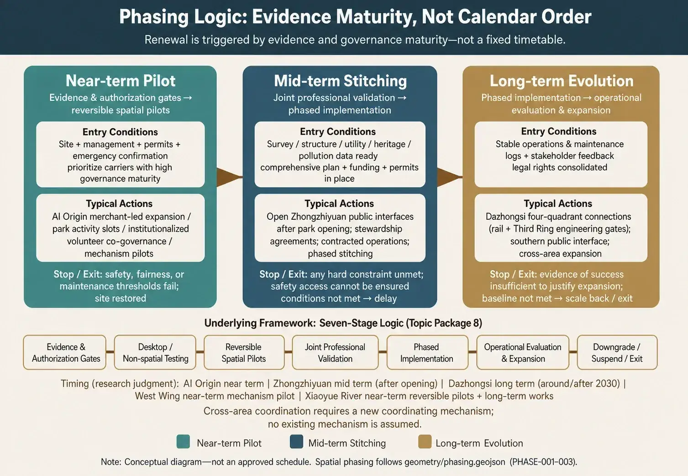

> **Figure 10-1 | Phasing Logic: Evidence Maturity, Not Calendar Order.** The seven evidence and governance gates are folded into near-term pilots, mid-term stitching, and long-term evolution. This is a conceptual implementation mechanism, not an approved schedule; spatial phasing follows PHASE-001–003 in `geometry/phasing.geojson`. [source:CH10-FIGURE-ASSETS] [data:geometry/phasing.geojson]

**Table 10-3 | Project-by-Project Phasing, Evaluation, and Exit Gates**

| Project | Recommended Phase | Entry Conditions and Coordination Requirements | Evaluation and Exit Gate |
|---|---|---|---|
| P-01 Jing-Zhang Railway Heritage Park vitality-corridor connection and environmental improvement | **Near-Term Coordination (PHASE-001)** | Connect the open Phase I and Phase II sections; confirm the operating model, operating rights, and public-access responsibilities; establish continuous operations | Evaluate walking/cycling continuity, public opening hours, and maintenance response; limit additional commercial and event arrangements if operating rights or access responsibilities remain unclear |
| P-02 Satellite Manufacturing Plant retention, conservation, and adaptive renewal | **Mid-Term Stitching (PHASE-002)** | Begin conservation and opening design after confirming the exact heritage boundary, railway authorization period, structural safety, and scope of operating permits | Heritage compliance, structural safety, and public-interface opening are gates; suspend renewal and opening if any condition is not met |
| P-03 Zhongkun Plaza in-depth commercial-to-office conversion | **Mid-Term Stitching (PHASE-002)** | Verify property rights, structure, fire safety, and post-renewal uses; implement existing-building renewal in stages | Evaluate structural and fire compliance, improvement in underused-space utilization, and public-interface quality; stop subsequent stages if safety or use adaptation is inadequate |
| P-04 Lanjing Lijia acquisition–transfer–self-held redevelopment | **Long-Term Evolution (PHASE-003)** | Coordinate with overall Dazhongsi connections after transfer conditions, public-access obligations, construction progress, and conditions for municipal indicators are clear | Public-access obligations, implementation progress, and enforceable property agreements are gates; do not begin subsequent connection works until conditions are fulfilled |
| P-05 Tencent Xueyuan Road New Headquarters public interface | **Mid-Term Stitching (PHASE-002)** | Confirm the public interface, connection to the rail micro-center, and phased-opening conditions in step with ongoing construction | Evaluate public-interface accessibility, continuity of opening, and rail-connection safety; delay opening related interfaces when conditions are not met |
| P-06 Zhongzhiyuan Shared Pilot-Production Platform | **Mid-Term Stitching (PHASE-002)** | After opening, actual scale, and operator are confirmed, first open exhibition, commercial, and green-space interfaces, then evaluate expansion of the pilot-production platform | Evaluate use of shared services, opening of public interfaces, facility maintenance, and operational stability; do not expand if the operator or maintenance resources are insufficient |
| P-07 Low-disturbance renewal of underused AI Origin Community buildings and Talent Station | **Near-Term Pilot (PHASE-001)** | Proceed in a low-disturbance, reversible manner after property-rights and merchant coordination, safety plans, and removal/restoration conditions are in place | Evaluate utilization, resident and merchant feedback, complaints, and maintenance burden; remove the pilot and restore the site if safety, fairness, or maintenance thresholds fail |
| P-08 Dazhongsi culture-led interface and four-quadrant stitching | **Long-Term Evolution (PHASE-003)** | Implement only after rail, Third Ring Road, heritage/development controls, and property rights for connection spaces pass professional review | Heritage impact, walking accessibility, and traffic safety are gates; do not build fixed connection facilities if professional review is not passed |
| P-09 Xiaoyue River cross-boundary waterfront-facility maintenance-agreement pilot | **Near-Term Mechanism Pilot + Long-Term Works (PHASE-001→003)** | Establish takeover, funding, and maintenance agreements first; fixed facilities and engineering renewal enter the long-term phase only after flood-control and professional approvals | Evaluate takeover response, maintenance funding, flood safety, and ecological impact; suspend additional facilities if responsibilities or funding lapse, and restore safety when engineering risks are triggered |
| P-10 AI Origin Innovation Living Room and Public Computing Service Window | **Near-Term Pilot (PHASE-001)** | Start with a withdrawable service window after the spatial rights/responsible entity, data authorization, human services, and operating mechanism are confirmed | Evaluate service accessibility, human takeover, privacy complaints, and operational stability; suspend the service for data overreach, service failure, or unavailable human takeover |
| P-11 Xiaoyue River embodied-AI and ecological-sensing test interface | **Near-Term Reversible Pilot (PHASE-001)** | Conduct restricted testing after flood-control priority, testing boundaries, safety responsibilities, public notice, and exit plans are in place; do not expand before evaluation | Zero major safety incidents, compliance with test boundaries, human emergency stop, and ecological impact are gates; stop immediately and restore the site after overreach, accidents, or flood-control conflicts |
| P-12 Three AI honor nodes and Public-Space Component Library pilot | **Near-Term Pilot → Mid-Term Expansion (PHASE-001→002)** | Begin with lightweight, reversible components; expand only after property-rights coordination, annual re-review, and maintenance evaluation | Evaluate information legibility, accessibility, maintenance, and fairness of honor procedures; revise or remove content that fails annual review and remove neglected components |
| P-13 Technology Services Wing capital-service and start-up incubation interface | **Near-Term Mechanism Pilot (PHASE-001)** | Establish service routing and collaboration first without adding construction land within the Overall Design Area; consolidate the carrier only after the spatial-governance entity is clear | Evaluate issue response, service referral, continued collaboration, and public feedback; reduce or stop the mechanism if it provides no substantive service over time or lacks a governance entity |
| P-14 Dazhongsi Station four-quadrant public node and station-city mixed use | **Long-Term Evolution (PHASE-003)** | Implement with the overall Dazhongsi four-quadrant plan only after rail safety protection, station-city connections, property agreements, and engineering approvals are all confirmed | Rail safety, interchange walking accessibility, public opening, and property agreements are gates; do not begin construction until approval and safety conditions are met |

Phase 1 prioritizes reversible public-space, guidance, service, and event pilots; Phase 2 advances carrier renewal and professionally verified connections; Phase 3 addresses fixed, ownership-, planning-, and engineering-dependent construction and long-term governance. A project moves only when its gates are met.

#### 10.2.2 Spatial Expression of Phasing

`geometry/phasing.geojson` records the current spatial model. The 100-day competition production schedule is separate from real-world urban-renewal phasing. [data:geometry/phasing.geojson#PHASE-001]

### 10.3 Implementation Policies and Mechanisms

#### 10.3.1 Statutory Route

Regulatory Detailed Planning approval, applicable integrated implementation procedures, and the Beijing Urban Renewal Regulations govern formal entry. This proposal cannot approve adjustments or appoint an implementing entity. [source:CH10-POLICY]

#### 10.3.2 Four-Part Property-Rights Route

**Table 10-4 | Implementation Channels and Design Constraints for Four Property-Right Types**

|Property type|Facts as to the status quo|Implementation Channel|Design constraints|
|---|---|---|---|
|Railways authorized belt (approximately 13 ha)|2021 Agreement on free authorization of terrestrial space, same title ( "Authority not to be transferred")|**Authorized consultation**(regarding fixed buildings, underground development, pre-access to tenure consultation)|Reversible, light, non-permanent facility compatibility is good; authorization period and scope of operating facility licence are not publicly available|
|Collective industrial land (East Uplift System approximately 2.73 million m2)|Self-build, self-operate, rent-only; 50 years of land-recycling route|**Collective ownership**(New Dong-Saeng, etc. + engaged)|The collective economy naturally assumes long-term operational responsibility, and is the most complete sample of the implementing subjects of the Time-Screen Logging.|
|State-owned concession land (Cold Temple model)|The Blue Fairy's "Repository-Sending-Twenty Years" $2.8 billion, the first social capital to be found in Haidian.|**Deposits**(offer conditions can be included in public opening obligations)|Dispersing small ownership rights is the biggest obstacle to renewal (the Chinese lesson); public interface negotiation space is giving in|
|University land allocation|The higher education system is vested in the higher education institutions along the way (inference); the rules are "sewn up the city, cross the border."|**Campus consultation**(negotiation rather than implementation)|Open-school interface is a consultative mechanism, without imposing a mandatory path to implementation|

State, collective, institutional, and private rights require separate evidence and agreements; cross-boundary facilities additionally require access, construction, operation, maintenance, liability, and handover arrangements.

#### 10.3.3 Public Clauses and Entry Gates

Public access, affordability, accessibility, heritage, ecology, data protection, maintenance, evaluation, and exit should be translated into enforceable project conditions where legally applicable.

### 10.4 Annual Activity System

#### 10.4.1 Brands and Rhythm

**Table 10-5 | Long-Term Operating Levels and Activity Mechanisms**

|Operational level|Activities or mechanisms|Main space|Frequency/trigger|Category of subjects of responsibility|
|---|---|---|---|---|
|Normal Open|AI Dot Open Day, scene booking, orientation, offline consultation, small lecture hall|The public interfaces have been identified for all the scenes.|Daily open hours|Space operations + community/campus services|
|Monthly creation|Open source clinics, developers ' maintenance sessions, community workshops, trouble recycling|AI Origin, Western Wing, Honorary Node|Monthly or major event trigger|Developer community+professional+resident representative+operator|
|Quarterly connection|Spring Global Open Source living room, summer urban scene testing season, autumn Jing-Zhang Ai Culture Week|Three sectors plus the main axis of Jing-Zhang|Synergy with the cycle of key innovative activities; testing seasons need to be safe through|Activity operations + testing platform + public culture operators|
|Annual Recup|AI Year Review of Urban Governance: release of records of operations, safety, fairness, maintenance, dissent and withdrawal, review of honorary presentations|Online public knowledge base + AI Origin deliberative space|After each year of operation or after major accident|Integrated sector-level platforms + professional review + third-party assessment + public representation|

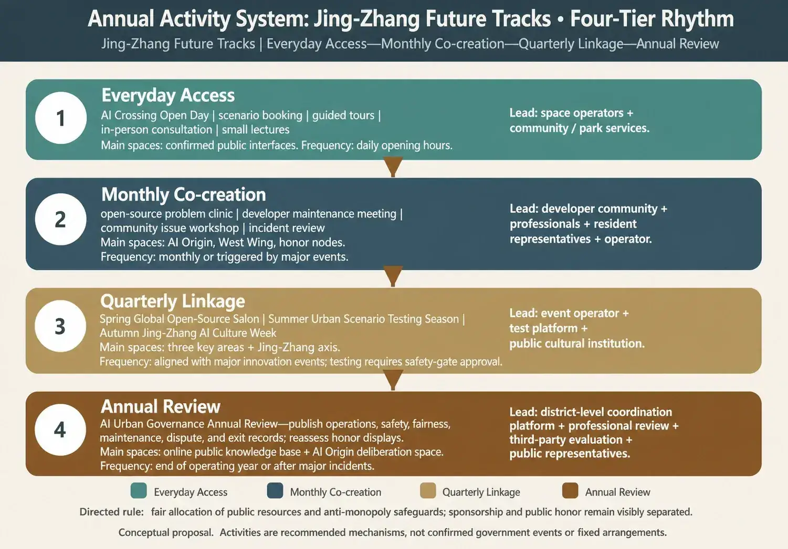

> **Figure 10-3 | Annual Activity System: Jing-Zhang Future Tracks Four-Tier Rhythm.** Everyday access, monthly co-creation, quarterly linkage, and annual review form a long-term operating proposal. Event names, frequencies, and lead categories are design mechanisms, not confirmed government events or fixed arrangements. [source:CH10-FIGURE-ASSETS] [source:CH10-EVENTS]

Annual AI events, open-source releases, developer days, heritage walks, public test days, and international roadshows form a layered calendar rather than a permanent occupation of public space.

#### 10.4.2 Spatial Support and Directed Rules

Every activity identifies venue capacity, accessibility, noise, fire safety, crowd management, data use, rights, cleaning, restoration, and cancellation conditions.

#### 10.4.3 Public Experience and Landmark Operation

The three landmarks and public route support everyday use first and programmed events second; ordinary passage and non-digital participation remain available.

### 10.5 Developer Community and Scenario-Access Operation

#### 10.5.1 Developer-Community Mechanism

Open calls, documentation, mentoring, testing, attribution, and public feedback support developers while protecting research, personal, and infrastructure data.

#### 10.5.2 Scenario-Access Mechanism

Scenarios are released with scope, data, site, safety, operator, evaluation, and exit requirements; approval remains with authorized humans and institutions.

#### 10.5.3 Adaptive Matching of Activities and Space

An Agent may recommend time and space allocation from authorized demand and capacity data; operators review the recommendation and can override, pause, or terminate it.

### 10.6 Long-Term Operation, Evaluation, and Exit

#### 10.6.1 Operator Categories and Funding Mix

Potential categories include public agencies, rights holders, professional operators, universities, enterprises, and community organizations. Naming a category does not imply authorization. Funding may combine lawful public, market, research, sponsorship, and user-service sources subject to procurement and audit.

#### 10.6.2 Annual Value Review and Exit

Review covers public value, accessibility, safety, ecology, heritage, privacy, fairness, use, maintenance, and financial sustainability. Underperformance or harm triggers correction, scaling down, suspension, removal, and restoration.

### 10.7 International Communication and Conversion

English naming, a traceable evidence chain, public routes, events, and project interfaces support international exchange. Recruitment or investment claims require verified partners, terms, rights, and results.

### 10.8 Directed and Adaptive Systems

#### 10.8.1 Directed System

The directed system fixes legal, public-value, professional-safety, rights, data, accessibility, and maintenance requirements.

#### 10.8.2 Adaptive System

The adaptive system adjusts pilots, space, events, and services through evidence, human review, evaluation, and exit.

### 10.9 Project–Phase–Operation Coordination

Every project links a spatial object, phase, operator category, metric, risk, and exit condition so that implementation remains reviewable and recomputable.

### 10.10 Items Pending Verification

Ownership, implementing entities, budgets, procurement, contracts, permits, engineering conditions, maintenance, representative participation, and formal schedules remain unconfirmed.

> **Evidence references retained for bilingual traceability:** [source:CH10-IMPLEMENTATION] [source:CH10-POLICY] [source:CH10-PROJECT-LIST] [depth:renewal_project_list] [source:CH10-PROJECT-LIST] [source:CH10-METRICS] [metric:renewal_project_count] [source:CH10-PHASING] [source:CH10-PHASING] [data:geometry/phasing.geojson] [source:CH10-POLICY] [standard:MOHURD-CONTROL-DETAILED-PLANNING] [source:CH10-POLICY] [source:CH10-POLICY] [source:CH10-POLICY] [source:CH10-POLICY] [source:CH10-POLICY] [source:CH10-POLICY] [source:CH10-EVENTS] [source:CH10-EVENTS] [standard:PROJECT-AGENT-OPEN-CALL-TASKBOOK] [source:CH10-EVENTS] [source:CH10-EVENTS] [source:CH10-IMPLEMENTATION] [source:CH10-EVENTS] [source:CH10-EVENTS] [source:CH10-OPERATION] [standard:PROJECT-AGENT-OPEN-CALL-TASKBOOK] [source:CH10-DEVELOPER] [source:CH10-DEVELOPER] [source:CH10-DEVELOPER] [source:CH10-OPERATION] [source:CH10-OPERATION] [source:CH10-OPERATION] [source:CH10-CASE] [source:CH10-DEVELOPER] [source:CH10-EVENTS] [source:CH10-METRICS] [source:CH10-OPERATION] [source:CH10-DEVELOPER] [source:CH10-METRICS] [data:geometry/phasing.geojson] [depth:renewal_project_list]
## Chapter 11 Metrics, Area Recalculation, and Compliance Matrices

### 11.1 Metric Definitions and Current Baseline

**Table 11-1 | Core Indicator Groups and Current Results**

|Indicator cluster|Current Results|Status and purpose|
|---|---:|---|
|Integrated scope of the study|About 43.6 km2|Publicizing mission scales, not as overall design area denominator|
|Overall design scope|Published brief approximately 11.4 km2; current geometry 11.4925 km2|Current geometry is provisional; unified recalculation once the official boundary is in place|
|Three key areas|Total published briefs approximately 368.4ha; current geometry total 368.7872ha|Number and name of the announcement of facts, geometry and area of temporary model|
|Green space|1,552,070.246㎡;13.505068%|From the same general border with`green_space.geojson`Recovered low-confidence design model values|
|Public space|502,058.763㎡;4.368577%|From the same general border with`public_space.geojson`Recovered low-confidence design model values|
|Cover with Ground|560 elements; 11,492,502.43 m2; 100% coverage|Programmatic functional partitions cover the current boundary in its entirety and are not a substitute for statutory land classification or plotting|
|Building foundations|950,772.474m2; partial coverage floor 8.272980%|The combination of 3,663 low confidence building-footprint objects in only three key areas does not represent the full-scale construction density|
|Transport Model|9 proposal road hubs; 23,800.974 m total|Conceptual transport elements, not authorizing line or scope of work|
|Update and Phase|14 projects; 3 phases|Proposal project library versus trigger split, not representing approved projects or determining construction time sequence|
|AI Space Interface|29 port anchor points|Current unified basis for G1, 8, G2, 7, and G3,14|

Known metrics are recomputed from GeoJSON or registered sources; unknown metrics state missing inputs and recalculation triggers. The current overall geometry is approximately 11.4925 km² versus the announced approximate 11.4 km²; the three provisional key areas total approximately 368.7872 ha versus the announced 368.4 ha. These are model checks, not official exact areas. [metric:site_area_announced_sqm] [metric:site_area_sqm]

### 11.2 Industry and Innovation-Ecosystem Metrics

#### 11.2.1 AI Innovation Index

The proposed index measures original research, enterprise vitality, talent, transformation, scenario performance, openness, and governance. It remains a framework until definitions, weights, sources, and T0 values are verified. [metric:ai_innovation_index]

#### 11.2.2 Talent, Enterprise, and Output Targets

**Table 11-2 | Verification of Talent, Enterprise, and Output Indicators**

|Indicators|Calculation and verification|Planning objectives and spatial response|
|---|---|---|
|AI human space density|Number of qualified AIs/total design area after re-engineering; breakdown of scientists, developers, relevant students and other talent|Annual recalculation of T0 baselines, with density growth synchronized with housing, commuting, public services and innovative interfaces, without the number of sites pushed down by total district-level talent|
|AI employment ratio|Site AI employment/total site employment|Check whether industrial space growth is a real job load and is linked to the configuration of human life services|
|AI Business Aggregation|Core enterprises, growth-oriented enterprises, professional services, developers and scientific organizations are registered, using stable IDs to weigh up|A division of labour network for “The original point of origin - the first in the public's mind - the application of the Great Congregation Temple to the headquarters”; absolute number of enterprises to be determined by the unified directory and not to replace physical space use with registered addresses|
|Site AI industry value|Summary of output verification values after fixed industry classification, statistical cycle and spatial attribution|Establishment of two indicators of site-level output and unit-based spatial output, with continuous evaluation of carrier efficiency after achieving the T0 baseline, and non-diversion of total sea area by area|
|Innovation chain conversion rate|Number of projects verified in the next phase/number of projects eligible in the previous phase|Monitoring of conceptual validation, engineering, testing, scene validation and transformation of results, identifying chain breakpoints, respectively|
|Sector three, two-wing synergy.|Number of projects/total projects in which two or more zones were involved|Evaluation of regional synergies for real projects and shared services, without using spatial naming as a substitute for collaborative results|
|Eight-factor readiness rate|Number of elements of land, space, industry, finance, talent, computing, data, scene that meet the entry conditions/8|Projects that do not meet the requirements for authority, capacity, responsibility or withdrawal may not enter the next stage of implementation|

Published district baselines remain separate from site-level targets. Site-level enterprise, talent, and output values are not reported as current facts without a geocoded and deduplicated T0 register.

#### 11.2.3 Three-Stage Targets

**Table 11-3 | Site-Level Phased Targets for Enterprises, Talent, and Output**

|Proposal target indicator (T0 = 100)|Recent pilot|Medium-term knitting|Long-term evolution|Verification of boundaries|
|---|---:|---:|---:|---|
|AI Effective Corporate Aggregation Index`E/E0×100`|≥110|≥125|≥140|Only the main body of the verifiable office, research and development, intermediate test, service or operation is counted in the site; registration addresses cannot be counted separately|
|AI human space density index`D/D0×100`|≥108|≥120|≥130|Disaggregated by scientists, developers, relevant students and other talent; synchronized verification of housing, commuting, public services and innovative communication carrying|
|Site AI industrial output index`V/V0×100`|≥115|≥140|≥170|Fixed industry classification, statistical cycle and spatial attribution; not to be commingled into enterprise valuation, market size or sector-level output that cannot be attributed to the site|

Near-, medium-, and long-term targets are scenario values linked to space, services, and review triggers. They are not forecasts, recruitment promises, or government performance commitments.

### 11.3 Area Recalculation and Spatial Capacity

**Table 11-4 | Recalculated Areas of Spatial Objects**

|Space Object|Published value|Current Geometry|Relative differences|Use Border|
|---|---:|---:|---:|---|
|Overall design scope|11,400,000㎡|11,492,502.43㎡|+0.81%|Published brief as task scale; geometry is the temporary model denominator|
|Total three key areas|3,684,000㎡|3,687,872.19㎡|+0.11%|Approaching the announcement is not proof of the boundary.|
|Zhongzhiyuan|1,921,000㎡|1,918,001.919㎡|-0.16%|Retain the provisional-data label|
|Beijing AI Origin Community|1,043,000㎡|1,046,952.810㎡|+0.38%|Retain the provisional-data label|
|Dazhongsi|720,000㎡|722,917.464㎡|+0.41%|Retain the provisional-data label|

The same provisional boundary clips land use, green space, and public space to prevent denominator drift. All 560 land-use features form a complete topology within validation tolerance. Statutory FAR, height, building coverage, setbacks, and building-control lines remain unknown. [data:geometry/land_use.geojson] [data:geometry/green_space.geojson#GREEN-001] [data:geometry/public_space.geojson#PUBLIC-001]

### 11.4 Industrial Space, Building Capacity, and Functional Proportions

The 16–18 million m² model yields an average FAR of 1.3922–1.5662 on the current geometry. At the 55/30/15 baseline, innovation-production space is approximately 8.8–9.9 million m², urban-service space 4.8–5.4 million m², and public-support space 2.4–2.7 million m². These are capacity scenarios, not approved quantities.

### 11.5 Task, Standard, and Design-Depth Coverage

**Table 11-5 | Summary Review of Tasks, Standards, and Design Depth**

|Review layer|Current Structured State|Conclusions|
|---|---:|---|
|The announcement and the Agent's choice of tasks|23/23 mapd|Coverage relationships established and completion still subject to judgement in terms of the authenticity of the results|
|Compulsory professional standards|6/6 Response|Professional responses have been developed to the extent permitted by available data; official conditions gaps are not retransmitted to determine conclusions|
|Formal design depth|15/15 for`complete`|Three main key areas have been developed, comprehensive design of the three sectors, concept of the three sectors, project module control and proposal-level carrying estimates; official plots/building data are still subject to calibration and building-by-block conclusions when available|
|Three core spatial indicators|3/3 remunerative|Current low confidence temporary model values, which must be recalculated after the formal boundary or layer is updated|

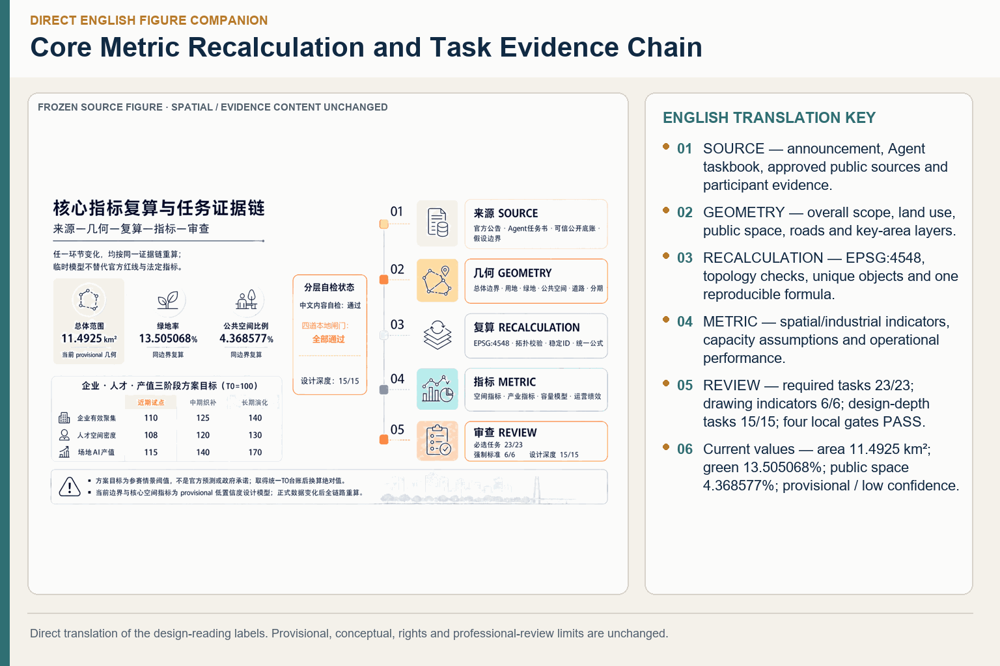

> **Figure 11-1 | Core metric recalculation and task evidence chain.** It links source, geometry, formula, result, and review while preserving provisional and low-confidence labels.

The structured matrices map 23/23 mandatory announcement and Agent tasks, respond to 6/6 mandatory professional standards within available evidence, and record 15/15 design-depth items as complete at the current competition level. This means the evidence interfaces exist; it does not mean statutory or engineering conditions are complete.

### 11.6 Recalculation Triggers and Conclusion

Recalculation is mandatory when boundaries, any of the nine GeoJSON layers, industrial baselines, target definitions, capacity, functional proportions, scenario counts, project counts, or phase logic change. Current metrics are directly reviewable but remain bounded by provisional geometry and missing formal data; the synchronized bilingual A3/A0 and offline HTML outputs passed all four local gates on 2026-08-31.

> **Evidence references retained for bilingual traceability:** [standard:PROJECT-AGENT-OPEN-CALL-TASKBOOK] [depth:metrics_recalculation] [source:CH3-HAIDIAN-AI-BASELINE] [metric:site_ai_active_enterprise_index_target_long_term] [metric:site_ai_talent_density_index_target_long_term] [metric:site_ai_industry_output_index_target_long_term] [metric:chapter04_innovation_production_share] [metric:chapter04_city_service_share] [metric:chapter04_public_support_share] [standard:PROJECT-AGENT-OPEN-CALL-TASKBOOK] [depth:three_key_area_detailed_design]
## Chapter 12 Risk, Copyright, and Compliance

### 12.1 Risks and Data Gaps

**Table 12-1 | Risks, Information Gaps, and Responsibilities for Follow-Up Verification**

|Risk category|Current risk or information gap|Impact on proposal conclusions|Response and follow-up verification|Verification of the main subject category of responsibility|
|---|---|---|---|---|
|Information and sources|Information on the official and accurate overall border, the closed border in the three priority areas and the partial status quo is not yet available; the availability of public, background and provisional information varies|The official red line, precise area, status or conditions for approval cannot be confirmed on this basis|Maintain source classification and limitation statements; replace only after obtaining official information with publisher, date, version, permission and coordinates|Competition organizers, teams of professionals in mapping and planning|
|Space and statutory control|Current scope, land use, green land, public space and key area configurations include provisional or low confidence design models|Available for conceptual comparison and current model recalculation and does not constitute statutory land use, volume rate, height, building density, retreat or block control|Reconstruct nine categories of GeoJSON, synchronized with indicators, matrices and maps, once formal boundaries and sub-declare controls are in place[data:geometry/site_boundary.geojson#SITE-001] [data:geometry/land_use.geojson]|Professional team for planning, mapping and urban design|
|Engineering and public safety|Road red lines, orbital protection, bridge ridges, pipe, municipal capacity, survey, structure, fire, pollution and insurance conditions did not form a full engineering base|Roads, crossings, municipalities, demolitions and fixtures can only be used as directional advice|Completion of special transport, municipal, structural, fire, flood, pollution and insurance arguments prior to construction; no safe door passes, i.e., shrunk, delayed or cancelled[data:geometry/constraints.geojson] [source:CH8-SAFETY]|Transport, municipal, structural, fire, water, ecological and cultural teams|
|Title and enforcement|Titles, duration of railway authorization, operators, budget, procurement, contracts and mechanisms for the takeover of cross-border facilities not fully recognized|14 updating projects and three-phase arrangements do not constitute property judgement, investment commitments, established time series or approval of projects|Access to projects is conditional on tenure, funding, licensing, maintenance and takeover agreements; if conditions are missing, reversible pilot or non-start[data:geometry/phasing.geojson] [source:CH10-IMPLEMENTATION]|Rights holders, project implementation and operational professional teams|
|Data privacy and algorithm governance|AI scenes may involve traffic, health counselling, activity registration, equipment operation and public expression|No unauthorized personal data collection, no graphics, tracks or face recognition as substitutes for public services and artificial judgements|Use of purpose limits, minimum requirements, authorized use, hierarchies, expired disposals and challenge corrections; and Human Review of high-risk matters[source:CH6-SCENARIO-BASELINE]|Data-processing subjects, scene operators, data security and legal professionals|
|Technical maturity and pilot security|Smartness, traffic synergy, public computing and scenario movement remain controlled testing or conceptual mechanisms|Not to be written as fully deployed, automatically approved or approved operations|Preserve physical emergency, human takeover, retreat of existing proposals, accident records and spatial recalculation, first in isolation or restricted environmental testing; and immediately cease transboundary, interconnection or security incidents|Test operators, equipment liable parties, third-party security assessment and competent professionals|
|Operation, equity and public acceptance|Long-term transportation of funds, representative participation, accessibility continuity, allocation of public resources and complaint processing still need to be validated|The scene may result in digital exclusion, loss of maintenance, resource monopolies or public weakness|Maintain manual, telephone, paper, physical orientation and unequipped participation; expand, shrink or withdraw through annual disks, representative feedback and fair review decisions[source:CH10-OPERATION]|Space operators, community and public representatives, accessibility and third-party evaluators|
|Copyright and public compliance|The power status to generate maps, third-party data, fonts, logos, portraits and historical materials is not the same|Unliquidated assets may not be publicly submitted; concept maps may not be assumed to be live, measured, statutory or approved results|Substitute, withdraw or discontinue distribution of rights if insufficient evidence exists|Asset makers, collusive authors and intellectual property professionals|

No definitive conclusion is formed where evidence is incomplete. Key risks are: missing official boundaries and source limits; provisional spatial and statutory controls; road, rail, utility, flood, fire, structure, contamination, and heritage conditions; ownership, finance, procurement, operators, and maintenance; privacy and algorithmic governance; technical maturity and test safety; public fairness and accessibility; and asset rights. Responsible-party labels identify required professional categories and do not imply authorization or contracts. [depth:risk_missing_data]

### 12.2 Provisional-Data Replacement and Recalculation

The current nine-layer geometry is a recomputable design model, not a statutory base map. Once formal boundaries, parcels, buildings, ownership, roads, utilities, heritage, and engineering data arrive, all layers, metrics, matrices, narrative, figures, PDFs, and HTML must be regenerated from the same version. [source:BOUNDARY-SOURCE] [source:KEY-AREA-SOURCE]

### 12.3 AI Data and Human Governance

AI supports sensing, retrieval, analysis, simulation, recommendation, and record keeping; it does not approve, enforce, diagnose, manufacture consensus, or autonomously alter physical space. All scenarios follow authorized input, bounded processing, human judgment, controlled action, recorded feedback, and expansion or exit. High-risk matters require professional review; failure triggers manual takeover, non-digital fallback, safe shutdown, lawful data handling, and spatial restoration.

### 12.4 Copyright, Generated Assets, and Deliverable Limits

External and generated assets are registered by source, generation or processing method, license, use, and limits in `sources.json` and `report/copyright_statement.md`. The participant has authorized the Logo, Chapter 01 evidence-chain figure, Chapter 03 overall aerial and three Chapter 05 aerials for this GitHub Agent open call and public repository display. The aerials share the workflow **Agent automatically searches and downloads public GABLE/OSM/EULUC data → generates a geometry-locked Blender base → user performs image-to-image generation on the official GPT website**; all are conceptual composites and cannot evidence existing conditions, exact buildings, statutory planning, or approval. Their exact image-model versions and prompts were not retained, so the package makes no claim of uniqueness, non-infringement or model-specific provenance. [source:CH3-OVERALL-AERIAL] [source:CH5-ZZY-AERIAL] [source:CH5-ORIGIN-AERIAL] [source:CH5-DZS-AERIAL]

The 14 Chapter 06 scenario figures were generated on 2026-08-25 through direct Codex Desktop calls to its built-in `image_gen` capability, with some per-image review continuing on August 26. Per-file hashes, generation method, task record, applicable OpenAI terms, and the participant's 2026-08-31 authorization for public-repository display and redistribution are registered. The interface did not expose the underlying image-model version, so the package makes no claim of model-level provenance, uniqueness, or absolute non-infringement. [source:CH6-SCENARIO-ASSETS] [source:OPENAI-TERMS-2026-01-01]

The former Beijing Subway simplified mark had a Wikimedia PD-shape copyright designation, but no operator-issued trademark permission for this public display was located. It has therefore been removed from both Chinese and English mobility figures and replaced with an original neutral station-node symbol. [source:CH8-BEIJING-SUBWAY-LOGO] [source:CH8-NEUTRAL-STATION-SYMBOL]

This document is a competition-oriented conceptual recommendation. It does not replace statutory planning, surveying, ownership confirmation, administrative approval, professional design, or government implementation. Chinese and English narrative, drawings, HTML, and text-bearing figures must remain equivalent; offline outputs may not load remote scripts, tiles, fonts, images, iframes, forms, APIs, or trackers.

> **Evidence references retained for bilingual traceability:** [depth:risk_missing_data] [source:CH10-OPERATION] [standard:PROJECT-AGENT-OPEN-CALL-TASKBOOK] [source:CH10-DEVELOPER] [source:CH1-EVIDENCE-CHAIN-FIGURE] [source:CH8-BEIJING-SUBWAY-LOGO] [source:CH8-NEUTRAL-STATION-SYMBOL]
## Chapter 13 References

### 13.1 Task, Research, and Professional Basis

1. Haidian Branch of the Beijing Municipal Commission of Planning and Natural Resources, *Qualification Preselection Announcement for the International Urban Design Open Call for the Centennial Jing-Zhang AI Innovation Belt*, 9 May 2026. [source:OFFICIAL-ANNOUNCEMENT]
2. *Agent Taskbook for the Open Urban Design Call for the Centennial Jing-Zhang AI Innovation Belt*, 18 May 2026. [source:AGENT-TASKBOOK]
3. open-city-ai/haidian maintainers, *Centennial Jing-Zhang AI Innovation Belt Site Package*, v0.1.0. [source:SITE-PACKAGE]
4. open-city-ai/haidian maintainers, *Public Source Registry*, updated through 23 August 2026. [source:SOURCE-REGISTRY]
5. Project research team, *Stage 1 Nine Thematic Research Packages*, 2026. [source:S1-THEMATIC-PACKAGES-01-09]
6. Project precedent team, *S1-14 Core Precedent Study: Eight Global AI Innovation-Ecosystem Cases*, 2026. [source:CH3-CASE-TRANSLATION] [source:CH5-CASE-TRANSLATION]
7. Project synthesis team, *S1-15 Stage 1 Synthesis Report*, 2026. [source:S1-15-STAGE1-SYNTHESIS]
8. *AI Crossing System: A Spatial Operating System for the AGI Era, v2*, 2026. [source:AI-CROSSING-SYSTEM-V2]
9. Public materials issued by the Beijing Municipal People's Government, Haidian District People's Government, and Beijing Municipal Science and Technology Commission/Zhongguancun Science Park Administrative Committee, 2026. [source:CH3-HAIDIAN-AI-BASELINE]
10. Thematic Package 5 and related public professional material on transport, blue-green systems, municipal infrastructure, and accessibility, 2023–2026. [source:CH8-TRANSPORT] [source:CH8-MUNICIPAL] [source:CH8-ACCESSIBILITY-LAW-SOURCE]
11. Applicable Beijing Regulatory Detailed Planning, urban-renewal, heritage, contamination, rail-protection, and public-data policies. [source:CH10-POLICY]
12. Project team, *Chapter 06 Baseline for AI Innovation Ecosystem, Personas, and AI+ Scenarios*, 2026. [source:CH6-SCENARIO-BASELINE]

### 13.2 Structured Sources and Rights Records

Publishers, URLs or local paths, access dates, licenses, uses, and limits are retained in `sources.json`. `metrics.json`, `compliance_matrix.json`, `standard_matrix.json`, and `design_depth_matrix.json` retain formulas, spatial references, professional standards, task coverage, and depth. Image, font, Logo, generated-asset, and media rights are governed by `report/copyright_statement.md`; material without completed rights review may not enter the public submission.
