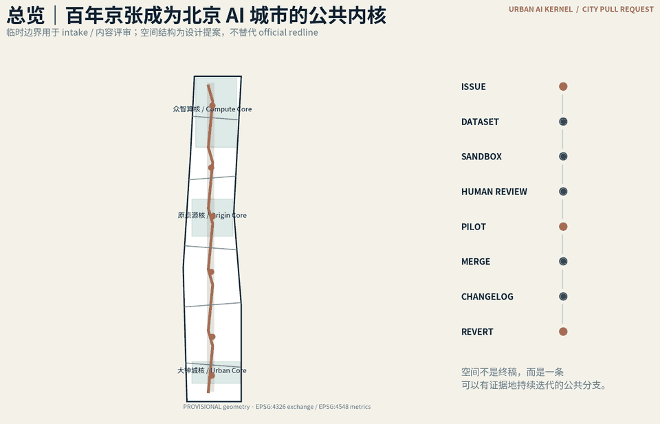
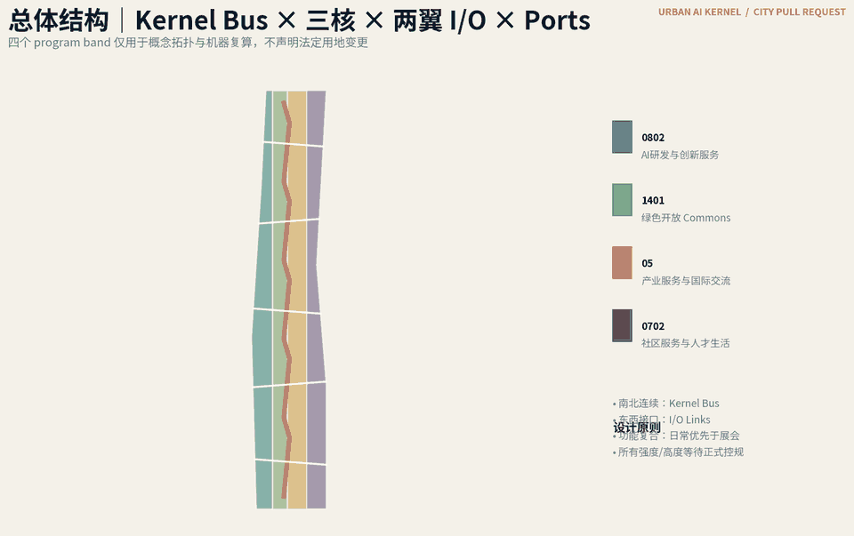
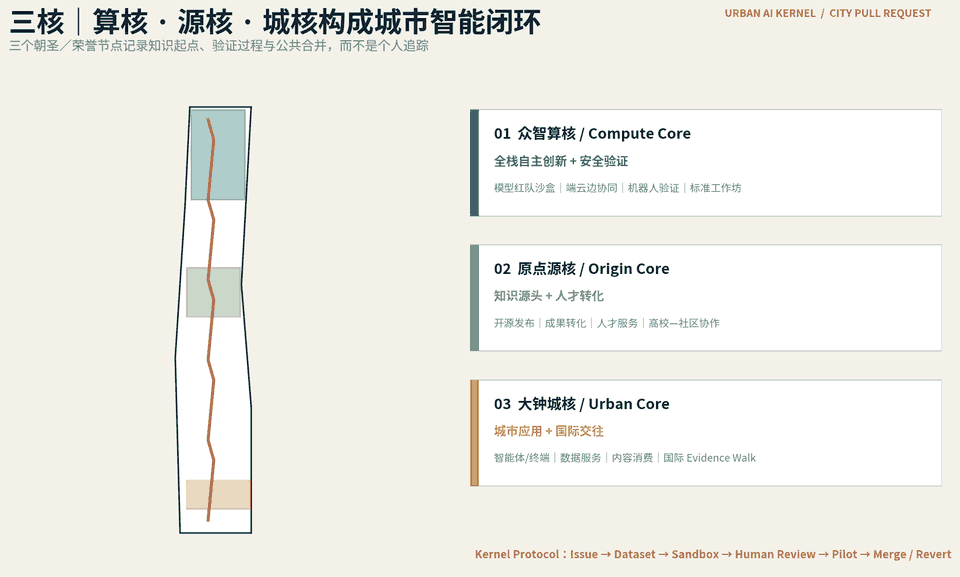
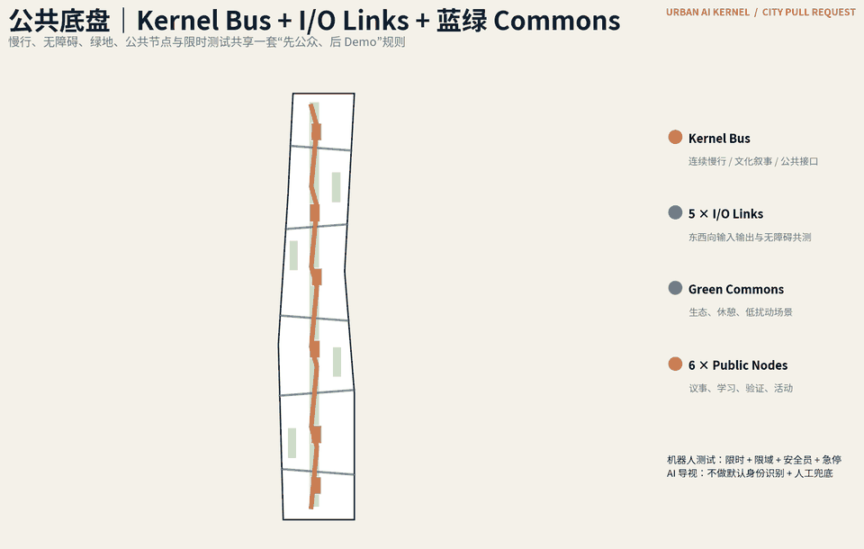
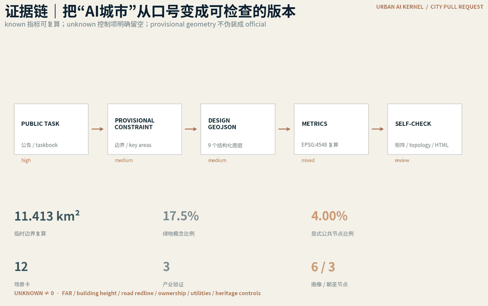

# 京张元枢｜JING-ZHANG AI KERNEL

**百年京张，面向全球的城市 AI 公共内核｜The Open Kernel for Urban AI**

本方案不把“AI创新带”理解为一组带有科技风格的建筑，也不把京张降格为连接若干园区的普通廊道；它被提出为一枚 **城市级 AI 公共内核（Urban AI Kernel）**：向上连接高校、实验室、算力与全球创新网络，向下连接企业、社区、公共服务和真实城市场景，在同一空间系统内完成研究进入城市之前最关键的验证、转译、治理与公开发布。京张的核心地位不来自体量或地标高度，而来自它成为“创新如何进入城市”的默认接口。核心机制称为 **City Pull Request（城市 PR）**：Issue 提出真实问题，Dataset 明确可使用资料，Sandbox 在限定空间内验证方案，Human Review 保留专业与公众复核，Pilot 进行小尺度试点，Merge 才进入稳定运营，Changelog 公开记录变更，必要时 Revert。这样，“开源”不是视觉符号，而成为从空间、产业、治理到文化运营的共同协议。

> 边界声明：当前提交使用组织方公开的 provisional geometry，仅供开源征集的方案生成、结构化自检、可视化与内容评审；它不是 official redline。任何需要正式控规、道路红线、文保、市政、权属或工程资料的结论均保持待确认。[source:BOUNDARY-SOURCE] [source:KEY-AREA-SOURCE] [depth:risk_missing_data]

## 设计依据与资料清单

方案以公开公告、组织方 site package、source registry 与面向智能体任务书为首要证据层，并把“事实、设计、推断、缺口”分开存放：公告和任务书决定必须回应什么；GeoJSON 决定当前可计算的空间边界；metrics 只计算结构化图层能够证明的量；assumptions 把尚未取得的官方条件显式暴露。现阶段最重要的数据约束是总体设计范围及三处重点区均为 provisional，故 [data:geometry/site_boundary.geojson#PROV-SITE-001] 与 [data:geometry/key_areas.geojson#PROV-KEY-001] 只能作为临时约束，不能借由图面精细化制造“已确定”的错觉。[metric:site_area_sqm] 是对临时 polygon 的 EPSG:4548 内部复算，[metric:official_overall_design_area_sqm] 则保留任务文本的 11.4 km²，两者并列是为了主动显示数据精度差异，而不是强行让数值相等。

本方案采用的标准与专业深度链为：[standard:PROJECT-OFFICIAL-ANNOUNCEMENT]、[standard:PROJECT-AGENT-OPEN-CALL-TASKBOOK]、[standard:MOHURD-URBAN-DESIGN-MEASURES]、[standard:MOHURD-CONTROL-DETAILED-PLANNING]、[standard:MNR-LAND-USE-CLASSIFICATION-GUIDE]、[standard:MOHURD-ARCH-DESIGN-DEPTH-2016]。现状诊断与资料缺口通过 [depth:existing_conditions_diagnosis] 建立，法定控制相关判断通过 [depth:development_intensity_controls]、[depth:height_massing_character] 和 [depth:retain_renovate_demolish] 降级管理。所有设计图由本次提交的结构化几何与文字原创生成，不加载远程地图瓦片、企业 logo 或第三方字体资产。完整来源索引包括：[source:SITE-PACKAGE]、[source:SOURCE-REGISTRY]、[source:PROCESSED-FACT-PACK]、[source:BOUNDARY-SOURCE]、[source:KEY-AREA-SOURCE]、[source:OFFICIAL-ANNOUNCEMENT]、[source:AGENT-TASKBOOK]、[source:CASE-STATION-F-F-AI]、[source:CASE-ONE-NORTH]、[source:CASE-SEOUL-AI-HUB]、[source:CASE-HUB71-AI]、[source:CASE-DATAIA-PARIS-SACLAY]、[source:CASE-VECTOR-TORONTO]。其中境外案例只作为“机制如何运行”的背景研究，绝不作为北京地块控制条件或尺寸依据。

## 三层范围工作框架

三层范围不是三份互不关联的方案，而是同一个问题从“区域生态—城市结构—关键节点”逐级收敛。约 43.6 km² 的统筹研究层回答 AI 企业、人才、科研、资本、公共服务和生活场景怎样形成网络；11.4 km² 总体设计层回答京张遗址公园活力带怎样成为南北连续的公共骨架，并用东西向连接缝合高校、园区、社区和轨道节点；三处重点区域层回答每个核心如何形成能被真实使用、运营和验证的空间原型。结构化提交以 [data:geometry/site_boundary.geojson#PROV-SITE-001] 作为当前总体设计临时计算域，以 [data:geometry/key_areas.geojson#PROV-KEY-001]、[data:geometry/key_areas.geojson#PROV-KEY-002]、[data:geometry/key_areas.geojson#PROV-KEY-003] 索引三处重点区。[depth:three_level_scope_framework] 负责检查三层之间是否有明确任务传递关系。

“AI Kernel”在总体设计层采用“一总线、五接口、三核两翼、多点 Commons”的结构：一条 **Kernel Bus** 沿京张历史轨迹形成城市级主总线；五条 **I/O Links** 向东西两侧接入研发、服务、社区、轨道与公共生活；三核不是三个并列园区，而是整个系统的三个关键处理器，分别承担验证与安全、开源创新与人才转译、部署发布与全球交流；两翼作为中关村科技服务与小月河场景赋能的方向性网络，不在缺少正式 polygon 时伪造边界；多点 Commons 则是一组可复用、可预约、可验证的公共设施原型。[data:geometry/roads.geojson#ROAD-001] 表达主脊与编织联系，[data:geometry/public_space.geojson#PUBLIC-001] 表达第一组公共节点，[depth:overall_spatial_structure] 负责总体结构完整性。

这一框架主动避免“从总图直接跳到建筑造型”。所有可能影响规划实施的精确强度、建筑高度、道路断面或工程参数均不在 provisional 阶段给出固定数值；真正可确定的是结构、关系、治理流程和可逆试点位置。待官方 redline 与专业底图更新后，九个 GeoJSON 图层和全部 geometry-derived metrics 必须整体重算，而不是只换一张底图继续沿用旧结论。

## 统筹研究范围产业与未来城市研究

案例研究选择六类可核查机制，而不是复制六个“科技园形象”。巴黎 Station F 的 F/ai 显示早期 AI 团队需要实验室、基础设施、投资和创业服务形成联合入口 [source:CASE-STATION-F-F-AI]；新加坡 one-north 把科研机构、高校、企业与真实场景试点放在紧密空间关系中 [source:CASE-ONE-NORTH]；Seoul AI Hub 强调城市层面的 AI 人才、创业、研发基础设施和产学研协作 [source:CASE-SEOUL-AI-HUB]；Hub71+ AI 强调专业化创业生态与投资人、企业、研究伙伴的连接 [source:CASE-HUB71-AI]；Paris-Saclay DataIA 展现研究—教育—创新连续体 [source:CASE-DATAIA-PARIS-SACLAY]；Vector Institute 则展示研究机构与产业伙伴、初创生态、应用案例之间的转译机制 [source:CASE-VECTOR-TORONTO]。对京张的启发不是增加六栋地标，而是把“共享资源、可验证场景、人才社区、公共传播、产业转译、持续治理”嵌入日常空间。

元枢不是单一功能，而是一套 **Kernel Stack**。底层是 **Compute Layer**：可审计的边缘算力、模型与设备验证接口；其上是 **Data Layer**：授权、可追溯的数据集与模拟环境；第三层是 **Testbed Layer**：机器人、端侧 AI、模型安全等可预约、可回放的验证空间；第四层是 **People Layer**：人才、学习、无障碍、社区协作与全球交流；最上层是 **Governance Layer**：City PR、人工复核、公开变更记录与可撤销机制。五层不是五栋楼，而是贯穿三核两翼的公共技术—城市协议，使京张拥有“北京 AI 创新体系的城市级底层接口”这一核心角色。它们对应任务书的全栈自主创新、世界级创新生态、AI+ 场景、智能活力城市和 AI 治理话语权，并由 [depth:municipal_new_infrastructure] 与 [depth:overall_spatial_structure] 管理。

产业策略采取“**内核总控、三核分工、两翼放大、全球接入**”。众智园拟形成 **众智算核｜Compute & Validation Core**，负责模型安全、软硬协同、机器人、端云边和标准验证；AI原点社区拟形成 **原点源核｜Origin & Talent Core**，把高校科研、开源社区、青年人才与成果转化接入城市；大钟寺拟形成 **大钟城核｜Urban Application & Exchange Core**，承接智能体、智能终端、数据服务、国际路演与城市级真实场景发布。科技服务翼承担 IP、资本、企业服务、国际网络等非空间硬件能力；场景赋能翼把公共服务、社区生活、机器人和移动服务变成可验证真实需求。用地表达仅作为当前概念的闭合分区 [data:geometry/land_use.geojson#LU-001]，不被表述为法定用途调整。[depth:land_use_layout]

## 总体设计范围城市更新与控规深度城市设计

总体设计把城市更新从“拆建项目”改写为“可逆层—更新层—结构层”三级行动。可逆层可以用轻量设施、导视、预约机制、活动和临时测试快速验证；更新层涉及公共空间界面、首层复合、慢行缝合、既有空间再利用，必须结合权属和现状建筑调查；结构层涉及道路、轨道、市政、开发强度与长期土地使用，只能在正式资料充分后进入控制性决策。当前 [data:geometry/buildings.geojson#BLDG-001] 仅表达十个轻量 AI Commons 原型的概念 footprint，[metric:building_footprint_area_sqm] 只统计这些新增原型，不推断现状建筑，更不作拆除清单。[depth:retain_renovate_demolish]

土地结构图 [data:geometry/land_use.geojson#LU-001] 采用登记分类码完成拓扑闭合，以保证机器可检查；图上的“AI研发、绿色开放、产业服务、社区服务”是概念 program band，不是审定规划。开发强度、建筑高度和退线保持 unknown，因为 `planning_limits` 没有足以支撑数值化控制的资料。[standard:MNR-LAND-USE-CLASSIFICATION-GUIDE] [standard:MOHURD-CONTROL-DETAILED-PLANNING]。建筑风貌不靠统一科幻造型，而采用“工业/铁路记忆的材料尺度 + 可读的数字基础设施 + 可逆公共构筑物”三层语言，避免用高成本造型替代创新生态。[depth:height_massing_character]

城市更新治理采用 City PR 流程：任何场景先以 Issue 描述公共问题和受益者；Dataset 明确数据授权与缺口；Sandbox 在模拟或限定区域运行；Human Review 由专业人员、运营方和公众代表复核；Pilot 设定时间、范围、退出条件；只有证据足够才 Merge 到常态运营；Changelog 公开变更原因与指标；出现安全、扰民、偏见或不可持续成本时允许 Revert。此机制把 AI 治理从一块展板变成空间运营协议，也为 [depth:renewal_project_list] 和 [depth:phasing_implementation] 提供项目筛选逻辑。

## 重点区域详细设计

三处重点区共享一套 AI Kernel 协议，但不做同质化“AI园区”，也不是三个平级地标：它们分别占据从“技术可信”到“创新转译”再到“城市部署”的关键控制位。**众智园AI自主创新加速区**对应北部众智算核 / Compute & Validation Core：以模型安全红队、端云边协同、机器人验证、标准工作坊与清河公共界面形成“可看见的全栈创新”。核心公共空间是“算核检阅场 / Compute Yard”，展示的不是企业广告，而是模型版本、测试维度、能源与安全边界的公开证据；临时边界引用 [data:geometry/key_areas.geojson#PROV-KEY-001]。**北京AI原点社区**对应 原点源核 / Origin & Talent Core：以开源发布、成果转化、青年居住生活、人才服务、社区教育与高校协同形成“日常化创新”；公共荣誉不是名人雕塑，而是经过验证的开源贡献、公共数据治理改进和城市问题解决记录 [data:geometry/key_areas.geojson#PROV-KEY-002]。

**大钟寺AI产业聚集区**对应大钟城核 / Urban Application & Exchange Core：将智能体、智能终端、内容消费、数据服务、国际路演与轨道换乘公共体验组织在城市型界面，而不是封闭园区。城核合并钟 / Merge Bell 作为第三个朝圣/荣誉节点，以“敲响一个已经通过公开验证的城市贡献”为仪式逻辑；空间只提供可逆公共装置和活动框架，具体站城工程必须等待轨道、道路、消防和市政条件 [data:geometry/key_areas.geojson#PROV-KEY-003]。三处重点区的数量由 [metric:key_area_count] 复核，详细设计深度由 [depth:three_key_area_detailed_design] 管理。

三个节点共同形成“源头—验证—入城”的核心朝圣路线：源核零公里记录知识与人才起点，算核检阅场记录验证过程，城核合并钟记录公共合并；沿线的 Kernel Mile 把版本更新、公共议题和年度挑战串联。节点不采用人脸识别式签到，也不建立个人行为追踪排行榜；贡献记录默认聚合到项目、团队或经本人主动授权的公开身份，公众可选择匿名参与。对地标的尺度、材料、结构和文保关系均保持设计意向，待专业条件核实后深化。

## AI 创新生态、人才画像与 AI+ 场景

六类画像不是为了追踪个人，而是确保公共服务不只服务“程序员”：①开源开发者，需要协作、发布、计算与社区声誉；②AI创业者/工程师，需要低成本验证、企业服务、招聘和投资连接；③高校学生/研究者，需要成果转化、跨校协作和学习空间；④周边居民，需要不扰民的公共服务、休闲、通勤和透明治理；⑤国际访客/投资与合作伙伴，需要可理解的产业路线、双语信息和可信验证；⑥老年及残障使用者，需要无障碍路线、低认知负担界面和人工兜底。画像总数以 [metric:persona_count] 记录，场景设计坚持数据最小化、可解释和人工复核。

十二张场景卡如下，其中前三项是明确的产业测试/验证场景：

| 编号 | 场景 | 类型 | 空间载体 | 数据/隐私与人工复核 |
|---|---|---|---|---|
| 01 | 模型安全红队沙盒 | **产业验证** | 众智算核 Compute Yard | 使用授权测试集与模拟环境；高风险结果由安全专家复核 |
| 02 | 机器人最后一公里测试环 | **产业验证** | Kernel Bus 限时测试段 | 不默认采集人脸；设置地理围栏、现场安全员和紧急停止 |
| 03 | 边缘AI公共服务验证站 | **产业验证** | Commons 节点 | 本地最小化处理；上线前做准确率、公平性和人工替代测试 |
| 04 | 开源原点厅 | 创新生态 | Origin Zero | 仅展示自愿公开的项目贡献与许可信息 |
| 05 | 京张时空叙事导览 | 文化体验 | Kernel Bus | 公共史料与明确来源；争议内容保留来源层级 |
| 06 | 无障碍AI导视 | 公共服务 | 五条 I/O Links | 不做身份识别；由无障碍用户共同测试并保留人工导视 |
| 07 | 社区共创 Agent 议事站 | 治理 | 社区公共节点 | Agent 只整理议题，最终意见由真人确认，不代替公共决策 |
| 08 | 数据授权 Commons | 治理/产业 | 三核共享 | 数据目录、用途、期限、撤回和审计记录可查 |
| 09 | 全球 AI Demo Walk | 国际活动 | 三核一脊 | 展示必须标注测试条件，禁止把 demo 当部署承诺 |
| 10 | 夜间 Maker Market | 青年生活 | 公共空间节点 | 活动预约最小化个人数据，噪声与安全由人工运营管理 |
| 11 | 算力透明亭 | 新基建 | Commons 节点 | 展示能耗、延迟和可用范围，不展示敏感业务数据 |
| 12 | 青少年 AI 学习游园 | 教育 | 绿廊与社区 | 面向未成年人采用最小采集、监护与现场教师机制 |

[data:geometry/public_space.geojson#PUBLIC-001]、[data:geometry/roads.geojson#ROAD-001] 和 [data:geometry/green_space.geojson#GREEN-001] 将场景落到可复核空间载体。场景卡总量为 [metric:scenario_card_count]，产业验证数量为 [metric:industrial_validation_scenario_count]；核心指标并不代表这些场景已经实施，只说明提交内容达到可检查的设计完整度。[depth:municipal_new_infrastructure] [depth:blue_green_public_space]

## 用地、建筑规模与拆改留方案

用地分区首先服务“闭合、无缝、可复算”，再服务概念表达。四个 program band 覆盖整个 provisional site，分别借用登记的 0802、1401、05、0702 代码表达研发创新、绿色开放、产业服务与社区配套的概念关系；它们的边界是 agent-generated design，不应被解释为现状或法定规划。[data:geometry/land_use.geojson#LU-001]。这一处理让拓扑校验能发现重叠、空洞或越界，也明确告知评审：真正的土地用途深化必须在 official parcels、控规与权属数据到位后重做。[depth:land_use_layout]

建筑层只提出十个“小、轻、可拆、可试”的 AI Commons 原型，优先放置为公共接口：测试亭、协作间、算力透明亭、学习站、活动服务点等。它们的概念 footprint 汇总为 [metric:building_footprint_area_sqm]，但不推导容积率；[metric:floor_area_ratio] 因缺少正式控制与总建筑面积而保持 unknown，[metric:building_height_m] 同样保持 unknown。现有建筑的保留、改造、拆除必须建立在测绘、产权、结构安全、使用状态、历史价值和规划条件上，当前不具备这些资料，所以 `retain_renovate_demolish` 属性统一写成 pending existing building survey。[depth:retain_renovate_demolish]

建筑风貌采用“旧轨迹可读、数字层可更新、公共层可使用”三项原则：保留能够解释京张历史和工业尺度的空间记忆；数字基础设施采用可维护、可替换、可公开说明的模块，不把屏幕和灯光等同于“未来感”；公共层通过连续檐下、可坐边界、遮阴、无障碍和夜间安全支持真实日常。任何涉及高度、屋顶、立面材料或文保关系的具体控制必须在正式专业资料进入后深化。[standard:MOHURD-URBAN-DESIGN-MEASURES] [depth:height_massing_character]

## 交通、轨道、市政与公共服务设施

交通骨架以“南北连续、东西缝合、站点转换、慢行优先、测试可控”为原则。主 Kernel Bus 在 [data:geometry/roads.geojson#ROAD-001] 中表达为连续慢行/创新服务廊道，五条 I/O Links 作为跨越不同城市界面的概念连接；它们不是道路红线，也不确定车道数。重点问题是让轨道站点、园区入口、社区服务和公共空间之间形成可读的最后一公里路径，并预留机器人测试的限时、限域模式，避免与全天候公众通行冲突。[depth:traffic_rail_slow_parking]

市政与新型基础设施采用“先接口、后容量”策略：在不知道电力、通信、排水、消防、地下管线精确条件时，不编造容量数字；先定义未来节点需要哪些接口、监测和治理。例如算力透明亭应公开服务能力、能耗类别与退出机制；边缘AI验证站应具备网络隔离、模型版本记录与人工停机；户外机器人测试应有物理地理围栏和安全员；活动节点应预留普通市政与应急要求。真正工程设计必须在正式 utilities 与消防条件取得后进行。[data:geometry/constraints.geojson#DATA-GAP] [depth:municipal_new_infrastructure]

公共服务设施不限定为“AI专用”。同一个 Commons 节点在平时可作为遮阴、休憩、无障碍导视、学习和社区议事空间，在活动期才增加 Demo、路演、测试和国际交流功能，从而降低“展会结束即空置”的风险。停车、轨道一体化、跨环路工程、道路微循环等必须结合官方交通模型与工程条件再确定，当前只给出接口和连续性目标。

## 蓝绿空间、公共空间与城市风貌

蓝绿系统是 AI Kernel 最重要的公共底盘，而不是项目间剩余空间。[data:geometry/green_space.geojson#GREEN-001] 提出一条连续绿色 Commons 脊并叠加四个口袋节点；[metric:green_ratio] 是这些 agent-generated green polygons 相对 provisional site 的几何比例，只用于当前方案内部比较，不代表法定绿地率。六个公共节点以 [data:geometry/public_space.geojson#PUBLIC-001] 开始，形成源核零公里、算核检阅场、城核合并钟等体验序列，[metric:public_space_ratio] 只计算提交明确画出的节点面积，不把所有城市道路和现状开放空间纳入。

文化叙事采用“从铁路总线到城市内核”的连续技术史，而不是复古装饰：百年京张代表工业时代用轨道重写连接，中关村代表知识时代用科研重写创新，京张元枢则代表智能时代用公共协议重写“技术如何进入城市”。导视系统以双轨线围合一个开放核心点形成“元枢”符号；每个节点都显示它解决什么问题、使用什么数据、当前处于 Issue/Pilot/Merged 哪个状态以及谁负责人工复核。这样公众看到的不是抽象 AI，而是一条能追溯证据和责任的城市更新日志。[source:AGENT-TASKBOOK] [depth:blue_green_public_space]

三个朝圣节点数量以 [metric:pilgrimage_node_count] 检查。荣誉机制坚持“贡献可验证、身份可选择、错误可纠正”：不建设强制实名排行榜，不以人流抓取和画像作为声誉依据；被展示的贡献必须能指向公开代码、公共服务改进、经过审核的数据集、可重复场景测试或社区共同确认的成果。城市风貌因此从“统一造型”转向“统一的信息伦理和公共界面”。

## 更新项目清单、实施政策与分期计划

实施被拆成三个阶段并写入 [data:geometry/phasing.geojson#PHASE-001]：**近期**优先做不依赖重大工程的运营与可逆原型，包括 AI Kernel 统一标识、City PR 公开模板、首批场景沙盒、贡献日志、临时 Demo Walk 和无障碍共测；**中期**在正式规划与权属条件逐步清晰后推进节点更新、首层复合、慢行缝合、重点区公共空间和新基建接口；**长期**将有效机制制度化，把三核两翼的产业、社区、科研、国际合作和公共治理连接成长期网络。[depth:phasing_implementation]

更新项目清单包括：JZ-01 Kernel Bus 慢行断点与叙事系统；JZ-02 众智算核 Compute Yard；JZ-03 原点源核 Origin Zero；JZ-04 大钟城核 Merge Bell；JZ-05 六个 AI Commons 公共节点；JZ-06 无障碍 AI 导视共测；JZ-07 全球 Evidence Walk；JZ-08 City PR 治理与贡献荣誉链。每项都必须在进入工程前补齐官方边界、权属、交通、市政、消防和必要文保条件，不能由本提交宣称“已具备实施条件”。[depth:renewal_project_list]

长期运营以年度 **City PR Week** 为总平台，下设 Urban Eval Challenge（城市问题公开评测）、AI Commons Assembly（开发者/居民/专业者议事）、Night of Models（可解释 Demo 夜）、Heritage × AI Festival（京张历史与未来技术叙事）和 Evidence Walk（国际访问路线）。活动不是一次性节庆 KPI，而是把“问题征集→场景开放→测试→复盘→年度 changelog”形成循环；有效场景次年扩大，无效或有风险的场景可以回滚。运营主体、资金、许可和安全责任需要未来多方协议确认。[source:CASE-ONE-NORTH] [source:CASE-SEOUL-AI-HUB]

## 指标体系、面积复算与合规矩阵

本提交坚持“能算的算、不能算的不装懂”。所有 known 指标在正文显式挂接：[metric:site_area_sqm]、[metric:official_overall_design_area_sqm]、[metric:building_footprint_area_sqm]、[metric:green_ratio]、[metric:public_space_ratio]、[metric:key_area_count]、[metric:scenario_card_count]、[metric:industrial_validation_scenario_count]、[metric:persona_count]、[metric:pilgrimage_node_count]。其中 [metric:site_area_sqm]、[metric:green_ratio]、[metric:public_space_ratio]、[metric:building_footprint_area_sqm] 来自 EPSG:4548 下提交 geometry 的复算；[metric:key_area_count]、[metric:scenario_card_count]、[metric:industrial_validation_scenario_count]、[metric:persona_count]、[metric:pilgrimage_node_count] 来自结构化内容计数；[metric:official_overall_design_area_sqm] 来自公开任务文本的 11.4 km²。它们有不同 confidence，不能混成同一种“规划确定性”。[depth:metrics_recalculation]

用地图层对 provisional site 做完整 partition，空间预检要检查 union 与 site 差值以及 band 间重叠；所有设计图层必须不越过当前提交边界。`compliance_matrix.json` 覆盖公告 1.3、1.4、1.5 以及 agent.1—agent.6；`standard_matrix.json` 覆盖必需标准；`design_depth_matrix.json` 覆盖十五项正式设计深度。这里的“complete”表示该深度项在公开数据条件下已被明确响应，包括“确认资料缺口并给出深化方法”，不表示缺失的官方控制值已经获得。

自检还要区分 intake 与 professional readiness：provisional boundary 本身可以在组织方当前规则下通过 intake 并进入内容评分，但 manifest 必须保留 blocker，提醒在正式专业评分或法定用途前替换官方 polygon 并整体重算。该机制比把 unknown 写成零、把临时边界写成 official 更可靠，也为后续协作 PR 提供明确差异比较。

## 风险、版权与合规说明

主要风险有五类。第一，**空间精度风险**：overall site 与三处 key area 都是 provisional；影响所有几何指标和节点定位。[data:geometry/site_boundary.geojson#PROV-SITE-001]。第二，**规划与工程风险**：FAR、高度、道路红线、权属、市政、消防、文保等条件不完整，因此 [data:geometry/constraints.geojson#DATA-GAP] 保持空 FeatureCollection，并由 assumption 显式承认，而不是伪造约束线。[standard:MOHURD-CONTROL-DETAILED-PLANNING]。第三，**AI治理风险**：场景可能造成隐私、偏见、安全和过度自动化；所以默认数据最小化、人工复核、限时限域 Pilot 与 Revert。第四，**运营风险**：年度活动、Commons 维护和贡献机制需要长期责任主体与预算。第五，**公众接受风险**：AI空间不能把普通居民变成展示背景，必须持续做无障碍、噪声、夜间安全和社区共测。[depth:risk_missing_data]

版权方面，文本、图示、PDF 和静态 HTML 均由本次 AI agent 工作流原创生成；结构化 provisional geometry 来自组织方仓库并按来源声明使用；外部案例只以文字机制摘要出现，不复制其照片、logo、地图或长篇文本。HTML 不加载 remote JS、远程字体、地图瓦片、iframe、form 或跟踪代码。方案采用 CC-BY-4.0 作为提交许可，但组织方原始数据各自仍受其来源条款约束。[source:SOURCE-REGISTRY]。

本方案不声称获得官方批准、不声称确定法定红线、不声称确定拆迁、不声称任何机构承诺实施。所有 City PR、贡献荣誉链、场景节点、活动和空间原型均为设计提案；只有在正式资料、专业审查、公众协商与实际 Pilot 证据满足后，才可能进入下一阶段。[depth:existing_conditions_diagnosis]

## 参考资料

机器可读来源总索引：[source:SITE-PACKAGE]、[source:SOURCE-REGISTRY]、[source:PROCESSED-FACT-PACK]、[source:BOUNDARY-SOURCE]、[source:KEY-AREA-SOURCE]、[source:OFFICIAL-ANNOUNCEMENT]、[source:AGENT-TASKBOOK]、[source:CASE-STATION-F-F-AI]、[source:CASE-ONE-NORTH]、[source:CASE-SEOUL-AI-HUB]、[source:CASE-HUB71-AI]、[source:CASE-DATAIA-PARIS-SACLAY]、[source:CASE-VECTOR-TORONTO]。

机器可读空间索引：[data:geometry/site_boundary.geojson#PROV-SITE-001]、[data:geometry/key_areas.geojson#PROV-KEY-001]、[data:geometry/land_use.geojson#LU-001]、[data:geometry/buildings.geojson#BLDG-001]、[data:geometry/roads.geojson#ROAD-001]、[data:geometry/green_space.geojson#GREEN-001]、[data:geometry/public_space.geojson#PUBLIC-001]、[data:geometry/constraints.geojson#DATA-GAP]、[data:geometry/phasing.geojson#PHASE-001]。

专业深度总索引：[depth:existing_conditions_diagnosis]、[depth:three_level_scope_framework]、[depth:overall_spatial_structure]、[depth:land_use_layout]、[depth:development_intensity_controls]、[depth:height_massing_character]、[depth:retain_renovate_demolish]、[depth:traffic_rail_slow_parking]、[depth:municipal_new_infrastructure]、[depth:blue_green_public_space]、[depth:three_key_area_detailed_design]、[depth:renewal_project_list]、[depth:phasing_implementation]、[depth:metrics_recalculation]、[depth:risk_missing_data]。这些引用使 proposal、JSON、GeoJSON、A3/A0、离线 HTML 能够互相校核，而不是彼此独立的“展示文件”。
