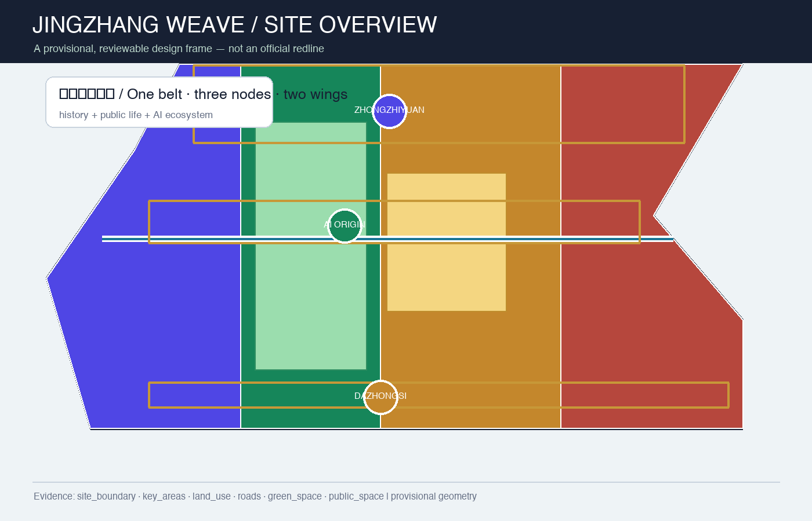
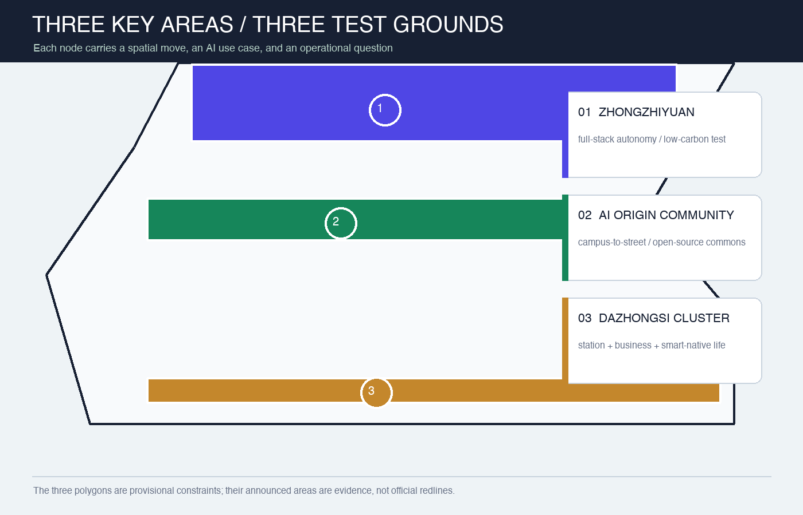
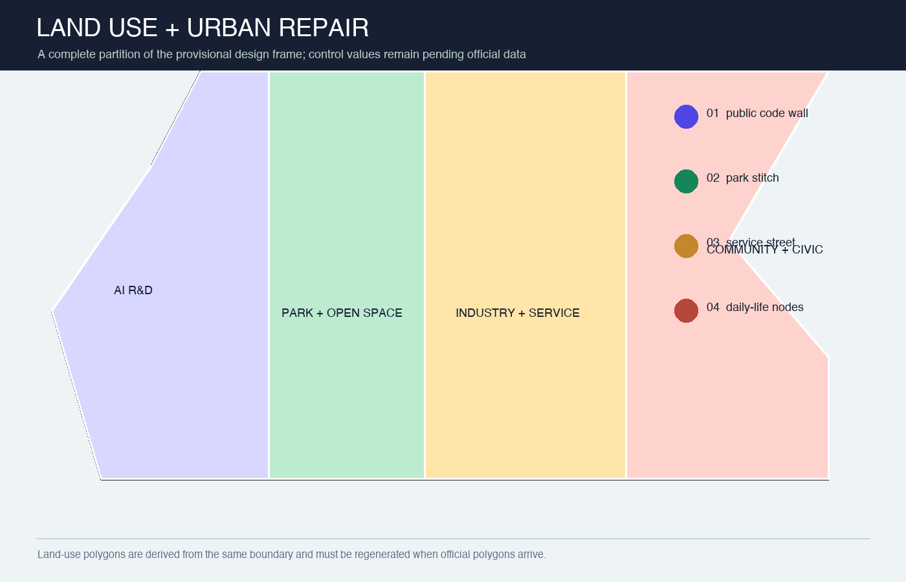
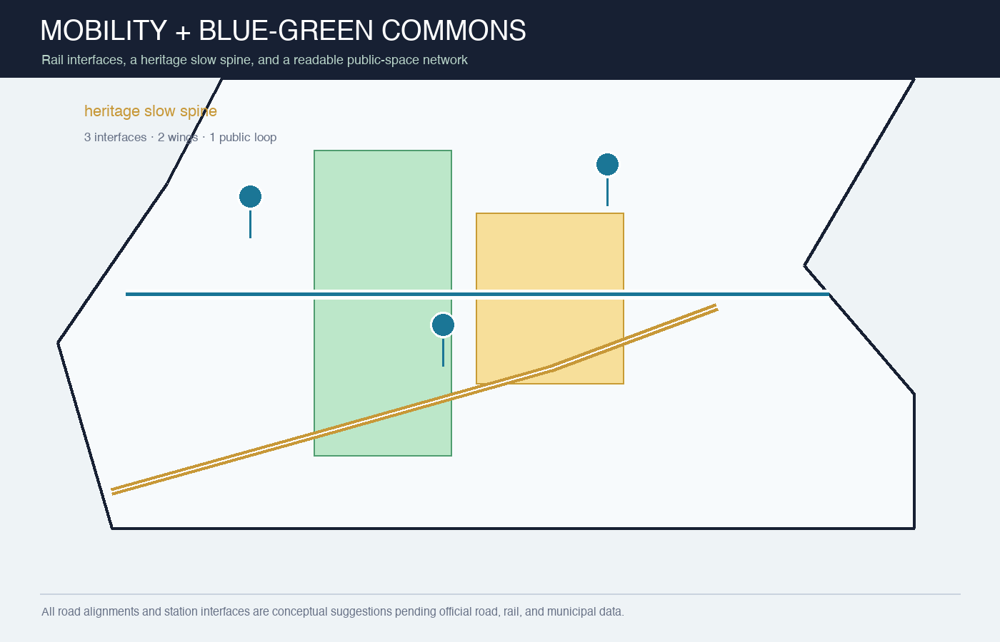
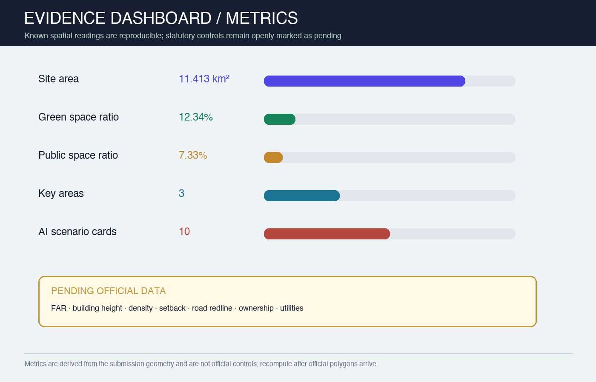

# JINGZHANG WEAVE: A Legible AI Public-Life Belt

> Package status: `professional_design_package` / `ready_for_review` (provisional-boundary intake; recalculate as a whole when official polygons arrive).

## Design Basis and Source List

This proposal translates the official three-level scope, the agent open-call taskbook, and the repository's public-source register into a readable, reproducible, spatially reviewable package. The official boundary, regulatory controls, road redlines, ownership, municipal, and heritage attachments are not yet present in the current site package. Therefore `site_boundary.geojson` and `key_areas.geojson` use the maintainers' provisional rough polygons: they support generation, visualization, discussion, and intake self-check only; they are not official redlines or precise planning controls [source:OFFICIAL-ANNOUNCEMENT] [source:BOUNDARY-SOURCE] [depth:existing_conditions_diagnosis].

The design judgment is to translate the Centennial Jing-Zhang railway from an object to be viewed into a public-life line that can be used every day. A slow-mobility spine links the three innovation nodes; two wings reconnect campus, enterprise, and neighborhood life; AI scenarios are explainable, bookable, and human-reviewed rather than new surveillance interfaces [standard:PROJECT-AGENT-OPEN-CALL-TASKBOOK] [data:geometry/public_space.geojson#PUBLIC-001].

The evidence hierarchy is GeoJSON, `metrics.json`, the three matrices, manifest/source/assumptions/self-check, then the readable narrative, drawings, and HTML. Sources, generation method, rights, and missing conditions are recorded in `sources.json` and `report/copyright_statement.md`.

## Three-Level Scope Framework

The work is organized as “read the belt, weave the whole, test the three nodes.” The coordinated research area is approximately 43.6 km² and addresses the innovation ecosystem, future-city form, and cultural narrative. The overall design area is approximately 11.4 km² and addresses renewal, land use, transport, municipal systems, and the Jingzhang heritage park activity belt. The three key areas total approximately 368.4 ha and receive detailed design concepts. Areas come from the announcement; polygons remain provisional until official data arrives [source:OFFICIAL-ANNOUNCEMENT] [data:geometry/site_boundary.geojson#SITE-001] [depth:three_level_scope_framework].

| Level | Question | Design move | Evidence |
| --- | --- | --- | --- |
| Coordinated research area (about 43.6 km²) | How can the AI value chain coexist with city life? | A cycle of campus origin, open collaboration, enterprise translation, public experience, and global communication | `agent_taskbook.json`, `compliance_matrix.json` |
| Overall design area (about 11.4 km²) | How can industry, renewal, mobility, and public space become spatial? | One belt, three nodes, two wings, two spines, three loops, and distributed scenarios | `land_use.geojson`, `roads.geojson`, `phasing.geojson` |
| Three key areas (about 368.4 ha) | How can the nodes become testable and livable districts? | Full-stack innovation, campus-to-street translation, and smart-native industry life | `key_areas.geojson`, A3/A0 drawings |

## Coordinated Research Area: Industry and Future City Research

### Naming and spatial identity

The name is “Jingzhang Weave,” with the English identity **JINGZHANG WEAVE**. The logo direction is a continuous railway line that crosses three points and becomes a woven pattern: gold for memory, blue-green for public life, and indigo for AI innovation. The visual system uses three components—iso-line, node dot, and evidence card—for wayfinding, events, public code walls, and data stories. This is a conceptual identity direction, not a registered mark or official visual standard [source:AGENT-TASKBOOK] [depth:overall_spatial_structure].

The three positions become three experiences: the **Centennial Jing-Zhang Culture Belt** is memory, walking, and storytelling; the **Urban AI Life Experience Belt** is daily public service, learning, work, and social life; the **AI Integrated Innovation Belt** is an open network from research to enterprise and from algorithms to urban scenarios. Five functions form a loop of research, ecosystem, scenarios, vitality, and governance. Three areas are joined by a Zhongguancun technology-service wing and a Xiaoyuehe scenario-empowerment wing [source:AGENT-TASKBOOK] [standard:PROJECT-AGENT-OPEN-CALL-TASKBOOK].

### Ecosystem mechanisms and global references

The proposal does not invent company lists, investment amounts, or policy commitments. It names public reference mechanisms for professional teams to study further: Helsinki's AI transparency/register practice, Singapore Smart Nation's cross-agency digital public services, Seoul AI Hub's ecosystem services, Barcelona's open urban collaboration, MILA's research-talent-startup network, and London's AI governance and standards discussion. They correspond to transparency, service, space, collaboration, talent, and governance; each import still needs source, rights, fit, and local-management review [source:AGENT-TASKBOOK] [standard:PROJECT-AGENT-OPEN-CALL-TASKBOOK].

## Overall Design Area: Urban Renewal and Regulatory-Plan-Level Urban Design

The spatial structure is “one belt, three nodes, two wings, two spines, three loops, and many points.” The belt is the public-life corridor of the Jingzhang heritage park; the nodes are the three key areas; the wings are technology services and Xiaoyuehe scenario empowerment; the spines are heritage slow mobility and the east-west campus-enterprise-neighborhood connection; the loops are transit access, blue-green public space, and AI experience. History, industry, daily life, and governance become a walkable, explainable, iteratively improvable network [data:geometry/land_use.geojson#LU-001] [data:geometry/roads.geojson#ROAD-001] [depth:overall_spatial_structure].

The land-use structure contains four conceptual zones: AI R&D, park/open space, industry and commercial services, and community/civic support. They are split from the same provisional boundary to avoid gaps or overlaps; the land-use codes refer to the Ministry of Natural Resources classification vocabulary but do not replace the official regulatory plan [standard:MNR-LAND-USE-CLASSIFICATION-GUIDE] [data:geometry/land_use.geojson#LU-001] [depth:land_use_layout].

Renewal follows “public first, space second; light first, structure second.” In the near term, use wayfinding, slow-mobility safety, public code walls, bookable scenarios, and low-impact green repairs. In the medium term, translate low-efficiency spaces, add campus-enterprise service rooms, and improve station interfaces. Only after ownership, heritage, regulatory, fire, municipal, and engineering conditions are confirmed should professionals study building renewal or new construction. The building layer expresses conceptual footprints and renewal types, not demolition or construction conclusions [data:geometry/buildings.geojson#BLDG-001] [depth:retain_renovate_demolish].

## Detailed Design of Key Areas

| Key area | Role | Spatial move | AI / operational test |
| --- | --- | --- | --- |
| Zhongzhiyuan AI Acceleration Area | Garden-like full-stack innovation district | Qinghe interface, low-carbon innovation spine, public safety-governance room, open ground-floor edge | Foundation-model testing, standards workshops, safety evaluation, low-carbon compute experience |
| Beijing AI Origin Community | Campus-to-street translation and talent community | Campus–park–street slow-mobility stitch, open-source hall, translation lounge, talent-life nodes | Open collaboration, demo days, IP/legal support, near-campus incubation |
| Dazhongsi AI Industry Cluster | Urban smart economy and international exchange district | Station integration, four-quadrant walking, smart-device display, mixed business/life frontage | Agent demos, data-element salon, content consumption, international exchange |

All three polygons are provisional constraints; announced areas are task evidence. Each node must be recalibrated with official drawings, ownership, transport, municipal, and heritage conditions by a professional team [data:geometry/key_areas.geojson#PROV-KEY-001] [data:geometry/key_areas.geojson#PROV-KEY-002] [data:geometry/key_areas.geojson#PROV-KEY-003] [depth:three_key_area_detailed_design].

## AI Innovation Ecosystem, Personas, and AI+ Scenarios

### Five user personas

| User | Need | Spatial response | Human boundary |
| --- | --- | --- | --- |
| Open-source developer | Publish, collaborate, test, build reputation | Origin open-source hall and public code wall | No individual trajectories; voluntary aggregate statistics only |
| Startup team | Affordable workspace, compute access, product testing | Zhongzhiyuan test space and service node | Compute and data access requires authorization |
| Enterprise visitor | Display, business, recruiting, global reception | Dazhongsi demo lounge and transit interface | Brand, case, and data rights must be cleared |
| Neighboring resident | Commute, leisure, civic service, low-impact renewal | Heritage slow loop and neighborhood service nodes | Do not use resident profiles for commercial recommendation |
| Student / faculty | Translation, cross-campus collaboration, daily walking | Campus–park–enterprise links and translation stations | Campus data and research outputs require authorization |

### Ten scenario cards and three industry tests

1. **Open-source launch hall** for release, contribution, and model evaluation;
2. **Urban-agent sandbox** for bookable, reversible mobility, service, and maintenance tests;
3. **Slow-mobility gap diagnosis** using public data plus field review;
4. **Talent-life companion** connecting housing, learning, exercise, retail, and social life;
5. **AI safety-governance spine** showing standards, trusted evaluation, and governance;
6. **Campus-enterprise translation lounge** for demos, IP, legal support, and pitches;
7. **Data-element theatre** explaining authorized and auditable data assets;
8. **Low-carbon compute node** showing edge compute, energy, and public service;
9. **Jingzhang memory route** joining railway, Zhongguancun, and AI culture;
10. **Global AI week route** joining developer festivals, open-scene days, demos, and urban walks.

Scenarios 2, 5, and 8 are industry validation cases. They require test protocols, data authorization, human review, exit routes, and professional evaluation; they are not approved operating projects [source:AGENT-TASKBOOK] [data:geometry/public_space.geojson#PUBLIC-001] [depth:municipal_new_infrastructure].

## Land Use, Building Scale, and Retain-Renovate-Demolish Strategy

Land-use polygons fully cover the submitted boundary. The building layer expresses conceptual relations among retained, renewed, new, and pending-confirmation objects. Geometry can reproduce footprint, green-space, public-space, and road readings; FAR, total floor area, height, density, setbacks, and engineering controls remain `unknown` because official regulatory attachments are not in the public site package [standard:MOHURD-CONTROL-DETAILED-PLANNING] [data:geometry/buildings.geojson#BLDG-001] [metric:floor_area_ratio].

The retain-renovate-demolish logic has four levels: retain public memory and usable structures; renovate low-efficiency ground floors and public edges; treat demolition/new construction only as a post-survey option; mark uncertain objects as pending confirmation. Any parcel-specific conclusion requires ownership, survey, heritage, fire, structure, and municipal review by professionals [depth:height_massing_character] [depth:retain_renovate_demolish].

## Transport, Rail, Municipal Infrastructure, and Public Services

The mobility strategy is “rail arrival, slow-mobility distribution, service accessibility.” Station areas should become readable interchange fronts with continuous accessible walking, bicycle parking, local circulation, and public-service links; the road layer expresses conceptual connections, not road redlines. Three interfaces serve external access to Zhongzhiyuan, campus-enterprise walking to AI Origin, and four-quadrant walking at Dazhongsi; the wings add technology services and Xiaoyuehe scenario empowerment [data:geometry/roads.geojson#ROAD-001] [standard:MOHURD-URBAN-DESIGN-MEASURES] [depth:traffic_rail_slow_parking].

New infrastructure follows “explainable, disconnectable, maintainable.” Public nodes may host booking, wayfinding, maintenance reporting, scenario tests, and low-carbon compute displays. Systems involving personal, research, enterprise, or public-safety data require minimization, tiered authorization, human review, and exit routes. Utility capacity, fire safety, stormwater, and energy connections remain pending conditions, not fixed engineering claims [standard:PROJECT-AGENT-OPEN-CALL-TASKBOOK] [depth:municipal_new_infrastructure].

## Blue-Green Network, Public Space, and Urban Character

The Jingzhang heritage park activity belt becomes a “linear living room”: memory points, shade, bookable events, accessible wayfinding, quiet night lighting, and rain gardens form a continuous but calm public experience. Blue-green layers express design intent; the public-space ratio is a reading of this package's geometry, not an official green-space standard [data:geometry/green_space.geojson#GREEN-001] [data:geometry/public_space.geojson#PUBLIC-001] [metric:green_ratio].

The character strategy is “light historical touch, open innovation edges, usable ground floors.” Heritage interfaces should protect signs and views; innovation nodes should support changeable display and night legibility; neighborhood edges should prioritize calm, comfort, and accessibility. Color, material, height, and skyline require official character, heritage, and architectural conditions [standard:MOHURD-URBAN-DESIGN-MEASURES] [depth:blue_green_public_space].

## Renewal Projects, Implementation Policy, and Phasing

| Phase | Concept projects | Preconditions |
| --- | --- | --- |
| P1, years 0–2 | Jingzhang slow-mobility wayfinding, three-node public code walls, scenario booking protocol, accessible gap repairs | Public data, field review, operating agreement |
| P1, years 0–2 | Origin open-source hall, Zhongzhiyuan safety-governance spine, Dazhongsi station-front public lounge | Site permission, event safety, rights clearance |
| P2, years 2–5 | Qinghe low-carbon innovation spine, campus-enterprise translation lounge, data-element salon | Official controls, ownership, municipal, and transport conditions |
| P2, years 2–5 | Blue-green public loop and Xiaoyuehe scenario wing | Water, green-space, slow-mobility, and maintenance coordination |
| P3, after year 5 | Building renewal, integrated service facilities, long-term global AI event nodes | Professional deepening, approvals, funding, and evaluation |

Policy suggestions are five public ledgers: open scenarios, data and rights, public-interest evaluation, human-review logs, and reversible phases. They are co-governance tools, not government commitments. When materials or official boundaries change, update all geometry, metrics, drawings, and changelog before rerunning render, finalize, self-check, and preflight [depth:renewal_project_list] [depth:phasing_implementation].

## Metrics, Area Recalculation, and Compliance Matrix

Current spatial readings are approximately 11,412,825 m² for the provisional overall-design polygon, 12.34% green-space ratio, 7.33% public-space ratio, 310,807 m² building footprint, three key areas, and ten AI scenario cards. They come from the same GeoJSON and formulas and can be recalculated as a whole when official polygons arrive [metric:site_area_sqm] [metric:green_ratio] [metric:public_space_ratio].

Pending official data includes FAR, total floor area, building height, density, setbacks, road redlines, ownership, and municipal capacity. `compliance_matrix.json` covers announcement sections 1.3, 1.4, 1.5 and `agent.1`–`agent.6`; `standard_matrix.json` covers professional standards; all fifteen formal depth items are recorded as complete evidence responses, while provisional geometry still requires replacement and review [metric:floor_area_ratio] [depth:metrics_recalculation] [source:SOURCE-REGISTRY].

## Risk, Copyright, and Compliance

The primary risk is misreading the provisional polygons as official redlines. The narrative, HTML, drawings, and self-check therefore label them explicitly; when official polygons arrive, the complete package must be recalculated rather than swapping one file. AI scenarios also carry privacy, bias, false-positive, cybersecurity, and operational-responsibility risks. Public scenarios require data minimization, explainability, human review, appeal, and exit routes; individual profiling or mandatory collection is not a design requirement [depth:risk_missing_data] [data:geometry/constraints.geojson#CONSTRAINTS].

Figures are generated locally with Python/Pillow and system fonts. The package uses repository public/cleared material and self-drawn graphics only; it uses no commercial map tiles, unauthorized people/company marks, private material, or remote resources. PDFs, PNGs, and HTML are explanation layers; GeoJSON, metrics, and matrices are evidence layers. This is an AI-agent open co-creation concept, not government approval, a regulatory plan, engineering design, investment commitment, or built project [source:AGENT-TASKBOOK].

## References

- Beijing Haidian Branch of the Beijing Municipal Commission of Planning and Natural Resources, official pre-qualification announcement;
- `brief/site-package/design_brief.json`, `allowed_design_space.json`, and `agent_taskbook.json`;
- `data/source_registry.json` and `data/processed/agent_fact_pack.md`;
- local reference snapshots under `brief/site-package/standards/references/`;
- this package's `geometry/`, `metrics.json`, `sources.json`, `assumptions.json`, and three evidence matrices.
- The machine-readable source registry and use boundaries are recorded at [source:SOURCE-REGISTRY].
