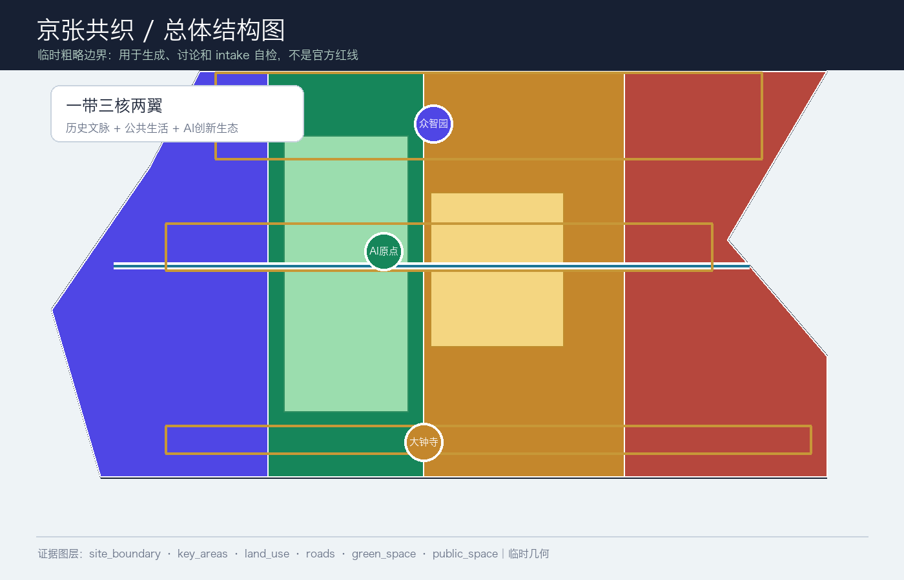
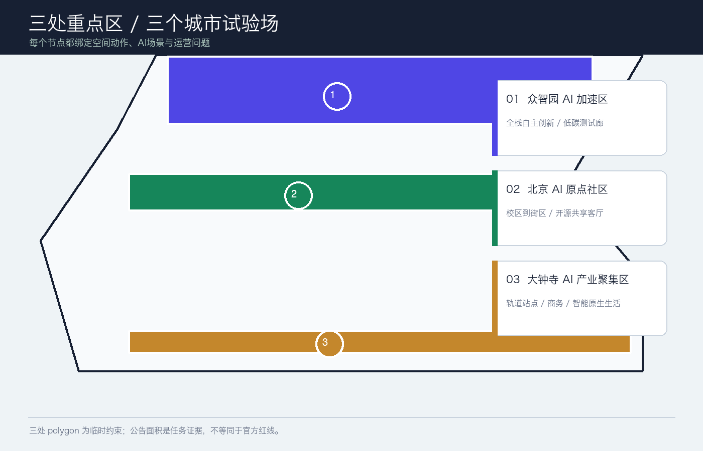
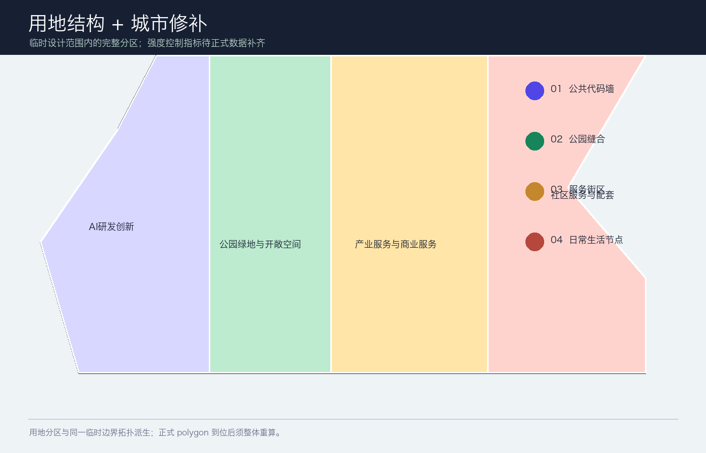
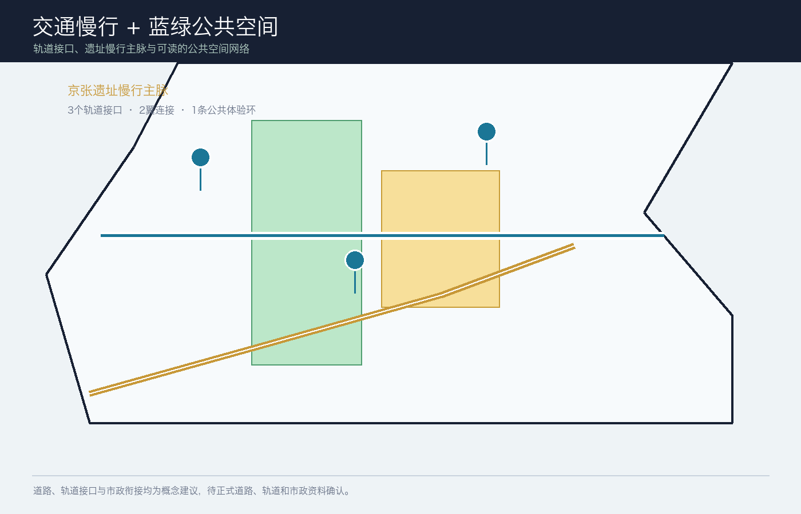
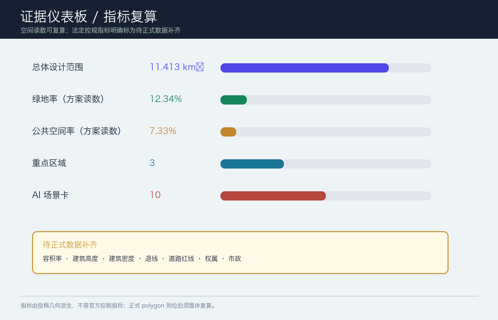

# 京张共织：可感知的AI公共生活带

> 参赛包状态：`professional_design_package` / `ready_for_review`（临时边界 intake；正式 polygon 到位后整体复算）

## 设计依据与资料清单

本方案把公告确定的三层工作范围、面向智能体任务书和仓库公开资料登记表转成可阅读、可复算、可空间复核的设计包。正式边界、控规条件、道路红线、权属、市政和文保附件尚未公开进入当前 site package，因此 `site_boundary.geojson` 与 `key_areas.geojson` 采用维护者提供的临时粗略 polygon；它们只承担生成、展示、讨论和 intake 自检，不表达官方红线或精确规划控制 [source:OFFICIAL-ANNOUNCEMENT] [source:BOUNDARY-SOURCE] [depth:existing_conditions_diagnosis]。

设计判断是：把百年京张从一条“被观看的遗址线”转译为一条“可被日常使用的公共生活线”。公共慢行主脉把三处创新节点串起来；两翼将高校策源、企业服务和社区生活接入；AI 场景以可解释、可预约、人工复核为边界，服务真实的人而不是制造新的监控界面 [standard:PROJECT-AGENT-OPEN-CALL-TASKBOOK] [data:geometry/public_space.geojson#PUBLIC-001]。

本包的权威层级依次是 GeoJSON、`metrics.json`、三类矩阵、manifest/source/assumptions/self-check；正文负责解释设计判断，图纸和 HTML 负责让人快速看懂。所有外部来源、生成方法、版权和待补条件均写入 `sources.json` 与 `report/copyright_statement.md`。

## 三层范围工作框架

方案将工作分为“看清一带、织好总体、验证三核”三步。统筹研究范围约 43.6 km²，负责产业生态、未来城市和文化叙事；总体设计范围约 11.4 km²，负责城市更新、用地结构、交通市政和京张遗址公园活力带；重点区域约 368.4 ha，负责三个节点的详细设计。面积数字来自公告，空间 polygon 在正式资料到位前保持 provisional [source:OFFICIAL-ANNOUNCEMENT] [data:geometry/site_boundary.geojson#SITE-001] [depth:three_level_scope_framework]。

| 层级 | 关键问题 | 方案动作 | 主要证据 |
| --- | --- | --- | --- |
| 统筹研究范围（约43.6 km²） | AI 产业链如何与城市生活共生？ | 形成“高校策源—开源协作—企业转化—公共体验—国际传播”的创新链 | `agent_taskbook.json`、`compliance_matrix.json` |
| 总体设计范围（约11.4 km²） | 产业、更新、交通和公共空间如何落地？ | 一带三核两翼、双脉三环、多点场景；用地分区完整覆盖临时边界 | `land_use.geojson`、`roads.geojson`、`phasing.geojson` |
| 三处重点区（公告合计约368.4 ha） | 节点如何成为可测试、可体验的街区？ | 分别承担全栈创新、近校转化、智能原生产业生活 | `key_areas.geojson`、A3/A0 图纸 |

## 统筹研究范围产业与未来城市研究

### 命名与空间识别

主名称为“京张共织”，英文名为 **JINGZHANG WEAVE**。Logo 方向是“一条连续铁路线在三个节点处交叉成织点”：金色代表历史与记忆，蓝绿色代表公共生活，靛色代表 AI 创新。视觉系统建议采用等距线、站点圆点和“可读证据卡”三类基本组件，形成导视、活动、数据故事和公共代码墙的共同语言。这是品牌与空间识别的概念建议，不是注册商标或官方视觉规范 [source:AGENT-TASKBOOK] [depth:overall_spatial_structure]。

三大定位被转成三种可感知的体验：**百年京张文化带**是记忆、步行和讲述；**都市 AI 生活体验带**是每天可用的公共服务、学习、工作与社交；**AI 融合创新带**是从科研到企业、从算法到场景的开放测试网络。五大功能用“研发—生态—场景—活力—治理”串成回路；三区两翼为“众智园 AI 自主创新加速区—北京 AI 原点社区—大钟寺 AI 产业聚集区”，加上“中关村科技服务翼”和“小月河场景赋能翼” [source:AGENT-TASKBOOK] [standard:PROJECT-AGENT-OPEN-CALL-TASKBOOK]。

### 生态机制与全球参考

本方案不编造企业名单、投资额或政策承诺，只提取公开案例可供专业团队继续研究的机制：Helsinki 的 AI 透明度/登记机制、Singapore Smart Nation 的跨部门数字公共服务、Seoul AI Hub 的创新生态服务、Barcelona 的开源城市协作、MILA 的研究—人才—创业网络、London 的 AI 治理与标准讨论。它们分别对应“透明、服务、空间、协作、人才、治理”六个可转化问题；具体导入前仍需逐项核实来源、许可、适配性和本地管理边界 [source:AGENT-TASKBOOK] [standard:PROJECT-AGENT-OPEN-CALL-TASKBOOK]。

## 总体设计范围城市更新与控规深度城市设计

总体结构建议为“一带、三核、两翼、双脉、三环、多点”：一带是京张遗址公园公共生活带；三核是三处重点区；两翼是科技服务与小月河场景赋能；双脉是遗址慢行主脉与东西向校企社区连接脉；三环是轨道接驳环、蓝绿公共环、AI 场景体验环。它把历史、产业、生活和治理放在一个可步行、可解释、可持续迭代的网络中 [data:geometry/land_use.geojson#LU-001] [data:geometry/roads.geojson#ROAD-001] [depth:overall_spatial_structure]。

用地结构采用四类概念分区：AI 研发创新、公园绿地与开敞空间、产业服务与商业服务、社区服务与配套。它们以同一临时边界切分，避免相邻 polygon 独立手绘造成缝隙或重叠；用地代码与语义参照自然资源部用地分类指南，但不替代正式控规 [standard:MNR-LAND-USE-CLASSIFICATION-GUIDE] [data:geometry/land_use.geojson#LU-001] [depth:land_use_layout]。

更新策略是“先公共、后空间；先轻量、后结构”：近期先做导视、慢行安全、公共代码墙、可预约场景和低扰动绿地修补；中期推进低效空间的功能置换、校企服务客厅和轨道站点界面；长期才在正式权属、文保、控规、消防、市政与工程条件明确后，由专业团队研究建筑更新或新建。建筑图层表达的是概念基底与更新类型，不构成拆迁、改造或工程结论 [data:geometry/buildings.geojson#BLDG-001] [depth:retain_renovate_demolish]。

## 重点区域详细设计

| 重点区 | 设计角色 | 空间动作 | AI / 运营测试 |
| --- | --- | --- | --- |
| 众智园 AI 自主创新加速区 | 花园型全栈创新街区 | 清河界面、低碳创新廊、可参观的安全治理客厅、面向对外交通的首层开放界面 | 自主模型测试、标准工作坊、安全评测展示、低碳算力体验 |
| 北京 AI 原点社区 | 近校型成果转化与人才社区 | 校区—园区—街区慢行缝合、开源发布厅、成果转化客厅、人才生活服务节点 | 开源协作、成果发布、知识产权/法务咨询、近校孵化 |
| 大钟寺 AI 产业聚集区 | 城市型智能经济与国际交往街区 | 轨道站点一体化、路口四象限步行连通、智能终端展示、商务与消费复合界面 | 智能体路演、数据要素会客厅、内容消费、国际交流 |

三个重点区的 polygon 都是临时约束，公告面积仅用于任务核对。每个节点都应由专业团队用正式图纸、权属、交通、市政和文保条件重新校准 [data:geometry/key_areas.geojson#PROV-KEY-001] [depth:three_key_area_detailed_design]。

## AI 创新生态、人才画像与 AI+ 场景

### 五类用户画像

| 用户 | 关键需求 | 空间回应 | 人本边界 |
| --- | --- | --- | --- |
| 开源开发者 | 发布、协作、测试、贡献声誉 | 原点社区开源发布厅、公共代码墙 | 不采集个人轨迹；只做自愿、聚合统计 |
| 初创团队 | 低成本办公、算力入口、产品试验 | 众智园测试场、服务驿站 | 算力与数据服务须另行授权 |
| 头部企业访客 | 展示、商务、招聘、国际接待 | 大钟寺路演客厅、轨道接驳界面 | 企业标识、案例和数据需清权 |
| 周边居民 | 通勤、休闲、社区服务、低扰动更新 | 遗址慢行环、社区服务节点 | 不把居民画像用于商业推荐 |
| 高校师生 | 成果转化、跨校协作、日常慢行 | 校园—园区连接、成果转化驿站 | 校园数据与科研成果需授权 |

### 十张场景卡与三类产业测试

1. **开源发布厅**：成果发布、代码贡献和模型评测；
2. **城市智能体沙盒**：在可预约、可回滚的空间测试交通、服务和运维智能体；
3. **慢行断点诊断**：用公开数据和现场人工复核识别无障碍、拥挤和断点；
4. **人才生活管家**：连接居住、学习、运动、消费和社交服务；
5. **AI 安全治理廊**：展示标准制定、可信评测和安全治理流程；
6. **校企转化客厅**：支撑成果发布、知识产权、法务和路演；
7. **数据要素剧场**：以可授权、可审计方式解释数据资产与数字内容；
8. **低碳算力驿站**：展示端侧算力、能源与公共服务的组合原型；
9. **京张记忆线路**：串联铁路、中关村和 AI 新文化；
10. **全球 AI 活动周路线**：把开发者节、开放场景日、竞赛路演和城市体验组织成可步行路线。

其中 2、5、8 是产业测试验证场景：它们需要测试协议、数据授权、人工复核、退出机制和专业团队评估，不是已批准的运营项目 [source:AGENT-TASKBOOK] [data:geometry/public_space.geojson#PUBLIC-001] [depth:municipal_new_infrastructure]。

## 用地、建筑规模与拆改留方案

用地分区完整覆盖提交边界，建筑图层用于表达保留、更新、新建和待确认对象的概念关系。当前可由几何复算建筑基底、绿地、公共空间和道路等空间读数；容积率、总建筑规模、建筑高度、建筑密度、退线和工程控制均保持 `unknown`，因为官方控规附件未进入公开 site package [standard:MOHURD-CONTROL-DETAILED-PLANNING] [data:geometry/buildings.geojson#BLDG-001] [metric:floor_area_ratio]。

拆改留采用四级判读：保留公共记忆与可继续使用的建筑；改造低效首层和公共界面；拆除/新建仅作为待正式调查后的备选；无法判断的对象标为待确认。任何具体地块的拆改结论都必须待权属、现状测绘、文保、消防、结构和市政资料核实后，由专业团队深化 [depth:height_massing_character] [depth:retain_renovate_demolish]。

## 交通、轨道、市政与公共服务设施

交通策略是“轨道到达—慢行分配—服务可达”。建议将轨道站点周边做成可读的换乘前厅，建立连续无障碍步行、骑行停放、微循环和公共服务接驳；道路图层仅表达概念联系，不代表道路红线。三条接口分别服务众智园对外到达、AI 原点校企慢行、大钟寺站四象限步行；两翼补充中关村科技服务和小月河场景赋能 [data:geometry/roads.geojson#ROAD-001] [standard:MOHURD-URBAN-DESIGN-MEASURES] [depth:traffic_rail_slow_parking]。

新型基础设施建议采用“能解释、可断开、可维护”的原则：公共服务节点可承载预约、导视、设施报修、场景测试和低碳算力展示；涉及个人信息、科研数据、企业数据和公共安全的系统必须最小化采集、分级授权、人工复核并提供退出机制。市政管线、容量、消防、雨洪和能源接入均为待核实条件，不写成已确定工程 [standard:PROJECT-AGENT-OPEN-CALL-TASKBOOK] [depth:municipal_new_infrastructure]。

## 蓝绿空间、公共空间与城市风貌

京张遗址公园活力带建议被组织为“可停留的线性客厅”：遗址讲述点、树荫座椅、可预约展演、无障碍导视、低干扰夜间照明和雨水花园形成连续但不喧闹的公共体验。蓝绿图层表达的是方案空间意向，公共空间比例为本包几何读数，不是城市绿地率或法定指标 [data:geometry/green_space.geojson#GREEN-001] [data:geometry/public_space.geojson#PUBLIC-001] [metric:green_ratio]。

城市风貌建议“历史材料轻触、创新界面开放、首层连续可用”：遗址邻近界面控制标识与视线，创新节点采用可变展陈和夜间可读性，社区界面优先安静、舒适和无障碍。色彩、材质、建筑高度和天际线仍需正式风貌控制、文保和建筑设计条件确认 [standard:MOHURD-URBAN-DESIGN-MEASURES] [depth:blue_green_public_space]。

## 更新项目清单、实施政策与分期计划

| 阶段 | 概念项目 | 先决条件 |
| --- | --- | --- |
| P1 0—2年 | 京张慢行导视、三核公共代码墙、AI 场景预约协议、无障碍断点修补 | 公开数据、现场复核、运营共识 |
| P1 0—2年 | 原点开源发布厅、众智园安全治理廊、大钟寺站前公共客厅 | 场地许可、活动安全与版权清权 |
| P2 2—5年 | 清河低碳创新廊、校企转化客厅、数据要素会客厅 | 正式控规、权属、市政和交通条件 |
| P2 2—5年 | 蓝绿公共环与小月河场景赋能翼 | 水务、绿地、慢行与运维协同 |
| P3 5年以后 | 建筑更新、综合服务设施、国际 AI 活动长期节点 | 专业深化、审批、资金与实施评估 |

政策建议是建立“开放场景清单、数据与版权清单、公共利益评估、人工复核台账、阶段性回滚机制”五本账；它们是共建治理工具，不是政府承诺。每次材料或正式边界更新时，应同步修改全部几何、指标、图件和 changelog，再运行渲染、finalize、自检和 preflight [depth:renewal_project_list] [depth:phasing_implementation]。

## 指标体系、面积复算与合规矩阵

当前空间读数：临时总体设计 polygon 约 11,412,825 m²；绿地率读数 12.34%；公共空间率读数 7.33%；建筑基底约 310,807 m²；重点区 3 处；AI 场景卡 10 张。它们分别来自同一组 GeoJSON 与公式，便于官方 polygon 到位后整体重算 [metric:site_area_sqm] [metric:green_ratio] [metric:public_space_ratio]。

待正式数据补齐的指标包括容积率、总建筑面积、建筑高度、建筑密度、退线、道路红线、权属和市政容量。`compliance_matrix.json` 覆盖公告 1.3、1.4、1.5 与 `agent.1`—`agent.6`；`standard_matrix.json` 覆盖专业标准；`design_depth_matrix.json` 的十五项 formal 深度均以 complete 记录设计证据，但 provisional geometry 仍需正式资料替换后复核 [metric:floor_area_ratio] [depth:metrics_recalculation] [source:SOURCE-REGISTRY]。

## 风险、版权与合规说明

最大风险是把临时 polygon 误读为官方红线。因此全文、HTML、图纸和自检均显式标注 provisional；正式 polygon 到位后必须整体重算，不能只替换一个文件。其次是 AI 场景的隐私、偏见、误报、网络安全和运维责任；每个公共场景均应以最小化数据、可解释输出、人工复核、申诉和退出机制为前提，不以个人画像或强制采集作为必要条件 [depth:risk_missing_data] [data:geometry/constraints.geojson#CONSTRAINTS]。

本包图件由本地 Python/Pillow 生成，字体使用系统字体，仅使用仓库公开/清权资料和本包自绘图形；没有使用商业地图瓦片、未授权人物/企业标识、私人资料或远程资源。PDF、PNG、HTML 是解释层，GeoJSON、metrics 和矩阵是证据层。方案为 AI agent 的开放共创建议，不是政府批准、控规成果、工程设计、投资承诺或已建成项目 [source:AGENT-TASKBOOK]。

## 参考资料

- 北京市规划和自然资源委员会海淀分局：《百年京张AI创新带城市设计国际方案征集资格预审公告》；
- `brief/site-package/design_brief.json`、`allowed_design_space.json`、`agent_taskbook.json`；
- `data/source_registry.json` 与 `data/processed/agent_fact_pack.md`；
- `brief/site-package/standards/references/` 中的城市设计、控规、用地分类、AI 服务和无障碍参考快照；
- 本提交包的 `geometry/`、`metrics.json`、`sources.json`、`assumptions.json` 和三类矩阵。
- 机器可读来源索引与用途边界见 [source:SOURCE-REGISTRY]。
