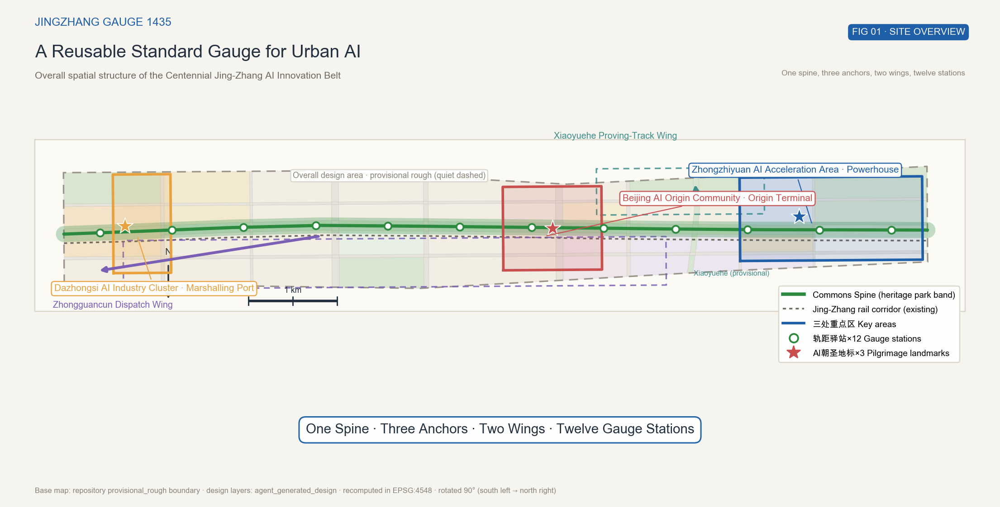
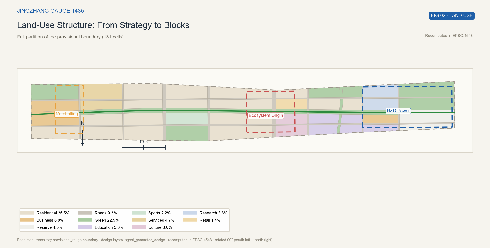
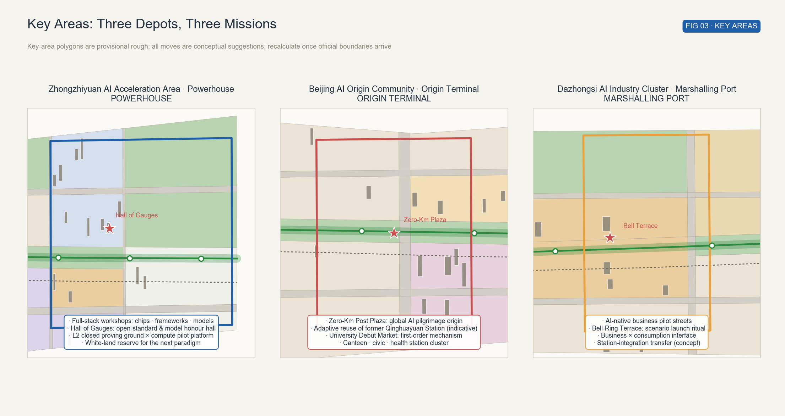
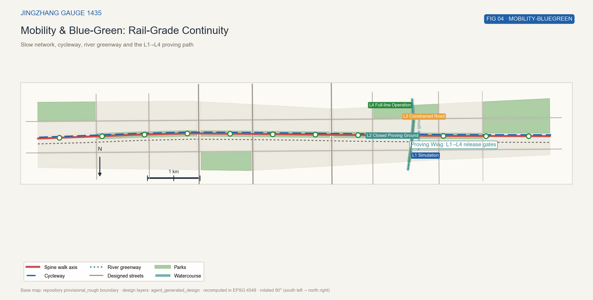
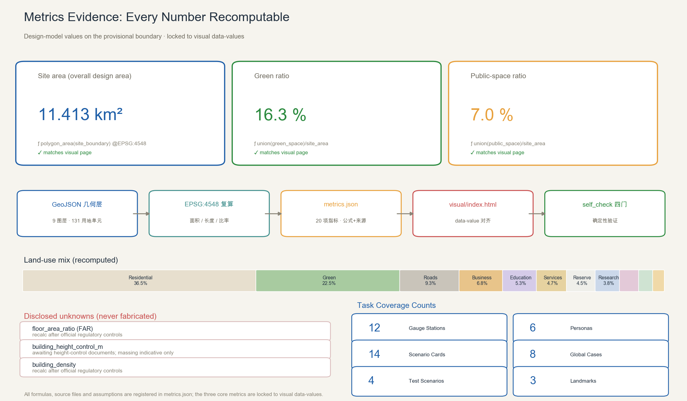

# Jingzhang Gauge 1435: Laying a Reusable Standard for Urban AI

> **The plan in one sentence (brand metaphor)**: opened in 1909, the Jing-Zhang Railway was the first mainline railway independently surveyed, designed and built by China, adopting the 1435 mm standard gauge (historical fact, source: GAUGE-HIST-CONTEXT in References). The plan takes this as its narrative starting point and distils the "standard gauge" into a brand metaphor — a visible, measurable, reusable set of spatial, scenario, testing and governance standards for urban AI. **When gauges agree, every train can run.**

This proposal is an open co-creation recommendation for the Centennial Jing-Zhang AI Innovation Belt urban design open call. All spatial recommendations are conceptual suggestions and reference schemes for professional teams to deepen; they do not replace statutory planning or constitute government approval. All conclusions are based on the repository's provisional rough boundary and must be recalculated once official polygons are published [source:OFFICIAL-ANNOUNCEMENT] [source:BOUNDARY-SOURCE].

## Design Basis and Source List

The plan stands on three layers of material, with explicit usability boundaries.

**Layer 1 — official and taskbook documents.** The pre-qualification announcement of 9 May 2026 by the Haidian Branch of the Beijing Municipal Planning and Natural Resources Commission fixes the three scope levels (coordinated research ≈ 43.6 km², overall design ≈ 11.4 km², key areas ≈ 368.4 ha in total), the names and north–south order of the three key areas, and all design tasks 1.3/1.4/1.5 [source:OFFICIAL-ANNOUNCEMENT]. The agent-facing open-call taskbook provides the three positioning statements, five functions, three-areas-two-wings structure, six mandatory tasks (agent.1–agent.6), ten charter principles and the unified boundary clause; this proposal responds to each item in the narrative and in the compliance matrix [source:AGENT-TASKBOOK].

**Layer 2 — repository spatial data package.** No official precise red lines exist yet for the overall design area or the three key areas, so all design layers are generated from the repository's provisional rough boundary (provisional_rough). That boundary may be used only for AI generation, visualization and intake self-check — never as an official redline, approval basis or precise-area basis [source:BOUNDARY-SOURCE]. Land-use codes follow the project subset of the national Land Spatial Use Classification Guide [source:MNR-LAND-USE-CODES].

**Layer 3 — public background material.** The engineering history of the Jing-Zhang Railway (1905–1909, chief engineer Zhan Tianyou, 1435 mm standard gauge) is used only as cultural-narrative background and supports no spatial or area judgement [source:GAUGE-HIST-CONTEXT].

Data gaps and handling: official boundary, regulatory controls (FAR, height, density, controlled green ratio), heritage protection scopes, existing buildings and ownership, and municipal capacities are unpublished. Every conclusion depending on them is registered as "pending official data"; the corresponding metrics are marked unknown with explicit recalculation triggers — never replaced by placeholder numbers [depth:risk_missing_data].

## Three-Level Scope Framework

The three levels form the working skeleton: the **coordinated research area** (≈ 43.6 km²) carries industry strategy and future-city research; the **overall design area** (≈ 11.4 km² per announcement; 11.413 km² recalculated from the provisional boundary) carries regulatory-plan-level urban design; the **key area level** (≈ 368.4 ha per announcement) carries detailed design of the three key areas [data:geometry/site_boundary.geojson#SITE-001].

The levels transmit "strategy → structure → scenarios": the research layer answers what ecological niche the belt needs; the overall layer translates the answer into the "one spine, three anchors, two wings, twelve stations" structure; the key-area layer deepens the structure into experienceable project packages in three depots [depth:three_level_scope_framework].

Disclosure: the submitted overall and key-area boundaries are provisional rough polygons whose recalculated areas deviate slightly from the announcement figures (overall ≈ +0.11%, key areas ≈ +0.24%). Once official polygons are published, the boundary, partition, green/public-space layers and all area metrics must be replaced and recalculated; this organizer-side data gap does not block content scoring [metric:site_area_sqm] (recalculation trigger registered in assumptions.json: A-BOUNDARY-PROV-001).

## Coordinated Research Area: Industry and Future City Research

### Naming System and Logo Direction

**Chinese name: 京张轨距 (Jingzhang Guiju)**; **English name: Jingzhang Gauge 1435** (short: GAUGE 1435).

Naming logic (brand-narrative distillation, not causal history): the Jing-Zhang Railway was the first mainline railway independently surveyed, designed and built by China, adopting the 1435 mm standard gauge [source:GAUGE-HIST-CONTEXT]. The plan distils two images from this history — **a unified standard** and **indigenous innovation solving a hard problem** — as the source of the gauge metaphor; the metaphor supports no factual judgement. Urban AI faces the same dual task — full-stack autonomy and open interoperability. The name merges them into one sentence: **when gauges agree, every train can run** [source:GAUGE-HIST-CONTEXT] [source:AGENT-TASKBOOK].

The naming system is layered: the main axis is the **Commons Spine**; the three key areas are aliased **Powerhouse** (Zhongzhiyuan), **Origin Terminal** (Beijing AI Origin Community) and **Marshalling Port** (Dazhongsi); the two wings are the **Dispatch Wing** (Zhongguancun technology-service wing) and the **Proving-Track Wing** (Xiaoyuehe scenario wing); twelve public-service nodes along the spine are uniformly named **Gauge Stations GS-01…12**.

**Logo direction**: a negative-space design based on a pair of parallel rails that merge into one switch at the left; the negative space forms a "人" (human) figure and a caliper scale reading 1435. Monochrome and reversible; the twin-rail relationship survives the minimum size. The dynamic version borrows the railway **split-flap display**: characters flip like a station board, evoking both commit histories and timetables. The visual system adds a **signal-colour code** — green (LIVE), amber (PROVING), red (MAINTENANCE), grey (RETIRED) — for scenario status boards and station wayfinding, making urban-AI states as readable as railway signals. Naming and visual identity are design directions; professional deepening and rights checks precede any official use [standard:PROJECT-AGENT-OPEN-CALL-TASKBOOK].

### Translating the Three Positionings, Five Functions, Three Areas and Two Wings

The three positionings become three "tracks": the **centennial heritage belt** maps to the Commons Spine (the heritage park band as cultural base); the **urban AI-life experience belt** maps to the scenario track (stations and scenario cards woven into daily life); the **AI fusion-innovation belt** maps to the power track (full-stack innovation in three anchors) [source:OFFICIAL-ANNOUNCEMENT].

The five functions are placed as five "yards": full-stack AI innovation in the Powerhouse; a world-class ecosystem in the Origin Terminal; the AI+ scenario paradigm on the Proving Track; an intelligently vibrant city in the Marshalling Port and the station network; global governance voice in the four gauge standards themselves and the annual **Gauge Summit** [source:AGENT-TASKBOOK].

### Four Gauges: The Core Mechanism

"Gauge" is not rhetoric here but four implementable standard families:

1. **Spatial Gauge** — a public-space component library: a uniform station module (15 m × 24 m bay), accessibility and low-speed robot clearances (suggested values: ≥ 1.8 m clear width, kerb ramps, robot bays — **concept design parameters of this plan**, to be verified against the statutory requirements of the Barrier-Free Environment Law and professional standards before adoption), signage and signal-colour rules. Every renewal project is "laid to gauge", cutting design and approval costs [standard:BARRIER-FREE-ENVIRONMENT-LAW].
2. **Scenario Gauge** — the five-element scenario-card rule: any scenario entering public space must publicly declare **data source, privacy boundary, human review, exit mechanism and operator**; no declaration, no departure. The five elements are a **concept-proposed rule layered on top of** existing legal compliance under the Interim Measures for Generative AI Services — not a direct statutory requirement — offered for adoption or revision by the organizer and operators [standard:GENERATIVE-AI-INTERIM-MEASURES].
3. **Proving Gauge** — four release gates, L1 simulation sandbox → L2 closed proving ground → L3 constrained public roads → L4 full-line operation, spatialised along the proving wing with a signal status board per scenario.
4. **Governance Gauge** — reversible governance rules: switches (services can be swapped), block sections (privacy-protected intervals), signals (public status boards), re-railing (rollback plans); maintained by the "Track Maintenance Section", a cross-department social review board.

### Global AI Innovation Ecosystem Cases

Eight global cases inform the mechanism design (public sources, mechanism learning only) [metric:global_case_count]:

| Case | Mechanism | Translation into this plan |
| --- | --- | --- |
| London King's Cross | Rail-heritage station-district renewal; public space first | Heritage park band first; station system anchors daily flows |
| New York High Line | Linear heritage catalysing value along the line | The spine strings three anchors; land value feeds renewal |
| Singapore Punggol Digital District | Planned digital district + enterprise testbeds | The L2–L3–L4 proving path of the proving wing |
| Estonia e-Estonia | Nation-scale digital-governance sandbox and legal experimentation | A national model for the governance gauge: law first, test everywhere |
| Singapore AI Verify | National AI testing framework and governance benchmark | International benchmark for the proving gauge: mutual recognition path |
| Dubai Future Accelerators | Government scenario openness + enterprise acceleration | Scenario-gauge conversion: government scenarios as orders |
| Toronto Sidewalk Labs (terminated) | Negative case: governance and privacy trust failure | Governance gauge first: privacy blocks + public status + exits |
| Hangzhou City Brain | City-scale AI governance starting from traffic | Traffic and civic-service scenarios as first departures |

### Regional Synergy Loop

The belt is not an island: south to Xizhimen and Financial Street; east along Xueyuan Road to the Zhongguancun East and North Fourth Ring industry belt; north via Qinghe hub toward Future Science City (directional suggestion, no travel-time commitment); along the Jing-Zhang HSR corridor toward Yanqing and Zhangjiakou — Zhangjiakou being one of the regional hub nodes in the national integrated computing-network layout (public background, see [source:XIBU-COMPUTE-CONTEXT]; the organizer should verify against the latest planning documents), suggesting a "western compute supply, Haidian R&D conversion" Beijing-Tianjin-Hebei loop; Huairou Science City and the E-Town are linked through existing mechanisms such as the Zhongguancun Forum; with existing residential communities in and around the belt (e.g., the Beiwei community), a standing interface of "station service lists + scenario pilot consultation" is suggested (quarterly consultation, pre-launch publication).

## Overall Design Area: Urban Renewal and Regulatory-Plan-Level Urban Design

### Structure: One Spine, Three Anchors, Two Wings, Twelve Stations

**One spine**: the Commons Spine, a continuous slow-traffic public band along the Jing-Zhang railway corridor, ≈ 9.7 km within the provisional boundary [metric:spine_length_m]. The band is an ≈ 110 m wide heritage-park band stringing twelve Gauge Stations — the spatial overlap of all three positionings [data:geometry/roads.geojson#RD-011].

**Three anchors**: the three key areas act as three "yards" — Powerhouse (north), Origin Terminal (centre), Marshalling Port (south) — detailed in the key-areas chapter [data:geometry/key_areas.geojson#KEY-001].

**Two wings**: the Zhongguancun technology-service wing (**Dispatch Wing**) provides capital, IP and professional services; the Xiaoyuehe scenario wing (**Proving-Track Wing**) hosts the L1–L4 testing path along the river green band — the departure zone where scenarios move from lab to city [data:geometry/roads.geojson#RD-013].

**Twelve stations**: Gauge Stations are distributed along the spine at ≈ 800 m service radii. Each station combines a standard bay, a scenario slot and a public status board, bundling civic, health, wayfinding and compute-reservation services — the minimal unit through which AI scenarios enter daily life [metric:gauge_station_count] [data:geometry/public_space.geojson#PUB-004].

### Land Use and Functional Mix

The overall area is partitioned into 131 land-use cells fully covering the provisional boundary with no gaps or overlaps, coded in the national classification subset [data:geometry/land_use.geojson#LU-001] [depth:land_use_layout]. Recalculated mix: residential ≈ 36.5%, green & open space ≈ 22.5%, business/finance ≈ 6.8%, roads ≈ 9.3%, research ≈ 3.8%, education ≈ 5.3%, sports ≈ 2.2%, culture ≈ 3.0%, reserve (white) land ≈ 4.5%, remainder commerce and other services [metric:site_area_sqm].

Structural logic: housing and education form the stable urban base; green bands follow the spine and the river; research and business cluster in the three anchors; four district parks fill service gaps; white land is reserved for the uncertain needs of the next AI paradigm — **white land is the gauge's tolerance gap**.

### Renewal Framework

The framework reads "lay track — marshal — release": first lay the spine and stations (public space first), then marshal industry and scenarios in the three yards, finally release line by line under the proving gauge. All renewal objects and intensities are conceptual; parcel-level retain-renovate-demolish conclusions await ownership and existing-building data [depth:retain_renovate_demolish].

## Detailed Design of Key Areas

The three provisional key-area polygons total ≈ 369.3 ha recalculated (announcement ≈ 368.4 ha) [metric:key_detailed_design_area_sqm]. Each mini-scheme follows "positioning — structure — building renewal — slow traffic — public space — AI scenarios — risks"; boundaries are provisional rough, conclusions directional [data:geometry/key_areas.geojson#KEY-001] [depth:three_key_area_detailed_design].

### Zhongzhiyuan AI Acceleration Area · Powerhouse (≈ 192 ha)

**Positioning**: the heart of the full-stack autonomous innovation system — a powerhouse where chips, frameworks and models cooperate [source:AGENT-TASKBOOK].

**Structure**: "one loop, three yards" — a full-stack workshop loop linking the Chip Yard, Framework Yard and Model Yard around the **Hall of Gauges** — the plan's second AI pilgrimage landmark: an "honour depot" for open standards and open-source models where global developers synchronise their clocks. **Building renewal**: a conceptual mix of new research clusters and adaptive reuse with large-floorplate labs and pilot-bay buildings; **concept heights step down along the loop (80 m → 24 m)**, massing indication only, height controls pending [data:geometry/buildings.geojson#BLD-001]. **Slow traffic**: stations GS-11/12 link buses and a future rail-transfer point (concept); an internal robot-logistics loop (≤ 15 km/h concept) serves the three yards. **Public space**: the Hall of Gauges forecourt hosts launches and gatherings; the L2 closed proving ground and compute pilot platform sit on the north-east white-land block. **AI scenarios**: T02 city-governance model sandbox (L2) and T04 open-dataset benchmark arena (L2) depart here. **Honour system**: the "Wall of Ten-Thousand Gauges" permanently displays open models and standard contributors who passed L3 certification on rail-tie nameplates — the core of the honour display system [data:geometry/public_space.geojson#PUB-002]. **Risks**: research-land ratio is bound by regulatory controls; noise and traffic of the closed ground need dedicated assessment.

### Beijing AI Origin Community · Origin Terminal (≈ 104 ha)

**Positioning**: the parlour and origin of the world-class AI ecosystem — the pilgrimage start for global AI innovators and the origin of residents' daily life.

**Structure**: "one station, one loop" — the **Zero-Kilometre Post Plaza** as origin, with a community-service loop linking university interfaces, talent housing and neighbourhoods. The **Zero-Kilometre Post** is the plan's first AI pilgrimage landmark: a public-art device of rail ties and mileage rings from which all belt "mileage" is counted; each year's new open contributors are engraved on a new ring, making honour display a growing public memory [data:geometry/public_space.geojson#PUB-001]. **Building renewal**: the former Qinghuayuan Station and surroundings (indicative location; official heritage scope prevails) orient toward adaptive reuse as a community innovation parlour; spine-facing commerce becomes the Debut Market where university achievements close their "first order" (heritage-buffer assumption registered in assumptions.json: A-HERITAGE-001). **Slow traffic**: the spine and cycleway cross the community; stations GS-05/06/07 serve densely. **AI scenarios**: S01 AR heritage commute, S05 debut market, S02 station civic assistant and S03 elder companionship depart first here. **Risks**: heritage scope unresolved — actions stay conceptual with avoidance flexibility; university interfaces need collaboration mechanisms.

### Dazhongsi AI Industry Cluster · Marshalling Port (≈ 72 ha)

**Positioning**: the marshalling port of AI-native business — a southern gateway fusing business services and consumption.

**Structure**: "one port, two interfaces" — a business interface (north) and a consumption interface (south) meeting at the **Bell-Ring Terrace**. The terrace is the third pilgrimage landmark: adjacent to the Big Bell Temple (Dazhongsi, indicative location), it translates "the ancient bell telling time" into a "bell-ring release" ritual — each time an open scenario passes L3 certification and goes live, the bell rings once; the annual count of rings becomes an audible index of the city's AI trust (heritage assumption: A-HERITAGE-001) [data:geometry/public_space.geojson#PUB-003]. **Building renewal**: business clusters mainly adaptive reuse and facade refresh (concept); the consumption interface hosts AI-native retail pilot stores. **Slow traffic**: connection to the Dazhongsi metro station integration (concept); stations GS-02/03 cover the gateway. **AI scenarios**: T01 constrained low-speed delivery testing and S10 developer night shuttle operate here (concept). **Risks**: multi-party ownership in the business district requires gradual negotiation; robot testing in dense flows needs strict constraint zones.

## AI Innovation Ecosystem, Personas, and AI+ Scenarios

### Ecosystem Map and Element Mechanisms

The ecosystem divides labour across the three anchors and two wings: the Powerhouse supplies full-stack technology; the Origin Terminal aggregates talent and first launches; the Marshalling Port incubates AI-native business; the Dispatch Wing provides capital, IP and professional services; the Proving Wing opens scenarios and data. Seven elements — land, space, capital, talent, compute, data, scenarios — map to seven mechanisms: gauge-pass industrial land (rapid supply by standard components), station compute kiosks, open-dataset zones, scenario release gates, talent-housing interfaces, the Debut Market, and the Hall of Gauges honour system. All are suggested frameworks, not commitments of investment, funding or policy [source:AGENT-TASKBOOK] [standard:PROJECT-AGENT-OPEN-CALL-TASKBOOK].

### Personas (6)

| Persona | Traits | Core needs | Main touchpoints |
| --- | --- | --- | --- |
| P1 Senior resident | 70+, canteen regular, low digital literacy | Dignified service, humans always reachable | Station staffed desk; S02/S03/S06 |
| P2 Campus founder | Grad student/postdoc; compute- and first-order-sensitive | First order, first compute, first showcase | Debut Market, compute kiosk, T04 |
| P3 Commuting engineer | Big-tech algorithm engineer, time-poor | Commute as service; night access | S01 commute, S10 night shuttle |
| P4 International developer | Visiting for summits; language/payment barriers | Frictionless global access | S07 bilingual guide, Gauge Summit |
| P5 Street operator | Grid/civic-info officer; high duty, limited mandate | Checkable status, traceable duty, stoppable services | Status boards, governance gauge, maintenance section |
| P6 Blind resident | Representative of all-age accessibility | Accessible paths and voice services | S04 accessible guide, spatial gauge components |

### AI Scenario Cards (14, of which 4 industrial test-and-validation scenarios)

Every card declares the **five scenario-gauge elements** (data source / privacy boundary / human review / exit mechanism / operator); all are conceptual [metric:scenario_card_count] [standard:GENERATIVE-AI-INTERIM-MEASURES]:

| Card | Scenario | Location | Five-element summary |
| --- | --- | --- | --- |
| S01 | AR heritage commute | Spine, full length | Public history data / no face capture / human content review / one-tap off / station operator |
| S02 | Station civic assistant | All stations | Open government data / no personal files / staffed desk fallback / revert to human / sub-district |
| S03 | Elder companionship (ordering & reminders) | Community canteens & stations | Authorised data / on-device processing / family & social-worker review / stop anytime / community |
| S04 | Accessible smart guide | Spine & stations | Indoor-outdoor maps / no trajectory capture / volunteer review / offline capable / station operator |
| S05 | University debut market | Origin Terminal | Public achievement info / no personal data / human brokering / voluntary delisting / terminal operator |
| S06 | Clinic triage guidance | Community health interface | Public guidelines / no diagnosis / physician review / instant human handoff / health institution |
| S07 | Bilingual visitor guide | Stations & hubs | Open city info / anonymous use / staffed hotline / use-and-go / station operator |
| S08 | Municipal & construction inspection robots | Utility interfaces | Inspection imagery / retention limits / human-issued work orders / revocable / municipal dept |
| S09 | Emergency-drill digital twin | Proving wing & communities | Synthetic-first data / no personal data / human command / stops with drill / emergency dept |
| S10 | Developer night shuttle + 24h compute kiosk | Port–campus line | Timetable data / anonymous ticketing / human dispatch / service can stop / alliance operator |
| T01 | Low-speed delivery constrained test | Port constrained segment | Test data / zone isolation / onboard safety operator / instant takeover / testing alliance |
| T02 | City-governance model sandbox | Powerhouse L2 | Synthetic data / physical isolation / expert review / results stay inside / governance taskforce |
| T03 | Autonomous shuttle loop | Hub–campus loop | Road-test data / constrained zone / safety driver / degradable to manual / testing alliance |
| T04 | Open-dataset benchmark arena | Powerhouse L2 | Open datasets / anonymous evaluation / academic review / versioned retraction / open community |

The four T-cards satisfy the "no fewer than 3 industrial test-and-validation scenarios" requirement and form the complete L1 simulation (online) → L2 closed (Powerhouse / proving wing) → L3 constrained (Port, hub loop) → L4 full-line (stations) departure path [metric:industry_test_scenario_count].

### Scenario–Space–Operation Mapping and Privacy Boundaries

All scenarios attach to concrete stations or proving-wing locations; operations follow an "alliance + station operator" dual track: the technology alliance supplies scenarios, the station operator runs daily life and human review. Three hard privacy rules: **no unnecessary collection**, **human review always available**, **closable and reversible** — every scenario keeps a no-AI equivalent path. The needs of personas P1 and P6 are written directly into scenario acceptance criteria. Document Guobanfa [2020] No.45 serves only as a **background policy reference**; age-friendly commitments are bound by the operational rules and acceptance criteria themselves, not claimed as compliance conferred by that document [standard:ELDERLY-SMART-TECH-PLAN-2020-45].

## Land Use, Building Scale, and Retain-Renovate-Demolish Strategy

**Land use**: as described, 131 cells coded in the 2023 national classification fully cover the boundary; areas per code are recomputable from land_use.geojson [data:geometry/land_use.geojson#LU-045] [depth:land_use_layout].

**Building scale**: the submitted building layer is conceptual massing (63 footprints), ≈ 153,800 m² footprint recalculated in total, expressing "stepping down to the spine, clustering in three anchors"; concept heights 18–80 m are low-confidence indications [metric:building_footprint_area_sqm]. **FAR, controlled heights and density are all unknown**: official regulatory conditions are unpublished; this plan refuses to dress concept values as controls and will recalculate under unified formulas once official conditions arrive. To support massing discussion, a **concept sensitivity range** is given: the gross FAR implied by the submitted concept massing is ≈ 0.8–1.6 and gross density ≈ 10–20% — both low-confidence design assumptions (not controls, not commitments), used only to test the spatial structure against different intensity scenarios; they expire once official conditions arrive [depth:development_intensity_controls] [depth:height_massing_character].

**Retain-renovate-demolish**: conceptual logic — **retain**: Jing-Zhang heritage elements, quality existing buildings, mature trees; **renovate**: older industrial sheds and low-efficiency business frontages (function conversion + component-based retrofit); **demolish (recommended)**: illegal temporary structures blocking the spine. Parcel conclusions await existing-building, ownership and heritage data [depth:retain_renovate_demolish].

## Transport, Rail, Municipal Infrastructure, and Public Services

**Slow network**: the spine walk axis (≈ 9.7 km), the Jing-Zhang cycleway and the Xiaoyuehe greenway form a continuous slow network; designed streets link blocks; all alignments conceptual [data:geometry/roads.geojson#RD-011] [metric:slow_network_length_m] [depth:traffic_rail_slow_parking].

**Rail integration**: using the historical and present conditions of the corridor and existing stations, station-integration concepts (transfer distance, all-weather links, continuous wayfinding) are proposed at the Origin Terminal and Marshalling Port; rail alignments and road red lines follow official data — no engineering alignment conclusions are drawn (alignment assumption: A-RAIL-ALIGN-001).

**Parking and micromobility**: renewal projects are recommended to bundle concentrated bicycle parking and battery-swap cabinets; robot bays near stations keep walking clearances (spatial-gauge components).

**New infrastructure**: stations bundle compute-reservation kiosks (persona P2's "first compute"), sensing poles and status boards; distributed energy and waste-heat reuse are suggested directions. Pipe capacity and energy-load calculations are explicitly left blank pending official municipal data [depth:municipal_new_infrastructure].

## Blue-Green Network, Public Space, and Urban Character

**Blue-green base**: the Xiaoyuehe green band (provisional alignment; shown as an indicative segment in figures) and the spine heritage-park band form the "one belt, one river" skeleton; the green ratio recalculates to 16.3% and the public-space ratio to 7.0%, both recomputed from submitted geometry in EPSG:4548 and subject to spatial review [data:geometry/green_space.geojson#GRN-001] [metric:green_ratio] [metric:public_space_ratio].

**Public-space system**: the heritage-park band (≈ 110 m conceptual width) is counted in the public-space layer as the spine of public space; with three landmark plazas and twelve station squares it forms "one belt, three hearts, twelve stations"; pocket parks serve daily neighbourhood use [data:geometry/public_space.geojson#PUB-001] [depth:blue_green_public_space].

**Character guidelines (concept)**: spine interfaces follow "low, transparent, slow" — low intensity (heights step toward the spine), visual transparency (corridors toward the river and the Western Hills), slow-traffic priority; materials and colours suggest a railway-industrial palette (steel grey, oxide red, signal colours); wayfinding adopts the signal-colour status language. All guidelines are advisory [depth:height_massing_character].

## Renewal Projects, Implementation Policy, and Phasing

Ten conceptual renewal projects (JZ-01…10) each specify type, location, suggested lead, preconditions and exit mechanisms; all conceptual, no investment or approval implication [depth:renewal_project_list]:

| Project | Type | Location | Suggested lead | Preconditions | Exit |
| --- | --- | --- | --- | --- | --- |
| JZ-01 Spine demonstration segment (1.5 km) | Public space | Origin Terminal reach | Sub-district + professional team | Official boundary, heritage opinion | Hand over for maintenance in sections |
| JZ-02 Zero-Kilometre Post Plaza | Landmark | Origin Terminal | Open call + public-art mechanism | Heritage avoidance confirmed | Reversible deinstallation |
| JZ-03 First three Gauge Stations | Service | GS-01/05/09 | Station operator | Spatial-gauge components frozen | Downgrade to staffed kiosk |
| JZ-04 Debut Market | Business | Origin Terminal | University alliance | Ownership consultation | Semester-based renewal |
| JZ-05 Proving-wing L2 closed ground | Test facility | North bank, Xiaoyuehe | Testing alliance | Site safety assessment | Restore greenfield |
| JZ-06 Port constrained test segment | Test facility | Marshalling Port | Alliance + traffic police opinion | Traffic assessment | Immediate suspension |
| JZ-07 Hall of Gauges (adaptive reuse concept) | Culture | Powerhouse | Owner + alliance | Ownership and fire safety | Relocatable exhibition |
| JZ-08 Bell-ring release ritual | Cultural mechanism | Marshalling Port | Cultural institution | Heritage and noise assessment | Ritual pauses, site intact |
| JZ-09 District park group (4) | Green space | See layers | Parks department | Green-line verification | Withdraw and re-green |
| JZ-10 Compute kiosk pilot | New infra | Inside stations | Compute alliance | Commercial sustainability check | Equipment removal |

**Funding options (concept)**: public-space projects (JZ-01/02/03/09) — public investment plus land-value capture along the spine; industry and testing projects (JZ-04/05/06/07/10) — alliance self-funding, service fees and rent recovery; the cultural ritual (JZ-08) — cultural funds plus corporate patronage. Directional options only, no investment commitment.

**Phasing**: Phase 1 Anchoring (2026–2027) delivers JZ-01/02/03 and first scenario departures; Phase 2 Weaving (2027–2029) completes the twelve-station network, the proving-wing loop and the first Gauge Summit; Phase 3 Full Release (2029–2035) normalises scenarios and exports standards. Phase polygons are indicative overlaps, not approval schedules [data:geometry/phasing.geojson#PH-1] [depth:phasing_implementation].

**Policy suggestions (concept)**: a scenario-release whitelist publication system, station public-service procurement standards, an open-dataset licensing template, and the Track Maintenance Section (social review board) charter — all suggested text directions (concept-only assumption: A-EVENT-001).

## Metrics, Area Recalculation, and Compliance Matrix

**Recalculation method**: all areas and lengths are recomputed from submitted geometry in EPSG:4548 (CGCS2000, 3-degree GM 117°E); the three core visual metrics (site_area_sqm, green_ratio, public_space_ratio) are known, recomputable, and locked to the data-values in visual/index.html [metric:site_area_sqm] [metric:green_ratio] [metric:public_space_ratio]. (Method and coverage registered in the design depth matrix [depth:metrics_recalculation].)

**Known metrics**: overall area 11,412,825 m²; green ratio 16.3%; public-space ratio 7.0%; spine length 9,718 m; 12 stations; 14 scenario cards (4 test scenarios); 6 personas; 8 global cases; 3 landmarks; key areas ≈ 3,692,895 m² recalculated (announcement ≈ 3,684,000 m², ≈ +0.24% deviation pending official boundary).

**Unknown metrics (with reasons)**: FAR (awaiting official regulatory conditions), controlled building height (awaiting height-control documents), building density (awaiting official regulatory conditions). Each carries a recalculation trigger — never a placeholder number [depth:development_intensity_controls].

**Compliance coverage**: all announcement tasks 1.3/1.4/1.5 and agent.1–6 are registered with full evidence chains in the compliance matrix (sections, layers, metrics, drawings, HTML, sources, standards, self-checks); the five mandatory professional standards are answered one by one in the standard matrix [standard:PROJECT-OFFICIAL-ANNOUNCEMENT] [standard:PROJECT-AGENT-OPEN-CALL-TASKBOOK].

## Risk, Copyright, and Compliance

**Risk matrix (essentials)**: ① boundary — every area conclusion follows official recalculation; ② heritage — two indicative points only, actions keep avoidance flexibility; ③ technology — scenarios release through L1–L4 gates, always keeping a no-AI equivalent path; ④ privacy — five-element scenario declarations + human review + privacy block sections; ⑤ operations — events and mechanisms are conceptions pending organiser decisions; ⑥ copyright — below [depth:risk_missing_data].

**Copyright and generation statement**: all figures are programmatically drawn by the submitter from the submitted geometry with open-source tooling (Python/matplotlib); the HTML pages are offline, hand-written; the font used for rendering is macOS-distributed Arial Unicode (render output only, not redistributed); no external images, no remote assets, no generative imagery. Jing-Zhang railway history is public common knowledge used as cultural background only [source:GAUGE-HIST-CONTEXT] [standard:GENERATIVE-AI-INTERIM-MEASURES]. Full rights and toolchain records appear in report/copyright_statement.md.

**Boundary statement**: the entire proposal is an open co-creation recommendation and conceptual design; it constitutes no regulatory-plan adjustment, engineering scheme, investment commitment, approval conclusion or government decision; all spatial recommendations read as "conceptual suggestions / reference schemes / material for professional teams to deepen".

## References

- OFFICIAL-ANNOUNCEMENT: Pre-qualification announcement of the Centennial Jing-Zhang AI Innovation Belt urban design international open call, Haidian Branch, Beijing Municipal Planning and Natural Resources Commission, 2026-05-09 [source:OFFICIAL-ANNOUNCEMENT]
- AGENT-TASKBOOK: Agent-facing open-call taskbook excerpt (repository edition) [source:AGENT-TASKBOOK]
- BOUNDARY-SOURCE / KEY-AREA-SOURCE: Repository provisional rough boundary package [source:BOUNDARY-SOURCE]
- SITE-PACKAGE: Repository design task package (design brief, enums, ranges, schemas, standards) [source:SITE-PACKAGE]
- MNR-LAND-USE-CODES: Land Spatial Use Classification Guide project code subset [source:MNR-LAND-USE-CODES]
- GAUGE-HIST-CONTEXT: Jing-Zhang Railway public historical background (Wikipedia entry; cultural narrative only) [source:GAUGE-HIST-CONTEXT]
- SOURCE-REGISTRY: Repository central source registry (formal-ready / background_only / provisional_only tiers) [source:SOURCE-REGISTRY]
