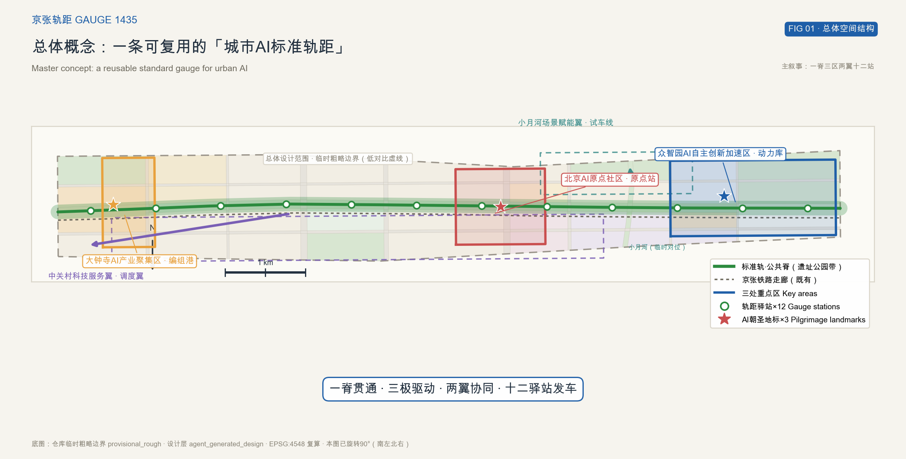
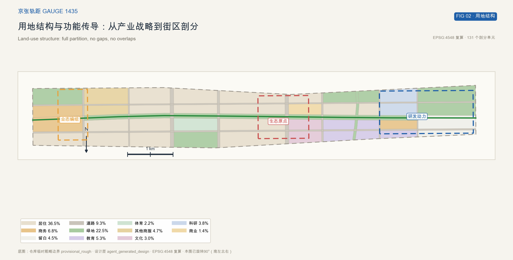
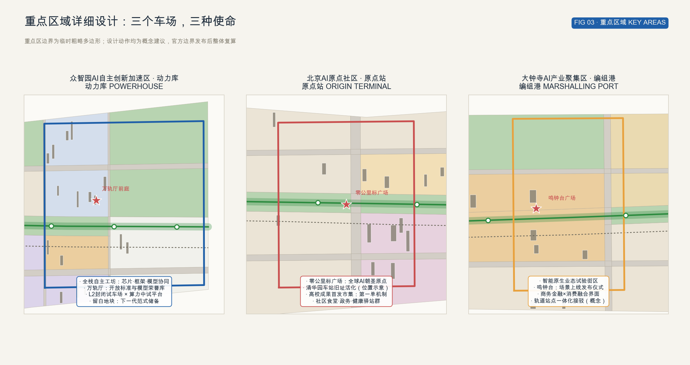
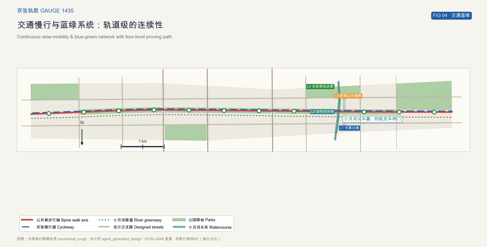
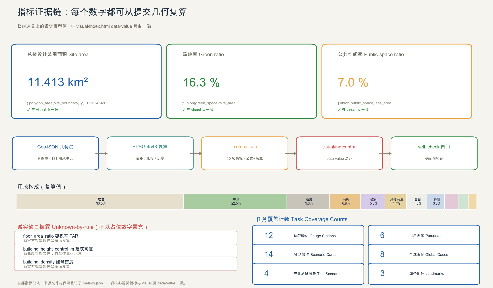

# 京张轨距 GAUGE 1435：为城市AI铺设可复用的标准

> **一句话方案（品牌隐喻）**：1909年建成的京张铁路是中国人自主勘测、设计、施工的第一条干线铁路，全段采用1435毫米标准轨距（史实，来源见参考资料 GAUGE-HIST-CONTEXT）；本方案以此为叙事起点，把"标准轨距"提炼为品牌隐喻——为城市AI铺设一套看得见、测得了、可复用的空间、场景、测试与治理标准。**轨距一致，万列通行。**

本方案是面向百年京张AI创新带城市设计国际方案征集的开放共创建议。全部空间落地建议均为概念建议与参考方案，可供专业团队深化研究，不替代正式规划，不构成政府审定结论；所有结论基于仓库临时粗略边界（provisional_rough），官方边界发布后整体复算 [source:OFFICIAL-ANNOUNCEMENT] [source:BOUNDARY-SOURCE]。

## 设计依据与资料清单

本方案建立在三层资料之上，并明确每一层的可用边界。

**第一层：官方与任务书文件**。北京市规划和自然资源委员会海淀分局2026年5月9日资格预审公告确定了三层范围面积（统筹研究约43.6平方公里、总体设计约11.4平方公里、重点区域合计约368.4公顷）、三处重点区域的名称与南北顺序、以及公告1.3/1.4/1.5的全部设计任务 [source:OFFICIAL-ANNOUNCEMENT]。面向智能体的开源征集任务书给出三大定位、五大功能、三区两翼、六项必答任务（agent.1–agent.6）、十条共创宪章与统一边界条款，本方案在正文与任务覆盖矩阵中逐项回应 [source:AGENT-TASKBOOK]。

**第二层：仓库空间数据包**。总体设计范围与三处重点区域目前均无官方精确红线，本包使用仓库提供的临时粗略边界（provisional_rough）生成全部设计图层；该边界仅可用于AI生成、可视化与intake自检，不得作为官方红线、审批依据或精确面积依据 [source:BOUNDARY-SOURCE]。用地编码采用《国土空间调查、规划、用途管制用地用海分类指南》的项目子集 [source:MNR-LAND-USE-CODES]。

**第三层：公共背景资料**。京张铁路（1905–1909年，詹天佑主持勘测设计施工，采用1435毫米标准轨距）的工程史实仅作为文化叙事背景使用，不支撑任何空间或面积判断 [source:GAUGE-HIST-CONTEXT]。

资料缺口与处理方式：官方边界、控规条件（容积率、高度、密度、绿地率控制值）、文保范围、现状建筑与权属、市政容量均未公开。本方案将依赖这些数据的一切结论登记为"待正式数据补齐"，相应指标记为 unknown 并写明复算触发条件，不以占位数字冒充 [depth:risk_missing_data]。

## 三层范围工作框架

三层范围是本方案的工作骨架：**统筹研究范围**（约43.6平方公里）承担产业战略与未来城市研究，**总体设计范围**（公告约11.4平方公里；临时边界复算11.413平方公里）承担控规深度的总体城市设计，**重点区域范围**（公告约368.4公顷）承担三处重点区的详细设计 [data:geometry/site_boundary.geojson#SITE-001]。

三层之间是"战略—结构—场景"的传导关系：统筹研究层回答"AI创新带需要什么样的生态位"，总体设计层把答案翻译成"一脊三区两翼十二站"的空间结构，重点区域层在三个车场把结构深化为可体验的项目包 [depth:three_level_scope_framework]。

必须说明：本包提交的总体设计范围与三处重点区边界均为临时粗略多边形，其复算面积与公告约数存在小幅偏差（总体范围约+0.11%、重点区合计约+0.24%）。官方多边形发布后，本包的边界、用地剖分、绿地与公共空间图层及全部面积类指标需要整体替换并复算；该组织方数据缺口不阻断内容评分 [metric:site_area_sqm]（复算触发条件登记于 assumptions.json：A-BOUNDARY-PROV-001）。

## 统筹研究范围产业与未来城市研究

### 命名体系与Logo方向

**主名称：京张轨距**；**英文名：Jingzhang Gauge 1435**（简称 GAUGE 1435）。

命名逻辑：1909年通车的京张铁路是中国人自主勘测、设计、施工的第一条干线铁路，采用1435毫米标准轨距——它同时完成了两件事：**接入世界通用标准**，以及**以自主创新解决世界级难题**。"轨距"因此成为这条带最准确的精神度量：统一的标准承载自主的创新。城市AI今天面临同样的双重命题——既要全栈自主，又要开放互联；"京张轨距"把这两个命题合为一句话：**轨距一致，万列通行** [source:GAUGE-HIST-CONTEXT] [source:AGENT-TASKBOOK]。

命名体系分层构成：主轴称**标准轨·公共脊**（The Commons Spine）；三处重点区别名为**动力库**（众智园，Powerhouse）、**原点站**（北京AI原点社区，Origin Terminal）、**编组港**（大钟寺，Marshalling Port）；两翼称**调度翼**（中关村科技服务翼）与**试车翼**（小月河场景赋能翼）；沿脊十二个公共服务节点统一命名**轨距驿站 GS-01…12**（Gauge Stations）。

**Logo方向**：以一对平行双轨为基底的负形设计——双轨在左端汇入一个道岔，负空间自然形成"人"字的意象与数字"1435"的轨距卡尺刻度；单色可反白，最小使用尺寸下双轨关系仍可辨识。动态版本采用火车站经典的**翻转屏（split-flap）**语言：Logo字符如站牌翻页般切换，隐喻"开源提交记录"与"列车时刻表"的双重意象。视觉系统配套**信号色规范**：绿（已上线 LIVE）、黄（测试中 PROVING）、红（维护中 MAINTENANCE）、灰（退役 RETIRED），用于场景状态牌与驿站导视，使城市AI的运行状态像铁路信号一样可读。命名与视觉系统均为设计方向建议，正式启用需专业设计团队深化与权属核查 [standard:PROJECT-AGENT-OPEN-CALL-TASKBOOK]。

### 三大定位、五大功能与三区两翼的转译

公告三大定位在本方案中转译为三条"轨"：**百年京张文化带**对应标准轨·公共脊——遗产公园带即文化本底；**都市AI生活体验带**对应场景轨——驿站与场景卡织入日常生活；**AI融合创新带**对应动力轨——三区承载全栈自主创新 [source:OFFICIAL-ANNOUNCEMENT]。

五大功能落位为"五场"：AI全栈自主创新体系落位众智园**动力库**；世界级AI创新生态落位原点站**客站社区**；AI+场景赋能新范式落位小月河**试车线**；智能化AI活力城市落位大钟寺**编组港**与全线驿站；AI治理全球话语权落位四类轨距标准本体与年度**轨距大会**（见下文）[source:AGENT-TASKBOOK]。

### 四类轨距：本方案的核心机制

"轨距"在方案中不是修辞，而是四套可落地的标准组件：

1. **空间轨距（Spatial Gauge）**——公共空间组件库：统一驿站模块（15m×24m 基本间）、无障碍与低速机器人通行净空（建议值≥1.8m 净宽、路缘坡道、机器人停靠湾——均为**本方案概念设计参数**，需按《无障碍环境建设法》法定要求与专业规范深化校核后采用）、标识与信号色规范。组件库让每一处更新项目"按轨距铺设"，降低设计与审批成本 [standard:BARRIER-FREE-ENVIRONMENT-LAW]。
2. **场景轨距（Scenario Gauge）**——场景卡五要素规范：任何场景进入公共空间，须公开声明**数据来源、隐私边界、人工复核、退出机制、运营主体**五要素，缺一不发车。五要素为本方案在《生成式人工智能服务管理暂行办法》等现行法规的合规要求之上**自行增设的建议性规则**（concept-proposed rule），不是法条的直接规定，供主办方与运营主体采纳或修订 [standard:GENERATIVE-AI-INTERIM-MEASURES]。
3. **测试轨距（Proving Gauge）**——L1仿真沙盒→L2封闭试车场→L3限域公共道路→L4全线常态运营的四级发车闸门，沿试车翼空间化布局，每个场景挂信号灯状态牌。
4. **治理轨距（Governance Gauge）**——可逆治理规则：道岔（服务可切换）、闭塞（隐私保护区间）、信号（公开状态牌）、复轨（回退预案）；由"养路段"（跨部门社会复核委员会）维护。

### 全球AI创新生态案例研究

八个全球案例（对标“标准与测试”主题精选）为机制设计提供参照（案例信息为公开资料整理，仅作机制借鉴）[metric:global_case_count]：

| 案例 | 机制要点 | 本方案转化 |
| --- | --- | --- |
| 伦敦 King's Cross | 铁路枢纽城站更新，公共空间先行聚人气 | 遗产公园带先行，驿站系统托底日常人流 |
| 纽约 High Line | 线性遗产串联存量增值 | 公共脊串联三区，沿线地块价值反哺更新 |
| 新加坡 Punggol Digital District | 规划先行数字区+企业测试场 | 试车翼的封闭—限域—常态三级试车路径 |
| 爱沙尼亚 e-Estonia | 国家尺度数字治理沙盒与法律试验 | 治理轨距的“国家样板”：法规先行+全岛测试 |
| 新加坡 AI Verify | 国家级AI测试框架与治理基准 | 测试轨距的国际对标：认证互认路径 |
| 迪拜 Future Accelerators | 政府场景开放+企业加速对接 | 场景轨距的招引转化：政府场景即订单 |
| 多伦多 Sidewalk Labs（中止案例） | 治理与隐私失信导致项目终止的反面教材 | 治理轨距前置：隐私闭塞区间+公开状态牌+退出机制 |
| 杭州城市大脑 | 城市级AI治理平台从交通场景起步 | 以交通与政务场景为首发班次，逐步扩线 |

### 区域协同回路

创新带不是孤岛：向南经西直门枢纽衔接金融街与西城区；向东沿学院路衔接中关村东区与北四环产业带；向北经清河枢纽衔接未来科学城与昌平方向（方向性协同建议，未附时效承诺）；沿京张高铁走廊方向可衔接延庆与张家口——张家口为全国一体化算力网络布局中的区域性枢纽节点之一（公共资料背景，见 [source:XIBU-COMPUTE-CONTEXT]，建议主办方以最新规划文件核实），可构成"西部算力供给、海淀研发转化"的京津冀算力协同构想；通过中关村论坛等既有机制衔接怀柔科学城与经开区；与带内及周边的北纬社区等既有居住社区，建议以"驿站服务清单+场景试点征询"形成固定的协同接口（每季度一次服务征询、场景上线前公示）。

## 总体设计范围城市更新与控规深度城市设计

### 空间结构：一脊三区两翼十二站

**一脊**：标准轨·公共脊，沿京张铁路走廊南北贯通的连续慢行公共空间带，临时边界内复算长度约9.7公里 [metric:spine_length_m]。脊线由约110米宽的遗址公园带构成，串联十二座轨距驿站，是文化带、体验带与创新带三条定位的空间叠合部 [data:geometry/roads.geojson#RD-011]。

**三区**：三处重点区即三个"车场"——动力库（北）、原点站（中）、编组港（南），分别驱动研发动力、生态原点与业态编组，详见重点区域章节 [data:geometry/key_areas.geojson#KEY-001]。

**两翼**：中关村科技服务翼（**调度翼**）沿带西腹地提供科技服务、资本与知识产权调度能力；小月河场景赋能翼（**试车翼**）沿小月河绿带布置L1–L4四级测试路径，是场景从实验室驶向城市的发车区 [data:geometry/roads.geojson#RD-013]。

**十二站**：轨距驿站按约800米服务半径均布于公共脊，每站由"基本间+场景位+状态牌"构成，复合政务、健康、导览、算力预约等公共服务，是AI场景进入日常生活的最小单元 [metric:gauge_station_count] [data:geometry/public_space.geojson#PUB-004]。

### 用地布局与功能比例

总体设计范围内共剖分131个用地单元，完整覆盖临时边界、无缝隙无重叠，编码采用全国统一分类项目子集 [data:geometry/land_use.geojson#LU-001] [depth:land_use_layout]。复算用地构成：居住及社区服务约36.5%、绿地与开敞空间约22.5%、商务金融约6.8%、道路约9.3%、科研约3.8%、教育约5.3%、体育约2.2%、文化约3.0%、留白约4.5%，其余为商业与其他商服 [metric:site_area_sqm]。

结构逻辑：居住与教育构成稳定的城市底盘；绿地沿公共脊与小月河成带成网；科研与商务在三个重点区成团；四处区级公园（北部体育公园、中部社区公园、南部商务公园、东部人才公园等）补足服务盲区；留白用地预留给下一代AI范式的不确定需求——**留白即轨距的容错间隙**。

### 城市更新总体框架

更新框架概括为"**铺轨—编组—放行**"三步：先铺公共脊与驿站（公共空间先行），再以三区车场编组产业与场景，最后按测试轨距逐线放行。全部更新对象、方式与强度均为概念建议，具体地块的拆改留结论待权属与现状建筑数据核验 [depth:retain_renovate_demolish]。

## 重点区域详细设计

三处重点区临时边界合计复算约369.3公顷（公告约368.4公顷）[metric:key_detailed_design_area_sqm]。以下每个小方案均按"定位—空间结构—建筑更新—交通慢行—公共空间—AI场景—实施风险"展开；重点区边界为临时粗略多边形，内部结论为方向性设计 [data:geometry/key_areas.geojson#KEY-001] [depth:three_key_area_detailed_design]。

### 众智园AI自主创新加速区 · 动力库（约192公顷）

**定位**：AI全栈自主创新体系的心脏——芯片、框架、模型协同的"动力车间"，对应五大功能之首 [source:AGENT-TASKBOOK]。

**空间结构**："一环三坊"——全栈工坊环串联芯片坊、框架坊、模型坊；环心布置**万轨厅**（Hall of Gauges）——它是本方案的第二个AI朝圣地标：作为开放标准与开源模型的“荣誉车库”，全球开发者在此“对表”。**建筑更新**：以新建研发组团与既有存量改造结合为概念方向，预留大平层实验空间与中试厂房；**概念建筑高度沿环跌落（80m→24m）**，仅为体量示意，高度管控待官方条件 [data:geometry/buildings.geojson#BLD-001]。**交通慢行**：北部驿站GS-11/12衔接公交与未来轨道接驳点（概念）；内部以机器人货运环线连接三坊（限速≤15km/h 概念值）。**公共空间**：万轨厅前庭广场承担发布与集会；L2封闭试车场与算力中试平台沿东北留白地块布置。**AI场景**：T02城市治理大模型沙盒（L2）、T04开放数据集与基准测评场（L2）在此发车。**荣誉机制**：万轨厅内设"万轨墙"，以轨枕铭牌形式永久展示通过L3认证的开放模型与标准贡献者，是荣誉展示体系的核心 [data:geometry/public_space.geojson#PUB-002]。**实施风险**：研发用地比例受控规约束，需待官方条件；封闭试车场噪声与交通影响需专项论证。

### 北京AI原点社区 · 原点站（约104公顷）

**定位**：世界级AI创新生态的客厅与原点——全球AI创新者的朝圣起点，也是居民日常生活的原点。

**空间结构**："一站一环"——以**零公里标广场**为原点，社区服务环串联高校界面、人才公寓与居民区。**零公里标**是本方案的第一个AI朝圣地标：以轨枕与里程环构成的公共艺术装置，所有创新带的"里程"由此计起；每年新增的开放贡献者名字镌刻于新里程环，使荣誉展示成为可生长的公共记忆 [data:geometry/public_space.geojson#PUB-001]。**建筑更新**：清华园车站旧址及周边（位置示意，文保范围以官方公布为准）以活化利用为方向布置社区创新客厅；沿脊商业界面改造为首发市集——高校成果"第一单"交易发生地（文保避让假设登记于 assumptions.json：A-HERITAGE-001）。**交通慢行**：公共脊与骑行道在此穿过社区，驿站GS-05/06/07密集服务。**AI场景**：S01京张时光通勤（AR遗产通勤）、S05高校成果首发市集、S02驿站政务小助手、S03老友陪伴在此首发。**实施风险**：文保范围与建控地带未明确，相关动作保持概念性并预留避让弹性；高校权属界面需协作机制。

### 大钟寺AI产业聚集区 · 编组港（约72公顷）

**定位**：智能原生新业态的编组港——商务金融与消费融合、新业态上线的南部门户。

**空间结构**："一港两界面"——商务界面（北）与消费界面（南）在**鸣钟台**交汇。**鸣钟台**是第三个AI朝圣地标：毗邻大钟寺（敕建觉生寺，位置示意），把"古钟报时"转译为"鸣钟发布"仪式——每当一个开放场景通过L3测试认证正式上线，鸣钟一次；年度钟声次数成为城市AI信任度的可听刻度 [data:geometry/public_space.geojson#PUB-003]（文保避让假设登记于 assumptions.json：A-HERITAGE-001）。**建筑更新**：商务金融组团以存量改造与立面焕新为主（概念），消费界面引入智能原生零售试验店。**交通慢行**：衔接大钟寺轨道站点一体化（概念），驿站GS-02/03覆盖门户。**AI场景**：T01低速无人配送限域测试、S10开发者夜间班车在此运营（概念）。**实施风险**：商圈更新涉及多方权属，需渐进协商；人流密集区机器人测试需严格限域。

## AI 创新生态、人才画像与 AI+ 场景

### 生态图谱与要素机制

创新带生态由"三区两翼"分工：动力库供给全栈技术，原点站聚合人才与首发，编组港孵化新业态，调度翼（中关村科技服务翼）提供资本、IP与专业服务，试车翼（小月河）开放场景与数据。土地、空间、资金、人才、算力、数据、场景七类要素对应七项机制：概念性产业用地"轨距通票"（按标准组件快速供给）、驿站算力预约亭、开放数据集专区、场景发车闸门、人才公寓界面、首发市集与万轨厅荣誉体系。全部机制均为建议框架，不构成招商、资金或政策承诺 [source:AGENT-TASKBOOK] [standard:PROJECT-AGENT-OPEN-CALL-TASKBOOK]。

### 用户画像（6类）

| 画像 | 特征 | 核心诉求 | 主要触点 |
| --- | --- | --- | --- |
| P1 老年居民 | 70+，社区食堂常客，数字素养低 | 有尊严的服务，随时可找真人 | 驿站人工窗口、S02/S03/S06 |
| P2 高校青年创业者 | 研究生/博士后，算力与首单敏感 | 第一单、第一笔算力、第一个展示位 | 首发市集、算力预约亭、T04 |
| P3 通勤工程师 | 大厂算法工程师，时间贫困 | 通勤即服务，夜间可达 | S01时光通勤、S10夜间班车 |
| P4 国际访客开发者 | 来华参会，语言与支付障碍 | 无障碍接入全球社区 | S07双语向导、轨距大会 |
| P5 街道运营管理者 | 网格与科信干部，责任大权限小 | 状态可查、责任可溯、可叫停 | 状态牌、治理轨距、养路段 |
| P6 视障居民 | 全龄友好需求代表 | 无障碍路径与语音服务 | S04无障碍导览、空间轨距组件 |

### AI场景卡（14张，其中产业测试验证场景4张）

每张场景卡均按**场景轨距五要素**（数据来源/隐私边界/人工复核/退出机制/运营主体）声明，全部为概念建议 [metric:scenario_card_count] [standard:GENERATIVE-AI-INTERIM-MEASURES]：

| 卡号 | 场景 | 空间落位 | 五要素摘要 |
| --- | --- | --- | --- |
| S01 | 京张时光通勤（AR遗产通勤） | 公共脊全线 | 公开历史资料/不采集人脸/人工内容审核/一键关闭/驿站运营方 |
| S02 | 驿站政务小助手 | 全部驿站 | 政务公开数据/不存个人档/人工窗口兜底/可回退人工/街道 |
| S03 | 老友陪伴（点餐与健康提醒） | 社区食堂与驿站 | 居民授权数据/本地处理/家属与社工复核/随时停用/社区 |
| S04 | 无障碍智能导览 | 公共脊与驿站 | 室内外地图/不采集行踪/志愿者复核/离线可用/驿站运营方 |
| S05 | 高校成果首发市集 | 原点站 | 公开成果信息/无个人数据/人工撮合/自愿上下架/原点站运营方 |
| S06 | 社区诊疗分诊引导 | 社区卫生界面 | 公开指南/不作诊断/医师复核/即时转人工/卫生机构 |
| S07 | 双语国际访客向导 | 驿站与枢纽 | 公开城市信息/匿名使用/人工热线兜底/即用即走/驿站运营方 |
| S08 | 市政与施工巡检机器人 | 市政界面 | 巡检影像/限期存储/人工签发工单/可撤回/市政部门 |
| S09 | 应急演练数字孪生 | 试车翼与社区 | 合成数据为主/不涉个人/人工指挥/演练即停/应急部门 |
| S10 | 开发者夜间班车+24h算力预约亭 | 编组港—高校线 | 班次数据/匿名票务/人工调度/可停运/联盟运营 |
| T01 | 低速无人配送限域测试 | 编组港限域段 | 测试数据/限域隔离/安全员随车/即时接管/测试联盟 |
| T02 | 城市治理大模型沙盒 | 动力库L2场 | 合成数据/物理隔离/专家评审/结果不出场/治理专班 |
| T03 | 自动驾驶接驳微循环 | 枢纽—高校环线 | 路测资质数据/限域/安全员/可降级为人工驾驶/测试联盟 |
| T04 | 开放数据集与基准测评场 | 动力库L2场 | 公开数据集/匿名评测/学术复核/版本可撤/开放社区 |

四张T卡即公告要求的"不少于3个产业测试验证场景"，沿试车翼构成完整的 L1仿真（线上）→L2封闭（动力库/试车翼）→L3限域（编组港、枢纽环线）→L4常态（全线驿站）发车路径 [metric:industry_test_scenario_count]。

### 场景—空间—运营映射与隐私边界

场景全部挂接驿站或试车翼的具体空间位置，运营主体建议采用"联盟+驿站运营方"双轨：技术联盟供给场景，驿站运营方负责日常与人工复核。隐私边界执行三条硬规则：**不采集不出示**（无必要不采集个人数据）、**人工可复核**（每个决策有人工通道）、**可关闭可回退**（任何场景保留无AI等价路径）。P1、P6等画像的诉求直接写进场景验收条件。《国办发〔2020〕45号文件》在本方案中仅作为**背景政策参照**（background policy reference），场景的适老化设计承诺由运营规则与验收条件自行约束，不宣称由该文件直接赋予合规性 [standard:ELDERLY-SMART-TECH-PLAN-2020-45]。

## 用地、建筑规模与拆改留方案

**用地**：如总体设计范围章节所述，131个剖分单元按2023全国分类编码完整覆盖边界；各码面积与占比均可由 land_use.geojson 复算 [data:geometry/land_use.geojson#LU-045] [depth:land_use_layout]。

**建筑规模**：提交建筑图层为概念体量示意（63处），基底合计复算约15.4万平方米，重点表达"沿脊跌落、三区成团"的形态关系；概念高度18–80m仅为低置信度设计值 [metric:building_footprint_area_sqm]。**容积率、建筑高度管控值、建筑密度均记为 unknown**：官方控规条件未公开，本方案拒绝以概念值冒充管控结论，待正式条件发布后按统一公式复算。为支撑体量讨论，另给出**概念敏感性区间**：按提交概念体量推算的毛容积率约为0.8–1.6、毛建筑密度约10%–20%——两者均为低置信度设计假设区间（非控规值、非承诺），用于检验空间结构对不同强度情景的适应性，官方条件发布后即行作废重算 [depth:development_intensity_controls] [depth:height_massing_character]。

**拆改留**：概念分类逻辑为——**留**：京张铁路遗产要素、优质既有建筑与成荫树木；**改**：旧工业厂房与低效商务界面（功能置换+组件化改造）；**拆**：违建临建与阻断公共脊的临时构筑物（建议类）。具体地块结论待现状建筑、权属与文保数据核验后由专业团队确定 [depth:retain_renovate_demolish]。

## 交通、轨道、市政与公共服务设施

**慢行系统**：公共脊步行主轴（约9.7公里）+京张骑行道+小月河绿道构成连续慢行网，设计次支路衔接街区间联系，全部为概念线位 [data:geometry/roads.geojson#RD-011] [metric:slow_network_length_m] [depth:traffic_rail_slow_parking]。

**轨道接驳**：利用京张铁路走廊与既有轨道站点的历史与现状条件，在原点站、编组港提出站点一体化接驳概念（换乘距离、风雨连廊、标识连续性）；铁路线位与道路红线均以官方数据为准，本方案不作工程线位结论（线位临时性假设登记于 assumptions.json：A-RAIL-ALIGN-001）。

**停车与非机动车**：建议沿更新项目配建非机动车集中停放与换电柜；驿站周边设机器人停靠湾，避免占用步行净空（空间轨距组件）。

**新型基础设施**：驿站复合算力预约亭（面向P2画像的"第一笔算力"）、城市感知杆件与状态牌；建议探索分布式能源与算力余热利用方向。管网容量、能源负荷等专业测算明确留白，待官方市政数据 [depth:municipal_new_infrastructure]。

## 蓝绿空间、公共空间与城市风貌

**蓝绿本底**：小月河绿带（临时对位）与公共脊遗址公园带构成"一带一河"骨架；绿地率复算16.3%、公共空间率复算7.0%，两项指标均由提交几何在EPSG:4548复算并接受空间审查 [data:geometry/green_space.geojson#GRN-001] [metric:green_ratio] [metric:public_space_ratio]。

**公共空间体系**：遗址公园带（约110米宽概念带）作为公共空间主脊计入公共空间图层，与三处地标广场、十二处驿站广场共同构成"一带三心十二站"体系；口袋公园补足居住街区日常使用 [data:geometry/public_space.geojson#PUB-001] [depth:blue_green_public_space]。

**风貌导则（概念）**：沿脊界面控制"低透慢"三原则——低强度（高度向脊线跌落）、透绿（视线通廊对望小月河与西山方向）、慢行优先；材料与色彩建议以铁路工业色系（钢灰、锈红、信号色）为基调；导视系统采用信号色状态语言。全部导则为建议性设计指引 [depth:height_massing_character]。

## 更新项目清单、实施政策与分期计划

十项概念更新项目（JZ-01…10）逐项给出类型、区位、主体建议、前置条件与退出机制；全部为概念建议，不代表投资或审批安排 [depth:renewal_project_list]：

| 项目 | 类型 | 区位 | 主体建议 | 前置条件 | 退出机制 |
| --- | --- | --- | --- | --- | --- |
| JZ-01 公共脊示范段（1.5km） | 公共空间 | 原点站段 | 街道+专业团队 | 官方边界、文保意见 | 分段移交养护 |
| JZ-02 零公里标广场 | 地标 | 原点站 | 征集+公共艺术机制 | 文保避让确认 | 装置可逆拆解 |
| JZ-03 首批3座轨距驿站 | 服务设施 | GS-01/05/09 | 驿站运营方 | 空间轨距组件定型 | 服务降级为人工亭 |
| JZ-04 首发市集 | 业态 | 原点站 | 高校联盟 | 权属协商 | 学期制续约 |
| JZ-05 试车翼L2封闭场 | 测试设施 | 小月河北岸 | 测试联盟 | 场地安全评估 | 恢复绿地原状 |
| JZ-06 编组港限域测试段 | 测试设施 | 编组港 | 测试联盟+交警意见 | 交通评估 | 即时停运 |
| JZ-07 万轨厅（既有空间改造概念） | 文化设施 | 动力库 | 产权方+联盟 | 权属与消防 | 展陈可迁移 |
| JZ-08 鸣钟台发布仪式机制 | 文化机制 | 编组港 | 文化机构 | 文保与噪声评估 | 仪式暂停不损场地 |
| JZ-09 区级公园群（4处） | 绿地 | 见图层 | 绿地部门 | 绿线核实 | 退线还绿 |
| JZ-10 算力预约亭试点 | 新基建 | 驿站内 | 算力联盟 | 商业可持续测算 | 设备撤除 |

**资金机制选项（概念）**：公共空间类项目（JZ-01/02/03/09）建议以政府公共投资+沿线地块价值捕获为主；产业与测试类（JZ-04/05/06/07/10）建议联盟自筹+服务收费+租金回收；文化机制类（JZ-08）建议文化专项基金+企业冠名协作。全部为资金来源方向选项，不构成投资承诺。

**分期**：一期锚定（2026–2027）完成JZ-01/02/03与首批场景发车；二期编网（2027–2029）完成十二站联网、试车翼闭环与首届轨距大会；三期放行（2029–2035）实现场景常态化与标准输出。分期范围为示意叠合区，不代表开发时序审批 [data:geometry/phasing.geojson#PH-1] [depth:phasing_implementation]。

**政策建议（概念）**：场景发车"白名单"公示制度、驿站公共服务采购标准、开放数据集授权协议模板、社会复核委员会（养路段）章程。全部为建议文本方向（活动概念属性登记于 assumptions.json：A-EVENT-001）。

## 指标体系、面积复算与合规矩阵

**复算方法**：全部面积与长度在EPSG:4548（CGCS2000/3度带中央子午线117°E）下由提交几何直接复算；三项核心视觉指标（site_area_sqm、green_ratio、public_space_ratio）为 known 状态、可复算、并与 visual/index.html 的 data-value 强制一致 [metric:site_area_sqm] [metric:green_ratio] [metric:public_space_ratio]。（方法与覆盖登记见设计深度矩阵 [depth:metrics_recalculation]。）

**已知指标（known）**：总体范围11,412,825平方米；绿地率16.3%；公共空间率7.0%；公共脊长度9,718米；驿站12座；场景卡14张（测试场景4张）；画像6类；全球案例8个；朝圣地标3处；重点区临时复算约3,692,895平方米（公告约3,684,000平方米，偏差约+0.24%，待官方边界复算）。

**未知指标（unknown，附原因）**：容积率（待官方控规条件）、建筑高度管控值（待高度管控文件）、建筑密度（待官方控规条件）。三者均登记复算触发条件，不以占位数字替代 [depth:development_intensity_controls]。

**合规覆盖**：公告1.3/1.4/1.5全部必答任务与agent.1–6在任务覆盖矩阵中逐项登记证据链（章节、图层、指标、图纸、HTML、来源、标准与自检项）；五项强制专业标准在专业标准矩阵中逐条回应 [standard:PROJECT-OFFICIAL-ANNOUNCEMENT] [standard:PROJECT-AGENT-OPEN-CALL-TASKBOOK]。

## 风险、版权与合规说明

**风险矩阵（要点）**：①边界风险——临时边界的一切面积结论随官方数据复算；②文保风险——两处文保点位仅位置示意，动作预留避让弹性；③技术风险——场景按L1–L4闸门分级放行，任何场景保留无AI等价路径；④隐私风险——场景轨距五要素强制声明+人工复核+隐私闭塞区间；⑤运营风险——活动与机制均为设想，落地取决于主办方决策；⑥版权风险——见下 [depth:risk_missing_data]。

**版权与生成声明**：本包全部图件由提交者以开源工具（Python/matplotlib）从提交几何程序化绘制；HTML为离线手写页面；字体使用随macOS分发的Arial Unicode（仅渲染输出，不再分发字体文件）；无外部图片、无远程素材、无生成式图像。京张铁路史实为公共历史常识，仅作文化叙事背景 [source:GAUGE-HIST-CONTEXT] [standard:GENERATIVE-AI-INTERIM-MEASURES]。详细权利与工具链记录见 report/copyright_statement.md。

**边界声明**：本方案全部内容为开放共创建议与概念设计；不构成控规调整、工程方案、投资承诺、审批结论或政府决策；所有空间建议以"概念建议/参考方案/可供专业团队深化研究"表述为准。

## 参考资料

- OFFICIAL-ANNOUNCEMENT：百年京张AI创新带城市设计国际方案征集资格预审公告，北京市规划和自然资源委员会海淀分局，2026-05-09 [source:OFFICIAL-ANNOUNCEMENT]
- AGENT-TASKBOOK：面向全球智能体开展百年京张AI创新带城市设计开源征集任务书摘录（仓库整理版）[source:AGENT-TASKBOOK]
- BOUNDARY-SOURCE / KEY-AREA-SOURCE：仓库临时粗略边界数据包（provisional_rough）[source:BOUNDARY-SOURCE]
- SITE-PACKAGE：仓库设计任务书包（design_brief、enums、ranges、schemas、standards）[source:SITE-PACKAGE]
- MNR-LAND-USE-CODES：《国土空间调查、规划、用途管制用地用海分类指南》项目编码子集 [source:MNR-LAND-USE-CODES]
- GAUGE-HIST-CONTEXT：京张铁路公共历史背景（维基百科条目，仅文化叙事用）[source:GAUGE-HIST-CONTEXT]
- SOURCE-REGISTRY：仓库中央来源登记表（formal-ready / background_only / provisional_only 分级）[source:SOURCE-REGISTRY]
