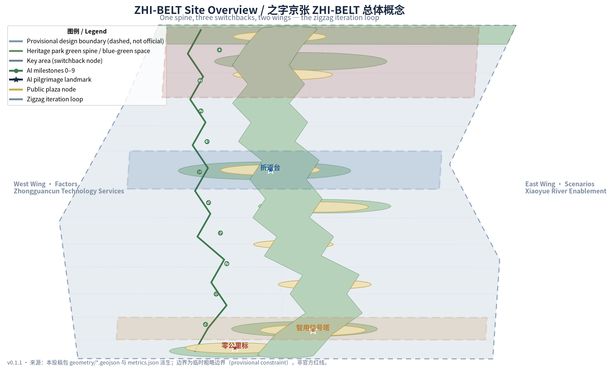
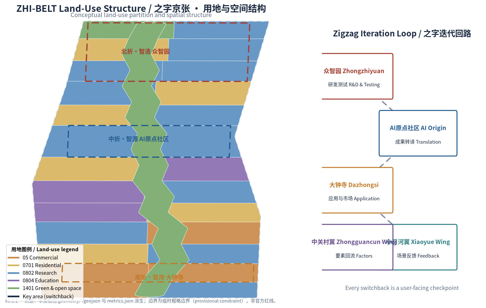
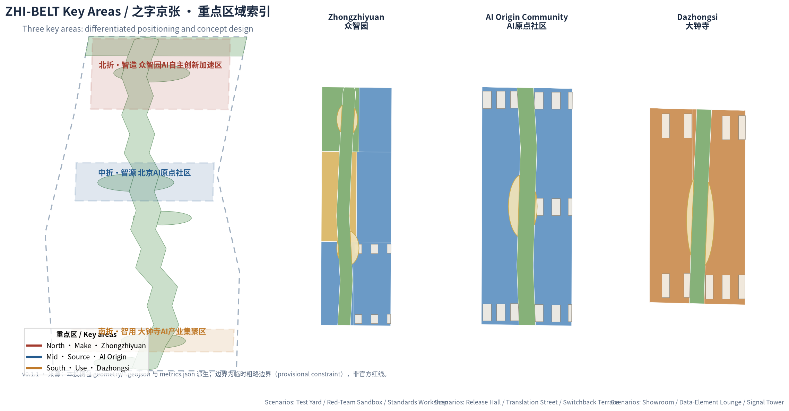
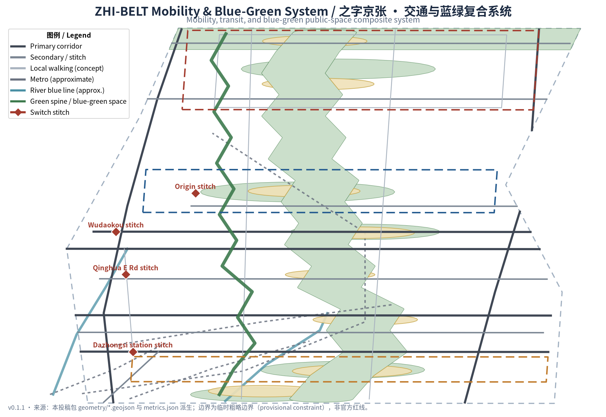
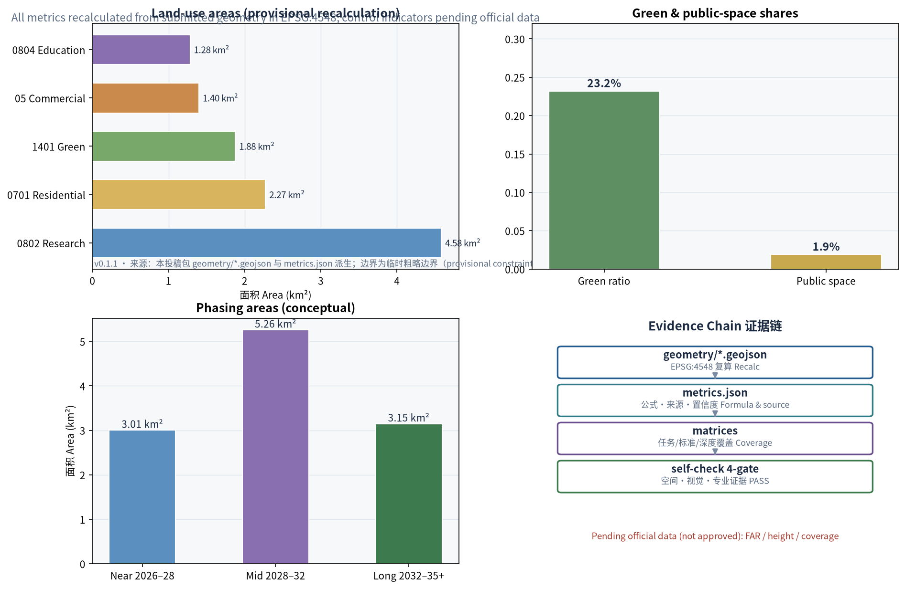

# ZHI-BELT: A Switchback-Iteration Urban Design Concept for the Centennial Jing-Zhang AI Innovation Belt

## Design Basis and Source Inventory

This proposal takes as its primary basis the Pre-Qualification Announcement for the International Urban Design Open Call for the Centennial Jing-Zhang AI Innovation Belt, issued by the Haidian Branch of the Beijing Municipal Commission of Planning and Natural Resources, and organizes all design tasks together with the open-call taskbook addressed to global agents [source:OFFICIAL-ANNOUNCEMENT] [source:AGENT-TASKBOOK]. The proposal distinguishes three classes of evidence: public announcements and standards usable for formal conclusions, public policies usable as background only, and provisional rough boundaries usable only for generation and display. The full source inventory is recorded in `sources.json`, task coverage in `compliance_matrix.json`, and professional standard responses in `standard_matrix.json`.

Since the official precise redline and the three key-area polygons are not yet public, this package uses the provisional rough boundary derived by repository maintainers from the announcement's textual limits and announced area [source:PROVISIONAL-BOUNDARIES]. That boundary has been verified against the announced ~11.4 km² in EPSG:4548 [metric:site_area_sqm], but it may be used only for generation, visualization, and design discussion; it is not an official redline or a basis for precise area claims. When official polygons are published, the boundary, land use, buildings, roads, green space, public space, phasing, and all metrics must be recalculated as a whole. This organizer-side data gap does not block content scoring, and every area and ratio in this proposal is labeled a provisional-boundary recalculation.

## Three-Level Scope Framework

The proposal organizes work in the three levels defined by the announcement, with spatial evidence based on the provisional boundary [data:geometry/site_boundary.geojson#SITE-001].

| Level | Scope | Objective | Design Depth | Area Basis |
| --- | --- | --- | --- | --- |
| Coordinated Research Area | 43.6 km² | Industrial ecosystem, future city form, Three Zones and Two Wings synergy | Strategic research | Announced textual area [metric:site_area_sqm] |
| Overall Design Area | 11.4 km² | Urban renewal framework, spatial structure, transport-municipal-character | Regulatory-planning-level urban design | Provisional boundary recalculation [metric:site_area_sqm] |
| Key-Area Detailed Design Area | 368.4 ha | Detailed design of the three key areas | Integrated planning implementation plan depth | Three provisional key areas [metric:key_area_count] |

The three levels are not three disconnected drawing sets: the coordinated level answers where the AI Innovation Belt is heading, the overall level answers how space and renewal are organized, and the key-area level verifies how the three districts can be implemented. Depth constraints are anchored in [depth:three_level_scope_framework], the derivation of the overall spatial structure in [depth:overall_spatial_structure], and key-area design depth in [depth:three_key_area_detailed_design].

## Coordinated Research Area: Industry and Future-City Research

### Overall Concept and Naming System (agent.1)

The proposal advances the overall concept **ZHI-BELT**: it takes the zigzag switchback of the Badaling section of the Jing-Zhang Railway—the most celebrated engineering feat of China's first self-built trunk line—as the organizing DNA of the AI Innovation Belt. One hundred years ago, Zhan Tianyou used switchbacks to let locomotives climb steep grades; today, the AI industry advances through the same cycle of testing, turning back, iterating, and moving forward. A single "之" (zhi) character carries three layers of meaning:

- **Zhi as form (之):** the spatial form of switchback turns, unfolding the three theme belts—the Centennial Jing-Zhang Culture Belt, the Urban AI Life Experience Belt, and the AI Integration Innovation Belt—along the spine [source:AGENT-TASKBOOK];
- **Zhi as wisdom (智):** homophonous with "intelligence," pointing to the goal of a world-class AI industry highland and pilgrimage destination;
- **Zhi as aspiration (志):** the spirit of self-reliance that built China's first trunk railway, corresponding to the aspiration of a full-stack independent AI innovation system.

**English naming system:** primary name ZHI-BELT; full name The ZHI Belt — Centennial Jing-Zhang AI Innovation Belt; component names 0–9 Milestones, Switchback Terraces, Signal Towers, and Switch Stitches. The bilingual pun "ZHI" (zigzag form / wisdom) makes the brand extensible in English-speaking contexts as an international communication symbol.

**Logo direction:** the three-segment zigzag is geometrized into a brand mark—three folds colored Jing-Zhang brick red (heritage), Haidian tech blue (innovation), and park green (ecology), converging at the turning point into a dot (the innovation loop), read together as a rail-plan zigzag combined with a signal motif. The mark extends into wayfinding, milestones, event visuals, and public-art modules, and involves no uncleared fonts, trademarks, or portrait elements. This direction is a conceptual recommendation for professional branding teams [depth:height_massing_character].

### Five Functions and the Three Zones and Two Wings Iteration Loop

The coordinated research centers on the five functions: the full-stack independent AI innovation system, the world-class AI innovation ecosystem, the AI-enabled scenario empowerment paradigm, the intelligent vibrant AI city, and global voice in AI governance. The Three Zones and Two Wings are organized into a "zigzag iteration loop":

| Node | Positioning | Loop Role | Output |
| --- | --- | --- | --- |
| North Switchback–Make: Zhongzhiyuan AI Independent Innovation Acceleration Area | Full-stack independent innovation | R&D, testing, standards governance | Models, compute, standards [data:geometry/key_areas.geojson#KEY-ZHONGZHIYUAN-001] |
| Mid Switchback–Source: Beijing AI Origin Community | Open source and translation | Translation, talent pooling | Open-source output, incubated projects [data:geometry/key_areas.geojson#KEY-ORIGIN-001] |
| South Switchback–Use: Dazhongsi AI Industry Cluster | Application and market | Deployment, international exchange | Products, revenue, feedback [data:geometry/key_areas.geojson#KEY-DAZHONGSI-001] |
| West Wing–Factors: Zhongguancun Technology Services Wing | Factor allocation | Recycling capital, data, compute, technology | Factor supply and global allocation |
| East Wing–Scenarios: Xiaoyue River Scenario Enablement Wing | Scenario validation | Public experience and feedback capture | Scenario data flowing back into R&D |

Loop logic: output from the Make zone (Zhongzhiyuan), translation in the Source zone (AI Origin Community), deployment in the Use zone (Dazhongsi), feedback through the East Wing scenarios, factor recycling through the West Wing, and back to Make for the next iteration. The loop is isomorphic to the zigzag switchback: every turn is a user-facing checkpoint, and every turning point is an innovation checkpoint [source:AGENT-TASKBOOK].

### Global AI Innovation Ecosystem Cases (agent.2)

Six global AI innovation ecosystem cases were studied for spatial and institutional lessons transferable to Haidian [source:CASES-PUBLIC-KNOWLEDGE]:

| Case | Key Lesson | Transfer Mechanism in This Proposal |
| --- | --- | --- |
| Stanford Research Park, USA | Campus-industry synergy, low-density innovation campus | Campus-adjacent translation street and campus–park walking linkage at AI Origin Community |
| Yunqi Town, Hangzhou, China | Scenario-driven, open technology ecosystem | Open testing at the Switchback Test Yard; scenario-access operation |
| Jurong Innovation District, Singapore | Government–academia–industry co-governance | Standards workshops and red-team sandbox tripartite governance at Zhongzhiyuan |
| King's Cross Knowledge Quarter, London, UK | Station-city integration, mixed cultural-tech renewal | Dazhongsi station four-quadrant integration and Smart-Use Showroom |
| Hetao Shenzhen–Hong Kong Cooperation Zone, China | Institutional innovation and cross-border synergy | Data-Element Lounge and international factor channel at the Zhongguancun Wing |
| Digital Media City, Seoul, Korea | Public display of digital culture | Publicly visible Signal Tower and event-week public route |

These cases are not copied; each is translated into a "space–mechanism–scenario" triad—one spatial node, one operating mechanism, and one AI scenario—avoiding slogan-level borrowing [depth:existing_conditions_diagnosis].

## Overall Design Area: Urban Renewal at Regulatory-Planning Urban Design Depth

### Spatial Structure: One Spine, Three Switchbacks, Two Wings

The overall design proposes a "one spine, three switchbacks, two wings" structure:

- **One spine:** the Jing-Zhang Railway Heritage Park blue-green spine, ~9.4 km [metric:green_spine_length_km], a composite backbone for culture, walking, public life, and AI public experience;
- **Three switchbacks:** the Zhongzhiyuan, AI Origin Community, and Dazhongsi key areas, turning the spine north, mid, and south;
- **Two wings:** the western Zhongguancun factor corridor and the eastern Xiaoyue River scenario corridor, linked to the spine by transverse "switch stitch" crossings;
- **Switch stitches:** eight east-west stitching points along the spine to repair the century-long division of the two sides of the railway [depth:overall_spatial_structure].

The structure is carried by the land-use partition: green and open space about 2.32 million m² [metric:land_use_1401_area_sqm], research land (0802) about 4.38 million m² [metric:land_use_0802_area_sqm], residential land (0701) about 2.16 million m² [metric:land_use_0701_area_sqm], commercial land (05) about 1.31 million m² [metric:land_use_05_area_sqm], and education land (0804) about 1.23 million m² [metric:land_use_0804_area_sqm]. The partition follows the national territorial spatial land-use classification logic [standard:MNR-LAND-USE-CLASSIFICATION-GUIDE] as a conceptual zoning suggestion [data:geometry/land_use.geojson#LU-030].

### Urban Renewal Framework

The renewal framework follows a "stitch first, activate second, strengthen third" logic: near-term stitching of walking gaps and east-west barriers, mid-term activation of underused space along the spine and around stations, and long-term strengthening of industrial space supply and the citywide operation network. All renewal projects are labeled conceptual recommendations; specific demolition–renovate–retain conclusions require confirmation of ownership, regulatory conditions, and engineering conditions by professional teams [depth:retain_renovate_demolish]. Development intensity, building height, and building coverage are recorded as pending items pending official regulatory-plan conditions [depth:development_intensity_controls]; the concept massing in this proposal must not be presented as approved controls.

## Key-Area Detailed Design

Each key area is organized as "positioning + spatial structure + building renewal + transport and walking + public space + AI scenarios + implementation risks." Because the key-area polygons are provisional rough boundaries [data:geometry/key_areas.geojson#KEY-ZHONGZHIYUAN-001], all conclusions below are directional conceptual recommendations for professional deepening [depth:three_key_area_detailed_design].

### North Switchback: Zhongzhiyuan AI Independent Innovation Acceleration Area

- **Positioning:** a garden-type full-stack independent innovation quarter, the "Make" switchback;
- **Spatial structure:** a blue-green innovation corridor along the Qinghe riverfront, R&D test courtyards in the center, and a release plaza in the south;
- **Building renewal:** concept massing of low-to-mid-rise R&D clusters and test courtyards [data:geometry/buildings.geojson#BLDG-001], with reduced massing and green permeation along the riverfront;
- **Transport and walking:** external access via the Fifth Ring auxiliary road and Qinghe Road, internal loop walking connecting test yards and the release plaza [data:geometry/roads.geojson#ROAD-016];
- **AI scenarios:** three industry testing-and-validation scenarios—Switchback Test Yard, Red-Team Sandbox, and Standards Workshop;
- **Implementation risks:** parcel ownership and industrial-platform policy pending; test-yard operator and safety boundaries need professional deepening [depth:risk_missing_data].

### Mid Switchback: Beijing AI Origin Community

- **Positioning:** a campus-adjacent translation and open-source talent community, the "Source" switchback;
- **Spatial structure:** an Open-Source Plaza at the core, campus–park–neighborhood walking stitches, and translation blocks along the spine;
- **Building renewal:** concept massing of incubator clusters and mixed blocks [data:geometry/buildings.geojson#BLDG-045], with ground floors reserved for result display and open collaboration;
- **Transport and walking:** strengthened walking links to Wudaokou station and Qinghua East Road West [data:geometry/roads.geojson#ROAD-006];
- **AI scenarios:** Open-Source Release Hall and Campus-Adjacent Translation Street, with talent services and result-release spaces;
- **Implementation risks:** campus boundaries and campus-data authorization boundaries pending; ground-floor program changes involve ownership coordination.

### South Switchback: Dazhongsi AI Industry Cluster

- **Positioning:** an urban smart-economy and international-exchange quarter, the "Use" switchback;
- **Spatial structure:** four-quadrant walking connectivity around Dazhongsi station, smart-use commercial blocks south of the station, and industrial office north;
- **Building renewal:** concept massing of smart-use commercial and industrial office clusters [data:geometry/buildings.geojson#BLDG-101] with station-city integrated interfaces;
- **Transport and walking:** four-quadrant plazas stitching the transit station and surrounding blocks [data:geometry/public_space.geojson#PUBLIC-002], expressing the transit-station integration concept [depth:traffic_rail_slow_parking];
- **AI scenarios:** Smart-Use Showroom and Data-Element Lounge for agent/terminal display and international roadshows;
- **Implementation risks:** station integration requires multi-party coordination of rail, municipal, and ownership; four-quadrant connectivity requires traffic organization review.

## AI Innovation Ecosystem, Talent Profiles, and AI-Enabled Scenarios

### User Personas (6)

| Persona | Typical Needs | Spatial Response | Data Boundaries |
| --- | --- | --- | --- |
| Open-source developers and AI engineers | Release, collaboration, testing, community reputation | Open-Source Release Hall, public code wall, night collaboration spaces | Activity data aggregated only; no personal tracking |
| Startups and translation teams | Low-cost offices, compute access, product test grounds | Switchback Test Yard, edge-compute stations, incubator blocks | Compute and data services require separate authorization |
| University faculty and students | Result translation, cross-campus collaboration, daily walking | Campus-adjacent translation street, campus–park stitching, AI education experience | Campus data and research results require authorization |
| Enterprise visitors and international guests | Display, business, international reception, recruiting | Smart-Use Showroom, transit connection, international lounge | Enterprise marks and cases must be rights-cleared |
| Nearby residents (incl. elderly and children) | Commuting, leisure, community services, low-impact renewal | Spine walking, AI Life Sample Street, barrier-free safeguards | Resident profiles never used for commercial recommendation |
| City managers and governors | Urban sensing, scenario oversight, public communication | Signal Tower, Red-Team Sandbox, Standards Workshop | Surveillance-type scenarios require human review and opt-out mechanisms |

### AI Scenario Cards (12, including 3 industry testing-and-validation scenarios)

| No. | Scenario Card | Type | Spatial Carrier | Served Users | Operation and Review Boundaries |
| --- | --- | --- | --- | --- | --- |
| 01 | Switchback Test Yard | Industry testing-validation | Zhongzhiyuan R&D test area [data:geometry/land_use.geojson#LU-021] | Model and terminal R&D firms | Reservation-based access; test data used under authorization; results released after human review |
| 02 | Red-Team Sandbox | Industry testing-validation | Zhongzhiyuan standards workshop district | Security researchers, governance bodies | Closed operation; sanitized results displayed publicly |
| 03 | Standards Workshop | Industry testing-validation | Zhongzhiyuan governance node | Standards bodies, firms, regulators | Interoperability testing against public standards only |
| 04 | Zero-Milestone Origin | Public experience | South hub and spine origin [data:geometry/public_space.geojson#PUBLIC-001] | Citizens and visitors | AI guide uses public information only; urban-agent outputs subject to human review |
| 05 | Open-Source Release Hall | Public experience | AI Origin Community Open-Source Plaza | Open-source community, developers | Code contributions displayed publicly; identity per community norms |
| 06 | Campus-Adjacent Translation Street | Industry service | AI Origin Community translation blocks | Universities, startups | Disclosure follows university and translation-body rules |
| 07 | Smart-Use Showroom | Industry service | Dazhongsi smart-use blocks | Enterprises, international visitors | Roadshow content rights-cleared before publication |
| 08 | Data-Element Lounge | Industry service | Dazhongsi industrial office | Data-element participants | Displays only compliant, authorized, auditable circulation interfaces |
| 09 | AI Life Sample Street | Public experience | Residential–commercial interface | Residents (incl. elderly and children) | Medical and administrative services retain human-service channels [standard:BARRIER-FREE-ENVIRONMENT-LAW] |
| 10 | Walking Smart Guide | Public experience | Along the green spine [data:geometry/green_space.geojson#GREEN-001] | All ages | Explainable wayfinding and crowding sensing use anonymous aggregate data only |
| 11 | Edge-Compute Station | New infrastructure | Nodes across the overall area [data:geometry/constraints.geojson#CONSTRAINT-001] | Developers, residents | Compute and waste-heat reuse are concept prototypes; engineering feasibility pending professional assessment |
| 12 | Global AI Event-Week Route | Operational experience | Belt-wide public space system | Global participants, citizens | Event safety and public-space permits per existing procedures |

Scenario card count and composition follow the taskbook [metric:scenario_node_count]; privacy, surveillance, and human-review boundaries follow public AI-governance and accessibility bases [standard:GENERATIVE-AI-INTERIM-MEASURES]. No scenario is presented as approved for operation [source:AGENT-TASKBOOK].

Scenario operation adopts the community **Switchback Protocol v1.0** as a unified governance contract (CC-BY-4.0, attribution: Switchback Protocol by chucky1102 / RENLINE, open-city-ai/haidian Issue #1119) [source:SWITCHBACK-PROTOCOL]: every scenario card runs in one of three states—green (normal operation), yellow (controlled pilot through virtual-evaluation, controlled-site, and limited-real-street gates), or red (switchback: revert to the last stable state with a public explanation)—with design-target human-takeover ceilings, 90-day public reviews, and a three-tier traceability ledger. The protocol is structurally isomorphic to this proposal's zigzag concept: every switchback is a planned restart, and red is not failure. Protocol fields are conceptual governance recommendations and constitute no government or operation commitments.

## Land Use, Building Scale, and Demolish–Renovate–Retain Strategy

The land-use partition is organized around the green spine in three north–south segments: the north Zhongzhiyuan segment dominated by research and industry, the mid segment mixing research, education, and housing around the Origin Community and university districts, and the south Dazhongsi segment dominated by commerce and industry, with hubs and greenland closing both ends [depth:land_use_layout]. All partitions are generated from the same topological vertex set, guaranteeing no gaps and no overlaps; every area is reproducible from the layers [data:geometry/land_use.geojson#LU-001] [depth:metrics_recalculation].

The concept massing includes about 127 blocks [metric:building_footprint_area_sqm], all conceptual volumes for professional deepening—not surveyed buildings or approved construction [data:geometry/buildings.geojson#BLDG-001]. The demolish–renovate–retain strategy combines classification with a pending-confirmation list: heritage and high-quality public space is recommended for retention, underused space for renovation or renewal, while specific demolition and new construction await ownership, regulatory-plan, and engineering confirmation [depth:retain_renovate_demolish]. Building height, character, and roof-form recommendations follow the Urban Design Administration Measures on coordinating building layout and distinctive character [standard:MOHURD-URBAN-DESIGN-MEASURES], without asserting statutory values [depth:height_massing_character].

## Transport, Transit, Municipal, and Public Service Facilities

Transport is organized as "longitudinal corridors + transverse stitching + continuous walking": longitudinally along the Xueyuan Road–Xitucheng Road and Dazhongsi East Road–Heqing Road corridors [data:geometry/roads.geojson#ROAD-001], transversely along the North Third Ring, Zhichun Road, Chengfu Road, Qinghua East Road, and Fifth Ring auxiliary stitching belts [data:geometry/roads.geojson#ROAD-003], with continuous walking sub-arterials (concept) on both sides of the spine [metric:road_centerline_length_m]. Transit alignments are approximate indications from public information recorded in the constraints layer [data:geometry/constraints.geojson#CONSTRAINT-002], not the official network map; station integration is expressed as conceptual recommendations [depth:traffic_rail_slow_parking].

Municipal and new-infrastructure strategy includes conceptual layouts for edge compute and distributed energy, AI public-service nodes and talent-life facilities, and integration interfaces between traditional municipal works and new infrastructure. Content involving pipelines, energy, drainage, and fire protection is listed as a prerequisite for formal deepening [depth:municipal_new_infrastructure].

## Blue-Green Space, Public Space, and Urban Character

The blue-green system is organized as "one spine, two waters, many parks": the spine is the ~9.4 km Jing-Zhang Heritage Park green corridor [metric:green_spine_length_km] carrying walking connectivity, cultural display, and AI public experience; the two waters are the Qinghe and Wanquan–Xiaoyue riverfronts; the many parks are the switchback parks and stitch greenways along the line [data:geometry/green_space.geojson#GREEN-003]. Green space totals about 2.65 million m² [metric:green_space_area_sqm], about 23.2% of the provisional boundary [metric:green_ratio]; public space (plazas) totals about 0.22 million m² [metric:public_space_area_sqm], about 1.9% [metric:public_space_ratio]—all conceptual values [depth:blue_green_public_space].

### AI Pilgrimage Landmarks (3)

| Landmark | Location | Meaning | Design Direction |
| --- | --- | --- | --- |
| Zero-Milestone Origin | Spine origin at the south hub | Contemporary translation of the Jing-Zhang railway zero milestone; the belt "starts from zero" | Zero-milestone public installation, AI guide entrance, origin honor roster |
| Switchback Terrace | Open-Source Plaza, AI Origin Community | Honoring the engineering wisdom of the switchback; displaying the AI iteration spirit | Switchback memorial installation, open-source contribution honor wall, annual honor node |
| AI Signal Tower | Dazhongsi station-side plaza | Making "who runs AI and how it is reviewed" publicly visible | Service-status signal installation, human-review public display, public hearing node |

The landmarks and honor-display system together form [metric:landmark_count], all expressed as conceptual recommendations without uncleared heritage control lines or engineering conclusions [depth:blue_green_public_space]. Urban character fuses three narratives—Jing-Zhang railway engineering culture, Zhongguancun innovation culture, and the new AI open-co-creation culture—into a temperament of "the rigor of rails, the order of code, and the ease of parks" [source:AGENT-TASKBOOK].

## Renewal Project List, Implementation Policy, and Phasing

### Renewal Project List (8)

| No. | Project | Type | Location | Dependencies |
| --- | --- | --- | --- | --- |
| JZ-01 | Zero-Milestone Origin renewal | Hub/public space | South hub [data:geometry/public_space.geojson#PUBLIC-001] | Traffic organization and public-space permits |
| JZ-02 | Dazhongsi four-quadrant stitching | Transit-station integration | Around Dazhongsi station [data:geometry/public_space.geojson#PUBLIC-002] | Rail, municipal, ownership coordination |
| JZ-03 | Zhichun Road Smart-Exchange Corridor | Street renewal | Zhichun Road innovation belt | Road redline and pipeline review |
| JZ-04 | Wudaokou Switchback Plaza stitch | Public space | Near Wudaokou station [data:geometry/public_space.geojson#PUBLIC-004] | Station and under-bridge coordination |
| JZ-05 | Origin Community Open-Source Street | Urban renewal/industry service | AI Origin Community [data:geometry/buildings.geojson#BLDG-045] | Campus boundary and ownership |
| JZ-06 | Zhongzhiyuan Test Yard and Release Plaza | Industry/public space | Zhongzhiyuan [data:geometry/public_space.geojson#PUBLIC-006] | Industrial-platform policy and safety boundaries |
| JZ-07 | Qinghe blue-green interface | Blue-green space | North Qinghe side [data:geometry/green_space.geojson#GREEN-002] | River blue line and flood conditions |
| JZ-08 | Spine walking connectivity | Walking/landscape | Full spine [data:geometry/roads.geojson#ROAD-013] | Phased pilots and crossing approvals |

### Phasing

| Phase | Scope | Focus | Area |
| --- | --- | --- | --- |
| Near-term pilot (2026–2028) | Mid segment | Origin Open-Source Street, Wudaokou stitching, Zhichun Road corridor | ~3.0 million m² [metric:phase_1_area_sqm] |
| Mid-term (2028–2032) | South segment | Dazhongsi Smart-Use Lounge, Zero-Milestone Origin, north–south connectivity | ~5.3 million m² [metric:phase_2_area_sqm] |
| Long-term (2032–2035+) | North segment | Zhongzhiyuan acceleration area, Qinghe interface, citywide operation network | ~3.1 million m² [metric:phase_3_area_sqm] |

Phasing evidence is in [data:geometry/phasing.geojson#PHASE-001]. Policy recommendations include renewal coordination and space-supply mechanisms, industry services and data-governance coordination, public participation and operation-maintenance mechanisms, and ownership coordination with scenario-access institutions—all conceptual recommendations [depth:phasing_implementation].

### Global AI Innovation Event System and Long-Term Operation (agent.6)

- **Annual event system:** Spring Open-Source Season (ZHI Open Week)—code contributions and releases; Summer ZHI Global AI Innovation Summit—industry and governance dialogue; Autumn Scenario Access Day (ZHI Demo Day)—demonstrations from the Switchback Test Yard and sample streets; Winter Contributor Awards (ZHI Awards)—annual honors in the milestone system;
- **Developer community operations:** milestone contribution system—honor tiers along the 0–9 milestones with PR/outcome/operation scoring; public and transparent open-source leaderboard;
- **Scenario-access operations:** Red-Team Sandbox and Switchback Test Yard on a reservation basis with sanitized public results;
- **Public experience and landmark operations:** the Zero-Milestone Origin, Switchback Terrace, and Signal Tower form a public experience route included in the event-week itinerary;
- **International communication and conversion:** communicating the bilingual "ZHI" brand; a four-level roadshow–incubation–acceleration–landing conversion pathway.

All events and operations are conceptual recommendations and do not constitute confirmed government arrangements [depth:renewal_project_list] [source:AGENT-TASKBOOK].

## Indicator System, Area Recalculation, and Compliance Matrix

Indicators are managed in three classes: the first class is directly recalculated from this package's geometry in EPSG:4548 (boundary area, green and public space, building footprints, road length, phasing area, land-use areas), with formulas and source files in `metrics.json` [depth:metrics_recalculation]; the second class comprises control indicators pending official regulatory-plan conditions (FAR, building height, building coverage), uniformly recorded as "pending official data" [metric:floor_area_ratio]; the third class comprises operational performance indicators (scenario usage frequency, event participation) to be calibrated through operation.

Design meaning of the core indicators: the ~23.2% green-and-open-space share supports the "innovation belt in a park city" positioning, putting parks within daily walking reach of talent [metric:green_ratio]; the modest public-space share is offset by spine-serial continuity of the public-life network [metric:public_space_ratio]; the ~0.85 million m² building footprint [metric:building_footprint_area_sqm] expresses the conceptual scale of industrial space supply, not approved construction scale. The compliance matrix (`compliance_matrix.json`) maps every announcement task (1.3/1.4/1.5) and agent.1–agent.6 [metric:renewal_project_count].

## Risks, Copyright, and Compliance Statement

Principal risks and data gaps: missing official boundaries and key-area polygons (an organizer-side data gap that does not block scoring), missing regulatory-plan and ownership conditions, approximate transit and road alignments, and concept massing that does not constitute construction conclusions. All pending items are registered in `assumptions.json` and the constraints layer [data:geometry/constraints.geojson#CONSTRAINT-007] [depth:risk_missing_data].

This proposal uses only public or rights-cleared materials; no brand, image, font, or case is used without authorization; it contains no unauthorized or uncleared materials or personal privacy information. AI-generated content respects the boundaries of the Interim Measures for the Management of Generative AI Services [standard:GENERATIVE-AI-INTERIM-MEASURES]; the detailed compliance statement is in `report/copyright_statement.md`. The depth of architectural deliverables is referenced to the Depth Regulations for Compilation of Architectural Engineering Design Documents (2016 edition), registered as a pending material until an official or cleared file is available [standard:MOHURD-ARCH-DESIGN-DEPTH-2016]. All spatial recommendations are conceptual recommendations or reference schemes; they do not replace statutory planning and do not constitute government-approved conclusions [source:AGENT-TASKBOOK].

## References

1. Pre-Qualification Announcement for the International Urban Design Open Call for the Centennial Jing-Zhang AI Innovation Belt, Haidian Branch of Beijing Municipal Commission of Planning and Natural Resources, 2026-05-09.
2. Open-Call Taskbook Excerpt Addressed to Global Agents for the Centennial Jing-Zhang AI Innovation Belt Open Call, user-provided rights-cleared document, 2026-05-18.
3. Urban Design Administration Measures, Ministry of Housing and Urban-Rural Development, 2017.
4. Measures for Compiling and Approving Regulatory Detailed Plans for Cities and Towns, Ministry of Housing and Urban-Rural Development.
5. Guide to Land-Use and Sea-Use Classification for Territorial Spatial Survey, Planning, and Use Regulation, Ministry of Natural Resources, 2023.
6. Interim Measures for the Management of Generative AI Services, Cyberspace Administration of China and six other departments, 2023.
7. Law of the People's Republic of China on Building a Barrier-Free Environment, Standing Committee of the National People's Congress, 2023.
8. Implementation Plan for Effectively Solving the Difficulties of the Elderly in Using Smart Technologies (Guobanfa [2020] No. 45), General Office of the State Council, 2020.
9. Provisional rough boundaries and key-area polygons: open-city-ai/haidian repository `brief/site-package/geometry/provisional_boundaries.geojson`, maintainer-derived, 2026-06-05.
10. Global AI innovation ecosystem cases (Stanford Research Park, Yunqi Town, Jurong Innovation District, King's Cross, Hetao, Seoul DMC): public reporting and official materials, see `sources.json`.

The complete machine index is in `sources.json`, `metrics.json`, `compliance_matrix.json`, `standard_matrix.json`, and `design_depth_matrix.json` [source:SITE-PACKAGE].
