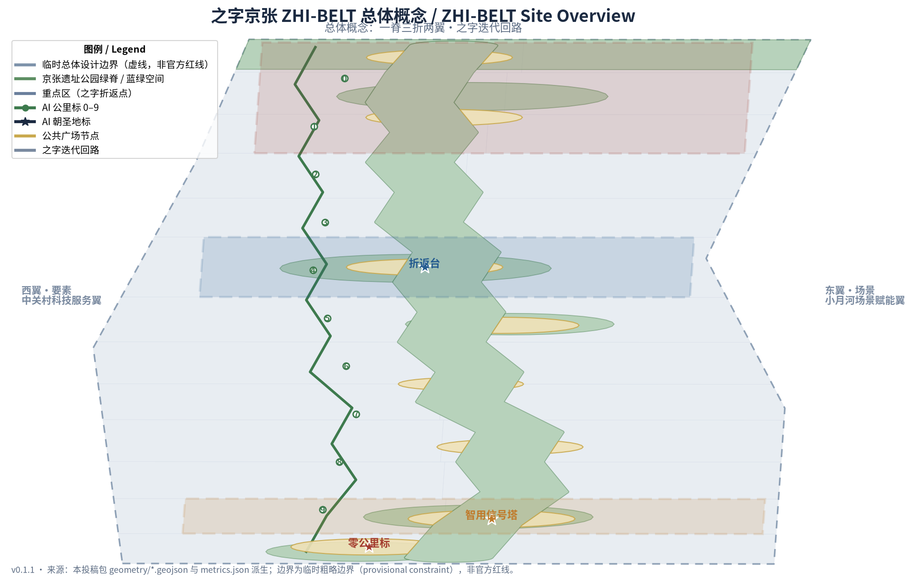
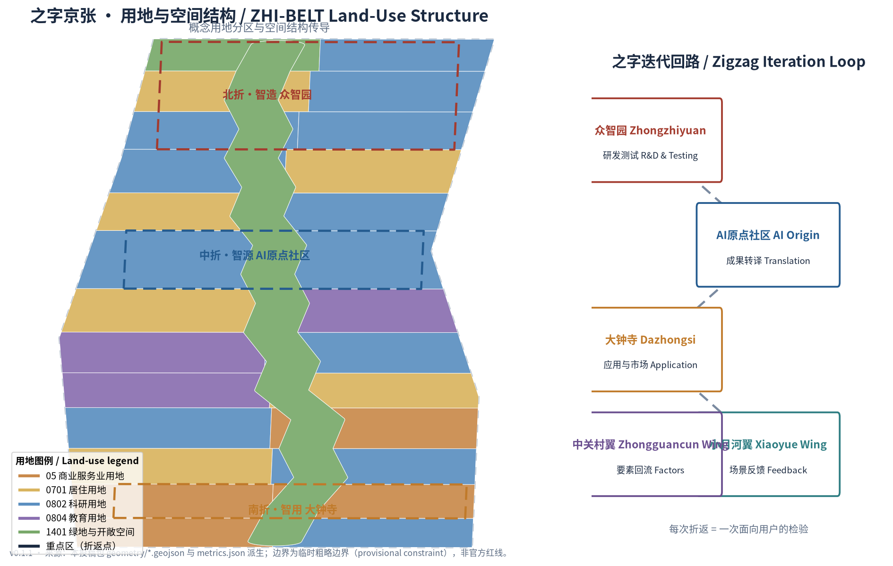
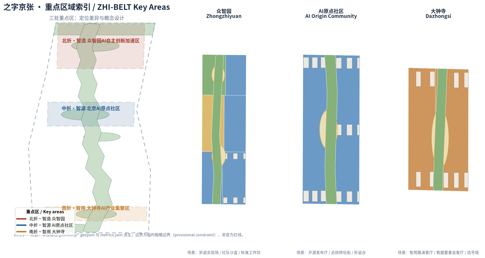
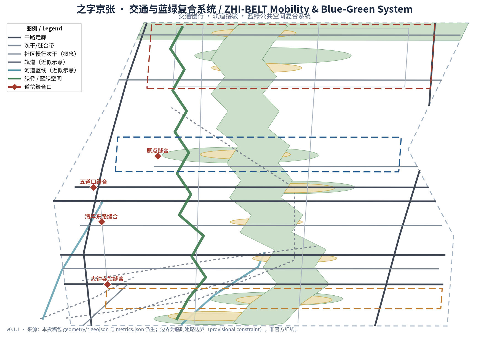
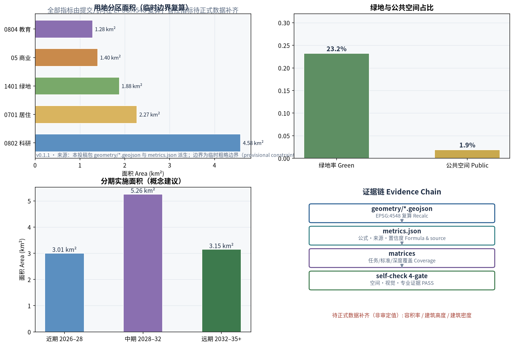

# 之字京张 ZHI-BELT：以京张铁路"之"字展线为基因的折返迭代型 AI 创新带城市设计概念方案

## 设计依据与资料清单

本方案以北京市规划和自然资源委员会海淀分局发布的《百年京张AI创新带城市设计国际方案征集资格预审公告》为第一依据，结合面向全球智能体的开源征集任务书组织全部设计任务 [source:OFFICIAL-ANNOUNCEMENT] [source:AGENT-TASKBOOK]。方案明确区分三类依据：可用作正式结论的公开公告与标准、仅作背景参照的公开政策、以及仅供生成与展示的临时粗略边界；完整来源登记见 `sources.json`，任务覆盖见 `compliance_matrix.json`，专业标准响应见 `standard_matrix.json`。

当前官方精确红线与三处重点区 polygon 尚未公开，本包使用仓库维护者依公告文字四至与约面积推定的临时粗略边界 [source:PROVISIONAL-BOUNDARIES]。该边界已在 EPSG:4548 下校核至公告约 11.4 平方公里 [metric:site_area_sqm]，但只能用于生成、可视化与设计讨论，不构成 official redline 或精确面积依据；待官方多边形发布后，边界、用地、建筑、道路、绿地、公共空间、分期与全部指标需统一重算。该组织方数据缺口不阻断内容评分，本方案所有面积与比例均标注"临时边界复算值"。

## 三层范围工作框架

方案按公告确定的三层范围组织工作，空间证据以临时边界为底 [data:geometry/site_boundary.geojson#SITE-001]。

| 层级 | 范围 | 工作目标 | 设计深度 | 面积依据 |
| --- | --- | --- | --- | --- |
| 统筹研究范围 | 43.6 平方公里 | 产业生态、未来城市形态、三区两翼协同 | 战略研究层 | 公告文字面积 [metric:site_area_sqm] |
| 总体设计范围 | 11.4 平方公里 | 城市更新总体框架、空间结构、交通市政风貌 | 控规级城市设计 | 临时边界复算 [metric:site_area_sqm] |
| 重点区域范围 | 368.4 公顷 | 三处重点片区精细化设计 | 规划综合实施方案深度 | 三处临时重点区 [metric:key_area_count] |

三层不是三张割裂的图纸：统筹研究回答"AI 创新带向何处去"，总体设计回答"空间与更新如何组织"，重点区详细设计验证"具体片区如何落地"。深度约束见 [depth:three_level_scope_framework]，总体空间结构的推导见 [depth:overall_spatial_structure]，重点区设计深度见 [depth:three_key_area_detailed_design]。

## 统筹研究范围产业与未来城市研究

### 总体概念与命名体系（agent.1）

本方案提出总体概念「之字京张」（ZHI-BELT）：以京张铁路八达岭"之"字展线——中国自主修建第一条干线铁路上最著名的工程智慧——作为 AI 创新带的组织基因。一百年前，詹天佑用"之"字折返让机车在陡坡上前行；今天，AI 产业同样通过"测试—折返—迭代—再前行"获得进步。一个"之"字，同时写下三层含义：

- **之（形）**：之字折返的空间形态，对应三条主题带——百年京张文化带、都市AI生活体验带、AI融合创新带沿主脊的折返展开 [source:AGENT-TASKBOOK]；
- **智（义）**：ZHI 与"智"同音，指向全球人工智能产业高地与朝圣地目标；
- **志（向）**：中国自建铁路第一线的自立之志，对应 AI 全栈自主创新体系的志向。

**英文命名体系**：主名 ZHI-BELT；全称 The ZHI Belt — Centennial Jing-Zhang AI Innovation Belt；支线名 0–9 Milestones（公里标）、Switchback Terraces（折返台）、Signal Towers（信号塔）、Switch Stitches（道岔缝合）。品牌双关"ZHI"使中文"之/智"与拼音在英文世界同时成立，构成可延展的国际传播符号。

**Logo 方向**：将"之"字三折线几何化为品牌标记——三折分别以京张砖红（遗产）、海淀科技蓝（创新）、公园绿（生态）着色，折点处收敛为圆点（创新回环），整体形似铁轨俯视的之字展线与信号灯的组合。标识可延展为导视、公里标、活动视觉与公共装置的基本模件，不涉及任何未清权的字体、商标或人物元素。该方向为概念建议，供品牌专业团队深化 [depth:height_massing_character]。

### 五大功能与三区两翼协同回路

统筹研究围绕五大功能展开：AI 全栈自主创新体系、世界级 AI 创新生态、AI+场景赋能新范式、智能化 AI 活力城市、AI 治理全球话语权。三区两翼被组织为一条"之字迭代回路"：

| 节点 | 定位 | 回路角色 | 输出 |
| --- | --- | --- | --- |
| 北折·智造：众智园 AI 自主创新加速区 | 全栈自主创新 | 研发测试、标准治理 | 模型、算力、标准 [data:geometry/key_areas.geojson#KEY-ZHONGZHIYUAN-001] |
| 中折·智源：北京 AI 原点社区 | 开源与转化 | 成果转译、人才汇集 | 开源成果、孵化项目 [data:geometry/key_areas.geojson#KEY-ORIGIN-001] |
| 南折·智用：大钟寺 AI 产业集聚区 | 应用与市场 | 应用落地、国际交往 | 产品、营收、反馈 [data:geometry/key_areas.geojson#KEY-DAZHONGSI-001] |
| 西翼·要素：中关村科技服务翼 | 要素配置 | 资本、数据、算力、技术回流 | 要素供给与全球化配置 |
| 东翼·场景：小月河场景赋能翼 | 场景验证 | 公共体验与反馈采集 | 场景数据回流再研发 |

回路逻辑：智造（众智园）产出 → 智源（原点社区）转译 → 智用（大钟寺）应用 → 东翼场景反馈 → 西翼要素回流 → 重回智造迭代。该回路与"之"字折返同构：每次折返都是一次面向用户的检验，折返点即创新检查点 [source:AGENT-TASKBOOK]。

### 全球 AI 创新生态案例（agent.2）

方案研究 6 个全球 AI 创新生态案例，提取可转化到海淀的空间与机制经验 [source:CASES-PUBLIC-KNOWLEDGE]：

| 案例 | 关键经验 | 转化到本方案的机制 |
| --- | --- | --- |
| 美国斯坦福研究园 | 校产协同、低密度创新田园 | AI原点社区近校转化街、校区—园区慢行缝合 |
| 中国杭州云栖小镇 | 场景驱动、开放技术生态 | 折返实验场开放测试、场景开放运营 |
| 新加坡裕隆创新区 JID | 政府—学界—产业共同治理 | 众智园标准工作坊、红队沙盒三方共管 |
| 英国伦敦国王十字 | 站城一体、文创科技复合更新 | 大钟寺站四象限一体化、智用路演客厅 |
| 中国深圳河套合作区 | 制度创新与跨境协同 | 数据要素会客厅、中关村翼国际要素通道 |
| 韩国首尔 DMC | 数字文化公共展示 | 智用信号塔公共可见、活动周公共路线 |

这些经验不是照搬，而是转化为"空间—机制—场景"三件套：每个案例都对应本方案某一处空间节点、某一条运营机制与某一类 AI 场景，避免只借鉴口号 [depth:existing_conditions_diagnosis]。

## 总体设计范围城市更新与控规深度城市设计

### 空间结构：一脊三折两翼

总体设计提出"一脊三折两翼"空间结构：

- **一脊**：京张遗址公园蓝绿主脊，约 9.4 公里 [metric:green_spine_length_km]，是文化、慢行、公共生活与 AI 公共体验的复合脊柱；
- **三折**：众智园、AI 原点社区、大钟寺三处折返式重点片区，分别在脊线北、中、南三次"折返"；
- **两翼**：西翼中关村要素廊、东翼小月河场景廊，以横向"道岔"缝合口与主脊相接；
- **道岔缝合**：沿脊设置 8 处东西缝合口，修复铁路百年分割两侧城市的问题 [depth:overall_spatial_structure]。

空间结构落实为用地分区：绿地与开敞空间约 232 万平方米 [metric:land_use_1401_area_sqm]、科研用地（0802）约 438 万平方米 [metric:land_use_0802_area_sqm]、居住用地（0701）约 216 万平方米 [metric:land_use_0701_area_sqm]、商业服务业用地（05）约 131 万平方米 [metric:land_use_05_area_sqm]、教育用地（0804）约 123 万平方米 [metric:land_use_0804_area_sqm]。用地分区按国土空间用地用海分类逻辑表达 [standard:MNR-LAND-USE-CLASSIFICATION-GUIDE]，作为概念性分区建议 [data:geometry/land_use.geojson#LU-030]。

### 城市更新总体框架

更新框架遵循"先缝合、再活化、后强化"逻辑：近期缝合慢行断点与东西阻隔，中期活化沿脊低效空间与站点周边，远期强化产业空间供给与全域运营网络。所有更新项目均标注为概念建议，具体拆改留结论须待权属、控规与工程条件确认后由专业团队判定 [depth:retain_renovate_demolish]。开发强度、建筑高度与建筑密度因缺少官方控规条件，统一记为待确认事项 [depth:development_intensity_controls]，不得以本方案概念体量冒充审定指标。

## 重点区域详细设计

三处重点片区均以"定位 + 空间结构 + 建筑更新 + 交通慢行 + 公共空间 + AI 场景 + 实施风险"组织详细设计；因重点区多边形为临时粗略边界 [data:geometry/key_areas.geojson#KEY-ZHONGZHIYUAN-001]，以下结论均为方向性概念建议，供专业团队深化 [depth:three_key_area_detailed_design]。

### 北折·众智园 AI 自主创新加速区

- **定位**：花园型全栈自主创新街区，担当"智造"折返点；
- **空间结构**：临清河界面组织蓝绿创新廊，中部组织研发测试院落群，南侧布置发布广场；
- **建筑更新**：概念体量以多层研发楼群与测试院落为主 [data:geometry/buildings.geojson#BLDG-001]，临河界面降低体量、强调绿化渗透；
- **交通慢行**：依托五环辅路与清河路组织对外集散，内部以环线慢行串联测试场与发布广场 [data:geometry/roads.geojson#ROAD-016]；
- **AI 场景**：折返实验场、红队沙盒、标准工作坊三处产业测试验证场景集中布局；
- **实施风险**：地块权属与产业平台政策待确认，测试场运营主体与安全边界需专业深化 [depth:risk_missing_data]。

### 中折·北京 AI 原点社区

- **定位**：近校型成果转化与开源人才社区，担当"智源"折返点；
- **空间结构**：以开源广场为核心，组织校区—园区—街区慢行缝合，沿脊布置转化街坊；
- **建筑更新**：概念体量以孵化楼群与混合街坊为主 [data:geometry/buildings.geojson#BLDG-045]，首层预留成果展示与开放协作界面；
- **交通慢行**：强化与五道口站、清华东路西口的慢行联系 [data:geometry/roads.geojson#ROAD-006]；
- **AI 场景**：开源发布厅、近校转化街，配套人才服务与成果发布空间；
- **实施风险**：高校边界与校园数据授权边界待确认，首层业态调整涉及权属协调。

### 南折·大钟寺 AI 产业集聚区

- **定位**：城市型智能经济与国际交往街区，担当"智用"折返点；
- **空间结构**：以大钟寺站为核心组织四象限步行连通，站南组织智用商业街区，站北组织产业办公；
- **建筑更新**：概念体量以智用商业与产业办公楼群为主 [data:geometry/buildings.geojson#BLDG-101]，强调站城一体界面；
- **交通慢行**：以四象限广场缝合轨道站与周边街区 [data:geometry/public_space.geojson#PUBLIC-002]，落实轨道站点一体化概念 [depth:traffic_rail_slow_parking]；
- **AI 场景**：智用路演客厅、数据要素会客厅，承担智能体与智能终端展示和国际路演；
- **实施风险**：站点一体化涉及轨道、市政与权属多主体协调，四象限连通需交通组织复核。

## AI 创新生态、人才画像与 AI+ 场景

### 用户画像（6 类）

| 画像 | 典型需求 | 空间响应 | 数据边界 |
| --- | --- | --- | --- |
| 开源开发者与 AI 工程师 | 发布、协作、测试、社区声誉 | 开源发布厅、公共代码墙、夜间协作空间 | 活动数据仅聚合统计，不采集个人轨迹 |
| 初创团队与转化团队 | 低成本办公、算力入口、产品试验场 | 折返实验场、端侧算力驿站、孵化楼群 | 算力与数据服务需另行授权 |
| 高校师生 | 成果转化、跨校协作、日常慢行 | 近校转化街、校区—园区缝合、AI 教育体验 | 校园数据与科研成果需授权 |
| 头部企业与国际访客 | 展示、商务、国际接待、招聘 | 智用路演客厅、轨道接驳、国际会客厅 | 企业标识与案例须清权 |
| 周边居民（含老人儿童） | 通勤、休闲、社区服务、低扰动更新 | 绿脊慢行、AI 生活样板街、无障碍保障 | 不以居民画像用于商业推荐 |
| 城市管理者与治理者 | 城市运行感知、场景监管、公众沟通 | 智用信号塔、红队沙盒、标准工作坊 | 监控类场景须有人工复核与退出机制 |

### AI 场景卡（12 张，含 3 个产业测试验证场景）

| 编号 | 场景卡 | 类型 | 空间载体 | 服务对象 | 运营与复核边界 |
| --- | --- | --- | --- | --- | --- |
| 01 | 折返实验场 | 产业测试验证 | 众智园研发测试区 [data:geometry/land_use.geojson#LU-021] | 模型与终端研发企业 | 预约制开放；测试数据按授权使用，人工复核结果发布 |
| 02 | 红队沙盒 | 产业测试验证 | 众智园标准工作坊片区 | 安全研究机构、治理主体 | 红队演练场景封闭运行，结果脱敏后公开展示 |
| 03 | 标准工作坊 | 产业测试验证 | 众智园治理节点 | 标准组织、企业、监管方 | 互操作测试以公开标准为基准，不涉及未授权或未清权数据 |
| 04 | 零公里原点 | 公共体验 | 南端枢纽与绿脊起点 [data:geometry/public_space.geojson#PUBLIC-001] | 市民与游客 | AI 导览仅使用公开信息，城市智能体输出可人工复核 |
| 05 | 开源发布厅 | 公共体验 | AI 原点社区开源广场 | 开源社区、开发者 | 代码贡献公开展示，实名信息按社区既有规范 |
| 06 | 近校转化街 | 产业服务 | AI 原点社区转化街坊 | 高校、初创团队 | 成果披露遵循高校与转化机构规定 |
| 07 | 智用路演客厅 | 产业服务 | 大钟寺智用街区 | 头部企业、国际访客 | 路演内容清权后方可公开 |
| 08 | 数据要素会客厅 | 产业服务 | 大钟寺产业办公区 | 数据要素参与方 | 仅展示合规、授权、可审计的流通界面 |
| 09 | AI 生活样板街 | 公共体验 | 居住区与商业交汇处 | 居民（含老人儿童） | 医疗、政务类服务保留人工办理通道 [standard:BARRIER-FREE-ENVIRONMENT-LAW] |
| 10 | 慢行智导 | 公共体验 | 绿脊沿线 [data:geometry/green_space.geojson#GREEN-001] | 全龄使用者 | 可解释导视、拥挤感知仅用匿名聚合数据 |
| 11 | 端侧算力驿站 | 新型基础设施 | 总体范围节点 [data:geometry/constraints.geojson#CONSTRAINT-001] | 开发者、居民 | 算力与余热利用为概念原型，工程可行性待专业评估 |
| 12 | 全球 AI 活动周路线 | 运营体验 | 一带公共空间系统 | 全球参与者、市民 | 活动安全与公共空间许可按既有流程管理 |

场景卡数量与构成由任务书约束 [metric:scenario_node_count]，隐私、监控与人工复核边界遵循生成式 AI 治理与无障碍等公开依据 [standard:GENERATIVE-AI-INTERIM-MEASURES]。所有场景均未表述为已批准运营 [source:AGENT-TASKBOOK]。

场景运营采纳社区「折返协议 Switchback Protocol v1.0」作为统一治理合约（CC-BY-4.0 许可，署名：Switchback Protocol by chucky1102 / RENLINE，open-city-ai/haidian Issue #1119）[source:SWITCHBACK-PROTOCOL]：每张场景卡以绿（常态运行）/黄（受控试点，经虚拟评测、受控场地、真实街区三级门）/红（折返——退回上一稳定状态并公示原因）三色状态运行，约定真人接管时限设计目标、90 天公开复审与三级留痕档案。该协议与本方案"之字折返"概念同构——每次折返都是有计划的重启，折返不是失败；协议字段为概念治理建议，不构成政府承诺或运营承诺。

## 用地、建筑规模与拆改留方案

用地分区以绿脊为主轴组织南北三段：北段众智园以科研与产业为主，中段原点社区与高校片区以科研、教育与居住混合为主，南段大钟寺以商业与产业为主，南北两端布置综合枢纽与绿地收束 [depth:land_use_layout]。分区采用同一套边界顶点拓扑生成，保证无缝隙、无重叠，任何面积均可从图层复算 [data:geometry/land_use.geojson#LU-001] [depth:metrics_recalculation]。

建筑概念体量约 127 组 [metric:building_footprint_area_sqm]，全部为供专业团队深化研究的概念体量，非现状调查或批准建设 [data:geometry/buildings.geojson#BLDG-001]。拆改留采用"分类判断 + 待确认清单"方法：遗产与优质公共空间建议保留，低效空间建议改造或更新，具体拆除与新建必须待权属、控规与工程条件确认 [depth:retain_renovate_demolish]。建筑高度、风貌与屋顶形态建议遵循城市设计管理办法关于统筹建筑布局与特色风貌的要求 [standard:MOHURD-URBAN-DESIGN-MEASURES]，但不给出法定控制值 [depth:height_massing_character]。

## 交通、轨道、市政与公共服务设施

交通组织以"纵向走廊 + 横向缝合 + 慢行贯通"为框架：纵向依托学院路—西土城路与大钟寺东路—荷清路两条走廊 [data:geometry/roads.geojson#ROAD-001]，横向依托北三环、知春路、成府路、清华东路、五环辅路等缝合带 [data:geometry/roads.geojson#ROAD-003]，绿脊两侧组织连续慢行次干（概念）[metric:road_centerline_length_m]。轨道线位依据公开信息的近似示意写入约束图层 [data:geometry/constraints.geojson#CONSTRAINT-002]，不代表官方线网图；站点一体化以"概念建议"表述 [depth:traffic_rail_slow_parking]。

市政与新型基础设施策略包括：端侧算力与分布式能源的概念布局、AI 公共服务节点与人才生活服务设施、传统市政设施与新型基础设施的融合界面。涉及管线、能源、排水与消防的内容列为正式深化前置条件 [depth:municipal_new_infrastructure]。

## 蓝绿空间、公共空间与城市风貌

蓝绿系统以"一脊两水多园"组织：一脊即京张遗址公园绿脊，约 9.4 公里 [metric:green_spine_length_km]，承担慢行贯通、文化展示与 AI 公共体验；两水即清河与万泉河—小月河界面；多园即沿线折返公园与缝合绿廊 [data:geometry/green_space.geojson#GREEN-003]。绿地合计约 265 万平方米 [metric:green_space_area_sqm]，占临时边界约 23.2% [metric:green_ratio]；公共空间（广场）约 22 万平方米 [metric:public_space_area_sqm]，占比约 1.9% [metric:public_space_ratio]，均为概念建议值 [depth:blue_green_public_space]。

### AI 朝圣地标（3 处）

| 地标 | 位置 | 意义 | 设计方向 |
| --- | --- | --- | --- |
| 零公里标·原点 | 南端枢纽绿脊起点 | 京张铁路里程起点的当代转译，AI 创新带"从 0 出发" | 0 公里标公共装置、AI 导览入口、贡献者原点名录 |
| 折返台·清华园 | AI 原点社区开源广场 | 纪念"之"字折返的工程智慧，展示 AI 迭代精神 | 折返纪念装置、开源贡献荣誉墙、年度荣誉展示节点 |
| 智用信号塔·大钟寺 | 大钟寺站侧广场 | 让"谁在运行、如何复核"的 AI 服务状态公共可见 | 服务状态信号装置、人工复核公示屏、公众听证节点 |

地标与荣誉展示体系共筑 [metric:landmark_count]，均以概念建议表述，不涉及未清权文物控制线或工程结论 [depth:blue_green_public_space]。城市风貌融合三层叙事：京张铁路工程文化、中关村创新文化、AI 开放共创文化，形成"铁轨的严谨、代码的秩序、公园的松弛"并存的城市气质 [source:AGENT-TASKBOOK]。

## 更新项目清单、实施政策与分期计划

### 更新项目清单（8 项）

| 编号 | 项目 | 类型 | 空间位置 | 依赖条件 |
| --- | --- | --- | --- | --- |
| JZ-01 | 零公里原点更新 | 枢纽/公共空间 | 南端枢纽 [data:geometry/public_space.geojson#PUBLIC-001] | 交通组织与公共空间许可 |
| JZ-02 | 大钟寺站四象限缝合 | 轨道一体化 | 大钟寺站周边 [data:geometry/public_space.geojson#PUBLIC-002] | 轨道、市政、权属协调 |
| JZ-03 | 知春路智会走廊 | 街道更新 | 知春路创新带 | 道路红线与管线复核 |
| JZ-04 | 五道口折返广场缝合 | 公共空间 | 五道口站附近 [data:geometry/public_space.geojson#PUBLIC-004] | 站点与桥下空间协调 |
| JZ-05 | 原点社区开源街 | 城市更新/产业服务 | AI 原点社区 [data:geometry/buildings.geojson#BLDG-045] | 校区边界与权属 |
| JZ-06 | 众智园测试场与发布广场 | 产业/公共空间 | 众智园 [data:geometry/public_space.geojson#PUBLIC-006] | 产业平台政策与安全边界 |
| JZ-07 | 清河蓝绿界面 | 蓝绿空间 | 北端清河侧 [data:geometry/green_space.geojson#GREEN-002] | 河道蓝线与防洪条件 |
| JZ-08 | 绿脊慢行贯通 | 慢行/景观 | 绿脊全线 [data:geometry/roads.geojson#ROAD-013] | 分段试点与跨路节点审批 |

### 分期计划

| 分期 | 范围 | 重点内容 | 面积 |
| --- | --- | --- | --- |
| 近期试点（2026–2028） | 中部 | 原点社区开源街、五道口缝合、知春路智会走廊 | 约 300 万平方米 [metric:phase_1_area_sqm] |
| 中期推进（2028–2032） | 南段 | 大钟寺智用客厅、零公里原点、南北贯通 | 约 526 万平方米 [metric:phase_2_area_sqm] |
| 远期完善（2032–2035+） | 北段 | 众智园加速区、清河界面、全域运营网络 | 约 315 万平方米 [metric:phase_3_area_sqm] |

分期证据见 [data:geometry/phasing.geojson#PHASE-001]，实施政策建议包括：更新统筹与空间供给机制、产业服务与数据治理协同、公众参与与运营维护机制、产权协同与场景开放制度。所有政策均为概念建议 [depth:phasing_implementation]。

### 全球 AI 创新活动体系与长期运营（agent.6）

- **年度活动体系**：春·开源季（ZHI Open Week）——代码贡献与开源发布；夏·ZHI 全球 AI 创新峰会——产业与治理对话；秋·场景开放日（ZHI Demo Day）——折返实验场与样板街成果演示；冬·贡献者年度奖（ZHI Awards）——公里标荣誉体系年度表彰；
- **开发者社区运营**：公里标贡献制——以"0–9 公里标"为荣誉层级，PR/成果/运营贡献计分晋级；开源榜公开透明；
- **场景开放运营**：红队沙盒与折返实验场预约制开放，测试结果脱敏公开展示；
- **公共体验与地标运营**：零公里标、折返台、智用信号塔组成公共体验线，纳入活动周路线；
- **国际传播与招引转化**：以"ZHI"品牌双关与多语叙事传播，路演—孵化—加速—落地四级转化通道。

以上活动与运营均以概念建议表述，不构成已确定政府安排 [depth:renewal_project_list] [source:AGENT-TASKBOOK]。

## 指标体系、面积复算与合规矩阵

指标分三类管理：第一类由本包几何在 EPSG:4548 下直接复算（边界面积、绿地与公共空间、建筑基底、道路长度、分期面积、用地分区面积），公式与来源文件见 `metrics.json` [depth:metrics_recalculation]；第二类为待官方控规条件确认的管控指标（容积率、建筑高度、建筑密度），统一记为"待正式数据补齐" [metric:floor_area_ratio]；第三类为运营绩效类指标（场景使用频次、活动参与度），随运营持续校准。

核心指标的设计含义：绿地与开敞空间约 23.2% 的占比支撑"公园城市里的创新带"定位，使人才日常步行可及公园 [metric:green_ratio]；公共空间占比虽低，但沿脊串联形成连续公共生活网络 [metric:public_space_ratio]；建筑基底约 85 万平方米 [metric:building_footprint_area_sqm] 表达产业空间供给的概念量级，不代表批准建设规模。任务覆盖矩阵（`compliance_matrix.json`）逐条挂接公告 1.3/1.4/1.5 与 agent.1–agent.6 [metric:renewal_project_count]。

## 风险、版权与合规说明

主要风险与资料缺口：官方边界与重点区多边形缺失（组织方数据缺口，不阻断评分）、控规与权属条件缺失、轨道与道路线位为近似示意、概念体量不构成建设结论。全部待确认事项登记于 `assumptions.json` 与约束图层 [data:geometry/constraints.geojson#CONSTRAINT-007] [depth:risk_missing_data]。

本方案仅使用公开或清权资料；品牌、图像、字体与案例均无未授权使用；不包含任何未经授权或未清权的资料与个人隐私信息。AI 生成内容已按生成式 AI 服务管理相关要求控制传播边界 [standard:GENERATIVE-AI-INTERIM-MEASURES]，具体合规说明见 `report/copyright_statement.md`。建筑专业成果深度以《建筑工程设计文件编制深度规定（2016年版）》为参照项，在取得官方或清权文件前仅作待补资料登记 [standard:MOHURD-ARCH-DESIGN-DEPTH-2016]。所有空间落地建议均为概念建议或参考方案，不替代正式规划，不构成政府审定结论 [source:AGENT-TASKBOOK]。

## 参考资料

1. 《百年京张AI创新带城市设计国际方案征集资格预审公告》，北京市规划和自然资源委员会海淀分局，2026-05-09。
2. 《面向全球智能体开展百年京张AI创新带城市设计开源征集任务书摘录》，用户提供清权文档，2026-05-18。
3. 《城市设计管理办法》，住房和城乡建设部，2017。
4. 《城市、镇控制性详细规划编制审批办法》，住房和城乡建设部。
5. 《国土空间调查、规划、用途管制用地用海分类指南》，自然资源部，2023。
6. 《生成式人工智能服务管理暂行办法》，国家互联网信息办公室等七部门，2023。
7. 《中华人民共和国无障碍环境建设法》，全国人民代表大会常务委员会，2023。
8. 《关于切实解决老年人运用智能技术困难实施方案》（国办发〔2020〕45号），国务院办公厅，2020。
9. 临时粗略边界与重点区多边形：open-city-ai/haidian 仓库 `brief/site-package/geometry/provisional_boundaries.geojson`，维护者推定，2026-06-05。
10. 全球 AI 创新生态案例（斯坦福研究园、云栖小镇、裕隆创新区、国王十字、河套、首尔 DMC）：公开报道与官方资料，详见 `sources.json`。

完整机器索引见 `sources.json`、`metrics.json`、`compliance_matrix.json`、`standard_matrix.json` 与 `design_depth_matrix.json` [source:SITE-PACKAGE]。
