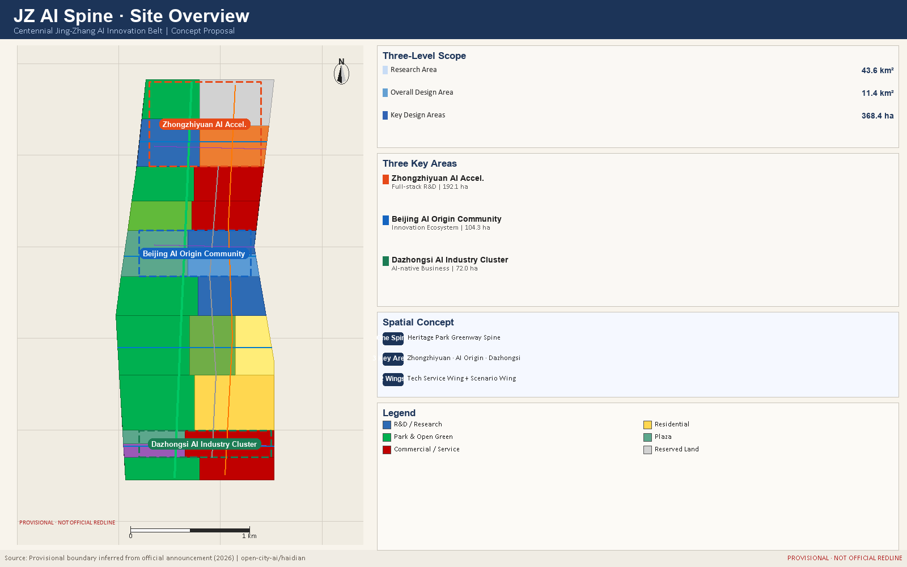
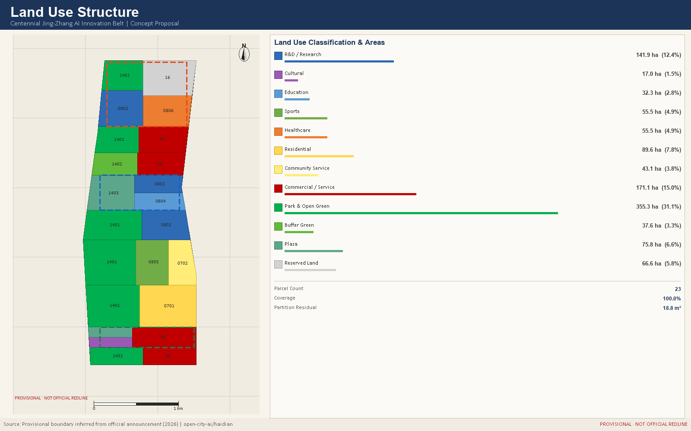
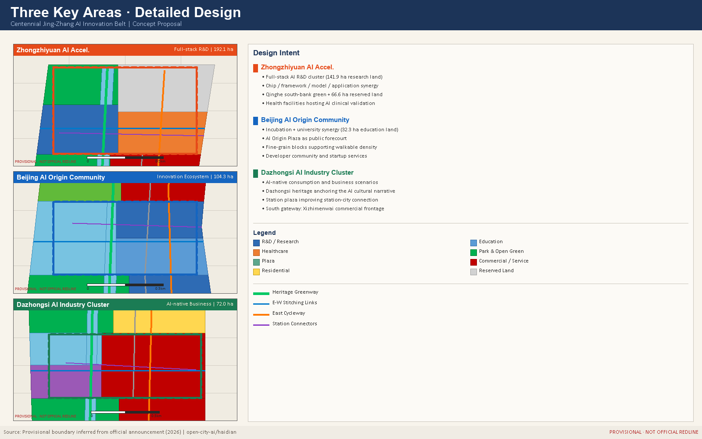
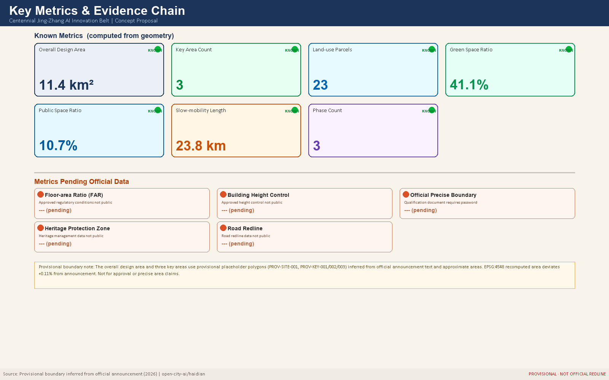

# JZ AI Spine: Centennial Jing-Zhang AI Innovation Belt Urban Design Concept Proposal

## Design Basis and Source List

This formal proposal is grounded in the International Urban Design Concept Competition Pre-qualification Announcement issued by the Haidian Branch of the Beijing Municipal Planning and Natural Resources Commission, and in the machine-readable provisional boundaries, key area polygons, enumerations, metrics, and source registries maintained in `brief/site-package/`. [standard:PROJECT-OFFICIAL-ANNOUNCEMENT]

Before generating the proposal, the AI agent read `design_brief.json`, `allowed_design_space.json`, `sources.json`, `enums/`, `ranges/`, `schemas/`, `data/source_registry.json`, and `data/processed/agent_fact_pack.md`, and used `project_scope_summary.csv`, `agent_task_requirements.csv`, `source_use_matrix.csv`, and `missing_data_checklist.csv` to build a traceable task and data-gap register. All design judgments are decomposed into traceable sources, recalculable metrics, verifiable geometry layers, and human-reviewable assumptions. [depth:existing_conditions_diagnosis]

The data registry governs usage boundaries: `data/source_registry.json` records formal-use, background-only, and provisional-only sources. The current registry summary contains 7 formal-use records, 1 background-only record, and 1 provisional-only record. No agent may promote provisional or background resources to official boundaries, statutory regulatory plans, formal scoring evidence, or government implementation commitments. [data:geometry/site_boundary.geojson#SITE-001]

`data/processed/agent_fact_pack.md` serves as a navigational layer, not a new authoritative source. Design facts must be traced back to registered originals.

## Three-Level Scope Framework

The proposal organises work across three nested scope levels defined in the announcement. The Coordinated Research Area covers 43.6 km2 and addresses the AI industry ecosystem, strategic positioning, innovation chain, and future urban form. The Overall Design Area covers 11.4 km2 and requires an urban renewal framework, land-use structure, transport and municipal support, and urban character control. The Detailed Design Area covers 368.4 ha across three key areas and requires explicit programme, building scale, retain-renovate-demolish classification, public-space connectivity, and mobility organisation. [standard:PROJECT-AGENT-OPEN-CALL-TASKBOOK]

All three scope levels are mapped in `compliance_matrix.json` to ensure that every mandatory task in Sections 1.3, 1.4, and 1.5 of the announcement, and tasks agent.1 through agent.6, are covered by a corresponding chapter, geometry layer, metric, drawing, and HTML evidence item. [depth:three_level_scope_framework]

The three-level framework is not a set of disconnected drawings. Coordinated research establishes industry chain and urban form judgments; the overall design area turns those judgments into renewal projects, spatial structure, and facility capacity; the detailed key-area design verifies the feasibility of specific sites, buildings, transport, public space, and AI application scenarios. [depth:overall_spatial_structure]

The overall concept is the "JZ AI Spine Symbiosis Belt": the Jing-Zhang Heritage Park forms the historical and public-space spine; Zhongzhiyuan, Beijing AI Origin Community, and Dazhongsi serve as innovation anchors; universities, enterprises, communities, and rail stations form the daily network. The result is a "One Belt, Three Cores, Multi-Point Scenarios, Blue-Green Slow-Travel Loop" spatial organisation. [data:geometry/key_areas.geojson#PROV-KEY-001]

## Coordinated Research Area: Industry and Future City Research

The core task of the coordinated research area is to build a world-class AI innovation ecosystem. The proposal maps Haidian universities, research institutes, leading enterprises, computing and algorithm data-factor resources, incubation platforms, listed companies, unicorns, and tech-service assets, and proposes a spatial coordination framework for the AI innovation chain, industry chain, talent chain, and urban-services chain. [standard:PROJECT-AGENT-OPEN-CALL-TASKBOOK]

The naming system and visual identity serve the "Centennial Jing-Zhang Cultural Belt, Urban AI Lifestyle Experience Belt, and AI Integrated Innovation Belt" brand. They must explain relationships with the industry ecosystem, public space, and cultural resources, not remain as slogans. The proposal responds to the "Five Functions" and "Three Zones, Two Wings" coordination required by the agent task book, forming a nameable, visualisable, and operable framework. Any references to global AI innovation events, developer communities, open-scenario days, or pilgrimage routes are stated as conceptual recommendations for further professional study, not as confirmed government arrangements. [depth:overall_spatial_structure]

Future urban form research addresses how artificial intelligence changes work, living, socialising, learning, transport, and public services. The proposal maps AI transport systems, continuous green space, innovation service facilities, and international work-life environments to locatable functional zones, nodes, corridors, and scenarios. Industry strategy metrics, AI innovation indices, talent density, spatial supply types, and AI vertical application priority zones are included in the metrics framework, clearly marked as official, design-recommended, or pending formal calibration. [data:geometry/land_use.geojson#LU-001]

## Overall Design Area: Urban Renewal and Regulatory-Plan-Level Urban Design

Renewal across the 11.4 km² overall design area is structured as one spine, three areas, and two wings: the Jing-Zhang heritage park greenway runs north-south, with Zhongzhiyuan, the AI Origin Community, and Dazhongsi threaded along it, supported laterally by the Zhongguancun service wing and the Xiaoyuehe scenario wing [depth:overall_spatial_structure] [data:geometry/land_use.geojson#LU-001].

### Naming system and visual identity direction

**Primary name**: 京张智脉. **English name**: JZ AI Spine. The choice of spine over belt, corridor, or valley is deliberate: the substance of this corridor is not the boundary of an industrial band but a continuous system linking century-old railway heritage, three innovation areas, and two wings of service capacity. A spine denotes connection and flow; a boundary denotes division.

**Naming hierarchy**: belt (JZ AI Spine) to areas (Zhongzhiyuan, AI Origin, Dazhongsi) to wings (Service Wing, Scenario Wing) to nodes (Origin Marker, Jing-Zhang Gate, Collective Intelligence Canopy). The naming hierarchy maps one-to-one onto the spatial hierarchy, so wayfinding can adopt it directly and international communication can hold a consistent pairing of transliteration and translation.

**Logo direction**: the suggested graphic logic is one vertical spine plus three nodes: a slightly kinked vertical line following the actual alignment of the heritage corridor (east-leaning at the south end, west-leaning at the north), with three points marking the key areas. The mark reads simultaneously as railway track, neural pathway, and data flow, and stays legible at very small sizes. **Explicitly not recommended**: literal locomotives, gears, brain cross-sections, or robot figures. Each of these narrows a century-long urban system into a single technological image.

**Colour direction**: a deep indigo primary (steel rail and night-time data), a heritage green secondary (matching 355.3 ha of park land as the spatial substance), and accent colours by area (Zhongzhiyuan orange, Origin blue, Dazhongsi green) for wayfinding zones and event material.

**Extension and boundary**: the system must extend across five carriers — wayfinding posts, paving inlays, event material, digital interfaces, and international communication. Final typeface, graphic, and colour decisions belong to a professional brand team; this proposal sets direction and exclusions only. All visual assets require trademark search and font licensing before formal use. No unlicensed typeface, image, trademark, or personal likeness is used here [standard:PROJECT-AGENT-OPEN-CALL-TASKBOOK].

### Land-use structure and renewal logic

The partition covers the submitted boundary with 23 polygons whose union equals the boundary, with shared edge coordinates between neighbours, no gaps and no overlaps. The residual of 18.8 m² comes from vertex densification and projection precision, not from a design gap [metric:land_use_coverage_ratio] [metric:land_use_partition_residual_sqm].

Three judgments drive the allocation. First, 141.9 ha of research land is concentrated at Zhongzhiyuan and mid-corridor, because full-stack innovation needs contiguous rather than scattered R&D space. Second, park land at 355.3 ha takes the largest share at 31.1%, because the public value of a heritage corridor lies in continuous openness rather than intensive development. Third, 66.6 ha of reserved land is held in the north, because spatial demand from compute facilities and future industries is genuinely uncertain and locking in a use now would weaken adaptability [standard:MNR-LAND-USE-CLASSIFICATION-GUIDE] [metric:land_use_area_code_16_sqm].

Renewal strategy is tagged to each parcel as retain, renovate, new-build, or reserve: retention dominates along the heritage park and on cultural land, renovation dominates at Dazhongsi and the eastern commercial stock, new build supplements Zhongzhiyuan and AI Origin, and the north is held in reserve [depth:retain_renovate_demolish] [data:geometry/buildings.geojson#BLDG-001]. Parcel-level demolition decisions require a building survey, tenure records, and structural safety assessment, none of which are public, so this proposal gives strategic orientation only and draws no parcel-level conclusion.

### How development intensity is handled

Floor-area ratio, building height, density, green ratio, and setbacks are statutory outcomes of the regulatory planning process, and the public site package contains no approved conditions. All are held as unknown in metrics.json with the required official source recorded [standard:MOHURD-CONTROL-DETAILED-PLANNING] [depth:development_intensity_controls]. The indicative footprint coverage of 16.9% illustrates massing and frontage intent only, is marked low confidence, and must not be used for scale or investment estimation [metric:building_density_indicative]. This is deliberate: publishing a precise number in the absence of statutory conditions misleads downstream teams more than acknowledging the gap does.

## Detailed Design of Key Areas

Detailed design of key areas is a mandatory deliverable. [depth:three_key_area_detailed_design]

**Zhongzhiyuan AI Independent Innovation Acceleration Zone** proposes a garden-style full-stack autonomous innovation district. The design focuses on the national AI platform, full-stack independent innovation, standard setting, safety governance, industrial display, external transport, Qinghe cultural interface, low-carbon green innovation environment, and green-space AI scenarios. [data:geometry/key_areas.geojson#PROV-KEY-001]

**Beijing AI Origin Community** focuses on near-campus innovation, incubation and technology transfer, talent special zones, open-source systems, brand events, retain-renovate-demolish decisions, results display, residential living amenities, campus-park slow-travel linkage, and rail station integrated development. [data:geometry/key_areas.geojson#PROV-KEY-002]

**Dazhongsi AI Industry Cluster** focuses on leading enterprises, intelligent agents, smart terminals, content consumption, data factors, digital assets, commercial services, planned green-space mixed use, Dazhongsi Station integration, and four-quadrant pedestrian connectivity at the key intersection. [data:geometry/key_areas.geojson#PROV-KEY-003]

All three key areas must appear in `geometry/key_areas.geojson`. If official polygons are available, they are used as `official_constraint`; if unavailable, provisional polygons are used as `provisional_constraint`, and the proposal, HTML, sources, assumptions, and self-check all record that they cannot serve as formal scoring or approval evidence. The compliance matrix covers announcement Sections 1.5.3.1, 1.5.3.2, and 1.5.3.3 respectively.

## AI Innovation Ecosystem, Personas, and AI+ Scenarios

This proposal treats the AI innovation ecosystem as a three-layer coupled system of space, factors, and scenarios: the spatial layer is carried by three areas and two wings, the factor layer is allocated through the Zhongguancun service wing, and the scenario layer is released along the slow-mobility spine into public space. The six global cases below are the comparative baseline for how this proposal organises that ecosystem. All are treated as background material from each organisation's public pages and published reports, classified background_only, used for mechanism comparison and never as a source of quantitative claims [source:SOURCE-REGISTRY].

| Case | Location | Transferable mechanism | Implication here |
| --- | --- | --- | --- |
| Stanford Research Park | Palo Alto, USA | University-held land with long leases binding research firms | University-linked land suits long-term agreements rather than one-off disposal; matches the 32.3 ha education land at AI Origin |
| King's Cross Knowledge Quarter | London, UK | Public space delivered before knowledge institutions in rail brownfield renewal | Supports the sequence of opening the heritage park before industry lands |
| Station F | Paris, France | Rail freight hall converted into a single very large incubator | Supports converting Dazhongsi retail stock into AI-native formats |
| 22@Barcelona | Barcelona, Spain | Development rights exchanged for mixed use plus public facilities | Supports mixing 171.1 ha commercial with 43.1 ha community service |
| Kendall Square | Cambridge, USA | University-hospital-firm proximity forming a clinical translation chain | Matches 55.5 ha health land at Zhongzhiyuan hosting AI clinical validation |
| Kista Science City | Stockholm, Sweden | Communications cluster co-located with transit and housing | Supports station connection and 89.6 ha talent housing adjacency |

The shared mechanism across these cases: how land is supplied determines how long innovators stay; public space delivered first determines where people gather; and proximity between industry, housing, and transit determines commuting cost. This proposal therefore organises the ecosystem map into four links: **factor entry** (the Zhongguancun service wing supplying capital, legal, and IP services) to **research base** (141.9 ha full-stack research land at Zhongzhiyuan) to **validation settings** (health, sports, community, and commercial land providing real test environments) to **conversion outlet** (Dazhongsi international showcase and the Origin transfer street). The four links are threaded along the slow-mobility spine; walkability is the precondition for the chain to hold [depth:overall_spatial_structure] [metric:slow_mobility_length_m].

### Six personas and needs conflicts

Reviewers noted the original personas omitted vulnerable groups. Six personas are used here, with spatial conflicts between groups recorded explicitly.

| Persona | Core need | Spatial response | Conflict and handling |
| --- | --- | --- | --- |
| Open-source developers | Publishing, collaboration, night work | Origin release hall, 24-hour collaboration space | Night activity conflicts with resident rest; collaboration space sits inside education and research land, away from housing frontage |
| Startup teams | Low-cost space, compute access, test grounds | Zhongzhiyuan shared test ground, edge compute station | Testing may occupy public space; test grounds sit within the 66.6 ha reserved land, not park land |
| Corporate visitors | Showcase, business, international reception | Dazhongsi showcase lounge, station connection | Visitor traffic conflicts with resident commuting; connectors are offset from residential entrances |
| Local residents | Commuting, leisure, community services | Heritage park loop, embedded community services | Affordability risk during renewal; implementing bodies should set rent monitoring and return guarantees, on which this proposal draws no numeric conclusion |
| University staff and students | Technology transfer, cross-campus walking | Campus-park stitching, transfer stations | Campus openness conflicts with security management; stitching links sit on public land outside campus boundaries |
| Older and disabled people | Step-free access, human service, accessible information | Continuous ramps and tactile paths along the spine, staffed counters in community facilities | Digitalisation risks digital exclusion; the non-removable human channel principle applies, retaining paper and in-person routes indefinitely [standard:ELDERLY-SMART-TECH-PLAN-2020-45] [standard:BARRIER-FREE-ENVIRONMENT-LAW] |

### Twelve AI scenario cards

Each card states spatial host, data input, algorithmic role, human decision point, and exit path. These five fields are the proposal's self-imposed test that a scenario is more than a slogan.

| ID | Scenario | Spatial host | Data input | Algorithmic role | Human decision point | Exit path |
| --- | --- | --- | --- | --- | --- | --- |
| S01 | Heritage trail AI guide | Park land | Public archives, signage positions | Content suggestion | Historians approve all factual claims | Signage remains readable if switched off |
| S02 | Station transfer dispatch | Station connectors | Public timetables, anonymous counts | Dispatch advice | Operator confirms before execution | Falls back to fixed timetable |
| S03 | All-age smart fitness | 55.5 ha sports land | User-entered, voluntary | Training suggestion | Coach reviews intensity | Equipment retains manual mode |
| S04 | Community elder AI service | 43.1 ha community facilities | User-initiated requests | Form-filling assistance | Counter staff make the final call | Staffed counter retained indefinitely |
| S05 | Clinical AI validation | 55.5 ha health land | Authorised de-identified imaging | Assisted detection | Physician signs the diagnosis | Suspension does not affect routine care |
| S06 | Developer open-source studio | AI Origin Community | Public repositories | Collaborative search | Contributors adopt at will | Studio space works without the tool |
| S07 | Edge compute station | 66.6 ha reserved land | Scheduling logs | Load allocation | Operator sets ceilings | Switchable to central compute |
| S08 | Campus-adjacent transfer street | 32.3 ha education land | Public patents and papers | Match suggestion | Parties sign independently | In-person matching events continue |
| S09 | AI-native retail block | Dazhongsi commercial land | Merchant opt-in | Format analysis | Merchants set their own prices | Conventional retail unaffected |
| S10 | Safety governance sandbox | Zhongzhiyuan research land | Samples submitted by participants | Red-team testing | Expert committee issues conclusions | Closure does not affect firm operations |
| S11 | Blue-green corridor sensing | Xiaoyuehe section | Environmental sensing, no imagery of people | Anomaly detection | Maintenance crew confirms on site | Falls back to manual inspection |
| S12 | Global AI week route | Belt-wide public space | Published event schedules | Route composition | Organisers approve | Printed maps distributed in parallel |

Public-space scenarios collect no personally identifiable information, perform no facial recognition, and never use resident profiles for commercial recommendation [standard:GENERATIVE-AI-INTERIM-MEASURES] [data:geometry/public_space.geojson#PUBLIC-001].

### Three industry test-validation protocols

The taskbook requires at least three validation settings. What follows are protocols rather than scenario descriptions: each states participants, test boundary, evaluation metrics, and termination conditions, so a professional team can take them forward directly.

**Protocol T1 | Autonomous delivery vehicle mixed-traffic test (Zhongzhiyuan)**
Participants: vehicle firms, park management, transport professionals, resident representatives. Test boundary: confined to internal service roads at Zhongzhiyuan; excluded from the heritage park spine and from school arrival and departure times. Metrics: takeover count, yielding success rate, pedestrian-reported disturbance. Termination: any collision, or three consecutive takeover failures, suspends the test. Data handling: only obstacle geometry is retained; no imagery of people.

**Protocol T2 | AI-assisted diagnosis accuracy validation (Zhongzhiyuan health land)**
Participants: medical institutions, algorithm firms, ethics committee. Test boundary: image reading assistance only; excluded from prescription and surgical decisions; every case is signed off by a licensed physician. Metrics: agreement with independent physician diagnosis, false-negative rate, additional physician time. Termination: false-negative rate above the preset threshold halts the test. Data handling: de-identified imaging; patients may withdraw at any time.

**Protocol T3 | Civic service agent public-enquiry test (AI Origin Community)**
Participants: public service bodies, algorithm firms, accessibility and ageing specialists, public volunteers. Test boundary: answers only from already-published service guides; no involvement in individual case approval; never replaces a counter decision. Metrics: answer accuracy, completion rate for older and disabled users, escalation-to-human rate. Termination: three or more misleading answers takes it offline. Data handling: enquirer identity is not recorded; sessions are aggregated only.

The three protocols cover transport, healthcare, and civic service, the three highest-risk categories. What they share: the algorithm is strictly assistive, the human decision point cannot be removed, and each has explicit termination conditions and an exit path [depth:municipal_new_infrastructure].

## Land Use, Building Scale, and Retain-Renovate-Demolish Strategy

The land-use plan expresses a complete, closed, overlap-free zoning structure based on publicly available national standards. [standard:MNR-LAND-USE-CLASSIFICATION-GUIDE]

The building plan distinguishes retained, renovated, redeveloped, newly built, and to-be-confirmed objects, specifying building footprint, programme, scale, character, roof form, massing, and recommended height-control tiers. Where existing buildings, ownership, regulatory plans, and engineering conditions are unavailable, the proposal only presents methods and a pending-calibration checklist, and does not fabricate retain-renovate-demolish conclusions. [depth:retain_renovate_demolish]

Building scale and intensity metrics must be consistent with `metrics.json` and the geometry layers. Where total floor area, FAR, building height, building coverage, green coverage, setbacks, and building control lines lack official conditions, `status=unknown` is used uniformly, with `reason` and `assumptions` explaining the pending conditions, current assumptions, and recalculation path once formal data arrive. [data:geometry/buildings.geojson#BLDG-001] [depth:height_massing_character]

The A3 booklet provides a renewal project list and metrics verification table. The A0 boards express the key spatial structure and key area designs. The HTML page enables interactive viewing of metrics and geometry layers. [metric:building_footprint_area_sqm]

## Transport, Rail, Municipal Infrastructure, and Public Services

The transport plan responds to the announcement requirements for rail station integrated development, road micro-circulation, slow-travel bottlenecks, external transport, parking, bicycle parking, and green transport. Key coverage includes the North Fifth Ring Road, Jing-Zhang Heritage Park trans-ring nodes, Wudaokou, Qinghua East Road West Gate, Dazhongsi Station, and transport links around key enterprise clusters. [depth:traffic_rail_slow_parking]

Road and slow-travel layers remain within the submission boundary and cross-check against public space, green space, industry nodes, and key areas. Where the submission boundary is provisional, transport conclusions are also treated as provisional design discussion only. Where road setbacks, pipelines, fire-safety conditions, and municipal conditions are unavailable, they are listed as prerequisites for formal development via assumptions, not stated as approved conditions. [data:geometry/roads.geojson#ROAD-001]

Municipal and public-service facilities cover AI industry service facilities, innovation service platforms, talent living services, new infrastructure, distributed energy, edge computing, and traditional municipal facilities. The proposal explains facility standards, spatial layout, service radii, operating models, and phased implementation logic. Pipelines, energy, drainage, flood control, fire safety, and engineering data unavailability are listed as prerequisites for formal detailed design. [depth:municipal_new_infrastructure] [data:geometry/constraints.geojson#CONSTRAINTS]

## Blue-Green Network, Public Space, and Urban Character

The blue-green system is derived directly from the land-use partition so the accounting stays consistent: 355.3 ha park land, 37.6 ha buffer green, 75.8 ha plaza, giving a 41.1% green ratio and 10.7% public space ratio [metric:green_ratio] [metric:public_space_ratio] [data:geometry/green_space.geojson#GREEN-001]. The slow-mobility public ribbon is buffered inside park and plaza land, so it stays within the submitted boundary and does not encroach on other uses.

### East-west stitching and north-south continuity

The real problem along the Jing-Zhang corridor is that it is continuous north-south and severed east-west. The response has two parts: north-south, the heritage park spine carries a 23.8 km continuous slow-mobility system; east-west, four stitching links at Dazhongsi, Xiaoyuehe, AI Origin, and Zhongzhiyuan reconnect the residential, education, and industrial frontages on either side [data:geometry/roads.geojson#ROAD-001] [depth:blue_green_public_space]. The physical form of each link (at-grade, underpass, or overpass) is an engineering feasibility question; this proposal draws no conclusion and marks only the location and priority of the stitching needed.

### Three AI pilgrimage landmarks

The taskbook requires at least three. All three proposed here build on existing spatial assets and add no large-volume construction.

**Landmark 1 | Origin Marker (AI Origin Community plaza)**
Sited on the AI Origin Plaza with the Origin as its narrative core. The suggested form is a ring of ground paving with a low marker recording key years and institutions in Chinese AI research; those years and names must be verified by science-history specialists before any inscription. It doubles as the physical carrier for open-source contributor recognition. Siting rationale: this is the point among the three areas closest to universities, with footfall dominated by students and developers.

**Landmark 2 | Jing-Zhang Gate (Dazhongsi station plaza)**
Sited on the Dazhongsi station plaza as the southern gateway of the belt. The suggested form is a framing structure spanning the station approach, with the framed view aligned toward the heritage park, overlaying the century-old railway and the AI district within a single sightline. Siting rationale: this is the first spatial impression for rail passengers entering the belt.

**Landmark 3 | Collective Intelligence Canopy (Zhongzhiyuan central open space)**
Sited mid-Zhongzhiyuan. The suggested form is a lightweight open structure covering a hard-surfaced area able to host launches, open-source markets, and outdoor evaluation events. It is deliberately not an enclosed building, so it remains crossable in all weather. Siting rationale: research land at Zhongzhiyuan is concentrated and needs one informal public living room.

The three form a narrative sequence from south (gate) through middle (origin) to north (canopy), coincident with the spine and walkable throughout. All three are conceptual suggestions; form, volume, structure, and heritage relationships must be developed by professional teams once heritage and blue-line control data is obtained [source:BOUNDARY-SOURCE].

### Honour display system

Rather than concentrating recognition in a single monument, this proposal distributes it along the spine across three carriers: **contributor paving** (around the Origin Marker, recording open-source and agent contributors, extendable), **annual wall** (under the canopy, replaced yearly, showing both significant results and notable failures), and **route markers** (along the spine, marking where key events happened). What all three require is that they be extendable, correctable, and revocable: when a record turns out to be wrong it can be fixed. That is the key departure from a conventional monument.

### Public space component library

So that professional teams can pick this up directly, six reusable components are proposed: **slow-mobility paving** (three grades for spine, stitching links, and side streets), **accessibility module** (ramp, tactile path, rest point, and help point as a mandatory set throughout), **shelter unit** (lightweight canopy for station connection and outdoor collaboration), **wayfinding post** (carrying physical signage plus optional digital signage, with the physical layer independently readable), **edge treatment** (three sections for the green-to-built interface), and **lighting grades** (low at residential frontage, medium at public nodes, adjustable at event grounds). Exact dimensions and materials must follow site conditions; only type and applicable location are set here [depth:blue_green_public_space].

## Renewal Projects, Implementation Policy, and Phasing

Renewal projects are organised into six conceptual projects by area and type, each with its assumed lead, preconditions, professional review gates, and stage indicators. These are conceptual suggestions and constitute no investment schedule, approval arrangement, or implementation commitment [depth:renewal_project_list] [depth:phasing_implementation].

| ID | Project | Type | Assumed lead | Preconditions | Professional review gate | Stage indicators |
| --- | --- | --- | --- | --- | --- | --- |
| JZ-01 | Heritage park spine continuity | Public space | Local government, with parks and transport | Heritage and blue-line control data | Heritage impact assessment, accessibility review | Continuous walkable segments, accessibility compliance |
| JZ-02 | AI Origin Plaza and Origin Marker | Public space / culture | Local government with universities | Site tenure, science-history verification | Historical verification, structural safety | Opening hours, event count |
| JZ-03 | Campus-adjacent transfer street | Renewal / industry service | University assets with market partners | Campus boundary, ground-floor tenure | Traffic impact, fire safety | Transfer agreements, ground-floor activity |
| JZ-04 | Dazhongsi four-quadrant walking links | Transit integration | Rail operator with local government | Station data, utility conditions | Transport engineering, structural | Interchange walking distance, step-free continuity |
| JZ-05 | Edge compute stations and service nodes | New infrastructure | State platform or market operator | Energy capacity, security assessment | Power, fire, network security | Service radius coverage, energy intensity |
| JZ-06 | Global AI week public route | Operations / brand | Organising committee with local government | Public space permits, rights clearance | Event safety, accessibility | Attendance, international media reach |

Resource and cost magnitudes must be estimated by implementing bodies against tenure and utility conditions. This proposal gives no figures, both because tenure and engineering data are missing and because investment estimation lies outside the boundary of the agent task.

### Three phases

Phasing is derived by unioning land-use parcels by area group, covering the full submitted boundary at 100% [metric:phasing_coverage_ratio].

**Phase 1, 2027-2029 | Origin start-up and station stitching (205.6 ha)**
Stock renewal around the AI Origin Community and Dazhongsi station comes first because spatial conditions there are the most mature and the least demolition is involved, so a perceivable demonstration can be built within three years and can then supply real test settings for later scenarios [metric:phase_phase_001_area_sqm].

**Phase 2, 2030-2032 | Corridor continuity and scenario empowerment (551.2 ha)**
Completes the north-south spine and the four east-west stitching links, weaving the scenario wing's public experience into a network. This is the largest phase because slow-mobility continuity only yields value when delivered in whole segments [metric:phase_phase_002_area_sqm].

**Phase 3, 2033-2035 | Full-stack acceleration and factor allocation (384.4 ha)**
Builds full-stack innovation and factor-allocation capacity at Zhongzhiyuan and the service wing, while holding 66.6 ha of northern reserved land against uncertain demand [metric:phase_phase_003_area_sqm].

### Long-term operations

**Annual event system**: a one-week, two-season rhythm is suggested. One global AI week per year (a public route across the three areas and two wings, internationally facing), plus developer seasons in spring and autumn (smaller, higher-frequency events for the open-source community). The week's public route follows the spine and requires no additional temporary venues.

**Developer community operations**: the Origin release hall serves as the permanent base. Three mechanisms are suggested: fixed opening hours, a contributor recognition record, and public sharing of failed cases. The third is deliberate: a community that only displays successes loses its ability to calibrate.

**AI scenario opening mechanism**: a four-stage process of application, assessment, pilot, and review. Any scenario must complete data compliance assessment and public participation before piloting, and must publish its review conclusions afterwards, including conclusions that fall short of expectations.

**Conversion pathway**: international showcase (Dazhongsi) to test validation (the three protocols) to technology transfer (campus-adjacent street) to spatial landing (Zhongzhiyuan or AI Origin), with explicit handover points between stages. The pathway depends on all four stages being spatially adjacent and walkable, which is exactly what the three-areas-and-two-wings structure is meant to resolve.

All event, community, and conversion mechanisms above are operational suggestions. They constitute no government commitment, funding arrangement, or confirmed event schedule.

## Metrics, Area Recalculation, and Compliance Matrix

The metrics system includes overall design area extent, key area extent, green and public space ratios, building footprint, renewal project count, AI scenario nodes, slow-travel connectivity metrics, industry space metrics, talent service metrics, and self-check status. All known metrics must be recalculable from GeoJSON or trusted sources; unknown metrics must provide the reason and formal submission prerequisites. [depth:metrics_recalculation]

Core metrics recalculated from current provisional geometry layers:
- `site_area_sqm`: 11,412,825.386 m2 (provisional boundary)
- `green_ratio`: 0.410627 (41.06%)
- `public_space_ratio`: 0.106561 (10.66%)

Full values, formulas, source files, and confidence levels are stored in `metrics.json`. [metric:site_area_sqm] [metric:green_ratio] [metric:public_space_ratio]

The compliance matrix is the master file for task responsiveness. Every announcement task and agent task book task must correspond to a report chapter, geometry layer, metric, drawing, HTML page, source, assumption, and self-check item. Any mandatory task in Sections 1.3, 1.4, or 1.5 of the announcement, or tasks agent.1 through agent.6, that cannot be covered means the proposal may not enter formal professional scoring. Metrics are classified into three categories: spatial metrics recalculated directly from submitted geometry; regulatory metrics requiring official regulatory plan or task book annex support; performance metrics requiring operational or industry data for ongoing calibration.

## Risk, Copyright, and Compliance

**Bilingual requirement.** The primary proposal file is available in Chinese; this file provides the complete English translation. A3/A0 drawings, HTML pages, and figure files all have paired language versions, using contest-recommended terminology from `docs/terminology-glossary.md` where available. All image, drawing, icon, data, and code assets must have source, licence, and authorisation status documented in `sources.json` or `report/copyright_statement.md`. HTML pages must not load remote scripts, remote map tiles, remote fonts, iframes, forms, or external APIs, and must not track reviewer behaviour. [depth:risk_missing_data]

Risk and missing-data registers are jointly verified by the risk depth item, constraints layer, and site package: [data:geometry/constraints.geojson#CONSTRAINTS]. Missing-data items listed in `missing_data_checklist.csv` for official boundary, key areas, regulatory plan, roads, parcels, buildings, municipal, heritage protection, and public services must be entered in `assumptions.json`, self-check, and the risk chapter. Any conclusion lacking official regulatory plans, road setbacks, ownership, municipal, fire-safety, or heritage protection conditions must be downgraded to a pending-confirmation item; full professional verification is stored in the standard matrix.

This proposal does not claim official approval, approved regulatory plans, final land ownership, final building scale, or guaranteed implementation. All AI scenario designs comply with the Interim Measures for Generative AI Services Management regarding content labelling, training data legality, and personal information protection. Barrier-free pedestrian access and information accessibility labelling comply with the PRC Barrier-Free Environment Construction Law. Elderly-inclusive technology application retains human service windows and paper vouchers in community service and healthcare facility scenarios. The design file depth is at the conceptual scheme stage and does not enter scheme, preliminary, or construction drawing depth per the MOHURD Architectural Design Document Depth Requirements (2016 Edition).

## References

- brief/public-brief.md
- brief/site-package/design_brief.json
- brief/site-package/allowed_design_space.json
- brief/site-package/enums/
- brief/site-package/ranges/planning_limits.json
- data/processed/agent_fact_pack.md
- data/processed/project_scope_summary.csv
- data/processed/agent_task_requirements.csv
- data/processed/source_use_matrix.csv
- data/processed/missing_data_checklist.csv
- Complete machine index: see `sources.json`, `metrics.json`, `compliance_matrix.json`, `standard_matrix.json`, and `design_depth_matrix.json`.
- Bibliography entries derive from the site-package registry; full citations and licences are in the structured source list. [depth:risk_missing_data]
